# 2024PMP认证考试课程（第六版+敏捷+第七版） - P4：1.4.2-1.4.8 项目生命周期特征 - 慧翔天地PMP课堂 - BV1By411b7qM

142项目生命周期特征，这个生命特征周期特征啊，听一遍就可以了，这张图也不需要去背啊，说不同项目阶段划分不一样，不同项目阶段划分不一样，然后呢，但是不管涉及到什么样的项目，生命周期。

都可以为项目提供一个基本的框架，就给了一张一张叫通用生命周期的结构，就是不管你是搞工程啊，修路搭桥啊，盖房子啊，药品研发开发软件，做app做游戏，不管是什么类型的项目，都有一些阶段的工作性质叫开始。

都有一些阶段的工作性质叫进行组织与准备，画图纸啊，搞设计啊，这都是组织和准备啊，就是纸上谈兵的阶段，纸上谈完兵之后呢，这个纸这个纸这个设计一旦完事呢，都有一个阶段的工作。

是按照我们的规划设计去落地去执行，这叫执行项目工作，最后呢执行完盖好的房子，开发好的软件，要做好善后工作，都有一个阶段的工作是做结束项目收尾，这叫四个共性的阶段，这四个共性的阶段啊不需要去背。

然后呢一会我们要知道这个大道理是啥，那看开始组织与准备执行项目工作，结束项结束项目去猜吧，通常来说哪一个阶段，我们投入的人财物是最多的，执行吧，执行吧，参与的人是最多的。

所以呢通常这个阶段投入的人财物是最多的，所以随便写数字啊，比如说开始啊，我们花5万画图纸啊，做需求啊，做设计啊，我们可能花个10万组织执行，执行的时候啊，我们可能花了30万，最后收尾的时候。

结束的时候花了5万块钱，这就叫分阶段的成本和人力投入水平，并且呢通常在中间这个阶段投入的人是最多的，这叫分阶段的成本和人力投入，那整体成本是一个什么什么态势呢，就不断积累了吧。

第一个阶段结束的时候5万花出去了，第二个阶段结束的时候，一共花了15万，第三个阶段花了45，第四个阶段花了50啊，所以整体成本是在不断累积。

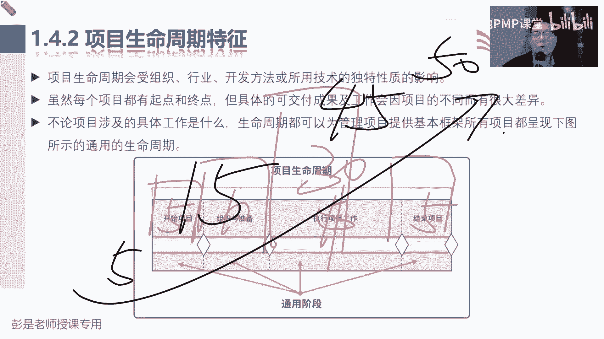

不断上升的，就带出来非常非常经典的一条交叉线，因为整个项目的成本是在不断的上升，不断的积累，所以成本在上升，那么变更的成本加一个字就好记了，变更的成本，变更造成的影响，变更的代价就会越来越大。

还是我们这个工厂工厂都盖好了，都马上装修了，然后老板说呀，咱再加两层地下室啊，对吧，大家就疯了吧就疯了，这推倒重来了吧，变更的代价非常大，那在项目规划的时候，在做设计的时候，纸上谈兵的时候。

画图纸的时候，你想说加两层地下室没关系，为什么呢，因为变更的成本比较低，对不对，所以这是越早改越方便，越早改越省事，这是下面这条线啊，上面这条线是什么，是什么呢，它体现项目渐进明细的特点。

因为项目一开始啊，我们的细节可能不丰富，不细化，不具体，随着工作的开展，会不断的丰丰富，不断的细化，所以在项目早期，这种不确定的程度通常是最大的，也就是风险大，到了项目后期这种不确定的程度。

随着鉴定明细的特点会越来越低，唉风险会越来越小，知道了这条交叉线之后，再想个大道理，到了项目后期不确定的程度虽然很小，风险小，但是风险一旦发生，变成问题造成的影响是大还是小呢，小，风险一旦发生。

变成问题造成的影响是大还是小，是吧，就你家里装修，不知道这墙是不是承重墙，不知道能不能凿咔就凿了，影响大还是影响小啊，大吧，哎就这个道理啊，所以到了项目后期，虽然这种不确定的程度在降低。

但是风险一旦成真，变成了问题，产生的影响造成的后果是大的，对不还是盖工厂，我们要在这个地方盖房子，下面这个土啊，不知道结实不结实啊，那先盖着，等你工厂盖得差不多了，发现这个土啊松软呐，扛不住啊。

这种情况下产生的影响是大的后果，那接下来再思考最后一个小问题啊，这种风险到了项目后期一旦发生，造成的影响非常大，风险一旦发生不就变成了问题吗，到了项目后期问题问题一旦出现，问题产生的影响可能非常大。

打破，怎么破解这个问题呢，就这么想了吧，这个问题呀能不能给他提前暴露出来呢，问题前置，尽早的把问题暴露出来，早发现早治疗，早康复，早发现早解决，因为在项目早期，我们变更的代价比较小诶这就是风险风险。

风险意识，提前识别未来可能会出现的问题，然后想办法尽早的采取合理的措施，让这个问题呀，尽量的让这个风险不要成真，不要发生，不要变成实质性的问题，所以这就是这条线带给我们这么几个，这么几个启发呀。

那再往下说啊，看PPT项目早期信息少，比较粗略，这种不确定的程度大，随着工作的开展，渐进明细信息越来越丰富，越来越细化，越来越具体，但是到了项目后期，这种风险一旦发生造成的影响大，为什么呢。

因为成本在不断的上升，那我们的解决思路啊，就是看看能不能尽早的识别，早发现，早治疗，早康复啊，那最后怎么做到，尽早的识别未来可能出现的各种各样的问题呢，靠的是啥呢，这是玉同学和分割线同学说的这些东西啊。

我们靠的是人呐，希望这些人尽早的加入项目吧，哎变成更高上高高大上的术语参与，我们希望和项目有关的人，尽早的参与到项目之中，这样呢靠的靠大家的经验，诀窍技巧，知识的积累，这些都这些东西啊。

提出我们合理化的建议和见解，这样呢可以让我们早发现，早治疗，早康复需要这些人的知识技能诀窍技巧，所以就是项目经理想办法，想办法找到这些专业的事，找专业的人呐，我们去分析什么时间需要完成什么工作。

完成这个工作需要什么样的技能，找到有这个技能的人，让他尽早地参与到项目之中，然后呢帮助我们尽早的找考虑周全，识别出各种各样可能出现的问题，这是识别风险，然后当尽早的采取这些措施的规划实行。

让这些风险尽量的不发生，少发生好知道这个大道理之后，后面这段教材的文字，大家基本上看一遍就可以了，这涉及到干系人管理，好所以说成本是什么，什么开始低，然后增加，然后回落，这段文字，那就在说阶段性的成本。

然后在项目开始的时候风险最大，随着保罗拉风险会逐步降低，说过了吧，然后在不显著影响成本和进度的前提下，干系人改变项目产品最终特性的能力，在开始时最大，并随着项目进展而减弱，这小文字游戏啊。

说干系人改变产品最终特性的能力，也就是他的影响力，也就是他的影响力就变成大白话，就是我们画图纸呢，领导您说盖几层，我们就画几层，哎您说了算，但是到了项目后期，生米煮成熟饭了，您就不能这么肆意妄为了吧。

哎他的影响力就开始减弱了，因为木已成舟，好知道这个意思啊，所以影响力和造成的影响不是一回事，所以书上这张这张图就该告诉我们说，做出欧巴这就不念了，做出变更和纠正错误的成本，随着项目的完成显著升高。

因为项目后期成本不断积累越来越大。

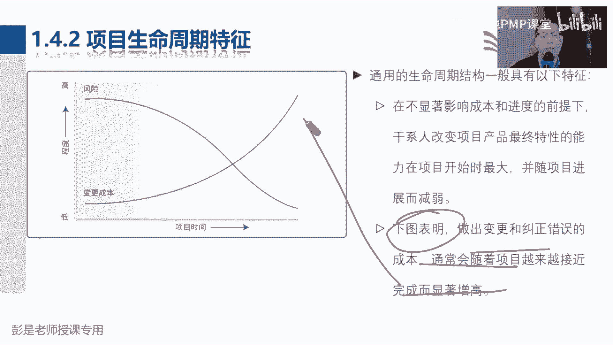

那143带出来一个新的知识点，叫阶段关口，说阶段关口在项目阶段结束时进行，将项目的绩效和进度和业务文件比较，包括商业论证，章程计划，效益计划，然后说根据比较的结果作出决定，到底是继续啊还是终止。

在不同阶组织行业中，阶段贯口可能被称为阶段审查阶段门，关键决策点，阶段入口阶段出口变成大白话是什么呢，看PPT，项目启动之前要搞商业论证，效益计划的制定，这事啊，发起人主导，一旦这个事情有可行性。

有价值，公司才愿意投入人财物，任命项目经理，让我们带着兄弟们完成任务，实现目标，得到期望的结果，通常呢我们可能需要把可交付成果移交给运营，然后刚才又说，为了稳妥起见，为了稳妥起见。

最好呢根据工作性质把项目划划分为N个阶段，这样呢每个阶段有每个阶段的主要工作内容，设计呀，施工啊，打地基啊，盖房子啊，装修啊，打扫卫生啊，这样呢工作更好管，更好管控，有问题呢可以及时纠正对吧。

画图纸的时候尽早的发现问题，不要等到施工的时候再发现，有问题可以及时纠正，可以帮助我们控制风险，降低失败的失败的风险，那刚才这个阶段关口是什么呢，他是说呀我们在阶段之间。

在两个阶段之间要放一个什么东西啊，放这么一个管理审查点，这叫阶段关口，两个阶段之间放一个菱形的小方块，这个菱形小方块干啥事呢，看看书上这段文字能自己总结一下吗，这个菱形小方块做审查，做审查。

他要审查什么呢，下一个看看这段文字。

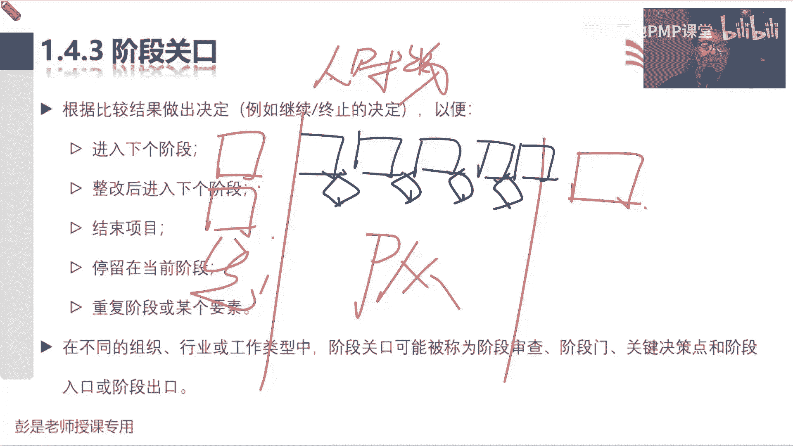

将项目的绩效和这些什么章，商业论证啊，章程啊，计划呀，效益计划呀，做比较，它比较这一大堆的目的是啥，就这两个东西看看是不是一样的，这是理想和现实对对理想很丰满，现实很骨感的，理想是什么呢。

我们的商业论证，项目章程，项目计划，效益计划，这都是我们提前做的构想，对对这些构想和现实情况是不是相一致呢，有没有偏离目标呢，所以它主要分析的还是这两个单词，看PPT啊，用理想和现实做比较啊。

看项目还有没有。

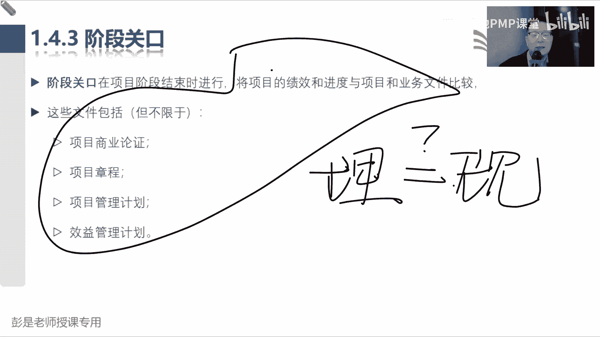

可行性看继续做下去还有没有价值，因为它涉及到商业论证，商业文件了好，所以变成大白话，就是看看这活我们干下去还能不能干，能不能做到对对，然后如果能继续干的话，还赚钱不赚钱，如果不赚钱，咱就及时到止损。

避免干的越多，赔的越多，错的越多呀，这就是阶段关口最重要的作用，所以它仍然是继续分析，用理想和现实做比较，看看项目还有没有可行性，还有没有价值，这就是阶段末，阶段末评审它的主要作用啊。

好那他做出的决策结果，这也不需要大家去背，基本上能看懂就可以，比如说进入下一个阶段，进入下一个阶段，这说明什么可行对吧，既有可行性做下去还能有价值，整改后进入下一个阶段，这说明什么呢。

控制既然能进入下一个阶段，说明还有可信性，还有价值，那为什么要整改呢，就说明有小问题不大，对不对，好在可控的范围内哈，就是能看懂，知道大概什么意思就可以了，结束项目呢就说明这事不行了，停留在当前阶段。

可能形势不明朗，咱先停一停，对比如说烂尾楼对施工设施施工干到一半，企业没没没钱了，先停一停，停一停，放一放，那重复阶段某个要素就是迭代去了，说明这活可能干错了，这了解就够了啊。

好但是讨厌的地方就是什么呢，除外在不同的组织行业或者是工作类型之中，阶段关口可能被称为阶段审查阶段门，关键决策点阶段入口阶段出口，这么多术语记不住啊，亲咋整啊，咋整啊，学习小技巧之一。

你看到这些单词能猜出来它是啥的，比较好猜的，就不要不要去背，阶段审查阶段，门阶段入口阶段出口都带阶段这个词，并且考试的时候基本上就用阶段关口这个术语，然后中间就这个单词不太容易猜，关键决策点。

那就稍稍单独记一下就完事了，单独了解一下啊。

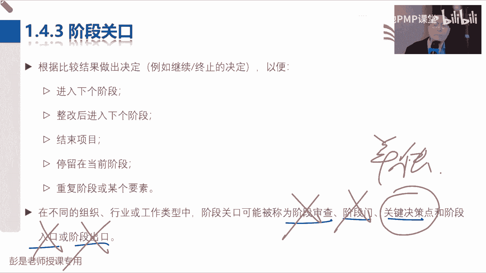

不太需要花时间去背它，好再往下又开始逐步逐步加知识点了，144说了一个单词叫开发生命周期，开发生命周期啊，说可以是预测型和适应型，那项目生命周期通常有一个或多个阶段，和产品服务成果的开发相关。

这个阶段就称为开发生命周期，这个单词了解一下就可以了，比如说随便想场景啊，我项目从开始到结束分为ABCDE5个阶段，其中BCD3个阶段和产品开发相关，那开发生命周期就是BCD就这么简单。

从A到E这叫项目生命周期，项目生命周期之中有几个阶段和产品开发相关，就把它称之为开发生命周期，这了解就够了，那接下来需要大家花时间了解的。

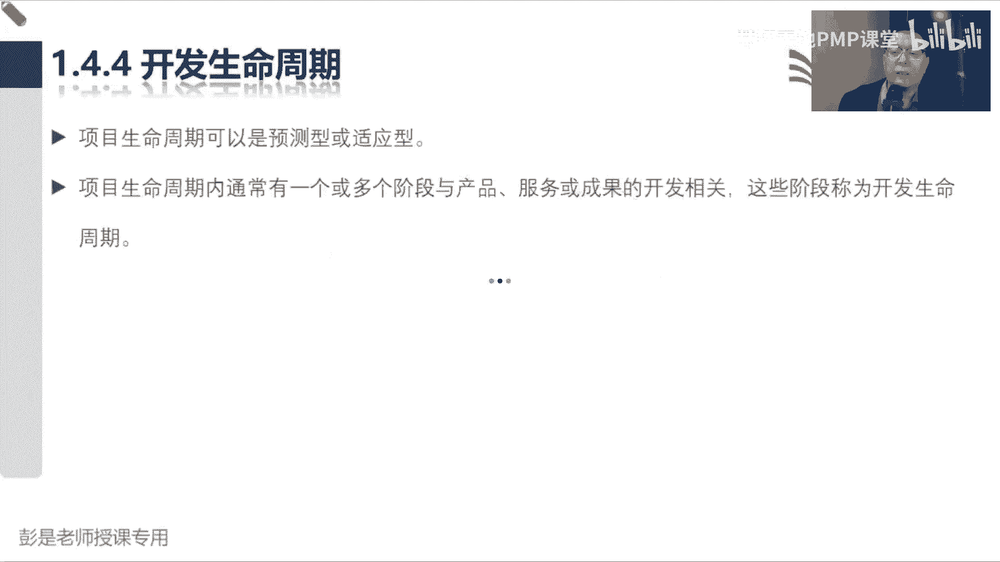

就是这五种生命周期类型，这是一定要掌握的知识点，并且呢大家现在如果如果听不懂啊，记不住啊，没关系，因为后面我们会讲敏捷，讲完了敏捷再翻过头来，回头看这几个东西都不叫事儿好。

先搞定第一个和第四个PPT上哈，预测型生命周期和适应型生命周期，预测学生问题周期，是说在生命周期的早期阶段，就能确定项目的范围，时间和成本，对任何范围的变更都要进行仔细管理，要严格的限制变更。

所以呢它也被称为瀑布型的生命周期，那敏捷适应型生命周期属于敏捷型，迭代或增量型，它是详细八段，后面什么什么详细范围，在迭代开始之前得到定义和批准，适应型生命周期也称为敏捷巴拉拉带场景。

粗暴的让大家理解预测型和适应型，它工作方法不太一样。

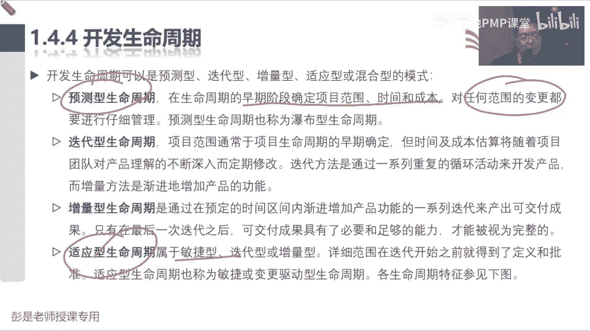

粗暴理解啊，所以看课件，什么叫预测型呢，在项目早期我们就能够确定项目的范围，精度和成本，也就是说范围是确定的，范围是确定的，这种情况下，我们就12345该干啥干啥，严格的按照我们生命周期阶段去干活。

然后呢，每个阶段产出的成果要移交到下一个阶段，每个阶段中产生的这些文档啊，资料啊，图纸啊，要移交到下一个阶段，所以它的结构看起来特别特别像瀑布，那就被称为瀑布型生命周期，那敏捷的特点是什么呢。

项目的需求啊，范围啊，不定需求范围，如果不确定，我们还12345按照阶段把这些工作去完成，就会导致一个什么问题啊，到了项目后期再提出一点新的需求，新的想法变更的代价非常高，变更的成本非常高，我们扛不住。

那怎么办呢，就需要改进这个游戏规则，所以接下来听场景，听场景说呀，在项目早期，我们就能够确定范围，确定时间，确定成本，那换句话说，我们成立的成立的梅菜梅菜扣肉工厂，我们要盖工厂，工厂建设，工厂建设啊。

如果老板啊给了你一个策略，抄隔壁村那个工厂有啥咱就抄啥，他车间多大，咱就弄多大，他用什么设备，咱就买什么设备，他怎么布局，咱就怎么布局，他从哪进货，咱就从哪进货，给我抄一个一模一样的工厂出来。

用什么生命周期类型，范围是确定的吧，唉就用预测型生命周期范围是定的，工期也能大概一拍脑袋定了成本，一拍脑袋就定了，这种情况下我们就可以做到什么呢，叫一次交付，就纯粹的以结果为导向，对不对。

抄一个一模一样的过程中呢，我也不想参与，也不要给我画图纸，不要让我来看了，只要你画的和那个人家实际工厂一模一样，就完事了，最后我就看结果，工厂盖好了，再叫我看看布局啊，装修啊，面积啊是不是都一样。

只要一样没关系，咱就交钱，所以就叫结果可预测，所以他就用了预测型生命周期这个单词啊，这是这样的场景好，那如果现在啊老板说呀，我们现在呀不抄，我们要创新，我们0~10到一，什么心智生产力，智能制造好。

什么，大数据噼里啪啦用到我们工厂里啊，我们要弄一个现代化的，智能化的，全自动的，超牛的这样一个梅菜扣肉车间，这种情况下风险大不大，我们把这些高科技的东西噼里啪啦往上一装，老板您来看吧，工厂盖好了。

风险大，那怎么规避风险呢，怎么规避风险啊，刚才我们生命周期从开始到结束分成N个阶段，是一种规避风险的方法吧，对不对，我们有一个阶段帮助你做工厂的规划和设计，然后这些规划和设计啊，把这些图纸都给您画好。

您看看效果图啊，施工图啊，各种平面图啊，结构图啊，满足要求，我们再去打地基，打完了地基，我们再盖房子，盖完房子再装修，唉我们来交付可以规避风险，但是做设计的时候，现在我的需求确定吗。

我也不知道什么区块链啊，人工智能啊，我就听说啊，能不能用，我也不知道啊，用什么设备呀，平面怎么布局啊，什么工厂啊，不知道没没没概念，这种情况下，如果需求不明确，这活儿你咋干呢，分解，这种情况下。

如果需求不明确，咋找，在想我们是一次把所有图纸都画出来，您来看一看，还是说先画一个，您看看是不是这个意思，没啥问题，我们再画第二个，因为你需求不定啊，因为你都没概念了，大家听完了也没概念呢。

那稳妥起见哎，就是做一点确认一点吧，做一点确认确做一点确认一点，做一点确认一点，他有什么好处呢，周期长还是短，周期短，周期短，做一点试一试，做一点，您看一看，周期短，周期短有什么好处啊，成本低，成本低。

最后我们试错的代价就小，所以他就叫以最小的代价去试错，甚至随便找一张草稿纸，我都不拿c cad画图，随便找一张草稿纸，用手画，用手绘，您看看这个意思对不对，如果没啥问题，我们再进一步的细化。

再做下一个事情，以此类推吧，总之需求不确定的情况下，我们就小步快跑，想办法缩短工作的周期，缩短工作的周期，尽早的做出一个小成果，来让人家来看一看这个东西是不是满足要求，周期越短，我们的成本就越低。

成本越低，试错的代价就越小，所以它就叫以最小的代价去试错，这就是敏捷他的一个思维方式，好知道了，这个大概意思啊，咱再随便带场景，就像大家天天吃饭这个事，你去餐厅吃饭啊，餐厅推出了一个新的套餐。

什么麦当劳啊，我们有一个汉堡，配一个新口味的薯条，配一个新口味的炸鸡腿，配一个新口味的饮料，这四个玩意儿你从来没吃过，这四个东西从来没吃过，我告诉你，他卖15块钱，怎么以最小的代价去试错。

都是都没吃过一次花15块钱，万一发现A不好吃，哎呀废了发现B不好吃，废了发现C不好吃，废了，对不对，那以最小的代价趋势错，怎么做呢，一个一个吃吧，先买一个A吃一吃，看看好吃不好吃。

得到了一个心得体会嗯然后如果发现不好吃，咱就不要了吧，这个套餐你就去死吧，再也不吃了，你最少带大家去吃错了吧，如果A吃完了觉得还可以呢，再再吃一个B诶，再来个C再来个D，这就是用最小的代价去试错。

因为买一个周期短对吧，成本低，试错的代价小，那这四个东西啊，如果吃完了之后发现都好吃，下次你怎么买，整个套餐就一次交付了吧，就不需要这么啰嗦了，对不对，就可以做到一次交付了，因为什么呢，结果可预测。

我知道这东西我吃过好吃就买套餐就完事了，所以它就取决于这个东西到底稳定不稳定，确定不确定就叫需求，如果我们的需求明确，那你也就是说范围是明确的，我们就可以做到一次交互，比如说参考借鉴抄这种场景。

那如果需求不太确定不太确定的情况下，一次把所有需求都完成，万一人家提了一些一些想法，变更的代价词就上去了，那为了稳妥起见，这么多的需求啊，干一点试一试，干一点试一试，想办法缩短工作的周期，周期越短。

代价越低，就用最小的代价去试错，它就是不断的迭代加增量，迭代指的就是循环，增量呢就是增加了产品的功能，好他就是为了控风险，就是为了控风险，因为听完这个场景，2ABCD套餐卖你15块钱。

然后如果是一个一个买一个一个买，总体成本是大于15还是小于15呢，大于11，总体成本反而比预测型的要高，但是它可以有效的规避风险，对不对，是为了控风险，就是因为不确定，就是因为需求不确定，如果需求确定。

那就直接预测性，因为成本低，总体成本是低的啊，好知道这个思路现在掌握到这个思路就够了。

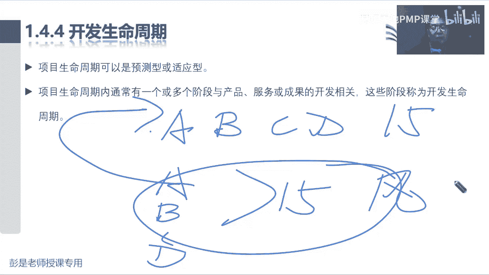

所以书上这段文字呢，现在呀大家复习的时候了解一下就可以了，这叫预测型生命周期，再看一看，说早期确定项目的范围，时间和成本，对范围的任何变更都要进行仔细管理，为什么呢，因为项目的成本在不断的上升。

那变更的代价可能越来越大，所以我们要严格的严格的管理好这些变更，那敏捷型适应型说就是敏捷，说详细范围在迭代开始之前得到了定义和批准，然后呢我们不断的他没说后半句啊，不断的以最小最小的代价去试错。

什么叫详细的范围呢，就是啊ABCD4个东西都没吃过，第一次迭代看看先吃啥，这时候再定义这一次迭代的范围，比如说先买个A，第二次迭代开始的时候，我们再去分析现在应该买什么呢，比如说买个C。

所以他在每次迭代的时候，确定这次迭代到底干啥事，知道这个意思OK了，具体的实践方法等咱讲完了，第二部分和第三部分，第二部分是基于过程的项目管理方法，第三部分是敏捷多变的项目怎么玩诶。

就是敏捷这个游戏规则，再翻过头来复盘就简单的多了，看同看同学这个问题其实挺好，但现在怕讲开讲，大家脑子跟不上说呀，有些问题并不是第一步暴露出来的，有可能是到C才发现行不通，结果呢AB的时间成本也浪费了。

好还是那就这个话题继续往下说了啊，ABCD这四个东西你要优先尝试，最确定的还是最不确定的，你优先尝试最确定的还是最不确定的，先把风险最大的先给他施了呀，对不对，确定的你还试他干啥，就这个道理吧。

先把这个风险风险最大的东西先给他长，往前透露透露，对不对，所以要要以风险价值，工作量规模复杂程度，各种因素对ABCD排序，排序思维贯穿始终啊，优先尝试哪一个东西，优先尝试最不确定的东西。

这样呢试错的代价更小，好太细了啊，就拉回来再看大的大的框架，好吃货脑子啊，想先把好吃的吃了再说呀，咱们不是为了探索吗，不是为了试错吗，对不是为了吃饱肚子啊，不是为了吃饱肚子。

吃饱肚子你就吃你吃过的东西就可以了，对不对，是为了试试这四个东西，好吃不好吃好，那再往下迭代型和增量型，它实际上在工作中啊，它用于应用于不同的场景，迭代型通常用于什么呢，需要大家教材上可能写的。

现在不详细说，我们早期学电影巴拉吧，总之还记结论啊，它通常适用于我们的技术方案，不确定，所以才需要反复探索，反复尝试，尝试不同的解决方法，就是工作，所以就想想一想前面说的那个面和水，面多了，加水水多了。

加面找到一个合适的配比，这不是技术方案吗，就这叫迭代，医生给你看病，是不是迭代，先吃个这个药不好使，再吃这个药再不好使，做手术打点滴，对不对，探索一个正确的解决方案吧，直到送你走，就这道理棒。

这就是通常适用于解决方案的不确定，那我们需要反复尝试，反复尝试去进行技术技术方案工作的探索，那增量通常适用于什么样的不确定呢，你看他写的是渐进增加产品的功能，为什么不是一次把所有的功能都做出来呢。

那就是需求的不确定啊，所以增量型这种生命周期类型，通常适用于需求的不确定，需求的不确定能想到啥，就像各位同学看身材也能看出来啊，今天晚上我媳妇跟我说，咱家吃饺子，你能吃多少个，不知道，那怎么办。

先煮100个唉，吃不了就浪费了吧，怎么办呢，十个十个煮对吧，再稳妥起见，五个五个煮最安全的做法就是一个一个主，对不对，总体成本虽然浪费时间，浪费火，总体成本虽然高，但是呢可以不浪费。

以最小的泰家军事所知道这个意思啊，所以尤其是搞产品设计的，为什么有的产品有的产品会出，不断的不断的在增加功能呢，就是因为需求不确定，所以不求大而全，不求大而全，我们公司要做一款新的游戏。

我们竞标对手王者荣耀或者是什么英雄联盟，上了一下就把人家所有功能都做出来，这有必要吗，没必要吧，哎那我们要打造一个最小的可行性产品，其不求大而全，但求小而美，先做出一个核心的核心的。

能满足我们业务需求的东西，再来不断的在此基础之上去增加功能，满足不同人群的需要，听一听，知道这个意思就够了啊，但这东西呀拐弯拐多了的话，听一遍就完事了啊，咱国内拍电视剧是一个什么样的工作模式。

大家了解过吗，咱有一个制度，咱有一个制度，你拍完电视剧要干啥，审查审查吧，哎对对，审查周期可能长的长的10年八年，审查不过的很常见吧，短的快的一年，这都算快了，嘿那我们能不能拍一集审查一下。

拍一集审查一下不行，对不对，所以在国内拍电视剧，那也没办法一次把所有的齐聚集对吧，第一集，第二集，第三集，第四集一次把所有的电视都拍出来，剪辑完了之后，送审审查通过了，我们才能去播放。

但国外的电视剧怎么拍的，你为什么要追剧呢，他一周两周出一级新的吧，为什么呢，他要干啥，看大家的反应对不对，为了保证收视率，为了保证大家都开心，都满意，都喜欢，对不对，你说谁死，我们就把谁写死啊，对不对。

所以他为了为了规避风险，就这模式吧，它没有这个审查制度，对没有咱国内这么严格，那怎么办呢，他不就是迭代加增量了，因为需求不确定，那我先拍一集放一下，对不对，然后看看观众的反应，根据观众的反馈。

看看剧情怎么发展，现编现拍现写，就这道理啊，这是国外的工作模式和国内的工作模式，因为商业环境不一样，所以要采取不同的生命周期类型，以此类推，所以实际上作为项目经理，我们就是从宏观到微观上到政策。

法律法规，商业环境，竞争对手，行业分析，企业情况都给他分析透了，然后再分析要采用什么样的生命周期类型，因为有些环境下你没有办法只能做到一次交付，没没招儿没招儿，对不对，有些情况下呢就可以小步快跑。

不断的增加一些功能，增加一些功能，来确认是不是满足用户的业务需要嗯，都是需求不确定啊，适应型和增量的区别是什么呢，适应型也就是敏捷，它通常适用的场景是什么呢，叫技术啊，也不太确定，需求呢也不定，记住啊。

这个四用词叫不太确定，不太确定，技术不太确定，需求也不太确定，所以我们才需要不断的迭代和增量，敏捷的游戏规则就是迭代加增量，只不过迭代周期短短到什么程度啊，这位同学知道吗，在敏捷的开发模式下。

这我们这个迭代周期啊，多长啊，多长时间迭代一次啊，它通常小于四周，并且现在互联网大厂基本上就三四天吧，节奏快啊对吧，单周啊，双周啊，要保持这个高节奏啊，嗯周期越短，试错的代价越小好这就是敏捷。

这就是关于这一小段这一小段知识点，那其实啊适应型生命周期，说刚才叫需求不太确定需求啊，技术不太确定，需求不太确定，那如果技术和需求都极其不确定咋整，真的是做一个梅菜扣肉工厂，什么区块链，人工智能。

全网力抓捕，这是神经病，这项目不不不建议做，不建议做哈，科学家告诉我们，这事儿少碰，这事少碰，或者你把一方面给他稍微确定一下，对不对，如果极其不确定，尽量的尽量的考虑周全。

所以这两天上热搜那个新建大家有了解吗，他是用的哪一种生命周期类型呢，视频不知道可以啥，就那个马思马克思，他兄弟马斯克人家干的什么活儿啊，学费发射火箭，对不对，然后什么回收二次利用。

然后想想办法想办法弄多少个猛禽发动机，噼里啪啦，那火箭啊又又快又稳的，然后我们未来奔赴火星啊，他是技术方案不确定，所以他的工作模式就叫迭代，对不对啊，点一个弄一个火箭，放天上试一试，获得一些反馈。

再弄一个火箭，不断的探索，不断的探索一个确定的解决方法，所以虽然火箭爆炸了，可你看媒体就能看出来，有的媒体会说人家失败了哦，给他一刀，home mok对吧，又失败了，火箭又炸了。

但你看看国外的媒体是怎么说这个事的呢，离成功又近了一步吧，为什么呢，他们又发现了一些问题，对不对，发现问题纠正问题，发现问题纠正问题，人家这个项目的目的就是探索，而不是为了成功，对对动机不一样的。

所以透过现象看本质啊，人家的动机就是探索一个合适的解决方法，炸了很正常，不炸不炸才才问题大的一次成功了，下一次很可能就失败，对不对。

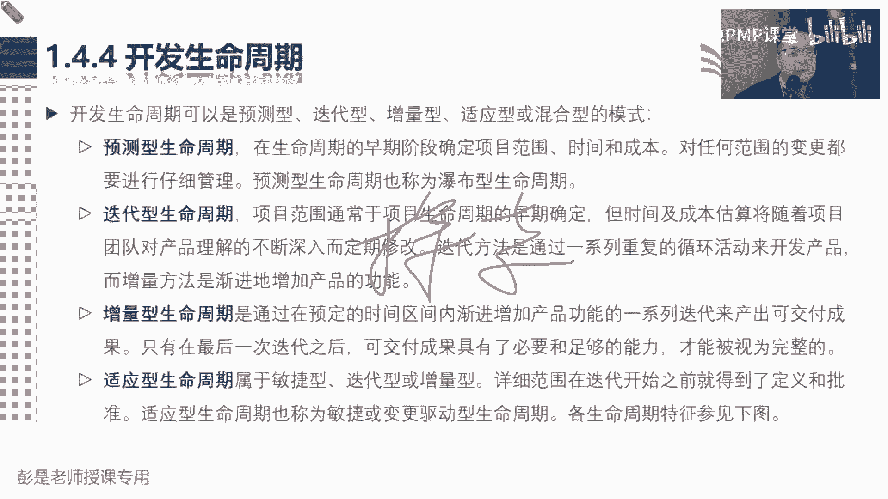

所以他就是试错好，听一听这段话搞定啊，那再往下书上给了这么一张表，这张表呢中间其实可以不看看看左边看看右边，并且呢也没需不需要去记住它啊，说预测型生命周期需求在开发前预先确定，通常就适用于超这种场景。

所以大家参考手机里边，陪了我们好几年的那个健康码，健康码刚出来的时候，用的是什么生命周期类型啊，刚出来的时候，这个健康码未来有什么样的功能需求，确定吗，不确定，但是要求什么呢，快尽快的把这东西做出来。

对不对，就用敏捷的这种工作模式吧，四天就出一个版本，让大家能定位，然后随着疫情的发展，不断的不断的快速响应，所以呢需求在交付期间频繁的细化，频繁交互对客户有价值的各种自己，今天出个行程。

明天出个扫码登记，后天出个老油代茶，后天出个查核酸，快速交付给对用户来说有价值的产品，服务或成果，因为它周期短，所以变更的代价小，就可以实时的把变更融入项目，那就需要我们的保安卫健委，疾控中心。

包括我们个人呐持续的参与其中啊，大家都反馈那个放照片好丑啊，换照片啊，人家啪马上就响应了吧，就这个道理啊，主打一个快，那什么情况下健康码用预测型生命周期呢，和平的嗯，什么情况下健康码用预测性生命周期啊。

说需求我们确定了，我们一次交付，尽量的不要改啊，就这种抄的场景吧，比如说哎，在其他软件上实现移植微信健康码之后，觉得做的挺挺好的，我们弄到支付宝里弄一个一模一样的，弄到小红书里做一个一模一样的抖音里面。

快手里面做一个一模一样的哎移植，那就是需求确定抄一个一模一样的可以了吧，嗯或者是某些地区推出了一个好功能，我们其他地区抄一下，借鉴一下，对不对，他就适用于这样的场景，超需求明确就可以一次交付。

所以只看左边和右边啊，中间迭代和增量，它的迭代周期就是大于敏捷里面的四周，它的节奏会更长一点儿，两到三个月增加一些功能，就是稳扎稳打这样的工作模式，所以大家现在看看我们现在手机里的微信。

是不是在定期的推出一些新的产品，服务或成果呢，对不对，就是稳扎稳打了吧，他现在也没什么竞争，一家独大也不需要太多的快速响应，那就定期的推出一些新的功能来迎合市场，满足客户需要就可以了。

这就是中间的迭代加增量啊，这张表左边右边要听懂好。

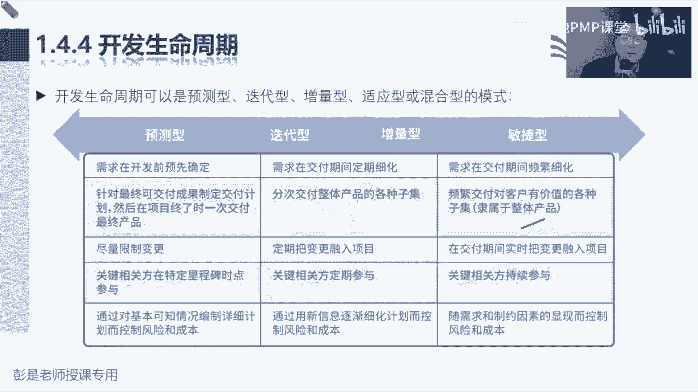

最后混合型生命周期，这基本上送混合型就是混用纯粹的字面意思，所以再看PPT，现在要求各位项目经理主打一个灵活，灵活到什么程度呢，我们要去分析，从项目开始到项目结束，可以分成多少个阶段，便于我们管理控制。

便于我们规避风险，然后呢继续要分析这个阶段的需求，明确不明确呀，这个阶段的方案，技术方案，解决方案明确不明确啊，该迭代的就迭代，该增量的就增量，实在不行，那就迭代加增量敏捷，如果需求明确呢，就预测性唉。

所以就是混合，有的阶段可能采用预测性的方法，有的阶段呢可能采用敏捷的方法，有的阶段呢可能得需要增量，有的阶段可能需要反复迭代，总之加到一起就叫混合，主打一个灵活，好知道这个意思啊。

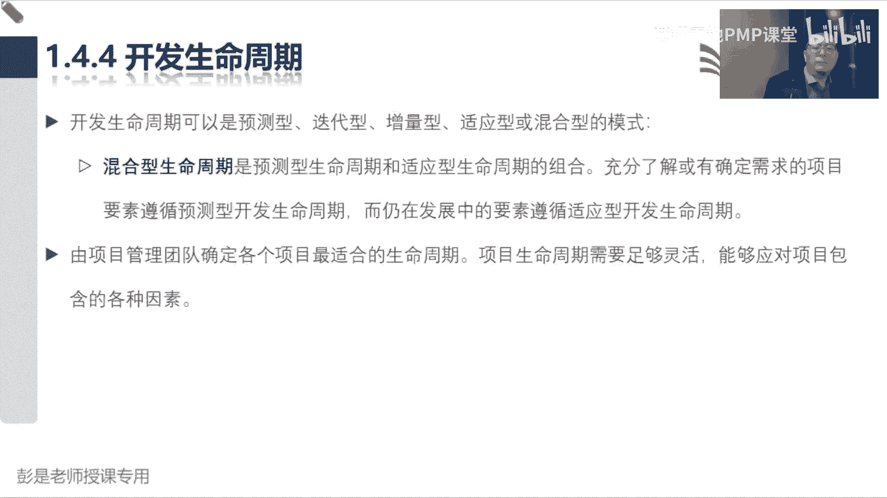

那再往下145项目管理过程，这段文字啊其实可以不看了，因为下次上课我们主讲的就是十大知识领域，五大过程组，49个管理过程，可以不看了啊，那什么叫管理过程，这是大家干活是不是都需要有一个过程啊。

对不叫外卖，还有个过程吧，打开美团app，选餐厅，选菜品，你交钱都有个过程啊，那现在我们管项目仍也也这个道理，在干这些事情都有一个过程。

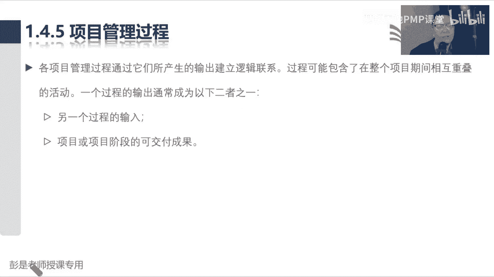

所以就叫管理过程，然后后面这段文字全都不念了啊。

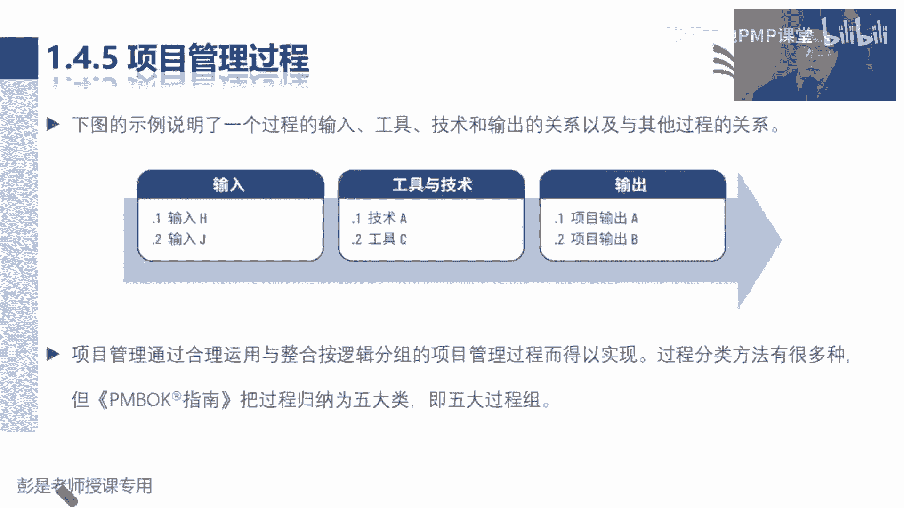

找找找找找，找到1。4。6，各位同学坚持听啊，听完这小段课程又可以休息啦，最后一个小挑战，好项目管理过程组，其实前面讲过了，说我们有一个底层逻辑是什么呢，PDC对吧，就有了规划过程组。

执行过程组和监控过程组，那规划过程组他的主要工作很好猜，这是做计划，所以明确项目范围，优化目标，为实现目标制定行动方案，就是计划，执行过程组呢就是计划制定好了，按照计划去执行，纯粹的字面意思。

这都不用去记，不用去记得啊，监控过程组，监控过程组两件事，一件事啊，用理想和现实做比较，这叫什么呢，看绩效，用理想和现实做比较，看绩效啊，原计划今天今天应该生产10万袋梅菜扣肉，结果实际上有人请假。

然后中间还停电，导致今天生产了8万袋，少生产了2万袋，哎就是看绩效用理想和现实情况做比较，第二呢就是管这个讨厌鬼变更，看看有没有哪些为将将要发生的变更，看看有哪些已发生的变更。

今天生产了10万袋梅菜扣肉，结果呢有8万袋都破口了，需要返工，有两有2万袋里边那个那个没放盐，以此类推反攻，这都是已发生的变更，和未来可能可能未来可能发生的变更，所以叫管绩效管变更。

那搞定了规划执行监控，再看启动过程图啊，他是这么说的，说，定义一个新项目或者是现有项目的一个新阶段，授权，开始该项目或阶段的一组过程，收尾过程组呢就是正式巴拉拉做做善后工作，授权是什么意思，啥叫授权啊。

嗯啥叫授权啊，老板点头，差不多，上级对下级做授权吧，就是批准他就是批准你买了飞机票，到了机场能直接自己就上飞机了吗，不行需要干啥呢，得到授权吧，对这这航班呐，原计划12点起飞，到点了能自己就飞吗。

不行需要等塔台的通知通知对吧，您可以开始起飞了，得到授权，就这道，这就这个道理啊，所以就是就是批准，那为什么开始项目或者是开始项目的一个阶段，需要批准呢，再看PPT。

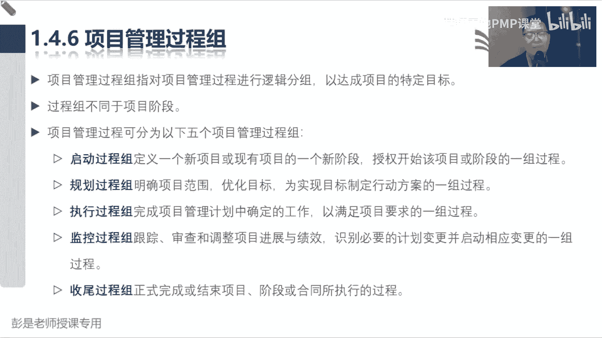

随便讲大道理大道理啊，等我找到空白页，我们要盖这个工厂，现在粗暴两个阶段，一个阶段是做设计，一个阶段是，做施工原计划呀，三个月后开始施工，那工人到了第三个月的第一天，能自动就开始打地基了吗。

不能为什么呢，因为设计图纸有没有通过评审呢，不确定了吧，唉所以我们需要授权授权授权，听通知，听信号等口令，就这道理，因为前一个阶段的工作，通过阶段贸的评审检查这个阶段工作的正确性，完整性没啥问题了。

然后呢我们还有一个重要的阶段关口，再看看我们项目有没有可行性，有没有价值，如果又有可行性，又有价值，才会通知我们开始施工吧，就这个道理吧，唉所以授权授权授权这玩意儿无处不在，那开始每个阶段再抽象一下啊。

我项目有ABCD4个阶段，每个阶段开始的时候都需要得到授权，每个阶段开每个阶段的工作要不要做计划呢，每个阶段都要有工作计划吧，怎么画图纸啊，怎么打地基呀，怎么装修啊，都要有工作计划，规划好了之后呢。

按照计划去执行，就都有了，D就这么写了啊，执行的好与不好呢，又都有C兼职，看绩效管变更，那每个阶段完成的时候，要不要做收尾呢，社会干啥呢，总结归档，然后把当前阶段的成果移交到下一个阶段，就是图纸画好了。

交给你们，你们施工去吧，地基打好了，交给你们，你们盖房子去吧，房子盖好了交给你们，你们装修去吧，哎把阶段的成果移交到下一个阶段，这就是收尾过程组的主要工作，总结归档和移交，所以最后的结论就是啊。

项目从开始到结束，我们可以把它分成N个阶段，在每个阶段之中都有五大过程组叫启动，规划执行监控，收尾启动是开始这个阶段，收尾呢是总总结归档移交，那这个阶段的工作到底怎么干呢，就是规划执行和控制嗯。

现场谁在回答呀，我们现场有好几万人同学啊，嗯我们线下线上相结合好。

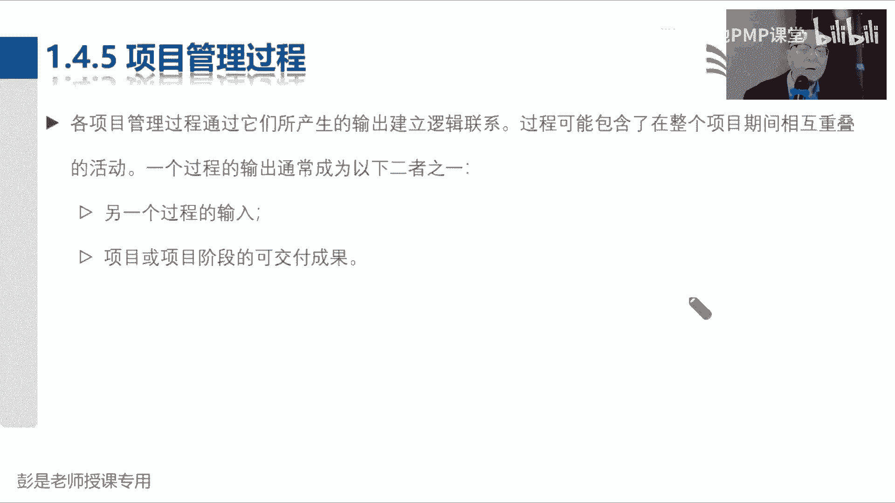

知道了这个大道理就可以了啊，所以再往下书上就在说，五大过程组的主要工作重心听一遍，这基本上也很难忘吧，唯一可能，稍稍需要记一点的，就这两个单词启动是为了授权监控，除了管绩效，还要管变更。

其他的都是字面意思，最后再加一个小小的知识点，启动规划执行监控收尾，这叫五大过程组，这五大过程组啊，我们又给它起了个名字，叫什么呢，它叫管理工作的生命周期，它和项目生命周期不是一回事。

项目生命周期是我们干活的一些实质性的工作，管理生命周期，那就是管理工作有效分成，启动规划，执行监控收尾这么一套逻辑，所以它是项目管理的生命周期，全书叫生命周期的，就四个单词，项目生命周期，开发生命周期。

项目管理，生命周期和未来要掌握的产品生命周期，先停一停就完事了啊，这块记住项目管理的生命周期。

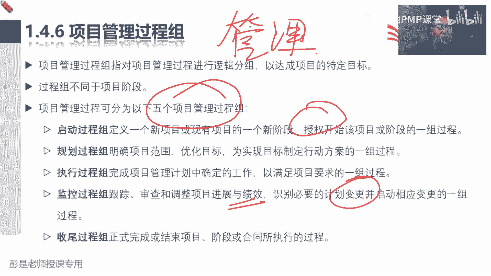

这是五大过程组嗯，好接下来1。4。7，项目管理知识领域，这段文字呢大家后面复习的时候可以不看了，因为咱们后面课程主要讲这十个知识领域，这十个知识领域咋记啊，有技巧啊，听一听听一听。

五大过程组这个记忆的技巧不需要分享吧，嗯启动规划，执行监控收尾，一共十个字，没什么挑战性啊，你你们之前有学长挺好玩，你们之前有学长说老师啊，五大过程组总总也记不住啊，然后呢我就写了个顺口溜。

我一看那个顺口溜二十二十几个字，没有性价比了啊，这不需要刻意的去背，那十大知识领域，怎么尽快的记住它呢，项目的目标有四个东西叫啥来着，多快好省就记住了，范围进度成本质量多长时间花多少钱。

产出什么样的产品，服务或成果，达到什么样的质量标准和要求，都快好省，在多快好省的基础之上，又提到了六大制约因素，六个制约因素啊，就是多快好省，再加一个什么东西呢，资源因为资源数量的多少。

资源的水平和等级可能会直接影响到进度，成本和质量，就是牛牛人可能干活又快又好对，然后初级员工干活可能又墨迹又烂，成本又高，以此类推啊，加上一个资源，最后呢再加一个风险，因为多快好省。

加资源都可能引引发一系列的风险，这就变成了六个制约因素，相互制约，相互限制，多快好省，加上资源和风险，最后呢再考虑啊啊资源是我们项目组的成员，那你要不要和客户打交道呢，要不要和领导打交道呢。

所以呢再加一个干系人管理，他更侧重于管这些，除了员工之外，除了项目组成员之外，这些外部的这些人加一个干系人，那和人打交道打交道得沟通吧，项目经理主要工作就是沟通，组织协调，所以再加一个沟通管理。

最后呢加一个什么呢，你干活不得买点东西嘛对吧，房租水电桌椅板凳设备设施，该买的买，该租的租啊，所以呢再加一个采购管理，这下面就共同构成了九个子知识领域，最后盖一个什么东西，盖盖他们的大帽子。

咱大家有人管这范围，有人管进度，有人管成本，有人管质量，咱不能各扫门前雪呀，我们这些东西呀牵一发动全身的，所以呢我们需要有人站出来，从更高层级去进行整合，对不对，确保大家能够有序的，有组织的相互协调的。

帮助我们更好地完成任务啊，所以最后多了一个整合管理。

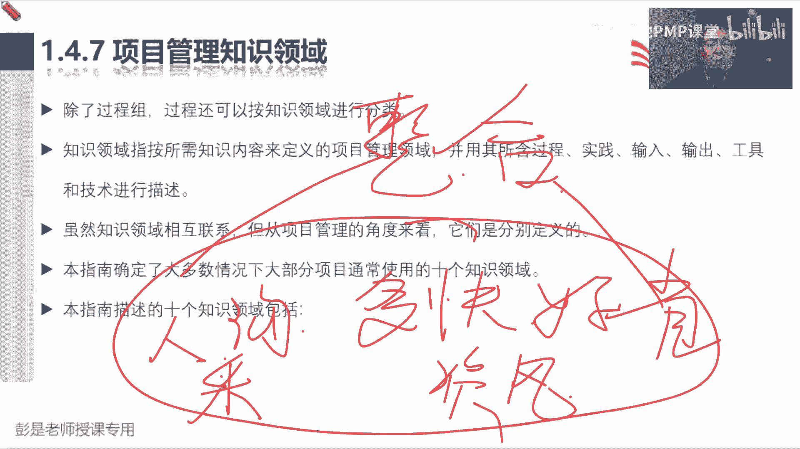

共同就构成了咱们基于过程的项目管理方法的，非常核心的十大知识领域，五大过程组，还有中间的49个，一大堆乱七八糟的管理过程，输入输出工具基础这些都听一听啊，等讲完后面第二天，第三天，这就基本上没有挑战了。

现在大家第一次听可能会有点费劲，好最后教材又给我们最后一个小细节，这个细节不需要背的啊，就是纯还是那三个字叫什么，看情况，因为这两天出的这个新闻大家也听过了吧，天然气康炸了哈。

那要不要考虑这个呢对吧要不要考虑这个呢，天天吃梅菜扣肉，要关心员工的健康啊，现在不仅仅关注员工的肉体的健康，还要关注员工心灵上的健康对吧，EAP这种东西搞搞心理建设，搞心理建设啊。

因为这个什么大家Emo啊，躺平啊，什么什么抑郁啊，自暴力倾向啊，这玩意这玩意也挺吓人的啊，所以我们要根据项目的情况，在此基础之上之上，在此基础之上增加一些其他的知识领域，比如说环境管理呀，安全管理呀。

健康管理呀，卫生管理呀，以此类推，那教材里面列出的十大知识领域，只是说大多数项目共有的一些东西，我们要根据项目的实际情况，在此基础之上做调整。

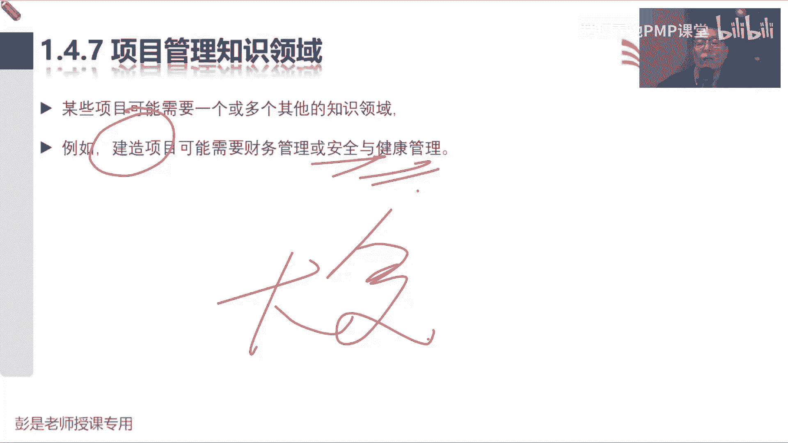

知道这个意思啊，好这就是整个五大过程组十大知识领域。

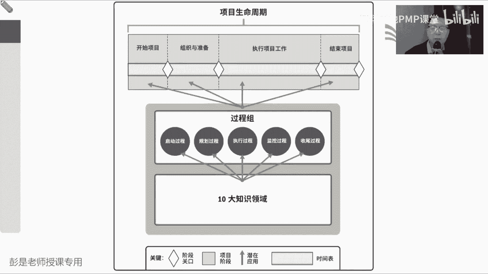

这个这个这个来龙去脉，那接下来各位同学重大利好，现在15。22，咱再休息8分钟，休息到15。30，好各位同学准备好了，还有20秒钟时间，还有五秒钟时间，543210好，接下来再往下就能看到这张图。

这张图也没啥可说的了。

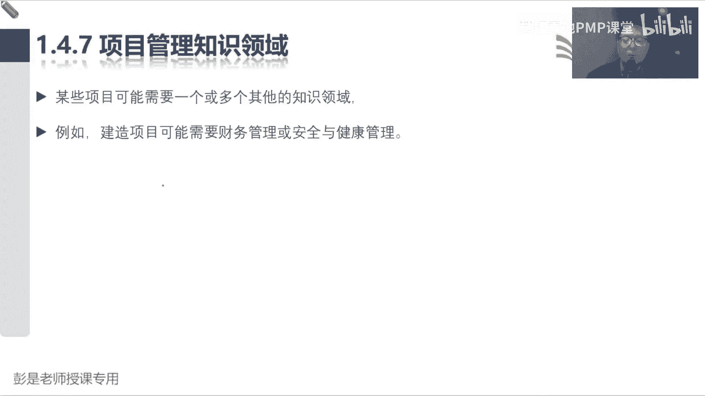

这是反复刚才给大家说的那个结构啊，我们从项目开始到项目结束，为了更好管理，为了有问题及时纠正，为了降低失败的风险，为了稳妥起见，所以呢我们把项目生命周期从开始到结束，分成了N个阶段，那为了保险呐。

为了保险，在阶段之间放一个菱形的小方块，作为阶段关口来分析项目还有没有可行性，还有没有价值来进行决策，决策是不是要进入到下一个阶段，然后在每个阶段之中都有五大过程组，因为一旦批准，一旦批准得到授权。

我们就开始某一个阶段的工作，所以呢有了启动过程组，然后每个阶段的工作都需要规划，执行和控制阶段，工作完成需要总结归档移交，就有了收尾过程组，那每个阶段之中都有十大知识领域，哎这就是说的这个解构关系。

再看一看就可以了啊。

148又来了，新的知识点叫项目管理的数据和信息，说我们在整个项目中。

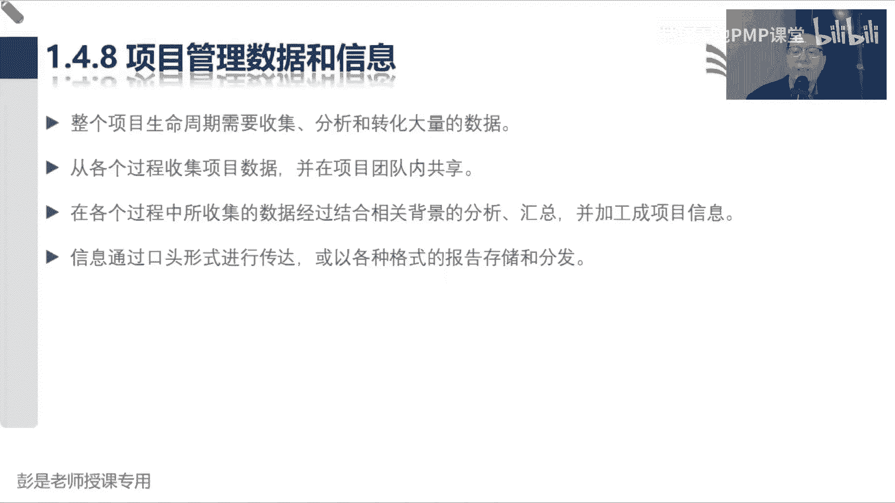

项目之中，我们要收集三个这部电脑，主要是这三个单词，工作绩效数据，工作绩效信息和工作绩效报告，这三个玩意儿是什么关系呢，接下来听逻辑看PPT啊。

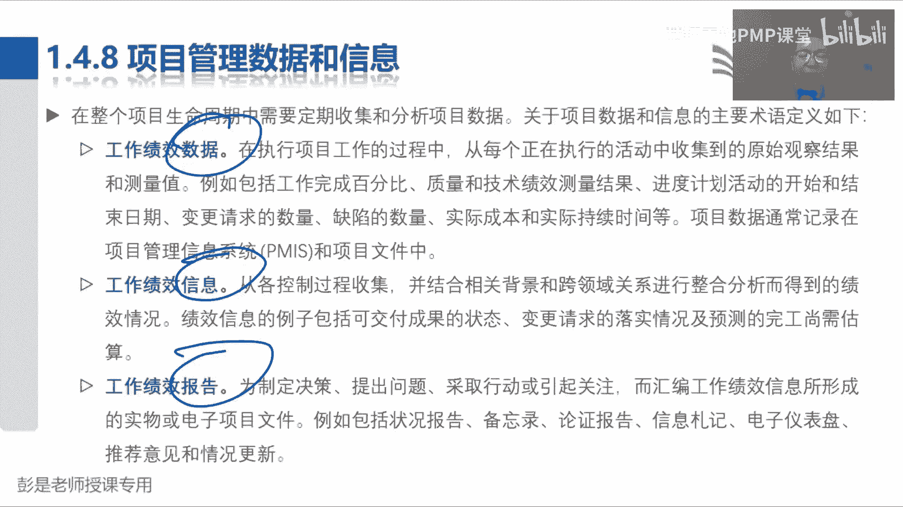

逻辑是这样的，这是我们的梅菜扣肉工厂，食是食物链的顶级是厂长，厂长下面呢有人管生产，有人管采购，有人管销售，有人管行政，这是我们各个部门的部门经理，部门经理下面有什么呢，张三李四王五赵六。

这就是我们最底层的员工，那刚才这三个单词想体现什么逻辑关系啊，写错字了，刚才那张图没找到啊，不重要，员工每天干了什么事情，要写啥，就像大家工作中每天要写啥呢，日报对不对，来告诉领导。

我们每天干了什么事情，那这个日报所有员工的日报直接交给厂长吗，这厂长得累死啊，对不对，要三两个人还好啊，如果企业有规模，厂长就累死了吧，所以需要逐层汇报，所以员工每天做了什么事情。

要把这个事情啊汇报给部门的管理者，那部门的管理者干什么事呢，总结归纳概括，分析评估变成整个部门的工作情况，部门的工作情况在网上交给谁呢，厂长厂长拿到各个部门的工作情况，再经过他的总结归纳概括分析评估。

就变成了整个公司的工作情况，那刚才这三个单词就是这样一个逻辑关系。

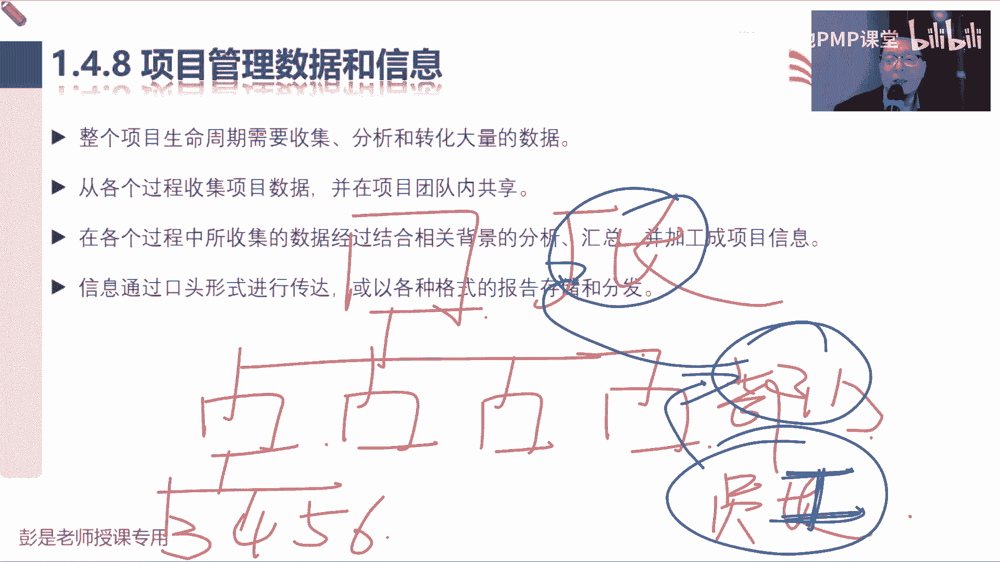

我们每天干了什么事情，产出的原始的东西就叫工作绩效数据，它还没有经过任何的分析和加工，那这个原始的工作绩效数据啊，不直接交给项目经理，因为我们需要交给各个部门，那对于项目上，各个部门各个部门粗暴理解了。

高高在上，下边有九个大臣，这几个大臣哪有人管范围，有人管进度，有人管成本，有人管质量，资源沟通风险，采购相关方就有了下面九个子知识领域，所以工作绩效数据交给九国大臣，由九个大臣把它变成每个知识领域的。

叫工作绩效信息，所以就是负责范围的同事，拿到和范围相关的数据，经过他的分析和评估，变成范围的工作绩效信息，什么叫工作绩效信息，那就是工作情况呗，我们就会就会得到范围的工作情况。

负责进度的同事拿到和进度相关的数据，经过他的分析和评估，就变成了进度相关的工作情况，工作绩效信息，那现在我们就得到了九个知识领域的工作，绩效信息，这九个知识领域的绩效信息交给谁呢，交给皇帝。

交给项目经理，项目经理经过我们的总结归纳概括分析，就变成整个项目的工作绩效报告，这个逻辑关系一模一样啊，所以粗暴的去记员工干了什么活，原始的工作计调数据交给我们，九个知识领域，交给九个大臣。

九个大神拿到数据，经过分析评估，变成九个知识领域的公投及条信息，九个知识领域的绩效信息传球传给项目经理，由项目经理经过我们的总结归纳概括，变成整个项目的工作绩效报告，这三个术语就是这样一个逻辑关系。

好知道这个意思够了，考试的时候是中文还是英文呐，这样分情况呃，呃中英文双语，中英文双语在大陆在国内考试的同学，咱们那个试卷书啊是双语，每道题上边呢是英文，下面呢是中文翻译。

你想看哪个就看哪个在海外参加考试的同学，你们在电脑上考试就可以选，到底是中文还是英文，都是双语的，好所以这些术语要记英文吗，不太需要去记啊，英文好的同学说，老师啊，我想学英语，你想记就记。

不想记也没关系，好搞定这三个单词啊，关于考试的具体形式在后面再说了，现在不要操心了啊。

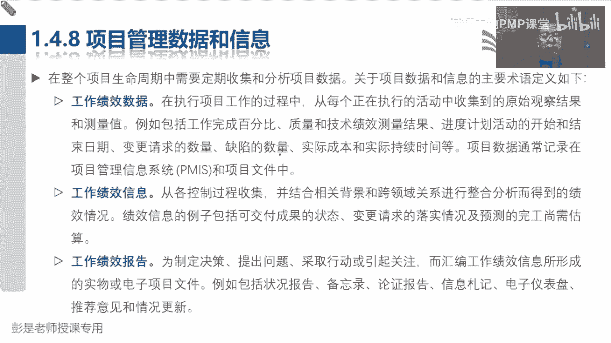

再往下做做这章的小习题看看。

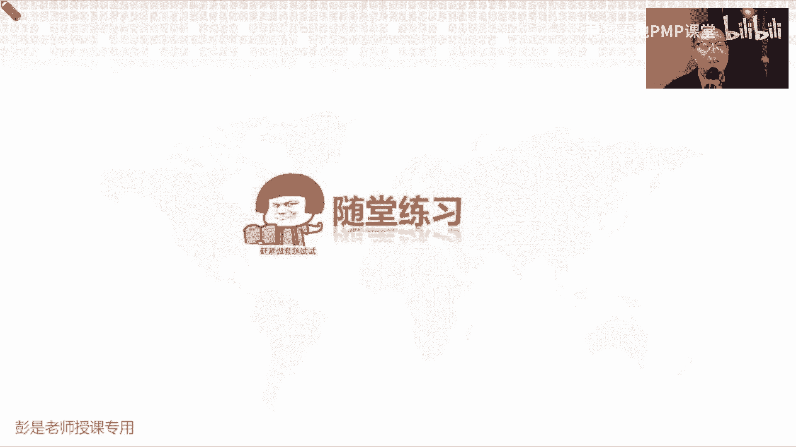

rocker同学，你考试这么答题时间不够啊，又看英文，又看中文，就看翻译，也就叫范围蔓延嗯好这道题选啥，有选A的，有选C的，有选D的，有选B的，齐了，那就每个都讲一下啊，这种概念第一次做就容易蒙啊。

下面关于项目生命周期，项目管理生命周期和产品生命周期的说法，正确的是什么呢，找正确的A项目变化的时候，项目生命周期通常随之变化和发展，这确定吗，不确定不一定吧，对不对，什么设计呀，施工啊，装修啊。

哎工作需要变化，需求发生变化，这个阶段呐不一定发生变化呀，对不对，所以A不得了，B说项目管理生命周期，对于每个项目都是独特的，管理生命周期是什么呢，嗯五大过程组它是共性的，启动规划执行监控收尾。

不管你是什么阶段，不管你这个阶段主要干啥，都需要启动规划执行监控收尾，所以B选项说的也不对，那C选项说项目管理生命周期，就是项目生命周期，这俩不是一回事吧，生命周期指的是我们从项目开始到项目结束后。

根据工作性质把它分成了N个阶段，管理生命周期是每个阶段之中都有五大过程组，所以C也不对，最后呢D就是相对来说最合适的，典型的产品生命周期，包含多个项目，产品项目生命周期。

好产品生命周期又是个什么玩意儿啊，只要理解了什么叫生命周期就能猜了，都叫从开始到结束对吧，从出生到嘎了变成土，这是人的生命周期呀，那产品生命周期就是产品从生到死，产品从生到死，对不对。

产品的研发是项目吧，产品的宣传推广引入市场导入，这也是项目吧，对不对，然后产品的升级呀，更新啊，换代呀，也有项目呀，最后呢产品慢慢慢慢慢慢没人买了，衰退了吧，可能渐渐的退出市场，都有可能有项目啊。

嗯好所以D这道题答案是D啊，了解就够了，这个在每个阶段开始的时候进行启动，过程是为了干啥呢，说项目从开始到结束分成N个阶段，每个阶段都要有一个启动过程组是为了干啥呢，等信号等信号变成那个术语。

就是为了得到授权，那得到授权说明什么呢，就这个目的吧，有助于确保项目符合其预定的业务需要，并验证项目的成功标准，这是阶段关口给出了一个决策，结果说可行，继续有价值，那咱们就继续哎，所以答案是B。

这道题开始拐小弯了啊，好那再往下看看，这个项目生命周期哪个阶段，这送分题不念了吧，哪个阶段最有具有最大的风险和不确定性，越早这种不确定的程度越大，所以呢就找那个看起来最早，答案就是赔概念阶段嗯。

C有助于确保项目按原计划进行，这可不一定啊，对不对，授权不代表着你要按原计划进行嘛，也可能走变更，也可能改计划呢，对不对，它不是它的作用啊，4D启动过程组不是去估算你需要多少人呐。

什么时候去估算需要多少人呐，规划的时候啊，规划就是制制定行动方案，看看什么时间干什么活，需要什么样的人财物，这是做规划的时候要做的事情好，那再往下这道题，关于项目阶段的说法，正确的是什么呢。

找正确的on，A肯定没有人选哈，这肯定过分了，刚说完阶段不是过程组，所以A不对，B说一个阶段的结束，通常包括核准开始下一个阶段，就想场景呗，你做完了安检就可以登机了吗，不行需要等信号得到授权。

就这个道理吧，哎所以中间有个阶段关口吗，就是为了做授权做授权，所以阶段结束，不代表着可以自动开始下一个阶段，B选项，这话不能这么说，那D和C在可交付成果被确认符合技术要求后，就可以结束该阶段。

这个敢选吗，那他问题在哪儿，只符合技术要求吗，好像不太对吧，技术要求它只是一方面诶，所以他片面了，那最后呢项目阶段的结束，涉及到可交付成果的交接，这是对的，每个阶段结束干的活，总结归档和最终。

可交付成果移交移交到下一个阶段，所以D是对的啊。

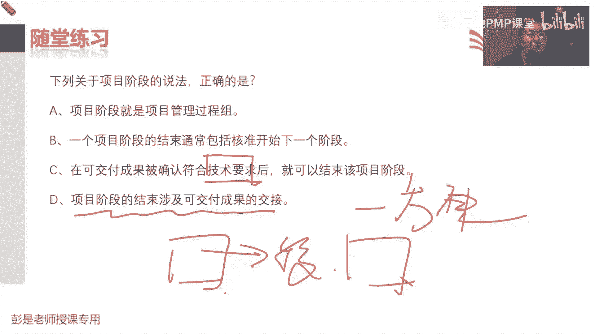

好这道题小乖乖同学没对，一道这道题你肯定对了，适应型生命周期是什么东西呢，就像刚才那个东西啊，有四个菜，不知道好吃不好吃，那先把A做好做，买回来，做完了让客户尝一尝好吃不好吃，好吃的话。

我们再看看B好吃不好吃，也可能先看D好吃不好吃，总之啊用最小的代价去试错，所以呢就是C乖乖同学做对了啊，所以适应型生命周期又称为敏捷方法，开始时候我们确定这个单词虽然没见过啊，什么叫产品未完项呢。

就是这四个套餐还都没吃呢，还都没吃呢，这不就叫未完相吗，然后最优先交付，我们要对这四个东西排排序，看看先买啥，哪个风险高，先试试先试试，然后迭代结束的时候让客户审查，就是尝一尝好吃不好吃。

就这个逻辑B哪错了，他时间和资源后面可以说话相对固定的，因为我们有固定的迭代周期，通常小于四周，迭代的周期是固定的，然后呢我们团队的资源也是相对固定的，什么东西不定呢，需求。

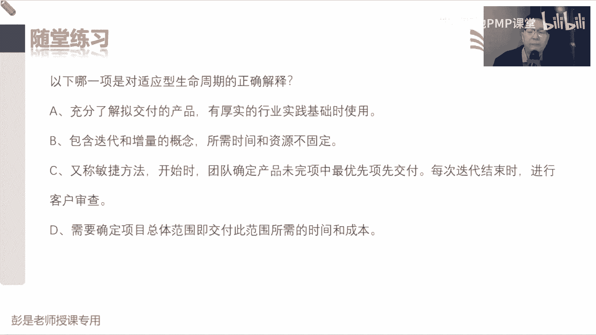

好看看这道题，这道题应该是有同学选B，有同学选D，那为什么不选D，为什么不选重叠关系呢，一个重复重点，这道题考的纯粹是阅读能力啊，说一个项目什么什么干活，他计划将资源划分为两个不同的团队。

来同时完成这两个阶段的工作，这段文字再说同时完成，这不就是并行吗，并行就是重叠关系，选D的同学，这是有道理的啊，但是话要看完，不过有一个人啊，建议使用一种敏捷方法，这个建议得到了他的认可，什么意思呢。

前面这个方案就被推翻了，对不不是并行了，而是采用敏捷方法了，那敏捷方法各个阶段之间是什么关系呢，迭代，所以呢这是B，考试的时候基本上大家就是这种这种感觉啊，题其实啊没有那么复杂，这是阅读能力，阅读能力。

能不能更精准的把题目到底在说什么意思，看明白，找到对应的选项，就这么简单的，好后边这送分题可以不念了吧，以下各项都是项目管理过程组，除了什么，A是什么呢，项目启动之前要做的事情，可行性研究吧。

但是话又说回来哦，通常说可行性研究是项目启动之前要做的事情，那第一个小问题，我可不可以把可行性研究，当做项目生命周期的一个阶段，可以吗，不犯法吧，犯那我可不可以把可行性研究单独拎出来。

当做一个项目加以管理，可以吧，不犯法啊，看情况让咋干就咋干，让咋干就干就咋干，那考试来说，考试来说，通常我们认为可行性研究归谁干呢，发起人这事儿不是咱做的，做得了主的，这就叫潜规则，潜规则啊。

通常默认呐可行研究这事跟他没关系，咱管不着，发起人负责主导，我们是提出我们合理化的建议和见解，但实际工作中，很多小型项目，中等规模项目，完全可以把可行性研究，当做项目生命周期的一个阶段。

但是大型项目复杂项目，比如说什么油田，开油田开采这种项目，这种项目搞科研搞个两三年很正常，甚至单独把科研当做一个项目，它本身就是一个有规模的项目去开展，因为要考虑很多很多东西对吧，什么技术啊，经济啊。

组织啊，环境啊，社会啊都要考虑周全啊，好今天几点下课呀，马上会说啊，咱做完这道题，那启动过程图旨在获得授权，以便于什么呢，这送分题不念了吧，开始项目或者是开始项目中的某一个阶段，就是A，好这道题。

选啥快点大胆说出来呀，大部分人正常情况下，第一次做这道题，应该选沟通，对不对，说呀一个项目经理和承包商之间发生一点问题，他不确定承包商是否遵照合同本能反应，沟通沟通呗，了解一下情况对不对。

但为什么答案不是D呢，这就是考试解题非常重要的一个思路，现在我们是高高在上的皇帝，你下边有九个大臣，有人管范围，进度成本质量资源沟通风险，采购该型，现在你不确定承包商是否遵照合同，先找哪个大臣。

谁管采购就找谁，所以就是C采购管理，采购管理里面，未来我们要学一个管理过程叫控制采购，控制采购，这个管理过程，就是看看供应商是否按照合同在履行再履约，那他控制采购这个这个管理过程，怎么开展工作呢。

才需要去思考怎么和供应商去沟通，怎么和供应商去沟通，去互动，去交流，所以记住啊，这是考试的这个重要的思路，就是定位你下面有九个大臣，然后呢我们还有五大过程组，一共有十大知识领域。

五大过程组横向纵向去分析，现在我们是哪一个过程组，启动规划执行监控收尾，现在我们要开展哪一个知识领域的管理工作，范围进度成本质量，资源沟通风险，采购相关方定位出来，最后呢再去分析涉及到哪个管理过程。

然后它的输入输出工具基础，以此类推啊，承包商和供应商一个意思，他把这事儿包了，他把这事儿包了，一个意思啊，嗯为啥不是风险，应该有同学做过预习，说什么叫风险，不确定的东西，不确定的东西是先开展风险管理。

还是说先开展采购管理，把它变成确定的东西，还是找采购啊，对不对，确定了供应商有没有遵照合同之后，还不存在着不确定性了，那就没必要开展风险管理了，所以风险管理啊通常是等其他人干完活再介入。

再去分析里边是不是存在着不确定性，承包商的定位啊，就是各位同学，你叫外卖这个餐厅，就是你这个项目的承包商，供应商都是一个意思啊，你花钱买人家的产品服务成果，好再往下了啊，这选啥呀。

在这四分分题可以快速过了吧，有这么多阶段推荐的方法是什么呢，哎为每个阶段分为一个过程组，这神经病肯定不能选B，对每个阶段重复开展五大过程组，这是对的吧，C跳过几个过程组，因为它们不适用于大型项目。

没有这个结论的，D消除阶段结构，这排除掉，所以比较合适的就是B这个阶段也需要授权，这个阶段也需要授权，这个阶段也需要授权。

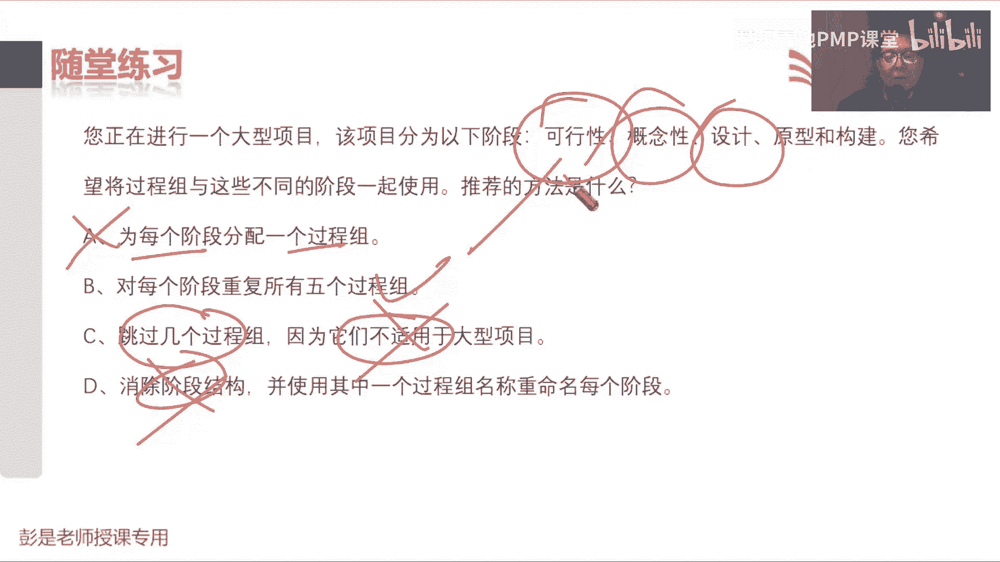