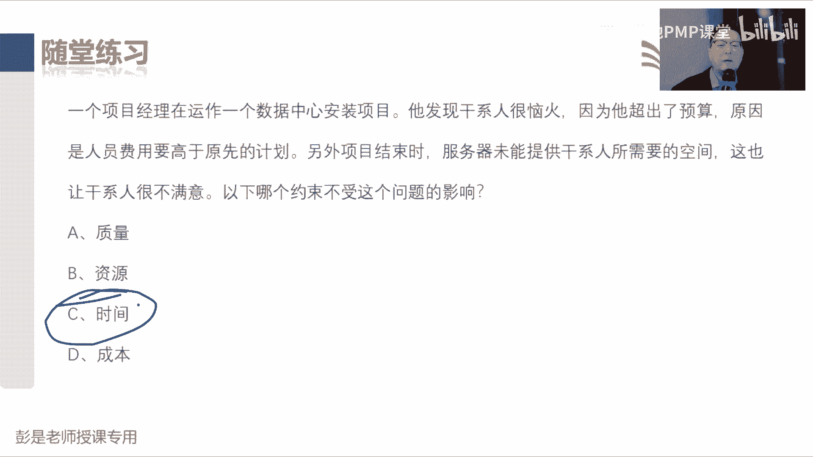
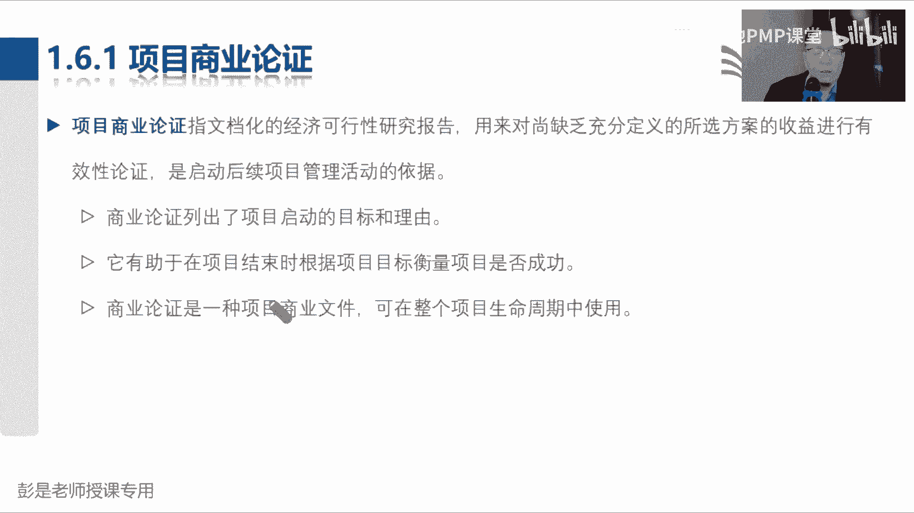
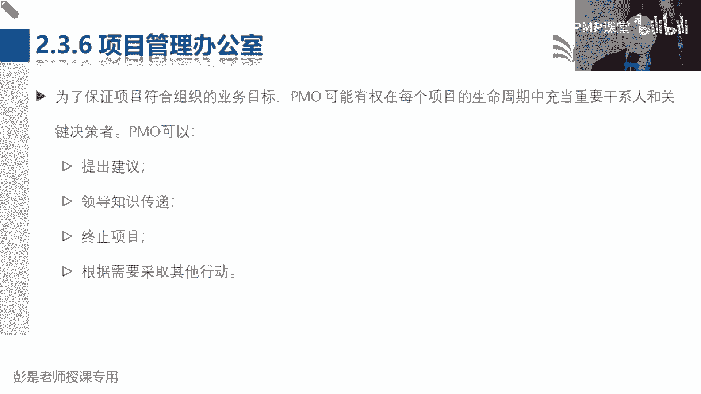
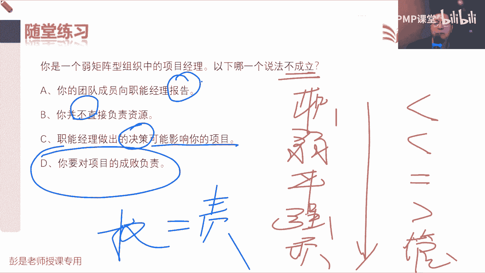
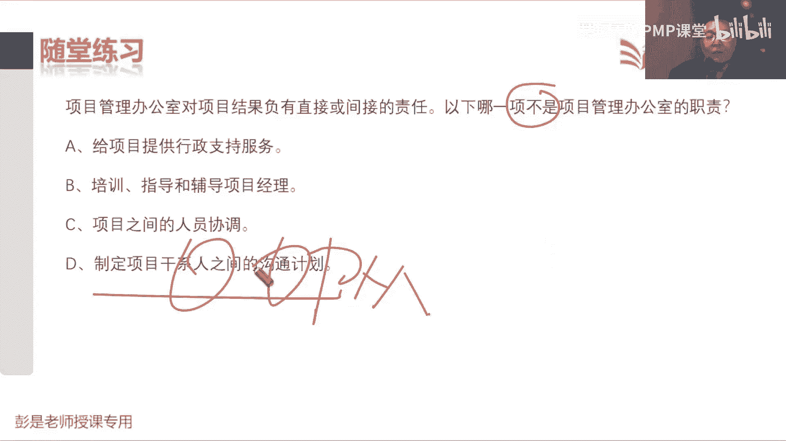
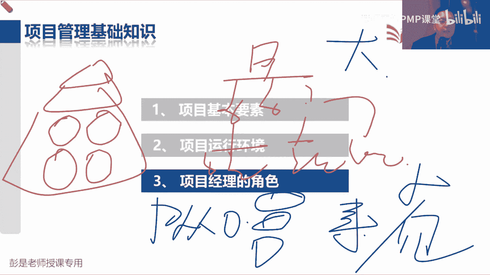

# 2024PMP认证考试课程（第六版+敏捷+第七版） - P5：1.5-1.6 项目基本要素、成功标准 - 慧翔天地PMP课堂 - BV1By411b7qM

1。5裁剪裁剪大家就考虑明白两个小问题，裁剪的内容就可以不看了，考试了，关于裁剪其实没有办法考，为什么呢，因为每个项目情况不一样，所以第一我们要知道啊，什么是裁剪呢，就是那三个字，看情况，每次回家呀。

娘我娘给我做的东西都不一样啊，有的时候饿就给你多做一点，最近吃肉吃的少，就给你多点肉，看哎呀，给你多点肉啊，少吃点肉吧，这不就是裁剪吗，对不对，根据情况选择合适的原材料，变成合适的菜品。

让你合适的吃下去，那裁剪对标到管理过程，就是啊我们有四大知识领域，然后每个知识领域啊，又有很多49个管理过程，这些管理过程啊有很多输入啊，就是原材料拿到这堆原材料，我们用工具技术把它变成最后的输出。

那到底我用什么过程，这些过程太大的过程再细分，太小的过程还要合并，这些过程需要涉及到什么样的输入输出，可以使用什么样的工具技术，是不是要做一些选择呢，这个选择的过程就称之为裁剪，还就是那三个字，看情况。

所以这句话一听完第一什么是裁剪，就是量体裁衣，对症下药，第二为什么要裁剪，为啥要裁剪啊，就是因为每个项目有每个项目的独特性，终极奥义没错，就是看情况，主打一个灵活，主打一个灵活，好所以1。5这段文字呢。

其实大家是可以不看的，后面复习的时候可以不看，未来工作中万一有的东西想不明白的时候，翻一翻翻一翻，所以教材里面说我们项目管理，项目经理通常把项目管理方法论应用于工作。

然后呢我们现在这个指南不是具体的方法，他只是告诉你理论知识，告诉你这个道理，告诉你他的逻辑，他的价值观，它不是具体实践，不是具体实践，所以教材里面都叫从各个项目之中，不同行业之中。

各个项目之中拆抄出来的，一些良好实践的一部分东西，那不能一成不变的应用于所有的项目，我们要看情况做做适当的适当的调整。

知道这个意思啊，所以后面这段文字呢都可以不看了，我们要选择合适的过程输入工具，技术输出生命周期阶段来管理项目，主打一个灵活嗯。

好后面这段文字不念了，看看这道题，第一次做这道题的同学可能会选D啊，说项目管理知识体系指南，也就咱那个官方教材填不，这玩意儿作为一部公认的项目管理标准，规定的项目管理的方法，过程和做法，从而可以什么呢。

A可以共享，可以吧，可不可以反复使用呢，可以啊，来帮助我们实现项目中的最佳秩序，这是对的，那B呢说具有强制性的项目管理规范，它可不是强制性的东西啊，C可以不加修改的，运用于任何行业的项目的管理，这不对。

因为我们要裁剪做调整，D成为对项目管理知识体系的完整描述，它的错误，错误在哪，它不完整，因为我们要不断的与时俱进，推陈出新，旧的知识就不写了对吧，简单的知识就不写了，简单知识就不写了，这个道理啊。

这也是第七版做了一个调整，大家有同学可能之前接触过PMBOK，咱以前叫PMBOK，第六版，第六版大概有多厚呢，680页左右，600多页，然后第七版有多厚呢，第七版不是咱咱那个通关宝典啊。

通关宝典是做了调整，第七版哈，380多页，我烧了300页，少了一半了，那第七版是不是好考了呢，他是说很多知识不需要项目经理掌握了，不是这个意思吧，哎表面上看少了很多内容，实际上呢是因为啊。

是因为全球这些项目从业人员，觉得很多基本概念没必要解释了，你要想体现你的专业性，没必要体现在这么牛的一个教材里，就像大家上大学的时候，上高中的时候，高中初中的数学书里面还有四则运算吗，高一同学。

亲爱的同学们，我们来学学加减乘除没必要吧，唉就这个道理，所以他把很多知识，没必要体现在我们这个专业教材里，太简单了，大家都应该知道的东西呀，就给它去掉了，但不代表着不考，不代表着不需要项目经理掌握。

所以他不是对知识体系的完整描述，它做了裁剪，所以表面上看教材厚了，教材薄了，实际上增加了很多内容，什么模型啊，方法呀，弓箭呐好，所以需要大家的掌握的技能一定是越来越多的，不可能倒退哈。

这道题需要动动脑子了，这道题选啥呀，第一次做应该不少人会选A和B，所以啊，一个项目经理在运作一个数据中心安装项目，他发现该新人很恼火，因为他超出了预算，原因是人员费用高于原先的计划，另外项目结束时。

服务器未能提供干系人所需的空间，这也让干系人不满意，以下哪个约束不受这个问题的影响，也就是问的我们没有违反哪一个约束，那什么是质量约束呢，什么是资源约束呢，什么是时间约束，什么是成本约束。

成本肯定违反了吧，为什么呢，因为超预算了，那有没有看出我们说没有按时交付呢，没有对你公司规定九点钟上班，我今天9。9。05才打卡，这就违反了是时间进度约束吧，题目里面说项目结束的时候，我们交了。

没有说我们没有按期交货啊，所以没有违反时间进度约束，那为什么说违反了质量和资源约束呢，这个东西既是资源需求，是不是质量需求啊，确实对吧，你买个手机告诉你存储空间128G，最后你手机一开机只有3G。

你会说这玩意儿质量有问题，对不对，所以它既是资源需求，也是质量需求，那我们违反了这两个约束，所以呢建议的答案是C，没有看出来迟到，没有看出来迟到啊。

好这道题呢，就就去分析你是受到了什么限制，选啥时间还是资源，好多人第一次做可能会倾向于选时间，你就会发现这句话，如果恰好在质量评价小组成员假期重叠时，提交软件，就有可能有质量问题。

那不是违反了时间约束吗，就会这么想吧，哎这个思路就不对了啊，为什么呢，因为人家告诉我们，导致问题的根本原因是啥呢，没有人人对标到我们九个知识领域叫什么呢，资源，所以导致问题的根本原因。

还是由于受到资源的限制，资源的约束，嗯所以答案是C变成大家粗暴理解的，很好理解的场景就是啊，我去年没买房，今年没买房，明年也不打算买房，为什么呢，因为穷，所以导致问题的根本原因就是穷。

跟什么时间买房没关系，对不对，哎就这个道理啊，题目就在说这个意思不是风险因素啊，导致问题的根本原因，风险的原因，风险的成因还是因为穷，还是因为没有资源。

好这种东西，考试的时候就需要慢慢的慢慢的去熟悉，这个解题的套路，所以大家做完了，今天课上讲了一些题啊，扎心哈扎心，那就坚持学坚持学，因为这个思路需要慢慢的慢慢的去适应，推理能力。

咱们不慢慢的给大家洗脑啊，推理能力收个梗，大家有没有接触过三段论呢，是什么玩意呢，比如说大范围推小范围成立吗，北京人都有钱，有钱有钱，但是小范围推大范围一定成立吗，不一定不一定，北京人都有钱吗。

不一定对不对，咱们就要慢慢慢慢带着大家去推理，训练这方面的思维能力，这需要一个过程，不要着急啊，不要慌，现在做题做的错，不丢人不丢人，没有人生下来就可以搞这搞这套东西啊，都要经历一个过程。

这就是听课看书做题，然后呢群里面沟通讨论交流，唉慢慢达到这个境界，嗯好那接下来1。6这段文字，大家学习的还是非常轻松加愉快的，因为讲完了商业文件，商业文件其实讲过了好看。

看教材上啊，说项目经理需要确保我们的方法，紧扣商业文件的意图，下面给出了这些定义，巴拉拉说，商业论证叫文档化的经济可行性研究报告，用来对尚未缺乏充分定义的所选方案的收益，进行有效性论证。

是判断效益管理计划主打一个时间，告诉我们什么时间会获得什么样的回报，好吧，这个玩意儿啊，这个玩意儿这样粗暴的去理解。

刚才说商业论证主打一个啥可行性和价值，那可行性和价值，可行性和价值，它的根就是因为各种各样的原因和理由，我们会发现一些什么呢，商业，机会因为各种各样的原因和理由，我们会发现各种各样的商业机会。

比如说法律法规，社会需求对吧，技术进步，嘿现在呀现在呀全国都在打梅菜扣肉，有没有商业机会呢，有我爱，我们做鱼香肉丝，我们做宫爆鸡丁儿，对不对，哎以此类推啊，就这样粗暴理解啊，发现了商业机会之后。

那第一我们要去分析这玩意儿，这玩意儿对我们来说有没有可行性，那分析可行性的时候怎么分析呢，非常重要的一个道理，告诉我们什么，分析可行性的时候不就是出方案吗，对不对，那非常重要的一个道理是什么。

不要把鸡蛋放到一个篮子里吧，我们要考虑啊，有没有更多解决这个业务诉求的方法，这叫备选方案分析，还要去分析这些方案能获得什么样的回报，比如说我们那个梅菜扣肉工厂啊，是盖一条生产线还是两条生产线。

这题要分析了吧，你看看什么瑞幸咖啡呀，什么麦当劳啊，星巴克呀，哎呀是排队排一个队还是排两个队，这要分析了吧，我们买什么样的原材料呢，我们要达到什么样的品质呢，采用什么样的工艺呢。

往里放多少添加剂才让人家吃不出来，还吃不死呢，这都是方法，这都是方法，还要去分析这些方案，它会未来会给我们带来什么样的回报诶，就考虑周全，技术的可行性，经济的可行性，组织的可行性，还要考虑什么财务啊。

社会影响啊，环境影响啊，都要考虑周全啊，这是可行性研究，可行性研究就先写清楚我们需要做啥，人家的业务诉求，然后分析如何满足业务诉求，想到更多的解决方案，还要继续再分析这些方案。

这些方案会会给我们带来什么样的回报，赚多少钱，不是为了名，就是为了利，这就是商业论证核心的内容，写出了商业论证之后啊，老板接接下来肯定会问时间，所以我们还需要写一个效益管理计划。

告诉老板这个项目结束的时候能赚多少钱，阶段中会不会获得回报，或者是多长时间收回成本，或者是运营，运营个35年以后会赚多少钱，总之把短期效益，中期效益，长期效益都给人家分析清楚哎，分析完了之后。

对企业的高层来说才能够精准的做决策。

到底是投入人财物呢，还是不投入再来决定，要不要往里边投入人财物去做这个事情，这就是商业文件。

它最核心的需要大家理解的，有印象的这么几个内容好。

所以后面看文字啊，基本上大家没什么需要背的东西了，都是课后复习的时候没事翻一翻，了解意思就够了，那第一个需要记住的重要的知识点，这是刚才反复说的，我们需要有一个角色站出来搞这个事情，所以通常发起人负责。

商业论证文件的制定和维护，发起人主导这个事情，那项目经理这个角色只是参与其中，提出我们合理化的建议和见解，参与其中的目的是，保持这些乱七八糟的东西的一致性，好知道这个重要的逻辑谁负责干啥。

然后再往下这张图，这张图其实可以不讲了，也可以不看，它，就是项目启动之前三件事，第一个事情叫需求评估，需求评估就是发现一些商业机会，比如说对市场做调研呐，搜一搜招标公告啊，看一看竞争对手的菜式啊。

分析一下国家的宏观政策呀，总之因为各种各样的原因和理由，去发现商业机会，就是最后说白了就是我们去分析，要做什么项目啊，那商业论证呢主打一个去思考啊，这事儿怎么做，能赚多少钱。

所以需求评估是告告诉我们公司，我们要启动什么项目，就提项目的建议，商业论证和效益计划，主打一个我们都思考怎么做，想到更多解决问题的方法，这些方法啊要去思考，它会给会给企业带来什么样的回报。

带来什么样的效益，这是how和how much，这些东西分析完了，公司一批准才会投入人财物，让项目经理走马上任，带着兄弟们完成任务，实现目标，得到期望的结果，有些项目呢可能需要把结果移交给运营好。

知道这个意思啊，再往下后面具体的内容其实是可以不看了，但是呢还是需要给大家念叨念叨的，有这么几个单词，熟悉一下商业论证，文档是指文档化的经济可行性研究报告，然后用来对上费缺乏充分定义的。

所选方案的收益进行有效性验证，既然看到所选方案，所以科学家告诉我们，不要把鸡蛋放到一个篮子里，要看看有没有更多解决问题的方法，想到更多方案的，然后每一个方案都要去验证它能赚多少钱，能赚多少钱。

所以他列出了项目启动的目标和理由，告诉公司为什么要花人财物，为什么要投入人财物去做这个事情，为什么要投入人财物做这个事情，所以呢他需要把我们要做啥说清楚，我们都能怎么做，说清楚我们能赚到多少钱，说清楚。

这样老板才看清楚哦，要做一个什么事儿，花多少钱，赚多少钱，他才有投入人财物的动机，就理由好，知道这么几个单词啊，它里面包括了目标和理由，然后再往下。

它具体的内容其实可以不太需要去记了啊，说在项目启动之前，通过商业论证可能会做出继续终止项目的决策，需求评估通常在商业论证之前进行，包括了解业务的目的和目标，问题和机会，并提出处理建议，他就是主要工作。

就是搞清楚我们这个项目到底要干点啥，他是寻找商业机会的，我们到底是做梅菜扣肉工厂，还是做鱼香肉丝工厂，还是说都做找这样的商业机会。

好那再往下说161嗯，需求评估是搞清找项目，找项目找项目，就像各位同学每天每天满大街去百度去搜啊，我要学点嘛，这叫啥呢，需求评估要学PMP啊，还是学一项一建二建呢，还是搞那个软考的高项中项啊。

还是学ACP呀，BPA啊，看看需要学啥，这就叫需求评估，搞清楚要学啥之后，你不得分析一下这些这些这些证书啊，这些证书啊，能不能我能不能把它学到手啊，学到手之后能够给我带来什么样的回报啊。

可行性研究和价值分析，这就是商业论证好，所以161商业论证的内容也不太需要，大家去背下来，了解意思就可以了，看看这这个意思啊，说定义业务需要把我们要做啥说清楚，然后分析形式是什么呢。

就是想方案要结合我们企业的优势啊，劣势啊，我们企业现有的这些人财物啊，去思考，我们都有哪些方案可以满足用户的业务需要，那这么多方案你不得给给他，给老板提建议吗，对不对，所以提出合理化的建议。

建议老板用哪一个方案最好，那老板肯定会问为什么，所以呢还要最后说清楚，这么做带来的价值，就是那个how much好，所以商业论证的内容，知道这个框架的结构就够了，要做什么事都能怎么做，然后给公司提建议。

告诉公司为什么这么做，能带来什么样的回报。

它具体的内容其实大家可以不看了啊，这些什么形式分析呀，这太细了。

现在也不大考这么细的东西，什么推荐推荐公司我们能怎么做。

最后呢说说说钱好，那162效益管理计划，效益管理计划就牢牢记住这个关键词，时间，什么时间会获得回报。

好所以它描述了效益的关键要素，包括但不限于巴拉巴拉，这项目能赚多少钱，然后实现效益的实现，短期呀阶段呐，长期呀持续效益啊，给人家老板说清楚，其他内容稍稍有点印象就够了，不太需要去背。

总之告诉老板什么时间赚多少钱。

好后边的东西就没什么需要去看的了啊，那163其实可以不看了，因为下节课我们就开始讲项目章程，和项目管理计划了，后面就开始讲项目章程，项目计划了啊，可以不看了。

然后再往下呢就是164，说法，确定项目是否成功，是项目管理中最常见的挑战之一，时间成本范围，质量多快好省等指标，历来被视为确定项目是否成功的最重要因素，多长时间花多少钱，得到什么样的产品服务和成果。

达到什么样的质量标准和要求，通常我们通过多快好省来评价这个事，干它成功不成功，那除了这四个玩意儿啊，还要考虑什么呢，这需要再加一个指标，超级重要的指标就叫干系人的满意，现在对企业来说越来越注重对吧。

看谁的满意度，甲方爸爸开心不开心啊，满意不满意呀，哎要关注要关注，满意度已经是在验收或者交付阶段的内嗯，你不得提前规划一下吗，对不对，变成场景的话，就想啊对方对方公司，你更关注对方领导的满意度。

还是员工的满意度呢，对吧，那配以什么样的权重呢，这不得提前规划一下分析好吗，这些东西都要在章程里面，后面会学到，章程里面要把这事说清楚，就是事前规划，事后评估，事后总结好，所以多快好省，加上满意度。

你还评价项目成功不成功，那刚才我们上午又说过了，范围进度，成本质量较多，快好省，所以拐个小弯拐个小弯啊，说一说几点下课这个问题，几点下课，范围进度成本质量，几点下课呀，哈范围讲就像老师给大家讲课啊。

范围能减少吗，说咱上课去能啊，上课讲得慢，讲的细，那有些东西啊，咱课上不讲了，各位同学自学去吧，不行吧，哎该讲的地方还要讲啊，范围不能动啊，那能改质量吗，不能不能说这地儿啊，差不多凑合凑合。

随便糊弄讲一讲，哎你们自学吧，对不对，降低质量，不讲清楚，不讲明白，这也不行啊，我们不能牺牲质量，还是要尽量的讲慢点，讲细点，让大家都能听懂，那向各位同学收钱好像也不合适吧对吧。

咱正儿八经的课上不怎么讲，希望各位同学啊报了个班给你讲细一点，这也不行啊，所以成本不能动，那我们能动的是什么呢，是进度哎，这我可以做这个主，所以后面啊大家要做好什么的准备呢。

这是你们上学的时候比较讨厌的一种现象，拖堂拖堂就是晚下课，对不适当的适当的再多讲两句，哎拖堂啊，所以预计下课时间呢，基本上每次每次给大家讲课，下课时间预计就是18点左右，虽然课表上写的是几点啊，5。2。

课本上写的是五点，但基本上每次下课呢，预计下课时间都是18点左右左右，记住啊，话不能说死，对不对，有一定的副语，然后基本上不可能左，只可能右，只可能右啊，那最晚到几点呢，也就基本上18：

30左右仍然是左右啊，就到头了，因为这个这个地方我们有线下课，线下课到了06：30以后，人家会轰的对，所以记住啊，如果如果咱课程讲不完怎么办呢，说六天精讲，讲不完咋整啊，实在讲不完还可以加课，没关系啊。

总之范围不能动，质量不能牺牲成本，不能搞，不能不能要钱，那我们只能调整进度，项目经理难就难在这了，找一个合适的平衡点好，今天是不是讲到课表上的项目经理的角色了，负责人的告诉你。

从来第一天就上课就没讲到过，那要反复讲，反复讲，所以今天的课程希望大家是听完，达到这样一个效果呃，就再听一遍，再后面再复习的时候再听一遍，然后教材再看一遍，基本上就可以不用学了。

这样呢把更多的时间和精力去学，49个管理过程和敏捷好，那再往下啊，都改好，省，需要干写满意度，了解这个意思就可以了啊。

那再往下这些财务指标没得商量，一定要记住，还要能够理解它代表什么含义啊，先搞定第一个什么叫回收期，什么叫回收期呀，就叫多长时间收回成本，张三打算和你开个什么瑞幸咖啡，开个奶茶店。

说咱俩一人投资10万块钱，你第一个反应多长时间，这个钱能收回来诶，他就是收回成本的周期，多长时间回本，那这个成本收回成本收回这个周期是越长越好，还是越短越好，好指导结论往上写就完事了，多长时间收回成本。

这个周期越短越好，因为意味着风险小，但是我告诉你啊，投资10万块钱开一个奶茶店，开一个奶茶店，告诉你六个月收回成本，六个月收回成本，六个月以后赚钱吗，判断不出来了吧，哎所以他没有办法体现项目的盈利能力。

赚钱不赚钱，不知道这就是它的特点，所以告诉我们多长时间收回成本越短越好，赚钱不赚钱，不知道，这是第一个指标，叫投资回收期，搞定这个指标啊，我们再搞定最后一个叫效益成本比，效益成本比是什么玩意呢，听场景。

我买了一瓶可口可乐，成本是两块钱，卖给张三，卖了三块钱，我的BCR等于多少，收入三块钱，成本是两块钱，BCR就等于1。5，这说明什么呢，赚钱了，我买了一瓶可口可乐，成本是三块钱，卖给张三，卖了两块钱。

然后这俩玩意一除等于0。7，说明赔了，所以BCR就是用我们的收入除以支出除以成本，这个东西大于一，说明有钱赚，并且是越大越好，越大越好啊，买了一瓶可乐两块钱卖给李四，卖了200块钱。

唉DCR100越大越好，赚的多，这就是最后一个指标，它的算法其实不太需要掌握，咱基本上就不考这个算法好，回收期告诉我们多长时间收回，成本越短越好，意味着风险小，赚钱不赚钱。

不知道效益成本比这玩意儿需要大于一，才说明有钱赚，越大越好，中间这前面这三个东西啊，净现值，投资回报率，内部报酬率这三个指标它的算法不需要掌握，我们知道结论就可以了，这三个指标只要大于零，就说明有钱赚。

并且呢还是越大越好啧，所以就记啊，其他指标大于零，说明有钱赚，回收期赚钱不赚钱，不知道越短越好，BCR需要大于一才说明有钱赚，越大越好，记结论就够了，所以这种东西啊考试怎么考呢，考试怎么考啊。

A项目投资回收期六个月，B项目投资回收期12个月，选哪个，为啥呢，风险低好，A项目BA项目二，B cr1。5，B项目BCR1。2，选哪个A为啥呢，赚的多，哎所以考试超简单，你就钻钱眼儿里就可以了。

中心思想是什么呢，如果考赚钱的知识点，那就找大的，如果考成本的知识点，就找小的，钻钱眼儿就行了，铁公鸡一毛不拔，就这个道理啊，成本越低越好，赚钱赚的越多越好，这实际工作中一定要脱离实际啊。

实际工作中一定是不能这么简单的，对不对，因为要考虑其他特其他的因素，考试来说超简单好，这几个财务指标一定要掌握的东西。

然后说巴拉巴拉吧，这段文字不念了什么什么目标。

接受不念了啊，这想看就看，其实不想看，可以不看了，所以最后说为了取得成功，我们必须能够评估吧，满足平衡项目要求，巴拉拉这都不念了，说有的项目啊，从范围进度，预算看是成功的，但是商业角度看不成功。

这是因为环境可能会发生变化呀，所以很多产品很多产品研发出来之后，商业环境一旦发生变化，唉这东西卖不出去了就夭折了吧，就这个道理。

这都听一听，那做做这一段的练习题，各位同学就可以再休息了，说您加入了项目选择委员会，正在看一个文档，看吧，五W2H分析法大家听过吗，学到最后你会发现所有的东西都是这个道理，做什么事对吧。

怎么做什么时间做，然后为什么要这么做，都能怎么做，然后能赚能带来什么样的效益，嘿就是what why when who对吧，How how much，这些东西啊，好这东西叫什么呢，商业论证，不是C呀。

收益核算方法是具体的算法呀，这是个什么东西，哦hint，再往下，以下哪一个是发起人角色的最佳描述，发起人体最强的是，就想这个结构啊，发起人干啥呢，A上来就排除掉了向项目团队分派工作，这活谁干。

项目经理吧，这是咱权利边界分内的事情啊，所以A不是发起人干的啊，C在组织内部从行政上支持项目，给项目提供行政支持，这活谁干啊，各个职能部门吧，某项目需要找个法务，需要找个律师，需要采购，需要销售。

需要需要需要各个职能部门的支持啊，所以C是各个职能部门干的事情，那D定义组织的类型，大家这个知识点还没学到什么叫组织的类型啊，组织架构这谁定啊，定公司的组织架构，这活儿一听就往天上找吧，高级管理层。

你公司的什么董事长，董事会，总经理这帮人呐，他们才有权利决定公司采用什么样的架构，所以呢这道题最合适的答案就是B，为项目提供所需要的资金，这是反复给大家说的啊。

我们完成项目所需要的资金是谁，从公司申请出来的，发起人发起的人，对不对，他要告诉老板，我们找了一个什么项目，再告诉老板这项目啊有可行性，有价值，什么时间会赚到多少钱，去向公司申请。

我们要投入人财物做这个事儿啊，然后公司一旦批准之后，就授权授权，把我们可以使用人财物的这个权利，交给项目经理，所以我们完成项目所需要的资源和资金，是发起人从公司申请出来的，这需要拐个小弯儿去推理一下。

得出这个结论，嗯这个甲方爸爸给资金吗，这个你要分场景了，这一说就复杂了啊，甲方要不要有甲方的项目经理啊，乙方要不要有乙方的项目经理啊，有啊甲方要干活，他是不是需要他公司里边有一个发起人呐。

咱看看人家甲方发了个招标公告，咱是不是需要有一个人去分析能不能干呢，在所以每个企业，每个组织都有每个组织的一套班子。

好再往下了啊，这道这道题简单，反正看了半天就一个单词，好像还算眼熟，就这东西吧，BCR效益成本比收多少钱，值多少钱，这玩意大于一，说明有钱赚，只能选这个了啊，其他的还没学到呢，看不懂，选哪个啊。

就是B了吧，说在项目启动之前进行全面的业务分析活动，它主要分析的是什么呢，人家需要啥，我们都能怎么做，然后再去再去分析公司的优势啊，劣势啊，再去分析评估每种方案能带来的效益，带来的价值。

所以呢就是B确定问题，确定业务需求和可行的解决方案，你们搞互联网的不提，天天说嘛，我们要解决用户的痛点呐，痛点不就是问题吗，对不对，哎所以就是B所以大家随便想啊，共享单车解决的是大家的什么痛点啊。

最后一公里哈，这是出了地铁，等公交车费劲啊，走路又费脚，然后自己买自行车又经常丢，还不能想扔哪儿扔哪儿，他就是解决了这个问题，这个痛点，哪些不是多选啊，多选题一定会这么出的啊，选两个多选题。

题目一定会明确的告诉你选几个，如果没说，那就选一个，好这道题，这送分题啊，放弃了可以过了吧，sponsor发起人来搞商业利，商业案例和商业论证是一个东西吗，看中文可能觉得不是。

你看英文就会发现他真是一个business case，所以一个意思啊，一个意思，商业论证啊，商业案例啊，这就是由于文化差异导致，最后给出的翻译的这个术语，可能稍稍有一点点小小的区别，所以不管是考试啊。

看书啊，粗暴理解，所有者是什么，就是owner，谁主导这个事情，谁主导这个事情，谁主抓这个事情，谁负责这个事情。

好，这就是今天今天花了很多时间，讲第一段基本要素，那大家轻松加愉快的环节就来了，第二部分和第三部分啊，相对来说学习的比较简单，都是基本上听一遍课就差不多了，再做做习题就差不多了。

然后呢记不住的记性不好的同学啊，再听第二遍也就到头了，没必要花特别多的时间去反复听啊，那接下来重大利好时间又到了，现在是16。33，咱休息到16。40，休息7分钟时间，好各位同学准备了，还有最后15秒。

7654321，那接下来我们看第一部分，第二章项目运行环境。

运行环境，运行环境阶段的课程啊，轻松加愉快，基本上听一听，没什么需要去背的东西，就这么三大块，事业环境因素和组织过程资产，然后呢说了一个组织系统，就涉及到组织架构这种东西啊。

好先看概念看就可以了啊，不要低头做笔记，因为笔记不着急的，所以呀，项目所处的环境，可能会对我们的开展产生有利或不利的影响，这些影响的两大主要来源，叫事业环境因素和组织过程资产。

事业环境因素源自于项目的外部说，他可能会对我们的工作产生影响，组织过程资产源自于企业内部，可能把露拉不点了，总之他的中心思想是什么呢，事业环境因素会对我们的工作形成限制，组织过程资产它的关键词啊。

就是每个企业特有的一些东西，所以可以猜猜了大家工作中，什么东西会对工作产生限制和约束，工作中生活中都有啊，什么东西会让我们很多事不敢做呢，这就这个东西吧，法律法规还有这种东西啊。

嗯他就会对我们的工作形成限制，形成约束啊，对不对，不能违法乱纪，不能不能违法乱纪啊，唉这就是事业环境因素，大概先粗暴有个印象啊，那企业特有的一些东西都是什么呢，每个公司你面试的时候流程一样吗。

入职的流程一样吗，不一样吧，请假的流程，报销的流程，这些企业内部的政策流程，程序标准规范都不一样，因为它是结合每个企业的实际情况，定出来的这些游戏规则，哎这就是企业的特产。

包括每个企业积累沉淀下来的这些什么经验，教训啊，知识啊都不一样啊，这都是咱自家的特产，这就叫组织过程。

资产先有这么一个大概印象，后面那就简单了，所以给了一张图说事业环境因素可以分成外部，内部组织过程，资产可以分成两大块过程，政策程序，第二呢就是组织知识库，再猜好，搞定一个啊。

组织过程资产是每个企业特有的，那我们企业特有的知识不一样，你搞软件开发的公司和我们做梅菜扣肉的工厂，我们积累沉淀下来的知识是不一样的，你们会搞软件，我们会搞预制菜，那每个企业的过程政策程序流程标准规范。

规章制度又不尽相同，因为它要结合每个企业的实际情况，定的这种东西，所以这都叫组织过程资产，那事业环境因素，刚才我们说这类这些东西啊，会对我们的工作形成约束，那比如说外部能想到的就是法律法规。

那什么是内部的事业环境因素呢，什么是内部的事业环境因素，会对我们的工作形成限制，约束的东西，能猜到啥，比如说咱咱给大家上课，为什么不在公司的多功能厅呢，为什么要来要要要来外面租租教室啊，因为你公司穷。

因为我们没有，所以你公司的什么设备呀，设施啊，包括用的系统，用的各种软件，包括企业的文化这些东西，这些东西包括员工的能力，很多东西啊，也会对我们的工作行程限制形成约束，我们公司只能生产梅菜扣肉。

没有鱼香肉丝的生产线，所以呢这活我们接不了，嘿，这就是内部的事业环境因素，好，知道了这个中心思想，知道了这个大道理，再看看具体的文字就差不多了。

所以事业环境因素是指我们不能控制的，会对我们产生影响，限制和指定的各种条件，它可能来自于组织的内部和外部，就是企业之外的，就称之为外部环境因素，比如说法律法规，企业内部的环境因素。

那就是我们企业的设备设施，员工能力这种东西我们企业只有一条，只有一条梅菜扣肉的生产线，没有鱼香肉丝的生产线，所以呢这个单我们接不了，就这东西。

那它具体包括什么东西，不需要大家去背了，所以书上后面给出了例子啊，以下是组织内部的事业环境因素，这东西都不用去背，都是看一遍，听一听，有印象就够了，总之这些东西会限制我们的工作，比如说企业的文化。

比如说企业的文化，为什么会限制打呢，什么是企业文化呀，什么是企业文化，什么是企业文化口号，进取型组织，哎这差不多了啊，人都有啥呢，个性企业有企业的个性，有的企业人家就是吃不死人就可以了。

这就是我们这个调性就这道理啊，所以每个企业大家的什么使命啊，愿景啊，价值观啊，信念啊，文化规范啊，这都不一样的，哎了解就够了，像设施资源的地理分布，我们的我们的工厂，我们的工厂对吧，在什么位置唉。

太远的地方，这活儿我们接不了啊，以此类推了，包括什么基础设施啊，软件呐，资源的可用性，甚至包括员工的能力好，这些东西会对我们的工作行程限制和约束，我们公司啊都是会做梅菜扣肉的人，像看病这个活儿接不了。

为什么呢，因为没有人会看病，嘿他也会限制我们的工作。

这都了解就够了，那外部的事业环境因素，这也是了解就可以了，你能想到一个法律法规就已经很棒了，什么市场条件呐，社会文化影响啊，以此类推，这都不需要去背啊。

不太会考，那再往下，第二大块叫组织过程资产，脑子里面脑补下来过程的过程，政策程序标准规范不一样，第二大块呢就是各种各样的库。

所以组织过程资产是执行组织特有的并使用的，这些计划过程，政策程序和知识库，这个东西是企业特有的，所以呢既然是咱自家的东西，我们就可以对它进行调整，进行修改，好接下来再想一想啊，看看这句话。

说组织过程资产是许多项目管理过程的输入，变成人话就是啊咱干活之前要想一想，第一什么呢，事业环境因素，对不对，看看有什么条件会对我们的工作形成限制，看看这活儿违法不违法呀，违规不违规呀。

看看这活儿我们有没有能力接呀，以此类推吧，考虑各种各样的事业环境因素，去思考这些东西会不会限制我们的工作，第二呢看一看组织过程资产，看看咱企业内部的这些政策流程，制度标准规范是什么东西。

看看咱内部相关积累下来的这些知识，经验到底是啥嗯，所以接下来就是一对好朋友，从现在开始，事业环境因素，组织过程，资产绑定，理论上来说，我们49个管理过程都可以把它作为输入。

干啥活之前都看一看世界环境因素，看一看做值构成资产做参考，然后第二个知识点就是说，由于这个玩意儿是咱自家的东西，所以在整个项目期间，我们可以对它进行必要的更新和增补，反正他自己的东西想改就可以改。

记住这这个结论就完事了，好，那再往下说，组织构成，资产可以分成两大类，叫过程政策程序，组织知识库，这段文字有一个小逻辑，听一遍有印象就够了啊，说啊第一类资产的更新，通常不是项目工作的一部分，刚才刚说完。

说在整个项目期间，这个玩意我们可以对它进行必要的更新和增补，那现在又说啊，说这个东西啊更新通常不是项目工作的一部分，什么意思呢，加两个字就好懂了，说你要改公司的流程，政策程序标准规范，改这个操作。

执行更改执行更新，这个操作不是咱们分内的事情，不是项目工作的一部分，这活儿通常谁干呢，谁职能部门吧，咱也不知道谁干爱谁，谁跟咱没关系，跟咱没关系啊，总之我们是发起更新的申请申请。

去调整我们公司的政策流程标准，政策规范这些东西到底谁去落实，怎么审批，谁来执行，咱切这些事情不在项目范围之内，我们只是发起申请，仅此而已，那第二大块组织过程呃，组织知识库这个东西就可以更新了。

我们有必要有责任，有义务去总结相关的什么经验教训呐，可以把它放到我们的组织过程，资产告诉全公司的同事，不要再犯同样的错误，这个更新是我们份内的事情，这段文字就想说这个道理还是权力的边界。

如果想申请去调整我们企业的流程，咱就发起申请就够了，这个流程到底怎么改，走什么走什么审批，这是人家职能部门干的事情，他去落实，他去执行，我们只是申请，第二大块呢是知识库，这是我们权力边界之内的事情。

我们可以随着工作的开展，及及时的更新这个东西，好知道这个意思。

再往下书上给出了一大堆的东西啊，这一大堆的东西需不需要背呢，不需要需不需要反复看呢，也不需要看一遍了解就可以了，但是接下来带出来的另外一个知识点要掌握嗯，就是说组织过程资产。

组织过程资产通常是每个企业特有的一些过程，政策程序，还有知识库，那组织过程，资产有没有可能对我们的工作形成约束和限制，组织过程资产，有没有可能对咱们的工作形成限制，形成约束呢，有吧，所以比如说这些东西。

人力资源政策会不会限制我们的工作，我们公司今年定的政策是什么呢，985211研究生本科生都不看，这东西会不会影响到你招聘会吧，哎像什么健康啊，安全呐，保密啊，这东西啊也可能会对我们的工作形成限制。

形成约束，所以学到最后啊，千万不要死记硬背了，因为组织过程，资产，组织过程中，资产和事业环境因素。

他俩不是泾渭分明的，不代表着说某些东西不会对工作形成限制，一旦我们发现公司的这些过程，政策程序会对我们形成一个强制性的约束，那这种情况下它就变成了事业环境因素。

哎就这道理啊，这就是中心思想，所以它具体包括什么内容，其实可以不要看了，就是关于这种政策呀，稍稍有一丢丢印象就够了，因为通常这种都整什么各种政策，可能会对我们的工作形成一些强制性的要求。

好再往下什么执行监控。

这都想看就看，不想看可以不看，那222组织知识库，这段文字呢也不需要大家去背，不需要去背啊，哼从下往上看，以往项目的档案去死，什么数据库，数据库，数据库，知识库去死，财务数据库，总之积累沉淀的这些东西。

唯一需要解释的就是第一个单词，配置管理，这个大家不一定工作中都能接触的到，什么叫配置管理呢，能不能找到关键词啊，包括软件，硬件组件版本以及巴拉巴拉各种各样的基准，所以粗暴理解配置管理就是版本管理。

配置管理就是版本管理，什么叫版本管理呢，大家工作中写文档，写资料，编程敲代码有没有版本呢，这些文档资料每每改一版都要存一存，每改一版都要存一存，这样踏实啊，便于追溯啊，因为大家工作中。

有没有遇到过这样头疼的问题啊，写了个东西，老板说这儿这儿这儿改一改，除了第二稿，第三稿，第四稿，第五稿，老板最后说啊，咱就用第一稿吧，那如果没存档，如果没存档，这事儿不好不好还原回去啊。

这就是配置管理的一项一项工作之一，除此之外，还要软件硬件相互搭配，对不对，出什么出什么硬件，配什么软件，这都叫配置管理，所以大概有印象就可以了，因为这个东西需要或多或少带一些专业知识。

所以呢考试啊基本上也不考，知道这个意思啊，能够反应过来配置管理关注的就是版本。

好具体内容大概就这么多，2。12。2，那接下来2。3，组织系统。

组织系统这段文字啊还是相对来说比较抽象的，先搞定一个单词，基本上大部分内容不需要去背，听懂就可以，很多内容也不需要去看，先搞定一个单词啊，什么叫治理，什么叫治理说，运行项目时。

需要应对组织结构和治理框架带来的制约因素，为了有效高效的开展项目，我们需要了解什么职责中责职权分配情况，有助于我们利用什么权利影响力，巴拉完成项目，什么叫治理呢，最粗暴的理解就是权力的游戏。

因为大家要讲道理啊，看看PPT再回顾一下。

等我啊找一个稍等下载的车购买的，前面我们把怎么干活梳理清楚了，我们要去创业，成立一家成立一家生产梅菜扣肉的工厂，我们要先定目标，愿景使命价值观，一年回本，两年实现个一个亿的收入，3年我们就净利润十个亿。

4年以后走向全球，变成走向人生巅峰，目标愿景使命价值观定好了之后，接下来做企业的战略规划，去思考怎么实现这个宏图大业，战略规划一旦敲定了，我们就知道未来我们可能需要开展哪些项目，以及我们工作怎么运营。

就有了项目和运营，再往下呢就是分析一些存在着依赖关系的东西，把它拉到一个圈圈二里，变成了项目集管理，最后呢要做的事这么多，有的是重要，有的事不重要，所以呢我们要事分轻重，缓急排优先级。

把符合战略的东西放到一个圈圈里，就有了项目组合，这种管理方法，事儿都捯饬清楚了，接下来要思考啥呢，干活的是人呐，人一多就要怎么样呢，画组织架构了吧，嘿张三李四王五赵六，你们都负责保安。

然后张354王五赵六，你们负责保洁，张三李四王五赵六，你们负责采购，就要分组织架构，组织架构最重要的作用是啥呢，权力的游戏吧，什么事儿谁说了算，什么事儿谁说了算，嘿对吧，总经理负责干啥。

然后你们各个部门经理是吧，包括车间主任，你们都负责干啥，员工负责干啥，这不是权责的分配吗，因为对企业来说最头疼的一个问题啊，就是权责不清就会踢皮球对吧，这事跟我没关系，这事不归我管，你找张三，张三说。

三个和尚没水喝，就这个道理，所以组织治理，组织治理就是为了避免权责不清，大家干活互相推卸对吧，互相互相互相推卸责任的，那我们要定很多东西了，政策流程制度程序标准规范，流程也是权力的分配啊，对不对。

在流程里边，谁负责提交，谁负责审批，谁负责复核，以此类推，所以组组织治理与组织治理，最终的主要中心思想，就是把权责给人家收拾清楚，分配清楚权力的划分，权力的游戏，这样我们各个同事，各个同事一到岗。

就知道我这活应该怎么干了，就知道我需要和谁配合，就知道就知道诶，这事找谁，就是让企业能够有效的良性的运作下去，这就是组织治理好。

知道这个中心思想，再看这段文字就简单了，组织治理就告诉我们什么职责，权责权利权利权利唉，知道这意思够了，具体的文字不要求大家去记住它啊。

好所以说近期的BMI研究指明，治理是组织各个层层面，有组织的或者有结构的安排，他的目的是什么呢，确定和影响组织成员的行为，让大家知道什么事怎么干，什么事找谁这走什么流程，以此类推了，知道这个意思就够了。

那治理时代巴拉拉后面的文字啊，其实都可以不看了。

232组织治理框架，什么框架或影响都可以不看了，233管理要素在说什么呢，就是你要去思考啊，你这个部门到底怎么分，这个部门到底怎么划分，因为物以类聚，人以群分，什么样的人群。

我们把它归到一个某一个部门里对吧，就是行政负责干啥的，采购负责干啥，然后hr负责干啥，销售负责干啥，营销负责干啥，这段文字就是指导我们怎么做组织，组织的这种职能部门的划分。

这段文字呢知道这个意思也可以不看了，都可以不看了啊，咱又不考，只能只组织不考组织，这理它就是给我们做参考。

但是我们要知道啊，听完了这什么什么，前面这段21231233，组织治理约等于权力的分配，那通常谁负责开展组织治理呢。

谁负责开展组织治理啊，是员工啊还是领导啊，最有权最有权利的人才能够完成权利的分配，对不对，哎所以通常高层董事会啊，董事长啊，厂长啊，总经理啊，他有权利，他能够才能够完成权力的分配。

知道这个结论有印象就可以了。

好那再往下了啊，那234就需要大家掌握了，234再说组织结构类型，这段文字呢也不念了。

就看这张表，这张表这张表先听，听完了之后啊，复听的时候你再写一写结论，其实就够了，先听啊，说第一种叫系统型或者是简单型，他工作安排是这样的啊，叫人员并肩工作，人员并肩工作再强调一个什么呢，什么叫并肩。

就说明，就说明变成大白话，就是大家都是兄弟，平起平坐，没有什么上下级关系，那它通常适用于什么样的场景，咱各位同学来学PMP，同学之间有上下级关系吗，没有对吧，还有您学习好，您是领导以后怎么学习啊。

我们听您的，您给我分配任务啊，不必要吧，大家都是兄弟，二平起平坐，平起平坐就通常适用于这样的场景，或者是呢创业型的公司，随便找几个什么联合发联，联合发起人合伙人，嘿大家都是兄弟，平起平坐。

没有什么上下级呀，所以至少去中心化，人少的时候可以考虑这么做啊，所以通常初创型的企业可以考虑这么做，这人一多平起平坐会有什么后果，说我们公司6000人平起平坐，大家都是兄弟，这就是最终。

最终这个玩意儿带来的负面效果是什么呢，6000人一人一个想法，那大家形成决策的这个周期，可能一辈子都难以达成共识啊对吧，哎决策就墨迹了哎，所以人一旦多了，就自然而然需要分层级，人分369等，很有必要哈。

所以通常人不多的时候可以考虑平起平坐，人一多就不行了，那就需要收拾收拾做治理，然后就变成了组织架构，公司分成多少个部门呐，分成多少个事业部啊，以此类推，谁是员工主管经理总监，以此类推。

说清楚这个权利的分配，否则权责不清就乱糟糟了，这是第一种，大概听完了有印象就够了，未来我们学到的敏捷团队就是这样一个结构，敏捷团队大家都是兄弟平起平坐，没有上下级，搞定了这个之后啊，再听五个单词。

然后呢听先听啊，说呀，咱前面讲过说这个项目的规模呀，有的事大，有的事小，那有没有必要，有没有必要，不管是大事小情，给项目经理的权利都是一样的，变成再大白话对吧，公司大门坏了，换把锁哎。

公司董事长亲自挂帅，我是这个项目的项目经理，然后我们召集团队想办法完成这个项目，实现目标，达到预期的成果，没必要吧，这是浪费啊，所以我们要根据这个事情的规模和复杂程度，根据这个事情的重要性。

根据这个事情的价值去分析，什么情况下需要给项目经理多大的权利，因为有的项目啊一个人就可以完成，有的项目呢几个人就可以完成，有的项目呢需要跨部门协作，跨部门协作，跨部门协作，如果项目经理没有太大的权力。

你会怎么样呢，这是大家实际工作中最头疼的问题，啥事都做不了主，啥事都要请示领导，然后呢和各个部门去，由领导组织协调，我们在下面就听信听气啊，这种情况下，项目经理如果权力很小，权力很低，你可能推动不进去。

推动不了这个事情啊，所以呢这就是这段文字想告诉我们这个道理，有的项目啊给项目经理啊，基本上没什么权，可能也没什么影响，但是有的项目需要给项目经理更大的权利，那通常权力从小到大就有了这么五个单词。

权利最低的就称之为叫职能型组织结构，在职能型组织结构之中，项目经理P也不是就这样去记啊，基本上没什么权利，所以它叫资源的可用性和项目经理的批批准，都写的是包括资金，包括预算。

哎我们极少或是无极少或者是无，并且呢谁管钱就说明谁有谁管钱，说明啥谁有啥话语权吧，哎所以在职能型组织结构之中，是职能经理管预算，那人家手里就有权，这个大家就参考你个人的家庭就能理解了，你们家谁管钱。

就说明谁有决策权，对不对，就这个道理啊，那好职能行就是最惨的，最惨的，好一点的是什么呢，若矩阵，在弱矩阵组织结构之中，看DEDE职能经理，职能经理管钱，所以呢职能经理手里有权，咱仍然啥也不是。

在这种组织结构之中，我们能掌握的资源很少，对不对，很少啊，比那个智能型好一点点，听一听就完事了，什么时候开始正儿八经的翻身，把歌唱呢，再往上就叫平衡矩阵，均衡矩阵他直接写了。

谁掌握预算的混合混合的意思是什么呢，项目经理和职能经理各自掌握各自的预算，双方联合掌握项目的预算，平起平坐，所以有的家庭对吧，我管我的钱，我媳妇儿管他的钱，双方一起各管各的，嘿平起平坐，这就是混合型。

平衡型，是平衡型组织结构类型，平衡矩阵，再往上呢就是强矩阵，强矩阵组织结构之中谁管钱呐，项目经理吧，哎咱单独掌握项目的预算，最后最大的是什么呢，项目导性，项目导向，项目导向也就是项目型。

项目型说我们掌握的资源什么高，到几乎拥有全部，基本上所有的该有的权利基本上都有了，然后呢仍然是项目经理掌握项目的预算，好听完这段知道大概意思啊，最后一总结就变成了这样，在职能型组织结构之中。

我们是最惨的，所以我们在项目上的权利小于职能经理，然后弱矩阵里面仍然是职能经理，掌握项目的预算，所以我们在项目上的项目，他的权利呀也是小于它，在平衡矩阵双方联合掌握项目的预算，所以呢权利是相等的。

强矩阵，项目经理在项目上的权利是大于职能经理的，因为咱单独掌握项目的预算，咱单独说了算啊，咱在项目上的权利大于职能经理，但不代表着说职能经理归咱管，这是两回事，只是说项目上的事儿咱能做主了。

最后项目型就是职能经理归咱管，项目经理直接管理着所谓的职能部门，职能部门都挂到项目组里面去了，这叫只管，最后记住这个结论就够了，啊什么是职能经理啊，纯粹的字面意思啊，这是各个职能部门的好。

所以只要记住这个结论就可以了，我们能掌握的资源就从少到多，我们掌握的掌握的权利从小到大，掌握资金，掌握预算来判断权力大小，小于小于等于大于和直接管理，然后其他的中间没说到的什么多部门呐，这是巴巴拉。

这都可以不看了，多部门就是多个事业部这种东西啊，什么虚拟团队，这讲到资源这一章再说，混合型的就是看情况，然后PMO呢后面会单独讲，不太需要刻意的去背，并且呢这些组织结构类型啊。

现在基本上考试的时候也不大会考，这了解就够了，那再说回实际啊，实际工作实际工作权责不对等，通常咱怎么说呀，大家实际工作中，实际工作中权利和责任是一个什么现实情况呢，权力其实做不了主，啥都说了不算。

所以叫权利薄的项，然后责任呢出了事儿全都是你的锅吧，责任重的像山，好停一停就完事，这就是关于组织结构类型这种东西啊，听一听，做做题八九不离十，二，考试也不大会考这些纯概念了好。

所以其实就是就是告诉我们企业的领导啊，你要去思考了什么事啊，给项目经理多大的权利，因为有的事情啊，项目经理去去组织系，去联络一下，去协调一下就够了，需要职能经理去做主，比如说职能部门内的这种项目。

这种情况下说，比如说我们是什么来着，我们是梅菜扣肉的工厂好，我们有一个部门叫产品部，产品部的主要工作啊，是研究我们到底做梅菜扣肉还是鱼香肉丝，关于这个产品的分析，产品的设计。

那现在呀公司让我们说行情不好，你们再设计一款新产品，这种情况下，谁是这个事儿的负责人呢，就是产品部门的老大，然后呢他任命他的员工张三，你是这个项目的项目经理，这种情况下张三呢就是联络员，接导员。

就是那种职能型弱矩阵，他可能做不了主，但是呢很多事情需要他去沟通，去协调，他在项目上的权利就不可能大于职能经理，因为人家是老大，对不对，他把权利交给你，仅此而已，来听听一听，知道这个意思啊。

好所以考试来说考试来说。

未来包括看书，我们是哪一种组织结构类型啊，是工作中权责不对等啊，啥事都做不了主啊，那所有选项都找最怂的那个选项吧，反正咱说了也不算了，这好像不科学啊，所以考试潜规则默认是什么呢，平衡矩阵。

因为从这种组织结构开始，我们在项目上真正有权利了，最惨的只能行弱矩阵，通常不大会考不大会考，在这这种组织结构之中，这事儿你应该怎么管。

好再往下235这段内容大家就轻松加愉快了，这种东西啊，大道理听起来很痛苦，变成场景超好理解，怎么写，在我家我媳妇儿管钱，我啥事都说了不算，我媳妇今天跟我说呀，你看看有什么想买的衣服，嘿这个事交给我了。

但是我有决策权吗，没有对吧，我看中了一件衣服，2000多，媳妇说不买，太贵了，我没有决策权，对不对，这种情况下，我就是一个智能型弱矩阵的组织的项目经理，我说了不算，向职能经理说了算，所以呢我需要早请示。

晚汇报，对不对，让领导来做决策，我呢只是联络，负责采集采集信息，给领领导做做汇报，就这个道理吧，没有决策权，好打开粗暴的理解啊，那有的家庭呢就是双方平起平坐，可能经过父母，父母不就是高层吗，对吧。

天天打天天打父母，最后一拍板组织治理，你们俩平起平坐以后，你们俩一起来商量，说商量这大脑，那我们就有每个人有每个人的权利，掌握一部分预算，混合掌握项目的预算，好粗暴，理解啊，好那再往下二三。

我后面的这段文字啊，想看就看，不想看可以不看了。

所以选择组织的因素，巴拉巴拉巴拉巴拉巴拉，没什么东西啊。

可以不看的啊，236这就不能不看了，这是大家需要记住的一个重要的知识点，项目管理办公室是对和项目相关的治理过程，进行标准化，并促进资源方法论，工具和技术共享的一个组织结构，第一个小问题。

这个部门这个部门他是个职能部门啊，这个部门的主要工作是什么呢，谜底就在谜面上，想项目管理，所以它是促进项目管理的这些方法论，用什么方法去管项目啊，这些方法标准不标准的规范。

不规范的出一些项目管理相关的规章制度，政策程序流程标准规范这套东西，从而从而让各个项目经理按照我们这套规规则，按照我们这套规则去管项目，能够促进项目的成功，所以他的主要工作就是项目管理。

这些方面的经验的积累沉淀，变成公司的最佳实践，除此之外，它可以在项目之间去做一些促进，就像什么资源啊，技术共享啊，这是他的主要工作职责，两大块，第一块就是项目管理的方法。

除此之外还可以做项目之间的一些东西。

那接下来常见的三种类型就需要大家掌握了啊，叫支持型，控制型和指令型，支持型PMO担当顾问的角色，向项目提供模板，最佳实践培训，以及来自于其他项目的信息和经验教训，这个类型的PMO其实就是个项目资源库。

对项目的控制程度很低，关键词一标搞定，控制型不仅给项目提供支持，而且通过各种手段要求项目服从规定，权力就大了一点，力大了一丢丢，指令型是什么呢，直接管理和控制项目指令型PMO，下面带着一大堆的项目经理。

这些项目经理直接管项目，所以其实这三个单词啊最好学了，它就是PMO的一个进化史，随便想场景啊，随便想场景说呀，我们公司，我们这个我们这个梅菜扣肉生产工厂啊，现在打算成立一个PMO张三李四，王五赵六。

我们成立一个项目管理办公室，这种情况下，我们能不能直接就出强制性的标准规范，好像有点草率了，为什么呢，心里没底，对不对，咱就怂了，那我们就注重项目管理方法的沉淀，总结积累吧，这种情况下。

第一步你一定是支持型的PMO，对不对，我们给各个项目经理啊，是顾问的总结出这些什么模板的，最佳实践的培训的，你们爱听不听，反正呢我们也没经验，我说了不算，所以他对项目的控制程度很低。

那随着工作的开展对吧，过个两三年35年，我们的经验非常丰富了，怎么办呢，就净化提高我们的权利，因为什么呢，我们经验丰富，可以推出一些强制性的标准，让各个项目经理按照我们的标准，政策程序流程去干活。

就可以得到很好的得到我们的成果，就变成了控制型，因为有了一定的积累和沉淀，可以让工作标准化规范化了，再往上做大做强，哎我们招一大堆专职的项目经理，直接管理各个项目，大概知道这个意思啊，再往上走。

那就是战略型的PMO了，参与到企业的战略规划，战略管理，项目组合这套东西，总之就是权力从小到大不断升级，不断升级这样一个过程，然后考试的时候也不大会考这个概念了，因为太简单了，知识行。

没有办法让大家听控制型，有办法让大家听话，指定型就叫直接管理控制项目。

那除此之外。

PMO还可以做什么事呢，往后翻翻翻中间没念到的内容啊，就可以不看了。

翻翻翻找到这一堆东西，就这堆文字需要大家读一遍，基本上差不多了，总结归纳啊，PMO的一个主要职能是，通过各种方式向项目经理提供支持，包括方法论什么指导，培训就是项目管理方法，制定什么政策程序方法。

然后最后两行就是，直接对PMO所辖的全部项目的共享资源，进行管理，在项目之间去进行协调，对跨项目的沟通进行协调，这不也是项目之间吗，那接下来这个单词，各位同学工作中接触到吗，什么叫审计呀，一声叹息啊。

看来被折磨的够呛啊，审计审的是啥了，说监督对项目管理标准，政策程序和模板的遵守程度，审，这个大家完全就参考啊，参考什么，看新闻有没有看过啊，什么中央审计组入驻某企业是吧，央企啊，国企呀审的是什么呢。

你们实际工作中实际工作合规不合规，对不对，唉审计这个词超级重要的一个概念啊，未来我们讲到质量审计呀，风险审计呀，采购审计呀，都是干这个事儿，看看我们实际的过程是不是符合相关的，满足相关的标准，政策程序。

看合规性，比如说我们那个什么叫合规性啊，梅菜扣肉生产厂生工厂，我们要求啊工人上岗之前要先洗手，然后呢在工作的过程中要戴口罩，要戴帽子，防止你的头发呀口水呀喷到梅菜扣肉里，这就是我们的标准。

然后审计是干嘛的呢，就看实际情况呗，对不对，看看张三今天干活的时候有没有按照这个标准，12345在执行，看看李四干活的时候有没有按照这个标准，12345在执行，看张三李四实际干活的合规性，这就叫审计。

审计的目的是发现差距啊，缺陷啊，不足啊，总结经验教训，总结经验教训的目的又是什么呢，改进张三干活的时候没戴口罩，戴口罩啊，李四干活的时候没戴帽子，戴帽子啊，防止口水，头发掉到菜品里，防止引起客户的投诉。

对不对，他是为了总结经验教训，进行过程的改进，让我们越来越合规，不断地改进我们的过程，从而呢得到更好的结果，哎这就是非常非常标准的一套话术啊，这个话术一定要记住，因为后面质量审计，风险审计都是这个道理。

审计看合规性，总结经验教训，进行过程的改进。

然后再往下就没东西了，这就是第二部分，好做做题，第二部分啊。

听听蒙了听蒙了，做错题其实就够了，就这么几道题，车轱辘话来回说了，说某组织内办公室政治，曾对之前的项目造成负面影响，为防止办公室政治影响当前的项目，我们应该怎么做，选什么呢，为啥不选C呀，老板让我干活。

我说咱雇一个人，老板说要你何用，对不对，不行不行啊，聘请一个第三方的项目经理，推荐一个什么新项目经理，这都不合适啊，那什么叫办公室政治，把这个单词搞定，其实就好理解了，什么叫办公室政治。

哎你们看过什么宫心计呀，甄嬛传啊，这不都是办公室政治嘛，对好，所以办公室政治，办公室政治，权力的斗争，这事咱能不能hold住呢，我们一个小小的项目经理对hold不住的，所以看到权力这个事儿啊。

就去思考思考，给领导提出，我们合理化的建议和见解，领导啊，你得拍拍板啊，开展组织治理呀，说清楚这个权责的分配啊，好所以能选的选项就是A其他选项不合适啊。

这个，选什么呢，C吧为啥呢，不对说明你读题读错了，前面第一句话就是废话，说他管理的项目所在地附近，正在新建一条新的水管线，读完后边这这句话你就会发现啊，其他人其他人正在建一个水管线，跟咱有关系吗。

没关系，它是干扰因素，公司政策要求，在他的团队继续完成这个项目之前，必须先填写一系列有关城市环境变化的表格，这是什么呢，公司政策要求必须形成了一个强制性的约束，所以他是事业环境因素。

公司的政策形成了强制性的约束，它就是一个事业环境因素了，刚才刚解释过哈，公司规定今年招聘招聘只能招研究生，必须招研究生，只招北大清华的，其他学校的毕业的生都不看的，他就对工作形成了限制，形成了约束。

所以叫事业环境因素好，那这道题咱再改一改，我加一个E选项，组织过程资产，五选一怎么选，公司政策，这肯定是一个组织过程，资产还必须又是一个事业环境因素，怎么选呢，是的话，第一，是谁是选C还是选E。

通过题目描述，现在它更侧重于强调哪一个属性，这是我们公司自己的东西，还是说对项目工作会形成约束，还在强调突出这个属性吧，所以这种情况下，没办法咬牙选还是C失业环境因素，他虽然确实是一个组织过程资产。

但是通过题目的描述，现在在强调他对我们的工作形成限制，形成约束这个特点，所以倾向于还是选C，这就是单选，咬牙选，咬牙选多选还纠结吗，如果让选两个选项，不纠结了吧，CE都选上。

这种解题的思路要慢慢的训练哈，你记住记住这一句话，超重要，重要的解题思路叫什么呢，永远找一个相对来说最合适的，选项永远找一个相对来说最合适的选项，仅此而已，城市环境不是关键词啊，做环评不是关键词啊。

关键词就在突突突出一个，这个咱不是考到底什么是环评，不是考这个专业知识，永远找一个相对来说最合适的选项，仅此而已，所以咬牙选，咬牙选在好的里面找最好的，在不好的里面找最不好的，考的就是这种快速决策能力。

大家有没有听过火车难题啊，嗯什么是火车难题呀，修你那个火车刹车失灵了，要么往左走，要么往右走，左边一个人，右边五个人，你往哪边开呢，五个人原来这就是个陷阱，对不对，往哪边开呢，你要考虑什么。

还不能杀人呐，这伦理问题呀，道德问题呀，这不好选呐，纠结呀，考试不要纠结，考试怎么选啊，考试怎么选，左边为什么呢，人少只有这么简单，只有这么粗暴，就这么简单，就这么粗暴啊，在众多选项之中。

找一个相对来说最合适的选项，仅此而已，不纠结，好慢慢再训练啊，所以这道题建议的答案是C，它是一个事业环境因素，因为公司的政策对项目形成了强制性的约束。

那你是一个弱矩阵组织中的项目经理，哪一个说法不成立，最惨的叫这个好一点的，叫这个再好一点的平衡，再好一点的，再好一点的项目，我们的权利从小到大，并且呢是小于号，小于号等于号。

大于号和直接管理职能部门找选项了，A选项说在弱矩阵组织结构之中，你的成员向职能经理报告，这是对的吧，因为权力的权力的高低可以通过什么来体现呢，就是这个报告关系就是报告关系。

我每天干了什么事都需要向我媳妇做汇报，说明他权力比我大，对所以成员向职能经理做报告，这是对的啊，因为在项目上的权利，人家人家说了算的，B你并不直接负责资源，这是对的吧，在职能型弱矩阵，我们没什么权利。

管不了人，管不了钱，C职能经理做出的决策可能会影响你的项目，这是对的，他在项目当中决策权力大于咱纳，所以就是D你要对项目的成败负责，在职能型弱矩阵组织结构，是弱矩阵组织结构之中，谁负责呀，这是经理。

咱默认永远是权责要对等，对不对，潜规则啊，默认就永远是权责要对等啊，你谁有权谁负责，谁背锅，所以在职能型弱矩阵组织结构之中，我们没有决策权，那项目成败咱担不起这个责任。

这个锅要甩出去，甩给职能经理，这个简单，如果今晚没，那，大家基本上问题不大，读明白题就在就行了吧，在你不知情的情况下，有人被调走了，不知情人都被调走了，说明什么呢，说明对人轻言，灰不重要不重要。

没必要通知咱啊，但是咱就找最惨的就行了，所以呢恭喜大家答对了，只能弱矩阵组织结构，再加个E选项，职能型组织结构怎么选，记得好的里边找最好，坏的里边找最坏，既然说明既然想说咱权利小，那就找最小的，对不对。

最惨的惨到家了，好所以就是E然后D这个术语啊，刚才没见过哈，什么叫紧密矩阵呢，后面讲讲资源的时候再说，集中办公，它不是一种组织结构类型，MD这个单词啊，好再看看这道题，加一个小细节。

在下列哪一种组织结构之中，项目成员在收尾阶段最感到忧心忡忡，为啥呢，成员成员，答案确实是C，但大家给出的这个道理不一不对啊，因为在其他组织结构之中，我们仍然有职能，部门吧，我们成立项目组。

然后从各个职能部门抽调成员，加入到项目团队之中，那项目结束之后，这些成员干嘛去哪了呢，就回归了吧，叫各回各家，各找各妈，就这个道理啊，那项目型有职能部门吗，没有，咱是把职能部门直接挂到项目组下面去了。

所以这种结构这种结构啊，项目一结束啊，大家就没地儿回了，你就参考给你盖小区，修马路的这些施工的兄弟们，这个项目一结束，这些人去哪儿了，没地儿去，除非去一个新项目哎，就地解散，这就是项目型它的缺点。

所以呢大家可能在项目结束的时候，就心里面焦虑啊，惶恐啊，不安呐，稍稍知道这个单单词就可以了啊，因为为什么项目经理不好当呢，为什么项目经理不好当，职能经理对我们的成员来说是啥呀。

成员可能来自于各个职能部门，职职能经理对成员来说是啥，亲马项目经理是啥呢，后马指成员归职能经理管，这是他的直属领导，对不对，所以他通常通常更容易更容易听他领导给出的，这些这些这些这些这些建议啊。

领导说了算的好，这个单词了解就够了。

这个这个超简单送分题啊，前两个肯定是后两个，挑一个挑哪个呢，第四个为什么呢，需求评估商业论证，效益计划的制定，中间是项目经理带着兄弟们完成任务，实现目标运营通常不包括在项目范围之内，那PMO可以干啥呢。

什么方法论，对不对，另外还可以在项目之间去进行协调，现在我们在B项目组上，旁边还有一个A项目，项目之间的协调，包括什么共享资源啊，沟通啊，人家可以去搞，那就判断ABCD什么事，咱管不了A咱管不了。

这是PMO的事情，B咱管不了，这是PMO的事情，C项目人员之间的协调，咱管不了，这是PO的事情，D咱管得了，这是项目经理分内的事情，我们要制定项目干系人之间的沟通计划。

这是咱项目经理的活啊，所以呢恭喜大家答对了啊，答案就是D他不是PO的职责，这是项目经理的职责，我们有十大知识领域范围，进度成本质量资源干系人，沟通风险，采购相关方。

好再看这道题呢，说，这送分题吧，就这么大概去记呗，这三种类型啊，知识型没有权利要求咱控制型，有权利要求咱指令型直接管理，所以有一个PMO直接管理着许多项目，拥有全职的项目经理，包括巴罗拉。

那这个POPMO就是指定型。

好送分题来了，选啥呀，可以吧，支持型不能要求项目服从规定，那BCD就是对应对的知识点，对不对，控制协议要求服从规定，指令行直接管理控制项目，然后从高到低，权力从大到小。

这叫指令控制支持这种题啊，基本上听完课做做题就够了，这道题看看，就D了吧，所以下哪一项可以为丹尼尔提供一些，关于干系人参与先前项目的历史信息，看啥呢，就是你企业沉淀积累下来的，各种各样的组织过程。

资产里面的知识库，对，包括经验教训呢，所以其实经验教学啊，重要的考点就这么几句话，大家应该很好理解啊，现在我们想少犯错怎么办，关叫以使违建吧，参考组织过程资产里面这些知识库，这些历史信息。

这些经验教训唉，这是为了现在少犯错，那现在呀我们总结经验教训，这么做的目的又是什么呢，是为了未来呀，前人栽树，后人乘凉啊，为了让未来我们少犯错，少犯错不犯错，所以其实就是昨天今天和明天现在犯错了。

看看昨天怎么错的，总结经验教训，对以史为鉴啊，现在总结经验教训，是为了以后少犯错啊，这个，就看到这句话，答案就出来了吧，项目完成的时候，你要解散团队，使他们能够参与公司的另一个项目，因为无家可归啊。

这就是典型的标准的项目型。

好这就是今天给大家讲完了项目基本要素，项目运行环境，然后呢下次上课呢讲项目经理的角色，因为现在已经17。三十八十一。40了，第三第三部分内容啊，大概10分钟，20分钟还讲不完，里面还有一些重要的知识点。

所以呢咱留个小尾巴，这样呢下次上课的时候，咱再前情回顾，帮助大家巩固这段内容啊，嗯其实今天讲课讲得慢，大家基本上就这几个几几个单词来回说对吧，我们要了解企业做的事情叫什么目标，远景使命价值观。

做企业的战略规划，又知道规划好了之后，有东西啊把它完成就可以了，项目有的工作需要持续的定期的重复的开展，就是运营，然后又发现呢有些事情之间存在着关联关系，依赖关系，所以有了项目集，然后呢要做的事这么多。

对不对，要排排序排排序，合理的分配人财物，就有了项目组合管理，这是事儿，搞清楚了，接下来啊，为了避免权责不清，所以呢组织领导要进行组织治理，说清楚我们的组织架构，说清楚大家的权利分配，说清楚，政策流程。

制度唉，全责全责全责把它梳理清楚，然后为什么要做组组织治理呢，因为我们通过学习知道什么弱矩阵，乘常性平衡矩阵，有的事小，有的事大，要根据事情的大小去给项目经理合合适的权利。

就有了常见的五种组无种组织结构类型，那项目经理干活不容易啊，对不对，为了为了让大家干活干的更爽更爽，所以又提出了这个概念，叫PMO项目管理办公室叫三种类型，支持型，控制型，指令型。

更关注把这些项目管理方法呀给他标准化，规范化，从而那个能够让我们这些项目，不断的不断的提高它成功的可能性，然后呢最后呢是说干活的时候有两大块东西，一个叫事业环境因素，一个叫组织过程资产，看看有什么约束。

看看企业特有的一些东西是啥，然后呢适当的适当的总结经验教训，做好企业的沉淀和积累好，大概比较关键的就这么几个东西啊，说课表五点下课，拖堂40分钟提前下课了。

原计划是18点左右哈，温水煮青蛙呀，第一天上课拖堂太久不合不合适不合适啊，慢慢的慢慢的在逐渐的加构好，还是为了保持课程的完整性，不然第三部分啊大概20分钟讲不完也讲不影，讲的讲的比较快。

影影响质量不不合适，所以呢咱放到下节课再说，那今天听完课给大家先留一个口头上的作业啊，作业是什么呢，这个东西各位同学酌情酌情，根据你实际的实际的情况来分析，要不要把这本书撕成几个小本本。

第二个呢其实也没必要着急做题啊，做题不着急啦，因为咱第一章还没讲完呢，项目管理基基础知识还没讲完啊，所以不着急做那个章节练习题，课后练习题给给各位同学建议啊，就是踏踏实实的静下心来的阅读。

哎呀中午撕完了，手太快了，踏踏实实的静下心来去看书，去复盘，复盘一和二，咱们讲过的这部分内容，稍稍试面试，回顾知识点，训练一下咱的阅读能力，然后呢训练一下咱的专注力，不着急做题啊。

也不需要做过多的预习了啊，私书的标准班，私塾的目的是啥呢，想撕就撕啊，思思书的目的是上上午讲课说过了，降低心理压力，降低心理压力啊，这本书太厚了，不好带呀，串讲讲义啥时候用呢，串讲其实是课前做预习的。

咱课上不讲不讲啊，好那各位同学今天听课辛苦了，咱们下次上课再见，各位同学，拜拜拜拜拜拜，好线上同学听一听线下同学的热情，线上同学来一波666，对不来一波，咦，让线下同学看看你们的热情。

拆除建议班主任会发到群公告里面。