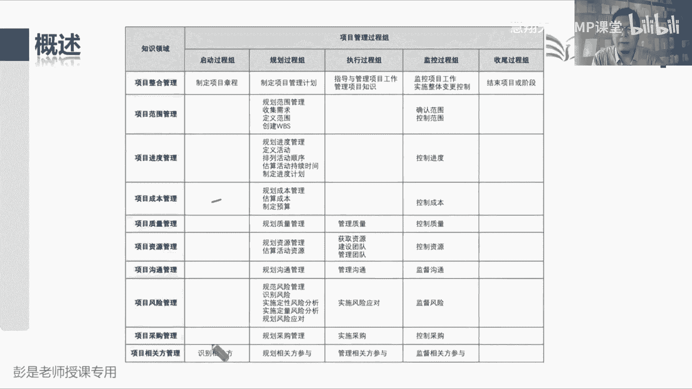
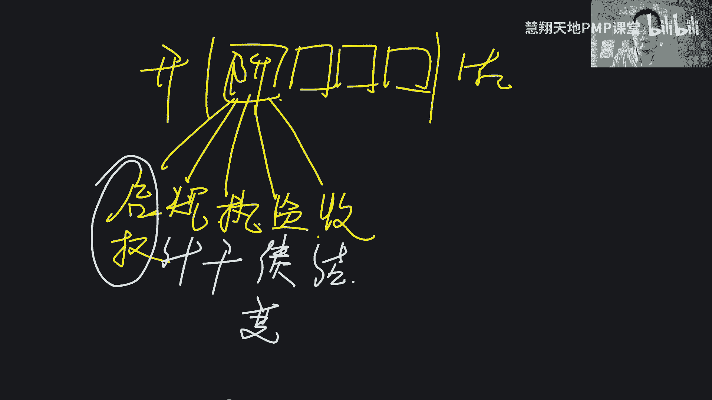
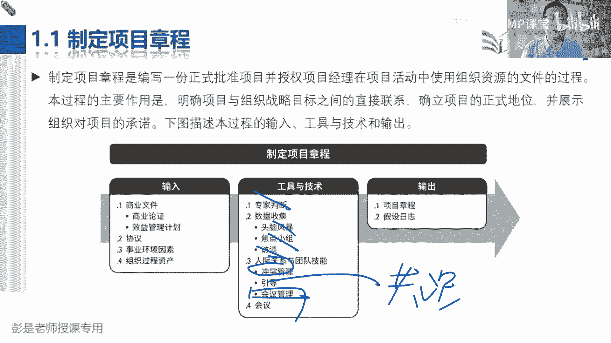

# 2024PMP认证考试课程（第六版+敏捷+第七版） - P7：第二部分 1.1项目整合管理概述、项目章程 - 慧翔天地PMP课堂 - BV1By411b7qM

然后教材里面第二部分呢就是五大过程组，十大知识领域，49个管理过程，以及呢最后所有工具技术的汇总，咱就开始沉浸式讲解了啊，说项目经理管项目需求评估，商业论证，效益管理计划制定，然后呢咱作为项目经理啊。

走马上任，想想想一想这个项目到底怎么把它完成，项目结束以后呢，把我们的成功可能要移交运营，那我们主要管什么东西呢，就是范围进度成本质量都快好，省就有了左边这四个相对来说常见的成功标准，除此之外呢。

我们还要考虑资源呐，沟通啊，风险啊，采购啊，干系人怎么管，在完成这些管理工作的过程中，在思考用什么样的工具技术，然后有了九个知识领域，我们高高在上，指挥棒，我们发号施令，运筹帷幄，指点江山。

组织协调大家去干活，所以呢九个大臣从范围一直到相关方，咱是个集体，不能各扫门前雪，需要再加一个整合管理来负责组织协调，运筹帷幄，最后就变成了十个知识领域，那就涉及到49个管理过程。

这章非常经典的叫五大过程组，十大知识领域，49个管理过程，这张表，这张表从今天下课以后呢，就给大家留一个作业了，尽快的把这这张表格里的内容啊，需要大家去把它背下来记住，知道我们49个管理过程。

考试的时候才能够帮助我们更精准的去判断，现在这个项目遇到的情况，我们应该做什么事情，这就是标准的解题思路，现在我们是启动过程组啊，还是规划呀，执行啊，监控啊，还是收尾，横向的去思考，现在我是要管进度。

管成本，管质量，管资源还是管风险呢，横向移定位啊，就知道我们要开展哪一个管理过程了，最后呢再去思考开展这个管理过程的时候，我们需要什么样的输入啊，输出啊，可能会用到什么样的工具技术啊。

或者是让我们去判断这些管理过程，和其他管理过程之间的关联关系，逻辑关系，所以后面大家整个备考的过程中，尽快的把这张图这张表背下来，可以帮助我们解题的时候思路更清楚，这样呢等到后面习题讲解。

尤其是模拟考试综合训练的时候，你才能更好的更好地掌握我们未来考试的时候，怎么推理，怎么判断，怎么分析，掌握这个能力，所以要求大家尽快的背啊，并且呢这张表啊背的时候啊，技巧不要看起来不要看起来很多。

就是觉得没把握啊，战略上战略上轻视，战术上重视是有技巧的，先搞定五大过程组，先搞定五大过增储整合这一章等会给你换一个，换一个黑板吧。

咱之前已经知道了，项目从开始到结束，我们把它分成了N个阶段，阶段划分的主要作用呢，就是每个阶段有每个阶段的主要工作内容，对不对，这就更好管理了，然后呢每个阶段要想开始啊，就都需要得到授权。

那就有了启动过程组，主要是给我们做授权，然后每个阶段的工作都要有计划呀，告诉我们什么时候做什么事啊，所以呢每个阶段又都有规划过程组，那计划定好了之后，每个阶段的工作都要按照计划去执行，就有了执行过程组。

最后呢这个阶段啊，我们还需要监督控制工作的执行情况啊，所以就有了监控过程组，最后当前这个阶段完成之后呢，我们还要打扫战场做收尾，把当前阶段阶段的成果移交到下一个阶段，然后呢该总结的总结，该归档的归档。

这就带出来项目生命周期，每个阶段之中都有五大过程组，那五大过程组的关键词呢，启动就是授权，规划呢就是做计划，执行的就是干活监控两个词，一个叫绩效，看看这活干的怎么样，一个叫管好当前知识领域。

管好项目中的变更，对不对，哎所以他两个关键词，一个叫管绩效，一个叫管变更，最后首尾就是结束项目，或者是结束项目中的某一个阶段，打扫战场，这就是五大过程组带出来的六个关键词。

六个关键词再一变形就是项目经理干的活了，也就是整合这一章六个管理过程，整合这一章六个管理过程又是什么东西呢。

看看啊，启动过程组我们需要得到授权授权，你不得有个文本文本文字上的东西吗，书面的东西吧，不能空口无凭啊，所以章程就是我们的尚方宝剑对对，任命项目，任命张三是这个项目的项目经理，我们就得到了正式权利。

奖励权利，惩罚权利诶，所以制定项目章程，这个管这个管理过程就是写一个项目的任务书，就是写项目的任务书，说清楚这个项目经理是谁，说清楚项目经理有什么样的权利做授权授权。

我们开始项目或者是开始项目中的某一个阶段，那整合这一章，第二个管理过程叫制定项目管理计划，这不是做计划，然后呢到了执行过程图啊，我们按照计划去干活儿，项目经理啊不干活啊，对我们指挥棒。

所以叫指导与管理项目工作，指导呢就是领导力啊，管理呢就是用命令让对方干活，对不对好，所以叫指导与管理项目工作，到了监控过程组两件事，一个叫绩效，一个叫变更，那监控项目工作。

我们要给领导汇报整个项目的工作情况，这是分析绩效的实施，整体变更控制，我们要管理好所有的变更，这就叫整体变更，控制绩效和管变更，最后呢当前阶段结束，或者是当前是最后一个阶段，项目结束。

那咱就结束项目或阶段，这就带出来五大过程组，六个关键词，六个关键词就推出来，整合这一章六个管理过程了，有了这六个管理过程，最后再记一个单独的东西，就是执行过程组啊，我们还有一个任务呢叫管理项目知识。

管知识管知识，看看我们在项目中学到了什么东西，把学习到的东西给他沉淀，总结积累下来好，所以整合这一章单独记五大过程组，六个关键词带出来七个管理过程，搞定搞定之后啊，再看看九个大神，从范围到相关方。

我们会发现很多有规律的事情，什么规律呢，规划范围，规划进度，规划成本，规划质量，每个大臣干活之前，都要先规划一下当前这个知识领域啊，怎么管，如何开展这个知识领域的管理工作，都得规划一下。

所以就有了九个规划管理过程，那规划完了，你不得善始善终嘛，所以到了九个大神手里啊，又都有控制范围，控制进度，控制成本，控制质量，做好当前知识领域的监督和控制诶，就有了九个监控过程组的管理过程。

291 18了，291 18，剩下的我们再找一找有各色的比较特殊的，比较突兀的东西啊，比如说负责范围的同事诶，您在范围这一章除了控制范围，还有一个事儿啊，叫缺人范围，这和其他人不一样。

确认范围这个单词是什么意思呢，验收，让客户让甲方对咱的成果，对咱项目的产产出的可交付成果，进行正式的验收，他是这么一个工作，所以确认范围就是做验收这个单独记，单独记完了之后啊，再看看哎呀。

负责相关方的大臣，你和别人不一样啊，别人在启动过程组都没活，只有你在启动过程中有一个识别相关方，识别干系人这么一个事儿，这也是字面意思吧，就是看一看谁和项目有关，能够影响项目，受到项目影响。

自认为受到项目影响的人都有哪些人，哪些人群体诶，就是这么一个管理过程好，所以现在我们现在已经知道了，整合这一章七个管理过程，然后九个规划，九个监控，一个确认范围，做验收，一个识别改写，27个过程。

搞定了27个过程搞定，我们一共49个过程，搞定27个，还剩22个，这就是需要各位同学先尽快的，尽快的熟悉一下这些管理过程的主要作用，做预习，预习一下这些管理过程的主要工作内容。

他具体的什么输入输出工具技术啊，都可以先不看的，先知道他干啥的就行了，比如说像收集需求，这都没啥可解释的了啊，收集需求就是看看干干写有什么样的要求呗，对有什么样的期望，以此类推。

相对来说其实也没有那么难好，这就是给大家大概说一说这个表怎么背，它有技巧的，然后呢今天下课之后，大家就可以开始啊，把这张表打印出来，打印出来啊，放在你的工位上，放到你的包包里，放到你的床头。

放到你的餐桌上，随时随时可以拿出来把玩把玩啊，随时的检查一下这49个管理过程，知不知道他们是干啥的，看到名字能够反应过来，他主要工作内容基本上就差不多了，基本上差不多了啊。

所以尽快的给大家留这么一个功课啊，尽快的把它背下来，背下来之后呢，知道每个管理过程主要负责做什么事情，都有个过程啊，不要求不要求太不要不要求一步到位，需要有个过程，坚持坚持坚持，这是给大家今天课后啊。

班主任会发到群公告里，非常重要的一项任务，背的越快，背的越熟，后面分析的时候，听课的时候，做题的时候效率就会越高，咱就可以做到同步了，你就知道我在说啥了，不然呢还要解释这个管理过程做什么事。

这个管理过程做什么事，这沟通的效率都打折扣了啊，好，那接下来我们就开始沉浸式讲解这些，这些管理过程到底做什么事呢，那整合这一章啊，其实学完了整个这章其实学完了没啥东西啊，制定项目章程，制定章程。

那他的输出肯定就叫项目章程，制定项目管理计划，他的输出肯定就叫项目管理计划，这就是我的劳动成果呀，章程的作用是什么呢，告诉咱做什么事，对不对，看看耳熟不耳熟啊，what告诉项目经理，你要多快好。

省多长时间，花多少钱，产出什么样的成果，达到什么样的质量标准和要求，诶，告诉我们做什么事情，就是项目的任务书，告诉兄弟们，项目经理是谁，告诉兄弟们这个项目做什么事，那项目经理接下来拿到章程。

拿到任务书之后，我们会怎么想呢，how啊，这活怎么干呢，对对，怎么把这个店给他装修好啊，什么时候画图纸啊，什么时候弄墙啊，什么时候弄地呀，什么时候调试设备呀，嘿制定我们整个项目的作战计划，行动方案。

告诉大家什么时间做什么事，从而让我们这个奶茶店可以开业，可以开业啊，好这就是制定项目管理计划，做行动方案的那1。3指导与管理，项目工作按照计划去干活，得到什么呢，他的输出就是叫可交付成果。

就是我们的劳动成果呀，按照计划画好设计图，成果就是我们的图纸，按照计划给甲方画好装修效果图，这是我们的劳动成果，按照计划把地面给它浇水泥，铺好地板砖，这是我们的劳动成果。

按照计划把这个奶茶店的设备给他买过来，安装好，调试好，这是我们的劳动成果，所以就是按照计划去干活，得到可交付成果，这是1。3，但是呢项目经理又不一定参与具体的工作，所以叫指导指导指导就想到那个指挥棒。

对不对，张三去画图纸，李四去弄墙，王五啊，你把这个设备给他调一调，赵六你把那个奶茶摆好咯，诶我们是指导和管理项目工作，管理呢就是用权力让告诉大家，什么时间做什么事，另外呢我们还是热情的服务员啊。

所以该指导的指导，该教育的教育，该帮助的帮助唉，就用了这么两个单词好，那1。4，管理项目指使他在执行过程组，他在执行过程组的目的啊，执行过程组是什么呢，告诉我们要持续开展持续开展的事情啊。

那我们一定要猜到，这个管理过程为什么放到执行过程组，说管理知识，管理知识，看看我们在项目上学到了什么东西，放到执行过程中啊，就在提醒我们呀，要防止知识的流失，要防止知识的流失，这个实际上大家在工作中。

就经常可能遇到的问题啊，就是张三离职了，张三离职了，交接工作没做好，结果呢文档要啥没啥对吧，然后问李四问啥啥不知道，这就知识流失掉了，知识就流失掉了，所以他就确保确保做好这种知识的沉淀呐，积累呀。

总结呀，唉把我们学到的东西给它记下来，留痕留痕留痕，所以他的输出就好猜了，他的输出就叫经验教训登记册，经验教训登记册，把我们在工作中吃一堑长一智，学到的东西嗯，包括经验知识，诀窍技巧给他沉淀下来。

积累下来，防止由于人员的流动导致的知识流失，所以这个事情吧也需要持续开展，定期开展哎，就把它放到了执行过程组好一点，四大概也知道怎么回事了哈，先听先听听框架，听完框架一会再还会讲的。

不是说真的练完这个目录就不讲了啊，另外理论上来说，这些管理过程都可能会更新组织过程，资产刚才不是说了吗，做任何事情都可能会更新组织过程，资产的，做任何事情都可以参考，事业环境因素和组织过程，资产嗯。

所以大家听课听课慢慢学啊，先听结构，听框架，听逻辑，听明白之后呢，我们再看细节，对不对，好所以1。4，管理项目知识主要是防止知识流失，所以呢需要持续开展，把我们学到的东西给它记下来，他的输出。

这叫经验教训登记册，那到了1。5啊，监控项目工作就不得不提，上节课说到的什么数据呀，信息呀，报告啊，还记得是什么东西吗，说员工每天干了啥事，这叫原始的观察结果和测量值，叫工作绩效数据。

这数据不直接交给老大，因为我们要交给各个部门的管理者，变成各个部门的工作情况，就变成了工作绩效信息，然后各个部门的这个工作绩效信息再交给领导，变成整个公司的情况，就得到了工作绩效报告，那1。

5监控项目工作，这是项目经理出报告，来汇报整个项目的工作情况，项目经理出报告来汇报整个项目的工作情况，那这活怎么干呢，我们需要九个大神，告诉我们每个知识领域的工作情况，所以看看这张表。

他的逻辑就变成了这样，作用非常厉害的啊，我们指导与管理项目工作，会产出原始的工作绩效数据，我们在干活的过程中会记录下来，每天做了什么事情，花了多少钱，用了多长时间，这都叫原始的工作绩效数据。

这个绩效数据不直接交给项目经理，我们需要把它交给下面的九个大臣，九个部门从范围一直到该系人，所以这一堆管理过程输入工作绩效数据，那这堆管理过程拿到这些绩效数据啊，经过他们的分析。

就变成了每个知识领域的工作绩效信息，以此类推，负责范围的同事拿到和范围相关的数据，然后呢分析一下目前项目的范围是个什么情况，就得到了范围的绩效信息，负责进度的同事拿到和进度有关的数据。

经过他的分析告诉你进度提前，进度落后就变成了进度的绩效信息，负责控成本的同事啊，拿到和成本相关的绩效数据，经过他的分析变成告诉你成本是超支还是节约，就变成了成本的绩效信息，以此类推，九个大臣。

这活都是这么干的，都是这么干的哈，他怎么干活呢，数据就是现实，计划就是理想，他就是用现实和理想做比较，看看有没有出入，有没有偏差，从而告诉你范围是该干的活，该干的活都干了没有进度呢，是提前还是落后。

成本呢，是超支还是节约质量呢，是缺陷多还是缺陷少，资源呢是有没有浪费的情况，以此类推了，所以这一大堆管理过程，它的输出都叫绩效信息，我们就得到了九个知识领域的记账信息，九个知识领域的工作情况。

提交信息交给谁呢，他作为监控项目工作，这个管理过程的输入交给项目经理，项目经理拿到九个部门的工作情况，经过我们的总结归纳概括，分析评估就变成了这个管理过程的输出，整个项目的工作绩效报告。

就是这样一个数据流，咳咳咳好，先听听完一会再画，再给大家画，告诉你怎么画啊，好所以，1。5监控项目工作，我们拿到九个知识领域的工作绩效信息，经过咱的分析总结，归纳概括，变成整个项目的工作绩效报告。

这个管理过程就下班了，而1。6呢实施整体变更控制，它就是我们要想办法管理好所有的变更，为什么要，为什么要进行整体变更呢，为什么要实施叫整体变更呢，就是因为呀我们要考虑周全，就是因为我们要考虑周全。

考虑周全，考虑周全意味着什么呢，我从这讲了哈范围的变化引很可能引起啊进度，成本质量，资源风险沟通采购干行，带来一系一系列的连锁反应，如果客户想增加范围，可能导致我们进度延误，对不对，成本超支。

可能我们还需要投入更多的资源，会带来风险，引起质量的问题，以此类推了，牵一发动全身的，然后以此类推吧，如果我们进度落后了，我们想尽早完成，提前完成，我们可能去增加资源，增加资源又会导致成本上升。

可能带来质量问题，引发风险，会有一系列的连锁反应，所以实施整体变更控制的主要作用是啥呢，我们要确保我们是个集体，任何一个知识领域发生变化，正咱是皇帝啊，任何一个知识领域发生变化，朕都要通盘考虑一盘棋呀。

大局观呐，所以它叫实施整体变更控制，从整个项目这个层面去把它考虑周全，考虑周全，综合分析，综合评估，而不能只考虑某一方面，这就片面了，对不对，所以它的主要作用就是这个啊考虑周全。

最后呢结束项目或阶段没啥可说的，项目结束或者是阶段结束，我们要总结归档，做好工作的交接，把成果移交到下一个阶段，或者是把最终成果移交给运营，移交给客户对不对，所以他主要输出就叫最终产品服务成果的移交。

嘶好各位亲，这七个管理过程它的主要作用大概听明白之后，这就是大家未来学习的方法，先知道这些东西做什么，然后呢就能猜出来，他可能需要得到一个什么主要的输出，这是底线，这是底线啊，很多输入啊根本就不用去记。

记得住，记不住不重要，它中间的工具技术，除非一些有代表性的工具，需要大家掌握，很多工具都是通用的，这东西也不太需要去记，所以大家目前这个阶段主要就是记得他干啥事，他会得到一个什么输出。

会得到一个什么成果好，所以章程主要是授权他的输出，就叫章程，制定项目管理计划，就是定行动方案，所以他的输出就叫项目管理计划，指导与管理项目工作，按照计划去干活，我们就会得到可交付成果，管理项目知识。

看看学到了啥，哎吃一堑长一智，所以它叫经验教训，登记册监控项目工作，咱是皇帝哈，我们上面还有什么发起人，项目集，项目组合公司高层董事会董事长这么多话，所以呢我们要写整个项目的工作绩效报告，然后要1。

6实施整体变更控制，它其实现在没什么需要记的，输入输出就是我们要考虑周全，考虑周全，牵一发动全身，我们对任何一个变更，都要从整个项目上给他考虑清楚，会带来什么样的连锁反应，需要做出什么样的调整。

最后呢结束项目或阶段，就是工作完成，我们就移交，把创造的咳成果移交给客户，移交给运营，爱谁谁爱谁谁啊，到底移交给谁不重要，对不对，谁需要就给谁，有可能是下一个阶段，也有可能要移交运营，也有可能是客户。

我们奶茶店画好图纸移交给施工方，这不就是下一个阶段吗，最后呢奶茶店装修完成移交给客户，就移交给咱，咱就开始运营了，好这是大概这七个管理管理过程，它的主要作用，还有比较关键的输出，搞定之后啊。

那接下来说这段文字课听一遍就完事了，项目整合管理，对隶属于项目过程组的各种过程和活动，进行识别定义，组织什么协调整合呢，兼具什么统一合并沟通，建立联系的性质，因为我们要确保。

确保大家能够有效的有序的运转对，所以让其他一大堆管理过程能够相互协作，相互配合，所以整合管理他具体做什么事，这些都不要求大家去背啊，你看一看，知道意思就可了，好那接下来就是这张图。

这张图大家目前手头的教材里没有没有啊，但是呢教材里面有这么一张图，就是每个知识领域，它有一张总体的ITTO图，ITTOI呢是指这个管理过程的输入，input o呢是指这个管理过程的输出，Output。

然后工具和技术就是technical and tooth，指的是工具基础，就简称ITTO图，他有这么一张总体的啊，那总体的啊，大家其实就可以先听听完了呢，再再再再来自行决定要标记什么东西。

自己决定到底要标什么啊，不很多东西不要求强制性的去背了，现在第一个管理过程，制定项目章程，出章程，这咱知道了，第二个管理过程，制定项目管理计划，出项目管理计划，这咱知道了。

第三个管理过程指导与管理项目工作，按照计划去干活，得到可交付成果，这咱也知道了，管理项目知识，我们要输出经验，教训登记册，把知识把知识给他记下来，然后呢监控项目工作，所以呢输出整个项目的工作绩效。

他叫报告，这也知道了，那说到报告，再看看数据流指导与管理，项目工作会得到原始的观察结果和测量值，就有了工作绩效数据，这个玩意儿交给九个大臣，这个玩意儿作为九个大臣，监控过程组那一大堆管理过程的输入。

九个大臣拿到这些东西呀，和理想和计划做做比较，就得到九个知识领域的工作绩效信息，工作绩效信息，那么作为监控项目工作，项目经理出报告这个管理过程的收入，我们拿到九个知识领域的工作绩效情况。

对范围的绩效信息，进度的绩效信息，以此类推，我们总结归纳概括，变成整个项目的工作绩效报告，它是有这么一个数据留在这的啊，所以数据信息报告这个逻辑关系单独记好搞定，再看章程，计划成果，经验教训，绩效报告。

然后呢，数据信息报告听不懂，我不知道咋讲了，前期上一节课应该是没听吧，不能再粗暴了，不能再再直白了，上一节课想一想，员工部门和老板，这还听不懂啊，如果还听不懂，我这么讲，学生班长和年级。

这不都是层级关系吗，对吧，幼儿园一班，幼儿园二班，幼儿园三班，这就是部门幼儿园园长，这就是领导幼儿园具体的每个班级的老师，这就是员工，员工就这是数据，一班二班三班就是信息报告。

就是园长就这样一个层级关系啊，海里不理解，我不知道咋解释了啊，不能再粗鄙了吧，所以第一节课没听到的同学建议呢，大家按照顺序听，按照顺序听，记不住呢，就再去复后，再去复听啊，再去看书啊，刚才说了吧。

49管理过程不不尽快背下来的话，后边的课你一步一个坎儿，这也不知道，那也不知道，你说这可咋讲啊，每节课恨不得把整本教材翻译一遍，给解释给解释啊，这就费劲了啊，好一直在听啊，听的就不专注。

这为什么听不懂啊，刚才那个例子听得懂吗，幼儿园听得懂吗，一班二班三班，这是部门，上面是园长，下面有员工，张三李四王五赵六，这四个老师，老师写日志，绩效数据，每个班的情况，绩效信息，整个幼儿园的情况。

绩效报告，这逻辑有那么难理解吗，还需要换个什么场景啊，小学公司都讲过了吧，反复讲了，反复讲了至少七八遍了，咱要提高效率啊，所以按照节奏按照节奏一定要保持同步啊，不然这课讲起来太累了，好拐弯拐回来。

所以员工干了什么事，就叫原始的工作绩效数据，各个部门的情况呢就叫绩效信息，项目经理有哪些部门呢，我们不是有九个知识领域吗，范围进度成本质量资源，以此类推吧，项目经理不就是皇帝吗，我们是董事长啊。

所以给汇报整个公司的情况，整个项目的情况就可以得到工作绩效报告嗯，不解释了啊，再解释不知道咋解释了，好，再看PPT啊，专注专注，专注章程计划成果经验教训，绩效报告，搞定数据信息和绩效报告那个逻辑关系。

要能给他梳理清楚，然后再往下实施整体变更控制，实施整体变更控制，它重要的点是什么呢，输入，因为我们需要大家把所有的变更请求，全都交给项目经理，无论是范围的变更，进度的变更，成本的变更，质量的变更。

沟通的变更，不管是什么的变更，所有的变更都要交给项目经理，因为我们要一盘棋，从整个项目层面去综合的分析和评估，变更对项目造成的影响，所以他的收入叫所有的变更请求，无论是哪一个管理过程。

输出的变更请求全都来到这个管理过程，作为这个管理过程的输入带到场景里，就是不管你公司里面张三李四王五赵六，不管是谁客户啊，什么发起人呐，不管是谁在做什么事，发起的变更全都交给项目经理。

就牢牢的记住这个原则啊，好所以他的收入叫变更请求，来自于任何一个其他管理过程，剩下就是48个过程了吧，搞定那实施整体变更控制，实施整体变更控制啊，他比较重要的输出是什么呢，这单词很难理解吗，变更日志。

咱整个学习的过程中，有一个非常重要的理念叫什么呢，好记性不如烂笔头啊，发现啥记录啥，发现啥记录啥，发现啥记录啥，那收到变更请求，我们要找个文档给它记下来，所以这叫变更日志，他会把所有的变更做统一的记录。

诶，这是他的这个管理过程的输出，那刚才那个书上那张ITTO它没有变更日志，它其实是藏藏起来了啊，它藏到项目文件更新下面去了，项目文件更新后面一会看细节，它里边有一个变更日志，他是藏到这去了。

好把这个管理过程输出变更日志搞定，那剩下的啊就需要单独记这个批准的变更了，批准的变更，看看指导与管理项目工作收入，有一个叫批准的变更请求，这是个什么逻辑呢，它要强调什么呢，他为什么说批准的变更，哎。

我们把它输出以后，作为指导与管理项目工作的输入，他想强调啥呢，没错吧，诶有同学说执行变更一旦被批准，变更一旦被批准，我们要第一时间通过指导与管理项目工作，这个管理过程通知兄弟们，计划有调整。

就这个意思吧，对不对，就像咱比如说啊，下午咱停课不上课了，下午停课不上课了，这是个变更啊，啊这个变更一旦被批准，要不要第一时间通知咱同学们呢，打比方，假如下午要停课，然后呢老板同意了这个变更得到了批准。

要不要第一时间要不要第一时间通知兄弟们呢，对不对，就这道理吧，所以他在强调通知落实执行的重要性，变更一旦得到了批准，变更一旦得到了批准，我们要第一时间把他告诉兄弟们，干活干，别看错了，就这意思。

就这意思啊，这个输出不要求大家去背的哈，知道它的作用，为什么强调它就行了，带带到工作的场景，带到工作的场景，应该不太难理解吧，嗯好，那最后结束项目或阶段这个管理过程是什么呢，唉最终产品服务成果的移交。

最终产品服务成果的移交，就是我们要把当前阶段的成果，移交到下一个阶段，或者是把项目最终的成果移交给客户，移交给甲方移交，爱谁谁，对不对，那移交之前最重要的标志性的输入，这就一定要记住了，就叫验收。

没验收怎么能移交呢，验收通过钱货两清啊，所以他的重要的输入叫验收的可交付成果，我们的成果经过验收之后，我们就可以把它交给客户了，钱货两清，对不对，哎所以他输入有一个验收的成果，这需要有点印象。

然后他输出了一个最终报告，像这个东西啊，现在你记得住，记不住根本就没关系，最终报告是什么呢，这是最终阶段的报告对吧，或者是整个项目的最终报告，做一个阶段性阶段性的总结，或者是整个项目的总结。

设计工作做完了，我们总结一下设计阶段的工作，然后施工阶段完成了，我们总结一下施工阶段的工作，以此类推，要唉做阶段的总结，做项目的总结，这个输出不太需要刻意的去背啊，它和绩效报告的区别是什么呢。

绩效报告是定期汇报项目的情况，最终报告呢那就是阶段的情况，或者是整个项目的情况，字面意思好，所以听完了之后学到最后啊，你就会发现，不太需要去背这些输入输出，看到名字，看到他们的名字，知道他是做什么的。

就够了就够了啊，把它关键的作用掌握到位，他的输出是可以推导出来的，好先给大家大概说一下这章管理过程，还有他重要的输出，现在记不住，没关系啊，能听懂就可以，能听懂就可以，并且呢也没有那么复杂的逻辑。

对不对，好再往下了啊，那再看看这七个管理过程的主要工作，主要任务，这课课上这段文字咱就不念了，大家课后还是需要看的啊，用你那小眼睛不灵不灵的大眼睛看看去阅读，训练自己的阅读理解能力，咱不念了。

因为接下来我们就开始一个过程，一个过程的逐个击破了，所以这整体的东西没必要念了，好，那再往下项目整合这一章核心概念，这段文字听一听啊，说项目整合管理由项目经理负责，虽然其他知识领域可以由相关专家。

比如说成本呐，进度啊，风险呐，不刚才说咱有九个大臣吗，对不对，但是项目整合管理的责任不能被转，不能被授权或转移，只能由项目经理负责，整合所有其他知识领域的成果，并掌握项目的总体情况。

项目经理必须对整个项目承担中责，好这段文字读完了之后会有什么样的启发呢，会有什么样的启发呢，不是权责对等，刚才我们说，要想如果打造一个成熟的自组织团队，我们就可以授权了，对不对，我们就可以授权了。

唉放任型的领导力风格，但是呢权利可以交出去，锅甩不出去啊，就这道理吧，权利可以交出去，锅甩不出去，好弱矩阵要承担吗，刚做完题呀，其他同学回答他，若矩阵组织结构之中，职能型组织结构之中。

我们要不要承担最终责任呢，不要担不起啊，权责对等啊，对不对，哎权责对等，权责对等，所以接下来就是潜规则，什么潜规则呢，整本教材包括未来大家做的题，做的题啊，默认我们都是平衡矩阵，默认都是平衡矩阵。

均衡矩阵，因为只有平衡矩阵开始，我们才有权利，好所以这段文字和前面那段知识点不冲突啊，默认咱都是平衡矩阵，只能行弱矩阵，确实哎这句话跟我没关系，我扛不起，对不对，好，所以这段文字他用了很多绝对用词。

只能所有什么不能必须，最终这不都是绝对用词吗，那未来大家在复习的过程中，看书的时候啊，看到这种绝对用词就100个五角星，100个五角星啊，绝对绝对绝对是需要我们记住的，绝对绝对需要我们记住的啊。

绝对用词，包括否定词都是绝对用词吧，不能不可以不行，对不，这就一定要记住，因为考试的时候，这是我们判断知识点的重要原则好，所以这段文字就在说呀，工作可以委托，可以授权让其他人去处理。

但是呢最终责任甩不出去，我们要对这个结果负责任，对没有明确说明是什么矩阵都视为平衡矩阵好，再往下就再说整合管理的什么，什么项目和项目管理本质上具有整合的性质，就是牵一发动全身，这不解释了啊。

因为九个知识领域随便改一改，都可能引起一系列的连锁反应，所以呢我们需要整合，整合整合就永远想着乐队的那个指挥，牵一发动全身的，什么时候弹琴，什么时候敲鼓，这不得组织协调吗，嗯那再往下说。

整合管理指的是巴拉巴拉，这就不念了，看看课后看一遍就可以了，这就是七个管理过程做的事了，好那再往下一点一，制定项目章程开始了，开始讲49个过程了，输出章程搞定，这我知道了。

任务书告诉我们这个项目到底是个啥，做什么事儿，告诉我们这个项目多长时间，花多少钱，把这个奶奶茶店装修好多长时间，花多少钱，把这个设备给他买到位，诶，告诉我们多快好省，对它是我们前进的方向。

那输出搞定一个啊，第二个输出啊，假设日志，假设日志又是什么鬼呢，这后面一会需要看文字了吧，就是学习方法呀，未来大家复习的时候千万不要只看这张图啊，这张图是检查我们对概念的理解对吧。

每个单词都认识就可以了，说明你熟悉术语，那如果不理解呢，还要看后面具体的文字描述，具体文字描述啊，咳好，所以假设日志未来会记录所有的假设条件，假设条件和制约因素，制约因素就是对我们工作形成限制的东西。

奶茶店消防没没批准，咱就不能开业呀，奶茶店你没有什么工商工商营业执照，咱就不能干活啊，员工需要有健康证啊，这都是各种各样的致病因素，那假设条件是什么呢，是我们主观上认为他成立的事件或条件。

这后面一会看文字，大概知道他是什么东西，就可以相对来说没有章程重要性高啊，好制定项目章程出章程，那再看看看看收入啊，商业文件诶，认识商业论证，效益计划这种东西为什么作为输入呢。

因为我们要让章程和可行性研究的内容，保持一致性，对不对，不能有特别不能不能有出入啊，人家前面售前的时候说这个项目工期三个月，咱章程里说工期八个月，这肯定不行的，所以我们根据发起人制编制的商业文件。

来写章程，那除了发起人编制的商业文件，写章程，我们还要参考一个重要的因素是什么呢，协议如果是给业主，给甲方做项目，如果要给甲方做项目，那双方可能签协议，签合同啊，协议有法律效力，他也是我们制定章程里面。

一个比较重要的参考元素，所以收入有没有协议根本就不重要啊，未来复习的时候看到他唉收入有协议，能把道理讲明白就够了，收入都大部分收入都是不需要去记的，知道他为什么作为收入就够了好，所以我们要根据商业文件。

根据协议写章程，另外呢我们还要看一看有没有外部的，内部的事业环境因素，开奶茶店，你不得看看什么法律法规吗，什么食品安全法这种东西吧，诶事业环境因素，另外呢再参考一下咱企业的过程，政策流程，看看历史信息。

看看经验教训，参考组织过程资产，这就是他这几个输入放在这了，好搞定，所以收入不要求背输出章程，这肯定要记，假设日志其实还好，记得住，记不住可以啊，看名字能反应过来，它里边两部分内容一标一会。

假设是质假设条件制约因素就够了，然后最最后啊等大家复习的时候，最后再去看看工具技术，并且，大多数管理过程的工具到底都有什么东西呢，是不要求去记的，说老师啊，要不要把制定项目章程。

这123456788个工具都给他记下来，背下来不需要的，因为大部分的工具都是通用的，什么叫通用呢，就是其他管理过程也用得上，其他管理过程用得上的通用的工具啊，就不不需要去背的，但是我们需要做到什么呢。

看到这个工具能反应过来诶，他有什么特点，它通常在什么场景下，什么情况下去使用，达到这个状态其实就可以了啊，就像大家第一反应吃面条，用什么东西呢，筷子对不对，达到这个效果其实就差不多了。

并且很多工具啊也不需要担忧，看起来挺多，130几个，你说像专家判断头脑风暴访谈对吧，开会就像这样的工具，没什么，没什么深奥的道理，很多工具很简单的啊，所以记住啊，学习技巧先搞定这个管理过程的作用。

然后呢知道一些他比较关键的输出，大部分的收入呢不要求大家去背的，另外呢最后有一有一些管理过程，它有一些有代表性的工具，也就是专用的工具，其他人用不上了，那咱就单独记一记，单独计，它有特殊性特殊作用，好。

所以这就是后面大家先给大家说一说，这个课怎么听，怎么学，听一听这个课怎么听，怎么学啊，反应是啥，爱啥啥，对，爱是啥是啥，不重要啊，不重要，可不可以用叉子呢，可以啊，可不可以用筷子呢，可以啊。

能不能用勺呢，可以啊，能不能用手呢，可以啊，能不能趴地上舔呢，可以啊，想怎么吃就怎么吃，不犯法吧，不犯法哈，所以工具主打一个灵活，我们要知道这些工具在什么条件下，帮助我们做什么事，解决什么问题。

这是先给大家说一下未来的学习方法，学习的思路，王涛同学，现在我们还没讲到，假设日志呢，那一会讲到的时候再问呗，岂不是更好，是这个道理吧，现在我们还没讲到，说老师啊，我在想听一下绩效数据还没讲到呢。

讲到了自然而然就会说呀，现在给大家说一说学习的方法，不代表着说这这这个管理过程，后边内容就全都不讲了，让大家自学了，不是这个意思啊，所以跟节奏跟节奏好，这就是给大家先说一下这东西到底未来怎么学。

所以制定项目章程，那他的输出项目章程需要我们掌握输入，没什么需要记的，工具，没啥需要记的，因为通用的，所以看看工具专家判断专家是什么呢，他在某些方面有经验，有技能，有技巧，有积累，有沉淀。

那么他就是这个领域的专家，新男同学最懂得怎么用叉子吃面条，他就是用叉子吃面条的专家，教我这个东西对，所以专家判断任何一个管理过程都可以有，到底谁是专家呢，不重要对不对，好头脑风暴是什么呢，脑爆脑爆。

大家其实工作中生活中都在用，比如说今天中午吃点啥，现在实在不知道吃什么了，看看有没有人有一些新的想法呀，新的观点呢诶它主要是用于发散思维，创新搞创意，它也是任何一个管理过程都用得上的东西。

那访谈需要解释吗，字面意思吧，焦点小组不好裁，这才是我们需要学的重点学习方法啊，焦点小组看名字猜错了得，我们需要重点学一学，焦点小组，焦点小组刚才我已经用过了，现在我们在说学习方法。

不要聊其他无关的话题，这就是焦点小组最重要的作用没错，三进同学说的对，就是防止跑题，今天我们这个会议主要讨论一下，项目章程里面写什么东西，明天我们这个会讨论一下，假设日志写什么东西，聚焦聚焦focus。

防止跑题的，因为大家日常开会最容易最容易做的事，就是跑题，聊一些无关的话题，这影响是影响其他人的时间，浪费时间了好，所以专家判断焦点小组头脑风暴访谈才知道，知道它的主要特点就可以了。

它可以适用于很多方法，后面的冲突管理一定是重学习重点啊，咱们讲讲到后面工具之后再展开，说了好，这就是大家先给大家说一说什么会议管理呀，就是开会有规矩引导呢，就是去想办法想办法让大家达成共识。

张三想吃麦当劳，李四想吃肯德基，那怎么办，想办法让大家达成共识呗，就需要引导技术，先听一听。

