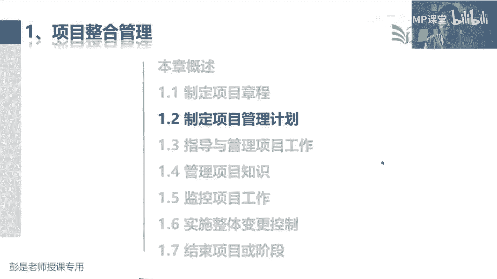
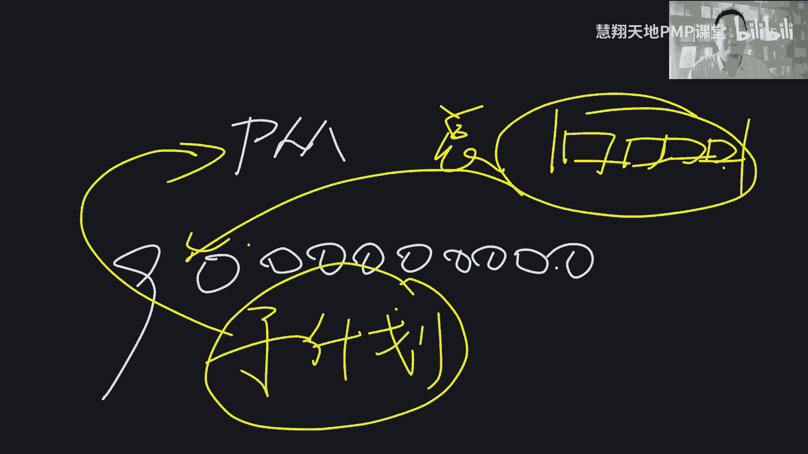
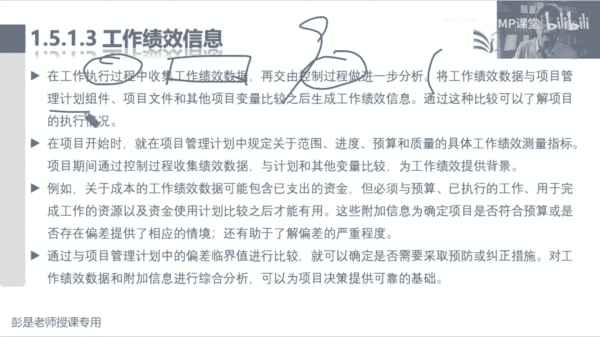

# 2024PMP认证考试课程（第六版+敏捷+第七版） - P8：1.2-1.6 制定项目章程，项目管理计划 - 慧翔天地PMP课堂 - BV1By411b7qM

一共七个管理过程，叫制定项目章程，写章程，明确方向，告诉我们到底要做什么事，对不对，花多长时间花多少钱，反正什么样的产品服务成果啊，达到什么样的质量标准和要求，通常就是告诉我们项目的目的目标，成功标准。

这些东西啊告诉咱做啥what，然后制定项目管理计划，咱就带着兄弟们去想这活到底怎么干，定整个项目的作战计划，整个项目的行动方案就是好，那接下来计划定好了之后，按照计划去干活，就会得到我们的可交付成果。

唉这就是指导与管理项目工作最重要的作用，那1。4管理项目知识，为了防止知识流失啊，需要把我们吃一堑长一长一智的东西，给他积累下来，沉淀下来，记录下来，所以就得到了经验教训，登记册，1。5监控项目工作呢。

所以咱要出整个项目的工作绩效报告，全面的报告范围进度成本质量资源沟通风险，采购干协的工作情况全面报告，所以我们需要九个大臣先告诉我范围进度，成本质量资源沟通这些知识领域的工作情况。

就会输入各个知识领域的工作绩效信息，那1。6实施整体变更控制，是说任何一个知识领域发生变化，镇全都要管的操碎了心啊，所以我们要确保所有的变更都让朕，都让朕给他看一看，考虑周全诶，从整个项目层面去分析。

这个变更会对我各个方面造成什么影响，所以就是综合分析，综合评估，它输入叫变更请求，不管是谁发起的变更，都要交给朕，朕呢一旦一旦这个变更得到了批准，那个小细节就稍稍有点印象，变更一旦得到了批准。

那我们把它扔给1。3，作为指导与管理项目工作的输入，因为计划一旦得到了变更，变更一旦得到了批准，要第一时间通知兄弟们，计划有调整，那1。7结束项目或阶段，主要呢就是验收，验收通过以后啊，咱们就总结归档。

然后移交，所以他的输出就叫最终产品服务成果的移交，这是先有一个这么一个大概的印象，然后上午讲到了一点一，制定制定项目章程，它的输入没啥可记的，对商业文件我们要和项目启动之前，发起人写的这个可行性研究。

保持这种目标的一致性，如果是外部项目呢，咱还跟人家签协议，协议有法律效益，咋样有法律效力，我们章程不能违背协议里边的具体要求啊，那输出项目章程的百分之1万要记住的东西，假设日志它里边有什么内容呢。

一会单独记一记就可以了，然后中间的工具基础它都是通用的啊，没有什么有代表性的工具，专家判断，征求专家的意见，头脑风暴发散思维，焦点小组就是告诉我们要聚焦最后的访谈，就是客人家面对面的沟通和交流。

冲突管理呢，到时候咱们后面重点会单独讲到，工具基础再说了，引导呢就是想办法让大家达成共识，因为这个项目工期三个月，五个月，八个月，需要大家需要需要引导大家达成共识，对不对，得到一个一致的结果。

会议管理呢就是开会得有开会的规矩啊，它其实具体的内容也不要求大家去背啊，这个大家结合日常工作时工作中就能明白了吧，开会开会不能乱糟糟啊，咱们要定会议的目标啊，议题啊，议程啊。

然后确保按照会议的流程12345往下开呀，最后呢会后啊形成会议纪要啊，以此类推，就是做好会前会中会后诶都要做什么事，他具体的细节等到工具再说了，所以工具技术啊，大家完全完全不太需要花特别多的时间。

去仔细琢磨它啊，只要知道它应用于什么场景，有什么特点，并且大部大部分的工具看名字能猜对的，基本上就没啥可学的了，好那再往下看细节，说呀项目章程在执行组织和需求，组织之间建立起伙伴关系。

那我们在执行外部项目的时候，通常需要用正式的合同来达成合作协议，在这种情况下，仍然需要用项目章程来建立，组织内部的合作关系，来确保正常交付合同内容，所以变成人话，就是说呀章程和合同不一不是一回事儿。

章程合同是什么呢，一手交钱，一手交货，涉及到利益交换，对不对，双方达成合同，达成协议，达成共识，涉及到利益交换，我把钱交给你，你把东西交给我，章程不涉及到这种利益交换，它的主要作用就是告诉公司内部。

我们现在要做一个什么事，希望呢各位同志支持项目经理的工作，就往一个地方使，从而确保项目经理能够带领大家完成任务，实现目标，唉所以他就告诉我们，章程和协议不是一回事，不要用协议来替代章程好，这是这段话。

知道这个知识点哈，再往下说，章程一旦被批准，就标志着项目的正式启动，因为发起人写商业文件，商业论证来分析这个项目有没有可行性啊，有没有价值啊，一旦走完该走的流程，公司认可这个事哎。

才会让发起人去写商城对，才会让发起人去开始这个项目了，所以章程一旦被批准，标志着项目的正式启动，咳再往下第三行，第三行啊，说在项目之中，我们应该尽早任命，尽早确认并任命项目经理。

最好呢在制定项目章程时就任命，并且总应在规划开始之前就任命，他就考到一个是原则，一个是底线，原则是什么呢，越早越好，甚至某些企业在项目启动之前，需求评估商业论证，效益计划的制定。

在售前的时候就需要项目经理参与其中了，对不对，所以人民的越早越好，这样呢可以尽早的给尽早的参与到项目工作中，为发起人提出我们合理化的建议和见解，后面呢就是底线，至少我们应该在规划开始之前。

就任命项目经理了，否则谁带着兄弟们去做计划呀，就这道理吧，好这个小细节稍稍有点印象，最后呢倒数第二段说，项目章程可以由发起人编制，或者由项目经理或者是发起机构合作编制，这段文字看完之后啊，一总结。

谁爱写谁写不重要，对不对，谁爱写谁写啊，不重要啊，各种可能性啊，发起人写也可以，项目经理写也可以，哎咱和什么合作写也可以，但是项目章程，项目章程写完了之后，需要得到谁的批准呢。

啊教材上没有明确的告诉我们，但是后面一会有文字会说的，章程制定完成，一定要得到谁的批准啊，哎没错，发起人，牢牢的记住这个知识点啊，章程一定要得到发起人的批准，因为他来帮助我们确认章程里面的内容。

他要他要把关的，他要负这个责任，他在项目启动之前需求评估商业论证效益计划，他制定考了一大堆东西啊，所以他要确保章程的内容，和他的和他的项目启动之间的事情，保持一致性好。

那最后这一行项目章程授权项目经理一管项目，这也没啥说的，那再往下就带出来，发起人说一下项目由项目以外的启动，巴拉巴项目启动者或者是发起人，这个人应该有一定的职权，有一定的职权，他来批准项目章程。

他来发布章程，然后呢能够为项目获取资金并提供资源，我们完成项目所需要的人财物，是发起人从组织申请出来的，最后又再说了，项目可能因为各种各样的原因和理由而启动，所以呢我们需要需求分析，可行性分析。

商业论证，前面都说过了啊，然后通过编制章程来确认项目，符合组织战略和日常运营的需要，就告诉我们做什么事，为什么要做这个事，这个事情有什么样的价值，最后章程和合同不是一回事，因为章程不涉及到一手交钱。

一手交货，不涉及到这种利益交换好，这就是关于制定项目章程一些小细节，那再往下具体的输入，后面大家复习的时候，其实就可以看的非常快了，因为呢前面反复讲了太多遍了，所以呀在商业论证和效益计划中。

我们可以找到这些这些东西，商业论证告诉我们什么吧，巴拉巴拉巴拉巴拉，可以不念了吗，商业论证来分析这个项目值不值得做，对不对，值不值得投入人财物去做这个事情，所以他是领导们，领导们决策的依据。

领导们通过商业论证来决定是否要启动新项目，对不对，好，那商业论证编制，可能有以下一个或者是多个因素引发，这也不念了，就是前面给大家说的，因为各种各样的原因和理由，我们可能会发现一些商业机会。

这里边给大家做了一些示例的参考，看一遍就可以啊，好再往下找找找找找找，否定词说，既然商业文件不是项目文件，那么项目经理就不可以对他们进行更新或修改，只可以提出我们相关的建议和见解。

商业文件不是项目内的东西啊，所以呢这事儿啊咱做不了主啊，咱说了不算的，所以呢我们不能更新，不能修改，我们只能给发起人提出我们合理的建议和见解，让发起人走他的流程，他想怎么改就怎么改，这事咱不操心。

这事咱不操心啊，所以他带出来的隐藏考点大，就是商业文件的修改，我们要不要经过实施整体变更控制呢，商业文件的修改，我们要不要走项目内的变更流程呢，不用吧，为什么呢，咱做不了主实施整体变更。

控制是管咱项目内部的变更，对不对，商业文件我们没有这个决策权，以此类推吧，好这就知道这个小知识点啊，这东西咱改不了，没有这个权利的，找发起人就可以了，那再往下1112，协议说协议用于启动项目的初衷。

协议有很多形式，包括合同，谅解备忘录，SLA协议书，意向协议，电子邮件，巴拉巴以各种形式，然后咱考试的时候，包括未来未来大家看书的时候啊，教材里面很多词用词不是不会那么那么严谨的，咱又不是考法律常识。

实际工作中呢，协议和合同他俩从法律上来讲不是一回事儿，协议代表着双方达成的共识，合同呢通常啊一手交钱一手交货，他俩实际上不是一回事，但考试来说咱就简单粗暴约，等于让他认为他是一回事啊。

总之大家达成的共识达成的一致，哎知道知道这个意思就可以了，不一不需要这么严谨，这个了解就可以了啊，好再往下，事业环境因素没啥可练的了，它对我们的工作形成限制，组织过程，资产企业特有的东西。

这些东西呢有可能会形成限制，也有可能不会形成限制，然后输出那1121，这是没事，没得商量的啊，一定要记住东西好，所以就带出来第一句话，刚才说的细节，项目章程是由发起人发布的，发起人负责章程的审批。

发起人负责章程的签发发布，那他正式批准项目成立授权项目，对于经理给我们什么权利呢，使用组织的资源开展项目活动，体现我们使用组织资源的合法性，合规性，从现在开始，这个授权这个单词啊，无处不在，合法性。

合规性变成人话是什么意思呢，就是坐高铁，大家应该不过看过不少新闻吧，有那种座霸呀，这座位不是我的，我没有票，我就坐在这儿不起来诶，它就不合法不合规，他没有权利占着这个资源，对不对，那如果我手里有票。

就说明我有使用这个座位的合法权利啊，章程只有这个东西，让我们的员工啊，同事啊，公司的设备设施物资啊，参与到项目工作中，需要有合法性，需要有尚方保健的价保障，我有权利，有权利动用组织的资源完成项目的工作。

这是它最主要的一个作用，好那章程的具体内容，具体内容现在基本上小细节也不大会考，并且呢比较好记啊，仨二带个九，仨二带个九，第一个二是什么呢，目的和目标，这是一个二一对一对的啊，第二个二是啥呢。

成功的标准啊和退出的标准，这是第二个，第三个二就是两个角色，项目经理和发起人对对两个move，两个标准，两个角色，最后呢萨尔代的九九是什么呢，九大知识领域宏观的要求，概括性的要求，高层级的要求。

总体的要求，宏观的概括性的对吧，高层级的都是一个意思啊，什么高层级的整体的总体的这都是一个意思啊，所以三二加个九这么一挤就完事儿了，第一我们一定要写清楚项目的目的和目标，目的呢就对标到呀。

Y为什么要做这个项目，嗯哼，客户这边开展这个项目，或者是咱们企业内部开展这个项目的目的是啥，对吧，比如我们启动项目，给我们奶茶店员工进行培训，我们目的是什么呢，提高客户的满意度。

让我们员工显现出显现出训练有素的样子，诶这是我们的目的，动机对不对，所以目的就对标到Y就是对动机，因为动机不一样，我们最终给出的解决方案可能是不一样的，动机不同，给出的方案不同，随便举个例子了啊。

比如大家最好理解的修长城啊，咱2000多年前修长城，他当时的目的是啥呢，是军事工程，那么我们给出的配套解决方案就是要能屯兵，要能养马对吧，要能带存武器，还要又厚又结实又牢固啊。

那2000年以后我们修长城的目的是什么呢，可能就是变成景区了吧，诶如果是旅游景区的话，我们给出的方案就不一样了，路要修得好，停车场，吃喝玩乐配套设施要跟上嘛，所以我们一定要研究用户背后的动机。

他为什么需要做这个项目，因为什么需要做这个项目，如果满足他的动机，这不是他开心，他满意吗，对不对，好，这是目的和目标咳，搞定那成功标准呢，纯粹的字面意思，通常就是我们上节课说的多快好省，这是范围。

进度成本质量多长时间花多少钱，产出什么成果，达到什么样的标准和要求，然后退出标准呢就是什么情况下咱可以滚蛋了，什么情况下我们可以滚蛋了，就是大家想让带带粗暴带场景啊，比如说离职，嘿该交接的交接。

该还的还钱货两清，我真的可以走了啊，这不就是退出标准吗，那对项目上来说也是需要的，达到一系列的条件，满足一系列的要求，我们才可以真正的结束这个项目好，所以一个两个标准成功和退出，两个角色不说了吧。

项目经理发起人，你们俩都是谁，唉，说清楚我们的权利，正式权利，奖励权利，惩罚权利，说清楚，最后就是九个知识领域的总体要求范围的，进度的，成本的，质量的，资源的，沟通的风险的。

采购的干系人的都可以往里写啊，所以你看它都叫宏观的东西吧，高层级，高层级整体总体财前关键都可以往里写好，所以大概这么粗暴的，一记两个目标，两个标准，两个角色带九个知识领域哎，仨二带个九。

好小不点的这个话题要纠正一下，考试通过咱也不能退学啊，考试通过咱也不能退学啊，还要领取证书，还要还要还要领取证书，还要出成绩，还要还要3年一换证，好多事呢，咱一辈子不退群，一辈子不退群啊。

好知道这个道理就可以了嗯，那再往下巴拉巴拉什么，确保没什么，没什么可解释的了啊，这就是章程非常重要的作用，它的作主要主要目的是什么呢，为我们指明前进的方向，想一想对吧，人家要啥，为什么需需要这个东西。

我们的标准，成功标准，退出标准是啥，这两个角色是什么，总体要求都是什么，这不就是咱前进的方向吗，就像那个灯塔一样啊，否则一旦失去了方向，咱就迷茫了，对不对，客户要修长城，你都不知道为什么修。

那这个方案到底怎么出啊，就没想法了吧，就没招了哈，所以他是为我们指明工作的方向，然后呢，他还是咱的尚方宝剑，因为他给我们做授权，确认了项目的正式地位，给项目经理正式授权，授权。

我们可以合法合规地使用组织的资源，完成项目的工作，好那1122，传说中的假设日志，这假设日志啊，就看最后一行就够了，假设日志用来记录在整个项目生命周期中，的所有假设条件和制约因素，就这两块内容。

嗯好制约因素其实没啥可解释的吧，限制限制条件，核酸检测码和核酸检测结果要三天内的，否则否则唉咱就不能出这个门，不能进这个门了吧，然后健康码还要绿的，否则不让进门了，上车得买票啊，工期三个月，必须12月。

今天几号，今天5月25，必须5月26号之前完成这个事儿，各种各样的限制条件，范围的进度的，成本的，质量的，资源的，对不对，唉主要就来源于事业环境因素，其中一大部分内容呢就是法律法规，行业标准。

还有一些项目上的要求，对这个比较好理解啊，没啥需要刻意的去背的，那需要解释的就是假设条件这个单词了，假设条件最标准的解释是这样的，它是我们主观上，认为它成立的事件或条件。

咳我主观上认为他成立的事件或条件，那为什么要主观上给出这么一个假设呢，就是因为啊形式不明啊，就是因为形式不明确，比如说端午节，我们公司还没有发端午节的放假通知，那端午节到底几号放假呢，不知道不确定。

这种情况下条件不明确，那我需要给出一个假定条件吧，我认为我觉得诶咱应该公司遵纪守法，和国家保持一致，那国国家规定几号放假，我们就几号放假，这是我一心理对吧，这是我一个美好的期望啊。

我主观上认为这个事件它是成立的，但它到底成立不成立呢，不一定对不对，所以它意味着威胁，它意味着威胁，万一不成立啊，意味着威胁啊，知道这个意思啊，所以其实我们在工作中，在生活中可能需要做各种各样的假设。

就像考试日期现在没公开呢，到底是8月20几号还是8月30几号，还是8月10几号，不知道啊，人家没官宣呢，那怎么办呢，要不要学呢，怎么学呢，嘿我们需要给出个假设条件，对不对，假设8月中8月下旬考试。

那咱就现在积极备考就可以了，好这是关于假设日志，它的主要作用啊，未来我们整个过程中49个管理过程，随时根据工作的需要都可能更新，它工作中发现一些制约因素，发现一些假设条件就寄进来呗，那以此类推。

49个管理过程，剩下48个理论上来讲都可以把它作为输入，干啥事不得翻一翻，有没有什么假设条件制约因素吗，哎所以他到底是哪个管理过程的输入输出，根本就不重要啊，不用去背它，就记住它主要作用就可以了。

31号老师发了通知了，那我说我没看啊，好搞定，这就是第一个管理过程，那到了第二个管理过程，制定项目管理计划，制定项目管理计划，我们就是告诉大家我们这活儿怎么干，对出整个项目的作战计划。

什么时间做什么事儿，什么时间做什么事儿啊，那接下来看啊，他写他是这么写的啊，制定项目管理计划，是定义准备协调项目计划的所有组成部分，然后把它们整合成一份综合项目计划的过程。

所以他的输入输出写的非常非常隐晦，他是写啊，其他过程的输出就作为输入，然后输出这块呢又写了个项目管理计划，一会咱去看项目计划的内容，你就会发现，那不要低头看书啊，看PPT看PPT。

我带着你先知道他的逻辑，这样就不用背了，它里面包括一大堆子计划，子计划就是什么呢，九个大臣一大堆子计划呀，范围需求进度成本质量资源，各种各样的子计划，还有什么基准，还有什么变更配置，还有什么生命周期哇。

太多了，那这些子集化其实就是九个大乘的输出，就是九个大乘的输出，那他这个事啊到底怎么干呢，看PPT啊，告诉你它的底底层底层逻辑是这样的，大家讲道理，其实就想明白就够了。

讲什么道理呢，等我换个颜色啊，我是这家奶茶店的老板，我下面呀有这么几个部门额营销啊，服务员保安保洁什么采购哎，这是我下边的一大堆部门啊，那大家接下来根据咱的工作场景去思考啊，明年2025年，2025年。

我们要定明年整个公司的工作计划，是谁先谁先给计划呢，是老板先给出一个总体的方向，还是说各个部门先给各个部门的工作方向，老板先吧，哎就把这个逻辑想明白就完事了，老板先一定是啊，老板先分，老板。

您要告诉我们，明年我们朝着什么目标去努力对吧，明年实现个销售额小目标，赚他一个亿，然后呢，或者是明年我们要再开，再开七八家连锁店，老板一定是先根据公司目前的情况，给出一个总体的指导。

告诉我们公司目明年朝着什么方向去发展，根据这个总体的指导，我们这些部门就完成各个部门的子计划了吧，对大目标变小目标非常棒，就是各个部门拆解目标，那我们这些部门销售啊，财务啊，营销啊，采购啊，保安啊。

保洁呀就知道我们的工作方向了，知道了我们的工作方向，就得到了各个部门的子计划，这些子计划我们最后再交给老板，老板再进行汇总，对不对，看看有什么相互冲突的协调协调，看看有没有目标不一致的纠正，纠正诶。

再进行汇总，所以工作模式呢就是总分总总分总总分总，项目上是不是还是这个逻辑啊，我们是项目经理，高高在上，下面有九个大臣范围，进度成本质量资源，还记得那张表吗，有九个知识领域啊。

那项目经理一定是根据项目的实际情况，根据项目的整体情况，我们先给出一个总体的指导，总体指导目前我们学到的是什么呢，生命周期阶段划分，开发方法对吧，项目从开始到结束分成多少个阶段呢。

这些阶段是顺序的还是重叠的，还是或者迭代加增量呢，是预测型生命周期还是敏捷呢，先要给出一个总体的指导吧，根据这个总体的指导，九国大臣就指导范围怎么管进度，怎么管成本，怎么管质量怎么管，以此类推。

就会得到各个知识领域各种各样的子计划，这些子计划呢就是规划过程组，其他管理过程的输出，拿到这堆东西再交会给项目经理，我们再来汇总看看有没有不一致的，有没有冲突的，可以改一改，协调协调。

最后一汇总就变成了整个项目的作战计划，它就是这么一个总分总的工作模式，道理听明白他到底有什么东西，就基本上不用背了，这个管理过程咱都学完了好。

那再看教材上的文字啊，嗯项目经理啊，先把项目管理计划，总体指导这部分内容给人家写清楚，写清楚之后呢，交给各个知识领域的大臣，这些大臣根据我们的总体制造，就完成各个知识领域的工作的规划。

最后呢我们再汇总会来，最后我们再汇总回来，变成整个项目的作战计划，好这个意思听明白之后呢，让大家知道那张图的最重要的作用啊，等会儿啊，我倒车，好回到这张图，还记得刚才我们说那个背的技巧吗。

项目经理制定项目管理计划，先给出一个总体的指导，根据总体指导，你看规划范围，规划进度，规划成本，各个大神就知道我这个知识领域，到底怎么规划了，他就会说出各种各样的子集话，范围的管理计划，进度的管理计划。

成本的管理计划，质量的管理计划，以此类推了，我们就会得到各个知识领域的，各种各样的子计划，这一大堆子计划，我们再把它教会给项目经理，项目经理一汇总就变成了整个项目的计划，就是这么一个逻辑啊。

好知道这个道理，这个管理过程基本上就学完了，就这么简单吧，那到底各个大臣怎么完成工工作的规划呢，等学到后面知识领域再单独讲啊，等我翻页啊，好那知道这个逻辑呀，这个管理过程基本上就差不多了。

那未来呢项目管理计划的内容，至少现在能猜到九个知识领域子计划，他的子计划就叫什么什么的管理计划，范围的管理计划，进度的管理计划，成本的管理计划，以此类推，那知道了这个逻辑，再看看中间的工具技术。

有没有新的小伙伴出来呢，有没有没见过的东西呢，专家判断，头脑风暴，焦点小组访谈，冲突管理引导会议管理会议哎，来了个新朋友，核对单，核对单又是个什么玩意儿，核对单又是个什么鬼呢，这个其实也超简单。

就是现在粗鄙的粗鄙的这个示意的这个表格上，嗯check list的不是to do啊，to do是要做的事，check list的c h e c k check list的是干嘛呢。

就是检查东西的正确性完整性，嗯端午节我打算出去玩儿，出门之前检查一下机票带了吗，身份证带了吗，手机带了吗，充电器带了吗，逐项打勾，逐项核对，逐项核对，检查这个物品所带的正确性，完整性，对不对。

避免有遗漏，就是这么个东西啊，Check list，所以实际工作中呢，就是检查一下项项目计划的正确性，完整性，范围的计划写好了吗，进度的计划写好了吗，成本的管理计划写了吗，质量计划有了吗，以此类推啊。

逐项打勾，逐项确认，逐项核对，好，知道它的作用就够啊，基本上也不大会考，因为学到最后就会发现这种太简单了，那倒推我们在制定项目章程的时候，虽然没列出来核对单，但是我们可不可以用核对单这个工具呢。

可不可以逐项核对呢，不犯法吧，看看项目的目的写好了吗，目标明确了吗，成功标准有了吗，退出标准写好了吗，发项目经理写了吗，发起人写了吗，总体的范围进度成本都可以啊，唉所以它是通用的工具啊。

只要工作需要都用得上，那就不需要去记它到底属于哪一个管理过程，它也是通用的方法搞定，未来大家复习的时候一定是这么学啊，你总能发现一些新的知识点，然后呢逐个击破，逐个击破，看薄。

好咳那再往下后面这段文字呢听一遍就可以了，基本上没什么深奥的大道理了，说项目计划呀，确定我们执行监控收尾的方式，因为未来开展这些工作，就是根据计划的指导去干活了，然后呢它可以是概括的详细的。

到底详细还是概括呢，看情况呗，取决于我们管理和控制的需要，就像中午叫外卖就可以很粗略呀，不需要很详细呀，对不对，好，其实没啥可解释的啊，再往下找找找找找找到这句话一定要记住了。

他说呀项目管理计划应该基准化，也就是至少这也是绝对用词吧，底线的至少我们应该规定项目的范围，时间和成本方面的基准，基准干嘛用的呢，这是后半句，以便据此考核项目的执行情况和管理项目绩效，哎。

所以项目管理计划里面就包括核心的三大基准，范围，基准进度基准和成本基准，那什么是基准啊，有的时候也被翻译成机械，基准是什么呢，基准是什么呢，啊底线就考核绩效的标准对吧，花十块钱，花十块钱给我买两个。

买两个可乐回来，这不就是基准吗，时间的要求，钱的要求和干什么事的要求事不就是范围吗，10分钟花十块钱买两瓶可乐回来，哎这就是基准吧，就是考核的标准，然后呢我们用实际情况，实际情况和基准做比较。

看看有没有出入，出入不就是偏差吗，对不对，假设我10分钟花了八块钱买回来一瓶可乐，嘿进度符合要求，成本呢唉低于预算节约了，但是呢范围没完成啊，就找偏差，找偏差，这就是基准的主要作用。

所以我们在在整个12个，在整个九个子，九个大臣，九个子知识领域里面，至少我们应该在范围，进度成本这三个知识领域有基准，所以一会儿项目管理计划里面，就包括了这三大基准好，那再往下，这是第一个小细节。

一定要记住的东西，再往下小细节是什么呢，在确定基准之前，可能需要对计划进行多次的更新，那么这些更新不需要遵循正式的流程，也就是我们在编制计划的过程中，想改随便改，对不对，项目经理把关就可以了。

不需要走流程，不需要通过那个实施整体变更控制，但是一旦确定了基准，就只能通过实施整体变更控制进行勾新，也就是计划编制完成，一旦经过了审批，计划编制完成，一旦经过了审批，我们就会得到范围进度成本的基准。

这种情况下，如果再想修改，就必须通过实施整体变更控制，这个管理过程，也就是基准的变化需要受控，不能随便改，基准的变变化需要受控，不能随便改，这个道理其实普遍都存在啊，比如说给大家粗暴举个例子啊。

生小孩起名起名字随便起呀，张三张四，张三李四，阿猫阿狗随便起啊，但是我们这个名字一旦起好了，然后送到派出所，写到你的户口本里，这不就是基准吗，对不对，再想改再想改，走流程，他的变化需要受到控制。

它的变化需要受到控制了吧，一旦写到了户口本里，不能随便改了，就这个逻辑啊，嗯好，所以再读一下这句话就完事儿了，我们在确定基准之前，可能需要对计划编制及对计划进行多次更新，不需要走流程。

项目经理把关就可以了，但是计划编制完成，一旦经过批准，有了基准，就只能做流程，通过实施整体变更控制进行审批，再来决定是否进行调整好，然后一会同学说，项目管理计划谁批准呢，好问题啊，谁批准啊，书上没写呀。

到底谁批啊，不确定不确定啊，具体情况具体分析，项目经理有权利吗，不确定不确定，不确定，发起人可以批准吗，不确定不确定不确定啊，内部项目外部项目不一样吧，对不对，给客户做项目可能还需要客户的批准。

客户的认可，内部项目呢可能需要领导，总之关键干系人，关键干系人也就是有权利的人，对不对，谁有权谁批准，那爱谁谁不知道具体情况具体分析，所以他通常也不会考，取决于每个项目的具体情况。

就像我家小孩叫什么名字，我自己就说了算了，有的时候我没权利，可能我媳妇说了算，也可能我们俩合作商量着来，也可能还需要告诉双方父母，对不对，看情况具体情况具体分析，他不会考啊，不会考。

它取决于每个项目的实际情况，但是需要有权利的人来审批，这是确定的，嗯好这是第二个需要大家记住的东西，所以说一旦确定了基准，如果我们需要进行变更，要提出变更请求，以待决策，嗯最后这一过程将形成一份计划。

在收尾之前实施之前，这个玩意需要不断的建立明细，还需要得到巴拉巴批准，好知道意思啊，最后这一段也是听一遍就可以了，说对立，对于隶属项目集或项目组合的项目，我们应该保持一致性，就是说呀。

项目经理的权利有没有可能大于项目级呢，有没有可能我们的权利大于项目组合呢没有，所以要保持一致性，做出相应的规定，知道意思就够了，好那这个管理过程输入什么项目章程，这是我们重要的参考，对不对。

我们要想办法实现章程里这些东西啊，然后其他过程的输出，就是包括九个大臣，给我们贡献出各种各样的子计划和基准，因为九个子计划范围的进度的，成本的，质量的，资源的沟通的风险的，采购的相关方的。

他们会有各种各样的子计划，另外呢范围进度成本这三个知识领域要有基准，就这东西好好事业环境因素，组织过程，资产没啥可念的了，那接下来制定项目管理计划的输出输出啊，他计划的内容。

其实大家也可以不太需要刻意的去背，先达成共识啊，我们九个子计划，九个知识领域子计划，看看范围进度成本质量，资源沟通风险，采购干系人，这是九个知识领域，他知识领域的名字，再加上再加上管理计划。

就是告诉我们呐这个知识领域这活儿怎么干，他都是关于如何管理范围的指导计划，如何管理进度的指导计划，如何管理成本的指导计划，如何管理质量的指导计划，都是那个号告诉我们这个知识领域到底怎么管。

就像大家买东西拿到的那种指导手册，用户手册一样，买个空调，有用户手册告诉你这空调怎么用，对不对，买个洗衣机，有手册告诉你这个洗衣机怎么用，诶，就是这种指导手册，只不过现在指导的是什么呢，怎么管。

因为咱们是做管理工作的，告诉我们这九个知识领域到底怎么去管理，所以就有了九个子计划范围，进度成本质量资源沟通风险，采购相关方有了九个知识领域啊，我们还有三个单独的子计划，一个呢叫需求。

这个等讲到范围这一章你就会更清楚了，为什么需求需要单独有个计划呢，因为需求管理呀，设计产品这种东西呀，需要有专业知识，现在越来越倾向于叫什么工程化，工程化思维啊，它是讲方法，有套路，有章法的。

尤其是做什么人，互联网游戏快消品唉，这事儿不好干，需要有专业知识，需要有经验，它有特定的方法和套路，所以这个事情单独给他输出一个计划，这单独的一个啊，那除了这单独的一个呢，后边还有两个单独的子计划。

一个叫变更，一个叫配置变更，就是告诉我们变更怎么管配置呢，就是告诉我们上午见过了啊，版本怎么管，配置呢就是版本管理，告诉我们版本怎么管，所以仍然粗暴理解啊，我给我给自己家小孩起名儿，我现在想叫张三。

想叫李四，随便呐，这不是计划吗，计划制定完成，一旦经过审批，谁审批呀，关键相关方有权利的人，派出所呀，对派出所对，一旦变成，一旦经过人家的审批，写到户口本里，这东西就变成了基准，就不能随便改了，然后呢。

这个基准不能随便改，还要走流程啊，再想改名怎么办呢，参考变更管理计划，看看这事怎么改，怎么申请变更，一旦得到了批准，派出所会干什么事呢，就在户口本，把你历史上各个名字这个版本都给他存下来。

所以大家看那个户口本专门有一页吧，张三以前叫张张三，以前叫李四，是某年某月改成了张三，某年某月改成了土豆丝，某年某月改成了什么什么，以此类推吧，他把你每每个名字，每个名字什么时间什么版本都给它记下来。

便于跟踪啊，对不对，这就是变更和配置，他俩是联动的，一个管变更，一个管版本好，所以项目管理计划根据目前我们储备的知识啊，它有九个子计划，九个知识领域的名字，还有三个单独的计划，变更需求和配置。

还有三大基准，我们有范围，基准进度基准成本基准，对不对，至少应该在这三个知识领域有基准，最后9331，最后这个一是什么呢，绩效测量基准，绩效测量基准它的作用是啥呀，经过整合的范围，进度和成本。

还还还帮大家粗暴粗暴说那个场景啊，我老板跟我说，我老板跟我说啊，10分钟之内给你十块钱，帮我买两瓶可乐回来，10分钟十块钱买两瓶可乐，我告诉你啊，我花五块钱，就能买回来两瓶可乐。

但是呢10年以后才交给老板，这不行，这不行啊，虽然你虽然你成本到位了，范围到位了，但是呢进度不理想，那以此类推，我10分钟10分钟啊，花了10万块钱买回来两瓶可乐，你进度理想范围明范围做到了。

但是呢成本他又受不了，那我10分钟花了十块钱给你买一瓶可乐，进度合适，成本合适，范围又不合适了，所以只看某一个知识领域不行，我们要综合的分析什么时间花了多少钱，干了多少事儿。

综合的评价这个事情的绩效情况，所以把范围进度成本这三个基准打包到一起，看看什么时间花了多少钱，干了多少事儿，嘶来评价整个项目的绩效情况，它就叫绩效测量基准，最后整个项目管理计划，这是93319个子计划。

三个单独的计划，三个基准，还有最后一个绩效测量基准，一共十，16个东西搞定，那再往下就是那个总分总了唉，生命就生命周期呀，开发方法呀，管理审查呀，这是项目经理根据项目的实际情况，给出的总体指导。

根据这个总体指导，我们就有了933跳，最后呢再汇总回来变成整个项目的作战计划，他就是这么一个总分总的模式，这就是需要项目管理计划的内容，需要大家慢慢的慢慢的去记住它，好然后再往下翻。

书上给出了这么一张图，这张表啊，这张表左边听完刚才这一小段课，应该问题不大了，就是9331总分总都在里边了，不需要大家再刻意的去背了，右边说老师啊，33个项目文件，要不要把它从一到三十三一口气背下来呢。

不需要不需要啊，并且你学到最后发现啊，这33个文件大部分基本上不会考，尤其是一些边边角角的东西，什么估算依据呀，活动属性啊，这太细节了，现在基本上不大会考，所以这张这张这张这张图。

这张表格是未来我们复习的时候，大家检查学习成果的，复习的时候，等咱学完所有的课程啊，没事翻一翻看看这33个东西都认识，不认识就行了，看到这个名字，只知道他是个什么东西就可以啊，不需要去背的。

现在很多东西都能看出来能猜到，比如说A问题日志，这知道记问题的变更日志，这知道即变更的假设日志，假设条件制约因素，唉就知道它是什么东西，就可以，不需要从1~33给他12345背下来，没用的啊。

好所以大家未来备考过程中啊，有两张纸帮助大家更好的学习五大过程组，十大知识领域，49可管理过程，第一张纸呢就是刚才见过的49个管理过程，那个第二张纸呢就是现在的计划和项目文件，这张表。

只要这里边的单词你都认识，就可以看到他能反应过来他是个什么东西，看到这个管理过程的名字，知道他干啥事了就可以啊，达到这个水平就够了，只要有认知，只要有认知，不背下来也O比如说未来我会就说到啊。

建设团队干什么的呢，你能反应过来建设团队打鸡血，管理团队干什么的呢，解决团队成员能力的问题，解决团队成员之间的冲突，能反应过来就够啊，现在不要求大家去背一些东西，但是呢话又说回来，车轱辘话来回说啊。

话又说回来，现在如果不背呀，现在如果不背，后面慢慢的慢慢的靠理解他这个效率低，想一想靠理解效率低，对不对，总会忘总会忘，那还不如把49个过程先给它背下来，在背的时候，顺便理解一下每个管理过程的主要工作。

这是个人建议啊，最好最好先把它背下来，计划和文件呢不用背，这是给大家这么一个比较好的，个人认为啊比较好的一个学习方法，先背下来，先背下来，然后呢后面慢慢忘，忘完了再背，背完了再忘，反正都是马冬梅。

什么冬梅，马什么梅，什么冬梅哎，慢慢记啊，慢慢记，需要有个过程，但是越早背，早早背下来，早收益好，这是关于1。2项目管理计划，背哪些呢，49个管理过程，还有每个管理过程的主要工作任务。

主要作用就看到这个管理过程，知道他要干什么事就行了，看到这个管理过程，知道他干什么事，看到这个单词，能反应过来就行了，然后那个项目计划和项目文件那张表不用背啊，搞定前两个管理过程啊，再看1。3。

指导与管理项目工作，按照计划去干活，得到可交付成果，另外呢变更一旦被批准，你要第一时间通知兄弟们，对不对，计划有调整啊，所以他的输出一个是可交付成果，输入呢叫批准的变更请求，这两个需要印象深一点。

其他的东西学到最后你发现记得住，记不住还行吧，不太重要啊，那我们工作中干了什么事，对吧，刚才我花了10分钟买了一瓶可乐，买了一瓶可口可乐，花了十块钱，唉这都是原始的工作绩效数据。

还没有经过任何的分析和加工，10分钟花了十块钱买了一瓶可可，买了一瓶可乐，然后这些东西原始的数据要交给谁呢，控制范围，控制进度，控制成本，他们去根据我的实际情况和计划做比较，看看有没有偏差，有没有出路。

有没有超范围工作呀，该干的活都干了没有啊，是进度提前还是进度落后啊，迟到了没有啊，钱花的多了，花的少了诶，就这意思啊，那经过分析呢，他们就会得到各个知识领域的绩效信息了，所以指导与管理项目工作。

会产出原始的工作绩效数据，这个需要记住它，那第三个东西啊，问题日志，问题是这作为1。3的输出，大家想个小问题，我们在制定项目章程的时候，有没有可能发现工作中出现的一些问题呢，我们在编制计划的过程中。

有没有可能发现工作中所遇到的一些问题呢，很正常吧，编制章程的时候发现发行人预算做的不对，估算少了，吹牛，这不是问题吗，对不对，前面说啊，过度承诺吹牛嘿各种可能性，所以问题日志问题日志理论上来讲。

可以是49个管理过程的输出，因为我们在工作过程中，那四大恶人呐问题变更风险对冲突随时可能有，所以他到底是哪个管理过程，哪一个管理过程的输出根本就不重要，重要的是什么呢，发现啥记录啥，发现假设条件。

记录到假设日志，发现制约因素，记录到假设日志，发现问题，记录问题日志，以此类推吧，就这意思啊，所以他把他作为这个管理过程的输出，那他想强调啥，强调什么呢，通常大多数问题出现在执行。

通常大多数问题出现在执行过程中，对不对，好，所以他到底是谁的输出不太重要，但是我们要知道发现问题，季度问题，发现问题季度问题好记性不如烂笔头，要做记录的好，所以这个管理过程交付成果。

绩效数据输入批准的变更，然后呢还有一个问题日志，但都知道他是啥东西就可以了，它中间的工具技术啊，后面大家会纠结，有些东西现在先给大家说一说中间的工具技术，专家判断会议项目管理信息系统都是软件。

没啥可解释的，但是信息系统里面后面会学到啊，有一个单词叫什么呢，叫工作授权系统，关于这个单词啊，每次都都要解释工作授权系统是个什么东西呢，大家随便想场景啊，随便想场景啊，比如说飞机诶。

我这个机场啊有一大堆小飞机，每个飞机呢又都定了飞行计划，说这架飞机九点钟飞，这架飞机呢十点钟，这架飞机呢11点飞，这架飞机呢12点飞，这是我的计划，那飞机到点儿一看到时间了，自己就飞走了。

还是说他需要等什么嗯，到时间了，我该起飞了，管你跑道上有没有飞机呢，我就飞了，这不行吧，不行不行，容易出事故的，对不对，需要有那个塔台做调度啊，他需要等信号诶没错，等信号等信号等指令，对不对。

塔台给他发的信号是什么呢，航班3508，你可以起飞了，这是不是就得到了授权呢，得到授权再起飞，得到授权再起飞，一样的，对不对，咱那个登机牌上告诉你，原定10：30登机，到了这个时间你自己就往飞机上跑。

不行，人家会给你弄回来的，对不对，需要得到授权，空姐胆这一喊诶，这说明什么呢，有信号了，收到信号，得到指令，得到授权，得到许可，我们才能够上飞机啊，他就这个作用啊，它是确保正确的组织。

在正确的时间按照合理的顺序去执行工作，确保正确的组织，小飞机在正确的时间按照合理的顺序起飞啊，所以就像这样的授权机制，它是一套机制啊，不是那个聪明伶俐的机制啊，唉审批流，现在这样的机制无处不在。

我打算明天出差，老板没批准，我就不能动了，我打算明天买张火车票，老板没批准，我就不敢买呀，得到授权，得到授权，授权无处不在啊，好知道这个意思就可以了，所以项目经理作为项目的管理者指挥棒。

这是我们的工作授权吧，乐队指挥棒啊，那边可以开始弹钢琴了，你们开始敲鼓里面开始拉小提琴，那边闭嘴，就这东西吧，发号施令，发号施令这么一套机制，仅此而已，它具体表现形式可能是多种多样哈。

飞机场就用那个无无线电对讲机，实际工作中呢可能靠什么微信啊，打电话呀，电子邮件呐，对不对，OA流程各种各样的表现形式，这是稍稍有这个印象就可以了啊，好所以它是我们发号施令的这套机制。

就想到指挥棒就可以了，那再往下具体的文字，其实就没什么新的知识点了，说呀我们按照计划去干活，得到期望的可交付成果，在这个过程中，我们分配可用资源，然后得到绩效数据，对不对，没啥可解释的了啊，那再往下说。

这段文字就在说刚才那个绩效数据，绩效信息，绩效报告在执行过程中，我们会收集原始的工作绩效数据，并传达给合适的控制过程，什么叫传达给合适的控制过程呢，就是和范围有关的数据，咱就交给控制范围的同事。

和进度有关的数据，我们就交给控制进度的同事，以此类推，这些同事经过进一步的分析，就得到了范围的绩效信息，控制进度的同事，经过分析就得到进度的绩效信息，以此类推，这些信息全都交给项目经理。

我们写绩效报告好，这段文字就在说这个道理，只要能后面复习的时候能看懂就可以哈，那这个管理过程具体的输入计划呀，没啥可解释的啊，这些文件都不需要去背，因为所有的计划，所有的文件都可以作为咱干活的依据。

都可以作为收入，好1313就这么一句话，批准的变更请求可能是纠正措施，预防措施或者是缺陷补救，并由团队纳入项目进度计划来付诸实施，计划一计划有变，计划有变，这个变更一旦得到了批准。

要第一时间通知兄弟们去落实，去执行干活，别干错了，好就记住这句话就够了，那再往下什么事业环境因素啊，这就没啥可解释的了啊，往后翻输出1321，上节课说过了啊，可交付成果非常非常非常广义，我们要开奶茶店。

然后办什么营业执照，准备的资料，这都叫可交付成果，办好的执照，这也是可交付成果，我们装修画的各种效果图，对不对，这都叫可交付成果，我们装修编制的计划，这也是可交付成果，非常广义。

所以它是我们在某一个过程阶段或项目完成时，产出的独特的并可核实的产品服务成果的能力，那它通常是项目结果，并可包括项目计划的组成部分，所以记住计划呀，文件呐，我们也可以认为它也是我们的成果啊。

好那第二小行看看这个到底眼熟不眼熟啊，一旦完成了可交付成果的第一个版本，那么就应该执行变更控制，我们计划编制的过程中想改随便改，项目经理把关计划制定完成，一旦经过了审批，一旦得到了批准。

有了基准再向改走流程，那我们在创造可交付成果的过程中，想改随时改，可交付成果创建完成，一旦经过了审批，他就有了版本再改走流程，他的逻辑是一样的啊，告诉我们用配置进行多个版本的控制，配置管理就是版本管理。

你再再往下1322，工作绩效数据又车轱辘话了，说，工作绩效数据是我们在执行的过程中收集到的，原始观察结果和测量值，这个东西，这个东西我们要交由控制过程做进一步的分析，就是交给九个大神。

交给九个知识领域监控过程组，这一大堆管理过程，控制范围，控制进度控制成本控制质量控制资源控制风险，以此类推了，然后呢，他们把它变成各个知识领域的技巧信息，那可叫呃工作计条数据的事例，这东西看看就可以了。

参考仅供参考啊，1323，这是刚才说的问题，是知啊，原则上来讲，理论上来说，我们在干活的时候，随时可能会发现问题，但是把它放在执行过程中，就是因为大多数问题发生在执行，所以就看看这最后这句话就可以了。

说作为本过程的输出问题日志被首次创建，尽管在项目期间任何时候都可能发生问题，那总之呢原则就是发现啥记录啥发现啥记录啥，好记性不如烂笔头，所以在整个项目生命周期，我们应该随同FA更新问题日志。

知道这个道理就可以了，问题日志，问题日志它里面具体写什么内容，其实也不要求大家去背的，讲道理，讲什么道理呢，就是问题从生到死把他照顾好，谁在什么时间提出了个什么问题，这个问题严重不严重，优先级是多少啊。

这个问题影响有多大，这个问题原因是啥呢，哎都有哪些方法去解决这个问题呢，谁去落实，谁去执行啊，这个问题执行了没有啊，解决了没有啊，以此类推，把这个问题从咳咳，把问题从提出到最终处理。

整个中间状态都给他了，做记录，这是它的主要作主要内容啊，具体的内容也不要求大家12345去背的好，知道这个道理就可以啊，现在考试细节呀考的很少，主要就是考那些道理，道理道理大道理，大的逻辑把它理通了。

小细节都是听一听有印象，然后呢，未来我们再做做做做题巩固一下就可以了，没事，然后再往下啊，1324，非常重要的一个单词变更请求，变更请求是关于修改任何文件，可交付成果或基准的正式提议。

就是啊我们这么多计划，这么多文件想改不能随便改，得有规矩，修改修修改之前，修改之前一定要提出正式的变更请求，可这也没什么可解释的了吧，想改名字提变更，对不对，想改性别提变更，想改啥。

想改啥都要提出正式的正式的这种申请，想请假走变更，以此类推啊，好那再往下翻翻翻翻翻，找到这么四个单词，找到这么四个单词啊，这四个单词上面这一行要记住，任何项目相关方都可以提出变更请求。

也就是说任何人都有权利提出变更咳，抱歉稍等啊，也就是说呀任何人都有权利提出变更，但是呢批准不批不批准是另外一回事，任何人都有权利申请改名字，对批不批另外一回事，我真的想改成土豆丝棚，人家可能真的不批啊。

这开玩笑一样的，对不对，好，所以记住，任何人都有权利提出变更，是否批准，这是两回事，咱走流程就可以了，所以他说任何人都可以提出变更请求，我们应该通过实施整体变更控制，对变更请求进行审查和处理。

牢牢的记住这句话啊，那再往下变更请求常见的四种形式，一个叫纠正措施，一个叫预防措施，不看后边的文字，各位亲，它俩有什么区别呀，简单吧，就是事前事后，就是事前事后啊，纠正是说我们的工作已经出了错。

那搞错了对吧，嗯发快递发错了，快递小哥给你送货，送错地址了，把别人家的快递送到你家门口了，把你家的快递送到别人家了，这不是纠正吗，工作做错了，那预防呢就是防止出现错误啊，哎所以一个是过去，一个是将来。

一个是已发生，一个是未发生，这好记啊，缺陷补救指的是什么呢，产品有缺陷，产品有缺陷叫缺陷补救对吧，你买回来的手机不小心把屏幕摔碎了，诶，手机有划痕，电脑死机了，这都是缺陷的，这软件崩了诶。

指的是产品有缺陷，纠正和预防，指的是工作，纠正和预防指的是工作呀，叫外卖，然后炒要点了个鸡蛋炒西红柿，结果发现没有鸡蛋诶，这是产品有缺陷，对不叫外卖，叫了个鸡蛋炒西红柿，结果汤洒了，哎这是工作有问题。

对，以此类推啊，就这样粗暴理解，然后最后更新更新是对正式受控的项目，文件或计划等进行了变更，来反映修改或增加的意见或内容，正式受控是什么意思呢，就是说它的变化需要受到控制，不能随便改户口本，身份证。

他的变化需要受控，不能随便改，要护照签证，对不对，就像这样的东西诶，所以它的变化需要受到控制，那我们发起变更请求走更新，不能随便改，除此之外呢，像你什么家里边的个人工作日志啊，每天的工作记录啊。

这东西随便改啊，看看情况对不对，好，需要大家掌握这四种咳常见的变更请求的形式，纠正预防缺陷，补救更新，看到这个单单词能反应过来，他是什么玩意就行了，然后再往下，后面像什么计划更新啊，文件更新啊。

这种更新啊都叫有可能，但不一定就是我们在工作中啊，有可能会改计划，有可能会更新这些文件，但是不一定，所以这些东西啊都是看一看了解就可以好，那1。4管理项目实施，学到了东西，学到的东西什么心得体会呀。

经验呐，诀窍啊，技巧啊，哎需要把我们这些吃一堑长一智的东西，给他记录下来，所以这个管理过程输出就叫经验教训登记册，这一定要记住他的输入，没有什么特殊的东西，这是所有所有的计划文件。

包括我们的成果都可以用来学习的啊，输出搞定收入没啥记得，然后他的工具呢有两个有代表性的东西啊，需要大家有一丢丢印象，这两个有代表性的东西，一个叫知识管理，一个叫信息管理，其他管理过程是没有的。

专用的工具，所以需要有点印象，那信息管理和知识管理的作用是什么呢，给大家粗暴想两个场景猜，百科，知乎，知识管理和信息管理，哪个单词看起来像百度百科呢，百度百科可以搜索一些什么知识点啊，词条啊。

还有什么关联呐，哎，这猜错的就需要稍稍有点印象了啊，信息管理是百度百科，它更侧重于信息的搜索，信息的编转搜索这样的作用啊，稍稍有这个印象啊，而知识管理呢更侧重于知识管理，更侧重于像知乎一样的互动。

嘿没错，加工过的信息啊，所以知识管理更侧重于互动，让大家交流沟通，讨论培训什么学习小组啊，兴趣小哦，兴趣小组啊，就这种东西啊，它更侧重于互动，通过大家的交流沟通讨论探讨，从而呢让我们掌握更多的知识。

这是这两个工具的区别，稍稍有一丢丢印象就可以了，剩下的工具啊，什么积极倾听啊，引导啊，这基本上不大会考，听一遍就完事，积极倾听就是认真听，引导呢达成共识，领导力让人家跟咱一起往前冲，人际关系呢。

人际交往呢就是人际关系对吧，关系好，他愿意教我，政治意识呢，这好猜吗，政治意识是什么玩意儿嘶，政治意识能猜对吗，这什么东西啊，哎大小王没错，权利对权力，其实我们生活中工作中都在用啊，就是权力。

我想买个新手机，然后我们家我知道谁说了算，那就找谁，这就是政治意识，对我爹不同意，哎我娘好说话，耳朵跟他软，那我就找我娘，让他去劝我爹得政治意识就这东西啊，好所以他这些东西啊基本上不大会考。

他会到时候到时候变成具体情况，让我们去判断这事儿要不要找发起人呐，这事儿要不要找PMO啊，这事儿要不要找个公司的高级管理层呢，这就是政政治意识啊，那发起人负责干啥呢，章程的批准，就这东西好。

只听一听就完事了，他具体其他的一些工具啊，不太需要去背它，好那再往下就开始说了，说呀知识通常分为显性知识和隐性知识，那知识管理是指管理显性和隐形知识，旨在重复使用知识，生成新的知识，所以听一遍。

接下来这段话术就可以了，知识管理呀三步走，什么是隐性知识呢，粗暴理解就是脑子里的东西，每个人在工作中都能积累一定的经验呐，诀窍啊，技巧啊，信念啊这些东西，所以我们的思路啊。

第一步把隐性知识啊给它呈现出来，就叫隐性知识显性化，显性呢就是用用文字啊，图片啊，数字啊给它呈现出来，写出来啊，诶把脑子里的知识给他挖出来，现金化咳，显性化之后，第二步是什么呢，体系化去整理它要有逻辑。

有结构，有条理对吧，这一堆知识是财务的知识，这一堆知识呢是奶茶店的知识，这一堆知识呢是消防的知识，这一堆知识呢是什么，保安的知识，安全的知识去梳理它，让它有逻辑有条理，就叫体系化，然后呢第三步是什么呢。

梳理完的体系化的知识啊，再让大家通过学习，通过交流，通过互动，就是刚才那个知识管理，让大家在掌握这些东西又隐性化回去，然后隐性化回去的目的是什么呢，学以致用啊，在使用的过程中又会得到新的隐形知识。

再显性化，再体系化，就这样不断的不断的不断的循循环，好关于知识管理，只要知道这个思路就够了，知道咱那个考试PMI这家机构，做的什么生意吗，就是这个生意啊，业务闭环呐，我们找全球项目管理从业人员。

大家通过通过交流沟通探讨，可以把大家工作中的这些最佳实践，隐形知识给它呈现出来，然后呢我们再组织专家去梳理它，去论证它，去分析它，根据我们现在这个教材项目管理知识体系指南，把旧的知识淘汰掉。

新的知识加进来，再去梳理它，梳理成及以前的叫五大过程组，十大知识领域，49管理过程，第七版呢就变成了12个原则，八个基教育，嘿变成了知识体系指南，有了这个教材之后呢，我们再让大家学以致用啊。

在隐性化回去啊，通过交流啊，培训啊，认证啊，通过各种各样的方式让大家再隐性化回去，然后呢，大家在用工作的过程中，又会产生新的隐性知识啊，再呈现出来再梳理，不断不断不断循环，这就是这门生意好。

就知道这个思路就可以了啊，这就是三个三个单词隐形知识咳，显性知识，还有体系化的知识，搞定好，然后再往下看，说一个常见的误解啊，知识管理只是把知识记录下来，用于分享，不行不行，还差一步呢，分享出去啊。

还要我们学以致用，还要交流沟通探讨，对诶他差一半，另一个误解呢是知识管理，只是在项目结束时总结经验教训，只在项目结束时总结经验教训，会导致什么问题呢，因为在整个项目过程中，随着人员流动性越来越高。

人员流动性越来越高啊，有人离职，有人调岗，有人从项目组滚蛋了，那这些人所拥有的知识就会流失掉，所以这个管理过程，主要就是解决这个二流的问题，随着人的流动，我们的知识可能会流失掉对。

所以把它放到了执行过程组，告诉我们啊，不要等到项目结束再总结，在整个项目开展的过程中，我们可能根据项目的情况，需要持续的定期的去开展这样的事情，隐性知识显性化体系化，再通过交流沟通讨论。

再让大家学以致用，不断的这样的循环好，这是这段话带出来这么一个知识点，那再往下说，因为显性知识缺乏情境，可以用于不同解读，虽然呢容易分享，但无法确保正确的理解，所以才需要交流，对不对，就让大家看教材。

看教材啊，教材就是我们显性化的知识，但是呢大家读起来，阅读起来还是不太不太好理解的，对不对，那怎么办呢，就要和老师咱听课上课沟通探讨，这样才能够帮助大家更好的理解，更好的消化，更好地吸收，对不对。

所以只有教材没用，还要听课，还要听课，就这个逻辑啊，所以未来呀，大家千万千万千万不要自己低低着头去看书啊，越看越烦，越看越烦，看书看烦了就听听课，听课听烦了呢，看看书，看书听课都烦了呢，做做题。

不断的循环，不断的循环，好搞定，再往下有一个小细节，就是这一行说呀，因为知识存在于人们的思想之中，并且他没有办法强迫人们分享自己的知识，或者是关注他人的知识对吧，强扭的瓜不甜呐。

所以知识管理最重要的环节是第一，营造一种相互信任的氛围，这个实际上大家结合工作实践，应该有有很深很深的理解，就想一想啊，你同事是不是有些文档资料不愿意发给你，不想发给你，因为不信任你，对不对。

就是这个道理啊，他如果相信你，你要什么，他给你什么，他如果不相信你，你要什么，他不给你什么呀，对不对，好不容易发一个东西，发一个东西，还还还可能是旧版本的，就这东西啊，就是因为难以相互信任，对的。

另外在有一种企业文化里面啊，可能也不愿意，没办法知识分享什么企业文化呢，这是传说中的这个字不会写啊，大家有没有听说过这种东西啊，末位淘汰制，张三和李斯是我们奶茶店的员工，诶，这两个员工啊。

我们决定下个月淘汰一个，谁绩效差就开除谁，那你说这两个人之间，有没有可能愿意分享他们在工作中，这些经验的诀窍啊，技巧啊，就不一定了吧，为什么呢，竞争关系啊，对不对，他俩应该是不大可能互相分享。

除非这个人缺心眼，是这是实际工作吧，好所以他俩可能难以相互信任，因为是相互竞争，相互淘汰的关系，那么我们很很很难很难建立这种，我们所需要的信任关系，这是第一个啊，第二个条件是什么呢。

如果两个人呐相互信任，但是呢为什么要教张三，为什么要教李四有什么好处呢，我们还要配套相应的激励政激励政策，激励措施，否则没好处的事谁愿意干呢，这也真实写照吧，就像我为什么愿意给大家讲课呢，废话挣钱呐。

就这个道理吧，反正不是为了名，就是为了利，我们需要配套相应的相应的激励措施，否则凭什么去教人家呀，凭什么去分享啊，就这个道理啊，所以这两个条件这两个条件缺一不可，对不对，好这样听一听就可以了。

所以后面就告诉我们了，如果不激励人们分享知识或者是关注他人知识，再好的知识管理工具啊，也是浪费对吧，就这个道理，最后就再说刚才那两个工具，那么在实践之中，我们联合使用知识管理工具技术。

关于人际互动的沟通交流讨论小组，就这种东西更关注互动，知乎以及信息管理工具技术用来编纂显性知识，就像百度百科对吧，可以搜索呀，可以编辑编辑词条啊，可以设置词条的关联呐，诶这是这两个工具技术。

搞定这个管理过程，学到这个程度就下班了，好那到后边具体的输入啊，没有什么需要去背的了，这所有的东西都可以用来学习，然后输出呢1421经验教训登记册，它看起来字挺多呀，其实呢没啥。

就是我们吃一堑长一智的东西，就是吃一堑长一智的东西啊，疫情期间要戴口罩，防止疫情的传染，防止被传染，经验教训，疫情期间勤洗手，勤开窗通风，经验教训，天气虽然挺热，吹空调也不能吹时间太长，这经验教训。

吃一堑长一智，都给他存下来啊，好这没什么可解释的，再往下项目计划更新也没什么东西了，组织过程资产更新，听到这段文字啊，接下来三板斧三板斧啊，我们工作中发现问题，记录问题，发现问题，记录问题。

好记性不如烂笔头，记问题日志，记问题日志啊，记问题日志，记到问题日志之后啊，不一定能够形成经验教训，为什么呢，这是个问题，这是个问题，他现在能够形成什么经验呢，形不成对不对，他没有任何的价值。

至少你要分析一下原因吧，他才变成有价值的信息，对不对，就像刚才咱同学说的非常棒啊，经过加工啊，感冒了，因为开空调开一晚上唉，结果感冒了，有原因了，他现在是不是变成了一个有价值的信息呢。

是不是变成了有价值的东西呢，我们就可以把它记录到经验教训登记册了，对不对，告诉各位同学，空调不要开太低，晚上睡觉前空调不要开一晚上，就这东西吧，它就有价值了，才能够构成经验教训登记册。

而经验教训登记册呢是咱，经验教训登记册是咱项目上的文件，除了告诉项目组的同事啊，我们还要发扬光大，对不对，告诉企业啊，所以要更新组织过程，资产告诉全公司的同事开空调，开空调注意时间，就这意思啊。

所以就这么三板斧，遇到问题，我们经问题日志这个东西目前没有任何的价值，至少我们要分析一下问题的原因呐，都有哪些方法解决这个问题呀，才能构成有价值的经验教训，那我们就记录项目的经验教训登记册。

让项目组的同事不要犯同样的错误了，项目组项目组，我们项目内部的叫经验教训登记册，除此之外，我们还要更新组织过程资产，告诉全全组织唉，不要犯同样的错误，这就是问题日志，经验教训登记册和组织过程资产唉。

咱基本上大概听完这一遍就差不多了，好搞定，那到了1。5啊，监控项目工作，监控项目工作，不得不再说这三个单词了，这三个单词是什么呢，我们指导与管理项目工作，产出原始的工作绩效数据。

还没有经过任何的分析和加工，这个玩意儿我们交给九个大臣范围，一直到干协，九国大臣就把它变成每一个知识领域的工作，绩效信息，诶就有了这个管理过程的输入，它就是九个知识领域的工作绩效信息，那咱现在是黄帝。

正正正正拿到九个知识领域的工作绩效信息，经过中间这一大堆分析技术，我们总结归纳概括，分析评估就变成了整个项目的工作绩效报告，就有了现在这个管理过程的输出，就这个逻辑一定要听懂，听懂就可以。

如果实在听不懂呢，分解分解分解啊，我们拿到九个知识领域的工作情况，一总结变成整个项目的工作绩效报告，这句话能听懂也OK，好那中间的工具技术啊，大部分看名字是不是好猜呀，所以咱把它顺序调一调就记住了。

政治分析后面单独讲政治分析，就是看现在的实际情况，然后用实际情况和理想做比较，这叫什么呢，偏差分析，看看有没有出入，看看有没有偏差，找到偏差之后，什么叫偏差呀，公司规定九点钟上班，结果呢今天我早上打卡。

9。10分，嘿迟到了10分钟，这不是偏差吗，有了偏差之后呢，那我们就要问了，为什么迟到呢，哎根本原因分析找原因，对不对，什么地铁地铁地铁故障，堵车，等电梯找原因啊，找到原因之后啊。

我们要想办法对症下药啊，那明天为了不迟到，都有什么方法呢，对不对，什么早点出门改坐公交车，骑共享单车，嘿早点出门赶公交车，骑共享单车，这些东西叫什么呢，备选方案分析，因为不要把鸡蛋放到一个篮子里。

通过备选方案，看看能不能找到更多解决问题的方法，那备选方案备选方案找到了这么多方案，我们要做选择，做决策就用到了成本效益分析，考虑性价比呀对吧，坐公交车一块钱，骑共享单车一块五哎呀，走着去不要钱。

爬着去走着去不要钱，如果只考虑钱，走过去不花钱，这是成本最低的，但是呢太慢了，对不对，太慢了，夏天呢骑共享单车太晒了，坐空坐公交车好像还好有空调诶，这是什么呢，第五个需要大家手听完再写啊。

这叫多标准决策分析，多标准决策分析，走过去太慢了又累，骑共享单车太晒了，然后呢做空调诶，凉快虽然多花了几块几毛钱，但是呢凉快还可以啊，我们就是除了成本效益之外，还要考虑其他因素，这就叫多标准决策分析。

最后呢在做什么呢，趋势分析，好把这个顺序调一调，随便带个场景，基本上都记得八九不离十了，偏差分析找偏差，找偏差啊，找到偏差之后要问一问，为什么找到原因之后呢，不要把鸡蛋放到一个篮子里。

所以备选方案分析找到这么多方案，我们要考虑成本效益，就用到了成本效益分析，那这么多方案只考虑成本效益，好像又想窄了，还要考虑更周全呢，再用以下多标准决策分析，考虑一下其他因素，最后呢再考虑未来。

下次还会不会迟到了，作为一个趋势分析，每个政治分析先跳过的，后面再单独说，好听明白就可以啊，那么从现在开始，各位同学，我们就桃园三结义这么去背了，桃园三结义，这三个东西如影随形啊，老大是刘备。

刘备后面跟哥俩叫，一个叫关羽，一个叫张飞，所以通常我们用备选方案分析，找到更多解决问题的方法，紧接着就要考虑成本效益和多标准决策，这种这种这种道理它适用于任何场景。

比如说招聘多找几个候选人备选方案分析对吧，考考考察一下这些人要多少工资，能创造多少产出成本效益分析，再考虑一些这些人态度好不好啊，长得帅不帅呀，离得住的近不近呐，愿不愿意加班啊，愿不愿意合作呀。

沟通能力表达能力强不强啊，诶多标准决策分析就是告诉我们做复杂决策，复杂决策要考虑周全，这三个工具从现在开始把他绑定绑定啊，刘备一出场，那哥俩肯定肯定在旁边的好，这就是关于监控项目工作。

项目经理这一大常见的一大堆常见的分析技术，那除了这一堆分析技术啊，这些分析技术除了项目经理可以用，九个大神都在用啊，它是通用的共性的通用的啊，范围进度成本质量都就这样粗暴理解啊，都用得上。

所以不太需要去背，但是看到名字要能反应过来他是干啥的，那接下来这个单词又是什么意思呢，决策，决策，这又是个什么鬼呀，决策，就这么两个单词，它是决策方法，决策技术，一种呢叫读，看到决策方法，决策技术。

他以前也被称为群体决策，就是想办法让一群人达成共识，想办法让一群人达成共识，两种常见的方式，再往下细一细，没错吧，墨迹对不对，人越多越越难以达成共识啊，怎么可能大家的观点都一致呢，对不对。

咱14亿人不可能观点达成一致的吧，所以他效率低不一定能够达成共识，对不对，一个人说了算，那还要修正大家一个认知啊，听起来不太好啊，听起来就能反映到，他一定是坏事吗，在什么情况下是好事呢。

等反应过来就出事了，大家实际工作中，生活中可能都在用啊，比如说张三李四王五赵六，咱中午吃啥，中午吃啥，张三你说了算，我们没没想法，是好不好呢，好对快快不墨迹，这是大家大家最最头疼的问题。

就是今天吃点什么呢，嘿这种情况下也挺好啊，所以未来未来主要的目的是啥呢，大家看到这些单词啊，千万千万千万不要把它想窄了，对不对，它不一定都是褒义词，不一定都是贬义词，不一定都是贬义词啊，它不一定是坏事。

但也不一定是好事，事物都有两面性，好知道这个意思啊，那再往下这个管理过程，具体的内容就没啥东西了，说监控贯穿始终，我们看看理想，理想很丰满，现实很骨感，我们拿理想就是计划，现实呢就是实际的绩效。

拿他俩做比较，看看项目现在到底什么情况好，所以他重点工作，巴拉巴拉巴，这段文字都不念了，大家课后复习看一看就可以了，就是全都是理想和计划做比较，来决定是否需要采取措施，那这个管理过程输入没解释的了啊。

1513再叨叨一遍，这个知识点，我们执行过程中得到原始的观察结果和测量值，叫工作绩效数据，这个东西交给九个子知识领域做进一步的分析，就会得到九个知识领域的工作绩效信息。

就会得到九个知识领域的工作绩效信息，那他怎么变成绩效信息呢，后半句说，他把工作绩效数据和当前知识领域，这些计划做比较。

