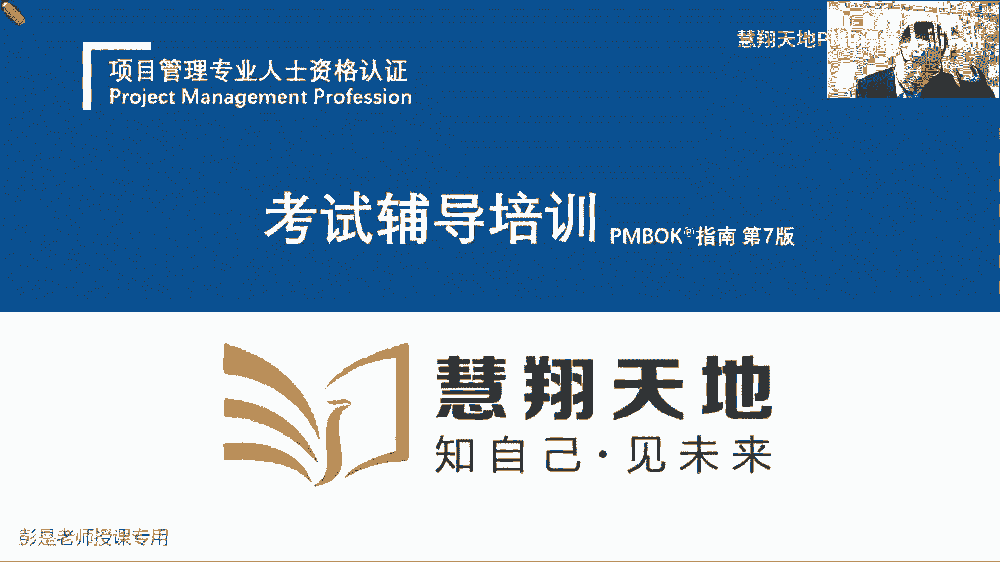
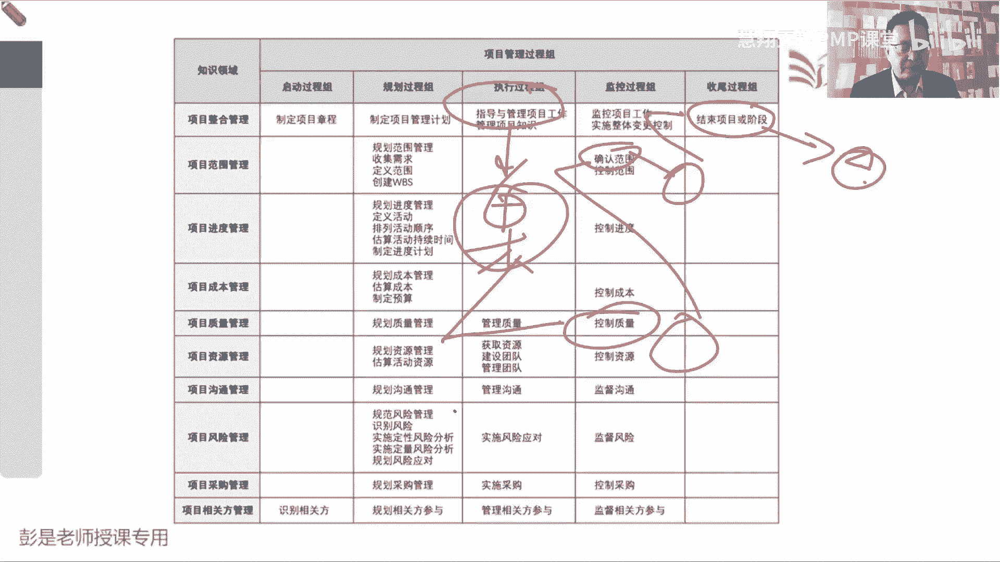
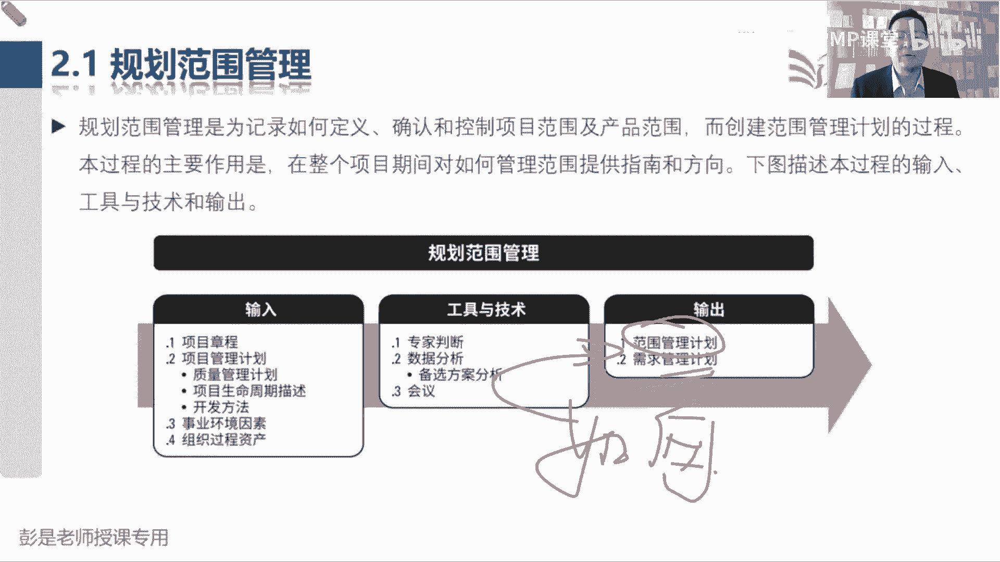
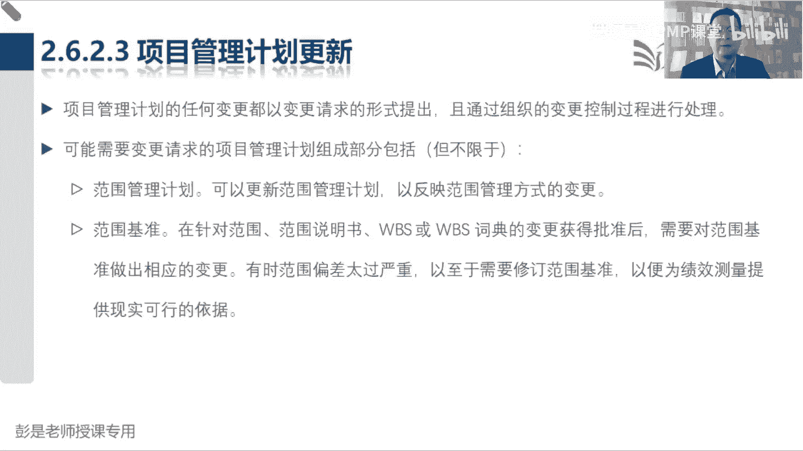

# 2024PMP认证考试课程（第六版+敏捷+第七版） - P9：2.1-2.6 项目范围管理、收集需求 - 慧翔天地PMP课堂 - BV1By411b7qM

项目的范围管理，开始看九个大臣怎么干活了啊，快速回顾一下项目经理怎么干活了，制定项目章程，出章程，根据我们的协议，根据我们的商业论证写项目章程，告诉我们工作方向，章程一定要得到发群的批准，那批准了之后。

有了尚方保健，干活就合规合法了，接下来我们制定项目管理计划，带着我们大家看看范围进度，成本质量一大堆子计划，然后呢再得到三大基准，得到三个计划，这一整合变成绩效测量基准，最后全都打包到一起。

项目计划就做做好了，接下来按照计划去干活，就可以得到可交付成果，然后呢看看项目中学到了什么东西，记录经验教训，登记册，监控项目工作干啥事呢，就是写报告汇报整个项目的工作情况，实施整体变更控制。

对所有的变更，我们要做综合的分析和评估，然后走流程做决策，最后呢验收通过，我们就可以开始结束项目，或者是结束项目中的某一个阶段，就这么点活很轻松，那到了范围大臣怎么干活呢，范围大臣大。

还记得前面讲过49个管理过程，共性的东西吗，先掐头去尾，我们先想一想范围到底怎么管，所以规划范围管理就是出范围的管理计划，然后尾巴是什么呢，就是绩效绩效和变更监控过程组就两件事。

一个是看看工作的情况叫绩效，一个是管理好变更，那控制范围就是看看范围的工作情况，看看有没有人画蛇添足啊，有没有人有没有人做范围之外的事情啊，对不对，然后呢管理好范围这个知识领域的变更。

就把变更请求交给项目经理，所以他输出变更请求，作为实施整体变更控制的输入，那掐头去尾之后，剩下中间四个就是核心的管理过程，并且呢确认范围咱也听说过了，确认范围就是对我们的可交付成果，进行正式的验收。

它的输出就叫验收的可交付成果，得到这个验收的可交付成果，再来结束项目或阶段，把它变成最终产品服务成果的移交小弯了，那最核心的剩下的就三个了，并且这三个管理过程，第一个过程不太难理解吧，收集需求定义范围。

创建WS收集需求就是看看人家需要啥，定义范围是干什么呢，看看我们到底要做啥，人家想吃点面条，那咱就思去思考这个面怎么做，然后做出来的面多少肉，多少面多少汤，以此类推啊，就是定义我们这个产品有什么功能。

定义出来，我们要完成什么工作，定义清楚我们要产出什么样的可交付成果，项目设施项目是创造独特的产品，服务或成果而开展的临时性工作，所以范围说明书就把这三个东西写清楚，产品有什么功能属性特点。

服务不就是工作吗，外卖物流，这都是服务啊，上课也是服务啊，咨询也是服务啊，服务指的是完成一系列的工作呀，诶工作就是我们的项目范围，最后呢就是把可交付成果都有什么东西说清楚，这就是发霉。

说明书大概这三块内容，再加上什么除外责任呐，验收标准呐，这个管理过程就下班了，那创建WBS，这就是这一章稍稍复杂一丢丢的知识点，创建WBS，做过预习的同学应该知道啊，什么是WBS啊。

就是把我们的大工作变小工作，大成果变成小成果，便于管理和控制，便于分工粗暴理解，比如说要吃席，要吃席，这个席就是我们的主要成果，那接下来开始要分工了吧，这是什么凉菜呀，热菜呀，酒水饮料啊，谁来洗碗呐。

谁来切菜呀，这不都得分工吗，哎这就是工作分解结构，这样呢就便于我们管理和控制，便于呢我们估算所需要的资源，时间和成本，可以降低事物的复杂程度，就这道理啊，采购也是工作呀，谁买菜，以此类推了。

咱只是给大家举个例子啊，咱不要延展这个细节，不是真的，这说讲讲吃席都要做什么事，这不重要，但是重要的是什么呢，要把超大的工作，通过分解的形式变成更小的工作，对不对，将便于管理和控制法，张三你来负责吃席。

流水席，吃一周，这事太大了，不精准，对不对，张三负责凉菜，李四负责做热菜，王五负责熬汤，赵六负责做主做主食，张三负责采购，李四负责洗碗，招流，负责刷锅，以此类推，这样呢更便于工作的安排。

这就是工作分解结构最重要的作用，好先有个大概印象，接下来看教材内容，那第二章项目范围管理上来，就看这个管理过这一章的主要的收入输出啊，先把我们有认知的东西，只要你有认知，只要有认知啊，就把它先去掉。

先化繁为简，规划范围管理出范围的管理计划，这很好理解，以此类推吧，规划进度管理就出进度的管理计划，规划成本管理就出成本的管理计划，这些管理计划就是告诉我们怎么定义范围，怎么创建WS怎么控制范围。

怎么确认范围，它就告诉我们如何开展这些管理过程的，这种指导手册，好以此类推了对吧，比如说我想我想入职公司肯定有入职管理计划，告诉我们的同事怎么管理入职这个事情，我想离职，那就有离职的管理计划。

知道我们怎么离职的，以此类推，所以我们有九个知识领域的名字，加上对应的管理计划，那范围这章很特殊，除了范围的管理计划，还要单独输出一个需求的管理计划，再用三个单独的计划，需求变更和配置需求管理计划。

这是规划范围管理的输出，这东西为什么单独输出呢，因为这个东西需要专业知识，到底怎么管需求哎，做不同的产品，不做不同的产品，有不同的管理方法，对不对，住宅小区软件，什么电脑，手机汽车，嘿不同的产品。

不同的产品怎么管需求啊，怎么收集需求啊，怎么排序啊，怎么分析需求的价值啊，这需要专业知识，专业的事交给专业的人，所以现在的需求管理越来越倾向于叫工程化，专业化，他有套路，讲章法唉。

所以需要单独给他出一个计划，这个需要单独记好，所以规划范围，管理范围管理计划是指导我们定义范围，创建w vs控制范围和确认范围的指导手册，需求管理计划呢，就是指导我们收集需求的指导手册搞定。

那收集需求的输出，收集需求这个管理过程虽然看名字很好猜啊，他的输出呢其实也不太需要背，好记性不如烂笔头啊，发现需求记录需求，发现需求记录需求，收到需求记录需求，所以他的输出就叫需求文件，这个不难猜。

那唯一稍稍复杂一丢丢的就叫需求跟踪矩阵，这个后面会解释好，那定义范围刚才解释过了，说定义范围，定义范围我们到底查到底啊，产品有什么功能，我们需要完成什么工作，我们需要交付什么样的成果。

这些东西都要写清楚，他写清楚了，这个地方就叫范围的说明书，说清楚我们的产品范围，项目范围，可交付成果，验收标准除外，责任这些东西，那有了范围说明书之后，下一个管理过程叫创建WBS，就是把大范围和小范围。

大范围和小范围，大范范围变小范围，大工作变小工作，所以他的输出其实就是WBS，他的输出其实就是WBS，那WBS啊，还要写一个资料，这个资料叫什么呢，我就随便说了啊，这是咱要吃席，这是，凉菜。

热菜酒水饮料，这就是WBS酒水饮料里面又包括什么啤酒啊，白酒啊，红酒啊，什么可乐啊，哎这就是工作分解结构，那接下来各位同学就要思考了，现在这张图这张层级结构图就是WBS，那只看这个WBS啊。

只看这个WBS凉菜打算花多少钱，凉菜凉菜做几个凉菜大概多长时间，凉菜需要达到什么样的质量标准和要求，谁负责这个事情，只看这张图，看不出来这些信息的，以此类推对吧，买买什么白酒啊，买多少瓶啊，买多少度啊。

花多少钱呐，大概大概工期要求是多少，什么时间要把它买回来呀，诶这些信息看WBS，看WBS啊，上面是没有的，所以呢需要有一个文档去把这些详细的要求，详细的需求给他写清楚，这就是WBS词典的作用。

配套配套词典的作用是什么呢，解释汉语词典，解释汉语的英语词典，解释英文单词的，那以此类推，WBS词典就是来解释WBS的解释，清楚每个小方块的范围，进度成本质量，资源沟通风险。

采购相关方方方面面的内容都可以往里写，所以创建WBS这个管理过程除了输出WBS，还要输出他的好朋友WBS词典，用来解释每一个小方块，那接下来最后一个知识点是什么呢，就是范围基准里面都有什么东西呢。

哎这三个东西范围说明书，WBS和WBS词典，这是范围基准，有这三个文件，所以他的逻辑就是我们定义范围，写好了范围说明书，然后根据范围说明书，我们对工作对成果进行分解，就会得到这种层级结构。

就称之为WBS，有了这个WBS这种层级结构啊，人家肯定会问时间进度，成本质量，每个小方块的具体要求，所以呢咱们需要写一个配套的解释性的文档，就有了WBS词典，然后最后呢把这三个文件呢放到一起。

找有权利的人，关键相关方进行审批，一旦批准之后就得到了范围基准，一旦批准之后就得到了范围基准，这就是创建w vs这个管理过程对应的这个输出，再给大家学习个一个学习的小建议啊，现在我讲到创建WBS。

你问后边的知识点是不是在发散思维，这种发散思维有利于学习吗，思考，没讲到的时候，你提出问题，提出问题影响你自己的思路，好，那再往下了啊，控制范围和确认范围没有必然的先后顺序，没有必然的先后顺序。

没有必然的先后顺序，重要的事情说三遍，它没有逻辑，所以用了虚线好，所以根本就不重要，到底先做啥后做啥，没有先后顺序啊，如果提出这个问题的同学，你要一定要先搞清楚控制范围的工作是啥。

确认范围的主要工作内容是啥，了解了他的工作内容，就能判断出来他俩到底有没有先后顺序了，那控制范围未来我们九个大神这个管理过程，在监控过程组这个管理过程，他的输入输出都是一样的，一模一样。

监控过程组主要工作一个是管绩效，一个是管变更，所以他的输入啊都一样，我们拿到原始的工作绩效数据，经过我们的分析和评估，变成范围，当前这个知识领域的工作绩效信息，另外呢管理好范围这个知识领域的变更。

提出变更请求，所以控制范围，控制进度，控制成本，你看的多了，就会发现它的输入输出标准的三件套，都是拿到原始的工作绩效数据，经过我们的分析和评估，变成相关的绩效信息，最后呢管理好当前知识领域的变更。

提出变更请求交给项目经理，哎，所以他的输入输出即一个知识领域就学完了，没有什么特殊的东西啊，最后一个管理管理过程确认范围，确认范围他的主要工作是什么呢，对我们的可交付成果进行正式的验收。

所以呢验收通过就会得到验收的可交付成果，就有了这个输出，那他的收入啊叫核实的成果，核实的成果是什么意思呢，这里面就涉及到另外一个小逻辑了，现在我们知道了指导与管理项目工作，这个管理过程按照计划去干活。

就会得到可交付成果，可交付成模呀，直接让客户和发起人通过确认范围，这个管理过程做正式的验收，行不行呢，可以不可以呢，哎没错吧，可以对，但是不好，为什么不好呢，万一这个成果有缺陷，万一这个成果有缺陷。

让客户验收的时候，人家发现你这东西这东西有缺陷啊，会导致什么呢，不满意对吧，你干个活就有缺陷，干个活有缺陷会发现会发现，发现缺陷之后会导致满意度的下降，因为确认范围是客户，对我们的产品进进行正式验收啊。

会导致客户满意度的下降，所以为了规避这个风险，不建议产出的可交付成果直接去验收，那为了稳妥起见，我们自己先检查一下，自己检查可交付成果他有没有毛病，有没有问题，有没有缺陷，这个管理过程就到了。

质量这一章叫指控控制质量QZ，所以非常重要的一个数据流，这是指导与管理项目工作产出的可交付成果，作为控制质量这个管理过程的输入咳，那负责指控的同事干什么事呢，就是检查测试，我们内部做指控。

检查这个可交付成果的正确性完整性，如果检查测试通过的东西，检查测试通过的东西啊，打个标签就叫核实的可交付成果，它作为质控制质量这个管理过程的输出，有了核实的可交付成果，我们再让客户和发起人。

对这个东西进行正式的验收，验收通过就会得到验收的可交付成果，验收的成果，再通过结束项目或阶段这个管理过程，把它变成最终产品服务成果的移交，这就是大概这四个管理过程，它这个逻辑这一定要记住啊。

非常非常重要的数据流，就是指导与管理项目工作产出的可交付成果，传球传到了控制质量，作为控制质量的输入，我们团队对这个东西做检查，做测试，检查测试通过的就叫核实的可交付成果。

核实的可交付成果在作为确认范围，这个管理过程的输入，由客户和发起人对可交付成果进行正式的验收，验收通过了就会得到验收的可交付成果，有了验收的可交付成果，我们再把它作为结束项目或阶段，这个管理过程的输入。

最后呢变成最终产品服务成果的移交，所以对标到49管理过程那张图上，就脑补这个结构呗，指导与管理项目工作产出的可交付成果，作为控制质量的输入，然后呢得到核实的成果，核实的成果再交给确认范围进行正式毕验收。

就会得到验收的成果，验收的成果交给技术项目或阶段，把它变成最终产品服务成果的移交哎，这就是未来未来非常非常重要的这个逻辑，这百分之百要记住。

好那再回到这一章，没东西了吧，他比较关键的一些输入啊，输出啊，基本上这张图差不多了，需求跟踪矩阵，细节性的信息，一会看文字再给大家做做这个知识点的补充，好知道了这个这一章大概的这个道，这个道理之后啊。

就回答刚才同学那个问题吧，你说控制范围，看看有没有人画蛇添足和做正式递验收，这俩事之间有没有必然的前后顺序呢，没有啊，对不对，没有啊，根据项目的情况，你随时可能看看有没有人画蛇添足。

张三上班的时候不要看手机，李四上班的时候不要玩游戏，王五上班的时候不要看抖音，看视频追剧，嘿这都是防止有人画蛇添足，做范围之外的事情，他可能在贯穿项目史中，根据相貌的情况。

你来决定到底什么时候开展这个事情，那你说验收这个事什么时候开展呢，看情况啊，对不对，看情况，这个成果什么时候验收呢，取决于你和客户怎么沟通的呀，阶段性验收啊，还是说我们成果出来就验收，以此类推啦。

各种可能性啊，嗯好，那再往下看教材的话，说规划啊，项目范围管理这一章概述，把这四个字标一标搞定，叫做且景座，项目范围管理，包括确保项目做且仅做所需的全部工作，就是不要画蛇添足，上班的时候该干啥干啥。

不要做范范围之外的事情，那不要做范围之外的事情，那是不是要提前把这个范围内范围外说清楚呢，所以主要在于定义和控制，哪些工作应该包括在范围内，哪些不应该包括在范围内，这句话听完了之后就要反思啊。

什么哪个管理过程定义清楚范围内，范围外呢就叫定义范围，哪个过程确保没有人画蛇添足，做范围之外的事情呢，就是控制范围，这是最关键的两个步骤，好那再往下规划范围管理就是那两个字啊，以标搞定如何。

所以他需要输出一个需求的管理计，划，范围的管理计划，告诉我们后边这一堆管理过程怎么管，那收集需求纯粹的字面意思，根据我们的目标了解相关方的需要，了解相关方的需求，就是我们要吃席。

看问问七大姑八大姨有什么想吃的热菜，想吃啥凉菜，想吃啥，喝什么酒，喝多少度的，这不都是收集需求吗，再问问厨师对吧，吃席你做菜需要柴米油盐酱醋茶，锅碗瓢盆都需要什么东西，然后天气凉，天气热。

要不要搭点棚子生点火，以此类推，总之全面了解相关方的需求，全面了解相关方的需求啊，咱问问政府能不能吃席，能多少桌，能不能收红包，对不对，能不能能不能吃烤串儿，要不要环保啊，天气热了，天气热了。

天干物燥啊，以此类推，总之全面了解肝邪的需要，那定义范围呢，只是说清楚我们这个产品有什么功能，说清楚我们要完成什么工作，说清楚我们要交互什么样的成果，只要你记住了，记住了项目的那个定义。

第一就是第二天第一天上课吧，项目是创造独特的产品服务或成果，而完而完成的临时性工作，那就把产品有啥功能需要完成啥工作，都要交付什么成果描述清楚，另外呢怎么说清楚什么东西在里边，什么东西不在里面。

对应的那个术语叫除外责任，咱把这个圈圈里的东西都给他约定清楚了，那为了避免扯皮，为了避免不必要的误解，什么东西不包括在范围内，也可以解释清楚，这就叫除外责任，一会看书上有文字的啊。

好这是上班的时候该干啥干啥，不要看抖音，不要不要不要聊天，对不对，不要刷视频，把这些丑话先说在前面，那创建WBS，根据刚才那个印象，就是把大工作变小工作，大成果变小成果，所以它叫将可交付成果和项目工作。

分解为更小的，为什么分解成更小的呢，更好管，便于我们管理相关的资源，时间成本，便于完成精准的管控，这就是创建WBS这个管理过程的主要作用，然后确认范围就是正式验收，控制范围呢一个是绩效，一个是变更。

所以叫监督项目和产品范围的状态，状态就是绩效呗，管理范围基准的变更的过程管变更，这是一样的啊，好那再往下这一章核心概念这一段内容，这一定要区分出来在项目环境之中范围，这个术语有两个含义。

第一个叫产品范围，指的是某项产品服务成果所具有的特征和功能，我们要研发一款手机，这个手机能打电话，这是功能吧，这个手机能拍照，这是功能，这个手机这个手机还能干啥，还能装装A装app，装app装app。

嘿这是功能，那特征是什么呢，就是这个手机的特点特点，这种东西啊通常是包装和设计出来的，对不对，这个手机待机时间超长，这个手机防水，这个手机能能能砸核桃，这个手机特别结实耐造诶，这都是它的特点。

那我们需要一会儿把它说清楚，这就叫产品范围，项目范围指的是什么呢，为交付具有特定功能和特性的产品服务成果，而必须完成的工作，为交付这个产品需要完成的工作，什么叫工作呢，你买手机我得给你装盒里对吧。

给你把这个手手机手机那个包装什么封膜，装什么使用说明书，然后给你发快递，发快递，这不都是工作吗，唉包括什么培训呐，包括包括做什么初始化呀，包括帮你把旧手机数据导到新手机里。

这都是为了交互这个东西需要开展的工作好，所以就像刚才吃席采购，这不是工作吗，对对刷碗洗菜切菜，这都是为交付这些成果需要开展的工作，这就叫项目范围，所以后面这个文字就好理解了。

项目范围是根据我们的计划来衡量的，看看是不是洗菜切菜，采购炒菜这些活都干了，产品范围是根据我们产品需求来衡量的，对我需要买个手机，超长待机，希望买个手机能够防水诶，根据产品的需求来评价它。

这听一听就可以了，但是产品范围，项目范围的概念要记住啊，那再往下说，确认范围，就刚才说过的，确认范围是正式验收，我们已经完成的可交付成果的过程，后边这两句话就在说刚才那个数据流。

从控制质量过程输出的叫核实的，可交付成果是确认范围这个管理过程的输入，验收的可交付成果是确认范围构成的输出，由获得授权的相关方正式签字批准，所以还是刚才那个数据流指导与管理项目工作，然后呢控制质量。

然后确认范围，做正式的验收，最后结束项目或阶段，把它变成移交，好再往下发展趋势和新听实践这段文字呢，其实现在基本上听一遍就完事了，听一遍就完事了啊，没什么需要去背的东西，总之中心思想是什么呢。

这是刚才说的专业，专业专业就对这个单词有一丢丢印象就够了，说我们更注重和商业分析专业人士的合作，为什么呢，他们有这个专业知识告诉我们，告诉我们在这个需求怎么管，怎么去做产品的规划和设计。

对标到大家公司的公司里面的这些这些岗位，可能就叫产品经理，需求分析师，商业分析师这样的人，总之他们懂需求，懂产品，可以帮助我们更好地完成这个产品的规，划和设计，知道这个意思啊就够了。

既然人家有这个专业知识，咱就单独给他写一个需求的管理计划哎，单独写规划范围管理的输出好，后面这些文字全都不念了，这段文字再看一看，就是刚才那个道理，我们应该把商业分析的角色联动职责，分配给。

具有足够的商业分析技能和专业知识的人，专业的人，专业的事交给专业的人呐，那如果项目已经配备了商业分析师，那么和需求管理相关的东西就是这个人的职责，项目经理主要是工作，确保按时完成，好这两点就够了啊。

那2。1规划范围管理，这个管理过程基本上大家复习的时候啊，一遍就过了，就牢牢记住这两个字，大家工作中你能想到的各种问题都参考，这两个指导计划，怎么收集需求啊，什么时间收集需求啊，找谁收集需求啊。

开几次会呀，这个需求文件怎么做记录啊，用什么格式，用什么板，用什么，用什么模板呢，需求文件记下来之后怎么存呐，存到交给谁呀，都在这些管理计划里面去了，怎么定义范围呀，怎么写范围，说明书啊。

说明书写什么内容啊，电子的还是纸质的呀，谁来审批呀，都在范围的管理计划了，嘿，所以这两个管理计划，就是指导后边这些管理过程到底怎么干活的，指导计划它具体的内容没什么需要背的，知道意思就够了。

也不会考这种东西啊，那这个管理过程输入没有什么重要的东西。

所以继续这个管理过程，基本上大家复习的时候一遍过章程啊，生命周期开发方法啊，因为这些东西决定了到底用什么方法，不同的方法，关于范围的管理和进度的管理是不一样的，等咱讲到敏捷这段内容。

你就知道传统的瀑布式的预测型的项目，就是收集需求，定义范围，创建WBS，那在敏捷环境之中不是这么玩了，它的游戏规则发生了变化，所以我们要根据生命周期阶段划分开发方法，然后告诉我们如何管范围，如何管进度。

好那2121范围管理计划，范围管理计划是项目管理计划的组成部分，描述将如何定义范围，制定范围，监督范围，控制范围和确认范围就是那几个管理过程嗯，那范围管理计划将对，要对将用于下列工作的管理过程作出规定。

有的同学读到这儿仍然容易很容易误会啊，规定如何制定范围说明书，规定如何创建WBS，规定如何审批和维护范围基准，规定如何正式验收已完成的项目可交付成果，都是这种关于工作怎么开展的指导计划。

但不代表着说范围说明书，包括在项目范围管理计划里，这肯定不能这么说啊，对不能说WBS包括在范围管理计划，他不对的，他都是告诉你怎么干这个事的，告诉你怎么做菜的，告诉你怎么做菜的，这就叫菜谱。

但是这个菜包不包括在菜谱里呢，不包括呀，它是两回事啊，好知道这个意思啊，它的内容不需要不需要去记啊，不用背，记不住没关系，然后后面这句话呢也是一个通用的大道理，说，根据项目的需要。

项目范围管理计划可以是正式的，可以是非正式的，可以是详细的，或者是粗略的概括的，总之看情况想怎么写就怎么写，结合项目的实际情况，结合具体情况具体分析好，那需求管理计划，根据刚才掌握的这个原则啊。

这两个字一标搞定，怎么管需求如何跟踪，怎么什么什么变更，怎么对需求做排序，什么什么测量指标，哎知道这意思够了，具体内容不要求继续记得啊，好那接下来2。2收集需求，收集需求。

这个管理过程也是大家后面复习的时候，需要额外花一丢丢时间，多看几遍的东西，因为他的工具技术相对来说多了一点，但也不要求大家现在背好他的输入，没有什么解释的，稍稍印象深一点的就是相关方登记册。

就是相关方登记册，我要在我们家小区开个牛肉面馆，不打算了解大家喜欢吃什么东西，打算去打算去看看政府这个什么工商啊，注册制营业执照啊，什么消防啊，卫生啊，嘿这些东西这些东西都都找谁呀，对不对。

看看有什么要求啊，这不都是都是收集需求的工作吗，所以我们需要相关方登记册，需要有个名单，不然你不知道找谁对，对接的消防谁负责这个地方的消防啊，谁负责这个地方的这个地方的食品安全呐。

谁负责这个地方的什么卫生啊，食食品许可证啊，这种东西啊，所以需要一个名单，否则不知道找谁去收集需求，只是相对来说需要记住的一个输入，它的输出刚才我们说过，发现啥记录啥，所以它的输出就叫需求文件。

第二个重要的输出叫需求跟踪矩阵，这仍然不着急掌握啊，一会看文字超简单，那接下来大家学习的重心就变成了工具基础，先把我们有认知的东西排除掉，专家判断，知道了，头脑风暴发散思维访谈直接沟通。

焦点小组还记得吗，交警小组，交警小组这聚焦聚焦，今天我们这个会是收集收集消防方面的，要求的会议，不要聊食品安全好，这个意思啊，聚焦不要跑题，不需要去记的啊，问卷调查，这个要能反应过来。

它通常适用于什么场景，通常适用于什么场景，我想在小区开个牛肉面馆，我想了解啊这个小区啊，大家都喜欢吃什么口味的，怎么办呢，访谈一家一家的，一个一个一个一个一个人一个人的聊效率低，人太多了。

所以通常适用于人多，或者是呢大家不在同一个地理位置，在这样的场景之下就发问卷了吧，哎招两个实习生，然后呢印几百张问卷发发进小，进小区的人都给他发一个对，让大家扫码二扫码或者是纸质的啊，各种形式啊。

总之人多不在同一个地方，我们通过问卷调查，这样的方式可以快速的获得反馈，效率高，这是它适用的场景好，这个需要听完之后就可以了，问卷调查是不是收集需求的工具呢，根本就不重要，不需要单独记啊。

他很多管理过程都可以用，那再往下标杆对照，看到这个单词能反应过来是什么东西吗，标杆标杆标杆对照，参考借鉴抄榜样，就这几个单词吧，哎这是咱从小到大传说中的别人家的孩子，别人家的孩子对吧，竞品啊，对齐啊。

唉大家根据你的话术知道这个意思就够了吧，所以什么业内大佬啊，类似项目啊，总之看看人家什么地方做得好，看看人家什么地方做得不好，对不对，有则改之，无则加勉，就这意思啊。

所以他其实也是很多管理过程都可以用的工具，制定项目章程，可不可以标杆对照呢，可以呀，张三你们项目组那个章程写的真真好，结构真清晰，参考一下，就是看看人家怎么做的，看看有什么最佳的实践。

最好的方法参考一下，只要不侵权，只要不犯法都可以抄，知道这意思啊，然后文件分析，文件分析其其实很多管理过程都会用，但也不要求大家去背，只要你了解这个管理过程在做什么事情，就能猜到了，现在我们在收集需求。

那分析文件就是为了收集需求，通过看看客户客户企业里面这些什么制度啊，流程啊，规章啊，什么什么标准啊，规范啊，包括业务资料啊，来挖掘业务需求，这不用去记的啊，投票多标准决策分析，见过了清河图。

第一次见到这个单词干啥用的呢，清河图，清河图，它的主要操作是对我们收集到的需求做分组，困了就睡觉呗，很简单，后面再复习，反正欠的债早晚要还的啊，可以物理攻击，魔法攻击呀，头悬梁锥刺股，掐大腿。

站起来走一走都可以啊，魔法攻击呢就是想一想伤心难过的事情，物价呀，房价呀，脱单了吗，有小孩了吗，怎么上学呀，买房了吗，买车了吗，工作好找吗，多少多少年没涨工资了，年终奖发了吗，别人家年终奖都是什么呀。

标杆对照一下，对不对，看看身旁的成功人士，哎呀想一想，越想越问越想心越凉啊，那清河图回到知识点二，轻河图的主要作用是什么呢，对收集到的需求做分组，因为啊未来我们要对需求做排序，排序的前提条件是什么呢。

物以类聚，我就随便画圈圈了啊，我们要吃席，收集大家收集大家关于吃席的需求，收集到这么多的需求好，接下来先分组后排序，这一堆都是凉菜的需求，这一堆都是热菜的需求，这一堆都是酒水饮料的需求，先分组。

然后在同一分组内进行排序，因为不同分组的需求不一定有可比性，对不对，都是凉菜就好排序了，那排序的这个工具叫什么呢，这叫名义小组，大家来投票，现在我们有这么多凉菜，然后得票最高的凉菜。

我们取前三名就定这三个菜就可以了，哎这就是民意小组，所以把亲和度和民营小组绑定，CC1啊，一对好朋友亲河图做分组，名义小组做排序，大概写就写标标这么几个关键词就可以了，思维导图不解释了，就是对事物啊。

对信息啊做梳理啊，我们要吃席，看看凉菜菜品，酒水饮料，菜品里面又可以分凉菜啊，热菜呀，什么面点呐，主食啊，以此类推啊，做梳理的，这玩意没什没什么，没什么考点好，然后最后收集需求，两个重要的工具。

一个叫观察和交谈，一个叫观察和交谈，倒着想啊，为什么我们要去通过观察，这样的方法去收集需求呢，为什么不直接交谈呢，为什么需要先观察，然后再去交谈，为什么不直接交谈呢，哎乖乖同学说到点上了，人家不愿意说。

没时间说，说不清楚说不清楚，通常就是这样的场景吧对吧，就像各位同学，人生人生每天最头疼的问题就是中午吃什么呢，中午吃什么，想吃什么，通常可能大多数人现在在说这个，随便这种情况下，需求明确吗。

不明确需求清楚吗，不清楚他能说清楚吗，说不清楚，真的不知道吃啥了怎么办，观察对不对，通过观察看看对方有什么爱吃的，有什么喜欢吃的，通过观察来挖掘需求，通过观察来挖掘需求，挖掘到需求之后。

再通过交谈来进行需求的确认，那咱中午吃麦当劳，其实是观察和交谈，对不对，通过交谈进行确认，就这个道理啊，好知道这个意思，所以通常人家不愿意说，没时颠说，懒得说，不想说，不想说不清楚。

不管是主观的还是客观的，可能没有办法，没有办法通过交谈直接来获取需求，怎么办呢，先观察这个大家实际工作中，生活中都在用，实际工作中生活中都在用，比如说送礼对吧，什么马上到了，哈哈过去了，什么情人节呀。

什么什么777夕七巧节呀，什么什么春节呀，你要给你的好朋友送礼，送礼送礼又不方便直接问，对不对，想给人家惊喜怎么办呢，观察观察看看对方需要啥，就这道理啊，好知道这个意思，然后引导记住，这其实前面说了吧。

看到什么种族啊，不同职能部门，不同业务人员，不同种族不同宗教唉，总之双双方可能有冲突，可能难以相互理解，那我们要想办法让大家有同理心，换位思考，相互理解，达成共识，第七个工具，其实现在基本上不考。

因为他需要带一丢丢专业知识，就让他去死，记得住，记不住根本就不重要，有兴趣的同学听一听系统交互图啊，就是让让我们画一画，各个系统之间是怎么交互的，他写也是用来确认需求的，比如说各位同学，你买东西啊。

某多多和什么什么支付宝，你要让某多多告诉支付宝这笔订单，他要付多少钱，还要还要还要还要让支付宝告诉某多多，这个钱他到底付了没有啊，这就是体现体现各个系统之间它是怎么交互的，就这意思了解就够了啊。

他需要带一丢丢专业知识，通常软件设计呀，系统设计呀，干这个事情，这不需要去记的啊，最后一个原型法，这个需要掌握原型法，原型法，牛肉面馆要装修，牛肉面馆要装修，什么是原型法呢，人们为了稳妥起见。

不得先画一个效果图吗，对您看看这个效果，您满意不满意，没问题呀，我们再做进一步的设计啊，对这就是原型法的一种对，甚至为了为了为了节省时间，节省节省成本，拿手先给你画一个大概意思，或者是网上搜一个诶。

您看看这个风格喜欢不喜欢，总之是为了为了来确认需求，避免咱干活干错了，这就是圆心法，做个假的，做个demo，做个假的，做个demo，做个模型，嘿用来确认需求，避免弄错了啊。

好所以extra吧好所以收集需做这个管理过程，大概有印象的这么几个工具，亲和图名义小组一个分组一个排序，人家不愿意说，没时间说，懒得说，说不清楚，咱就先观察观察人家的需求市场，然后通过交谈进行确认。

然后原型法主要工作，主要作用就是用来确认需求，避免弄错了，这就是大概这四个相对来说重要性可以高一点，然后像问卷调查呀，标杆对照啊，看到名字能够反映出来它适用于什么场景，就可以好，讲，完了这个管理过程。

咱休息一下，现在11。08，咱休息到11。15，稍后继续，好各位同学，还有30秒钟时间即将开始，今天上午最后一小段课程，正确率低啊，正确率低很正常唉，听完课正确率80%，90%，这这这种证书就不要考了。

对不对，讲道理哈，如果听完一遍课，做一道对一道做一道对，一道全国人民都能做到的事情，这个证书的含金量可想而知啊，没价值对不对，所以难很正常啊，正确率低，不要焦虑，不要惶恐，专坚持学就可以了。

再去复盘这每道题对应的知识点是啥，再听听课看看书，巩固强化记忆，今天下午上到几点啊，今天下午上课，下午上到18：30左右，好接下来继续了啊，正确率78%，78%的正确率正常吗，你这已经算拉仇恨了。

其他人还没有这么高的啊，第一遍做题正确率40%啊，50啊都正常，咱不断的巩固，不断的巩固，把这个正确率啊搞到70%，80%就差不多了，不要求百分之百，不要求百分之百啊，需要一个过程学习法则了。

不了解85%就差不多了，已经很优秀了，咱考试及格线对吧，从小学到中学60分万岁呀，不要求很高吧，达到85分，达到八，达到85分以上的人已经卓越了，优秀了，大多数人啊，七十八十达到梁这个水平就够了好。

所以学习的学习的最重要的法则就是不较劲，就是不较劲，不追求卓越啊，好再往下了啊，那收集需求搞定，主要主要就这几个工具啊，再往下思路跟不上的同学，其实应该还好，应该还没有那么复杂的东西啊，先记大框架。

收集需求怎么干活，达到干系人登记册，我们就知道找张三，找李四，找七大姑，找八大姨，找张厨师，找找张厨师，赵厨师，了解大家未完成我们这个协议需要开展的工作，然后就会得到需求文件，因为好记性不如烂笔头。

需要把需求都记录下来，记录下来之后啊，不是所有的需求都要都要满足的，所以我们需要投票啊，对不对，李四说喝五粮液，太贵了太贵了，咱投票表决排排序呀，所以呢亲河图做分组，名义小组做排序，然后收集需求的时候。

张三你想吃啥都行，随便没想法，李四你想吃啥都行，随便没想法，没办法观察，看看大家平常喜欢吃啥，然后再通过交谈去进行需求的确认，那为了稳妥起见，对不对，为了稳妥起见啊，你不得弄个菜单吗。

菜单上最好带点照片，干啥呢，确认需求原心法呀，对不对，您看看这个菜是不是您心中的鱼香肉丝啊，因为不同地方不同地方炒出来的鱼香肉丝，宫保鸡丁不太一样，就这就这意思吧，嘿弄个照片，鱼香肉丝宫保鸡丁。

我心中的什么什么水煮肉，水煮鱼是不是这意思啊，来确认需求，先弄个demo，避免干活干错了，大概就这么几个重要的东西，大家随便带场景，你能自己用话术把这个事儿说明白，这个管理过程就学完了好。

那接下来再看具体的文字，说我们没有专门讨论产品的需求，为什么呢，这需要专业知识，需要大家去学习产品的规划和设计，这些方法，市面上比较主流的就是一个PBA，一个NPDP有兴趣的同学，等学完PMP再说啊。

这不是咱们PMP考试的重点，PBA商业分析师那个NPDP是产品的规划和设计，他是大产品经理，先了解行情，了解市场，了解策略，然后分析我们这个产品几步走，做整个产品的规划和设计，重规划轻设计。

设计只是纯纯纯粹的技术工种，对不对，规划更重要，到底做什么产品，就像我们要成立一个新能源汽车，哎呀你弄几个产品线呀，都坐什么车呀，轿车呀，SUV呀，还是什么车呀，分级档啊，这都是做整个产品的规划和设计。

做做整个产品的规划，规划完了再做设计啊，好这PMP考试不考啊，所以呢这段文字啊看看一遍，甚至后面复习的时候都可以不看了，总之专业的事找专业的人，好知道这个大道理之后啊，再找到最后这一小段话。

这是刚才说的逻辑，我们收集需求，得到了需求文件，根据我们收集到的需求来定义范围，写范围说明书，范围说明书就说清楚产品有什么功能属性特征，说清楚我们要交付产品，需要完成什么工作。

说清楚我们都要交付什么样的成果，有了范围说明书，我们再根据范围说明书定义的这些产品和工作，来做WBS，把大成果变小成果，把大工作变小工作，然后呢再再写个WBS词典，为什么要做分解呢，因为分解的越细。

我们估算出来的资源时间成本就越精准，分解的越细，估算的资源时间成本就越精准对吧，做十个菜需要多长时间，十个小时做一个宫爆鸡丁需要多长时间，做一个糖醋里脊需要多长时间做一个，以此类推吧，越细越细哎。

估算出来的时间资源成本就越准，做一个宫保鸡丁好，你切鸡丁需要多长时间对吧，然后炒鸡丁需要多长时间，放调料需要多长时间诶，估算出来的就越准，哎那便于我们更精准的管理和控制，我们的资源进度成本，以此类推了。

所以最后的逻逻辑是什么呢，需求就叫万恶之源，这就是万恶之源这个根啊，所以这个管理过程写了很多的工具，基础方法，就是因为需求一旦收集的有问题，就会导致我们的范围说明书写错了，范围说明书一旦写错了。

导致我们创建的WBS就有问题，WBS1旦一旦有了遗漏，对不对，不充分不精准，就会导致我们估算出来的资源，时间成本全都错了，就会导致我们在错误的道路上越走越远，所以为了规避这个风险。

唉我们要着重着重了解这个事情应该怎么做，所以他越来越倾向于叫工程化，专业化，他有方法，有套路，对不对，不能胡来，另外呢需要足够的专业知识，没有这个专业知识可能收集到的需求，他也不知道这个东西的价值。

也不知道这个东西对不对，就会导致这个东西很容易，很容易引起一一系列的连锁反应，这就是这句话想说这个道理嗯，好所以就根据这句话，就有了前面这一堆这一堆话，所以我们需要一个什么专业人士。

然后呢要仔细的什么记录啊，确定啊这些需求啊能够直接促进项目的成功啊，然后呢我们需要这个东西也明确的记录下来，然后应该什么了，不念了啊，前面这堆文字大家不需要去记住的，都是看一遍，知道怎么回事就够了。

那再往下这个管理过程输入，没有什么需要单独记的，唯一稍稍印象深的就是刚才说过的，相关方登记册，没有这个名单，不知道去找谁收集需求，那相关方登记册是哪一个管理过程的输出呢，相关方干系人一个意思。

Stakeholder，相关方干系人，相关方干系人，这个登记册是哪个管理过程的输出，就瞬间脑补49个管理过程那张表了吧，我们在启动过程组只有两个管理过程，一个叫制定项目章程，一个叫识别干系人。

识别干型的输出，就是相关方登记侧，相关方登记测哎，这稍稍有这个印象就到位了啊，所以就是吃席吃席这个事，看看谁和这个事有关系对吧，厨师啊，什么能不能点火起明火呀，消防啊，食品安全呐，村主任呐对吧，工商啊。

税务啊，以此类推，看看是哪些人群和咱这个事有关系，找到他，因为他的行为，他的措施，他的他的他的行动，可能会对我们这个事产生影响，那我们要了解他对我们这个项目有什么要求，有什么期望对吧，吃席不要动明火呀。

实习现在什么地，村里边收红包什么的对吧，人数啊好像有很多要求啊，好知道这意思啊，后边呢其他的东西没有什么需要背的，那接下来2221需求文件，需求文件的内容也没有什么太多需要去记住的。

都是听课听课知道大道理就差不多了，然后找到这句话啊，先听听完再写笔记啊，千万不要着急做记录哈，只有明确的可跟踪的，完整的，相互协调的，并且主要相关方愿意认可的需求才能作为基准，但是通过学习我们会发现啊。

我们项目整个项目管理体系里边说，至少我们要在范围，进度成本这三个知识领域有基准，那范围基准有什么呢，通过刚才的课程大概有一丢丢印象，说它里面包括三个东西，叫范围说明书，WBS以及工作分解结构词典。

WBS词典这三个玩意儿装订到一起，找关键相关方，一审批就得到了范围基准哎，这就是考试来说，我们不认为有需求基准，考试来说不认为有需求基准啊，但是需求基准可不可以有呢，可以有需求基准好不好的好。

这是两个知识，两个知识点啊，最好有，但考试来说，我们先先潜规则，认为它没有，因为在实际工作中呃，可客户收集到的需求写了个文档，你不得让客户签字吗，避免耍赖，避免扯皮啊，对不对，客户正儿八经的签字盖章。

这意味着双方达成共识，然后我们再根据这个需求文件去分析，到底要创造什么样的产品，服务或成果，要完成什么工作，所以工作实际工作中最好最好最好有基准，但考试来说先不认为他有基准，那听明白这个这个意思之后。

所以书上见到这段文字啊，咱们把它改一个字，只有满足这些条件的需求，我们才认为它是一个有效的需求，就这个逻辑啊，白底黑字比较好哈，最好双方正式正式，正式书面的把这个东西确认一下，但考试来说。

我们至少至少底线就是达到这些条件的需求，我们才认为他是个有效的需求，他清楚不清楚，明确不明确，中午想吃啥想吃饭，这话说了跟没说一样，他不明确，对不对，中午想吃啥想吃菜不明确，中午想吃啥想吃。

想吃川菜不明确，中午想吃啥，想吃宫爆鸡丁哎，比较明确了吧，所以明确的可跟踪的跟踪是什么呢，一会讲需求跟踪矩阵再说，然后一定要说完整，这些需求之间相互协调，和我们的总体目标保持一致性。

并且呢人家还要点头同意的，才能才才能认为是个有效的需求，好总之最后说到根儿，就是跟那个smart原则一大同小异，知道这个道理就够了啊，然后再往下需求文件的具体内容，基本上都是听一遍，有印象就够了。

因为实际工作中细节肯定比这个多得多，但是后面要达到什么状态啊，看到这个单词能反应过来这是什么东西，所以所以先找两个单词说，许多组织把需求分为不同的种类，如业务解决方案和技术解决方案，前者是相关方的需要。

后者是如何实现，这些需要就是业务需求和基础需求，一个是what，一个是how，我想吃个鱼香肉丝，我想吃个宫保鸡丁，这是相关方需求，怎么把这个宫爆鸡丁做出来，需要什么食材呀，需要什么调料啊。

需要锅碗瓢盆啊，需要什么样的厨师啊，哎这是技术解决方案，就是我们这个号这些条这些东西，这些东西到位了之后，怎么把这个菜做出来，对不对，好知道这个意思够了，然后再往下细分的话就超多了哈。

这些东西它的内容不要求，大家12345全都背，但是需要最好达到一个理想的状态是什么呢，看到这个单词能够反应过来它是什么东西，那业务需求感，刚刚才知道了相关方需求纯粹的字面意思对吧，什么村主任啊，消防啊。

食品安全呐，这两天梅菜扣肉，梅菜扣肉嘿能用什么样的肉呢，对这315哈，相关方在食品啊，什么法律法规啊，工商税务都有要求，以此类推了啊，好再往下就是解决方案，解决方案需求啊，对标到是产品。

需要有什么功能产品，需要有什么非功能需求，非功能需求啊，就是大家工作中生活中关心的这些叫属性特征，我想买个手机，希望这个手机待机时间，待机时间两天以上，希望这个手机能防水对吧，10米防水，30米防水。

能潜水还是能咋地，这还是掉洗脸盆里不会不会进水，唉这都叫非功能需求，关于什么可靠性啊，保密性啊，性能啊，这分这些方面的要求啊，这都是了解就够了，我想买个车，我想买个车，这就这个车要能开这个车。

要能什么什么倒车影像，这不都是功能吗，这个车呀百公里油耗只要油耗越低越好，哎比较省油，这就是非功能需求，听懂就够了啊，那再往下细分的话，还可以分成过度需求和就绪需求说呀，描述了从当前状态过渡到将来状态。

所需的临时能力，这句话听完了之后看不懂，让他去死，就看例子，比如说数据转换和培训需求，数据转换不就是过渡吗，什么叫数据转换呢，你买个新手机还亲，能不能帮我把旧手机的数据导到新手机里，把我的什么微信啊。

聊天记录啊，给我弄到新手机里啊，这只是数据转换的需求吧，换个新电脑，把资料导到新电脑上，换个新的软件，把原来的数据导到新的软件里面去，唉这都是数据转换的需求，然后培训需求，这好理解吧，就是就绪呀。

我还没学会这个东西怎么用呢，你得先教我呀，教我教我教我教我，我学会了之后，准备好了就可以干活了，纯粹的字面意思啊，再往下就是项目的具体要求什么升级啊，改造啊，里程碑啊，各种各样的要求。

最后呢就是质量需求，需要达到什么样的质量标准和要求对吧，要符合咱国家的就3C梅菜扣肉食品安全法，食品安全法哎这是质量的要求吧，不能有什么添加剂啊，不能有什么苏丹红啊这种东西啊，地沟油啊。

所以需求文件的内容不要求大家全都背下来，没用的啊，看到这个单词啊，大概知道怎么回事，能猜对的就不要记了，这个能猜对，这个能猜对，这个稍稍有一点点印象，因为不好猜，对不对，万一它出现在题目里。

你要能够反应过来，不管是什么需求，他都是需求，所有的需求都要进入到需求，稳健掌握到这个道就够了，好那再往下呃，四个二需求跟踪矩阵，需求跟踪矩阵，先粗暴来一版，它最重要的作用啊。

就是把来龙去脉给人家捯饬清楚，什么叫来龙呢，好现在我们收集到的需求，现在收集到的需求啊，我们要去分析这个需求是不是有效的需求，是不是有价值的需求，他就需要往前跟踪了。

这个需求是不是和我们的章程保持了一致性，项目章程说我们要开发一个，现在现在大家听课的叫什么，什么小额通教学平台对吧，直播平台，嘿我们要做一个能上课的，能上课的这么一个软件，我希望啊希望有这样一个功能。

希望有一个功能啊，说在上课的时候啊，能够看到股票的走势，这样呢我输入我买的股票的号码，就可以看股票的行情了，这个需求就是个无效的需求，为什么呢，因为它和我们教学这个目的就不一致，那么他就是个伪需求。

这就是需求跟踪矩阵这个来龙，它的重要作用，去分析我们这个需求是不是明确的，是不是有效的，是不是相互协调的，是不是有价值的，是不是和我们的主要的业务目标保持了一致性，所以他往前追追项目章程啊。

追双方签的协议呀，追再往前就是商业论证啊，我们要保持这些这些需求和这些东西的一致性，从而来说明这个需求是有价值的，能够满足用户的业务需要，我们的现在的主要业务是教学，不是炒股，嘿这就是来龙。

那把来龙搞定之后啊，还要搞清楚这个去脉，为什么呢，因为我们要做到价值交付，最终交付的成果对用户来说，满足他的业务需求有价值，所以往后追就是需求，追成果以及这个成果未来的一系列的状态。

这个需求对应到我们哪一个成果，对应到哪一个成果，这个成果完成了没有啊，测试了没有啊，验收了没有啊，移交了没有啊，哎如果他完成了测试，通过了，验收了，移交了，就这样呢。

我们最终最终移交到用户手里的可交付成果，都是有价值的，都是有效的东西，满足用户的业务需要，就这个来龙去脉，就这么一个道理啊，好，所以需求跟踪矩阵最重要的作用是，把产品需求从其来源连接到能满足需求的。

可交互成果的一个表格来龙去脉，那使用需求跟踪矩阵，把每个需求和业务目标，项目目标先联系，说我希望啊咱这个教学平台有个功能，说发现有同学调皮捣蛋的时候，我可以把他关进小黑屋，哎。

这就是和我们的业务相一致的一个有效的需求，来龙搞定，然后呢这样有助于确保每个需求都有商业价值，每个需求都是有效的，有价值的需求，把前半段搞定，接下来搞后半段，那在整个生命周期中跟踪需求，为什么呢。

因为我们还要跟踪需求对应的成果，确保最终的成果都能够交付，这个把学员关进小黑屋的功能开发完了，测试通过了，升级了一下这个软件，他就有了这个功能交付了，就开心了，因为满足我的业务需要，满足我的业务诉求。

这就是需求跟踪矩阵，最重要的作用就是听完这一段课程，知道它的来龙去脉诶就够了，徐州跟踪举这书上后面给的例子啊，他具体的内容不要求大家去背了，不要求背了啊，好所以他对标的什么业务机会啊，这都想看就看。

不想看可以不看了，总之把每个需求，把每个需求和成果相关联啊，然后前面说清楚这个需求的价值去验证一下，后面呢确保这个成果能够做到交付，这样我们就可以做到价值交付，和你项目中的pipeline其实差不多。

其实差不多，它的作用意思差不多吧，确保这个事这个事别别干歪了，对不对，好知道这意思啊，这单独记，所以需求跟踪矩阵就是需求文件的CP，他俩如影随形绑定，然后2。3定义范围，定义范围，只要你知道第二遍了啊。

第三遍了吧，只要你知道项目的定义，项目是创造独特的产品服务或成果，就记住了，那咱就把产品服务成果都说清楚，对对服务就是要不要给你培训呢，诶这也是未交付，刚刚说过吧，就绪需求啊，你要不要培训呢。

我教你怎么用啊，需要啊需要啊，哎那为交付产品需要开展的工作也要说清楚，要不要培训呐，谁来培训呐，多少钱呐，然后呢要交付什么成果，包括各种各样的东西啊，软件也是成果，什么手册也是成果，计划也是成果。

都要说清楚好，那2。3定义范围，这个管理过程大家后面复习的时候超快的，只要搞清楚范围，说明书有啥东西就下班了，他的工具技术其实不要求背了，那定义范围就是选需求，来分析我们到底要做什么东西。

所以它的输入没什么需要去记的需求文件，对不对，这肯定有中间的工具呢，备选方案分析没什么记得啊，多标准这套分析见过了，引导见过了，就来了个新朋友，叫产品分析，产品分析学习工具啊，最大的技巧是什么呢。

咱现在所有的工具啊，为了保持节，为了保持统一，都是名词在前，动词在后，这样的风风格是统一的，那为了大家，为了咱中国人方便记忆的个人建议啊，你都把它倒过来，咱的习惯是动词在前，名词在后。

所以产品分析就是分析产品，分析我们这个产品有什么功能，有什么属性，有什么卖点，有什么特点，哎对吧，我们家的牛肉面主打一个肉多，然后面面是良心面嗯，然后肉呢，肉呢不是不是不是什么梅菜扣肉用的那种。

什么叫黑心肉啊，什么淋巴结的肉啊，哎它有什么功能，有什么特点，就是分析做产品的设计，好知道这个单词稍稍有一丢丢印象够了，然后再往下说，由于在收集需求过程中，识别的所有需求不一定都包含在项目之中。

因为我们还要做取舍呀，对不对，收集需求，吃席收集这些到底吃什么菜，然后大家的需求千奇百怪，100多个菜不可能都做呀，所以呢我们要做取舍，所以我们要从需求文件中选取最终的项目需求，然后呢。

制定出关于我们产品服务成果的详细描述，产品就对标到产品范围，服务呢就对标到项目范围，成果就是可交付成果，好输入没东西了啊，输出2321范围说明书最核心的五个内容，这三个玩意儿。

项目范围是为交付产品需要做的工作，产品范围指的是产品有什么功能，主要可交付成果，就包括盖好的房子，开发好的软件，唉，文档资料手册都叫成果呀，把这三个东西说清楚，然后呢，就是刚才大家答错的那道题。

验收标准，产品的验收标准是啥对吧，工作的验收标准是啥，最后可交付成本的验收标准是啥，最好最理想的模式都把它写清楚，最后一个知识点说，为了管理相关方的期望，我们可以再明确明确指出。

哪些工作不属于本项目范围，这就对标到那个术语叫除写错字了啊，那个术语叫除外责任，这个玩意儿啊，就和大家什么买飞机票，买火车票，买保险，人家都有除外责任的免责，避免扯皮，对不对，就这意思吧对吧。

买了飞机票，由于什么不可抗力，由于什么什么什么恶劣天气呀，导致我们航班延误啊，我们可能不赔啊，就以此类推了，延误了一个小时，两个小时不赔钱，延误什么八个小时，十个小时我们再赔钱，说清楚，避免扯皮。

所以这就叫除外责任，说清楚项目范围的边界范围内的东西，就包括了产品范围，项目范围，可交付成果，还有验收标准，然后划清界限，除外责任，嘶好知道这个道理，在后面的这这这几个单词就搞定了，产品范围描述。

项目范围描述，可交付成果，验收标准和避免扯皮的除外，责任，嗯我们只负责给你们吃席做饭，像什么卫生啊，许可呀，这些申报啊，我不管，那这跟我没关系啊，着了火我不管救火呀，这以此类推哈，吃撑了不管看病啊。

哎除外，责任避免扯皮好，再往下了啊，文件更新没什么知识点，那2。4创建WBSWBS这个管理过程，大家后面复习的时候，就像现在我这个讲课的方法啊，先看输出，再巩固一下到底什么是WBS。

比如说书上给出的这张示意图，我们要造个大飞机，这个飞机系统就是我们的主要可交付成果，这个飞机就是我们的主要可交付成果，然后呢，项目管理是为了交付这个产品，需要开展的工作培训，这也是工作什么测试和评估。

也是为交付这个东西需要开展的工作，这些呢都叫项目范围哎，工作也要分解，那除了分解工作呀，还对成果做分解呢，中间这个什么数据呀，航空器呀，支持设备呀，设施啊，这是大成果所构成的小成果。

然后再进一步的分析这个数据，我们要完成什么工作，能得到这个东西，航空器我们需要把它变成一大堆的小成果，再去分析需要完成什么工作，才会得到这些小成果，以此类推，就是不断的大成果变小成果，大工作变小工作。

那现在这张图就叫WBS，这叫工作分解结构，那工作分解结构，接下来还需要写个文档，为啥呢，因为这个消防系统需要达到什么质量，标准和要求，预算大概是多少，打算多长时间，什么时间把它做完，谁负责这个事情。

它有什么限制条件，唉这些方方面面的细节性的内容，只看这个WBS是看不出来的，就需要配套一个文档，12345把它详细的描述一下，来解释每一个小方块，来解释每个小方块，你关心的那一大堆各种各样的问题。

所以WBS词典的内容粗暴理解啊，九大知识领域搞定，因为理论上来说，我们随便可以把一个小方块单独拎出来，作为一个子项目，每个子项目每个项目的范围，进度成本质量，资源的各个知识领域相关的要求都要写清楚啊。

唉所以就是九大知识领域的内容，好知道了知道了，这到底什么是WBS，接下来在倒车倒车倒车，其实他这个管理过程输入啊，输出啊就学完了，没啥太多细节性的东西了，后面讲工具的时候再稍稍讲一丢丢小细节。

咱就下班了，好所以创建工作分解结构，WBS是把我们的工作和成果分解成较小的，后面就是目的更易于管理的组建的过程，就像刚才那个大道理啊，变成一大堆零件，这样估算资源时间成本更精准。

所以他的收入没有需要去记的东西，输出就是范围基准，范围基准里面包括三个文件，包括刚才写的范围说明书，以及我们将要创建的WBS，还有解释WBS的词典，这三个文档找关键相关方一批准，就得到了范围基准。

中间的工具技术，这肯定要记住的，就叫分解，很好理解啊，大工作变小工作，大成果变小成果，分解可以有效地降低事物的复杂程度，一个飞机几10万个零件不分解，这活不好干的，好再往下了，那WBS说巴拉巴拉。

这咱知道了吧，层级结构啊，WWBS的来源，其实啊就是从组织架构出来的，听一听就完事了啊，为什么从组织架构呢，因为啊组织架构发明在前，最早最早很多企业就会发现，那人一多呀，需要需要怎么做呢。

人多人多就要分369等，就有了公司的组织架构，把管销售的人放到一个圈里，把管财务的人放到一个层级里，以此类推，就变成了你公司的组织架构，这些是销售，这些是财务，这些是技术，这些是什么测试，这些是质检诶。

就有了公司的组织架构，这样呢便于我们管理和控制，整个公司的有效运转，那WBS也是这个逻辑，就参考了OBS说，把这些工作和成果做到了进一步的分解，便于我们有效的管理和控制好。

然后后面大家做章节练习题的时候，可能会纠结这个字啊，这些文字游戏，WBS组织并定义了项目的总范围，代表着当经批准的当前范围，说明书所规定的工作范围，说明书，他已经把我们的范围定义好了。

那WBS和它的区别是什么呢，就是多了组织两个字，这两个字想体现啥呢，组织构成组织结构啊，WBS除了能够定义清楚项目的范围，还能够体现我们项目范围，产品范围的结构构成，所以他用了这么一个文字叫组织。

并定义了项目的总范围，这停一停，知道意思就够了啊，这种小细节现在基本上也不考，只要知道WBS的核心作用，便于管理和控制，好那在这个管理过程中，输入为啥需要解释的了，输出范围基准，这10%吧，要掌握的啊。

范围基准是经过批准的，谁批准的，不知道有权利的人，经过批准的项目范围说明书，WBS以及相应的WBS词典，这个东西一旦经过关键相关方的批准，就变成了基准，一旦有了基准就走流程。

所以只有通过正式的变更程序才能够进行变更，它是用来比较的基准，记住啊，那范围基准包括什么呢，范围说明书刚才见过了，WBS见过了，然后这张图见过了，知道意思就够了啊，接下来又来了三个单词叫工作包。

控制账户和规划包，工作包控制账户和规划包，为了便于大家粗暴理解啊，随便想个场景，大家听一听，知道怎么回事就可以了，他的主要中心思想是什么呢，叫滚动式规划，滚动式规划的重要原则就是近期要完成的工作。

咱需要把它详细的写一写，对不对，就像今天是周周日哈，下周下周要大家工作要干什么事情，这一定是详细规划，不能太粗略啊，那远期要完成的工作，比如说现在是3月份，6月份，下半年工作计划写了吗。

下半年周一周二周三周四周五，5月7月八月九月，每周每天都做什么事情，还没有这么详细的吧，到时候再说了，看情况，所以远期的工作我们可以考虑粗略的规划，这是非常重要的一个滚动式规划这种思路。

那知道了这个思路啊，WBS就可以这么去玩了，这是我们的吃席，然后往下分解，这是凉菜热菜酒水饮料，主食我就写了一个主持啊，好上热菜，上凉菜，上酒水饮料，这些都是近期要完成的工作。

那我们就需要进一步的详细分解，都有什么热菜呀，都有什么凉菜呀，这什么洗菜切菜，炒菜为交付产品需要开展的工作，都分解了主食啊，不一定吃主食，不一定吃，到时候再说对不并且通常现在大家吃席。

吃席主食可能没那么重要哈，那到时候再说，到时候再说，就把它后面再分解了，现在先不分解，能听懂吧，以后再分解，现在先不分解，先不分解，先不分解，那接下来根据刚才掌握的这三个术语，我们把它往里面塞了。

往里塞啊，一个叫控制账户，控制账户的主要工作是什么呢，管理控制，所以叫控制账户啊，那既然是管理控制意味着啥，他有下级，就像逆公司的主管组长，经理总监，董事长。

VP总经理CEO这名字一抛出来就说明他有下级，为什么呢，因为他不是员工，那他有下级的这些带有下级的这些人，他的主要工作是什么呢，管理控制对不对，领导这是管理控制啊，所以有下级的这个层级。

他只要下面还有人，我们就把它称之为ca控制账户，他来负责管理控制，那下面这些蓝色小方块啊，没有下属的，没有下级的，最底层的干活的人就是员工，我是我们公司的，我是我们公司的授课老师，我没有下级，没有下属。

我就是普通员工，仅此而已诶，干活的人，干活的人不就是工作吗，所以他就被称之为工作包，因为他没有下级了，那这个主食叫什么呢，他以后会有下级，可能有包子，米饭面条饺子，他以后会有价下级啊，但是现在还没有呢。

那就是我们规划中的一个东西，所以就叫规划包哎，就这三个单词搞定，所以有下级的就称之为管理控制点，就叫控制账户，没有下级的自己照顾好自己干活的人，干活的人就叫工作包，然后呢以后会有下集。

但是呢现在先不分解以后再拆，对不对，远期的工作粗略规划呀，到时候再说了，它就叫规划之中的一个包，就叫规划包哎，这就是WBS里面这三个术语，简单啊，知道意思就够了，所以现在课件上这张图就粗暴的理解一下。

粗暴的理解一下就可以了，这这你们仨没有下集了，就叫工作包，他们上级领导往上走，只要在他们上面的都叫控制账户，都叫控制账户啊，然后我约定了3。13。2以后再拆，以后再分解，那给他做个标记，他有下集。

但是现在还没有呢，以后再说，就标记为规划包，就知道这个意思够了，粗暴理解粗暴理解二，不要打把它对标到你工作中有认知的场景啊，为了便于大家更好的理解，只是说就像刚才那个主食，主食等于储备干部吗。

不等于不要再去，不要再去用各种各样，其他的其他的场景去想这个事了，因为我们现在讲的是工作分解结构，它对应的是成果和工作好，所以知道这个中心思想，再看文字就简单了，工作包就叫最底层。

他是WBS里边的最低层级，因为他没有下属了，他就是对标的员工，对不对，然后每个工作包肯定有上级领导，所以呢他是控制账户的一部分，那领导干什么事呢，管理控制在控制点上，我们管范围，进度成本质量资源。

以此类推，所以一个领导可以有很多员工，但是呢每个员工只能有一个领导，避免多头管理罢，我在公司我是打杂的，张老师管我，李老师管我，赵老师也管我，什么班主任都管我，唉这活没法干，死定了。

所以呢最好每个员工只有一个上级领导，避免多头管理，不然就死肯定死定了啊，好那规划包是什么呢，一个控制账户可以包含一个或者是对规划包，它是什么呢，叫低于控制账户，而高于工作包，高于工作包代代表了啥。

他以后肯定有下级，他以后下班肯定有工作包，但是呢现在还没有，所以所以这是规划之中的一个东西，好这就是关于这三个单词的解释，知道意思够了，那再往下就轻松加愉快了，这张没东西了。

WBS词典它的内容不要求大家去记，粗暴理解九个知识领域的总体要求，把每个小方块，九大知识领域的都要求都写进去吧，什么编码呀，描述啊，假设条件制约因素啊，谁负责呀，资源呐，然后时间要求啊，进度啊。

什么资源成本质量都可以往里写，不犯法啊，所以它的具体内容是不要求大家去背的咳，总之字词典的作用就是解释好那2。5，确认范围，这个管理过程大家一投入就过去了，确认范围，是正式验收已完成的可交付成果的过程。

所以就像就像各位同学，你中午叫外卖，打开包装，看看是不是你的菜，看看有没有撒，看看弄有没有有没有什么头发，这就是验收啊，收了快递打开包装，检查这个东西的正确性完整性，这也是正式验收好。

那他的工具检查就搞定了，然后投票，因为对项目来说，通常不一定一个人就可以做决定，说我们验收通过了吧，一定是有验收委员会的，只要指导委员会的吧，有一堆人呐，他的输。

唯一需要记的就是刚才反复说的这个逻辑输入，待输出输入来源于QC控制质量，QC的输入叫可交付成果，可交付成果从哪儿来的呢，是岛屿管理项目工作，然后我们输出验收的成果，这个东西要去结束项目或阶段。

让项目经理把他变成最终产品，服务成果的移交搞定，所以书上这段文字还是值得大家去看一看的啊，告诉我们说什么什么这东西验收不讲了，反复讲了，然后说这个管理过程和控制质量的区别，确认范围就是做验收。

控制质量是我们内部检查这个东西的正确性，完整性，从而避免让客户发现这个玩意儿不对劲，导致人家满意度的下降，最后这句话就在说，他的逻辑通常最好最踏实的，最稳妥的就是咱内部先做指控。

然后再让外部来进行正式的验收，但二者也可以同时进行，同时进行，还是有风险的，对不对，所以一个是原则，一个是一个是原则，一个是底线吧，就这么理解吧，那这个管管理过程输入没东西了。

什么核实的可交付成果见过了吧，数据呀，这东西就不需要背啊，验收2521验收的可交付成果，就刚才各位同学说的那个学到的，知道的那个大道理，白纸黑字最踏实，最好最好最好正式书面，避免扯皮。

所以大家完全靠我们的生活常识也能理解吧，外卖外卖，快递小哥把把把你买的东西放到你家门口，嘿那你可不可以说这东西我没收到呢，可以对不对，因为他没证据没证据啊，当着快递小哥的面。

你打开包装检查这个东西的正确性完整性，事后啊，没签字可不可以耍赖呢，可以因为他没证据，但是这么做不道德啊，不道德，所以将心比心吧，换成我们是快递小哥的话，稳妥起见的方式，最好最好最好正式书面。

当着你的面打开包装，检查东西，当着你的面签字，这样就不会耍赖了，好工作提到信息没啥东西了，最后一个管理过程也是大家学起来很快，后面复习的时候啊，也基本上可以看一遍就完事了，绩效变更。

所以控制范围是看看我们范围的状态，有没有人画蛇添足啊，有没有人做项目范围之外的事情啊，确保做且仅做范围内的事情啊，然后呢管理好变更，所以它的输入就标准的三件套，最原始的工作绩效数据，经过我们的分析。

得到范围这个知识领域的工作绩效信息，然后呢交给项目经理，他就作为监控项目工作整合这一章，这个管理过程的收入由项目经理去写，工作及到报告，另外我们要管理范围的变更，所以他会输出变更请求。

所以通常来说工作模式是这样的啊，说客户提的一个新的需求，这就是变更啊，那我们要求他最好最好，最好有一个正式的书面的请求吧，客户提了新需求之后啊，先找谁呢，先找控制范围的同事，寻找控制范围的同事啊。

为什么呢，因为呀他要搞清楚啊，这个新需求对我们的范围基准，要产生什么样的变化对吧，范围说明书要不要改呀，我们的WBS怎么改呀，WBS指点怎么改呀，他先搞清楚对范围的变更是啥。

然后呢再把这个变更请求传球交给项目经理，通过项目经理开展实施整体变更控制，就这个逻辑啊，好工作绩效报告是哪个哪个管理构成的收入啊，根本就不重要啊，爱谁谁，好那再往下就是刚才说这个逻辑。

确保范围的所有变更请求，最后都交给项目经理开展实施整体变更控制，然后后面给了个定义，说未经控制的产品或项目范围的扩大，被称为范围蔓延，也就是没有及时的对时间成本，资源质量。

其他东西做出相应的调整诶这叫范围的蔓延，就是范围的变化失控，范围的变化失控了，还记得第一天上课给大家说的吗，晚上原计划刷30分钟抖音，结果一不小心呐，又看了看微博，看了看了热搜，又看了看，看了看朋友圈。

哎呀不断的不断的在增加范围，没有及时的及时的考虑到对其他东西的影响，就导致睡眠不足，睡眠时间不够就迟到了，就这意思啊，所以我们要把这个范围的变化，经过我们的整体分析，综合分析考虑周全再来决定。

就再回到实施整体变更控制这个知识点好，最后一分钟这个管理过程，咱把书上这段划了过去，然后呢，下午继续啊，那他的收入其实大家复习的时候啊，真的可以不看了，知道道理就够了，现在这种具体的东西咱又不考概念。

对不对，总之坚信两个原则，第一个原则确保没有人画蛇添足，那我就看看大家都干了啥活儿，拿到原始的数据和我们的基准来做比较，这不是理想和现实做比较吗，然后看看有没有偏差，最后呢得到绩效信息，告诉项目经理。

没有人画蛇添足，项目经理，你去写报告去了，另外呢我们管理好范围的各种各样的变化，确保所有相关的范围的变更，都要交给项目经理来，由他来开展实施整体变更控制，只要牢牢记住这两个工作的重要作用对吧，它的意义。

它的价值就缺乏了好，所以绩效数据啊，绩效信息的内容基本上不要求背，看一遍，知道怎么回事就差不多了，然后输出呢就没有什么重要的东西了啊。

这就是大概范围。