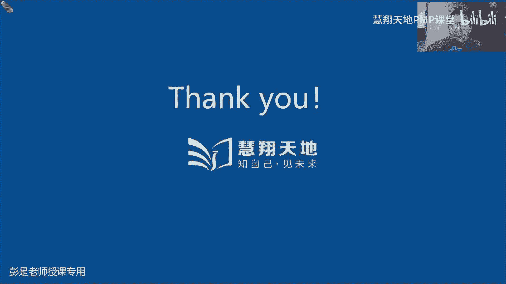
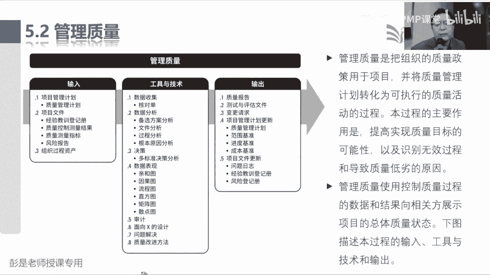
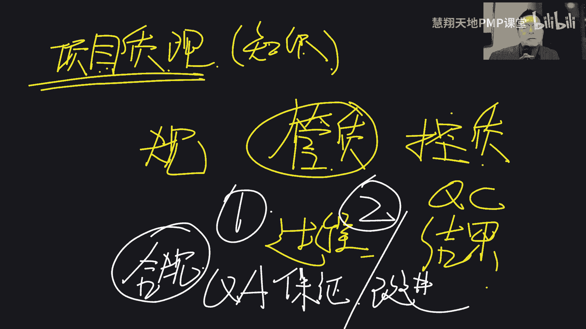
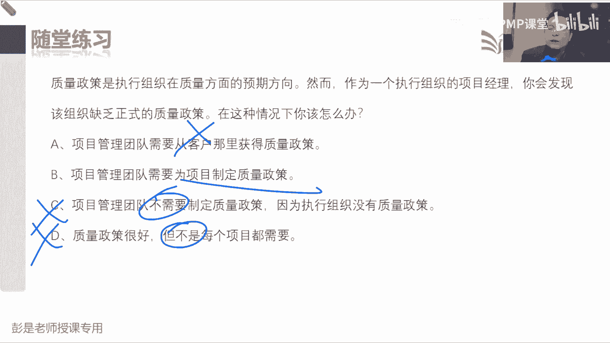

# 2024PMP认证考试课程（第六版+敏捷+第七版） - P12：5.1-5.3 项目质量管理概述 - 慧翔天地PMP课堂 - BV1By411b7qM

推报到49个管理过程中。

就变成了这样一个非常重要的可交付成果的，数据流指导与管理项目工作产出的可交付成果，这个玩意儿最好不要直接去确认范围，那么它就作为控制质量这个管理过程的收入，由项目组。

由项目团队对我们创造的成果自己做检查，自己做测试，检查测试通过了，就会得到一个核实的可交付成果，这个东西再交给确认范围，这个同事作为确认范围的收入，然后找发起人和客户进行正式的验收。

验收通过就会得到一个验收的可交付成果，验收的成果在交给项目经理，我们通过结束项目或阶段这个管理过程，把它变成最终产品服务成果的移交，这也是需求跟踪矩阵最重要的那个去脉，最终交付给客户的东西。

是不是人家需要的东西诶，这是后半段，这就是质量这一章，控制质量这个管理过程的最重要的作用，那控制质量，这是事前还是事后，在想这个道理啊，产出成果我们检查一下产出成果，我们检查一下这是事前还是事后。

事后对不对，产出成果有缺陷，我们修正一下，产出成果有缺陷，我们修正一下，这是事后啊，亡羊补牢啊，那能不能往前走一走，所以就有了管理质量，这个管理过程它关注的是什么呢，是中什么叫适中的质量，适中的质量。

也就是过程的质量，所以带出来非常重要的一个道理，一个是结果的质量做指控，那什么叫适中，什么叫过程的质量呢，什么是过程的质量啊，什么叫结果的质量和过程的质量，这俩玩意儿有什么区别呢。

就不得不提非常恶心的案例了，就让大家印象深，各位同学中午吃的啥呀，好吃不好吃啊，这是结果的质量还是过程的质量，结果的质量吧，中午去楼下小餐厅吃了个什么宫保鸡丁，鱼香肉丝，哎呀好好吃啊，味道很好啊。

很香啊，诶这是结果的质量，符合你的要求，但是你可能不想知道这个结果产生过程，能听懂了吧，厨师做菜的时候可能扣完脚就给你和鸡丁啊，扣完脚给你和面，他对不对，然后抠完鼻子，扒完鼻子就给你货变大。

给你给你炒菜呀，给你起菜切菜呀，菜掉到地上，人家可能也不洗呀，直接捡起来再放回锅里啊，锅周边都是什么老鼠啊，小强啊，种植啊，制作的过程它的质量不符合要求，但不代表着结果就一定不符合要求吧。

可能你吃的时候完全不知道啊，吃的时候还挺香啊，所以质量这一章中心思想就出来了，我们不仅仅要关注结果的质量，还要关注过程的质量，关注过程的质量的目的是为了得到更好的结果，那什么叫过程的质量。

就像各位同学学习学习，有结果，有过程，咱第一天上课，大家举过这个例子吧，我跟你说呀，张三同学张三同学啊，不听课不看书，不做题，不听课，不看书不做题，最后一考试啊，通过了，拿到了P证书。

这说明结果质量符合要求了吧，通过考试拿到证书了，但是张三学习的过程合规吗，不合规，他可能通过考试是靠运气，是靠运气啊，那我们要想办法想办法改进过程的质量，这么做的目的是把这种成功的偶然变成必然。

所以大家过程的质量，过程质量，你看什么麦当劳，肯德基第八，什么瑞幸咖啡，星巴克稍稍有一点点品质口碑的这种商店，这种餐厅他更关注作业过程的标准化规范化，这样呢，尽量呢尽量呢让我们产出相同品质的产品。

服务或成果，耳熟不耳熟，运营运营吧，运营工作更关注标准化规范化对吧，大家打车外卖小哥诶，这玩意儿最好最好过程标准规范，这样呢我们是为了得到更好的结果，所以管理质量这个管理过程，它的工作重心。

就是看看我们工作过程是不是符合要求，是不是合规，所以把它放到了执行过程中，这样我们就可以做到适中了，就可以做到适中变成场景，就是告诉我们的厨师，你们做菜的过程中该戴帽子，戴帽子，该戴口罩，戴口罩。

扣完了脚要洗手，要消毒啊，菜掉到地上要重新洗呀，把这个过程更符合我们的标准要求规范，从而得到更好更好的得到结果，让结果更合规，哎，这就是管理质量这个管理过程存在的意义嗯，再倒推说控制质量是事后。

管理质量是适中，那规划质量关注的就是是钱吧，怎么管理质量呢，怎么控制质量呢，管理质量其实就是大家工作中，不知道有没有听过QA质量保证，就是QA质量保证，控制质量呢就是QC对吧，质检做指控。

那规划质量就是分析啊，how你怎么保证质量，怎么控制质量，对不对，你需要给出一大堆的规则，对厨师你们做菜的时候要什么刷碗刷锅刷干净，不要随便抠手抠脚，就浩浩浩浩，他规划的就是如何如何质保，如何指控。

怎么通过一系列的质保和指控，让我们的成果更符合质量的标准和要求，所以好的质量就是规划和设计出来的，就有了规划质量管理这个管理过程，好最后再总结啊，所以质量这一章，它的中心思想就是质量的五种水平。

这五种水平就带出来，刚才讲的罗里吧嗦的这一套，最low的就是我们做好菜，没有人看这个菜里面有没有蟑螂，有没有头发，直接端到客户桌子桌子上去了，这就是最low的质量，质量管理根本就没有指控，对不对。

做好了菜端到桌子上，让客户直接去吃，让客户来正式验收，如果发现菜里面有头发，有烟头，有异物，会导致客户满意度下降，这就是最low的第五种质量水平，那好一点的事情是什么呢，做好了菜。

我们服务员上菜之前先查一查做指控，看看这个菜里边有没有头发，有没有蟑螂，有没有小强诶，做指控，检查完了得到合适的成果，再单到客户的桌子上，再交给客户去进行正式的验收，那服务员总来检查菜里面有没有蟑螂。

有没有小强，那你能不能适当控制一下呀，所以呢再好一点的水平就是管理质量，关注我们做菜的过程更合规，这样是为了得到更好的结果，唉就做到了，这做质保就是管理质量管适中了，那再往上那就是规划质量管理。

做好质量的规划和设计，做好质量的预防去思考我们需不需要做质保啊，需不需要做质控啊，质保到什么程度啊，质控到什么程度啊，做好质量的规划和设计，这就是5432第二个水平，那最高水平是什么呢。

最高水平啊就是啊让所有人都能理解这套思想，让所有人都有质量意识，把它变成一种企业文化，我们从洗菜切菜炒菜服务员，收银员，所有人，包括我们的供应商TQM，包括我们的供应商，我们的领导，大家都重视质量。

我们以顾客为中心，然后关注过程，关注方法，关注结果，关于关注公益，关注标准规范，全面开展质量管理，变成一种企业文化，人人都有质量意识，从而让我们的客户吃得安心，吃得放心，这就是全面质量管理。

这是最高境界，变成一种企业文化，好这一章学到这个程度，基本上就差不多了，那接下来说为什么质量没有标准或者是基准，质量这一章没有基准哈，我们说至少要在范围，进度成本这三个知识领域有基准。

那质量这一章没有输出基准，它输出了什么东西呢，标准，那什么叫质量标准呢，它是包括在质量管理计划里的，什么叫质量标准呢，什么叫质量标准的，这国家标准行业标准地方标准就这套东西吧，大家买的什么食品啊。

什么用品啊，电子设备啊，都有国标吧，这就是质量的强制性的要求，还有非强制性的要求啊，好，所以退化质量的时候去分析，我们需要达到什么样的标准，搞定，所以质量这一章最核心的。

就把刚才五种质量水平这个逻辑再对报到，我们这几个管理过程，它存在的作用，把这段能听明白，然后他的输入啊，工具啊虽然看起来很多，但考到的概率基本上也不会很高了，没什么东西了啊，那再再往下了，项目整合。

项目范围，进度成本，关注的是做什么，什么时间做，花多少钱搞定他，最后去分析我们这个事，需要达到什么样的质量标准和要求，需不需要做质保，需不需要做质控，怎么做质保怎么做，质控就带出来。

质量这一章三个管理过程，规划质量管理，质量和控制质量，并且它的输入输出，输入输出啊，看PPT说规划质量出一个质量管理计划，质量管理计划，刚才说我们质量不一定有基准，但是呢至少至少我们应该参考。

我们所生产的产品服务或成果，定出一些质量的标准，所以他把我们项目创造的产品需要符合的标准，就截到质量管理计划里面去了，它被包括在计划里，那我们需要达到的标准取决于什么呢，需要达到的标准取决于啥。

取决于啥呀，质量要求，质量需求，领导的要求，客户的要求，所以他带出来一个输入叫什么呢，叫方针政策这种东西，什么叫方针政策呀，就是总体要求呗，对就是原则吧，哎所以他的收入组织过程，资产里面有一个质量方针。

质量标准，质量政策，这个先听一听，有印象就够了啊，我们是根据政策来定标准，那什么是政策呢，有的餐厅人家老板说吃不死人就行了，这是啥政策，我们的服务员，我们的厨师就是根据这个政策来分析。

我们需要开展哪些质量活动，老板给出的政策叫吃不死人，所以呢我们就不洗手，不刷锅对吧，菜大概洗一洗就差不多就行了，诶里面有什么头发呀，没关系，反正吃不死人呐，这就是根据政策决定了。

我们需要开展了一系列的质量活动，那有的餐厅呢就高标准严要求，那政策政策严，标准规范就多，就这个道理啊，所以要根据标准定政策，把这根据政策定标准，把标准写到质量管理计划。

那第二个知识点小细节叫质量测量指标，这又是什么鬼呀，什么是测量指标啊，什么是测量指标呢，它是标准的细化，因为标准里面会不会有很多很多具体的要求啊，比如说大家天天喝的这个饮用水呀，饮用水什么矿泉水。

蒸馏水，这这都是不同的标准吧，它会有不同不同不同具体的要求，比如说大家天天喝的这个水，你能想到什么要求呢，PH值，还有啥呢，什么里面有没有什么重金属含量，有吧，细菌微生物，这不都是一个一个具体的标准吗。

哎这些具体的标准就叫质量测量指标，那指标指标指标，还有还有什么什么东西有要求吧，除了指标，还有都什么东西，通常可能有强制性的要求呢，指标的测量方法，指标的测量方法，比如说啊矿泉水。

说这个水呀里面什么重金属啊，包括这些什么什么消毒水啊，它它它它它的含量应该不超过多少，这国家肯定有强制性的要求，那它的含量应该不超过百分之多少，千分之多少，万分之多少，这个测试方法是不是也得讲究一下了。

不能胡扯吧，测试方法你可以用什么观察法对吧，什么滴定法是指法，以此类推，要这玩意儿不能胡来诶，他需要有科学的方法，就是这个道理，所以他再换个场景，比如说人人也有标准的，什么叫健康人，什么叫亚健康。

什么叫患者，什么叫病人，然后呢，这些人不同的标准有不同的不同的测量指标，还有测试方法，你的血氧怎么测，血压怎么测，呼吸心率脉搏怎么测试，怎么减怎么测，怎么测血怎么测，核酸都有对应的测试方法的要求。

这就是标准它的主要内容，这就是标准它的主要内容，一大堆具体的细节性的测量指标，还有对应的测试方法，都有明确的要求，好知道了这个逻辑，所以就是最后一总结，我们要根据质量政策分析，需要达到的标准和要求。

在找到这个标准，比如现在大家桌子上的矿泉水呀，有标准的对吧，什么国标乱七八糟，12345，这个瓶子上没印呢，然后标准里面有很多很多很多具体的要求，以及一大堆相应的测试方法。

所以最后的话说就是根据政策定标准，根据标准选指标，定了指标之后，标准里面还有相关的测试方法的具体要求，那这套东西都规划好，设计好之后啊，接下来管理质量干什么事呢，把这个测量指标写成测评文件。

因为测量指标里面除了指标，还有测试方法，比如说PH值，那我们国家规定可以用滴定法或者用试值法，然后呢重金属我们可能用什么方法，然后细菌含量，什么微生物含量里面有没有泥巴，总之有很多指标。

还有对应的测试方法，就写成了测评文件，测评文件交给谁啊，交给指控，交给指控的同事，来对我们的可交付成果进行检查，进行测试，检查测试就会得到一个叫质量控制，测量结果的输出。

就是测试结果还会得到一个测试通过的，这叫核实的可交付成果，他就是这么一套这么一套这一套逻辑，所以再听一遍啊，根据我们的政策去分析，我们需要达到的标准和要求，标准写到质量管理计划里。

然后打开这个标准的明确的，具体的细节性的要求，就会看到各种各样的测量指标，还有里面会有关于测试方法的约定，做核酸检测，这测试方法不能胡来吧，他得科学呀，对捅嗓子，捅鼻子怎么捅，人家都有。

都有细节性的要求的，那有了这个测量指标和测试方法，我们把它交给第二个同事来写成测评文件，有了测评文件之后啊，控制质量的同时，就根据测评文件对我们的可交付成果进行检查，进行测试，就会得到一个叫测试结果。

还有测试通过的就叫核实的可交付成果，指控的同时就下班了，指控的同时就下班了啊，下班了之后啊，这一章还没结束呢，我们拿到最终的最终的质量控制测量结果，还要把它交给管理质量的同时。

管理质量的同事是根据我们的质量控制，测量结果要写质量报告，因为质量控制，测量结果只是最终结果的质量描述，我们报告里还要描述什么呢，过程的质量，告诉领导结果结果符合要求，过程也符合要求啊。

这才是报告的内容，对不对，所以他最终控制质量的输出就返回来作为管理，质量管理过程的收入，这就是这一章，大概这个逻辑，最后一个小细节就是控制质量，还要稍稍有一点点印象的，叫批准的变更请求，作为他的收入。

为什么呢，负责做指控的同事拿到批准的变更，他要来干啥呢，唉做没做，他要来检查批准的变更请求的执行情况，变成大白话，就是人家批准让你改我，我来看看你改没改，对不对，所以实施整体变更控制的输出。

批准的变更请求除了去了指导与管理项目工作，要及时的通知团队，是为了强调沟通啊，还作为控制质量的收入，强调的是我们要有人来检查，批准的变更是不是被执行，是不是被落实了，有没有整改搞定。

这就是大概这一章这个小输入输出，输入输出上的逻辑，这个逻辑记不住，其实是没关系的，什么质量测量指标啊，这现在小细节基本上也不大会考，知道大方向就行了，根据政策定标准，然后呢。

我们管理质量的时候写一个测评文件，测评文件基本上也不考啊，测评文件是对我们的可交付成果做检查，做测试就会得到测试结果，所以这一章相对来说最重要的输入输出，就是最后控制质量的输出。

核实的可交付成果和质量控制测量结果，搞定，好那这一章再往下，基本上就没有什么太多需要去背的东西了，那看这一章的综述说，项目质量管理，包括把组织的质量政策应用于规划管理，控制项目和产品质量的要求。

根据政策定标准来满足相关方的目标，此外项目质量管理还以执行组织的名义，支持过程的持续改进活动，不仅仅关注项目和产品的质量要求，还要关注过程的质量，批准的变更不是执行过程组的输入吗。

这个这话也不能这么说呀，批准的变更请求不是执行过程组的输入，是指导与管理项目工作的输入，这49个过程，咱如果现在还难以达成共识，这天没法聊啊，执行过程中包括这一大堆管理过程。

批准的变更请求不是这一堆管理过程的收入啊，它是指导与管理项目工作的收入，并且没有从来没有人说过说，某一个输出只能是某一个过程的输入，没有这个知识点啊，输出可以去很多地方的，所以你要听刚才给你讲的知识点。

那请说变更一旦被批准，就得到批准的变更，他要通过指导与管理项目工作，及时的通知，兄弟们，计划有调整，那人家批准的变更有没有落实，有没有执行，你不得复核一下，生活中，生活中，工作中不都有这样的常识吗。

对人家给你装修，你说这墙刷错了，应该刷红的，你们整改过两天你不得看一看他整改了没有吗，这就是做指控，就这么一个简单的逻辑啊，没有那么深奥啊，好那再往下说，到这啊不仅仅关注结果的质量，还要关注过程的质量。

所以有了三个管理过程，规划质量管理，去分析我们需要达到的标准和要求，并且书面描述将如何证明，我们这个书面描述将如何证明，不就是出什么指标，出测试方法，出一系列的质量活动。

那管理质量是把组织的质量政策用于项目，并将质量管理计划转化为可执行的质量活动，的过程，它就是主要工作就是质保控制，质量呢关注的就是结果的质量做指控，那这一章再往下找找找找找找到这一小段话。

就是刚才给大家反复说的那套逻辑啊，规划质量过程重点关注我们需要达到的质量，是按照国家标准，行业标准，地方标准啊，还是你想做国际项目，需要达到国际标准的，那管理质量则重点关注，管理整个项目期间的质量过程。

在管理质量过程期间，在规划质量过程中识别的质量要求，成为测试评估工具，将用于控制质量来确认是否达到要求，这段文字能不能call back，刚才这三个管理过程的输出，那个逻辑，规划质量会输出质量测量指标。

指标里面除了有具体的要求，还有方法上的要求啊，根据质量测量指标，我们在管理质量过程中要出测评文件，测评文件交给控制质量的同事，来对我们的可交付成果进行检查，进行测试，来看看是不是符合要求，在随便带场景。

车轱辘话来回说，随便带场景，帮助大家更好的理解这玩意儿，规划质量的时候拿到卫健委的什么疫情，新冠疫情什么什么防控标准，然后我们写一个质量测量指标，什么情况下算算算阳性，什么情况下算阴性。

这里面除了阳性阴性，还有相应的测试方法，这不就是标指标吗，还有测试方法，可以捅嗓子，可以捅鼻子，可以什么抗原检测，以此类推药，根据这个质量测量指标，第二个同时就写了测试评估文件。

测评文件就指导我们护士如何对患者进行检查，进行测试，知道你怎么捅嗓子，怎么捅鼻子，怎么做抗原检测，诶，就是这么一个文档，有了这个文档之后，我们控制质量的同事就是给你做核酸的护士，来对我们的可交付成果。

做核酸的可交付成果就是人的来对人进行检查，进行测试，他怎么检查怎么测试呢，参考的是测评文件，然后呢就会得到测试结果，就会得到测试结果，有了测试结果，我们再把这个测试结果交回给前一个同事。

作为管理质量的输入，他来写最终的质量报告，我们小区一共100个人，然后呢测试结果都是阴性，这叫结果的质量，结果的质量符合要求，还要说清楚过程的质量，你们测试的过程，做核酸检测的过程是不是合规，对不对。

是不是糊弄事儿，就这意思啊，还要把这个过程的质量描述一下来，让领导知道我们过程合规，结果也合规，这就是这一章这么几个小逻辑好，所以这段文字能看懂就可以，不太需要去硬背的，最后控制质量。

关注的是成果和质量要求做比较，确保结果可接受，被查哥念叨了，然后再往下后面这一段基本上都是字面意思，也不太需要去背了，说项目质量管理，需要兼顾项目管理和可交付成果两个方面，一个是过程的质量。

一个是结果的质量，它适用于巴拉巴拉那质量的测量方法和基础，则专门针对于项目所产生的成果类型而定，就是不同的成果有不同的测试方法，软件矿泉水人都有不同的测试方法，但是不管是什么项目。

如果没有达到质量标准和要求，都会造成严重的负面后果，这也超好理解的，例子就不念了，再往下翻找出来一对好朋友，一个叫质量，一个叫等级，质量它是这么说的啊，是作为实现的性能或成果。

是一系列内在特性满足要求的程度，这个看不懂，基本上看不懂，那等级作为设计意图是对用途相同，但技术特性不同的可消除成果的级别分类，然后巴拉巴拉巴拉巴拉这俩玩意儿有什么区别，这俩玩意儿有什么区别呀。

一系列内在特性满足要求的程度对象，马上五一了，你要买什么螃蟹呀，买一斤螃蟹，三两绳子，二两水，你可以说它是什么呢，这是质量还是等级质量吧，哎你掺假呀，对不对，三两成322水，真正的螃蟹就半斤。

然后一打开里面还没什么肉空壳，你可以说它质量差，对不对，所以它是一系列内在特性满足要求的程度，这应该国家也有标准吧，对不对，你的包装占比，包装含量应该有要求啊，你不能一斤螃蟹，半斤都是包装啊。

这不合规啊，哎那什么是等级呢，有的螃蟹一个卖两块钱，有的螃蟹一个卖200块钱，这是什么呢，It proves that，看起来都差不多，为什么有的卖两块钱，有的卖200块钱呢，这是级别的分类吧。

它是作为设计意图，这个设计意图是什么呢，为了满足不同人群的需要，为了满足不同人群的需求，我自己买螃蟹就是为了吃，就图便宜就可以了，不需要那么多那么多，其他乱七八糟用得着用不着的。

那有的情况下诶我们是为了请客送礼，这玩意儿需要高大上，你需要给我编故事，315翻车的那个什么九不就是编故事吗，你那叫什么九还记得吗，就是编故事吧，告诉你这玩意儿什么延年益寿，对什么，什么什么永远不死。

就这意思吧，它就是一种设计意图吧，他为什么这么设计这个酒，听花酒吧为什么这么设计酒，因为有钱人有需要，对不对，有钱人希望长生不老，就这道理啊，所以它是对用途相同，这九其实没那么多玄幻的东西。

但是技术特性不同，可交付成果的级别分类，所以等级这粗暴举举例子啊，那实际工作中实际工作中，生活中就像什么车啊，手机啊，电脑啊，衣服呀，诶有没有等级的都有啊，总之是为了满足不同人群的需要。

好知道这个道理搞定了，所以我们要去分析啊，我们这个项目到底要创造什么样的产品，服务和成果，我们的客户，我们的用户，他关于质量，关于我们的等级有什么具体的要求，唉这是规划质量需要做的事情。

分析我们需要达到的标准和要求，但不代表着所有项目的成果，质量和等级都要非常高，这句话能听懂吗，不代表着项目所有的成果，质量和等级都要求非常高，对不对，所以他最中心的思想就叫满足要求，后面会说到啊。

叫质量的适用性，我给我们家盖个鸡窝，了个猪圈，不需要达到很高配的标准和要求啊，差不多凑合凑合就完了，中午各位同学中午吃饭，不需要很高的标准和要求吧，差不多能吃饱，凑合凑合就完了，甚至一桶泡面。

一个面包诶，就是符合要求就可以，所以这段能能联想到后面那个，马上会说到那个质量的适用性，这个道理好，最后什么质量水平巴拉这段就不练了，说低等级不一定是问题，但是低质量通常可能就是问题，再往下找找找找找。

最重要的道理又出来了，叫预防剩余检查，最好将质量设计到可交付成果之中，而不是在检查时发现质量问题，因为预防错误的成本，通常远低于在检查或使用中，发现并纠正错误的成本，这句话实际上就带出来。

后面要讲到的COQ质量成本这个知识点，什么叫预防剩余检查，为什么说预防错误的成本，通常远低于在检查或使用中，发现并纠正错误的成本，这就是事后事后事中事前的区别吧对吧，检查然后发现错误，这叫什么呢。

事后吧，亡羊补牢，亡羊补牢，四处救火呀，那不如提前做好质量方面的规划和设计，对不对，所以本质区别啊就是提前做好，提前做好做好预防措施，就这东西提前考虑周全，做好规划，做好设计，考虑全面。

就这种就就这个道理啊，随随随便举例子了啊，生产控制点前移极限，做一讲大道理了啊，检查和评估，我想看看身体健康不健康，我想得到一个健康的身体，每天去去医院抽五管血，这是啥呢，这是叫评估成本，对不对。

每天去医院抽五管血，看看身体健康不健康，我也不锻炼身体，我也我晚睡晚睡晚起对吧，我也不运动，哎我就天天做体检，天天采血，天天采血，不出三天基本上就嘎了，就这道理吧，唉玩了命的检查，玩了命的评估没用啊。

那不如提前做好预防措施，管住嘴，迈开腿，锻炼身体，早睡晚起，晚睡早起，就是以此类推了，就这个道理啊，唉知道这个意思就够了，后面在讲到COQ的时候能反应过来啊，他对标到那个刚才我们成本那一章见过的术语。

叫质量成本，质量成本是什么知识点呢，他把关于质量的成本分成了四大块，一大块叫预防成本，第二块叫评估成本，第三块叫内部失败，第四块叫外部失败，说我们和质量和质量有关的成本类型，就这么四种，什么是外部失败。

什么是外部失败，在call back回去前面，刚才说过的质量水平最low的那个，直接拿给客户验收，结果客户发现我们这个东西有瑕疵，有缺陷，导致客户满意度的下降，哎这就是客户发现我们产品有问题。

那什么是内部失败呢，咱自己吧，我们自己做完的成果，自己做检查，自己做测试，不管是我们发现缺陷还是客户发现缺陷，缺陷，解决缺陷的成本可能差不多，但实际上如果是客户发现，还会引起客户满意度的下降。

所以我们一定要想方设法地杜绝卖不失败，那什么是评估呢，这是做检查做测试，对不对，这是做检查做测试的成本，那什么是预防，这是做好质量的规划和设计，就有了规划，质量管理这个管理过程。

去分析我们需要达到的标准，去分析我们需要达到的指标，还有测试方法去分析，我们需要开展哪些一系列的质量管理活动，怎么做，质保怎么做指控，做好质量的全面规划和设计，外部失败和那个沉没成本没有必然联系啊。

不要把它瞎瞎瞎联想啊，没联系的不是一回事儿，好那关于质量成本，咱既然讲到这了，一次把它讲完，预防成本评估成本，内部失败，外部失败，各位同学学习p mp的这个过程，外部失败成本是啥钱，诶没错，补考费。

这是啥，外部失败了吧，外部失败了啊，被PMI发现我们学的不好，外部失败呗，好内部失败是什么呢，这是咱内部的模拟考试和那个课后练习题吧，对不对，我们自己做题，发现这个题目的正确率没那么高，对不对。

自己发现的问题就是内部失败吧，发现这题做错了，再去对应的再去看书，再去听课，这就是内部失败成本，那我们评估成本是啥呢，做题这是大家做题的这个这个投入的成本对吧，做题呀。

或者是有些有些同学可能会写一些文档去检查，对吧，默写49管理过程是不是评估嗯，也是吧，这就是评估对知识的掌握情况，通过做题呀，通过默写表格啊，检查我们对知识的掌握情况，这叫评估成本，那什么是预防成本。

看书啊，听课对不对，看书听课，包括和同学讨论，这都是预防啊，互相监督，互相督促诶，所以预防生育检查看书听课，按照我们的学习计划，该学啥学啥，这就是预防成本，它通常远低于玩了命的，去刷题所所带来的成本啊。

就这个逻辑搞定，然后再往下，再往下这个东西呀，现在基本上也不大会考这段文字，对话到后面一个知识点，一个工具技术叫什么呢，叫控制图，可以先标一标，等后面讲到控制图的时候再说了，说根据不同的项目和行业领域。

我们可能需要具备统计，控制过程方面的实用知识，统计控制的过程，哪个行业在用，主要用在哪个行业啊，什么叫统计控制过程啊，嗯预防咱知道了检查咱知道了，属性抽样和变量抽样这两个术语。

现在基本上也不大会考属性抽样，结果为合格或者不合格，就像各位同学，你买的什么衣服呀，家用电器啊，电子设备呀，通常可能带个小标签，上面好的企业会有一个章告诉你质检员零三，质检员12，对不对，这叫什么呢。

属性抽样吧，告诉你这个这个产品它是一个合格品对吧，有的衣服可能是卖的那个叫什么来着，有瑕疵的那个衣服残次品吧，哎这就叫属性抽样，我们通过检查直接给出合格或者不合格，这样一个结论，那什么是变量抽样呢。

像矿泉水上面没有标签，矿泉水他怎么做质检啊，什么叫在连续的量表上标明结果所处的位置，表明合格的程度，一瓶水标准容量600ml，我们对生产线上生产出来的每瓶水，看看它离这个标准近不近。

离得越近就说明越合格，这就叫变量抽样，能听懂吗，不懂啊，做有没有做过血常规啊，里边是不是能够表明合格的程度啊，啊身高体重是不是能够表明合格的程度啊是吧，我们标准身高1米75，你1米68。

哎呀你离这个标准差7cm，说明差点意思，对不对，就这东西吧，它是通过采样结果，一个量值，一个量值和我们的标准做比较，看看离得远还是近来体现这个合格程度，所以属性抽样就是做了个抗原检测。

两道杠就说明阳对吧，不是两道杠就说明阴告诉你合格还是不合格，让你采血压，身高啊，体重啊，这一旦能够数字化量化，然后通过这个量化的结果和我们的标准做比较，来体现合格的程度，这两个单词知道意思就够了啊。

然后再往下公差和控制界限，说统计控制过程，控制过程为什么要理解这玩意呢，控制节点是在统计意义上稳定的过程，或者是过程绩效的普遍偏差，边界就不得不提到控制图，控制图最重要的作用啊，比如说生产矿泉水。

我们希望生产出来的每瓶水呀，理想的模式都是600ml，听一听，知道怎么意思，就可以拿小概率会考，我们希望生产出来的每瓶水都是600ml工，工艺上能不能做到呢，就是从设备的精度上。

能不能做到这么高的精度要求呢，能但有没有必要，多一滴少一滴没关系吧，唉像身体里面注射的药品，多一滴少一滴好像不行，对记住啊，不同行业不同类型产品服务成果要求不一样的，那像大家天天买的这个矿泉水呀。

这个饮料啊，多一滴少一滴没关系，我们允许它有一定的不动，允许它有一定的普遍偏差，比如说597ml，上面弄个什么603ml诶，多个3ml，少个3ml，没关系，这不就是那个控制临界值吗，对不对。

在临界值范围之内是可以接受的，那接下来我们定了这个游戏规则，接下来干什么事了，定了这个游戏规则，对我们生产线生产出来的每瓶水去称重，看看它离我们这个可接受的区间远还是近，来看看我们生产线灌装。

生灌水的这个过程到底稳定不稳定，这就是控制图最重要的作用，那我给你找个没字的地方写吧，不然看起来懵啊，一瓶水600ml，多一滴少一滴没关系，然后呢我们就不断的去采样，对我们生产出来的每瓶水做采药。

有的水601ml的水，602ml，有的水599ml，有的水600ml的水604ml，诶这个生产线怎么了，超过我们能够接受的这个控制区间了吧，这说明什么呢，不稳定失控。

说明这个灌房里灌水的这个过程它不稳定，他失控了，这就是超出控制上下限，这就是控制图，控制图最主要的作用，中间叫均线，均线两侧叫上下控制线，如果采样结果超出了控制上限，或者是低于控制下限。

我们认为这个过程它不稳定，他失控了，需要去调整，如果在中间来回跳来回跳，这是没关系的，哎知道这意思啊，后面再说一个起点规则，这些东西就讲完了，这都了解就够了啊，但是最重要的知识点我们要知道啊。

如果你这个过程是这个过程，可能需要连续的持续的定期的去开展，我们需要有一种方法来看看这个过程，稳定不稳定，比如说你把控制都做个变形，生活中到处都是，有没有人关注自己的体重稳定不稳定啊，对吧。

我体重100斤，有的时候多吃一口，少吃一口，有这么一斤二斤的浮动啊，还可以接受啊，101斤到99斤，超过这两个数字就不可接受了，就说明体重没控制好，就需要去调整，就需要去调整，需要采取措施。

这是不是控制度是啊，有没有看过医学医学的那种电影啊，来监测来监测，这叫啥好心电图对吧，什么血压都可以吧，总之就是看他稳定不稳定，我们想想跟踪一个过程是否稳定，有各种各样的方法，这就是控制图啊。

说心跳超过120，马上医生来呀，这人要嘎了，心跳低于30，医生马上来呀，这人要嘎了，在中间都可以接受啊，说明好歹还在跳，还稳定啊，easily对吧，它可以有各种各样的变形啊。

总之我们想分析最后学需要记住的知识点是啊，我们想分析一个过程是否稳定，需要有一些统计控制方面的知识，他最常见的考考试形式就叫那个工具叫控制图，唉学到这个程度高了，实际工作中应用比这个更复杂呀。

控制上下线到底配多少啊，什么叫公差呀，公差其实就叫规格上下线，但基本上咱p mp考试不考这么深入的东西啊，它里面有很多门道好这几个单词先听一听，等后面讲到工具控制图的时候，再call back。

回来再说一遍，那再往下，这就是这一这一核心概念里面，最重要最重要的这段文字了，这是刚才说过的质量物种水平，通常最low的做法是让客户发现缺陷，那这种问题会导致我们对吧，人财两空，人才才不对，叫有形价值。

无形价值两空，所以可能导致我们有成本，然后上什么什么名声臭了，以此类推，这是最low的，好一点的做法是控制质量过程，先检查和纠正错误，然后再将可交付成果发送给客户，所以由项目组我们内部先对成果做检查。

做测试会产生相关的，完了吧，然后再好一点的水平，是通过质量保证检查并纠正过程本身，而不仅仅是特殊缺陷，他更关注的是过程的质量，所以粗暴理解啊，我们定规则，然后呢派个监工监监，监视着厨师怎么做菜。

张厨师戴好口罩，理厨师洗手，帮厨师把锅刷干净，哎这就是做质保，确保我们过程合规，确保过程合规，再好一点的水平，是将质量融入到项目和产品的规划和设计之中，提前做好质量的规划和设计。

去分析我们需要达到什么样的标准和政策，去分析我们应该满足哪些质量相关的指标标准，然后去分析我们都有哪些重要的质量测量指标，还有对应的科学的测试方法，还在分析我们需要开展哪些一系列的质量。

质量保证和质量控制活动，甚至要分析我们需要完成这些工作，需要什么样的资源，时间成本，以此类推了，就是全面做好质量的规划和设计，并且确保规划出来的这些措施啊，行动啊，有执行去落地。

最后就是在整个组织内变成一种自然的文化，这就是那个TQM全面质量管理，他那套体系的中心思想，以客户为中心，我们领导啊，员工啊，供应商啊，大家全都齐心协力，关注过程，关注方法，关注公益。

想办法达到质量标准和要求，这个意思啊，这五种水平要能对标到我们那一大堆，管理过程指导与管理项目工作产出的成果，直接去确认范围做验收，这么做不太好，好一点的做法是我们先内部做指控。

来我们我们团队对对成果做检查，做测试，再好一点的是，我们有一个管理质量的过程，主要是做质保，关注的是过程本身，过程要合规，这么做的目的是为了得到更好的结果，再好一点的值。

再好一点的是做好质量的规划和设计，再好一点呢是把这东西变成文化哎，就有了这五个管理过程，在49个管理过程那张表里面的结构，好接下来各位同学，这后面这一小段内容轻松加愉快，趋势啊，趋势和新兴实践啊。

没什么需要去背的啊，都是听一遍，知道意思就够了，第一个叫客户满意，说我们了解评估定义和管理要求，以便满足客户的期望，这就把符合要求和适合使用结合起来，所以他对标到朱兰老师提出的质量的适用性，朱兰是谁呢。

以前也讲，现在基本上不讲什么代名啊，朱兰纳克劳斯比啊，这些都是现代质量管理的一些前辈，先贤大师主任老师提出的质量适用性，质量的适用性，符合要求，适合使用，在思考，我们是所有的产品服务成果都需要高标准。

严要求吗，是所有的产品服务成果都需要高标准严要求吗，不是吧，拼多多为什么能活得风生水起，它上面的口碑应该都对吧，大家第一反应拼多多卖的东西质量怎么样呢，好像不太好，那为什么人家生意做得这么大呢。

说明有需求诶，所以带出来后面我们见过的术语，一个叫质量，一个叫等级，在我们的项目产出的产品服务或成果，项目产出的产品服务和成果，对客户来说不一定都需要有很高的标准和要求，不一定都需要达到很高的等级。

甚至不一定需要达到很高的质量，某些情况下，就像中午吃饭差不多就行了，知不知道餐厅做菜不干净的都知道，为什么还吃呢，嘿意思意思对不对，不一定有什么高的要求，就这意思啊，他和范围那一章的做前景。

做底层逻辑是一样的吧，对不对，符合需求就够了，也没必要画蛇添足，好第二个重要的单词持续改进，前面给大家说过，戴明环PDCA，他是告诉我们做任何事情都要有计划，定目标，定计划，然后去落实。

落实的好与不好呢，检查和控制，最后呢采取行动进行改进，一个pd ca，接着下一个PDCA就可以做到持续改进，再往下说，另外诸如这几个单词还是需要熟悉一点的，全面质量管理，刚才说了好几遍。

TM那六西格玛精益，六西格玛是什么东西呢，六西格玛和精益，六西格玛其实就是根据大明环，根据TM，再在此基础之上，延展出来的一套新的一套质量管理的体系，总之这些东西具体的实践方法，咱课上不可能讲完。

六西格玛，你要自己去学的话，也需要学好几天了，所以知道这些单词代表着不断的改进，质量就够了就够了啊，好那再往下最后两段，一个叫管理层的责任，说，项目的成功，需要团队成员的全体全体成员的参与。

管理层在其质量职责之内，肩负着为项目提供，有具有足够能力的资源的相应责任，变成大白话，它背后的背后的东西啊，实际上是什么呢，就是戴明老师说，如果一家企业质量出了问题，谁应该承担主要责任。

就把这315报的那些东西先抓谁呀，领导吧，哎为什么呢，你们你们公司的员工是根据领导给出的政策，定的标准和各种各样具体的活动和措施啊，哎所以领导定政策，领导定政策。

管理层来决定我们需要达到的质量标准和要求，他给我们定方针定政策，所以质量出了问题，领导管理层应该承担主要责任，并且戴斌老师经过各种各样的统计分析，还给了一个比例关系，这不需要背啊，丹尼老师说呀。

管理层至少要承担，85%以上的主要责任，他给了这么一个参考的数据好，所以再听一听就完事了，最后和供应商的互利合作关系，看看这句话能反应过来什么，说组织应该着眼于长期关系，而不是短期利益。

对标到生活和工作场景里面能想到啥呀，其实它来源于TQM全面质量管，你刚才说呀，不仅仅是我们自己的事儿啊，我们以顾客为中心，领导要重视员工全员参与，还有供应商呢，因为供应商给我们供应的这些什么材料啊。

用品啊，这些东西的质量可能会影响到我们自己啊，所以呢更关注的更关注的是，我们要想要想要想做好全面质量管理，这套东西也需要供应商，可我们有这种长期的利益绑定，而不是一锤子买卖，否则这事你搞不定的。

今天换个供应商，明天换个供应商，你这个质量其实不好管，因为要想做到，要想做到全面质量管理，什么六西格玛，这些这些这些理论所达到的那些标准，那就需要持续的持续的长期的，长期的不断的改进，不断的完善。

它需要时间，需要周期，没这么快的好，这段都是听一听就可以了啊，像什么管理层责任的供应商啊，这考试没没谈好啊，然后持续改进这些单词，稍稍有点印象就够了，搞定，这就是这一章重头戏，全都在5。1之前。

有很多很多质量相关的相关的一些底层逻辑，还有他的价值观好，接下来这三个管理过程，其实看后面输入啊，输出啊，工具啊，没有那么多东西了啊，后面大家复习的时候，基本上主要看的就是5。2。

因为这里面涉及到的术语比较多，会看起来蒙，那5。1和5。3相对来说难难度就下去了，咱给大家缓口气儿，现在15。32，咱休息到十啊，前面这一大堆，这说话罗里吧嗦，最核心的就是五种质量水平，牢牢把它记住。

然后就能推导出来这三个管理过程，它为什么存在，以及它存在的主要意义是啥，其实就差不多了，只让这一章后面就涉及到大量的工具，并且大部分工具不需要去记，它属于哪些管理过程，因为都是通用的好。

所以看规划质量管理啊，规划质量管理师，识别项目及其可交付成果的质量要求和标准，并书面描述如何证明这玩意儿符合标准，所以需要出质量测量指标里面，告诉我们都有哪些具体的标准和要求，以及测量方法。

就是如何证明啊，怎么测试啊，嗯所以这个管理过程输入，没有什么需要去记的东西，输出呢第一个质量管理计划，质量管理计划里面写标准，然后质量测量指标就是一个一个标准里面，具体的要求，还有测试方法。

那他的工具技术啊，虽然看起来很多，没有什么需要去背的，专家判断，咱知道了，标杆对照见过了吧，标杆对照是啥呢，抄对对，我们的政策是吃不死人，反正隔壁家餐厅就这么脏，我们也这么脏，反正死不了人的参考借鉴。

头脑风暴是发散思维，找创意，不需要去记访谈，字面意思，成本效益分析没啥说的啊，质量成本就是刚才说的COQ，我们要去分析啊，预防成本投入多少，然后评估成本投入多少，我们能够接受多少内部失败。

我们能不能接受外部失败，就要考虑各种各样的不同的搭配方案，看书听课看几遍，这是预防成本，做题做多少道题，这是评估成本能够接受的错题率，内部内部时代能不能接受正式考试不通过，土豪的同学确实有啊。

土豪的同学说我能够接受外部失败成本，那我就一次考试，两次考试，三个月考试玩了命的考唉，我们要根据项目的情况选择合适的搭配方案，组合方案，所以就涉及到了质量成本出方案，成本效益。

分析成本去分析它的成本和收益，然后再往下多标准确的分析，准确的字面意思啊，不是不讲了，流程图，这需要解释吗，流程图干啥的，流程图干嘛的呢，没有那么深刻的话，大胆说呀，把流程画成图，可视化直观。

就这个东西就像咱疫情期间做那个抗原检测，那个小盒上是不是有一个图啊，对不对，告诉你第一步，第二步，然后上面有图有真相，看起来更直观的就是这个意思啊，所以流程图它是通用的，不需要去记。

它是不是属于规划质量管理，这不用记，然后逻辑数据模型这玩意儿让他去死去死啊，不需要掌握的东西，因为要想掌握这个东西，需要讲一讲专业知识，所以呢咱就不讲了吧，他在其他行业里面不一定用得上啊。

它是关于关于去分析我们的业务建模，IT的同学有没有画过什么u ml这种东西啊，就这玩意儿ER图，所以他太专业知识，让他去死，好矩阵图这个东西看名字很难猜对，矩阵图干嘛的，不知道啊，不知道不知道。

这后面再说，这个小概率现在也小概率会考啊，矩阵图是分析啊，我们要评估，我们要评估对于实现目标都有哪些重要的因素，都有哪些重要的指标，然后去分析这些因素和这些指标，两组元素之间的相关性。

所以最好理解最粗暴的场景，都是大家天天用的这个手机，比如说你能想到你手机上有什么重要的指标啊，待机时间是不是一个质量指标，另外买回来的手机，人家跟你说，我们这我们这手机待机时间三秒，你肯定不接受啊。

那还有什么呢啊，开机时间是不是一个指标啊，我们这个手机啊开一次机需要八天，你也不接受啊，对不对，以此类推的吧，你能想到很多很多很多的相关的质量，相关的指标啊，那除了这些指标你要去考虑啊。

设计这个手机的时候，什么东西会影响到待机时间，开机时间呢，比如说屏幕大小会不会影响待机时间，屏幕越大，需要的电就越多吧，诶待机时间就越短，你就写一个强相关，我们在设计手机的时候。

屏幕大小会直接影响到代替时间，这个指标CPU会不会影响到待机时间呢，会吧，电池容量会不会影响到待机时间呢，会啊，他就是分析啊，你手机里面这一大堆零点，零件和一大堆质量指标，它俩之间的关系是什么。

然后从而帮助我们找到一个最合适的搭配，组合的方案，强相关弱相关，以此类推，做这样的记录，这稍稍有一丢丢印象就够了啊，记住没有没有刻意强调过的东西，都不太需要去记的矩阵图，现在考到的概率很低。

知道它的作用就可以了，定目标，根据目标选取我们合适的各种各样的指标，两组东西，然后分析这两组东西之间的相关性，强相关，弱相关不相关，或者是乱七八糟的，后面会再讲到他的另外一个好朋友叫散点图。

那后面再说了，那思维导图没啥解释的，测试和检查的规划，看完这个名字，你想看后边的文字吗，不想因为就是规划一下咋测试，咋检查，不同产品服务成果，我们有不同的测试方法对吧，抗原检测。

然后什么人的健康软件的软件的，软件的合格程度，矿泉水的合格程度，不同的产品服务成果有不同的测试方法，我们要考虑一下到底怎么测试，怎么检查，纯粹的字面意思，所以最后记结论啊，规划质量管理的工具。

没有什么需要具备的，这些管理工具都是通用的，除了这个测试和检查的规划，并且这个工具呢也不需要去记，搞定，所以最后这个管理过程需要记得就两个输出，好输入没啥解释的了，什么输入这一大堆东西。

然后呢什么事业环境因素，组织过程资产就稍稍飙一句，大概知道管理层主要的工作是给我们定政策，组织的质量管理体系，管理层来定政策，根据政策才衍生出具体的一系列的什么程序啊，指南啊，作业呀这些东西啊。

嗯那规划质量管理的输出，质量管理计划，质量管理计划的内容啊，基本上也不太要求大家去背，反正还是如何呗，如何去使用政策呀，什么一系列的，怎么做质保啊，怎么做指控啊，以此类推它，它里面最核心的就是。

找到刚才反复说的这个东西，项目采用的质量标准，矿泉水有矿泉水的标准，如果你想做国际化的产品，可能还要看国际标准，还有有地方标准或者是行业行业标准，甚至是企业标准，所以像国际标准啊，国家标准的。

地方标准的，行业标准的企业标准啊，以此类推去分析，我们需要达到什么样的标准和要求，那再往下5122，质量测量指标主要就看第一句话说，质量测量指标专用于描述项目和产品属性，比如说矿泉水都有什么指标呢。

PH值什么重金属细菌乱七八糟，它有很多很多具体的属性要求，以及控制质量过程将如何验证符合程度，那就带出来，每个指标可能会有一些科学的测试方法，这不能胡来，这就是质量测量指标两部分内容，以此类推。

它具体的后面这些例子看不懂的，看得懂的，没关系啊，这都不需要去记的，因为它需要一点点行业知识，现在给出的例子，应该是it行业的同学能看懂的吧，什么故障率，缺陷数量，总停机时间，每个代码行的错误哎。

至少至少it行业可以看懂啊，其他行业的同学应该也能看懂一些指标，比如说总评级时间，我买这个手机一个月需要重启个800回，一天重启200回，不然没有办法正常工作呀，哎这可以作为一个指标，这都了解就可以了。

他具体的这些文字不需要去记得啊，搞定，那接下来这一章嗯，再需要费点口舌的就是5。2，管理质量，5。2管理质量，先看PPT，先给大家把这个脉络再梳理一下，因为涉及到一个文字小游戏，每次讲到这。

大家都容易蒙吗，就这几个单词啊，很容易晕哈，咱们这一章叫项目的质量管理，这叫知识领域，这叫知识领域啊，这个知识领域有几个管理过程呢，三个第一个管理过程叫规划质量管理。

第二个管理过程在执行过程中叫管理质量，第三个管理过程在监控过程组叫控制质量，那实际上实际上很容易口语化，控制质量和质量控制是不是一回事呢，控制质量和质量控制是一回事吗，是。

这就不得不涉及到一个老生常谈的话题，说以前的以前PMI的用词习惯是什么呢，名词在前，动词在后，所以前叫指控，现在整本教材里面的用词习惯就把它反过来了，动词在前，名词在后，就变成了控制质量。

所以质量控制和控制质量是一回事啊，但是质量管理和管理质量是一回事吗，十二三十十项目的质量管理，这指的是知识领域管理，质量指的是中间这个管理过程，它不是一回事啊，好这就是先消除这个小歧义啊。

那再往下各位同学想一想啊，控制质量和管理质量，谁看结果，谁看过程，控制质量看结果吧，他对我们的可交付成果做检查，做测试，管理管理管理质量关注的叫过程的质量，所以管理质量最核心的两个操作。

管理质量最核心的两个操作，看过程的质量，看过程的质量，一个是看看合规不合规，这叫什么呢，质量保证QA看合规性就叫质量保证，保证合格，保证过程符合要求，就是QA，这叫实施质量保证。

就像场景确保我们厨师做菜的时候洗手，把锅刷干净对吧，不往不往里放蟑螂，放头发，戴帽子，戴口罩啊，这是为了确保过程的质量符合要求哎，这叫质量保证，这个术语要记住，那除了质量保证，质量保证关注的是合规性。

我们还要对于过程，我们还要做到一个什么操作呢，除了合规呀，还要什么TQM6西格玛精益，六西格玛PDCA，还要不断的看看过程能不能进行改进，好所以这下就清楚了，管理质量在执行过程中。

他最重要的关注的是过程的质量，它主要工作有两件事情，第一件事情是质保，第二件，第二件事情叫过程改进，这么做的目的都是为了更得到更好的结果，而控制质量呢，在监控过程中，他只关注结果的质量。

所以是对我们的结果做检查做测试，这几个单词倒一倒，基本上差不多了，再看教材里面的文字。

再看教材的文字啊，咱趁热打铁，先看PPT上这段文字说管理质量执行过程组，这个管理过程有的时候被称为质量保证，但是现在大家普遍认为，管理质量除了做质保还要做其他事情，那除了做质保还要做什么事呢。

所以最后的结论，管理质量包括所有质量保证活动，第一件事做质保做QA确保我们的过程合规，第二件事情就是刚才说的过程，改进pd ca的那个A什么定义，六西格玛全面质量管理经济，六西格玛全都招呼进去啊。

去分析如何改进我们的过程，第三件事情基本上也不大会考，这是产品设计，好再看PPT再回顾一遍啊，管理质量三件事情，质量保证过程，改进产品设计，那质量保证到底做什么事呢，前半段就得说这个东西在项目管理中。

质量保证着眼于项目使用的过程，只在高效的执行项目过程，包括遵守和满足标准向相关方保证，巴拉巴拉，他更关注的就是过程的合规性，就是过程的合规性，所以大家回想啊，疫情期间做核酸有没有遇到过这样的场景啊。

人家给你做，你捅嗓子的时候糊弄事儿有吧，这说明什么呢，过程不合规，对不对，就凑合凑合，反正大家都身心疲惫了，诶他采样的时候手法方法不标准，不科学，不规范，这就是过程的不合规。

那可能导致最终的测试结果就容易出纰漏吧，就这个意思啊，好所以质保就关注过程的合规性，这段文字搞定之后才看输入输出就讲完了，这个管理过程先看啊，输入输出不要看，先看中间的工具。

把我们刚才这三件事对应的用到的工具和方法，搞定了，质量保证作和质量保证，质量保证关注的是合规性，所以用什么工具呢，从下往上找吧，5678里面有一个怎么看合规诶，找到这个工具，审计，审计审计审计大家。

你们企业里面有没有财务审计啊，财务审计审的是啥呢，合规性的对什么，中央审计组入驻某企业审计它干嘛呢，审计的是什么呢，合规性对不对，诶，这就和质保里面的质量审计是作用是一样的。

他关注我们的实际过程是不是满足相关的标准，政策程序是不是满足啊，是不是合规呀，记住这个非常非常关键的工具，那管理质量除了质量保证，做做合规性的审计之外，还有什么呢，过程改进5678里面找吧。

这就不用记了吧，质量改进方法这个工具它里面写的是什么呢，就是PDCA6西格玛全面的全面的分析，我们怎么改进我们的质量诶，他关注的就是持续改进好那管理质量，第三件事情，产品设计，产品设计5678里面找。

就是面向X的设计，它叫design for x design是设计for，就是不玩那个for x指的是什么呢，他指的是产品的方方面面，什么叫我们设计产品的时候，要把产品的方方面面都给他考虑好。

什么叫设计产品的时候，要把这个产品的方方面面都给他考虑好，为什么会有产品设计的，产品的设计也是需要一个过程的，产品的设计也是需要一个过程的，并且呢产品的设计也需要持续改进的，所以他把这个工具这个方法。

这个事情放到了这个管理过程，那为什么要考虑到产品的方方面面呢，比如说你产品有的产品你拿回家诶，需不需要客户自己组装啊，安装啊，客户会不会用啊，容不容易上手啊，这个产品有什么维护方便不方便的。

维修方便不方便呐，这个产品运输的时候好运输吗，是不是易碎品啊，以此类推吧，他就是把产品的各个方面，从产品的属性啊，特征啊，包括运输安装维护保养，甚至包括产品的销毁都要考虑周全，因为大家根据我们的常识啊。

有些垃圾是不是不能随便扔啊，唉就这个意思对不对，就这个意思啊，所以他就是考虑周全，考虑周全，所以产品的设计呢，它第一它是个过程，不会一蹴而就，不是一次性就搞定的，并且呢这个产品的设计过程。

既然要考虑到这么周全，我们也要持续的持续的去改进它，所以很奇怪的把这玩意放到了这个管理过程，并且呢考核的概率基本上等于零，所以最核心的再回话说回来啊，最核心的这个管理过程两件事情，一个叫质保。

用审计审计合规性，一个叫质量判定方法，就是那个PDCA6西格玛，关注的就是过程的持续改进，把这俩工具牢牢记住，这个管理过程就下班了，接下来就是小细节，第一个小细节是什么呢。

哎呀控制质量的同时到底怎么做检查，怎么做测试，我们需要给人家写一个测评文件，这是大家工作中用到的测试用例，对不对，包括护士怎么给你测核酸，就是人家都有都有详细的文档规范要求的，就是这个测试评估文件。

那测评文件的依据是什么呢，质量测量指标，质量测量指标里面有具体的要求，还有测试方法，根据这个玩意儿，我们就写了测评文件，这是一对输入再输出，第二对输入带输出是什么呢，质量控制测量结果。

这是最终的测试结果，除了测试结果，我们还要分析过程了，所以在写质量报告，测评文件可以理解为测试用例啊，测试用例是测试产品的，你工作要不要检查呢，以此类推吧，它其实实际上更广义啊，粗暴理解好。

这是两对输入和输出，稍稍需要记住一些，所以最后一总结这个管理过程，一对输入两对输入的带带输出，然后呢主要的两件事情，一个叫质量保证做审计，一个叫过程改进，pd c a6西格玛质量改进方法。

另外呢我们可能还要考虑到产品的方方面面，用到了面向X的设计，剩下的工具是不是属于这个管理过程，就不重要了，那接下来我们再把剩下的工具看一遍，核对单，见过了备选方案，文件分析过程分析需要解释吗。

过程分析就是分析过程，分析过程的目的是什么呢，改进这是改进，这基本上也不考啊，根本原因，分析字面意思多标准，觉得分析字面意思清和图，还记得这个东西干啥用的，来收集需求，这个管理过程用到青稞图。

把相似相近的需求分组还，那把它放到这个管理过程，其实不需，基本上也不考啊，通过清河图，我们的目的是画因果图，那因果图是干什么用的呢，这个需要重点记，但是因果图到底属于哪一个过程，不太需要去记因果图。

因果图看PPT2，为什么会出现这样的后果，你不得分析原因吗，那他分析原因，分析原因，它所以叫因果图，它是去分析啊，导致问题的根本原因是啥，那后面会看书啊，会有这么一张示意图。

这个示意图的结构看起来像啥呢，鱼刺对鱼的骨头啊，所以呢它又被称为鱼骨图，骨头的骨，然后这张图啊，除了因果图，除了鱼骨图，还叫什么图呢，还叫石川图，发明这张图的人叫石川新日本人，所以取了他这个姓。

就叫石川图，除了因果图，鱼骨图，石川图它还叫什么名字呢，第第六感很恶心，又给了一个名字叫YY分析图，为什么会出现，为什么为什么为什么，就是这个买卖分析图，好这几个这几个单词需要印象深一点啊。

所以它的主要作用是分析导致问题的根本原因，知道这个结论就够了，那接下来这张图，接下来后面我开始讲的这段话，大家听你耳朵有印象就够了啊，不需要去背的，接下来这张图到底导致问题的原因都有啥呢。

导致问题的原因都有啥呢，那我们要去先去分析都有哪些，类别的原因，那这个类别制造业的同学你一定要知道了，叫人机物法环测，就是人的原因，机指的是什么呢，设备指的是设备。

我们生产加工制造这个设备可能有问题对吧，我做饭不好吃，不怪我，都是这个锅不行，都是这个火不行，这不是设备吗，物质的是什么呢，原材料我做饭不好吃，不怪我呀，不怪设备呀，今天买的菜不好啊，这是原材料。

人就是指的是人的对吧，我这个人可能态度不行，水平不行，能力不行，指的是人呐，人机固法指的是什么呢，方法工艺，我做菜不好吃啊，主要就是这个小红书上学的这个方法不对，人家教的这个方法太复杂太复杂了。

唉这是方法，人机物法环指的是什么呢，环境我做菜不好吃啊，不怪我今天天气太热了，这天气太热了，导致导致我这个做饭的时候心情不好诶，这是环境，最后呢就是测指的是什么呢，测量方法，我做饭不好吃。

不怪我这个什么油温啊，水温呐，这个什么放了多少盐啊，你这个计量单位去对吧，一勺盐3克，你个计量测试方法不对，就导致我放盐放多了，这是测试方法，哎，这就是通常导致问题原因，这六大分类，六大分类啊。

就是这个锅从哪儿来的，人机物法环测通常通这通过这六个维度去分析，为什么为什么我们这个产品有缺陷，然后呢这是大字，大字下面就可以带小字了，都是一个一个具体的原因对吧，这个菜不新鲜，这个菜有农药。

这个菜没洗干净，这个菜没切好诶，都是一个一个具体的原因，那当出现问题的时候，我们就去分析了，导致问题的根本原因可能是哪几个，或者是哪一个，所以它的主要作用就是找原因，找根本原因，这不这不考啊。

不考什么人机物化缓则考点就是因果图，鱼骨图，石川图WIFI分析图，看到这些工具，看到这些这些工具的出现，就反应过来，这是找根本原因的一些方法，哎听这个话术啊，王成同学这个问题挺好。

和根和根本原因分析有什么不同呢，因果图是找根本原因的方法的一种，除了画图找原因，还可以用什么方法找原因呢，访谈可不可以，问卷调查，可不可以，可以吧，方法总比问题多，方法总比困难多，方法千千万的好。

知道这个意思啊，那除了因果图，大家在实际工作中啊，除了因果图还可以用另外一种方法叫什么呢，有没有听过5why分析法，不是5W1H就叫五外分析法，为什么叫5why分析法呢，它的中心思想是啥呀。

是说我们要问五个Y吗，实际上你要追问追问啊，为什么，为什么，为什么，为什么这叨叨叨，比如说最好理解的场景，今天早上啊，我迟到了，接下来你要怎么想这个事呢，为什么迟到，因为闹钟没响，为什么闹钟没响。

因为手机没电了，为什么手机没电，因为昨天晚上忘了充电，为什么忘了充电，因为我媳妇没有提醒我好，找到过了，就这意思吧，他就在提醒我们呀，遇到问题遇到问题多问几个，为什么。

从而看看能不能找到导致问题的根本原因，对不对，这样我们才能够做到对症下药啊，就这个道理啊嗯，好以此类推，就是说遇到问题啊，不断的不断的考虑，要不要追问几个，为什么，对不对，要透过现象看本质。

所以根本原因分析方法有千千万，有很多种，常见的两种，一个叫因果图，一个叫5I分析法，嗯所以现在到了第六版，就把因果图直接改成了叫YY分析图，好知道这个意思啊，这个图这个工具超级重要，需要记住流程图。

我们见过了直方图，有没有有没有讲到过柱状图吧，矩阵图知道干啥的了吧，这个大概有印象就可以了，那就来了个新朋友，叫散点图，散点图又是什么破玩意儿了，前面我们讲到一个管理过程的时候，说有一个工具他的好朋友。

后面再说，结束项目或阶段里面有一个什么玩，超不好记的回归分析，当时说呀回归分析他有一个好朋友，等我们讲到工具散点图的时候，再给大家说，散点图最重要的作用啊，是去分析两个因素或者是两个变量。

两个东西是不是具有相关性，分析两个东西是不是相互关联，X变化Y是不是会跟着变，就这样理解吧，X变化Y是不是会跟着变，那最好理解的场景是什么呢，现在都说什么全球变暖是谁的锅呀，看碳排放吧。

哎你们都说二氧化碳浓度会导致全球温度上升，那这两个因素是不是有相关性呢，我们需要干啥呀，做实验吧，采集大量的数据，我们要去实验啊，看一看，不断的提升二氧化碳的浓度，会不会呀，随着浓度的提升，温度也上升。

如果采集了大量的数据，不断的提升浓度，测一下温度，提升浓度，测一下温度，如果采集到足够多的数据，并且能够呈现出这样有条理的，有逻辑的这么一个规律性的图形，那么我们就可以认为。

这个玩意儿和这个玩意儿具有相关性，嗯以此类推，比如说我很好奇啊，我很好奇，说看书听课的次数和通过率有没有相关性呢，不知道，于是我们需要采集大量的数据，对不对，看看是不是看书看得越多，看听课听得越多。

嘿通过率越高，来验证这两个东西有没有有没有相关性，这就是散点图最重要的作用，那结束项目或阶段那个回归分析是干嘛的呢，就是把它把它俩的关系到底是啥，把这个公式给他推导出来。

总之总之这个事大家工作中不一定用得上，如果需要用这个事谁搞呢，专业的事找专业的人呐，科学家什么数据科学家这种东西吧，好这两点就够了啊，并且散点图现在基本上也不大，会考什么散点图啊，矩阵图啊。

这都小概率考点，但是因果图审计，包括pd c a职场改进方法，这大概率会考好，所以知道这个意思啊，研发不告吧，专家哈，比如说我真的想设计一款汽车，真的想设计一款汽车啊，汽车两边那个小镜子叫啥呀。

不知道叫啥，我也不知道叫啥，倒车镜还叫什么后视镜啊，这个镜子的大小会不会影响到油耗，我在有可能负责人的告诉你，会负责人的告诉你会呀，因为会产生阻力啊，对有风阻啊，有风阻就会影响到油耗。

那个大小可能导致百公里差个一毫升，差个一升的百公里油耗诶，那你不得做实验吗，为什么呢，因为我们最终需要通过回归分析出公式，出模型，便于我们更好的去设计汽车吧，对不对，设计汽车那是比如说油耗。

这是一个重要的指标，那你要考虑到这个车多大呀，多重啊，多高啊，甚至一个小小的倒车镜，它是用什么形状，方的方的圆的椭圆的，对不对，唉以此类推，这不就是矩阵图吗，就是矩阵图，那我们在做产品设计的时候发现啊。

这个倒车镜不知道会不会影响到油耗，怎么办呢，散点图做实验呢，对不对，采集大量的数据去看看，不断的改变我们这个倒车镜的大小，会不会导致油耗越来越高，如果会，那么我们认为它俩具有相关性，你就记一个强相关。

这就是大概这几套工具在实践中大概会这么用，一般的项目不一定搞这么复杂呀，什么设计个汽车电新能源，现在好像都不搞这个东西了吧，新能源现在关注的是啥呢，对吧，彩电沙发空调冰箱，把这玩意搞定，还车就造好了。

知道，所以为什么说那个那个燃油车，这叫啥，燃油车为什么说这玩意做好了不容易，机械工程吧，它有技术含量，新能源车呢他是是机械工程吗，不是对不对，电气工程把电子设备堆叠到一起，就是个小电车啊，有点晕了。

感觉有点像啊，不要晕了，停一停停一停啊，拐个小弯好，所以回到知识点啊，回到知识点这个管理过程两件事，第一件事情叫质量保证，做QA关注的是合规性，所以用到工具审计，第二件事情我们要关注过程的持续改进。

所以用到了质量改进方法，并且这个单词不太需要去记了，第三件事情我们要提前做，考虑好产品的方方面面，就涉及到了产品面向X的设计，就叫design for x，最后就是因果图，找原因。

散点图分析两个元素是不是具有相关性，那这个管理过程一对收入，两对输入对输出，下班了，好那再往下看具体的文字，第一段质量保证这段文字不念了，再往下说管理质量88，这段文字还在说什么呢。

三件事快速的看PPT过一遍，说通过有关产品特性的方面的设计准则，设计出最优的成熟产品，所以设计出最优的成熟产品就需要一个过程，设计个手机，研发个新汽车，还电气工程还简单点，机械工程复杂了。

所以我们要考虑周全，考虑周全，他就放到了管理质量里面去，第二件事情呢是建立信心，相信通过质量保证的工具和技术，比如说质量审计使我们巴拉巴满足要求和期望，确保过程的合规，那故障分析基本上也不大。

会考故障分析干嘛的呢，不大会考啊，停一停就完事了，纯粹的字面意思，为啥，故障分析，故障分析，大家在工作中有没有用过这种东西啊，故障数，什么是故障数啊，所以粗暴理解，比如说今天给大家讲课。

我们定了讲课的目标，是成功成功给大家讲完知识点，那什么东西会影响我实现这个目标呢，这个会不会啊，这个会不会啊，说网这万万一这个网断了咋整啊，这个网络出现故障，会不会影响讲课呢，会那你要去思考了。

有没有应急措施吧，就这个事儿吧，分析你整个系统里面万一什么玩意儿出了故障，出了问题会不会会不会影响整体系统的运转，如果会需不需要准备一些冗余备用冗余的配件，就这玩意儿这了解就够了吧。

电脑坏了会不会影响讲课呢，会那我们让班主任准备一个备用电脑，PPT坏了会不会影响讲课呢，会所以呢我把PPT还上传到了云盘里，会那没有备没有备胎，所以这就是我们这个系统里面最关键的元素。

需要保护的重点保护，就这意思吧，这就是故障树分析，它可以适用于很多场景，适用于很多场景啊，刚刚我们进度那一章，讲了一个差不多意思的方法，叫什么来着，假设情景分析，你看它的底层逻辑是不是一样的。

不管是故障分析还是假设情景分析，都是分析未来如果出现问题，会不会影响我们整个目标，如果会咋整，意思是一样的吧，只不过就是在不同领域它有不同的术语，但是道理是一样的，无论是范围进度成本质量，资源沟通风险。

采购干净，不管是哪个领域都可以做这样的事情，那都可以做这样的事情，它最终的根是什么玩意呢，就是咱一开课讲的叫风险意识，未来可能出现什么样的问题，这不都是风险吗，根儿就是分风险意识啊，基于风险意识。

我们完成范围，进度成本质量资源各个领域的管理，如果客户不知道不知道业务需求，不想说，没时间说，你打算采用什么方法，还记得吗，客户可能说不清楚需求不愿意说，没时间说，懒得说。

那我提前想一想要不要用工作跟随法吧，观察法吧，诶这是不是故障分析，假设情景分析的另外一个一个一个场景呢，一样的，所以它的根就是风险意识啊，嗯好这就是最终最终学到这个结果就是道。

掌握了道就可以道生一一生二，二生三，三生万物，这些方法就是术语不同，仅此而已，实际工作中除了故障分析，还有一个玩意儿，制造业务能力，肯定会知道什么时效模式和影响分析，因为还要评评估影响大小。

这咱P考试不考好搞定啊，第一DFX设计好产品，第二呢做质保，看看合规性，第三确保使用质量过程，并确保能够满足目标，提升过程的活动的效率和效果，以便更好的成果，这是过程的改进。

所以这段文字还在说这个管理过程的三件事，质量保证过程，改进产品设计最核心的三个工作了，那最后这一段内容就基本上，课上听一遍就可以了，说我们可以呀，什么质量活动，什么故障分析质量改进。

然后质保部门干啥事儿，什么管理质量，所有人的共同职责，全面质量管理啊，谁都跑不掉啊，然后88就不念了啊，然后质量管理的程度取决于所在的行业和项目，管理风格嗯，这都没啥可练的，那这个管理过程输入没东西了。

后面大家复习的时候啊，像这个质量控制测量结果呀，质量指标质量质量测量指标啊，标过重点的东西还是要多看两遍的，因为我们拿到测试结果，还要分析这个结果产生的过程，最后写质量报告告诉领导，我们做核酸的过程中。

过程合规，结果符合要求，好输出质量报告过程合规，结果符合要求，这是报告的主要内容，这报告的内容具体内容不太需要去背，还记得我们讲过工作绩效报告，像这种报告类的结构啊，通常是什么来着，三个字，总分走对吧。

先大概描述一下整体情况，然后说一些什么重大的细节，重大的事项，重要的问题，最后呢再给一个什么总结什么改进措施，建议以此类推啊，总分总他具体的这些文字不要求大家去背的啊，那测评文件都不想看字。

因为不同产品服务成果有不同的测试方法，这个玩意儿要交给下一个同事，对我们的成果做检查，做测试，不念了，变更没啥新的知识点，下班好，接下来各位亲爱的同学，咱再给大家缓口气，现在是16。22，咱休息到16。

6543210，那看看这一章最后一个管理过程，其实没有新的知识点了，它主要作用是什么呢，第一看看咱的可交付成果，是不是满足标准和要求，对我们的成果，对于我们我们的工作进行检查，进行测试哎。

检查测试完的成果就叫核实的可交付成果，然后呢再把那个测试结果写一写，就叫质量控制测量结果，另外呢再看一看批准的变更请求有没有落实，有没有执行，有没有整改，所以收入有了一个批准的变更。

搞定它没有什么特殊的方法哈，好他的收入，批准的变更请求和可交付成果输出，质量控制测量结果和核实的可交付成果，下班了，中间的工具技术，核对单打勾核查表又是什么东西，来了个新的单词啊，核查表，在干嘛呢。

它另外一个名字就好记了，计数表，计数表记什么呢，记什么的数呢，缺陷，即缺陷出现的次数，既缺陷出现的次数啊，这东西咋粗暴理解一下啊，它便于我们干啥呢，找到主要问题在哪，比如说啊现在大家听课的这个鹅直播呀。

它分成三大块，第一大块是老师用的，第二块是各位同学手机上电脑上学院端，第三块是什么呢，我们还有一个管理后台，管理后台里面什么弄视频啊，给大家开设课程啊，好老师上课的地方啊，我一写字这个功能有缺陷。

写字这个功能有缺陷，如果我打开PPT写字和现在小合同上写字，大家会看出来它呈现的效果完全不一样，那老师这边可能我什么大家能，线下同学能看到啊，我有一个什么静音功能，关闭视频功能，上传PPT功能。

我们记录老师这边有多少个bug，然后记录一下学员这边有多少个bug，多少个缺陷，记录一下后台有多少个bug，多少个缺陷，得到了这张记录表以后呢，可以干啥呀，知道哪儿问题最多就这个东西。

所以各位同学在学习的过程中，完全可以把咱现在学的东西用到学习过程中，用到工作中，比如说学完了项目，整体管理范围管理，进度管理，成本管理，质量管理，做课后练习题的时候，你要不要统计一下，看看哪错题最多呀。

这不就是计数表吗，整合这一章60道题，错了十道范围，这一张60道题做了30道进度，这一章60道题做了40道成本，这一章60道题做了60道诶，现在知道我的主要问题集中在成本管理这边，缺陷率比较高。

缺陷率是不是指量测量指标，对不对，60道题错60道题，缺陷率百分之百，诶，它是一个质量测量指标，便于我们及时的发现哪儿问题最多，以便于接下来干啥，接下来要用什么方法发现问题。

接下来马上要去分析导致问题的原因，对不对，哎就用到了鱼骨图，用到了5万分析法，为什么成本这一章错这么多呢，对不对，是是填错，填错选项了，还是没听课呀，没看书啊，找原因，找到原因。

再来决定采取什么样的措施来解决这个问题，好，这就是技术表，并且我之前啊给大家拐个小弯儿啊，我之前做这个事的时候啊，当时我发现啊，我第一次模拟考试的时候成绩100，第二次模拟考试的时候成绩100。

第三次也是100左右，我们班的同学是什么情况呢，我们班有个学霸，人家三次模拟考试的成绩是这样的，当时我们那个还是200道题的时代啊，人家的成绩这么高，正确率达到了90%，然后我就思考了，我也不笨呐。

我也没那么傻呀，为什么人家成绩那么高呢，于是我就做了一个笨鸟先飞的，非常非常笨拙的方法，我把第一章，第二章，第三章，第四章，所有我做过的题，错题的题号全都记下来，并且呢一次不行，我记了三次。

我要去把我做过的题看看这看看啊，去分析啊，所有的题呀，我可能第一次做对了，第二次做错了，第三次才才能够做对，有的题呢我可能是反复错唉，情况是不一样的吧，有道题第一次做对了，可能是蒙的，第二次做错了。

可能是掌握了对知识掌握了一点点，一知半解可能就做错了，第三次才能够完整地全面地掌握这个知识点，才能把它做对，有的题呢持续做持续做，说明这个东西我可能完全没理解，或者是完全记不住诶，就做了这样一个东西。

然后呢把这个东西最后一转化就变成了技术表，做各种各样的数据上统数据上的统计，去分析一下我哪一章学的最烂，哪一章学的还比较好，然后呢，未来呢便于我们根据这个章节信息，重点的去复习，去看书，去定谔。

就做了这么一张技术表，以此类推，大家后面在学习的过程中，也可以参考这样的操作啊，好知道这个意思就够了，总之技术表技术表既缺陷，便于我们定位，现在主要问题集中在哪，找到问题再去分析原因。

就用到了根本原因分析与构图，因果图石川图这种东西，找到原因之后再去对症下药，好，这是核查表计数表，那统计抽样又是个什么鬼，嗯统计你不好理解，抽样好理解吧，什么叫抽样，什么叫抽样。

我想看看我身体健康不健康，去医院采个血，把我血全采出来，有必要吗，没必要对选取部分样本，选取一部分样本静脉血，什么动脉血，对选取部分样本做测试就够了，为啥呢，因为全都全都抽样，全都采样的话，人就嘎了。

所以这种情况下叫什么呢，叫测试方法会对我们的样本造成破坏，或者是多来不及，没办法，没时间一个一个去逐个逐个去核查，什么叫样本多，超市进货一进货几百箱，几千箱，有必要逐项检查吗，不一定了吧。

哎那就选取部分样本抽样，随便抽几箱出来，对不对，随便抽几箱出来，这就是统计抽样适用的场景，第一种场景就是样本多，第二种场景就是我们的测试方法，可能会对样本造成破坏，我司生产了一批导弹，1000多个。

每个导弹都拿出来试一试，这也不行啊，神经病啊，这就是对样本造成破坏，第三个小概率会考啊，第三个叫什么呢，第三个咱开始第一天上课讲的什么案例来着，当时结合315哈，火腿肠工厂，火腿肠工厂。

我们这个设备到位了，把小猪放进去变成火腿肠，这个设备好使不好使，需要试一试，但是试验的结果呀没有形成破坏，为什么呢，生产出来的火腿肠还可以卖的，它有价值，但是这个生产过程它不可逆，能听懂吧。

没有办法把火腿肠再变成小猪了，所以我们要慎重慎重选取部分样本做测试，没必要把所有小猪都试一遍，就这个道理，这基本上小概率会考二，所以样本多，或者是我们的测试方法会对样本造成破坏，我们要考虑。

没必要所有的样本都去逐个检查，逐个测试，选取适当的比例进行测试就够了，问卷调查需要解释吗，不用吧，绩效审查查绩效根本原因分析见过了，然后检查纯粹的字面意思，这是对我们的成果做检查。

测试就是对我们的成果做测试，因果图见过了，直方图，散点图都见过了，控制图干嘛的，控制图用来观测一个什么玩意儿，是否什么玩意儿，过程是否，稳定，过程是否稳定稳定就代表着受控，不稳定就代表着失控。

我们那个火腿肠工厂灌装出来的，每根火腿肠都应该是100克哎，如果有的火腿肠灌的多了，有的火腿肠灌的少了，说明这个灌装的过程就不稳定，以此类推，看过程是否受控，好，所以这个管理过程。

它其实没有什么需要单独记的书工具记住，没有什么需要记的啊，最后再总结一下，最终啊未来我们会看到很多很多类似的东西，所以需要再总结归纳一下，看到检查审查这样的工作，我们查的都是什么呢。

结果看结果是否符合要求，那看到审计审计的对象就是过程，看过程是否符合要求，所以叫查结果，有缺陷，做缺陷补救记过程过程如果做得不到位的，介绍什么呢，过程的改进就这意思吧，因为学完了质量这一章。

未来我们还会看到很多审计啊，有质量审计风险，审计采购审计，这是咱十大知识领域内部的审计，质量审计风险审计采购审计，它的作用都是一样的，看合规性，回归性是什么呢，最后标准的话术啊，就是看看什么地方做得好。

什么地方做的不好，是不是满足我们的标准，政策程序规范，发现一些差距，缺陷和不足，形成经验教训，便于改进修正过程，哎这就是审计的标准的这么一套话术，质量审计风险审计采购审计作用都一样。

这是我们十大知识领域内的审计，除了这些东西啊，还记得吗，PO可以对我们做什么呢，项目审计PO是干啥的，支持型控制型，指定型，如果是控制型或者类型，人家给出一些强制性的标准和要求。

来看看项目经理是不是符合人家的标准要求，政策规范这些东西吧，来检查咱项目对人家的合规性，它可以对项目做审计，总之审计的作用，什么地方好，什么地方不好，找出缺陷差距不足，看看是否合规。

不合规的地方不就缺陷差距不足吗，然后进行过程的改进，统计抽样和那个控制图，不要把它结合到一起去想啊，它不是一回事，它应用应用于不同的场景，说就今天去医院临时采个血，有必要用控制图吗，不一定对不对。

但是如果我是一个真实话，不吉利，我是一个重症患者，可能每天都要采血呀，看看这些指标稳定不稳定，那需不需要用控制图呢，需要看场景，取决于场景，工具技术一定是这么学啊，去分析一下当前这个工具啊。

应用于什么场景，这个场景能不能用到这个东西，就咱们前面给大家讲课的时候，说什么叫看场景，选工具，吃面条用啥，就这个意思，没错，主打一个灵活呀，吃面条第一反应用筷子可不可以用叉子呢，也可以可不可以用勺呢。

也可以活学活用，好所以大家最近报名，最近报名有一个什么操作呀，PMI对你有可能要做啥，抽查这是啥统计抽样，对不对，好几个图会考吗，不考我说他干啥，就一直反复说的，这些图就大概率会考到啊，什么因果图啊。

控制图啊，直方图啊，散点图小概率会考，矩阵图，小概率会考，现在大家幸福多了，以前学偏僻，以前学PMP有14张图，现在呢弱化了第六版，第五版叫七张图，第六版更简化了，把这些图打散了。

到了第七版基本上更弱化了，好知道这个意思啊，那再往下这个管理过程的综述，就没什么解释性的东西了啊，都是字面意思了，控制质量过程的目的是，在用户验收和最终交付之前，我们内部做检查。

做测试来确保这个东西的合规性，避免产生外部失败成本，然后巴拉什么不同行业风格不一样，这没啥可解释的，那这个管理过程的输入5313，就看最后一行就够了，批准的变更请求的实施需要核实。

并需要确认完整性正确性，以及是否重新测试，就是看人家整改没整改，就这东西，然后可交付成果没啥解释的，输出质量控制测量结果就这么一句话，就是你那个测试结果，对指控活动结果的书面记录，这是测试结果。

然后5322核实的可交付成果，这没啥说的，一定要记住，控制质量过程的目的，就是确定可交付成果的正确性，然后其他的输出就是合适的成果，这个玩意儿作为确认范围的输入，以便于正式验收，计算信息。

这都没东西了啊，这就是大概这一章这些管理过程，好再看PPT，为了防止大家迷糊呀，再看PPT啊，项目质量管理叫知识领域，我们这个知识领域有三个管理过程，分别叫规划质量，管理质量和控制质量控制质量看结果。

管理质量看过程，为什么呢，因为质量的五组水平最low的是指导与管理，项目工作产出的东西，直接去确认范围做验收，这么做不太好，可能会导致客户满意度在下降，好一点的是我们做好内部的指控，对我们的成果做检查。

做测试，测试完了没问题，再去验收，再好一点的是，我们要关注两个事儿，一个叫质量保证，一个叫过程改进，质量保证主要关注的是过程的合规性，所以呢用到了审计这种工具，过程改进呢就是字面意思PDCA6。

西格玛就记个6P就完事了，那好的质量是好的，质量是规划和设计出来的，所以我们要定明确质量政策，根据政策选标准，根据标准选具体的指标，还有相应的测试方法，这玩意不能胡来唉，这就是规划质量管理更多的事情好。

大概这么多啊，然后剩下的就是边边角角的那些稀奇古怪的图，什么因果图，直方图对吧，什么散点图，矩阵图，这都逐个击破就够了，看看这章的练习题，选什么呢，出来了吧，说你正在与一个审计团队合作，看看合规性。

看看是不是满足同样的质量标准，这是看啥呢，质量保证，质量保证做审计看合规性啊，所以答案是C，质量保证这项工作属于哪一个管理过程呢，管理质量吧，我就写拼音了啊，歌屋俺管它属于管理。

质量是在执行过程组这个管理过程D肯定不对，D项目质量管理，这是知识领域，B是控制质量，是对我们的结果做检查，做测试，以下哪一个不是质量管理计划的一部分，选哪个呢，A和B肯定在里边吧。

质量问题的处理策略就不告诉我们如何管质量，实现公司质量政策的原则，告诉我们如何如何，A和B肯定在里边，那C和DC是测量项目质量的指标，我们规划质量管理有这么一个单独的输出吧，那第一个小问题。

这个玩意儿可不可以写到质量管理计划里，写进去，犯法吗，不犯法，它把它单独列为一个输出，只是在强调这个玩意儿的重要性，不代表着说这个东西一定要单独写呀，所以C放进去还说得通，但是我们有没有讲过这个原则。

说免检描述指出哪个东西不需要检查，有讲过吗，没有，所以通常项目上来说不一定有这样的原则呀，哎所以答案是D，为了稳妥起见，最保险的是不是最好都查一遍呢对吧，如果时代样本多，那也可以统计抽样啊。

但是没有这种检查的检查的这种原则啊，所以这个排除掉，所以答案就是这个东西，好你是一个关高速公路建设项目团队的公投，提醒你检查团队发现一个高压电塔有问题，所以你在使用一个实穿图，找出这个缺陷的根本原因。

正在完成哪一个管理过程啊，为什么选D呢，找根本原因啊，那理论上来说，49个管理过程是不是都有可能找原因啊，所以这不是不是我们判断的条件的，你要怎么判断呢，他现在看的是结果的质量还是过程的质量呢。

这是可交付成果还是过程，好发现一个塔有问题，这是结果呀，什么是过程啊，发现我们这个建造建造高压电塔的过程不合规，这才叫过程吧，所以高压电台有问题，这是发现我们的可交付成果有问题，那就定位到质量控制。

不操这个心对不对，不操这个心吧，说高高压电塔是不是高速公路建设项目的范围，之内的成果呀，咱也不知道啊，对不需要，不需要通过我们日常对对事物的认知去判断，这个玩意儿。

到底属不属于高速公路建设项目的范围之内，这不是考点呢，对不对，考点是什么呢，发现个破塔，发现个破塔，那找原因，这是控制质量，所以这道题换个场景，相信大多大多数同学都能够，都能够都能够做对啊，发现。

质量这一章错了30道题，分析为什么，这是指控还是管理质量指控，对不对，发现结果有错误，分析原因，石川图不是判断，不是判断他在做什么的重要依据，我制定项目章程可不可以用石川普，那你能说只要用了实传图。

就肯定是管理质量吗，它不是你判断它属于哪个管理过程的工具啊，并且刚才反复反复说呀，对这些都是通用的工具，这是通用的工具，还听不懂吗，制定项目章程有没有可能需要用实穿图，制定项目章程，有没有可能发现问题。

发现问题要不要去分析原因吗，制定项目管理计划，有没有可能发现问题，发现问题要不要分析原因呢，以此类推，49个管理过程，工作生活，甚至现在讲课都有可能随时发现问题啊，发现问题就要分析原因啊。

它是通用的东西啊，所以没有办法去通过判断它在使用实穿图，那就肯定是管理质量，不能这么去判断，能听懂吧，我在用菜刀，你能判断我在干啥吗，我在用菜刀，这是工具，你能判断出我在做什么事吗，能吗，不能对不对。

因为工具通用的工具意思是什么呢，它可以有很多用途啊对吧，主要作用是切菜，能不能杀人啊，能不能拿菜刀当鼠标垫，能不能拿菜刀当锤子，不犯法吧，通用的通用的重要的事情说一遍哈，所以不要去记没强调过的工具。

不要去记，你没有办法通过工具去判断他在做什么事情，一直在强调这个东西啊，不要通过工具去判断他在做什么事情，除非反复给大家说的工具，比如说关键路径法，我在用关键路径法估算成本，能这么说吗，不行。

因为它是制定进度计划的专用工具啊，对不对，就这个道理吧，所以强调过的工具有审计，有PDCA6西格玛，这是谁的工具呢，管理质量，因为其他管理过程用不上这玩意儿，除此之外，工具都是通用的。

不要通过工具去判断这个东西啊，结果和过程还不理解的同学，结果和过程还不理解的同学中午吃饭，看来这个梗没记住啊，菜里面有小强，有鸭脖子，有老鼠，有蟑螂，有大便，有烟头，这是发现结果有问题，成果有问题。

这是控制质量，什么叫过程呢，发现人家做菜的过程不洗菜对吧，不洗菜里面有泥有虫子没关系啊，反正搅成肉馅儿，你也吃不出来啊，里面有残有农药残留啊，做菜的时候，人家抠完脚就给你洗菜，就给你和面再讲一遍啊。

做菜的过程中，抠完脚就给你就给你炒菜，炒完菜呢，然后拿手指头沾到菜里面，尝一尝咸淡合适不合适不合适，再放一把盐进去，并且呢站之前他也不洗手，以此类推，这都叫做菜的过程，这个过程一系列的步骤执行完成。

就会得到可交付成果，就是我们的可交付成果呀，好不要再讲了，太恶心了，所以发现一个破塔有问题，这个破塔你能认为它是个过程吗，盖好的房子漏风，这是结果还是过程，做题做错了，这是结果还是过程，菜里面有虫子。

这是结果还是过程都是一个道理啊，不要再讲了，一会吐了，晚上没饭，不想吃饭了啊，好所以建议各位同学，这是生活小妙招，分享给大家，能自己做，尽量自己做，能买新鲜的蔬菜，就不要买半成品。

能买半成品就不要买成品对，能吃能少去外面吃，就少去外面吃，某些情况下吃泡面都比吃那个玩意儿健康啊，就这个意思啊，好所以回到知识点发现塔有问题，这个塔什么高了矮了，破了不结实，断了裂了，都是可交付成果。

有缺陷，可交付成果谁在管理可交付成果的缺陷呢是空，好牛肉干不香了，吃吧，另外一个生活小妙招分享给你啊，眼不见为净心理心理心理素质，心里只要开心，这种外部环境反而影响可能更小，对不对，这就叫静由心生。

送给大家，眼不见为净吃吧，没关系好，那这个这道题看看，这道题纯用什么方法呢，排除法吧，说质量控制在项目结束时完成，确认范围在整个过程中完成，这好像不太对呀，然后质量控制由项目经理完成确认。

范围由发起人完成指控，谁来搞呢，通常工作中这这事儿应该是专职吧，做质检做指控应该有专业人士啊，那C就不对了，质量控制由发起人完成，这不能这么说呀，确认范围是发起人完成，不是项目经理完成啊。

最后D质量控制是指查找可交付成果中的缺陷，而确认范围呢是指要验证这玩意儿，是不是可以接受的，D是对的，再来啊，文字游戏质量控制和质量保证的区别是啥，QC和QA的区别是什么呢，C了吧。

A选项就很好的告诉我们，刚才反复说的那个道理啊，就这种其他的其他的这些工具啊，通用的，你说规划质量的时候可不可以用控制图，可不可以呢，可以吧，不犯法吧，看看我们这个控制图什么均线的控制上下线啊。

怎么怎么设计这个控制图啊，监控哪些过程啊，可以啊，所以没有讲过的，没有强调过的工具都是共性的啊，通用的，所以A这个话不能这么说，B这个话不能这么说，他俩不是一个意思，虽说指控查成果缺陷，这是对的。

质保审计项目检查过程，这是对的，所以答案就是CD说的不对，考试都是三个明显的错题就好了，这天真了哈，考试啊通常有两个明显有问题的选项，剩下两个相对来说就需要你纠结一下，大部分的题都是这个套路。

好看看这道题，你再查看一个控制图，想了解你项目的运作方式是否满足公司的标准，你在使用哪个过程，要能读明白他在分析的对象是过程还是结果，这叫啥过程吧，过程是否满足标准，过程的合规性，就定位到管理质量。

管理质量三件事，QA质量保证，第二过程改进，第三产品设计就对报到工具，一个叫审计，一个是6PPDC6西格玛，一个是design for x，这一定要记住，这个管理过程非常有代表性的特征。

非常鲜明的这三个事情啊，好像哪一个不是完成质量保证的例子，这题纯粹用排除法呀，哪一个不是质保呢，这么多人选D啊，第二个吧，质量保证人家不检查可交付成果，他不来看可交付成果是否满足要求啊。

看可交付成果是否满足要求，这是指控干的活啊，QA干什么事呢，看看可交付成果的生产，生产可交付成果的方式，来看看是否执行了所有的过程，菜洗没洗呀，锅刷没刷呀，这不是确保过程合规吧。

然后质量保证可不可以检查一组可交付成果，得出他为什么他们都有同样的缺陷呢，可以吗，为什么它的输入有质量控制，测量结果，看看是不是过程出了问题吧，说得通说得通啊，检查公司关于如何执行过程的文档，可以吧。

所以最确定的选项就是B检查可交付成果，这是QC做的事情啊，绕晕了吧，这道题呢，这个简单啊，他就是这两个输入啊，可交付成果和批准的变更请求，你在检查已批准的变更请求是否被落实执行。

这就是控制质量要做的事情，好这个呢，大胆选的，这没坑啊对吧，你在计划项目的质量活动，现在在规划质量啊，然后你知道什么什么改进，用什么文件来对这个玩意儿做出计划呢，就是规划质量的输出。

所以就是C质量管理计划，好最后一道题，排除法，找一个最确定的选项，CD肯定不能选哈，说不需要，不是每个项目都需要，这需要还是需要明确政策的，那需不需要从客户那里获得政策，不一定了吧，但确定的是什么呢。

没有政策的，咱就定政策呗，所以我们需要为项目制定一下呃。

