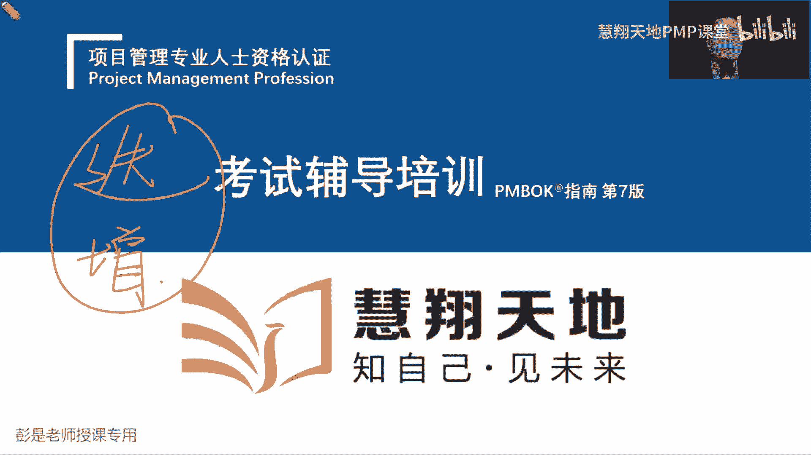
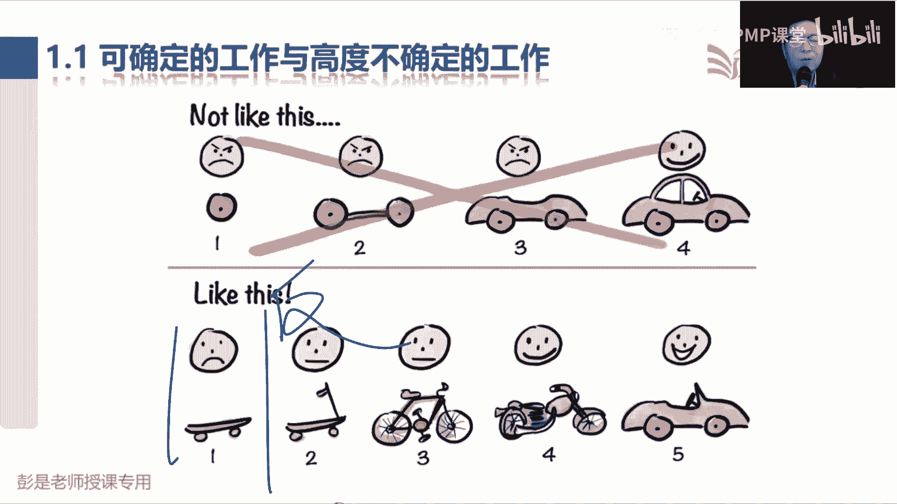
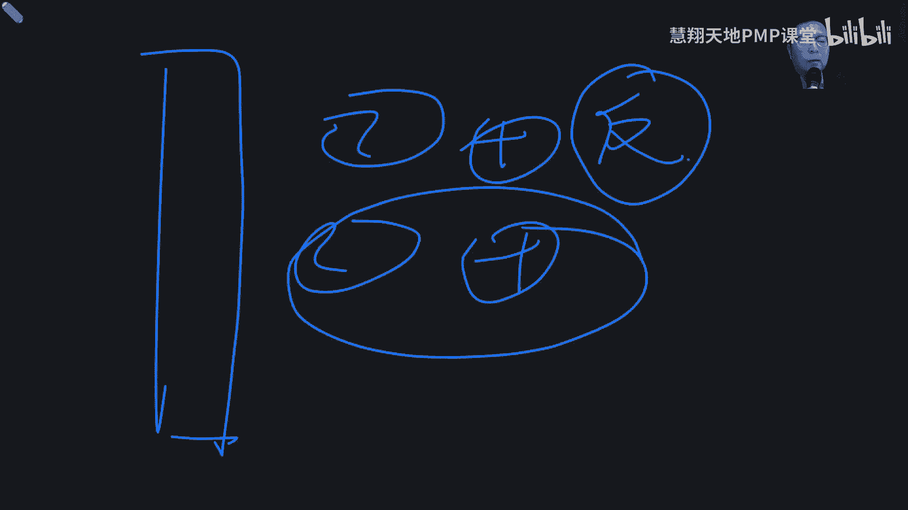
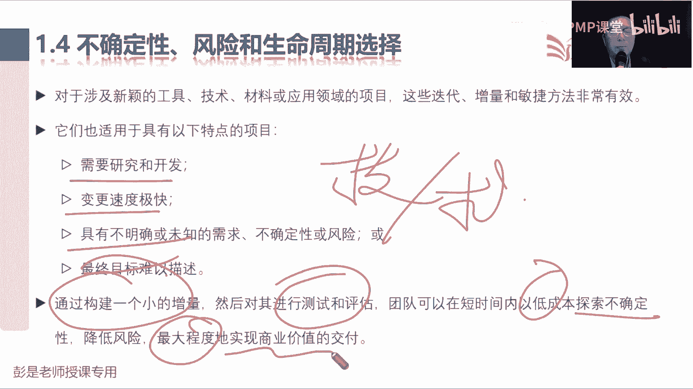
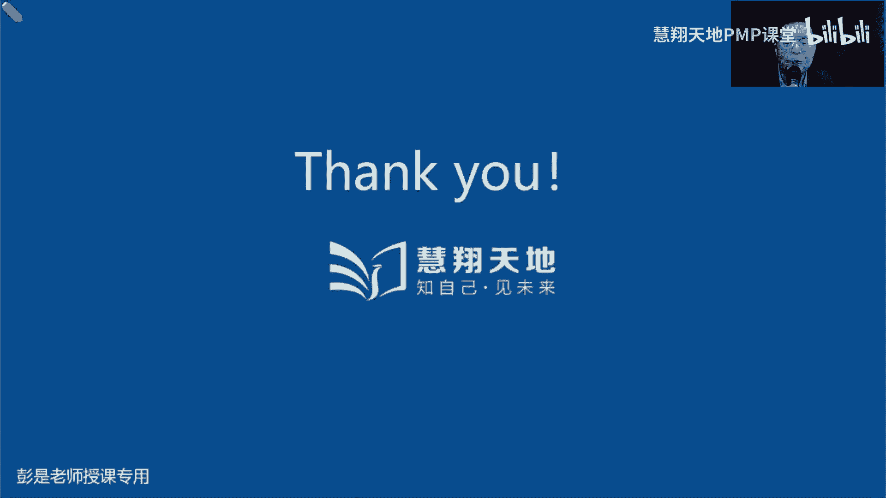
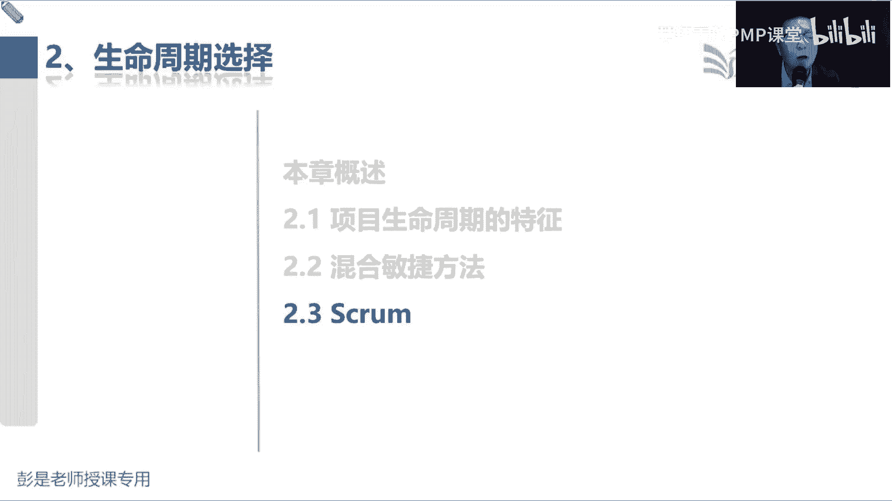

# 2024PMP认证考试课程（第六版+敏捷+第七版） - P13：第三部分 1.1-2.2  多变环境中的项目管理实践 - 慧翔天地PMP课堂 - BV1By411b7qM

教材里边我们第二大关已经通关了，这是五大过程组，十大知识领域，一大堆乱七八糟，各种各样的管理过程啊，这叫基于过程的项目管理方法，传统的预测型项目就这么管就可以了，那接下来第三部分是什么呢。

敏捷就是说呀多变的环境下，这个项目怎么怎么管，然后还记得那两个场景吗，说技术方案不确定我们那种方法叫什么来着，迭代吧，哎那如果需求不确定呢，就叫增量，对不对，逐渐的增加，逐渐的增加。

那如果技术方案和需求都不太确定，那咱就迭代加增量吧，哎这就是敏捷技术，也不太确定需求也不太确定，这不是变化多吗，这就是敏捷。

那敏捷它这段内容啊先抬头，主要是听为主，因为教材上的内容啊，大部分啊你听完了之后再去看，再去复习啊，他说来说去，其实没有那么多的知识点，内容超少的未来，我们需要掌握仨三带俩五就可以了。

并且呢实际上啊这仨三带俩五，里边一个三一个五，记得住，记不住也没关系，三个支柱，五个价值观，最核心的就是335，三个角色，三个贡献，那三个角色，三个弓箭和五个事件，那到底怎么玩看啊。

敏捷概述这段文字快速快速快速过说，可确定的工作和高度不确定的工作，主要是抬头看PPT，抬头看PPT，不然写写画画的过程，你看不到，低头看文字，咱俩信息不同步，就相相当于没听好说。

项目工作包括可确定的和不确定的，可确定的工作，我们有明确的流程，他们在以往的项目中被证明行之有效，比如完成设计后制造汽车，既然设计都定稿了，按照这个设计，12345，这个车是不是就盖好了，就造好了。

以此类推吧，所以这些都是可确定工作的例子，那什么不太确定呢，就这东西对不对，通常什么设计工作，规划工作，这不确定啊，哎这就这个知道这个道理啊，那这种不确定的工作呀就风险高，确定的工作呢就风险低。

那再往下说新的设计呀，解决问题呀和之前没有做过的事情，都是探索性的，什么解决问题，创建解决方案，巴拉巴拉都不念了，对不对，需求也不太确定，解解决方案也不太确定，需要什么呢，需要我们去探索，在这种模式下。

在这种模式下，如果呀我们还是从头干到尾，会导致什么问题啊，讲道理啊，如果需求都不太确定，咱定义范围，创建WWBS得到活动清单，估算活动资源时间成本，做进度表，算预算，然后按照进度按照我们的基准去干活。

得到可交付成果，在做测试，然后做验收诶，客户一看，抱歉，这东西好像不是我要的，这种情况下变更的成本非常高吧，那怎么办呢，哎这就是敏捷对吧，敏捷要解决的问题，所以再往下听了啊。

那高度不确定的项目变化速度快，复杂性和风险也高，这些特点给传统预测性方法就带来挑战，因为变更变更变更的代价太大了，那传统预测型方法只在事先确定大部分的需求，它适用于需求明确，适用于需求明确需求既然明确。

咱就搞定需求，做完设计，然后去执行，然后看看对不对，最后运维诶，就像传统的瀑布一样，前一项工作完成，后一项工作开始，以此类推，所以又叫瀑布型生命周期，那需求定需求定啊，咱就可以12345直接干活。

最后把成果一交接下班了，那如果需求不确定，需求不确定，这么玩不行，好知道这个意思，那为什么为什么要事先确定大部分的需求呢，为什么要通过变更请求严格的控制变更呢，因为123451干活变更的代价高。

所以在预测型方法中，我们要严格的严格的限制变更，所以才需要实施整体变更控制，考虑周全，综合分析，然后呢涉及到基准的变更，可能需要有权利的人CCB呀，来做出相应的决策，否则呢变更的代价。

变更的代价越来越高啊，所以要控制变更，而敏捷方法的出现，是为了在短时间内探讨可行性，根据评估和反馈快速调整，为什么强调短时间，周期越短，成本越小吧，周期越短，成本越低呀，那在短时间探讨可行性。

所以就叫以最小的代价去探索，去试错，然后根据评估和反馈看看对不对对，避免在错误的道路上越走越远，就这道理吧，所以再粗暴举例子啊，比如说我从北京开车去上海走高速，你说这个环境下变化多不多呀。

就这么一条高速，假设就这一条路啊，不多吧，哎那我就不用开导航了吧，好大家知不知道某些城市那个特点，重庆，你不开导航，开导航都跟不上吧，对不对，变化多呀，我们需要及时的反馈呀，对不对，及时的反馈啊。

这导航一定啊一秒钟一说，一秒钟一提醒啊，就这还容易走错了吧，就是因为环境复杂，就是因为对吧，各种路口各种路口啊，一不小心就走错呀，所以在这种环境下，我们希望能够周期越短。

这导航最最好最好每秒钟都在说话呀，告诉我告诉我怎么走啊，避免走错，避免在错误的道路上越走越远，所以周期越短，我们成本越低，试错探索的代价就越小，希望能够快速快速获得反馈，看看我们做的对不对。

这就是敏捷的中心思想，知道了这个意思啊，所以看PPT传统的方法，传统的方法啊，如果我们搞完了设计哎，把这个车设计好了，然后12345去干活，车造出来，一交付就完事了，但是如果对用户来说呀，需求不确定。

再这么玩不行了，需求不定，需求不定，用户说我需要一个交通工具，你能确定是要造汽车吗，不确定了吧，粗暴理条，用户说我需要一个交通工具，你不确定要造汽车吧，这种情况下，这叫什么呢，只闻其声不见其人。

你造了个这玩意，我不知道是啥，这玩意我不知道是啥，这玩意不知道是啥，等你把车造出来，我说抱歉，唉，这东西不是我想要的，变更的代价非常高，所以不能这么玩了，这个玩法叫什么呢，大而全对不对。

我们一次把所有的东西给你造出来，然后让你看看对不对，这种情况下大而全不行了，那咱换个思路，下面这种方案叫啥，不求大而全，那咱求四小而美，小而精，对不对，所以用户说我需要个交通工具好，反正需求不确定。

先给您造个滑板车，您透露着根据用户的反馈来调整啊，用户说这东西不好控制方向啊，没问题，加个方向杆儿，用户说拿脚秃噜，拿脚脱落费鞋呀，没问题，弄个脚蹬子，您蹬着，用户说蹬起来太累了，弄个发动机变成摩托车。

用户说肉包铁不安全，给您加个壳，不断的根据用户的反馈，反馈反馈，来分析我们这个产品未来要做出什么样的调整，所以用最小的代价去试错，成本越低越好诶，周期越短越好，但主打一个什么呢。

这些东西这些东西要确保它可以用起来吧，用起来才能够获得正儿八经的反馈，所以他要保持可用性好，知道这个意思了吧，所以其实根据用户的反馈做调整，因为用户反馈咱也不知道是啥啊，比如说用户说我需要一个交通工具。

给您造个滑板车，用户说我希望在水里走，给您造个船，用户说这船不动啊，给您加个帆，用户说没有风啊，给您加个桨，用户说划船太累了，给您加个发动机，用户说下雨漏水啊，给您加个壳，总之不断根据用户的反馈。

对我们的产品做调整，这样可以有效的避免在错误的道路上越走越远，并且呢整个研发的过程中周期越短越好，哎知道这个意思，探索探索探索周期短进行探索，根据反馈调整，这就是敏捷这种工作模式，好粗暴，理解了吧。

再再给你变成再给你变成，稍稍抽象一点的那些东西啊。

看看能不能跟上啊，看黑板，传统的方法是什么呢，咱收集需求，根据收集到的需求定范围，根据范围，有了WBS，有了WBS的定义，活动得到活动清单，活动属性，根据活动去分析活动所需要的资源，时间成本。

然后呢得到范围基准进度基准成本基准，按照这些东西去干活，什么时间做什么事，花多少钱就可以得到可交付成果，但是如果需求不定怎么办，所以咱要换一个工作模式，我们不是一次把所有的需求都完成了吧，挑一部分呐。

假设啊用户提了ABCDE5个需求，传统的做法就是根据收集到的五个需求，设计产品分析，要完成什么工作，要交付什么成果，然后创建WBS，然后噼里啪啦就往下走了，那敏捷我们不求大而全。

不是一次完成所有的需求啊，怎么办呢，选一部分呢，选一部分需求去干活，得到啥成果，得到成果之后要干嘛呢，反馈让人家看看，这个滑板车是不是满足他的要求对，然后根据用户的反馈再去看看啊，下一次去干啥。

得到成果，获得反馈，再根据用户的反馈看看要不要调整，以此类推，不断的循环，不断的循环，循环叫啥来着，循环循环循环叫迭代吧，产出新的东西，产出新的东西，这叫啥增量，所以敏捷的中心思想就来了。

把所有的需求记录下来，我们不是一次完成所有的需求，那我们就不断的迭代和增量，迭代和增量诶，通过不断的增加产品的功能，今天加个小脚蹬子，明天加个发动机，让客户看看这个东西满不满足他的业务，业务需要。

然后根据用户的反馈，我们再分析下一次迭代做什么事，因为有可能是做发动机，也有可能是做脚蹬子，以此类推，就这样以最小的代价去试错，用最小的成本去探索，这就是敏捷的工作模式，先大概知道这个粗鄙的结构啊。

好那再往下走了啊，这就是敏捷的主要的一个思维方式，那再往下，所以就提出来1。2敏捷宣言，他其实根儿就是个思维方式，就是个思路，告诉我们这种多变的环境下到底怎么管啊，那再往下1。

2的内容也不要求大家去背啊，不要求背的，记不住，没关系，听明白就够说，2001年，软件业的思想领袖共同发表了敏捷宣言，正式宣告敏捷开发运动的开始，为什么是软件行业首先提出这种工作方法呢，变化大。

因为软件行业最头疼的是啥，求这个东西吧，最近最近一些平台，之前一些平台说什么人人都是产品经理，关于软件呐，仁者见仁，智者见智，微信你肯定对于某些功能解决的很讨厌对吧，不好用很讨厌，嘿就是大家需求不一样。

对不对，用户也不知道是什么东西，大家可能没概念的，所以唉这种需求不定，需求不定的这种工作模式就出来了，那敏捷里面提出了这个敏捷宣言啊，有这么四句话，四句话先看结论啊，说右栏中的项目固然有价值。

但我们更重视左栏中的项目，右边是什么呢，这四个东西左边是什么呢，这四个东西啊，这是右，这是左，左右不分的同学，左右不分的同学看你的手啊，那第一我们个体和互动，而不是过程和工具。

说我们开始更重视个体和互动，而不是过程和工具，啥意思啊，为什么关注个体，为什么关注互动呢，互动互动互动，想想重庆那个路是不是要及时的关注互动啊，及时的互动吧，希望导航啊每秒钟都告诉我呀，别走错呀。

别走错呀，及时的互动啊，避免在错误的道路上越走越远，诶，他就强调这个东西，强调这个东西，不代表着说我们工作中就要推翻右边啊，因为像流程工具文档，它有没有价值呢，有对不对。

所以不代表着说我们要抛弃所有的过程，不代表着说我们要抛弃所有的文档，因为传统的预测型项目更关注什么呢，流程文档做设计，设计完了做施工，他更关注文档的标准化，规范化，对不对，好。

所以不代表不代表我们要否定这些东西啊，只不过在这种多变的模多变的环境下，第一我们更关注个体以及互动，因为这些人这些人仁者见仁，智者见智，每个人的需求不一样，哎我们要及时的沟通，及时的交流。

获取大家的反馈，避免在错误的道路上越走越远，然后第二行叫我们更关注可用的软件，而不是完整的文档，啥意思啊，刚才说不管是什么滑板车啊，自行车呀，摩托车呀，这东西一定要可以使用。

因为这个产品这个软件这个功能，这个东西这个成果如果不能用，能不能及时的有效地获得客户的反馈呢，嗯粗暴想场景啊，那个轮胎你放到我面前，你让我给你反馈这个交通工具好使不好使，神经病啊，你去餐厅吃饭。

人家给你拿过来拿过来拿过来，一块一块带血的肉，说亲这个就这个菜好吃不好吃啊，神经病啊，他没法吃啊，所以体验是软件行业，体验不就是需求吗，对不对，这东西说不清的，最头疼的啊，所以我们造出来的产品服务成果。

一定要可以使用，可以体验，从而获得用户真实的反馈，而不是追求文档的标准化和规范化，那不追求完整的文档，传统项目需求文件里面内容多不多呀，还记得吗，什么客户需求，业务需求，功能需求，非功能需求。

什么业务就绪需求，过度需求，质量需求，各种各样的需求啊，对不对，都写进去了吧，那敏捷还记得什么叫用户故事吗，用途故事是说是说啊作为一个什么角色，我需要一个什么功能，以便于实现什么样的目的，对动机啊。

就是一张小卡片，一张小卡片就是个需求，嘿叫轻吻党，亲吻党轻装上阵，没必要写那么标准，写那么规范啊，有时间有时间写这种标准化规范化的文档，不如去干活，把可用的产品服务成果做出来，诶他提倡的是这个。

所以把时间花在走流程写文档上，不如及时的把东西做出来，让对方看看，对不对，就这个道理吧，嗯好那第三客户合作而不是合同谈判，这也好理解吧，客户需求不确定啊，咱一起合作，面对问题，解决问题，及时交流。

及时沟通，而不是坐在谈判桌前对吧，看着合同条款，哼哼你死我活的互相对峙啊，最后呢就是因为这样的思路，这样的工作模式，那，就强调我们这么做是为了拥抱变化，因为周期短，因为试错的代价小，因为成本低。

我们能够更好的去应对这种多变的环境，而不是墨守成规，循规蹈矩，遵循计划本身，我们计划定的也不是那么周全对，所以这最后一结论啊，轻规划重探索，轻文档重实践，实践是检验真理的唯一标准，看看是不是就这意思啊。

实践是检验真理的唯一标准，把东西做出来，让人家看一看，用一用，从而获得用户的真实反馈，再粗暴理解一版，你在淘宝上买东西，这个衣服到底穿在身上好看不好看，给你只看图片，能获得真实的反馈吗，不行吧。

需要买回来穿在身上照照镜子才知道啊，鞋舒服不舒服，看照片看得出来吗，看不出来对不对，穿在脚上脚才知道啊，就这个道理，所以在这种多变的环境下，我们更关注这些东西，并且其中呢最重要的就是一二，他要可以用。

从而让客户来进行体验，从而我们聊一聊您的感受是啥，您的体验是啥，更客观地获得您的反馈，菜到底好不好吃，做出来尝一尝才知道它一定是成品，半成品生的东西都不行啊，就这个逻辑啊，好这不需要去不需要去背答案。

因为就像类似这样的道理，从现在开始，一直到正式考试之前，你会听吐了敏捷车轱辘话，来回说，就这些东西，那再往下根据这个思维模式，就提出了12个原则，这12个原则也不要求大家把它12345，背下来。

但是呢还要多看几遍，因为未来我们讲完square，我们讲完看板，讲完敏捷的具体实践方法，你再翻过头来看这12个原则，就能很好的理解了，这就是考试的思路，看看啊，第一我们最高目标是通过尽早持续交付。

有价值的软件来满足客户的需求，关键词是啥呀，就尽早把东西做出来，那把东西做出来，为什么强调有价值呢，粗暴理解啊，一会你去餐厅吃饭，点了一杯水，点了一份饭，现在啊我口干舌燥，哪个东西对我来说价值最高。

水吧，服务员咔声端端四碗米饭上来，这你说这不着急不着急上，先把水上来，对不对，好知道这个道理啊，所以我们需要干什么事呢，这么多的需求你要怎么办，排序排序对不对，看看哪个需求有价值，哪个需求优先级高。

怎么排序，以价值为导向吧，好排序方法前面讲过了，能想到啥，不是那个，讲QFD的时候，卡诺模型莫斯科方法，对什么东西必须有什么东西，应该有什么东西，只能有就那些东西吧，哎这是莫斯科方法啊，什么是基本需求。

期望需求，意外需求无差异需求，以此类推，这是对需求排序的一种方法，在此基础之上还要考虑啊粗暴利减压，这个需求能赚多少钱呐，这不是价值吗，哎就这样了，这不是咱的考点啊，咱粗暴理解需要对需求做排序。

这样呢把具有价值的需求给他优先做出来，优先做出来，从而做到价值交付，先造出来滑板车，如果用户说我这人我这人啊，惜命怕死，你下一步给他做啥，做发动机变成摩托车出路去，不是吧，先做个壳儿吧。

嘿安全性有保障啊，对不对，不断的不断的根据用户的反馈来分析什么东西，先做什么东西后做，以此类推了啊，这是能想到这个知识点，所以需求要排序好，尽早是什么呢，尽早把可用的软件做出来吧。

尽早把可以使用的产品服务成果做出来，这么做的目的是什么呢，越早做出来及时的反馈，避免在错误的道路上越走越远吧，哎就这道理好，第二我们欢迎对需求提出变更，即使在开发后期也不例外，我们要善于利用需求变更。

帮助客户取得竞争优势，欢迎变更，欢迎变更，那你怎么做才能够欢迎变更呢，刚才我们说过那个什么东西，什么东西越短，哎这个变更就变起来越容易被接受，周期短吧，所以带出来一定要做到第三点，第三点啊。

要经常交付可以使用的软件，周期从几周到几个月不不等，越短越好，周期越短，成本越低，成本越低，我们越欢迎变更，都是能听懂就可以啊，这都不要去硬背它，就这个道理，最后你会听吐了啊，第四在项目实施过程中。

业务人员和开发人员必须始终通力协作，这是啥意思啊，要及时的交流，及时的互动吧，因为业务人员关注的是what，开发人员关注的是好，对不对，所以呢我们必须及时的交流，及时的沟通，及时的互动。

避免在错误的道路上越走越远，就是这个道理，第五要善于激励项目人员，给予他们所需的环境和支持，并相信他们能够完成任务，能想到啥，嘿就有同学说到了，讲到领导力风格，领导力风格相信他们能够完成任务。

我们要想办法打造一个成熟的自组织团队，然后相信他们就授权，对不对，授权放任式的领导，李峰阁要打造一个成熟的自组织团队，然后呢相信他们相信他们就授权了呗，不管了呗，付款了之后。

我们再变成服务型的领导力风格，就给予他们所需的环境，对不对，支持就打配合了吧，唉确保大家工作环境舒服，然后呢该帮助的帮助，该指导的指导，该辅导的辅导，该加入的加油，嘿就是这种两种领导力风格就出来了。

第六条，第六条刚才讲过了吧，无论是对开发团队还是团队内部传达信息，最有的方法都是面对面的交谈，为啥效率高，效果好对这有利于建立我们所需要的信任关系，效率高效，效果好，因为多变，这也好理解啊。

我希望这个导航每秒钟都给我提示啊，最好是有一个很熟悉道路的人呐，直接跟我说呀，对这都听懂就可以了啊，第七可用的软件是衡量进度的首要衡量标准，关键词是哪三个字呢，可用吧，厨师在厨房噼里啪啦花了15分钟。

弄了一块带血的牛肉，你反馈一下，这好吃不好吃，神经病，这段这段时间白忙活，对不对，你有这个时间，有这时间不如做出来一个可以吃的东西，让我尝一尝啊，就这道理啊，哎这是可用的软件，那第八敏捷过程。

提倡可持续的开发，项目发起人，开发人员和用户都应该能够始终保持步调稳定，这能想到啥，什么叫稳定，什么叫可持续，你能想到一个成语就出师了，拔苗，助长，这不行吧，这不行啊。

所以我们追求的是什么可持续化发展的步调，稳定是什么呢，就想到制造业的场景啊，我们追求的是稳定的持续的产出，产品服务或成果，不要这周007对吧，下周全都噶了哎，所以他追求的是持续的稳定的输出，因为绩效高。

绩效高不一定是好事，绩效高变成大白话就是干活快不一定是好事，讲道理，为啥，干活快不一定是好事，现在的场景是需求不确定吧，在需求不确定的情况下，我干活效率非常高啊对吧，咔一周把汽车造出来了，哇。

这成本试错的代价太高了，对不对，所以我们不追求不追求高绩效，我们追求绩效稳定就可以了，持续到稳定的输出，持续的稳定的造出可以使用的产品，服务或成果就OK了，持续的造出可以使用的产品服务或成果就OK了。

干活干得快不一定是好事啊，对吧，我还没想好这房子怎么装修呢，施工的噼里啪啦承重承重墙都给你凿了，对不一定是好事啊，就这道理粗暴理解好，第九个需要解释吗，对技术的精益求精，对设计的不断完善，将提高敏捷性。

这没啥可说的啊，纯粹的字面意思精益求精，然后不断的完善我们的产品设计，造出来一个好的好用的高交通工具，唉不说了啊，第十这也刚才说过了吧，简洁及精可及，尽最大可能减少不必要的工作，这是一门艺术。

就是我们这些流程文档能精简到最后精简，因为流程文档做规划对吧，写文档这都叫什么呢，花在时间纸上谈兵，对，与其花时间纸上谈兵啊，你不如把时间用在干活，产出可以使用的软件，对获得客户的反馈呀，就这个道理。

所以叫轻装上阵，对不对，轻流程轻文档，重实践，重探索好，那第11，最佳的架构需求和设计将出自自组织团队，这没啥解释的了吧，因为成熟的自组织团队，大家都是成熟的人，都有主人翁意识，有主观能动性，有积极性。

对能够更好的实现任务，完成目标，得到我们期望的成果，最后第12团队要定期反省怎么做才能更有效，并相应地调整团队的行为，这又对这是什么东西啊，复盘复盘的目的是什么呢，这不就是PDCA里面的A吧，持续改进。

持续改进啊，各位同学要反思啊，这周学习过程怎么样呢，什么地方做得好，什么地方做的不好，我昨天晚上在复习的过程中看了会儿手机，看了会儿抖音，注意力不集中，然后呢又觉得又觉得心理压力比较大，然后心态不正常。

就导致昨天学了10分钟就放弃了，这过程不好，下次要反思，手机调静音，放远一点，专心致志地看书，专心致志地听课，就是不断不断不断想办法改进过程好，知道这12个原则听懂就可以啊，不需要重点标记。

不需要重点标记，等讲完敏捷实践，你再看这12个原则，P也不是，好知道这个道理就可以了，那根据这12个原则，接下来接下来就碰撞出各种各样思维的火花，看看BBD，刚才我们知道有这么四个价值观。

说我们更关注啥啊啥啊啥啊啥啊，比这些东西好一些，根据这四个价值观四个原则，敏捷宣言就衍生出了12个原则，告诉我们在这种多变的环境下，就衍生出派生出成百上千的敏捷实践方法啊，超多的全球敏捷事件方法。

现在也不知道有多少种了啊，34年前就有六七百种了，现在应该早就破千了，破千了，上千种实践方法呀，这玩意学的过来吗，学不过来，所以考试不考这么多，不要担心，不要焦虑，什么叫最佳实践，这需要解释吗。

什么叫最佳实践，为什么衍生出这么多实践方法，什么是最佳实践呢，讲个大道理啊，每个家庭做菜做饭的方法一样吗，不一样吧对吧，我什么高血压糖尿病，那我就少油少盐，清淡点，对不对，我太胖了，就少放点油。

嘿我长身体呢多吃点肉啊，这都是最佳实践的，每个项目每个企业情况不一样，根据企业的情况裁剪，对不对，裁剪裁剪裁剪出适合你本企业这些项目的方法，这就是你企业的最佳实践，所以就是根据这四个四个12个原则。

四个四个价值观衍生出很多很多的实践方法，这些实践方法不要求我们全都掌握，学不过来的啊，所以尽管这些原则源自于软件行业，但是呢已经扩展到了各行各业，它就是一种思维模式，这些就这些东西。

这些东西就衍生出这一类这类实践原则，再往下看，所以说是什么思维模式，价值观，什么发展不念了啊，找找找找找，所以敏捷方法是一个囊括了各种框架和方法，的涵盖性术语，他就是总结归纳抽象出来的，这叫敏捷方法。

只要是适用于这种多变的不确定的探索的，这种工作方法，都可以称之为敏捷，所以它是指符合敏捷宣言，价值观和原则的任何方法，技术框架手段或实践，这都了解就可以，不要做笔记，看PPT看PPT不要低头啊。

好那接下来给一张图说，下图还将敏捷方法，看板方法示意为精益方法的子集，精益咱有同学了解过吗，精益是什么呀，惊异的中心思想是啥呀，就这三个词啊，关注价值，小批量消除浪费，再看PPT。

不要不要不要不要听为主啊，关注价值，要做的需求这么多，现在对我来说最重要的是水，这不是价值交付吗，所以我们需要对需求排排序，优先交付有价值的产品服务或成果，第二呢我们不求大而全，一次完成所有的需求。

这也是浪费啊，因为变更的成本高啊，因为需求不确定啊，所以我们关注小批量，比如说我先完成一个A和B做个脚蹬子，这对用户来说最有价值，把它做出来，创造我们的成果，获得客户的反馈，唉再做出一个C和D。

再把成果做出来，获得客户的反馈，这种小批量的工作模式，可以帮助我们避免在错误的道路上越走越远，所以这么做的目的，最终是为了消除各种各样的浪费，对不要浪费时间，浪费钱，浪费精力，那为什么要清文档。

轻计划呢，轻规划呀，嘿减少一些不必要的流程，文档啊，也不追求标准化，规范化也是消除浪费啊，不要浪费时间在纸上谈兵，有这个时间把成果做出来，实践是检验真理的唯一标准，哎所以都是经济思想。

经济思想源自于这个根，所以就带出来这么一张图，精益是一个超级，在这种消除浪费，就派生出各种各样的敏捷事件方法，这些单词不要记啊，其中未来我们会讲看板SCM和节极限编程XP。

这是我们需要掌握的三种高频考点，剩下右半部分什么水晶啊，敏捷版呐，AUP啊，统一开发过程啊，FDD啊，功能驱动开发，这都咱都不讲，不要求我们掌握的好，知道这个意思就够了啊，那再往下就不得不提1。

3精益看板，精益和看板方法，这段文字超少看PPT，所以看待精益，敏捷和看板方法三者之间关系的思路是什么呢，敏敏捷看敏捷看板方法是经济思想的衍生物，所以呢经济思想刚才那个图它是个大圈，是个超级对。

他主要工作主要思路是什么呢，消除浪费啊，所以共性的东西在于交付价值，所以要排排序，尊重人，不用解释了吧，这纯粹的字面意思啊，对事不对人呐，任何人他的主张，他的观点，他的建议意见。

他的建议都有一定的都有可能有价值啊，然后呢我们要减少浪费，透明的目的是啥，透明化的目的是啥，再粗暴，想找牛啊，想，咱人咱人这一旦发现一些重大疾病，就是因为看不到身体里边的情况吧，如果人都是透明的。

是不是可以及时的看到你的心肝，心肝脾肺肾有没有问题啊，只有这个逻辑透明透明透明，可以及时的发现问题，便于我们及时的发现问题，好了解就可以啊，后面都会讲到那适应变更。

持续改善PDC那个A所以这就是敏捷敏捷，最后一会我们讲那个333333带俩五，具体的工作方法才是咱的考点啊，这些大原则大道理都是听听听了解就够了好，所以项目团队有时候会发现，把各种方法结合起来更为有用。

因为有成百上千种实践方法，这些实践方法它都是为了解决某一方面的问题，把这些方法综合运用起来，才能够帮助我们更好地实现目标，比如说关键路径法，资源优化进度压缩要不要整合到一起用啊。

对每个方法有每个方法的工作重心，关键路径法是正推，逆推推时间，对不对，看看灵活性资源优化呢优化资源的使用问题啊，工期太长，进度压缩呀，所以敏捷也这个逻辑什么看板SQUAM，每个方法有每个方法的作用啊。

所以要综合的根据项目的情况做裁剪，选择适合我们的方法，那不管用什么方法，最终的目的都是为了实现最佳效果，这没什么可说的啊，那1。4，看眼熟不眼熟啊，咱第一天上课说的一个交叉线呢。

项目到了后期变更的代价非常高，然后成本高，成本高，成本高，如果需求不确定，那咱就缩短缩短，缩短缩短周期吧，一步一反馈，一步一反馈，避免在错误的道路上越走越远，周期越短，成本越低，探索是做代价越小好。

这段文字全都不垫了，那为了减轻这些风险的影响，我们选择生命周期要能够通过较少的工作增量，解决大量的不确定性问题，所以较少的工作增量不就是滑板车，然后加个方向杆，对不对，再加个什么脚蹬子。

这样呢以最小的代价去试试错，最小的代价去试试去探索啊，所以摘下来后面这句话，我们可以利用较少的工作增量验证自身的工作，看看我们做的对不对，并且可以对接下来的工作做出相应的变更，用户要个滑板车。

我们原计划下一步给你做个方向杆，用户说我要个船，所以不做这个东西了，及时的变更，及时的调整，反正成本低，反正待大小好，最后那和静态书面规范相比，当团队交付小的增量的时候。

我们能够更快速的理解真正的客户需求，因为第一它可以使用，对不对，第二可以使用的东西才能够让客户来进行体验，从而他用过了之后才知道鞋子到底合适不合适，饭菜到底好吃不好吃，是不是满足他的业务需求。

他就适用于这样的场景，这就是中心思想，那再往下说，我们可以稳定的管理要求巴拉拉，但是随着项目不确定的增加，变更做无用功返工的可能性会随之增加，就这道理啊，浪费时间，所以就带出来就这段文字需要大家记住了。

根据前面讲的这些批罗里吧嗦的大道理说呀，有些团队让生命周期发生演变，以便于使用迭代和增量的方法，因为我们发现在探讨迭代需求，更频繁的交互增量时，我们会更容易适应变更，因为周期短，由于团队获得反馈。

那么这种迭代和增量的方法减少了浪费和返工，及时的获得反馈，看看这个东西对不对，避免在错误的路上越走越远，所以给出来这么这这些方法，它们的共性，第一非常短的反馈循环周期越短，成本越低，对不对。

尽早的尽早的获得反馈，避免在错误的道路上越走越远，第二频繁的调整过程，这啥啊，持续改进吧，就是PDCA的那个A，所以在敏捷里边我们做反思，做反思那个东西叫什么呢，叫回顾会，后面会讲啊。

不断的回顾复盘这个阶段的工作过程，什么地方做得好，什么地方做的不好，总结经验教训进行改进，定改进的目标，改进的措施诶，不断的要有调整过程，优化过程，那第三重新进行优先级排序，这需要解需要再解释吗。

随便举例子了啊，为了省事，我就写字母了，现在用户说我需要ABCD，唉A对我来说价值最高，咱就把A给它做出来，让人看看，对不对，用户一看呐，诶接下来我C优先级最高了，怎么办呢，那我们就做C呗，对不对。

您说啥是啥呀，拥抱变化，用户说，现在我需要加个E，第三阶段，你给我干E没问题，咱就干E哎，不断的不断的对这里边的东西排排序排排序，以什么为导向呢，价值什么事情有价值，我们就先做什么事情，对不对。

付宝理解什么东西赚钱多，咱就先做啥呀，哎这就是重新进行优先级排序，嗯最后定期更新计划，因为根据反馈可能要调整我们的作战计划，最后到频繁交付，为什么用平凡这个词呢，它想体现的就是周期短吧，周期越短。

周期越短，代价越小，哎，就这些中心思想就出来了啊，这都是现在为止能听懂就够了，这东西记得住，记不住，其实也还好，最后说这些方法很有用，它适用以下项目特点，什么需要什么研究开发啊，这都不见了。

总之技术也不那么确定，需求也不那么确定，我们，就先把一部分东西做出来，然后测试评估，以低成本探索不确定性来降低风险，并且最大程度地实现商业价值的交互，因为不断的排序。

不断的调整优先级，这都是能听懂就够了，后面我们会讲具体的游戏规则。

具体的工作方法，第二章生命周期选择，这段文字其实大家第一章和第二章啊，后边复习的时候看一遍就够了，都在说大道理吧，车轱辘话，来回说话，都在说大道理啊，那第二章生命周期选择，能想到他会写什么内容呢。

迭代增量，迭代和增量哎，就这些东西，就这些东西这段内内容啊，复习的时候重点看2。3就够了，因为2。12。2还在说大道理嗯，快速看啊，预测型生命周期，迭代型增量是迭代型生命周期，增量型生命周期敏捷。

预测型生命周期就是我们12345去干活，对那迭代型生命周期，这种方法允许对未完成的工作进行反馈，从而改进和修改该工作哎，重复改重复改重复改，改到满意为止，这就叫迭代技，通常用于技术方案，解决方案不确定。

所以就像咱去医院看病，医生医生给你治病，是不是迭代啊，先打打打，打针不行，输输液不行，吃点药不行，动手术对吧，不断的探索，不断的探索一个正确的解决方法，这就是迭代，而增量呢。

这种方法向客户提供各个已完成功能，各个已完成的可能立即使用的可交付成果，就是不断的增加功能，不断的增加功能通常用于需求不确定，那最后敏捷就是迭代和增量，不就是迭代和增量不断的循环，不断的循环，频繁交互。

因为周期短就比较频繁，就比较烦诶，这没啥解释的了啊，那2。1生命周期特征，看PPT快速看，快速看，说预测型，一次交互，迭代型一次交付，我们更关注解决方案的正确性，感冒了不知道怎么恢复健康，先吃点白加黑。

不行的话吃什么，999不行的话吃感冒灵，总之不断的探索，对不对，得到一个健康的身体，探索解决方案的正确性，而增量型呢这是需求不确定，公司想开发公司官方网站，不知道都做什么功能，怎么办，先做个什么。

关于我们再做一个什么产品介绍，再做一个公司简介哎，不断的增加功能，增加功能，所以他更关注的是周期短，频繁更小规模的交付，他更关注的就是速度，周期越短，周期越短，成本越低，所以就是滑板车。

然后自行车摩托车就这个逻辑，最后敏捷，那就是更频繁，更，持续改进，所以叫频繁小规模交付，反复之就是迭代加增量，通过频繁小规模交互和反馈实现客户价值，好知道这个意思啊，总之最后结论是啥呢。

灵活根据项目实际工作去分析啊，什么事情，什么事情可以一次完成，什么事情需要不断修改对吧，什么事情啊，我们不断的不断的增加一些功能，什么事情我们迭代加增量就混合混用混用，这就是混合型生命周期。

好那再往下又开始说了，预测行生命周期，充分利用已知和已经证明的事物，不确定和复杂性减少，允许项目团队将工作分解为一系列，可预测的小组，然后迭代型生命周期就是不断的改，不断的改。

增量型呢就是增加增加增加不再重复电了啊，敏捷就是迭代和增量，这段文字也不念了，说什么同时迭代属性，增量属性后面不就不解释了啊，好再看这段文字呢，又开始说了，预测行程每周期12345，最后交付。

所以一定是需求明确，需求明确，我们在做设计，设计完了我们再盖房子，开发软件，然后呢检查测试没问题就交付了，你家里装修不都这个套路嘛，对不对，后面的这些文字需要解释吗，说目标尽可能的减少预测型。

尽量的不要变，尽量的不要变，这样我们可以做到一次交互，所以呢关注的什么有效的有序的标准化，规范化，以此类推了啊，迭代型生命周期呢就是方案不确定，所以需要不断的探索，不不断的改进，不断的改进。

这也没啥可念的了，有这么一个单词，后面再解释了，这先快速过了啊，车轱辘话来回说呀，再往下增量型生命周期213，那就是需求不太确定，我们就先做出一部分，再做出一部分，再做出一部分。

让您看看这个功能是不是满足您的要求，所以通过少量可交付成果，频繁交付，成为增量形成的游戏，这都没啥解释的，反复念了，然后214说，敏捷生命周期的特征就是不断的迭代和增量，不断的迭代和增量，那看看这张图。

这是第一个新的知识点，这张图啊，上半部分和下半部分，拿眼睛一扫有什么主要区别，不要看字啊，看结构，不要看字，看结构上边啊，他这个宽度啊是一样的，下边这个宽度呢有宽有窄，这实际上就是看情况。

根据我们项目的情况来分析啊，采用什么样的节奏，根据我们的项目情况来分析采用什么样的结构，所以上边叫什么呢，基于迭代的敏捷，我们的迭代周期是固定的啊，基于迭代的敏捷，我们的迭代周期是固定的。

他有稳定的交付节奏，粗暴理解，如果它的迭代周期是一周，那么每周都有成果，每周都有成果，这叫基于迭代的敏捷，下半这叫什么呢，基于过程，基于流程的敏捷，那它的节奏不固定，为什么呢。

做一个脚蹬子和做一个或做一个发动机，的周期一样吗，明显不一样吧，炒一个鸡蛋，西红柿和炒一个鱼香肉丝的时间一样吗，不一样啊，所以结合项目的实际情况，我们要去分析啊，有的时候呢是可以稳定的节奏。

持续的交付的，有的时候呢这个节奏不一定固定，它取决于我们要完成工作的规模，因为做一个脚蹬子和做一个发动机，周期明显不同，这种情况下，我们可能采用基于过程的敏捷这种模式，但不管是什么模式。

都是迭代迭代迭代，然后增量增量增量，它的道理是一样的啊，但咱话说回来，PMP考试，PMP考试，基本上大部分的题都是基于迭代的敏捷，我们有固定的迭代周期，基于过程的敏捷，咱PMPP考试其实是不太会考的。

好知道这个意思就够了，那再往下就开始说了啊，在基于迭代的敏捷之中，我们以迭代形式交互完整的功能，它特点是什么呢，相等持续时间的时间和来了个新的单词啊，时间盒是什么鬼啊，时间和这词很怪啊，还就是迭代周期。

就是时间是多久，它敏捷里边呢，因为软件行业出来的啊，软件的人有什么特点呢，灵活看到什么单词就想到什么话，就用它来描述，它不一定是高大上的专业术语，时间和是直译过来的，时间是time和是box直译过来的。

它指的就是迭代周期，到底是一周啊，两周啊，还是三天呐，四天呐，嘿这个单词知道OK了，那我们团队集中于最重要的功能，作为一个团队合作完成其工作最重要的功能，这是不是排序啊，对不对。

先把最有价值的东西给它做出来，然后我们再集中于下一项最重要的功能，这样呢持续做到永远是交付，相对来说最有价值的东西，这就持续做到价值交付了，好知道这个单词就够了，那再往下对于建立在流程基础上的敏捷方法。

那要看情况了，看情况了，看情况了，所以呢它的迭代周期不一样，知道这个结论就够了，因为完成不同功能所花费的时间不一样，但是原则不变，后半句又说了吧，团队让进行中的工作规模尽量小，不追求大而全，追求小而精。

小而美规模小，就可以尽早的把它做出来，尽早的做出来，以便于尽早的发现问题，并在需要变更时减少返工是错的，代价就小，变更的成本就低，所以思路是一样的啊，最后记结论吧，对不对，有的事。

有的事情我们可以稳定的接到持续的交付，有的事情呢不一定，所以它可有两种工作模式，一种是固定的迭代周期，一种是不固定的迭代周期，并且咱PMP考试基本上考就是固定的迭代，迭代周期。

这个模式好知道这个意思就够了，再往下看PPT，那敏捷生命周期是符合敏捷宣言的周期原则啊，特别注意的是，客户满意度将随着有价值的产品，早期交付和持续交付不断提升，永远永远排排序排排序。

看看什么东西对用户来说价值高，什么东西对用户来说价值低，永远优先交付最有价值的成果，这样呢就做到了持续的价值交付，所以带出来又是我们听过的一个重要的原则，功能性的提供价值的增量。

可交付成果是衡量进展的主要尺度，这三句话最后一总结啊，它有价值，它可以用，因为可以使用的东西，我们才认为它是个增量，半成品，不是增量，不能吃，不是增量，对不对，他一定要可以使用，可以使用的产品。

服务成果才是为才认为是个增量啊，那为了适应更频繁的变更，更频繁的交付价值，所以呢敏捷生命周期就叫迭代加增量，通常迭代周期小于四周，好所以书上后面给出这么一个例子，这个例子啊，粗暴理解。

看PPT1句话搞定，就是有些地方建设住宅小区，为什么要分一期二期三期啊，尤其是一些一些企业，一期一动工就干啥去了，贷款对吧，贷款抵押贷款贷款，然后二期移动工再继续贷，玩儿了命的捞钱呐，哎先把E7建出来。

咱正能量啊，先把E7建出来，是不是可以尽早的把它卖出去，对尽早的收回资金啊，有了钱我们再搞一搞二期，尽早的把它做出来，卖出去再回资金呢，以此类推啊，哎这就是增量的好处，不要一次把三期全都建完对。

所以增量增量增量这不念了啊，什么使某些建筑物比其他更早完工，尽早把钱收回来，这就好处啊，再往下噼里啪啦噼里啪啦一大堆问号，不念了，还需要念吗，什么创造价价价值，用什么方法不重要，什么成功反馈不念了啊。

这段文字复习的时候看看就可以，那接下来2。2混合敏捷方法，再看PPT，专心看专心看，不要看文字啊，不要低头看教材，说，敏捷的团队很少将其实践局限于一种敏捷方法，因为成百上千种，每个方法有每个方法的特点。

每个方法有没有每个方法的重要性，所以我们要组合组合组合混用好，知道一次就过了，最后一阶段组合组合组合回应不就是裁剪吗，啊再往下这段文字，听裁剪敏捷框架的一个例子，是说一个广泛使用的常见协调方法。

涉及到scrap框架，看板和极限编程，这三个也是需要咱掌握的三种方法，好这段文字给这三种方法做了个总结，做了个总结，一个一个来啊，SQUAM为产品代办事项列表，产品负责人。

swam主管以及跨职能团队开发提供指导，包括什么，这段文字大家目前根本就听不懂，没关系，因为马上就讲，它也是相对来说信息量比较大的一种实践方法，看板简单啊，看板面板帮助团队进一步的提高效率。

方法是将工作流可视化，使障碍更容易被觉察，以及通过调整再制品限制来实现流程管理，这在制品后边再说，工作流可视化有什么好处啊，这是后半句啊，就像想一想长想场景啊，这么说导航。

导航如果能及时的告诉你哪儿修路，哪出交通事故了，哪儿堵了诶，它的好处是不是可以干这个事啊，使障碍更容易被察觉，知道未来阻碍我们成功的事情都有哪些，对不然后及时的及时的排除障碍，让我们能够顺利的往下走吧。

唉这就是看板叫过程可视化，流程可视化，在想场景，为什么有的餐厅把厨房放在前面，都是透明的窗户，让你能够看到里面的东西啊，对啊，可以及时的发现里面工作有没有问题吧，可以建立良好的信任关系吧，就这个道理哈。

总之能够及时的及时的看到流程，后面看板我们也会单独讲，但是呢极限编程后面基本上不会单独讲，但是这个东西虽然有局限性，我们要知道它的主要作用，它主要用在软件行业，那这些单词啊，什么持续集成重构自动化。

测试测试驱动开发，这些方法的主要作用是保什么呢，质量，关于极限编程，看到这堆单词能够反映它是帮助我们提高质量，提高效率，知道这个意思就够了，因为咱PMP考试可能会稍稍带一些，这几个单词。

看到这些单词能反应过来啊，那他到底是干啥的，其实不重要，先听一听啊，什么叫重构啊，什么叫重构啊，它对标到另外一个词啊，叫债务技术债务，因为带专业知识，所以咱给大家算一个，换一个粗暴的场景。

什么叫技术债务呢，大家想一想你家的房子啊，今天今天要扫地，嗨凑合凑合扫一扫就完了对吧，什么擦擦玻璃，擦桌子，凑合凑合擦一擦就完了，上一天课好累啊，凑合每天都凑合，是不是早晚有一天需要花花一些时间。

全都全面的打扫一下呀，就有这个道理啊，对不对，家里面乱糟糟的东西丢的到处都是，唉，凑合凑合收拾收拾就行了，到处凑合到处凑合，早晚有一天要推倒重来吧，这就是重构，因为我们在工作中。

可能有的时候啊面临着时间紧，任务重，这样的工作任务，可能不得不采用一些不是最优的解决方法，就是凑合哎，凑合多了，凑合多了就形成了债，这个债早晚要还，大家在学习PMP的过程中，有没有学习债务呢。

今天课听了一半，睡觉去了对吧，一会儿玩玩手机，看看朋友圈，嘿今天听个一知半解，没有专心听啊，这都是债呀，这都是债啊，这些债早晚要还的，对不对，还要去花时间完整的再听一听，就有这个道理啊。

这单词能反应过来啊，技术债务，技术债务它可能对我们的质量稳定性，可靠性产生产生影响，那不行的话，要考虑适当的时候重构一下，所以房子有没有重构啊，我们家那个鸡窝不结实，今天这儿漏风，明天那儿漏雨。

那我今天钉块板儿，明天弄个塑料布，是不是早晚有一天，这不是临时的解决方案吗，对是不是早晚有一天可能需要重构一下，重新给大家收拾收拾，让它更结实啊，就这东西自动化测试需要解释吗，这不用了吧，让机器人干活。

对不对，让这种智能的人软件自己做测试啊，这没什么可说的啊，效率高对不对，提高质量比人更放心，可能啊，那测试驱动开发又是个什么玩意儿，看PPT超简单啊，测试系统开发，大家有没有看过开幕式啊。

开幕式我们表演团体操，怎么让这些人站得横平竖直呢，哎D上画啥画啥小点，这些小点儿是啥呀，验证方法吧，唉咱先把这个验证方法给它弄出来，然后我们这些人进场的时候，按照这个方法，你直接去跑到位。

这不就叫测试系统开发吗，把验证方方法先给它弄出来，你按照这个标准去干活，这不是提高效率，提高质量了吧，再粗暴举例子啊，如果我想垒垒猪圈，怎么让这个墙垒的直呢，而且，施工工人就干这个事了吧。

弄根线下面挂块砖头，利用地球地球引力，这个线不就直了吗，然后你按照这个线去贴这个砖，去垒个墙就直了，测试驱动开发，先把这个验证的方法，验证的标准给它弄出来，最后再举个例子，咱就下课了啊。

PPTPPT有有没有刻度啊，标尺是干嘛的，测试驱动开发，对不对，我想弄一堆方块在PPT，在PPT上，你可你把这个标识功能打开，就知道这个东西到底多宽，他俩到底齐不齐了，测试驱动开发就这个道理啊。

提高效率，提高质量，所以知道这个大，这这知道这段意思啊，受极限编程的启发的工程实践，包括这些东西，总之提高绩效，对不对，保质量保效率，除此之外还有一个单词啊，也需要稍稍有点印象啊，叫绝对工作法。

结对工作法，结婚的结对象的对，这又是什么意思啊，男女搭配，干活不累，有道理哈，他标准的做法，标准的用法是这样的啊，带场景，我有我这边有一个病病人啊，张三疑难杂症，那怎么做怎么做来提高治疗的质量呢。

疑难杂症吧，那最好是多找几个专家吧，对不对，所以他的工作方法是什么呢，就是张专家张专家干活的时候，李专家给把把关看一看，李专家干活的时候，张专家给把把关看一看，两个人一起干这个事儿来保质量。

防止工作出错，所以通常工作中啊，你说小事有没有必要结对工作，一会叫个外卖，找几个专家，我们一起点外卖啊，我点外卖的时候，你看着千万别弄错了，没必要，对不对，一些工作中的疑难杂症对吧，比较有挑战性的东西。

技术攻关呐，技术研究啊，诶那为了保质量，为了保效率，我们可以考虑采用让几个，让几个水平高的人一起来干这个事情来保质量，那除此之外，大家在实际工作中啊，还有什么男女搭配干活不累，可以吧。

真的确实可以有效的提高工作效率啊，可不可以老带新也可以吧，两个人一起干活，对，尽快的尽快的让对方熟悉我们的工作方法，也可以提高效率，保质量，所以啊它有各种各样的实践方法，但这些单词呢到底怎么做。

它不考啊不考啊，考的是什么呢，看到这堆单词能反应过来，我们是为了提高绩效效率质量，避免出错，减少返工，消除根儿，最后都是消除浪费，对不对，都是消除浪费啊，运动场不画那个小点儿点儿，大家一跑跑错了。

浪费时间，想办法都是这个思路啊，这就是极限编程学到这个程度，这个实践方法咱就出关了，其实基本上讲完了工作流过程可视化，便于我们及时的发现问题，好看看时间啊，那时间的关系呢，此QUAM咱今天反正也讲不完。

335分钟讲不完，下节课再说了，下节课我们会讲讲完敏捷这部分知识点，然后咱教材第四部分其实就是第七版的内容，第七版的内容啊，先说一说啊，大家如果有兴趣的同学啊，下节上课是五一之后了吧。

好有兴趣的同学五一期间可以翻一翻，你翻的过程中就会发现，还记得第一课第一节课说什么吗，第七版啊叫什么新瓶装老酒，它其实就是把我们五大过程组，十大知识领域，49个管理过程，一大堆的输入输出工具技术。

再加上敏捷的知识点重新分组，重新分组就变成了12个原则，八个G效应，所以讲DT版的内容会讲的非常快，因为大部分的知识点你听起来都相当于复习了，所以呢大家五一期间，其实就可以看这部分内容了啊。

看看看看的目的是复习复习复习，因为很多术语我们都讲完了，你就相当于复习复习复习了，然后在看的过程中呢，会发现一些没有讲到的东西，做个标记，如果能看懂，你很棒，看不懂没关系啊，做个标记。

这样呢在听课的时候就知道哪些需要重点听了，这就是先给大家说一说，我们下一节课下一节课这个讲的内容好，所以作业作业大家关注，微班主任在微信群发的公告啊，然后五一期间呢，要不要学习的看情况看情况啊。

个人建议还是既然还有一个月考试了，我们都投入这么多的时间精力成本了，为了防止出错，为了防止出出错啊，还是建议大家踏踏实实，踏踏实实，花一些时间听课看书，回顾知识点，好以此类推了。

说韩尼说敏捷的清文件和和体系要求的文件，完整冲突骂冲突啊，所以你要裁剪啊，做选择呀，对不对，选择如果对企业如果对，比如说粗暴理解啊，给国家给国家国家做项目，国家要求文档必须规范，必须完整。

那你敏捷的起来吗，敏捷不起来就回到传统的预测新方法，主打一个灵活呀，对不对，好下课，迭代和增量具体区别，讲完了，且听风吟同学不知道咋说了，和面或水或和面，还记得吗，对吧，面多了加水，水多了加面。

这不是迭代吗，增量是什么呢，做个轮子，做个脚蹬子，增加功能啊，在和面或在和面放水放面的过程中，有没有增加新的功能呢，没有这不就是迭代吗，好下课了。

下节课再见。