# 2024PMP认证考试课程（第六版+敏捷+第七版） - P2：第一部分：1.1项目 - 慧翔天地PMP课堂 - BV1By411b7qM

咱教材啊一共有四大块内容，第一大块就是现在的这个标题，项目管理的基础知识，就告诉你什么是项目，什么是运营，什么是项目及什么是项目组合，什么是事业环境因素，涉及到项目管理的相关的一些基本的概念。

定义生命周期阶段，划分五大过程组，十大知识领域，这是基本概念，然后呢教材的第二大块，通关宝典的第二大部分叫传统的项目怎么管，所以呢叫基于过程的项目管理方法，主要就在讲五大过程组，十大知识领域。

49个管理过程，以及每个管理过程的输入输出工具，基础教材的第三块内容呢叫多变的环境下，项目怎么管，其实就是敏捷告诉我们一些敏捷的实践方法，什么是SCM呀，什么是看板啊，什么是极限编程啊，讲这部分内容。

最后第四块内容呢就是第七版，P播格，第七版告诉我们小管项目有哪个12个原则，然后八个绩效育到底应该涉及到什么样的知识，诶就是12个原则，八个绩效预PMC第七版的内容，全书大概分成这四大块。

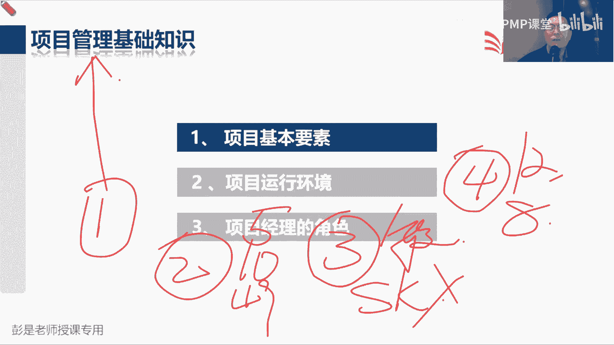

那今天的课程，接下来我们要做的事情就是搞定项目管理，基础知识，搞定第一部分内容，那讲课的过程中我会告诉大家的啊，说这部分内容一定要记住，这部分内容看一看就可以了，这部分内容不用看，大家适当的做一些标记。

然后后面复习的时候。

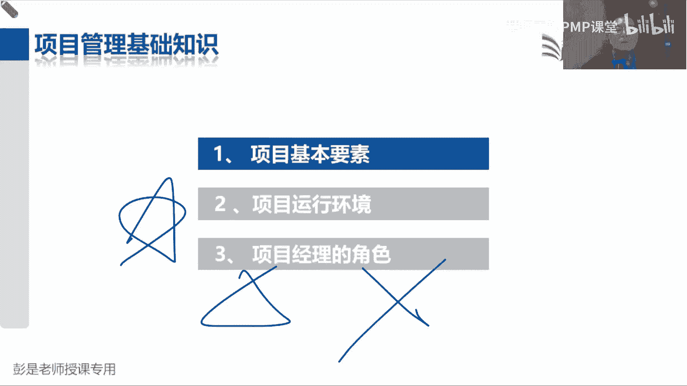

建议大家抓抓重点基本要素，第一部分一共分分三章，叫项目基本要素。

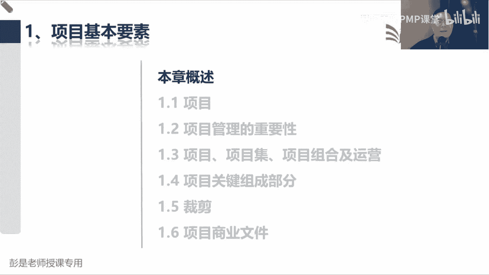

项目运行环境，项目经理的角色，重头戏都在第一小节了，项目运行环境相对来说没，那么就没那么多知识点，项目经理的角色呢也没有太多的知识点。

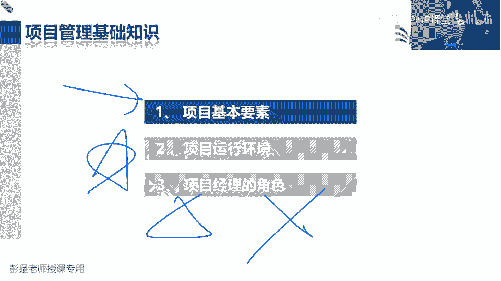

那项目基本要素说本章概述开始啊，专心听，专心听说呀，描述了，这都可以不看了，然后一点一项目第一个重要的知识点就来了，项目到底是啥呢，项目的定义是说是为了创造独特的产品，服务成果而进行的临时性工作。

项目创造独特的产品服务成果，而进行的临时性工作，这句话读完了就会发现好几个单词，独特产品服务成果，临时性工作，那接下来各位同学想啊，到底什么是项目呢，你工作中哪些工作是项目，哪些工作不是项目呢。

他俩有什么区别呢，工作中什么事情可以做项目呢，什么事情不是项目呢，不是项目，那个玩意应该叫什么东西呢，所以接下来带场景帮助大家更好的理解啊，对企业来说都有什么事，在场景大家先想啊，如果现在张三找你说。

咱俩一起去创业，你要先想什么事情，成立一家企业先定啥呢，有同学说计划，还有同学说什么工商注册办公室诶，钱这些小细节都不着急吧，首先第一大块是什么呢，定位你们到底要干啥。

对企业来说就是我们我们的企业的目标，企业的愿景，我们企业有什么使命，我们是一群什么样的人，我们的价值观是什么，就是这些方向性的东西对吧，所以最后一总结啊，就是what咱俩创业到底干点嘛。

我们是成立一家科技公司，什么搞人工智能还是骗子公司，还是我们开牛肉面馆，开餐厅，开开开个咖啡馆，诶，先定方向，我们是一家什么样的企业，未来我们会朝着什么方向去发展，我们的使命，我们的价值观是啥。

那定义完了这个what，接下来要思考啥呢，定完了what，接下来要思考的是啥呢，好对吧，怎么实现这个目标，如何实现我们的愿景，怎么体现我们的使命和价值观，就是好，那how变成高大上的术语，对企业来说。

我们就起了个名字，叫什么呢，叫企业的战略规划，这个大家其实从小到大都是这个逻辑，什么叫从小到大呢，国家有目标，愿景，使命价值观吗对吧，物质极大丰富，人民为所欲为，那接下来要思考的就是咱有3年规划。

5年规划吧对吧，十三五十四五唉，做国家的战略规划，我们到底抓抓农业呀，抓工业呀，抓教育啊，抓医疗啊，什么时间做什么事啊，这是做我们国家的战略规划，那对企业来说也如此啊，我们要去思考。

到底如何实现我们这一个宏图大业，嘿这个号就是我们走什么样的路，走什么样的路线，那这个号一旦敲定了，对企业来说，接下来就有两大块事情了，这两大块事情需要大家带场，带更具体的场景啊。

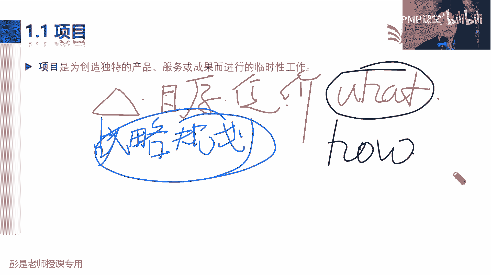

之前讲课讲的是什么案例呢，之前讲过疫情期间我们开了口罩工厂，然后狂飙比较火的时候，我们开了莽村度假村，后来呢为了莽村度假村这个梗过去之后呢，为了便于大家更好的理解，我们这最近讲课啊，基本上就讲牛肉面馆。

因为在任何一个国家和地区，任何一个城市都有人做过牛肉面，大家都有都吃过牛肉面，所以更好理解，粗暴理解啊，因为大家来自于不同行业，讲太专业的东西，其他行业的同学听不懂对吧，说我们开一个高科技公司。

搞人工智能，很多同学听不懂，那就跟不上节奏，所以呢这种东西咱不讲，讲粗暴的，接地气的好，张三找你来创业，我们要打算成立一家公司，我们打算开一个牛肉面馆，牛肉面我们定目标愿景使命价值观，哎。

我们是一家什么百年老店，千年老店万年老店，我们要做到美团饿了么第一排行榜，然后大家都喜欢吃最贵的面，最专业的面，不吃牛肉啊，羊肉面，猪肉面都行吧，鸡蛋西红柿面，想什么面就什么面啊，我们做一家面馆。

定了目标愿景，使命价值观之后，做企业的战略规划，去思考，我们怎么把这个牛肉面馆开起来，怎么把这个牛肉面馆开起来，怎么达到什么朝阳区第一，海淀区第一，怎么弄，美团怎么弄，饿了么怎么做到销量第一，排行第一。

口碑第一来定战略规划，有了战略规划之后，我们就知道要做具体的事情都是啥了，那现在我们战略规划，战略规划，我们不不规划太遥远的遥远的事情啊，我们就规划最近半年内的事情，最近半年内的内的事情，不是直播呀。

现在是北京时间二，刚才说过梅菜扣肉了，还不是直播啊，梅菜扣肉最近吃了没有，想一想好吃吗，香不香啊，看看过央视那个视频了吗，没看过的话，百度一下，百度一下那个图片应该一大堆的。

看看什么叫什么叫什么叫那叫什么来着，那个肉里边有什么东西，哎回味一下，然后中午交一个验证一下，好接下来啊，话说回来，我们要开一家工厂，我们要开一家工厂做预制菜，做预制菜做什么呢，梅菜扣肉。

我们要做全国最大的梅菜扣肉生产商好，那接下来要去思考怎么达到这个目标，对不对，要做什么事情就做企业的战略规划，那咱战略规划不规不规划这么久啊，咱们就规划最近半年先把这个工厂建起来。

接下来就会发现有这么几个事情，什么事呢，第一你不得选址吗，对不对，选址啊，把这个工厂建起来吧，工厂画图纸做设计，然后施工把厂房盖起来，盖工厂，盖房子盖完了，工厂啊，还有什么事呢，你得买设备吧，对不对。

怎么做肉啊，怎么弄梅菜呀，谁买设备，接下来工厂建好了，设备到位了，该干嘛了，招兵买马吧，对不对，招聘呐，招员工啊，给人家培训呐，让人家让人家能够操作设备上岗啊，接下来要做的事情啊，就基本上差不多了。

我们要买一些烂猪肉，买原材料对吧，然后找一堆科学家，利用利用利用魔法，让这些肉吃起来又香又又好吃，卖原材料生产加工，生产加工变成一袋一袋的梅菜扣肉，想办法把这些东西卖出去，我们进到企业，进到学校。

进到超市，进到便利店，进到各大餐厅，进到美团，进到饿了么，让他卖出去哎，买材料，生产加工，卖出去，买材料生产加工卖出去，那接下来分析一下123这三个事情，性质上有什么区别。

再结合到我们刚才学的这个概念啊，项目是创造独特的产品服务成果，而进行的临时性工作，三十四一十，盖工厂是不是把这事干完就完事了，咱又不是搞建筑的，不是搞工程的吧，建筑公司说我们天天去给人家修路。

盖房子搭桥诶，咱是餐厅，咱是咱是工厂啊，搞预制菜的，所以盖工厂这个事对咱来说把它完成就可以了，买设备这个事情也是把它完成就够了吧，咱是预制菜工厂，咱不是卖设备的企业，卖设备的企业才要源源不断的买设备。

卖出去，买设备卖出去，所以一和二这两这两个事情。

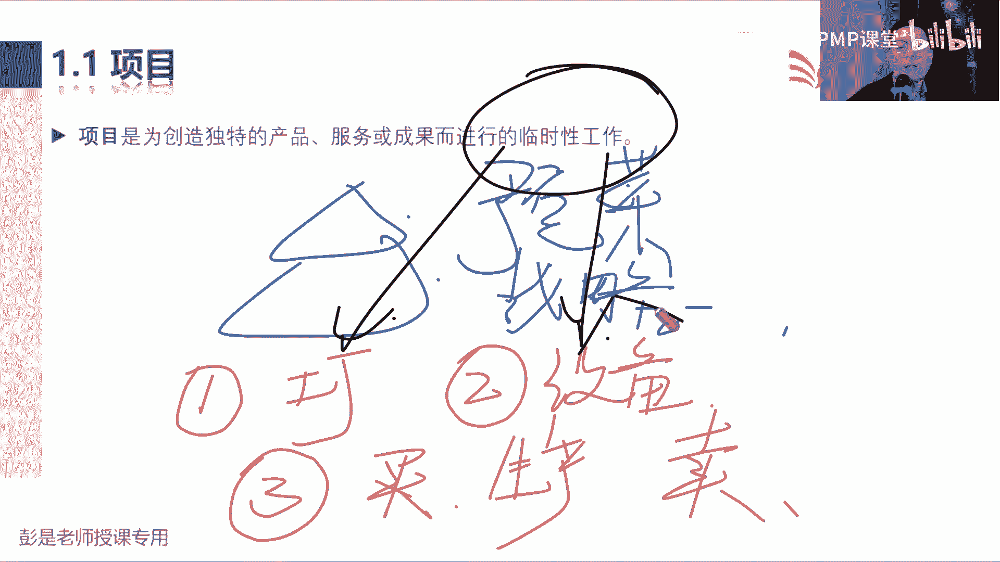

对咱企业来说有临时性，那像第三个事情啊，买猪肉生产卖出去，买猪肉生产加工卖出去，这对企业来说有临时性了吗，是我们希望这些事情啊，可以怎么样怎么样的去开展呢，哎可持续，对不对，希望啊。

希望你希望永远有人来买我们的梅菜扣肉，预制菜，对不对，永远源源不断的把它卖出去啊，源源不断的买生产卖出去，买生产卖出去，对企业来说，这样的事情我们需要能够持续的重复的，玩了命的去开展。

这样呢才源源不断的有钱赚，哎所以接下来把这些事情从性质上就做了，这样一个区分，临时的事情把它完成，就把它完成就可以的事情，就通常称之为项目，那下面这些事情需要持续的重复的，定期的去开展的事情。

我们就把它称之为运营，运作运营operation这种东西啊。

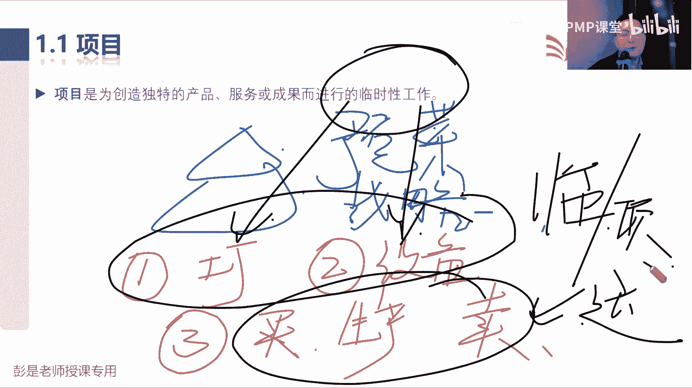

这就是对企业来说大概就这么四个单词。

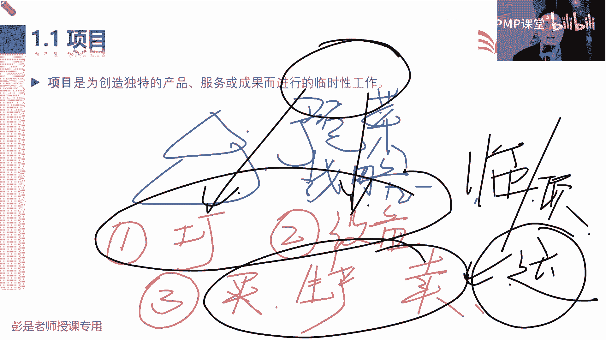

第一定目标定方向，目标愿景是明价值观，我们是一家什么样的企业，就是定word word，定好了之后呢，接下来做企业的战略规划就去思考啊，我们都要做什么事去实现这个宏图大业，那就包括开工厂，买设备。

招兵买马，然后购买原材料加工销售，购买原材料加工销售，但接下来就有了两种事情，有一种事情把它完成就可以了，通常就称之为项目，还有一类事情呢可能需要对企业来说，需要持续的定期的重复的去开展。

就通常称之为运营，那接下来其实企业管理最核心的三个管理能力，第一个就是战略管理，第一个就是战略管理，战略管理其实不在咱们考试范围之内啊，他就是帮助企业怎么做决策选择，走什么样的路去实现我们这个目标对吧。

比如说做梅菜扣肉，你怎么选择呀，是找这些小商家啊，还是走超市，便利店，还是进大超市，是批发呀还是零售啊，是自己铺货呀，还是找代理呀，这不都要做选择吗，诶这是战略规划，接下来对企业来说，第二大块。

那就是项目管理，通过项目管理这些方法，然后让我们这个项目成功的可能性更高，更好的完成任务，实现目标，得到期望的结果，第三大块呢就是运营管理方法，运营管理追求的是什么呢，标准化，规范化，提高质量。

降低成本，提高效率，帮助企业实现价值利润的最大化，他们仨的工作重心不一样，这就是企业管理地图，三个核心管理能力，战略管理，项目管理，运营管理，知道这个意思啊，好一位同学说。

如何判断自己适合项目还是运营呢。

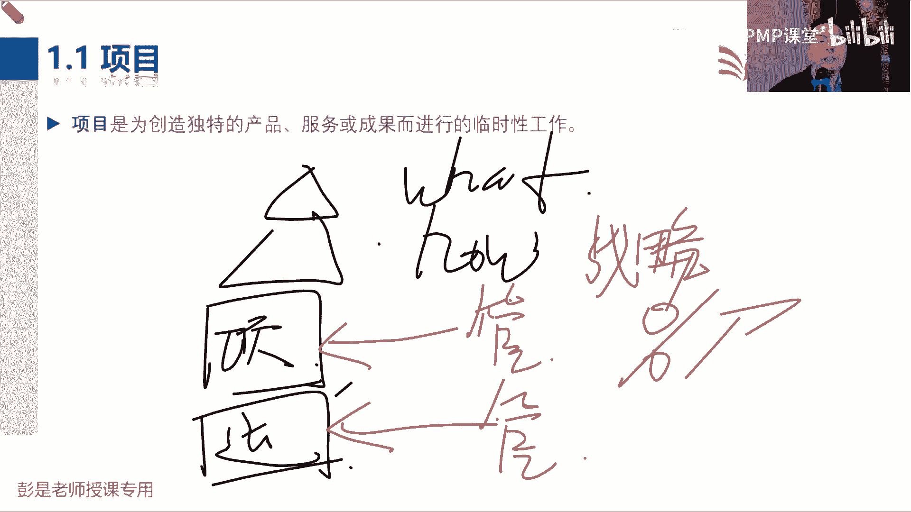

这这不好说呀，没有适合不适合，对不对，所以其实从宏观到微观，从国家到企业到个人，其实都是刚才这个逻辑，都是刚才这个逻辑啊，有一些事情我们把它完成就可以了，通常通过项目的这些管理方法去完成任务，实现目标。

得到期望的结果，有一些事有一些事情啊，对我们个人企业国家来说，需要持续的重复的，定期的反复的去开展，就通过运营这样的方法，想办法提高效率，提高质量，降低成本，达到预期的收益。

所以接下来咱换场景不做预制赛了，对标到各位同学个人身上啊，这个问题每次讲到这，一定要慎重回答呀，这个事情是项目还是运营，说我要脱单找对象，这是项目还是运营呢，项目吧，有没有人把它当做运营啊。

持续的重复的定期去开展，早上一个中午，一个下午再找一个一天找八个海王渣男，对不对，所以事情事情啊到底是项目还是运营，取决于什么呀，取决于我们自己的视角嗯，有的事情我们希望他临时完成就可以了。

我们就把它当做项目，那有的事情通过别人别人的视角来看，他可能把它当做运营，所以仁者见仁智者见智啊，看情况好，知道这个意思啊，那找完了对象之后啊，你俩谈恋爱维持关系，这是什么呢，运营了吧。

它需要持续的定期的重复的去开展了，才能维持良好的人际关系，就这东西吧，然后关系成熟了之后啊，谈婚论嫁，办婚礼领证，这是啥呢，项目对不对，结完婚之后过日子，运营打算要个小孩儿项目对。

生完小孩养小孩运营找学校项目，找完学校天天送他上学，运营以此类推，对于个人来说，对企业来说都是通过项目让我们上台阶。

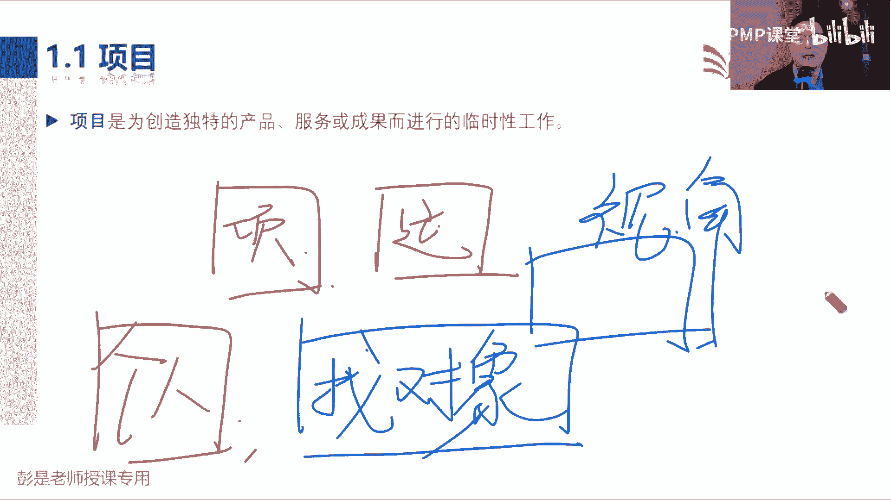

对不对，上了台阶之后，再通过运营想办法让这个价值最大化，然后他就不断的不断的成长，不断的不断的发展，道理都一样啊，那对个人来说，你要不要不当咸鱼呢，做自己的人生规划，这就定目标呗，目标愿景使命，价值观。

对不对，我是个什么样的人，那就没有项目了，对不做，做一天和尚撞一天钟，运营都不想运营了，对不对，好死不如赖活的哈，那有的人呢就有自己的人生目标，我要学完PMP走向人生巅峰，变成高富帅，迎娶白富美。

就以此类推了吧，也也做自己的人生的战略规划，定目标，定愿景，定使命，然后自做自己的战略规划，去思考怎么实现这个目标，王老师不是说嘛，先定个小目标一个亿，然后去思考怎么实现一个亿，然后思考了之后呢。

就知道学PMP对大家来说就是项目，对不对，学PIP就是项目通过学习提升自己的能力，通过学习拿到证书，拿到证书，该跳槽跳槽对吧，该升职升职，该该加薪加薪，嘿然后呢学完了之后呢，把学习到的知识应用到工作中。

生活中，这就是运营，他需要持续的重复的定期的坚持下去啊，好所以其实知道这个大道理之后，再看这个概念啊，项目创造独特的产品服务成果，而进行的临时性工作，刚才罗里吧嗦这个这一段段话。

这段话就在告诉我们临时性这个特点，那临时性要求的是什么呢，说你们盖工厂盖工厂，这是个项目，几号开工啊，几号是几号结束啊，几号交付啊，这个开始和结束日期要明确吧，对不对，它不能遥遥无期，盖工厂几号开工啊。

不知道几号交付啊，不知道，那我后边运营工作就会受到影响啊，所以项目需要有明确的开始结束日期，有明确的开始是结束，这两个节点不能遥遥无期，不能遥遥无期，这个这句话对应的是什么呢。

运营运营工作需要有明确的开始结束时间吗，不希望我们希望我们这个工厂啊，能够变成百年老店，千年老店，万年老店呐，赚一辈子钱呐，每天都有人来买预制菜，每天都有人吃梅菜扣肉，这样我们可以源源不断地去赚钱。

所以通常运营不提临时性好，这是第搞定搞定一个概念啊，那知道了项目这个临时性这个特点。

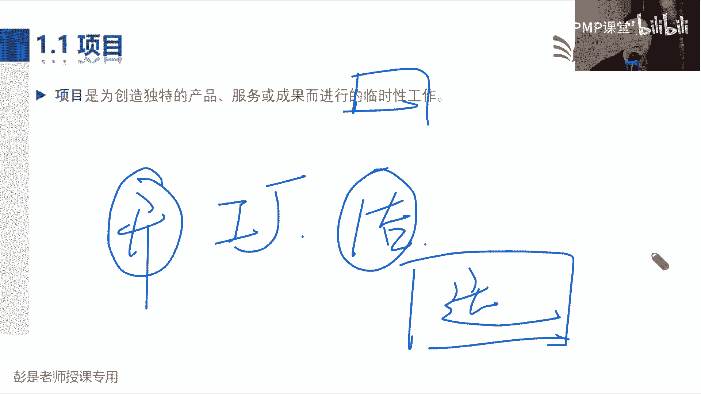

再看独特性又意味着什么呢，说我们要创造独特的产品服务或成果，这独特性强调的是啥，这个独特性主打的一个什么什么道理呢，仍然是需要粗暴的和运营去区分的运营，我们工厂盖好了，然后我们买了一些乱七八糟的猪肉。

然后生产加工变成一袋一袋的梅菜扣肉，生产出来的产品，通常我们希望它是一个什么情况呢，量产量产量产批量生产，生产100万蛋，十一百万担，100万袋，10万袋，我们生希望生产出来的产品。

最理想的模式就是他们都一个鸟样吧，对不对，每袋的净重啊，每袋的口味啊，最好是一样的，哎，因为量产要批量生产，批量生产，如果生产出来的东西啊千奇百怪，这玩意不好卖呀，就这道理吧。

所以他更追求的是我们运营过程的标准化，规范化，从而让我们能够生产出相同品质的产品，服务或成果，他追求标准化规范化，所以你参考一下麦当劳，肯德基这些员工厨艺高超吗，不高超。

他通过什么来弥补成员处理员工能力的不足呢，标准化规范化的操作手册，对你不需要不需要有卓越的厨艺，按照我们标准化的操作手册，12345仍然可以做出来相同品质的汉堡包，薯条，炸鸡块，以此类推了吧。

所以运营追求的是想办法产出相同品质的产品，服务或成果，那那么他更关注的是这些生产加工，运作过程的标准规范，哎，SOOP这套东西啊，Standard，那项目不一样了，项目创造的产品服务成果。

它不不一定能够达到相同品质，为啥呢，因为每个项目的情况不一样，同样是盖盖工厂啊，比如说我们有两个车间，A车间和B车间，假设A车间和B车间，它的结构面积都是一模一样的，都是一模一样的，什么地方不一样呢。

至少这个地方不一样吧，位置就像大家根据我们的生活常识，有的房子下面那个土地啊不结实，土层松软，有的房子下面那个土地啊比较结实，还有岩石呢，有的房子下面有天然气管道，热水管道，对不对，排污管道诶。

地理位置不同，那为什么要考虑这种地理位置的不同点呢，为什么要考虑这种独特性呢，因为它意味着不确定，不确定就意味着风险，A这个A这个车间盖的顺风顺水，打完了地基，盖完了房子哎，交付了B这个地方啊。

一打地基是挖掘机师傅一铲子下去唉，天然气就泄露了，意味着风险吧，所以我们要考虑每个项目创造的产品服务成果，他在时间地点人物，事情总在某些方面存在着独特的一面。

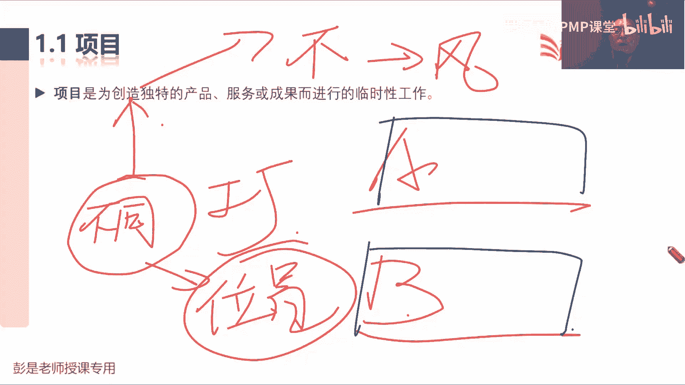

这种独特性就意味着不确定性，这种不确定性就意味着风险，那风险风险其实是项目管理，学到最后就是风险意识啊，那咱就提前把这个事给他考虑周全，尽量的让未来可能出现的问题呀不发生少发生。

从而提高项目成功的可能性，就这个道理在提醒我们考虑周全，有风险意识，从而呢避免干活干错了，好这个单词也搞定了项目，创造独特的产品服务成果而进行的临时性工作，临时性需要有明确的起点和终点。

独特性就意味着风险，那接下来产品服务或成果又是什么东西呢，这基本上听一遍就完事了啊，什么是产品啊，梅菜扣肉是产品吧，手机汽车房子都是产品啊，通过项目的形式，我们可以研发出新的产品。

或者是对现有的产品做升级，客户反映我们的梅菜扣肉太咸了对吧，容量太小了，我们改容量一，原来一袋是二两，现在改成三两诶，通过项目的形式把改进我们的工艺，改进我改造我们的设备，让我们能够对产品做升级诶。

通过项目的形式可以创造出独特的产品，那什么是服务呢，嗯啥是服务啊，服务哎指的就是工作，快递是服务吧，外卖送餐是服务吧，哎人家通过完成工作完成工作，提供这样的服务，给大家讲PMP教翘课也是服务，对不对。

打印社给你裁书也是服务，指的是完成工作，完成一些工作啊，提供某些服务，那通过项目的形式，可以研发出研发出一些新的服务，或者是对现有的服务做升级做改造，好，我们开梅菜扣肉工厂，找专家，找化学家。

给我们添加一大堆添加剂，让我们生产出来的梅菜扣肉保质期超长，颜色鲜艳，口味十足，还不坏诶，人家给我们提供这样的科研服务，那第三个成果成果人家提供科研服务，我们会得到科研成果。

对技术成果往里面塞什么化学品，让你吃不死，还很很喜欢，就这道理吧，这是研究成果，科研成果像怎么怎么做核酸检测呀，科研成果怎么怎么研究这个疫苗啊，科研成果，那通过项目的形式。

可以创造出独特的产品服务或成果，哎这一句话1234566个单词搞定，这就是大家后面学习一定这么学啊，重要的知识点相关的这些概念啊，术语啊，道理啊，逻辑啊，给它梳理清楚，考试的时候。

这些单词放到放到题目里才能够学的。

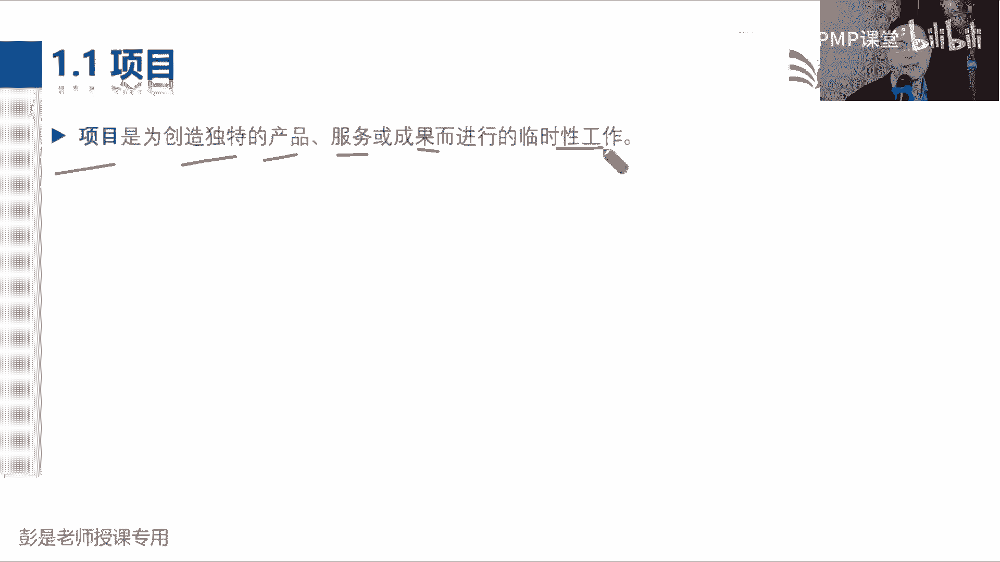

才能够判断的又快又准好，接下来这张图教材上没有，并且呢刚才已经讲完了，停一停就完事了啊，听一听就完事了，这是对企业来说，我们企业管理的地图，第一个定方向，目标愿景使命价值观，然后呢嗯做完了这些东西啊。

在第二步做企业的战略规划，去思考如何实现我们的宏图大业，如何实现我们的宏图大业，这个号一旦定好了之后，我们就知道我们运营的同事要开，要做什么事情了，运营的同事啊每天要买柴米油盐，酱醋茶，买猪肉买，买盐。

买酱油，买原材料，对不对，然后呢运营的同事还要在车间里面生产，加工制造，变成我们的梅菜扣肉，然后销售的同事要天天的找餐厅，找便利店，把我们这个东西给他卖出去啊，这就是持续的重复的开展的。

这些这些工作叫运营管理，然后呢右下角呢就是我们的项目管理，像盖工厂设备改造，工艺升级哎这些事情买设备，我们把它完成就可以了，这是项目管理的项目管理方法，中间藏了一个项目及项目组合，一会后面会说啊。

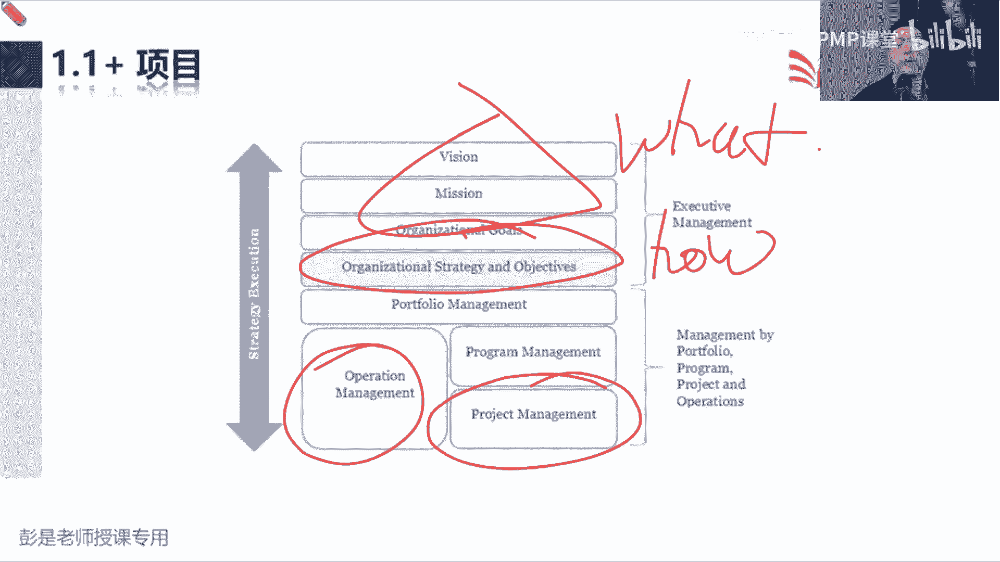

那搞定这第一个概念之后，再往下1。1。1，这段的文字大家看起来就轻松加愉快了，非常重要的知识点，但是我们花了大概30分钟给大家给大家讲，基本上后面复习的时候看看就可以了，我们创造独特的产品服务或成果。

开展项目是为了通过可交付成果达成目标，目标指的是工作所指向的结果，要达到的战略地位，要达到的目的，要取得的成果，要生产的产品服务，什么是目标，这超抽象什么工作指向的结果，达到的战略地位，达到的目的。

目标到底是啥呢，通常来说我们的目标四个字，这是为了大家粗暴理解啊，因为不同项目情况不一样，目标不同，为了粗暴理解，通常来说目标有这么四个字，多快好省，京东多指的是啥，多指的是啥，变成专业术语就叫范围。

在其他条件相同的情况下，通常我们希望范围越多越好，这不难理解吧，在其他条件相同的情况下好，现在我们有两个做梅菜扣肉的工厂啊，两家工厂啊报价送货周期质量都一样，A工厂十十万块钱买100袋。

B工厂10万块钱买2000袋，范围越多越好，对A工厂说，我们还帮你送货上门，提供这一系列的服务，还帮你打包，还帮你打包唉，还帮你运输，还帮你冷冻冷藏，我们提供这么多的服务，所以其他条件不变的情况下。

通常我们希望范围越多越好，就对标到多这个字了，那么以此类推了，其他条件不变的情况下，快指的是什么呢，进度其他条件不变的情况下，我们希望这个进度啊，时间对越快越好，两家两家工厂报价一样，提供的服务一样。

A工厂说三个月三个月就能送到你家了，B工厂说三天就到了，那进度越快越好，好指的是啥呢，质量吧，哎两家公司其他条件不变的情况下对吧，报价呀，工期呀，供货期呀都一样，那A工厂说我们这个东西用的是好猪肉。

B工厂说我们用的是有结节的，有淋巴的猪肉，嘿质量越越好越好，好指的是质量，最后呢省指的就是成本，在其他条件不变的情况下，范围一样，是供货周期一样，质量标准一样，那谁便宜找谁买。

所以通常来说我们自己企业内部项目多快好省，多长时间完成什么样的成果，达到什么样的质量标准和要求，花多少钱来评价，评价这个项目到底成功不成功，那对企业来说。

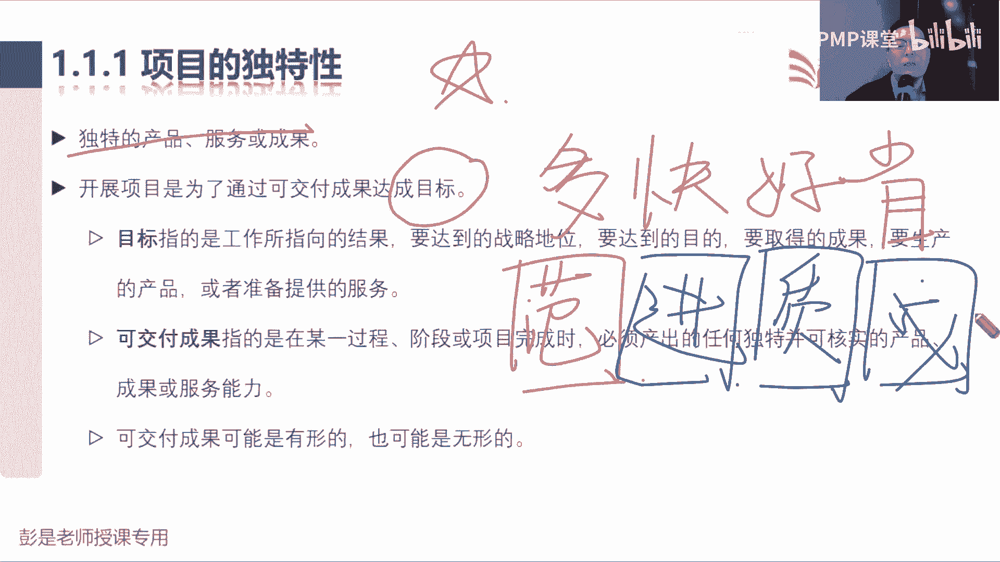

目标其实更多呀，比如说提高我们的口碑啊，名名声啊，降低成本啊，提高质量啊，提高客户满意度啊，有很多很多各种细节性的目标啊，这个单词大概知道这个意思就可以了，然后可交付成果这个术语也超重要。

可交付成果是指某一个过程阶段或项目完成时，必须产出的任何独特并可核实的产品，服务或成果和服务能力，所以一定要记住，未来大家看书的过程中，看到的这些术语都是广义的概念，非常广。

比你想象的认知的这个概念广得多，为什么呢，好我们刚才知道了，达成共识啊，说我们要开一个梅菜扣肉生产的工厂，那说建设工厂，这是个项目，那这个项目的可交付成果都有什么呢，这是，这个项目的可交付成果都是啥。

这是盖好的这个房子吧，盖好的这个房子，这是我们的主要可交付成果，那各位同学想啊，图纸是不是可交不成果的对吧，什么设计图啊，施工图啊，上下水图啊，这也是可交付成果吧，地基是不是可交付成果呢。

它虽然不是最终成果，但是它是阶段成果呀，也是啊，所以非常广义，那你说你为为盖这个房子制定的计划，工作计划是不是可交付成果的对吧，包括文档资料唉，非常非常广，总之中心思想就是啊干活有成果。

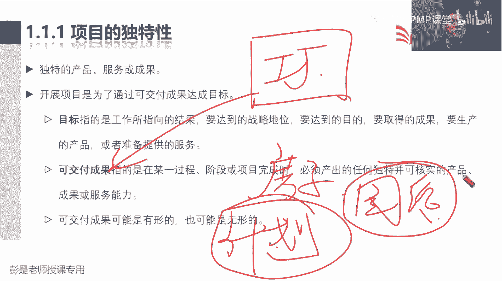

完成一些工作，完成一些工作会产出的对吧，独特的并可核实的，这些东西都可以称之为可交付成果，非常广义，那大家实际工作中就包括了对吧，大成果，小成果主要成果阶段成果各种各样的成果好，所以接下来最后就是坑。

可交付成果非常广，它可以有形也可以无形，有形无形又主打一个什么呢，粗暴理解有形，天下就这两个事情啊，不是为了名，就是为了利，对不对，不是为了名，就是为了利利，那就是真银，真金白银，看得见摸得着的，对。

那名呢这是无形的，像什么口碑呀，声誉啊，商誉啊，好这一段搞定两个新的单词啊，可教不成果，可以有形，可以无形，那再往下书上。

通过这段这段文字给我们解释了一个，什么叫产品，什么叫服务，什么叫成果，咱们课上就不念了，刚才解释过了，大家去看看一遍，知道怎么回事就完事了，我们可以创造产品，也可以升级产品，可以提供服务。

也可以改进服务好，最后找到这一小段，这一小段呢也讲过了，说某些项目可交付成果和活动中，可能存在着重复的元素，刚才我们两个工厂，两个车间对A车间，B车间，哪怕它的结构啊，它的装修啊，它的设计啊都一模一样。

但是不会改变项目工作本质上的独特性，为啥呢，因为他在位置设计环境情况，参与人员，总之他肯定在某些方面存在着不同，总之在某些方面存在着不同点，仍然具有独特性，那这种独特性我们提前把它考虑周全考虑清楚。

避免风险转化成问题，避免风险转化成问题，这是风险意识好，这听一听就完事了啊，所以大道理就是世界上没有相同的两片树叶，肯定有不同点。

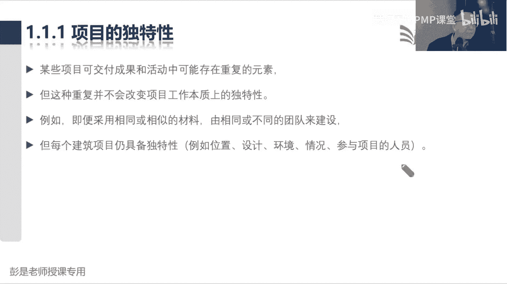

知道这个道理之后，再往下这段文字听一遍就可以，他是说呀，项目可以在组织的任何层面上开展一个项目，可能涉及到一个人，可能涉及到一组人，可能只涉及一个组织单元，也可能涉及多个组织的多个单元。

变成大白话是什么呢，左边这张图看一看这是什么图啊，PPT上左边这张图啊，组织架构吧，所以变成大白话呀，就是有的项目大，有的项目小小项目可能一个人就搞定了吧，小项目可能一个人就搞定了。

我们工厂保安跟我说呀，工厂那个大门坏了，换一个换个轴承，这小项目可能一小时俩小时就搞定了，嘿它就涉及到一个人，然后我们的我们的销售跟我说呀，咱们那个生产出来的梅菜扣肉啊，太咸了，我们要改工艺，改设备。

改配方，可能涉及到涉及到很多人参与啊。

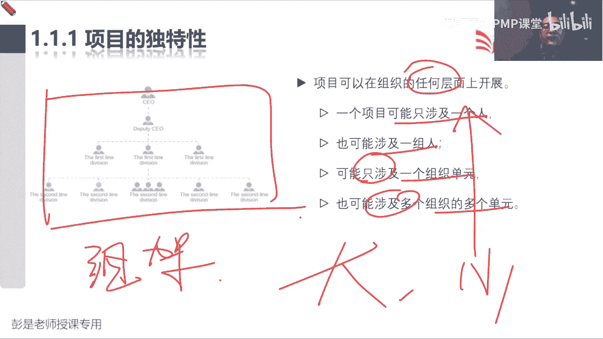

诶就涉及到一组人，那有的项目可能涉及到一个组织单元，组织单元是什么呢，部门涉及到一个部门，有的项目呢可能涉及到多个部门，甚至多个企业协同作战，所以总之这停一停就完事了，就是不管大事小情，不管大事小情。

只要这个事情啊，我们第一关注它的独特性，第二关注它的临时性，然后大家想办法这个独特性啊，看看有没有风险，把这个风险风险啊能处理的处理，第二个呢大家一起想办法按时完成任务，得到我们期望的结果哎。

就用项目管理的方法把它完成就可以了。

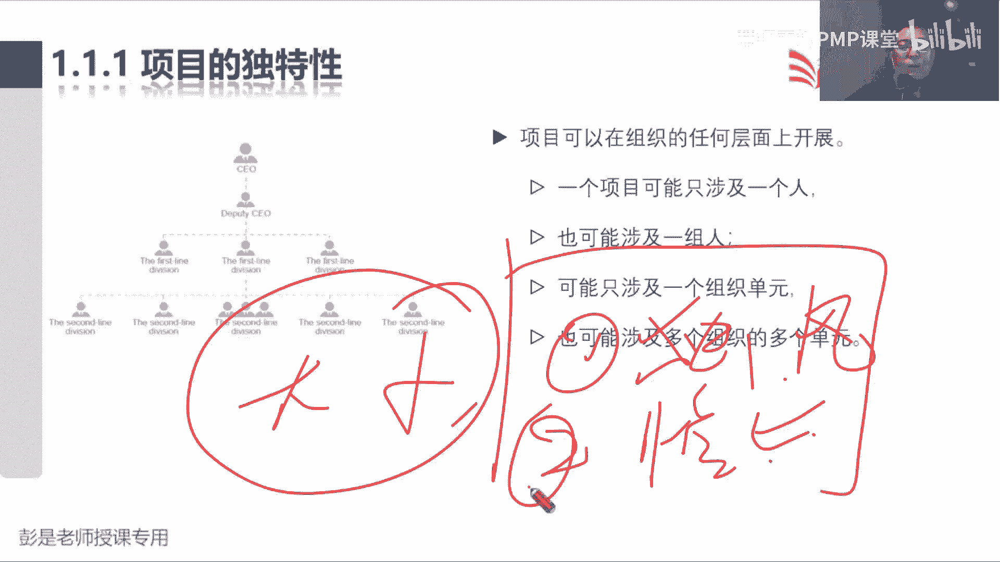

就把它把它当做项目去处理，就这个道理啊，这段知道道理，知道意思就够了，所以换各种场景都能理解对吧，就像晚上吃饭，可能一个人就把这个饭做了，有些有的时候可能需要一堆人，有的时候可能需要全家出动啊。

有的时候可能需要全小区出动啊，它取决于这个项目的规模和复杂程度，这是才需要大家记得它，取决于这个项目的规模和复杂程度，就是大和小，对不对。

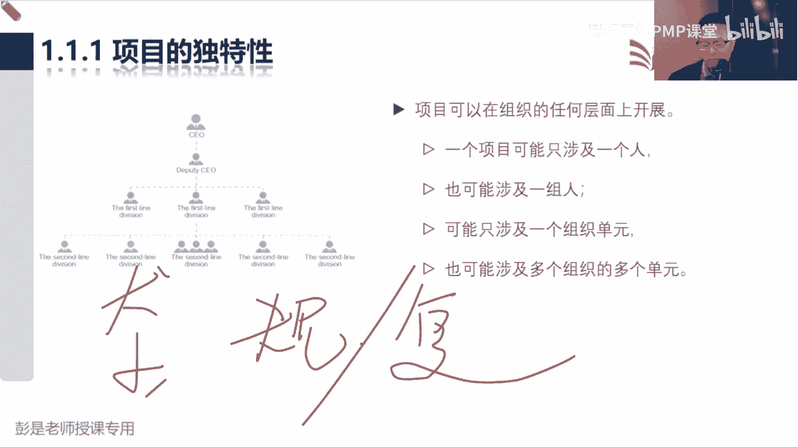

好所以后边书上给出了一些项目的例子，有的项目大，有的项目小，这些例子呢也不需要大家去背，想看就看，不想看可以不看了，总之最后的结论啊，就是这么这么这么大道理又来了啊，最后的结论就是这么两个单词来回倒。

大家看看有没有听过这两个词啊，常态化和非常态化的事情，这是常态化的事情和非常态化，非常态化的事情，常态化的事情，通常通过什么样的方式去完成它呢，常态化是什么意思啊，经常对吧，运营就像每月给大家发工资。

这是不是一个常态化的事情，需要持续的定期的重复的去开展，发工资，关注的是什么呢，咱别发错了，对不对，这事不能干错呀，我们要产出相同品质的产品服务和成果，所以他追求的是标准化，规范化，不能胡来，对不对。

那非常态化的事情就是不经常出现的东西，对不对，好非常态化的事情通常通过项目去把它完成，所以再讲个粗暴的例子啊，就像疫情期间做核酸，说全全市全区做核酸检测，这是项目还是运营，作为各位项目经理要学到的。

接下来一个教训是什么呢，不要把话说死，不要把话说死，送给大家三个字叫看情况，具体情况具体分析，因为核酸检测这种方法刚出来的时候是项目，对不对，说某个地区发现了疫情，咱组织全市人民。

全区人民做一次核酸检测，做完了就完事了，这就是项目吧，它有临时性，有独特性，把它完成就可以了，但是呢这个东西啊，这个东西慢慢的慢慢的，做着做着就变成了运营了吧，三天一核酸，三天一核酸，没有核酸寸步难行。

他就从非常态化的事情变成了常态化，它一定是相互转换的啊，慢慢的这个性质就变了，性质变了，最后就变成了运营，对不对，大家需要持续的定期的去重复的，去做这个玩意儿，唉所以对企业来说，我们企业中的工作。

也可能常态化和非常态化之间不断的转换，它仍然是取决于我们看这个东西的视角，所以到底是什么是项目啊，到底什么是运营啊，根本就不重要，根本就不重要啊，看情况，主打一个灵活，主打一个灵活好，最后再讲个小案例。

咱就可以再接电话的休息一下了，重大利好，为什么要看情况呢，你说啊，我是现在leader是呃梅菜扣肉工厂啊，我是咱梅菜扣肉工厂的一个销售，说呀我跟客户啊签订单给人家送货，签订单给人家售货。

这是标准的运营啊，那现在啊来了个客户啊，我可不可以把这，这这个订单当做项目去进行管理，来了个客户跟我买一，给我买100箱梅菜扣肉，可不可以把这个事情当做项目去处理呢，可以不犯法，对我想怎么管就怎么管。

我可以按照标公司标准化的程序对吧，怎么签订单啊，怎么签合同啊，怎么打款的，可以把它按照公司标准化的这个，运作模式去进行管理，当做运营啊，我也可以把它单独拎过来，用项目管理的这种方法去完成。

它完全没毛病啊，取决于你想怎么管，对不对，如果你更看重这个客户能不能承担呢，能不能带来更多的销售机会啊，你要考虑到这种独特性啊，考虑到这种风险呐，想办法按期交付啊，就完全可以用项目管理的方法去完成。

这个运营工作，不犯法根本不犯法啊，主打一个就是这么灵活，好知道这个意思。

搞定了1。1。2，项目的临时性基本上没啥解释的，项目的临时性是指有明确的起点和终点，临时性并不一定意味着项目的持续时间短，这句话变成人话，就是说说啊，有的项目周期长，有的项目周期短。

我们没办法通过项目周期的长或者是短，没办法通过试性的周周期长和短，判断它是不是项目，因为有的项目规模大，有的项目规模小，有的项目短，可能两三个月就搞定，甚至个把月，有的项目可能20年到30年。

你能想到啥，什么项目需要做20年，30年啊，咱国家最知名的那个玩意，弄个大坝三峡工程吧，30年的国家5年计划不是项目啊，5年计划是规划未来我们您项目都有什么事情，有的项目周期长，有的项目周期短。

像有些国家开展什么国民健身健身计划，国民健康计划周期50年的项目多的是啊，总之有大有小对吧，什么探月火星，火星这种东下星建系这种东西，好知道意思是就够了啊，没有办法通过长持续时间长或者是短。

判断它是项目还是运营。

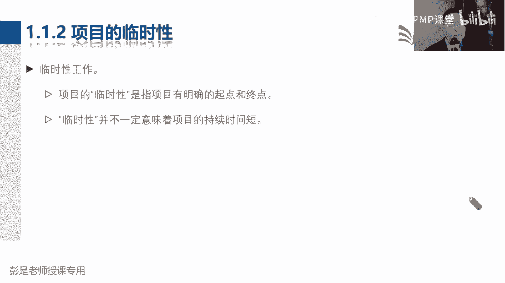

那再往下说，在以下一种或者是多种情况下，项目即宣告结束，这两个字呢停一遍就完事了，这东西不太需要去背啊，总之中心思想呢就是这么几种，可能，第一呢完成目标项目就结束了，第二种呢就是失败了，夭折了。

那失败夭折的项目啊，他的原因千千万呢，主要原因就是分成两大块，一个是内部原因，一个就是啊外部原因，知道这个意思就够了对吧，达成项目目标就完事儿了，结束了，不会或者是不能达成目标，没钱呐，需求不存在呀。

无法获利或到人什么资源啊，法律原因啊，各种各样的可能性啊，只要了解就够了啊，不太需要去背，好再往下了。

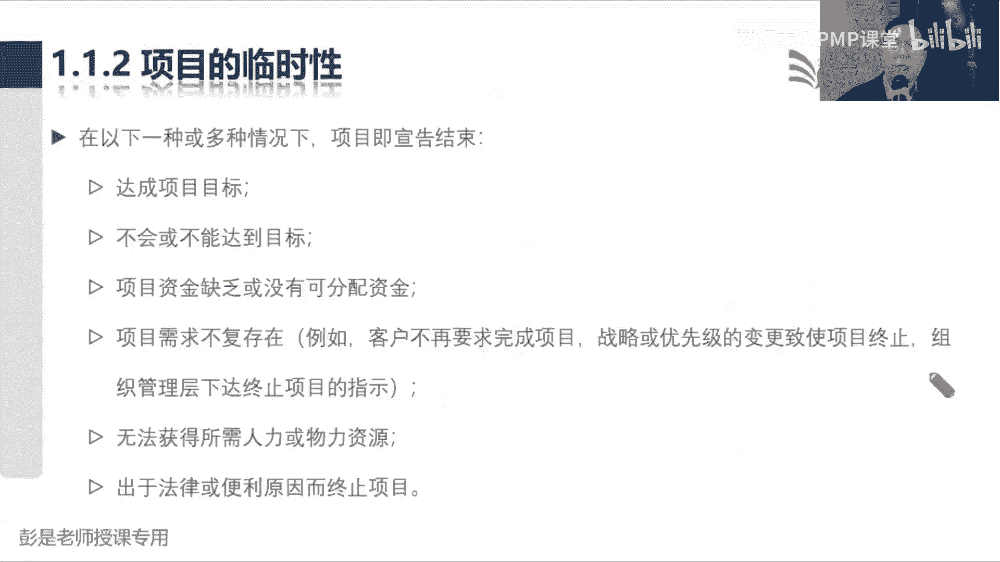

说虽然项目是临时性工作，但是其可交付成果可能会在项目的终止后，依然存在，可能产生什么社会啊，经济啊，材料啊，环境相关的成果，例如国家纪念碑建设项目，就是要创造一个流传百世的可交付成果。

这段文字想说什么道理啊，就带出来这么一个小问题，通常我们希望不希望创造出来的可交互成果，具有临时性能，新四星通常希望不希望可交付成果具有临时性，不希望吧，因为什么呢，这玩意儿要变现，要转化为价值。

变成钱呐，对希望我希望我们的工厂啊能够赚，能够开一辈子呀，希望我们这个梅菜扣肉啊能够卖一辈子呀，它能持续的帮助我们企业，创造价值和实现价值啊，所以通常不希望这个东西具有临时性，但实际工作中，生活中。

我们创造的可交付成果，有没有可能具有临时性呢，嗯有吧，哎这车轱辘扯车轱辘话，来回说话，别忘不要把话说死，通常我们不希望它具有临时性，但有的东西呢由于客观限制，它确实具有临时性，比如说疫情期间。

大家打到身体里边那个疫苗，它是一个科研成果，这个东西有没有临时性呢，有有效期吧，哎一年以后它就失效了，就这东西啊，那具有临时性的东西呀，具有临时性的东西，就像XXXN同学说，建筑工地的宿舍。

这个玩意确实具有临时性，咱就用这个例子啊，说我们找施工队，给我们来修工厂，施工队呀需要有地方住啊，他们要搭自己的指挥部，搭自己的宿舍住宿的地方啊，这个宿舍这个住宿的地方它具有临时性。

因为项目结束就要拆除，这种情况下，如果你是领导，你怎么考虑这个事情，这玩意儿盖完了就要拆这个成果，他确实是可交付成果诶，它还具有临时性，那我们要想办法尽量的尽量的节约成本了吧，不浪费哎，所以就是复用嗯。

大家观察一下身边的工地，因为人家搭的项目组啊，包括员工的宿舍呀，他现在基本上都是像那个雷神山，火神山那个医院似的，对对方舱诶，他要可提高它的复用性啊，复用性就是搬到别的地方继续用啊，对不对，好装好拆。

便于拆卸，便于运输就完事了，而不是真的盖个房子，最后把他推倒了，变成一大堆的破砖头，这道理啊，好知道这个意思啊，所以项目创造的成果，通常我们不希望它具有临时性，请记住这个结论。

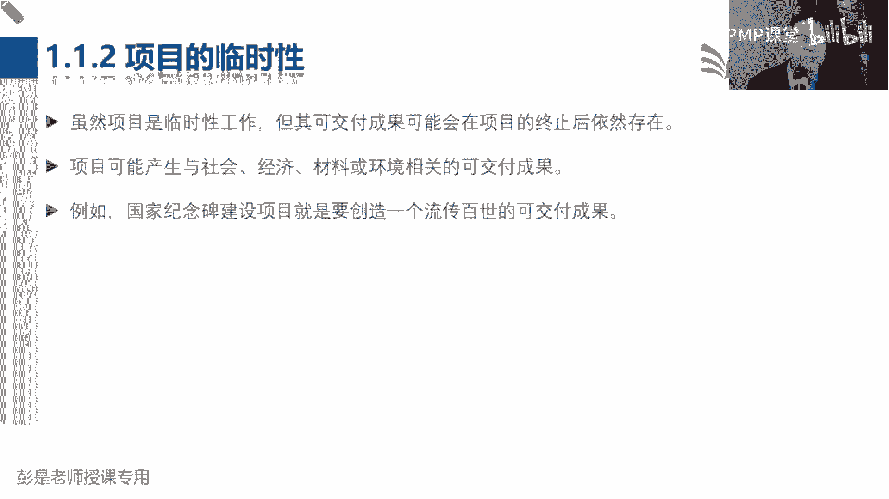

那再往下1。1。2，加PPT上带加号的，都是给帮助大家做扩展的啊，记得住，记不住没关系，需要记住这个项目的第三个特点叫渐进明细，它其实就是个大道理，万事万物都是这个逻辑，就是什么呢，信息从少到多。

从粗略到细化，信息从少到多，从粗略到细化，基本上大多数事情都有这个逻辑啊，我想盖个工厂，我想盖个工厂生产梅菜扣肉，就这一句话，这个信息非常非常粗略，它不具体对不不具体啊，没有细节啊，这工厂盖多大呢。

盖多大呢，是平房啊，还是楼房啊，你要生产什么样，里面装什么样的设备呀，要不要上下水，要不要天然气啊，以此类推吧，各种各样细节性的信息一定是随着工作的开展，不断的去丰富，不断的去细化。

这就项目电竞明细的特点，因为项目一早期我们开始多快好省，这个目标可能很粗略，三个月花一个亿盖个工厂，这个信息不丰富，所以需要随着工作的开展，不断的不断的去丰富它，去细化它，去完善它。

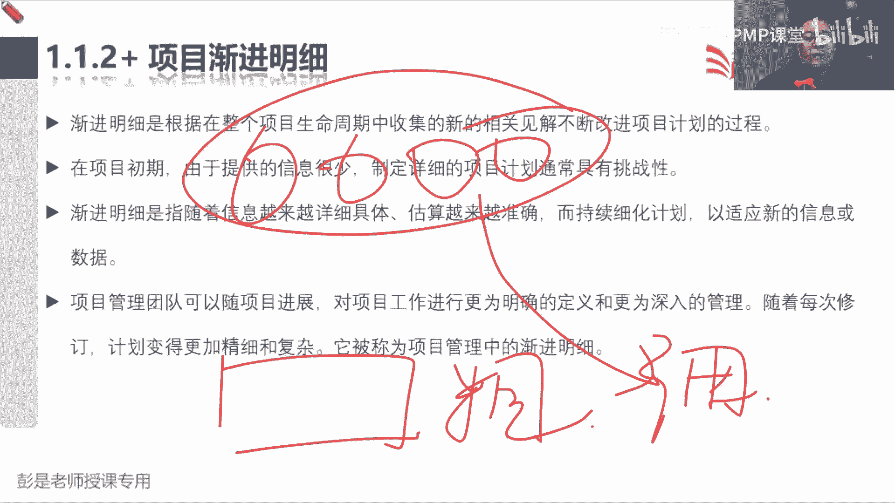

哎这就是项目渐进明明细的特点，所以项目的独特性，临时性渐进明细特性，这是通常来说项目的三大特点，记住这个单词有一丢丢印象就够了啊。

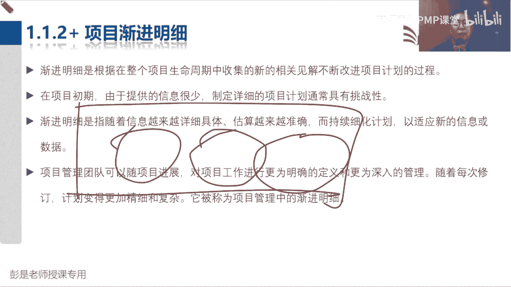

好再往下113这张图，这张图其实刚才讲过了，大家现在品一品这张图啊，说当前状态，将来状态，它俩本质上有什么区别呢，项目帮助企业发生一些变化，从当前状态经历，经历完项目之后，达到将来状态，什么东西变多了。

商业价值通过项目帮助企业叫，创造了新的商业价值，通过项目帮助企业创造了新的商业价值，所以叫项目创造价值，运营确实现价值，想办法提高效率，降低成本，提高质量，让这个价值最大化，对不对，就赚最多的钱。

所以仍然粗暴的带场景。

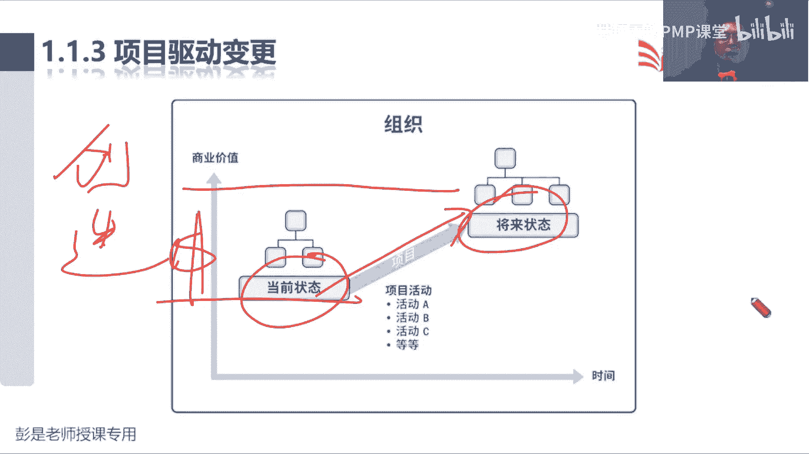

听一听就完事了啊，带场景是怎么带呢，等我换到一个空白的的空白的地方。

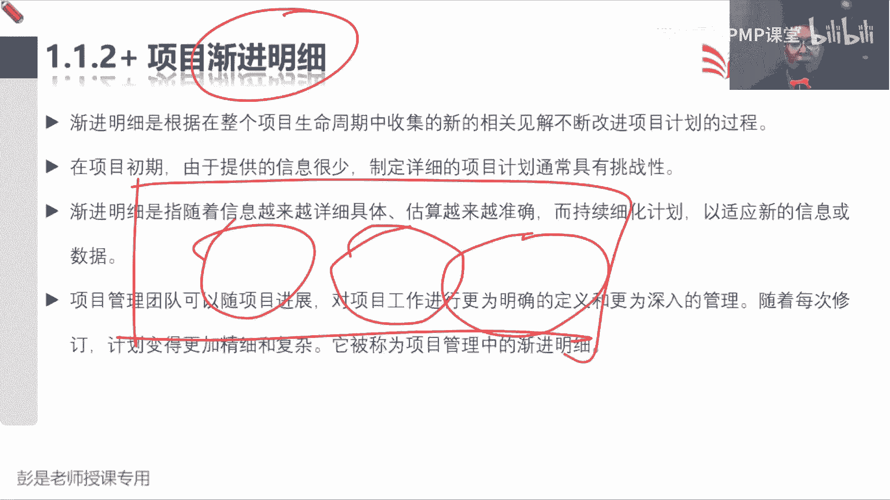

就这写了，停一停就完事了，所以下项目驱动企业变更好，我们开了一个生产，我们开了一个生产梅菜扣肉的工厂，结果发现啊，3151曝光生意不好做了，这叫什么呢，3151曝光，没有人买梅菜扣肉了，生意不好做了。

这叫商业环境发生了变化，对不对，商业环境发生了变化，于是呢咱这个订单那就骤减呐，还有一大堆人退货呀，导致我们这个东西卖不出去了，那企业的生存受到了挑战，怎么办，转型我们在生产鱼香肉丝预制菜。

我们在生产宫爆鸡丁预制菜，对转型，那转型我们研究一下啊，我们这个设备啊怎么改造工艺啊，怎么改造，找一大堆化学家，成一大堆化学家对吧，鱼香肉丝宫保鸡丁怎么做的又好看又好吃，还吃不死人呐。

哎这就是标准的项目，对对，创造了新的产品服务或成果，或者是对现有的产品服务成果做升级做改造，那这个项目一结束啊，我们现在工厂啊又能生产梅菜扣肉，又能生产鱼香肉丝，说明我们工厂什么东西变多了，价值值钱了。

你能生产的东西越多对吧，你的能力越高，不证明你的身价就越高吗，就这个逻辑啊，所以通过项目的形式。

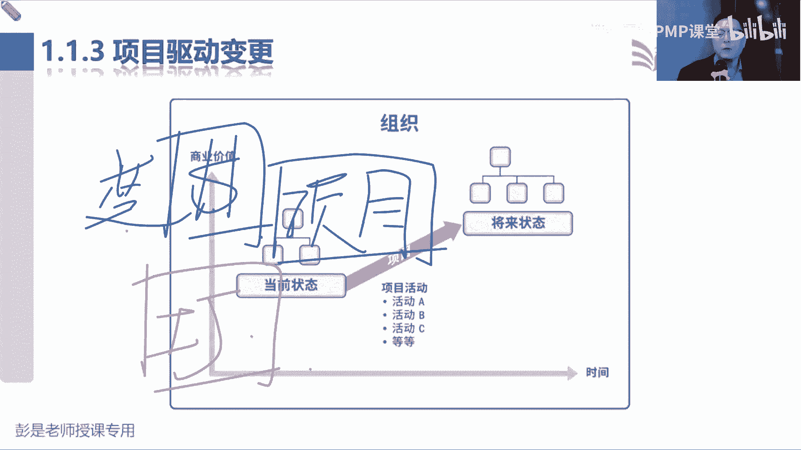

帮助企业从当前状态经历中间的过渡状态，达到将来状态，从而呢让企业能够创造出新的商业价值，创造出来的价值，我们再去买菜，然后生产加工卖出去买菜，生产加工卖出去，再通过运营想办法实现这个价值的最大化。

提高效率，降低成本，提高质量，然后呢让我们赚钱赚得更多，以此类推啊，这就是项目驱动企业发生变更，这个更啊换一个字可能更好理解，革，变革这事就显得比较大，项目驱动企业发生变更。

从而帮助我们提升提升商业价值，那再简单粗暴再听个场景，就把这一篇就翻篇了啊，对于各位同学来说也是这个逻辑对吧，各位同学目前就是中间的这个过渡状态，为什么呢，因为大家在学PMP，学PMP之前。

就是你过去的当前状态，学完了PMP之后呢，什么东西提提提升了身价，对不对，老子好歹花了这么多钱，弄了个这么个破证，他身价有提升啊，对不对，哎从而帮助自己达到将来状态，走向人生巅峰，对不对，升官加薪。

以此类推了啊，然后想办法再通过运营，再把学学到的这些本领用到工作之中，帮助我们更好的完成各个项目的目标，证明自己值这么多钱，想办法让这个获得的利益获得的价值最大化，听完这大道理。

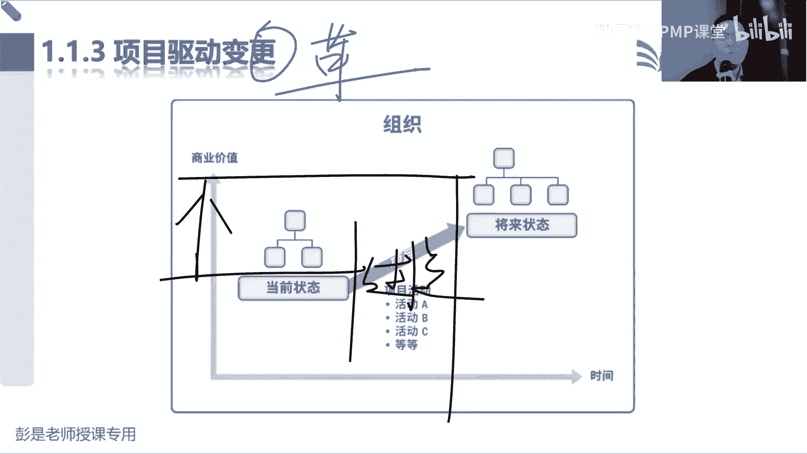

后面这段文字呢看一遍就完事了，没啥需要背的了，所以项目驱动变更，不念了不念了不念了，不念了不念了。

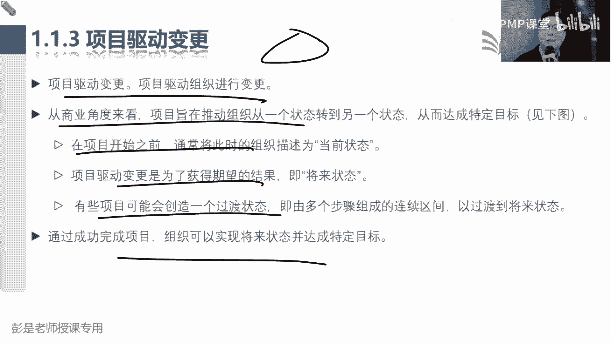

所以114就带出来，最后刚才反复说的这个东西，项目帮助企业创造商业价值，因为对企业来说，我们研发产品啊，对产品做升级呀，嘿就能证明我说明我们这个企业有能力，有能力不就有钱多吗。

所以第一个PMI把商业价值定义为，从商业运作中获得的可量化净效益，可量化可衡量，可量化这个词放到这儿，为什么这么说呢，它的作用是啥呀，非常重要的一个原则，就是告诉我们提醒我们做事情要客观。

告诉我们做事情要有依据，要客观，客观和主观，大家能区分吗，客观和主观能区分吗，主观通常带有自己的偏见吧，哎这种偏见呢容易导致啊引起不必要的麻烦呢，所以我们要尽量的尽量的想想办法。

把这种东西啊尽量的给它客观化，做到可量化或者是客观的可衡量，比如说比如说啊就像白不白这种东西，这个墙好白呀，张三你好白呀，李四你好白呀，这种白不白通常带有主观倾向吧，诶那这个白说领导说这个墙工厂装修。

我们这个墙要白色的，这玩意儿你咋衡量它，就像我们工厂领导说这个墙要弄成白色的，你咋整白哎，白到什么程度，要最好最好能够做到可量化对吧，RGB3元素到底是啥，有色卡有色号，这不是它可量化吗。

这是从主观到客观，如果做不到可量化呢，好歹找个参照物吧，像水杯一样白，像这张纸一样白，有对比有对比，对不对，而不是靠我们的主观判断，因为到底白不白，仁者见仁，智者见智，这很难衡量到底成功不成功啊。

对不对，很难去判断是不是满足他的要求，哎就得提醒我们这么一个重要的原则啊，避免想办法消除这种主观的偏见，从而变成客观的可量化，可衡量的标准。

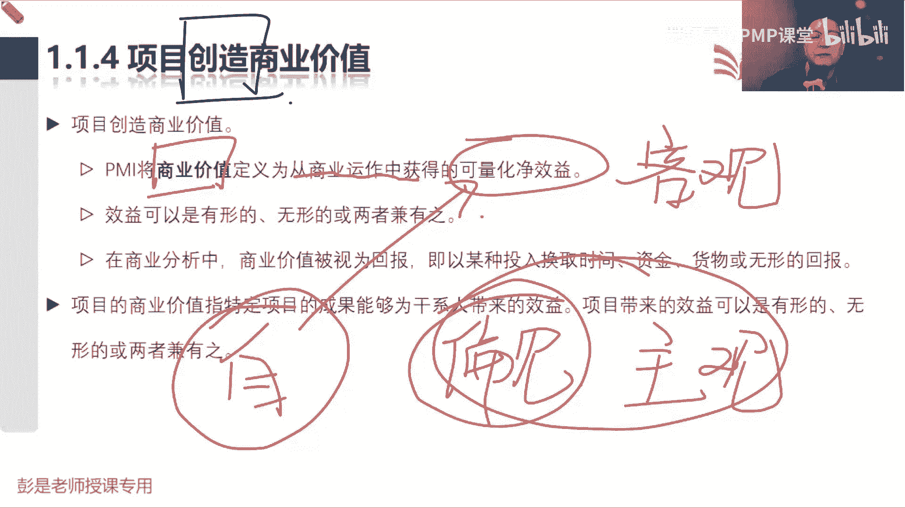

这样才能客观的实事求是的去评价这个事情，达到的结果，达到的效果是什么好，那再往下这个价值可以有形，可以无形，或者两者兼有，刚才也说过了啊，不是为了名，就是为了利，然后在商业分析之中。

商业回报后面巴拉巴就不见了，投资换回来什么什么收益可以有形。

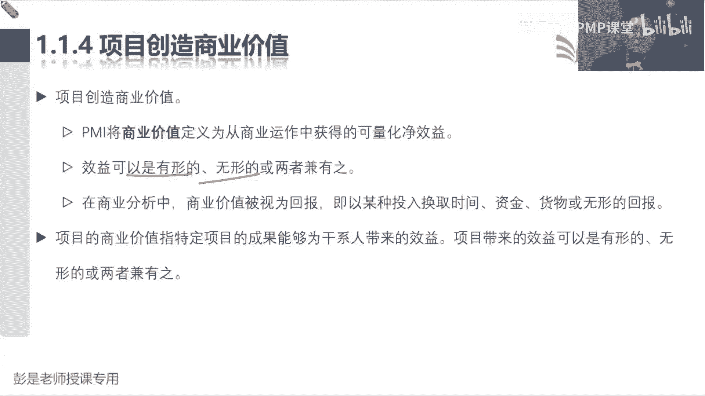

可以无形，听一听就完事了，然后接下来，书上给出了有形效益的例子和无形效益的例子，这个例子呢也是想看就看，不想看，其实可以不看，了解一下就可以了吧，粗暴地点名和利，粗暴理解理解就够了啊，不带不不。

这东西不需要去背的，不需要去背，但是每次同学都有同学会问的，他不理解啊，因为大家工作工作经验不一定丰富啊，就像公共事业和公共利益是啥呢，这很容易蒙，什么是公共事业啊，什么是公共事业啊，什么是公共事业。

就是大家国计民生，老百姓生活用得上的这些东西啊，警察是不是啊，维持治安吧，因为工商税务什么水电天然气修路，嘿这就叫公共事业，大家工作生活都用得上的，国际民生这样的东西啊，那公共利益是什么呢。

刚开完那个会权利吧，对不对，公民权你都有什么权利呢，有没有什么选举权呢，被选举权呢，这不都是涉及到大家的利益吗，哎就这东西啊，它是无形的，好的了解就可以了啊，所以这里面的东西啊不太需要去背。

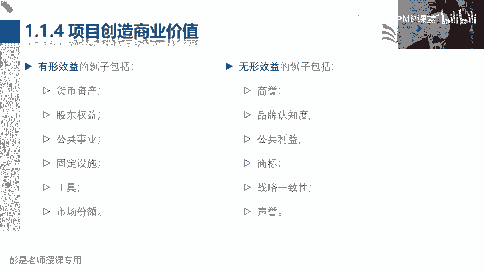

那再往下了啊，115项目启动背景，启动背景其实讲完了，其实讲完了，刚才我们说啊，刚才我们说发现这个这是一次第一次讲，咱那做什么工厂来着哦，梅菜扣肉，发现梅菜扣肉3151曝光卖不动了，于是呢于是呢对吧。

出于什么法律原因啊，出于什么改进修复产品啊，出于什么技术战略啊，我们要转型啊，我们转型做什么鱼香肉丝，宫保鸡丁，就总之因为各种各样的原因和理由，我们可能需要启动一些项目，那这些原因理由有什么呢。

不需要大家12345去背看，能看懂就可以，比如说为了符合法律法规社会要求，现在我们梅菜扣肉啊，不再用黑心猪肉了，这是为了符合法律法规要求啊，第二满足干系人的需求，一。

嗯第二是为了满足干洗人的需求和要和要求，比如说客户说你们那个梅菜扣肉太咸了，袋子里面装的肉太少了，那我们改工艺改改改设备，往里面多放点肉诶，是为了满足相关方的，相关群体的这些要求和需求。

或者是执行变更业务，或者是技术战略，对对我们改进技术，改进工艺，让我们降低成本，提高质量，提高效率，诶，改造我们的设备，改造我们的工艺，这也是通过项目的形式去完成，最后呢创造改进或修复产品构成和服务。

以此类推了，总之我们可能因为各种各样的原因和理由，去开展项目，那这些原因和理由，原因和理由到底有什么呢，不需要去背啊，能听懂就可以，那为什么启动项目，为什么有这些这些各种各样稀奇古怪的原因呢。

就是因为商业环境可能会有变化对吧，商业环境可能会会有变化呀，因为有的行业是吃政策饭的，政策呀，法律法规呀，竞争对手啊，以此类推吧，商业环境发生变化，发生变化就导致我们企业生意不好做。

影响了企业的日常运作，还出现了一些影响企业的因素，那咱不能坐以待毙啊，所以呢我们要采取行动去进行应对，这些行动是什么呢，就是通过项目的形式完成创造新的独特的产品，服务或成果的临时性的工作。

通过改进工艺呀，改造产品啊，升级设备呀，以此类推，从而帮助我们企业从当前状态。

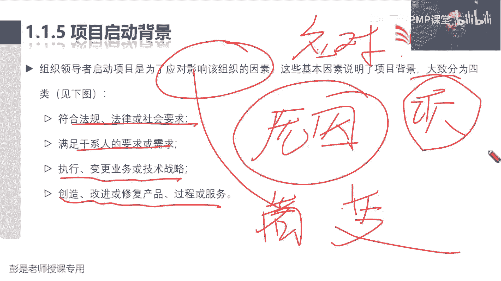

经历中间项目的过渡状态，达到将来状态，从而帮助企业创造新的商业价值，就是这么一套逻辑，商业环境发生变化，我们企业就受到了影响，咱不能坐以待毙，所以呢通过项目去进行应对，从而帮助企业创造价值。

再通过运营去实现这个价值，以此类推了啊，所以就是商业环境发生变化，现在全国人民啊这个内卷极其严重啊，大家都在玩命的卷呐，没有证书啊，证书少啊，可能未来升职加薪这条路啊就不好走啊。

所以呢我们要去学习考取一些证书，帮助自己自己创造新的商业价值，启动项目就是为了各种各样的原因，知道这个意思，了解就够了。

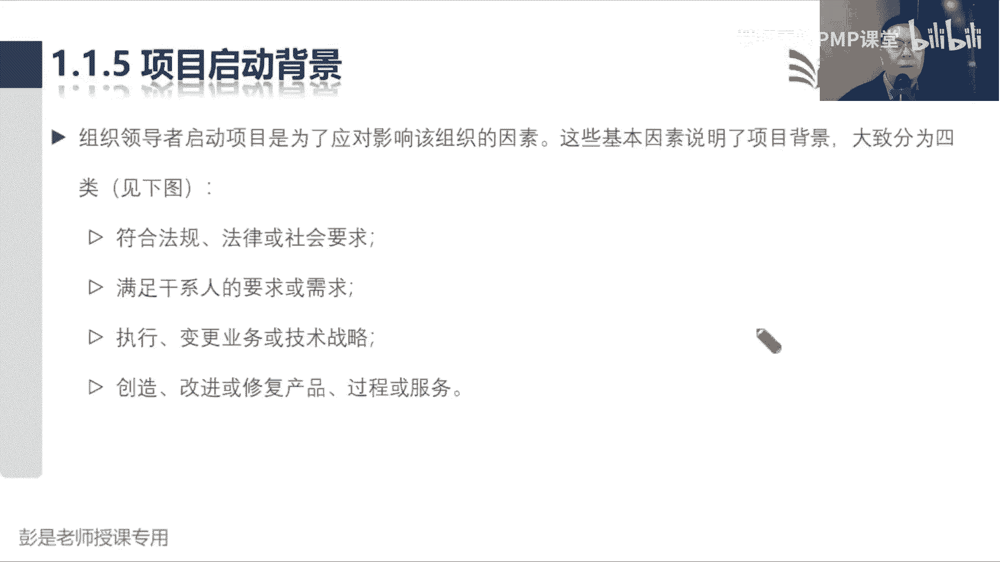

好再往下了啊，那这些因素这段文字就巴拉巴就念一遍，正面大家看看，仔细阅读，训练自己的阅读能力就可以了，刚才讲过了，说这些因素会影响我们企业的日常运转，那为了应对这些玩意儿，以便于我们能够持续的经营下去。

所以呢我们通过项目帮助企业完成这个任务。

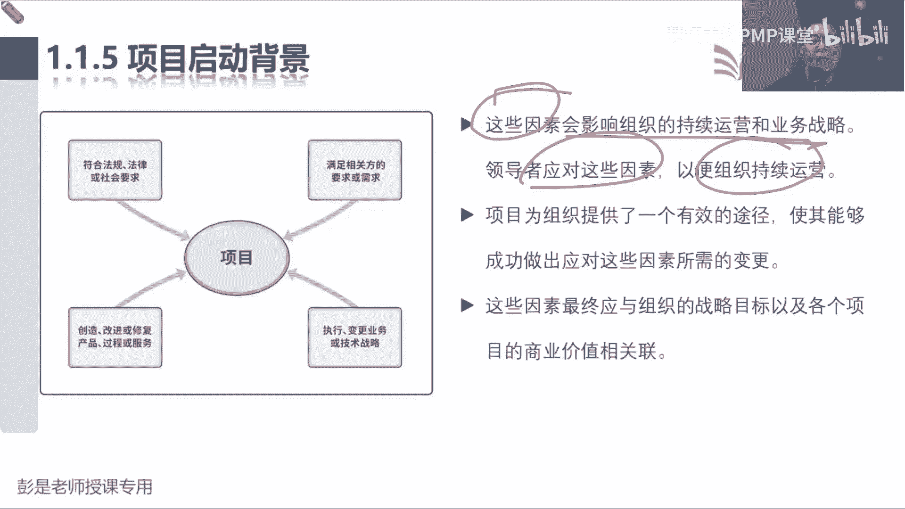

实现目标，得到我们期望的价值，116来了，新的知识点说呀，商业环境发生变化，我们要启动项目进行应对，那启动项目，它的目的就是为了，抓住和组织战略目标相符的商业机会，对不对，发现发现梅菜扣肉生意不好做了。

然后大家现在比较喜欢吃什么鱼香肉丝，宫保鸡丁，这不是商业机会吗，发现新的商业机会唉，那我们启动项目进行设备改造，工艺改造，让我们能够生产出新的产品服务或成果，这这咱知道了啊，新的知识点是什么。

就是后面这句话，在启动项目之前，通常需要编制商业论证来概述项目的目的，目标，所需投资以及用于测量项目成功的财务标准，和其他量化标准，这个玩意儿为我们成功奠定了基础，以便于把实际结果和预定的目标。

成功标准相比较，在启动项目之前，编制商业论证，说我们要做什么事，花多少钱对吧，多快好省，那做商业论证的作用是啥啊，他的工作重心是啥呀，两个单词，第一个单词是啥，可行性，第一个单词是可行性。

就是看这事儿啊，咱能不能做到，他其实包括很广义啊，各种各样的可行性，技术的，财务的，组织的，环境的，社会的都要考虑周全了，对不对，虽然我们，我们虽然我们成立一个生产梅菜扣肉的工厂，在技术上，在财务上。

在组织上都有可行性，但是呢社会上没有可行性，为什么呢，名气搞臭了，对民企搞受了，大家不买单啊，嘿会产生严重的负面影响啊，对所以呢哎这个东西不可行，那没有可行性的东西。

对企业来说就不愿意投入人才去做这个事儿啊，因为我们要花时间对吧，需要有人去干这个活儿，需要有钱，需要投入我们的设备设施物资啊，所以对企业来说，如果没有可行性的东西。

我们可能不愿意投入人财物去做这个事儿好，那如果有可行性，接下来我们还要考虑什么呢，说我们打算从梅菜扣肉转成鱼香肉丝，这改改工艺，改改设备哎，就可以做到了，能做到，但第二个东西啊，最后一测一测算。

改成生产鱼香肉丝之后啊，每生产一袋鱼香肉丝赔两毛钱，这活儿咱还干吗，不干了，所以第二个要考虑价值对吧，能赚多少钱，多长时间能赚多少钱，嘿不是为了名，就是为了利，也可能名利双收，有形价值，无形价值。

好所以这两个条件通常来说缺一不可，这个事情既有可行性又有价值，我们才愿意投入真金白银，投入人财物去做这个事儿，这就是商业论证最主要的作用。

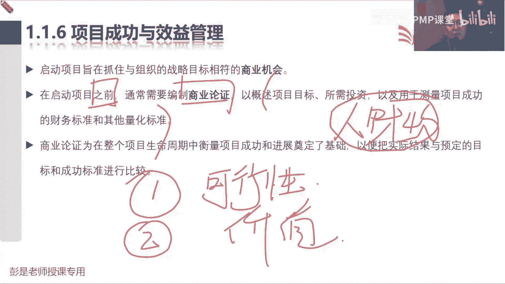

对包大家大家工作中好理解的单词啊，就叫可行性研究，这叫可行性研究，可研全面的去分析这个事儿到底能不能做到，有没有价值好，所以商业论证巴拉巴，以便于我们去评价这个事情到底成功不成功。

你生产工厂改造升级之后，到底有没有实现这个目标效益呢，需要去衡量，所以这就是商业论证，可行性研究，在项目启动之前，通常要做这个事情。

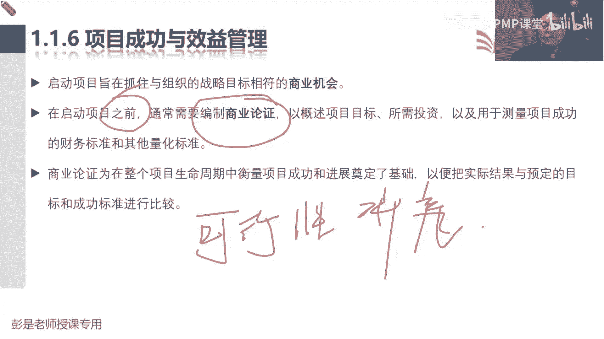

然后所以接下来再说项目的启动，通常出于以下一种或多项战略考虑，这些东西呢不需要去背啊，它其实啊就是启动项目的原因或理由，市场需求，战略要求，社会要求，以此类推，哎这都不需要不需要去背的。

刚才我们总结出来四大块对吧，什么法律法规呀，相关方的需求啊，什么什么什么技术进步啊，这都不需要去背的，最后最后的结论是什么呢，四个四个成语就记住这个知识点了，咱通常这个成语知道吗，诗出有名对吧。

所以我们要改造我们的设备，生产鱼香肉丝，市场上也没需要，战略上也不需要，社会上也不需要环境，也不需要唉，没没理由的事情，为什么要做呢，对不对，所以要做到师出有名，给给老板说清楚，我们为什么要做这个事情。

为什么要做这个事情，花花多少钱，达到什么样的收益，让老板去判断这个事有没有可行性，能不能能不能赚钱，老板同意了才会投入人财物去做这个事情啊。

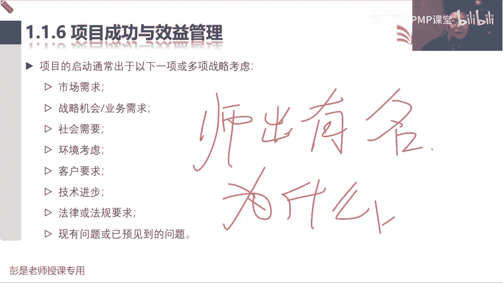

好再往下这段文字，大家也超好理解，看看这一句话啊，说我们根据项目的目标和成功标准，考量项目的成功程度，在许多情况下，产品服务成果的成功，只有在项目完成后一段时间方能知晓，对标到我们那个梅菜扣肉工厂。

能想到吗，现在梅菜扣肉不好干了，我们启动项目跟老板说啊，我们得改改成鱼香肉丝，改成鱼香肉丝诶，改造我们的设备，改造我们的工艺，这个项目完成的时候开始赚钱了吗，没有对，因为我们投入了人财物。

三个月完成设备的改造，三个月完成工艺的升级，这个项目结束的时候还没有开始赚钱了，需要干啥呢，运营一段时间吧，需要经营运作一段时间，才知道有没有实现我们这个目标效益啊，就这个道理。

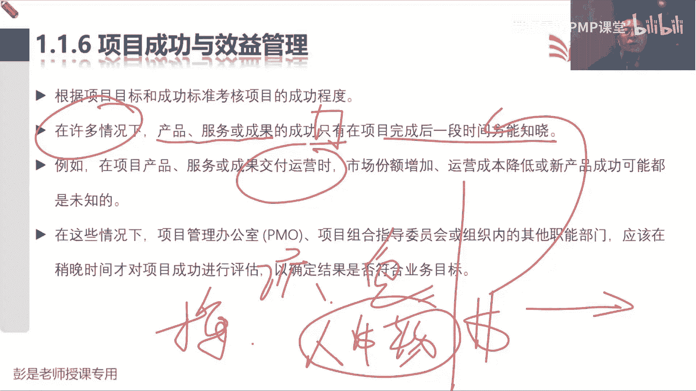

所以接下来带出来的术语是什么呢，什么时间能赚到多少钱，这事儿得给老板交代清楚，我们花一个亿改造我们的设备，改造我们的车间，改造我们的工艺，这个项目结束的时候啊，我们现在是纯花钱的，可能需要运营一段时间。

那老板肯定会问呐，多长时间呐，多长时间收回成本呢，多长时间开始赚钱呢，老板肯定要问清楚啊，哎这就是告诉老板，什么时间会获得什么样的效益，这要交代清楚了，可能比如说三个月以后收回成本。

然后呢六个月以后开始就有有有钱赚了，一年一年以后啊，能实现人人身人身自由，财富自由，两年以后咱就是全球首富了，要告诉老板什么时间会达到什么样的效益，这个是除了商业论证之外，第二个术语叫效益管理计划。

先听啊，马上会看到啊，好那话又说回来，有的项目结束的时候，是不是就知道赚了多少钱呢，是这样的吧，比如说我们花一个亿盖这个工厂。

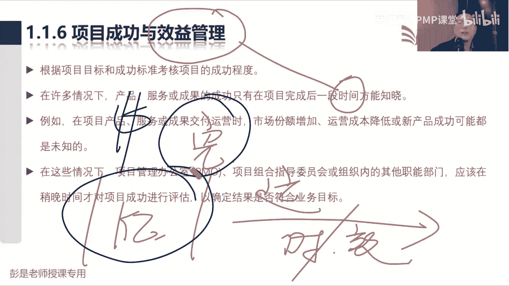

然后张三张三他们公司来帮我们施工，那施工结束以后一交付咱钱货两清，是不是张三已经赚钱了，对所以这个项目结束的时候能赚多少钱，什么时间能赚多少钱，一定要给老板说清楚。

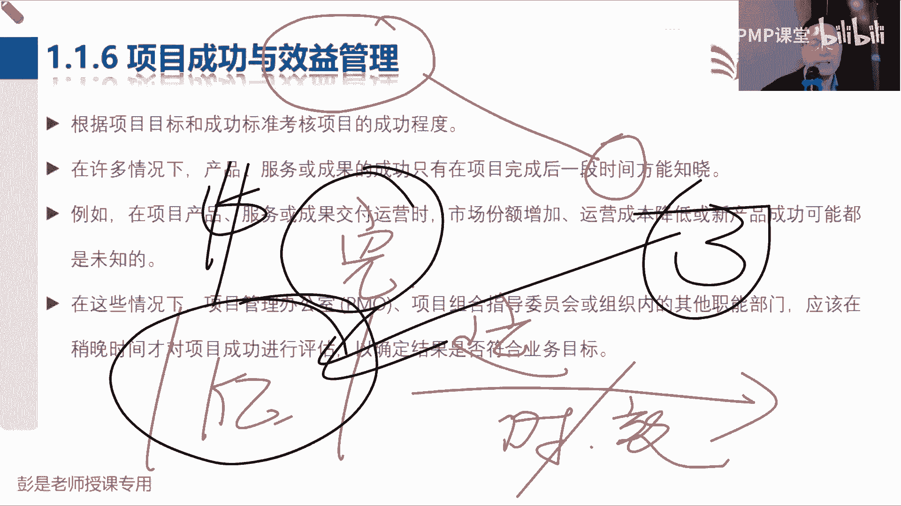

这段文字就在说这个道理，所以这个例子看一看就可以了，在项目产品服务成果交付运营的时候，哎这些东西有没有成功啊，有没有达到我们的标准呢，不知道看情况，所以有可能会跟踪一段运营，好接下来再看PPT啊。

最后呢就变成了整个项目管理领域，非常核心的一个框架，中间中间是项目，项目启动之前干啥事儿啊，商业论证对不对，说清楚这个事情的可行性，说清楚这个事情的价值，做完了商业论证啊，还要写一个效益效益的计划。

告诉老板什么时间会赚到多少钱，然后有些项目结束的时候，可能需要把成果移交运营以后，运营一段时间才能知道有没有实现目标效益，这就是我们整个项目生存的环境，项目启动之前叫可研商业论证效益管理，项目结束以后。

可能要把我们的成果移交给运营对吧，人家生产加工制造，运营一段时间，再再去再去分析有没有实现目标效益。

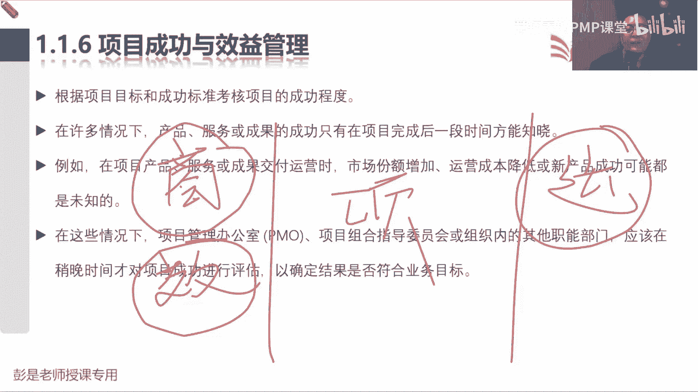

先记住这个大的结构啊，一会马上会详细展开，说了好，再往下就带出来刚才这两个术语，所以商业论证和效益管理计划，都是在项目启动之前编制的，并且要成为项目完成之后，评估项目成功的主要依据。

评价这个项目到底成功不成功，有没有收回成本呢，有没有赚到这预期这么多钱呢，因此这个结论需要大家记住啊，因此他们被视为商业文件，而非项目文件或者是项目管理计划的组成部分，后边这句话在说什么意思啊。

他们被视为商业文件，而不是我们项目中的这些东西，非常重要的一个知识点是什么呢，权力的边界，中间是项目经理，全权负责带着兄弟们完成任务，实现目标，得到期望的成果，然后呢运营跟咱有关系吗，运营跟咱有关系吗。

有注意用词啊，但运营归不归咱管不归，咱们要把成果移交运营是有关系的，对不对，但是运营不包不包括在项目之中，对不对，咱不管不管这个事情哈，那商业论证和效益管理计划这事儿归谁呢，这事儿归谁啊。

项目经理干不是，所以我们需要给它起了个起了个角色，名叫发起人，Sponsor，发起人，发起人，发起一个项目的人，他来负责调查这个项目有没有可行性，有没有价值，他来负责给老板说清楚什么。

这个项目结束以后多长时间我们会赚到多少钱，他来负责商业论证和效益计划的制定和维护，他来负责做可研，发起一个项目的人。

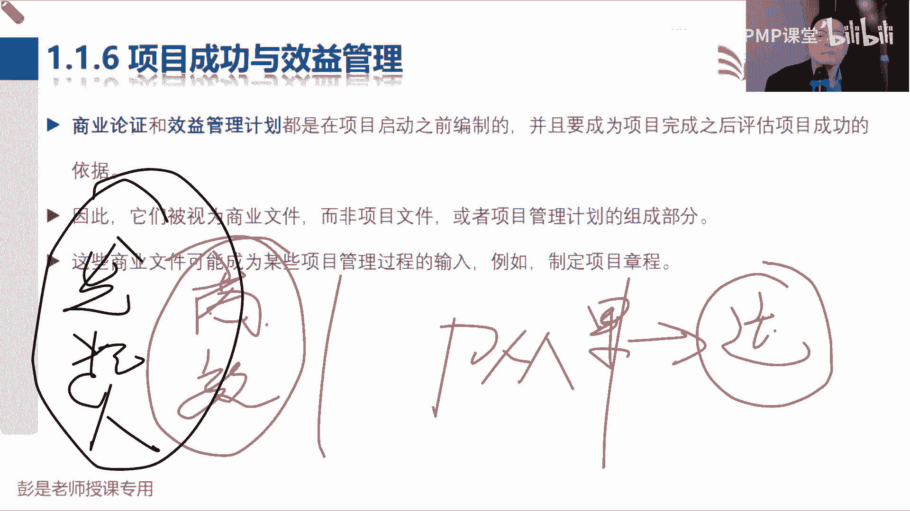

好再看PPT，咱把这几个知识点变成一个小故事，一说搞定说呀，商业环境发生了一些变化，出现了一些影响企业的因素，咱不能坐以待毙，要启动项目去进行应对，那启动项目进行应对，对企业来说，我们就要投入人才。

不对不对，花时间投入我们的设备设施资源，让我们这些员工去干活，那投入人财物之前啊，咱要慎重这事儿啊，咱要判断了有没有可行性，有没有价值，所以呢对企业来说，通常我们需要有一个角色发起人。

来负责商业论证和效益管理计划的制定和维护，他来搞科研，他来搞科研，他来搞科研，科研这个事情归他管，那一旦有可行性，一旦有价值，公司才愿意投入人财物去做这个事情，这种情况下才会任命项目经理。

任命项目经理告诉我们要做什么事情，三个月完成工厂的改进改造升级，告诉项目经理，我们要做到多快好省范围，进度，成本质量多长时间，达到什么样的产出，什么样的成果，达到什么样的质量标准和要求，还花多少钱。

那我们就带着兄弟们完成任务，实现目标，得到期望的结果，得到期望的结果呢，我们需要把我们的可交付成果，可能要移交给运营，移交给运营，但运营这个事通常不归咱管，所以这个结构就是项目管理的权利的，权力的边界。

中间是咱做主之前，咱做不了主，之后咱做不了主，我们只是参与。

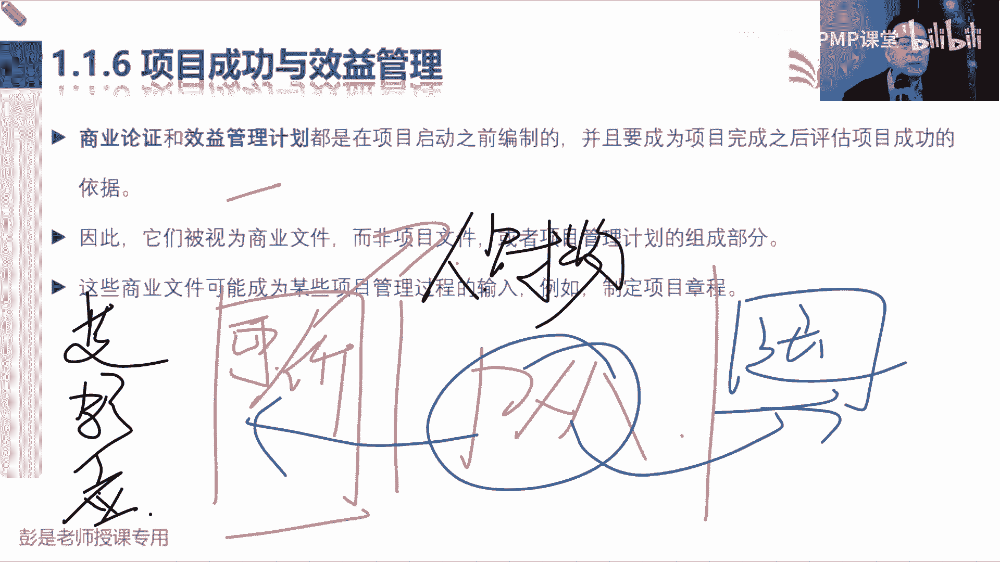

好那知道这个知识点之后啊，记住啊，咱现在说的都叫角色，发起人是一个角色，项目经理也是个角色，这个人到底是谁呢，到底是谁啊，刚才说一个项目，有的项目可能一个人搞定，有的项目可能一堆人。

有的项目可能一个组织单元，有的项目可能多个组织，多个多个单元，各种可能性根本就不重要，对不对，他可能是保安，也可能是保洁，也有可能是厨师，有可能是车间主任，有可能是我们的宿舍主管。

有可能是我们的什么什么狗，董事长，有可能是销售各种可能性，总之我们需要有一个角色，去分析这个事情的可行性，分析这个事情的价值，告诉老板什么时间会获得什么样的回报，从而让企业愿意投入人财物去做这个事情。

那这个事儿到底谁来谁来主导呢，我就需要发，就要需要项目经理这样一个角色。

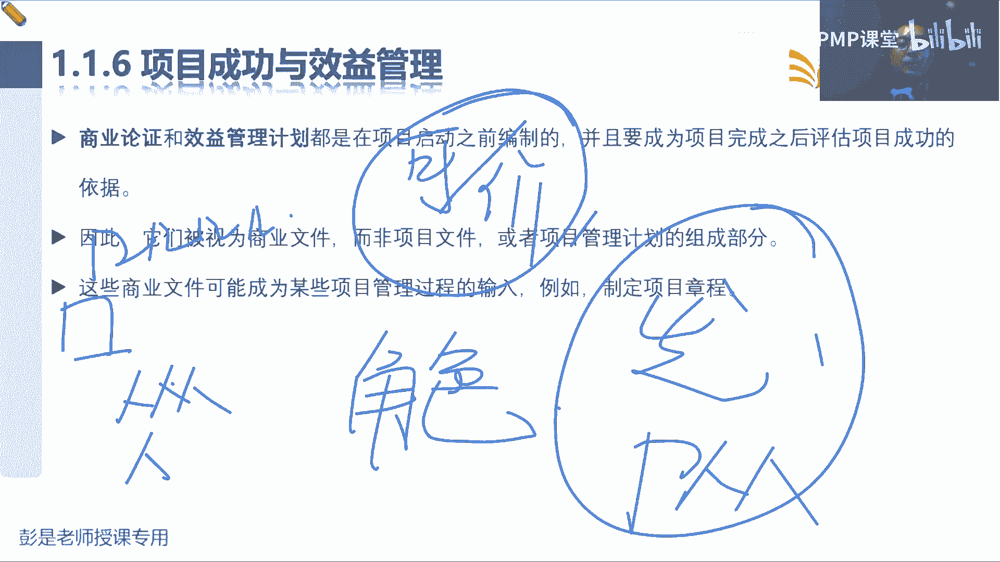

带着兄弟们完成任务，实现目标，得到期望的结果，所以不重要哈，爱谁谁，因为因为我就开了个煎饼摊，天天早上在地铁门口卖煎卖煎饼，那你说这这个小企业有法人，有董事长，有总裁，有保安，有保洁，有厨师，有服务员。

有收银员，全是我一个人，但是工作中我们需要这样的角色，有人来做保洁，有人来做保安，以此类推好，所以他到底是谁是谁，根本就不重要，也不会考啊。

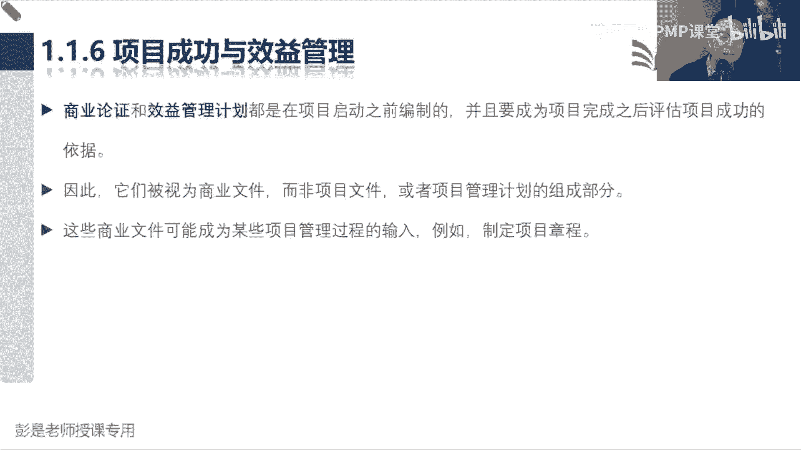

也没法考，那再再往下检查一下这一小段的学习成果。

看看这道题以下哪一项不是项目的可交付成果，抓关键词啊，关键词就体现出这个事儿的特点，刚才忘了啊，看不清的同学，下午我们跳跳PPT，把那个聊天那个字给它去掉，这样字就大，是不是一定要注意否定词啊。

对D肯定是吧，C肯定是吧，A和B比较一下，项目管理团队所编制的项目管理计划，项目管理计划，第一个小问题，它是不是我们的劳动成果，是第二个小问题，这个玩意儿可不可以交互的，可以所以可交付成果，刚才说了啊。

概念非常广，计划呀，文档啊，施工图纸啊，资料啊，都是啊都是啊，然后批量生产的汽车零配件，它是什么的成果呢，哎就批量这两个词，批量需要持续的重复的，重复的产出相同品质的产品服务或成果，它就是运营的成果。

好搞定，以下哪一项最能表现项目的特性，A说需要制定进度计划，项目需不需要定进度计划呢，需要B说需要整合范围，进度和成本，项目需不需要整合这三个东西呢，需要项目需不需要有专门的团队来实施呢。

需要那为啥不选，嘿这道题其实考试不可能考这道题，就教我们一个道理，叫问什么啊，答什么问什么答什么哎，不要所答非所问啊，最能体现项目的主要特点就是独特性，临时性，渐进明细性对，然后项目驱动企业发生变化。

促推动企业变革，帮助企业创造价值。

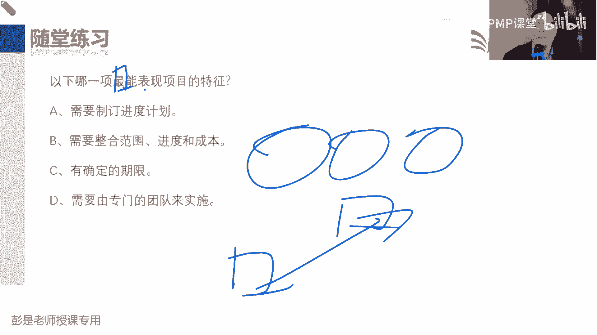

找到匹配的选项，仅此而已啊，好以下哪一项说法是，正确的，简单吧，就C了吧，A选项说既然和以前的成果比较，本项目中存在着某些重复的元素，所以呢讲不再是独特的，这话错了，在某些方面存在着重复的元素。

在某些方面肯定存在着不同，这种不同点意味着项目仍然具有独特性，B项目只能产出有形的产品，可以有形，也可以弧形，然后D选项说，周期10年的工作不应该当做项目来开展，这就让他去死吧，不一定啊，对不对。

因为有的项目周期长，有的项目周期短，没有办法通过这个周期判断它是不是项目，那C相对来说就是对了，项目大多数是为了创造持久性的结果，通常我们不希望创造的产品，服务成果具有临时性。

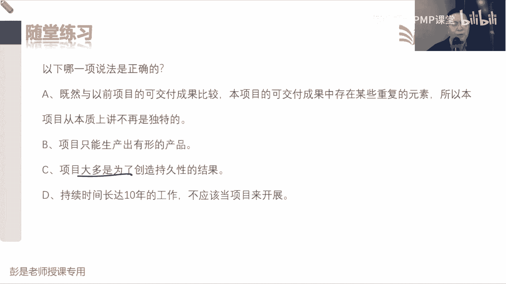

好一项哪一项，哪一项是项目管理不可以逐渐细化的方面，这没讲到的知识点猜吧，所有的东西都可以渐进明细，但这个单这个单词大家能猜到是什么玩意儿吗，什么叫蔓延，特别不什么叫蔓延，就参考爬墙虎这种东西啊。

不知不觉不知不觉就越爬越越爬越高，越爬越广，范围蔓延指的是范围的变化失控，没有考虑到进度啊，这是时间呐，成本呐，质量啊这种东西啊，哎指的是范围范围，慢慢的它的变化就失控了，失去了控制。

大家实际上每天可能都有范围蔓延的情情况啊，想一想有没有什么叫范围蔓延，晚上12点躺在床上啊，立个flag，刷30分钟抖音，然后就睡觉，结果结果呢哼诶刷刷抖音，看看朋友圈，看看微博，哎呀又来个热搜啊。

哟哟这个剧这个剧挺好，搜一搜搜一搜，看看要不要追一集，对不对，我玩会儿游戏啊，不知不觉不知不觉，我们在不断的不断的改变范围，增加范围就会导致我们那个睡觉时间越来越晚，越来越晚对吧，慢慢慢慢就天亮了吧。

就这个道理，所以范围的变化不可怕，可怕的是范围的变化没人管，对我们要综合的综合的考虑周全呐，对不对，几点睡觉啊，还能睡几个小时啊，睡的时间短，明天上班啊，精神不精神啊，会不会工作容易出错啊，以此类推啊。

综合的考虑清楚这个事情啊，好的了解就可以了啊，等讲到范围这一章。

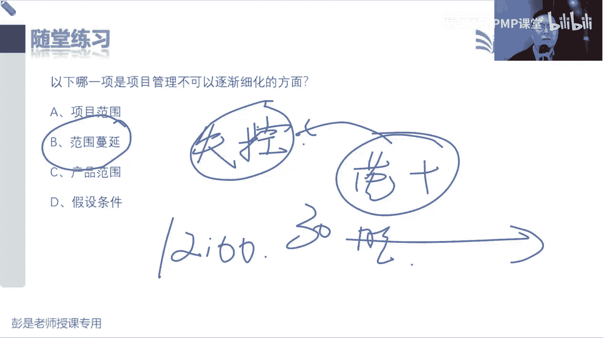

范围这一章再细讲这个送分题，组织所从事业务的整体价值，通过什么东西来体现商业价值吧，因为这个东西可以有形，也可以无形，可能包括股东权益啊，股票市值啊，公司的口碑，名声声誉这种东西啊。

那这个单词呢大家工作中了解吗，什么叫成熟度啊，成熟度来体现啥呢，不了解哈，它来体现能力成熟不成熟，这东西大家听一听就完事了啊，现在咱也不搞这么复杂的东西，什么叫能力的高与低呢，什么叫能力的成熟不成熟呢。

参考疫情，疫情刚出来的时候，咱们这个事管的成熟不成熟呢，不成熟，对不对，很乱的，因为它对我们来说是我们没有认知的事情，就乱肯定会乱的，对不对，不可能有序，但是呢随着疫情的发展，慢慢的慢慢的。

我们各地方各地方就总结出一些规律吧，还帮助我们有效地控制了各地的疫情，但这些各地方各个地方的这些总结出来的经验，它不一定具有通用性，他可能帮助我们管理好一些一些情况，然后慢慢的慢慢的随着这个疫情的发展。

大卫建委出了一个什么东西呢，疫情防控的标准全国通用，嘿就不断的在总结经验，我们总结出一些标准化规范化的东西，从而能够弥补其他人这种能力上的不足，对哪怕我是个新毕业的实习生，看看出的标准诶，怎么操作。

怎么戴口罩，怎么消毒，怎么测核酸，这样呢可以帮助我们有效的，有效的弥补能力上的不足啊，这就是对企业来说，为什么要出标准，政策程序规范这套东西，那再往上呢就是量化我们这些管理。

管理管理工作能够能不能做到量化呀，张31分钟做十个核酸，李41分钟做20个核酸，工作效率就可以比较高低了，所以标准化，标准化，规范化的下一个境界就是量化工作中，这些效率啊，质量啊，能不能量化，量化之后。

最终的目的是为了改进，因为一旦做到客观可量化，可衡量，才可以持续的改进对吧，降低成本，提高效率，提高质量，张31分钟能做十个核酸，李41分钟只能做一个，那说明你这个干活干的慢，对不对。

你要想办法熟能生巧啊，哎以此类推了，才能够做到持续改进，它是通过这五个等级来评价你们管理的能力，水平，高与低，能力成熟不成熟。

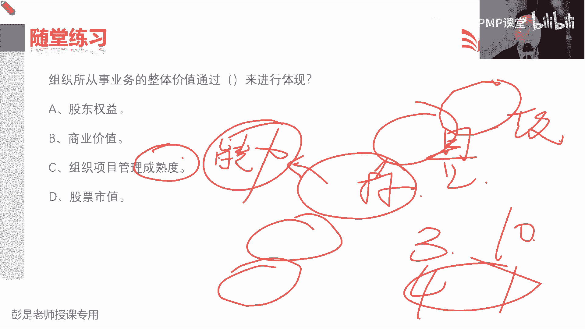

听一听就完事了啊，后面我们会收到一个OPM的东西，困了还有5分钟就下课了，好这道题超简单，屁股都不穿衣，诶怎么没声音，全，哎再等一等啊，每一次每一次肯定有同学选B选C选D。

这道题其实啊对应的知识点超简单，选其他选项的同学可能也知道这个知识点，但他错在哪呢，这叫啥双重否定，一定要注意啊，一定要注意把这个思路给他捋一捋，最踏实的方法是什么呢，就老老实实写一写呗。

所以下都是商业价值的无形价值，除了啥，让我们找一个有形价值，那像品牌呀，公共利益呀，公共利益就是选举权嘛这种东西啊，商标商誉它都是无形价值，所以呢它不是答案，那股东权益对吧，你占股股股份占比百分之多少。

它可以变成真金白银啊，所以呢它是有形价值，所以最后答案就是A这种否定词，大家未来看书啊，考试的时候一定要注意，很容易跳进跳进坑里啊，听一听就完事了。

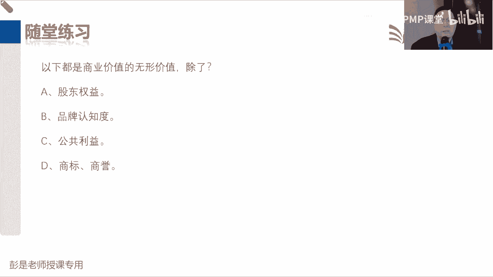

这些东西不要背啊，背下来也不考，这就是一点一项目管呃，项目给大家介绍一下项目的主要特点，项目什么叫商业论证，什么叫运营。

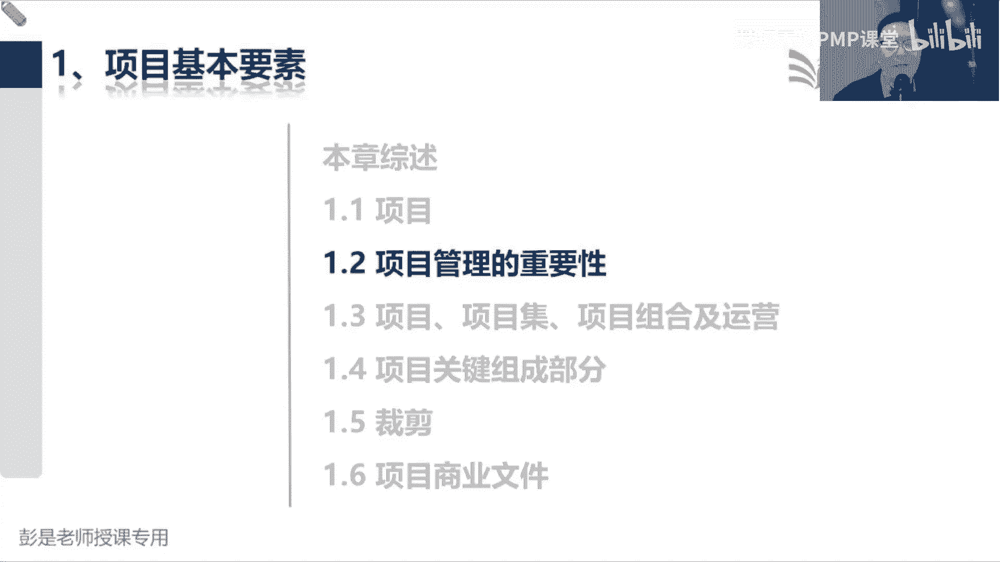