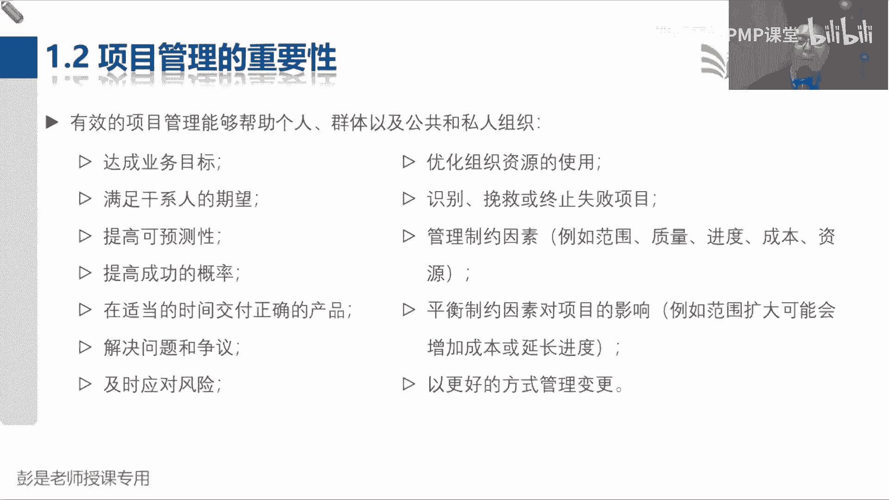
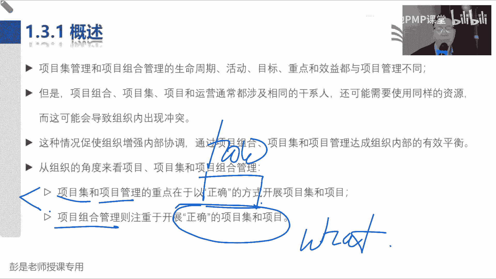
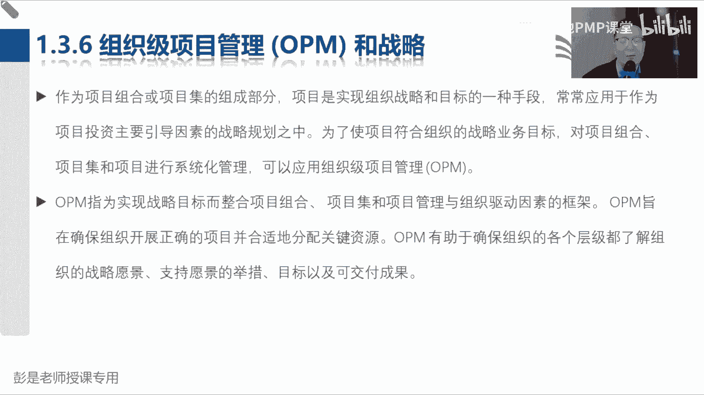
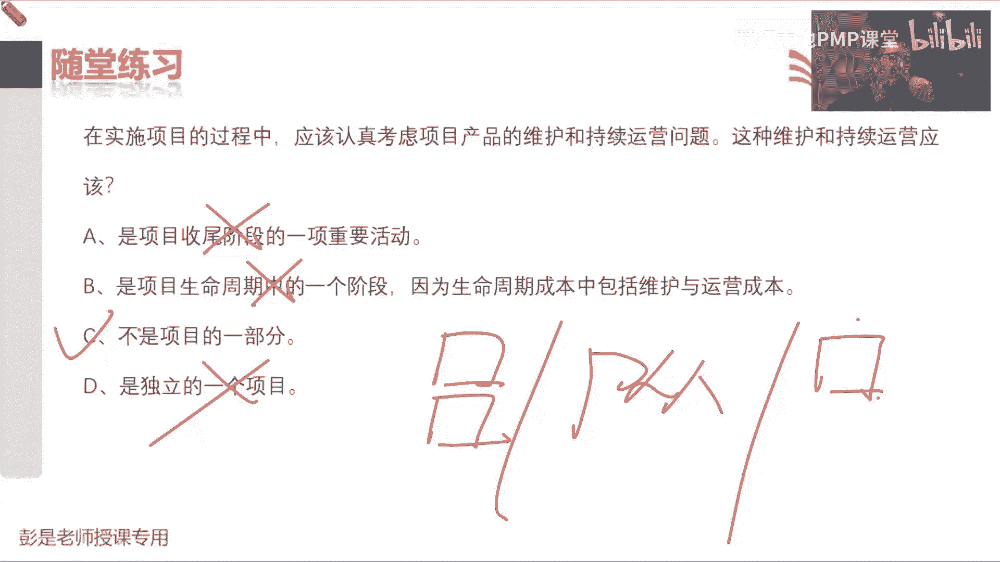
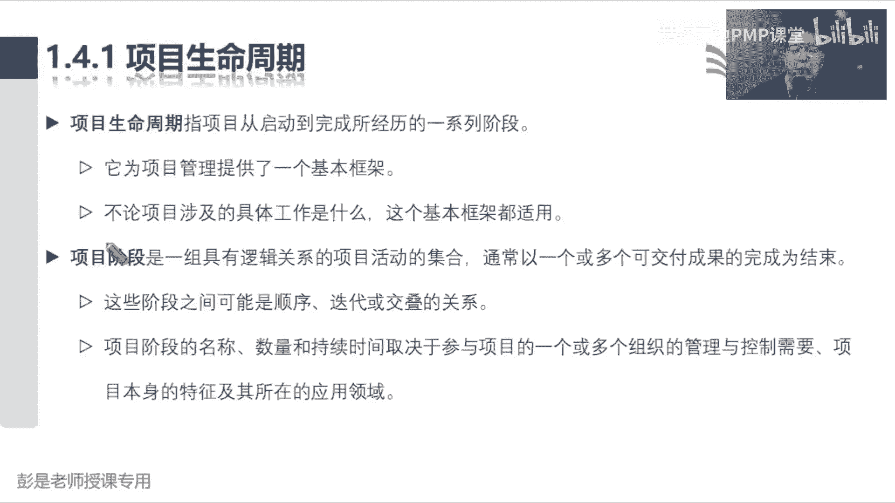

# 2024PMP认证考试课程（第六版+敏捷+第七版） - P3：1.2-1.4.1 项目的关键组成 - 慧翔天地PMP课堂 - BV1By411b7qM

项目管理的概念也是听一遍就完事儿了，没，项目管理师将知识技能，工具和技术应用于项目活动来满足项目的要求，那到底什么是管理呢，粗暴理解就是把一身本领用到工作中，完成任务，实现目标，所以有的人本领高。

有的人本领低，为什么呢，因为知识技能工具基础，大家掌握的程度是不一样的，可以理解为可量化的，就是有形和无形，可不可以相互转化呢，可以这东西主打一个灵活呀，商标对应的叫什么，权利，商标对应得的权利吧。

我生产的梅菜扣肉可不可以叫耐克牌，什么阿迪达斯牌，苹果牌，华为牌，不一定吧，哎所以它是无形的东西，那你说商标可不可以变现呢，可以所以有形价值和无形价值是可以相互转化，主打一个灵活啊，千万不要死记硬背啊。

听道理，道理听明白就可以了，好那再往下项目管理说重要性，重要性能够帮助我们更好的完成任务。

实现目标，那项目管理的重要性，这段文字呢也不太需要去背，没什么需要背的啊，听一遍就完事了，说有效的项目管理能够帮助个人群体和公共，什么私人组织，巴拉巴拉，总之啊全是好事对吧，实现目标，满足期望。

提高可预测性，提高好事全都上去啊，不好的事情全都下去，但这段文字需要大家知道什么呢，看看啊管理制约因素范围，质量进度成本资源，什么叫制约因素呢，什么叫垂原因素啊，这些东西通常会对我们的工作形成约束。

并且呢，这些东西它们之间存在着各种各样的关联关系，比如说我们如果想增加项目的范围，会导致什么东西发生变化呢，嗯进度进度成本资源都可能吧，哎所以记结论就够了，这叫牵一发动全身。

通常以前会说三重制约和六大制约因素，现在这个概念基本上不考啊，总之牵牵一发动全身，随便范围进度成本质量资源和风险，再加上未来我们要掌握的采购干系人和沟通，这些因素之间。

都存在着各种各样千丝万缕的关联关系，随便改一改，某一个东西，都可能引起一系列一系列的连锁反应，所以需要干啥呢，就有了我们十大知识领域，第一个知识领域叫整合，我们要去管理这些东西呀，找到一个平衡点。

所以就带出来这句话，我们要平衡制约因素对项目的影响，例如范围扩大可能会增加成本，延长定度，就像各位同学，晚上晚上睡觉前到底刷多少时间的朋友圈儿，看看多长时间的抖音，要考虑好平衡点，那平衡点呐，对不对。

不刷心里面憋得慌，这觉也睡不好，刷时间太长了，可能也会影响睡眠质量，对不对，以此类推啊，找到一个合理的合理的平衡点，这就叫平衡制约因素对项目产生的影响，考虑周全，考虑周全，知道这个意思啊，好然后再往下。

看看那项目管理不善或者是缺乏管理，可能会导致这想看就看，不想看可以不看了，总之全都出问题范围，进度成本质量，资源沟通风险，采购相关方价值有形无形，有形价值，无形价值都有影响。

这都不用看了啊，嗯好，那1。2，我们下午再继续书，接上回，那大家上午听课，辛苦了，咱上午的课程就先讲到这，各位同学中午吃好喝好，咱下午见，下午上课时间是13：30，不要迟到哦。

各位同学醒一醒了，还有30秒钟时间，咱们下午的课程即将开始了，醒一醒呀，缓缓神儿啊，伸个懒腰啊。

准备啦准备啦，还有20秒钟时间，即将开始下午的课程啦，看一看声音是否正常，课件能否正常显示呢，下午好，下午好，还有十秒钟时间，15秒时间即将开始下午的课程，好准备了，还有十秒五秒八秒七秒，321好。

各位同学，下午好啊，咱们继续开始下午的课程，春困秋乏，夏打盹，睡不够的，冬仨月，夏天容易天气热，容易犯困，犯困的时候啊，各位同学在听课的时候啊，就适当的适当想办法给自己提提提神呐，头悬梁锥刺股物理攻击。

魔法攻击，超简单的魔法攻击，你就想一想，工作好找吗，很容易跳槽吗，多久没涨工资了，有的企业还要扣工资呢，对不对，想一想房价物价买车了吗，买房了吗，唉心就凉了，心静自然凉好，所以下午大家想办法。

让自己保持注意力的集中啊，评论关了吗，不知道咋关呢，那接下来看啊，1。2项目管理的重要性，哎总之啊书上说的对，这事儿很重要好基本上可以听一听，这段文字还是值得大家去阅读理解的啊。

说项目是组织创造价值和效益的主要方式，为什么呢，因为商业环境出现变化，出现变化就出现了影响企业的因素，让我们不得不做点事情，然后呢，想办法帮助企业不断的不断的创造新的价值好，所以这段文字看一看就可以了。

这是商业环境在变，咱得做点事，然后呢启动项目，帮助企业从当前状态达到未来状态。

咳做到这一小段的习题，在范围，时间成本和质量等相互制约的因素之中，通常什么更重要呢，这题很好猜啊，啥重要啊，范围吗，还是质量啊，还是成本呢，还是进度啊，不一定具体情况具体分析，一定是这样的啊。

就是因为每个项目有每个项目的独特性，然后呢我们项目涉及到的这些人人呐领导啊，客户啊，什么用户啊，不同的人群有不同的期望啊，所以到底哪一个更重要呢，相对来说最合适的就是C老板说啥，就是啥不确定的东西啊。

一所以我们才最难的，最难的就是找到一个平衡点，让大家都开心都满意，有些情况下范围是什么不太重要，对范围多了少了没关系啊，有的时候呢质量不太重要，有的项目呢时间进度不太重要，有的项目呢赔钱也干。

成本不重要，具体情况具体分析，所以四个选项里面比较合适的就是C了。

好1。3，那接下来又带出来一组概念，项目项目及项目组合和运营，项目咱搞定了，运营咱搞定了，项目是创造独特的产品服务成果，而开展的临时性工作，运营呢追求的是标准化，规范化的操作。

想办法产出相同品质的产品服务或成果，所以通常项目就是非常态化的东西运营，那就是常态化的事情，那接下来这个单词啊，什么叫项目集，什么叫项目集啊，没预习啊，多个项目啊，项目集更关注的是什么呢。

他是说多个项目之间如果存在着关联关系，依赖关系，那为了避免呢A影响B，为了避免B影响A那咱要不要画个圈圈，给它圈起来，把这两个事情给他协调一下，协调一下，尽量的不要让他们相互影响。

从而创造一些额外的价值，最好理解的项目集就是想这个场景，比如说各位同学啊，我有一个项目是买房，还有给小孩找小学，这两个项目是不是他的成果，之间存在着某种依赖关系，买什么地方的房子，上什么地方的学校啊。

哎那这种情况下，我们要不要通盘把这两个事情给他考虑周全呢，对不对，要慎重选择了吧，哎他就是说项目之间，它的成果如果存在着这样的关联关系，依赖关系，我们要把他俩给他协调到一起去，这样呢想办法1+1大于二。

避免浪费时间，浪费精力，浪费钱，对不对，他就是帮助我们创造额外的收益，所以其实他他就是啊多项目管理，多个项目存在着关联关系，统一协调好项目是一个项目及一堆，那项目组合又是什么鬼呢。

嗯项目组合项目组合也是一堆事儿，但是他的工作重心不一样，比如说我们上午那个梅菜扣肉工厂，我们现在有两条生产线，一条生产线生产梅菜扣肉，还有一条生产线生产鱼香肉丝，梅菜扣肉生产线一年让我们赚十个亿。

鱼香肉丝生产线一年让我们赚1000万，那这两条生产线，如果你是这个工厂的老板，哪条生产线上，你会投入的精兵强将最多的，你别走，哪个赚钱往哪砸，往哪往哪砸钱，就这意思吧，对梅菜扣肉赚钱多呀。

那咱就下血本搞梅菜扣肉，对不对，让我们这个梅菜扣肉的什么车间啊，工艺啊，设备设施啊，人才啊都是最高的优先级啊，他们在人财物上会给予倾斜，因为鱼香肉丝毕竟不赚钱，那现在啊商业环境发生了变化，3151曝光。

梅菜扣肉卖不动了，这种情况下怎么做呢，诶就把工作重心转到鱼香肉丝上对吧，这至少能赚钱呐，先让企业能够生存下去啊，所以项目组合管理最重要的中心思想就是好钢，用在刀刃上，对不对，我们企业精兵强将啊。

人呐财啊物啊，投到什么项目上，能够赚最多的钱，哎所以他主要工作重心是找到好钢在哪好，所以接下来知道这个意思啊，项目关注的是什么呢，作为项目经理，我们的主要思路就是怎么把这个项目完成。

如何做到在有限的时间之内完成一定的质量产，产出一定质量的产品服务或成果，然后还不要超支，关注的就是方法，也就叫如何完成任务，实现目标项目集的工作重心是什么呢，也是，他是说多个项目之间如果存在着关联关系。

依赖关系，那咱想一想怎么把这多个项目给他协调好，组织好，他关注的仍然是方法，项目组合关注的点不一样了，他关注的叫好钢用在刀刃上，好钢用在刀刃上，刀刃在哪儿呢，所以他的工作重心是思考啊。

做什么事情对企业来说是最有意义的，便于我们把钱花到点子上，投入我们的人财物，在资源资金上给予倾斜，所以他关注的是做什么事情，能够让企业实现我们的战略目标，战略意图。

他关注的是这个what what这个东西啊，那运营关注的就是我们要持续的定期的。

重复的产出相相同品质的产品服务或成果，好知道这个中心思想，后面书上这段文字啊，基本上看一遍其实就够了，没必要反复看了，因为车轱辘话来回说就这么几句话，所以这段文字先听一听就完事了。

说一个项目可以采用三种不同的模式进行管理，作为一个独立的项目，不包含在项目组合或者是项目集，那换句话说，一个独立的项目没有包括在项目组合里，这说明啥，它和这个东西没有，相关性对不对。

就是一些临时事项和不涉及到公司的战略，咱们把它完成就可以了，那以此类推，如果一个独立的项目没有包含在项目集之中，说明什么呢，说明他和其他项目没有关联关系吧，哎他就是个独立的存在，把它完成就够了。

那如果一个项目在项目集里，说明它和其他事情有依赖关系，如果一个东西在项目组合里，说明和公司的战略具有相关性。

知道这个意思啊，好所以后面说，如果项目组合和项目集内管理某个项目，那么我们需要和项目组合，项目及经理互动，这是来告诉我们项目及项目组合，项目集是一组相互关联且被协调管理的项目，子项目集和项目及活动。

以便获得分别管理所无法获得的利益，这个字需要解释吗，什么叫子项目集呢，啥叫子项目基啊，这听一遍就完事了，项目集太大了，咱就把它拆成一大堆小项目集，以此类推，项目太大了，可不可以拆除一些子项目呢。

可以很正常啊，好所以总之项目集里边就是一堆事儿，这对事情它们相互关联，需要我们去统一协调，以便获得分别管理所无法获得的利益，那就是1+1大于二了，哎这就是项目挤压，而项目组合什么什么巴拉巴拉巴拉巴拉。

项目组合是指为实现战略目标而组合在一起，管理的项目，项目及子项目组合和运营工作，总之啊要做的事这么多，画个圈圈，把和公司战略相匹配的东西放进来，便于我们排序排优先级，合理的分配人财物。

重要的事情就把精兵强将放上去，不重要的事情我们可能资源资金就不受待见，这就是项目组合，画个圈圈和战略相关的东西放进去排排序，分配人财物。

先带着这个印象再往下看啊，然后书上给出了一张示意图，这张示意图呢也不需要大家去记住，就听一遍OK了，项目一是个独立的存在，项目二和项目三明显存在着关联关系，所以放到了项目集里，项目及B1太大了。

所以拆出来一个子项目集，拆出来一个B1，然后项目组合里面就是和公司战略相匹配的，东西，都在里面，里面有项目项目，还有一些项目集，还有运营，还有运营好，那接下来知秋同学提的这个问题挺好。

刚才我们知道项目组合里边可以包括运营，这不犯法吧，我们公司开了吗，开了梅菜扣肉留收生产线，现在我们手头上没有项目，我们的工作重心就是运营，抓抓运营，提高效率，提高质量，降低成本，对实现利润的最大化。

哎所以组合里边可能包括运营性质的工作，那项目经理有没有可能包括运营呢，哦对项目基地有没有可能包括运营，换句话说，项目和运营有没有可能存在着关联关系，没有，有吧对不对，项目和运营有没有可能存在着关联关系。

依赖关系呢，盖的工厂，盖的工厂盖了一米高，我们这个设备4米高进不去啊，会不会相互影响，会对不对，工厂还没盖好呢，买的设备到了，然后没地儿存的，风吹日晒的生锈了，会影响到这两个事情也要协调起来。

如果项目的可交付成果要移交给运营的话，那我们要把这个东西，把这个东西想办法统一的给他协调好，对不对，避免相互影响，只有这个道理，所以项目集里边也有可能包括运营好，胡畔同学已经掌握到真理了啊。

根据马克思普遍联系的真理是有的，好那继续这个话题，再往下讲，按照这个思路，项目包不包括运营，项目包不包括运营，要不要把运营工作包含在项目之中，这就不行了吧，过分了啊，项目是项目，运营是运营，它是两回事。

这个大家要和实际工作中去区分一下，因为实际工作中你可能会签会签协议，签的是什么协议呢，项目加运营能抢到这样的场景吗。

和甲方签的协议，项目加运营有没有签过这样的合同呢，对吧，帮甲方开发一个游戏，游戏开发好了之后啊，给你运营个三连，让这个游戏啊可以正常使用啊，可以吧，签的协议可能是项目加运维的模式，我给甲方修高速公路。

修完了高速公路要不要运营啊，现在基本上都这个模式吧，修完高速公路运营个10年八年，30年，50年，持续不断的去收钱的，所以签的协议有可能是项目加运营这种模式，但实际上从概念上来说，项目和运营是两回事。

运营工作不要被包括在项目范围之内，咱要划清这个边界啊。

好那再往下这张图，知道这个意思够了，然后131再往下找找找找找找到这两句话，知知秋同学再问这个问题就没有价值了，是否可以将包含运营作为项目及项目组合，和以下项目的差异之一呢，不行这不是判断的依据啊。

对不对，要知道这些管理方法，它的工作重心工作重点在哪，中餐要喝水，西餐也要喝水，那能不能用喝不喝水，判断是不是中餐还是西餐呢，不行对不对，所以听课听课听重点哈，嗯那接下来教材上找到这两句话。

重点标一标项目集和项目管理，他们重点在于以正确的方式开展项目集和项目，也就是传说中的好，怎么想办法，1+1大于二项目提供项目及经理的工作重心，把多个事情之间给他组织好，协调好，项目经理关注的是什么呢。

哎怎么把项目完成，完成任务，实现目标，得到期望的结果，关注的都是方法，而项目组合重点侧重于，开展正确的项目和项目集，他就去思考了，对企业来说，现在什么事情更重要，什么事情更重要，做什么事情是对的。

做什么事情能够帮助我们实现宏图大业，这些重要的事情，我们投入精明，强调在人财物资源资金上给予倾斜。

好那再往下书上告诉我们项目及管理，这段文字呢也没啥可解释的，就是项目起义完成任务，什么无法实现的，1+1大于二，它包含什么相互依赖关系，然后想办法协调好，所以就是最后结论一堆事相互依赖，相相互关联。

咱把它协调好，然后这么做的目的是1+1大于二，不浪费，盖工厂，盖房子，买设备，这两个事情要协调好啊，不要设备，工厂没盖好。

房子没盖好，设备到了，所以不解释了啊，听一听就完事了，那132说项目集和项目间的依赖关系，具体管理措施可能会包括这段文字呢，也不要求大家去背，你也背不下来，没什么用啊，总之关联下协调依赖。

然后它里面剩下的内容啊，就是不管是项目，项目组合，项目及，不管是企业还是个人，不管是国家还是还是行业，四个共性的叫四个四个讨厌鬼，四大恶人是什么呢，就这四个东西风险冲突问题变更，风险无处不在。

随时可能有产生，随时有可能产生冲突，工作不可能顺风顺水，总会出现各种各样的问题，另外呢计划又不可能一成不变的变化，随时可能出现，随时可能会发生啊，就这四个东西会导致我们计划的推进层层受阻，层层受阻啊。

所以这四个东西一定是高频考点，风险怎么处理，冲突怎么处理问题咋解决，变更怎么管理，分别对标对标到整合这一章，质量这一章，资源这一章和风险这一章咱会后面单独说，所以不管是项目及项目组合。

项目关注的东西都是这四个东西，先听一听。

然后书账号最后给了一个项目集的示例，这也不念了，说一个通信卫星地面站，盖多大地面站，发射多大卫星，这俩事要协调好啊，不然这卫星可能出问题啊，好一点，12点呃，133说，项目组合管理，项目组合管理。

直接帮大家找到这一小段话，说项目组合管理，确定它是否符合我们的组织战略，要想实现价值的最大化，要实现项目组合价值的最大化，为什么呢，就是啊好钢用在刀刃上，这不是价值最大吗。

所以他去分析做什么事情对企业来说是正确的，需要精心检查项目组合的组成部分，把符合战略的战略的东西放进去，然后确定组成部分的优先级，这是排排序，事分轻重缓急啊，是最有利于组织战略目标的组成部分。

拥有所需的财力，人力和食物资源，便于我们合理地安排人财物，最后一总结就是资源和资金，战略一堆事儿排排序，人财物，它主要工作重心就是这个，所以拐个小弯儿啊，这种这种组合的概念啊，其实它从哪个行业出来的呢。

为什么呢，就想想啊，你现在投资都有哪些渠道呢，可以什么存定期，可以用什么余额宝，可以买基金，买股票，买理财产品，炒期货，炒货炒外汇，嘿有这么多的投资投资投资的渠道，什么东西能够帮助你实现财务自由。

什么东西优先级高，什么东西优先级低，排排序吧，嗯就这个道理好。

这就是项目集和项目组合，项目集就是一堆事，然后协调来相互协调，1+1大于二，项目组合呢也是一堆事，需要排排序，把符合战略的东西排排序啊，便于我们更合理地分配好我们的人财物，这是资源和资金。

好134呢，运营管理运营管理这段文字啊，其实大家也是课上听一遍就完事了，课上听一遍啊，看PPT呃，我们这个梅菜扣肉工厂啊，发现梅菜扣肉生产线现在遇到问题了，3151曝光，这生意不好做呀。

于是我们打算改造我们的改造我们的设备设施，让我们能够生产鱼香肉丝，改进我们的工艺，启动这个项目，那这个项目启动的时候，大家想一个小问题啊，需不需要运营的同事参与到这个项目之中呢。

或者是运营的同事参与到这个项目之中，好不好呢，就是你车间的车间主任工人，什么维修保养，这些设备维护的人，买菜，买菜的人，加工菜的人销售，这不都是运营吗，运营的人参与到我们项目之中，有没有好处呢。

有什么好处啊，嗯放不下，有这个想哎，有利于项目的完成，能说到这就很到位了，因为什么呢，运营的人他有啥呀，再高大上一点儿知识，他们拥有我们完成项目所需要的知识，对不对，像操作设备的知道这个设备怎么运转。

然后管工艺的知道添加什么添加剂，以此类推了吧，这些人可能拥有我们完成工作所需要的知识，那我们希望这些人给我们项目，提出合理化的建议和见解，让我们这个项目能够更好的更好的去落地，去执行，去解决。

哎所以项目和运营之间这段关联关系就清楚了。

我们启动项目，从运营这边拿到两个东西，一个叫资源，资源就指人和物，设备啊，设施啊，工具啊，材料啊，用品啊，人呢就是纯粹的字面意思，人拿资源，为什么呢，因为人里边有我们需要的知识，那项目结束以后。

这些人干啥去了，还各回各家，各找各妈，所以项目结束以后，资源回去交给运营，还有什么东西交回去呢，他们在项目中学到了新的知识，以前只会做梅菜扣肉，现在会做鱼香肉丝了，嘿知道我们改造的新设备怎么操作了。

这不都是知识吗，知道添加多少添加剂，唉最后最后让人家吃了死不掉，都是知识啊，所以拿两个拿两个还两个，除了资源和知识还回去，还要还一个什么东西，还要还什么呢，还要把什么东西移交运营呢。

这是刚才反复在说的哈，可可交付成果吧，还有就是我们改造好的设备设施，新的工艺，新的方法，这是可交付成果，所以就粗暴的去记，借两个还三个好，借好还再借不难，这段文字就在说项目的交叉点，知道这个中心思想哈。

这两个环三个多了，一个可交付成果好，所以说运营管理这跟我们没关系对吧，是本指南所描述的，什么项目管理范围之外的东西，但是呢我们大概了解它，第一他更关注的是持续生产和服务的持续运作，标准化规范化。

能够源源不断地把东西卖出去，所以呢它强调的是效率质量成本这些东西。

然后书上后面这一段就在说它们之间的交叉点，持续运营不属于项目范围，一定要记住啊，运营是运营，项目是项目嗯，但是它会存在着交叉点，然后交叉点到底是啥呢。

不重要，具体情况具体分析，但是肯定可能有交集，最后呢交叉的是什么呢，资源知识和成果，借两个还三个，记住这个小逻辑就够了。

好搞定，那接下来136，136啊，OPMOPM这个术语啊，咱们考试的时候现在不考，所以大家OPM到底是啥，根本就不重要，大概听一听，知道意思就可以了啊，听一听，但是教材上现在这一小段文字呢。

还是值得标一标的，巩固一下项目组合，项目集和项目，我们的工作重心分别是啥，这相当于回顾知识点好。

那看PPT啊，再听一遍OPM到底是啥就完事了。

主要就看看这张图，这张图呢也不需要去背它，这张图也不需要去背它啊，项目组合和项目集到底有什么区别，这好像刚讲完，好接下来这张图，这张图呢也不需要大家去背，但是呢希望呢还是没事看一遍，能看懂就可以啊。

说企业定目标，愿景使命价值观，做企业的战略规划，然后呢就有了项目，就有了运营，存在着依赖关系的东西，也就称之为项目集，存在着依赖关系的东西都称之为项目级，你女朋友说你没有通过考试拿到PMP证书。

咱就不结婚，这俩事存在着依赖关系，你都把它放到一起，想办法又通过考试，又和他结婚，就这道理啊，那什么是项目组合呢，你要做的事情很多呀，可能要找个对象，可能要结婚，可能要买房子，要买车。

要学PMP要做的事，这么多人的时间精力是有限的，你不得排排序吗，把你的重要的时间，重要的钱投到正确的事情上，这就是项目组合管理，那知道了这堆概念之后，OPM是什么呢，看看啊，战略有战略的管理方法。

项目组合有项目组合的管理方法，项目及有项目集的管理方法，项目有项目的管理方法，运营还有运营的方法，接下来要怎么做呢，思考思考对吧，我们我们我们那个没梅菜扣肉工厂，我们有有生产工人，我们有采购，有销售。

有搞市场的，有搞营销的，还有搞研究工艺的，还有什么做技术技术开发的，嗨，这是你公司的组织架构，接下来要思考什么呢，咱是一个集体，对不对，大家工作里边怎么相互配合呀，嘿就有了那些过程。

政策流程程序标准规范，因为我们大家不能各扫门前雪，对不对，你某一个部门好，其他部门不好，整个公司都不好，那大家还是不好啊，所以我们是个集体，我们是一条线上的蚂蚱，我们工作之间要相互协调，相互衔接。

以便于呢能够有机的让企业，有序的高效的运转下去，这才是王道，OPM就干这个事情，他是说战略项目组合项目集项目和运营，你们都有各自的方法，那我们要通过各种各样的这些什么价值分析啊，影响分析呀。

诶让大家相互衔接，从而呢变成一个有机的整体，让企业能够有效的运转，所以前面说的OPM3，它就是评价企业的组织级的项目管理，成熟不成熟的一个成熟度模型，听一听听一听，记不住没关系，这不考嗯，这就是OPM。

它是PMI。

咱们这个考试机构推出的组织及项目管理，成熟度模型，所以刚才这段教材不需要去记啊，就相当于打广告了，那接下来回顾一下这小段课程说了啥东西。

看看这道题，CCC吧，运营不是项目收尾的一段重要工作，它不在项目范围之内，它不是项目生命周期中的一个阶段，因为生命周期正面交替，对运营不包括在项目范围之内，它不是项目的一部分，这是对的。

它也不是一个独立的项目，所以比较合适的就是C项目编辑二，商业论证效益计划，这事发起人主导，项目经理负责带着兄弟们完成任务，实现目标，得到期望的结果，那某些项目，我们可能需要把可交付成果移交运营。

比如咱们那个工厂改造好的车间，改造好的设备，然后需要把这个成果移交给运营，某些项目呢可能就移交给客户，移交给用户就完事儿了。

权权利的边界，那这道题当两个项目有内在依赖关系，就抓关键词其实就可以了吧，考试也不会考这种概念啊，两个事情有这种内在的依赖关系，为了获得更好的利益，为了不浪费，减少浪费，不就带来额外的收益吗。

哎这种四个错误就是项目及管理，所以刚才书上那个什么卫星啊，地面站呐，这两天热搜的星链哈，我们要发射火箭，发射火箭呢，火箭这么大，地面站盖了个这么小，弄了几个塑料板，PVC往上一撑，这不行啊，扛不住啊。

那这两个项目之间还要把它协调好，避免浪费时间，浪费钱，以此类推，那就把它放到一个圈圈里，统一协调，统一协调，1+1大于二，所以项目集里面可能是各种各样的组合模式，可能是项目加项目。

也可能是项目加啥来着运营，因为项目和运营也可能存在着关联关系，依赖关系，咱把这堆事协调好，那以下哪一项属于运营的一部分，就是四个里边哪一个看起来常态化的事情呢，就A了吧，好所以像调整啊，更新啊，再造啊。

不一定不一定每天都做，不一定每周都做，不一定持续的做，重复的做，但确定的是什么呢，公司的什么会计呀，出纳呀，给大家发工资，记账这事唉，这是标准的运营工作，看看这道题啊，开始加深难度了。

找不正确的选项就D了吧，A选项说项目和运营都受制于有限的资源，通常就这三个东西啊，人才对，对企业来说，人就是员工，物呢就是这些设备设施用品，资财呢就是钱，所以最后一总结资源和资金，这东西不管是项目啊。

运营啊，啥玩意儿都受到限制啊，如果对企业来说，物质极大丰富，人民为所欲为，那这些什么项目管理，运营管理，项目及项目组合，这些管理方法统统去死，对不对，反正不差钱，有的是人就用什么方法呢，方法就不重要了。

对不对，方法就不重要了吧，所以大家看到很多很多企业一夜暴富的时候，什么工作不标准，工作不规范，流程乱糟糟，有影响吗，有但影响有这么大吗，不大吧，大家的主要精力就是干嘛呢，收钱对吧，数钱数到手抽筋。

还关注什么方法过程，政策程序通通去死，不要耽误老子挣钱，就这个道理啊，所以在企业野蛮生长的时候，不一定关注工作的标准化规范化，那大家再再思考啊，什么时候企业也说我们要抓内功，我们主追主要标准规范。

这通常来说是生意不好的时候对吧，生意不好的时候，我们要紧练内功，提升能力，降低成本，降提高质量，提高效率，他更关注这些标准化，规范化的东西，来弥补员工能力的不足，对不对，顺便顺便练练内功，抓考勤哈。

大家基本理解到位了，所以大家未来已经可以判断啊，这个企业它的管理者的心态是一个什么心态，企业他现在的现状是一个什么情况，好知道这个意思啊，所以不管是项目还是运营人，财务永远是我们心里面的痛。

所以才有了项目组合管理，那我们要去考虑了什么事情，和公司的战略紧密相关，把它全都放进去放进去放进去还要呢再排排序，知道这些东西的优先级，便于我们合理分配人财物，好钢用在刀刃上，这种项目管理。

项目组合管理的重要意义好第二个，运营是持续不断的，这是对的，项目是临时的，独特的项目和运营都需要规划执行控制，万事万物，PDCA不一定持续改进，但肯定呢有计划，有行动，有检查，所以ABC是对的。

D呢刚才说过这个知识点了，运营不是项目收尾阶段重要工作。

好项目集，这个简单，这简单吧，和周期长短没关系，和金额没关系，这D明显胡说八道，所以呢最合适的就是B，一度相互关联且协调管理的项目，送分题啊，再来复杂一点点，在组织战略发生变化以后。

以下哪一项也要发生变化，上一个不知道还是不对的，想一想刚才说的场景啊，企业在做这玩意儿，顺风顺水，梅菜扣肉，现在风口一变，哎呀马上做鱼香肉丝吧，转型了，把和战略不匹配的东西从组合里面踢出去。

把和把和战略相匹配的东西放到组合里面去，所以答案就是C战略发生变化以后，我们可能需要对项目组合里边的东西进行调整，以前里边最重要的东西，优先级最高的都是和梅菜扣肉相关的项目对吧。

然后现在把这些梅菜扣肉的项目咱都喊停，喊停喊停，让他不受待见，把和鱼香肉丝的东西放进去，就这样对项目组合的范围做调整。

看看这道题，是C吧对吧，一堆事战略还排排序，这叫什么呢，这是项目组合管理C，恭喜大家答对了啊，这个组织商业价值的成功开始于啥，啥呢，所以呢答案是C，先开展企业的战略规划。

思考我们走什么样的路来完成这个目标啊，战略规划好了之后，才知道我们需要开展的具体项目都有啥，运营工作怎么做，对不对，比如说做战略规划，我们就做一个黑心的梅菜扣肉生产商，那我们就找那些买那些什么淋巴。

带结节的那些坡肉脏肉，如果我们要做良心良心食品，那我们的采购渠道就变了，哎要做的事不一样了，所以战略规划就决定了，我们要开展什么项目运营工作，做什么事情，然后再往下再分析，再去采取思考。

唉这些事情之间如果存在着依赖关系，要不要协调一下，才有了项目及管理方法，最后再去分析要做的事，这么多，忙不过来呀，那怎么办呢，唉再有了项目组合管理排排序，合理的分配人财物，最后呢我们不能各扫门前雪。

我们是个集体，所以呢需要大家相互协调诶，定一些科学的方法就有了，OPM就先有鸡先有蛋这个逻辑啊，好所以答案是C。

那以下哪一个不是运营工作的例子承担吧，为啥选A呢，美这个字代表着什么呢，重复对吧，定期的持续的重复开展的工作，还通常是运营工作，那A呢看不出来，所以呢这道题恭喜大家答对了，这是A，但话又说回来。

就像绩效评估啊，可不可以把它当做一个项目去进行管理呢，不犯法吧，可以啊，好再往下了啊，关于项目组合管理，以下说法不正确的市场，第四句，第，D是不是肯定不对啊，项目组合里边总是一组项目题，这可不一定啊。

对可能没有项目机啊，也可能没有项目啊，也可能只有运营啊。

各种可能性啊，所以D肯定做选什么呢，一堆事10年还保持竞争力，说什么成功至关重要，这人生大事，企业大事，这叫啥战略吧，好所以这就是A项目组合管理。

这就是1。3，大概这么几个单词啊，项目项目及项目组合运营，基本上课上听明白大概什么意思，其实教材的文字呢也没必要看很多遍，了解就可以，因为他在提醒我们，作为一个项目的项目经理，我们要考虑。

要说项目启动之前，商业论证效益计划这事儿啊，拉起人来主导，另外呢我们作为项目经理要完成任务，实现目标，那项目结束以后，有些项目可能不知道赚钱不赚钱，还需要运营一段时间。

那我项目启动的时候和运营还有一些交叉，交对吧，交叉点可能拿资源，拿知识结束以后呢，把资源知识和成果移交给运营，另外呢作为项目经理啊，咱不能闭门造车呀，要去网上看呐，看看我这个项目和其他项目之间。

有没有存在着关联关系，依赖关系，如果有这种关联关系依赖关系，那我们要避免浪费，想办法1+1大于二，需要找一个更高一级的管理者，帮我们基于一起去组织协调，另外呢再去思考，那我们项目中啊可能面临的人财物。

万一我这个项目很重要，但是呢也没人，也没物，没有设备设施，没有足够的资源，没有足够的资金支撑，可能呢也没有办法对吧，巧妇难为无米之炊啊，那我们要有这个意识对吧，事分轻重缓急，找一个领导。

要不要开展项目组合管理，排排序，分清楚这些工作的重要性，优先级，便于我们合理地安排人财物，对资源和资金要有这个格局，这就是1。3说的东西，那1。4嗯，项目组合可以包含运营。

也可以不包含那1。4，项目关键组成部分，接下来我们就开始往下看了，上面那些都是环境，要么项目接下来就往下看。

往下看，一个项目到底做什么事呢，依次一，第一个概念生命周期和阶段，好项目，生命周期是指项目从启动到完成，所经历的一系列阶段，那什么是阶段呢，阶段是一组具有逻辑关系的项目活动的集合。

通常以一个或者是多个可交付成果的完成，作为结束，所以接下来再听大道理啊，我们要知道一个结论就可以了。

这是第一个小问题啊，嗯这样说盖字咋写，我们盖工厂是个项目，然后呢买设备四个项目，这两个项目啊，我们需要把它从开始到结束划分为N个阶段，那他俩的阶段划分一样吗，阶段是什么呢。

相似的工作放到一堆就叫阶段设计阶段，然后打地基的阶段，盖地面结构的阶段，好盖工厂，我们要画图纸，所以呢有一个阶段的工作主要就是做画蓝图，做规划，做设计，多大工厂啊，然后地基地铁打地下几层啊，地上几层啊。

用什么材质啊，用什么框架呀，做设计，上下水呀，天然气呀都给他搞定啊，设计完了之后呢，我们去找人去施工，按照我们的图纸把这个地基搭好，把这个房子搭好，施工完了之后呢，可能我们装修一下，对对刷刷墙。

弄弄地砖，然后弄弄窗帘，弄弄桌椅板凳装修装修完了打扫卫生哎，这个东西就交付了，但是你说买设备这个事情有施工吗，没有也也没有什么装修工作哈，买设备干啥呢，先选型对吧，你要什么需要什么，达到什么样的。

有什么功能啊，然后性能指标啊，参数参数啊，达到什么样的性能啊，以此类推啊，选型选完型，然后什么招标投标询价就干这些事情吧，找供应商跟人家沟通一下，你们家多少钱呐，供供货周期是多少啊，保修多少多少年呐。

询价仍然家来投标，投完标，咱跟人家谈判签合同，然后呢，最后人家交付以后，我们验收钱，货两清滚蛋，所以阶段划分不一样，所以最后这个结论就是。

不同类型的项目阶段划分是不一样的，它取决于这些项目的工作性质，盖房子可能需要设计对对画图纸施工，像开发软件，你们什么搞需求设计，产品概要设计，详细设计，敲代码做测试，然后发布部署，唉，他有这么多阶段。

药品研发，药品研发在实验室做做实验，这拿小白鼠做做实验，临床一期二期三期，他的阶段划分是不同的，因为它取决于不同的，它有它们有不同的工作性质。

就这道理奥嗯好，所以生命周期是从开始到完成，所经历的一系一系列阶段，这些阶段的名称数量和持续时间，取决于包了管理和控制需要，自身的特征以及所在的应用领域，总之不同的项目阶段划分不一样。

同一类型的项目阶段划分也可也可以不一样，同一类型的项目这段划分也可以不一样，它取决于我们的管理和控制需要，所以就像各位同学，你中午吃饭的时候，这也可以把它当做一个项目加以管理，你把它分阶段了吗。

好像没这么复杂吧，对不对，一拍脑袋叫个外卖，一拍脑袋出去吃，吃完就回来了，哎没有这么复杂，那咱把这个这个项目的规模变大，如果我们想给100个人中午叫外卖，这个事要不要分几个阶段走呢，要了吧。

因为这个规模大了复杂了，对收集大家的需求，看看大家想吃啥，还要不要不要超预算，对不对，然后呢看看从哪订，是美团啊，饿了么呀，选餐厅啊，然后呢到时候收获呀也要也要也要分析一分，也把这个收获弄成一个阶段了。

以此类推，总之看情况好，搞定这个道理之后啊，咳再往下这三个单词也要知道，说这些阶段之间可能是顺序迭代和交叠的关系，顺序好理解啊，顺序就是前面阶段完成，再开始下一个阶段，图纸没画好，我们就不施工。

哎这就叫顺序，那图纸没画好啊，我可以先打打地基，先挖个沟啊，这都是交叠，说明他工作之间存在着并行的一些，一些并行的关系，所以顺序呢就是串行，交叠呢就是并行，那迭代是干啥的，什么叫迭代，什么叫迭代。

最粗暴的理解就是两个字，重来把工作重新开展一遍，把工作重新开展一遍，大家实际工作中，实际工作中啊，这玩意都在用啊，比如说说最好理解的场景就是啊，和面放多少水呀，放多少面呐，那通常我们的实践方法是什么呢。

面多了加水，水多了加面，对不对，加完水和一和不行啊，再加点面，再和一和，这不重复吗，直到找到一个合适的配比，探索出合适的解决方案，包括你给老板写资料，写文档，对不对，包括你的年终总结。

年终总结写的第一稿，老板说这儿这儿这儿这儿改一下，那咱就改，这不就是迭代吗，改了第二稿之后，老板又说这这这这需要改，我们再改，改，到您满意为止，哎这就是指的是对我们这些工作呀重复开展，重复开展去。

最终最终确保这个工作没问题，哎这活儿就结束了，它指的是工作的重复开展，反复开展好，所以项目阶段可能是顺序迭代或交叠的关系。

知道这个意思啊，那再往下说，阶段可以基于各种因素而建立，其中包括这些不需要去背的，最后呢知道结论就是看情况，根据我们的需要来分析，需要把它分成几步，根据我们的需要来分析，需要把这个事分成几个阶段。

那为什么要分阶段，这是需要掌握的，分为多个阶段的方式，有助于更好地掌控项目管理，同时还提供了评估项目绩效，并在后续阶段采取必要的，纠正和预防措施的机会，这段文字啊变成大白话，总之啊就是帮助我们控风险。

为啥呢，再看PPT啊，想一想我们这个工厂这个场景，盖工厂，我可不可以可不可以听，把画图和施工合并到一起，就一个阶段，画完图纸，我们就开始挖地基，改房子，噼里啪啦一顿弄工厂就拔地而起，可不可以呢。

注意用词啊，可以这犯法吗，不犯法，但是这么做好不好呢，不好为什么呢，有风险，对不对，所以为了稳妥起见，是不是中间就画了一条线啊，画完图纸你高低评审一下吧，对不对，看看这个工作的正确性，完整性。

合理性合规性，诶看看这东西靠谱不靠谱啊，没啥太大的问题，我们再去施工，这样可以帮助我们更好地掌控项目，画图纸，有画图纸的工作，对对施工，有施工的管理工作更好管，同时提供了评估绩效。

在后续采取必要纠正和措措，纠正和预防措施的机会，就是有问题及时纠正，可对不对，发现图纸有问题，咱及时纠正，在动工之前，咱先把它纠正过来，这样可以有效地帮助我们控制风险，这是取决于这个事物的规模。

说过年啊，我娘跟我说啊，给咱家垒个鸡窝，咱家那只老母鸡没地儿住，就一只鸡盖个鸡窝，我有没有必要画图纸再施工，还还开开个评审会，再再做个什么碰撞测试，还拿CAAD对吧，CAAD1针一线，这一笔一画的。

严格的严格的按照我们这个画图规范，出了一张蓝图，还有打印图晒图，我天呐，神经病啊，对不对，有画图纸，这功夫鸡窝都垒好了，所以这种简单的事情，简单的事情就直接干就可以了，合并成一个阶段就够了吧。

所以最终最终就取决于我们的管理需要，那管理的时候你怎么判断呢，就去判断去分析它里边的规模呀，复杂程度啊，创新程度啊，风险啊大不大，为了稳妥起见，稳妥起见，对不对，如果存在着一些风险的因素。

那尽可尽可能的尽可能的把它分成更多个阶段，这样呢有问题可以及时的纠正，就这意思啊。

