# 2024PMP认证考试课程（第六版+敏捷+第七版） - P6：2.1-2.3 组织过程资产 - 慧翔天地PMP课堂 - BV1By411b7qM

运行环境阶段的课程吧。

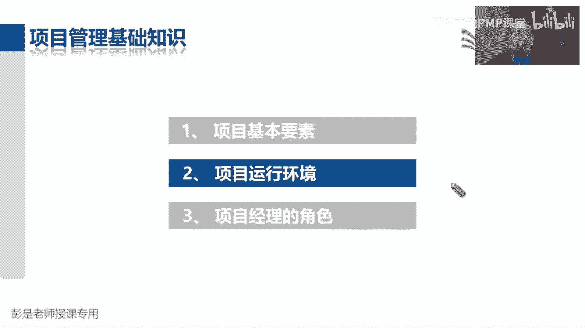

轻松加愉快，基本上听一听，没什么需要去背的东西，就这么三大块，事业环境因素和组织过程资产，然后呢说了一个组织系统。

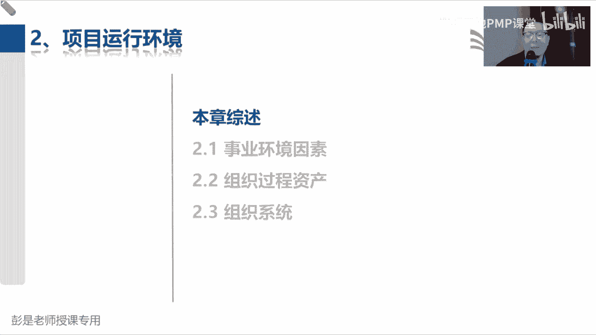

就涉及到组织架构这种东西啊，先看概念看就可以了啊，不要低头做笔记，因为笔记不着急的，所以呀，项目所处的环境，可能会对我们的开展产生有利或不利的影响，这些影响的两大主要来源，叫事业环境因素和组织过程资产。

事业环境因素源自于项目的外部说，他可能会对我们的工作产生影响，组织过程资产源自于企业内部，可能把露拉不垫了，总之他的中心思想是什么呢，事业环境因素会对我们的工作形成限制，组织过程资产它的关键词啊。

就是每个企业特有的一些东西，所以可以猜猜了，大家工作中什么东西会对工作产生限制和约束，工作中生活中都有啊，什么东西会让我们很多事不敢做呢，这就这个东西吧，法律法规还有这种东西啊。

嗯他就会对我们的工作形成限制，形成约束啊，对不对，不能违法乱纪，不能不能违法乱纪啊，唉这就是事业环境因素，大概先粗暴有个印象啊，那企业特有的一些东西都是什么呢，每个公司你面试的时候流程一样吗。

入职的流程一样吗，不一样吧，请假的流程，报销的流程，这些企业内部的政策流程，程序标准规范都不一样，因为它是结合每个企业的实际情况，定出来的这些游戏规则，哎这就是企业的特产。

包括每个企业积累沉淀下来的这些什么经验，教训啊，知识啊都不一样啊，这都是咱自家的特产，这就叫组织过程资产先有这么一个大概印象。

后面那就简单了，所以给了一张图说事业环境因素可以分成外部，内部组织过程，资产可以分成两大块，过程政策程序，第二呢就是组织知识库，再猜好搞定一个啊，组织过程资产是每个企业特有的。

那我们企业特有的知识不一样，你搞软件开发的公司和我们做梅菜扣肉的工厂，我们积累沉淀下来的知识是不一样的，你们会搞软件，我们会搞预制菜，那每个企业的过程政策程序流程标准规范，规章制度又不尽相同。

因为它要结合每个企业的实际情况，定的这种东西，所以这都叫组织过程资产，那事业环境因素，刚才我们说这类这些东西啊，会对我们的工作形成约束，那比如说外部能想到的就是法律法规，那什么是内部的事业环境因素呢。

什么是内部的事业环境因素啊，会对我们的工作形成限制约束的东西能猜到啥，比如说咱咱给大家上课，为什么不在公司的多功能厅呢，为什么要来要要要来外面租租教室啊，因为你公司穷，因为我们没有。

所以你公司的什么设备呀，设施啊，包括用的系统，用的各种软件，包括企业的文化这些东西，这些东西包括员工的能力，很多东西啊，也会对我们的工作行程限制形成约束，我们公司只能生产梅菜扣肉，没有鱼香肉丝的生产线。

所以呢这活儿我们接不了诶，这就是内部的事业环境因素，好知道了这个中心思想。

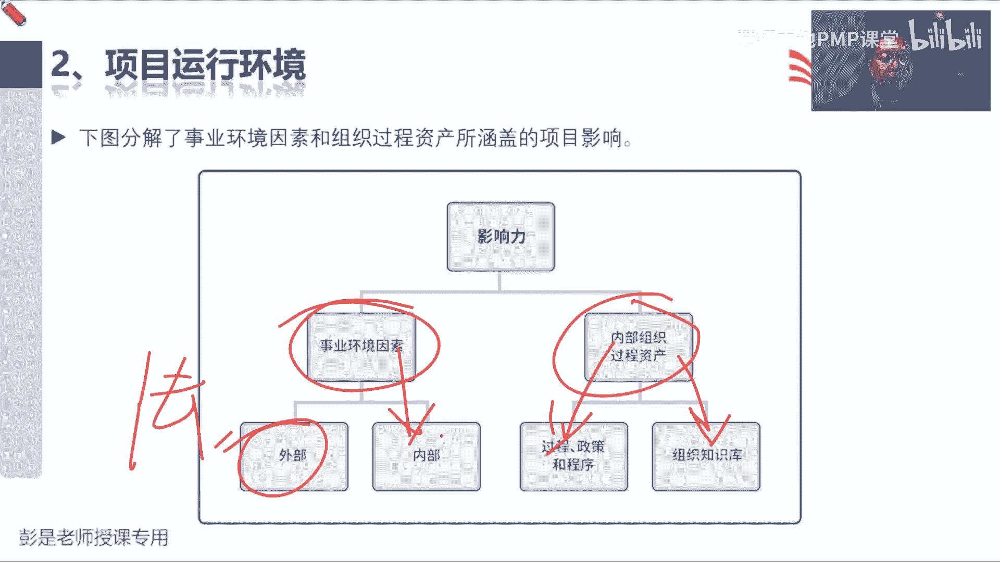

知道了这个大道理，再看看具体的文字就差不多了，所以事业环境因素是指我们不能控制的，会对我们产生影响，限制和指定的各种条件，它可能来自于组织的内部和外部，就是企业之外的，就称之为外部环境因素。

比如说法律法规，企业内部的环境因素，那就是我们企业的设备设施，员工能力这种东西，我们企业只有一条，只有一条梅菜扣肉的生产线，没有鱼香肉丝的生产线。

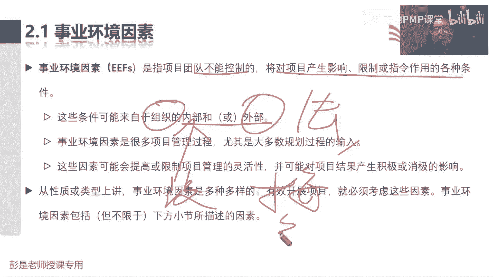

所以呢这个单我们接不了，就这东西，那它具体包括什么东西，不需要大家去背了，所以书上后面给出了例子啊，以下是组织内部的事业环境因素，这东西都不用去背，都是看一遍，听一听，有印象就够了。

总之这些东西会限制我们的工作，比如说企业的文化，比如说企业的文化，为什么会限制咱呢，什么是企业文化呀，什，么是企业文化，什么是企业文化口号，进取型组织，哎这差不多了啊，人都有啥呢，个性企业有企业的个性。

有的企业人家就是吃不死人就可以了，这就是我们这个调性就这道理啊，所以每个企业大家的什么使命啊，愿景啊，价值观啊，信念啊，文化规范啊，这都不一样的，哎了解就够了，像设施资源的地理分布，我们的我们的工厂。

我们的工厂对吧，在什么位置唉，太远的地方，这活儿我们接不了啊，以此类推了，包括什么基础设施啊，软件呐，资源的可用性，甚至包括员工的能力好，这些东西会对我们的工作行程限制和约束。

我们公司啊都是会做梅菜扣肉的人，像看病这个活儿接不了，为什么呢，因为没有人会看病，嘿他也会限制我们的工作，这都了解就够了。

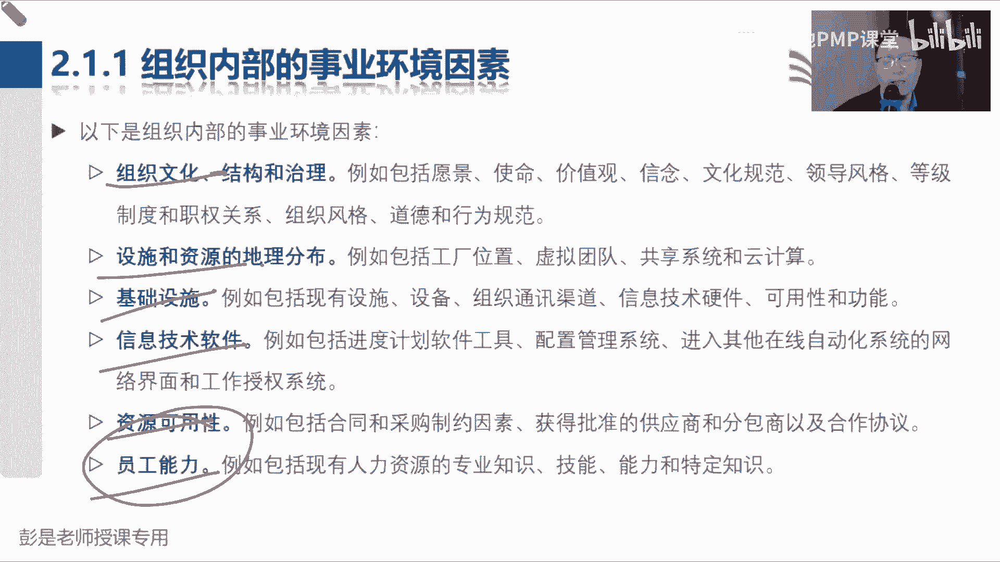

那外部的事业环境因素，这也是了解就可以了，你能想到一个法律法规就已经很棒了，什么市场条件呐，社会文化影响啊，以此类推，这都不需要去背啊，不太会考，那再往下。

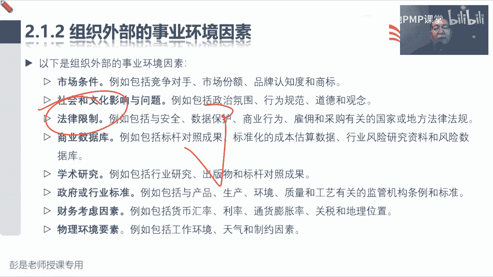

第二大块叫组织过程资产，脑子里面脑补下来过程的过程，政策程序标准规范不一样，第二大块呢就是各种各样的库，所以组织过程资产是执行组织特有的并使用的。

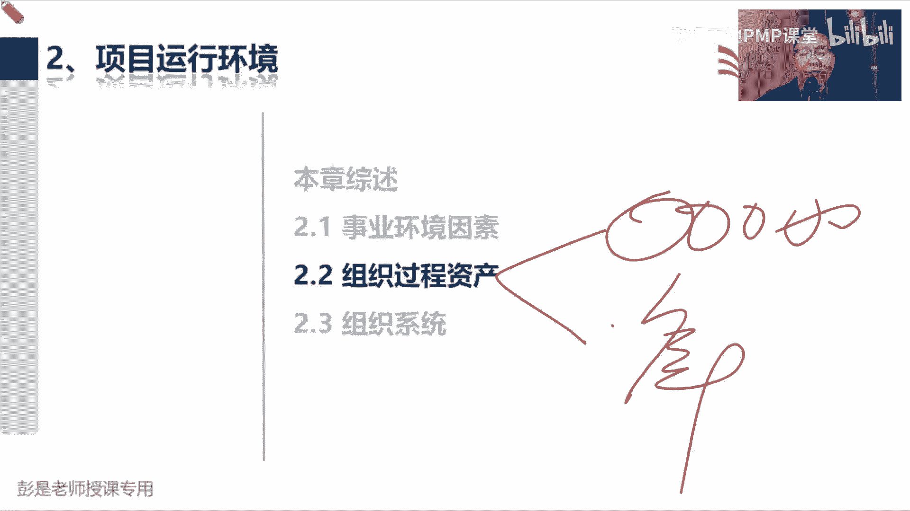

这些计划过程，政策程序和知识库，这个东西是企业特有的，所以呢既然是咱自家的东西，我们就可以对它进行调整，进行修改，好接下来再想一想啊，看看这句话，说组织过程资产是许多项目管理过程的输入。

变成人话就是啊咱干活之前要想一想，第一什么呢，事业环境因素，对不对，看看有什么条件会对我们的工作形成限制，看看这活儿违法不违法呀，违规不违规呀，看看这活儿我们有没有能力接呀，以此类推吧。

考虑各种各样的事业环境因素，去思考这些东西会不会限制我们的工作，第二呢看一看组织过程资产，看看咱企业内部的这些政策流程，制度标准规范是什么东西，看看咱内部相关积累下来的这些知识，经验到底是啥嗯。

所以接下来就是一对好朋友，从现在开始，事业环境因素，组织过程，资产绑定，理论上来说，我们49个管理过程都可以把它作为输入，干啥活之前都看一看世界环境因素，看一看做值构成资产做参考。

然后第二个知识点就是说，由于这个玩意儿是咱自家的东西，所以在整个项目期间，我们可以对它进行必要的更新和增补，反正咱自己的东西想改就可以改。

记住这这个结论就完事了，好，那再往下说，组织构成，资产可以分成两大类，叫过程政策程序，组织知识库，这段文字有一个小逻辑，听一遍有印象就够了啊，说啊第一类资产的更新，通常不是项目工作的一部分。

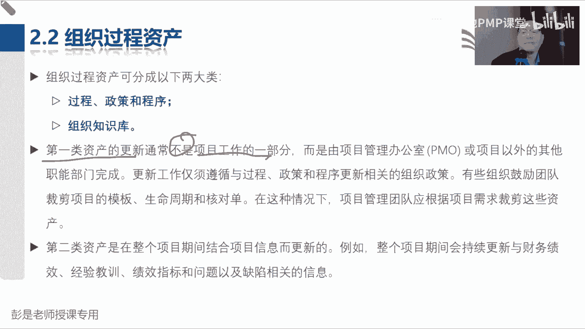

刚才刚说完，说在整个项目期间，这个玩意我们可以对它进行必要的更新和增补。

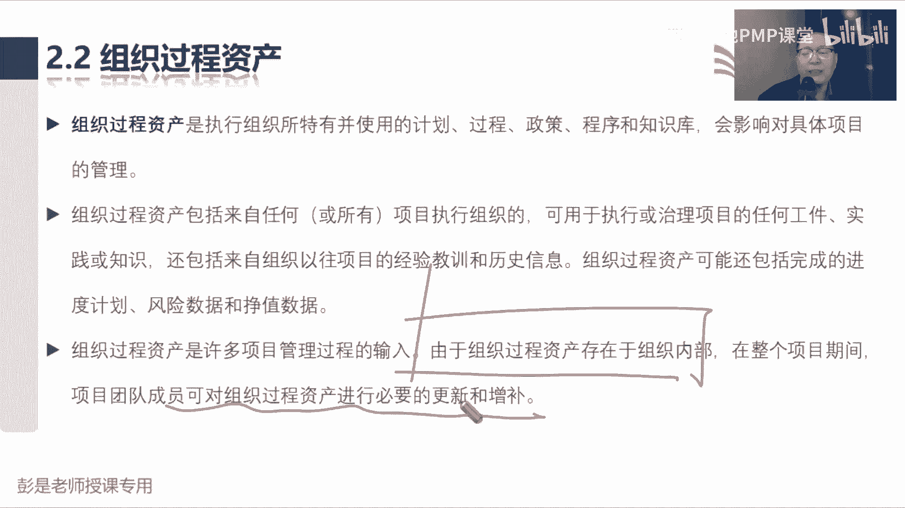

那现在又说啊，说这个东西啊更新通常不是项目工作的一部分，什么意思呢，加两个字就好懂了，说你要改公司的流程，政策程序，标准规范，改这个操作，执行更改执行更新，这个操作不是咱们分内的事情。

不是项目工作的一部分，这活儿通常谁干呢，职能部门吧，咱也不知道谁干爱谁，谁跟咱没关系，跟咱没关系啊，总之我们是发起更新的申请申请，去调整我们公司的政策流程标准，政策规范这些东西到底谁去落实，怎么审批。

谁来执行，咱切这些事情不在项目范围之内，我们只是发起申请，仅此而已，那第二大块组织过程呃，组织知识库这个东西就可以更新了，我们有必要有责任，有义务去总结相关的什么经验教训呐，可以把它放到我们的组织过程。

资产告诉全公司的同事，不要再犯同样的错误，这个更新是我们份内的事情，这段文字就想说这个道理还是权力的边界，如果想申请去调整我们企业的流程，咱就发起申请就够了，这个流程到底怎么改，走什么走什么审批。

这是人家职能部门干的事情，他去落实，他去执行，我们只是申请，第二大块呢是知识库，这是我们权力边界之内的事情，我们可以随着工作的开展，及及时的更新这个东西。

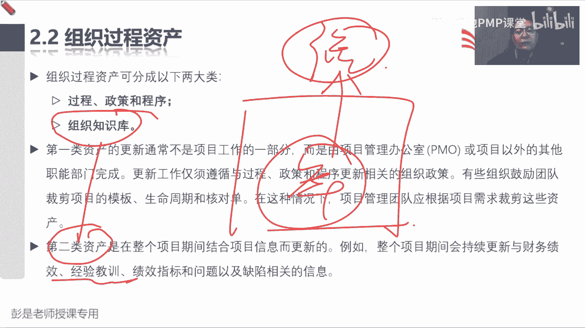

好知道这个意思，再往下书上给出了一大堆的东西啊，这一大堆的东西需不需要背呢，不需要需不需要反复看呢，也不需要看一遍了解就可以了，但是接下来带出来的另外一个知识点要掌握嗯，就是说组织过程资产。

组织过程资产通常是每个企业特有的一些过程，政策程序，还有知识库，那组织过程，资产有没有可能对我们的工作形成约束和限制，组织过程资产，有没有可能对咱们的工作形成限制，形成约束呢，有吧，所以比如说这些东西。

人力资源政策会不会限制我们的工作，我们公司今年定的政策是什么呢，985211研究生本科生都不看，这东西会不会影响到你招聘会吧，哎像什么健康啊，安全呐，保密啊，这东西啊也可能会对我们的工作形成限制。

形成约束，所以学到最后啊，千万不要死记硬背了，因为组织过程，资产。

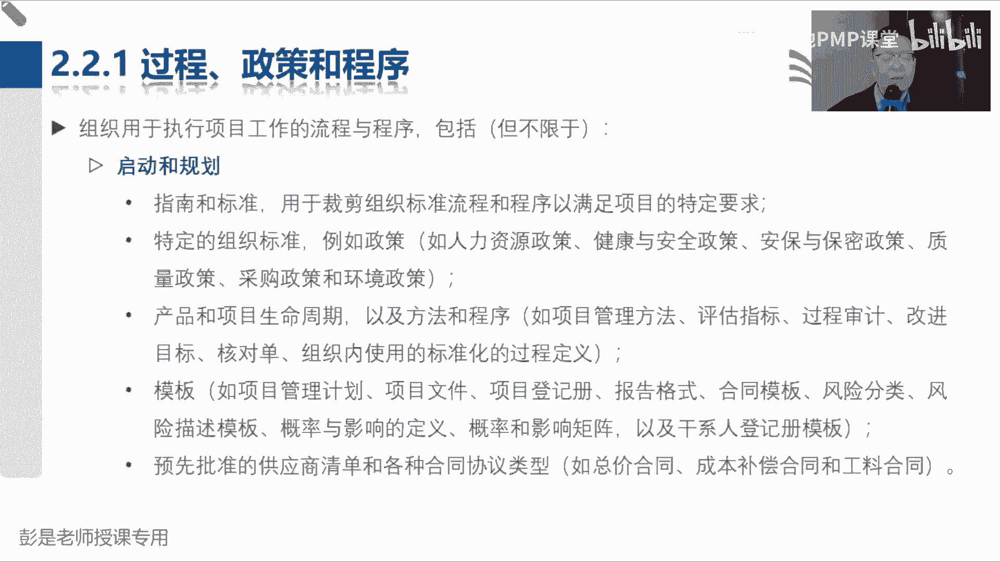

组织过程中，资产和事业环境因素，他俩不是泾渭分明的，不代表着说某些东西不会对工作形成限制，一旦我们发现公司的这些过程，政策程序会对我们形成一个强制性的约束，那这种情况下它就变成了事业环境因素。

哎就这道理啊。

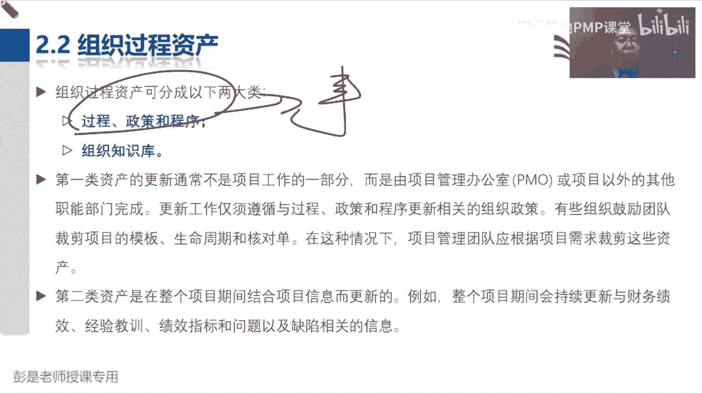

这就是中心思想，所以它具体包括什么内容，其实可以不要看了，就是关于这种政策呀，稍稍有一丢丢印象就够了，因为通常这种都整什么各种政策，可能会对我们的工作形成一些强制性的要求。

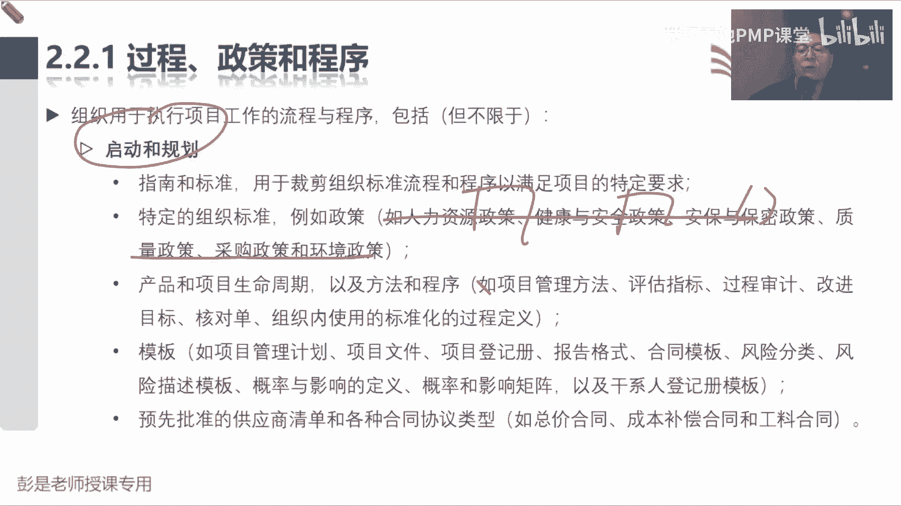

好再往下什么执行监控，这都想看就看，不想看可以不看。

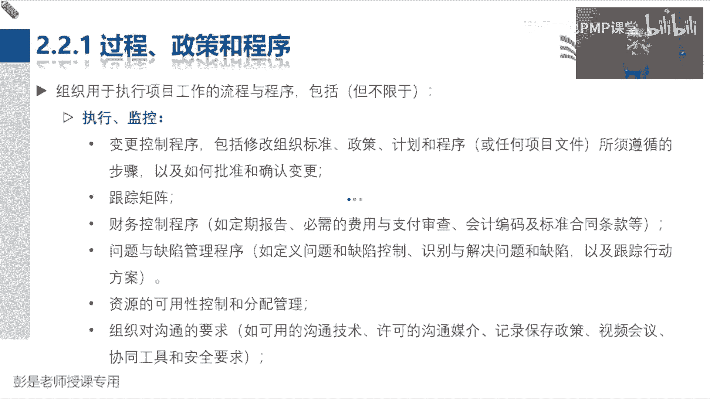

那222组织知识库，这段文字呢也不需要大家去背，不需要去背啊，哼从下往上看，以往项目的档案去死，什么数据库，数据库，数据库，知识库去死，财务数据库，总之积累沉淀的这些东西，唯一需要解释的就是第一个单词。

配置管理，这个大家不一定工作中都能接触的到，什么叫配置管理呢，能不能找到关键词啊，包括软件，硬件组件版本以及巴拉巴拉各种各样的基准，所以粗暴理解配置管理就是版本管理，配置管理就是版本管理。

什么叫版本管理呢，大家工作中写文档，写资料，编程敲代码有没有版本呢，这些文档资料每每改一版都要存一存，每改一版都要存一存，这样踏实啊，便于追溯啊，因为大家工作中，有没有遇到过这样头疼的问题啊。

写了个东西，老板说这儿这儿这儿改一改，除了第二稿，第三稿，第四稿，第五稿，老板最后说啊，咱就用第一稿吧，那如果没存档，如果没存档，这事儿不好不好还原回去啊，这就是配置管理的一项一项工作之一，除此之外。

还要软件硬件相互搭配，对不对，出什么出什么硬件，配什么软件，这都叫配置管理，所以大概有印象就可以了，因为这个东西需要或多或少带一些专业知识，所以呢考试啊基本上也不考，知道这个意思啊。

能够反应过来配置管理关注的就是版本。

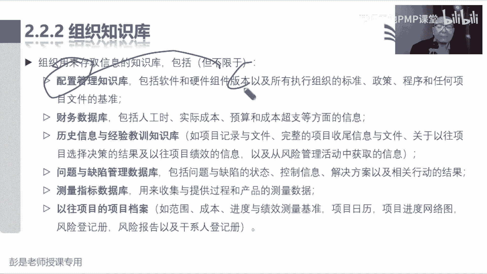

嗯好，具体内容大概就这么多，2。12。2，那接下来2。3组织系统，组织系统这段文字啊还是相对来说比较抽象的。

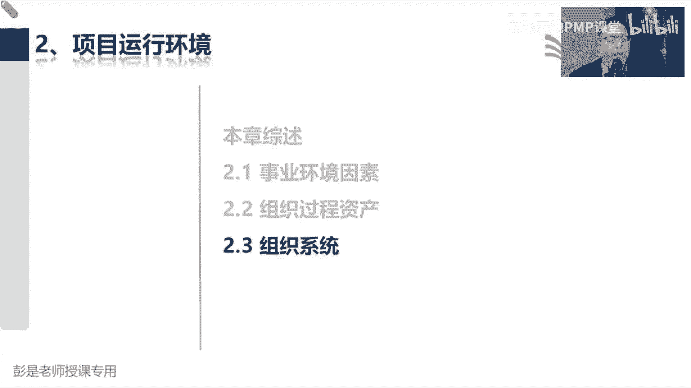

先搞定一个单词，基本上大部分内容不需要去背，听懂就可以，很多内容也不需要去看，先搞定一个单词啊，什么叫治理，什么叫治理，说运行项目时，需要应对组织结构和治理框架带来的制约因素，为了有效高效的开展项目。

我们需要了解什么职责中责职权分配情况，有助于我们利用什么权利影响力巴拉完成项目，什么叫治理呢，最粗暴的理解就是权力的游戏，因为大家要想道理啊，看PPT再再回顾一下，等我找一个稍等下代的车购买了。

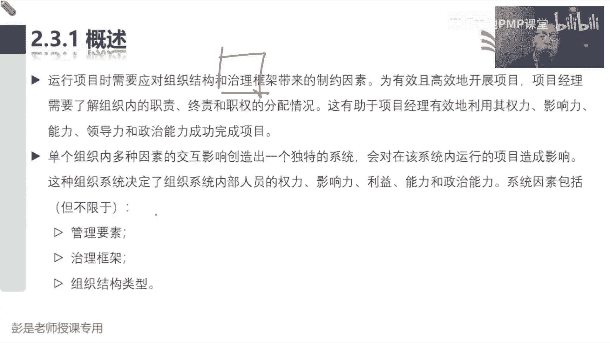

前面我们把怎么干活梳理清楚了，我们要去创业，成立一家成立一家生产梅菜扣肉的工厂，我们要先定目标，愿景使命价值观，一年回本，两年实现个一个亿的收入，3年我们就净利润十个亿，4年以后走向全球。

变成走向人生巅峰，目标愿景使命价值观定好了之后，接下来做企业的战略规划，去思考怎么实现这个宏图大业，战略规划一旦敲定了，我们就知道未来我们可能需要开展哪些项目，以及我们工作怎么运营，就有了项目和运营。

再往下呢就是分析一些存在着依赖关系的东西，把它拉到一个圈圈二里，变成了项目集管理，最后呢要做的事这么多，有的是重要，有的事不重要，所以呢我们要事分轻重，缓急排优先级，把符合战略的东西放到一个圈圈里。

就有了项目组合，这种管理方法，事儿都捯饬清楚了，接下来要思考啥呢，干活的是人呐，人一多就要怎么样呢，画组织架构了吧，嘿张三李四王五赵六，你们都负责保安，然后张354王五赵六，你们负责保洁。

张三李四王五赵六，你们负责采购，就要分组织架构，组织架构最重要的作用是啥呢，权力的游戏吧，什么事儿谁说了算，什么事儿谁说了算，嘿对吧，总经理负责干啥，然后你们各个部门经理是吧，包括车间主任。

你们都负责干啥，员工负责干啥，这不是全责的分配吗，因为对企业来说最头疼的一个问题啊，就是权责不清就会踢皮球对吧，这事跟我没关系，这事不归我管，你找张三，张三说，三个和尚没水喝，就这个道理，所以组织治理。

组织治理就是为了避免权责不清，大家干活互相推卸对吧，互相互相互相推卸责任的，那我们要定很多东西了，政策流程制度程序标准规范，流程也是权力的分配啊，对不对，在流程里边，谁负责提交，谁负责审批，谁负责复核。

以此类推，所以组组织治理与组织治理，最终的主要中心思想，就是把权责给人家收拾清楚，分配清楚权力的划分，权力的游戏，这样我们各个同事，各个同事一到岗，就知道我这活应该怎么干了，就知道我需要和谁配合。

就知道就知道诶，这事找谁，就是让企业能够有效的良性的运作下去，这就是组织治理好。

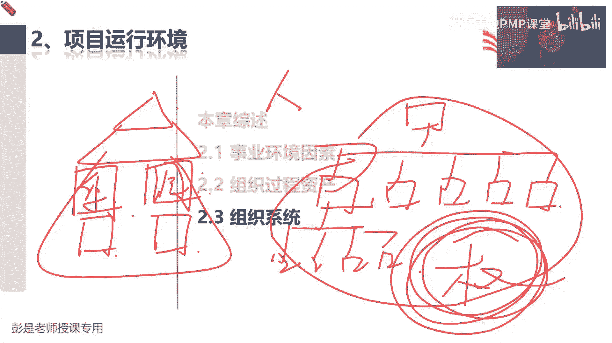

知道这个中心思想，再看这段文字就简单了，组织治理就告诉我们什么职责，权责权利权利权利唉，知道这意思够了，具体的文字不要求大家去记住它啊。

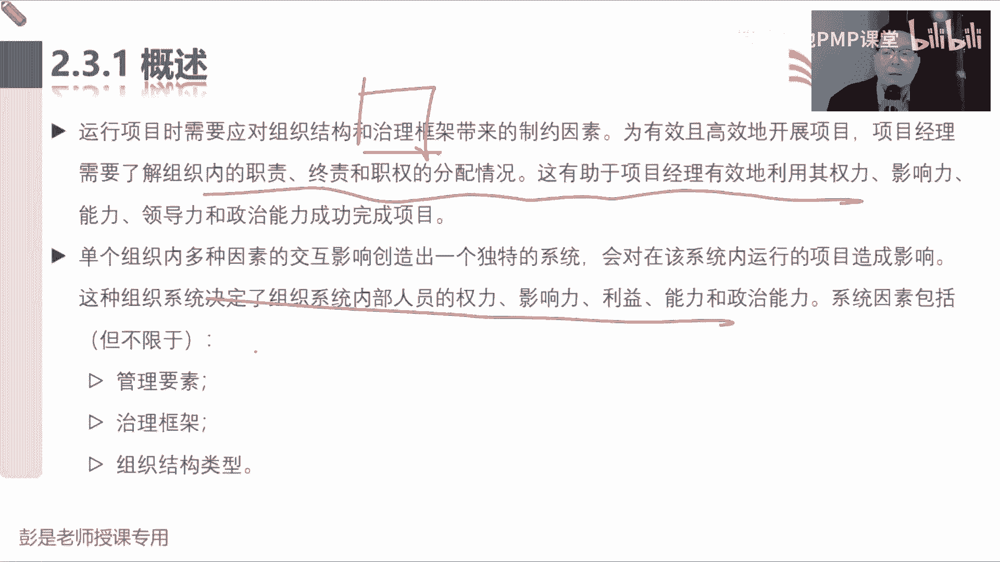

好所以说近期的BMI研究指明，治理是组织各个层层面，有组织的或者有结构的安排，他的目的是什么呢，确定和影响组织成员的行为，让大家知道什么事怎么干，什么事找谁这走什么流程。

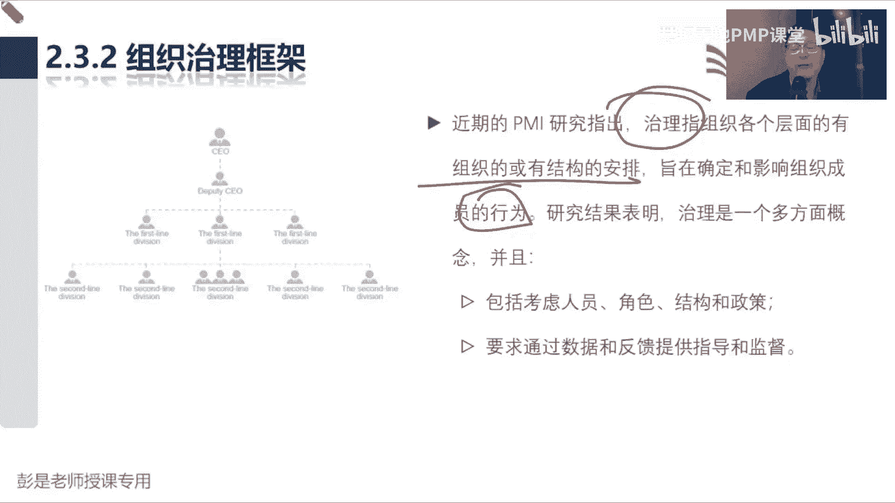

以此类推了，知道这个意思就够了，那治理是在巴拉拉后面的文字啊，其实都可以不看了，232组织治理框架。

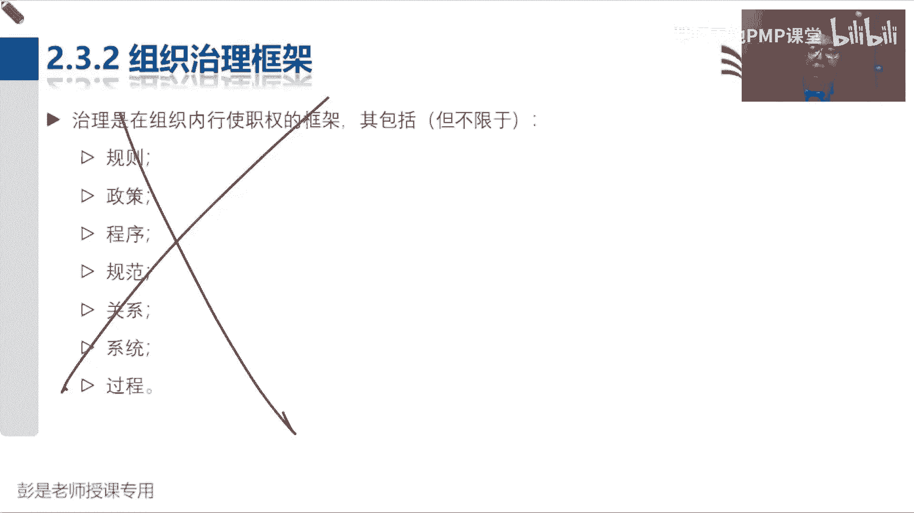

什么框架或影响都可以不看了，233管理要素在说什么呢，就是你要去思考啊，你这个部门到底怎么分，这个部门到底怎么划分，因为物以类聚，人以群分，什么样的人群，我们把它归到一个某一个部门里对吧。

就是行政负责干啥的，采购负责干啥，然后hr负责干啥，销售负责干啥，营销负责干啥，这段文字就是指导我们怎么做组织，组织的这种职能部门的划分，这段文字呢知道这个意思也可以不看了。

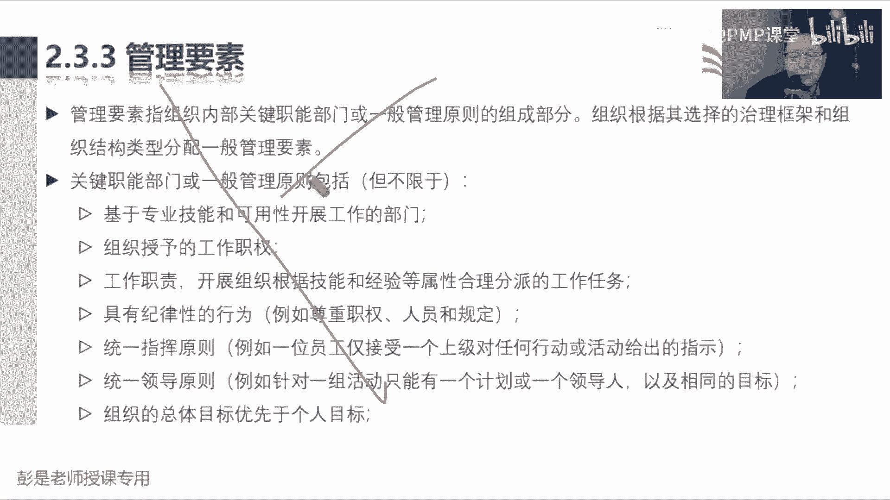

都可以不看了啊，咱又不考，只能只组织不考组织治理，它就是给我们做参考。

但是我们要知道啊，听完了这什么什么，前面这段21231233。

组织治理约等于权力的分配，那通常谁负责开展组织治理呢，谁负责开展组织治理啊，是员工啊还是领导啊，最有权最有权利的人才能够完成权利的分配，对不对，哎所以通常高层董事会啊，董事长啊，厂长啊，总经理啊。

他有权利，他能够才能够完成权力的分配，知道这个结论有印象就可以了，嗯好那再往下了啊。

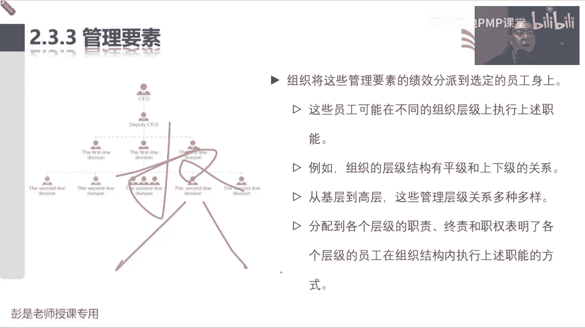

那234就需要大家掌握了，234再说组织结构类型。

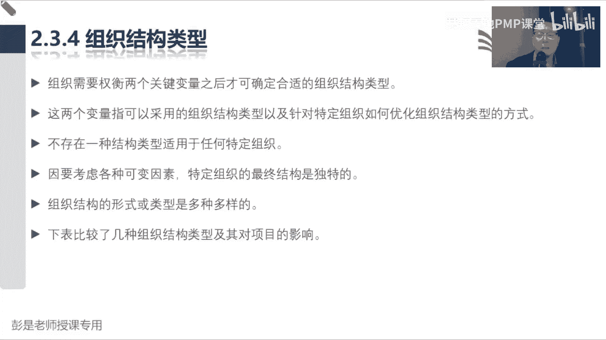

这段文字呢也不念了，就看这张表，这张表这张表先听，听完了之后啊，复听的时候你再写一写结论，其实就够了，先听啊，说第一种叫系统型或者是简单型，他工作安排是这样的啊，叫人员并肩工作。

人员并肩工作再强调一个什么呢，什么叫并肩，就说明，就说明变成大白话，就是大家都是兄弟，平起平坐，没有什么上下级关系，那它通常适用于什么样的场景，咱各位同学来学PMP，同学之间有上下级关系吗，对吧。

哎呦您学习好，您是领导以后怎么学习啊，我们听您的，您给我分配任务啊，不必要吧，大家都是兄弟，二平起平坐，平起平坐就通常适用于这样的场景，或者是呢创业型的公司，随便找几个什么联合发联，联合发起人合伙人。

嘿大家都是兄弟，平起平坐，没有什么上下级呀，所以这叫去中心化，其人少的时候可以考虑这么做啊，所以通常初创型的企业可以考虑这么做，这人一多平起平坐会有什么后果，说我们公司6000人平起平坐，大家都是兄弟。

这就是最终，最终这个玩意儿带来的负面效果是什么呢，6000人一人一个想法，那大家形成决策的这个周期，可能一辈子都难以达成共识啊对吧，哎决策就墨迹了哎所以人一旦多了，就自然而然需要分层级，人分369等。

很有必要啊，所以通常人不多的时候可以考虑平起平坐，人一多就不行了，那就需要收拾收拾做治理，然后就变成了组织架构，公司分成多少个部门呐，分成多少个事业部啊，以此类推，谁是员工主管经理总监，以此类推。

说清楚这个权利的分配，否则权责不清就乱糟糟了，这是第一种，大概听完了有印象就够了，未来我们学到的敏捷团队就是这样一个结构，敏捷团队大家都是兄弟平起平坐，没有上下级，搞定了这个之后啊，再听五个单词。

然后呢听先听啊，说呀，咱前面讲过说这个项目的规模呀，有的事大，有的事小，那有没有必要，有没有必要，不管是大事小情，给项目经理的权利都是一样的，变成再大白话对吧，公司大门坏了，换把锁哎。

公司董事长亲自挂帅，我是这个项目的项目经理，然后我们召集团队想办法完成这个项目，实现目标，达到预期的成果，没必要吧，这是浪费啊，所以我们要根据这个事情的规模和复杂程度，根据这个事情的重要性。

根据这个事情的价值去分析，什么情况下需要给项目经理多大的权利，你以为有的项目啊一个人就可以完成，有的项目呢几个人就可以完成，有的项目呢需要跨部门协作，跨部门协作，跨部门协作，如果项目经理没有太大的权力。

你会怎么样呢，这是大家实际工作中最头疼的问题，啥事都做不了主，啥事都要请示领导，然后呢和各个部门去，由领导组织协调，我们在下面就听信停气啊，这种情况下，项目经理如果权力很小，权力很低，你可能推动不进去。

推动不了这个事情啊，所以呢这就是这段文字想告诉我们这个道理，有的项目啊给项目经理啊，基本上没什么权，可能也没什么影响，但是有的项目需要给项目经理更大的权利，那通常权力从小到大就有了这么五个单词。

权利最低的就称之为叫职能型组织结构，在职能型组织结构之中，项目经理P也不是就这样去记啊，基本上没什么权利，所以它叫资源的可用性和项目经理的批批准，都写的是包括资金，包括预算。

哎我们极少或是无极少或者是无，并且呢谁管钱就说明谁有谁管钱，说明啥谁有啥话语权吧，哎所以在职能型组织结构之中，是职能经理管预算，那人家手里就有权，这个大家就参考你个人的家庭就能理解了，你们家谁管钱。

就说明谁有决策权，对不对，就这个道理啊，那好职能行就是最惨的，最惨的，好一点的是什么呢，若矩阵，在弱矩阵组织结构之中看第一第一职能经理，职能经理管钱，所以呢职能经理手里有权，咱仍然啥也不是。

在这种组织结构之中，我们能掌握的资源很少，对不对，很少啊，比那个智能型好一点点，听一听就完事了，什么时候开始正儿八经的翻身，把歌唱呢，再往上就叫平衡矩阵，均衡矩阵他直接写了。

谁掌握预算的混合混合的意思是什么呢，项目经理和职能经理各自掌握各自的预算，双方联合掌握项目的预算，平起平坐，所以有的家庭对吧，我管我的钱，我媳妇儿管他的钱，双方一起各管各的哎，平起平坐，这就是混合型。

平衡型，是平衡型组织结构类型，平衡矩阵，再往上呢就是强矩阵，强矩阵组织结构之中谁管钱呐，项目经理吧，哎咱单独掌握项目的预算，最后最大的是什么呢，项目导性，项目导向，项目导向也就是项目型。

项目型说我们掌握的资源什么高，到几乎拥有全部，基本上所有的该有的权利基本上都有了，然后呢仍然是项目经理掌握项目的预算，好听完这段知道大概意思啊。

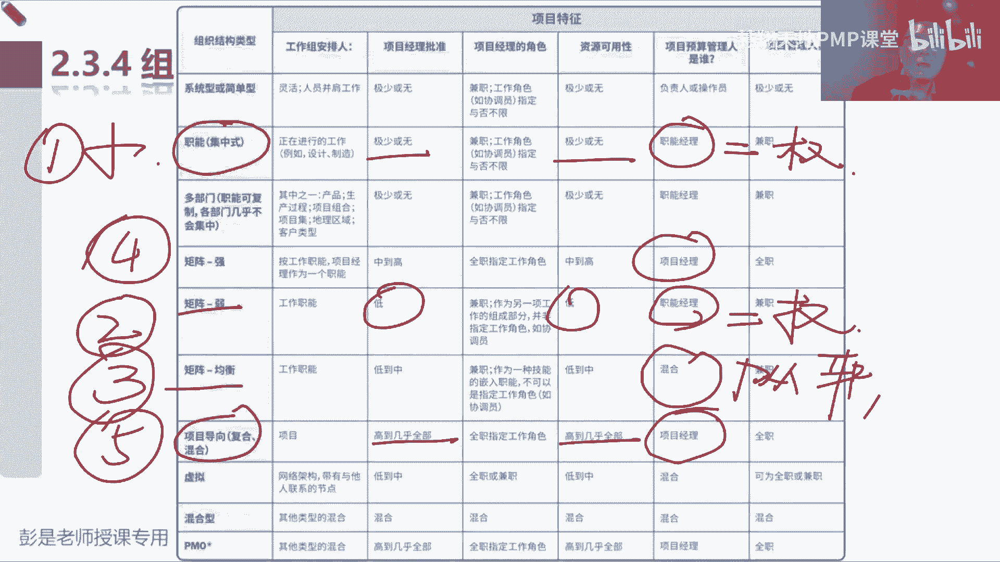

最后一总结就变成了这样，在职能型组织结构之中，我们是最惨的，所以我们在项目上的权利小于职能经理，然后弱矩阵里面仍然是职能经理，掌握项目的预算，所以我们在项目上的项，他的权利啊也是小于它。

在平衡矩阵双方联合掌握项目的预算，所以呢权利是相等的，强矩阵，项目经理在项目上的权利是大于职能经理的，因为咱单独掌握项目的预算，咱单独说了算啊，咱在项目上的权利大于职能经理，但不代表着说职能经理归咱管。

这是两回事，只是说项目上的事儿咱能做主了，最后项目型就是职能经理归咱管，项目经理直接管理着所谓的职能部门，职能部门都挂到项目组里面去了，这叫只管，最后记住这个结论就够了嗯，啊什么是职能经理啊。

纯粹的字面意思啊，就是各个职能部门的好，所以只要记住这个结论就可以了，我们能掌握的资源就从少到多，我们掌握的掌握的权利从小到大，掌握资金，掌握预算来判断权力大小，小于小于等于大于和直接管理。

然后其他的中间没说到的什么多部门呐，这是巴巴拉，这都可以不看了，多部门就是多个事业部这种东西啊，什么虚拟团队，这讲到资源这一章再说，混合型的就是看情况，然后PMO呢后面会单独讲，不太需要刻意的去背。

并且呢这些组织结构类型啊，现在基本上考试的时候也不大会考，这了解就够了，那再说回实际啊，实际工作实际工作权责不对等，通常咱怎么说呀，大家实际工作中，实际工作中权利和责任是一个什么现实情况呢。

权力其实做不了主，啥都说了不算，所以叫权利薄的项，然后责任呢出了事儿全都是你的锅吧，责任重的像山，好停一停就完事，这就是关于组织结构类型这种东西啊。

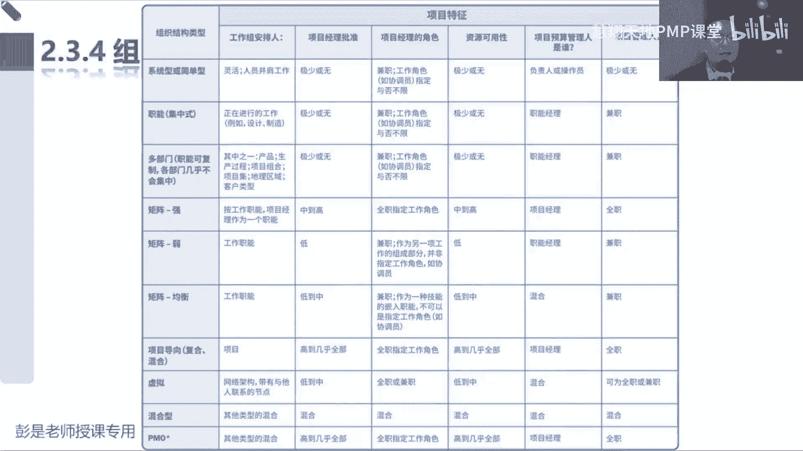

听一听，做做题八九不离十，二，考试也不大会考这些纯概念了好，所以其实就是就是告诉我们企业的领导啊，你要去思考了什么事啊，给项目经理多大的权利，因为有的事情啊，项目经理去去组织系，去联络一下。

去协调一下就够了，需要职能经理去做主，比如说职能部门内的这种项目，这种情况下说，比如说我们是什么来着，我们是梅菜扣肉的工厂好，我们有一个部门叫产品部，产品部的主要工作啊。

是研究我们到底做梅菜扣肉还是鱼香肉丝，关于这个产品的分析，产品的设计，那现在呀公司让我们说行情不好，你们再设计一款新产品，这种情况下，谁是这个事儿的负责人呢，就是产品部门的老大。

然后呢他任命他的员工张三，你是这个项目的项目经理，这种情况下，张三呢就是联络员，协导员，就是那种职能型弱矩阵，他可能做不了主，但是呢很多事情需要他去沟通，去协调，他在项目上的权利就不可能大于职能经理。

因为人家是老大，对不对，他把权利交给你，仅此而已，来听听一听，知道这个意思啊。

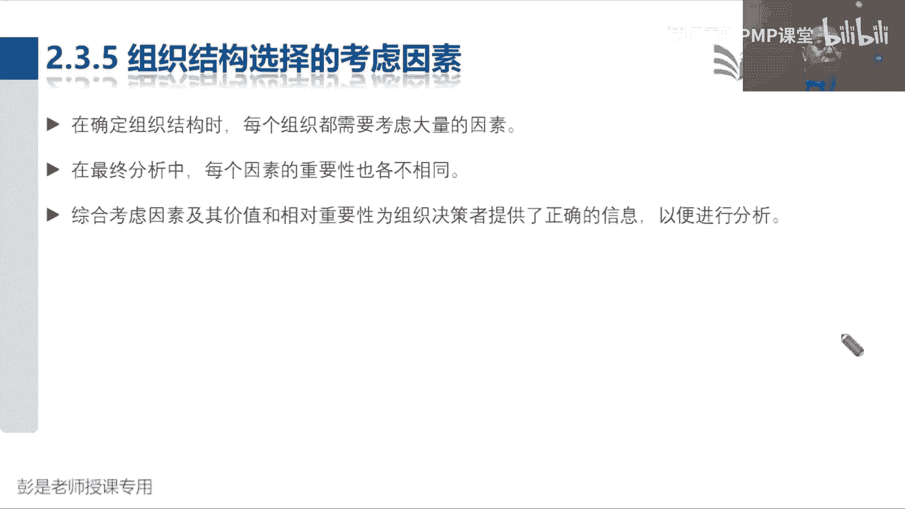

好所以考试来说考试来说，未来包括看书，我们是哪一种组织结构类型啊，是工作中权责不对等啊，啥事都做不了主啊，那所有选项都找最怂的那个选项吧，反正咱说了也不算了，这好像不科学啊，所以考试潜规则默认是什么呢。

平衡矩阵，因为从这种组织结构开始，我们在项目上真正有权利了，最惨的只能行弱矩阵，通常不大会考不大会考，在这这种组织结构之中，这事儿你应该怎么管。

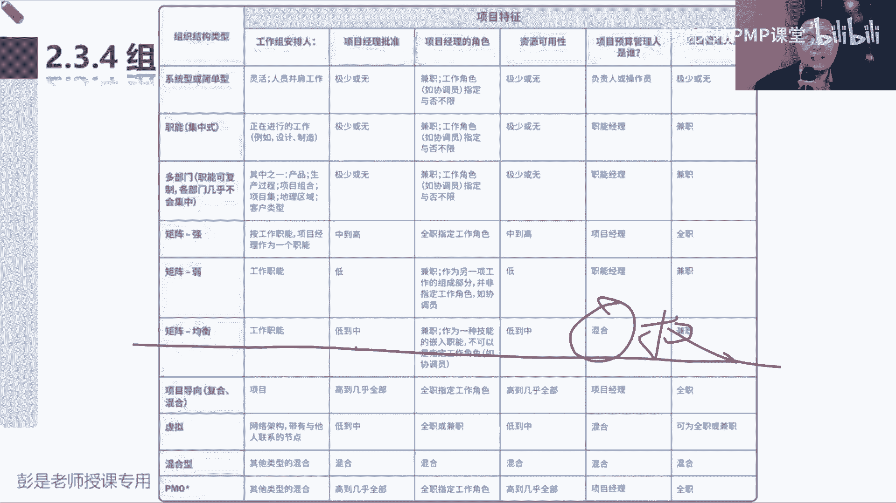

好再往下235这段内容大家就轻松加愉快了，这种东西啊，大道理听起来很痛苦，变成场景超好理解，怎么写，在我家我媳妇儿管钱，我啥事都说了不算，我媳妇今天跟我说呀，你看看有什么想买的衣服，嘿这个事交给我了。

但是我有决策权吗，没有对吧，我看中了一件衣服，2000多，媳妇说不买，太贵了，我没有决策权，对不对，这种情况下，我就是一个智能型弱矩阵的组织的项目经理，我说了不算像职能经理说了算，所以呢我需要早请示。

晚汇报，对不对，让领导来做决策，我呢只是联络负责采集采集信息，给领领导做做汇报，就这个道理吧，没有决策权，好打开粗暴的理解啊，那有的家庭呢就是双方平起平坐，可能经过父母，父母不就是高层吗，对吧。

天天打天天打父母，最后一拍板组织治理，你们俩平起平坐以后，你们俩一起来商量，说商量着干呢，那我们就有每个人有每个人的权利，掌握一部分预算，混合掌握项目的预算，好粗暴，理解啊，好那再往下二三。

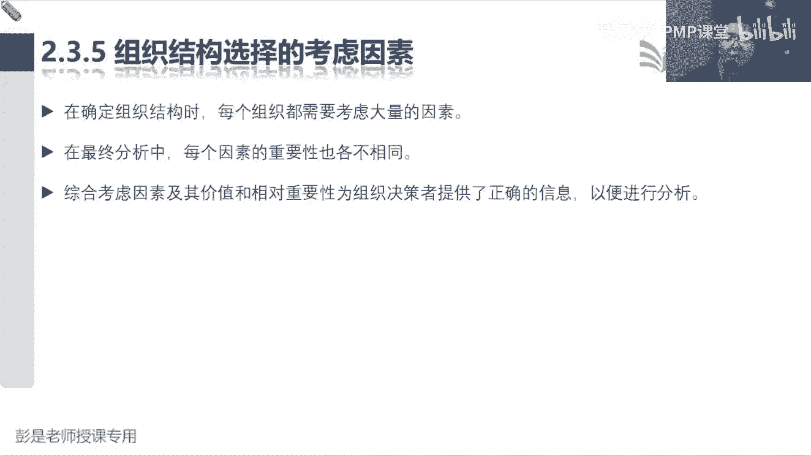

我后面的这段文字啊，想看就看，不想看可以不看了，所以选择组织的因素。

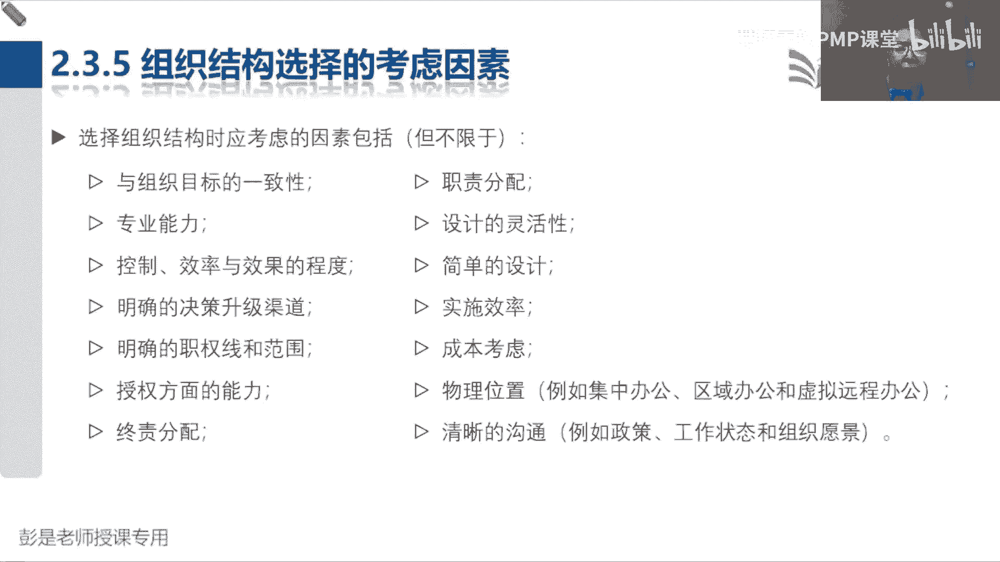

巴拉巴拉巴拉巴拉巴拉，没什么东西啊，可以不看的啊，236这就不能不看了，这是大家需要记住的一个重要的知识点，项目管理办公室是对和项目相关的治理过程，进行标准化，并促进资源方法论。

工具和技术共享的一个组织结构，第一个小问题，这个部门这个部门他是个职能部门啊，这个部门的主要工作是什么呢，谜底就在谜面上，向项目管理，所以它是促进项目管理的这些方法论，用什么方法去管项目啊。

这些方法标准不标准的规范，不规范的出一些项目管理相关的规章制度，政策程序流程标准规范这套东西，从而从而让各个项目经理按照我们这套规规则，按照我们这套规则去管项目，能够促进项目的成功。

所以他的主要工作就是项目管理，这些方面的经验的积累沉淀，变成公司的最佳实践，除此之外，它可以在项目之间去做一些促进，就像什么资源啊，技术共享啊，这是他的主要工作职责，两大块，第一块就是项目管理的方法。

除此之外还可以做项目之间的一些东西。

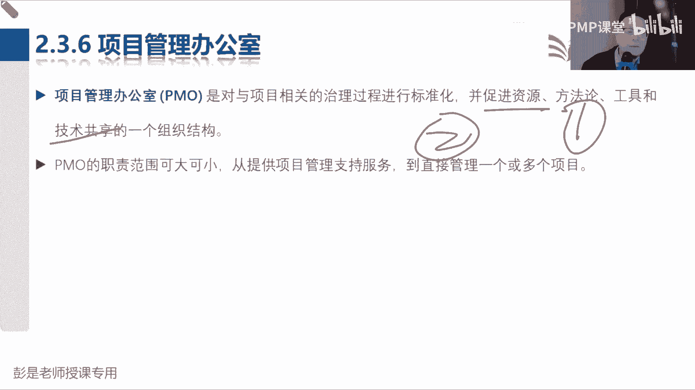

那接下来常见的三种类型就需要大家掌握了啊，叫支持型，控制型和指令型，支持型PMO担当顾问的角色，向项目提供模板，最佳实践培训，以及来自于其他项目的信息和经验教训，这个类型的PMO其实就是个项目资源库。

对项目的控制程度很低，关键词一标搞定，控制型不仅给项目提供支持，而且通过各种手段要求项目服从规定，权力就大了一点，力大了一丢丢，指令型是什么呢，直接管理和控制项目指令型PMO，下面带着一大堆的项目经理。

这些项目经理直接管项目，所以其实这三个单词啊最好学了，它就是PMO的一个进化史，随便想场景啊，随便想场景说呀，我们公司，我们这个我们这个梅菜扣肉生产工厂啊，现在打算成立一个PMO张三李四，王五赵六。

我们成立一个项目管理办公室，这种情况下，我们能不能直接做出强制性的标准规范，好像有点草率了，为什么呢，心里没底，对不对，咱就怂了，那我们就注重项目管理方法的沉淀，总结这个积累吧，这种情况下。

第一步你一定是支持型的PMO，对不对，我们给各个项目经理啊，是顾问的，总结出这些什么模板的最佳实践的培训的，你们爱听不听，反正呢我们也没经验，我说了不算，所以他对项目的控制程度很低。

那随着工作的开展对吧，过个两三年35年，我们的经验非常丰富了，怎么办呢，就净化提高我们的权利，因为什么呢，我们经验丰富，可以推出一些强制性的标准，让各个项目经理按照我们的标准，政策程序流程去干活。

就可以得到很好的得到我们的成果，就变成了控制型，因为有了一定的积累和沉淀，可以让工作标准化规范化了，再往上做大做强，哎我们招一大堆专职的项目经理，直接管理各个项目，大概知道这个意思啊。

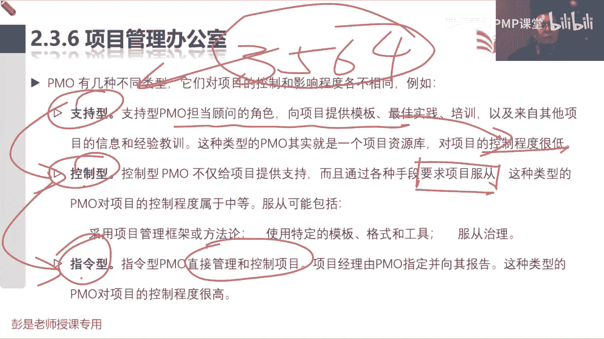

再往上走，那就是战略型的PMO了，参与到企业的战略规划，战略管理，项目组合这套东西，总之就是权力从小到大不断升级，不断升级这样一个过程，然后考试的时候也不大会考这个概念了，因为太简单了，知识行。

没有办法让大家听控制型，有办法让大家听话，指定型就叫直接管理控制项目。

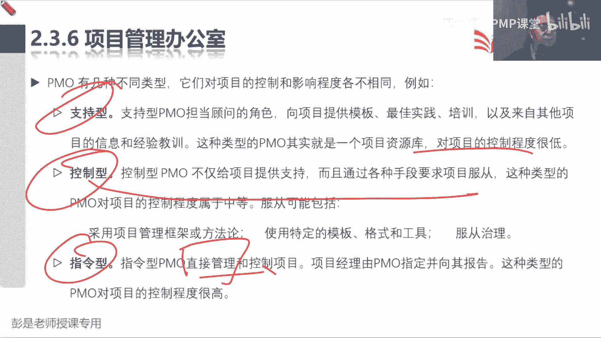

那除此之外，PMO还可以做什么事呢。

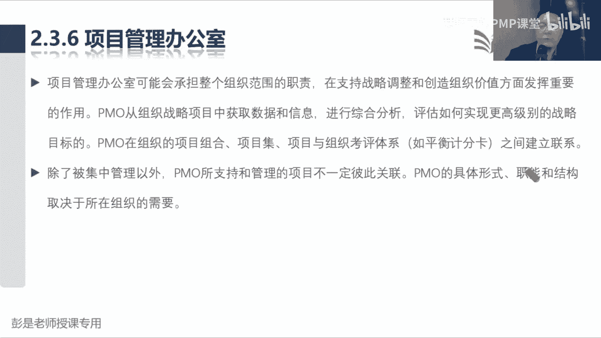

往后翻翻翻中间没念到的内容啊，就可以不看了，翻翻翻找到这一堆东西。

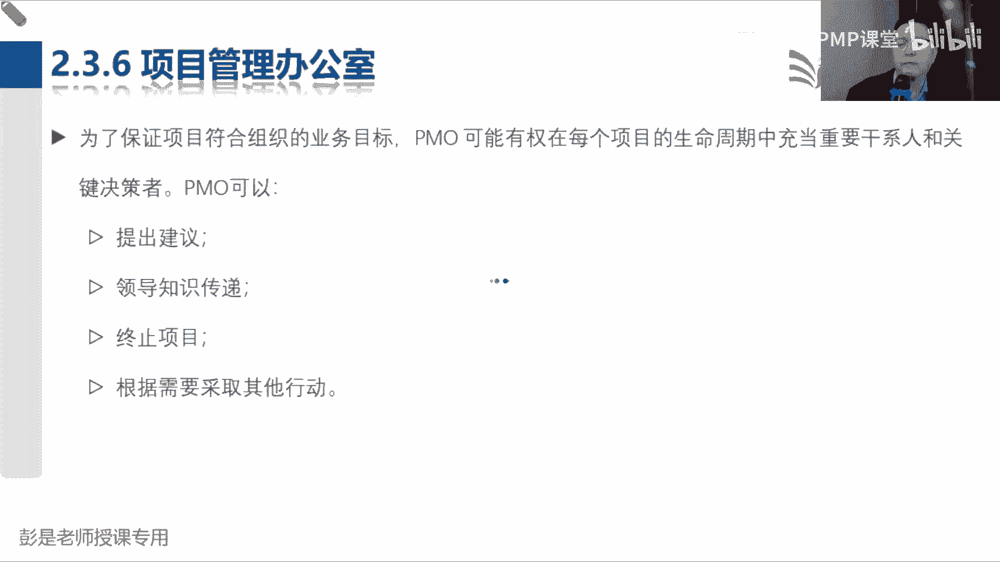

就这堆文字需要大家读一遍，基本上差不多了，总结归纳啊，PMO的一个主要职能是，通过各种方式向项目经理提供支持，包括方法论什么指导，培训就是项目管理方法，制定什么政策程序方法，然后最后两行就是。

直接对PMO所辖的全部项目的共享资源，进行管理，在项目之间去进行协调，对跨项目的沟通进行协调，这不也是项目之间吗，那接下来这个单词，各位同学工作中接触到吗，什么叫审计呀，一声叹息啊，看来被折磨的够呛啊。

审计审的是啥了，说监督对项目管理标准，政策程序和模板的遵守程度，审，这个大家完全就参考啊，参考什么，看新闻有没有看过啊，什么中央审计组入驻某企业是吧，央企啊，国企呀审的是什么呢。

你们实际工作中实际工作合规不合规，对不对，唉审计这个词超级重要的一个概念啊，未来我们讲到质量审计呀，风险审计呀，采购审计呀，都是干这个事儿，看看我们实际的过程是不是符合相关的，满足相关的标准，政策程序。

看合规性，比如说我们那个什么叫合规性啊，梅菜扣肉生产厂生工厂，我们要求啊工人上岗之前要先洗手，然后呢在工作的过程中要戴口罩，要戴帽子，防止你的头发呀口水呀喷到梅菜扣肉里，这就是我们的标准。

然后审计是干嘛的呢，就看实际情况呗，对不对，看看张三今天干活的时候有没有按照这个标准，12345在执行，看看李四干活的时候有没有按照这个标准，12345在执行，看张三李四实际干活的合规性，这就叫审计。

审计的目的是发现差距啊，缺陷啊，不足啊，总结经验教训，总结经验教训的目的又是什么呢，改进张三干活的时候没戴口罩，戴口罩啊，李四干活的时候没戴帽子，戴帽子啊，防止口水，头发掉到菜品里，防止引起客户的投诉。

对不对，他是为了总结经验教训，进行过程的改进，让我们越来越合规，不断的改进我们的过程，从而呢得到更好的结果，哎这就是非常非常标准的一套话术啊，这个话术一定要记住，因为后面质量审计，风险审计都是这个道理。

审计看合规性，总结经验教训，进行过程的改进，然后再往下就没东西了。

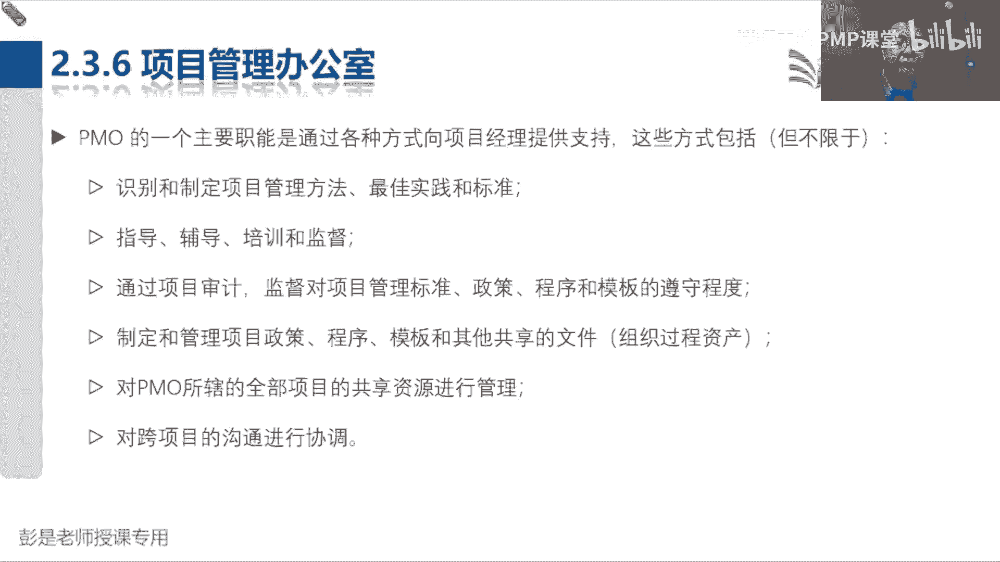

这就是第二部分。

好做做题，第二部分啊，听听蒙了听蒙了，做错题其实就够了，就这么几道题，车轱辘话来回说了，说某组织内办公室政治，曾对之前的项目造成负面影响，为防止办公室政治影响当前的项目，我们应该怎么做，选什么呢。

为啥不选C呀，老板让我干活，我说咱雇一个人，老板说要你何用，对不对，不行不行啊，聘请一个第三方的项目经理，推荐一个什么新项目经理，这都不合适啊，那什么叫办公室政治，把这个单词搞定，其实就好理解了。

什么叫办公室政治，哎你们看过什么宫心计呀，甄嬛传啊，这不都是办公室政治嘛，对好，所以办公室政治，办公室政治，权力的斗争，这事咱能不能hold得住呢，我们一个小小的项目经理对hold不住的。

所以看到权力这个事儿啊，就去思考思考，给领导提出我们合理化的建议和见解，领导啊，你得拍拍板啊，开展组织治理呀，说清楚这个权责的分配啊，好所以能选的选项就是A其他选项不合适啊。

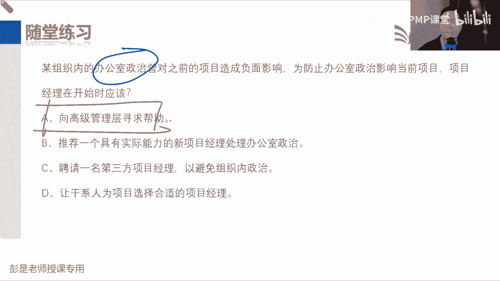

这个，选什么呢，C吧为啥呢，不对说明你读题读错了，前面第一句话就是废话，说他管理的项目所在地附近，正在新建一条新的水管线，读完后面这这句话你就会发现啊，其他人其他人正在建一个水管线，跟咱有关系吗。

没关系，它是干扰因素，公司政策要求，在他的团队继续完成这个项目之前，必须先填写一系列有关城市环境变化的表格，这是什么呢，公司政策要求必须形成了一个强制性的约束，所以他是事业环境因素。

公司的政策形成了强制性的约束，它就是一个事业环境因素了，刚才刚解释过啊，公司规定今年招聘招聘只能招研究生，必须招研究生，只招北大清华的，其他学校的毕业的生都不看的，他就对工作形成了限制，形成了约束。

所以叫事业环境因素好，那这道题咱再改一改，我加一个E选项，组织过程资产，五选一怎么选，公司政策，这肯定是一个组织过程，资产还必须又是一个事业环境因素，怎么选呢，是的话，第一，是谁是选C还是选E。

通过题目描述，现在它更侧重于强调哪一个属性，这是我们公司自己的东西，还是说对项目工作会形成约束，还在强调突出这个属性吧，所以这种情况下，没办法咬牙选还是C失业环境因素，他虽然确实是一个组织过程资产。

但是通过题目的描述，现在在强调他对我们的工作形成限制，形成约束这个特点，所以倾向于还是选C，这就是单选，咬牙选，咬牙选多选还纠结吗，如果让选两个选项，不纠结了吧，CE都选上。

这种解题的思路要慢慢的训练哈，一记住记住这一句话，超重要，重要的解题思路叫什么呢，永远找一个相对来说最合适的，选项永远找一个相对来说最合适的选项，仅此而已，城市环境不是关键词啊，做环评不是关键词啊。

关键词就在突突突出一个，这个咱不是考到底什么是环评，不是考这个专业知识，永远找一个相对来说最合适的选项，仅此而已，所以咬牙选，咬牙选在好的里面找最好的，在不好的里面找最不好的，考的就是这种快速决策能力。

大家有没有听过火车难题啊，嗯什么是火车难题呀，说你那个火车刹车失灵了，要么往左走，要么往右走，左边一个人，右边五个人，你往哪边开呢，五个人原来这就是个陷阱，对不对，往哪边开呢，你要考虑什么。

还不能杀人呐，这伦理问题呀，道德问题呀，这不好选呐，纠结呀，考试不要纠结，考试怎么选啊，考试怎么选，左边为什么呢，人少只有这么简单，只有这么粗暴，就这么简单，就这么粗暴啊，在众多选项之中。

找一个相对来说最合适的选项，仅此而已，不纠结，好慢慢再训练啊，所以这道题建议的答案是C，它是一个事业环境因素，因为公司的政策对项目形成了强制性的约束。

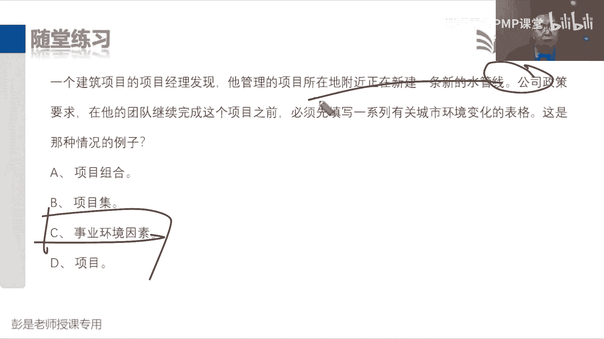

那你是一个弱矩阵组织中的项目经理，哪一个说法不成立，最惨的叫这个好一点的，叫这个再好一点的平衡，再好一点的，再好一点的项目，我们的权利从小到大，并且那是小于号，小于号等于号。

大于号和直接管理职能部门找选项了，A选项说在弱矩阵组织结构之中，你的成员向职能经理报告，这是对的吧，因为权力的权力的高低可以通过什么来体现呢，就是这个报告关系就是报告关系。

我每天干了什么事都需要向我媳妇做汇报，说明他权力比我大，对所以成员向职能经理做报告，这是对的啊，因为在项目上的权利，人家人家说了算的，B你并不直接负责资源，这是对的吧，在职能型弱矩阵，我们没什么权利。

管不了人，管不了钱，C职能经理做出的决策可能会影响你的项目，这是对的，他在项目当中决策权力大于咋纳，所以就是D你要对项目的成败负责，在职能型弱矩阵组织结构，是弱矩阵组织结构之中，谁负责呀。

经理咱默认永远是权责要对等，对不对，潜规则啊，默认永远是权责要对等啊，你谁有权谁负责，谁背锅，所以在职能型弱矩阵组织结构之中，我们没有决策权，那项目成败咱担不起这个责任，这个锅要甩出去。

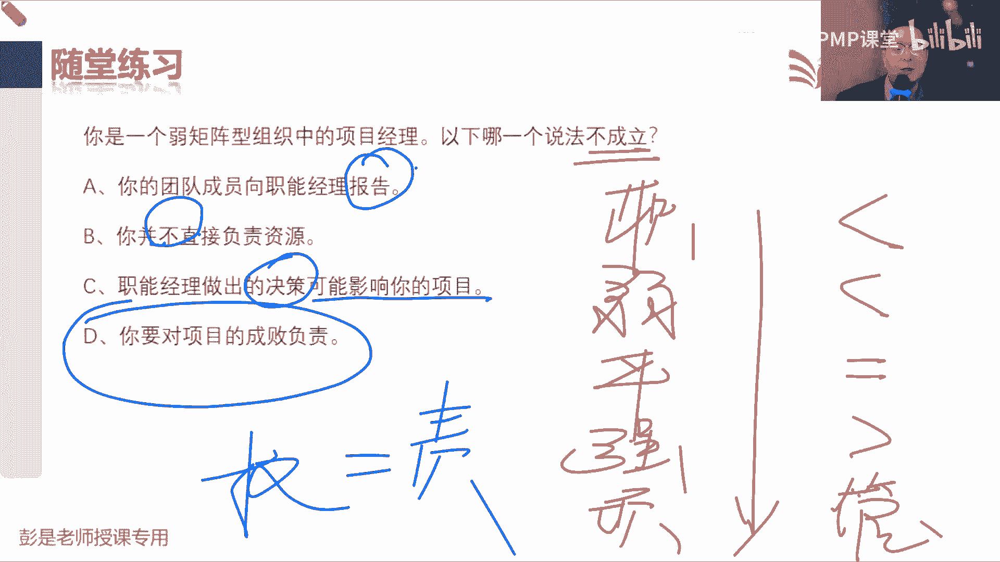

甩给职能经理，这个简单，大家基本上问题不大，读明白题就在就行了吧，在你不知情的情况下，有人被调走了，不知情人都被调走了，说明什么呢，说明对人轻言，灰不重要不重要，没必要通知咱啊，但是咱就找最惨的就行了。

所以呢恭喜大家答对了，只能弱矩阵组织结构，再加个E选项，职能型组织结构怎么选，记得好的里边找最好，坏的里面找最坏，既然说明既然想说咱权利小，那就找最小的，对不对，最惨的惨到家了。

好所以就是E然后D这个术语啊，刚才没见过哈，什么叫紧密矩阵呢，后面讲讲资源的时候再说，集中办公，它不是一种组织结构类型，MD这个单词啊，好再看看这道题，加一个小细节，在下列哪一种组织结构之中。

项目成员在收尾阶段最感到忧心忡忡，为啥呢，成员成员，答案确实是C，但大家给出的这个道理不一不对啊，因为在其他组织结构之中，我们仍然有职能，部门吧，我们成立项目组，然后从各个职能部门抽调成员。

加入到项目团队之中，那项目结束之后，这些成员干嘛去哪了呢，就回归了吧，叫各回各家，各找各妈，就这个道理啊，那项目型有职能部门吗，没有，咱是把职能部门直接挂到项目组下面去了，所以这种结构这种结构啊。

项目一结束啊，大家就没地儿回了，你就参考给你盖小区，修马路的这些施工的兄弟们，这个项目一结束，这些人去哪儿了，没地儿去，除非去一个新项目哎，就地解散，这就是项目型它的缺点。

所以呢大家可能在项目结束的时候，就心里面焦虑啊，惶恐啊，不安啊，稍稍知道这个单单词就可以了啊，因为为什么项目经理不好当呢，为什么项目经理不好当，职能经理对我们的成员来说是啥呀。

成员可能来自于各个职能部门，职职能经理对成员来说是啥，亲马项目经理是啥呢，后马指成员归职能经理管，这是他的直属领导，对不对，所以他通常通常更容易更容易听他领导给出的，这些这些这些这些这些建议啊。

领导说了算的好。

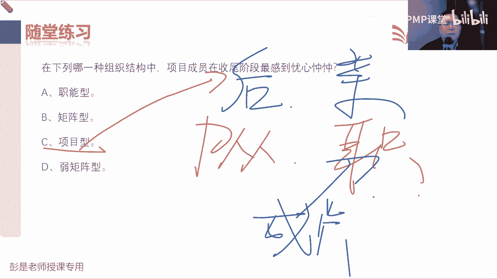

这个单词了解就够了，这个这个超简单送分题啊，前两个肯定是后两个，挑一个挑哪个呢，第四个为什么呢，需求评估商业论证，效益计划的制定，中间是项目经理带着兄弟们完成任务，实现目标运营通常不包括在项目范围之内。

那PMO可以干啥呢，什么方法论，对不对，另外还可以在项目之间去进行协调，现在我们在B项目组上，旁边还有一个A项目，项目之间的协调，包括什么共享资源啊，沟通啊，人家可以去搞，那就判断ABCD什么事。

咱管不了A咱管不了，这是PMO的事情，B咱管不了，这是PMO的事情，C项目人员之间的协调，咱管不了，这是PO的事情，D咱管得了，这是项目经理分内的事情，我们要制定项目干系人之间的沟通计划。

这是咱项目经理的活啊。

所以呢恭喜大家答对了啊，答案就是D他不是PO的职责，这是项目经理的职责，我们有十大知识领域范围，进度成本质量资源干系人，沟通风险，采购相关方。

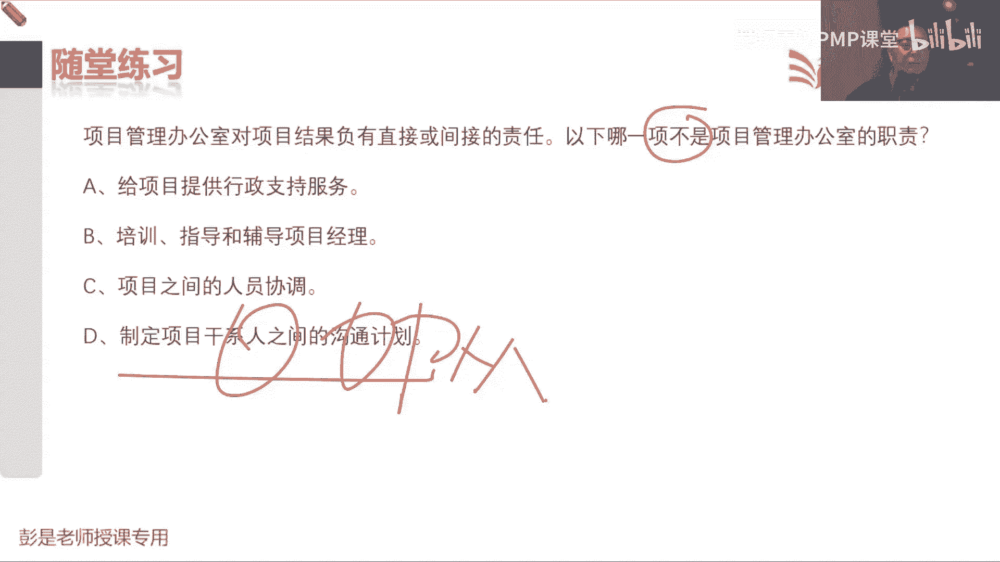

好再看这道题呢，说，这送分题吧，就这么大概去记呗，这三种类型啊，知识型没有权利要求咱控制型，有权利要求咱指令型直接管理，所以有一个PMO直接管理着许多项目，拥有全职的项目经理，包括巴罗拉。

那这个POPO就是指定型，好送分题来了，选啥呀，可以吧，支持型不能要求项目服从规定，那BCD就是对应对的知识点，对不对，控制协议要求服从规定，指令行直接管理控制项目，然后从高到低，权力从大到小。

这叫指令控制支持这种题啊。

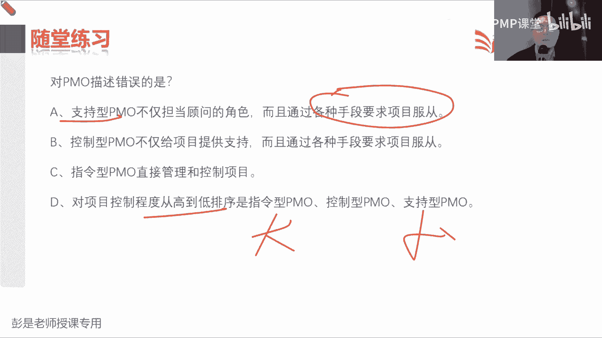

基本上听完课做做题就够了，这道题看看，就D了吧，所以下哪一项可以为丹尼尔提供一些，关于干系人参与先前项目的历史信息，看啥呢，就是你企业沉淀积累下来的，各种各样的组织过程，资产里面的知识库，对。

包括经验教训呢，所以其实经验教学啊，重要的考点就这么几句话，大家应该很好理解啊，现在我们想少犯错怎么办，关叫以使回见吧，参考组织过程资产里面这些知识库，这些历史信息，这些经验教训诶，这是为了现在少犯错。

那现在呀我们总结经验教训，这么做的目的又是什么呢，是为了未来呀，前人栽树，后人乘凉啊，为了让未来我们少犯错，少犯错不犯错，所以其实就是昨天今天和明天现在犯错了，看看昨天怎么错的，总结经验教训。

对以史为鉴啊。

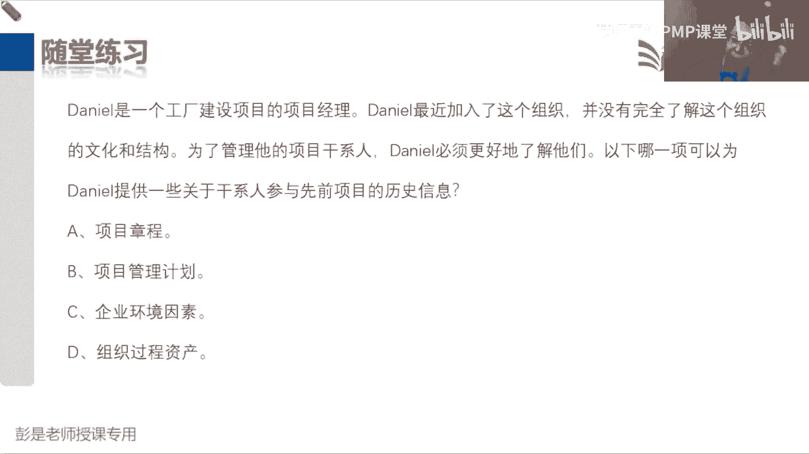

现在总结经验教训，是为了以后少犯错啊，这个，就看到这句话，答案就出来了吧，项目完成的时候，你要解散团队，使他们能够参与公司的另一个项目，因为无家可归啊，这就是典型的标准的项目型。

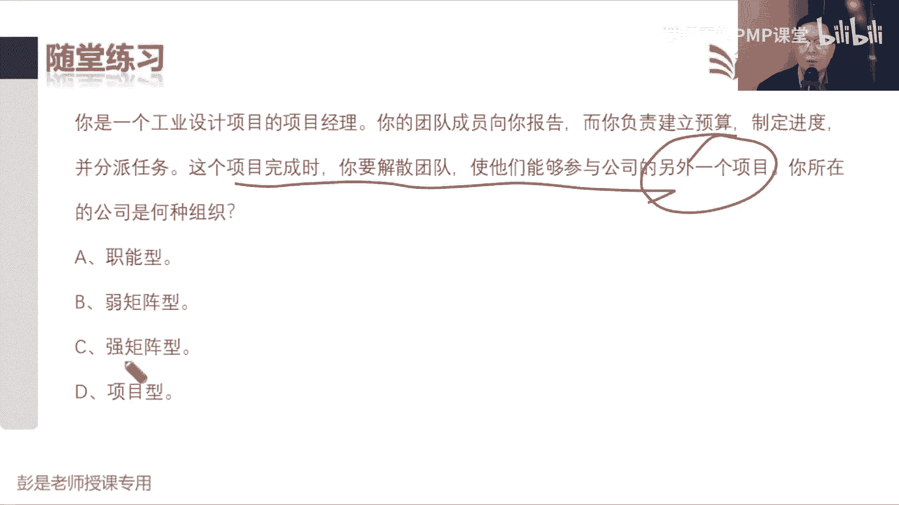

好这就是今天给大家讲完了项目基本要素，项目运行环境，然后呢下次上课呢讲项目经理的角色，因为现在已经17。三十八十一。40了，第三第三部分内容啊，大概10分钟，20分钟还讲不完，里面还有一些重要的知识点。

所以呢咱留个小尾巴，这样呢下次上课的时候，咱再前情回顾，帮助大家巩固这段内容啊，嗯其实今天讲课讲得慢，大家基本上就这几个几几个单词来回说对吧，我们要了解企业做的事情叫什么目标，远景使命价值观。

做企业的战略规划，又知道规划好了之后，有东西啊把它完成就可以了，项目有的工作需要持续的定期的重复的开展，就是运营，然后又发现呢有些事情之间存在着关联关系，依赖关系，所以有了项目集，然后呢要做的事这么多。

对不对，要排排序排排序，合理的分配人财物，就有了项目组合管理，这是事儿，搞清楚了，接下来啊，为了避免权责不清，所以呢组织领导要进行组织治理，说清楚我们的组织架构，说清楚大家的权力分配，说清楚政策流程。

制度唉，全责全责全责把它梳理清楚，然后为什么要做组组织治理呢，因为我们通过学习知道什么弱矩阵，乘常性平衡矩阵，有的事小，有的事大，要根据事情的大小去给项目经理合合适的权利。

就有了常见的五种组无种组织结构类型，那项目经理干活不容易啊，对不对，为了为了让大家干活干的更爽更爽，所以又提出了这个概念，叫PO项目管理办公室叫三种类型，支持型，控制型，指令型。

更关注把这些项目管理方法呀给他标准化，规范化，从而那个能够让我们这些项目，不断的不断的提高它成功的可能性，然后呢最后呢是说干活的时候有两大块东西，一个叫事业环境因素，一个叫组织过程资产，看看有什么约束。

看看企业特有的一些东西是啥，然后呢适当的适当的总结经验教训，做好企业的沉淀和积累好，大概比较关键的就这么几个东西啊。

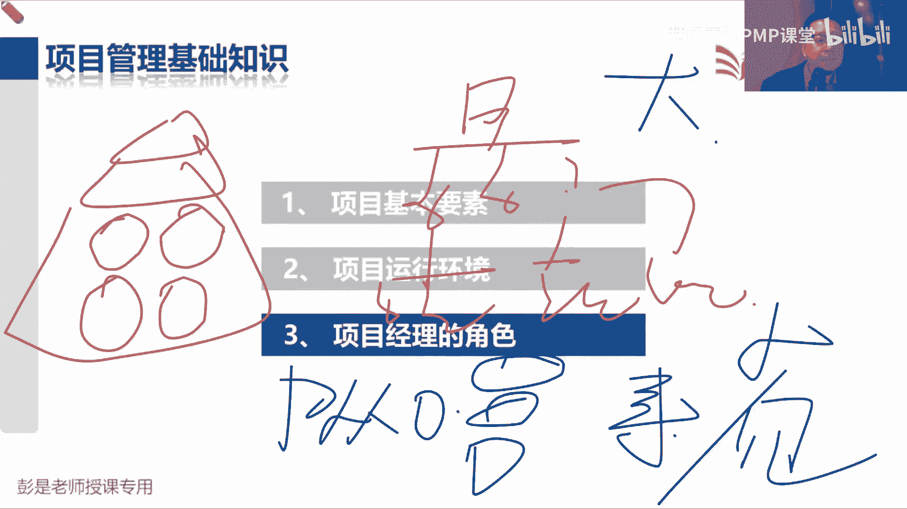

说课表五点下课，拖堂40分钟提前下课了，原计划是18点左右哈，温水煮青蛙呀，第一天上课拖堂太久不合不合适不合适啊，慢慢的慢慢的在逐渐的加构好，还是为了保持课程的完整性。

不然第三部分啊大概20分钟讲不完也讲不影，讲的讲的比较快，影影响质量不不合适，所以呢咱放到下节课再说，那今天听完课给大家先留一个口头上的作业啊，作业是什么呢，这个东西各位同学酌情酌情。

根据你实际的实际的情况来分析，要不要把这本书撕成几个小本本，第二个呢其实也没必要着急做题啊，做题不着急呢，因为咱第一章还没讲完呢，项目管理基基础知识还没讲完啊，所以不着急做那个章节练习题。

课后练习题给给各位同学建议啊，就是踏踏实实的静下心来的阅读，哎呀中午撕完了，手太快了，踏踏实实的静下心来去看书，去复盘，复盘一和二，咱们讲过的这部分内容，稍稍顺面试回顾知识点，训练一下咱的阅读能力。

然后呢训练一下咱的专注力，不着急做题啊，也不需要做过多的预习了啊，私书的标准班，私塾的目的是啥呢，想撕就撕啊，思思书的目的是上上午讲课说过了，降低心理压力，降低心理压力啊，这本书太厚了，不好带呀。

串讲讲义啥时候用呢，串讲其实是课前做预习的，咱课上不讲不讲啊，好那各位同学今天听课辛苦了，咱们下次上课再见，各位同学，拜拜拜拜拜拜，好线上同学听一听线下同学的热情，线上同学来一波666，对不对。

来一波咦，让线下同学看看你们的热情，拆除建议班主任会发到群公告里面。

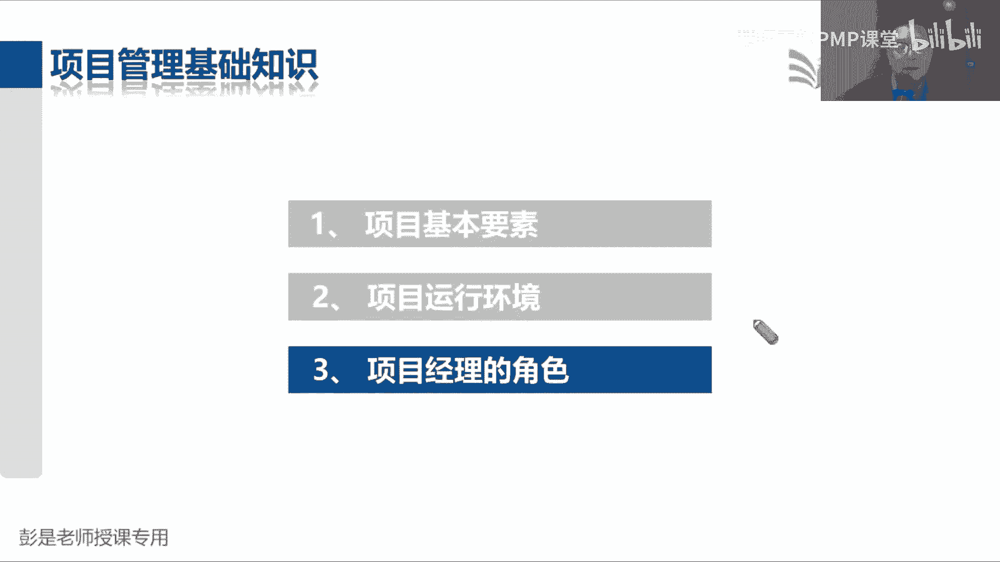