# 2024年3月PMP最好的模拟题解析上篇 - P1 - 老莫爱AI - BV1mx421277s

现在来到了北京时间，晚上八点就开始了解题的重点了，如果一般的让你出现什么什么叉叉，管理计划都是坑啊，你们要记住一个一个管理计划的东西啊，管理计划里面说风险管理计划，风险管理计划。

无风险关系人干系人这个东西大家要记住啊，管理计划它里面不会有具体的这个人啊名啊，或者不会有具体的风险或者问题啊，OK这个冲刺大家都已经有了。

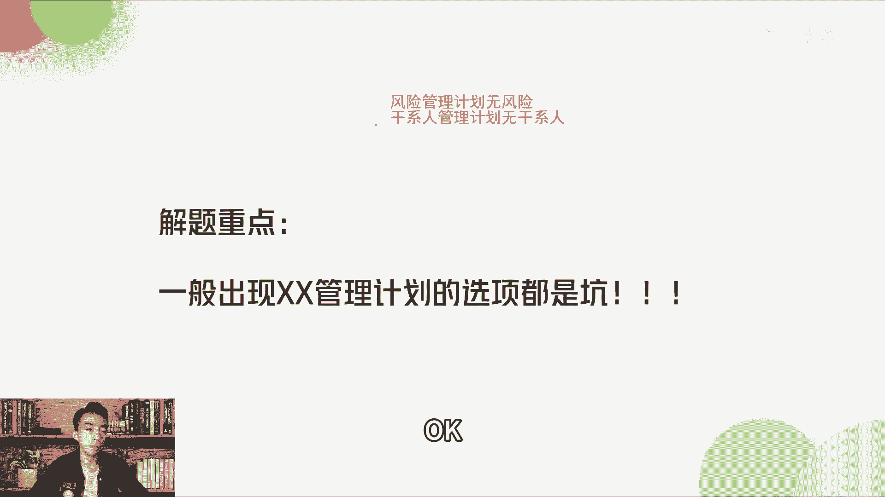

冲刺整理资料都已经发给大家，大家看一下好。

那昨天有个同学说，明天讲模拟四的时候讲一下这些题啊，今天我们就先来讲一讲这些题啊，OK第26题，他说在项目开展过程中，项目经理的直接主管在毫不知情的情况下，直接与客户沟通批准相关变更。

设立项目团队非常困惑，因为项目范围的背景正在发生变化，但这只会在项目会议中有所提及，项目经理该如何应对这种情况，这种情况你看直接主管是吧，他直接与客户沟通批准相关变更，说明什么，在这个项目的过程当中。

我们没有管好，人，是人的问题，这个人的问题，如果是项目里面的人，就是项目团队本身的人，那我们属于资源管理没有做好对吧，但是他是项目经理的直接主管，所以这个人他是干系人啊，所以他考的是什么干系人管理。

OK那我们就从干系人里面去看啊，A选项正是干系人参与计划，并实施相应的行动计划，OK这个是对的啊，这个是干预人参与计划，不是干系人管理计划，那这个干系人参与计划里面是有干系人的啊，看八怎么样。

他原本这个干系人是应该做什么事情的，我们要审视这个事情，所以正确答案是A啊，B是直接与主管沟通，使其了解沟通管理计划，那沟通管理计划就不对了啊，沟通管理计划一般是什么，对沟通的频率啊，对沟通的渠道啊。

不是很了解，我们可以看这个啊，可以那所以这个题目考的是干系人啊，跟沟通又没有什么关系啊，OK所以正确答案是A。

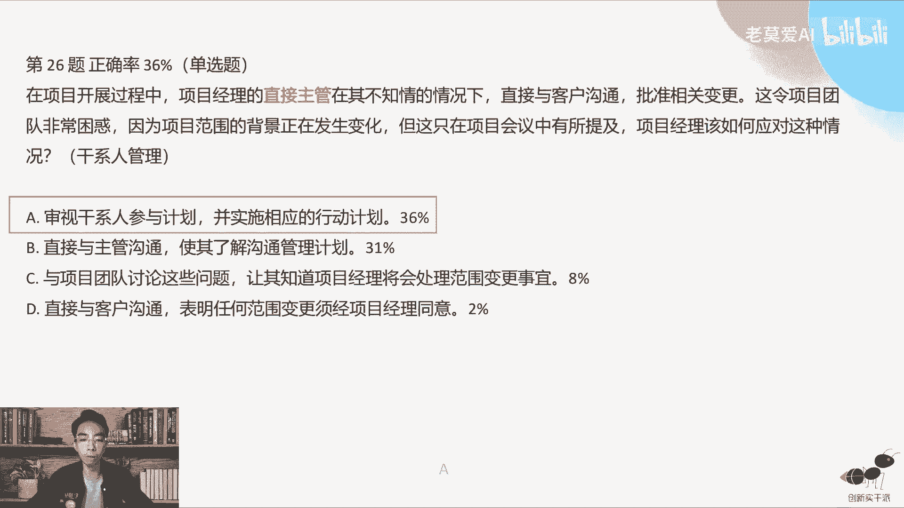

其他的选项很少人选，猫团团说四比三又高了十分多，说明慢慢的进入状态了啊，所以还有两套试卷，大家可以做一下，有时间做一下43题，在一个复杂的执行过程中，项目经理会遇到来自不同团队的大量变更请求。

这些变更可能导致项目不能够达到其目标，相机你应该如何确保自己变更得到有效的管理，给这里面提到了关键字是大量变更请求啊，如果是处理大量变更请求的话，我们会用到敏捷啊，敏捷的方式去变更，那敏捷变更的话。

我们敏捷是怎么变的，敏捷不像传统项目管理，它有CCD啊，项目管变革委员会他就没有了，那他们怎么怎么变更呢，就是看需求谁来负责拍板了，产品委员会这个职责由团队去担当了，产品负责人去负责拍板。

所以正确答案是A啊，与产品负责人一起对大概事项进行修改，风险登记册明显是错误的，因为这不是风险啊，他一直在说变更啊，蔡坤说，老师好，30考试需要带什么，我已经发到群里面去了啊，你是哪个。

你可以说一下你是哪一个啊，是不是在那个群里面，3月考试群我发了一个链接。

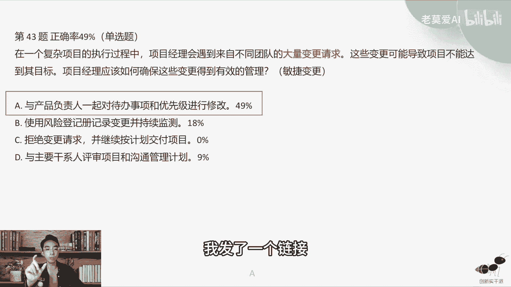

然后3月考试要带什么东西，应该可以提醒啊，48题，某公司正在运用预测型方法，开发范围管理计划中定义的一个特定组件，由于监管要求会定期变更开发团队，以以请求运用敏捷方法针对开发团队的请求。

项目经理在做什么啊，这个东西也考的是敏捷变更啊，那么敏捷的变更的话，敏捷的变更应该是怎么怎么去做，怎么去做啊，是对需要所要求的方法，运营予以应对，进行变更，就是你用什么样的方法。

就用什么样的方法进行跟就行了啊，对需求进行分析，所以前面是预测型的方法，后面采用敏捷的方法啊，所以这个方式一是对的啊，Z这个东西不对啊，交给项目管理委员会，他要交也是交给变更委员会啊。

所以这个老师我没在群里面啊，你们说需要带什么东西啊，等一下你有人打断了我，我这样吧，我把PMI的需要带的东西都发发到聊天的群里面，大家可以去搜藏一下啊，3月考试现在要开始那个画报，我忘记单位三。

这里都有细想啊，我把网址发到现在这个直播群里，大家可以收藏一下啊，我发到这个直播群里面，互动群，你可以收藏这个链接看一下。

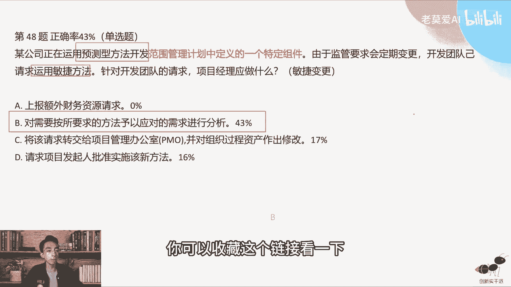

会直播的，最后会跟大家说一下，我再回来，我们第72题说正在紧密部署的团队，等待从客户那里收到关键信息，客户呢一直推迟发送信息，这就延迟了，部署降低，你应该做一些什么事情来防止延迟。

其实这里面讲的其实你发现没有，从前面到我们这个关键字一直在讲，其实客户的问题，那客户的问题应该怎么样，我们当我们在做这个题目的时候，我们如果遇到客户的问题，我们应该把客户一起拉过来啊。

我们不能够去指出客户的问题，我们应该客户去参与这个过程啊，让客户参与部署过程，所以答案是正确，答案是C啊，提前获得所有关键信息，这个是错的，所以我们知识点里面，项目管理知识点里面并没有这个东西。

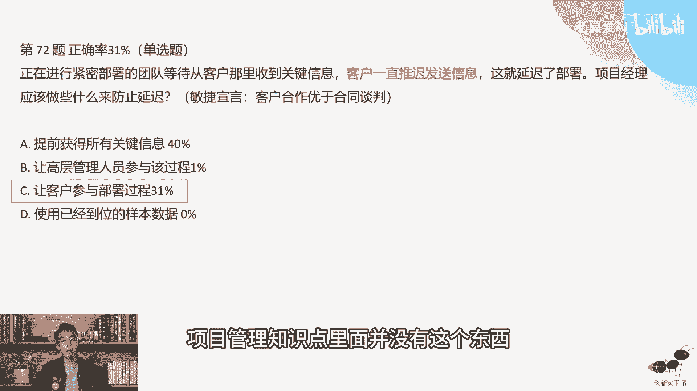

第78题，某市场团队正在规划的一个为期多年的计划，将包含很多跨职能部门的干系人啊，项目经理已经指定，项目现在处于规划阶段，应该编制的文件，所以我们看啊，如果干系人比较多，那接下来我们应该怎么样编。

我们在做这个干系人的计划，做完之后，我们就应该识别玩家系统，就应该做接下来做沟通计划啊，所以这个其实考的是沟通管理的东西，那么与沟通管理相关的只有哪一个，就只有D满足团队需要的管理计划。

那你说为什么上面写干系人要考沟通管理，为什么不考干系人管理好，请问这下面有哪些是四个选项，里面有哪一个是关于干系人的，没有关于干系人，只有一个关于沟通管理计划，所以是沟通管理，沟通管理计划。

你说到底有什么东西啊，很多人说，那我就把沟通管理计划列出来，他这些元素都有哪些啊，大家看一下第一个沟通目标，第二个是利益相关者的一些信息，因为你前面你已经识别了干系人，接下来做沟通管理计划的时候。

其实就是干系人的输出，就是这个沟通管理计划的输入啊，第三个是信息分发的方式啊，包括我用什么样的工具，用什么样的系统去分发这个信息，沟通的频率啊，到底是开约会，约会的频率，周会还是有什么样的会。

它的频率是怎么样的责任分配啊，负责和执行是由哪些人沟通的，渠道有哪些，什么电子邮件，电话还是微信啊，这些东西都会有啊，是正式的还是非正式的，都有语言和术语，文档和记录文档要放在哪里啊。

哪些文档一些什么样的计划文档，我们应该从哪里找，这个就像我们考p mp一样，我们的备考计划啊应该放在哪里，大家从哪里找我们的一些文档，这个网应该放在网盘里面，大家应该从网盘里面去找啊，课程放到哪里啊。

应该从哪里去找，这个就是沟通管理计划所要描述的这个事情啊，监督和控制和应对策策略，所以沟通管理计划它是一个很大的计划，他并不会有具体的沟通人。

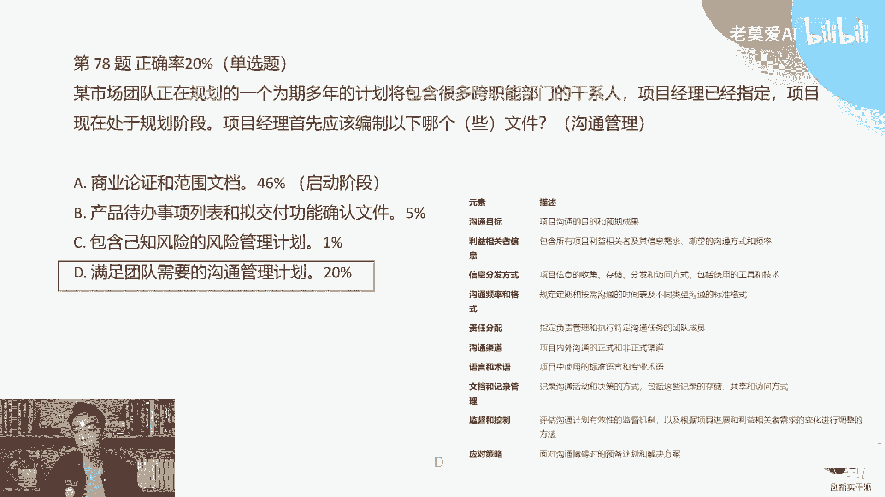

谁和谁沟通啊，不会啊，可第93题，推出财务系统的工作已经进入执行阶段，但上月出现了很多问题，正在拖慢项目的进展，说明怎么样，项目已经出现问题风险吗，这是个问题，一位新项目发起人最近刚刚进入公司。

但还没有时间与项目经理见面，项目经理现在所处的在项目现在所处的阶段，这些问题正在对项目交付产生严重影响，所以其实是一个问题，而且问题挺严重的，项目经理如何就这些顾虑，向新的项目发起人发出提醒啊。

这个属于什么项目的工作，绩效报告就是有一个新的老大过来，但是你现在项目很多问题，那怎么搞对吧，完成风险分析直接就错了啊，A就不要去选，因为跟风险无关了，这个已经是问题了，第一项项目发起人发送电子邮件。

总结项目状况和主要顾虑，并请求立即与当前与其当前会议讨论这些问题，一是最正确的选择，最合适的，因为迫在眉睫，已经严重影响，你不得不救这一向项目发起人发送邮件，邀请其参加项目团队的所有每周例会。

并希望发起人安排时间约会啊，不是希望你开发什么东西啊，而是你要立刻马上把这个事情告诉他，这个很严重，第一继续通过电子邮件发送最新的状态报告，重点说明主要风险，并等待发起人提出会议请求啊。

这个其实会已经很严重了，所以B是最合适的，C和D都有点有点消极怠工了啊，准确来说应该是有点消极怠工好。

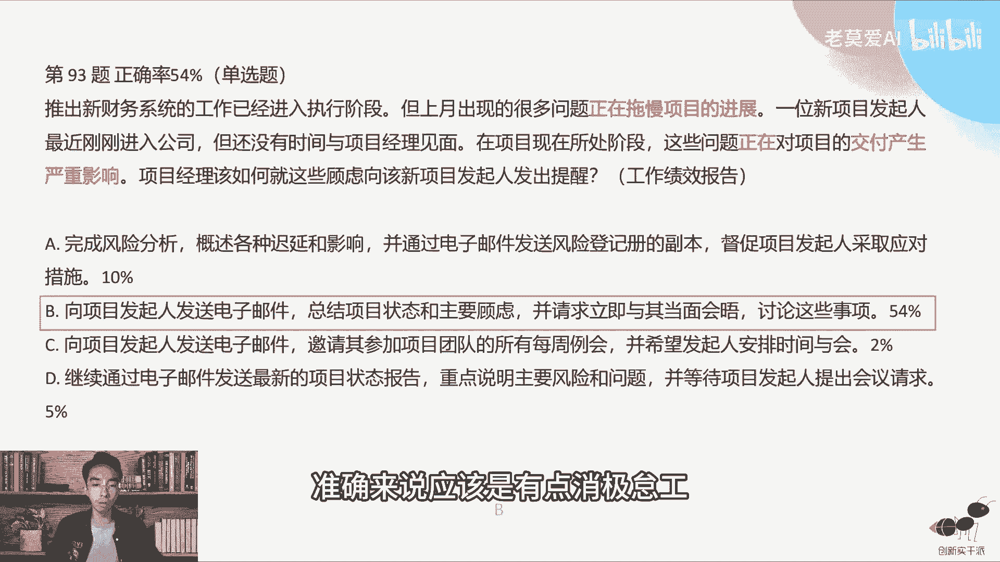

第108题啊，项目经理正在准备一个新项目，其中团队成员分布在不同的国家，项目经理正在使用沟通管理计划，来吸引项目成员，并找到适合每个人的沟通方法，项目经理应该如何持续评估虚拟团队的，有参与的有效性。

这个东西考的是什么啊，这个题目考的是啊，虚拟团队，因为里面讲的是分布在什么不同的国家是吧，那肯定是虚拟团队组成，虚拟团队的沟通方法到底是什么东西是吧，那么正确答案是A啊，收集团队的反馈意见。

讨论改善沟通的方案，我说过虚拟团队的沟通是相当重要的，他是比这种面对面的团队，他的沟通策略要更完善啊，就因为大家在一起，所以要沟通非常严格才行啊，所以正确答案是A好，有很多人选这个Z啊。

有很多人定期召开面对面的会不太可能啊，讨论沟通议题啊，有些人问为什么孟老师，有时候你说要要见面一次，对，见面一次是可以的，分布在不同的国家，最好的方式是让大家在立项的时候去见一次面，这个是最好的。

但是这个C完全不同不一样，他说定期高开面对面的会议，这个时候就没有办法，然后根据团队的喜好和可用性，这个剧情不对的，有同学说风险和问题有什么区别，风险是还没发生的，问题是已经发生啊。

比如说啊这个房子它有着火的风险，那这个这个房子说明他现在还没起火是吧，这个房子已经发生火灾了，那说明这个房子已经起火了，起火了就是问题这个区别好。

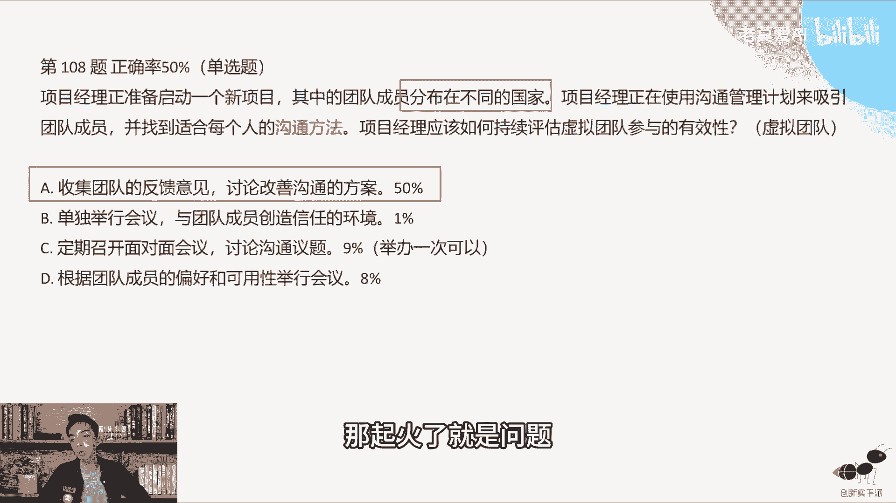

第129题，一位项目经理正在一家跨国公司，管理一个重要的项目，他正在与所与所有团队成员一起举行庆祝会议，其中一位团队成员在会战期指出指出哦，他们正面临的一个关键问题，将会导致他们无法完成所分配的任务。

项目经理应该做什么啊，这个问题可以回答前面那个DAVID这个问题啊，这个就是风险，为什么他说关键字是将会导致他们，那现在会不会是不是已经导致了没有将会啊，所以这个是个风险，所以我们要当风险处理。

所以这个风险处理我们就选D啊，与团队成员一起查阅风险登记册，就是已经已经发生风险了，我们就看风险登记册里面有什么样的应对措施，就好了，这个是D好，很多同学说安排有顾虑的同学，同团队成员开会。

共同审查并更新问题日志啊，这个还没有发生问题，将会导致，所以这个题目就是选D，所以这将题目当中很很多时候他会说什么，将什么东西啊，大家一定要记得这些关键字啊，这些坑呢将会怎么样。

还有一些什么避免什么东西反复出现的。

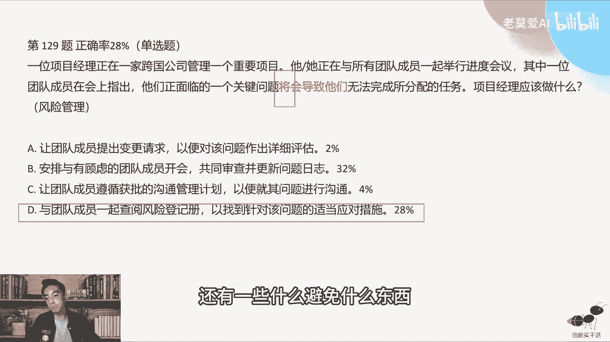

就很容易犯错的题目好，第136题，A公司的一个项目在最后一个迭代结束前，既定的范围进度和预算内成功交付，但在项目的庆祝，事实上，其中一位干系人却表示，他们认为项目很失败，因为他为整体任何商业价值。

项目本应该采取措施来避免这种认知，你像项目的三大基准都没有问题，进度范围和这个成本都没有问题，但是项目失败了，这说明什么，我们价值交付没有做好，你只是完成了任务，你做出来的东西没有价值。

他说这个项目经理本应该采取什么措施来避免，避免，其实说的就是刚开始我们做什么就好，它是一个后悔键啊，就是说如果你后悔了，你回到了项目开始的时候，你应该做什么事情，是这个意思。

如果我们一开始我们做好什么就可以了，所以我们要怎么样专注于价值交付，商业利益与发起人和观念干系人一起，确定产品代办事项中的优先药物，以便符合3A加成三A3AD，所以符合这一条的只有C啊，其他都没有。

比如说AA，其实很多人选说，确认是否已经制定沟通管理计划，这个沟通管理计划是不对的啊，他并没有说我没有收到这个消息，所以我认为他很失败啊，B让业务干系人参加啊，冲刺回顾会议是过程的一个会议。

过程相关的跟这个没有任何关系，因为任何商业价值，商业价值其实是结你参加座谈会议，其实没有没有价值的，所以正确答案是C，所以我们其实很多时候你读的时候，你要看他考什么考点，还是后面就是你你能把它总结出。

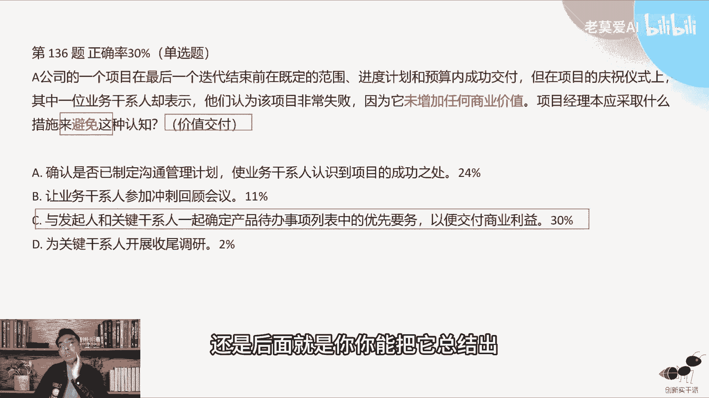

根据关键字总结出什么样的考点，常规错题，第178题，它是一个多选题，项目经理在其中一个新的虚拟团队时，应该考虑哪两个行动啊，虚拟团队好，那这个虚拟团队就是考的，虚拟团队的一个概念啊。

所以概念题其实多经常出现多选题，因为单选题对它不好出概念题，我一步一个一个来啊，评估自己作为虚拟领导者的优势和劣势，以避免以确定可避免的陷阱，这个我从来没有讲过。

军旅团队的这个领导者需要有什么样的优势啊，这个是没有讲，这不是我们的项目管理内容，所以这个是错的，这个没有用到项目管理的内容，第一次确定每个工作，包括活动所需要的类型和数量啊，这个是对的。

就是我们在做虚拟团队的时候，我们的管理一定要细，管理要细的话，我们其实是要把每个人的工作，其实因为你不是面对面的去沟通的团队，你要把每个人的工作分得很细，每个人他完成哪个工作任务，你都要给显现出来。

因为一旦他没有完成，他又不在身边啊，你就很难跟进的套跑，所以每个人每天虚拟团队他在千里之外的时候，你都让他每天去更新工作包的一些资源任务啊，这些东西，所以B是对的，B是对的，好Z在组织内招募最好的资源。

来成为虚拟团队一部分，我们从来没有说过啊，虚拟团队一定要用最好的资源啊，这个是一个错误的认知啊，第一核实团队成员是否在一个以上的团队中，是否能为这个团队投入足够的时间啊，这个是错的。

因为我们从来没有讲过，这个虚拟团队一定要全职投入啊，所以这个错的在一开始就出，确定如何监测进展和沟通进展的最佳手段，这个是对的，我们一开始就要确定啊。

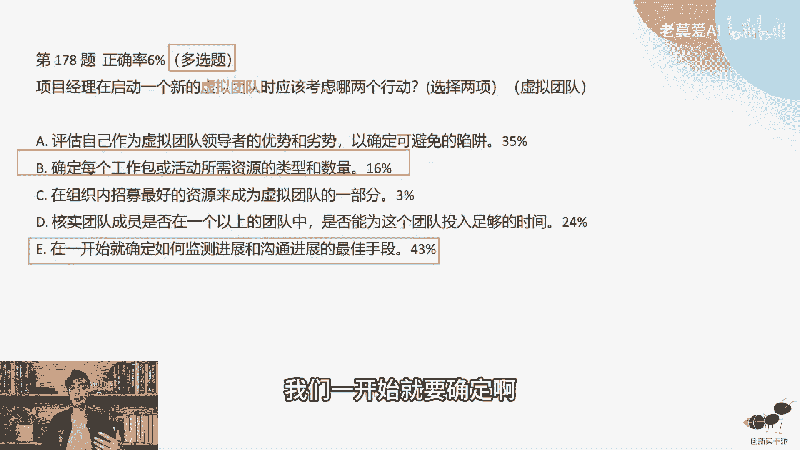

沟通的机制，我们一定要设置好，所以正确答案是B一一百五十五题，项目经理证管理的一个复杂的项目，存在很大的不确定性，然后项目经理被要求实施一种机制，以便衡量可交付成果的质量，如果运用混合型方法。

那么可以使用哪些技术来实现这一目标啊，这个里面要求衡量可交付成果的质量，也就是说提高结果的质量，结果的质量它不是过程的质量好，我们先看A结对工作和客户决策法，这个是什么，结对工作是绝对编程。

结对编程的话，这个也跟大家讲过啊，我们在这个敏捷串讲里面，第一讲我们就讲到了结对编程，那么结对编程是你在编程旁边有人在看，那这样能够提高你写代码的质量吗，这个是提高了结果的质量，客户角色法是什么。

就是把客户拉进来，有一个这样的角色拉进来，那这样的话客户拉进来也能提高结果的质量啊，所以这A是对的啊，每日例会和产品负责人质量评估，每日例会它跟结果的质量没有什么关系，它主要是暴露问题。

就及时的暴露问题，产品负责人质量评估这个玩意儿啊，没有什么产品负责人的质量评估啊，没有这玩意，这个是属于不是项目管理的知识里面，哎我先先把这个叉子插了，第三敏捷专家审查和质量看板方法。

这个是提高过程质量的方法啊，这不是提高结果质量，所以C是过程中第一时间和迭代和站立审查，会议时间和迭代和战地粉丝，那会都不能提高结果成。

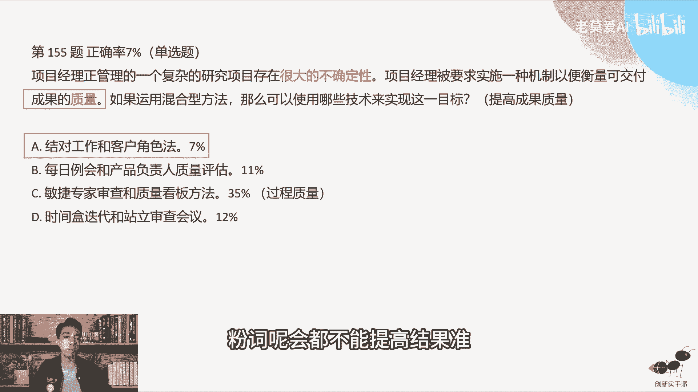

所以正确答案是A啊，好，那我们接下来再来看第112题，说项目章程已获批准，项目经理被指派到该项目，项目经理，目前与项目组一起对项目工作包进行细分啊，项目经理在做什么，他问的是什么过程啊，他问的是过程。

他问过程的话，这个过程工作包进行细分的，这个过程叫分解啊，所以正确答案是B啊，很多同学工作分解结构，工作包进行细分，细分完了以后结果才是工作分解结构，所以不要把过程和结果搞混了。

他说项目经理是在做什么啊，说的问的是过程，如果他是问的是说啊对工作包进行细分啊，这是哪个，他目的是它的目的是什么，它为了生成什么东西，那你可以答C生成工作分解结构，他的目的就是要生成这个玩意好。

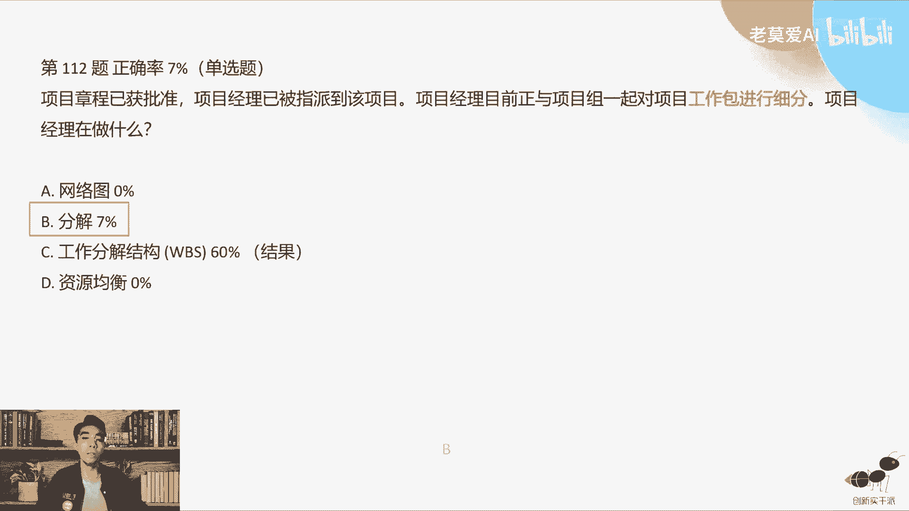

第64题，一些开发人员在每日会呢，列出了一份障碍因素清单，并要求项目负责人帮助确定他们的优先次序，有一些复杂的代办事项列表中的事项，一个新的初级测试人员，发现了一些合规性缺陷啊。

这个其实是几件事情放在一起，他说你应该关注哪件事情，第一件事情是合规性的缺陷对吧，第二个是产品负责人和几个同人员，开发人员要离职，或者是说离开团队啊，人员流动问题啊。

第三个是与测试和生产支持的合作的伙伴，合同将不再续签啊，一个是供应商的问题，那么项目经理最应该关注哪些问题，所以他其实是问的你的价值有的优先级啊，你做的这个事情，这几件事情摆在你面前啊。

额优先级是最高的，肯定是合规问题，优先级最高，因为合规性问题会直接导致你的项目流产，直接导致啊，就比如说啊，你知道政府的力量是很恐怖的，告诉你说你这个项目如果有一个bug，如果不去掉你的项目。

不要玩正一指一指那个令下来，你要要你玩，你就得玩，就像你们说什么新东方他做什么培训，做的好好的，人家说这个东西不能搞，所以合规性的问题一定是最优先要去解决啊。

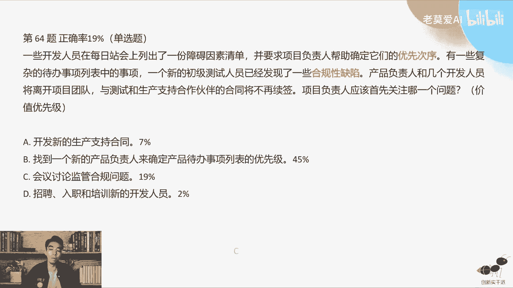

所以正确答案是这样，会议讨论合规性问题啊，这个是谁好，第66题，一个大型的矩阵组织，正在采用一种新的沟通方法，这是必要的啊，因为他的项目往往需要从各个部门部门的专家，那里获得专家咨询资源。

那么项目经理应该做什么来建立有效的沟通啊，这个里面其实说的是什么，就是沟通管理，沟通管理，沟通方法，对不对，那么有效的沟通应该怎么做，应该是注册收件人的需要信息本身，这个其实是在沟通管理里面。

我们经常学到信息是相互传递的，接收方接收到这个信息不算沟通成功，一次真正的沟通成公式，发送方，就比如说我跟你讲话，我要把这个话讲给你听，你要有回馈啊，你就是收件人，你要有回馈，说这个事情我收到了。

这个事情我理解了，我才认为这次沟通咱们俩是有效的啊，不能说我噼里啪啦给你一顿讲，然后你也没回馈，我就认为我已经沟通成功了，其实不是这样的啊，OK所以这就叫答案是B啊，A其实也有很多人选42%天了。

很多人选A啊，他说计划以易于理解的方式传递信息啊，A其实是错的，为什么，其实我们在跟这个to c端啊去讲课的时候，比如说我们讲课的时候，讲偏僻的时候，我们当然会以易于理解的方式去传达，因为这个东西。

每一个人的这样一个基础是不一样的，有小白，有大神，如果我讲p mp讲的很专业，很深奥，那么可能很多人就听不懂对吧，所以我要以易于理解的方式去传达，让大家都能够听得懂，但是做项目不是做mp。

也就是说如果你都是公司的一些同事，在一起的时候，其实那个时候你可以讲一些专业的话语，而不是说我们不是讲每个行业都有一些黑化嘛，对不对，金融有金融的黑化，互联网有互联网黑化，所谓的黑化是什么。

就是我们专业团队彼此沟通的话，那么沟通的话你不需要易于理解，不需要其他人能够听得懂，我们就是专业的，我们就要讲专业单词，我们就要讲讲专业词汇啊，所以A其实是错的啊，这个不是必要的项目啊。

B才是你要专注收件人的需要，这个才是最重要的啊，并不是说每一次说都要说大白话之类的。

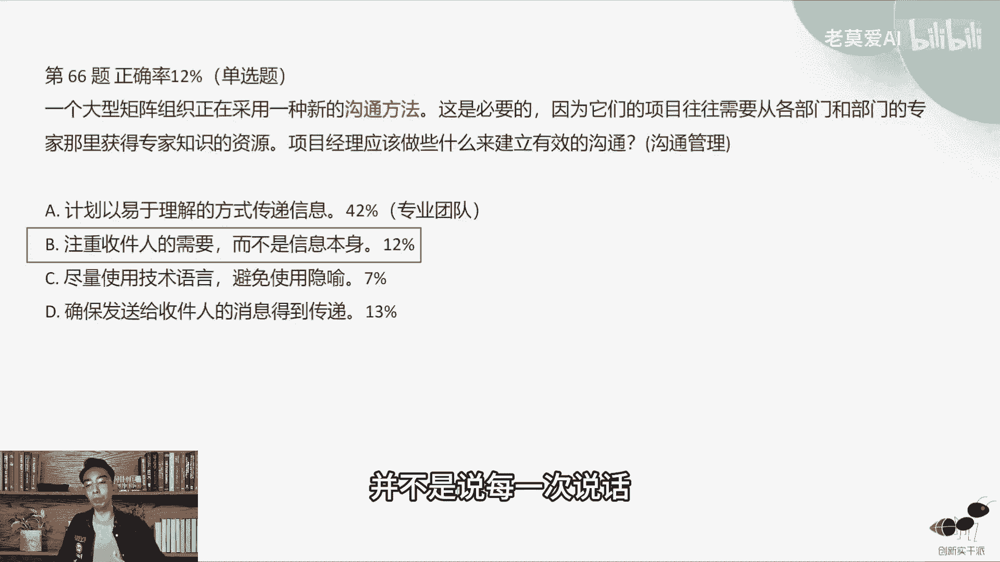

第127题啊，董事会的一名成员，是一个对组织非常重要的项目的发起人，该项目有诸多其他优先药物，目前没有参与到项目活动中啊，山西人他没有参与进来，你怎么样让他参与进来啊，其实他考的是边路干系人参与啊。

如果他是一个董事会的成员，说明他是一个高层，高层，怎么参与进来，让他参与决策的过程，这个就相当于我们敏捷里面有一个，就是产品评审会啊，迭代评审会，你最好是让他去参加迭代评审。

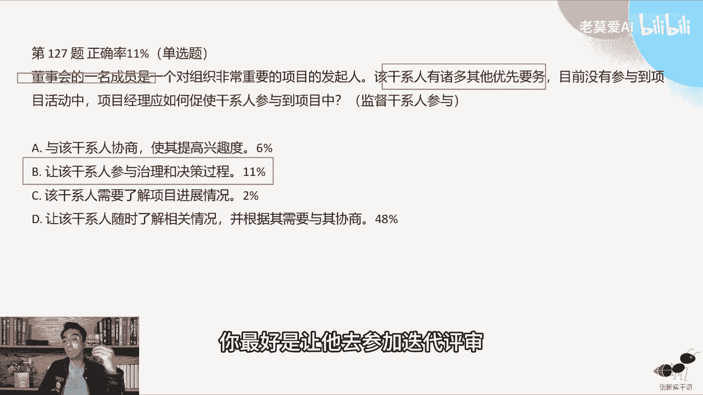