# 2024年3月PMP最好的模拟题解析下篇 - P1 - 老莫爱AI - BV1Dx4y1r7yv

那是结果展现出来。

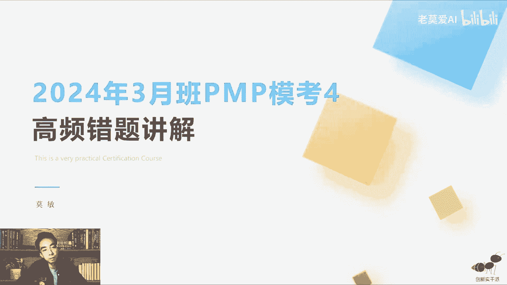

结果还还能够促进他去做一些决策啊，他觉得你这个东西好不好参与，让他参与这个决策过程，因为在产品评审会由谁做决策，有PO做决策，这个项目到底要不要往下去做，所以里面是干系人参与，就是B啊。

第一让干系人随时了解情况，并根据其需要其写三啊，这个东西，总之这句话说了等于没说啊。

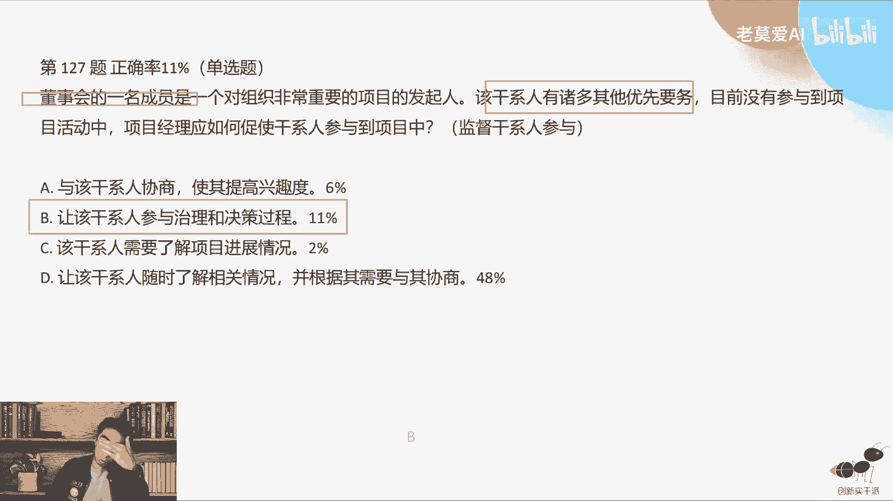

什么叫不需要，第137题，项目经理正在领导一个项目，该项目的几位干系人，来自于公司的其他职能部门，其中一位干系人，刚刚晋升为另一个职能部门的负责人，该部门也是项目的一个干系人。

项目经理应该让团队更新哪些内容，来确保该系人保持市场通啊，这个有关键字是适当的沟通，所以与沟通相关的就只有一个选项，沟通管理情况啊，很多人选干系人呢，就觉得这个是干系人的问题。

因为它出现了很多干性人的东西，但是其实他问题里面最后一句话，问题是确保刚性适当化，所以沟通管理计划这里也列了。

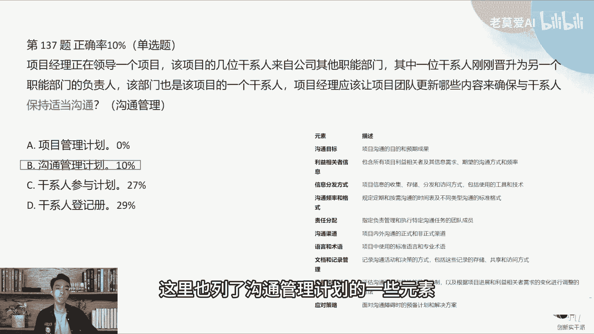

沟通管理计划的一些元素，就不讲，前面已经讲好，第141题，一家医疗保险公司正在全球部署，创新的医疗保险方案，项目团队已经完成了有限的发布，该系人对全球医疗和指指南和风险提出了担忧。

项目经理接下来应该做什么，其实这个题目里面考的是什么项目，这些环境因素，因为你是一个全球的项目，大家知道全球的医疗项目里面的风险啊，最重要的它不是其他的，最重要的恰恰是合规啊。

其实合规是属事业环境因素的，所以他考的是事业环境因素，他担忧就是这个东西合不合规，合不合法啊，因为每个国家的医疗和法案是不一样的啊，就比如说我们知道的就是印度，他们的仿制药是合法合规的。

你可以在印度去做仿制药啊，也可以怎么样，你可以在印度买到仿制药，也能够在印度怎么样，那么你在印度去设厂的时候，你要记住一个东西，你在印度去做这些医疗设备的时候，有可能你会被人反制，他没有样的专利。

所以他担忧担忧只印度只是一个个例，我所说的其实我还是要关注我们的外部环境的，这个环境，说谁谁是对的，而不是什么定性风险分析啊，因为定性风险分析其实这里面没有考到，说啊这个风险啊。

什么样的风险已识别的风险啊，并没有从主干上看到我们识别了哪些风险，OK只是这个风险担忧它更加大局观一些，没有识别到具体什么样的风险，如果识别到具体的风险。

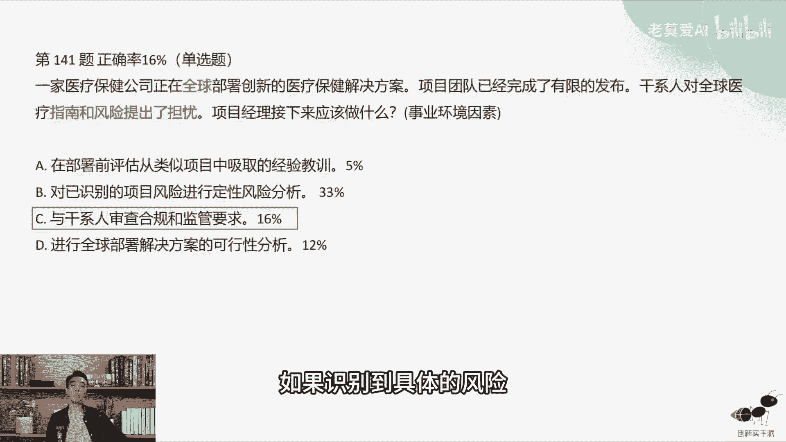

我们也许是对的，所以正确答案是C好，149题，在某项目执行间，一位新的项目经理被指派负责该项目，然后项目经理意识到，新的税收政策正在带来一个是成本超支，反大数风险，项目经理更新了分解登记测试项目。

造成工作突然ZU宣布该项目可能会又出现，避免这关道理，我们刚开始应该做什么事情啊，刚开始的时候，其实这里面考的是一个什么沟通的问题，你发现没有，你的信息跟CEO的信息是不一样的。

CEO的信息是我只能接受25%，20%的超值，但是你你了解的信息是，百分之超过25%都是正常的，看到没有项目经理更新了风险登记设施，项目造成，所以你你认为他25%是正确的。

CEO认为20%多抽都是接受不了啊，所以这个是一个问题沟通的问题，我们就应该确保该公司的风险承受能力，得到适当的更新啊，适当的更新其实就是更新风险，就是把CEO的风险承受能力要更新过来啊。

并不是实时沟通的这个管理的计划，因为管理的计划里面他没有具体的啊，但是这个问题他其实很具体，也不是风险管理计划，所以A不对，它本身这不是一个风险。

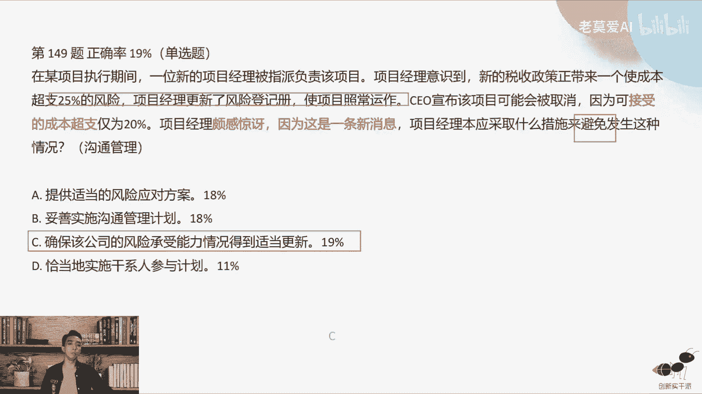

这是一个问题啊，153啊，一个项目正在执行一个大型的项目啊，一个团队正在执行一个大型的项目，说说啊，已经确认了几个合同，要求在计划阶段，项目团队同意，在项目完成日期前三个月签订合同。

在项目执行阶段确定需要立即签订和项目经理，这个又是一个反复的东西，前面说好的说提前三个月签订，现在又说立即签订，所以它是一个变更啊，这个变更很特殊啊，它是一个合同变更，合同变更，那么你实在要变。

也可以提交变更请求啊，所以是B罗同学说，要求团队找出提前和提前执行合同的原因吧，对付变更的话，如果你是变更，那么你这个变更只有说什么，按照变更的流程来做分析，变更怎么样去去提炼跟啊。

并不是说要我们去整个团队再去找这个原因啊，因为你是跟外部去签的，不是团队去找。

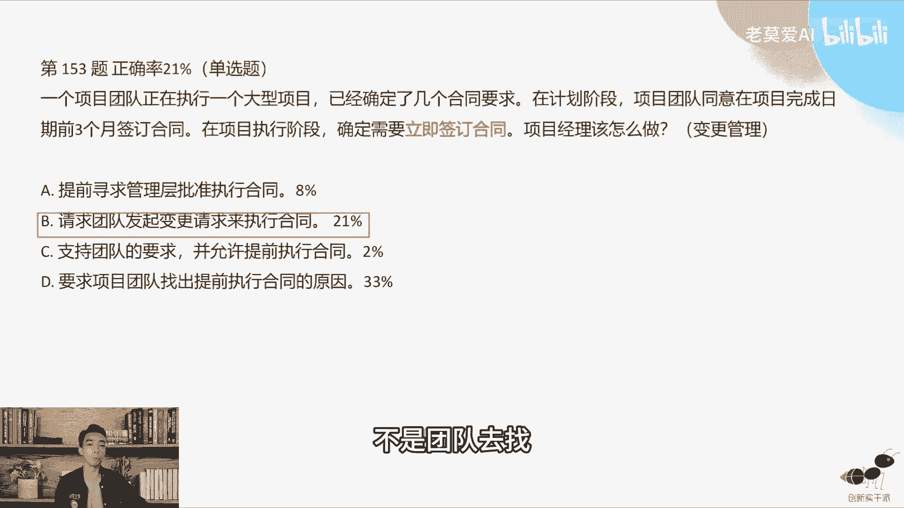

而是一起去找，不要找的话也是一起去找，第177题啊，业务转型项目有四个阶段的交付计划，项目团队成功完成了项目的一个阶段，为了进一步提高团队绩效，并授予团队成员，项目经理应该采取并授权团权。

项目经理应该采取哪两项合同啊，选择两个，这个其实是什么，提高团队绩效，我们只要看到团队绩效，这一定是资源管理，团队绩效是在资源管理局，鼓励团队成员与项目经理交叉检查决策啊，从来没有这项啊。

没有说团队层面项目经理交叉去检查，这个不需要交叉检查，也是团队和团队之间的检查，一在执行前审查所有的决定啊，这个很很少人选择直接就废了，C允许团队成员做出有限的决定，有限的决定是什么。

所以这个并没有去指这个选项是有的，如果你要充分让团队去杀啊，授权你应该明确的指出，他应该有什么样的权限啊，不是说你给他一个什么，你要做出需要的决定，有限的决定，以组织并分配第一组织。

并分配成员做他们擅长任务，这是对的，第一支持团队成员在他们擅长的领域做出决定，这是对的，所以正确答案是第一。

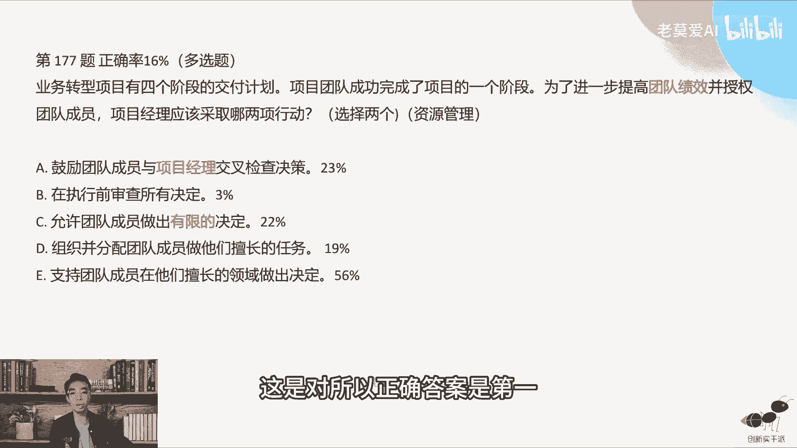

这两个都是非常积极的选项啊，能够提高团队的绩效，第180题，在项目执行期间，项目经理注意到，只有一名团队成员拥有构建产品所需要的，其中一项技术技能，项目经理担心。

这将可能会对质量和进度产生进计划产生影响，因为多数几个即将开展活动，将至少需要三名具备该特定技能团队成，项目经理应该采取哪点措施，来避免团队成员不符合这个要求，如果出现避免。

我们就假设时光回到了项目开始的时候啊，项目开始的时候，你需要三名具备该特定的团队成员是吧，那么应该怎么做呢，A将新技能交给整个团队，这个是不对的啊，为什么不对，他只需要三名具备开特定的团队团队成。

而不是整个团队，不是整个团队所有人都需要同样一进，第一鼓励团队结对工作，并且进行知识共享啊，这个是可以的，因为团队可以达成备份啊，C增加需要此类能力的活动，预计所需要的时间啊。

这个跟具备能力没有什么关系啊，你只是给了他一些时间，他给了他一些时间，不一定他就能真正的具备这个技能啊，第一与外部培训师一起开展培训活动啊，这个是可以的，你要让他掌握这个技能，培训也是一种措施。

一将相关活动主线基础化学，所以正确答案是B1B。

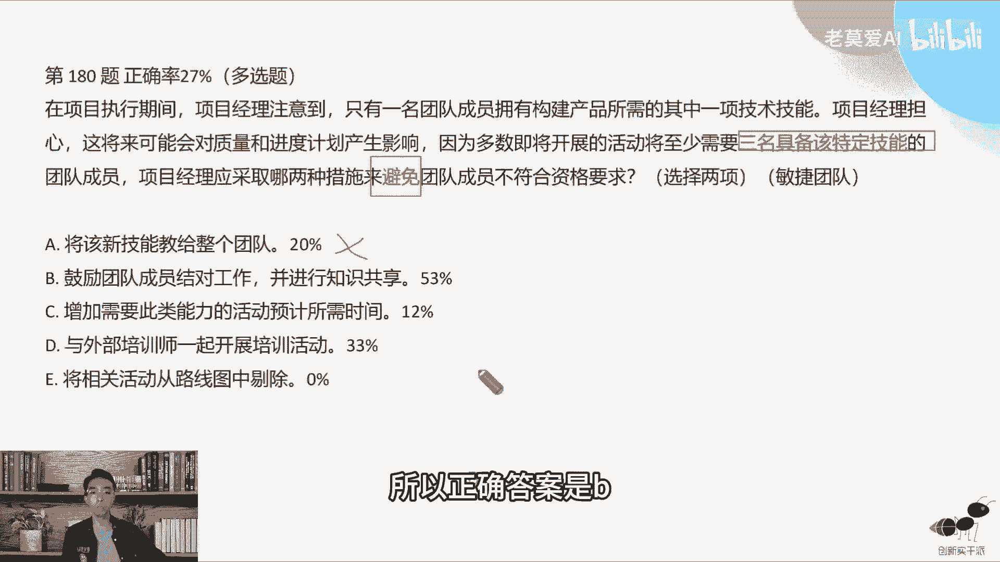

正确答案是BDD173题，项目经理啊，敏捷项目的项目经理，担心团队在最近的点赞中是需要动力，应该使用哪两种工具来分析团队绩效啊，团队绩效的分析就是两个啊，一个是蓝进图，一个是蓝企图啊。

所以这个正确答案是这两难企图，一个射程进度为什么是没质量啊，因为这两个它有趋势啊，团队你慢了或者快了，在这两个图里面就很容易被发现，好有些人说为什么不是这个第一啊，已完成功能的累积流图，累计流图是什么。

累计流图是来发现团队的瓶颈和改进的啊，大家要记住是要改进团队的，是有些累积流图啊，所以累积流图在什么时候是在回归的时候啊，那项目进度计划能看出来，看不出来啊，计划是一个目标的东西对吧。

我们团队的绩效是实际过程，所以正确答案是那个B和一。

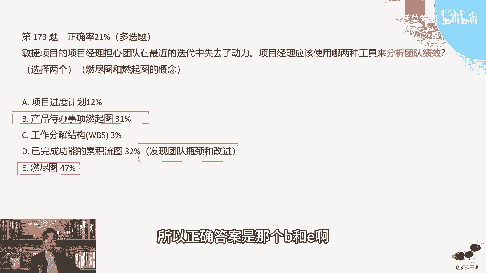

第172题，在一个有不同国家的特定用户的项目完成后，项目经理的主管询问，项目用户是否对项目的运行方式感到满意，项目经理应该采取哪两个活动啊，这个是考什么，收尾阶段就是考的是项目整合管理。

第四章的最后收尾收尾，它完成以后应该采取什么，我们知道完成之后应该怎么样收集反馈，就是大家对项目的反馈，就是第一个要去做的事情啊，所以A是对的对吧，一是什么，参照沟通管理计划去问这个项目的运行方式。

是不是感到满意，你是要发送问卷，还是要面对面的去跟用户去沟通啊，这个里面都是属于参照沟通管理计划里面啊，所以一是对的啊，B他虽然都是收尾阶段要做的事情，但是这个跟询问用户调研管，将项目材料交给用户啊。

这个是在太违和了，因为项目的材料，包括我们的项目内部的一些中间的一些过程，的一些项目计划，项目的一些问题啊，你怎么可能发低货的，各国对新流程的正式批准，收尾阶段不做这个事情。

正式批准对新流程的正式批准应该放在哪里，应该放在启动阶段吧，或者是说我们的计划阶段，至少要在计划阶段我们有项目流程之后，再给到他去正式的去批准，所以在收尾阶段就不看，现在再来评第170题。

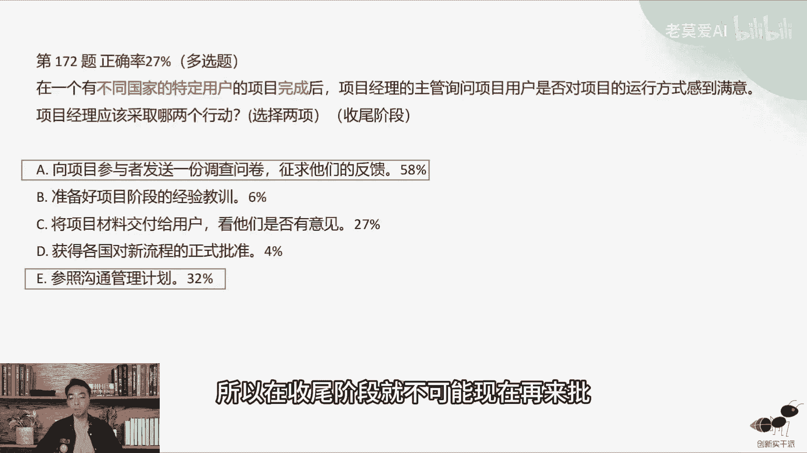

项目的170题，客户的项目经理在项目最终阶段发生变动，项目经理该如何避免项目延迟啊，他是说客户的项目经理，最终阶段就是最后的时间，回到项目刚开始的时候，你怎么去做啊，所以时间回到刚开始的时候。

我们应该怎么更新这个项目参与计划，在这个事情没有发生之前，我们如果是说客户经理，他如果发生变动了，我们应该去更新改写的计划，而不是说我们最后有一个省市最新项目报告。

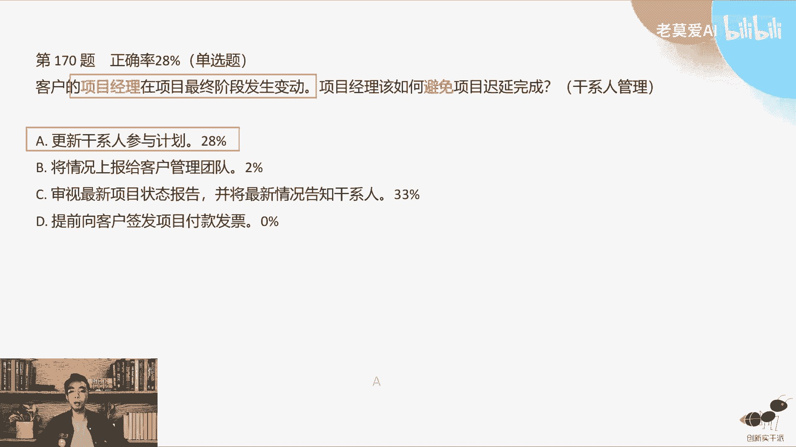

并将情况通知干系人啊，这个就不对啊，169题，在某项目的一个迭代中，一向以规划的活动变得越发复杂，相关工作应在最短时间内交付啊，这个时间应该用什么样的方法，其实最短时间内交付的话。

你应该想到会用这个自主资金团队的方法，也就是说其实他考的是项目资源管理，就是敏捷的项目资源管理，准确的来说是这样，就是什么样的情况下让团队最高效的去工作啊，敏捷高效团队应该是怎么样的。

应该是共同努力协调，就给他一个共同的目标，让他一起去完成活动，这个属于自组织的一种方式，自主咨询管理的一种方式，所以是C啊，A是什么，产品负责人将该活动载入产品代办事项列表啊，这就对了，为什么。

其实这里面主要你要最短时间内交互，其实也还是得靠团队，不能说只靠产品产品负责人去做一些什么事情，是不能达到高级效果。

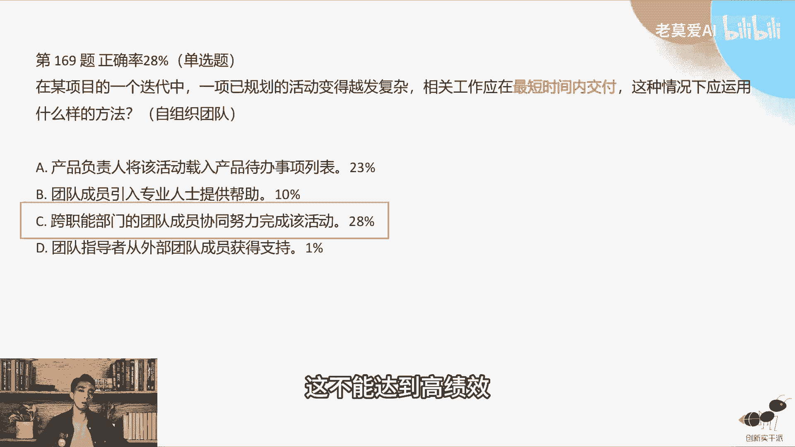

第166题，某市场团队正在开发思路，改进一个现有产品，市场主管主动联系项目经理，以确保成功推出产品所需要的必要措施，那么项目经理应该关注什么事情啊，这个里面说什么，确保成功推出产品所需要的必要措施。

其实这里面讲的是绩效啊，两个交付的价值交付的结果，所以这里面考试项目绩效果，那应该要改进的话，应该怎么样去做，所以这个里面关于绩效的只有一个东西，就只有D答案，确定并调整，助于评估成功交付的绩效质量。

才能达到项目绩效减水分值低，为什么不对，确定制定，确保制定项目管理计划已覆盖所有相关目标，好，那我问你这个范围管理计划其实说的是什么，范围，说的是什么，我假如我有十件事情，那我十件事情我都完成了。

达成了目标，是不是就意味着我的产品一定会成，不是啊，不是，至少在现在的项目管理，价值交付这样一个大环境下，它不是啊，所以A就错了，哎其实说的是我只要覆盖了所有相关目标啊，目标达成，那我就OK了。

这是很明显的传统项目管理的一些思路啊，啊跟现在的说你要确保产品成功是不相违背的，OK其实C也在说，这个事情也在说为常规的项目做出更新，做出规划，以覆盖关键可交付成果的状态。

就是说我只要完成这个关键和交互的，这个事情啊，其实我就成功了啊，啊还是要达到关键资料指标，说你没有达到收入指标，有没有达成，有没有达成我的成本指标，就是这些东西，所以正确答案是第一第163题。

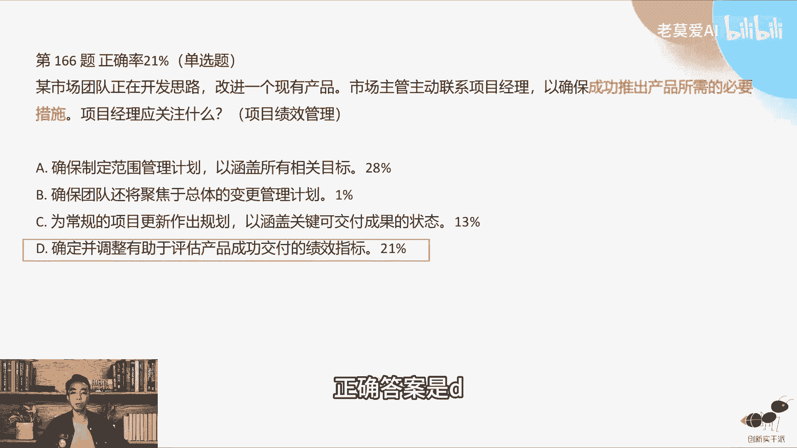

一位项目经理正在管理一个项目，该项目非常的复杂，执行期很长，虽然大部分都是预测，但是团队能够使用一个混合框架，将设计和执行分解成更小的包啊，设计下设计和执行是这个啊，这个非预测性啊。

企业希望跟踪这个框架所带来的价值，但是没有这个框架定义，但是没有为这个框架定义一套可衡量的项目，那项目经该做什么事情，如果要衡量它现在是没有可衡量的项目，如果要衡量它，所以要确定他这个效益可以被跟踪。

因为他其实讲的是什么价值，这还是属于价值传递，价值交付的事情，那么跟价值相关的就只有可测量的效益啊，效益关键词派一个人去跟踪报告，他就能够这个框架就很可以衡量，可以，而不是说我C里面其实好多人选C啊。

说工作分解结构的基础上创建一个报告，并定时定时定期更新，那么你更新这个报告，你是不是能够带来价值，因为价值是最终结果的东西，你过程做的再好再好。

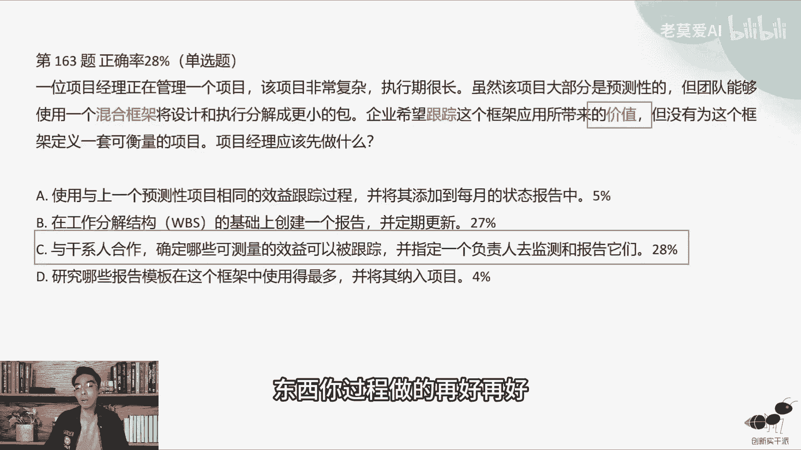

你没有一个很好的结果也是不行的对吧，在正确答案是C第30第148题，项目经理在努力弄清楚敏捷环境中，两个项目团队的绩效情况，在工作范围相同的情况下，团队甲算出的故事点100个啊，乙算出的故事点120个。

哪个团队绩效跟讲，这个在我的敏捷串讲里面，我们也跟大家讲过，说ab两个团队故事点不一样，即使故事点一样，你也没有办法去横向去比较，那比较什么东西，后面我给大家搞了一张表格啊，说个缺陷。

缺陷其实可以拿来去比较一下，可交付成成果中缺陷数量最小啊，其实是可以比较一下工作量，其实没有什么太多的比较价值啊，工作量它是一个过程的东西，只有缺陷，它代表一个质量，可交付成果中的缺陷。

代表你的最终的质量，就像说人家说，那为什么日本车它的质量就很好，美国车质量就稍微差一点，就是比较的还是质量对吧，那比较的是质量，就是日本车我觉得质量好，它比较的并不是过程，是结果。

所以质量它也是绩效的一种啊，结果这个就绩效高啊。

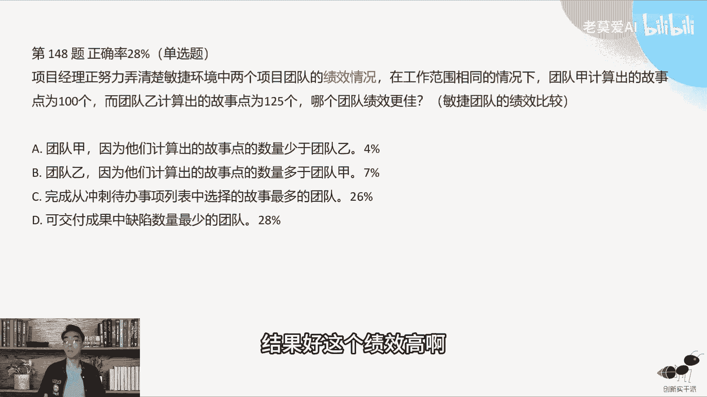

也是结果的一种好，第146题，有人指出一个障碍，导致一名团队成员无法继续推进工作，项目经理发现该障碍是由一个技术问题造成，项目经理应该做什么，来优先处理该关键的障碍的因素好，那我们其实这道题考的是什么。

你看这个有一个障碍了，然后发现是一个技术问题，我们之前说过，就是那个项目经理啥时候去介入啊，如果是一个技术问题，项目经理要不要介入在敏捷里面，为什么是敏捷啊，对不在敏捷里面。

SM介入的这个方式只有两种啊，第一种是项目管理问题，是你的领域的问题，所以你要介入，第二个是这个问题影响了三大基准，要不影响的范围啊，提了新需求，要么就影响了成本，成本超支了，要么就影响了这个进度。

就是项目延迟了，除此之外你不要出手，让团队自己去解决啊，所以正确答案是指导团队提出自己的解决方案，并知并将到增加到一个冲刺当中去啊，这个是D答案啊，虽然说举行头脑风暴啊，解决该问题啊，防火风暴不对啊。

这个里面头脑风暴是对的，就是错的，头脑风暴是做创意用的啊，创意增加了冲刺衔接，第一个冲刺不太对啊，要解决方案直接冲刺当中也不对啊，对目前来说的对应该是下一个冲刺当中，因为我们其实默认的是。

我们的项目在进行过程当中，我们是把不能插入任务了，你只有到下个迭代才能插入，因为迭代时间很短，但是那为什么会体现拥抱变化，有没有变化，我们随时关注外面来的需求啊，我们可以把需求进行排序。

我们可以把需求进行处理，但是现在暂时不做，我们的计划可以更新，如果团队起了冲突，SM要不要介入啊，这个是戴维说的啊，如果团队是因为技术问题，他起了冲突，他们吵一架，项目经理不要不用介。

但是一次两次解决不了，他们在那边持续的去炒啊，那我们就要介入了，因为这个这个问题越来越严重了，严重到有可能它会影响沙发机子，对不对啊，如果是刚开始的时候是不需要的，我们其实有一道题目是这样的。

有有两个员工一直争执不下，这两个问题一直在炒题干里面说，他有可能会影响这个项目，接下来信，那项目经理应该怎么样，项目经理应该怎么样跟他们私私底下去解决，因为公开场合已经解决不了了。

就私底下每个人单独去私聊，去解决他们的问题啊。

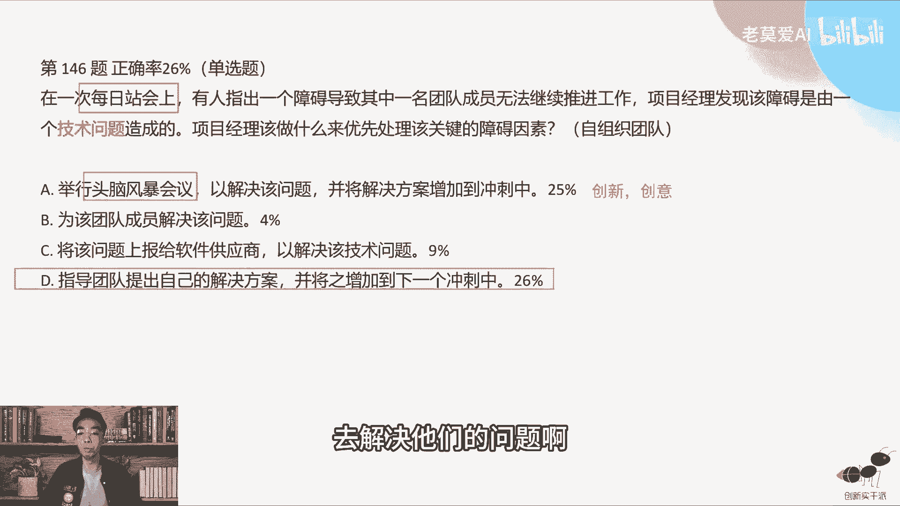

也是这样好，第36题，第125题，一位新的项目经理在一个项目实施中途，被指指派负责该项目，在首次风险审查会议上，项目经理注意到，项目团队成员所用的风险登记册的版本，与项目经理所用分拣登记测试版本不同。

项目经理本应该采取什么措施来避免房整体啊，这里面其实你用的文档跟我都用的文档不一样，这说明什么东西啊，这说明是沟通出了问题啊，就像我说莫老师我给你发的，我给你发的文文档，说我给你发的文档。

你说艾老师你发的我的文档不对，我说发的是对的啊，我说你这不是3月份的啊，最好的计划吗，你说不是，我收到的是2022年11月的备考计划，那说明我们两个不同版本不一样，那么这个备考计划的文档版本不一样。

这属于沟通问题啊，我们前面说了，沟通管理计划里面也包括了这个文档，放在哪里去存取是吧，所以这个是沟通问题，所以文档更新它是沟通问题，沟通问题就沟通去解决啊，避免怎么样去避免发生这种问题。

我一开始莫老师发送的文档给你，就应该是对的啊，为什么怎么样去避免这个事情，没有查账，参照沟通管理计划，就是沟通管理计划，你会学我们3月份的学生，应该给他发3月份的合同管理的文档。

这个文档应该在这里面应该告诉学生，这个问答是在这个这个目录里面好，所以B是对的，那么很多人选DD，为什么不对啊，验证项目工作如果没有避免这两个字，那就选D啊，验证项目控件就是我发过来的版本。

就是你收到的版本，跟我觉得我发的版本不一样的时候，你说老师发的文档那个文档不一样，那我第一步我应该做什么，我事后应该做的事情是，我应该在我的文档库里面找，我是不是发错了，那是不是发错了。

这个之后的这个事情应该是低啊，验证我们的项目，但是这个是事后他他问的是怎么样去避免避免，那就是B了啊，所以正确答案是对好啊，还有一个问题想提醒大家啊，我们做了这么多题目。

有一个题目里面说了软件版本不一样不一致，比如说我们开发的是5。2版本，但是我们发出去给别人的，比如说我们开发的是微信5。2，我发出给给到别人的，别人一看你这个版本是微信5。0，这个版本管理的问题。

是软件版本更新的结果的版本问题啊，这个版本是属于配置管理的问题，这配置管理没做好，这不是沟通问题了，所以这个是不一样的啊。

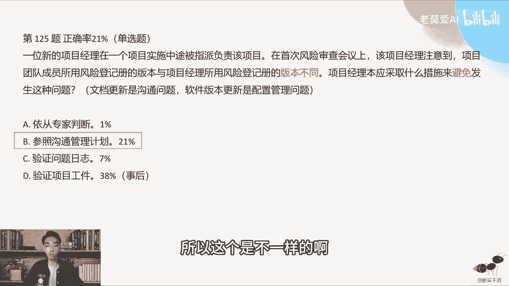

OK好，那今天正课讲完了。

