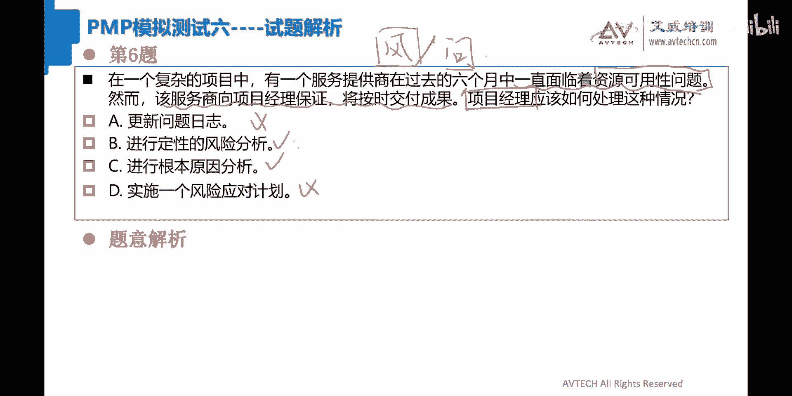
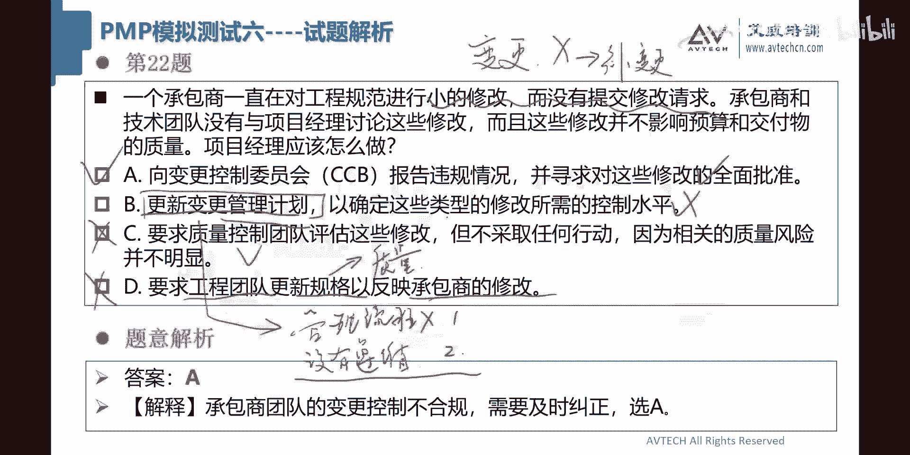
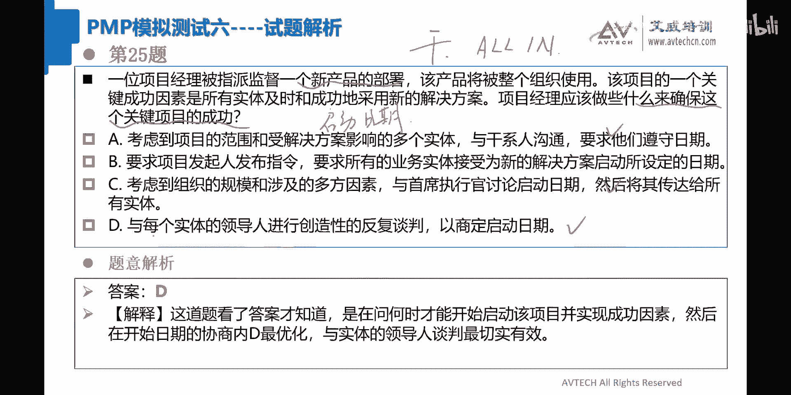
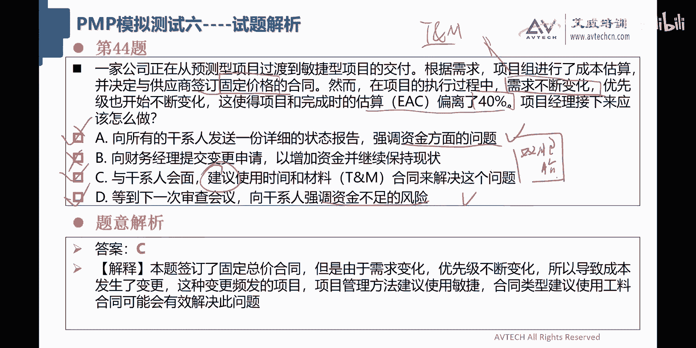
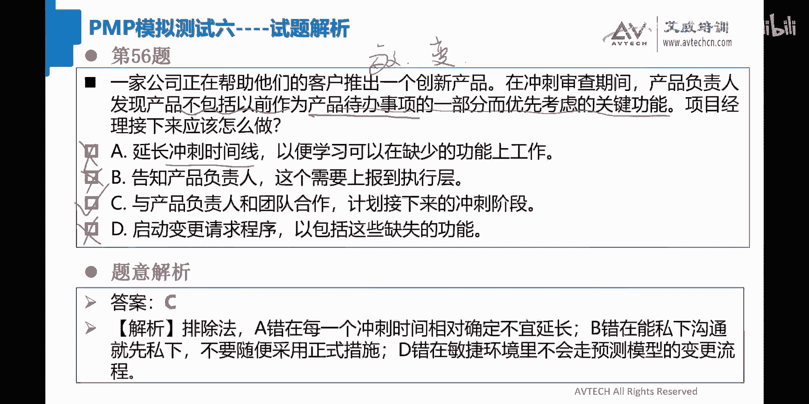
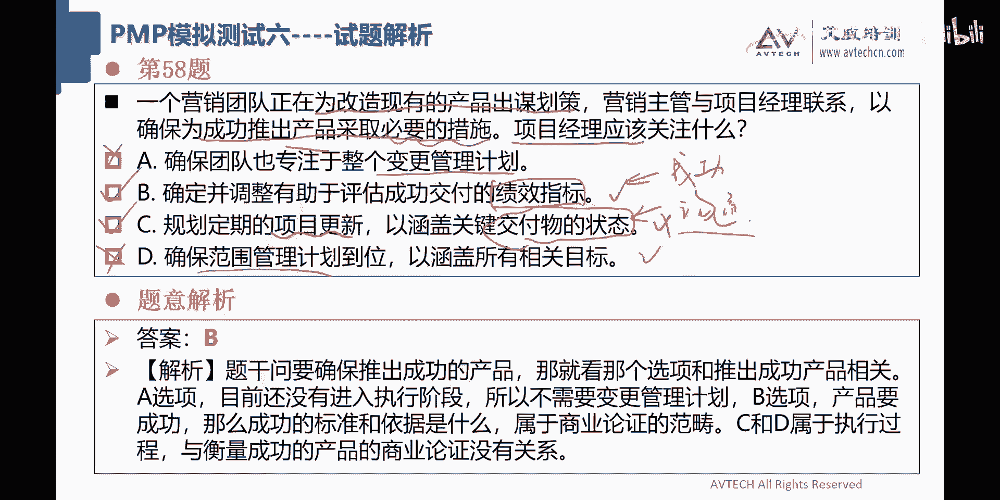
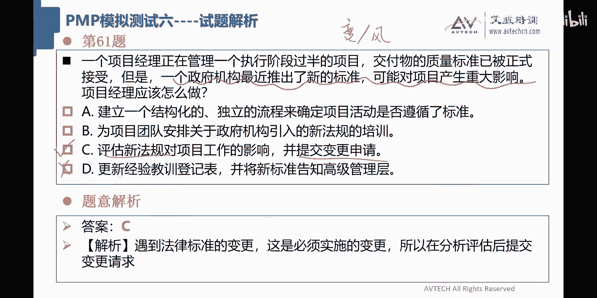

# 2024年PMP考试答题技巧-教你PMP如何做题（上集） - P1 - 艾威PMP项目管理 - BV1Pm421G7KD

那么好，那那么我们就准备开始吧啊。😊，好了，别的都不多说了啊，老规矩大家都知道我们上午的时候会休息10分钟。然后上午的话我们的目标应该讲完9十题。好吧，下午的时候我们应该是一点半开始。

然后的话应该是在4点半左右结束。好吧，所以所以这些该说的都说啊。那么大家把这个错误的答案全都搁在里边啊，你看同学们已经约一次了，已经把这个错误答案经搁上了啊。那这题目有同学选A啊，我们准备看一下啊。😊。

还有一家大型企业正在从预测性方法向敏捷方法转型。一个具有敏捷实践知质的项目团队，要遵守流程方面和高管发生了重大冲突啊，看这个东西。对吧通常来说，我们说出出现重大冲突或怎么办，对吧？

有的选有的选B有就选C啊。😊，那么如何解决冲突？通常来说，这种东西我们可以把它归类为资源体。懂吧？那么资源题当中产生冲突的话，大多数啊这种冲突啊，这两个字ve very important懂吗？

引导引导着就就这样往引导方向走。好吧？好，第一个，你比如说你们同学选A啊，将高管纳入团队的回顾性工作中啊，OB这个东西啊，回顾是什么意思啊？回顾是回顾啊，要展望，对吧？我们要有改进，对吧？

现在流程这个东西你要引导，要让他们先达成一致，所以这个跟回顾完全任何关系都没有，一看我就觉得这个回顾啊不是那么正确。比对高管进行敏捷时间培训，你怎么知道他们高管可能也是团队有问题。

你说是不是所以这个里边你别不要不要这样，你应该首先要做的事情应该选C的，引导就很好，对吧？为什么那么多同学选C，那就肯定是C答案了，好吧，第一节大家理解了吧？理解的话，请扣一啊，选A选B啊。

我应该把刚才所讲到的内容已经讲清楚了，好不好？关键字划清楚好，那我就过了。😊。

好，第二题我们来看啊。😊，一个项目经理正在和一个。发起人就一个新项目进行会谈这全都是背景信息啊，项目经理告发起人作为沟通计划的一部分，每周要发送一份电子邮件，说明项目的状况。

你看这个东西一说呢应该差不多应该是沟通题，对吧？以便发起人能够了解这个这个这个进展情况发表示没必要发邮件。

因为他们正在需要的时候会提供状态报告项目经理接该怎么做那我们看第二题啊还是你们要写那个数字把数字带上好不好啊，2B这个比较难看啊，2D对吧？

这个东西啊建发起人在必要的时候召开15分钟会议并行通知好吧同意发起人要求，并且继续在每周电子邮件中抄送他们以便他们能够获得需要的信息啊，正告诉发起人如果他们不需要收到信息。

可他们电子邮件中移除询问发起人需要什么样信息，并就沟通频率打成一致这里边记好像有人选了B对？人选了个这道题目呢其实说白了就是沟通题，那么他这个里边最主要就是这句话没必要发。😊，电子邮件沟通出审冲突。

对吧？勾建出动冲突怎么办？我们叫一查。二分三更新对吧？按照这个思路来走啊，那么在一查二分三更新当中的话，我就觉得这个dog应该是最好。为什么dog就是走的是二分析，对吧？

需要什么样的信息就沟通频率达成一致，你不按那种呢同意发起人的要求呢，就没有dog来的好，大家发就选bo吧。你这个是属于无限的妥协啊，对吧？你这里边应该要搞清楚啊，做题目或者说是做项目的这个问题解决方案。

不要有一种叫头痛一头角通一角的这个思维，你现在没必要发邮件，那不是简单同意就O的，应该干嘛？应该要找到相关的什么样的信息。所以这道题目dog一定是对的啊，应该理解了啊，选bo同学啊。😊。

好，第三题，一家公司已经同意使用敏捷方法运行一个转型项目。在实施过程当中，有来自职能部门的反馈认为项目的进展太快了，项目经理应该做什么来防止这种情况发生了，他认为太快也不是什么好事啊，这个东西。

那么所以这道题目应该是属于进展题，对吧？O啊，进展题A传越项目章程啊啊，好多人选B啊，评估组织文化OK确定员工的沟通项目进入计划。😊，这里边好像哎我觉得do应该是比较比较好啊，有的选B，有的选C啊。😡。

有的选B，有的选COK。😊，好呃，传业项目章程肯定是没有人选的。为啥项目章程他没有任何跟项目进展控制的方法中相关，对吧？但是我就不不能理解同学们，你们选B是什么原因啊？哇塞，他们认为项目的进展太快了。

这是完全是进度的问题。😊，你们为什么要选B评估组织文化，组织文化经常会带来什么？比如说项目管理方法，对吧？项目管理方法它是不是适用，对吧？适合于这个组织经常会这么干，对吧？或者说什么呢？

或者说你项目自己的这个职能经理的，他那么管理水平，对吧？管理能力管理水平，对吧？这个东西是不是符合，对吧？O所以这个东西是评估组织文化，他要做的一个前提条件，对吧？那么在这里面你说这个里面进展太快。

跟评估组织文化有什么关系，没关系啊，哇塞这个东西大拉拉就可以管定了啊，看你说什么？我看一下，组织是否能够接受程度太快，那也不是这个是接受他跟组织文化不一样，懂吗？什么叫组织文化，对吧？

因为就像你们自己在学校里边的时候，学校有他自己本身的口号，对吧？勤劳勇敢，对吧？类似于这种叫组织文化，你接受不接受，这个不在这里边，这是项目管理方法，所以比肯定是驴程不对嘛嘴类的啊，希望大家一定要明白。

还有一个是确定员工的成熟度，😊，确定员工成受度有什么关系？我塞，还有同学选C的。😡，对吧也没关系啊，你这个圈购员工有成熟度，你发酒吧，成熟度通常在什么地方技能。对不对啊？技能O或者是进展缓慢，对吧？

O进展缓慢，或者是什么客户他自己的这个这个这个希望没有达到。那这个时候你去看看员工的技能，对吧？对吧？类似于这种场景呢，你你你你来一个进展太快，我的天哪，好不好？好，所以这道题目C也不是什么正确的答案。

这道题目其实就应该是选D了，沟通项目的进入计划，你这个玩意儿啊，他说进展太快啊，他说实施过程来自这个进展那，有可能是误解吧，对不对？所以我要把我当前的项目的进入计划，然后要跟你们要说清楚。

这个叫沟通进入计划啊，就这个意思。好。😊，好啊，对好，被开始时做什么来防止。对对对，这个东西防止两个字要划下来。那么早一点跟他去沟通，进入计划，就这个意思，好吧。😊。

好，来看第四题，在过去项目经理和项目团队成员使用预测性方法表现良好。然而，该组织最近才决定采用敏捷方法。项目经理希望在一个即将到来项目中使用敏捷方法。在启动项目之前，项目经理应该做什么？😊。

那么这件事情我告诉大家，这种题目就很难做，为啥不像这种题目，这种题目它其实是有很明确的关键字的，你们发觉了吧？对吧？所以我也不知道他这要干嘛，对不对？你这个就是一个开放性的问题，A跟B啊。

很多人要选A跟BO哈准备一份风险报告，记录下风险的概率和影响和发起人分享和团队组织分享决定并制定计划在即将到来的项目当中采用敏捷方法，向人力资源部门提出申请，这个没有人选C的对吧？要求发起人改会预测性。

又是发起人，又是那个开历史倒车。所以C跟D我们就不干了。😊。

那么我们来看A跟B这两个东西到底选啥嘞？😊，啊，我也倾向于A跟B啊，记下风险的概率。😊，和影响和发起人分享。分享组织决定制定计划即将到来才用敏捷。你们选A的同学是不是觉得哇塞。

这个敏捷肯定会带来一定的问题或带来的风险。所以这道题目应该选A了。但是我觉得这道题目还是选B会比较好一点。😊。

OK选B好一点，来，我来看一下答案啊。😊，OK看到没有？是选B的。为什么很简单？我有一句话就可以把把这个。😡，多死了。😡，你要了解风险这个玩意儿，它是last choice。😡，你们听懂吗？选A的同学。

你们就这么记，所有的东西。如果说他有其他可行的答案，你优先考虑其他可行答案。风险是last choice，为什么？因为风险它自己的涵盖面太大了，你看这个里面，你看A就很好，对吧？是不是？

那你看你看第三题。😡。

你你说A答案可以放在第三题吧，也可以的。所以这种啊放置五湖四海皆准的答案反而是不那么准确的。我自己个人感觉为什么这里面我猜了一下，我觉得应该是B啊，是B分享组织决定制定计划。

因为你不是要求我在做这个敏捷方法嘛，对吧？发起而希望看到没有？😡。

看到没有？对吧？如果来个E答案，我肯定选他。比如说评估组织文化，我天哪，那你们会不会选一啊，来来告诉我来，你们来选一下评估组织文化。如果这道题目突然之间来了一个来了个E答案，你们选不选？😡，啊。

铁钉我肯定说我肯定选OK啊，在在做敏捷之前，我先看看我们有没有这样的说法，对不对？就这个意思。OK好。😊，好了，那么有一个同学在问了啊，启动项目之前啊啊不是问啊。😊，OK旭同学启动项目之前。呃。

啊，启动啊呃，你的意思这也是关键字是吧？😊。

启动项目之前应该做什么？好的。

好了，那么我们来看一下第五题吧啊，我我觉得其实到目前为止，5题啊没有什么难度啊啊，这不晓得大家为什么错的那么厉害啊。好，一个处于执行阶段的项目落后于进入计划啊，缺少一些材料，供应商提交报价。

提供缺少并要求补偿窝工的费用啊，因为内部采购程序导致更多延误，项目经理不同意，接下来怎么做，这个就是妥妥的，这个就是采购题嘛，采购题干什么？一查二谈三终止，对吧？😊，一查二谈。三中指对吧？OK好。

那么项目应该怎么做啊？这道题目我们来瞅一瞅啊，好多同学选了个B，选了个C啊，我把你们。😊，剩下来。呃，选B的同学们，你们就不要去想了，哇塞我告诉大家，在我们啊这个里边做题目的时候，从来没出现过这种答案。

更新采购管理计划。😡，啊，你们选B的同学怎么想的，对不对？那采购管理计划就是采购的方法。现在人家在那里要这个要那，你要查的东西，也不是查采购管理计划，你查的应该是合同，对不对？😡，对不对？

我曾经跟你们讲过的，你出问题的话，你跟采购管理计划一毛钱的关系都没有，对吧？当然还有同学选C啊，我操好可以的。好，所以BE这件事情我们就干掉了，好不好？好，C要求承包商。😊，审查报价并降低费用。哎。

这种强迫命令的东西啊，我觉得个人感觉你不要去选它。😡，懂了没有？你不要去选他，我觉得这件事情啊应该是跟敌意相关的。😡，啊，没找到合同就懵了。采购策略。如何进行采购？OK采购管理计划进行采购内部采购。

他提交这个采购管理流程的这个这个所有的方法论，对吧？采购管理策略这只是跟我们的供应商合作的啊，没有找到合同就懵了。那么这个东西我觉得。😊，市场哦，对了，你们为什么选B就是这个道理，和供应商进行谈判。

反正就是becon dog。但是我告诉你，这个里边这个玩意儿它真的不能够随便更新。😡，懂了吗？这是一个方法论，你为什么要更新呢？相对来说采购策略是一个项目文件。像他这里边啊，所谓的缺少材料要求补偿。

所谓的这些什么采购程序导致延误，其实都是跟我们的采购策略相关的，懂了吗？所以这道题目我自己个人感觉倾向于应该是选dog啊，就是一个文件，还有一个是是是是是是管理方法。

你这里边的更多的都是跟数据相关的内容。那你就应该说dog呀。

对不对？是这个意思啊。😊，啊，有同学说是可以外包吗？这道题目里边啊，你问我我当然是不知道的，对不对？你要问这里面的项目经理好不好？他们到时候会采取一个什么样的一个措施，好不好？好。😡。

好，第六题来看一个复杂的项目中，有一个服务提供商在过去6个月当中一直面临资源可用性问题。然后服务商向目面保证按时交付，项目经理该怎么做？一直面临资源可用性问题。我觉得这件事想妥妥而到，要么是风险题。

要么就是问题好，更性问题日志定性风险分析，进行根本原因分析实施一个风险率计划。好，选到个选A选bo，对吧？好多同学都在那里选很多的东西啊。😊，哎，这个东西我觉得好像差不多应该是。

我觉得这道题目首先你们来告诉我这道题目它是问题还是还是风险。😡，啊，哎还有个选C的，我天哪，一家人整整齐齐啊。😡，Okay。😊，一家人整沉齐齐学室啊。😡，好，已经发生了对吧？好，那么既然已经发生了的话。

那么就不应该要去做。哎，选C的倒是挺好的，根本原因分析啊OK。😊，根本人分析也不去看，只是一个风险优计划，更险问题日志。这个答案哇塞，好像把我们A套B套的全拉了一块了。😊，呃，这道题目有点难度啊啊。

我不好意思，我收回刚才的话啊，前五题老张有点飘了，我。😊，这道题目很难。债就很难。面临资源可用性问题，向他保证按时交付成果。嗯。这道题目我有点。你看老张也分不清楚，对吧？我也分不清楚。

我觉得后面有一些同学说的有点道理的。😊，就是这句话其实也应该考虑在内。就是他这里边面临了资源可用性问题，这首先是个问题。然后他这里边对项目经理啊，我们先说这个项目经理啊，承包供应商他是说了。

说未来我肯定是能够交付的。但项目经理说我信你个鬼，你说是吧？对吧？你这个糟老头子坏的很，你做的这个承诺对我来说，我是不可信的，对不对？你现在6个月一直面临资源可用性问题，抖抖说说，你说你按时交付。

所以对项目经理来说，他是识别了这个东西，我自己个人认为对的，你们说的应该是有道理，就是跟风险相关的。😊，而不是问题相关。对项目经理来说，这对我来说就是一个风险。对我们服务供应商来说的话，这是一个问题。

所以服务供应商应该去更新他的问题日志，而项目经理应该去更新他的风险登记册。这个大家觉得怎么样？😡，这个逻辑大家能理解了吧？理解的话请扣1OK所以这道题目如果照这样说的话，我觉得应该把A跟dog应该去掉。

就留下B跟C，但是他如果真的是算风险题的话，应该是正确答案应该选的。

哎，你看你看我们对了是吧？我天哪，我才好害怕，我勒个去我。😊，啊，这道题目其实挺难的，就是风险题这种东西啊，一出来你是这根本不清楚它是问题还是还是风险。😡，啊，所以这个这个嗯即便我是蒙对啊。

人就我也不敢。不敢造此，哇塞啊，好的好的，这道题目很有，我我我我给一个赞，哇塞可以的啊。黑皮老师别你别看啊，他在选择这个题目的这个分子上面还是属于非常这个精道的。哇塞。😊。

好，第七题我们来看第七题。😊，一个项目经理被要求参与一个允许客户购买在线电子学习课程软件采购过程。一旦找到供应商项目经理，就要接管这个项目，项目经理在开始前应该做什么，项目开始前做什么，确保需求被理解。

批准协议之前，对目标进行核实。这道题目我觉得A就很好了。对吧你这个其实你你这种东西就就没有那个，其实说白了这句话什么意思？就是项目启动的时候，启动的时候你得干嘛？你说对不对？反正合同都签了。

反正启动的时候，项目经理该干嘛，你要接管这个项目嘛？这里边不就是A了吗？对吧？同学们也选A啊，告知发起人一旦签署了，就不能对项目的范围做更改，胡扯，我塞逼啊，告知发起人，项目经理不能参与协议的。

这个胡扯，我塞啊，要求项目发起人胡扯，我操哎，你先发起吧，除了人力资源部门之外，我先发掘这个玩意儿也经常是一个反面决策，你们同意吧。😡，对吧就是法律部门啊，这个法律部门其实也没什么用啊。

所以第七题这道题目就应该选A了。按照我们正常的项目的管理流程来走。这道题目选A啊，这道题目也也其实我我这么说，也是属于比较困难，为什么说他困难啊，当然是BCD肯定不对。

困难就在于说他没有告诉你这套题目的他的难题在什么地方，你们发觉了吧？他的这种矛盾啊，难题对吧？啊，什么什么客户跟供应商斗啊，或者说项目经理跟团队斗啊，这种都没有，他就是给了你一个背景信息，问你怎么办啊。

所以要你自己去看，所以第七题也也不简单啊，不简单。😊。

好，第八题，一个初级的团队成员啊，向项目经理提出个问题，说另外一个人员的人际交往能力导致团队这那这种你看就是提出问题了，看到没有？项目经理该怎么办？这就是妥妥的资愿题啊，50%资愿题嘛，对吧？好。

那么这道题目有的选B有的选C啊。OK强调其行为的影响，B激励团队进行改进，收集原因找到问题的根本原因。对于我个人来说啊，如果说你们两个啊一个是选B一个选C啊，我肯定选C的。😊，肯定选C的对吧？

就是为什么我要私下沟通，私下交流，就是为了来找为什么嘛？😡，对吧所以选B呢激励团队，你应该强调其行为的影响。哇塞这个东西站在冲突角度上面来说，这是什么玩意儿，你告诉我。站在冲突管理的话，这是什么？

这是强迫命令啊，你说对不对？😡，对吧你这一看就理解了吧，强迫命令你这里面收集信息找到问题的根本原因，这个才是合作解决的斟种方法。😡，从这个角度来说啊，我们先写个资源，再写个冲突，对吧？你一旦说冲突的话。

你就用冲突的这个考虑。所以这个种东西啊，我觉得C肯定是正确的，你看到吗？

对吧啊我我的眼睛就是尺嘛，对吧？好，第八题正确答案卷选C啊，选C可以的。😊。

好，第九题产品负责人啊，敏捷题，我们先把这个产品负责人画一下啊，决定在几个版本之后推出一个产品，知道最新可要产品缺乏一些功能哈，这个是我们的关键字，其中一个关键干型儿对结果非常不满意。

所以这敏捷你可以把它认为是干系人体或者是什么范围题。因为它缺乏一些功能，并质疑发布决定啊这个很重要，质疑发布决定。😊，就说这个玩意儿它其实产品负责人也知道MVP缺乏一些功能。

但是产品负责人还是决定要发布。所以呢这就引起了这个营销副总裁的他的不满意。好吧，先把这个先说清楚啊。好，有的同学选B，有的选A啊，我们先把它勾一下。支持产品负责人决定寻求干系而更好的保持一致。

以避免将来出现这类问题。在决策中指导团队，假设对产品发布采取规避风险的策略。呃，你们选B的这是什么意思？来来来选B的同学你们给我解释一下，哇噻这个B我都没懂啊，我的天哪啊好C承担发布产品发布的责任。

这个锅我们为什么要主动的去背呢？哇塞徐同学，你选了个C是几个意思？这个锅哎他缺乏一些功能，他知道缺乏一些功能，就是他自己故意没排的东西，对不对？所以导致了人家不满意，懂吗？

你项目经理站在第三方不拿瓜子板凳查，你还自己冲进去，我塞承担产品发布的责任，我塞，对吧？所以这道题目呢，我上不发起人，这个肯定是不选的。😊，这道题目呢ABC当中我还是挺A的啊，挺A的。

这道题目是妥妥的干型人体。我前面就想讲这个干型人体，我前面讲是干型或者范围题。但是从四个答案开始来说，没有什么范围。😊，啊，没有什么范围。好吧。

所以这里边最主要就是要协调产品负责人和营销副总裁他们之间的这个矛盾。

懂吧？就这一句话，所以这道题目应该选A，看到没有？好吧，那我来一个个看啊，这选B的呢，我真的不知道啊，你指导团队假设对产品发布采取规避风险的策略。换句话说就是你要把这些功能要放进去了，对不对？

你只有功能放进去的话，这个营销副总裁才会满意嘛。所以这个B肯定是错的，为啥？因为产品负责人怎么说，我们就怎么做，懂了没有？这个决定是产品负责人他自己做的，懂了吗？所以这个这个跟团队没有任何关系哈。

承担啊，这个C我也已经讲过了，没有任何，所以这个题目应该选A干写人体啊，干写人体。😊，哎，假使说啊我们今天这么说，假设来个E啊E单啊叫查看。😊，查看呃，范围说明书吧。OK范围说明书。😊，已确认。啊。

我给你来一个答案啊，已确认这个这个这个功能。是否应该被发布？请问这个题目选什么？😡，啊，这道题目选什么？查看工作说明书啊，查看那个范围说明书，以确认功能是否应该被发布啊。

你们千万不要认为老张给的答案就是就是正确答案。懂了没有？你看萨达姆同学看到吗啊，这个请萨达姆同学再将你们的年终假打入老张账这题目还是选A呀，这道题目还是干洗儿提啊，为什么是干，我给你们一解释啊，对。

就前面那个M先生说了，他已经知道了这个缺乏功能，所以这个矛盾呢，就是干喜儿跟产品负责人他们之间的矛盾，对你来说，这个东西已经是板上钉钉的锤子已经是确认的玩意儿，你查个毛的这个范围说明书啊。

你说是不是这个已经成了一个既定的事实了。所以你要解决的是干喜人之间的矛盾了。😊，大家听懂了没有？听懂的话，请扣1啊。OK啊，听懂话请扣1。😊，好，所以第九题正确答案应该选择的是A，即便有E。

你还是应该选A啊，要根据场景自己来考虑这个问题，而不是说我塞老张给了个新答案就可以选啊。

好，第十题来，一个项目经理正在为一个主要的建筑项目工作，计划一部分使用一个基于云的系统。其服务器在高速互联网服务上运行，其大叔团队做施你工作需要积力的降低运营成本。

管理经认为该项目在使用一个传统不好服务上的运营系统怎么我都没看懂啊，哇塞这题莫哇塞啊项目经理应该怎么做啊，OK。嗯。计划使用一个基于云的系统，其服务器满篇都是我我们IT的这个术语。但是我作为一个IT老。

我居然没看懂，我塞。在互联网上运行都是虚拟工作，需要尽可能降低运营成本。所以他不要用这个云服务。所以他还是要传统拨号服务上运行的系统。懂了没有？所以大家知道了，他不希望要与云系统，还是要有这个系统。

项面信应该怎么做啊，评估决定的影响，并与管理层沟通。好，我看着哎，我就觉得很好啊。OK哎，同学有其他的吗？有其他的选其他的吗？OK好，哎这基本上我翻了一下，全都是选A啊啊，好吧。

排除法选A同意管理层意见啊，管理层会面讨论决定，叫他们再找一个项目经理。这句话其实说到这边啊是对的。后面那句话就就就就扯呼了，我噻O替换一些这个人是不能替换的对吧？同意管理层意见。好。

这道题目应该选A问题不多啊，评估决定和管理层沟通，对不对。😊，好，那这道题目应该选什么呢？这道题目人家做决定，你算把它认为是干洗儿体，对吧？干洗人有顾虑，要私下跟他们沟通，对吧？这就是我们做题思路啊。

😊。

啊，简单。😊，呃，十一题，一个发起人及时收到了项目的信息更新，但是缺少了关键信息。发起人现在很担心啊，项目经理应该怎么做嗯。审查主要干系人的需求，确实项目心理被理解和反馈呃。那个那个确定沟通方法。

频率和详细程度。哇塞。向该始提供所有信息。我塞。ABC貌都可以啊。你们发觉了吗？同学们啊，家人们这个ABC貌看起来都是哎，首先先定性啊，沟通题对吧？沟通题。😊，审查干事人的主要的沟通需求。

确认项目信息被理解并收到反馈。不对，这道题目你们看这句话，这个由于很重要啊，说报告中缺少关键信息，这明显是你自己的这个报告有问题啊。😡，你说是不是啊？报告有问题啊？所以这里边不是说你这个报告确认信息。

你们将将就着看，你要自己通过这个东西自己有理解反馈这种这所以这个笔首先第一个干掉了就是B啊，跟刀哥一起干掉，留下就是A跟C。😡，A跟C很难啊，审查干涉肉的沟通需求。这里面我们做PK啊，这是沟通需求。😡。

这是沟通方法，推迟拉交互时对吧？沟通频率是一周还是一个月，以及详细程度。Okay。😊，所以这两道题目。这两道题目你别说还真的是挺那个的。还挺难的。啊，不是频率。审查沟干细儿的沟通需求。

一个是需求、频率和详细程度。那我这道题目还是占A吧。占A为啥详细程度有可能我臆想了一下，我认为这个东西可能就是他的需求。😡，对吧你这个要详细到什么地方。OK可但是后来一想，你真的是咬门嚼智的话。

这个缺少关键信息啊，它是站在需求这个角度来看，而不是站在详细角度来看。😊，对不对？详细是可以有这个东西，但是你可以写的粗，但是缺少这个玩意儿一定是跟需求相关。😡，所以这个题目呢，我们来看应该是选的是A。

哎，你看我又蒙对了啊，同学们，所以这里边一定要有分析啊，详细程度就像这种东西就是一定要咬咬门嚼子啊，所以我前面其实很很郁闷的就在于详细程度，它跟需求之间的区别。😊，好吧，OK好像这个实题做下来。

我觉得模拟六还是有点点问题。好像我前面跟你们讲过，有三题我感觉还比较困难的。😊，啊，对吧有一题就是他根本没讲什么，问你下步该怎么做。有两题的话，就是他的答案就分不开，就特别的接近，叫什么？

一定是在那里是做做这种这种文字游戏的啊。OK啊，我有点害怕了嗯。

好，不管了啊，我们准备啊。十二题一个项目由于质量审查中发现了多个问题而被推迟。😊，每当这个团队解决一个问题啊。就会遇到了更多的问题，这让项目组发起人来说都是令人沮丧的。这一句话其实很重要。O。😊。

那么因为他们想达到组织所期望的日期和结果啊，对吧？啊，还有选do的okK好，项目经理应该怎么做啊，要求团队识别记录登记问题，找到问题的根本来源。我觉得A就很好。我待会儿来讲为啥评估成本和进度的差异。

确定项目偏离轨道的程度，B不是的。😊，啊，待会我来讲为什么要求他是承诺一个新的成绩，这是CC是耍流氓啊。我直接啊聘请个高级主题专家来分析解决问题，其实do也是OK的。😡，那我们讲为什么。😡。

这道题目解决一个问题就会有更多的问题。最主要这个东西我们是站在质量角度来看问题。质量当中问题解决，他说要找到问题的根本原因，只有根本原因找到之后才不会发生解决一个问题，遇到更多问题的这种可能。

所以其实根本原因。这个东西它是我们做这道题目的最主要的一个想法。😡，懂了吗？懂了吗？所以这道题目你们知道B跟C为什么不对了，你C耍流氓对吧？承诺一个新的日期，你这就是头痛一头脚通一巧，对吧？

然后你评估这个东西，这个完全是驴唇不对马嘴的答案，根原根本原因一点关系都没有，就留下A跟dog就留下A跟dog对吧？然后诺尔同学讲的很好说dog的话，它这个是属于要钱的做法，BA这个做法是不要钱的做法。

那所以这个东西两者相比较，一个是团队，一个是SMEO所以这道题目正确答案我们去选A了啊，O好，萨达姆说什么？为什么不是为啥不是团队能力不足啊，也有可能是态度问题呀。😡。

你们懂我意思吧？很多很多人其实说到底了，深挖问题本质根源都是由团队来做。因为他们最清楚发生了什么事情。😡，但是呢他们就不愿意做。😡，对不对？所以这个东西它不能够马上就定性为团队的能力问题。

首先还是要通过团队的这个反馈，先获得问题的原因。对不对？如果发觉这个原因，团队是凌驾于他们这个能力之上的那你再考虑后面的问题。上道目理解了吧？理解的话请扣1啊。OK好，十二题正确答案应该选A。😊。

好，十三体一个研究和开发部门正计划开发一个产品，将这个产品啊引入一个业务的，将这个产品引入一个业务线，用做什么来增加项目的成功计划。你看这种题目我就是很恶心啊，你就给你一个背景信息，对吧？

问你你怎么做成功。好好，有些同学选A。😊，选A选C啊选A选C。选一选C还有选什么呢？好，我们一个看啊，选啊，还要选D啊。OK好。😊，好。好，好像我先选了D嘛，然后再看到正晴的答案。哇塞。

有一种我预判了你的预判的感受啊，very very good。😊，好，计划召开一次会议啊，重点讨论该计划的范围愿景和任务。我觉得这个东西挺好的，哇塞。啊，OK好。😊。

比根据项目管理办公室以前的项目模板开始制定项目进度计划，这个B切可能也有问题啊。C进行标杆对照，以提倡项目的商业可行性。O。对新举措进行影响分析，确定项目应该如何推出。哇塞，这个题目可以啊，我天哪。😮。

家人们，谁懂啊，这个东西做不来啊，我天哪。😊，我再看一遍啊。正在计划开发一个产品。哦，对了对了对了，把这个也划下来，这是时间。😮，这是什么东西？这是商业环境题啊，写个商字。啊，商业环境体。

为什么说商业环境体计划开发项目都没有出来，要增加项目的成功机会。其实说白了就是要增加项目的业务成功机会啊，业务成功。😡，那这样子说起来的话。A就错了。C跟dog进行虚主册影像分析。

推出项目应该如何已确定项目应该如何退出。C也挺啊，dog也挺好的呀。O。好，糖糖，你们家的猫是不是踩了你们的这个踩了你这个键盘了，我塞啊，怎么突然间给了一大坨啊，我天哪。😡，这道题目如果是我的话。

我可能啊会怼到C去。啊，虽然你们很多同学都在都在都在引诱我选到的。为什么很简单呀？商业可行性嘛。😡，O商业可行性跟这个里边的最大的。😊，PK最大的区别在什么？商业可行性是可行，mabe也不可行。

这叫什么？这叫双业论证。懂了吧？也就是说你计划推出这个产品到底OK不O我这个玩意儿先要做上业论证。😡，doer它是完全是站在项目管理这个角度来看问题的。对举措性影响分析应该如何推出。

反正他站在的一个角度，就是我这个项目是一定要可行性要去做的。所以这道题目啊，其实你从它的这个完整度上面来说，我肯定是占C的。

对吧你看吧好，所以希望大家明白啊，十三题我告诉你这种题目最难做了，这种题目怎么增加成功机会，什么东西啊？哇塞，这种商业环境题啊很难做。😊，好吧，对，如何推出是方法论，是项目管理方法。

而这个东西它首先是计划开发一个产品。你首先要做的是商业论证，这个玩意儿不能够，这个不能乱。大家同意吧？同意的话请扣1啊。所以这个题目也很难啊，十三题。哎呀，这个题目做的我有点汗滋滋的嗯。😊，好。

希望大家能明白啊明白。😊。

好，我来看一下同学们的反馈啊，这道题目。啊。这个题目告诉我PM是一定要走流程的吗？这道题目应该是告诉我们，他计划推出这个玩意儿的话，你首先要考虑的是商业论证，而不是说如何推出。

很多项目经理这点倒真的是的，因为什么？因为我们的这个项目管理手段啊，他现在对我们要求是要有这种叫战略和商业思维。什么叫战略和商业思维啊，就是这个项目值得不值得做，这个是首先第一步的。😡，听懂了吧？

所以你也要把这一块要纳入进来。好吧，希望大家明白啊，振兴同学啊。好，选A选B啊，对吧？呃很多同学选A选B啊，我先过去上轮论证PM做吗？上轮论证可以PM做懂了吗？可以PM做，但是必须要有发起人审批。

懂了没有？😊，好来哈，来第十四题啊，十四题，一个项目的管理办公室已经开始实施迭代工具，指流程框架。项目已经立正在一个新的项目发现已使用迭代工具的机会。其中的高级经理对已变更的流程框架表示担忧。

因为对公司来说太新了。来来来，我们看已变更的流程框架。😊，OK项目经理首先应该做什么？OK。😊，呃，这个东西我觉得PO要实施，那就反馈给PO吧啊，我也不知道这是个选什么啊。好，A和干喜儿组织个别会议。

建立起对他的信任和认知，寻找新框架的外部培训，消除干喜儿的低参与度风险。向发起人发送高级经理发送新框架的优势文件，将高级经理的担忧上报给项目发起人，并向团队发布状态。虽然我不知道啥，我告诉你。

我肯定选A。啊，为什么选A啊？人家是表示担忧。这是一道妥妥的干洗原体。OK啊，四个答案就指向了都是干芯儿。😊，那么我告诉你为什么选A不选不啊，很简单呀，人家能够担忧啊或者怎么样，说明人家啊。😡。

就是在担忧，你们听懂了吗？如果说技能不足啊，他们不了解不熟悉啊，不怎么地呀，那你考虑B呗。但是如果说人家表示是担忧的话，你第一个事情什么叫担忧顾虑，对吧？你要消除对方的顾虑。

这个是你自己要直接要要指向的东西。所以这个里边应该跟干写人要进行分析和私下沟通。所以这道题目正确答应该选择是A。😡，啊，就这个意思好不好？啊，对，也其实也目前为止也没有说低参与度啊，也没有这个风险。😊。

好，对对对，所以把博外去掉，好吧，我们就专门排他性的选A。这个题目其实难度不是很高啊。😊。

好，15题在开发一个新产品的时候，一个关键干系人对以下表示关注。呃，关于产品功能需求的信息不足。OK这个东西很重要。团队不同意，因为已经提供了详细的需求，你们看到吧？这是属于标准不统一的这么一个形式。

我曾经跟你讲过的，专门有类似于这种题目，对不对？OK应该怎么处理啊，应该怎么处理组织和产品团队的讨论，已澄清缺少的信息。哎，你这个A很好，B重新引导干系人和工能经理讨论这个要求。哎，我看到有同学选B啊。

但是这个B肯定是错的。😊，啊，为什么说错的？哎，你们来告诉我这是什么鬼？😡，这什么鬼功能经理，我们的英语叫function manager。😡。

function manager function manager其实翻译成中文，有另外一个东西，我们称之为叫你们懂了吧？职能经理就对对对，就是给你们提供资源的那帮人。😡，懂了吧？他跟职能节点。

你们讨论错了，我天哪，听懂了吗？这里面说产品团队不同意，所以其实你要引导的是产品团队，你看A就是谁造的孽，你找谁沟通嘛。😡，对不对？好，寻求新的需求，要求产品团队开发这些需求。进行新的风险分析。好。

这个是风险分析的一个做法啊。哎，对，翻译有问题啊。所以这道题目正确答案应该选择是A啊，组织和团队成员呢已澄清缺少的信息OK。😊，好，所以第十五题正里答家应该选A啊选A。

好，十六题，一个项目经理正在使用一个混合方法来交付项目。该开发的团队规模已经定下来，还没有得到充分的资源，正在努力的确定啊，那规模已经还没得到充分的资源。什么叫充分资源？就是有人，但是人不多，对不对？

就这个意思啊。好，15题，有的选A，有的选C啊OK然后正在努力啊，这是他的正在做的东西，正在努力确定项目的时间表，就是进入计划，做什么来解决开发可用开发人员的可用性。哇塞啊，我们来看。

A是组织一次计划会，利用他们的估计来完成时间表。啊，还有东西是do给的OK好，我看一下啊，询问资源经理新的承包商何时可以开始并改变。我看好像还还没有人选B啊，那我们就把B去掉吧。😊。

新的承包商何时可以开始改变项目进度的交付日期？这个这个跟供应商没有任何关系啊，这个第去掉啊。😡，C要求发起人提供项目活动预期的完成。哎，你们这个选C的几个意思，哇塞，不把村党当干部啊。

要求发起人提供他的预计完成日期完成时间表。😡，对不对啊，这个东西。好，导er使用专家判断了估计所有的任务并分配时间表完成的在分配并在分配的时间内完成时间表。OK这道题目我觉得留下A跟dog的话。

那今天我们这么说啊，来解决开发人员可用性。其实这个问题问的有点问题。我觉得啊它其实最主要的是要做这件事，就是你看ABCD4个答案，它都是要去做时间表，没有一个他是怎么去获得开发人员的这种对吧？

做谈判呢做外包这种没有的。所以他这道题目最主要的就是如何来制定进度计划。所以我们把这个东西简称为进度计划就可以了啊，做进度计划。那么做进度计划当中啊，你就留下A跟dog啊，A跟dog。那我肯定是占A的。

你们知道我为什么占A吧？很简单呀，因为你现在人不多，但是你还是要依赖于团队的集体智慧啊。你dog使用专家判断你这个玩意儿就是你自己个人在做呀，发觉了没有啊？一个是项目经理做，一个是团队做。

所以这件事情我选的应该是A。😡。

看到没有？就谁对不对啊？你们选dog的话，你就理解嘛，A跟dog，你们两个者做PK。😡，一个是团队PK团队和PK项目经理本人谁来做，你们听懂了吧？听懂的话，请扣1。OK好吧。

所以这个道题目16题正语答案应该选择是A啊，就是根据现有的团队成员，我们来做这个计划，对吧？这就这么简单嘛，对吧？😊。

好，十六题不难啊，虽然我稍微停了一下啊。😊，实际的一个干型儿要求项目经理定期分享项目的状态更新。这个干型儿不包括在定期分发的名单中。OK好，这个东西想清楚。好，分享啊要求。那么项目经理该怎么做啊？

根据请求开始向这个发起人发送状态更新，询问该人经理是否将该人加入到列表中，审查干系人的参与和沟通管理划情排选了？该人要求上报给项目发起人对不？这个倒不一定马上要更新沟通管理计划，你先审查是肯定是对的。

就是这个哥们啊现在要求做项目状态更新，你一定要看看他是不是放在项目状态更新的分发列表当中，对不对？对不对？以还同学选C了，我选了将该人要求上报给发起人为啥你们来告诉我为啥为啥要发给发起人。

因为我上次曾经跟你们说呢就是发起人，所以你在这个要求上报给发起人对不对？好，那么如果你选C选D的话，你把两者做PK你从顺序角度上面来说，先做C还是先做D你们来告诉我有同学选的好选B的同学呢我就告诉。😊。

你你还不如选dog，为啥干系人的经理，你仔细想想看，肯定是挺干系人的。你这里边去询问这个哥们，他一定会让他放进去的啊，这不要问我为什么，肯定是这么干。所以宁可你去找他经理。

还不足于找他的project ownerer，找发起人。😡，博外的同学理解了吧，所以博爱的肯定这个对应的人肯定是有问题的，对不对？那么现在问题来了，C跟D两个，你去看顺序先C还是先D肯定先C啊。

万一这个哥们儿是你low了呢，他本来就是放在沟通管理计划中的，对不对？所以你第一步应该是自己做审查，审查干净，确认这个人没有那么你接下去要走一个审批流程再走D对吧？就这个意思啊。

所以十七题正确答案应该选择的是C啊，啊，十8题选D啊啊，对不起对不起对不起。😊。

OK啊。😊，哎呀，不好意思，这个我好像感觉就是冲着这个敌去的，我操没有人问老让老张给给郁闷了一把子啊。好，十8题弟啊，不好意思啊，不好意思，我塞啊。😊。

好，18题，我先勾起来啊勾起来啊。😊，好，再一个项目接近尾声的时候，一个客户声称啊，一些可交付成果没有得到满足，并开始提出变更要求。呃，提出修改并开始提出变更要求。这这两个这两句话不是一句话吗？我天哪。

反正这句就是变更题嘛，对吧？OK好好，那这道题目应该是选什么啊？呃，按照参照需求变更举证，修改项目基限范围，像项目请求上报给发起人审查已批准项目章程啊，哎这道题目十8题，你们为什么选D呀？

哎呦喂我这个我这个很痛苦啊，我同学们我很痛苦很痛苦啊。😊。

啊，这题目难道不应该选A吗？😡，啊，为什么不选D？我曾经跟你们讲过的，我说项目章程啊，我回答这个问题啊，你们来写一跟0啊，是否是很好的范围的参考物啊？范围的参考物啊是不是来来来来。

yes or no yes的话请扣1，no的话给我请扣0啊。既然都是零的话，为什么要选多个呢？懂了没有？这个东西成果没有得到满足，这一定是站到什么？站到质量这个角度来看，对吧？

做的东西没有达到我的要求是吧？但是所以这个里面你审查项目章程，对呀，人家说四区之一啊，这里边最主要的东西范围叫高层次需求。😊，这里边不作数的，他讲的这些东西全都是属于假大空的现象的。

所以项目章程人家不是专门用来做范围的。项目章程最主要做什么东西啊，再说一遍，他是把战略关系把我们的背景信息，把我们的这战略目标讲的非常清楚，非常明白，证明项目是伪光正的项目，你们还记得吧？

所以这个多少个根本不能选呢？好吧，刚才选多少同学理解了没有？理解了话请扣一。那我们为什么选A呢，参照需求工踪矩证。三大有利于背一下。第一个有利于项目都能实现，对不对？😊。

对吧第二大有利于啊有利能够能够那个叫什么啊IO已经讲完了，保证都有价值，对不对？第三个为变更提供框架，6个字就搞定，你们偏偏不背。你看这里面没有得到满足。所以通过这个东西，它不是变更题。

我们今天看它是属于范围体。😊，对不对？你参照的是需求变更矩阵，它真的是一个范围体。好，所以这个玩意儿它是干嘛？他就是来看实现的。对不对？你没有满足，那我们就看看这个实现的过程，对不对？他又跟踪矩证。

这一块是需求。对吧这块是设计到底哪一块没有满足，对吧？这是测试案例，对吧？哪一块没有满足，哇塞啊，所以这道题目应该选择是A啊。还有同学选C啊，选C，你要知道这句话，这里边他没有得到满足。

然后提出变更请求，是这个道理吧。瑞雪赵丰年啊，好，这是第一个。😊。

所以你在这里面，你首先要知道的就是哪里没有得到满足，是不是这个感觉，对吧？要提出新变更要求。第二个变更要求，你上报给谁，你们来告诉我。啊，对于一个项目经理来说，这个变更要求上报给谁，这个东西还记得吧。

对吧？你说我找项目发起人，那是真的是杀鸡用牛刀啊。所以这个C啊真的是不是一个正确的答案呢，对不对？所以十八题重业答应该选A啊，应该选A。😡。

好，十九题在一最后一次迭代结束时，客户拒绝了交付物啊，同学选B的是吧？O因为他没有满足客户的期望，你看都没有满足客户期望。所以我现在老张你们发觉吧当年老张跟你们讲的那些所谓的做题思路，没有一个是错的。

先是质量再是范围啊，在现是质量，再是干系儿再是范围，看到这道题目，没有得到满足这道题目是什么？这道题目它变成了范围题了，你说是不是对吧？好，这道题目呢，你还是先记住，他首先考虑的是质量不行的是干系儿。

再不行的是范围题，看到没有？所以其实这种没有符合客户期望，很难做啊，但是你一旦把这个概率把找到，那就O了。像这道题目它其实站的应该是质量，你们都选不，你就DD对不啊？好。

所以这道题目我们来看啊既然是质量没有符合客户期望，那么就QC不行，找QA呗，对不对？😊。

好，也有选到g啊。好，让客户更多的参加项目的计划过程，确保在程序上达成一致。这个A呢肯定是错的。为啥？因为没有符合客户的期望，不在于说我在规划的时候，客户他的这个想法，他的这个标准没有被记录下来。

对不对？是我们自己做的有问题。好，在商定完成的定义包含所有的标准并制定一个共同的产品愿景。😊，你这个博外啊，其实就是一个巨大的一个假大空的东西。我甚至会怀疑啊，大家就对这个博外都没有看懂。

看到了1个DOD就直接选上去了。😡，为什么？因为后面你看这个玩意儿，什么叫产品愿景？我跟你们曾经讲过了这个产品愿景vision对吧？它是凌驾于战略之上的这么一个东西。😡，今天你没有符合客户的期望，哇塞。

你居然站在战略考虑来找问题，你说这个B你说能对吗？对不对？而且还有一点所有的相关标准，这可能做的吗？ impossible，所以啊，我们打个对勾如果没有其他答案的话，那我们考虑B对吧？

C代开始项客户提供产品白上和指令这个东西是唇不对马嘴的答案为啥明明是质量题没有符合客户期望，你跟他讲的是范围，把产品蛋白事项指定用户故事给人家讲清楚没有必要，对不对？

dog和干密切合作制定DOD保证他们的期望包含在内你目不选dog你选啥呀？大家听懂了没有？跟dog肯定是dog好啊，你这个DOD跟干一起做，把他的期望放在里边对不对啊？完成定义DR可以吗？

DOR不是完成定义。同学们DOR是什么defin。😡，off什么来来来，大家写一下，哇塞，我害怕了，我天哪啊，对准备的定义of readyy。什么叫ready啊？ready就是你自己从to do。😡。

搬到working progress的时候。这个一段的检测懂了没有？比如说需求要有人签字，对不对？这个就是一个很重要的DU啊。😡，都听懂了吗？那个赵凤年同学DODDOYDOD什么意思？

definition of doneok这个才是我们自己内部要做的一个这个这个质量管理的手段。OK好，所以第19题，这个答案应该选择是dog啊，选的是dog。😊。

20题，在一个新的项目的规划结束时啊，项目经理需要安排启动会议，但很难找到一个所有必要的干系儿都能到场的共同时间段。项目经理如何来安排启动会议OK。对吧这个启动会这是属于沟通当中的一个特例，对吧？

我们就说了，属于特例什么，就是要召开会议，缺席会议该怎么办？O in原则，还记得吧？懂吧？O因原则这个东西很重要啊，我们先搁着一下。好，20题的话，有些同学选dog啊。

向所有发起人发送电子邮件说明项目标，并征求反馈意见。你看到这个A其实我觉得对的，它是符合O音原则的，但是他发送电子邮件是属于书面沟通啊，这个书面沟通啊，其实相对来说比较弱啊，所以打个对勾。

没有更好的答案，你就考虑A对吧？那么再看等待一个所有需要人都能在现场的日期，这个就比较恶心了。哇塞，对不对？你这个等待啊，没有意思，C举行单独的会议，以适应每个人的日程安排，举行单独会议。

适应每个人的安排，一个一个开啊，哇塞，这个安排一个虚拟会让这道题目就不用说了啊，我就不装了。我看到大家的答案都选dog啊。😊，好，这道题我们do个最优化啊。

既然是all in在开会的过程当中安排虚拟会议，是不是啊？事前事中事后，大家还记得吧？事前的话要干嘛？我再说一遍啊，事前的话你可以跟他们私下沟通。😊，对不对？私下沟通，但是这个C私下沟通也太厉害了。

事中的话，你可以安排虚拟会议，对吧？你可以纳入这种虚拟会议的这种场景。事后的话，这个人还是不来，事后的话可以发送meing minutes，对吧？这三样东西希望大家一定要知道。😊。

好，21题在和以前干谢人合作管理过一个类似的项目，一个项目，就决定使用他们在早期项目中使用相同的报告格式。然而新加入的项目干邪人没有根据正确发放的报告，完全理解项目状态。好，再把这一句话去。

这是妥妥的沟通题啊。😡，对吧这样一看就明白，沟通点啊，将该问题添加到问题日志中，并确定纠正措施啊OK。创建个鱼骨图，监督沟通技术，分享沟通管理计划。这道题目我觉得个人就应该选C了。啊。

你们怎么晓得博爱跟dog去了？😡，啊，我稍微浏览了一下，这个不就是监督沟通嘛？😡，对不对？人家没有完全理解的话，这个东西选C嘛？OK是选C啊。那我们一个个看啊，鱼骨头来确定误解的根本原因。

分享公分享沟通管理计划，提醒干系儿注意商定的报告模板。😊。

这个东西其实有点强制了啊，同学们。😡，懂吗？人家是新来的项目干型人，对吧？没有正确的理解你这个项目的状态。有可能你写的东西就是跟他所理解的。比如说举个例子啊，比如说那个那个固有名称，对不对？专有名称啊。

有些专有名称会引发误解啊，你比如说给了一个英语的简写啊，他认为是这档子事，你说的是那档子事，所以这什么这叫误解，那么怎么办呢？监督沟通，你们知道吧，什么叫监督沟通，监督沟通不就是一查二分三更新嘛。

对不对？我曾经跟你们讲过的，你说出现跟通怎么办，对不对？然后呢，有可能会对沟通管理计划进行相关的，对吧？比如说我要修改我自己的这块这个这个专有名词，对吧？这个其实就是一种更改的方法。

所以这题目应该是选C啊挺好呀，对不对？好，选B的同学啊，创建与骨图来确定误解的根本，其实我觉得B也挺好的啊，但是我觉得你说B跟C两者在一块。😊，这个叫监督沟通技术，你就知道为什么我选C不选B了，很简单。

因为C它更加的优化，对吧？你知道道老张跟你说这个东西优化，就说明我也憋的没词了，对不对？监督沟通本身就包含了有关于鱼骨图的这种工具技术，同意吧？同意的话，请扣一。所以选包的同学啊，你们选对了。

只是说C来的更加的宽泛。监督沟通是个什么，是个子过程呢。😡，对不对？建筑工程师指国着吗？就这个道理。好吧，好，还有同学选A呀哇塞啊，将该问题添加到日志中。这个东西呢。

你是把它当做风险或者是问题这种概念来找。😊，懂吧？但是他自己最主要的你要先记住，这是一道沟通题。啊，这是沟通题的话，那你就应该是按照沟通的方法来解决。好不好？哎，对了，沟通啊工具渠道啊，工具渠道选C。

不要选不啊不要选不。😊，呃，鱼骨图不是找到质量的根本原因吗？按我的理解啊。按我理解。对我知道你这个意思，可能92你还是没理解在监督沟通，它是个子过程。OK可能这个子过程当中，它有ITTO。😊。

OK他的这个ITTO里边有一个东西叫鱼骨图。懂吗？除了鱼骨图之外，还有其他的东西。😡，OK所以这是我告诉你的B跟C当中，C包含了B的缘故。你们听懂我的意思了吧？听懂我的意思吧。所以我其实平时工作当中啊。

平时做题的时候，我就说了文件取小工具流程取大只就这个意思。😡，懂了没有啊，所以你这个B是对的，我说是对的，它是次又的。你比如说你这道题目没有C，你仅仅出现B。😡，对不对？ABdog，你选什么？😡。

对不对？ABdo那就是选B了，懂了吗？所以它是个次优答案，只能这么理解啊。好，有时候偏僻，所以我还是一直坚持我说偏僻考的是最优化答案，不是正确答案，就这个道理啊。O很好啊，这位同学理解了。😊，好。

22有同学选C啊。OK。😊，选C啊，那还有其他你们放下了啊，一个承包商一直对。😊，工程规范进行小的修改，而没有提交变更请求。承包商和技术团队没有和项目经理讨论这些修改。

而这些修改并不影响预算和交付的质量。项目经理应该怎么做啊，还有选A的啊。呃，让我来看一下。啊，承包商进行小的修改，没有提交变更请求。这个承包商也是个傻叉。我跟你说，承包商居然不去提修改，哇塞。😡，哎呀。

真的是一点项目管理思维都没有啊。好。😊，好我们来看ABC啊，向变更户者委员会报告违规情况，并寻求对这些修改的进行全面的批准。这题不应该选A了吗？哇塞，虽然承包商他没有改变更，对吧？

人家也也想把这个钱给吞下去，哇塞你居然还是一个正治项目经理，要努力的揭示这种不合规不合理的现象，对吧？然后一定要把这个钱送给别人啊，这个题目不就选A了吗？啊，看来更新变更管理计划，还有个要求，哇塞啊。

好，我们来一个看啊，同学们，大家我今天统一的跟你们讲一下这个故事啊。😊，不要轻易的去更改我们的管理计划好不好啊，同学们，你说这件事情啊，人家进行小修改，没有提交变更请求。是我们的那我问大家啊，呃。

是我们的管理流程。😡，出问题还是他们没有遵循我们的管理流程。你要把这件事一定要定性把它定好。是一还是2，你们来告诉我。😡，啊，选B的同学，你一定要知道这句话。OK选B的同学你一定要知道，一定是2。

是他们没有遵循我们的流程，不是说我们的管理流程有问题。😡，所以什么时候才去更改我们项目管理计划？就是当管理过程出问题的时候，你才去更改我们的项目管理计划。比如说我们经常很喜欢更改的东西叫沟通管理计划。

对吧？比如说有个哥们儿，他说我要获得相关的这些啊人员的这个这个分发报告，对不对啊？这个人员的这个这个项目报告，那这个时候对你来说，你一旦获得批准的话，你就要去更新沟通管理计划，为什么？

因为分发报告的名单，在沟通管理计划中，这个时候我要去更新的，对不对？啊，所以是管理的流程有问题，你要更新，你要去做纠正的时候，你才去做好了，这道题目人家没遵循，你在那里做更新变更管理计划几个意思。😡。

所以这道题目比以千千万万一定不要去选择，好不好？好，C要求质量控制团队评估这些修改，但不采取任何行动。因为相关的质量风险并不明显，选C的同学其实误错了，这道题目其实妥妥的就是变更题啊。

你们想清楚是不是这个道理，他们没有按照变更的流程来执行。所以这道题目就应该选择是A。啊，要补变更啊，这道题目其实它的正确的一个正确的一个解决方案，就是应该补变更啊，你们同意了吧？😡，同意吧？哎，好。

所以第22题啊，郑玉楠应该选择是A。😊。

好，哎呀，我看一下时间啊，我们讲了一个小时啊，讲了23题。😊，呃，让我想想看，我们要45题要休息一下的话，我们哎呦我们要加快了啊，我们要加快OK23题啊。这次的题目啊比较难啊。好。

还有同学选的到啊。😡，你说的是22级的道杆。😡，啊啊，这个还没讲，要求工程更新规格，一反映承包商的修改。你这个dog呢也是一个驴程不对麻嘴的更新规格，什么叫规格？质量规格？也就是说我做完了这些变更之后。

质量规格可能会发生变化。他现在就说了，你就按照供应商的修改。你把相应的工程团队，你叫工程团队，相应的把质量规格把它给更新了。所以这是什么？这是不走变更之后的一种妥协的做法。陶同学理解了吧？理解的话。

请扣1啊。所以第22题正确答案应该还是选A啊。😊。

好，23题23题，一个项目经理被派去管一个现有的软件项目，该项目经理继承了一个有关啊，反正这些精简团队在项目回顾状态时候发现团队似乎缺乏哎这道题目在这里面妥妥的资愿题，对不对？O好。

我们看一下有的同学选博选doO好，确保每个人按计划完成他们的任务，A肯定是不对的啊，既然是资源题的话，缺乏热情方向。那到大保健呢，你说对不对？经常组建团队的建设会议更新风险的预测。

这道题目我先把这个打个对勾啊，待会来讲发起人会面提出纠正措施，在发起人不要啊到鼓励决策赋予团队权利。这道题目肯定选到。😊，啊，假大空嘛，空的不得了，我塞啊。😡，这道题目应该选dog，你们为什么？

因为在这个里边这句话把我给惹毛了啊。对的，跟凯迪想的是一样的。经常组织团队建设会议啊，可能还会有有一些说法，更新风险登测，我觉得这道题目就不必要了。那么在这里边还有一件事情是什么呢？

你看dog他应对这件事情就很OK的。为啥缺乏方向和热情，人家在你这个冷冰冰的都不喜欢，对吧？也不愿意提出自己的说法，为什么？因为他没有授权。😊，懂了没有？没有授权，那么你就应该努力的以他们为主。

让他们有当家做主的感觉。所以dog是一个最优答案啊，好了好了，这么简单的问题我们就说一遍啊，就马上过了。😊。

而是1个项目经理正在和一个敏捷团队合作啊，一个没有参加冲刺计划会议的关键干系而非常的不高兴。因为最终产品的交付日期已经被退货了3次，项目经理应该做什么？他这个里边的关键词在这儿啊。

大家看到因为由于啊这个关键词很重要啊，这种题目相对来说比较简单。因为他把这个矛盾啊，他给你讲的很清楚啊。😊，好，那么不高兴的话，他应该属于干系儿体啊，先写好。那有同学选A啊，同学选和干实人见面。

了解他们的担忧和业务影响啊，必要时候确定啥啥啥啥啥啥。哎，你别说A，我觉得挺好的啊，就是跟他们私下沟通嘛，对吧？他的解决方案就是私下沟通，了解其顾虑。所以这道题目这个大家应该选A啊，排他性的选A啊。

可以的。😊。

好，25题，一个项目经理被指派监督一个新产品的部署，该产品将被整个组织使用。该项目的一个关键成功因素是所有实体及时和成功的采用解决方案。下面要做什么来？确保这个关键项目的成功。你们等我一下。

我再看一遍啊。他是要新产品部署做什么来确保关键项目成功。这个跟我们前面有道题目做的特别相似啊，同学们发觉了吧？对吧？特别相似啊，就是他那个是做商业论证啊，我们不知道这个里面做啥。

考虑项目的范围和受解决方案影响的多个实体和干小儿沟通，要求他们遵守日期。考虑发起人发布的指令，要求所有的业务实体。接受维新的解决方案启动所设定的日期。

考虑项目的规模和涉及的多方因素和首席执行官讨论启动日期，然后转达其所有试题。每个实体领导人进行创造性的反复谈判一议常。哎呀，这四个答案是啥嘞，这个好像没看懂。哎，我天哪，有同学选的A选的C选的到的是吧？

😊，我感觉好像这四个答案全都是如何启动，就是要启动时间。他们四个答案都指向了这个东西啊，我不知道你们有没有这种感觉，就是遵守日期，然后接手新的方案的日期，然后和首席执行官讨论日期和干系人反复啊。

这道题目我觉得选到了。如果是日期的话，就选到了。为啥很简单嘛，这个日期什么时候开始嘛？这个应该是大家集体决策的一个一个方案，对吧？你会发觉偏P他特别喜欢全方案啊，就是叫么全员参与的这种这种答案。

这道题目正种答案应该选dogO啊。对的，确定干系人参与度啊，O in啊O印原则啊，干系人啊O印原则。😊，好，可以的啊，全员参与嘛，和每个实体领导人进行这么商定启动日期啊。😊。

好，261家公司雇佣了一个供应商来交付工作范围，并指派了一个项目经理来监督该项目。该供应商说他们成功的完成了工作范围，并要求批准项目经理应该怎么回应这个要求。A获得发起人的批准。哎，等我一下啊。

我还没看懂啊，我塞啊。啊，26选到了啊。呃，只派一个项目经理来监督该项目，说他们成功完成啊啊啊啊这道题目很简单，排他性的做验收。对的对的对的啊，我前面这小黄人念经啊。

没没没没没看到成功的完成工作状态要求批准啊，选到可以的，要进行验收啊。😊。

好，27的投资组合项目管理办公室啊，希望暂停一些不太支持组织战略现行项目来削减成本。项目经理其中一个项目投入了太多资源，所以要暂停，但投资组合办办事并没有放弃他们计划怎么做，才能够继续这个项目。

大家看得懂这这道题目吧，有的选A的选C啊，就是他花了太多钱呢，其实应该是要暂停的。但是人家没让你暂停，看到没有？项目经理怎么做才能继续这个项目，懂了没有？好，所以这道题目啊，有的选A有的选C。

有的选到的啊。这道题目最主要的就是你只要是揭示你跟你组织的战略的一致性，你就可以做下去了。所以这道题目这大家排他性选C展示项目和组织战略的一致性。只要这个东西一致了，哪怕花了更多的资源，有更大的产出。

对不对？那我也必须要做咬牙坚持，所以也不需要什么？哎还有同学选A的，我天哪，你的A啊绝对是属于这个这个。😊，啊，我只能说这个A啊是属于绝对是混乱的一个做法。为啥团队能决定项目目标吗？😡，对不对？

然后项目标可以随便更改吗？你这里边最起码有两个错误，懂了没有？一个错两个错，大家知道知道的话请扣一啊。有就有同学选A啊。O好，上报给发起人请求支持，其实do也挺好的。但是我觉得C这个东西。

它比dog更加的优化啊。其实说白了就是我拿什么东西做挡箭牌吧，对不对？好，有同学说B啊，更好，萨达姆同学，你把你的年终人假打入党修改项目标在哪里修改的。😡，不就是在项目章程里面修改了，不是A跟B。

不是11个一个一个逻辑吗？😡，听懂了没有？听懂的话请扣一啊。OK所以A跟B你修改更新都是不对的，对不对？你这个项目目标没有出错，你现在就在证明，而不是在修改。😊，理解我的意思吧。好，有人说了。

项目当册是可以改的吗？绝对可以改呀，对不对啊，是绝对可以改的呀。但是我问你们一个问题，你如果改掉了项目的目标的话，那请问你项目还有继续的可能吗？😡，对不对？😡，你懂我意思吧？😡。

你如果改掉项目的目标的话，你这个项目有可能吗？人家为什么没有放弃你这个计划？人家不就是看见你原有的项目的目标，它是符合我们的战略的，是符合我们的战略的。好，你今天把这个东西给我改了，你今天改了。

首先第一个啊，我我就姑且不去追溯啊，改目标，你这个罪状改目标是谁改的，你们来告诉我。😡，啊，改目标是谁改的？😡，改目标谁改的？改目标最起码是发起人改的。你项目经理有什么权利改？😡，对不对？

所以这个是完全是混乱的，不是一塌糊涂的东西。😡，对不对？你说项目章程是可以改的，你知么？可是你没有发现其中的逻辑啊。😡，发起人要求你改，你才去改，你自己随随便便在那里更新可以吗？不可以呀。😡，是不是？

好，这是第一个。第二个发起人要求更改项目标，你去改了。好了，跟我们的战略一致性不一致了，不一致，你项目能够有继续的可能吗？你项目就没有继续的可能了。同学们，所以这道题目我们今天是这么说。

为什么他没有放弃你的项目，是因为你项目跟组织的战略是保持一致的？😡，懂了吗？你的挡箭牌就是你的目标，你的战略，你这个项目就是跟战略是一致的。好了，我不住说了，哇塞这27题我真的是好，28题。😡。

当地公司啊正在开发一个新的产品，并首次使用一个远程团队来完成功能的编程任务。产品的设计来自于本地团队啊。第三次冲刺审查中，产品负责人对项目的结果表示担忧。结果呢，远程呢开发报员说。

他们没有清楚理解在日常工作会上传达的需求，项目经理应该如何处理这种情况。OK好，那么A啊，我来看一下答案啊，有的选D，有的选C啊，do个COK好。

评估并开发任务重新分配给曾经参与过项目的本地商供应商比在风险管理计划中记录风险，并使用这个这个这个这个C回顾从以前的项目和组织流程中获得经验教训，到是确定工众需求环境，以便加性传。哎。

这道题目现在理解了啊。这道题团这道题目应该是沟通题。OK他们不理解在日常工作。所以这道题目应该选择是dog啊，应该选择是dogO。

好。让我来看啊，有个同学说什么，还好有选C的对吧？让我们来看一下选C啊。😊，啊。好，选C回顾以前的。😊，呃，让我来看一看，这里面好像也没有讲到以前的东西啊，题目里面没有讲到以前他们曾经做过啊OK。😊。

使用一个来完成他的这个任务开发。对人家不知道做什么，所以我应该要确定是dog，好吧，好。

29题，我们来看项目经理完成了项目的所有的任务，并立即开始了一个新的项目。在开始新的项目几个月后，会计经理要求对项目以前的项目进行确认，因为预算没有结束。那么你这个玩意儿说到这句话。

你们知道他代表什么东西，这是是一道彻头彻尾的收尾题，项目经理做另外一个项目了，说明你原来的项目它的收尾没做好啊。😊，听懂了没有？对，所以这道题目正里答案应该选择是dog啊，选择是dog。

好，3十题，由于项目中使用了新的技术，一个自组织项目中的新成员发现很难交付啊。OK在这种情况，项目经理应该怎么做？新的技术很难交付。那这个东西妥妥的就是资源题。资愿题的话，这个东西可能是给培训啊。

我答案还没看啊。😊，好，三十题我们来看啊嗯要求团队首先转让给个团队委托呃那这道题目就应该选C了啊，排他性选C啊。😊。

好，可以。好，31题在一个多国项目当中啊，干系尔处于不同的时区。该项目经理啊定期和干希尔进行项目的更新会议。然而，一群从没有参加过项目更新会议的，向上流抱怨，他们对项目知之甚少。

哇塞两个啊从来没参加过更新的，然后说他们知之甚少。😊，那么总体说起来，我觉得这是干邪儿题，或者说它是沟通题啊。OK啊，我们来两边一起看好A呃31题啊，同学同学选C了，对吧？还有同学选A吧。

和所有的干邪儿讨论这个问题，制定沟通管理计划，满足干血儿的要求啊。呃，B是我觉得A其实已经很很好了，确保那些抱怨干型儿出席下一次项目的更新会议，记录定期项目的更新会议，并在结束时和所有的更新啊。

那那这道题目肯定不选C的。😊，呃，这天不选C。将Q改为他们的工作时区，这道题目应该选A的。为啥人家对项目知识甚少，所以你要做的事情就是二分嘛。😊。

要分析他的这个这个这个需求，看到没有？制定沟通管理计划，满足干系人的要求，要分析他的需求。所以这道题目不应该选CC是什么？C是直接做了更新之后的一个动作，是动作。😊，大家听懂了吧？

你这个C啊是应该要在A之后的，也就是A跟C两个人相PK的话，先A后C就这么简单。😡，听懂了吗？听懂的话请扣1啊，所有选C的同学啊。😊。

好，32题项目管理办公室啊为一个预测性项目只派了一个专门从事混合方法的项目经理。该项目从成本和角度啊、进度角度来看都偏离了轨道，项目具到了进一步的延误。因为该项目经理啊正在为该项目做准备。

干喜儿要求高级经理更换项目经理，项目经理该如何做这种情况啊，这道题目就反正就是绩效一塌糊涂，对吧？啊，选A选C啊，你要看懂这道题目。😊，从这里面偏离了轨道，人家都要换掉你了。所以你要干什么？

反正这是进度题也好，或者是绩效题也好，你应该要提供的就是纠正的措施。😡，对不对？让人家觉得哇塞，你这个项目经还是能做得下去的，是不是？😡，好，所以这道题目啊我们来看啊，选AOK选C还有人学选C啊。

更好了解他们的需求，重新设定期望。哎，拜托啊，这不是期望的问题，这就是选A的。😊。

为什么？因人家人家期望没变过，你听得懂吧？是你自己做的烂，是不是这个道理啊？所以不是期望的问题，是你自己做的烂。看到没有？所以你要做的是行动计划来解决此问题。😡，对不对？哎，对了，可以解决方案啊。

OK好，所以这道题目正确答案应该选择的是A啊，选择是A。好，往下啊。😊。

好，33啊，项目经理最近收到了整个为团队提供培训计划的资金批准，但还没有确定有效的培训课程，提交了一个和项目所需的专门的培训需求。OK那么这是属于资源题，对不对？项目经理应该怎么做？

那么交给CCB审批批准拒绝验证这道题目，你别说就是按照我们正常方向来走的话，就应该选到。对不对？你这个培训需求到底符不符合我们这个范围和预算啊，这个里边需要你要先看的啊，这道题面居然有同学选是A了啊啊。

我知道你选A的缘故是因为这个东西它应该是一个变更，对吧？你把这个想成变更题了，所以提交给CCB了。那么这件事情呢，我个人感觉你就算是A的话，就算是A的话，是不是也应该选dog。为什么你站在变更来说话。

dog是二分析而CCB是4CCB选A的同学理解了吧？理解的话，请扣1啊。O啊，所以变更的话也是先分析的过程。😊。

好，34题一家公司正在开发一种新的产品啊，项目经理在项目计划期间，一个来自法律部门的干喜儿没有参加任何的项目会，并且对这个呢那这就是个干洗儿题，看到没有？对吧干选题写好啊，干审题做题思路。

反而就是一查二分三沟通，对吧？就这个道理上报给发起人寻求帮助啊。我3岁，有的同学选C啊，让该学人参与进来，确保所有的需求都被捕获。😊，这道题目我比打个对勾啊，为什么打对勾？

因为其实尽早参与也是避免干系儿跟你抱怨来搞你的一种做法，对不对啊？😡，C是审查干系人的策略和，哎，C是很好的。审查产品需求更新干系人名单dog是不对的，它已经是属于已知干系人。

所以B跟CPK一定是选C的。

对不对？我现在去看你的这个策略怎么办。好的。😊。

35题，1个工会合同的推迟了一个项目的完成。该项目是为了建造一个新的制造工厂，因为劳动合同今年就要续签了，他把谈判过程作为项目的一个风险记录下来，开始时就做第一个设备安装。OK这道题目是什么？

他把谈判过程作为项目的风险记录下来，然后我感觉他这意思就是风险已经发生了。所以这道题目是彻头彻尾的风险题啊，项目经理如何处理和团队会面，确定减轻的方案。哎，我觉得A挺好的啊啊，很多人选B啊。

O记录该事情遵循风险应对计划中的行动。哎，我觉得B也很好。哇塞。😊，哎呀，这个要PK了，获取合同资愿提交成本影响的变更请求。C是不对的。😊，曾汇报给指导委员会，赵启们也不对，反正赵老琴问风险题的话。

就是走B套。鼻套的是这个里边是减轻方案，这个是应对计划中计划行动。哎，又是让人纠结的一天呐。嗯。同学们，你说我到底选B还是选A呀？😡，啊，正确答案选什么？这里来选什么？哎呀。哎。

好像看到有个同学说的很好，我来看一下他。😊，啊，flex说了已经记录过了走应对计划。哎。嗯，对的，我觉得哎，我觉得。flex那个同学。这句话说的有道理。嗯。OK好，这道题目应该选B，我猜一下啊。😊。

为什么选B啊？就是他刚刚所说的对的，B包含A啊，就什么意思呢？就是呃你既然已经记录下来的话，已经假设你已经做过风险管理流程。那风险管理定性定量规划都做完了。现在这个东西已经发生了，发生了的话。

你就按照这个应对计划来执行就可以了。所以虽然是B套A跟B都是B套。但是这个B在这道题目当中，由于这句话的出现，B显得更加的OK。😊，啊，对啊，解决方案也是行为啊也是行为。好的好的，所以35题。对的啊。

好，谢谢ffl同学，我差点又带到沟里面去。我前面看到A，我就觉得很好，我就觉得勾了啊。😊。

好，36题啊，被分配到一个关键项目的有经验的团队成员，也在支持其他的团队项目，就耽误了这个关键项目。这个项目没有交付，可能会受到政府的罚款，项目经理应该怎么做？A和发起人讨论这个问题。

B审查关键路上任何所需的这个这个关键资源审查并更新分享管理计划。OK好，有同学选选C，有的选选boY啊。O好，分配资源以发展团队成员的能力。这道题目我其实觉得选boy最好。啊，熊波长啊。

这倒是应该是属于进度题。那么进度当中大家都知道的，你这个玩意儿如果说没有准时交付，那它最具有关键意义的就是它的关键路径。

所以关键路径的资源一定要保证，就这么回事。所以36题最主要的就是选B的这种概念啊，做它的这个任务的资源。好了，然后的话你这个审查更新风险管理计划，我相信正经同学你应该知道的。什么时候更新风险管理计划。

就是风险管理计划，它不行了，对不对？出问题了，你才去更新。所以C绝对是一个一看就错了的。好，不说了啊。😊。

好，其实为什么我现在要跑那么快？我要赌10点30分，对吧？我们要讲到45题啊，然后这样子我们才可以休息一下啊，最好的话就是10点2025分的时候，好不好？10点25分我们可以结束啊，45题。😊，好。

还有八题啊，我们来来看一下啊。😊，一个新的团队成员被雇佣了培训时间比比预期的要长，影响了整个项目的绩效。项目经理应该采用什么行动来改善这种情况。呃，这个这个被雇佣培训时间预期长影响。

和人力资源部门沟通啊，这个东西不行啊，有的同学选B选道啊。😊，为新成员提供额外的培训啊。OK。😊，呃，这个这个比也肯定有问题啊，公开分享信息经验来提高团队的凝聚力。这个是驴程不对马嘴的答案。

看起来好像就是多了，更新问题日志确定减辑策略。好，通过答案，最后我们算下来应该是算的是算到风险题去了。啊，否则的话，你这个原来他认为的是资源，对吧？这资源这个里面没这个答案啊，什么私下沟通啊。

公开沟通啊，讨论解决方案没有，这里边就选到了dog。好吧，好，我看到有同学选到了C啊，还有选C啊，公开分享C应该是属于驴程不对马嘴的答案。你看这里边是培训日期比预期长，影响了整个团队的绩效，对吧？

是因为一个blocking issue，导致我另外一次。所以你这个C提高团队凝聚力任一点关系都没有。😊，好不好？好，还有同学选boy啊，额外的培训已经是已经培训了，预期已经时间很长了。

结果你还给他再提供更多的培训。哇塞，那就更影响团队绩效了，对不对啊？欲速则不达啊，选不要也不要选A嘛肯定不能选，对吧？人力资源部门。😊。

好，38题，一位项目经理被分配到一个技术研究项目项目已经被分配好。主要的主题专家给项目经理发份了一个执行这个项目所需要的技术技能的清单。来看一下这句话，技术技能清单。项目经理接下来该做什么？

很多人选dog啊，OK好。将清单发布给项目组，要求他们接受所需的技能培训。其实这道题目A也可以啊呃，要求职能经理审查资源库推荐核实。哇塞B也可以啊。C让发起人讨论名单IC我是不要了。

OK这种事情不要去麻烦，等后和团队会面了解他们的技能确定潜在去。这道题目应该选dog。😊，OK这倒不是说AB是错的，就是ABdog来说，按照这个顺序角度说法来说的话，应该是先选dogdog是第一位。

是不是对不对？好？OK你看啊这38题正确答案啊，大家都选到个很好，先要知道我们的技能的差异，后面再看怎么去补人，或者怎么去通过培训来补足，对吧？这个是后续的采取的措施。😊。

好，39题1个。😊，建筑项目的项目经理啊计划在项目的执行阶段中途去休假。项目经理首先做什么，确保团队的授权和最后期限得到满足。OK你看这个是他的问题啊，团队要授权，并且要做好，允许团队做出决定。

我觉得A就很好嘛。😊，OK很多人选的到的啊。😊，将假期推迟另外到另这这个这个不好意思啊，这个个人假期大大家都知道政治正确啊，假期是层认不能侵犯的啊。C要求发起人做出任何必要的决定，C也不行。😊。

分析影响为团队决策制定一个计划。啊，可能很多同学选dog，其实我告诉你这道题目，dog不对，就应该选A。为什么选A，我们把关键字划出来。😡，看到了没有？同学们看到了吧？啊，授权允许团队自己来做决定。

而且假设是什么？假设这个团队自组织不是跟你就是怎么算，就是呃哎呀我也不知道这个这句话怎么说啊，上海话叫乌里马里亚花画，对吧？😊，😀呵。😊，这外地外外省市的兄弟姐妹可能没有听懂啊。

就是说胡来的意思听懂了没有啊。好，所以39题啊，正确答案应该选的是A啊，选择是A。😊，好了，那么有同学就选想选到B啊，我觉得这个是开玩笑的，这个B千万不要去做啊。😊，好像在中国的话。

很多情况老板就是啊那就不要修了是吧？啊，好吧。😊。

好，四十题啊，一个某公司提供建筑服务的承包商正在使用敏捷原则，再来管理项目的任务。由于新的立法O新的立法变更题，对吧？正在频繁进行设计变更。由于资源等待设计变更进行返工。承包商存在损失的风险。

怎么做才能使啊成本最小化。O这道题目其实我们说到底了，就是因为它有频繁的设计变更，导致我们没有办法开工。那最简单的做法，大家都知道，就是从。😊，不会受到这个立法影响的模块开始。

我曾经好像有一道题类似于这种，对吧？好，我们很多同学选B啊，我们先看一下B。哎喂喂喂，优先考虑最不可能收到立方你。哎，你看跟我这个如出一辙啊，同学们这道题目排他性选B的。😡。

好吧，也说不上这是什么题啊，什么题算是进度题吧，对吧？从这种不影响的模块开始啊。😡。

好，41题团队的架构师从公司辞职了，新的架构师在一次计划会上指出一个设计缺陷，可能会对我们这个产品进行最终的影响。QC不行，找QA这题目就是质量题应该做什么，审查范围管理计划肯定不行的，对吧？

范围管理是管范围的一跟质量问更新设计并进行修改也可以啊，要求对架构进行审查也可以OK更新质量管理计划，这样就不行，B跟C两者相比较。更新设计进行修改，对下构信。如果是我的话，按照项目管理的流程来说。

我们要根治。根治这个质量问题的话，你应该选到C。

对的，先C要求对架构进行审查。你这个设计缺陷会对产品产生这个质量影响。那有没有其他的，我们一起来查看一下。不是说现在发现这个问题，我们就仅仅更改设计就可以了。

很好啊，4十1题。😊，好，42里1个项目由于未交付的组件而延迟，这个组件是由采购负责人和合同经理之间的冲突。那这个玩意儿就是引导呗。对不对啊，冲突就引导呗。那么这个情况应该扮演什么角色？

调解人角色找题目选B。😊，啊，哎，排他性选B啊，调解其他都不是啊，还有个招待员，我招待员什么意思啊啊，招待员是不是那个断盘子那个招待员？😊。

好，431个项目经理被分配到一个新项目，天猫和项目经理同意啊，这是一个合适的机会。包括每天的战略会议。项目组从来没有使用过这样的工具。几个成员正在挑战这个决定这种情况项目经理要怎么做。

你看几个团队成员这属于资源题吧，要么就是私下沟通，了解他们的顾律，对吧？类似于就这一句话啊，好，聘请一个外部供应商来执行迭代方法的设计阶段，将熟悉迭代方法现分配到这里边更新进度计划。

这道题目正确答案应该选dog对的，这是资源题当中的冲突题，而dog他就是指向的冲突的概念概念懂了没有？看选到了吧？收集这个东西，这你你记住啊，一般来说走这种东西要走变更的啊。

不是说什么想把这个人加进来就加进来的啊，没有这样说法，懂我意思吧？好，还有选C啊，选C你看耍流氓了吧，看到没有？耍流氓了吧？更新我们这个进度表，进度表是基准的，对不对？😊，不能够随便更新的对吧？

所以这种一看就是错误的啊，唰刷刷刷就把它给干掉，懂了没有？这里边最主要就是人家挑战这个决定，对吧？有话好好说，界定基本规则、责任和冲突管理策略。😡，是不是啊你看到doer就是冲突题啊。好的。😊。

而是是一家公司正在从预测型项目过渡到敏捷型的交付。根据需求，项目组进行了成本估算，并决定和供应商签订固定价格合同。然而，什么什么什么需求不断变化。而，首先这个是固定价格合同需求不断变化跟他们形成差异了。

对不对？优先级也不断发生变化，导致了估算偏离。哇塞40%项目经理该怎么做。A项所有的发起人发送了一份详细的状略报告，强调资金方面的问题。OK我我其实打对勾啊，我我不是觉得这个很好，财务提交变更请求。

增加资金。哇塞，这个不会看的错，使用时间材料合同来解决这个问题。C是对的。😊，dog是审查下一次会议向强强调资金方面不足。那好，这道题目这个答案就选C了。为啥A跟dog是属于双胞胎答案，你看到没有？

老张这个这个做题思路，哇塞，就是这么6。我天哪，双胞胎答案都是强调资金不足，看到没有？没有什么区别，所以这道题目应该是走C的，我也觉得C好，为啥？

因为你这个需求不断的变化本身你签的固定价格合同就有问题啊。😊。

需求不断变化，最适合做的就是time materialrial公料合同，你们说是不是对不对？所以这道题目应该是选C啊，很多人选了A了，那么导给也能选。找如果你能选A的话，是不是？

现在所以不是资金方面问题，是它的合同类型用错了，根本原因是在这里。

好，最后一题啊，45题。😊，一个产品负责人啊，有一个关于新产品的想法啊，等你说了，合同签了还能改吗？让我们来看。

呃，建议看到没有？看建议看到没有？啊，等你其实如果说合同类型如果真不行的话，其实我觉得走合同变更，更改合同类型也是可以的啊，这个问题不大。

好，一个产品负责人有一个关于新产品的想法，但是在定义功能方面呢却很困难。因为他不确定每个功能的商业价值，项目经理应该用这样交付团队做什么来解决这个问题，评估产品的路线图，看他是有什么构建啊。

有的选B有的选多少O啊，选B啊，开发一个最小可行产品，选定客户群来进行评估。这这这个题目我们就选B吧。哇塞，那么多同学选B的话，那我肯定选B了啊，对，我也觉得选B。因为他不知道工业商这个商业价值。

那就从最小的价值开始算，对不对？最小可行产品啊，这个题目排他性。😊。

好了，让我来看现在几点钟啊。😊，28分，我们稍微那个一点，好吧，我们哎29分了，我操赶快休息，赶快休息。35分我们回来好不好？35分回来。好，谢谢各位啊。😊。

这分啊还有一分钟啊，大家稍微准备一下，我们还有一分钟开始啊。😊，来，大家把这个时间报一报啊，不是时间报把分数报一报，模拟六都几分呢。😡，我觉得模拟我前面讲了45题啊，我感觉大部分题目还是比较简单的。啊。

就是属于四个答案当中，一看就能知道是什么答案，大概有5题左右，就是稍微要。要晃一晃，有这种感觉啊，你看有很厉害，哇塞毛摸雨130，我天哪，还有1个131啊，哇塞可以的啊，江勇同学可以的啊啊。

诺娃同学也不错啊。好好，没有报到名字，不是代表分数不不行啊。😊，呃，沉默155K以的啊啊，如117125萨拉姆斯1119119OK。还行。😊，还行啊。

就是他的这个难度啊啊space106OK李凯是113。注生是112啊，都还行。啊，我眼睛看出去，希望大家反正对单选都好了，多选就选错了。😊，我我我我反正觉得大家这个分数现在。现在。再加把劲吧。

就是低于120的同学们再加把劲，我觉得就就可以了啊，再多读几道题目就可以了。接下去做的事情啊，我给你们简单说一下啊。😊，啊，多选题只对的三道我，所以其实多选题不是我们的得分项。好在他就在大概在十题左右。

那有一次考试的时候，他多选题大概就出了大概三四题左右，所以所以大家不要害怕啊，多选题也不是成为大家过不了的一个直接原因，好不好？就这么回事啊，努力的把单选题就是稳扎稳答的全部拿下来。后面来说的话。

希望大家怎么办啊。第一个就是说我们已经提供了所有的有关于模拟1234的所有的这个录播课啊，不管怎么着撑的要听下去，懂了没有？听的话，你们也不要所所有的全部听，就是自己错的时候。

你找到那个对应的那个录屏再去听一下，对吧？先自己来操作，如果发觉那个东西实在不能解决你的问题的话，直接截屏截到我们的群里面来，大家一起来讨论，一起来沟通，好不好？比如说我们有一些群啊。

他们沟通已经非常热烈，已经达到自组织的现象了。我来不及看，后面有同学已经帮他回答掉了。回答同学的问题，某种意义上面来说啊，我当然不是PV，你们也是在增进自己的一个。😊，知识点，增进知识。

增进自己这个逻辑思维的一个一个过程，对吧？其实挺好的啊。😊，好了，模拟六算难吗？模拟六应该是这样说起话，就是比模拟五应该要难一些。毕竟里面出了，比如说45道题目出了10%嘛。

有关于这种莫名其妙模棱两可的这种答案，对吧？这个时候说明是还是有点难度的啊。😊，好。😊，然后我们准备开始吧，46题啊已经开始了啊。好，我已经37分了，我们准备9十题全部讲完啊。😊。

为了一个受石油和天然气勘探活动影响的社区建立了一个项目小组啊，该团队要求被和外部干型人互动。当地议会当局要求和项目组会面，讨论项目对社区的影响。呃，OK好，这句话才质。😊。

开会时候不在应该在谁参加会议上存在分歧，这是资源题，而且是资源的什么资源的责任的问题，对吧？谁来参加责任不清。O下面在怎么做来防止这种冲突，O我们来看一下有没有责任啊，界定团队责任和职责。

所以这个46题啊，我看到有一个同学选C了，更新共通管理计划。首先啊选C的同学记住，这不是一道沟通题，不要以为他是开会，是什么？是谁去开会存在分歧，懂吧？不是开会有问题，是谁去开会。所以这是是资源题。

所以这道题目这里答案应该选择的是B啊，还有同学选A啊，像所有团队成员提供干系人参与计划的副本。那我们今天就这么说，还是那句话没看懂题，主要是责任和角色，这个东西不清，导致谁去参加，不知道。

而不是说你参与计划副本。我把我给每个人都去看看跟这些干系人打交道。所以A这个答案其实跟这个题目也。😊，没有任何关系的，大家理解了吧？最主要是责任不清啊，这道题目就选bo。😡。

啊，就舅不哈。😊，好，那么46题选 boy啊也不难。47。在一个软件开发项目中啊，产品负责人和开发商商定了一个充刺W标列表。该充刺W标列表的最高优先级是建立一个支付模块。

团队在中刺的前半部致力于这个模块。但是现在有两个开发人员在充刺的顺序时间专注重构。这道题目重构啊，你们知道什么叫重构重构的英语叫reectctor。这个里边呢就有必要要给大家啊。

所以就我觉得这个这种事情啊真的特别恶心啊，明明是1个IT。那么那些非IT载，那该怎么办，对不对？这些都是IT的这个术语。你们首先要知道什么叫重构。重构的概念就叫不影响现有功能的情况之下。

对代码进行优化处理。😡，懂吗？不影响现有功能。新有功能的前提下，对代码进行优化处理。为什么？因为做的快知道吧？做的快的话就很多东西叫要做考。

就叫叫叫那叫housekeepingokK所以对代码进行优化的处理。这个东西我们叫重构理解这道题目之后，你们就知道了。😡，这道题目正确答案很多人选B是吧？啊，让我们来看A啊，让开发人员专注于重构工作。

并在回顾会上讨论。其实我觉得A挺好的，让开发人员重申专注实现充值目标的重要性。好多人学选B的是吧？你看了啊，好，再用开发人员的主动性对质量的管理我觉得C其实也挺好的。但是这个肯定还是A比较好。

这个C比较空啊，上报给发发这个是上报这没有问啊，这个是有问题的。那么现在我今天跟你说，重构这个东西出来了之后的话，到底选一选B，我告诉你一定是选A的。😊。

为什么选A呀？因为在我们这个系统当中重构，你就好比这么说吧，你别如说要往一个家里面要添置家具，对吧？这个是什么？这个是冲刺目标。但是你现在这个家啊已经是乱七八糟了。你是先要做打扫干净的工作。

还是说要继续添加新的功能，新的家具的工作，所以这就是A跟B他们最大的区别？😡，所以在我我们IT这一届重构它的这个思维，它是大于新的功能加入的这个思维。希望大家一定要知道。好不好啊？呃。

那那就苦了那个肺IT工呃，肺IT人员了，在这个这这个问题当中了。所以这道题目一定是选A的开发人员专注于重构工作，并且在回顾讨论会上要讨论为什么我们要重功。😊，听懂了没有？听懂的话请扣一啊。😡。

我看到了好多同学都选到了B啊OK啊，其实这个B。😊。

呃，应该跟我们现状是不一样的。好好，不说了啊，48题。😊，项目经理已经启动了这个项目啊，项目团队成员的职责已经分配好了。在制定项目管理计划时啊，项目经理回顾了以前的经验教训。

发现同一个团队一直在错过一个交付期限，怎么做才能确保及时交付。像这里边啊讲到这个内容啊，我自己个人不看其他的。我要么觉得它是风险题，要么就是跟经验教训相关的，就这种概念。好，看一下啊。

要求团队成员分配其他资源，更新问题日志，纳入风险登记册上报给职能经理。我觉得这道题目十有八9应该选C的，为什么选C。因为以前也曾经做过一道题目，我不知道你们记不记得，就跟供应商签了你的项目。

但是项目经理发现供应商曾经一直错过其他的项目。所以对你来说，他曾经发生过的问题就是你未来的风险，对不对？所以这个里边跟这道题目的逻辑是一样的，应该选C啊，选C是风险题。😊。

好，49题，一个项目在12月开始，目前处于14个迭代第12个表现良好，按时完成所有的交付。然而一些团队首先开始抱怨项目的长度，在这个关键阶段产生了绩效绩效低下的。所以这道题目应该是个资源体啊。

资源体O而且还是冲突，对不对？做个普认识领导项目级怎么做才能够减少这种风险。A和团队会面强化他们的责任。这道题目一看A就是错的。我操啊，我看到有同学选A了，我操啊。😊，强化他们的责任。

以及如果这道这个题目在冲突管理上面叫什么？叫强迫命令啊？同学们，你们说是不是啊？😡，对不对？你不去关心他们，不去合作解决你强迫命令，人家是不会甩你的对吧？好，比对可交付成货进行额外的控制。

以确保所有的里程碑都能按时交付。这个逼啊，我肯定打岔，这是道资源体，你这里边应该不是仅仅针对于里程碑的，你要消除团队成员的这个顾虑才是最重要的。😊，C联系职能部门经理，我也把它打岔，为啥？

因为这个东西escalate了，对不对？你只有自己私下沟通，没有做完之后才能够选到C啊，dog发起人一起安排一次团队活动，以强调项目的重要性，并表彰我为什么就不自觉的就选dog来了。

我看到发起人也一领啊，我塞啊。😡，这道题目选多个。

ABC都是排他性的，用排除法做，只能选dog了。虽然这里面有发起人，但是相比较于ABC好太多了。做团队的活动，并且强调项目重要性，并且表彰团队工作，对不对？说说好话，消除他们的顾虑，对吧？好。

第五十题一个项目需要购买一个特定的设备。如果项目文件中所述啊，并经项目发起人批准，采购部门对购买品牌设备必要性提出质疑。好，这个就是我们的关键字，并建议购买更便宜的替代品。

应该在项目早期做什么来确保购买特定设备，你们知道这道题目选什么吗？再选什么？这道题目其实彻头彻尾的干洗儿题呀，采购部门就是你的干洗儿，你听懂了吧？😡，啊，你现在应该在早期就是若要避免供应商啊。

不是避免干洗人跟你搞，你该怎么办？让其尽早参与。这是我的做题思路，让其尽早参与。大家看懂了吗？好，有的人选多少个，有同学选B，有的人选A。OK好，像项目章程传达给项目的采购部门。在项目团队中。

包括一名采购部门的成员。😊，呃，发起人关于采购部门的声育传达项目管理计划。这道题目我告诉你就选B。就选B，你们understand也就说为什么就选B尽早参与。😡，同意吧同意吧？你们来看啊，你们有的选。

有的选dog。😡，项目章程传达给采购部门，没必要啊。为什么为什么你这个项目章程，首先我问大家一个问题，项目章程是用来跟什么相关的？😡，战略相关的，你说是不是跟战略相关的。既然是战略相关的，你给这个东西。

人家要提交这个必要性，难道这个必要性是写在项目章程中的吗？tto young too simplesome you，你说是不是？😡，对不对？对，项目章程里面没有这句话总结很好。

来dog向采购部门传达了项目管理效。我觉得这道题目dog也是可以的，但是dog呢比较生硬。😊，就是有关于购买这个T呃购买这个品牌设备，他的这种方法和他的想法。的的确确是写在项目管理计划中的对吧？

比如说采购策略。对吧那么你现在向采购部门直接向他写这个东西。😡，可以吧，我觉得是可以，但是有一点在于两个。第一个项目管理计划，它自己本身文件太大。你让采购部看什么呢？前后看10加3文件，哇塞。

你给他看个采购策略不就可以了吗，对不对？😡，第二个是什么呢？第二个在这个里边说的，其实就是你这里面就是比较一种生硬的做法。我向你只是传达了，对不对？我的采购策略。😡，那有人说了。

我这里面包含一名这个玩这个团队成员不会增加成本吗？你记住这个不是增加成本的概念，这是增加干洗人的概念。懂吗？有一些团队成员，他是以兼职的方式会来参与到我们项目中去。就是说在我这个项目当中。

专门是有一个应对我这个项目的采购部门的人员，而不是说这个采购部门的人员是跑到我这里来做交付工作的。😡，你们听懂了吧？所以这个博尔他当中不是说这个就是一个做交付的成员，这就是一个兼职的成员。😡。

麦理解了没有？理解了话，请扣1啊。所以这里边我们所说的B就是那所谓的尽早参与，让包含这个人一起来参与。到时候呢有这么一个眼现在你让这个残值成员去应对采购部门的质疑就会比较方便了。😡，对不对？好。

郑经说没有看出来是干洗人体，那你把它当做哎，怎么不是干洗人体呢？最主要的原因是采购部门是你的干洗人啊。😊，对不对啊，是这个道理。好了，没有看出干写而题啊，所以悲催了啊，是这个意思啊啊，不好意思啊。😊。

采购部门应该是该析题啊，对不对？你们想想看自己想看。😡，有有有这种这条哇哇塞。好吧哎。😊，😊，那那那是老张那是老张太高妙了，还是说哎呀这个好多同学都没看出来啊，这个非常遗憾。😊。

好，51题在团队日常会议中，项目经理注意到一个新的团队成员在分配任务上没有取得预期的进展。项目经理该怎么做？你看到没有？这个玩意儿要么是进度题，对吧？要么就是资源体，我先把它放在资源体当中。

OK要求团队成员遵守团队基本规则，你会发觉啊，这种都是错的，有经营的团队成员确定替代人选。那这个就是我后面说了，家人要加成本，对不对？这就是专门做交付的团队成员。好，要求团队成员重新评估自己的能力O。

😊，要求有经验团队成员指导新的团队成员。哎呀，我们家的猫又来那个了。😡，要来要了烦去去。😡，Rightい。I。哦哟，烦死了。好。哎，好。啊，这道题目啊我们回过来啊回过来选 dogg选 dog。😊。

好。选那个没问题啊嗯，他已经出去了啊，他已经出去了。😊，好，501提升请大家选到岗啊。😊。

好，52题，一家大公司已经就一个环境的商业论证达成一致。该项目将使他们的业务发生一些重大变化，如减少纸张使用，会影响所有的用户。指定的项目经理第一件做的事情应该是什么？这道题，你看显然会影响所有用户。

这倒是彻头彻尾的干谢而题。对不对？好，这道题目是不是应该选A了？好那选A啊，评估干系人影响创造一个计划来解决问题。哎，对的，就这个意思，看一下B告知用户新变化，要求他们合作。哇塞，这种强制命令的感觉。

对吧？C要求项目经理合作实施变化给用户。😊，开始时这个变化时用户最终喜欢他，他说这这BCD都不对啊，一看都是错的。😡。

好，53一个项目的编程活动计划会每个模块35天。但第一个模块编程要45天，项目应该怎么做？加班完成53题啊，这个A肯定是错的，加班我说不要选对吧？评估情况找出不影响基线的情况下，压缩进度的方法。

B应该是不错的。😊，审查范围核实是否存在范围浅变，并使项目按计划进行。嗯，让我想一想。嗯，我觉得还应该是B啊，提交变更请求，已改变进度刀也是错的。啊，这道题目我觉得B还是对的。

因为这里边没有讲到有关于C的这种说法，就是范围浅变。就是说现在模块它是要45天，就是这个是到什么呢？是道进度题。在制定进度计划的时候，你做完关键路径分析，作为资源优化，你下步做什么，做的就是进度压缩。

😡。

对吧所以这道题目你差不多，应该是选B啊。好，不说了。😊。

54、在经过几次迭代后啊，项目经理决定将产品介绍给一个关键的干鞋儿。干鞋仁的反馈是团队在许多工作上没有达到要求。项目经理怎么做才能避免将来出现这种情况。干鞋反馈是这句话，没有达到要求，要么是质量。

要么是干形儿，要么是范围。反正我们从这几个来看吧。😊，呃，和所有的干系儿建立起需求，收集会议在次评估范围。根据会议内容确定产品的这个优先秩序。这里面往下打弹勾啊，OK安排充分的冲刺演示会，以收集干型的。

干细仁的早期反馈并相应的调整计划。这道题目B应该是OK的。啊，我觉得B应该是OK的。😡，C设计思维融入产品认为认为更好理解项目角色，更匹配他的要求OK。评估团队技能好，K这个。

C跟 dog基本上没有这道题目正确答案应该是两者相比较，我应该是站在B这个里边，为什么呢？因为它功能没有达到要求，对吧？你是哦还有这句话决定将产品介绍给关键干型就是几次迭代做完了，项目经理觉得很OK。

结果做出来的东西一坨，对吧？所以应该是在几次迭代都要做这个冲刺演示，及时收到他的早期反馈。所以这道题目应该选B的啊。😡。

啊，这答案给了A呀。选B选B。😡，啊，是是是是黑老师做题目做错了。😊，我塞，把我吓死了，我天哪，我觉得今天180没了，我天哪，哎呀，同学们。😡，到目前为止，好像老张连蒙带骗，对吧？然后再怎么样呢。

都基本上蒙对了啊啊，网页上写的B啊，应该是B应该是B。😊，好，good goodod，把我吓一跳，哇塞，我还以为就179分了。😊，好，55哎哎，今天发9吧，老张今天非常神用，到目前为止都没有错过。

是不是啊啊，真的是啊。😊，好，对于一个敏捷试点项目发起人为客户安排了一次早期产品演示。在会议期间，客户意识到一个新功能叫大大改善产品性能。在收集了新的需求之后啊，那这是不是变更题嘛，看到没有？新功能嘛。

变更题对吧？走变更请求呀。😊，评估变更并启动变更请求，按照变更管理计划更新风险的预册。你们你你们选do的同学，还还有同学选B啊，我塞啊哦有同学选B啊。😡，OK哦，好像哇塞。😊，哎呦，我差一点点就做错了。

哇塞，谢谢振青同学。哇塞，这道题目是敏捷题啊，敏捷的变更题，我得把这个写一下，我没看敏捷变更题，我直接就想选到A区了，哇塞。😊，啊，OK和产品经理和团队其他合流更新产品咱们思项列表。

这个题目正确答案应该选B啊，不选A words。😊，哎呀哎呀我差一点点，同学们我差一点点就飘了。同学们，所以所以所以大家知道吧，人不能飘啊，还要谦虚谨慎。这道题目应该选B。那为什么不能选A呢？A。

它是预测型的预测型的这个变更流程。OK当然，dog我已经跟你们讲过了，肯定是错的。敏捷当中，何况而且没有变更管理计划，对吧？所以这道题目应该是选B的啊，good，我前面看了就看到A跟dog。😊，好好。

还是继续保持180分的这个优秀成绩啊。good。😊。

好，56题，一家公司正在帮助他们的客户推出一个创新产品。在冲刺审查计划期间啊，产品发掘发现产品不包括以前作为产品部分啊优先考虑的关键功能。好，这句话是关键词，没有包换项目经理怎么做。

延长冲刺时间线以变选正好题目A坚决不要选，懂吗？什么增长我们冲刺的迭代时间，这种一定是错的。告知产品负责人，这个需要上报给执行层管理层，这个不要和产品负责人团队合作，计划接下来的冲刺就来。哎。

这个是可以的，启动变更请求程序变更没有敏捷的流程当中啊，它是没有变更请求程序。这好题目，大家看到这句话应该是敏捷，对吧？那么这道题目它没有包含的话，那那应该是属于敏捷的变更。啊。

可以这么来定性敏捷的变更。所以他对接下去的冲刺阶段要进行一个规划过程啊，敏捷变更怎么做啊啊，一查啊，一记二分三规划对吧？123这道题目C就是规划的做法。😊。

57题在收集了一个依赖外部关系人的项目的所有需求后，项目组正在完成第二次迭代。此时，项目经理了解到一个可能的法规变化，将阻止项目产生推出。我告诉大家，如果有变更的话，我就走变更。如果没有变更的话。

我就走风险。大家记住，法规变化，就是走这两个。听懂了吧？项目经理做什么来增加收益，在风险日志中增加一个条目，我们先勾起来啊，实施变更看到吗？有了吧，对吧？实施目标收益提高团队素质，这两个没有。

而且这两个东西加一块，我敢告诉大家，一定是变更优先的，对不对？你们这个选A的肯定有问题嘛，对不对？好，所以这道题目这难应该选择是bo。😊，同学们，这道题目这个答案应该选择的是A。😡，我天哪。哎呀。😊。

啊，同学们。😊，啊，不行，允许我狡辩啊，我哇塞。😡，这道题目A也是可以的嘛。哎呀。😊，这个。啊，对不起大家对不起大家了。哇塞啊哎，对，这允许我狡辩，刚刚是个口误。那我其实心里的话是愿意选A的。我天哪。

😡，哎呀，我天哪，好吧好吧好吧好吧啊，这道题目他把它当做风险题来做了，那那也可以吧。😊，啊，可能是关键字，浙将阻止产品的推出，所以要做风险登记测。好吧。呃，现在几分了，同学们，哇塞。

我这个大风大浪都没死，我死在这个阴沟里边了。我天哪，57条啊，对不起啊，对不起啊，风险还没到问题，这个大家能承认啊。😊，好，所以说不能li来。对这这话不能说满，说满就害死人了。我天。好。

5十几题应应该选择是A啊，太自信也不行啊。好好好，来来来，come oncome on。😊。

好，我还有几方同学们，179是吧，保证179直到结束好不好？好，一个营销团队正在为改造现有的产品出谋划策。营销主管和项目经理联系啊啊，有的选C有的选D啊，以确保为成功推出产品采取必要的措施。😊，呃。

项目经理应该关注什么？这个说的什么东西我们没懂啊，哇塞。😡，以确保成功推出产品采取必要措施。OK正在为改造现有产品出谋划策。然后这是时间对吧？现有产品出谋划册，那就说明项目还没启动嘛，对吧？哦。

还有同学选B啊，OK以确保成功推出产品采取必要措施。那也就是说项目经理其实就是为了保持项目的成功，他要采取什么样的措施？哇塞，我好像说到了所有的东西，但是我感觉什么都没说，哇塞。好。

然后我们看对规划阶段啊，确保团队成员专注于整个变更管理计划，确保调整有助于评估成功交付的绩效指标。这个应该是对的，绩效指标在规划的时候做规划定期项目的更新，已涵盖关键交付定期项目更新。

what塞C也是对的。确保范围管理计划到位，以涵盖所有的相关目标。dog跟A我们把它去掉。就是A跟do呢，它只是关注其中的一小部分，你们看到了没有？对吧？管理计划变更计划一小部分没有意义的。

你要管理的时候，比如说范进程啊、质量啊，对吧？团队成员的这种绩效啊等等。😊，哎，对了，讲到绩效的话。😊，讲到绩效的话嘛，我们就应该是选boy了。但是我觉得C也很对啊，哇塞啊D为啥错？我不是讲过了吗？

所谓的你要将这个产品要成功推出的话，你这个项目它自己本身包含的绩效不仅仅在于变更和范围，看你理解了吧。😡，理解了吧。又不在于这个一小部分呢，它应该是整体的。比如说范围进度成本、质量、团队的这个绩效等等。

这些东西它都要包含在内。O。哎呀，我这样一说的话，我就觉得应该是不y了。😡，我不知道你们理解不理解，反正我觉得好像。😡，对，应该是。但是我觉得C也很好啊，我很纠结啊。

规划定期的项目更新已涵盖关键交啊啊啊啊理解了理解了，是我理解有误。C不对的。😊。

C不对的。啊，是不爱，你看到吗？为什么我后来发就是不爱，因为C它其实就是向你更新的，仅仅是它的一个状态。也就是说我是向你沟通这个项目，它自己本身的这个信息的。它不是说我要通过这个东西来表示项目的成功的。

你们能理解这句话，能理解C的同学能理解这句话请扣一吧，懂我意思吧？就是我要保持成功的话，我仅仅给你去发这个报告是不够的，就这句话。😡，所以58题应该是选 boy啊，应该要做绩效指标。

而且我把A跟do给去掉了，那就留下绩效指标就非常的全面了啊。这道题目是蛮是蛮头大的啊，是蛮头大。就是你会发觉他没有给你一个主要矛盾，对吧？没有什么搞来搞去的现象，也没有什么质量问题，没有什么东西。

就问你，你要保持它成功该怎么办？😊，对不对？下次我该出一本书啊，写在那个宝典里面，就是项目成功学应该要做哪些操作步骤。我正好把模拟测试六里边的题目稍微理一理，对不对？在这时候就O了啊。😊。

好了，嗨，对，C时间线也不对啊。😊。

好。591个混合项目的项目经理得知一个干石儿直接找了一个，那这个就是很很明显了，对吧？要求变更，对吧？这个变护这这项目产生很大影响，告诉干石儿正确的应该向谁提出，这就是变更题嘛。😊，变更题OK好。

产品负责人哎，这道题目不就选A了吗？😊。

对不对？59题啊，产品负责人嘛。😊，呀同学们，你们最后给我亲爱的同学们，你给我记住混合项目，你把它当做敏捷做，听懂了吧？混合项目你把它当敏捷做，所以这个事情还是要向产品负责人一起来提供的。

所以这道题我目选A啊，选B选C选D都错的。😊。

好，6十题，业务经理和产品负责人要求以更灵活的方式将变更纳入产品基限。他们担心和其他供应商相比，会失去进入市场的时间。产品啊项目经理该怎么做啊，要更灵活的方式来变更。这个更灵活方式变更。

你可以把它认为是变更题，也可以认为什么？你这就是敏捷题嘛，对吧？你这个要拥抱变更，对吧？就这个意思。好，然后我们来看啊，有同学选A啊，假设日志和项目管理，审查假设日志和项目管理中计划中的变化。

识别足够的变更管理工具来进行项目。这个题目不应该选B的吗？你们怎么选到A去了？我塞啊，还有这个选do啊。当然当当然了，我在不知道情况之下的话，可能A是正确的啊。OK哎呀，我好害怕，我现在做错了一道题。

😡，看啥都觉得是对的，我。😡，哎呀。允许该写做出一些变更，以便快速的交付，建立没有人选C，这是挺好的啊。敏捷的变更的话，我还是觉得B是对的，识别足够变更管理工具来进行项目看板呐，对不对啊？站会啊。

那个燃烧图燃禁图啊，spring back啊，对吧？ back，这些都是属于跟变更相关的工具嘛，然后我们就可以来做这个项目。😊。

灵活变革。对对，哎呀，我这手有点抖啊。哎呦呦呦，对的。好，谢谢大家啊谢谢大家。😊，好，第六十题应该选择是boy嗯。

好，61题1个项目经理正在管理一个执行项目过程过半的项目。嗯。交付的质量标准已经被正式接受，但是一个政府机构啊最终推出了一个新的标准，对项目产生了巨大。哇塞又是这种又是这种对吧？

切出新的标准对的重要么是变更题，要么是风险题，对不对？O啊好，我还是这个做题思路不变啊，无怨无悔。好，建立一个结构化独立的流程来确定项目的活同是否遵循的标准，为项目安排政府机构引入新的法规培训。

评估法规对项目工作的影响，并提交变更请求。你看变更请求对吧？啊，可能C啊，我们再看一下dog更新建验那这道题目持有89应该选dog了。而且C啊它很讨巧。你看又是评估又是提交变更请求，风险和变更同时存在。

所以这道题目应该选C了。哎，这道题目挺好的。这道题目就比刚刚那道题目好很多。哇塞啊，是老张翻翻船的那道题目啊。哎呀，伤心不止啊。😊，好。😊，好，大家都选C。😊。

62题家分包公司正在演示其功功能版本啊，一个关键的干系人要求产品中增加一个新的功能。哎，这个不就是变更题嘛，对吧？😊，变更，但你要小心啊，他是说演示对吧？说明是敏可能是隐敏捷的变更啊，所以这个要看一下。

遵循变更管理流程必要时和采购部门合作okK。😊，嗯，这里边没有采购部门呐。😮，好，有的选一样。OK好，我先勾下来啊。😊，还有都选C啊。😊，处理新需求聘行一个仲裁委，这个B肯定是错的。

下一次冲刺阶段增加变化，以满足客户的要求。C肯定是不对的。同学们不是所有的变更都叫特仑苏的，听懂了吧？有些拿出来的这个变更啊，它其实没有什么价值，所以它还是要有一个排序的过程。

不是说下一次个迭代我就一定要做。😡，你说是吧，就这意思啊。好。拔出资源就是把这个资源拨出资源对公能性开发，这个也是错的。哎，这样说起的话，那就应该是选A了。那就说它不是一道敏捷体。😡，遵循变更管理流程。

它肯定不是敏捷贴，它是预测模型，好不好？这必要是跟采购部门合作，这里边哪里有采购部门？😊，哦，分包公司我塞啊，好，那那那那这些积木都已经拼全了，就是说必要的时候跟采购部门走合同变更。

然后要遵循变更管理流程啊。对的，赵启们一个选A。好。好，63题，一个项目即将完成啊，应急时间已经耗尽。为了确保预算范围内实现最终的交付成果，项目经理要求团队遵行一个严格的流程。

这在团队当中引起了一个阻力。好，这个东西一出来就知道了资源体，对吧？

OK项目经在怎么做才能解决日益增长的这个阻力，缩短项目进度，这A肯定是有问题的。😊，播出资源怎么理解啊？大家记住那个播出资源就是分配资源，给你更多的资源，让你马上做那个变更。😡，赵凤建理解了吗？

理解的话请扣1啊。好，有同学选B选C啊。O好，提供奖励来激励团队成员来按时完成项目。我觉得笔挺好的。😊，向团队成员描述如何使用，具体就录就说OK好。这个里边呢还是那句话，你向他如何具体使用。

这是属于技能不足的这种情况。你们说是不是啊技能不足的这种情况。所以C呢我先打对勾啊，说服团队成员时用特点的方法来安成这个东这个是强制命令啊，所以就B跟C，我觉得B更好一点，花点小钱请个饭吃个大保健。

对吧？啊，不是啊，对吧？不就搞定了吗？所以这个题目应该是选B的啊，提供奖励。😊。

啊，啊，逼花钱是。😊，必花钱，但试用的场景不对呀，是吧？就这个意思啊。好，641个项目经理从敏捷环境引入一个新的团队成员，在预测环境中工作，项目经理希望利用新的团队成员的敏捷经验和现有团队成员合作。

项目经理应该怎么做才能有效的整合新的团队成员。😊。

OK那结对呀，对吧？新团队成员敏捷经验对吧？好，对他进行预测项目管理方培训，这个肯定不对啊。😊，哎，一上来就把猫猫鱼的这个给干掉了，我。😡，这个人家是要有敏捷经验，你现在做预测性项目管理方法培训。

这个肯定不对，对吧？😡，B呃，有同学选B吗？没有同学选B啊，故事这个就是一种性风险。这道题目，石有白酒也不对啊，同学选C选D啊。😊，和团队成员设定期望解释需要什么，和所有团队成员见面，解释新团队的职员。

我觉得这道题目应该选C会更好一些。啊，选C更好一些啊，是因为在预测环境工作，所以你要做预测环境的方法。其实你看希用他的敏捷经。哎，对啊，他在预测环境中工作，然后希望用他的敏捷经验和他的团队成员合作啊。

就是说我虽然是预测，但是我现在希望他更多的要用到一些敏捷。😊，懂吗？那那说到底A还是错的啊，不是要对他预测进行培训啊。我觉得这个题目其实应该选C更好一些。就是你想要什么？

我激励你的情况是要基于在对方的一个，对吧？你们知道的对方的需求的角度上，所以64题我觉得个人感觉应该选C更好一些啊，O有效整合嘛，其实说白了这是属于资源体的团建这种概念。😊。

团建。对吧团建当中大家永远记住一句话，了解对方的需求，进行适当的激励。这个是我们团建的最主要的一个说法。

听懂吗？标C正确答案选C啊。😊，好，65题，一个项目经理正在参加和客户的进入会议，客户要求改变设计，可能会给项目带来潜在的价值。项目经理应该采取什么样的行动？啊，来，我们来看65题啊，适应变化的要求。

以满足客户的需求，和团队协商，让他们做出决定。呃，让我来看一下啊，这道题目改变设计。呃，带来潜在价值OK。这题目算变更题吧。可是我感觉这个答案跟变更又没有什么关系啊，说服客户不对项目进行更改，这不行。

以项目目标为中心做出事务性的决定。😊，适应变化要求，满足客户的要求。哎，这道题目。呃。赵庭我数性决定啊。😡，是，我也不晓得事物性，事物性的翻译就可能你们去看一下翻译是什么，叫transaction。

对吧？😡，ok。哎，这道题目变更题适应变化的要求。团队协商让他们做出决定。以项目标做出事务性的决定。啊，事物性、行政性啊，那么就是就做出决定嘛，就这个意思，把这个去掉就可以了。就做出一个决定嘛。

就就搞定了。嗯。这道题目。如果是让我来选的话，我十有八九会选到boych。A，我是不选的。A呢其实我告诉大家是耍流氓行为。虽然敏捷他是拥抱变更，但是人家也经历了这种规划，对吧？分析规划这种过程。

所以你这个适应变化的要求，满足客户的需求，直接就做这句话肯定是错的。所以A你不要去看A是错的，懂吗？那留下B跟dog还是那句话，我为什么会倾向于选B呢？是因为B他是全员参与的过程。

而dog呢是项目经理他自己个人的一个水平一个做法。😡，所以这里边我就这么想，应该应该从PMP政治正确角度上来来说，应该是要跟团队成员协商的。看到没有？是选B吧。😡，大家同意吧？同意的话，请扣1啊。

OK好，搞定啊。好，65题。A呢是耍流氓，C呢也是耍流氓。B跟doer呢是以全员参与的这种形式，我们来考虑这个问题。OK好，spring说不同意啊。好，不同意，无视spring的不同意啊。好。

very very good。😊。

啊，66。某公司决定实施一个新的归档系统啊，在项目的实施过程当中发生了数据的泄露。项目经理应该先做什么？实施计划中的风险应对措施来处理这个问题。和团队一起审查可能的替代文件方法。

C用风险建议的影响更新风险登记册，然后是要求团队修复系统一解决这个问题。来，大家来看看这道题目选什么。OK我觉得这道题目其实很简单啊，它已经发生了数据泄露，这就是个问题。问题的话走什么走B套，对不对啊？

大家都知道A套B套啊。好，那么应对措施啊，应对措施当中差不多就应该选A了。😡，啊，这道题目选A啊，这这个应该很简单。好，搞定啊。😊。

而67、根据项目合同交付日期即将到来，但是有一种重要的材料没有到现场，建筑工程将不得不停止，并等待这种投殊材料，从而延误了项目的进行。项目进行怎么做记录在风险登记册。呃，让我来想想看。😊，请客户帮忙啊。

我先把这个A先打对勾啊，我觉得他有一些问题啊。请客户帮忙解决这个问题。开始从另外一个供应商采购材料团队参与进来。哇塞，这个题目就选dog，这是什么？就我们所说的问题当中的一套方案呢。啊，你认为A的话。

这是A档案，它是属于风险当中的A套方案，对吧？啊，写小写的A套方案，这是A套方案。而dog呢找到解决方案，应对计划相关答案，这就是B套方案。所以这道题目正个答案应该选择dog。😊。

啊，没问题啊。好，68题在一个实习生在充值过程中取代了一个重要的资源。为了帮助实习生尽快进入状态，项目经理指派了团队当中的一个高级工程师，作为实习生的导师，两个月后项目进入关键状态。

而发布期推迟了一个月，项目经理怎么做才能避免这种情况。说服该资源继续留在项目上，要求有经验的资源作为替代。哇塞68题选A选B选C的多了去了。😡，O。播出额外的时间，你看人家也这叫播出，对不对啊。

播出额外时间进行指导，协商额外的时间来完成该项目。这道题目啊我个人感觉啊肯定选boy。啊。肯定选boy好不好？好，所以这个里边呢正确答案就应该选B了。你们这个C呢播出时间额外指导，那那肯定不对。

为啥你这用的人就是个实习生嘛，对吧？所以这道题目肯定是啊ok。😊，啊。😮，又错一题啊。😡，根据提议C先点200万OK。😡，不对的，这题目是不。😡，啊，好，黑皮老师扣两分啊。

黑皮老师目前为止已经已经错误知道了我们两次了，我操啊OK是答案错了，答案给错了。😊，但不知道为什么很简单，我们来看啊，其实项目经理对这个实习生啊，你们从这些话来说啊，我们我们先不说这道题目什么题。

如果真要分的话，他一定是资源题。😡，这个项目经理啊其实已经是给了叫仁至义尽了，这个项目经理做有错吗？一点错都没有干嘛？你是一个新人，我给你培训做了很多东西。然后呢，这个新人他用不了啊，同学们。

你要理解这句话，发布里程碑延迟一个月，那么你自己想想看，究其原因是什么？你们告诉我，究其原因是什么？究其原因不就是因为这个实习生比较挫嘛，😡，对呀，人不行啊，比较矬呀。😡，对不对？就像我说了。

有人说C为什么不行？那很简单呀，你给更多的时间，给更多的光和热，你把这个东西附的是一块石头上，你附的不是个鸡蛋上，那是出不了成果的呀。😡，你们说对不对？😡，对吧，所以你这C为什么不行，那就是不行啊。

而且他是怎么说啊？他说怎么做才能避免这种情况。所以要从源头做起来的话，你这个玩意儿就应该找一个有经验的人就进来就可以了。你不应该是找这个实习生，懂了没有？虽然给了培训。

虽然给我曾经跟你们讲过我说培训他的这个整体做法，通常来说，我们工作当中的培训师效果最慢的一种做法。所以你要要人的话，你就马上要有一个有能力的人，那就可以了。伸手在逃。大家还记得吧。😡，对吧好好。

有人说了，为什么不是敌？哎，你要知道这句话的意思是什么。😡，他发布里程碑推制，所以选题的同学啊，他是没看懂题目。项目经理，你是愿不愿意走这件事的，不愿意吧。😡，就是因为他不愿意。

所以他才把这个问题暴露给你们了，对吧？同学们，结果你们可好，你们告诉我，哎，干脆我们就协商，就将这个东西推迟一个月，这不就是一个妥协的做法吗？正常的做法，做项目的做法就是现在商定好事。

3月31号就要交付的那就3月31号，你不能够因为自己来了个实习生，你跟你的客户说，我们推到4月30号来解决。😡，这个话你们认不认认的话请扣1，不认的话你们扣0。😡，对不对？不能够因为自己的锅。

你去让别人去背。这句话，我在讲课的时候，一2再再2三跟你们说过，对吧？是别人的锅没关系，自己的锅呢，这件事情不就是应该要找一个有经验的资源做替代吗？😡，好。

好，你们不同意没关系啊，反正就一道题嘛啊。😡，好，69题，在一个职能机构当中，一个产品分析师被分配到一个短期的应用开发工作中。该分析师对该任务表示担忧，并且要求向目提供一个在该领域有专长同行的支持。

OK好，把这句话聊下来。项目经理应该怎么做？OK。好，然后的话我们在这个系统当中啊，这个分析师啊有担忧，你可以把它当做资源体，可把它当做干洗人体。反正anyway，这个人反正需要有支持，有支持的话。

我们那就结对，对吧？OK。😊，啊，我们在我们这个敏捷当中绝对是非常 common门的一个做法。确保分析师在整个任务过程中，有其他团队成员有定期的配对会议义。这题问我觉得A就很好嘛。😡。

OK并要求分析员使用技能来开发工具，然后开发工作移交一个团队成员。OK有同学选B的啊。😊，呃，B我觉得没有A好，哎呀，就是选A了，我我我已经不想看后面的答案了，我。😡，啊，我我承认我不装了。

我塞这道题目我做过好，搞定。😊，好，这道题目就是选A啊，就是选A。😊。

好，第七十题。一个敏捷项目的项目经理被要求减少30%的预算。由于这是一个小的项目组，预算主要分配给资源。为了在有限的项目中继续提供价值，项目经理应该采取什么样的应对策略？好。嗯。OK啊，我知道了。

被要求减少30%的预算。那这个大家都知道，我曾经跟你们讲过的对吧？呃，就是由于时间和预算的限制，我们要重新对我们的范围要做有价值的事情，对吧？这个东西这是我们的做项目的一种思路。

所以这道题目大家都选到A啊。O商业价值和低工作量的产品。OK好，所以这道题目大家选A啊。😊。

哎，对了，很好。😊，好，有时候发觉我们的团队成员们啊，嗯我们的学员们还是很可爱。有时候发觉哇塞，不理解到题目就杠上起来，对不对啊，不要杠。😊，想一想老张，想一想，你们自己把自己设身处地放在当时那个环境。

你马上就可以接受这个答案了。像刚刚那到实习生的话，我倒过来跟你们说，你自己把自己当做这里面的项目经理。我告诉你，你给了那么多的资源，结果这个哥们给了你掉链子了。

你自己说你自己应该做什么事情可以避免这个事儿，对不对？带入法，最后就问你们这句话，带路法O。😊，好，然后呢71题啊，PO不是PP啊PP排序不是PO来做吗？对呀，你说的70题对吧？好，那你选什么呢？

朱胜同学。😡。

啊，制体当中有PO吗？没PO啊，你没PO，你你你翻操这个心干什么？我好像看了ABCD都没有PO啊。😡，对吧你直己告诉我是不是啊？😡，啊。70的C啊将范围限制在基本关键功能上，并且以目前人员配置。

直到预算全部用完。你这个70C肯定是有问题的。你这个C其实跟A其实是同一个逻辑吧，但你会发现明显是A这种方法是更加的优化，更加的积极，更加主动，有这种感觉吧。😡，对不对啊，你这个C就显得特别的消极。

对吧？就是关键功能配置人员水平，然后预算用完结束。A是关注高价值、低工作量，配置人员优化当前的这种状态，对不对？😊，其实跟A跟C不能比啊，哇塞。

好，71题来，我们俩7十1题啊啊7十1题来，大家来把这个答案抛一下啊。😊，接受了新技术的开发任务，迭代的速度开始下降，然后怎么办？所以这不就应该选A了吗？提供学习和适应技术能力。这道题目是个资源体。

技能不足求培训嘛。😊。

对吧。好了。😊。

72题，一个项目的启动阶段，一个关键干喜儿要求经常改变项目的范围。项目经理怎么做才来改善项干喜儿的参与啊。好，A和关键干系人讨论工作范围，工作分解结构WB并细化需求。B更新产品代白设项和关键干系人讨论。

C更新项目章程和关键干系而讨论呀。😊，Oh。把这个划下来。😡，以后你们看到有项目章程的话，哎，同学们教你一个方法，我现在用这个方法很好。以后你看到答案当中有项目章程，你先看看时间。😊，你听懂我意思吧？

听懂的话请扣1啊。OK。😊，你如果是要看到项目章程的话，先看时间。懂了没有？😡，啊，我现在做题目的时候，看到这个就会往上翻一眼启动阶段，那肯定是选C了。你看这里边他说经常改变项目范围。

要么就是记录在产品大白事项，要么就是在那个这个这个项目章程，要么就是在需求文件，对吧？anyway很多情况。但是现在你在启动阶段你没有其他的东西的话，你只有C啊。😡，这个字大家理解了吗？

理解的话请扣一啊。好啊，你们已经扣一了，不用扣了啊。😊，好，所以这道题目正答应该选C啊，选C。那有人说了，那我为什么不能够选到B呢？产品代办事项，这道题目我看起来也没有像一个敏捷的项目啊。

这里没有敏捷的。😊，东西嘛？没有的，对不对？好，72题啊，72题来了个E答案，比如说来个E答案啊，更新我们的需求跟同矩证。😊，和需求文件以反映客户的需求。选什么？这个题目选什么？😊，哎呀。

我今天的手好冷啊，写出来的字就不是龙飞凤舞了，乱七八糟的。哎，对，这道题目还好你们没有被我带过去啊，有选E的同学就糟糕了。启动阶段需求文件RTM拉拉谷那个时代根本没有这个两个文件的，你说知道吧？😊。

对吧所以这时候我告诉大家，就说一个收尾，一个启动这两个1蛾字的事儿其实有点妖的，懂吗？他们所用的文件，他们所走的流程跟你们项目在执行和监控过程中呢，完全是不一样的，好不好啊？这点希望大家一定要牢记。😡。

好，731个关键敏捷项目组成员在迭代过程中请假啊，并且不会返回工作岗位。项目经理应该如何处理他们所从事的这些工作，请假暂时不会返回，那就要找人来顶替他，对不对？所以这道题目应该是选择是啊。

不是那个资源题啊，先把资源题写好。好，这道题目将功能分配给另外一个团队成员。本次迭代结束，审查团队成员能力需要将该功能重新分发到其他迭代中。

确定团队成员是否可以在家里工作完成功该功能产品负责人及审查工作情况已确定下一步行动。很多人学选dog的是吧？是啊，是选到了的是吧？OK我告诉你，你这道题目正确答案就应该选B。😊。

这道题目在一次多选题的当中，我也曾经做过他们的逻辑是一样的。也是的，说这个人员啊，他被离职了啊，不是被离职，他要跳槽，请问该怎么办？那时候多选题给出来的就是两个答案。第一个答案是什么？

就是确定谁能够接盘。😊，谁能够接盘？第二个是确定什么，确定就是什么时候接盘。😡，所以那道题目给我的印象深刻，综合起来说，这是一个内部管理的过程。内部管理的过程。那么内部管理过程做完了之后的话。

你可以考虑到dog。根据现状跟我们的发起人给出他的建议，这个哥们请假了，那我该怎么办？谁会来接盘，可能这次做不了，我要在下次做，这时候跟发起人啊，跟那个产品负责人进行相应的下一步行动的沟通。

所以这道题目，你们如果选dog的话，那么你们首先看看博外是不是一个内部。先博外后dog就这个道理。OK不是dog不可以，看定，你理解我的意思吧？理解的话，请扣一了吧。😊，一个内一个外。啊，O。啊。😮。

网站上给的答案是dog啊，系统答案给的是dog。😊，好，那你们错了呗。😡，是你们错呀，我没错呀。😡，哎呀。你看人与员缺少缺乏，所以借你下面。所以这个东西，所以这个东西要卷的时候B呀。对呀。哎，我的天哪。

你看哇塞，选择这个解析一模一样。我天哪，黑皮老师就是把这个D改成了博尔，哇塞博y改成D，我天哪。😡，这个题目你看这个解析不就是选B的吗？你那个D不就是改了个D答案吗？😡，好了好了好了，好。

不纠结不纠结啊啊，你们要加分，你们加分，我是坚决不会扣分的。你们放心吧，这个题目我告诉你，坚决不会选择do。😡，哎。同学们，我们站在我们正常的角度上面来说。你们不要跟我做理论推导。😡。

你们如果是项目经理，一个哥们儿，他自己跟你产生的这个说法，要请假，不会返回工作岗位。那我问你个问题，你是是自己先内部审查，还是直接去大拉拉的去找产品负责人？😡，对吧就这么讲，对诺同学说很简单呀。

就看工作进度有没有影响嘛。😡，对不啦，就这个意思吧。对吧OK好。😊。

左晓东同学，你看到这句话。😡。

这句话不是盖的，人家写这个东西很严谨的，就是来应对你这些的这些这些这些这些这些想法的。你看到这句话了吧？😊，看到这句话吧？根据需要将功能重新分配到迭代中去。看懂了没有？

所以我这里边不是说他就直接就分配了，你看你这里有没有需要，有需要的话，我要分配的，没有需要就在当前做完，就这个道理懂吗？啊，有人说了，这个dog是不是正确的，我不是跟你一个写了个内吗？

还有一个写了个外呀，你们能懂什么叫内，什么叫外吗？😡，啊，你们来告诉我。😊，什么叫内，什么叫外，先自己内部要看好是谁来接盘，什么时候接盘，不就是选bo吗？对不对？然后呢，然后在外部懂了没有？

功能分配不是PO谁跟你说的？😡，我老张没教过啊，不好意思，公能分配是PO做的啊，不是团队自己来pick up的。哎呦喂，我这个东西好像是交错了吧啊。😡，好吧，我告诉大家。

这个东西你们就这么记着B你在做很多项目的过程当中，你们仔细想一件事儿就知道了。沟通渠道怎么来的，沟通渠道，沟通渠道总是先自己内部做好沟通，对吧？你发觉了吧，我们在做所有题目的时候，都是团队成员先做。

然后我们再做团队内部沟通，然后再不行，做职能沟通，你做供应商也是的，做供应商线下沟通，然后再escalate，干系人也是的，先做内部沟通，再不行，你要escalate，对吧？再找发起人。😡。

这个东西都是先内再到外部，这个东西是做项目的一个很基础的一个做法，特别是PMP交出来，他就是这么来做的。以后你们工作也是这么干的。😡，所以你在这个事情当中，一个是因为团队成员他自己发生了问题。

你就直接找发案产品负责人，让他来给决定。产品不负责人不骂你才怪了，明明是你自己的问题，你叫我来做决定，好莫名其妙。😡，所以你应该做的事情就是先要对内部团队审查，看看谁能够做接盘。

然后再看看什么时候接这个盘，把这个行动方案，然后跟我们的产品负责人进行沟通和交流，以确定下一步行动，对不对？产品负责人有可能说了，说你这些功能不能够放在后面的啊，这个功能很重要，对不对啊。

这个产品负责人的职责。那我再根据产品负责人的他的一个说法，我再次对他进行调优。所以很多项目经理他的一个做法的工作，先做笔再做dog，O不可能一出来，就直接把这个事情就直接SK到产品负责人那里去了。😊。

你懂我的意思吧，好吧。😡，OK好，这个事情。😊，好。对呀，是这个意思啊，就这个平时工作也是这么干的呀。对的，就是先把这个spring的先去掉，然后根据他的情况，我们再来做呀，是由谁来接盘嘛？😡。

OK转的同学应该是有做敏捷的对吧啊？😊，好，73题，正确答案是应该选B啊。如果说你们那里的答案如果是dog的话，那73题我这道题目叫他他叫他们要转回来，应该是要B这块东西啊。OK好。😊，好了好，哎。

这个题目大家不不辨不明，对吧？一变就明啊，虽然我们的整体的这个沟通过程当中是这个艰险的，但是我们的结论是愉快的啊，大家又学到一招应该是挺好的啊，技能get。😊。

好好，那胶纳是做敏捷的，可以的。😊，好，74题啊，一个团队正在使用混合方法进行了一个项目，称他正在面临一些来自干系人的很多阻啊阻碍和阻挠。项目经理做什么来提高绩效。那这道题目啊，你来看啊。

这道题目是属于干系人题，对吧？来到很多。那么你应该找这个干系人直接解决这个问题，对不对？要求干系人和项目经理解决，而不是直接和团队沟通，这个东西要求啊肯定有问题啊，赋予团队成员权利已消除。

这个绝对不是你团队要做的，为团队解除并消除。这个C很好，日志和风险管理计划中，这个风险管理计划增加阻碍因素是有问题的，所以道是错的，这道题目很很方便啊，选C。😊。

好，75题再一次适应的定义范围的会议上啊，再一次定义啊，不适应啊，再一次定义项目范围会议上，一个干涉高诉项目经理合同中要求的主要功能不适用，这个被记录在经验教训中了，项目经理应该怎么做？😊。

那么了解和团队核实，了解可以做什么，并咨询专家。好，75题很多人选C啊OK。😊，呃，要求发起人关闭项目并支付合同规定的罚款，检查这些信息是否被正确的记录下来和发起人会面请求他们的支持。

这道题目其实有点难度，我还没有搞清楚合同当中的要求不适用，被记录在经验教训中。项目经理应该怎么做啊，你们选C的缘故就是因为他记录在经验教训中，所以你要看看他是不是被正确的记录下来，是吧？

我觉得这道题目其实最主要的关键是在前面，不是在后面，就是合同中要求的主要功能不适用。所以项目经理要做的唯一的事情就是我要去核实一下你这个说的功能到底使用不使用，对吧？适用不适用，到底O不OK。

所以我个人感觉这道题目就像后面同学所说的，应该选A的，而不是选C，关键字是在这一块。😡，所以这种题目呢，我们其实就是说你可以把它当做是范围题的这种做法来走。合同中要求的主要功能不适用啊，对吧？

它是范围题，所以这道题目应该选A啊，我也觉得应该选AOK啊，C这个有点有点治标了，哇塞啊有点治标了，你去看看这个记录没记录，哇塞啊。😊，好，75题正确答案选A。😊。

7六题，一个团队学员在过去三个迭代中表现有所下降啊。有所下降，一些团队成员感到失望，并在呃，我看一下舒克飞机的问题啊，以前的问题现在怎么解决啊，你是问问题还是那个叫什么？😊，呃。

还是还是还是对他进行评论啊，OK。好好，我来看看76题，很多同学选D啊。😊，好，还有东西选C啊。OK。😊，好，一些团队成员感到失望，并在回顾上提出他们的担忧。项目经理应该怎么做？其实最主要关键是在这儿。

😊，提出担忧，有想法啊，这个东西算资愿体啊。😊，Okay。这算资源题吗？提出他们的担忧啊，再再看吧，私下沟通吧这个东西。😊，重点放在补救，而不仅仅纠正状态。表现和其他团队成员进行表比较。

然后是根据迭代工作量确定潜在的失败点，激励团队有更好的表现。哦，我懂了。😮，你让我想想啊，你让我想想。😡，让我想想。😊，这道题目。你们重新来重新来。😡，造型目的关键字在这儿。😡，表现有所下降。

提出他们的担忧。所以我前面没有看到表现有所下降，表现有所下降。这个东西其实是属于质量的概念。质量的概念，为什么是质量概念？因为他们的流程质量有所下降，所以人家把这个担忧把它给说出来了啊。

说这个这个迭代有问题，对不对？所以我们该怎么办？我们在这里边，如果是资源题的话，如果仅仅是提出担忧的话，那么你有可能选dog会更好一些。就很多同学选dog。

后来我看到C却在根据迭代工作量确定潜在的失败点。这个东西什么意思？就是告诉你，我在整个过程当中到底有哪些faled的做的不好的那些地方。😊，这个叫潜潜在确确定潜在失败点，这是什么地方？这个东西对。

就是根本原因分析。😡，就质量的这么一个过程。对的，这个其实是质量题啊，表现下降都是质量题。

好吧，所以这道题目选C。😊，ok。😊，好，76题76题选C没有任何问题。

7期一个大型建筑项目的项目经理发现，从客户那里收到蓝图似乎不完整，项目经理该怎么办？从客户那里说到了蓝图不完整，请问你该怎么办？那你当然找客户去弄个完整的，对不对？重新安排项目的执行器。

使用客户提供的蓝通技术项目，将此问题上码发起了和客户协商，以确定是否应继续执行项目。😊，这道题目7实7题我个人感觉更多的应该选择是dog。😡，为什么选dog呢？就是谁造的孽，你找谁沟通啊。😡，懂吗？

你收到了这个玩意儿，它不完整，对吧？特别有意思，我告诉你，就就昨天。😡，哎，我们的PO说马上要开始开ging了，懂吗？要开梳理会了，大家都知道对不对？下个礼拜二已经建好了，结果我跑进去一看。

他就写了两个story，开了两个用户故事。哎呦喂，我着急了，哇塞，你说我这个事情该怎么办？就是跟这个题目一样的，我发了份邮件，我告诉他，我说我们下周二就要去开这个ging了梳理会，你现在只有两个st。

那你到底要不要周二的时候开跟这个题目一模一样，选到。😡。

啊，学到。好，78题，一个项目经理正在管理一个即将结束执行阶段的项目，一个高级别的干喜儿告诉项目经理一个非常重要的需求，没有包含在项目的范围内。如果没有这个需求，项目就没有价值。好，把这句话画下来。

可能也是范围题，对吧？范围题啊，或者是质量或呃，这个肯定是范围题了。😊，呃，质量肯定不是的，也可能是干系人，对吧？OK我们先把范问题，我觉得大概率是范问题啊。好，看哪啊，将需求纳入项目不应尽情安排。

这种直接干的都是傻傻叉的做法，不要做啊。😊，告知项目发起人这一情况，并请求帮助你麻烦发起人了。评估纳入这个需求对项目进行的影响。OK这个是可以的，告知干系人不可能在一批准的增加。哦这这个不行。

所以这是范围的变更题的做法啊，可以的，所以这道题目这个答案还是应该选C的。😊。

好，这种答案就很简单啊。😊，好，一个项目团队正在执行一个大型的项目，已经确定了几个合同要求。在计划阶段，项目团队同意在项目完成日期前三个月签订合同。项目执行期间需要立即签订合同。你们等我一下。

我再看不懂啊，再看遍已确定了几个合同要计划阶段同意在项目完成日期前三个月签订合同，现在马上要签啊，我懂你们的意思。就是本来啊这个合同3个月前才签，现在呢马上要签。😊，看到吧？OK好。

执行寻求管理层批准执行合同，请求发起人啊，请求团队发起变更请求来执行合同。支是团队要求允许找到团队找到提前执行合同的原因。这道题目1有89应该是选择不外的。😊，懂我意思吧？应该选择boy的。呃。

至于为什么选boy，因为他的这个合同的提前日期签订的日期发生了变化。换句话说，项目的某些计划发生了变化。既然是项目计划发生变化，就一定要做变更请求。所以这道题目应该选B。😡。

懂了没有？好，很多同学说了，应该要是选择dog，找到提前执行合同的原因，这个其实是不对的。为什么呢？他现在是确定需要立即签订合同。也就是说这个不是一个事件，或者这是一个问题。就是现在由于我们计划有变。

马上就要做。所以不问题不是在于确定这个原因，它不是一个问题。大家能理解我意思吧，它就是一个事件啊，上头就就突然间这么做了。OK那么你这地方应该是要按照变更请求的形式来进行项目的合同签订。😊。

那么合同签订现在马上要做，我前面跟你们讲过了，它是属于计划变更。计划变更是不是变更，是变更的，懂了吗？啊，所以你们要走的是变更请求，而不是找原因啊。好，79题这呢应该选布啊。😡。

好，80题，当一个项目的团队已经在项目上工作了几个月后，这个项目被取消了。项目发起人啊，向项目经理施加压力，要求他尽快完成收尾工作，这样团队就可以移到其他工作。发起人已经指示团队。

不要浪费时间取消的这个文档的弓箭上啊，项目经理如何处理啊，这个题目我我少哇塞，这个题目我也做过啊，好多人选B对吧？还有同学选到了okK很多人都选B啊，说发起人的话就是金科玉律，你们不要忘记这句话。😊。

这个是归档项目工建，是属于我们收尾题当中的八大步骤当中的一个对吧？叫归档项目文件。那么这个归档项目文件啊，它这个流程是谁来设定的呢？PMO设定的。所以呢这个发起人他是叫你们做一个违规操作。

这句话就理解了吧。所以你们说啊在这个东西啊叭叭叭叭叭叭叭这样子做的话，其实是不对的。你们应该要先cify叫澄清有关于这个流程。所以这道题目正确答案应该选dog。😊。

I was a boy。啊，要找其实这道题目我曾经跟你们讲过的，我说什么时候找发起啊，什么时候找项目管理办公室讲过吧，讲过的话请扣1啊，有印象的话请扣1。我说当流程框架发生，这个需要有指导的话。

那你找PMO那是对的，对吧？流程绩效也很好。毛毛鱼还记得啊。OK好，所以80题这道题目啊应该选的是do。😊。

啊，就从这道题目里面出来的。好，81题啊81题。😊，项目的结束阶段，项目将完成报告作为书面发送给客户，合同已经完成，缺陷率0。1为由啊，建成这是可以接受比率0。15。

你看这就是我跟你们说的标准不统一的这么一个东西，看到没有？对不对？不同意，所以要做的事情引导统一在一起。好，我们来看验收标准应该在合同当中正确的定义啊。这个里边我觉得A挺挺好的呀。

在合同中应该明确定义客户的需求啊，这个东西可以啊，管理质量应该适当进行不对啊，项目经理应该审查工业的行业缺陷率，应该审查标准的工业行行业缺陷率。O这样的题目正确答案，我自己个人感觉，我们这样说吧。

把B干掉，就留下A跟dog，一个是验收标准，一个是行业缺陷率。😊，ok。😊，嗯。这道题目。A大于多个是吧？我就搞不清楚这这个里边到底是属于验收标准，还是行业缺陷率。问题在于验收标准。哎，有道理的。

M先生，这个是应该对的，就是客户不承认行业缺陷率，他们也应该有自己的验收标准。对对对对对，这道题目应该是按照项目的本身的验收标准来走啊，所以项目经理在这个事情当中啊，他耍了个流氓。😊，对的对的。

不是应该去查那个行业缺陷率，应该是去看的是对的，应该是选A的。就是他应该跟客户商定好一个明确的验收标准。而不是说你说你的我做我的行业缺定0。15，客户缺陷0。1，这两个是有问题。对的对的。

客户他自己本身不同意行业缺陷率。好，所以这道题目81题应该选A的。嗯，选A可以的，哇塞，我差一点点就选到dog去了。我天哪，我觉得就标准不同一嘛。我一看行业缺陷率啊，脑子不能歪一歪的话就出错啊。O好。

😊。

好，让我来看一下，现在几点钟，我勒个去，我操，我我要990道题啊，所以我们稍微要要加快点速度啊，争取我们那个好吧。😡，好，82题啊，一个项目经理加入了一个不熟悉的行业，并得到一个具有战略意义的项目。

作为一个线人完全不了解各部门存在的依存情况下，项目经理不知道如何来规划这个项目项目经理应该怎么做啊，有同学选B，有同学选C啊。O还有同学选到正发起人请求他们反馈咨询产品所有者完整的优先级排序。

组织咨询组织内的高级项目经理请求做出专业判断，组织内的高级经理要求他们提供建议。我觉得这道题目正个答案选C啊。😊，你们知道为什么选C呀？😡，因为找同行呀。项目经理他自己跑到这个地方来。

各个部门有各个部门，他自己本身的职能。O发起人提供钱的所有者管理需求的高级项目经理帮助你来解决我们项目管理方法问题和项目管理流程的，对不对？doer就不要看了。虽然是这样。

但是导er明显比C来的特别的强硬。所以82题这道题目就应该选C呀。😊，对不对？要他们做出专业判断啊，高级项目经理。所以这个题目我觉得C更好一些，好不好？好了。😊，啊，doer讲错了。

doer是开发人员啊，不是项目经理，所以doer他这个职能。所以这样ABCD4个最大的一区别就在于他们的职能上面。那么现在要我们做出这个事儿，应该是跟项目经理相关的。😊。

啊，这样看就理解了啊，82题选C啊。😊，巴3田一家公司正在其总部迁往另外一个城市，负责该任务的项目经理，在过渡期间一直用的是预测方法。然而呢，信息系统的迁移将使用敏捷的方法。

项目经理需要决定哪一种控制手段和负责迁移的供应商签订项目经理如何来处理这种情况？嗯，你们等我一下，我还没看懂这个题目答案什么，他题目什么意思啊？😡，有的选C，有的选D啊。😊，过渡期间以及使用预测方法。

先要用敏捷方法需要决定哪种控制手段来负责。OK好，那就用敏捷呗，对吧？好，我们来看啊，在项目迁移完再写上付款事宜，为整个项目签订一个单一的协议。随着用户故事完成，使用固定价格的增量。

每次项目后确认付款哦，我懂你的意思。😊，也就是说啊他这个里边用敏捷的话，你怎么来管理这个合同，是这个意思吧？管理这个合同。那我感觉这道题目可能按照迭代的方法来管理会比较好一点。

所以这个题目我站的应该是选择的是dog。😊，啊，选的是dog。

那么其实我告诉你们啊，业界当中很多人很多公司也会用到C的。就是用户故事完成，使用固定价格，就是是什么呢？就是一个故事点等于多少钱，你们知道吧？一个故事点等于多少钱，这个也也有的也有的。

OK那么比如说我做完了1000个故事点，那么你应该给我多少钱啊，这个也有的。😊，哎呀，所以所以这种题目啊这种题目不能说啊，只能说他说啥，他说是啥，那你就选啥啊。对啊，直接付费啊。😊，好。

83题他说dog你就选dog吧啊就选dog吧。😊。

呃，记答案吧，我我也不是很清楚这这个这个题目。但是在审查项目的团队的表现时，项目经理意识到团队的速度不足以达到下一个审查的，他的速度不足以达到下一个审查关口的目标。项目经理该怎么做？A增加冲刺时间。

让团队有更多的时间。B对产品大白事项的内容进行优先排序，删除一些故事。C创建变更请求。修改审查关口的目标，到是利用战略会议来评估障碍和问题。这个题目我觉得dog会好一点啊，同学们是不是？😊，啊。

因为什么？因为团队速度不足以达到什么什么什么，说明当中是有impatment叫障碍，对不对？所以呢我一定要把这个障碍要把它拿出来看，当风险来看。所以这道题目84题正难应该选择是dog。

好吧。好，85题，一个专门的团队成员刚刚收到消息，他们必须离开办公室几个星期，他们离开前大约有两个工作日时间，无法做任何的沟通渠道获得信息。有一个关键的最后期限这将到来，项目经理应该怎么做？

A要求团队成员尽可能多的工作，比要求和团队一起工作分享知识。哎，我觉得刀个哎我觉得博爱系挺好。😡，要求团队成员确定他们的专业任务，要求团队成员主持一次特别的团队会议。OK。好。

那么A这句话肯定是错的对吧？敏捷他不是在那里要叫你尽可能多的完成工作。BCD当中啊。我觉得博爱应该是最好，因为你们都选博爱了嗯。

为啥呢？😡，为啥呢？因为博ys首先应该要先做的东西，先把这个知识先获得了，再确定他们的专业任务，对不对？最后通过这种特别的团队会议，然后我们把这个任务把那传达出去。

可能BCD这样做法可能会是更更更优化一点啊。对的，绝对啊绝对。

好了好，85题。😊，应该没有什么纠结的。86题项目的发起人要求一个项目的关键组件的技术规格，项目发起人没有获得授权看这些规格，但坚持要看。下面这该怎么办？那坚持不能给给给他看呀，对不对？😡，对不对？好。

有同学选C啊，创建干写人参与计划，帮助团队制制定一个回应啊。哎，也挺好的啊。C这个答案我看的也挺好，我觉得尽快和发起人会面进一步讨论这个问题，我觉得A好一点。😊。

更新问题是智障团队了解并参与这个这个其实给个办勾吧。如果没有更好答案的话，你可以考虑B。那么将规范提供给发起人并删除一些信息。哇塞，这个do是不行的啊，一定要等到人家同意为止再说。

那么我觉得这件事情我们。呃，还是A跟C，我觉得博爱就不要考虑了。为什么博爱它是风险？A跟C当中。尽快和发起人会面，进一步讨论这个问题。我其实个人是比较偏A的，但是我也没有讲，我也没有觉得C有什么不对。

哦，我懂你的意思。沟通。你们把这个题目啊就像A更更积极啊，沟通题这道题目它是要看技术规格，他没有获得授权这些规格的，但坚持要看这个东西是个沟通题，人家就这个信息不能够共享给你。懂了吧？

所以你如果说是这里边是把它一定要放到干系人参与计划当中的话，你还不如走这件事情。懂了没有啊，我要跟你发起人一起会面，把不能看的这个东西直接摊在纸面上进一步讨论。所以这道题目正里呢，应该先选A的。😊。

对吧看到吧？先选A好吧。😊。

好。😊，好，871个敏捷团队发现他们没有办法在第一次迭当中实现一个关键的功能啊。该团队认为他们没有办法在第二次迭当中完成任务。该功能呢是客户优先考虑的一个关键组件团队应该怎么做啊。😊，嗯，没有办法。啊。

这个意思就是。这个功能第一次迭代没做完，第二次迭代也可能做不完。懂了没有啊，该怎么办？回到客户呢解决他明白，这个A呢肯定是错的啊，比较消极啊，对吧？看到没？没有办法完成啊，这的就没有办法完成啊。对的。

任务量太大啊，你们一定要首先对题目这个关键字和它产生的问题要了解。😊，缩小该功能的范围，这个也是耍流氓2，你说对不对？你这功能就这么大，你不能够啊。😡，要求客户简化功能啊，这个这个也不行啊这个。

将该功能分解成更加子宫，癌，照个题目选到。😡，更小的子子功能之后呢，在不同的，其实你这个所谓的功能就是个feature了，对吧？这几个迭代要完成，然后呢要分解成更小的子功能，实现它，然后多次迭代交付。

😊。

87的应该选到的，可以的啊。好，哎，到目前为止，老张错了几题啊，我好像记得我就错一题，对吧？179分哇塞。😊，我不会在模拟测试六当中达到了最高分吧啊。😡，突然之间，我又觉得我自己又行了，哇塞啊。😡。

可以了可以可运营总监是又抱怨一个项目第一次冲刺的结果啊，由于性能指标不佳，运营部无法支持一个新的产品，项目主持人要求团项目组提供反馈，并告知性能信息可以在应用服务之中获得应何如何处理这一投诉。

那把这句话留下来啊，由于性能指标不佳，运营团队没有办法支持一个新产品。后面什么这个玩意儿在什么地方其实都不重要不重要，反正人家就不可能不肯跟你干。😊，要么是干型儿，要么是质量。

我们先从质量这个角度来看看好不好？OK好，有同学选不啊，选不，好多人选不完。好，要求将该问题列入下一次董事会议。哇塞，这个太大了啊，OK干掉。😊，将该投诉添加到产品大白事项中，在下一个充值阶段解决。

好吧，你们说不爱的话，那我就先打半勾啊，我知道这个东西有点问题的。要求运营总监定义验收标准，已明确交付是正确的。嗯。我觉得C也挺好的呀，你们为什么不选C啊，你们告诉我。😡。

邀请运营团队成员参加验证和充刺会。我了个去，哇塞，这个底也可以啊。啊，徐统也选C呀嗯。😊，嗯。哎呦88题好像真的是把我难住了，我塞。😡，首先第一个我把boy给干掉吧。你们虽然很多人选博y。

但boy是错的。为啥产品代卖事项我曾经跟你们讲过的，它是不能够放这种东西的。你们听懂了吧？将该投诉添加到产品代白事项中，这个东西就是放错地方了。OK啊，所以这个这个并且在下一个充值阶段解决也是不对的。

所以这两句话其实都是错的。懂吗？也是需要PO进行排序啊或者怎么样的这种你没有排序，你说下一次一定要做吗？😡，所以这里面就是应该对，就是干掉的答案就是A跟B啊，留下C跟D啊。😊，要求团队首员定营验收。

我我为什么觉得C也是好的呢？因为你说这个东西不加。😡，对吧所以人家没办法，那你给我哦，对了。😡，C不对的。C不对的。为什么C不对啊？我先看看是不是D啊。😊，看到试题之后，我再告诉你答案。

我想万一乔能选到CE了吗？我完蛋了，我天哪。😊。

O好好，那我心里有底了啊，同学们来同学们啊同学们。😊，因为这里边性能指标不佳，这句话已经是异郁成沉，成为了一个既定的事实。所以运营部门的老板呢，他没有办法，他也不愿意去支持你这个产品，你们听懂了吧？

所以不是验收标准不明确导致。是因为实锤了我们这个团队真的是属于做出来的玩意儿不咋地，就这么回事，对吧？不是意备对，就换句话说就是不是标准的问题，这就是C的，它的最大的问题。

O甚至来说C比B更不应该选懂吗？B好歹还是做应对了C这个玩意儿，他自己绝对是属于这个验收标准不清，那么你要求你在那里进行相关的澄清，对吧？现在已经实锤了，你比如说这里面如果出现一句话啊，说性能指标不佳。

人家没有办法，但是团队不着想，那请问我该怎么办，那你这道题目就应该选到C了。你们懂了吗？所以C这个答案，它出现的场景，况给你们先说一下。那么这道题目为什么选dog呢？因为他走的是干系人体。

你可以认为它是质量，也是干系人，但是他们所做的方法是一样的。为啥？就是你在日后所有的那些内容，运营团队的成员代表运营团队去参加有关于验证冲刺，这是什么东西啊？这是demo大会。😊。

也就是你们啊也要在那里给我一个go，对不对？我自己做完的东西，我们将我们的运营团队成员作为一个重要的干系人，也要纳入到我们这个质量体系当中去。所以呢我就选了dog了，就这个道理啊。

所以88题啊很值得妄问啊，这道题目我前面要把我也搞清楚了。C不是标准不齐的缘故，所以不要选C博爱呢投诉放到产品代办事项中，下一个冲刺迭代，这句话就是一个无稽之谈，对不对？dog呢其实就是把人员。😊。

纳入进来运营团队成员，他解释我的干型儿。第二个纳入到质量管理体系审查过程中，看到吧？所以这个里面既可以认为是干性体，也是质量体都可以。

好了，89题，一个运营经理不断的提出关于项目对公司利益的担忧。虽然有些担忧是合理的，但大多数时候这种担忧导致了会议的延迟。我觉得这道题报应该是干谢而提啊，要跟这个人好好唠唠啊。

A和运营总结讨论会议延迟的问题，并请求支持解决这些顾虑。B审查运营经理的担忧，确保这些担忧得到解决。C将这些上报给项目发起人，并讨论解决这些方案。dog是这个这个这个这个好了，我都没有心思了。

我看面答案选的选boy，那就选boy吧。审查运营团队啊，审查运营经理的担忧，确保担忧得到解决。OK好好的。😊。

小波啊。😊，行吧好，有人选A吗？我觉得也挺好啊，和运营总结讨论会议延迟的问题，请求支持解决这些顾虑，不是挺好的吗？😊，哦，不对不对不对不对。哎呀我的眼睛已经花了，同学们，不好意思啊，运营总监啊。

A的运营总监。😊，这是运营经理嘛，对吧？所以你要找的谁照人年你找谁沟通，你不能找他老板沟通啊。C找发起人了，那么doer呢打半勾，对吧？如果没有博爱好的话，那就doer了。😡。

好，最后一题，由于组织上的变化，在一个项目的中期啊，几个关键的干系儿被新的干系儿所取代，因此提出了许多新的要求，项目经理应该做什么，确保项目成功。提出学的新的要求嘛。😡，啊，在项目的中期啊。

这也要描述一下，所以不是项目章程的更改，应该是变更，对吧？OK或者是干涉人题或是变更题。我们来看一下啊，和干涉人期审查优先考虑新的需求，确定哪些变更请求是需要的AA就很好。😊，上报给项目发起人寻求支持。

以保持原有的需求。那就不要了啊，立即寻求批准，修改时间预算已交付这个需求。OK新向新的干线强调，不允许有新的权A。这题目这的男人就排他性的选A了。对吧就是别人有，那你站在该始人站的变更题，他们如出一辙。

变更题嘛也就是做一计二分，对吧？这题目其实说到底了，就是二分的做法。😊，OK好，9十题做完，让我们看看现在是几几分，59，我们再做一题可不可以啊啊，我们到12点准时结束啊。😊，好。好，有同学问我了。

那算了，我们就到这里结束吧啊，同学们结束啊。好，就99991题不做了。我回答一下暗黑天使的问题啊，现在这个阶段1到4不做，是直接看实题解释还是做好，边看边景释，怕时间不够。😊，还有一个礼拜是吧。

还有一个礼拜的话，我建议你先自己做一做吧啊，先要做一做。那么让我来想想看，1到4套，我勒个去，你该怎么做呀？😊，啊，你现在就是做一天搞一天做一天搞一天。也差不多。也差不多只有搞三套，对不对？

那就两套半吧嗯。对我还是建议你一定要先做一做自己有个考虑的思维，然后再去看。然后的话这样子吧，你就尽自己最大可能，最起码刷到个两套。或两套，然后剩余两套的话，你稍微看一看，快进一下，看一看。好吧啊。

OK这样可能是目前为止最后一个礼拜最好的方案。那么如果1到6套的所有的同学都已经做完的话，那最后一个礼拜最主要做的就是还是要查看错题，看宝典，看错题，上下班的时候听串讲，这些应该是必须要有的，好吧。

就这个意思啊。😊，哎，对的，总结题目123顺序啊。😊，好，能做多少做多少。对的。😊，好，我们休息吧，同学们休息吧啊，下午下午几点钟，一点1刻还是一点半，同学们来告诉我。😊，对，先做再看就看错的啊。

一点1刻还是一点半，大家来大家来群体决策一下啊。好，很多同学说一点半，有的说是1点15。那这样子吧，我们一点半好吧，一点半，然后支持到下午的4点半左右应该结束啊，做的重要还是看知识点总结作业。

这前总结已经全部发给大家了，就是在考试宝典当中啊，当然了，我我觉得啊考试宝典现在越最大的一个问题是什么？大家没有实践呢，你们会对这些宝典的练习或他的这个思路啊，没有这种切身的体会。😊。

对吧所以我建议大家还是要边看宝典，边做练习，两边相得益彰的来搞，可能会好一点。懂吧？考试宝典不需要全部看完啊，考试宝典最后的一块其实都是文件和工具技术。这个东西只是大家以后做到题目的时候，哎。

突然发觉说范围说明书不知道，对吧？那你contrlF一下考试宝典最值得看的东西应该是做题的思路和那个那个敏捷的一些东西，后面的那些文件和工具技术，我就觉得大家就不要看了啊，以后遇到你不不认识的东西。

你稍微做一下这个检索，懂吧？前面我记得有有同学说了，说什么术语总结，对不对啊，黑笔老师有一份术语总结。其实考试宝典当中也有这个总结好吧，好，那么就到这里了，大家到1。1点半吧，一点半我们回来好吧。

一点半好结束。😊。

