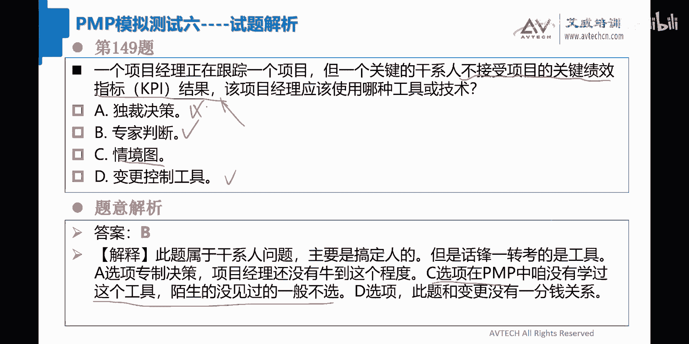
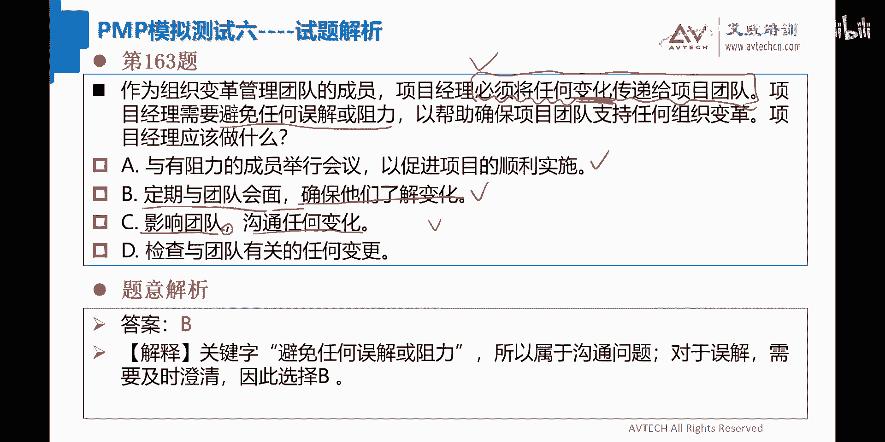
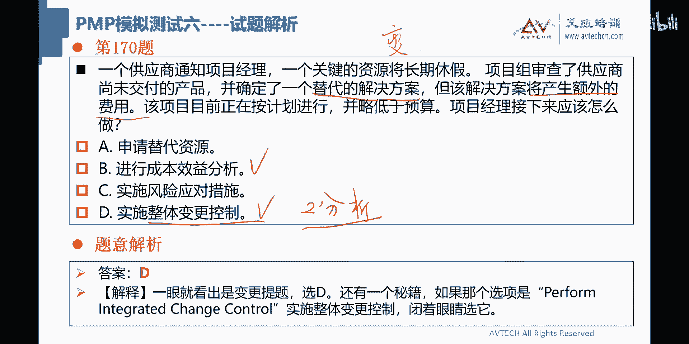

# 2024年PMP考试答题技巧-教你PMP如何做题（下集） - P1 - 艾威PMP项目管理 - BV1QW421R7Zy

好142，由于供应商和项目经理之间的沟通不畅啊，一个可交付成果所需的主要输入被遗漏了，由于遗漏了可交付成果项目的关键路径啊，被延长了，项目尽量接下来该干什么，你看他这个东西被遗漏了，要采取纠正措施。

对不对，所以我现在也吃不准什么题目啊，要么是变更题，要么是进度题对吧，开始对供应商流程程序进行审计，这个肯定是不行的，对吧啊，很多人都选dog啊，好回顾，从以前和该供应商合作项目中啊，吸取的教训。

对项目期间的供应商问题进行详细分析，执行一个应急计划，和供应商一起解决这个问题，哎我觉得刀哥很好呀，嗯dog很好嗯好，所以这道题目我们正确答案应该选择是dog啊，OK嗯，嘿嘿嘿，同学们，臭他妈的。

你让我再看一眼，看一眼的干货，呵哎呀，你们这个误导了，厉害了，同学们，你们不能够这么误导的啊，选C的同学应该是占大多数的吧，我天哪，你们居然不说我好，又死了嗯，又扣那么一分啊，你要知道老张能够有今天啊。

你们就占有非常大的责任，那我告诉你们，我天他的题目看在看这个里边，好像，好像看解析也没有看出个啥出来，哇塞对于可交付成果的遗漏，需要对供应商进行问题分析，防止其产生哦，好像有点懂呃，我有点懂啊，好大连。

你这个没有职业道德啊，你选的C你居然在现在才爆出来，我的天哪啊啊对对对对对，有有道理有道理，那我现在几分了，同学们来给我看一下，我现在是177还是176，我现在不知道我在不是不背锅这个东西呢。

它其实是这样子说的，就说我现在这个首先要做问题分析工作，就是这个东西，其实说白了是这个东西叫根本原因分析，而且呢它是比较特殊，它是跟供应商做根美元分析，然后分析完了之后的话。

再执行应急计划和供应商解决这个问题，所以C跟dog优先考虑C哎呀，现在好像跟你们侃侃而谈，显得我好像很厚脸皮啊，事实上当初我对C那不是我幕后诸葛亮，我对C的时候是有忧郁的，结果看到你们都选dog了呢。

我就觉得唉还可以啊，我就选dog啊，哇塞好好，哇塞啊，我觉得大脸在这件事情上说，这个这个扮演了一个极不光彩的一个，这个这个角色，哇塞啊，他选了C他都不告诉我，你看到没有，哇塞好，142题。

正确答案应该选C啊，选C，对不起大家了，我只有176了啊。

好143，一个项目经理的新雇主，决定使用敏捷交付方法，来实现一个新的会计系统，首席财务官呢也是项目发起人，致力于一种新的工作方式，但没有产品负责人的经验，OK把这句话画下来，就是他这个哥们儿啊。

他没有产品负责人的经验，但是他必须要take，这个产品负责人的这个这个角色，我感觉是这个意思，项目经理的背景包括chrome敏捷职，反正就是项目经理啊，他就是个敏捷主管啊，那么应该怎么做。

那么就就说白了就是对我们的CFO啊，要进行相关的这个对吧，大家懂我意思吧，好所以这道题目我们来看看啊，大家都选dog啊，我已经不相信你们了，我说心里话，哇塞你们真那么多人选dog哇塞。

OK那我先看一眼啊，和发起人合作并协助其建立产品蛋白事项，并确定优先秩序，哎我觉得dog是对的，我再看看其他答案，我猜啊和咖啡团队合作，帮助发起人获得相关的技能，开发团队合作这个东西有问题。

承担产品负责人的角色，这个B肯定是错的对吧，敏捷教练和产品负责人，大家记住是不能够合二为一的，好不好，他们的的这个诉求其实是不一样的啊，好C延迟系统的构建，这个C也是不对的，OK那看起来是选dog啊。

选dog和发起人合作，协助他一起创建产品蛋白事项，哎呦现在难啊，哇塞我背后已经全都开始流汗了。

我哎呀好，144哎，我们到150之后，我们再休息一下好不好啊，我们下午的时候休息的时间多一点，一个项目经理结束即即将结束一个项目啊，建设所有的几项任务可以基本完成啊，可以移交给客户了。

该项目经理应该怎么做啊，A更新整个项目的质量管理计划，B要求客户验证并接受已完成的任务，C已关闭已完成的，然后是更新整个项目的工作管理计划，你们等我一下，我我还没还没看懂这是什么东西啊。

好可以移交给客户了啊，可以交给客户的话，那么就可以做验收吗，验收是哪一项选布啊，要求客户验证对吧，OK好，这道题目应该选B啊。

Good，好145，一个项目的计划过程中，两个职能部门经理对一个可交付成果，关键特征持有不同的意见，职能经理也不想和，也不想和对方会面，已找到一个解决方案，O当前问题已经上报给发起人。

发起人要求他们开会讨论，应该用什么策略来解决会议中的冲突，向经理们解释这道题目，你们选什么，145啊，这两个相互矛盾正在被考虑在项目中实施，项目经理解释两个需求只有一个可以实施，确保两个都能理解需求。

寻找一个最能满足解决方案，解释为什么每个都需要必须实施考虑成本收益，来决定这道题目，我觉得还是选C会比较好一点，这个东西就是传统中经常说的引导，对不对，引导这道题目我一看我就不想多说了，就是引导好了吧。

把它写出来啊，那你可以认为这是干性人体的引导啊。

好146啊，146项目的状态，会议之后啊，项目经理意识到项目在预算之内，质量检查是正向的，而进度差异是负向的，项目经理应该如何确定项目状态，进度差异是负向的嘛，就是进度落后呀，这道题目还能说什么。

So easy，有没有做错的，有没有做错的，哼哼哼哼哼好，我信你们了啊，选dog啊，OK有没有做错的，同学们来举个手，我瞅一下啊，而147在设计阶段，项目经理意识到，该项目将从使用适应性工具中受益。

这种方法的有效性已经在组织内部，过去的项目中得到证明，项目经理首先应该做什么啊，你让我看一下，OK这不应该是记录经验教育内测吗，对我来说有同学选A啊，OK好你们一个选啊，大家选一下，147更新项目文件。

已包含适应性工具和工件，并计划第一次迭代会议嗯，联系项目发起人，熟悉的这个加入这个boy应该是不对的啊，错在两个地方，要人也是找职能经理，第二个也不是随便进人的，在向项目引入适应性工具和工件之前。

确定团队的能力，我觉得C挺好的，当老师冻结设计阶段，寻找外部冻结这个东西我就不大喜欢了，OK寻找外部资源，以额外费用进行迭代设计，嗯这道题目应该是选C的，就是你在确定这个工具的时候。

应该要先知道团队有没有这个能力，和这个意向来使用，所以这道题目应该选C了啊，还有一部分同学是选A了，那选A同学你仔细看啊，玄天你看C跟A两者，如果你们最后得到这两个结果。

当然还有呀啊很多说A的这个同学啊，我我首先要确定一个问题，你对C有没有曾经这个怀疑过或者是纠结过，顾虑过，有吧，玄天跟猫耳朵，来来来，你来告诉我有吧，有的话还能救你一下，看到A的话直接就选上去。

那就完蛋了，哇塞好，李卫说是有啊，非常纠结好，那就可以了，那么这个时候就教你想这两个字顺序，这件事情，我说是最优答案当中经常会考虑的东西，OK啊猫耳朵说我是在A在在A和C选了个A啊，是这个道理。

你们想看哪个东西先做C是先确认团队的能力，等到团队能力确认完毕，没什么问题的时候，然后你再会去包含这个适应性工具和工具弓箭，然后计划第一次跌了会，你觉得这样子顺序好，还是说先去更新。

马上又要计划第一次迭代会议，然后再确认团队能力，C跟A哪个先做，大家理解了吧，理解了吧，理解的话请扣一好，147，先做C再做AOK好，所以顺序这个东西啊很重要，我曾经好像像在讲题的时候。

说什么是最优答案对吧，文件取小流程，取大工具取大最优答案，还有一个什么顺序，OK还有个什么呃。

更加全面，对不对，看起来特别爽，对不对，好148，资源管理计划已经完成，团队位于世界各地，不同的国家，团队成员处于多个时区，他们使用不同的语言进行交流，项目就能要保持团队的组织性，避免沟通和误解。

一面对项目产生负面影响行为怎么做，才能减少对团队的项目的负面影响，哎呀，我怎么感觉这个东西就是一个沟通的问题啊，修改沟通管理就会考虑哦，塞这道题目选A，你看我这种直觉还是对的，同学们沟通题对不对。

沟通体啊，好应该没有人选，其他的嗯，应该是先要沟通更新沟通管理计划好。

149，一个项目正在跟踪一个项目，一个项目经理这样跟踪一个项目，但一个关键干系而不接受项目的关键绩效指标，项目经理采用哪一种，这道题目不是客户刷题的吗，这不就是专家判断吗，哇塞149好，有同学选A。

有同学选D啊，哇塞选D个变更控制工具，你们还能选什么啊，148选A啊，那么149选的就是专家判断，懂了没有，很简单呀，你自己说这个玩意儿他不接受这个结果，那谁啊，你要找一个专家为你背书啊。

他会告诉你这个结果是对的，伟光正的，这时候干细儿他才OK对不对，情景图啊，情景图这个东西没有啊，嗯那你看这里面也说了，在pp咱没有这个工具，陌生的没见过，一般不要选陌生词汇，懂了没有，情景图不要选啊。

那么就留a b a b dog，那选下来应该是专家判断这道题目，我觉得这道题目，原来应该出现在客户刷题当中的啊。

好150一个新的敏捷团队正在形成，项目经理注意到该团队有很多方面都在挣扎，该团队正在经历着无法实现迭代承诺，和团队成员的冲突的情况，这样这节目就是资源题了，而且是冲突题对吧，OK好项目经理应该怎么做。

在回顾会议上提出问题，并提出哇塞这道题不就选A了吗，啊还有同学选dog啊，OK好，那么在通知管理层啊，承诺将无法实现啊，B让管理层参与进来，帮助解决冲突，dog是对团队进行整体和个人进行指导。

诶好像感觉DOGG也挺好的嘛，哎呀呀呀呀呀，好像我又不行了，那我来再看一眼啊，再看一眼啊，我也觉得A班好的，这个里边他最主要讲的是什么，你们仔细看啊，这里边最主要是他没有办法实现迭代承诺。

和团队冲突的情况，所以这个里边难道不应该是，在回顾会上提出这个问题，提出解决方案吗，dog是对整体和个人经营相关的指导，难道不应该是A吗，哎我们先看一下答案啊，看一下答案再说啊，OK我勒个去。

他给出来的东西是dog呀，哎呀我又开始纠结了，哇塞我们休息都休息不好呀，同学们哎呀，亲爱的同学们，唉，刚刚谁说A好的，来来来，你站出来你站出来，你你站出来，我不打你，我勒个去。

哎呀我我觉得这个东西其实应该是A2，这种东西没有办法实现迭代承诺，和团队成员冲突的情况，OK啊，为什么是团队的启动阶段哦，啊对费同学是吧，你也说A好啊，你说的A好，OK你只是说A好。

但你没跟我说A是错误答案对吧，就这个意思对不对啊，明白了，哦这个答案也有，这也行啊，一个新的敏捷团队正在形成是吧啊，一定要靠上去对吧，你们一定要靠成D对吧，OK好的呀，但我我觉得一个新的敏锐团队哈好吧。

这对这也是我说的，我承认是要对个人进行指导，那这个玩意儿正在形成，但它已经开始做了迭代承诺和团队，实现迭代承诺嘛，对不对，哦我理解了，我知道这道题目虽然我错了啊，我现在还有几分。

我现在应该还是有176分，对不对啊，OK呃我只能尽量的去靠，在这个才175分了，哇塞这这一段时间我好像错错的挺多的呀，我天哪哎呀，同学们，你们真的是太精确了，你们有时候有有时候能不能不要那么精确。

对不对啊，啊170伏哈，谢谢谢谢你们，谢谢你们，这道题目是这样子的，我我终于看懂了这两句话，我是硬靠我们硬解释啊，同学们硬解释，无法实现迭代承诺和团队冲突情况，什么叫实现迭代承诺呢，就是他无法承诺迭代。

你们把这个东西承诺迭代，你把这个东西你把它给拿出来就理解了，也就是说不是说我现在定好的迭代的内容啊，我就把它给做出来啊，去承诺做出来是压根儿定的东西，人家就不愿意去做承诺，你们理解不理解的话。

请扣一懂我意思吧，这么无法实现迭代承诺，看到没有，就是cannot commit anything，懂我意思吧，不懂吗，懂的话扣一，不懂的话扣零啊，哇塞好，还有个么，就是团队冲突的情况。

这个是是很明显的一个做法，就是无法实现承诺，就是他们连这个迭代要commit，要做多少东西什么之类的，他们全都不肯承诺啊，是这个意思，OK啊，对不认同或者是不敢做承诺，就这个意思，唉真情这句话说的很对。

就是不敢做做做承诺，就这个意思，所以呢你既然是出现了这种问题的话，就不是在回顾会上，这是什么，这是属于团队比较新，比较嫩的这么一个过程，所以呢150题，他给出来的应该是对于整体和个人。

进行相关的指导工作，懂了没有，作为作为一种价值观的一种体现，好了好了，我编不下去了，我编不下去了，我自己做错了，我承诺了，我应该是175分，OK好啊，我错了，我错了，好好，同学们。

我们要不稍微休息一下吧，哇塞我累了啊累了，我们现在是几点钟，我们看一下31分，我们到40分的样子啊，让让老张再休息一下啊，好，对已经已经编不下去了，我150题绝对编不下去，我觉得其实还是回顾大会好的。

我稍微我稍微那个一下啊，黑皮老师来了都想改，哇塞啊好。

我们休息一下，我们到到那个40分的时候，我们再说啊，好，呃团队冲突回顾是解决吗，对的，我也觉得团队冲突也可以放在回顾大会进行，进行进行回顾并且进行解决，所以那道题目我为什么选A了对吧。

我们把巴拉拉这个的这道题目啊。

OK呃啥也没干，怎么会有回顾大会诶，诶这句话倒是嗯哎也有道理啊，嘿嘿啊也有道理啊，我塞啥都没干，人家就是连个迭代都没开始，那么怎么会有回顾大会哎，这句话是唯一的能够说服我的一个一个地方啊。

OK好谢谢CCC同学啊，好像这句话倒是把我点醒了，好让我能够在下一次讲题课当中，变得更加强大吧，哇塞好好，那就这样吧，休息一下，休息一下，好同学们，我回来了，好的哎呀好，让我们来看一看150题啊。

说是meet commit，不是不能承诺啊，还是指的是无法实现嗯，所以这道题目也是蛮争议的，150题啊也是蛮争议的啊，好那么我们先对150题先等简单说一下吧，就是说这个东西反正哼哼也是对的。

嘿dog也是对的，就团队相对来说刚刚形成的时候，这个各种不爽对吧，需要对团队进行个人的指导好了，那么大家回来了没有回来的话，请扣一啊啊，我们还有最后50题啊。

同学们，我们要加油，我才啊好来come on，我们准备开始啊，151啊，151，那么我们看一下这道题目啊，这道题目我知道的，这道题目我也不知道他讲的什么东西，这道题目就选的是A，大家理解了吧。

OK而且我告诉你这道题目很有意思，这道题目还真的被考到过，我记得应该是去年的几月份，去年的不是去年前年，应该是前年了，前年还考得过，说我们机构里边有这一道题目，居然被考到了，哇塞还很高兴，哇塞好吧。

那么我我你们不要问我为什么151啊，你们就给我记住答案就可以了。

什么冲突，分成两组，正面负面号搞定点好吧，OK好，151啊，152，有一个新的财务系统正处于执行阶段，一个新的项目发起人最近开始在公司工作啊，还没有时间和项目经理见面，项目处于严重影响项目交付的阶段。

如何提醒新的项目发起人注意这些问题，沟通题对吧，OK啊，我们来看一下沟通题啊，看有什么沟通方式吧，A向发起人发送电子邮件，邀请其参加项目组的所有周会，并希望发起人能抽空参加，B向发起人发送发子邮件。

总结项目的状况，关键，并要求立即举行面对面会议来讨论这些问题，有的选，有的选B对吧，Ok c，继续通过电子邮件发送最新的项目状态报告，强调关键的风险和问题，并等待项目发起人要求开会。

dog是完成风险分析，延误和影响，并通过电子邮发送风险能测，敦促发起人作出回应，Ok，这道题目选B选倒和选A让我先看C啊，C应该不对，等待发起人要求开会对吧，就等着别人对吧好，那么我们这道题目正确。

答案应该选择的还是B会比较好一点，be e的后面半句话，包括他前面发送的内容都非常的中规中矩，我们来看一下啊，比他这里所说的发起人发送电子邮件，把当前的状况和关键的要素给你们讲一讲。

并且呢马上就要举行面对面会议，对不对，面对面会议来进行沟通和交流，所以B是最好的一种沟通方式，这个大家应该能同意的，Ok dog，完成风险分析概述，延误和影响，说好把这个电子邮件发出，然后要做出回应。

他仅仅是讲到回应，没有讲到说一定是面对面会议，所以导尔从这个层次来说的话，它的力度没有国外来的那么的大，好吧，就这个意思啊，好呃，还有A呢向发起人发送电子邮件，邀请其参加项目的所有周会。

这个沟通是有点乱乱弹琴的感觉，对不对，你这不一定要参加所有的周会啊，这个东西，我们现在针对于当前这个项目的问题的话，应该是有针对性的开，而不是这种大啦啦的呼噜噜的，所有东西全都开导啊。

所以这道题目正确答案应该选择是A啊，选的是B好，有同学说问了说迪亚敌意，我已经晚上讲过了，就说他敦促他作出回应，还有个要求他面对面参加会议，这两个力度还是博爱来得更加的深一点。

因为面对面沟通永远是最好沟通，就这个道理啊，OK那么B会不会太强势，应该不会啊，通常来说我跟别人发送这个东西的话，最后总是会附上一句，说如果方便的话，我跟你两个人还是当面call一下啊，当面聊一下对吧。

会好一点好，153，某组织在历史上一直使用预测性方法来执行，大多数项目啊，现在该组织希望转变为敏捷方法，哪种策略可以有效帮助该组织，为做好这种准备而做这种转转变而做好准备。

OKA建立一个由高管组成的特别小组，每天对项目进行监控，并增加多层次的管理人员，对项目的敏捷进行负责负责，额执行负责，C通过解决组织中的敏捷障碍，提高组织的准备程度，我觉得C挺好的。

你们选的这个也是很很优秀啊，OK都选C啊，采用大爆炸，大爆炸应该不是敏捷，大爆炸，应该是属于瀑布模型啊，所以第153正确答案应该选C啊。

啊对了好，154，我了去又那么多，我才一个项目经理，被选来交付一个组织的关键解决方案，关键的成功包括了敏捷性，市场适应性和对市场反应的快速反应，为了确保公司的成功，项目经理应该开展的关键活动之一是什么。

我天哪，他在讲什么东西啊，哈我天啊，关键的成功因素包括敏捷性，市场适应性和市场的快速反应，OK来交付一个组织的关键解决方案，反正就是被派来一个启动的时候做这个事对吧，好，让我们来看啊。

呃看你选了A的是吧，向发起人一起审查项目的目标，商定各可实更现实和可实现的项目，计划和交付成果，OK还有选C的，那我们在这待会啊，哎看B肯定是不对，申请更多的资金啊，这谈钱伤感情，对不对啊。

好选C对项目的计划目标进行定期审查，以确保所有的相关数据被采集，然而做出明智的项目的决策，好像我感觉C也是对的啊，待会我来讲啊，但为什么我觉得C对的是这个东西嗯，对然后在dog是在进行市场审查。

创造一个商业论证，然后交给发起人，已修改项目的交哇塞，后面的修改项目的可交付成果，这个东西有问题，OK啊好，所以这个dog呢也是一开始就被干掉的，那么就留下A跟C两者相比较，那么我觉得A跟C比较的。

它的优选优点是在这里叫定期审查，为什么它这里面要有敏捷性，市场适应性，对市场快速进行反应，这有这么一个要求，既然有这个要求的话，你就一直不停的要进行审查，这个大家我相信大家已经是明白的。

所以A呢是批准走的是预测模型的对吧，就批准一次可实现的项目计划，可要交付的成果告诉你一次搞定，然后C呢就是要做定期审查，做滚动式规划，所以154题我觉得正确答案应该选C啊，选COK啊。

你看我觉得这道题目应该还是行的啊，我觉得我的理解应该没什么问题，好吧好，那么这个AABCD全都给你们讲过了啊。

哪些对哪些不对啊，好155，一个项目正在敏捷过渡啊，呃刚刚那个题目也不知道选什么啊，算是那个项目管理。

这道题目应该是算项目的开发和生命周期，绩效预里边的对吧，你要选哪一个项目的管理方法啊。

这主要是指这个意思，好，一个组织正在向敏捷过渡，一个项目被选为试点，被指牌的项目经理啊，只有预测性方法的经验，但现在呢项目经理被要求敏捷教练帮助下，使用敏捷方法，在第五个冲刺回顾会。

团队抱怨组织中存在多个障碍，导致项目的延误和反攻，这时候该怎么办，那么这个时候就项目经理出马，对不对啊，要把它给搞定啊，在每天站会当中，包括障碍的解决方案，再要进行根本原分析，建立一个专门的冲刺。

促进合作，帮助团队这道题目就应该选dog啊，选dog，那么有同学我看到选了A了，包括障碍的解决方案，那么这个事情呢是你线下做的，在战略会议当中仅仅是来识别障碍，而不是来解决障碍，玄天理解了吧。

那个的战略会不就回答那三个问题吗，第三个问题就是你有什么障碍懂吗，所以这里边应该是选dog，而不应该选A帮助团队消除长啊。

好像一百五十六一加，而产品公司正在转变，其市场上开发和发布产品的方式，高管认为这是一个高风险的举措，而这个举措必须要成功，这时候项目经理该怎么办，为新模式制定一个带有假设的商业案例啊。

那有假设条件的商业案例，就是有一个商业论证对吧，这个是要做商业论证啊，B1是制定一个沟通管理计划，我觉得这道题目啊，B1肯定是错的啊，C采取迭代的推广方法，尽早实现最高的商业价值。

OK这道题目我觉得C是对的，制定一个详细的冲刺计划，明确可交付成果，这个东西再详细也就是一个迭代，懂了没有，所以dog的他的这个不是特别好，我觉得这道题目还是应该选C啊，迭代式的推广方法好吧。

所以这道题目是什么呢，就是我刚说了，生项目开发和生命周期绩效预里边的，你要用什么样的这个这个这个开发方法啊。

应该是这个道理，所以应该选C啊，好的好，157，在收尾过程中，项目经理了解到有一个交付五，没有达到客户的期望，哇，又来了，对不对，哇塞项目经理应该怎么做啊，要求客户发出变更请求并提供信息进行分析。

提供解决方案哦，OKB审查可交付成果的要求，检查客户的批准的标准，并进行相应的工作，C好，有时候嗯报如期有人选A，有人选B有人选C，哇塞再来个D1家人整整齐齐得了呗，同学们啊，有没有选D的同学，哇塞啊。

好C和客户会面就可交付成果的范围达成协议，使双方都满意义，ok dog是联系一下我们发起人寻求帮助客户，就他的结束进行谈判，这样他们dog肯定是不对的好，那么我们来看一下这道题目。

其实他没有达到客户的期望，这道题目是按照质量题对吧，质量题的这个方法来走，OK质量题方法来走，那么我个人感觉跟质量题相关的，那么就应该是选boy了，审查可交付成果，根据他的这个标准。

然后进行相关的一些工作，对不对，QC不行，找QA嘛，我们要做一下质量活动，对不对，好看A有同学想看A啊，要求客户发出变更请求，进行信息分析，提供解决方案变更请求，客户发出变更请求，好像貌似也对啊。

但是我总觉得这个好像有点怪怪的，怪在什么地方我也不知道，但我据我所知，就是一般来说没有达到客户情期望的话，是不会有这样的一个动作，这个动作蛮骚的，我感觉是啊，你还让客户提出个编辑。

你后面两句话其实说的是很好对吧，提供信息进行分析解决，提供方案，这个A后面两句话很好，你这个发出变更请求，我一直觉得很奇怪哈，这个可能是体感的问题，是我我肯定不会选他好，客户会面就可交付成功的范围。

达成协议，使双方都满意，这个这个人C你们就就完蛋了，我跟你说，你把它当做范围体了对吧，首首先说范围这里面没有达到我的期望，大概率的应该是质量，所以这里边呢我觉得应该选B啊，选B啊，对先查一下gap在哪。

然后呢根据这个gap我们做下去对吧，157，正确答案应该选B的。

158，一家非常注重使用预测方法，来交付项目的公司啊，聘用一个使用混合方法的项目经理啊，范围包含了一些不明确的要求，应该如何计划项目的交付，那么明不明确的，那么就走走走，敏捷呀对吧，或者走迭代啊。

哎我记得上次有个同学就问我，他说如果说需求不明确，先迭代还是先敏捷，我告诉大家，如果需求不明朗的话，按照小的这种概念来说，先迭代懂吗，迭代没有，你考虑敏捷懂吗，因为敏捷还带有增量的概念，好不说了啊。

好有些同学选了dog啊，选dog ok额，那么有些不需不需求的啊，然后是对项目范围包含一些不明确的要求，如何计划项目的交付，对项目采取进一步的行动之前，等待需求更加明确啊，这道题目A肯定是错的，对不对。

B忽略不明确的需，那么这个B也是错的，我塞将不明确的需求上报给管理，哇塞C也是错的，我噻，OK好，这些傻白甜的答案我们都不要选，只能选dog了，OK啊，只能选到了分解需求啊。

分解需求好，还有159，某公司在预测型项目方面有很多经验，p mo一直尝试在项目管理当中实施迭代工具，项目经理被要求在当前项目中使用这些工具，在成功实施迭代工具之后，项目pm要求项目经理。

确定这些工具给项目带来的好处，项目经理应该做什么嗯，好大家来选一下这道题目选什么，OK这道题目他得他要你，他要你做什么事情，我都不知道哇，塞确信这个带来好处，做商业论证吗，呃准备向选D是吧。

好那OK向产品负责人提交状态报告，更新绩效监测，准备提交一份状态报告给指导委员会更新绩效，这个只要委员会肯定是错的，跟踪公路管理计划肯定是错的，OK该写人审查讨论该方法可能对项目哦，对对对对对。

PM要它带来的好处，所以呢所以他找干洗人进行审查，以识别潜在的好处，所以这道题目最难应该选择是dog，OK你理解的是经验登记舒克飞机，你选的是什么，那我看到有同学选A选C啊，来来来。

我给大家来讲解一下啊，这道题目选dog啊，AA也肯定是错的，一个个来提，他现在要确定的是好处，你现在给他了一个驴头不对马嘴的这文啊，不对不对，驴唇不对马嘴的这个答案看到了没有，大家理解了吧。

像产品负责人，你看而且是PO对吧，你这还是像产品负责人哇塞提交状态报告，OK大家就知道这里面的gap在什么地方了吧，对不对，状态报告能不能说明它的好处对吧，第二个他的问题出在这儿，一个状态报告。

居然一口气打到了你爷爷这个层次啊，要找到指导委员会，这个层次太高了吧，对不对，好第三个是在这个有问题更新沟通管理计划，这明显不是一个沟通管理的，这个这个题目对不对，人家是要在做好处，那是好处的话。

那就应该找相关的人员进行讨论，能够看看潜在有什么好处，所以这道题目应该是排他性的选dog好吧好，大家去做做这个答案五花八门的啊。

大家自己去看一下就行了啊，159题，这个答案选到好160，一个新的项目经理，正在为一个居住在不同国家的公司，规划一个信息安全项目啊，项目经理采取什么措施来收集客户的需求，你看答案啊，那个题目在这里啊。

要收集客户需求A进行干细胞分析，确定区域政策如何影响需求，这道题目A其实挺对的啊，OK还有同学选C啊，等一下，而要求相关的干洗儿进行分析并独立达成共识，相关的干系人建议分析并独立达成共识。

dog是和相关的干系人在一个地点进行，项目的规划会议，Ok，哎呀收集需求嘛，就那几个工具啊，哎呀让我来看一眼，好这道题目应该选A的，哎是选A的，这道题目呢你们来看啊，从这个顺序角度上面来说，先是A对吧。

选谁，然后呢，然后可能是dog，再可能是C，但是博爱这个东西呢，博爱这个东西额怎么说呢，相关更新并独立达成共识，boy其实也也类似于跟A相关的呀，这个独立达成共识，我可能不是太了解，来看下解析吧。

说B选项将收集需求的锅甩给了干系人，C在定义项目范围之前，应该先完成收集需求啊，所以他这个说的是C是定义范围，不是干系人分析，是让干系，我天哪，我塞这个我们国家的语言，那是博大精深呐。

哇塞理解了理解了理解了啊，这回终于理解了，那所以这个DB就可以打打打叉了，就是这个B所说的将需求收集甩锅给干系人啊，A呢是自己来收，对不对，这个得大家应该能理解，所以好好好，那我们把这个B就擦掉了。

这个B其实有点问题，然后呢然后你去做dog，对不对啊，然后在做的是C那差不多就可以了，好吧好，谢谢大家啊，谢谢大家，终于明白这个B是什么意思，好。

有时候突然之间被被被捂住了，我的天哪好，167啊，一个项目团队在不同的国家，来自不同的国家，在合作上陷入挣扎的境地，项目经理呢接受了这些，在团队发展的在震荡阶段的困难，但团队没有进入下个阶段。

项目呢开始落后于进入计划，项目经理做什么，来推动团队进入规划规范化的阶段，好呃计划社交活动帮助促进更强大的人际关系，确定共同的目标和发齐尔讨论改变团队的组成，弄清楚谁是幕后推手，才遇见你这惩罚措施。

哇塞这个C有人选C吧，我觉得C很酷诶，德尔将向团队展示他们的沟通对进度的影响，鼓励他们把分歧放上一边，那么我们来看这里边最主要哎，能够让他们进入到规范化的一个阶段啊，就就就就就经过那个震荡的话。

目前为止这两个答案是不对的，对不对啊，B跟C是不对，那就在A跟DA呢最主要是人际交往对吧，线下吃饭啊，唱K啊，这种活动C是展示他们沟通对进度的影响，鼓励他们他们的沟通对进度的影响。

鼓励他们把方分歧放在一边哦，所以这道题目应该选A了，dog绝对没有A好对吧，你你如果是个项目经理的话啊，你如果是个组员的话，你喜欢A的项目经理还是喜欢dog项目经理对吧。

一的项目经理有事没事还请你吃个吃顿烧烤，对不对，door就在那给你发了个口号，你说对不对，所以这里面选A更好一点好吧，161题啊，161题选择的是A啊，分歧放一边也不对，对的对的。

就是A呢你站在那个冲突角度来说，这个东西确定共同的目标，怎么怎么合作解决，对不对啊，这个是对的，把分歧放在一边缓和包容，对不对啊，这么一说的话，我就应该明白，对的对的啊，哎分歧要达成共识。

你为这个提示提示非常棒，因A跟dog，你们把它当做这个这个有关于冲突解决方案，你就知道他们在讲什么故事了。

懂了没有啊，所以选A的同学选到的同学好，162，一家公司的项目管理办公室，Pm，一直在尝试，在项目管理框架当中实施适应性的方法，一位项目经理被要求，在下一个项目中使用适应工具，这不是第一次提出要求了。

以前项目经理在适应上工具产生失败，项目经理应该怎么做好，我们来看162题啊，有的选B啊，选B的话，我先打一下勾啊，准备一份变更请求，并寻求指导委员会对新框架的批准和变更啊，了解所有的关切。

然后准备一个沟通管理计划，我觉得这个里边应该不是boy，哇塞你们都选boy了，我就很don't understand，这道题目根本不是沟通题呀，对不对，好好引入第三方公司啊。

为这个特定的项目开发实施一个混合框架，然后是向篇目建议，现在不是开始向哎，你们稍微等一下，我再回去看一看，我觉得好像四个答案都很烂，我天哪，OK被要求在下一个使用适应性工具。

那以前项目在实施适应性工具上有失败，项目经理该怎么做对吧，dog呢我觉得也不对，pm现在不是开始哎，我觉得某种意义上面，dog应该是OK的，首先第一个寻求指导委员会对他的，对烂中选优啊。

四个答案我觉得都不对呀，哇塞最好的方法是什么，对不对，应该要了解经验教训，知道他失败的点，这样子有效可以做，避免这种答案就很好了，但这道题目我没有看到过，这道题目，还有选C的，我的天哪啊。

这个C1看就是不对的，引入第三方公司哇塞开发一个混合框架，你人家不是要求你做这个适应工具，你还给人家开发一个混合框架，哇塞你这不是被被揍的这个节目吗，啊OKD现在还不是这个D呢，也通常也不是正确的答案。

因为什么，因为他现在不是十它的合适时机，这个东西你跟他去建议这个玩意儿的话，肯定也会被干死，哎呀这道题目选什么啊，老老张减一，那那就就说明前面dog是对的了，我天哪啊，我我对这件事情让我来想想看。

啊詹姆斯，你说什么了，我都没看见啊，我天哪，对迪就是消极的，我又不愿意选D技能都不足走外包哦，我知道了，选C是吧啊，你们说是走技能不足走外包，选C引入第三方公司，哎呀答案是C哇塞。

好吧好吧好吧好吧好吧好吧好吧好吧，我错了我错了我错了，我我来看一下，我来看一下解释吧，它不涉及基准变更，只是公司偏目推广适应方法，所以A不可选，对呀，我没有想选A呀，偏僻中的沟通为狭义沟通指单向。

所以跟B无关，哎对呀，本公司方法一直推广不下去，方法有问题，可以引入第三方公司给予建设性的建议，帮忙改善，故选C1选择dog是属于逃避责任的方法，诶嘿嘿，好像我突然间被PV了，哇塞我读完了之后。

我就觉得C特别的有道理啊，我天哪哎啊，我现在终于明白了，他是通过排除法啊，排除法的，人家他妈谢谢你啊，分赵丰年同学，哇塞这个事实的就给我提出了，我还有174对吧，OK这里面A这里边啊。

这里边寻求指导委员会对新框架的批准，他这里边没有牵涉到基准变更，所以不需要走变更请求B呢，我一看就知道沟通管理计划是有问题的，但是我觉得比前面说的很好，和干见干行人进行个别访谈，了解他所所有的关切。

这个东西真的讲的很好，然后后面半句就拉垮了，然后C相对来说不那么恶心吧，啊也是可吸可实现的，dog们就不用说了，我塞啧啊，对博爱就最后半句话，哇塞，那那有没有办法可以请我们亲爱的黑皮老师。

把那个博爱后面半句话删掉呀，删掉了之后，我们就可以安心选boy了，wok好，那这里边大家希望大家能清楚了，162题啊，首先四个答案都不是特别好，烂中选优对吧，正经同学这么说。

那么相对来说a b dog都有它不可饶恕的错误，相对来说C还是稍微有一点点可实现性，所以呢162题我们还是决定选C好吧，就这个意思啊。

好163，作为组织变革管理团队的成员，项目经理必须将任何的变化传递给项目团队啊，我现在才发觉，原来模拟测试六后面的题目才真的是比较难的，就根本不知道他在讲什么东西啊，项目经理需要避免任何误解和阻力。

以帮助确保项目团队支持任何的组织变革，项目经理应该做什么，好了又一个啊，我看不懂了，必须将任何的变化啊，这道题目应该是这句话，任何的变化传递给我们，项目的团队，需要避免任何阻力，保持沟通顺畅了。

应该是好的，有的选BO的，选C啊，先把那个勾下来，对有阻力的团队进行会议，以促进项目的顺利实施，B是定期和团队会面，了解他们的变化，C影响团队沟通任何的变化，door是检查和团队有关的任何变更。

哼哼哼哎我们讲164吧，同学们，哇塞，我真的是没有砍到这个东西是啥嘞，哇塞啊，啊还有同学选A呀，哇塞这个真的是这道题目，我觉得应该是选B的，对的应该是选B的，为啥为啥这个东西其实是选B的。

我为什么这么有信心，因为这句话我选的对的，关键字是对的，就必须向将任何的变化传递给项目团队，看到没有，这句话你们仔细看这句话，看到吧，要这样变化，我们不管什么变化，要早点告诉我们的团队。

所以呢所以就是定期和他们会面，确保他们了解变化，看到没有这个东西，那么C这里边它有这个叫影响团队沟通，任何变化，就我怀疑这句话当中不应该是有这个逗号，就影响团队，让团队主动跟你来沟通，任何变化。

可能是C是这个意思啊，这是我胡猜的啊，我觉得其实这个boy已经是已经是最有答案了，好吧好，所以这道题目应该正确，答案应该选的是boy啊，选择是博爱，那么A呢我其实是这么觉得。

就是跟这个题目当中一点关系都没有，我团队当中也没有问题，有什么啊，这里面会有避免任何阻力对吧，那么避免任何的阻力，最主要还是要把这句话要讲清楚，要讲任何的变化讲清楚，所以这里面的A呢，那我们就不选了吧。

好吧，OK哎呀，老张又在硬解释了，哇塞，反正我觉得博爱应该是对的嗯，哎呀这种题目做的真的是汗沉沉的啊。

164，在一个复杂的项目敏捷项目中啊，一个关键的项目的干希儿一开始表现出兴趣，但随着冲刺的进行，他的参与度越来越低，项目经理怎么做才能避免这种情况，哎有同学选A，有同学选B啊，OK啊，还有同学选C。

哇塞好，还有同学选dog吧，一家人整整齐齐，我等着你们好，参与度越来越低，怎么做才能避免这种情况，让干系人参与到决策过程中来呃，根据该系人的需求，定制该系人的沟通方式啊，分析该系人属性的变化呃。

那个叫什么记录干系呃，记录项目的愿景和目标啊，这个dog真的是没有人啊，OK好好，所以这道题目正确答案给的是C对吧好，那我们就选C吧，啊为什么选C呢，我已经想不出来了，我们看一下这个解析啊。

我我是看了你们的答案给的，我哼哼哎呀，我已经想不出来了，卧槽好，我们来看一下他的这个解析啊，关键字由于额外责任参数越来越低啊，所以并非是个人意愿不愿意参与，而是由于外围的这个责任导致啊。

所以这题不能够像A1样简单粗暴，要求他提早参与啊，也并非是他个人的不愿意啊，也不能够像B这样简单定义为沟通题，对我觉得B这个一开始我就不承认，这个里面就是个干细儿体，该行者参与的问题是工作变了对了。

这句话要勾下来啊，这是关键字啊，我忘记勾，关键字好几集都没有勾啊，对不起，大家额外的责任，导致他参与度越来越低，所以呢所以在这个里边就像这个A里边说的，就是啊解析里边说的不能够像A这种。

就是让你要参加过来，你不管有没有时间都要过来，这个A就是不考虑B呢，我刚开始就不考虑沟通方式，定义他的沟通方式，他是额外责任导致参与度低，不是你跟他沟通有问题，对不对，所以A和B就去掉。

那剩下来说我只有选C了，了解下他自己本身的属性变化啊，更新他自己的参与度，并且相应的更新我们的这个叫什么干细则，参与这个这个这个计划，对不对，那这个事可能是一个比较好的方法好吧，164题啊，你们选C啊。

那我就同意选C了，嗯甘希尔有四种属性吗，哎对的，有四种属性啊，什么积极管理对吧啊重要不重要对吧，这个利益高还是利益低对吧，就这个意思啊好了，那么164题正确答案选C啊。

好165题，一个敏捷项目正在进行定义最小可行产品，MVP的活动啊，在会议期间啊，项目经理确定了一些强制性的规定，但没有达成共识，将这一归纳入MVP啊，因为他会延长项目的持续时间，项目经理应该怎么做啊。

大家可以画一下啊，165，有的选A，有的选B，有的选C，哇塞你们这个答案呐真的是给的是三个同学，三个答案啊，就就非常的分散啊，A按照管理层的要求对团队进行新规的培训啊，B从团队中获得承诺。

将所有的需要的规定都包含在内，C要求发起人为项目增加更多的时间，DOS和参与者分享，只关注产品功能的必要性，OK好好关键字先划一下，识别了强制性的规定啊，目前为止没有达成共识，OK啊。

因为将这个东西可能会延长，所以这道题目呢，我觉得如果是按照我对这个题目的理解啊，它应该算是冲突资源当中的冲突，大家对这件事情的认知有问题，所以呢最好大家能够引导一下。

能够互相这道题目我给的答案应该是boy啊，给的是boy啊，同学选C啊，C是不要去选A，也不要去选，首先一个个来就是团队，并非说我没有这个技能，而且他们还能够知道有关于这个东西。

开发会延长我们项目的持续时间，所以不是说我要对它进行新规培训，这个东西无稽之谈，对不对，也没有C的说法，哇，塞就因为你这个玩意儿，我确定要增加更多的时间，OK啊，因为他可能会增加更多时间。

所以第一步应该要摆平团队，能不能把这些强制性的规定能够包含在MVP之中，所以这个首先是第一个，第一要务，从团队那里要获得相关的承诺，换句话说，你项目经理要做的事情就是要摆平团队对吧。

所以165题应该是选boy，而不应该选A跟C哇，我相信我这句话应该是大家应该能认的。

好不好好，165题应该选播啊，good好，166，一个董事会成员，是一个对组织有很重要的项目发起人，这个干洗儿有许多其他的优先事项，并且没有参与到过项目活动，应该如何让干洗人参与到项目。

那这道题目也是干洗人让干事要了解情况，根据他们的需要和他们进行协商，哇塞这个A就很好嘛，我好让该行人参与到管理和决策诶，笔也很好啊，我才让甘袭人协商，提高他们的兴趣水平，我才啊这个C就算了吧。

没有A跟B来的好，需要人干，想要了解项目的进展状况，这个dog呢也不咋地啊，了解这个东西不代表他就能够参与，所以呢其实这些东西是非常重要的，根据他们的需要和他们协商对吧。

让他们参与到管理和决策可能会更好一些啊，C呢应该他的水平，你看这是提高他们的兴趣水平，看到没，应该没有A跟B说的那么的完美啊，所以就A跟B当中选吧，那这道题目到底应该选A还是选B啊，让该事人了解情况。

根据他们的需要和他们进行协商，让他们参与的啊，让他这样，那我理解这道题目正确，答案应该还是A会好一点好吧，C跟D我前面也跟你们讲过了，干掉了A跟B为什么我选A啊，为什么选A。

因为是根据需要和他们进行协商，而boy呢是没有，你就是一厢情愿的感觉，就是让他们参加管理和决策，看到没，对不对，虽然管理决策很多人都喜欢，但是你毕竟没有站在他们的这个需要的，这个基础上。

所以啊你们知道选A为什么不选B了吧，就这个道理啊，B应该属于次有答案，A属于自有答案，大家理解了没有啊。

166题正确答案应该选择是A，OK很好好，167，一个项目经理已经刚刚开始管理敏捷项目啊，项目经理意识到，由于缺乏对项目目标明确的定义，对已完成的DOD，他们的同事项目遇到了很多困难。

发起人不断增加功能，项目还没有完成，项目经理应该怎么做，才能避免这些问题，好那么在这个里边啊，我看到的这些内容啊，就是两个缺乏对项目的明确定义，以及已完成定义，然后发起人不断要求增加功能，项目做不完。

对不对，好，所以这道题目很多同学选了dog啊，我们一个个看，我自己个人感觉十有八九应该是干系人体，干系人在跟你搞啊，还有同学选了boy啊，OKA安排会议，确保完成项目的每一项必要任务。

都包含在项目管理计划中，那个A绝对是胡扯了，哇塞啊，人家还在那里做蔓延呢，哇塞你所有的方法论对吧，这个东西啊没有必要敌意，是说服务发起人纳入质量专家，以便能够被测试，这里边我知道的。

你是可以来解决这个问题的，但是解决不了后面的问题，发起不断要求增加功能，对不对，对目标的这个明确定义不完整，所以博爱它不完整，我们打个对勾啊，OKC说服产品所有者接近团队并寻找方案，已找到解决方案。

这个东西呢我们说到底了，是发起人要增加功能，而不是产品负责人增加功能，所以这个C啊我也打个对勾，OK啊，表面看起来也是可以的，到时安排和关键该事人的会议，建立敏捷项目章程，为项目设定明确的期望值。

我这道题目选到dog是最优答案，为什么导演是最优答案呢，首先第一个定义有关于这个明确定义，项目标的明确定义，这个东西我们一定要建立起来，对不对，所以这里面这部分是针对于刚刚所说的，第一部分的这个内容。

第二个其实是针对于迪欧迪和发起人，不断要求增加功能的，他是和关键干系人建立相关的会议，所以其实dog有一石二鸟之说啊，我觉得这个dog应该差不多挺好好，而且还有一点发起人不但要求增加功能。

也是建立在对目标定义不明确的这个建立上，所以呢两边结合在一块，我觉得首先应该是建立明确的期望，会更好一点好吧，所以167题正确答案应该选dog啊，哎对B和C选项纯粹胡扯啊，哎嘿嘿嘿啊，对对对对对好。

那么167啊，我们算过了。

应该问题不大，168，在一个正在进行的项目中，一个关键资源向项目经理询问项目的目的，以及他们是否和组织战略相一致，项目经理应该和关键资源分享什么，A最新的效益管理计划，B范围管理计划。

C项目管理计划到国务通管理计划，诶，这道题目你们来看这道题目的关键字在这儿，对吧对吧，有人选A，有人选B啊，你们来看这道题目应该是选A的，为啥效益管理计划，什么叫效益啊，效益就是你们的战略嘛。

你们这么想就可以了，是不是这个感觉啊，收益效益就是你们的战，你们的战略用来干嘛，不就是要产生效益吗，所以你这里边战略相一致，这个玩意儿是写在什么地方，就是写在效益管理计划中的。

O范围管理计划管什么管范围的呀，对不对啊，啊包括什么定义范围啊，制定WBS啊，控制范围啊，确认范围啊，范围管理局要管的，所以这里面战略跟这个相一致，就是看效益，你要管范围就看范围管理计划，项目管理计划。

其实说白了为什么不选C呀，他是一个很巨大的方法论呢，能够帮你把项目能够成功交付了，对不对，但是你这个能够成功交付，能不能和战略相一致，项目管理计划说我不管的，我只是用正确的方法来解决问题，你说对吧。

沟通管理就要管沟通的呀，对不对啊，保证我们信息传递的正确性，所以这个里面一做你们就知道了。

是我们组织战略一致性，OK好，169，一个项目经理被派去领导一个敏捷项目啊，项目经理想利用记忆的方法来鼓励团队，在整个项目当中表现的更好，项目经理怎么做啊，使用管理储备金啊，你别说了。

这169A肯定错了，夸大项目的估算，哇塞这个有人选B吗，同学们，你告诉我有人选B吗，夸大项目估算，我撒，C寻找一种另外一种方法来提高项目的绩效，OK好像我觉得C也可以啊，door是实现奖励自主。

以保持项目的参与度和积极性好了，那么现在就留下两个，一个C1个dog，那么这样比起来的话，我觉得dog还是好一点啊，那么这里边是dog是属于团建的工具吧，对不对啊，实施奖励制度嘛，认可和奖励嘛。

所以我感觉应该是选选dog，而且最主要是大家都选到的啊，我觉得各位的这个输入对我来说非常重要，好呃我应该差不多接下去应该是做哦，169，还有一题啊，还有一题，不好意思，接下去就应该多选题了，对不对啊。

不知道C在选什么C啊，也真的是也是属于是乱说的，反正就是你要用各种手段对吧，来提高团队的绩效啊，就这个意思还不如dog好好。

170，一个供应商通知项目经理，一个关键资源将长期休假，项目组审查了供应商尚未交付的产品，并确定了一个替代的解决方案，但该解决方案将产生额外的费用，该项目目前正在按计划进行，并略低于预算。

项目经理接下来该怎么做，A申请替代资源，B进行成本效益分析，C10分严峻，作者倒是实整理变控制，OK那我这来看这个东西替代解决方案吗，这不就变更题吗，哎呀终于可以写上去了。

哇塞啊啊之前已经好好多都没写了啊，好170题，有同学选了boy啊，成本效益分析啊，OK唉我觉得成本效益分析也挺好的啊，选boy啊，有人选dog吧，没人选dog啊，我我我感觉这道题目就应该选dog。

为什么它会产生额外的费用，看到没有额外的费用，所以这道题目，其次就应该是对实质证的变更控制，他就是个变更题，那有人说了，那我为什么不能够做成本效益分析呢，你们要不要看了，这个里边当中有一个东西叫二分析。

选boy的同学理解了吧，理解的话请扣一啊，所以就是说你选的那个东西在dog里边啊，这个是属于王炸答案的，对不对好。

所以170啊，正确答案选D，好现在正式进入到嘿嘿这个这个这个多选项了，对吧啊，哎呀好好好好好怕怕好怕怕好，171啊，由于最近的预算减少，两个团队成员呢从一个敏捷团队中被释放。

客户仍然期待着项目的早期结果，项目经理真应该采取哪两个行动，来调整客户的期望，选择俩，那么我们现在看懂这个题啊，ABC我塞妈说两个呀，你怎么选了三个呢，我天哪，这个好，ABAD对吧，好a b dog好。

还有个同学选过C，哇塞啊，好就差E没选了，好我们来看一下啊，那么我们先看一下题目啊，说两个团队成员被释放，然后又期望他的早期结果，那么就应该做最有价值的事啊，我先捋一捋啊，做最有价值的事对吧。

然后客户你要排排序啊这种之类的对吧，OK要求敏捷团队和客户一起审查，最新的冲刺速度，A应该是要的，我觉得应该是要两个人被减少了嘛对吧，要要调整他的期望，你不能像原来那种急吼急吼的样子对吧。

B要求产品所有者和客户一起审查，优先级的产品蛋白事项列表对吧，按照价值交付，先交付，更有价值的比也是对的，要求敏捷团队和客户一起回顾和更新，质量管理计划，那C就不对了，你们怎么会选到C去呢。

我就直接打叉吧，C这个概念啊，你你们现在要知道这171指什么题目，敏捷当中啊，你可以把它认为是团队，你也可以认为是资源题吧，团队的人员被释放，velocity降降低啊，不可能做跟原来一样的东西。

所以怎么办，所以他这个里边要重新审查冲刺速度，看到没有，所以它跟我们的质量管理计划没有任何的关系，懂了没有，dog和我们的客户一起审查障碍记录，障碍记录大家都知道这是属于风险。

现在他说要采取哪两个行动来调整客户的期望，看到没有对吧，你给他去看障碍记录，哇塞啊，所以这个dog呢我觉得问题啊是有问题的，好吧好，然后再看异客户发送一份详细的项目管理情况，这这个意义我是不认的啊。

所以现在人员减少的话，要看的是冲刺速度，然后交付的内容应该要排好优先级，所以这道题目我认为这道题目正确，答案应该选择是A跟B啊，A跟B希望大家能理解啊，这个里边我做的这个做题的思路一点点来好。

172啊，要选三个啊，选三个，其实我觉得只有方便啊，一个公司的领导团队，决定使用敏捷方法来投资一个新产品啊，那么商业和产品团队已经开始，为这个企业进行规划活动，为了交付这个产品。

项目经理需要哪三个关键因素，OK为了交付投资已经进行规划活动，先把规划活动换一下，要为了交付哪三个关键要素，高层次的产品蛋白列表，这是要的啊，很多人选了ACE对吧，OK诶AC好像就是对的嘛。

啊AC的话不就是那个吗，就是产品路线图对吧，对高层次的产品蛋白事项，然后的话B跟的话我懂我懂我懂了，我懂了，B跟dog通常来说不是敏捷当中的啊，通常不是敏捷，一个是SPI，一个是KPI。

所以这里面其实就是ACE啊，A c e，还有还有同学选了ABC啊，OK产品路线图肯定有的，为啥，因为在敏捷当中，一个很巨大的一个项目的一个进度计划，就是产品路线图，对不对，所以这道题目ACE啊。

B跟dog不算里面。

他是属于绩效指标，看到没有啊，绩效指标好173，在一个固定时间和预算的项目中啊，客户希望一个组件，核心组件开发是基于敏捷实践，因为他的需求的最终的范围还没有完全开发。

项目经理正在和销售团队一起参与合同开发，并确保希望开发成本不影响项目的盈利能力，项目经理将哪两项控制措施纳入合同，以具体解决核心部件啊，看到有CDE对吧，OKCDEOK好我，我好像还没有看懂他。

这个这个主要的意思是什么啊，是这句话，现在是确保开发成本不影响项目的盈利能力，要省钱嘛，看到没有开发成本不影响项目的盈利能力啊，要省钱要哪两项控制措施啊，就是要节省成本资源嘛对吧，控制成本哎对很好。

在合同中限制开发的迭代次数，我觉得A应该是对的，在合同中为什么呢，因为在工料合同当中啊，我们其实要规定时间啊，时间上限或者是资金上限，时间到位到点了，你就可以给我撤了对吧，这对我来说是有点这个控制手段。

所以173A我觉得没有问题啊，好再来看，建立一个治理委员会来审查合同的交付，这个东西应该不需要啊，而且跟我不搭嘎，他是说要由纳入合同当中的，所以你要在合同当中说，我要建立一个智力委员会对吧，这个东西啊。

C是为固定组件和敏捷组件合同分层，你们知道C是什么意思，你们知道吧，他的意思就是在同一个合同当中，分成两个不同的合同类型，大家听懂了吗，哎这个意思就是告诉大家，我这个部分固定组件了。

他这个是那个那个叫什么用，比如说固定价格合同的敏捷呢，对不对，然后你这个有关于这个需求啊，需求又不明确啊，怎么怎么样敏捷这一块，那么我就用的是公料合同，所以C这个应该是可以的，对不对啊。

好然后在合同中特定的项目阶段，提供范围变更的替代方案，这是什么意思啊，合同特定项目阶段提供范围变更的替代方案，他的意思就是在于说，我如果产生范围变更的时候的话，我的流程一定要够简单，是这个意思吧。

你看范围变更的替代方案对吧，要求该项目只是用内部资源，所以这个东西也去掉，那这里边留下来的其实就是AC dog了，A肯定是OK的，A我是肯定要选的啊，限制迭代次数，那C跟dog呢。

我们来看一下C跟dog signdog，嗯好像都有道理啊，都有道理啊，C的意思其实就在于说，我对固定组件和敏捷组件设定不同的合同类型，dog呢是如果产生范围变化的话，要有相关的流程来进行应对。

173的的确是蛮难的嗯，什么叫特定阶段是吧，比如说我在开发阶段，开发阶段的时候，这时候范围发生变更的话，那么这个时候他就有理解了吧，诺瓦同学啊，嘿嘿同学们嘿嘿，我有种不祥的预感，我觉得我要选错。

因为我总是觉得因是，因为我总是觉得这道题目里边我很想选C哇塞，我看到大家选的，我知道这个答案是什么了，替代方案要去写在合同里面，有时候这个我讲不清楚啊，这个是需要我们这个采购的团队成员，出来讲讲话。

我是，啊前方预警了是吧，嗯预警也没关系啊，呵呵好那好那好，那不选C不选选选D选D选D，哇塞这么多这么多好人这么帮助我的话，那我就那个了，那我就看一下吧，看一下答案吧，啊果然。

啊非同学也觉得选D啊啊a AD钙奶是吧啊，来看一下解析吧，说最终和范围纳入合同属于采购体，对范围不明确，应该要采用工料合同，为了避免成本无限制增加，要界定天数，所以选A合同，另外一个风险就是变更。

如何对他进行要进行阐明，所以是DBCE都是操作，而不是纳入合同的选项，也不用考虑啊，他的C不是他的C说的是操作，不是纳入合同的合同选项嗯，难道C这个东西实在是大家的理解都不一样啊，可能我的理解也不一样。

我的理解是把固定组件是放在一种合同类型，敏捷组件是放在另外一个合同类型，这个叫合同分成，而且合同分层这个玩意儿它是写在ACP当中，是写的没完完整整的是什么呢，ACP当中有一个采购管理。

我跟你们稍微简单说一下啊，采购管理当中它是讲明白的，真的不行的话，有必要要将这种需求明确和不明确的，要进行相应的分层，所以这是我为什么特别想选C的缘故，因为他是出现在ACP那本书里边的，一一句话的。

OK听懂了吧，而dog呢dog他说说这个东西虽然说是变更，有替代方案，有更简约的这种方案，对吧，哎呀这个好吧好吧好吧好吧，背答案背答案哇塞终极大法背答案哇塞好诶。

就这么地吧好那么时间不够了，我04：30了，我也我要抄了啊，好174，项目经理在项目进行到一半的时候，项目团队的一名关键成员需要意外的长期休假，项目进度比计划提前，并且在预算之内进行。

项目经理最初要实行哪个哪两个行动，来解决这个问题，好好大家来看一下啊，A b b c a b a c，我去就ABC嘛，就三个，OK检查风险内测，看好是否有应对资源不可用的情况，我觉得这个A挺好的，比喻。

检查团队成员的活动是否有充分的文件记录，以方便交接，也挺好的，哇塞啊，C检查责任分配举证，确定哪些活动将受到影响，哇塞的的确确，你们真的是挺好的，哇塞ABC果然是很好，OK好使用可用的培训浮动。

在剩余的之间重新进行责任分配诶，dog也挺好的，哇塞获得发起人的支持，替换这个OK那这留下就ABCD了，如果是出现这种情况的话，那我只能走顺序了，第一个顺序的话，我肯定选A的检查。

凤眼的预测E应对资源不可用的情况，第二个是干嘛，第二个肯定选到C了，肯定是选到C，为什么，因为我要看哪些活动是这个哥们有的，然后这个活动会受到影响，再往下的话应该是B跟dog了，为什么你要找到文件记录。

并且用这个培训剩余的时间，培训剩余的成员能够已做好交接，所以这道题目如果按照这个说法叫ACB到OK，那么AC b dog的话，那就应该选择是A跟C了啊，这道题目嘿不是我这么拽，是因为我曾经也做过。

哼哼哼哼哼哼，OK174题啊，174题，OK这是以前的老的题目当中也有的，好好175题啊。

一个敏捷的项目处于十次迭代中的，第六次迭代审查之后呢，团队受到了呃干希尔的反馈，可能会导致产品的改变，项目经理应该采取什么行动，所以这个东西是一个变更体对吧，OK变个体啊，BCBCBC啊，都选BC啊。

OK好询问该洗人关于这个变化的优先级，要求产品负责人审查产品的代办事项，C是要求团队分析这一变更的影响，发起人批准该请求啊，还有同学选A啊，OK好好，发起人批准该变更请求，然后团队在下次迭代加入该变更。

这道题目应该相对来说比较简单啊，比较简单，我们来看一看啊，首先第一个我觉得肯定是有鼻的，因为既有了产品负责人，又有了产品蛋白事项，对不对，就这个道理，那么剩余来说的话，我们来看看。

一个是A询问该行人的优先级，第二个是分析这一变更的影响，OK对于我个人来说的话，我比较倾向于A，为什么我倾向于A，通常来说一个变更出来了之后的话，都是先去问这个东西到底重不重要，紧急不紧急，懂了没有。

所以是A跟B两者比较之后的话，因为这个是谁啊，是肝细仁的反馈，要导致产品改变，先要跟干事人沟通，沟通完毕了之后再会跟我团队进行沟通，所以这道题目我自己给出ABC啊，你们其实大多数都给出ABC，对不对。

我给的答案应该是A跟B啊，是A跟B啊，不是更信任团队吗，你说对了啊，但我还是觉得应该是A跟B啊，坚决也不改，为什么很简单，因为以前的题目也出现过，嗯哼哼哼哎呀，真的是不好意思啊，同学们，老张耍流氓了啊。

我告诉你们，这道题目是有它的自己本身的，应该有的这个说法该写反馈，你们看到了没有，干洗人反馈，既然有干袭人反馈的话，你首先应该要跟干系人要讨论什么东西啊，这个变更到底重要不重要吧，大家理解我意思吧。

这个变更到底重要不重要，唉我觉得这几道题目好像以前我都做过啊，那么这个是首先要做的事情，等到他说了重要不重要之后的话，你再去跟团队去分析有关于这个辩论影响，听懂了吧，所以在这个问题当中，该洗人给你搞。

你找干洗人去，对不对，所以从顺序上面来说，应该就是BAC就这个道理大家听懂了吗，听懂的话请扣一啊，175题，正确答案应该选的是A跟B啊，哎呀哎呀，终于找到了几道自己曾经做过的题目。

觉得特别的亲切，卧槽还有176，在一个有虚拟团队的多国多地的项目中，项目经理已经建立了一个项目的基线，项目经理发现一些风险因素已经出现，而项目经理在项目的计划阶段，并没有预见这些风险。

项目经理如何计算已解决这个关键的预算情况，你们让我看一下这道题目，到底是成本题还是风险题，OK好，我来看了ABADBCAE，我勒个去AABCD，你们都有了，哇塞，让我看一下这个里边所说的内容。

应急控制重新设定项目期限，减轻控制效益控制综合变更控制哦，我知道了我知道了我知道了，OK我知道了，这道题目是不是应该选AD啊，是不是应该选AD啊，啊对的，因为很简单嘛，我也做过，哇塞嘿嘿。

黑皮老师把以前的题目都拿出来了，哇塞very very good啊，这题目什么意思啊，你看一些风险因素已经出现，看到没有，风险因素已经出现计划阶段没有遇见这些风险，所以这是什么风险。

这个称之为叫未知风险，提懂了没有，既然是未知风险题的话，你应该怎么办，第一把项目的综合变更控制，大家都知道未知风险，你要走管理储备的话，一定要通过像变更管理流程这种流程来走，所以这道题目肯定选到了O。

然后你现在说位置风险要出来的话，你这里面是不是应该有A啊，项目的应急控制，也就是你的应急应对，对不对，还有这个东西，很多人说这个难道是对的吗，你如果把它跟dog合在一块，那它就是对的。

为啥因为通过综合变更控制已重新设定极限，懂了没有，所以这里边其实A跟dog两者的组合，是它最优的答案，其他的你看C这个我觉得有同学选C啊，这里边就有问题了，你们因为没有看懂未知风险题该怎么处理。

就这个会啊，就这个意思，所以效益空效益在哪里做的效益管理计划对吧，做完效益之后啊，做完项目之后有没有效益，这是效益管理计划管的，所以这个不是用来管风险的，所以把C干掉，你选B还情有可原懂吗。

你选这个E根本不用去看，所以上面干掉的就是C跟E留下a b dog，你自己看谁更优秀，那肯定是A了，为啥，因为BE包含在A中啊对吧，A当中有应急措施，B有减轻措施，那就B在A中啊。

而且A还可以重新设定基准，所以这道题目就应该选A跟dog同意，没有同意的话，请扣一啊，所以176题正确答案选A到好的好。

而177，一个项目经理，正在致力于一个受管制行业的生产过程中，实施的新的阶段，哪两个干事儿可以帮助项目经理，确定并解决合规性要求哦，这道题目我也做过，哈哈哈哈哎呀，黑皮老师真是好孩子啊，来来来。

这道题目我看一下风险指导委员会，打叉职能经理，董事会，就这两个咨询团队和首席执行官全部干掉，这道题目就选B跟C，哇塞啊，哎就记答案吧，这个东西我告诉大家，这个东西应该是在哪个地方会讲到的。

这个应该是在让我想想，我记得应该是在ACP还是在哪个地方，他是讲到合规性要求的时候，我提了那么一嘴，然后说这个里边是需要董事会来做好，项目的治理要求，以及由职能经理来解决合规性要求，懂了没有啊。

你们没有听过，那没办法，那是另外一本书上面写的，现在到177，这道题目你就把B跟C把那也记下就可以了啊，耍流氓题啊，对不起大家，我看你看你看像JAMES我们这种学霸对吧，我们这里面有很多的大学霸。

有些已经这个这个低头头不语了，对不对啊，低头不语了，还有些同学呢就在那里说我耍流氓了对吧，你把学霸都已经已经压成这种状态了啊，可见这个多选题有多么的变态啊，OK这道题目呢我就建议大家。

你就把这个两个答案就把它记下就行了啊，老张老老张其实以前也是痛苦过来的，懂了没有，前面那几道题目我都做过啊，就这么回事好。

177，我再看看这个题目，我或我做过没有啊，178，一个敏捷项目处于16个迭代的第八个迭代，这最后一次审查团队全部从安全部门收到的，项目必须遵守的规定的反馈，项目经理应该采取哪两个行动，OK来178。

他收到这个反馈的话，其实属于变更吧啊我们来看有的选C，有的选D，有的选A，有的选D啊，选A选C选dog，OK好，请团队成员分析纳入这一规定的影响，哎我觉得A挺好的，询问相关方这项规定的优先次序。

选B也挺好的对吧，前面不是有道题目，就这么做的吗对吧，要求产品负责人将需求包含在哎，C也挺好的，OK好dog，向安全部门询问有关法规的细节，我勒个去，你们果然选的是非常的妖，非常的棒啊。

dog也可以要求团队在下一次迭代包含需求，这个东西不行啊，也可以，哇塞为什么可以，我待会说啊，如果你遇到了这种状况的话，请你排个序，如果排完序之后，你还选错了，那就是命了，没办法，懂了没有。

那首先第一步干什么，我觉得第一步应该选C的，要求，产品负责人将需求包含在产品代办列表中，第二步，OK有a b dog啊，A b dog，我觉得最后一步应该是选择的是E。

看到没有团队成员在下次迭代包含这个需求，OK然后再往下的话，请团队成员分析询问这个东西的优先次序，然后安全部门询问相关法规的细节，所以我给你们，我告诉你们，这个里边如果是按照刚刚那道题目来说话。

我这道题目应该选B的对吧，你看询问这个优先次序对吧，刚那道题目也是询问优先次序，然后呢然后在这里面询问这个法规的细节，我选了dog，在内部我们去做相关哎这个A对吧，在内部我们来做相关的这个规定的影响。

OK然后呢我们再E，所以这道题目正确答案我先选两个，所以选的应该是B跟C哎同学们等一下啊，哇塞啊，怎么是c dog b a e啊，我天哪，给大家分析了，分析的头头是道，最后答案错了，我塞哼。

这难道是我们传说中的，那这就是命吗，我天哪，你们让我看一下，他正好是把这两个给拽过来了，哇塞啊，Dog，它指的是先询问有关法规的细节，然后再向相关方规定它的优先秩序，啊不知道细节没办法规定，哎也有道理。

那么刚刚那道题目为什么先要去排细节，所以说每道题目他都是独特的啊，我好像是中了那道题目的邪，再把他B跟dog把它给转错了，好了吧，所以所以我告诉大家178，你们应该知道怎么做了吧，嗯至于做得对，做不对。

反正方法先搁上去再说吧，好吧，那这道题目来，同学们，我还有几分呐，我还有几分呢，同学们，啊排序很玄学啊是吧，我还有173是吧，我天哪，我争取最后两题啊，全部扣光得了吧，哇塞我可以拒绝，我天哪，太难了。

我啊来这道题目，我相信已经该说的说了，那那那就算了吧，啊那就算了吧。

好好那我过了过了过了不想了，最后两题最后两题，哎呀这个题目真难呐，我是一家公司，正在改变他们目前的商业模式啊，我还有173分对吧啊，好像目前看起来还是个高分啊，将改变，该改变需要多个敏捷团队来实施。

一个复杂的项目，项目经理应该让测试团队采取哪三种方案，作为测试机制，OK独立个人测试，安全性能测试涵盖所有可能实现方法，故事测试基于行为测试和测试驱动开发，哎这个时候如果我一口气选出来的话。

你们是不是要骂我耍流氓啊，因为我不骗你们，这道题目我也做过这些答案呐，我真的是记忆犹新啊，这种答案就是两个字变态，我告诉你，OK啊，肯定不是CDE，我跟你说，从测试角度上面来说，应该是安全和性能测试。

故事测试基于行为和TBTDD，我塞BDE啊，不是IT真看不懂对的，这是i it当中的一些测试的方案啊，OK好把这个东西勾出来吧，一句话，同学们一句话啊，亲们一句话给我背下来就可以了。

我以前也是背的好不好，这个这个这这种这前面我跟你们说几个，我遇到的题目当中，已经在艾薇这一块已经历经了大概两三年了啊，这些答案是非常非常的经典啊，都已经都已经做蒙了，我感觉是OK好解释一下。

一啊基于行为测试，这是什么，懂吗，这个叫BDD是敏捷的一种测试开发方法，测试驱动我们称之为叫TDDO，据我所知，也就我这个贫穷的知识也就基于在这一块了，考试考这种吗，我觉得考试应该，所以我叫你们背答案。

万一对不对啊，好对是纯软件开发的一种开发方法，就跟chrome是一个级别的，懂了吗，就这样子好，所以179题对背答案，背答案背答案没这个没有什么可以说的，好吧啊，你看这里面，你看解析也盯不住了吗。

记住答案就可以了，看到没好好最后一题，一个项目经理被分配到一个教育项目，目标是培训应用方面开发的劳动力，其中一个交付成果是为客户经营学习，优秀学生提供实习的机会，但是客户没有足够的项目在进行。

OK这是第一个没有足够的项目进行，项目经理确定创建几个内部项目，以确保实习机会，项目经理应该采取哪三个行动来确定这个方案，不增加客户的成本，OK我看看ABD啊，A b dog，OK好，你看你看黑皮老师。

你看你看他已经把这个暗示搁在这，看到没有，一定是有A的对吧，使用项目的应急储备不会增加客户的成本，然后再看一下比还有BDE是吧，还有同学选E了啊，be意是创建一个带有新的内部产品的变更请求。

这个B你们怎么选的上去呢，你想产生变更请求，就会产生相关的这个预算，这个比肯定是不行的，你不会增加客户的成本，这是要求你不要去做变更请求好不好，C影响客户启动一个新项目，C也不要去选，OK啊。

不要去选dog，用内部项目的新范围创建一个工作分解结构，这个应该是可以的啊，这个就是在做项目的整个过程，内部项目嘛对吧，做项目的管理方法，意识管理交付的质量，这个也是对的。

因为你这个里边是为优秀学生提供实习机，会的话，要他们做项目，所以这个里边管理交付的质量，不让他们产生不一致性的成本，所以这道题目正确答案应该选择的是a dog e啊，就像大家目前选的一样。

a dog e为什么B跟C错的太错的太离谱了，好不好，所以这道题目正确答案应该选择的是这个，Ok a dog e，哎呀必须承认啊，所有的这个多选题当中，模拟六的多选题给大家结结实实的上了一课啊。

就是没有模拟六的这个多选题啊，大家会觉得自己学的有多好似的，哇塞啊，OK呵呵哎呀，该复习的都复习了啊，多选题太难了，希望我们那么最后一句话，就是主公把自己的这个注意力啊，放在单选题当中啊。

能够保证单选题，能够最起码能够赢到115分左右，那这样子就稳了，好不好，就这个意思啊好了，那么其实大家都知道整体的一个项目来说的话，从我们两个月之前对吧，OK两月一号开始的时候。

还是1月1号开始的时候就准备开始了，然后那个时候结识了各位同学，也结识了黑皮老师对吧，当中其实也有非常争议啊，或者说是欢乐啊，或者是有许许多多一些这种满意或不满意的，整体过程啊，那么不管怎么着吧。

反正老张也有也是个凡人，也有自己的一些缺点，那么希望大家只要能够在整体的课程当中，有所获得啊，有所帮助，能够将一些项目管理思维，未来能够用在自己的工作当中去，使自己变得更加的专业。

那么我就觉得这一次课程就不虚此行，当然了，如果你们自己，如果在这堂课程当中再拿下一个证书的话，那我就觉得就完美了，双保险了好不好，所以呢老张在这个过程当中呢。

在后面仍旧还会继续support大家十天左右，祝大家能够早日考出项目管理的证书，祝大家早日能够把这些工具，技术运用在我们项目中，祝大家能够帮助自己的团队达成成功，牢记老张最后一句话，什么是领导力。

领导力，领导力就是帮助大家成功的一种方式，好不好，只有你自己做出了一些绩绩效，你的团队成员才会真的把你当做一个，一个一个标杆啊，这个希望大家一定要共勉好谢谢各位了，那么老张鞋黑皮老师。

祝大家在这个这个未来的努力当中，能够获得更高的收入和更高的这个收益，OK好，非常不舍，那么我们这次有关于2403的，所有的课程交付已经全部完毕，那么老张和黑皮老师在胜利彼岸，OK恭迎大家的归来。

