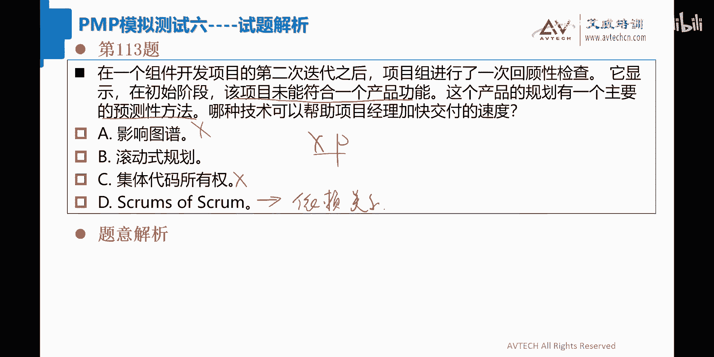
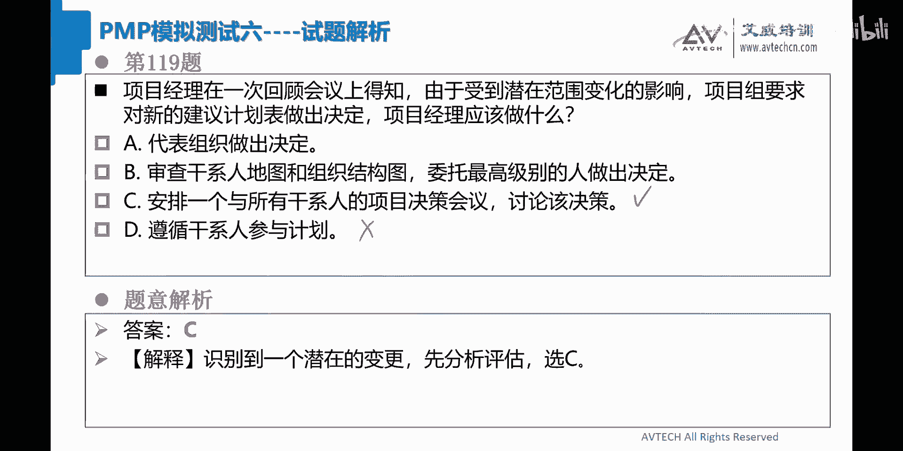
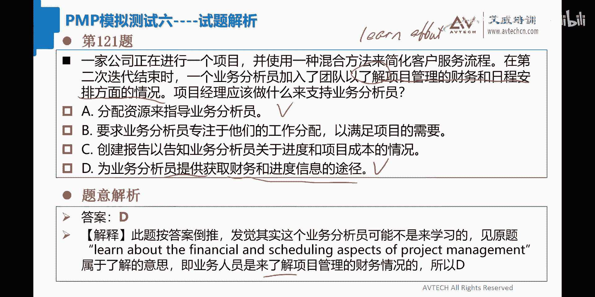

# 2024年PMP考试答题技巧-教你PMP如何做题（中集） - P1 - 艾威PMP项目管理 - BV1eS411c7bt

说一个项目经理注意到在过去几个月里，一个新的团队成员的表现有了很大的提高，项目经理在一直通过工作包的成本，只要指数和精准制药指数来衡量团队成员表现，给这个分配了新的怎么怎么样，技术啊，OK好。

关键字在这儿啊，大家来看一下，项目经理，想在文件中正式记录这个团队成员的成功，看到没有，有的选B，有的选C是吧，OK好那么我们来看一下，就看B跟C吧，我相信A跟dog大家不选也是有道理啊。

诶就该成员的贡献，召开一次有关于项目的专列会议，并作会议记录在责任分配角中，记录该团队成员中，哎呀这个选C的同学，我勒个去肯定不对的呀，同学们，这个应该是属于一上来就被干掉的这个答案啊，选B选B啊。

那么你想他要记录这个团队成员的成功的话，最主要是什么，召开会议表彰大会，对不对，所以这道题目选B就是对的，选C的原因在什么呀，责任分配表这里边的关键字是什么，我一说就知道了，这个是针对于活动不清。

责任不清，对吧啊，这种东西它不轻的造成的，那么我这个时候就应该是要去做这个这个，责任分配表，哪有责任分配表去记录该成员贡献的，你们想想看是不是同意吗，同意的话请扣一啊，哎你们等我一下啊。

给我给我一点时间，我把门关一关啊，谢谢大家。

好91题啊，91题，92题，一个项目的学习成员，在一个方案的初始方案发现了一个缺陷，该事人不确定是否要部署该系统，来我们来看这个部署不确定要部署这个该系统，那么这个缺陷有可能是质量题对吧。

有可能是风险题，我们仔细来看一下这道题目啊，那么有些同学选C，有的人选B是吧，为该项目提出一个解决方案的重新设计，B1是针对这个问题进行风险分析，哎我觉得这个B2就很很相似了。

C修改项目的质量控制措施啊，这个six是肯定错的，我待会说啊，在方案设计的基础上制定了一个减轻措施，OK这没有人选dog的话，我们就专门讲C吧，为什么这道题目不可能选C呢，什么叫质量控制措施。

你先要搞清楚这个事，质量控制措施就是我们测试的方法对吧，就这个意思吧，什么叫质量控制，质量控制就是对我们的项目进行，测试的一个过程，那么你现在质量控制措施，那就是测试的措施对吧，就是测试的方法。

所以你现在发现这个缺陷，你要把我们的测试方法给改掉，这个是绝对是不行的对吧，我们应该要针对这件事情，干系人不确定是不要部署，你要对这个缺陷要定性，到底是这个这个高高危风险还是低危风险。

所以呢这个玩意儿啊，我们拿出来之后就应该选B了，好不好，选C的同学啊，理解了没有理解的话，请扣一啊，所以92题正确答案应该选择是boy。

93，一个项目经理有两个项目在同时执行啊。

关键项目啊，A为什么不对啊，来让我看一下呃，为该项目提出一个解决方案的重新设计啊，啊A这个对吧，有人选A了啊，那么你看B跟A从顺序角度上面来说，先走哪个米卡，你理解了没有。

理解的话请扣一从顺序角度先做什么，对啊，我们说的如果他是现在证明下来是风险题，风险题的话，我们应该走A套流程，发现一个缺陷嘛，对不对，不确定是否要盖，所以这对该系人来说，这是一个缺陷。

那么首先我们应该先做定性，这件事情应该做定规划了，对不对啊，勉强理解了啊。

可以的好，931个项目经理有两个项目同时在执行啊，关键项目的工期必须缩短，但是项目经理没有足够的资源来实现这一目标，此外时间表没有可以重叠的活动，项目经理应该怎么做。

应用快速跟踪技术来压缩关键项目的进度，B是分析两个项目，以确定对工程资源的最有效利用，C是OK这再怎么着，我就感觉B就好了嘛，我塞啊，它是什么，没有足够的资源来实现这一个目标。

这个东西我们称之为叫什么叫进度题对吧，进度题为什么是进度题啊，进度题里面这里边就是考资源优化技术，对不对，OK好，那么此外时间表没有可以重叠活动啊，那么我们来看利用资源优化来证明。

为关键项目申请更多的资源，有没有人选C啊，没有人选C的吧，应该是因为他利用的这个工具是对的，但是这句话是错的，他是要申请更多的资源对吧，我现在是说人该怎么用，能够对这个工作资源有最有效利用好。

导老师为项目团队提供进度优化培训，以提高他们的技能哈，所以这道题目这个答案应该选择是博Y，看看怎么优化对吧好。

大家都选播啊，可以的好，94题，一个项目发起人，要求项目团队为项目增加一个改进，项目经理该如何处理这个要求呃，要增加一个改进，所以这是一个变更题对吧，你先把这个记下啊，那么如何处理啊。

检查预算是否可以支付增强的费用，你再变更题的话，现在的预算应该不用接受和拒绝，也不应该考对吧，我曾经跟你们讲过的这道题目就应该选dog啊，so easy啊，这道题目我感觉啊。

就跟我们的课后练习差不多的难度啊，真的是很简单啊，大家一看全都是对的。

好可以啊，一个敏捷项目团队，正在开发一种基础的设施产品，该产品在多次迭代中逐步交付，在第三次迭代的中途，整个公司被告知基础架构支持，操作系统将在下一个季度终止，数千台机器将受到SPRINK的影响。

来来来看到这个吧，可能是变更题，也可能是风险题，来我们先把这两个先写下来啊，项目经理首先应该做什么，A和it部门优先升级，这肯定不对的，如果是变更题的话，走变更流程，风险题的话，走A套，对不对。

或者走B套，你这个A啊，这个东西太实在了啊，通知产品负责人，并请求更多的项目资源，这个事真的是驴唇不对马嘴的答案，和干系人开会了解此变更的影响，唉这个C可能是对的，有同学说了，添加到产品蛋白思想。

以优先考虑操作系统的需求，那么这个同东西呢，很多同学他会哦，这里边很多同学是因为它是迭代啊迭代，所以很多人选择dog的，其实DOGG不对，还是那句话，还是那句话，这里边最主要讲的是风险。

现在证明下来是风险，或者说啊这个说是变更啊，是变更，你不管是风险还是变更，你这个里边影响到所有的东西，你说我把这个你懂我的意思吧，嘿嘿可能还不懂啊，只有需求才会加入到待办事项列表中懂吗。

当前他讲的东西其实是风险的问题，OK啊讲的是风险的问题，所以风险是写进不了所谓的产品待办事项的，希望大家一定要明白这个道理，所以这道题目正确答案应该选择的是c ah。

C是那个干系人开会了解这个变更的影响啊，做做做变更题的这个思路啊，啊spring说的是产品经理的事啊。

也可以这么理解好，第95题好，96题，在一个多媒体展览设计项目的启动阶段，项目经理正在制定项目管理计划，为了完成这项任务，项目经理应该怎么做，这道题目很有意思啊，这道题目你们来看啊，有同学选B啊。

呃启动阶段制定项目管理计划，看到没有，启动阶段制定项目管理计划，有同学选A选C选B，OK啊，先选起来额，他的意思就是我要怎么做项目管理计划对吧，OK又是启动阶段就要做，哇塞这个有点看不懂啊。

以其他类似展览的可交付成果清单结果为基准，发起一项问卷调查，征求最终客户的意见，确定展览的优先次序，和主办方澄清高增值业务需求，作为形成可交付成果基础的清单清单的基础。

如果合同没有明确说明关键的可交付成果清单，则启动附加服服务协议，哎呀，这道题目，这道题目我觉得啊我们仔细看一下这道题目，哦是C是吧，好谢谢你们，先C后B啊，这道题目的最大的问题在什么地方啊。

我我估计大家说C的话，那十有八九应该是C这道题目的问题是什么啊，这道问题的最主要是他是站在启动阶段，但是他要去做项目管理计划，这是我没看懂的东西，大家都知道启动阶段，启动阶段的时候。

应该正常来说他是要做项目章程，但是呢他又去在启动的时候，就直接做项目管理计划，所以这我没有看懂啊，这个应该是在规划过程，但是在刚刚的一秒当中，我又说服自己了，说启动阶段怎么不可以写项目管理计划，对不对。

也可以做的嘛，对吧你把你知道的先写下来，也有道理，那么启动阶段的时候，最主要的我刚刚看了一下C啊，他说澄清高层次业务需求，作为形成可交付成果的基础，所以这个东西这一半。

其实最主要的跟刚刚的所说的那个项目章程，是匹配的，对不对，然后你接下去要做项目管理计划，所以章程往项目管理计划去靠，所以这里面一半他说形成可交付成果的基础，对不对，所以正好这个C也是比较匹合这个题意啊。

你看经过老张的这个这个一洗白啊，这个C啊就活灵活现了啊，栩栩如生的同学们，哎呀这道题目其实有点难度的啊，有点难度的，主要是不知道他在干嘛，启动阶段又要做项目管理计划对吧，哎对了做啊，做范围规划啊。

有道理的，然后再来看啊，很多同学选了个B啊，选A选B选C对吧，B是发起一项问卷调查，征询客户展览哦，我知道了，也就是说就前面那个spring说的，先C再后B就这个道理，因为C我是把章程高层次业务需求。

先把它搞出来，然后呢发起问卷调查，问卷调查它是收集需求的工具技术对吧，所以我们正式be算是收集需求，所以先C后BOK啊，这个是有道理的，好吧好，所以96题正确答案应该选C啊，这道题目有点难啊。

主要是没看懂，大家发觉了没有，我现在给大家一个总结啊，就是很多同学啊，你们在做很多题目，他容易犯错的一个情况之下，就是你根本就是没看懂对吧，这个题目你或者是你误解了，然后你的答案也会有误解啊。

像这道题目就是的啊。

很经典好，97，一个项目经理啊，正在管理一个混合项目，一个干系人直接联系了，要求做出改变，由于这个要求吧就分心了对吧，所以这是个变更体啊，那么既然这个是个变更题，我后面该怎么办啊。

告知干系人是直接提供给项目经理啊，这个应该是可以的，关于干细胞的变更要求，以及对这个生产力的影响，高通知是提交给CCB，OK啊，CCB也可以啊，告知SCM主管直接可以干洗人，OK好。

这道题目不应该CCB啊啊，还有同学选B的是吧，哦OK好选B啊，关于变更要求以及对这个项目经理，关于干系人的变更要求，以及对这个生产力的影响，生产力的影响，这就是应该要做这个东西的变更要求，对吧啊。

这道题目其实这里的还有选dog的，哇，塞告知SCM主管，我可以直接和该学而讨论该变更啊，我们把这个变更啊应该交给谁，要重新要看一看，我们通常来说有两种做法，第一种是预测模型对吧，预测模型那个流程。

第二个是什么呢，第二个是什么，我们的这个这个敏捷模型，啊敏捷模型，那么在这个系统当中呢，其实预测模型，敏捷模型它们是不一样的，就是谁帮着你来走这个流程，大家听懂了吧。

你别说你看这个干系人直接联系要求做出改变，实际上不对的，这个干系人应该联系谁对吧，这道题目就是这么问的，这个应该是干系联系谁啊，所以我们来看在预测模型当中，这个变更应该联系项目经理，对不对。

项目经理会帮助你去走流程的，走什么一记录啊，二分析啊对吧，你看三C4CCB啊，对不对啊，OK5更新六通知七执行啊对吧，这些东西是他的最主要的这个流程啊，这是项目经理来做敏捷，其实是交给两种人来做。

一种呢是交给PO来做，有PO的答案，我们优先考虑PO答案对吧，这样PO来干而敏捷，还有另外一种，你的变更交给谁啊，也是项目经理，为什么是项目经理，项目经理对你这个项目的总体，他要进行一个完全的负责的。

你们说是不是，所以真的是真没有的话，他就应该找项目经理，对不对啊，找项目经理来做这个事儿，所以在这里边我们应该交给谁，那最终大家发觉交给的最多的还是项目经理，OK啊就这个意思好吧好，那么有同学问了。

说那个敏捷有CCB吧，敏捷没有CCB啊，敏捷没有CCB，OK啊，所以C我们就去掉了啊，这个是很好的一件事，那主题是团队对的好，那么告知干行人呃，新的正确的需求的应该是提供给项目经理啊。

好那么这道题目就应该选择是A了，好然后再往下一个高绩效，团队的绩效在过去一年中得到持续提升，和其他团队成员拉开差距，项目经理不愿意公开承认他的贡献，因为他担心会有打击他人的积极性。

同样也担心如果成员得不到应有奖励，项目成员会离开，项目经理应该怎么做啊，有同学选B有选C啊，将表现好的团队成员提升更高的职位要求，表现好的团队成员指导其他团队成员，题型好的同学，全员共关注的是共同啊。

这道题目我做过这道题目，正确答案选C吧，天哼哼，OK选C啊，为什么选C做这两件事，因为表扬单人呐会打击积极性，然后呢不表扬呢又得不到应有的奖励，看到没有，所以呢，他就跟他走了一个比较假大空的一个说法。

就说我们要关注的是团队的集体成长，和团队的集体的共同的奖励，而不是个人奖励，OK我觉得十有八九啊，这样说完了说啊，这个哥们也基本上也要走了，他的潜台词的意思是什么呢，就是告诉他对方就说你应该要帮助对方。

对不对啊，要帮助大家就这个事情啊，很多同学说了说那我这里边就选B选D啊，OK额选dog的同学呢，你们就不要想了，想都不要想这种私下奖励这么猥琐的做法，你们能选的出来，我真的也是醉了啊，OK好吧。

所以你们这个dog我们这个dog的答案呢，我们就不去考虑了，好不好，这种私下奖励也不用去想啊，其实最主要的答案是在B跟C里面出来，就这么回事啊，那为什么这道题目选C不选B呢，就一句话关注共同奖励。

以团队为这个单位对吧，以团队为这个精神，很符合我们偏僻的这个政治正确嘛，所以这个C1定是他的最优答案，懂吗，这个这个东西应该我不用教你们了对吧，所谓的这种假大空政治正确的答案，你应该要多关注关注啊。

就这个意思啊，好了唉对，强调团队精神啊，强烈产业精神，好吧好，这道题目选C啊，选C好多同学都选私下奖励啊，哇塞啊，哎呀，这个想想，你们这些项目经理也真的是挺挺困难的啊，真的挺困难，讲真心话。

我也不用去什么去奖励，不奖励很简单，因为老张所在的职位，我所在所在，所以我我我倒过来跟你们说句话啊，真的你你们以为这个项目经理啊，他自己的这个权力很大对吧，真的是好事吗对吧，想清楚啊，我告诉你啊。

其实项目经理全力打不是什么好事。

懂吗，权力小才OK呢，权力小义务小，对不对，权力大义务大，哇塞这鸡儿八叉的事情，哇塞弄得大家全都是不知道怎么做啊，OK好了啦，不说了不说了，99，一个项目经理正在管理一个混合项目。

在参加完一次迭代评审之后啊，一个干系人告诉项目经理，他们很忙，并且问为什么要这么频繁的举行这些评审，所以这个东西应该是干系人啊，项目经理如何回答，A和干协人协商，减少审查次数。

并更新干协人参与计划与反应减少的次数，B和干学儿讨论混合方法的好处，以及频繁审查，如何带来更大的价值和更少的反攻，我觉得B就挺好的啊，B就挺好的，将问题记录在问题日中，并将冲突上报给发起人以寻求帮助。

哎这个东西我也可以认为啊，如果没有更好的答案的话，向甘神解释干员参与计划，要求他们参加所有人，这这个不行的，哇塞啊，不能说有干洗人参与计划要求对吧，就这个意思，所以这道题目正确答案应该选择的是boy啊。

我觉得是博爱，人家为什么要做平凡的评审，跟他要讲讲好处在什么地方私下沟通对吧，好99题，正确答案应该选boy啊。

可以的好100题，一家全球性公司聘请了一位项目经理，负责其所在的站点实施新项目，在审查了商业论证和项目章程和项目经理，注意到项目组有不同的地区和好，OK这个里边出来了，刚刚开始在审查项目章程，看到没有。

所以这是什么，这是资源资源当中呢，有一个东西我们称之为叫虚拟团队对吧，OK训团考什么，训练团队考沟通，所以这里面有同学选boy，有同学选C，OK好协调每个地点的虚拟会议和面对面会议。

以加强沟通协调和虚拟会议，评估团队的需求，团队需求，沟通需求，这道题目你们选B啊，我觉得就不咋地了，肯定选C，你们同意我的意思吧，肯定选C，为什么选C，因为在这个里边有这句话，你们忘记了吗。

我们在规划沟通管理的过程当中，首先要做的就是这件事，评估团队的沟通需求，他没有任何评估的成分，所以按照顺序角度来说的话，就像凯尼所说的，先B后C你们同意吧，同意的话请扣一，所以100题啊。

同样线你看现在考的很活啊，虽然说虚拟团队考沟通过他的课粒度还是很大，那么你在两个同样都是沟通的情况之下，你就要想想哪个先做哪个后做，听懂吗，像这个里边就是这样子的，先做什么后做什么，那先先去协调对吧。

沟通需求，OK所以100题正确答案应该先C好不好。

好，101题啊，101题在回顾仪式上，敏捷团队正在谈论呃，产品负责人的期望没有得到满足，哎你看又来了，看到没有，那没展满足，这个里边大家都知道，先是对吧，再试，OK然后是对不对。

好项目经理在这个里边开始时候做什么，A在创建产品代码列表过程，定义了预期的团队敏捷的贡献，B评估敏捷团队的能力，并计划必要的培训，C确定团队的基本原规则，并分享项目愿景，导老师将项目愿景和冲刺目标。

清楚地传给他团队哎，同学们，大家来看一下，这个里边没有一个跟质量干涉和范围，相关的答案呐，我勒个哎呦，我去啊，有的选B，有的选dog，哇塞那我们只能靠猜了，哇塞对吧。

完全是超出我们这种这种做题的范围之外啊，说他的期望没有得到满足，那没有得到满足的话，我们来想想看，他满没有得到满足的原因是什么对吧，两种，一种是什么呢，一种是团队技能有问题，一种算客户的期望，其实没有。

clarify没有澄清，可以吧，技能和期望就这两个，那我们来看一下这个里边有没有技能，评估敏捷团队能力啊，你看这个就是技能对吧，然后呢，然后期望将冲刺和愿景的目标清晰的传给团队。

还有什么定义了预期的团队贡献，这个A肯定是不对的，确定团队的规则，分享项目愿景，这个不对的，所以就B跟dog里面一起来走，OK好呃，让我们来看看第九个问题啊，项目开始时，项目开始时，哇塞这个划出来之后。

我就更晕了，哇塞这道题目好像好难啊啊，到底是先做培训呢，还是先要把这个冲刺目标清楚了，传给阿拉，给团队内，因为开始时的时候笔也是可以的，不是因为线稿需求，因为大多数他的期望没得到满足啊。

我一直认为就是不是我期望没有传达出去，是因为这个团队的技能有问题，好像我知道你们选什么了，你们选的是dog，但我不知道为什么，我就是想选B，我就喜欢B哇塞，我总觉得这个期望没有得到满足。

不是因为这个期望没有得到澄清的缘故，我总觉得这个东西比好很好，好我知道这道题目答案是啥了啊，那你选比较好，你黑暗天使，你选了dog是吧，我是哎呀，这个真是令人非常郁闷的一下，好吧好吧，你们选dog吧。

就选dog吧，嗯对对对好，老张自该领第二个第二个一分了，哇塞178分了，我天哪，问题其实问的避免这个问题怎么办，只有第一次冲刺目标和这个题目应景相关，场景相关避免对的，他就是开始时嘛对吧。

其实就像前面一个同学，他跟我提示的，开始时我只是不能解决我的问题，就在于说我觉得博爱也没有问题啊，唉好了，不纠结了不纠结了好，那这道题目正式，我们来来正确的看一眼，就是像各位同学所说的。

先要把需求先说清楚对吧，把这个愿景和冲刺目标说清楚，先把负责人的这个期望说清楚，然后我们再来做好吧。

好好102题，一个团队成员正在举办一个活动，并通过他们的工作日历啊，邀请了几个从事另外没有被邀请参加的活动，成员在几次会议中心啊，明显的几次战会会议中啊，明显的分心了，那请问项目应该怎么做。

那这个不用说了，这个是资源题对吧，OK资源题要求主持活动时，使用私人通讯的方式安排，和冯先生会议讨论问题，那这道题目就选B了吗。

啊大家都选B啊，OK好这道题目简单啊，OK好，那过啊，嘿嘿啊，我觉得我又行了啊，同学们啊，不是这么大蟹，在海中同学怎么选了个C啊。

我塞张虫，增加社会活动啊，首先第一个社会活动不会放在章程里面，听懂了吗，这个社会活动应该放在什么地方，你们来猜一下C这个社会活动放在什么地方，你们觉得啊这个社会活动放在什么地方。

这不就应该放在项目计划当中的吗，这个是项目的计划的一部分呢，对不对啊，资源管理计划也是好像貌似可以的啊，好这些东西我们就不多说了啊，102题啊，C是团建吗，我觉得好像也不大，像团建啊。

好反正这个C他放这个售后活动肯定是放错了，对吧，好不考虑啊不考虑，而且你说如果他就算弹剑的话，那就更不应该选C了，你说是不是对吧，他这个就应该是属于一个冲突，你应该就明显分心了吧，绩效有问题。

所以安排跟他这个锋线的团队成员私下沟通。

看到没有，这就是资源题的做题思路啊，好103题，一家全球性公司正在执行一个战略项目，已升级一个遗留的企业系统，该公司使用混合方法进行项目管理，刚刚完成第一个冲刺，一个团队在一个回顾回中要求改善测试流程。

要求改善这个，这是它的关键字，那么项目的下一步应该做什么啊，记录所学到的经验，并且在下一个冲刺实施改进，我觉得A挺好的呀，啊OK看看有没有其他的啊，促进团队的日常工作，跟踪变更的执行情况。

咦这个B应该是后面的事吧，那么我把B打个对勾吧，啊为啥呢，为因为这个里边如果A如果算下来不好，就应该是B啊，在企业系统中组织一次变更的演示，C是不对的，驴唇不对马嘴，要求团队成员想出留情改进的方法。

其实DOGG也挺好的嘛，你要求对吧，只是比较强制啊，那么所以A跟dog两个相比的话，那我还是比较偏向于A跟B啊，OK好，那么A跟B两个人我们之间进行pk啊，所记录到所学的经验，在下一个阶段当中实施改进。

博爱是跟踪变更的执行情况，这里面变更是什么意思，变更OK好，我觉得这个变更指的其实就是改进的意思，OK变革就是改进的意思，那么就只跟踪这个改进的执行情况，这道题目正确答案还是应该选A的啊。

从顺序角度上面来说，先记录，然后设定好充值计划的这个规划，然后B呢在他们在做的时候，你再做改进好。

104，项目经理了解到发起人对项目的需求，开发不满意，为了使项目和发起人的期望相一致，项目经理应该怎么做啊，和团队一起审查项目的目标图啊，同学选A了是吧，好进行一次干细而评估，哦这道题目应该是选B的。

你们来看这个答案，为了使项目和发起人的期望值是相一致，所以这道题目是干系人体，对不对，你这个期望值要相一致的话，你一定要做干性人评估，所以这道题目应该选B，那我来看这个里边。

A和团队一起审查项目的目标图呃，我觉得你跟团队一起审查，而且项目标图有没有，我们先不说哈，你跟团队一起审查这件事儿本来就做错了，你说是不是你要做的期望的话，你直接应该是要跑到发起人或者是干洗人，那里去。

直接对期望进行相应的解说，做完了之后呢，把他的期望再跟团队进行传达，会相对来说比较正确，所以你跟他一起审查这个图啊，我觉得不大对同学们好不好啊，所以这个A啊我们不要去选啊，不要去选好呃。

瑞雪兆丰年说什么改成发起人一起审查可否，哎你别说A如果他是改成跟发起人的话，就跟B差不多了，懂吗，但是我还是觉得比好造分解，为啥还有一个问题他没有解决，是这个东西，这个玩意儿文件。

这个文件到底有没有懂吗，如果有的话嘛，我觉得跟发起人审查没有问题，如果没有的话，那就不行了，好不好，好，所以暂时啊我们在这里面104题，我们应该设定为B。

OK啊，好，105题，一个项目发起人在一家大型的制造公司啊，拥有多元化的领域，最近啊变更通知委员会CCB推迟了一些请求，想把这些请求传达给肝希儿项目经用什么文件，哇塞这道题目简单选B啊啊105题。

有人选dog啊，这题目不就应该是变更日志吗，你这个dog不是文件取小吗，这个日志分类多了，风险日志变更日志对吧，问题日志OK啊，假设日志对吧，OK就这个意思啊，所以105题正确答案应该选择是boy啊。

OK啊，candy问了说项目目标图等于什么，讲心里话我也不知道，有时候啊，你就必须承认这个玩意儿就是一个陌生词汇。

懂了没有啊，好我不纠结了啊，106题，106题，一家公司有一份维护和加强客户的现有合同啊，然后法律部门通知项目经理，一个要求更加严格的保护客户信息的新立法，可能会被签署，成为法律法律降压学。

项目经理在正常维护数据库，实施额外的安全功能功能，不包含当前的合同范围内，应该怎么做，哎你这不就是个变更题吗，我要求你实施额外的安全功能，这个不就是个变更题吗，啊有的选B就选C啊，OK好。

那么我们来看啊，要求法律部门在下一次合同谈判中提出问题，寻求发起日支持，影响客户立即修改，在更新风眼内侧包含这个问题，并和发起人讨论当前的风险应对计划，等到法律正确，最终后再去再去再具体确定范围变化。

同学们，我好像又不行了，同学们，我感觉我的智商已经不在线了，这里面没有我要的答案呐，哎呀，好痛苦啊，你们好像大多数都选C是吧，可是我一直觉得这个C好像也不咋地啊，你看法律将要噢噢将要求哎呦，好了好了。

好好理解理解理解理解风险，风险风险，好好好好风险风险，风险提懂吗，将要求不是马上就要求了，所以这不是变更题，哎呀，所以以前的一些做题思路也需要refresh啊，叫刷新一下，我以前一直把这个法律一出来。

就把它当做变更来走啊，不管你成功不成功，有没有都要按变更走，现在看起来还不一定，所以有时候法律呢你还是要看就是风险变更，为啥，因为这一次好像法律出现的东西，它以风险为主，变更很少啊，真的是这个道理。

所以这道题目给出来了答案后来是cc也不对呀，你说这更新分也的意思包含这个问题，我天哪，你问题问应该是更新在问题日志里边，所以C则也写的也是非常不严谨，我告诉你，我就是因为这个原因，我这个C我才不肯选。

你知道我想选什么吗，哼哼哼哼哼哼哼哼，我想选D，同学们，可是你们没有一个人告诉我选D，哇塞我就不敢选了，哇塞嗯好吧，第一句话有可能是吧，哪里的第一句话有可能啊，因为我一直把它当做变更题嘛。

当做变更题的话，我觉得dog嘛差不多，OK好吧，所以这道题目选C啊，等你们选C了，我就知道好，这道题目你们就不要算我错吧对吧，我又没有说出我想炫的东西对吧，ok very very good啊。

好选C选C，把这个东西当做风险题，所以我们从这道题目得出的结论是什么，就是法律这件事情，希望大家也知道，如果法律现在正在影响你的话，可能是个变更，如果法律它现在将要影响你的话，可能它是一个风险。

这个东西希望大家稍微区分一下，好不好啊，从模拟六这一道题目，我们应该是得出这么一个做题思路。

这个会比较好一些，而107题，一个项目的团队组建了项目什么，一个项目组建一个新的项目图，团队组建的项目，该项目将使用预测性的方法进行数据收集，并使用敏捷方法进行开发测试。

项目中不是每个人都有敏捷工作经验的，由于敏捷开发方法的结构不明确，进度已经开始下滑，项目经理怎么做才能避免这种情况，由于敏捷的开发方法不明确，这是关键字，OK啊，不管你说什么东西啊。

反正这个这个明确结构不明确，可能是资源体，可能是资源题啊，要做培训了对吧，这个是我们理解啊，好107题正确答案好，好多人选A啊，建立每日的战略会议呃，跟踪和报告团队进展之前发生延误的时候，向甘希尔报告。

哎，我觉得这个不应该是你们怎么会选那么多A啊，我觉得不应该是这个答案呐，哇塞好，你看你看到吧，你们等到我读完了之后，居然你们开始有人开始选B了，卧槽还有开始选C了，我天哪，好好选B的话。

是建立每周的状态会议来审查团队的进展，准备每周的状态报告来跟踪进展，并也不大，像，这道题目名字叫开发方法的结构不明确，也就是他我不知道这个敏捷的开发方法，所以这叫技能不足啊，求培训，你们听懂我的意思吧。

OKC和团队会面，允许团队做什么并建立绩效目标，也不是这个技能到要是举行例行会议，这个肯定是错的，我的天哪，我又不行了，同学们，哎，这不是不是导你同学，你就你就肯定是错的，你就不要不要写出来了，懂吗。

你这个确定表现不佳，你想干什么对吧，诶，好哇塞，我根本没有办法从你们的这些答案当中，能够找到正确答案，哇塞这是我自己个人的失误啊，谁跟你说177的，我没有177啊，啊我我我我目前还是178对吧。

选择A选择B选的C呀，不我的想法是什么呢，我的想法是开发方法不明确，那么你应该要做培训啊，这个东西这个答案没有培训啊，这题目我给C，啊我不大气，我这个一分一定要争回来的，我肯定不能大气，再大气了。

老张的名声都没了，下次黑皮老师肯定要找他其他的老师了，对不对，这对我自己个人来说非常的不利啊，不是自组织来看一下对吧。

是选C，为什么你要找到C跟A跟B之间的区别，OKA跟B它们都是处于直行方向，建立每天战略会议啊，或者做每周状态报告，你看战略会议跟每周状态报告，你就可以把B给干掉了，大家理解了吧。

因为战略会议主要是做沟通的，而我们的状态会议也是目标，为了做沟通，但是在敏捷过程当中，状态会议往往没有站立会议来的优化，所以这里面boy肯定是干掉，那就留A跟C了，A是建立每天的战略会议等等等等。

这么说，然后C允许团队先做什么，建立绩效目标，这个是站在规划角度来看待问题，而我们A呢是站在执行角度来看的问题，所以我们按照顺序来说，应该选C而不选A，同意吗，大家同意的话，请扣一啊。

所以107题正确答案应该选C啊，选C好，谢谢帮助我选C的同学啊，good还好我没有呃，没嘿嘿嘿，我还是保持178的这个分数啊，好要一点点来好，107题正确答案应该选C啊，选C排除法。

108题，一个新的相关的项目干系人，在执行过程中建议改变一些项目参数，项目经理该做什么，接受拒绝，这两个肯定不行，OK将该变更移交给指导委员会，这也不行，你应该移交给CCB，而不是指导委员会。

使用综合变更控制来评估你意的变更，这道题目正确答案应该选dog。

Ok good，好简单啊简单，总体说起来我觉得模拟六不算难，虽然当中啊有一部分题目就是很很纠结对吧，107题就很纠结，但总体说来这种纠结题目很少，OK好，一家公司要在年底前向市场推出一个新产品。

需要建造一个存储和分销设施，在每个月的该学会议上，发现设施的地点是政府拥有的区域，项目经理应该做什么，找出替代地点，呃，哦我理解了，看到没有看到没有，哎你居然跟老虎抢地皮啊，你一下不想活了，你我跟你说。

你说对不对，选D和选boy对吧，OK更新日志，更新风眼那一测，对于我个人来说，这件事情应该是个风险，因为政府目前为止没有搞你，对不对，如果搞你的话，你就更新问题日志了，现在没搞，你对你将来来说可能会搞。

OK啊，输个飞机选了个A呀，哇塞你想想看，我们按照这是一个拥有区域，所以这样是什么是风险题，走什么，走A套，A套一更新对吧，二定性三定量，懂了没有，OK所以你这里更新风险的预测，在这一步的。

你最后一个说找到一个替代地点是什么，规划风险应对啊，这是它的字节，这是A答案所在的地方，这个更新风险的预测是D所在的地方，懂了没有啊，玄天同学，你这个就乱选了，哇塞啊，你这个发布变更请求。

你发布变更请求，其实也是在规划风险应对这一块的，你们说是不是啊，所以这道题目正确答案应该选择的是dog，更新风险的预测，好司马萨达姆说了，说题干没有说对项目造成什么影响，为什么不按照问题来处理。

哎你我跟你也讲过一个故事，我说很多情况你要学会自己去联想，我讲过吧，来萨达姆，你说我讲过吧啊讲过的话，扣一没讲过，扣零啊，我说很多题目他自己千变万化，我只讲出其中的一部分当中讲到他的影响。

那这个东西很容易会认为是风险或者是问题，但是有很多情况需要你们自己去去体会的，现在在该省人会议上发现，你要施工的这个地点居然是政府拥有的区域，你敢在太岁头上动土，太岁现在还没有找你麻烦呐。

这个东西对你来说是问题还是风险，对不对，这个明显就是个风险，这就明显是个风险，懂了没有啊，有时候联想就错了，那只能说呵呵呵呵，哎呀我们这个风险题啊千变万化啊，OK好，109题正确答案应该选择是dog啊。

讲的是dog。

1101家公司一直遵循预测的方法，总是等待前一阶段完成后，再评估他们的产品质量呃，呃一位具有混合方法经验的新项目经理，被指派来帮助提高该公司的米称质量管理效率，项目经理要做什么来解决流程的改进，OK好。

那么这个东西呢它是指流程改进的吧，所以是妥妥的质量题啊，妥妥质量题好，那么这好多同学选A是吧，那我们也选A吧，对吧啊，这道题目应该是没有什么太大的，从团队那里了解流程背景，相互依存关系。

然后确定改进措施，对的很好，诶，我突然间看到了C的答案，与PMO领导讨论流程改进，已更新项目的交付框架，哎我觉得C也很好啊，嗯好继续保持流程的原样，这个boy是错的，dog是定义一个基本规则。

以符合质量标准，并要求团队去应用它，哎呀定一个基本规则，以符合质量标准，这个dog应该没有A好，去掉好啊，你看了吗，LH同学就直接问了C为什么不可以，你这个里面是个流程，这个流程的话应该是流程框架体系。

应该跟PMO进行讨论的，Ok，诺娃同学说了说应该是先A后C也有道理，先内后外嗯，有道理，所以这道题目我觉得也应该是先A后C，我前面其实不并不瞒大家说，我看到C我看到PO，我觉得跟PO的关系会更大一些。

对所谓的质量，这个东西其实应该先从团队成员那里入手，知道一下现状，然后呢你有了改进方案，然后呢你再去跟其他的人员去讨论改进方案，所以这个东西先自己搞定，选A的对的挺好的，从顺序角度上面来说。

先A后C好吧，那个LH同学理解了没有理解的话。

请扣一啊，OK好111，项目经理遇到了两个关键任务的延误，这两个任务是由两个不同的团队执行，项目经理意识到这两个团队的职能经理，有一个没有解决的冲突，他们没有正常沟通，两个团队职能经理没有冲动。

没有引导呀对吧，所以这道题目是自愿题或者干系人题都可以啊，这个里边我们要引导先把它想好好安排一次，和经理们的并查哦，这道题目我知道选什么了，这道题目选dog，这道题目我做过啊，而且还有同学还问过我好。

那么和团队和经理会面，试图找出这个冲突的原因，其实很多同学都选到A了，我知道的安排和经理们的会议尝试达成协议，OK那么那当做那两个我就不讲了，好不好，也没有有有人选选boy跟选C的吗，应该没有的吧。

应该没有的吧，好我告诉大家，这道题目最主要的就是在这两件事情上面啊，我觉得这有点诡辩啊，但我觉得其实有点道理，dog是要找到冲突的根本原因，而A呢就指下一步了，要达成协议，双方的协议。

所以这里面先dog后A看到没有对啊，先dog后A，所以111正确答案应该选dog。

OK好，112，一个敏捷的团队获得一个新工具的认证，然而学习成员抱怨说，由于缺乏知识来，我们来把这个画下来，缺乏知识，没有使用这个工具，prince领导一个如何应用情商来利用这种情况，使团队受益。

A申请预算来奖励这个团队成员，这样其他人就会去有动力获得B，将团队成员提升为产品负责人，这个你没这个权利的，卧槽B也有同学选B吗，啊同学选C选dog，OK好，为在这个项目中。

开始使用新工具的团队成员提供奖励，OK到要求团队成员使用他们最近获得的知识，来开发和培训这个新团队，OK好，好这道题目差差不多应该我已经知道了，应该选的是dog啊，选的是dog呃，首先来说的话啊。

这里边选C的同学啊，就是要为他提供奖励，这是干嘛呢，这个是为他提供的叫资源的团建对吧，认可和奖励，这个是其实很重要的，那么我们在这里边最主要的关键字在这儿，就缺乏知识团队，其他人员没有使用这个工具。

那怎么办呢，这就是属于自愿题当中的技能不足，那技能不足怎么办，技能不足求培训啊对吧，所以这个里边最主要是dog为主哦，我没这个知识，题目讲的很明白，所以我不是在做团建啊，我不是在做团建。

我在做的事情是在做培训啊，对吧，哎很好啊，选D啊，第一次选的C，后来考虑选D啊。

好113来看113，一个组件开发项目的第二次迭代之后啊，团队项目组啊进行一次回复检查，它显示在初始阶段，一个项目没能符合一个产品功能，这个产品的规划有一个主要的预测性方法。

下面哪一项技术可以帮助项目经理，加快交付的速度，影响图谱滚动式规划基地代码所有权是SCPSCP，这里边啊陌生词汇你就知道了，这两个东西我就不知道，你知道这两个是什么，这两个东西是极限编程的一些最佳事件。

懂了吗，那么我们再看B跟dog dog，大家都知道，这个东西最主要是来解决外部依赖关系的对吧，OK好，那么他这里面讲了一个什么，就是该项目未能符合一个产品功能啊，该项目未能符合一个产品功能。

它的规划有一个主要的预测方法，哎呦妈呀，这个真的是令人非常的郁闷的一件事情啊，你都看不懂这个东西干嘛，也就是说这个产品的规划过程当中呢，用了一个预测的方法，结果做出来的东西没有符合真正的功能。

换句话说他刚开始时候需求是不明朗的，不明朗的情况就去做了，所以怎么办，要进行滚动式规划好吧，所以我要把这个故事给圆回来啊。

正确答案应该选择是boy114，一家公司的新通讯系统，将包含一个在线仪表盘报告呃，SOS预测能用吗，这个不能用啊，spring同学，SOS最主要是解决我们的依赖关系的。

而不是在这个里边解决那个那个叫什么需求，不明朗的问题，懂吗，好114，执行委员可能会通过在线仪表收到两次一次的，两周一次的绩效报告，那这个要收到报告这件事情，但是属于什么沟通题，懂了吗，所以114啊。

有的是选到，有的是选C，你们选C配置管理计划，我勒个去，你们怎么会选到C的呢，啊啊你怎么会选择dog的呢，对不对啊，千万不要选dog啊，同学们啊，应该选的是C啊，这是个沟通题，所以更新沟通管理计划。

而不是配置管理计划，配置管理计划是什么东西，大家仔细想想，看文件什么东西啊，版本配置对吧对吧，想清楚啊，所以114应该是属于文件版本配置啊，OK啊打错了我呵呵。

我谢谢你啊，好115，一家公司的pm正在采用更多的实用性技术，并聘请了一位具有混合项目管理，就用的项目经理啊，团队在采用项目方法计算缓慢，那把这个关键字画下来，进展缓慢，没有及时更新项目工具。

采取什么行动来改善团队表现，这个东西差不多应该是资源体，或者你可以把它当做质量体对吧，找到问题的根本原因啊等等，那么这里边建立培训课程，OK啊呃这里面讲到过是有没有技能不足吗，啊有同学选A的是吧。

好的好像也没有技能不足啊，我们就不看了啊，向职能经理的部门，向职能部门经理寻求支持，这个应该不是的，对不对，OK好，还有选C的啊，我们看与每个团队成员单独讨论，如何进行必要的更新。

好吧你们选人啊啊还有人选A啊，我才好奇怪啊，发送电子邮件，要求所有的团队成员在一天结束更新，这个肯定不行，好让我来再看一下，A是做培训，C是私下讨论如何做必要更新，诶为什么你们都选到A区了呢。

哦理解了理解了是选A啊，好我收回，我刚才的话，同学们，你们的A是对的，采用新方法，哎对了，猫猫鱼跟我这一样，OK我就在想他这个方面进展缓慢，其实这里面对团队来说，这是个新的东西。

既然是新的东西的话，所以选A，所以这道题目呢应该选A不选C，C是什么呢，C是针对于这个关键字，就是没有及时更新项目工件，什么叫项目工件，就是项目的文件，对不对，项目的文件。

那么你这个里边如何进行必要更新啊，什么什么，其实最主要是由于我在新方法上面进展缓慢，导致我没有办法去更新弓箭，换句话说新方法才是真正的问题的源头，所以这道题目应该选A啊，谢谢谢谢，谢谢各位啊，谢谢各位。

谢谢正晴，谢谢毛毛雨啊，他们一下把这个关键字给找找到了。

OK好好了，115，正确答案应该选的是A16，一个实习生已经工作了两个月，一直没有完成计划的用户故事，项目经理如何解决，那那这个也是培训吗，嘿嘿好，我们来看一下啊，确保充值规划和迭代时间相适应。

这个其实嗯一直没有，我觉得A好像挺好的呀，哎为什么你们都不选呢，啊啊学校选C是吧，OK我前面还看到有个同学选B啊，唱提倡改变迭代持续性，哇塞选B的同学，你们就完蛋了，我跟你们说这个东西能选吗，不能选的。

我告诉你啊，冲刺冲刺，这个它是固定时间和时间是不能随便改动的，参与招聘一个高技能资源，来加强这个这个这个技能啊，哎这个就跟刚刚那道题目是一样的对吧，哇塞啊，呃然后是考虑使用奖励制度来鼓励及时交付。

奖励制度，这个东西不要我告诉你C我其实不愿意选啊，同学说了说，那我这个东西为什么不愿意写啊，一个个来啊，你这里边工作了两个月没有完成，就两种，一种是技能不足，还有一个呢就是工作量太大。

来大家来考虑是不是这个道理，一个是技能不足，一个是工作量太大，所以我们在这个系统里面啊，你们仔细来看，A其实就是针对于工作量太大的这种做法，那有人说了，那C是不是针对于技能不足，你搞错了。

C他是找到一个高技能资源，那么这个跟我们刚刚那道题目还是有点区别的，我们刚刚那道题目怎么说的，所以若要避免这个事，我早先应该干什么，对不对，那你早点就应该用个高技能资源来做这个事，那就OK了。

他现在问你说应该如何解决这个问题，看到没有，问的是下一步下一步啊，不是后悔药，那么既然是下一步的话，那我十有八九，我觉得C这个东西你再去找一个牛逼的人，估计不行好吧，所以C我不选了。

那dog呢比如说用奖励制度来交付，你要知道工作量就变大，你天天给他大保健，他都不会给你做完，懂了没有，所以dog肯定是错的，所以这道题目正确答案只能够选A的啊，只能够选A。

也就是告诉大家工作量他其实是太高了，要保持冲刺规模和迭代时间相适匹，相相匹配，好116，正确答案应该选择是A啊，嗯啊这道题目我看了看，大家选的非常多啊。

ABCD都有一家人整整齐齐啊，好117啊，由于公司的合并和收购，一个关键项目的主要发起人啊，该型发生了变化啊，那么这个新的干写人抱怨，他们不知道项目的延误，其他干型都知道。

所有关于项目的沟通都是在每周开始，通过电子邮件空间啊，这个东西就知道了，咱要不知道信息啊，什么大数属于沟通题啊，好有的选C，有的选dog，看到没有选C选dog啊，好那么向新的干洗儿发送证据。

建议新的该学人在下次董事会审查，新与和新的干系人分享沟通管理计划，和新的干系人讨论项目需求更新，沟通管理好这道题目选到过了，对吧，为什么选到不选C呢，嗯分享不能解决问题啊，你们说是不是。

因为我即便用了现在的这种沟通管理计划，用邮件电子分享，但是这个新的干系人啊，他不看这个东西对不对，他既然不看的话，那对你来说，你要先去了解它自己相应的这个功能需求对吧，所以这道题目选到了啊。

OK好哎，我们到120的时候，你能让老张稍微休息一下吧，哇塞我怎么突然之间觉得自己好累啊啊，我中午我忙着做饭啊，哼哼有点有点累啊，但是睡觉都没有睡好，给我休息个10分钟，然后我们下面就一冲冲。

到底好不好好，我们来看一下118啊，一个项目组一些经验丰富的成员抱怨项目经理，高级项目组成员认为，项目经理对他们进行微观管理，阻止他们完成工作，项目经理excel这些应该如何做。

那这道题目你来看进行微观管理，阻止他们进行工作，对不对，OK请教如何成为这些团队成员更好的导师，设立一个团队建设活动好，很多人都选C是吧，我觉得C也就对了，管理他的风格，以更好的适应高级团队成员。

对的啊，以更好的适应高级团队成员，好建立一个团队建设活动，使团队重新获得协同效应，这个事其实就是就是叫他们出去做团建活动了，好我个人也倾向于C啊啊，此类抱怨不一定就是项目经理存在不足，优先考虑团建。

通过团建改善社，嗯嗯这个也真的能够把我噎死，哇塞，哎你们那个题目当中，这个题目到底是C还是B啊，我怎么感觉这道题目很有意思啊，给的是B还是C啊，我我突然之间答案给的是B呀，设定一个团结活动。

能够获得协同效应，啊有的选B，有的选C啊，哎呀我我其实觉得头晕也是我的一个问题了啊，有点累了，主要是有点想不通了嗯，哎呀我的天哪，他这里面啊他的解析给出来的话，就是就是认为高级团队成员。

认为项目经理叫微观管理嘛，叫世妈，对不对，什么事情都那个阻止他们完成工作啊，Ok，哎我觉得C也没有说错，我我只能说C也没有什么错，应该进行微观管理，组织他们完成工作，哎呀让我来想想团队建设活动。

好吧好吧，我们先把这个东西先先stuck一下吧，我们到时候再跟其他老师再一起沟通一下吧，我个人感觉这道题目我觉得C其实还行啊，这个东西，啊高级团队成员不代不代表团队啊，所以所以这两个答案都都比较那个。

所以这倒是一道争议题啊，啊，只能只能说大家都有自己的道理，我这里面最主要是什么呢，就是你认为我在微观管理你很多人，我我如果是带路的话，很直接的就说你这样说，我微光管理我绝对不会首先请你吃个饭的对吧。

我首先肯定是要去调整我自己的管理风格，OK可能会这样子会好一些，好啦好吧好吧好吧，我们先保留我这里的意见，我们到120题的时候左右，我们稍微歇息一下。

好吧好，119，项目经理在一次回顾会议上得知啊，由于受到潜在范围的变影响，项目组要求对新计划，新的这个这个建议计划表做出决定，项目经理应该做什么呃，A代表组织作出决定啊，B审查地图和组织结构图。

委托高级最高级别的人做出决定，C是安排一个和所有干系人的决策会议，讨论该决策主要是遵循干系人参与计划，这个里边要求做出决定的话，这道题目正确答案应该就选C了啊，那么还有很多同学选dog啊。

很多人选dog遵循该行人参与计划嗯，不是这道题目虽然是干系人体啊，我先说好干洗人体，但这个里边他不是该省人参与计划的概念，为什么，因为他的关键字在这要求做决定，换句话说。

就是不是说我跟你干系人平时什么送莲花，我可以卡对吧，不是这么干啊，我们不是在在要求干系人如何参与，我其实就是说如何做决定的一件事，所以这里边是要联系要做个项目决策会议，以讨论该决策。

所以其实是根据这个问题来走，所以你说他是干实，而题的话，你还不如说这个玩意儿应该是什么，受到范围的影响，这道题目其实应该算是风险题，如果看到答案的话，风险题，但现在要做做出决定，那么我们要讨论该决策。

就这个道理好吧，所以希望大家要稍微有一点点区分啊，119，我觉得肯定不是，这个迪看起来就有点那比如说该死人跟你搞，大家能理解我的意思吧，该死人跟你搞，你一定会去遵循该死人参与计划，这道题目当中。

该世人他没有跟你搞，他只是要求获得一个决定，要你怎么去开出这个决定来，所以你最好的办法就是把大家伙儿合在一块，一起讨论这个东西，有点像引导大家理解了没有，所以我还是坚持这道题目选C不选dog的。

理解了吧，理解的话请扣一啊，所以这道题目应该没什么问题啊。

好好最后一点啊，一个项目经理制造管理，一个新开发的工具的项目，由于项目的性质啊，项目决定使用敏捷的方法，项目经理发现另外一个公司，有一个非常类似的工具的专利，那么一个曾经已确定的风险就成为一个问题。

我勒个去，这是什么鬼啊，卧槽哈哈，这个没看懂，我天呐啊，有同学选A了啊，项目经理应该如何来解决这个问题啊，好安排一次和关键干选人会议审查这个问题，并决定下一步行动啊，还有同学选C啊，OK告诉产品所有者。

就是产品的负责人，将该记录记录在风眼的一侧，已密切监控，下一步，这道题目，对已经成为一个问题了，对最主要的关键字，其实这句话虽然我没看懂啊，但是这句话就是我现在理解，就是项目经理发现另外一家公司。

它有一个非常相似的工具也在用，OK那么这样子的话，他曾经担心的一件事他就会变成一个问题，哎呦喂，这什么东西哇塞，反正大家都知道，这就是一个问题，哼这就是个问题O既然是问题的话，那么就A跟C当中。

A其实就是按照我们这个风险发生的，B套流程在做，而C其实是按照风险发现的A套流程在做，所以这道题目对走的就是B套，这里面讲的是问题，讲的很明白，所以我虽然不知道这个题目讲什么啊，就就把关键字划一下吧。

划一下之后的话，那就基本上选A了啊，OK啊就这个意思哎对了，风眼的音色的艺术成为一个问题，好吧好好，那这样子你让老张稍微休息一会，现在是几分啊，让我看一下哦，我头都晕了，我们稍微休息10分钟吧。

我们到40分回来好不好，OK好，谢谢拜拜，来了吧，回来的话请扣一啊，哎我觉得挺好的，我们待会儿再做个30道题目，我们再休息休息啊，哎呀，好大点说老张已经流汗了是吧。

对对对，我刚刚去擦汗了啊，同学们好，来我们来看121啊，一家公司正在进行一个业务，并且使用一个混合方法来简化客户的服务流程，在第二次迭代结束时，一个业务分析员加入了团队，以了解项目管理的哦。

这道题目我知道，以了解项目管理的财务和日程安排方面的情况，这道题目还是我纠正的嘞，这道题目正确答案给的dog给了dog哈，有同学选了A了是吧，哇塞好，这道题目的解析也是我写的，我记得很清楚。

为什么本来那个时候给出来的这个说法是A的，分配资源来指导业务分析人员，后来换成dog，因为他这个里边这两个字改掉了，这两个字本来是ln about about，Ok，Learn about。

Learn about，后来翻译成中文的话，是来了解，是来了解人家是爷人，来了解你的财务状况，而不是来学习你这个财务状况，所以不是用来做指导，而是要提供财务和进度信息的途径，懂了没有啊，真心理解了吧。

理解的话请扣一啊，所以121题正确答案应该选dog啊。

而122在一个医疗it项目的执行阶段，该系人提出一个关于需求，用户需求变更的要求，没有预算来支付这个变更要求，这倒是彻头彻尾的变更题，对吧啊，变更题，项目经理接下来该怎么做哎。

再一次项目计划会来讨论批准该变更请求，对于所需的变更请求进行风险评估，根据范围说明书来评估变更请求，还有请呃这个这个要求赞助商就是sponsor的吧，发起人提供更多的资金啊。

这道题目我估计你们应该选B和选C的，选B和选C比较多，这道题目正确答案应该选择的是boy啊，不是C啊，我们来讲讲什么，为什么不是C啊，根据范围说明书来评估变更请求，我问你，你怎么评估，你们想想看。

对不对，需求变更请求进行风险评估，这个东西就是变更的二分析的做法对吧，分析对范围记录成本质量呃，资源风险的这影响，对不对，这就是二分析的过程，你这个范围说明书我曾经跟你们比过的。

范围说明书就是一半在范围内，一半在范围外，现在人家已经跟你讲清楚了，他这个东西就是在这一块，所以这个C啊就是个无稽之谈呐，同学们，你们自己想想看，是不是这个道理，你怎么用范无说明书来评估对吧。

来证明这个玩意儿它是在范围内吗，啊还是在范围外吗，啊那么这里边人家已经讲出了，这就是个变更请求，已经是范围外了，所以压根就跟范围说明书没有任何的关系，大家理解了，没有理解的话，请扣1OK啊。

所以这道题目啊C问题不大啊，应该不用去考虑，最主要的就是应该是B啊，对所需的变更进行风险评估做下去。

二分析懂了没有好，123题啊，同样你看全都是评估啊，人家就在那里做概念的偷换，如果你要对概念要有清晰的理解啊，你才能做的对懂吗好123，我们来看这道题目选什么啊，一个建筑项目的实施阶段。

一个关键供应商破产了，不能够提供合同规定的材料，可能会影响项目的进度，看到没有，所以这道题目呢，我认为啊这句话写成这个样子一定是风险题了，OK啊有些同学选A，有同学选C啊，更新问题日志。

采取行动将影响降到最低哦，我知道了，更新进度表已包含延迟的内容，将风险和延误添加到风险内测，我觉得这道题目选C更多一些好，OK好像管理报告已获得延期批准，所以这个dog我们去掉boy。

去掉一个是耍流氓对吧，更新记录表，耍流氓，一个呢这个里边获得延期批准，比较比较比较比较就是怎么说，悲观对吧，那那也是不积极的一种做法，那么这里边到底是更新问题日志，还是更新风险登记册，主要是风险对的。

在这一句话可能会影响项目的进度，所以呢他这里面不能提供这个，这个是关键供应商他自己要做的问题日志，但对你甲方的项目来说，要更新的什么，要更新风险登记册，大家听懂了吗，听懂的话请扣一。

所以这道题目不应该选A，应该选C啊，就是这个道理好好，123题正确答案应该选C啊。

选C好，124，在一个时间紧迫的建筑项目中啊，主管和技术人员发生了误解，误解变成了重大冲突，技术人员向项目经理抱怨说，他不能够在这个主管区域工作了，主管认为是他们表现不佳造成的冲突原因。

项目经理应该如何解决这个问题啊，A和主管沟通，使其降低工作方法和态度，B为技术人员提供及时的培训，提高他们的技能，C对技术人员直接采取直接合作的做法，到用高绩效资源取代这个这个技术人员，因为时间是关键。

OK所以这道题目啊，我觉得啊你一看到这两个字，那就是最优答案了，选C了，是不是啊，哇塞好，所以这一段时间，我们觉得这些题目相对来说还比较简单了。

嗯好这道题目选C啊，排他性的选C了，125，一个有经验的项目经理，正在管理一个价值数百万美元的敏捷项目，项目经理向团队传达的基本规则啊，在12次迭代后，项目警的注意上，一些团队成员没有遵守这些基本规则。

OK应该做什么来确保团队遵守，安排一次会议加强规则，OK好的呃，这个是挺好的，将这种行为通知项目发起人，要求发起人采取纪律措施，这已经上报啊，这个东西应该先私下沟通啊，联系人力资源部门，这个也不对。

要求职能经理更换，不遵守这个换人的也不对，所以这个东西呢，还是应该是做团队沟通和私下沟通为主。

所以这道题目正确答案应该选A啊，大家排队先选A，可以的，126，客户正在审查新的报告系统，通知项目经理打印模块的一个组件，没有完成审查了，WBS确认组件包含在内，那么我们项目经理要做什么，提交变更请求。

立即实行打印的模块，立即对这个上报给项目发起人，要求对项目组打印模块进行质量审计，和团队项目组见面了解问题并确定行动，这道题目我原来刚看到A的时候，我觉得A呀，我我本来有点忧郁啊，我想选A的。

结果你们没有一个人选A，哇塞我后来马上就打消这个顾虑，因为后面这句话我是有问题的，A这个东西立即实施啊，这个东西肯定有问题啊，马上做，你看DM就马上做了嘛，对吧对吧啊，掉面同学对吧。

那么这里其实还是应该选dog，这是个问题，首先来说这首先算算是一个问题，对不对，而且确认他就应该在里边的，所以呢应该是跟团队了解问题，确定行动，你不要说他这是完全是一个风险啊，哦不不说它是一个变更题。

我其实这个东西就就就像这里面，我理解原来是个变更题，其实它就是一个问题，那问题我们该怎么处理，懂了没有哎，对先分析再执行啊，所以126正确答案应该先选dog啊，选dog。

好127，一个项目经理被分配到一个全球项目中啊，在计划过程中，来自不同地区的团队成员不同意相互协作，项目经理应该怎么做好，很多人原来有人选B的是吧，审查组织文化结构管理啊，我觉得挺好的，哇塞啊，OK好。

C是协调一次会议，了解情况并解决任何的冲突，C也挺好的，携带者和区域经理的会议请求支持，这个是不对的，回顾以前所用的经验教训也是不对的啊，哎同学选A了啊，同学选A，我们来讲一讲啊。

就说这个里边呢没有讲到，以前曾经发生过一些什么事对吧，回顾以前使用同一团队成员的工作经验教训，没有讲到过，这里面就讲现在这两个不同意相互协作啊，他们的合作很一塌糊涂，懂了没有，那么我们这里边应该怎么办。

所以这里边呢其实是属于资源题当中的冲突，对吧，自愿题当中的冲突，那么冲突冲突这个事情是要解决，应该要采取直接合作的方法，那么这里边就应该选到C协调会议，了解情况并解决任何冲突，那很多人选到这个东西了。

那这个东西的场景大家应该都知道的是什么，比如说我自己的这个态度对吧，我这里的这个管理风格态度有问题的，那你去审查组织的，或者说我自己要有项目的这种这种这种，开发方法的这种对吧，开发方法的这种转换。

那么你要去看一下组织，这里面就是一个明显的就是两拨团队的，他的冲突，为什么要去审查组织文化呢，对不对，组织文化下面都一统的话，那么组织下面的人员不同意，不互相协作也是很正常的呀。

所以这里边不需要看到boy审查组织文化，就是应该直接走到引导这个事情时，听懂了吧，所以第I127题正确答案应该选C啊，选C不选B啊，好主要是场景用错了，同学们啊。

好128题，一个项目组最近完成了一个，为车队管理系统开发两个功能的冲刺，尽管该团队交付了所需功能，但他们在冲刺期间遇到了一些问题和冲突，团队成员对这段经历啊非常的不高兴，现在由于发生了什么呢。

他们表现出缺乏动力，项目经理可以做什么来提高团队的激情，那这个里边也是资源体，而且现在说的是冲突，对不对，要私下沟通，是要解决啊，和团队组成员一起回顾冲刺进度，这里面仅仅讲到进度是不对的对吧。

一起建立一对一的会议，maybe是可以的啊，我们想要对勾，和团队组成员一起回顾冲刺计划程序，这也是不对，你要冲刺程序，这个开会怎么开啊，和团队成员一起进行冲刺回顾，那这道题目我觉得dog会比较好一点啊。

你这个一对一的会议为什么没有boy，为什么没有dog好呢，就是你这个一对一啊，太浪费时间了，还不如大家一起来做，所以这里面最好的还是要做回顾大会。

OK啊，选dog好，129，有一个项目啊，有非常紧凑的交付时间表，该项目正在接近交付日期，项目发起人直接向项目经理发出警报啊，以避免任何进度上的延误，项目团队啊，在新的项目上一直表现可接受的水平。

希望确保团队能够保持到最后，那这道题目是这句话，就是人家做的不错，你希望能够保持到最后啊，A颁发奖状以鼓励团队，A是可以的，对不对，激励团队对吧，比以通知团队关于发起人的交付压力。

哇塞C向团队发出这种通知，保持哇塞，这个是强制了对吧，没有意义啊，雇佣一些临时团队成员，这个OK好，这道题目正确答案应该选A啊，不用我解释了，我觉得这里边讲的主打的一个。

就是如何激励团队，对吧好，130啊，哇塞这个十道题目我觉得比刚刚来说要简单，还有一点可能是我刚刚是到底休息了一会啊，思路清晰了很多嗯所以希望大家也有一个做法，就提友情提示啊。

你们如果做了头脑已经开始不行的话，那么到外面可以稍微走一走，串一串，毕竟是近四个小时，对不对啊，上个厕所呀，抽颗烟啊，对个答案哎，对个答案就不要了，对不对，好吧好，那么我们看130啊。

130很多同学已经跃跃欲试了，选了B对吧，OK好，那么发起人最近要求供应商，开始努力采用混合方法啊，作为回应，该供应商为项目聘请了一个，有名有敏捷经验的项目经理啊，应该做什么来使团队好，OK好。

这道题目就是选B了，也不讲了，好不好，这道题目so easy，哇塞考试中途可以退出考场吗，可以出的，可以出去的啊，那这个四个小时还不给你上个厕所时间吗，你说是不是好，130，正确答案选B啊，选B好。

不说了。

131，一个预测性方项目的执行发起人，要求有敏捷经验的项目经理，评估一个项目是否可以用敏捷方法执行，项目经理确定该项目是否用敏捷方法，应该考虑什么东西，哎这个时候就考虑组织文化嘛，你说对不对啊。

好131，很多同学选B啊，OK好对信额信息技术项目组织影响很小，项目的范围可以分解成更小的部分，第一部分代表个股最小可行产品，C项目的范围是明确的，需求是有优先权的。

倒是有一个同一个地方办公能够一起工作啊，还有选C的啊，OKOK好好了，那么我们来看这道题目，该项目是否适合用，敏捷方法看到没有，看到吗，好那么有人说了，这道题目对你选的B啊，答案是dog，谢谢你啊。

谢谢你啊，来给我了一个答案，这道题目我心里觉得答案也是dog，懂了没有，首先你说C你选C的同学又敏捷，本来就是应对需求不明朗，容易多变的这种情况，结果你可好，你直接选了一个范围是明确。

那你就做预测模型了，对不对好，所以C我们先去掉，然后这道题目其实为什么说dog，因为敏捷当中最主要做的，你仔细想看我们开什么grooming meeting对吧，或者是要去开那个冲刺会议。

你们能告诉我主打一个什么东西，我们要开一个一一个一个一个迭代，要开那么多会，主打那个什么主打的一个就是沟通啊，懂吗，要充分的沟通产品负责人跟那个谁沟通对吧，要面对面沟通团队，团队跟团队成员组。

那沟通当中最好的是什么，最好的就是面对面的，对不对，所以这里边为什么选dog就是在这里，也就是说我能够适用敏捷方法，最好的方法就是大家都能够有沟通的机会，对不对啊对啊。

是有很多虚拟账单也是主打的一个这个东西，听懂了没有，那我们再来看B呀，范围可以分解成更小的部分，我来问你们一个问题啊，你们说这个东西它到底对还是不对，这句话到底对还是不对。

比如说我们今天拿你们所用的微信来举例，微信就是个增量的产品，对不对，比如说我们在201几年的时候，2014年的时候，微信他能够预见到未来有没有支付的情况，未来能不能预见到有没有这个表情包的情况。

有没有视频号的情况，有没有没有的，所以我告诉大家，所谓的范围可以分解成更小的部分，这一块就是个胡扯，你们自己想看范围都能够分解成更小部分的，那不就是一个预测模型吗，不就是在做WBS吗。

你们这句话理解了没有对吧，所以你其实当年微信在做这个事的话，不是按照你们B这个方向走的，我有很多很多功能啊，我先选出第一部分功能出来，没有微信他自己都不知道未来是什么功能，他就知道我现在手上就两个功能。

一个聊天，一个朋友圈，我就把这两个功能做出来，这就是我的MVP哪还有什么第一部分，第二部分，第三部分，所以博爱这个东西please，完全是属于一种概念性错误的东西，不巧你们全都给带上沟去了好了。

所以我不多说了啊，最主要的我们这里边有一个什么，有一个沟通的空间。

这个东西能够适合做敏捷，好不好，好了好，132啊，132，在一个维护项目的执行过程中，承包商提交了一份额外工作的报价，项目经理意识到报价活动啊，有些同学说这个东西有点绝对。

我再回来再为他要证明一下，你们知不知道原来在chrome过程当中，chrome当中有一个很重要的原则，这个原则就是在于说，我们所有的人员最好要面对面沟通，你们晓得吧，SQUAM原则。

当初他在建这个建这个这个理论的时候，他当年就是说了很明白的，要有一个就是面对面沟通的这么一个机会哇，我不骗你们的，我当年在2016年的时候，第一次我接受实况培训的时候，就有这样的说法。

之所以现在你们遇到了什么，所谓的虚拟团队或者是预测型团是什么，是因为chrome他自己没有预见到，后来大规模敏捷出来，再加上全球化产业链的这种发展，所以呢一个产品它不可能是在一个地方做，在多个地方做。

所以才会有了后期再加上比如说口罩事件，或者怎么样，才会有了后期的这种所谓的虚拟平台，懂了吗，所以其实在这个原来的初衷，就是希望大家能够有个面对面沟通，因为最有效率，最讲求的就是这个东西好吧。

所以希望大家知道一下啊，OK好。

132，在一个维护项目的执行过程中啊，承包商提交了一份额外的工作报价，项目经理意识到报价的活动，已经包括在最初的工作范围内，这种情况下，项目经理应该怎么做啊，A审查项目范围，并与承包商进行谈判。

这不不就是A吗，哇塞啊啊，这个里边就是啊好那么大家都选了这个东西啊，OK采购题啊，采购题好搞定啊，好这道题目正确答案应该选择，是不是还在还有同学选C，卧槽啊，实按项目成本告知项目的主办人。

主办人就是发起人啊，你们搞清楚你打算选C吗，需要同学啊，懂我意思吧，这个里边就不大对了对吧，OK好，那么这道题目应该是，跟我们的承包商进行相关的谈判。

好133，我们来看一下啊，在一个项目的前前阶段，一个没有收到项目状态报告，向项目经理提出个问题，经过检查发现这个人已经注册为干希尔，但没有列在沟通管理计划中，你看了吗，今天有关于我曾经跟你们讲过的。

那个故事特别多，就是我曾经跟你们讲过的是吧，就是这个人要报告，但是你发觉他不在分发列表当中，你该怎么办，对吧啊，A比如说是要更新沟通管理计划，B是要告诉他，你没有被分分配到这个这个分发报告中。

所以这道题目刚刚那道题目应该选boy，对不对啊，有牵涉到信息安全的问题，好那么这道题目其实是跟那道题目是一模一样，如出一辙啊，舒克飞机也说了，你看苏你看苏克飞机，他直接就选到A了，叫更新沟通管理计划。

已包含被遗漏的干系人，这里面跟你们就讲的这么厉，这么厉害的，就是你没有被列在沟通管理计划中，迫于信息安全，你是不应该拿到我们这个项目的沟通情况的，懂了吗，所以这道题目是应该选C，告知该干系人。

项目组不能够在沟通管理计划中登记啊，为未登记的人提供信息，对不对好，所以这道题目正确答案选C好，那么有人说了，是不是这个人写漏了，你记住，像这种东西宁缺毋滥，大家理解了吧，我今天写漏了。

那我就重新走流程，走什么流程，我曾经跟你们讲过了，向谁申请，你们来告诉我，如果是泄漏的，也不应该马上采取纠正措施，向谁申请，谁来告诉我曾经跟你们讲过的，我说这种东西一定是owner说了算。

所以像这种事情的话，你应该向我们的发起人申请，这个哥们以后拿到我们的报告，你OK不OK，这个玩意儿，我希望大家以后在你们现实生活过程中，也是一个很重要的项目管理思路，懂了没有什么意思啊，就是当你自己在。

不确信这个政策发生变化之间的话，一定要keep as is，你懂我意思吧，懂我意思的话，一定要扣一啊，比如说我告诉大家，我现在遇到了很多事情，很烦，我的那个项目就是个狗血，到现在为止，上面的人的资源。

那真的是胡说八道的一塌糊涂，OK每个人都说都在我这个项目里面工作，每个人都要到我这里来掐架，时间要算我这里的成本，我就叫keep this，你们自己在没有获得正式的批准之前。

你是不允许在我这个项目来恰恰钱的，你们听懂吗，所以我在我现在工作过程当中，遇到我所有不认识的人，我全部是拒绝掉的，那么他们炒的话，你们跟你们的资源经理重新商量，得到我的项目发起人的同意。

然后我再把你纳入进来，你再到我这里边来工作，就跟这里面的逻辑是一模一样的，懂我的意思吧，啊就这个意思好不好好，那么玄天说这答案C跟B是不是一样啊，不一样，你看到B是什么意思。

B你们是属于一种自说自话的说法，懂我的意思吧，你们谁造的孽，你找谁沟通，也就是说，我这里边干系人现在没有被罗列在里边的话，那你现在就应该找这个干系人沟通，告诉他为什么，而不是你去找发起人。

懂了吧啊你要给我找这个干弦，这个干邪说不定被你唬住了呢，人家不要就不要了呢，对不对，所以你要沟通的第一原则就是谁造的孽，你找谁沟通，你先找这个干系人，懂了没有，好吧，哎就这个意思啊，先C后B啊，可以的。

其实B你不要都没关系，应该让这个干系人自己去找你项目的发起人，得到它的pro，你再把它加进来，听懂了吗，好好顺便啊，借了这道题目来教育一下大家，你们的以后的未来的项目管理思路，到底是怎么样。

千万不要人云亦云，跟着人家屁股花在那转，到时候你被人家卖了，你还帮人家数钱。

懂我意思吧，啊好了，133啊，正确答案选C好，134，项目组发现一个供应商最新交付的产品，缺少一个关键部件，这很可能会拖延项目，因为要采取纠正措施，项目经理要做什么来传达这个信息。

A要求供应商确定受影响的干系人，制定一个行动计划，并确定实施日期，诶好像我看起来就像A嘛，嘿嘿啊，144很多，选C选D啊，OK好，关键很可能拖延一个项目，对不对，OK呃。

项目经理之后怎么做来传达这个信息，这个问题很重要，传达这个信息，所以这是一个风险，对吧，缺少一个关键部件好，那么我们来看啊，有的选C，有的选dog，有的选A是吧，那么起草一分供应商的警告信。

这个肯定不行，确定最坏情况放入到登记册，然后这里边发出警报哦，我知道为什么C是跟A有一个非常有利的一个，竞争关系的，C跟A啊，OK联系被确定项目的部门经理正确，他们的意见，dog的同学你就不要去想了。

这个dog也有点你，你找部门经理干嘛对吧，ECLIENT嘛，对不对，这个所以这个不用去看，就A跟C，那么这道题目为什么，最终答案我觉得应该是给A不给C的，当然这个事情好像我曾经跟谁讲过。

我所以对他有印有印象啊，我还跟candy好，好像是肯定是吧，是你吧，他曾经问过我，我后来给他的回答是这样子的啊，不对他都忘记了，我是OK我给大家讲是传达这个信息，这个信息你要讲清楚。

你来看A跟C最大的区别，A是制定一个行动计划，大家看到了吧，B是什么，向我们的干系人分享我们的风险登记册，看到没，并发出警报，也就是说啊，他们来传达这个信息是不一样的，A传达的信息是我怎么应对这个风险。

所做的行动计划，而C呢其实就是把这个alert告诉所有的人，所以两者相比较的话，最主要就是A有解决方案，RC没有，但是你自己站在一个正常的角度来看问题的话，你觉得A好还是C好，对不对，你的老板喜欢你。

经常是跟他去报一些警报，坏的消息，分享坏的消息，还是说虽然是个坏的消息，但仍旧你还是有行动计划来解决问题的，大家你们重新学一遍C好还是A好，选C的同学理解了，没有理解的话，请扣一好不好好。

所以这道题目正确答案应该选择是A，而不是C啊，对的这个以后其实也是这样子，就是我经常也会跟我的老板，或者是跟我的组员啊，而不是跟我老板，是跟我的这个这个这个同学们灌输一个想法，就是你千万不要跟你老板说。

i cannot do啊，我不能做啊，我没有这个能力啊，然而照着这是你无能的体现，最主要的是什么呢，最主要的就是你跟你老板说，在什么情况之下，i can do啊，让他自己知难而退。

或者说你能做下去的前提条件到底是什么，这个需要你自己要打磨和整理的，懂我意思吧啊就这个意思好，所以汇报要带的解决方案，唉对的。

就这个，而135一个项目经理啊，创建了一个与风险相关的应急方案，该风险已经成真，但客户坚持使用一个新的临时解决方案，这个解决方案会带来项目的延迟，哎你们来看这个客户啊，真的是顽固不化，对不对啊。

他还是要做新的临时解决方案，那么并且导致成本增加，项目经理该怎么做，所以针对于这个问题的解决方案，表面看这是个问题，实际上这就是个干系人体干系人，他的决策跟你的决策有问题，懂了没有，所以我该怎么办。

最好就是跟干系人要引导一下，能够达成一致，对不对啊，你同意或不同意，一定要把这个问题放在桌面上谈，所以这道题目正确答案最好的应该是选择dog啊，作为变更控制过程的一部分，与客户讨论这些方案好不好。

还有135题。

正确答案应该选择是dog啊，好像136项目章程刚刚被批准，项目发起人已经同意继续进行该项目，项目经理已经确认要求的一个关键资源，也同时需要用于另外一个项目，这将影响项目的交付，这个可能啊是资源题。

也可能是风险题对吧，我们把这两个都讲一讲，项目经理应该怎么做，A向关键资源支付加班费啊，这个这个这个肯定不行对吧，你要求别人加班的，和另外一个项目的项目经理开会，找到一个适合两个项目的诶。

这个B就很好啊，这是属于谈判获取资源的谈判的做法，OK啊都选B，那我就不多说了，好不好好客户沟通，看看有没有其他资源可用的，而推迟项目的交付期限，这个东西应该是属于风险的概念啊，和项目及是经理商量。

所以这两个都不对啊，OK项目集经理应该管不到你项目的项目的资源，所以这道题目应该选B啊，大家所幸选的都是B。

而137，项目经理正在和主要的干系人，审查项目的风险和问题，其中一个干系人，想了解和风险何时能够可以成为问题，应该跟该媳妇分享什么，这个不用说了吧，这个大家应该都能选对了吧，这道题目应该选dog吧。

哇塞那我天哪，AC dog c也有啊，风险管理计划，嘿嘿嘿，OK好吧，你们知道什么叫风险，何时可能成为问题，当一个风险发生的时候，他就会从这个风险登记册移动到问题日志中去。

OK所以在这个里边何时能够风险，那当时这个风险会干嘛，它自己会close，并且在我们监控风险的时候，会描述它已经发生，懂吗，所以监控这个风险已发生的这个过程，它会记录在哪里，它会记录在风险登记册中。

所以这道题目一定是风险登记册，怎么还会选到了C风险管理计划呢，对不对，你主要是看的是时间呐，你又不是看方法论呢，你说对不对对吧，你说是吧，风险管理这块是干嘛，教你怎么做定性，教你怎么做定量对吧。

教你怎么去做这个影响概率矩阵，对不对啊，影响概率定义矩阵对吧，RRSB对吧，RBS对不对，这些内容是写在风险管理计划中的对吧，什么时候能够变成问题，风险管理计划，他管不到啊，对不对。

这是由你们的项目的进展所产生的，所以在那个时候已发生这个风险，登记册就会记一下，你就知道风险何时会成为问题，懂了没有懂的话，请扣一啊，所以这道题目我觉得应该是挺简单的，没想到大家错的那么厉害啊。

好138，一个项目的过程中，项目团队出现了消极的群体行为，变得没有动力啊，没有生产力，项目经理应该做什么，来改善项目团队的绩效定义，分析绩效指标，不良表现，上报更新干事，而参与计划到定型。

根本原因分析这道题目不用说了吧对吧，so easy对吧，OK好。

选dog啊，选dog，而139一个项目最近启动了，项目经理，观察到项目组成员之间存在不同的期望，这些日益增长的误解啊，正在影响团队的生产力，好，这个东西其实啊，应该使用哪份文件来作为指导和解决。

所以这道题目还是资源题，大家有不同的期望，产生了冲突，解决冲突的最主要就是，解决冲突的最主要是什么，139题，很多同学选了A了，哇塞是不是应该选C呀，团队章程，而不是项目章程，对不对啊。

团队政策里面包含三样东西嘛，团队的价值观，冲突的解决方案以及我们的最基本的规则，对不对，所以这道题目正确答案应该选择是C啊，好，那么章程我我我想大家应该选A的缘故，是因为存在不同的期望。

所以大家觉得这个期望是写在项目章程里面，你要看这句话啊，他用哪份文件来作为指导解决这个问题，换句话说就是你如何来解决冲突的文件，懂吗啊，所以不是用来看这个期望，它是告诉你解决冲突的文件。

指导文件是哪一份，懂了没有，JH同学理解了吧，啊啊JH同学正好回答了很多啊，问了这个问题，我正好回答出来，JH理解了没有，理解的话，请扣一啊，很好嗯，用哪份文件作为指导来解决这个问题啊。

好140一场全球石油危机啊，已经影响到建筑项目所在地球的原油流通啊，材料没有按时交付，这个阶段的施工已经落后于最初的计划，为了防止这个这个项目啊进一步偏离轨道，项目中，首先应该干什么，A进行风险评估啊。

并制定一个风险的应对计划，我就感觉A就挺像的呀，啊走的是B套流程嘛，好啊有同学选的dog啊，使用管理储备B肯定是错的，管理储备不是轻易可以使用的对吧，建议在这个阶段暂停，这也是非常消极的一种做法。

和其他供应商建立伙伴关系，以应对任何的延误啊，呃这个dog呢我也必须承认嗯，你们这么想，它是不是我们风险应对计划当中的一种，A kind of，是不是这个感觉啊，对吧啊，所以这个140题当中。

最主要的我们讲求的这个东西是特别有价值，叫风险应对计划，风险率计划可能是dog，可能是C，可能是B，Anyway，大家懂我的意思吧，所以140题最主要的是A包含了其他东西，你可以这么理解。

所以140题正确答案应该选A，不选D，OK好像141你在设计阶段注意到进度，绩效指数1。8，成本绩效指数0。1，哇塞这个唉，你们能告诉我这个东西，它们造成这个原因是什么，成本少得要命。

然后进度绩效基本上是按照100%走，180%走，对不对，好有同学选了个dog啊，OK好有同学选A好，那么在这个会议当中啊，项目经理报告了对这个指标的关注，但是最关注的人还是发起人。

他说这个继续趋势如果继续的话，他们将被迫提前结束这个项目，所以这道题目啊最后看下来应该属于进度体啊，进度体，那么这个东西为什么会这么干，CPI等于0。1，SPI等于01。8，那就说明我在不停的做赶工啊。

懂吗，不定的做赶工，赶工要花钱的呀，所以这个CPI1塌糊涂啊，如果他超过了他的红线，这个项目就要结束了，所以这道题目正确答案应该选择是boy，停止赶工啊，懂了没有停止赶工，那么有人说了。

说使用资源均衡技术，那么这个东西均衡应该叫balance啊，balance就是我们说的资源平衡技术，资源平衡技术，那么你们选这个dog的同学呢，我就真的不能不能不能再说了，哎你们知道吧，在偏僻当中。

这个里边CPI它是属于资源还是资金，有没来告诉我它是属于资源还是资金，A还是B资金是吧，很好它不是资源，你们搞清楚，资金有一个工具跟资源平衡技术很相似，这点事情希望大家知道叫资金什么东西啊。

资金限制平衡懂吗，而资源叫resource，resource指的是人和物料，所以资源有资源平衡技术，这两个东西在偏僻当中它是分开说的，所以你这里面讲到的dog，那就是一个概念偷换的一个说法，懂了没有。

它不是资金做平衡对吧，你像现在这个资金它的的确确不到位，你可以去更改你的这个进度计划没有什么问题，但你这个dog呢，它是资源平衡，它不是资金平衡，所以我把dog干掉好不好，好，这道题目就应该停止赶工。

那么当还有选A啊，监督项目发起人，哇塞好大的官威啊，我勒个去，哇塞谁选A的，来来举个手，我看一下啊，谁在监督我们的发起人，我天要他明白设计阶段多花钱是正常的，我的天啊，谁谁谁谁跳出来，我看一看啊。

输个一给我看一下，OK我不打，你好吧，好141啊，不选A也不选。

不选dog，应该选的是B好不好啊。

