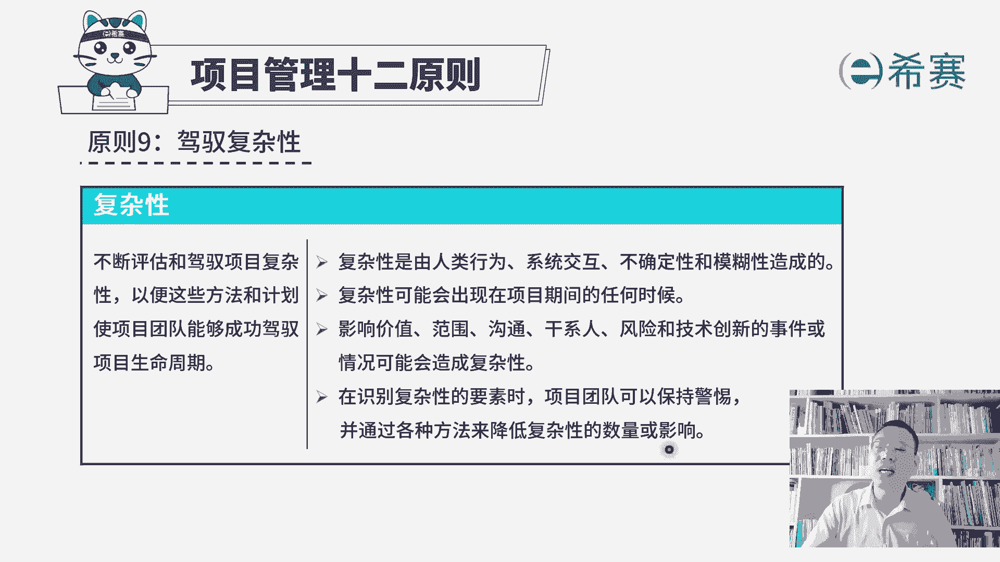
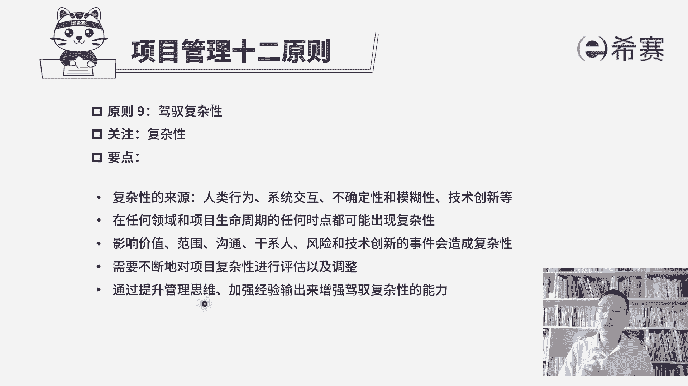

# 2024年PMP认证考试新教材第七版全套机构精讲课程免费学习！ - P15：PMP第七版项目管理原则之09复杂性 - PMP-B站课堂 - BV1Ao4y1L7kY

大家好，我们继续来分享的是，项目管理12原则的第九条叫驾驭复杂性，首先你知道现在很流行的一个词叫乌卡，我们说这是一个乌卡的时代，后面还有人搞什么乌卡2。0啊什么之类的，呃这些其实都不重要，重要的是。

现在这个时代确实首先第一个是非常易变，OK易变性特别强，就是改来改去，改来改去，第二个呢有不确定性，可能会不断去调整，然后第三呢是有复杂性，有太多的搞不定的事情，搞不清的东西，还有一个是模糊性。

是不清楚不确定，所以不管是异变性，不确定性，复杂性，模糊性这个乌坎，它都会对我们的项目管理带来很大的难度，所以项目管理的第九条原则就讲到，要去驾驭复杂性，我们一起来看关于驾驭复杂性。

他说的是要不断的去评估和驾驭项目的复杂性，以便这些方法和计划，使得项目团队能够成功地驾驭生命周期，首先你想什么人，他才能够在这种复杂的环境中去驾驭这个状态，让他持续保持往前推进，一定是他非常熟悉。

他非常熟练，他是一个老司机，所以他应该懂得在正常的不是很复杂的环境下，这个事情如何有效推进，并且在复杂的环境下，如果遇到A情况，我该如何去应对，遇到B情况我该如何去应对，就是一个老司机对吧。

所以关于这一条原则，驾驭复杂性，它其实是对项目经理提了更高的要求，但是还好，并不是每一个项目真的都那么的复杂，我们在生活中还有很多传统的项目，它基本上是你以按照原来的正常的规则方式。

用这些个基本的方法论去管理，完全没毛病，没问题，只是说某一些这种新的项目呀，这种软件类项目呀，那种呃互联网项目呀，很多变化特别频繁的项目，它才会展现出大量这种复杂性，还有一些完全全新的项目。

它有很多的复杂性，所以呃首先在这个点上，我想要跟你说的是，你不要太害怕，不要觉得啊老师我好像不会啊，我不行了，没关系，你可以做你能做的部分，那些更难的，更复杂的，有人去做，随着你在工作中的这个时间。

精力的加深，你的经验与累积的越来越多，那你就越来越能够应对这样一个复杂性，面对各种突发的情况，你你也能够去有所应对和处理，那关于乌卡的这个应对的方法呢，其实在后面有一个不确定性的，这个绩效率会专门去讲。

我们先来稍微认识一下，关于复杂性，他说复杂性是由人类的行为，系统的交互不确定性和模糊性来造成，其实不管说是异变性，它也会造成复杂，这种不确定性也会造成复杂，模糊性也会造成复杂，所以这乌卡整个就是复杂。

除此以外，还有就是人类的一些迷惑性的行为，他也会让这个事情讲得越来越混，越来越复杂，还有就是系统交付，有一些系统做起来真的是让你就是让你很崩溃，那么它也会导致这个事情变得更复杂复杂。

其实是随时都可能会发生，说复杂性可能出现在项目期间的任何时候，只要是会影响价值范围，影响沟通，影响干净人，影响风险，影响技术创新的这些东西，他都会造成复杂性，所以你告诉你复杂性的来源。

其实很多碳来源这么多的情况下，我们不能坐以待毙，所以呢我们需要去尽量识别到各种复杂性，相关的一些元素，然后去保持警惕，最好是能够提前去准备好一些应对措施，就像我们面对风险的时候，要去识别风险。

并且去应对风险是一样的，它是通过各种各样的方法来去，降低复杂性的数量，以及降低复杂性带给我们的影响，所以这个驾驭复杂性整个这一条原则，他其实没有去具体告诉你方法，因为讲方法的话呢，就是很长。

专门在后面那个绩效域中去展开讲，在这里只是想告诉你。

到处都有复杂性，复杂性的来源可能会是基于这个乌卡，基于人类行为，基于系统交互，基于这种不确定性啊，模糊性啊，技术创新等等，都可能会导致项目变得更加复杂，让这个事情越来越难搞，那并且随时都可能会出现腹胀。

如果某一种复杂性，某一种特殊的情况，曾经你有遇到过，并且去有效的应对过，那下一次他再一次出现的时候，你会更加的气定神闲的去应对，通过提升管理思维，加强经验的输出来增强驾驭复杂性的能力。

好我们刚刚其实已经在讲到，说加强经验的输出来去增加复杂性，而这里还有一个叫提升管理思维，就是你能够去从整体来去考虑，你能够去通盘全局的方式来考虑，关于某一个事情发生了这样一个复杂性的时候。

你不要用头痛医头，脚痛医脚的方式，你能够站在一个整体的角度来去考量，那这是完全不一样的，所以整个项目管理的第九条原则，驾驭复杂性，它只是告诉我们说，复杂性在项目中其实是随处可见，随时可能会发生。

我们需要去有一些方式和方法来有效应对，具体如何应对。

