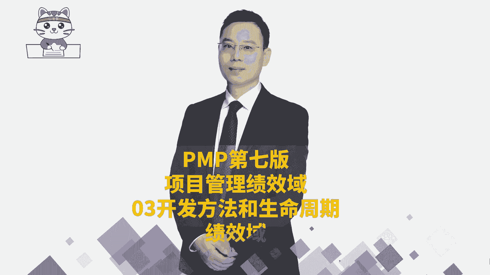
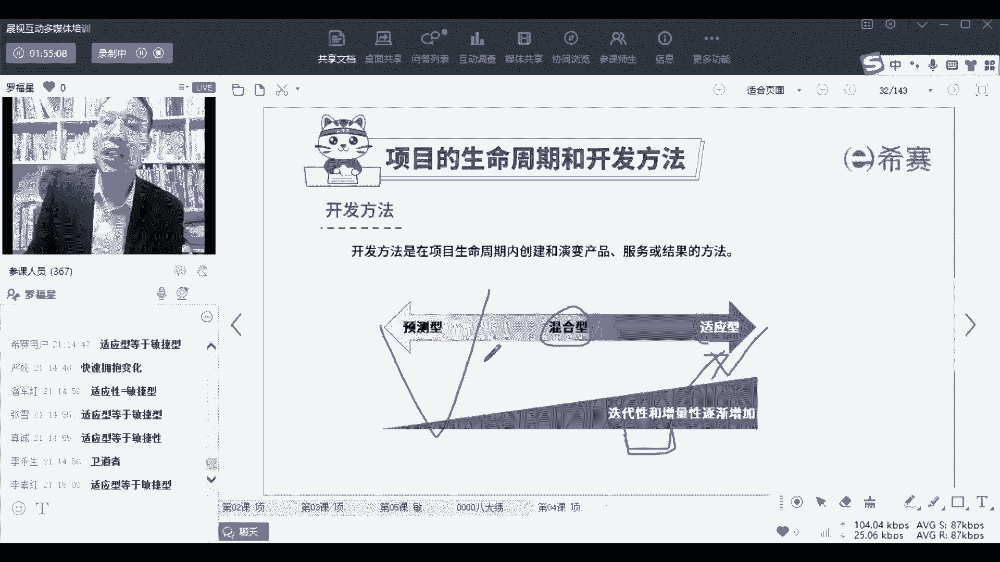

# 2024年PMP认证考试新教材第七版全套机构精讲课程免费学习！ - P25：PMP第七版8大绩效域之03开发方法和生命周期绩效域-上 - PMP-B站课堂 - BV1Ao4y1L7kY

第三个绩效率呢叫开发方法和生命周期，那这个内容的话，其实呃就我们前面有一些东西是看过的啊，我们需要去了解一下关于这个项目，它的一些什么开发方法呀，啊工作节奏呀，生命周期的阶段呐。

每一个阶段会有不同的一些方式和方法，你看有效的去做开发方法和生命周期绩效预中，我们会希望什么呢，首先第一个，他说要有这与项目交付物相符合的开发方法，也就是说你如果做的是一种修桥修路修房子。

那你用什么样的方式来去做事情，你如果说是做软件，做什么，硬件做一些什么呃，新能源汽车你又是用什么样的方式对吧，不一样的东西，用不一样的方式来做事情好，还有说是啊，由于项目从开始到结束，这就是生命周期。

从开始到结束会历经很多个阶段，那么很多个阶段中，我们会在每一个阶段又该怎么样去交付价值，能够让做的这个东西是能够产生结果，能够去交付价值，这也是我们需要去考虑的，并且呢交付的节奏是做完了以后才交付。

还是做一点交付一下，做一点交付一下，哎这个呢也是你需要去考虑的这件事情，那我们展开来认识几个词啊，首先第一个词叫可交付物，可交付物有的时候也叫可交付成果，他讲的是说我们去做这个事情，最后得到某个结果。

打个比方，我们如果以软件为例的话，你在做软件的时候，你是不是要去收集需求，你收集了需求以后，是不是得到了一个叫需求规格说明书，诶，它就是一个可交付对或者叫可交付成果，你是不是会做一个架构。

做一个设计对吧，那你的架构，你或你的设计书，设计说明书，你开发开发的软件代码，你最后做了一个程序，程序交付，这都是可交付成果，那你如果是修房子修路的，那么那个修的修的房子带的花园。

这都是他的一个可交付成果对吧，那可交付成果，也就是说我们去做这个事情的成果，包括过程中的啊，包括结果的特别卡的话，下下面有个网络的切换，你可以在下面有一个就是底下有个网络切换。

底下这个这个应该是这个底下，这个底下有个网络切换，你切一下底下有个地方有网络切换，你换一个别的网络，换一个别的网络，就是可能会有中国电信啊，什么中国移动啊什么之类的，你你切换一下网络试一试，好不好。

看一看，因为如果别人不卡的话，那可能就是你你你看一下对吧，在某个角落里面有一个切换网络，看一看啊，好这是可交付成果哎，先认识了一下，然后接下来还有一个呢叫开发方法，你到底是用预测的方式来去做。

如果你是修桥修路对吧，预测的方式来去做，或者还是说用敏捷的方式来去做，比方说做软件，或者说是，尤其是像现在做这种互联网的一些软件项目啊，你用什么样的方式来去做，所以你有你的方式。

那比方说我们说那种像医药的生产啊，他可能会用迭代的方式，那有一些东西，比方说嗯像有一些盖盖整个小区之类的对吧，哎那这是一种就增量的方式，所以你会用什么样的开发方法，他会跟这个项目本身的特质和特点有关系。

还有就是整个在这个过程中节奏，所谓的节奏节奏节奏这个词，我突然想起来我我有没有讲过一个案例，叫叫知识的诅咒，知识的诅咒中有一个节奏给你们敲一下好不好，可能有很多同学没听过啊，我来给你敲一个节奏。

你来听一下，看你能不能听到一个知识的诅咒好不好，很有意思的，就是我会敲一个旋律，你看你能不能听出来啊，能听出来吗，完全听不听不出来，是不是，OK我刚确实笑了，是这个笑，确认过眼神，你是我对的人哈哈。

那么其实在做项目的时候，它也有它的节奏，就是做事情他也有他的这个节奏，那么你在什么时候去交付，是多久去交付一次，你需要有你的一些一些一个交付啊，什么叫混合，我到时候再告诉你好不好。

到时候再告诉你什么叫混合，混合其实简单来讲就是既有质量又有迭代啊，既有预测型又有敏捷型这种解那种混合啊，就是现在呢都只是在做一个介绍性的东西，后面会展开啊，混合就是把预测型和正和敏捷型的方式。

混到一起来嗯，你打个比方，你去建一个机房，你建机房的时候，那么建机房这东西肯定是用预测的方式来去建，但是你可能建了机房，你还要给他做一套软件，那么你做的那套软件有可能会有敏捷的方式。

那这种它就是一种很典型的混合，类似这个意思啊，类似这样一个意思好，还有一个词叫阶段，关于这个阶段这个词怎么讲呢，如果说一个项目的周期很长很长，10年，兄弟姐妹让你在这个单位做10年。

做同样的一个岗位做10年，你是不是马上想要想要逃对吧，那么当一个项目很长要10年的时候，我们会怎么办呢，我们会把它分成一段一段的去做，我们会分成A项目的第一期，项目的第二期，项目的第三期，第四期对吧。

类似这样的一种方式，那么就是分成阶段，OK一个项目有多个阶段来进行啊，你可以类类似这样理解变只既然讲到阶段，我们经常还会讲到一个词呢，叫阶段和关口，阶段和关口叫stage and gate。

就是我们每做完一个阶段以后，都会有一个检查的节点，或一个审查的节点或审批的节点，那么那个审批的节点，我们给它取个名字叫关口的概念，稍微了解一下啊，好后面还有个就是生命周期。

那么生命周期中就是从开始到结束，所历经的一系列阶段嗯，段小路你问的那当然不是啊，不只是这一种啊，你看880视频教程中就会告诉你好多种，你看一下880视频教程好像是第15章吧，好像我印象中是第15章。

你看下第15章好，我们现在是在就是有一些东西都没有去展开讲，先快速去了解这个东西好不好，先快速去了解，有这么回事，具体的每一些细节内容，其实后面会展开讲，那整个建议项目的类型呢，前面已经看过了。

就是你就是你看说是这种做修桥，修路的方项目呀，做房子的项目呀，做软件项目呀啊包括说是做一些航天的项目呀，做各种不同的项目，你其实会发现都都有些不一样，那不同类型的项目。

它就会决定你用什么样的方式来去做开发对吧，这种项目的类型可交付不相同，开发方法会不一样，它会影响你交付的节奏，会影响你交付的次数呃，因为有一些东西他需要快速拿到结果，你只有快速拿到结果。

他才会对方才会觉得比较好，那么你必须是节奏很快的，那也有一些方式它是会可以，你先不要着急，你先搞个两年，你做完两年以后，你再给我呈现一个结果，而这种方式也是可以的，所以每一种东西它的结果。

它的结构其实会根据你具体行业不相同，包括生命周期，那我们稍微展开来看一看，比方说这是一个生命周期，从开始到结束历经的一系列阶段，就是从开始到接到结束，历经了一系列阶段，哎这就是生命周期。

那么在这样一个生命周期的过程中，诶，你会发现说在不同的时候，你要去干不同的事情，刚开始的时候呢，哎去了解一下有什么创意，有什么想法，有什么一些需求，我们可以去做什么事情对吧。

哎这是最开始的时候好做可行性分析，就说这东西能做吗，我们有实力做吗，我们有资金做吗，啊我们有这些个就是这个东西有法律的风险吗，呃有这个什么能够赚钱吗，能够卖钱吗，能够产生影响力吗。

我们会综合考虑很多维度，来去做这些可行性分析，如果说分析以后发现可行，我们就开始做，开始做以后呢，我们就去了解客户的需求，然后基于他的需求来去准备这样一个方案，然后来去做一个圆形的开发，1。

1点的去完成，1。1点去开发开发的原型，其实更多的也是在去获取需求，就关于开发原型，他其实也是获取需求，那关于这个点呢，昨天晚上的这个答疑课里面，我特别讲到这个点，就是有一些同学会说到说。

我目前做的这个项目上，没有办法去获取到客户的需求，怎么办，那么有一种方式就是我们去给一些模型，或者给一些原型，让他去用，他在用这个东西的时候，他能够提出一些新的信息，OK好。

然后获这个原型法它也还是在获取需求为主，到后面具体去开发做开发，或者叫构建建造构建，然后再在后面去落实啊，测试啊，落实啊，这等这是整个生命周期，并且在生命周期中你会发现，其实在不同的不同的项目类型。

我们的开发方法会不相同，如果说这个事情是比较确定的，就说这个项目他是很确定的，比方说我们要去修一座桥是很确定的，那么就用预测的方式来去做就可以了，但如果说他是他想要的东西，他是完全不清楚的。

我们可能会用一种适应的方式，适应型，它也就是敏捷型来帮帮我，把适应型等于敏捷型给敲一下，适应型等于敏捷型，适应型等于敏捷型，其实也就是如果他很多东西不确定的话呢，我们可能会用这种快速变换的方式。

快速拥抱变化的方式来做事情，用这种适应性的方式来去做，OK可能会有大量的增量加迭代，OK用增量加迭代的方式，增量加迭代就是适应型或者叫敏捷型，那么中间还有一个就是混合，就是你可能在过渡咯。

有一个过渡的阶段，有一些东西它是清晰的，有一些东西是不清晰的，那么中间有过度的话，我们应该怎么办呢，你总得要有一些方式来去处理它对吧，并且事实上我们在做事情的时候。

没有某一种方法能够去满足生活中所有的场景，你一定会有一些这种中间的空间，有一个中间的某个空间来去做某些事情，所以开发方法它其实是一个渐进的过程。

