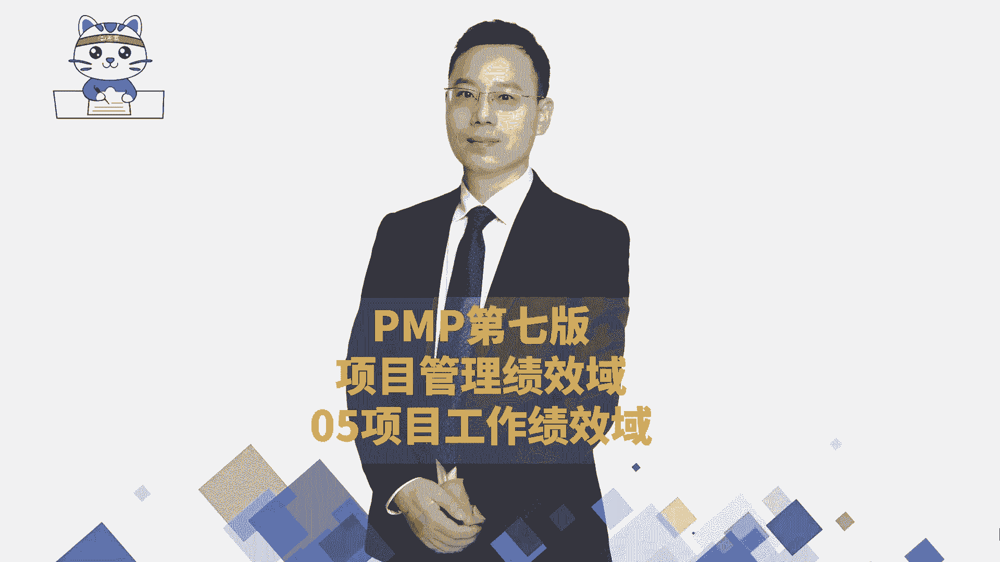
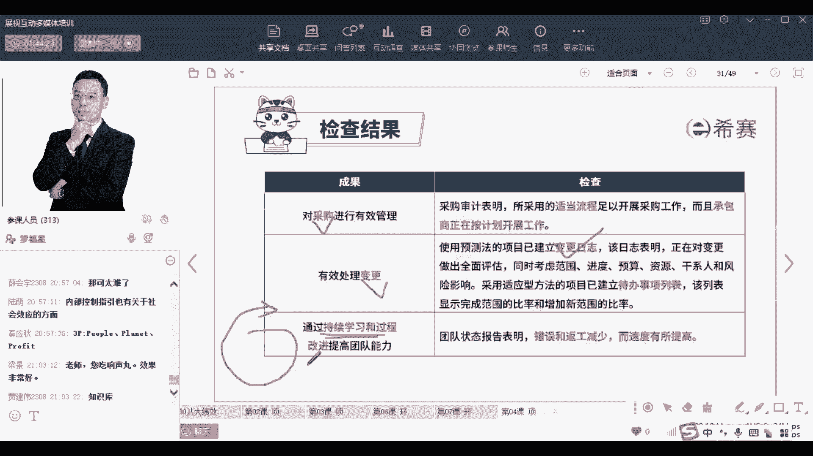

# 2024年PMP认证考试新教材第七版全套机构精讲课程免费学习！ - P33：PMP第七版8大绩效域之05项目工作绩效域-下 - PMP-B站课堂 - BV1Ao4y1L7kY

这是三重底线，但这种词呢其实坦白说他讲的稍微有点虚，有点大，有点空，但是这种东西它永远都是政治正确的，你会发现也就是他会关心的，就是对那个言语套顺，就是可持续发展，所以这东西不会基本上不怎么会考啊。

不怎么会考，他在NPDP里面也不怎么考，只是说他现在喜欢去搞这些新鲜的玩意儿，搞过来显得很很fashion很酷的这种方式，但显得自己很酷的这个这个逻辑啊，那这三种底线呢也有叫三个P啊。

就是一个P呢叫people就人people，还有一个是planet，就是星球，就是地球星球，我们这个地球，我们这个星球，然后还有一个P是呃，什么叫财务，那个张老师我都不认识这个词，你只要知道这个意思。

就是说呃三重你现在做的是关于社会呀，环境呢，呃经济啊，哎这个点就可以了啊，好有人问了一个很好的问题，哪些是考点，目前现在这些东西都是在打基础的，都还没有涉及到考点的东西啊。

都是在简单去做一个概括性的介绍，如果你前面看过的话，我在前面讲第四章其实就讲过，说是概括性的介绍，一个概要性的介绍，OK那么他会关心的说，我们去平衡这些竞争的关系，就有很多的关系是有有有竞争的。

我们需要去平衡，然后给了一个信息，使团队保持专注，那你怎么样去使团队保持专注呢，你能够给他提供一个良好的工作环境和氛围，当你能够给团队，提供一个良好的工作环境和氛围，能够让他安安心的去做事情的时候。

诶这就是所谓的他能够去保持专注对吧，那你如果不太能够的话，其实就有问题啊，谢谢秦应秋同学啊，是的，刚我把那个3P给搞出了，那么还会接到说有短期的这些个项目呃，长期的这样一些项目的这样一个评估。

其实就是说我们如果要去做好这一个执行，做好这个项目工作的话，你要让他人做事，你要让能做事，还有呢就是持续能够把这个沟通给考虑进来，沟通沟通他的目的是什么，沟通的目的是达成某种共识，对不对。

沟通的目的是达成某种共识，如果咱们的沟通没有达成共识，那就是沟通无效，那打个比方，我们说有一些话其实别人很难听懂，比方说让一些老外听不懂的说，冬天能穿多少，穿多少，夏天能穿多少，穿多少。

你到底是穿多还是穿少，这个让让老外可能是听不太懂的话对吧，嗯有些人单身单身的原因是什么，原来是喜欢一个人，现在是喜欢一个人，到底是喜欢一个人还是喜欢一个人，你会发现好好就不可思议，那还有比方说。

如果我到了你还没到，你就等着吧，如果你到了我还没到，你就等着吧，这到底是什么意思，哼等都是在等着，就像就是这种沟通里面有很多话语本身就很难，但是更多的是什么呢，更多的是大家会误解那些信息。

就误解了一些信息，然后以及呢那些信息不能够及时的去同步，所以沟通中咱们在这一段呢，我们稍微先是只是做一个概括性的介绍，你我希望你只能记住这一句话就够了，首先沟通是为了去交换信息来达成某种共识。

我们去交换性达成什么共识呢，答案是能够让正确的信息在正确的时间，通过正确的方式来传递给正确的人，最后达到一个正确的结果，也就是说让这个沟通是有效的，而不是无效沟通，而尽量让他做到有效沟通。

那什么叫有效沟通，就比方说我其实在最开始有讲过整个这一章，就说整个这一章它都是偏概括性的介绍，我们去留一点点印象就好了，因为具体内容我们在后面会去展开，那就是提前先想好以后，如果你记得，那就是有效沟通。

但是如果说我讲过了以后，你依然没有记得你，那就是无效沟通，就是类似这个意思啊，具体的我们去做什么沟通的策略啊，展开必须的活动啊，后面会展开讲，咱们不在这里去花很多心思和时间。

然后呢在做项目的时候去执行的时候，还有一条就是管理实务资源，这管理实务资源，坦白说其实考试很少考，几乎就不怎么考过，因为食物资源你在真正的项目管理过程中，专门就是有一些管仓管仓储啊，管仓库呀。

管物流啊的这些员工，他来去负责管理对吧，那么就是某一些产品，如果说需要有一些这种材料和用品，第三方提供一些材料用品的时候，那你肯定要去管理起来，你管理规划一下要用什么样的食物资源，然后去订购这些资源。

然后运输这些资源，存储资源，跟进控制资源等等啊，这些方式来去做事情，这是在管理这些个实物资源，那么你管理这些食物资源，你管好了项目，所有东西都能够及时就位，就能够有效推进它，如果不能及时就位呢。

他如果不能及时就位，这个项目的推进其实就有一定的困难，唉就是这么个逻辑，OK就是这么一个逻辑，你需要去稍微来了解一下，那通过管理实务资源，他说减少一些资源的浪费啊，减少资源的搬运呢，减少资源的存储。

这个呢跟你如果学过了敏捷，项目管理中最后那一个章差不多，最后的章节中有一个叫呃精益，你把精义学完以后，你再去理解这东西，你再看会更容易一些，就各种消除浪费的方式来，然后呢还有就是有一些东西。

如果你不是自己做，你要去让别人来帮你做，那么涉及到采购，对于采购的话，如果在我们这一个工作这个板块中，其实更多的就是实施采购管理，什么叫实施采购管理呢，就是我既然决定要采购了，那我就开始真的去做起来。

我怎么做，我要去发布一个招标的广告，我发布一个招标的公告，或者发布一个招标的广告，告诉大家我想要采购，然后呢就有一些人过来说啊，我来去接，我来接这个单对吧，到底谁来接这单，我们来去确定一下。

至少合格的这种潜在的卖方，我们把那些潜在卖方选到，然后召开一个投标人会议，开始有解释过投标人会议是什么意思，就跟他们开会来，去跟他们同步一些这个项目上的信息，让他们对于这个项目上的信息。

有清晰且一致的理解啊，然后接下来他们就开始去写投标文件，他们去写投标文件，然后并且把它递交过来，然后我们就开始去评估，我们去展开评标，评标以后呢，最后就是中标，中标了以后签合同。

那在这个过程就是在实施采购的一个过程，当你实施采购的时候，你可以是采购的某个物件，你也可以是采购的一些劳动力，你也可以是采购的一些服务都可以啊，你可是采用了某些方案呢，劳动力啊，服务这些东西都是可以哎。

这都是在做工作，并且在整个工作期间的话呢，我们会涉及到很多的这种经验和教训的总结，那对于这样一些经验和教训的总结呢，我们其实是要有效的去处理它，能够让过往的经验和教训对我们的未来有帮助。

那不就是组织过人资产吗，我们去大量总结经验和教训，那总结经验和教训中，包括一些隐性的知识，一些显性的知识拿来编撰成册，包括一些隐性的知识，我们就能够把它整理整理到一起来啊，通过这种方式来去做一些事情。

OK这是整个在做项目的过程中需要去关心的，那么整个在执行，你看要有效地执行项目，并且有效率有效果的去做，我们去看一看到底是有效率有效果没有，我们通过一个状态报告来去展现。

还有就是适合项目环境的这一些项目过程，什么叫适合，那就是裁剪哦，根据你的需要来进行裁剪，来去做相对应的这些范围的事情啊，进度的事情啊，成本的事情啊，质量事情之类的，还给一个适当的干性的沟通和参与。

能够有效的引导大家去支持项目，然后去沟通，能够让他们进行满意，然后还有就是有效的采购，也就是采购的过程中，具体涉及到采购的事项，我们能够如期的去进行啊，按部就班的去进行，但如果说涉及到一些变更的话呢。

也是有一个变更的流程，这个我们在第四章整合，在整合管理中会展开来讲，有这一变更流程，但不是每一个变更都要去走变更流程，如果是敏捷项目的话，你看预测型项目就会有用变更的方式去做，而如果用敏捷的方式呢。

拥抱变化的方式，有一个叫代办事项列表，叫需求池的方式来去做一些事情，但这种东西就是让大家会觉得有点混乱啊，就是既搞敏捷，又搞预测，混乱一起好，最后一条持续改进，你怎么样去持续改进，那不就是优化迭代哎。

就是要不断的去优化迭代更新，对不对，就是通过这种方式来做事。

