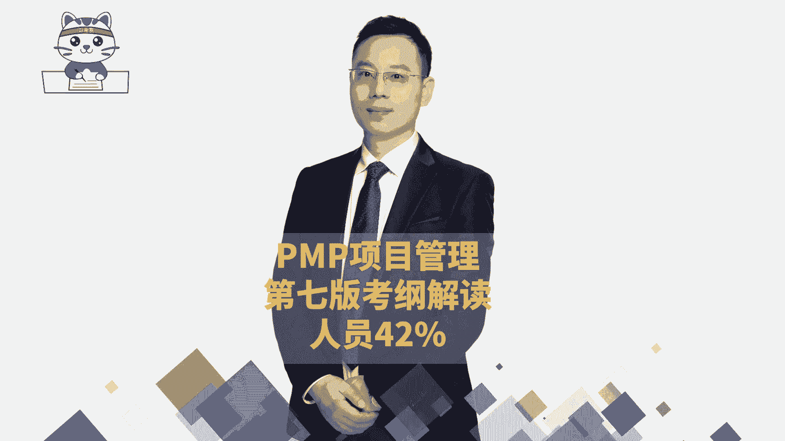
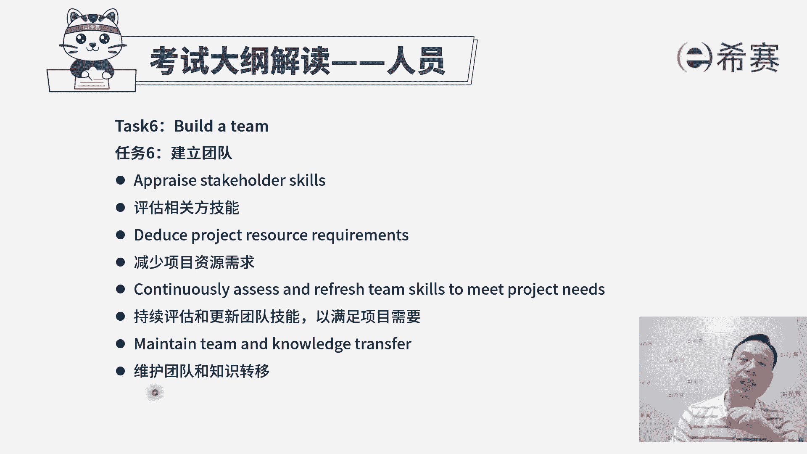
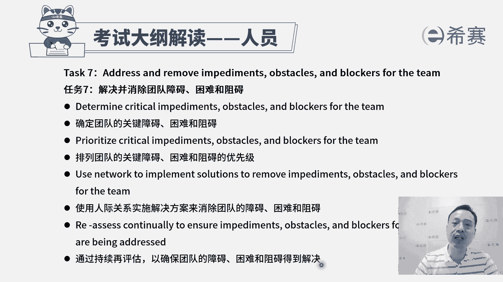
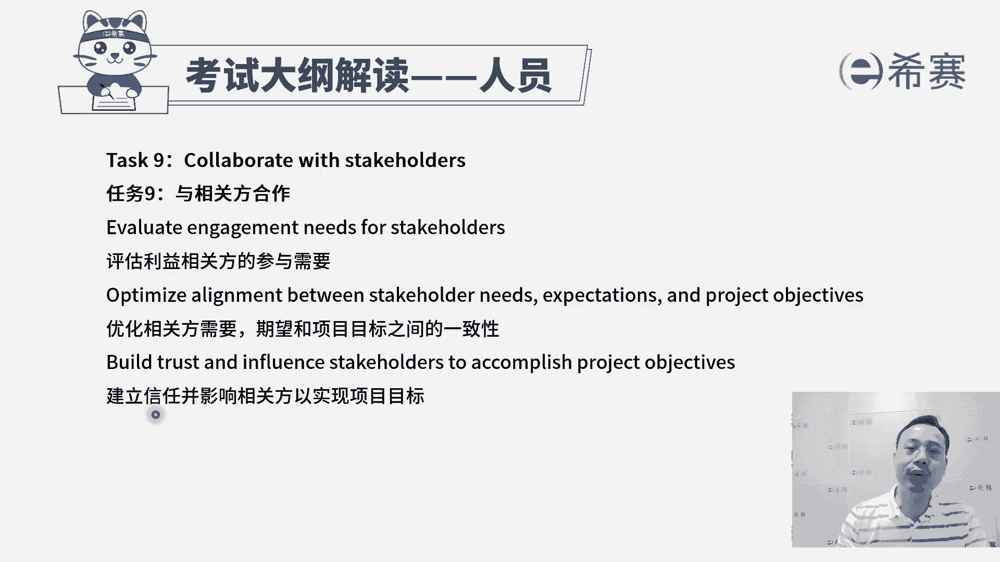
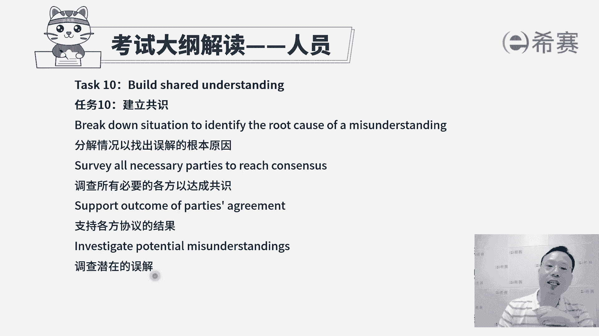
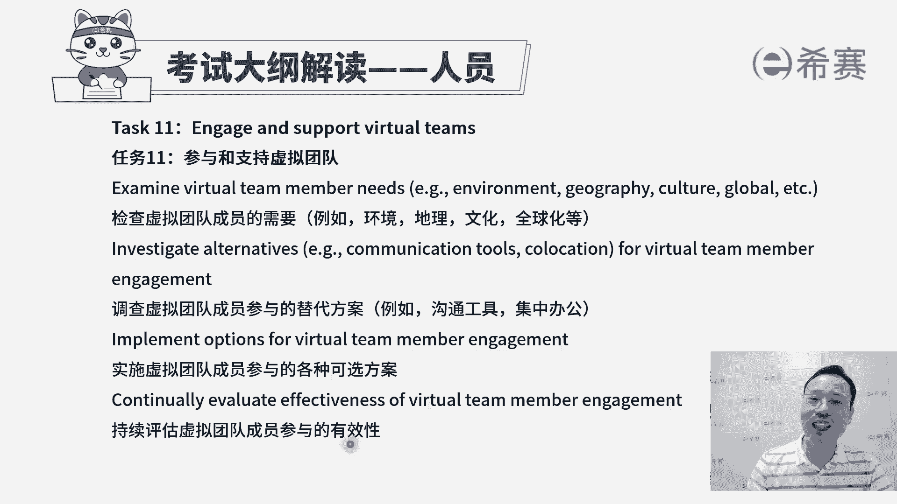
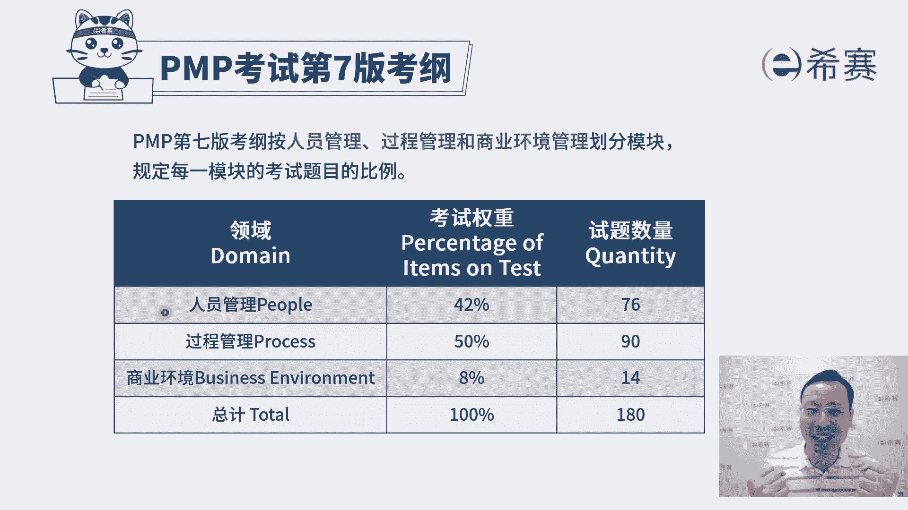

# 2024年PMP认证考试新教材第七版全套机构精讲课程免费学习！ - P4：考纲之人员板块B - PMP-B站课堂 - BV1Ao4y1L7kY

这些都是能够让我们团队变得更牛的，一种方式啊，这是关于建立团队。

然后建立完团队呢，其实团队他在真正做事情的过程中啊，会遇到大量的这样一些困难挑战障碍，那我们还需要去帮团队去成长，那你怎么样去帮团来成长呢，你首先得要了解团队都有什么样一些困难障碍。

所以是确定团队的这些关键障碍，困难和阻碍好确定好，然后发现哇这么多这么多这么多的情况下，我们的资源永远都是有限的，你的精力也是有限的，怎么办呢，我们对这些个困难障碍和阻碍，来进行一个优先级排序。

我们优先处理最前面的，然后再然后对吧，有这个先和后的这个关系好，排完序以后，接下来他说使用人际关系来去实施解决方案，哎，以消除这样一个障碍，因为很多时候，比方说你说你发现这个流程推不动。

那可能需要我来去给那个刘总打一个电话嗯，那可能你会发现这笔资金，他客户一直是不能够及时的去支付，那可能需要有商务出马，来去跟客户有一些互动和交流呃，或者呢可能需要由采购部来去出嘛，来去做某些事情。

所以他会说通过各种各样的方式来帮助团队，去消除障碍，比方说有些人他经常三天两头被拉过去去开会，但是这些会议呢跟他的工作本身没有什么关系，那这个时候项目经理就要出马来，去跟那个召开会议的人去沟通说啊。

那下次呢可以能不能够就不要去找谁来开会，但是也能够达到他的目的，所以这是通过各种人际关系技能来去帮团的，去消除障碍，这也就是服务型领导所需要去干的活，我们在敏捷中会展开来讲好最后一句，通过持续的再评估。

以确保团队的障碍，困难阻碍得到解决，因为这些困难障碍他不是说今天出现了，就不会再出现了，可能会后面突然又冒出来，会讲到昨天干了什么，今天要干什么，以及干这个事情的过程中遇到了什么困难，挑战和障碍啊。

这在敏捷中会更多的展开来讲，而你作为一个仆人式领导，作为一个服务务型领导，你需要能够去帮团的去消除障碍。

困难和阻碍好，第八个任务，谈判项目协议，那所谓谈判项目协议，其实在生活中，项目经理通常不太具备这个能力，也不太需要去有这个职责来去做这个谈判，但是呢我们需要稍微了解一下，其实在签合同的时候。

甲乙双方之间一定是有一些协商的，OK这个协商谈判，就是谈判以后已达成双办的共识，双赢共赢才是一个好的局面，对吧，首先第一个分析谈判的边界，已达成协议，就是你负责做什么东西，我负责做什么东西啊。

我们各自哪些是范围以内，哪些是范围以外，然后什么时候要交付什么东西，要你以及你要去交付多少钱，第二个评估优先事项，并确定最终目标，也就是要做的事情有很多的情况下，最核心的是什么，最重要的是什么。

以价值为导向，这也是在敏捷中会强调的，以价值为导向的方式，然后并且把整个要做的事情给框定下来，第三个验证项目协议的目标是否可以得到满足，这也是在最后做验收咯，就是我们整个项目完成以后，在验收的时候。

那需要去考虑按什么来验收啊，按合同来验收，所以是按照这个协议来去验收，看协议的目标有没有达成，按合同里面的要求是不是有达成好，还有一个是参与协议的这个谈判，就是协议中可能会有很多内容。

这种具体条款我们需要去做一些协商，还有说确定谈判的策略，什么谈判策略其实有一个最为有意思的，就是大家去买东西的时候砍价，你砍价的时候，如果价格砍不下来，你说那那算了，那我就不要了，我就走了。

好当你走的时候哎过来过来过来，这也是一种策略对吧，就是我去放弃它，当了真正的在一个商业上的，这看这个谈判策略呢，我们在这个行业，在这个偏僻考试呢不去涉及，不去涉猎，它是一个专门的一个学科，一个学问啊。

那么这就是关于那个谈判项目的协议。

这样一个任务来看到，第九个任务叫与相关方合作，那我们怎么样去跟相关方合作，首先第一个就是我们去做事情，一定是需要去满足相关方的需求，那你先要去了解了解它的这一个需求，所以第一条他说去评估利益相关方的。

这个参与和需求，也就是说他可能有什么一些呃功能上的要求，性能上的要求，沟通上的要求，汇报上的要求等等啊，我们去了解了解，并且呢他可能什么时候会去参与建一个项目，支持这个项目或者拒绝这个项目啊什么的。

或者说是有一些阻碍之类的，我们了解的越清晰，越具体就越可有针对性的来去帮助，来去解决，来去化解好，第二个优化相关判断，需求期望和项目目标之间的一致性，其实也就是说他的需求。

如果跟项目目标之间有一定的偏差的时候，你需要去引导他，需要去达成某一种共识，是这样一个逻辑啊，最后一句，建立信任并影响相关方，以实现项目的目标，其实也就是说，我们要如何来去做这样一个相关方的参与呢。

是要去争取它，让他更好的去支持这个事情，让他们的抵制变得更少一点点，抵制变少，知识越多，那这个项目就更容易去达成，所以他怎么样才能够去支持你，你需要跟他有一种信任的氛围和环境，所以你要去构建信任。

这也是你项目经理的一个技能，这是第九条，叫与相关办的合作。

来id看到第十个任务叫建立共识，这个建立共识更多的讲的是什么呢，其实是沟通中去解决误会，我们在前面讲过说，人与人之间有人的地方就有江湖，就有是非就有冲突对吧，那除了有这种大的冲突以外。

可能还会有一些小的误解，如果说有误会有误解的情况下，我们说其实很多时候是源于什么信息的不对称，当有一些信息不对称的时候，可能会有很多的误解产生，我们都要先分析一下误解它的原因是什么啊。

用一些根本原因分析，用那个因果图，鱼骨图无外法等等这种方式来去分析，然后第二个是调查所有必要的各方已达成共识，也就是说如果双方之间有误解，我们一定是让大家一起过来，那么这其实也是冲突中的一种处理方式啊。

来去达成某种共识，支持各方协议的结果，如果说大家一起达成共识，那么这个共识的结果呢，我们都要去支持你，不要说开会的时候啥也不做声，开完会以后在BBBBB这种方式是最讨厌，最让人头疼的对吧。

那么既然开会已经定下来了，定下来的东西大家都去遵守好，后面还有个说调查潜在的误解，其实也就是说这个关于误解这个事情，还要持续持续去考虑，因为有可能后面还会导致什么样的一个情形，又有一些新的误解呢。

我们是需要去做一些操作和处理，OK持续来去发现并且去处理这些误解，这是任务时叫建立共识。

好任务，第11个参与和支持虚拟团队，诶，这个终于讲到一个新的东西叫虚拟团队了，虚拟团队它特指的是说我们大家在工作，但是呢不是在一起，我们会通过电话的方式，网络的方式，邮件的方式来去沟通交流联络。

那么这种虚拟团队我们都知道，首先第一个他的可能是地理位置对吧，方案分散在全球啊，地理位置啊什么之类的，但是呢它有它的好处，就是它能够用更短的，更小的代价来获得更优质的资源，而它的弊端就是沟通有障碍。

那么关于参与和支持虚拟团队，我们来认识一下，首先第一个检查虚拟团队成员他的一个需要，而他可能会在哪些地方呢，我们怎么样才能够去做到一种联络和互动啊，还需要有网络呀，还需要有一些什么电子看板呢。

需要有这样一些个战线沟通的这样一些系统啊，第二个调查虚拟团队成员，他参与的这样一个替代方案，就有什么好的工具和方法能够去帮他，或如果是他达不到的时候，我们还可以怎么办呢。

哎我们能否用就是公司的一些其他人员，集中办公的方式来去解决某一些事情，第三个，实时虚拟团队成员参与的各种可行的方案，其实也就是说如果虚拟团队成员一起来去讨论，得到某一些方案以后呢。

也是可以去落实和执行的好，最后一个持续评估虚拟团队成员，他参与的这个有效性啊，如果说他的状态不太好不太行，那你也是需要去跟他有一些交流和互动，想办法把他这个状态给拉起来对吧，其实很多时候就是沟通不畅快。

真的是会影响心情，影响心情以后整个状态就会变得down一点，但是也要让它持续小赢，持续能够做成一点东西，让我们配合极其默契，即便不在一起，依然是能够心有灵犀一点通。

这就是参与和支持虚拟团队，接下来看到第12个任务，定义团队的基本规则，嘿这就是我们说没有规矩不成方圆，我们把这个规矩给定下来，就人和人之间一定要有一些基本的规矩。

你看与团队以及与外部层相关方一起来去沟通，一些组织的原则，也就是说我们去行为处事，有一些什么基本的一些条款，这个PRINCIPES是需要去共同遵守的，包括说汇报的时候怎么怎么汇报。

然后打电话的时候怎么样弄，开会的时候怎么样去弄，然后写一些代码的时候，要有些什么样的一些备注啊，头文件呐，然后check in啊，check out呀，这些东西都要一些基本的规矩。

OK好建立一个促进遵守基本规则的环境，规矩是定好了，但是你知道有时候有一些好的环境，他能够激发人的这种善意，一些恶的环境他会激发人的这种恶意，对吧，那我们能否去创建一个比较好的环境。

让大家都愿意去遵守规则，那些破坏规则的人士得到惩罚，而遵守规则呢会得到奖励，得到认可，那这样的话就是一个比较棒的一个状态，最后一句要管理和纠正违反基本规则的行为，也就是说如果有谁去违反规则。

他是需要需要受到处罚，受到惩罚，如果是在遵守规则，我们可以表示认可，甚至可以在一定程度上表示奖励，这是关于第12条，定义团队的基本规则，第13条指导相关方，那么其实相关方他在参与这个事情的时候。

他有他的一些想法和意识，但是某一些时候，某一些事情我们也需要他来配合和支持，那如果说他不太会的话，怎么办呢，我们也要去引导他，要去指导他，要去mentor，所以不仅仅是要去指导团队成员。

还要去指导相关方，那么指导相关方呢，我们同样要去分配合适的这个指导时间，并且呢你要去逮住机会来去给他提供这些指导，因为有的时候也要是一种比较巧妙的状态，你去帮助别人，也要是让别人觉得很舒服的状态。

所以他给了一个叫识别，并就指导机会来采取行动，也就是说你要找到机会来去给别人提供指导，这是关于指导相关方，最后一条关于人员的这一考纲呢，叫运用情商来提高团队绩效，那情商这个词它跟智商类似。

就说你去运用情绪的这种商术能力，首先第一个说通过使用性格特点指标，来评估行为，那性格特征指标其实有很多啊，比方说九型人格呀，然后DISSK模型呢，呃MBTI呀，这种方式都是可以去对人来进行评估的。

我们对这个人进行评估，而是说能够通过这样一种方式呢而知道哦，可能他更适合做什么什么事情，或他的习惯是怎么怎么样的，这样呢我们就能够更有效的去用好这个人，好下面一个分析性格特点的指标。

并且呢根据关键的项目，相关方的这个情感需要来进行调整，其实也就是说你能够让他好好的去做事情，并且能让他心甘情愿的去做某些事情，还能够让他变得做的很愉快对吧，哎这是一个非常棒的一个事情。

其实这一条就是运用情商的人能力，我们能够让别人舒服。

也让自己舒服，那刚刚呢我就是花了一些时间，对于考纲中人员这个板块来进行解读，其实不管说是这种领导力啊，沟通能力啊，冲突解决能力啊，情商的运用的能力呀，还有会议的能力啊等等，所有跟人打交道这东西。

包括谈判呐，这些东都是还是很重要的东西，不只是考试中重要，生活中尤其重要，希望每一位小伙伴在这个板块中都可以做的。

