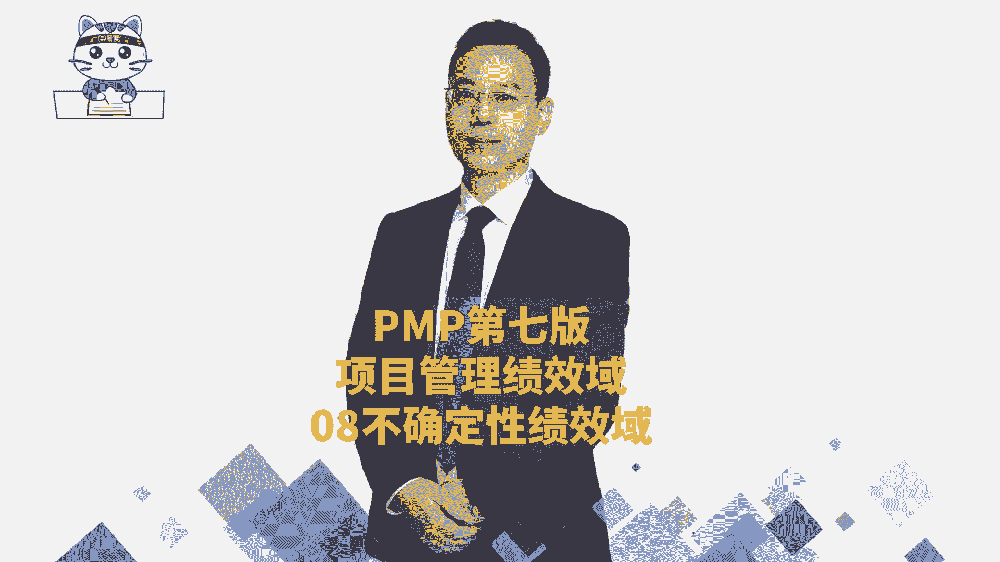

# 2024年PMP认证考试新教材第七版全套机构精讲课程免费学习！ - P40：PMP第七版8大绩效域之08不确定性绩效域-上 - PMP-B站课堂 - BV1Ao4y1L7kY

大家晚上好，我们一起来看到最后一个内容，叫不确定性绩效率，这个不确定性绩效率其实就是不确定性，会导致风险对吧，那我们一起来看一下整个不确定性的绩效率呢，它讲的是说不确定性，教育。

涉及到所有跟风险和不确定性相关的，这么一些东西，OK风险和不确定性相关的这些东西有这样几条，首先第一个说了解项目的一些运行环境，包括一些什么技术呀，社会呀，政治呀，然后还有经济呀环境呀。

这里给了一个词叫市场，它有点像什么叫PESL分析，你有兴趣你可以去搜一下，P1STL1叫宏观态势分析，大家有兴趣可以去搜一下啊，搜一下，在NPDP课程中会讲到这一宏观态势分析。

就是我们去做一些事情的时候，我们也需要去了解目前我们做的这个事情，它在整个大宏观环境下是什么样一个状态，从而你就能够去知道我们该要如何去搞它，对不对，就知道什么样的一个状态，那怎么怎么去弄它好。

第二个呢是要积极去探索和应对不确定性，就是对于不确定性，我们是主动出击，主动出击来做一些事情，了解项目中的多个变量，以及变量之间的一些依赖关系，因为变量越多的话就不确定性越大，那我们要适当的来去做一些。

采取定了什么样的措施，来让他是处在一个可控的状态，就是要达到一个什么确定而美好的未来，OK是确定而美好的未来，而不是一个不确定而美好的未来啊，好能够去预测威胁和机会，这就是也是不确定性的吧。

我们说不确定性会有机会和威胁啊，不确定性，然后呢能够去交付那些，就是他说能够去通过想尽办法去减少这些，消除消极的影响，或者说你看让他少受消极影响，或者减少那种消极的影响。

然后至于机会呢是大大的加加深增加，不管是减低影响，降低负面影响还是增加正面影响，都是让我们项目能够更好的去成功，有效的去利用好这些机会，能够让我们更好的去项目成功，这是整个不确定性。

绩效率基本上就是我们在前面所学过的风险，就是学的风险这一这些东西啊，好那整个在风险中有一个叫不确定性，什么叫不确定性呢，对于东西有有问题呀，缺乏对事件问题等等这些个认知和理解，当你缺乏这些东西。

有理解和认知的时候，你就觉得有一种不确定性，当有些东西你非常清晰认知和了解的时候，你就觉得没有什么不确定性，你就觉得板上钉钉对吧，比方说那你让那个让那个谁神箭手去射一箭，他知道一定可以设置中，为什么。

因为他是确定的，他对这个东西把握的非常准确好，这里还有呢叫模糊性，你会发现这个不确定性，模糊性，复杂性和易变性，它是什么呀，现在很流行的一个词，谁来帮我敲出来，第一个敲出来的同学。

我给你发一个课堂小礼物，这是一个什么词，我相信一定有同学知道谁第一个敲出来，我就给你发个课堂小礼物啊，OK今天要给环环雪霞同学，给环雪霞同学发一个课堂小礼物啊，这是一个无卡的时代，对不对。

这是一个无卡的时代啊，就是无卡乌卡中就会有这样一些什么不确定性，模糊性，复杂性，易变性，然后模糊性什么意思，什么叫模糊呢，就是不清晰啊，模模糊糊不清晰呃，这叫不清晰的这个模糊性，然后什么叫复杂性呢。

复杂性就是难度呗，有难度呗，搞不定呗，就是难以去管理好呗，管不了呗对吧，然后还有一个呢叫易变性，易变性就是说可能变动太多，有太多的不确定，太多的这一变化，那我们可能要用一种拥抱变化的方式。

需要用一种拥抱变化的方式，而这些东西呢它加在一起，其实就是一种都是一种都会增大风险，OK都会增加风险，风险是什么，风险是一旦发生以后，会对项目造成影响，包括积极的影响，包括消极影响，会产生影响的这东西。

这些事件或条件它叫风险，那么整个在做项目的过程中，其实现在就越来越多的这种乌坎，所以导致风险会越来越大，那我们整个在风险管理中，关于不确定性和绩效预中，其实就是要想办法。

你看呃经济就是呃叫economy吧，然后技术technology，环境environment，然后法律法律这个东西呢，我们没有去讲这个法律law对不对，然后还还讲了一个什么模糊性。

然后社会性社会是social政治，Political，这些东西其实就是PESTLE都要关心，就是你要关心整个外部的环境，当然不太需要你去把它都记住啊，你要只要知道。

就是可能很多很多因素会影响我们的这个事情，影响我们的事业，影响我们的感情，嘿嘿对吧好，那么接下来就是看到关于不确定性，它的一个应对方案，就是会讲到乌坎，那乌卡其实你会发现越是在这个乌卡的时代。

管理越来越难，什么叫乌卡乌卡呢，乌卡就是这几个词啊，一个叫异变性啊，这几个单词我都不知道怎么念算了，我不念了啊，一个叫不确定性，一个叫复杂性，一个叫模糊性，那么这几个特性呢。

我们该怎样去怎么样去应对它呢，首先第一个关于不确定性，关于不确定性的应用方式，我们想办法去获取更多的信息，我们前面好像隐隐约约讲过一点点，白领白色六六顶思考帽有没有讲过，我都不记得了。

那么六顶思考帽里面，其实就是我们去获取大量的白色思考帽的信息，你获取的信息越多，那么你做的决策会越准确，所以当有不确定性的时候，我们要想尽办法去获取更多的信息，从而能够帮我们去做决策。

还有就是为多种结果做好准备，其实也就是说ABCD各种方式，我都找到一些应对的措施，那么如果有了一些应对措施以后呢，就能够更有效的去应对这种不确定，还有一个说是基于集合的设计，什么叫基于集合的设计。

其实他也是说我们在设计的时候，把很多因素都考虑进来，各方各面的东西都考虑进来，给了四个逻辑啊，要谢谢刘州啊，刘周给的非常棒，把这个乌坎给就是搜出来了，还有一个词叫增加韧性，什么叫增加韧性呢。

就是一个乒乓球掉到地上，砰它会弹起来，这叫任性，就是你遇到挫折的时候，你还能够起来，这叫韧性，不是说你很强，宁折不弯，啪一折就断掉了，那也不行，它的韧性就是说你掉到谷底，你还能弹回来，这才要任性。

那面对这种不确定的时候，有的时候我们可能会荡到荡到底，但是一样还能够去对有这个反弹的能力，特别棒啊，是的，胡晓雷给了一个很好的词汇好，这是对于乌卡中的第一个，我们可以多收信息，多做准备，多做集合。

然后增加韧性，至于说怎么样认呢，哎呀其实有的时候其实还是要见多识广，然后以及多去多去敲打，你多敲打多敲打，对不对，叫什么他强任他强，清风拂山岗好，另外一个词呢叫模糊性，那么项目中可能会出现很多模糊。

包括概念的模糊呀，情境的模糊，那么关于模糊性更怎么办呢，记得那么模糊，我们有一个词叫渐进明细，就逐渐逐渐清晰，你不要求他非得是一下就得全部都清楚，我们可以逐渐清晰，这也是可以的嘛，对不对。

然后呢还有一个词叫做实验，你通过做实验的方式，那得到的数值都是确定性的数值，通过做实验得到的是确定性的数值，这样的话是不是就不模糊了呀，还有第三个用原型法的方式，既然我对于那你的需求不清晰。

我做一个圆形出来，你先用着，然后再做一个原型出来，然后再改，有了一个基础以后再去改，它是不是变得更容易，对不对，是不是这个逻辑好，这是模糊性，然后乌卡中文，第四还有第三个复杂性，既然这东西很复杂。

可以怎么办呢，有一个他说复杂跟跟很多因素有关系啊，就是这个复杂说的是说我不知道怎么搞，它可能跟很多很多因素有关系，那么其中就是这个事情，这个系统本身就很复杂，或者是过程本身就很复杂，那怎么办呢。

这里给了几种解决方式，稍微了解一下啊，有一种解决方式叫解耦，什么叫解耦呢，呃同学懂的同学可以敲一个词叫高类聚低耦合，高内聚低耦合，先敲一下，然后我再解释一下什么叫高类聚低耦合呢。

就是我们在讲到那个呃用户故事的时候，有讲说故事和故事之间，他们最好是减少这种依赖关系，减少这种依赖关系，那么也就是说我的这个用户故事，和他的那个用户故事，我们相互之间没有什么耦合，没有什么太多的耦合。

如果说有那么一点点关联，那种关联都不那么强，都是一种低关联，高类聚是我们自己内部我做的这个东西，它内部是是，你可以把它理解为说是凝聚聚的比较多，但是外部的这东西呢，它们相互之间关联度没那么大啊那种。

而这个解偶，其实就是说把A和B之间的这种偶合关系，把它给解开，让它变成一个D偶合的这个意思啊，就这个意思听懂就听懂了，没听懂也不要紧，没听懂回头可以重新再听一遍啊，试着慢慢去理解好。

另外还一个呢就是模拟模拟，什么意思呢，就是我们可以去做这种模拟的方式，来去来去对这个东西有更深的认识和了解，因为它很复杂嘛，那我们先做一个类似于说做demo的这种方式，类似于说做模型的方式去模拟它。

或者说是某一个东西，它虽然很难，但是我在在在互联网上面，先去默认去做这些模拟，OK在互联网上默认去做这些模拟的方式，来去提前去弄它对吧，我就知道这个东西它未来的轨迹是这样的轨迹，我哇哇到最后升到天上去。

然后一级二三级火箭分离，二级火箭分离诶，你提前去做这些模拟对环哇，我今天要给黄启文发一个发一个课堂小礼物，不为什么，就是心情好，就是我们要考试，其实考试的时候，如果你从来没有考过。

你可能会两眼一抹黑懵逼，对不对，哎但是我们可以提前模拟考试啊，你可以去做搞一个周末，你提前搞三三个半小时来好好做一套试卷，来模拟一下呀，你通过这种模拟的方式哦，原来考试是这样的呀，真的是对吧，就这样子。

所以我们可以去对于这个东西有复杂性的，我们可以去用一种模拟的方式，包括模拟考试，包括期中考试啊，可以啊，那还有一些就是有一些东西比较难，那么对于某一些东西比较难的东西呢。

我还有一个就是他说可以去重新构建，对于重新构建，他说允许有不一样的方式，不以多样性以及做平衡这几个词呢，其实我书上面都是有完整的解释啊，就是我看一下，我为了不给你们讲错，稍微翻一下啊。

数学完整解释时讲的什么呢，就是关于多样性，他说是前期可以去发散，也就是说做事情它可能不止有一种方式，可以有多种方式，我们可以先去发散，然后呢后面再去做收敛，先发散再收敛的这种方式来去做事情。

允许它这种多样性，而至于平衡的话，就是要使用的各种数据类型啊啊什么之类的，这个平衡有点怎么讲呢，有点像是我们比方说在组合管理中，组合管理中有有高风险，高收益的项目。

