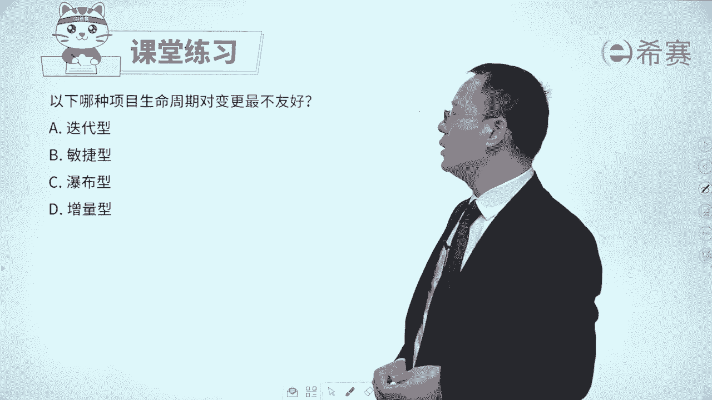
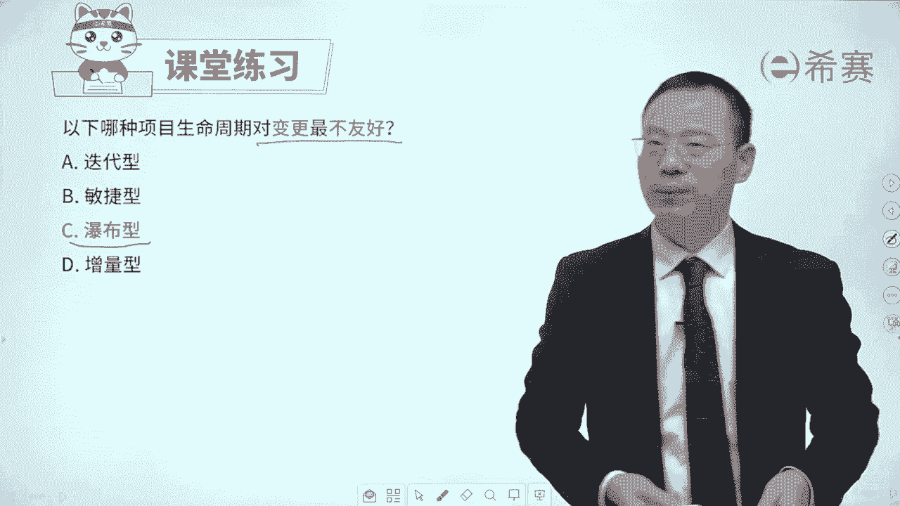

# 2024年PMP认证考试新教材第七版全套机构精讲课程免费学习！ - P64：22生命周期课堂练习 - PMP-B站课堂 - BV1Ao4y1L7kY

我们一起来看一下关于这个章节的一些试题，通过试题来去，对于生命周期有一个更深度的认知，我们来看一下啊，项目经理呢接到一个新的软件产品的开发项目，根据用户的持续反馈，才能够一步步的决定产品的功能。

而且呢如何实现这些功能呢，没有成熟的技术方案可以借鉴，项目经理应该建议采取哪一种生命周期，首先你会看到说是通过持续的反馈，才能够怎么样，所以它应该是交付很多次，对不对，交付很多次，那就是一种增量的方式。

就有增量，OK它就有增量，同时呢他说怎么样去做这东西，他也没有一个成熟的技术和方案，所以呢做这个东西他可能也会去试探尝试，迭代在进行，所以它会有迭代，那敏捷的方式它就是增量加迭代。

所以增量加迭代的方式它应该就是敏捷，而咱们四个选项中没有敏捷，但是有一个词叫适应，你要知道适应和敏捷它就是等同的啊适应，所以这个题目答案呢就是选适应型，它就是敏捷型，敏捷型也叫适应型，适应型也叫敏捷型。

它是既包含了增量的部分，也包含了迭代的部分，我们再来看另外一个题目，以下的哪一种生命周期对于变更是最不友好的。

哪一种生命周期对变更不友好，其实也就是他不太能够接受这种随意的变更，而这种不管是增量的方式也好，增量虽然我们说的是在这一段之内，我们可能是在这一个周期之内是确定的，但是对于总体而言。

他还是可以去稍微做调整的，我在下一轮可以去做调整，而迭代就更加不用说了，可以持续调整，而只有这一个部分预测的部分或叫瀑布模型，这个部分它是不太能够去呃应对这种变更的，他对于变更的话。

有一句话叫做六字真言，有变更走流程，所以他对变更是不太友好，答案是瀑布模型，它对于变更是不友好的好。

我们再来看一道题目，项目经理被分配管理，一个要求苛刻客户的这样一个项目，项目呢是动态的，要求是持续改进及客户反馈，你看又有持续改进，又有客户反馈，那么项目经理应该采取哪一种方法。

选项A极端的项目管理方法，因为目标是不明确的，确实目标也不够明确，但是呢所谓叫极端的项目管理方法，我们也没怎么听过，按他的这个意思，好像说的是什么一回事，就是我们在讲那个还记得吗。

有一个词叫STACEY，叫斯泰希图，在斯泰希图中，我们说这种确定性的地方呢，用预测的方式来做事情，然后这种地方呢它是这种科研性的项目，它的这个A选项好像意思就是这样一个区间。

但这个区间很很显然跟题干不符合，题干中说要求用持续改进的方式，以及客户反馈的方式，所以他应该是持续在交付东西，并在优化改进，应该是用敏捷的方式好，第二个选项，敏捷的项目管理方法。

因为呢它能够快速具有迭代性，能够快速交付，又能够去迭代更新，所以刚好是合适的，第三个传统项目管理方法，因为它很简单，这种传统的方式它能够适应于持续优化改进吗，能够适应于持续去获取客户反馈吗。

不是我们说过传统方式之前给大家画过一个图，它就是一个这样的一个图形，对不对，跟客户的交流没那么多，而像用敏捷的方式，它是这样的一个图形，它是这样的一个图形，会持续跟客户有比较频繁的这些互动好。

最后一个叫精益六西格玛，精益六西格玛，它其实是一种在生产制造这个领域中，会特别推崇的，就是以高标准严要求，然后目标可能会是按照零缺陷，用六六西格玛是什么，六西格玛说是做事情，可能他都符合一个叫正态分布。

然而在正态分布中的正一个标准差，两个标准差，三个标准差到六个标准差以内完成的东西，那么它完在六个标准差以内的话，它的这个正确率大概是达到99%，19。99966，就100万个产品里面只有3。

4个bug缺陷，它是另一套跟这个题干中完全不匹配，所以对于一个要持续改进的，要持续获得客户反馈的，我们用敏捷的方式来去做，它是比较合适的，所以答案是选B选项，用敏捷项目管理方法快速，并且呢能够去迭代好。

我们再看一个，在一个快速变化环境中工作的项目经理，那他将收集到的需求清单，按照优先顺序来进行分组排序，所以他已经是按照优先顺序来排序了啊，按它价值来进行排序，让优先级最高的可交付成果在3~4周内完成。

其实也就是告诉你，他已经在按照分批次完成，分批次完成，那么这种分批次完成的方式它是什么，它不就是用这种敏捷的方式，或者是增量的方式吗，那你看一下预测的方式肯定是不是的，迭代的方式，它这个焦点还不是迭代。

它的焦点其实更多的是用一种增量交付，它在强调是增量交付，而这里只有它，可是为什么呢，因为它是包括了迭代加上增量，而四个选项中没有增量这样一个选择，所以选这样一个敏捷是合适的，选敏捷或叫适应是合适的。

答案是适应的这种生命周期呃，我们来看一下，整个在这一个章节讲生命周期的时候呢，中我们都说了些什么东西，你可以根据这个题目来去回顾一下，比方说首先生命周期分到哪几种类型，然后生命周期它们各自的特点是什么。

对吧，我们的这个预测型，然后增量型迭代型以及敏捷型或叫适应型，它们各自又有什么优优缺点，然后我们可能会通过哪些方面来去筛选，它是否适合用敏捷，我们会有一个筛选器，对不对，筛选器有三个板块。

每个板块又会分到三个维度，然后打分的时候分值越低越适合用敏捷，分值越高越接近确定性，就越适合用预测好，然后第三个混合型生命周期有哪几种类型，可能会有一些是先敏捷再预测，可能是一边敏捷一边预测。

可能是敏捷为主，预测为辅，或者说是预测为主，敏捷为辅，还记得吗啊，各自有对应的一个适用场景，还有一个就是需要了解哪一些因素，可能会对于混合的生命周期进行影有影响，我们又该如何去处理它啊。

所以你稍微回顾一下，但是它的焦点在哪里，焦点其实是在这里，OK好了，我们这一个章节呢就先到这里，接下来我们会开启一个新的内容。

