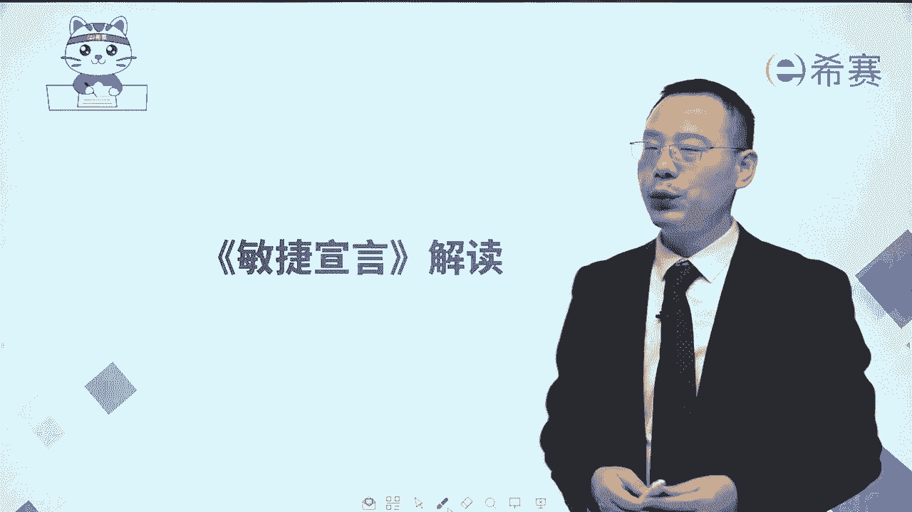
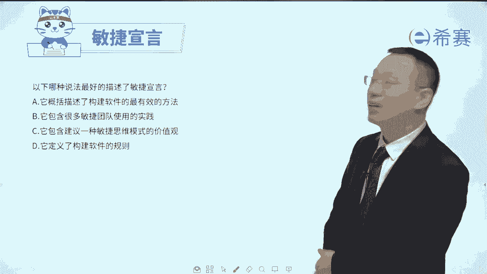

# 2024年PMP认证考试新教材第七版全套机构精讲课程免费学习！ - P45：3《敏捷宣言》解读上 - PMP-B站课堂 - BV1Ao4y1L7kY

大家好，接下来我们一起来分享的是敏捷宣言，我们对敏捷宣言来做一个简单的解读。

在2001年的时候，当时有17位已经是从事敏捷项目管理的，这些工作人员，他们在美国的犹他州的一个滑雪圣地，雪鸟滑雪场，一起去讨论关于敏捷，他们前后讨论了几天，最后讨论来讨论去。

最后得到的这一个叫敏捷宣言，这敏捷宣言呢他是这样来讲的，说，我们会正在通过亲自开发和帮助他人来开发，我们会发现开发软件，请注意哦，所以最开始敏捷它其实有行业设定的，是从软件开发这个行业出来的。

发现开发软件的更好的一些方法，那通过说自己亲自开发以及帮别人开发，我们会发现，这项工作更加重视的是个体以及互动，剩余流程和工具工作的软件，剩余完整的文档，客户合作，剩余合同谈判以及应对变更剩余遵循计划。

也就是说幼蓝的项目固然有价值，这些东西固然有价值，但是我们会更加重视是左栏中的这些项目，更重视的是左侧的这些东西，而这就是传说中的敏捷宣言，大名鼎鼎的敏捷宣言，就这么四句话啊。

你简单记住这四句话就可以了啊，首先当然了，前面是在软件开发这个领域中开始来的，然后呢是中间这四句话，当然还有后面这一句也重，要告诉你什么呢，说敏捷并没有否定这些什么流程啊，工具啊，文档啊，合同谈判啊。

没有否定他们的价值，只是说在敏捷项目管理中会更重视左侧，那对应的这个敏捷宣言的这几句话呢，我们也对应的给他列出几条信息来去，作为他的这样一个核心价值观，首先第一条会更重视个体和互动，什么叫个体呢。

其实就是人啊，人以及人与人之间，所以呢这一条给的是以人为本的这种方式，工具再好再牛逼，你还需要人去使用它，人去管控它，协调它好，第二条是可以工作的软件胜过文档，也就是说你整一大堆文档。

如果说没有做出一个具体可以运行的程序，没有做出一个可以使用的这样一个功能，那么这个呢其实价值不太大，所以他更关注的是可以工作的软件，是以价值为导向，以价值来驱动，第三个是客户合作胜过合同谈判。

甲方和乙方之间我们不再是一种对抗的关系，而是一种共同携手，一起往前推进，因为作为甲方，你也很难一次性把所有的需求都描述清楚，有可能是自己没有想明白，也可能是外部环境会发生很多的变化，所以在这个过程中。

我们可能会需要有各种合作的方式，所以是合作共赢，你只要乙方能够为甲方的这个变更来去买单，能够去给他提供他想要的东西，这样的话呢，甲方才能够在市场上有更大的这个机会，而乙方呢也能够获得甲方的尊重以及酬劳。

所以这是合作共赢的这种方式，第四条就是拥抱变化，大名鼎鼎的拥抱变化，原来来自这里说的是你想做事情，如果没有计划，那么实很多事情就是可能就有点混乱，一盘散沙，但是俗话说得好，计划赶不上变化。

你的计划做得再好，当有很多变化过来的时候，如果说不能够去响应变化，那么很多事情就可能会变得很糟糕，所以在民中会更强调的是应对变更，也就是拥抱变化，那有了这几个信息，我们一起来通过两道题目。

来巩固一下这个知识点内容啊，你首先呢要知道一下，它是基于软件开发里面会有很多变化的情形，所以呢他们做了很多这种具体的开发工作，大概从90年代开始，就一直在用敏捷的方式来去践行。

他只是到了2001年才一起开会讨论，才把这个敏捷这两个字给定下来，在此之前已经在使用了，用了很多实践，有各种不同的方法，以后来定义下一个总括性的东西，然后给的是说人和人之间的互动可以工作。

软件才是更有价值，更关注的是客户合作以及响应变化，好我们来去看一个题目啊，一个公司具有多年的敏捷项目经验，目前又有一个项目即将要开始，而该项目团队成员呢基本上都是新入职的员工。

他们对于敏捷中的这样一个敏捷宣言，他不太了解，那么以下哪一项描述了敏捷宣言的这一个，更多的价值啊，这个其实你用排除的方式就可以了，对吧啊，选项A给的是遵循计划这一条不对，敏捷中会更强调的是拥抱变化。

选项B它会强调是详尽的文档不对，在敏捷中更强调是工作软件，第三条说是刚好，第三条就是正确答案啊，第四条呢，第四条说工流程和工作流程和工作很重要，但是在敏捷中，他更关注的是个体以及互动。

所以答案是C选项好，我们再来看一个题目，以下哪一种说法最好的描述了敏捷宣言，选项A它概括描述了构建软件的最有效的方法。

确定是这样吗啊这里面要解释一下啊，其实做软件不只是一种方式，用传统的瀑布方式来去做事情，他也很红了很多年，对于很多行业软件，它其实是有效的，只是说对于那种变更比较频繁的这种软件。

用传统的方式来讲是无效的，所以才会需要用这种敏捷的方式，用拥抱变化的方式，我们是通过题目来去补充一些内容啊，所以这个呢其实不对的好，第二个说敏捷宣言呢，它是包含了很多敏捷团队使用的这个实践。

敏捷宣言本身它没有包含这个敏捷实践啊，敏捷宣言也就是这么四句话而已，OK第三个，它包含鉴于一种敏捷思维模式的一个价值观，他有没有他有价值观呢，他会更强调是人以及人和人之间的互动，以人为本。

它会更强调是工作的软件，一是有价值，以价值为导向，它会更强调是合作共赢，以及会更强调的是拥抱变化，所以这个就是它的一个正确答案啊，而最后一个选项它定义了构建软件的规则，构建软件的规则在敏捷出现之前。

就已经早早的有了这样一个做软件的方法，只是说敏捷是提供了一种新的可能性，对不对，所以这个题目的答案呢是选C啊。

