# 2024年PMP认证考试课程针对PMP新考纲最新免费零基础也能轻松听懂 - P10：PMP第7章：项目成本管理（上） - 乐凯咨询 - BV1Rj411G7gs

好各位同学晚上好，今天晚上我们开始学习项目的成本管理好吧，那么我们到现在呢已经学习了项目的范围管理，项目的进度管理，那么项目的成本管理这个环节呢，实际上他是在说我们怎么样去管理项目。

在实施过程当中它的一些成本对吧，怎么去控制成本，那么成本这一块其实对于大部分人来说啊，它并不是太难，虽然它涉及到一些计算，但是它计算比较简单，那么关键大家对于成本这个词啊，要有一个清晰的认识。

那么所以我先问大家几个问题啊，看看大家能不能理解什么叫做项目的成本，那么比如说我们现在是站在乙方的角度，来帮甲方爸爸做项目，那么甲方跟乙方之间，他肯定是签订了合同的对吧，那么合同里面肯定会约定。

这个项目一共费用是多少钱，那么假如说这个合同是一个500万的合同，对吧，那么首先问大家一个问题，这个500万是不是我们项目的成本，啊我们乙方给甲方做项目对吧，那么双方之间存在合同关系。

那么这个合同里面会签合同金额了，那么合同金额签的是这个项目啊，一共是500万，那么这个是不是成本呢，好这个不是成本，很多人都知道对吧，为什么呢，因为正常来说啊，特别是我们是为了追逐有形的商业价值的时候。

那么我们做项目可能是为了一些利润，为了盈利的，那么这个500万，实际上是甲方最终支付给我们的500万，那么刚刚有同学说了，这个500万里面就包含了利润，对吧，那么实际上剩下的才是我们以多少成本。

把这个项目完成，对吧好，那么假如说我们的成本是400万，啊我们的目标利润呢是100万，所以这个合同总价是500万，那么成本管理关注的是什么，成本管理关注的是我们怎么样用这400万。

把该做的可交付成果把它给做出来，对吧好，那么接下来再问大家一个问题，那么理想状态下啊，比如说我们跟客户约定好，要交付这些可交付成果，那么理想状态下交付这些可交付成果，我们应该花多少钱呢。

那么我们说做这些可交付成果，这些可交付成果是怎么做出来的，是通过一个个活动把它做出来的，那么活动需要人去做，要有人力成本对吧，可能还涉及到一些材料设备，那么我们理想状态下应该是多少钱，把这些东西做出来。

那么既然我们当初定的成本是400万，那么理想状态下，我们就应该是用400万把它给做出来对吧，那么有同学就提了一个问题，他说那难道我小于400万不好吗，啊比如说我问一下。

假如说我们最终用320万把它做出来了，好不好，这个叫什么，那么很明显你用320万把它做出来，这个叫成本节约了好不好，当然是好的，但是大家注意啊，这个成本节约当然是好事，但是大家有没有考虑过。

从某种程度上来说，这也同时体现了另外一个不好，什么不好好，杨庆同学说的很对，说明当初我们预估的这400万的成本，这个预估怎么样，或者说这个计划或者说这个基准怎么样，它很有可能是不正确的。

或者说不准确的对吧，当然还有可能出现一些极端的情况，比如说哎我们为了一味的节约成本，牺牲了一些质量啊，牺牲了一些别的什么东西啊对吧，这也是有可能的，那么即便你在保质保量的情况下，用320万做出来。

那么从某种程度上来说，那么也证明了我们当初预估的这个成本呢，好像最少你在计划的时候做的不太准对吧，当然大部分情况下呢，我们还是乐于见到这种情况的成本节约对吧好，那么假如说我们最终以450万。

把这个项目做出来了，好我问一下亏不亏，原计划400万对吧，那么我们最终450万，把这些东西做出来亏吗，大家注意，其实我们一般不说亏还是赚对吧，因为我们只是针对什么呢，针对成本来说的。

那么我们一定要注意成本管理，成本管理我们关注的是什么，关注的是这一部分东西的管理好吧，所以说大家对成本的概念一定要了解清楚。

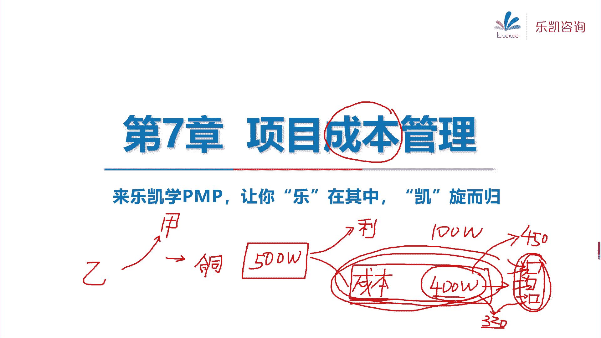

那么偏僻民说什么叫成本管理呢，他说成本管理就是重点关注完成项目活动，那我们完成活动需要什么，需要资源对吧，那么完成活动需要的这些资源的成本是多少，我们主要是关注这个。

当然当然我们还会涉及到最终后续的一些，使用成本和维护成本啊对吧，那么这些东西呢也可以去顺带考虑，那么另外他说不同的相关方，在不同的时间会用不同的方法来测算成本，那么怎么去测算成本呢。

好这一章的重点在这一块，我们有一个方法论叫正职管理，n value management，政治管理，这是一个方法论好吧，那么这个方法论是我们成本这边，控制成本的一个重点，那么我们重点会讲传统的这种做法。

也是用的比较多的，当然在新兴世界里面出现了几个新的名词，这个呢稍微了解一下就行了好吧，那么大部分还是这些，那么这个政治管理呢，实际上它最早是源于美国的军方，那么一直演变到现在。

形成了一套啊比较我觉得比较简便的，比较啊容易使用的一套方法论叫政治管理，那么我们一定要了解政治管理它的含义是什么。

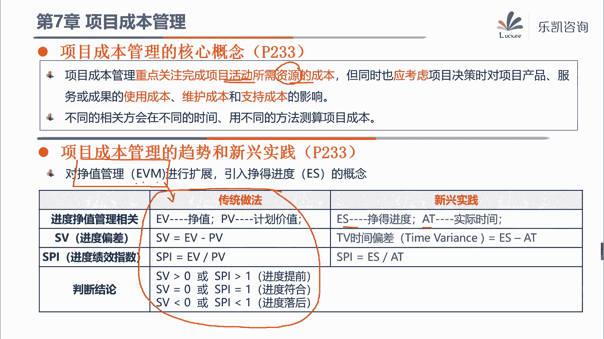

包括它的一些常见的计算，好吧好，那么接下来我们看成本的这几个过程，首先第一个过程叫规划成本管理，那么大家学到现在啊，我觉得大家对这种过程应该比较清楚，比如说规划范围管理，比如说规划进度管理。

比如说规划成本管理，那么你会发现，其实这种过程是做一个什么东西呢，规划叉叉管理，就是做一个所谓的叉叉管理计划对吧，比如说范围管理计划，进度管理计划或者成本管理计划，那么这种管理计划它一般是指南型的。

或者说叫程序型的计划，他告诉我们将来如何去管成本对吧，比如说跟进度类似，他会说我们成本的计量单位是什么呀，准确度达到多少，精确度达到多少对吧，控制临界值允许最大的成本偏差是多少对吧。

包括将来怎么去测量绩效，那么像这些东西都是在说一些指南性的东西，他没有具体的我们这个项目的成本是多少，他没有具体的说对吧，那么这个过程大家稍微了解一下就可以了好吧，那么这些内容实际上就是成本管理计划。

里面包含了一些内容好，那么接下来我们看第二个过程怎么去估算成本。

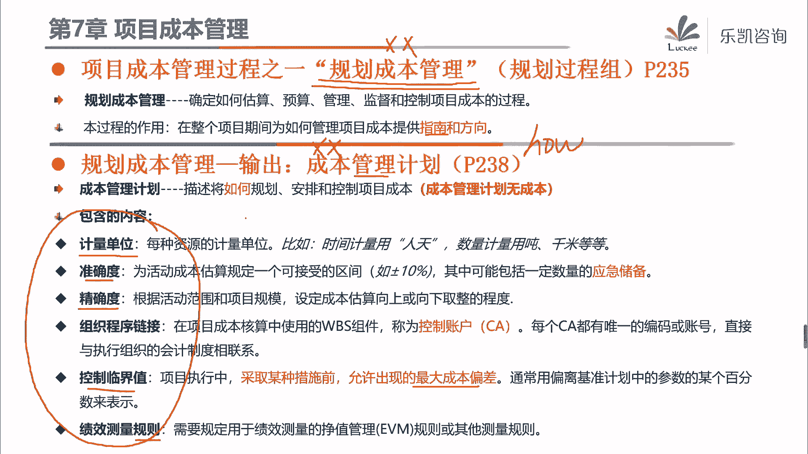

那么什么叫估算成本呢，估算成本就是对完成项目工作所需的资源成本，进行一个近似的估算，那么我们回忆一下我们之前学过的内容，你会发现成本是哪来的，我们有需求，然后定义了范围，然后创建了w bs，有了工作包。

有了活动对吧，好活动，最终我们要安排人去做，要安排资源去做，那么这个资源一天要多少钱，这个活动一共要干多少天对吧，那么我们就可以做一个近似的估算了对吧，所以这个就可以对我们的资源所需的成本。

做一个近似的估算，这个就是估算成本，那么近似的估算说明什么问题，大家要注意这两个字，说明我们目前还没有获得批准，只是我们自己来做一个估算而已对吧，那么他说估算成本的时候，我们要分析各种备选方案。

包括我们还要考虑除了人力成本以外，还有一些实物成本，比如说我们需要材料对吧，需要设备，那么这些购买材料设备的成本也要注意的，然后他说估算成本的时候啊，我们要有一个单位对吧。

我们在成本管理计划里面也要有一些单位，那么跟成本有关的单位，最常见的就是货币单位，比如说这个项目一共多少美金啊，多少人民币对吧，但是这边他也提到了一些其他的特殊的单位，比如说人天好。

我问一下我们做过项目的同学，应该听说过人天这种说法吧，大家知道人天是什么意思吗，类似的还有比如说那仁月，那么我们用两种方法来描述一个活动的成本，比如说我们可以这么说，活动a。

活动a呢大概需要一个资源干多少天对吧，然后这个资源每天的工资大概是多少，好活动a的成本我们有一种说法，就是活动a需要5万，对吧，当然我们也可以换另外一种说法，怎么说呢，好活动a要比如说三个人干五天。

那么我们就说活动a的成本，我们就不用货币单位，用人贴对吧，三个人干五天，那么就是15人天对吧，同样的人越也是这样的人，越就代表比如说两个人干三个月，那么就是六人月对吧，所以人天和人怨也是一种单位。

那么他说我们在做项目的时候，有的时候也会用这种单位，人天啊，人月呀，好大家知道用这种单位的好处是什么吗，特别是我们做it项目经常用到这种对吧，那么用人天跟人类的好处就是。

第一它可以消除通货膨胀带来的影响对吧，特别是对于长期的这种项目，我们只以人天人月来算，那么到最后我们再看，当时一个人贴是多少钱对吧，可以去避免通货膨胀带来的影响，另外呢还有一些好处。

比如说在我们做海外项目的时候，那么大家要知道，海外项目我们结算会涉及到什么问题呢，会涉及到汇率的问题，对吧，这个汇率呢一直在变边，人民币兑美金怎么怎么多少多少对吧，那么比如说遇到这种问题一直在变的。

我们也可以先不要定义多少钱，我们就定义a这个项目一共是多少个人月，或者多少个人听对吧，那么最终去结算的时候，再去按照当时的情况去结算，所以说用这种单位，任天或者人员这种作为单位的，其实也是比较常见的。

也是比较常见的，好吧好，那么说到这里啊，我说一个考试不考的问题啊。

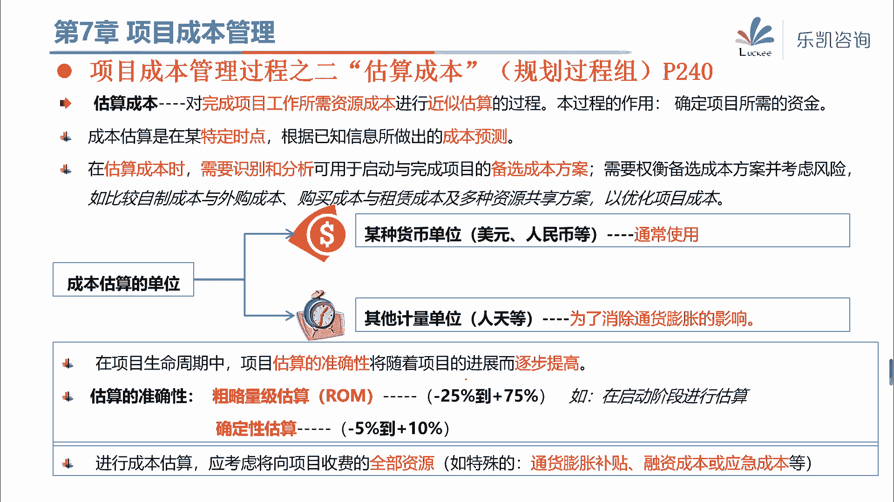

可能有同学会有一个疑问，你们有没有想过这个问题啊，在我们公司里面，其实人和人的工资是不一样的，比如说王立顺同学小王同学，他工资比较高，他一个月的工资3万对吧啊，他1月的工资呢就只有1万对吧。

那么a活动让小王同学干一个月3万块钱对吧，b让我干一个月1万块钱，那么你用货币单位可以累计算出来成本是4万，但是如果你用人天这种单位对吧，那么a活动叫一个人约小王同学干一个月嘛，一人月嘛。

那么b活动呢让我来干也是一人月，那么你统计下来只能说它是两人月，那么问题是，每个人愿每个人一个月的工资是不一样的，那么如果你用人月这种单位来统计的时候，你怎么区分不同的资源的不同的费用啊。

大家考虑过这个问题没有，对啊，比如说你叫我说人越，我当然知道啊啊小王干一个月啊，jm干一个月啊，两个人月呀对吧，那么那两个人月多少钱呢，你不能简单地说一个人月多少钱啊，是吧好。

那么我们实际做项目的时候怎么办呢，对吧，唉有的同学说我们公司有岗位的级别对吧，不同的级别有不同的价格，比如说小王一个人要多少钱，然后这种级别的一个人要多少钱，用不同的价格是吧，我跟大家说啊。

实际上很简单啊，大家不要考虑的很复杂，在我们实际做项目的时候，我们对于一个人越，是多少钱，它是由什么，它是有标准的，大家注意啊，他不管你你这个人在这个公司一个月拿多少钱，另外一个人拿多少钱。

一般来说特别是像我们做政府项目啊，业主单位是不关心你们具体的某一种级别，级别的人拿多少钱的，不关心的，一般项目做政府项目，它有一个标准，说好一个人月是多少钱，他就是多少钱，明白吧。

这个它是有统一的标准的，比如说在我做上海的项目的时候，一般大家知道在上海他们最常见的定义，一个人月是多少钱吗，就做政府的信息化项目，而他不管你这个人是什么人对吧，好在上海这个地方，一般来说政府给的标准。

一个人运差不多是2万，差不多是2万 5万，哪有这么高，你开玩笑没有的，2017年的时候，2017年我做项目就只有21000个人，越，明白吧，然后在成都当时做项目的时候，他们给我们定的标准是一个人也是1。

5万，1。5万对吧啊，有人说2万很高，2万高不高，2万不高的，2万不高的2万，其实实事求是的说是很低的，明白吧，这里面有一个地方要注意啊，如果说一个人他的成本是2万，你们觉得他们的工资是多少啊。

有人说你既然一个人月收2万，不就代表这个人一个月的工资是2万吗，其实远远达不到2万，大家知道为什么吗，因为你的如果工资是2万，你的成本会超过2万，因为公司还要帮你交什么交社保啊，交什么公积金啊。

什么乱七八糟的对吧，那么如果你的工资是2万，你的成本是多少呢，实际上应该乘以160%，差不多是32000左右对吧，所以如果你标准定了2万，你就要除以1。6，明白吧，远远不到2万的好吧。

所以这个标准是比较低的，是比较低的好吧，但是呢人家不跟你讲这个东西，人家定好的标准，一个人也是2万就2万好吧。

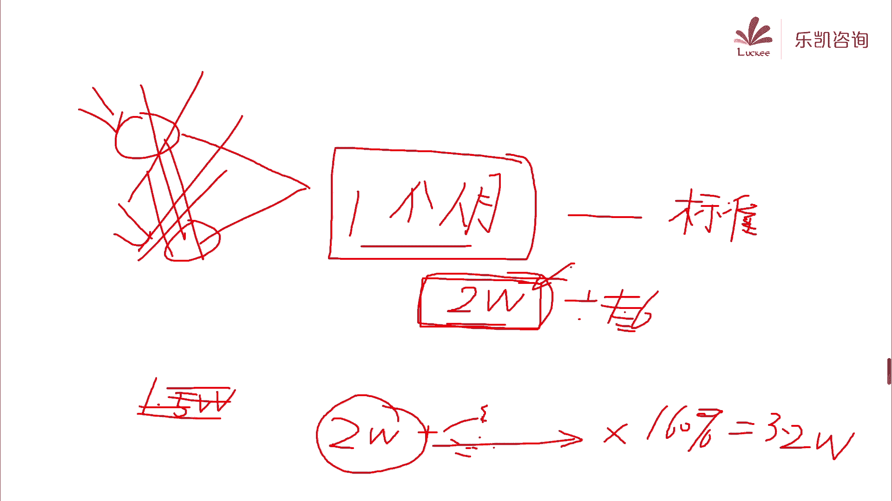

那么如果别人定好了，一个人月标准就是2万，你觉得低了，那么问一下各位猥琐的项目经理，你应该怎么处理，我给政府做项目，我给他们报预算对吧，他们说用人类这个单位，那么我算了一下啊。

这个项目一共大概要多少个人月对吧，但是他给我的一个人员的标准太低了，一个人月才给我2万对吧，这完全不行啊，那怎么办，徐斌说偷工减料，把徐斌拖出去给我打，不能这么做，质量是很重要的，不能牺牲质量的，对吧。

唉其实这很简单，你把有些东西呢，稍微，那你比如说原来你觉得要两个人干三个月对吧，那么由于他人员的标准比较低，你是不是可以考虑，比如说三个人干四个月呢对吧，比如说三个人干三个月呢，原来是六人月。

这样一变变成九人月对吧，稍微多报一些，包括像我们在我们有的项目在当时报价的时候，还有一些其他的费用，比如说什么集成费用啊，什么是人员管理费用啊，什么乱七八糟的对吧，那总之不可能说到最后做出来一个项目。

做了亏本啊，是吧好，那么这个是人眼人天，这种单位是会存在的啊，那么这种单位主要的目的，是为了消除通货膨胀的影响，好吧好，然后接下来啊，有同学说我刚刚说的那个方法不方法不行，有审计对吧。

最终他们的财务部门或者说财政那边会省，大家注意啊，如果要这么说呢，我反而要提醒一下大家，正是因为这样，所以大家可以稍微调一调人力这边的投入，为什么呢，因为大家要知道做项目就两块，一块就是人力费用。

人力成本一块就是材料设备对吧，那么大家要注意人力这一块，你做一些微调可不可以，唉，比如说我原来是六人月的，我说我这里面做了什么工作，我需要是八人月，我有没有理由说的清楚，是说得清楚的，明白吧。

调整人力是说得清楚的，比如说原来六人月诶，我报的时候报的是八人月，你叫我解释，那我有个项目在外地，当时人家的财政局就叫我过去解释对吧，那么人力这边都是可以解释的，明白吧，但是材料设备你是不能动的。

为什么，因为材料设备的价格是透明的，你动也动不了，明白吧，所以说那说到这个后续的这种审计的问题啊，其实能够有空间的，就是挑我刚刚说的这一遍，其他的基本上没有任何空间，好吧好。

那么接下来他说在项目生命周期过程中，项目估算的准确性会逐步的提高，那么我们在上一节课讲工具的时候说了，在早期我们一般用类比估算对吧，像这种估算速度快，成本低，但是不准，所以它的准确性呢不太高对吧。

他有负的25%，到正到百分之七十七十五的偏差，那么这种估算我们也叫粗略量级估算，那么随着项目越来越明朗，那么我们会有确定性估算，这个时候呢就会偏差小一些，到负到5%，到正到10%，好吧好。

那么另外他还说在做成本估算的时候，要考虑到特殊成本，比如说我们刚刚说的通货膨胀，还有比如说大家注意我们有的项目钱是哪来的，是从银行贷款的，那么从银行贷款的时候就有一个特殊的成本，什么东西呢。

我们叫融资成本，或者也叫什么叫利息对吧，那么这种成本也是发生在项目上的，我们也是需要注意的，好吧好，那么接下来怎么去估算成本呢，那么从我们刚刚的描述中来说，其实估算成本，主要看活动所需的资源的成本对吧。

那么我们就需要知道，我们这个项目有哪些活动啊，这些活动要干多久啊，然后每个活动分别是什么资源在做啊，那么什么东西包含了活动，活动的持续时间，还有活动分别安排了什么资源呢。

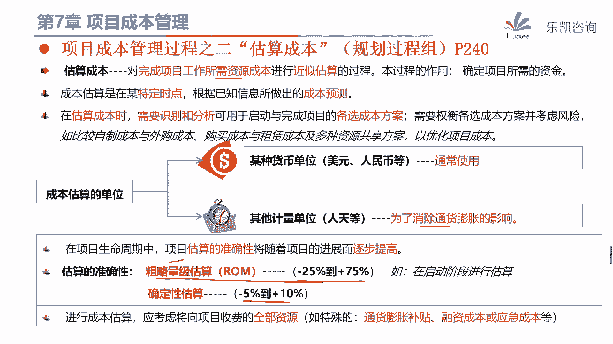

好这个东西项目的进度计划对吧，所以进度计划是一个非常关键的输入，根据我们的进度计划，我们会了解到我们整个项目一共有多少活动，分配了什么资源，每个活动干多久对吧，把它的成本都算出来。

然后做个汇总不就有了吗对吧，那么你刚刚说的那个特殊的成本，比如说利息好，利息跟什么有关，利息也跟你的进度有关系，你的进度越长，你的利息可能也就越高，所以这个玩意儿是一个非常重要的输入对吧。

这也是进度是怎么样来推到成本的对吧，那么我们以进度计划为输入，接下来我们怎么去做近似的估算，怎么去估成本呢，好看工具，这些工具呢不用讲，你会发现非常的眼熟，比如说类比估算对吧。

之前我们讲这个工具是用来估时间的，现在估成本也可以呀，昨天我吃了一顿饭30块，今天还是去这家餐厅吃这个饭多少钱，一拍脑袋30块，速度快，成本低，但是呢不一定准对吧，那参数估算也是一样的，套公式。

昨天吃一个包子两块，今天晚上我觉得我发育了，我想吃三个包子多少钱，3x2，今天晚上六块钱对吧，那么参数估算准不准，取决于基础数据和你的参数模型。

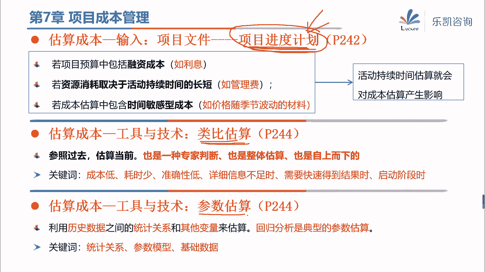

它是不是成熟对吧，那么还有最准的一种方法，仍然存在自下而上的估算对吧，从细节汇总汇总得到整个的成本，包括考虑到风险和不确定性三点估算对吧，最悲观最乐观，最可能用贝塔分布去算一算是吧，这些我们都讲过好。

另外当然考虑到风险，我们也要做储备分析，那么接下来我们着重再复习一下储备分析好，大家还记得储备分析里面的储备分为哪两种吗，一种是应急储备，一种是管理储备对吧，而且我们上一节课说。

项目经理可以直接使用应急储备，用管理储备呢要走变更对吧好，那么接下来这一节课我们再复习一下，应急储备和管理储备的区别，如果对这块不了解的同学。

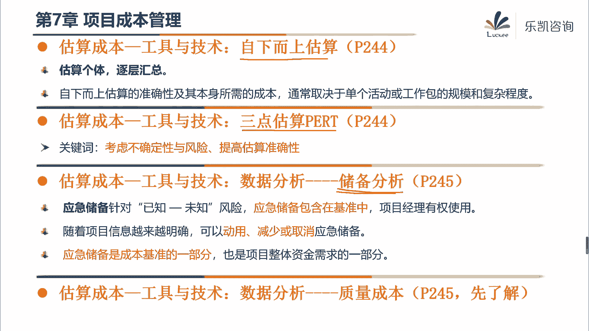

我们再认真听一遍，好吧好，接下来我们举个例子，现在呢我们呢在疫情呢在逐步的放开对吧，那么我希望呢今年呢会有一个很好的一个变化，对吧啊不像去年那样，那么今年呢如果说大家有机会到上海来玩。

可以到乐凯来看一看对吧，那么比如说真有一个同学来了对吧，那么特别还是个男同学对吧，那么一般来说出去吃个饭总比较正常吧，那么假如说要做这样一个项目，我就要去估成本啊对吧，那么估了成本之后。

我就要去获得批准吗，好比如说唐骏同学对吧，谭俊同学很在意包不包饭，那么谭俊同学来了，那么我在想跟这哥们儿吃饭大概要多少钱呢啊，两个人点菜，我估计要300块对吧，喝酒120块差不多对吧。

三瓶江小白差不多吧，我也不喝酒对吧，你一个人干三瓶好，吃完饭之后我再送他回酒店，打车100块，这是我对这个项目成本做的一个估算对吧，那么这里面估下来是多少呢，这里面估下来应该是520块钱好吧。

那么但是我有一个大家注意啊，我有一个风险，或者说我这么说，我意识到，或者说我想得到的是有这样一个风险，我跟谭俊同学从来没有见过面，我也不知道这个人酒量好不好对吧，这120块钱喝酒够不够呢，我不知道对吧。

那么这种风险首先是我想得到的叫已知风险，那么你说这种风险，我需要用什么手段来解决它吧，哎呀我想想算了，我也不想费那个脑子，我也不知道有什么好办法来解决这个风险，那么很简单，怎么办呢。

我留点应急储备不就好了吗，这样吧，我呢考虑到这个风险，给他留80块钱的应急储备，那么最终我算一算这个项目的成本是多少呢，好520的吃饭，然后我考虑到的风险呢，要留80块钱的储备，一共是600块好。

那么最终我跟我老婆打电话申请申请多少钱，那么我到时候呢我就会跟我老婆这么说，今天晚上我要请我的一个学员吃饭对吧，那么一共要600块钱，那么我一项一项报给你听，我的估算依据是什么，这大家注意啊。

这个成本不是你一拍脑袋就说出来的对吧，你要有估算依据的啊，有的人说张嘴就申请1000哈，这个不行，1000是没有依据的对吧，那么你一项一项要报啊，那点菜300，喝酒120，打车100。

那么我第一次跟他吃饭，也不知道他酒量怎么样，我呢还要多留80块钱，所以一共是600块，这是我的估算依据，对吧好，那么最终批准了之后就形成了成本基准，好大家注意成本基准是获得批准之后的成本。

我们把它叫成本基准，那么这个时候这个项目的成本基准是多少，大家注意这个项目的成本基本是600，对吧好，那么接下来我就口袋里面装了600块钱，请唐骏同学来吃饭了，好那么大家注意看这种情况啊。

在做项目的时候，我按计划点了300块钱的菜对吧，然后呢点了三瓶江小白，结果呢谭俊同学一下子三瓶全部都干完了，然后他跟我说，jim老师酒逢知己千杯少对吧，我还想再来两瓶，好那么请问他还想再来两瓶。

这个风险我当时考虑到了吗，我当时考虑到了对吧，我就知道啊，这小子酒量应该是不错啊，好在我当时怎么样，好在我当时为这个风险就留了80块钱了对吧，好出现这种情况怎么办，我口袋里面有这笔钱。

我就直接拿出来用就可以了，要不要走变更，不要走变更，直接拿来用，所以说大家现在有没有理解这句话，因为应急储备啊是针对这个已知风险的，是在我的原计划内的，那么既然风险发生了，我就有权使用。

而且不要去做变更对吧，所以这边我就直接动用了这80块的应急储备，那么这是第一种情况了，对吧好，接下来第二种情况，假如说谭俊同学跟我说，哎jim老师今天跟你聊的很开心对吧，酒也喝完了，要不这样吧。

我能不能再来一瓶，好大家注意啊，一瓶江小白是多少，是40块钱，那么当时我是预留了两瓶江小白的量，80块对吧，那么你只要用40块了，那么还多了40块怎么玩，怎么办呢，唉有人说加个菜不行。

因为原计划里面就这么多菜，对吧好，那么我们只说这40块的事情啊，多出来的40块怎么办，大家注意，我要减少应急储备，这个40块你先留着，回家之后你怎么办，最终这个项目做结束了。

回家之后你要把40块退给你的老婆啊，我这个应急储备没有使用，只用了40块钱吗，还多了40块吗对吧，那么至于说诶，有的同学说我能不能用这40块去买包中华呢，不行，明白吧。

因为如果你要用这40块去做别的事情，这个是不行的，是专款专用的对吧，那么如果你要用也应该是这样，你把这40块先退到一边，然后你买中华的钱要另外走管理储备去申请，要一码归一码，好吧好，这是第二种情况。

第三种情况，假如说啊，谭俊同学三瓶酒喝下去就够了，这预留到80块钱，一毛都没用，那怎么办，如果你一毛钱都没用，那么整个80块就要把它取消掉，对吧啊，我这个这个风险没有发生，那么没有发生怎么办。

那么这个应急储备我们就要取消，所以说他这边才有这句话，应急储备项目经理有权直接使用，不要走变更，那么我们要根据实际情况去干什么，去动用，减少或者不发生，就取消应急储备好吧。

那么这个时候有同学又问了另外一个问题，他说嗯，那么假如说谭俊喝完原计划的三瓶之后，说酒逢知己千杯少啊，我还想再来三瓶，好大家考虑一下这种情况怎么办，我当初是预留了两瓶的储备，一瓶40嘛，两瓶80对吧。

结果呢这哥们儿说我还想再来三瓶，那怎么办呢，马上有同学反应过来了对吧，那么这里面有两瓶是在我当初的计划内的，我是考虑到这个风险的对吧，那么多出来的这一瓶怎么样，那么大家注意，其实一个很简单的道理啊。

多出来的这一瓶它很显然不在计划内，不在计划内，不在计划内的，那么我们就要走变更去处理，理解这个意思吧，那么这个是应急储备的这几种情况对吧，那么总的来说，正常情况下，我们应该动用减少或者取消应急储备好。

喝完酒之后，我送他回家了对吧，你喝多了嘛，我也不放心，他一个人回去啊，那么我再用原计划的100块钱打车送他回家，好在回家的路上，他坐在后排窗户一开，吹了点冷风，有点不舒服，吐了。

把人家的车子吐得一塌糊涂对吧，那么开车的师傅不开心了，你把我车吐成这样怎么办，我要洗车对吧，那么洗车要多少钱，要150块钱，那么请问这种风险，我当时想到了没有呢，我也没想到啊对吧。

吃饭的时候谭俊同学这么能喝，我以为他酒量真的很牛，哪知道实际上它是一个小趴菜对吧，在车上的风一吹就吐了，靠这种风险叫什么风险，叫未知风险啊，我没想到会出现这种情况是吧，风一吹就吐了，洗车要150。

那么我原计划里面有没有这150呢，没有啊，这是一个未知风险啊，好遇到这种情况，那怎么办，那我只能走变更流程，申请150块钱的管理储备啊对吧，所以说管理储备他不在基准里面，项目经理如果要要使用。

你就要走变更流程，就要走变更流程好，那么这里大家能不能明白应急储备和管理储备，为什么一个要变更，一个不要变更对吧，因为应急储备在原先的计划里面，就想到的就安排好了，所以就直接用不要变更了。

管理储备在原来的计划里面是没有的，想不到的，所以你只能做计划外的变更对吧，但是这里还有一个很关键的点，大家要注意啊，假如说你走了变更流程，用了这150块的管理储备，那么意味着什么。

意味着你这个项目的成本要多，加上这150块钱，这个能够理解吧，唉比如说原来我这个项目，一共是600块的成本对吧，那么现在在车上吐了，又花了150块钱去洗车，那么这个时候这个项目的成本就不再是600。

就变成了750对吧，你走了变更流程，用了管理储备，那么你的成本记者就从600变成了750好吧，那么希望这个例子大家能够牢牢记住。

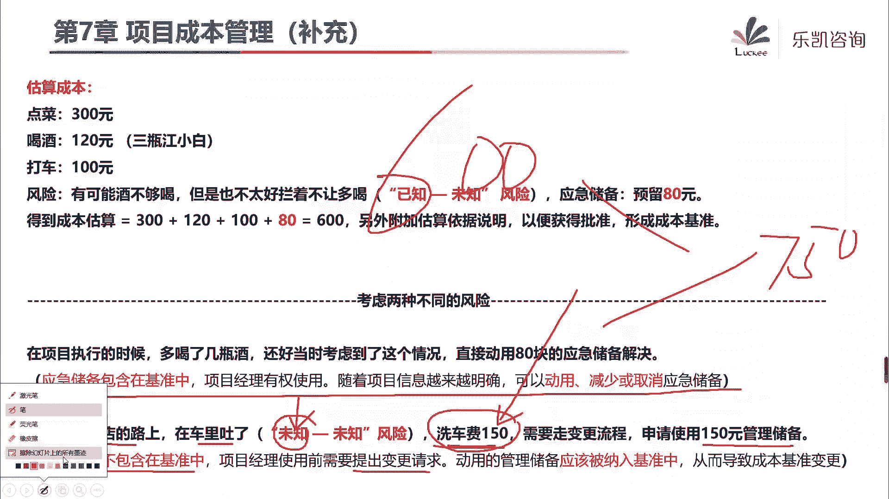

其实很简单对吧，就这么回事儿好，那么接下来我们看估算成本这一边。

他可以估什么啊，他说在估算的时候啊，如果我们想到一些已知风险，就是我们能想到的风险，那么接下来怎么办，我们可以针对这一部分风险来估，所以在这边的储备分析，他只讲了一种，他说我们可以估应急储备对吧。

针对已知风险留一些一起储备，那么应急储备是成本基础的一部分对吧，随着信息越来越明确，项目经理可以动用减少或者取消应急储备对吧，那么应急储备项目经理是有权使用的，也就是说在估算的时候。

实际上在这个过程有没有考虑到管理储备呢，它其实至少在第六版的篇幅报告里面，他没有再说到管理储备的事，那么这是第六版相对于老版本的一个改变，我个人认为这个改变呢是很正确的，因为未知的东西也谈不上孤对吧。

你要孤只能针对已知的东西去估，这个是可以的，好吧好，那么还有一个工具叫质量成本，那么这个成本呢我们这边呢先放一放，我们第八章会讲，那么也就是说我们为了做一些提高质量的啊，一些活动啊。

比如说做一些培训啊啊，或者说采购一些可靠的设备啊对吧，或者用一些什么测试的手段啊，那么会带来一些成本，那么这部分叫质量成本，我们在第八章再去讲这一块好吧，那么最终这个质量成本。

也要纳入到我们的整个成本里面，那么通过这些工具。

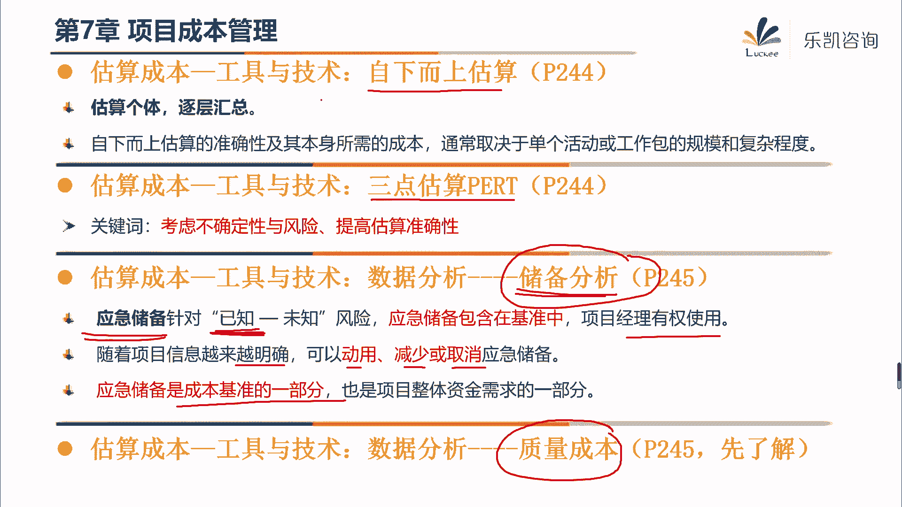

我们最终做完了之后，我们就得到了什么东西呢，得到了我们整个项目的成本估算对吧，当然一定要注意，成本不是拍脑袋就出来的，我们每一条估算都是有清晰的，完整的依据的对吧，我们都是有依据的好，那么估完了之后。

就得到了我们整个项目的一个成本的，近似的估算，那么有了近似的故障，接下来怎么办，接下来我们就要建立一个经批准的成本基准，我们需要获得批准对吧，你估是孤了，你也有你的依据拿出来了，那么最终还需要批准吗。

需要相关方去批准对吧，那么怎么去批准呢，好书录里面他提到，如果你要采购一些东西，采购的东西可以根据合同到那里面去算对吧，那么除此以外，怎么去建立这个经批准的成本的基准呢。

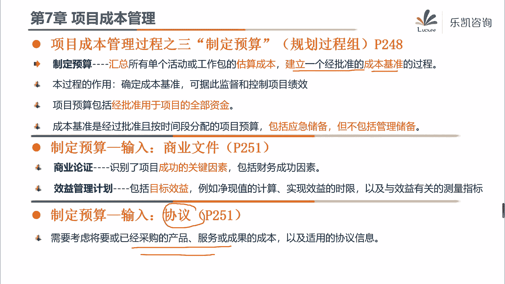

他提到了这么几个工具，首先第一个成本汇总啊，你刚刚对活动成本做了估算，你可以把活动汇总到工作包，汇总到控制账户，汇总到整个项目对吧，实际上大家有没有发现啊，这边所谓的做成本汇总。

其实就等同于是哪一个工具呢，就等同于是字什么，你看活动到工作包到控制账户，到整个项目自下r，实际上就是自下而上去汇总汇个总对吧，好汇总汇总好了之后，接下来他做了一件事，他说我还要做数据分析。

那么做什么数据分析呢，他说我们要考虑管理储备，管理储备呢不包含在基本当中，但是大家注意，一般我们做项目会预留一部分管理储备好吧，那么像我以前做项目啊，比如说如果你汇总好了之后，发觉整个项目的成本啊。

比如说比如说啊是500万，那么在这个基础上，不是说我们就一点没有空间的，我们心里要知道，每个项目都会可能有一些突发的情况，所以在我们公司里面，一般会根据不同的项目预留多少呢。

大概是预留8%到15%的费用，会预留在这一边，就是500万里面，8%到15%，不同的项目会有不同的这个一部分的比例，那么这部分钱管理储备，管理储备是预留在那边的，项目经理是不能用的，那么你要用怎么办。

你要用就要走变更流程对吧，所以动用管理储备，那么你要走变更流程，你就会引起成本基准的变化好吧，那么在这边他考虑到要预留一些管理储备，好吧，哎就像有同学说的，有点类似于叫不可预见的费用。

不可预见费用好吧好，那么接下来另外我们在可以根据历史信息，比如说参数估算类比估算来做一些验证，做一些调整，当然我们还要考虑资金限制平衡好。

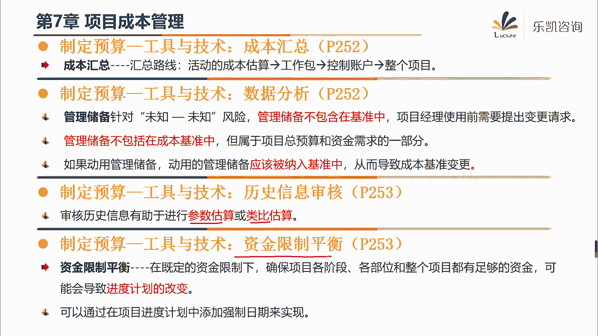

那么接下来我介绍一下资金限制平衡的意思啊，那么大家要注意我们做项目它的成本投入啊，它不是一次性投入的对吧，做过项目的同学会知道我们的成本，比如说我们要给供应商付款啊，或者怎么样啊。

我们一般是分阶段的对吧，而第一个阶段投入多少成本，第二个阶段，第三个阶段它是分阶段投入的，那么为什么要考虑资金限制平衡呢，好假如说我现在公司里面有a，c3 个项目对吧，那么这三个项目呢它是这样的。

现在是1月份对吧，后面2月3月，那么在1月的时候呢，a要投入80万，要付80万的钱付出去，b呢要付50万出去，c呢可能要30万对吧，好2月呢后面的钱呢稍微少一点，是50啊。

30 十到了3月呢变成了40啊，25，好那么公司的领导一看，1月份一共要付多少钱啊，这三个项目一共要付160万，那么这个时候大家有没有听说过一种说法啊，他会跟你项目经理说，这个月c项目我们付不了。

那么项目经理就问了，诶，为什么c项目付不了啊，好他可能会说这么一句话，他说因为这个月啊额度超了，他说我们公司有这样一个规定，什么规定呢，就是每个事业部每个月的付款，他不能超过120万，对吧我最多啊。

比如说或者说130万啊，我们每个月的额度付款不能超过130万，所以说我只能付了a负了b，那么你的c呢我就不能付了，好问一下大家有没有听说过这种说法，就是我们一个部门对吧，或者一个事业部。

我们每个月的支出它是有一个额度的，不能超出这个额度，听说过吗，如果听说过的同学，能不能说一下，为什么我们每个月支出不能超过这个额度，咳咳咳，按照道理讲，你该付就付啊对吧。

你这个东西你不付就会影响我的项目的实施啊，有这个说法吗，啊很多同学说我听说过这个说法对吧，哎比如说我们每个月或者每个季度，我们付款一共的额度是多少，不能超过这个额度对吧，哪怕公司说才有钱。

我们也付不出来好我们为什么要这么做，好有人说到税的问题，其实倒不是税的问题啊，其实他这么做是为了保证一件事，保证什么事呢，保证公司的资金流要健康，保证公司能够正常的运转，那么大家想一想啊，如果有一个月。

比如说1月份他付的钱不加以限制啊，能付的都付，那么这个时候就有可能出现一个什么情况，就有可能出现付到最后你的公司的账上呢，没钱了对吧，那么没钱了之后，你的这个公司这个月的工资怎么发呀。

特别是这个月可能还要发年终奖了对吧，你这些钱哪来啊，那么你这样就会导致公司怎么样呢，他的资金周转不过来，所以说为了保证公司的资金是健康的对吧，而资金流是健康的，或者说保证公司正常运转。

我们希望要做到一件事，做到一件什么事，就是每个月的支出不要有大起大落，每个月的支出怎么样呢，尽量要平衡对吧，所以我们叫资金限制平衡，那么说到这里，这感觉这个理念有点像我们上一节课，学到的一个东西啊对吧。

上一节课我们对资源的复合我们也有一些要求，不希望忙的时候忙的要死，闲的时候闲的要死对吧，所以说减少资源负荷的变化叫资源平衡，那么这边我们希望资金的支出也要健康对吧，不要一下子很多，一下子嘛又很少。

我们也需要什么呢，资金要有限制，资金限制平衡对吧好，那么问题来了，道理我们是知道的啊，要保证我们组织的正常运转，我们这个部门每个月的额度只有130万，那么意味着a可以付，b可以付。

他们的工作可以正常运转了，那么c付不了怎么办，哎我c这个活动我要钱付不了，那怎么办，你付不了，就意味着你这部分工作怎么样呢，你就做不了，那你怎么办，他说你这个c你要么放到下个月去付，放到下个月付。

那么就意味着你下个月才能开展相应的工作，这会影响到什么，这会影响到进度，或者我们应该这么说，我们只能通过调整进度来解决资金的问题对吧，比如说你放到2月份，当然了，如果你牛逼，你也可以这么做，怎么做呢。

在去年的12月份就把这个事情搞定了，这个也有的，比如说我以前在做项目的时候，我们我跟大家关系都很好对吧，我们商务那边一般会打电话通知我，他说诶，那在12月份的时候就会通知我兄弟，下个月我们付款很多啊。

有可能要爆掉的对吧，你有没有什么要付款呢，你赶紧跟我说，我这个月帮你把流程走掉，你放到下个月可能付不出去哦，好那么我就看一看，来你先帮我把这个付掉也可以明白吧，总之你反正是要变什么，要变进度的。

所以说我们看p p里面说的这句话。

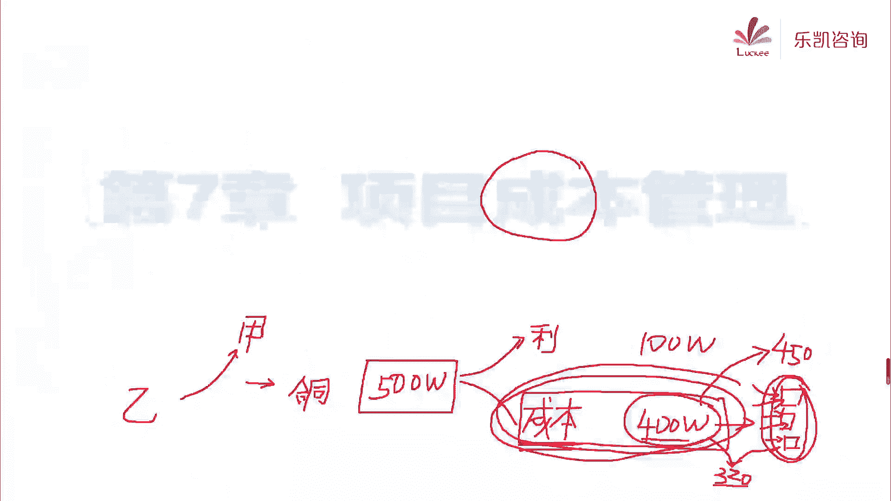

实际上意思也很明确，他说在既定的资金限制下，为了确保各个部分都有足够的资金，我们要做资金限制平衡，那么你怎么去调整这个资金的支出呢，那么只能通过在进度计划中添加强制日期，比如说我们刚刚说的。

c c不得早于2月1号开始对吧，那么通过这种方法，也就是说通过改变进度，来避开资金的这种大量的支出，好吧，这个叫资金限制平衡，那么这个概念稍微了解一下。

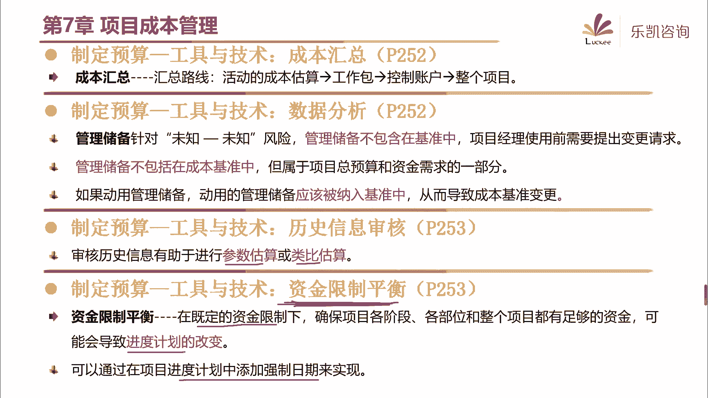

那么我们通过这些工具啊，我们汇总了一下成本，考虑到了储备管理储备，然后呢做资金线的平衡，那么最终获得批准，就形成了我们项目的总预算，那么我希望大家啊，其实成本这一块大家记住这张图是比较好的。

我们看一看其实项目的成本是怎么来的啊，很简单，我们项目从需求到范围到w bs到工作包，最终变成活动对吧，项目最终是由活动，一个一个把可交付成果做出来的，所以活动有活动成本，对吧。

然后接下来在活动的基础上，我们考虑到储备应急储备好汇总到工作包，那么在工作包的基础上，看一看有没有什么风险是已知的，考虑到应急储备汇总到控制账户，控制账户呢我们在第五章提到过一嘴。

大家呢可以看也可以不看对吧，总之汇总到整个项目形成了什么，其实这一块呢形成了成本基准，对吧，那么在成本基准的基础上，我们预留了一部分的管理储备，那么这两部分形成了我们整个项目的总预算。

或者叫项目的总资金，明白吗，所以说从通过这个图，大家会知道成本，或者说整个项目的资金总需求是哪来的，那么另外还有一点要注意的，管理储备，它和成本基准没有包含的关系，好吧，那么接下来我们看这道题目。

项目a的成本基准是100万，应急储备，20万，管理储备10万，那么这个时候在做的时候呢，发生了一个未知风险，那么当然走了变更流程，用了4万的管理储备好，我问一下这个时候成本基准是多少，能不能算出来。

好有几个同学马上算出来了，说这个时候成本金额是104，好有没有不同意见，好有同学是说124，对吧好，我说一下啊，正确的答案应该是104，那么这个细节啊，我再帮大家巩固一下。

一定要注意这个项目成本基准是100万，应急储备是20万，其实这句话是句废话，大家发现了吗，为什么说这句话是句废话，大家一定要注意，应急储备是包含在最终批准的成本基准里面的，你看这张图。

也就是说实际上这个项目它是什么情况，成本基准包含应急储备，这下面这一块一共是100万，然后预留了10%比例的管理储备，10万的管理储备，也就是说整个项目的总预算是多少呢，是110万，对吧。

所以这个细节要注意的，很多同学说这20万把它算上去，一共是120，不对的啊，成本基准是100万对吧。

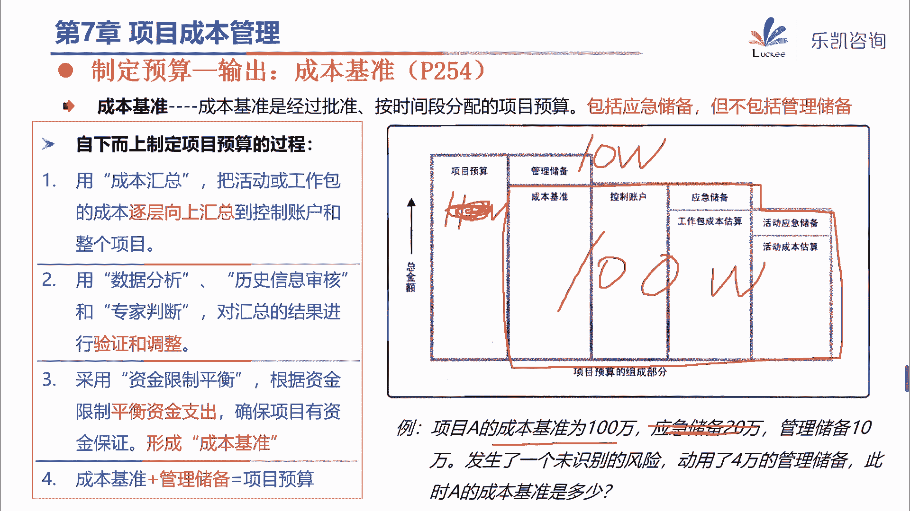

只不过这里面包含了20万的应急储备好，那么接下来管理储备10万，你用了4万的管理储备，那么这里要注意啊，我们刚刚说管理储备你用了多少，你用掉的怎么样，也要作为已经形成的成本，要纳入到成本基准对吧。

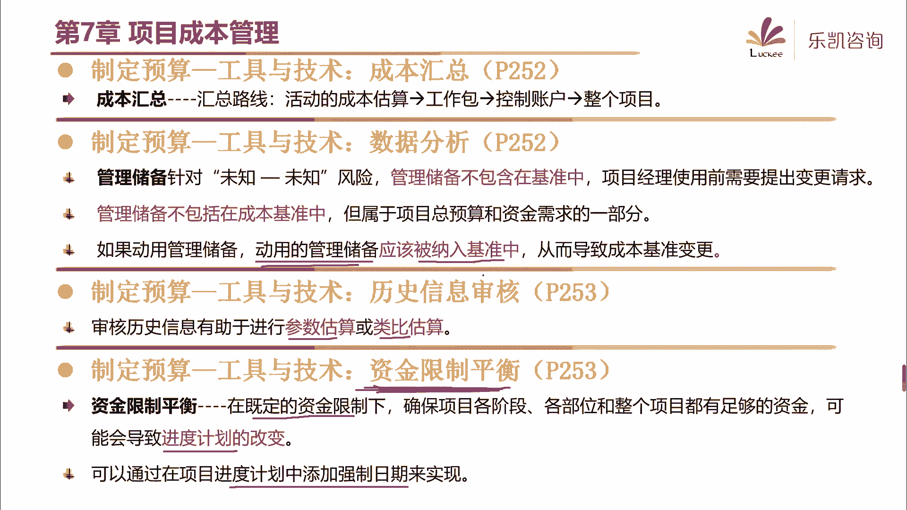

所以会提变更请求吗，用管理储备吗，好也就是说你用了4万的管理储备，那么管理储备就变成了还剩6万，那么你用掉了4万要算在什么地方，要算在这个里面，因为你用了呀，你用了就是客观事实，就是成本。

所以这个时候成本基准是104万好吧。

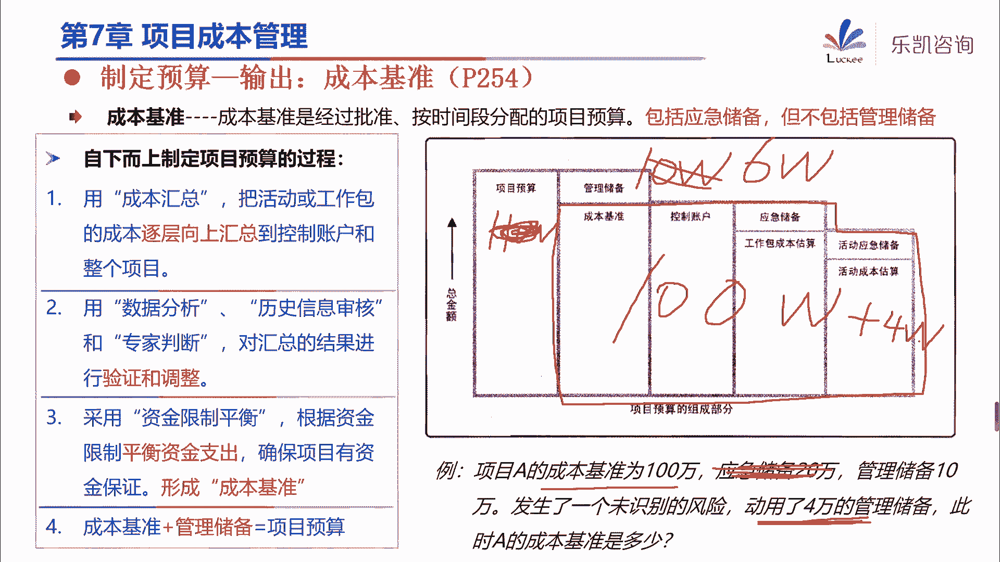

那么其实前面两个过程大家要注意的就是。

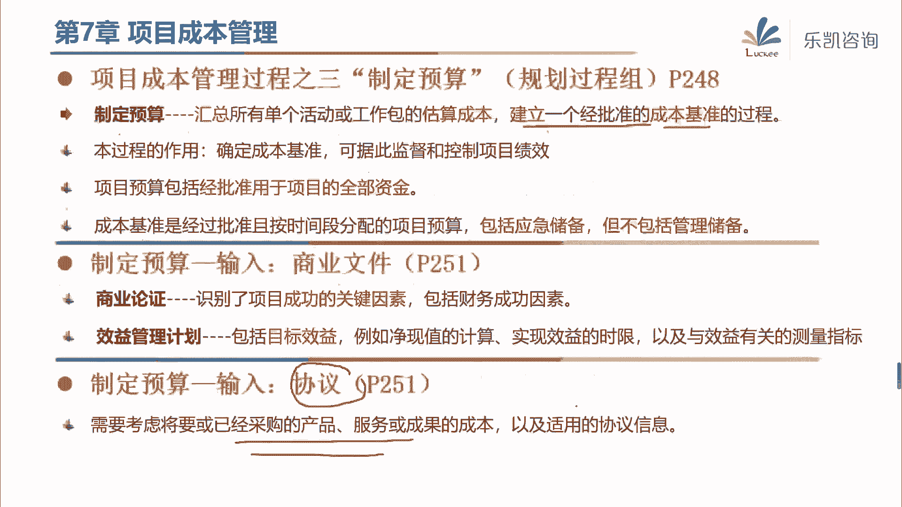

应急储备和管理储备一定要搞清楚好吧，哪个在基准里面，哪个不在基准里面，包括管理储备用了，我们要怎么处理好吧，那么这个过程最终我们输出了项目的资金，总需求，对吧，那么项目的资金总需求就是成本基准。

加上管理储备好，另外他说成本呢，它的累计投入啊，从一开始一直到项目结束，他应该呈一条叫s曲线，知道一下这样一个概念啊，s曲线，好吧，然后接下来我们在上一节课讲过一个活动，它是由最早开始对吧。

还有一个最晚开始，如果你按照最早开始来做呢，有这样一条s曲线，当然你如果按照最晚开始来做呢，有这样一条s曲线，那么这两条放在一起像一根香蕉一样的啊，就是所谓的香蕉图，这两个呢稍微了解一下啊。

这个pmp考试里面曾经提到过一次，说哪个图跟成本是有关系的，其中就说到了s曲线。

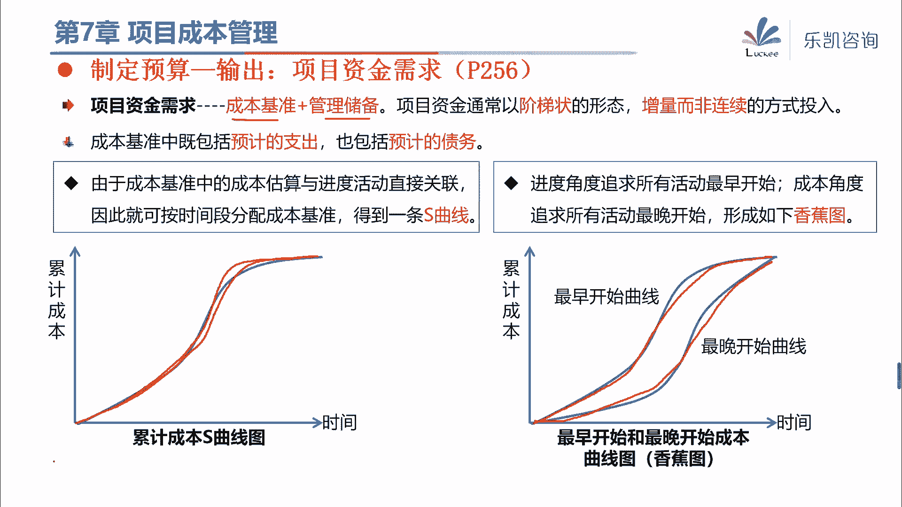

稍微了解一下这个概念好吧，那么这时候这两个过程估算成本和制定预算，好吧，那么刚刚有同学问了一个很细的问题，我这边呢稍微说一下啊，有同学说我感觉这张图有点不太对，他说其实在活动的基础上已经考虑到了风险。

留了应急储备，为什么把活动汇总到工作包，又要再次考虑工作包的应急储备呢，那么这里面呢其实实际上涉涉及到一个问题，我们在第11章会讲对吧，就是整个工作包的风险，是不是就是简单的。

每个活动的风险的累积的总和呢，大家要注意啊，其实不一定，其实不一定，因为风险和风险之间会导致情况更加的复杂，能够理解这个意思吧，我们在第11章讲的时候会讲，整体风险不仅仅是单个风险之和。

比如说举一个例子啊，我在11章讲风险的时候，曾经举过这样一个例子，说有一个孕妇对吧，孕妇呢他感冒了，有没有风险，感冒不管对于任何人来说都是有风险的对吧，发烧你就要退烧啊，要吃药啊。

但是他肚子里面有婴儿对吧，你又不能随便用药，会影响胎儿吗对吧，那么各种情况在一起就非常的复杂，所以说他在工作包的基础上，再考虑一定的应急储备，我个人觉得呢这个也没什么错，是有道理的好吧。

所以这边呢大家只要知道，成本计算里面是包含应急储备的。

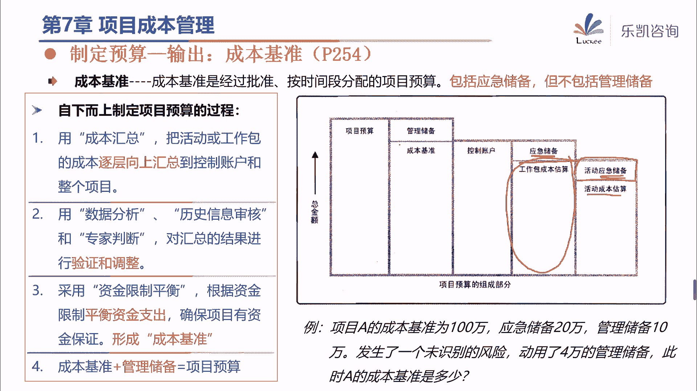

但是不包含管理储备，好吧好，那么到这里为止。

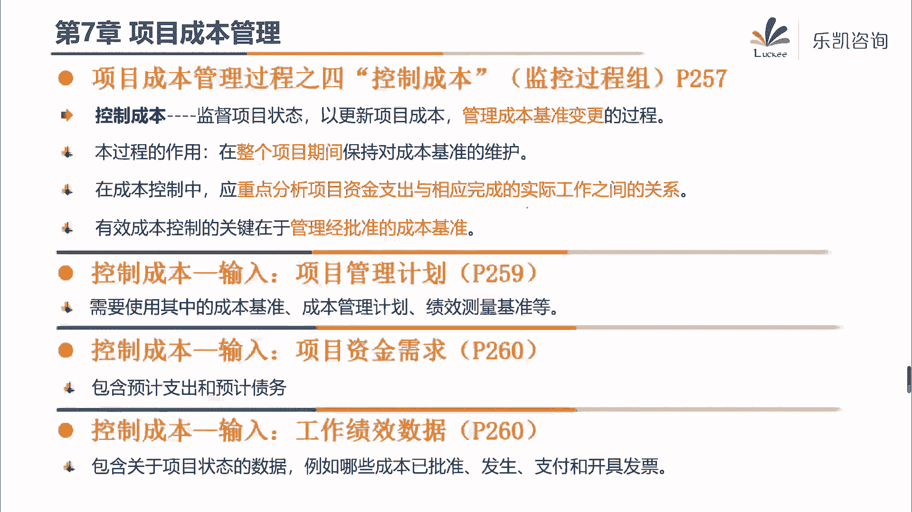

我们就得到了成本基准，只要获得批准，形成了成本基准，那么将结合管理储备就得到项目的资金总需求。

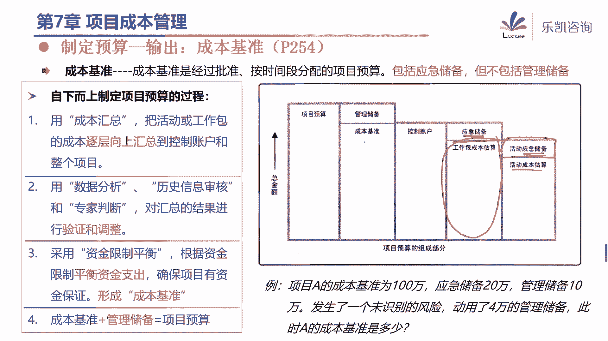

或者说叫项目的总的预算，好吧好，那么这两个规划过程比较简单，那么接下来我们就按照计划去做相应的活动，同时我们在做的过程中要干什么。

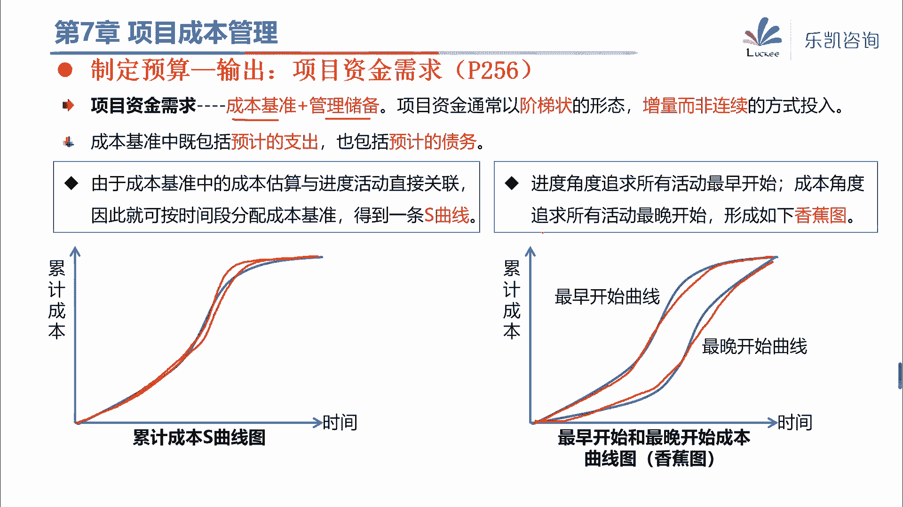

要去做一件事情，叫控制成本好，接下来这个过程是我们这一章的重点，什么叫控制成本，控制成本就是监督项目状态更新，项目成本管理成本基准变更的一个过程对吧，那么这个过程主要涉及到什么呢，政治管理。

那么今天我们先学前面的一部分。

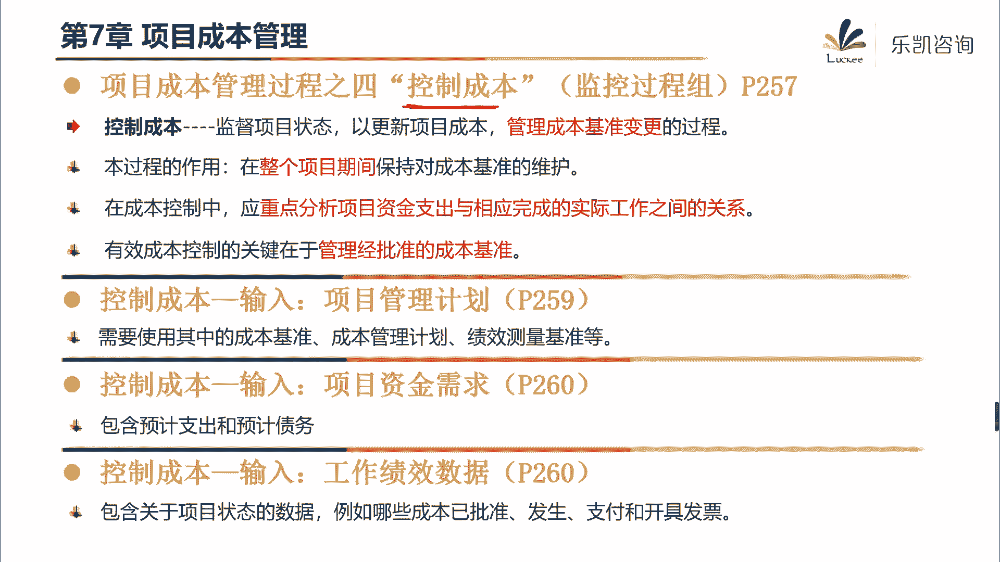

那么在学政治管理这套方法论的时候，首先有四个基本的数据，大家要注意啊，从现在开始要仔细的去听好吧，第一个叫b a c，它是一个缩写，叫budget it completion，完工预算。

那么这个完工预算呢注意我们不考虑管理储备，那么既然不考虑管理储备，就意味着它实际上就是我们刚刚说的成本基准，好吧，那么接下来还有三个值，这三个值是什么意思呢，我们在某一个时间点啊去监控成本。

那么在这个时间点我们就要得到这样一个值，第一个叫pv，什么叫pv，就是到目前为止我们计划做多少，第二个叫ev，就说我们到时到这个时间点为止，我们实际做了多少，还有一个就是ac我们花了多少成本。

花了多少钱，那么我用一个例子来帮助大家，理解一下这几个字，来理解一下这几个值啊，比如说我们现在要做一个项目，这个项目呢是五天，好然后呢，我们每天预计要投入100块的成本，啊就这么说吧。

我们五天要做五个包子，这个包子呢很贵，每个包子的成本是100块，整个项目是做五个包子对吧，最终我要每天交付一个包子嘛，一共交付五个包子好，那么接下来我问一下，首先能不能说清楚这个项目的p a c。

完工预算或者成本基准是多少，能知道吗，那么大家注意啊，一定要注意我们在做成本的政治管理的时候，所谓的预算就是指整个项目的成本基准，不考虑管理储备对吧，那么整个项目我们计划投入多少的总成本呢。

计划投入500块500元，好接下来在做的过程中，我也要监督我们项目的成本情况了，好这样在第二天下班的时候，那么在第二天下班的时候呢，我们要测算成本好，我问一下第二天下班的时候，我们按照计划应该做什么。

那么很明显，第二天下班的时候啊，就是到第二天，那这个时间点到目前为止计划做多少呢，那么按照计划应该是做两个包子了对吧，那么这两个包子你可以说到第二天下班的时候，pv应该是两个。

但是呢我们一般的单位是统一的对吧，我们当初在做成本管理计划的时候，我们一般会约定单位是原，那么我们就不说是两个包子，那么在第二天下班的时候，我们可以怎么说，我们应该说我们计划要做多少钱的工作呢。

200块，因为一个包子它就是100块的嘛对吧，这个叫计划好，那么实际做了多少呢，那么我们就要到现场去看一看了，好比如说我到现场一看，他们做慢了，在第二天下班的时候，我一看啊，他们只做了一个包子，对吧。

那么以为就代表什么，你已经完成了工作，我建议大家把这个e理解成什么呢，理解成乙他已经做了多少，好比如说我到现场一看，他真正做出来的包子只有一个，那么ev就是等于多少呢，100。

好那么接下来第三个值叫ac，ac是什么意思呢，就是我不光看你做了几个包子，我还看你花了多少钱，好结果呢我发现是这样的，他虽然只做出来一个包子，但是呢他是这样的，做第一个包子的时候就做坏了。

浪费掉了100块，然后又重做才把这个包子做出来，然后他想做第二个包子的时候呢，又做坏了，他一共做了三次，有两次做坏了，所以呢最终只做出来一个，那么虽然他做了一个，但是他花了钱花了多少钱呢，他做了三次。

浪费了三份材料，他花的钱花了多少，他花了300对吧，所以我们就说那么你已经花掉的钱是300，明白了，那么这个就是我们通过某一个时间点来监控，在当前这个时间点他做的怎么样好吧。

那么我希望大家在记这几个值的时候啊，根据英文去记好吧，怎么去记呢，b a c这个反正很简单，就是成本基准对吧，按照计划来说，我们应该做多少ev呢，就是到目前为止已经做了多少，这个e就是乙你真的做了多少。

那么a c就是extra cost，你实际花了多少。

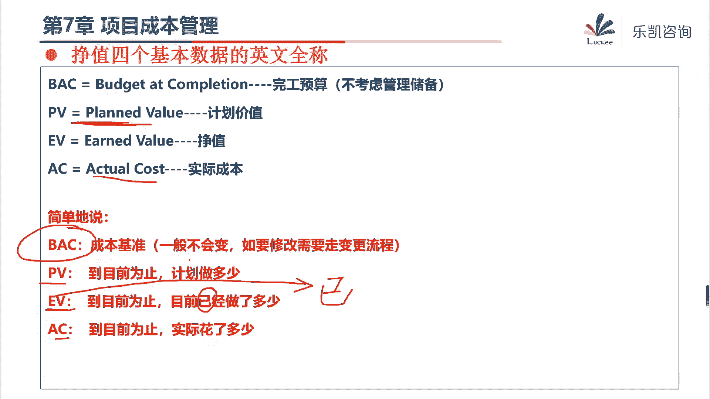

好吧好，那么接下来我们用一个例子，来看一看大家的掌握情况，看这道题目，他说我们在做一个植树项目对吧，要想富少生孩子，多种树对吧，那么这个项目呢一共要种100棵树，合计十天完成，项目的预算是1000块好。

首先bc有了，那么大家注意在政治管理题目里面，只要说到预算，我们默认就把它认为是什么呢，完工预算也就是说不考虑管理储备的对吧，那么从第一句话我就知道，整个项目的成本基准实际上应该是1000元，对吧好。

接下来他会说现在是哪一个时间点啊，他现在是第五天末，那么接下来我们通过这个时间点啊，要能够得到一个值，什么值呢，就是pv，因为我原计划一共做多少天，现在已经多少天，这能够得到什么，按照计划来说对吧。

十天重100克，按照计划，我们默认是平均分布的，那么五天做50颗了对吧，你要做一半啊，那么按照计划来说，你要做多少工作呢，我们要做500块的工作，做一半吧，一共十天，现在第五天你不就做一半吗。

好接下来注意这个词啊，一已经种了40颗好，ev等于多少，那么因为他说了已经吗，已经种了40棵，那么问题是一棵树是多少钱呢，人家当初约定好的，种100棵，1100棵树十块，你种了40棵。

那么就是40x14 百块，对吧好，然后他说为了种这40棵树啊，花了600块钱好，ac等于多少，ac很明显等于600，好我问一下这四个值找出来有没有问题，应该都没问题吧，这还是比较简单的啊。

那么考试的时候遇到这种计算题，一定要把这几个值把它准确的抓出来。

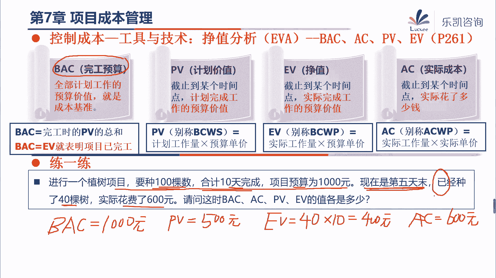

好吧好，那么接下来我们再用一些例子再来看一下啊，在一个项目实施期间，项目经理发现好实际成本，这个是什么，明确告诉你的，actual cost等于7。5万，对吧好，那么接下来项目的总预算是10万。

这个是什么玩意儿，总预算吧，就是完工预算bc等于10万，那么经过详细分析好，大家注意这个词，项目经理发现已经完成60%，这个乙就代表什么意味，好，那么e v等于多少，乙就是e嘛对吧，已经完成了。

就是意味，那么意味已经完成了60%，完成了谁的60%呢，当然是完成了项目的60%了对吧，那么项目一共总的预算是10万，你完成了60%，那么ev很明显就是6万啊，对吧好，那么接下来pv等于多少。

那么大家要注意啊，你如果要问pv等于多少，你就必须要知道两个东西，比如说我们刚刚这道题目，你要知道什么，你要知道一共多少天，现在是什么时间，你才能知道啊，按照这个比例，按照计划。

我们应该计划完成多少对吧，那么这道题目呢他没说一共多少题，现在是第几天，那么你这个pv这个计划呢，说实话确实不知道，确实不知道，那么在这道题目里面是不知道pv的好吧，那么我想跟大家说一下啊。

这些东西一定要理解清楚，一定要理解清楚好吧，那么当然在考试的时候，不太会出现无法计算这种答案，一般计算题都是能够算得出来的，好吧好，那么我们再看这道题目，再分析一下这道题目能不能找出来任务a啊。

他的意思是说我现在有一个任务a要你完成，那么完成整个任务呢，我给你留了1000块钱，好请问这个1000块钱是什么东西，做这个任务一共是十天对吧，给你留了1000块钱，那么这1000块钱是什么东西呢。

不就是做这个任务的预算嘛对吧，所以b a c等于1000，对吧，然后他说的是这样的，计划，完工日期是12月30号，总工期十天啊，也就是说这个项目呢是这样的，他从12月21号开始做，做到12月30号。

一共是十天把它做掉对吧，好现在他说已经是12月30号下班的时候了，靠这个项目一看，这个项目经理一看就是个水货对吧，他没有做好项目管理，他直到12月30号下班的时候才去看，做的怎么样好。

那么首先问一下大家，在这个时间点，按照计划来说，我们应该做多少，这他娘的是最后一天下班的时候啊，最后一天下班的时候，按照计划你应该做多少，你应该把这个项目做完了，所以按照计划来说，你也应该做1000块。

是不是这个道理，所以说大家有没有能够理解这个意思，就是说在工期的最后一天，pv应该等于多少，应该等于bc的对吧，或者叫最后一天的总的pv，你最后一天嘛按照计划应该把它做完哦，按照计划来说。

pv就等于1000了对吧，那么他做了多少呢，他说发现了才完成了70%哦，已经做了多少，已经做了百分之七十七百，对吧，那么花了多少钱呢，好花ac extra cost，花了多少，花了600。

对吧好这种题目会做吧，其实政治管理确实涉及到很多的计算，但问题是这些计算都比较简单对吧，你就抓住这个概念去抓这些值，把这些值找出来不就好了吗，还是比较简单的啊，好吧，那么如果这些东西没问题。

那么后面的也就没问题了，因为后面的就是在这个基础上做一些加减乘除，很简单的，那么比如说接下来我们再看一个工具。

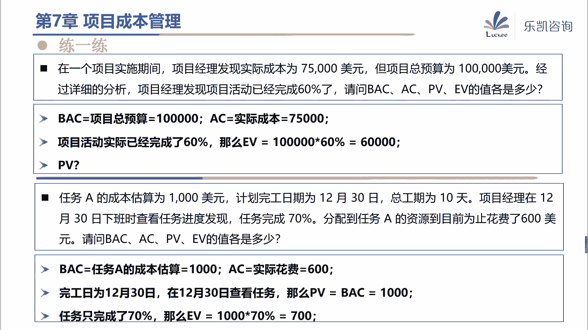

叫偏差分析，那么什么叫偏差分析呢。

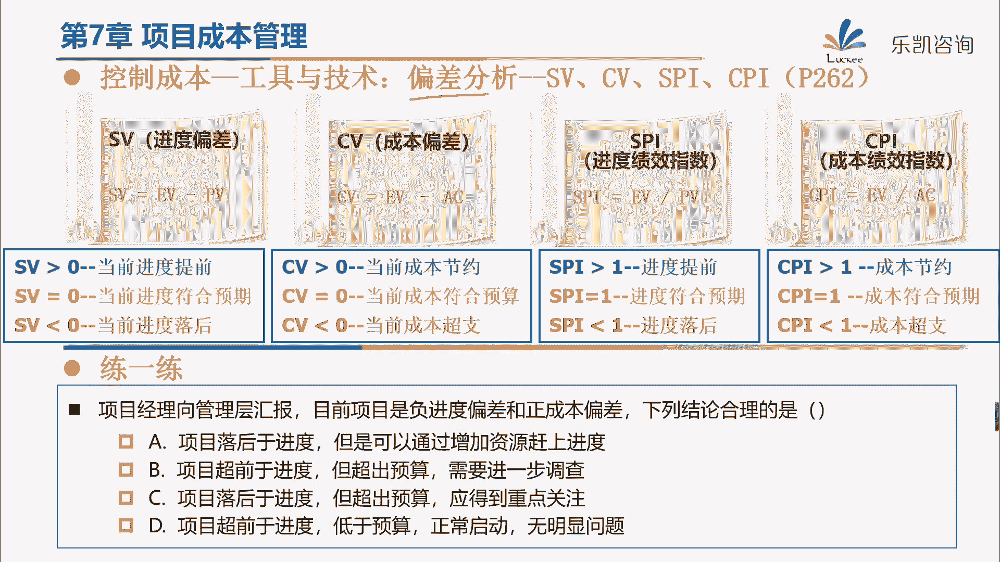

好比如说我们举一个例子，到目前为止，按照计划来说，你要做，我们找一个空白页吧，假如说啊一个项目我们找了一个时间点好，到目前为止啊，到目前为止，按照计划来说，刘玉鹏注意一下pv是什么意思。

pv不看你有没有做完，pv是按照计划你应该做多少，明白吧，你比如说到最后一天你应该做多少对吧，最后一天的pv你应该做多少，你就应该全部都做掉，明白吧好，那么接下来比如说我们再看，我们不要到最后一天再管。

这个方法肯定是不好的一种方法，那么我们中途去发现好，假如说到目前为止pv呢，你的计划是做500，那么你真正做了多少呢，好我发现意为你做的是400，好，请问这代表什么意思，计划做500。

但是你真正做了多少呢，你做了400，那么很明显有偏差吧对吧，你做的东西怎么样，这个叫比计划少，对吧，其实就是你做的慢了，这个叫进度落后了，对吧好，那么假如说ev是做了600呢，那么你做的东西就比计划多。

记录就提前了，所以我们这样啊，我们不妨用ev去干什么呢，去减去pv，如果说这个值做得比计划少小于零，那么代表进度落后，如果大于零，代表进度提前，如果等于零，代表进度符合要求，对吧好。

那么也就是说1v减pv算出来应该是什么，应该是我们的一个进度方面的偏差，好偏差叫various，进度方面的，跟schedule有关，所以我们引入了一个概念叫sv进度偏差，那么大家要注意。

s为大于零是提前的，小于零是落后的，等于零是正好符合要求的，那么同样的道理啊，我们再看你到目前为止花了600，那么你做了多少事情呢，我发现我做了500块，好，请问这是一种什么情况，我做500块的东西。

结果呢反而花了600块钱，我靠这代表什么，我问我本来计划做500吗，你应该花500啊，结果你花了600，你会发现诶ev减去ac怎么样小于零，超了成本有偏差对吧，那么同样的如果1v等于800。

哎我做800只花了600，大于零的成本节约对吧，等于零代表正好符合要求好，那么大家注意我们成本方面的偏差，叫cost variance对吧，我们用e v去减去ac。

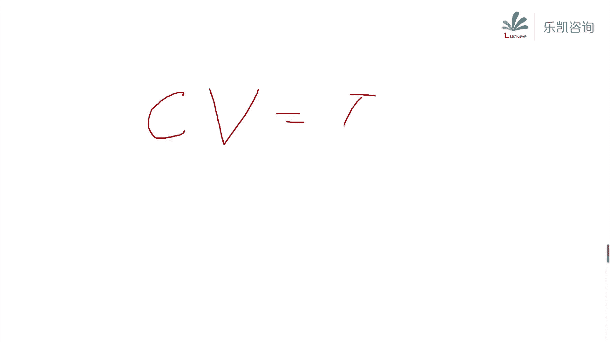

所以说我们呢出现了两个偏差，一个叫进度偏差，一个叫成本偏差。

那么我们分别呢用s v跟思域来表示，s为代表进度偏差，cv代表成本偏差，那么我们希望这两个偏差怎么样呢，大于零都是好的，要么提前，要么节约对吧，等于零就是跟计划是一致的，也可以，但是如果小于零就不好了。

对吧，那么这个也很好理解好，那么我们看这道题目。

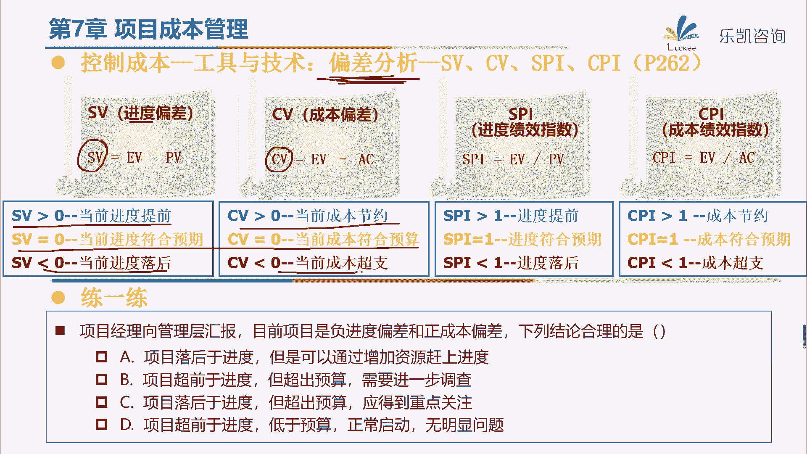

他说项目经理向管理层汇报啊，目前项目是作为负的进度偏差，说到负的就是不好的，这代表什么，这代表进度怎么样好，一定要注意，这个很简单啊，进度落后，因负的偏差嘛对吧好，然后呢正的成本偏差，成本偏差是正的。

那么正的是好事啊，好事就意味着什么，成本怎么样呢，成本节约，对吧好，那么这道题目选什么，进度是落后的，那么既然进度是落后的，b就不要选了，什么超前于进度d超前于进度也不对对吧，那么成本呢是节约的。

你就不要说超出预算，成本节约应该叫什么叫低于预算，低于预算，而不是超出预算，那么选什么，只能选a，那么我们看一下a说的对不对呢，好项目落后于进度，但是可以通过增加资源来改善进度，a说的是进度是落后的好。

什么叫做可以通过增加资源改善进度，有印象吗，什么叫增加资源，改善进度好，马上有同学网恋说，马上反应过来了，成本是节约的，我们可以花钱，对吧，成本节约了嘛，花钱来买时间，这是一种很典型的赶工的方式。

赶工的方式对吧，那么合理吗，合理的，因为成本节约了，我就可以花钱买时间好吧，所以对于这些偏差呀其实很简单，正的是好的，负的是不好的对吧，那么增加资源，实际上就是那人力资源就是加人嘛，对吧好。

那么接下来我再问大家一个问题啊，现在我们公司有两个项目，一个是a一个是b，那么这两个项目呢我们必须要停一个，因为现在年底了对吧，没什么能力了啊，一个项目不想做了，只做一个。

那么我就分析这两个项目哪一个项目做得好呢，好我了解了一个情况，关于这两个项目的成本偏差，cost variance是这样的，a项目的成本偏差是负的，1万，好，请问这代表什么意思，很简单。

好b的成本呢是这样的，负的2万，那么这代表什么意思呢，继续做，我应该选哪一个，那么有同学说相对而言，那么a要做的好一些呀，a到现在只超了1万，但是你b的到目前为止你成本的超了2万对吧。

那么相对来说不是a的成本要管得好一点吗，好接下来我进一步了解，发现是这样的啊，a为什么超1万呢，是因为a项目到目前为止他已经花了3万，而实际上他做了多少钱的事呢，他做了2万的工作。

所以就导致了cv等于ev减ac是负的1万，简单的说就是a到目前为止做2万，他花3万，做了2万，花了3万对吧，好b项目呢是这样的，b呢到目前为止他做了2000万的工作，他花了多少钱呢，好他花了2002万。

所以呢b项目cv呢他确实超了2000万，减去2002万，他当然是超了2万了，好接下来大家看一下，我们用常识来判断一下，哪个项目的成本管得好一些，唉这个时候就发现靠从成本这个角度来说。

好像必要管得好一些啊对吧，为什么呢，你a他想让你做2万就花3万，人家b呢做2000万才花2002万了，所以我们忽然发现一个问题啊，什么问题呢，好像直接用减ev减ac判断谁抄得多，这个不太科学，为什么呢。

因为我们不知道他具体做了多少，我们要看做了多少，然后做了这些又抄了多少对吧，这两个去比较，所以我们换了一种说法，不要紧，这样吧，我们用ev去除以ac，这样是不是好一些，对吧，用这种方法就便于什么呢。

便于跨项目的比较对吧好，所以我们统一这样的把公式改一改，原来说的s v等于1v减pv对吧，cv说的是1v减ac，我们把统一换成一个是1v除以pv，一个换成ev除以ac，那么这两个算出来有点像一个值。

那个叫比例一样的对吧，我们把它叫绩效指数，那么绩效指数进度方面的叫schedule，schedule，performance index对吧，那么performance index就是绩效指数。

那么成本方面的是cost performance index，那么原来我们希望这个suv要大于零，cv呢大于零是好的，那么同样的，我们现在希望s p i和cpi怎么样呢，我们最好要大于几呢，大于一对吧。

e v要大于pv吗，e v要大于a c吗，那么除一除不就是希望它大于一吗对吧，所以为了方便跨项目的比较，其实我们后面用的比较多的用的是这两个，一个是s p i，一个是cpi对吧。

那么只是把减改成了除大于一是好的，等于一符合预期，小于一，成本超值好，那么接下来我们看这道题目，你负责的网络延伸项目被告知一切处理，前任项目经理呢用偏差方法来汇报状态，对吧好。

那么在最近的一次报告中显示，s v等于5000，cv等于1000，好我问大家一个问题，sv等于5000，它是正的，大于零的进度提前了，那么说明spi应该怎么样，s v大于零，说明1v减去pv大于零。

那么spi ev除以pv他应该大于一了对吧，那么同样的道理，他说c v等于1000美金诶，cv也是大于零的，那么也就是说ev减去ac是大于零的，那么cpi也就是1v除以ac，也应该是大于一的对吧。

那么两个都是大于一的，把这个b选出来对吧，那么当然如果按部就班的算，能不能算呢，也能算的对吧，那么1v减去pv是s v嘛，那么关于这个公式啊，大家如果不熟悉的，回去巩固一下对吧。

那么我觉得这个还是比较简单的，那么为什么比较简单的宁波实在记不住啊，cv成本它跟什么有关，它肯定跟花费有关对吧，schedule，它跟什么有关，跟离比计划快，比计划多还是比计划少有关。

反正前面都是用1v去减的，对吧好，那么接下来他告诉你，sv等于5000，cv等于1000，好pv又告诉你了，pv等于5万，那么ev不就出来了吗，ev就应该等于5。5万，对吧，5。

5万减5万才得5000吧，那么ev是5。5，ac是多少呢，ac应该是5。4，对吧，那么你通过这样一个东西也能够去算好吧，也能够去算好吧，那么这种题目要会做啊，它比较简单，大家对这几个东西啊。

它的概念要比较熟悉啊，要比较熟悉，那么最后呢跟大家强调两点，大家要注意一下啊，第一个，pv跟ac之间是没有可比性的，这句话是什么意思啊，假如说一个项目到目前为止，按照计划来说呢，应该做100。

那么他花了多少呢，他花了200，啊那么你说这个项目是什么状态呢，那么大家要注意这个不好说，因为直接把pv跟ac去比较是没有意义的，我们去比较，不管是看进度还是看成本，一定要知道什么，要知道ev。

比如说假如你已经做了多少呢，已经做了50啊，1v等于50，那么你会发现进度也慢了，成本也超了对吧，但是如果1v等于多少呢，比如说1v等于500，那么你会发现进度也提前了，成本也节约了对吧。

所以直接比较pv跟a c是没有意义的，一定要知道e v好吧，这是第一个好，第二个还有一个问题啊，大家要注意一下的，我画一张图给大家看一下啊，我们在实际做项目的时候呢，发现有这样一张甘特图。

他一共有这么几个活动，abc，那么a呢是一天，比如说星期一做a，然后星期二呢做b啊，星期二作弊，然后c这个活动呢比较复杂，它是星期二开始一直做到，比如说星期五，对吧好。

然后接下来d这个活动呢它是星期三做一天，啊是这样的，那么它的逻辑关系是a做完了做ba，做完了做c对吧，a做完了做d，然后接下来b c d都做完啊，做下一个活动，那么现在是什么情况呢。

现在是发现这样在第二天下班的时候啊，好a做完了，b也做完了，那么c本来应该是做一天了，他没做，但是呢团队他娘的把d给做完了，好假如说每一天的工作价值都是100 100元好，那么大家看这张图啊。

到第二天下班为止，首先pv等于多少，那么从这张图我们看一下pv，就是按照计划要做多少了，那么第二天下班的时候，按计划要做什么呢，要把a做掉，要把b做掉，然后c的这一天要做掉，这是我们按计划要做掉的事吗。

好那么这个时候pv应该等于多少呢，按计划来说，pv要做a要做b要做c的第一天，那么每天的工作都是100，那么pv应该等于300，那么我们再看在第二天下班的时候，以为已经做的是多少呢。

好我发现他已经做了多少，a做掉了，这是180，b做掉了，这是180，好，还有呢他把这个做掉了，明白吗，那么不管怎么说啊，虽然原计划d不应该今天做，但是事实上那ev是什么，因为是你实际做了多少对吧。

那么我们只能这么算，到目前为止你已经做了多少钱的工作呢，好ev算出来应该是100 100，那么这个他也做了呀，300好，那么这个时候s p i等于多少呢，好s p i等于1v除以pv等于多少。

你算出来等于一对吧，那么按照我们理论上来说，s p i等于一意味着什么，意味着进度符合要求，但实际上我们看这个项目它符合要求吗，你会发现关键路径是哪一条，关键路径是ac这一条，你关键路径上的活动没有做。

你把非关键路径的把它做了，大家要注意，这仍然是有问题的，明白吧，因为c a c这条路径啊，它是关键路径啊，关键路径的你没做，这就很严重了，所以在我们p m p里面有这么一句话，大家可以去理解一下。

他说s p i仅反映总工作量，我们知道spi之后呢，在实际做项目的时候，我们还需要对关键路径单独的去分析明白吧，那么这句话的意思就是这个意思，就是说我们在考试的时候认为s p i等于一。

是进度符合要求的，但是在我们实际做项目的时候，我们还要对关键路径去单独分析，好吧好，那么今天我们课程就到这里为止好吧，我们就先学习这么多，下一节课我们在学习怎么去做预测好。

那么我问一下今天的课程有没有什么问题。

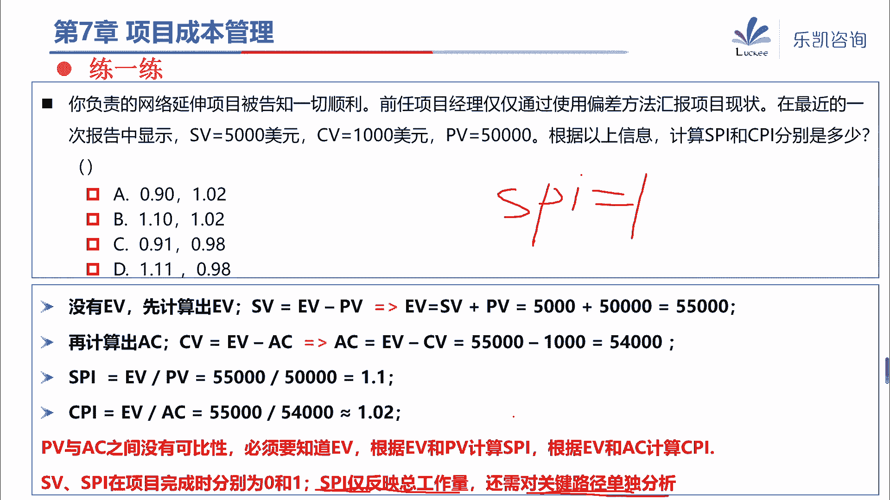

有问题的同学留下来答疑好吧，其实比较简单啊。

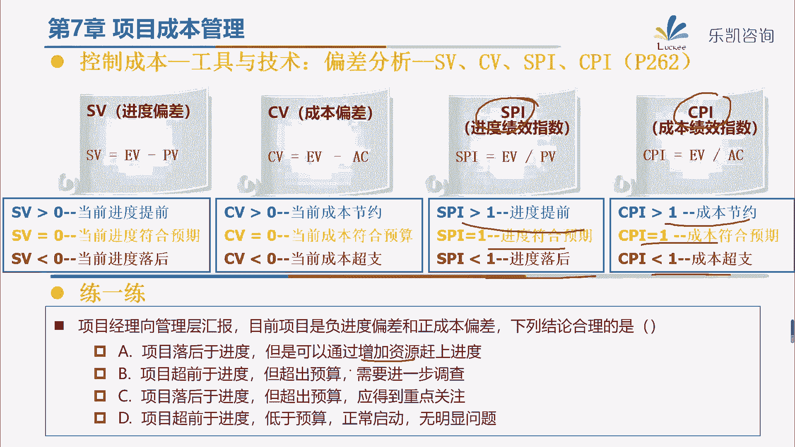

把这几个稍微的去理解去记忆就可以了，好今天讲的有没有什么问题的，正值的计算这一块啊，号称是计算里面最复杂的一块，实际上的比较简单，你把这几个记住的不就是加减乘除吗，一共就四个字母嘛对吧。

这四个字母有什么难记的呢，好李清同学说，成本和价值在p m p里面是一个价值坐标吗，这句话是什么意思，这个别称不要去关心啊，别称不要去关心啊。

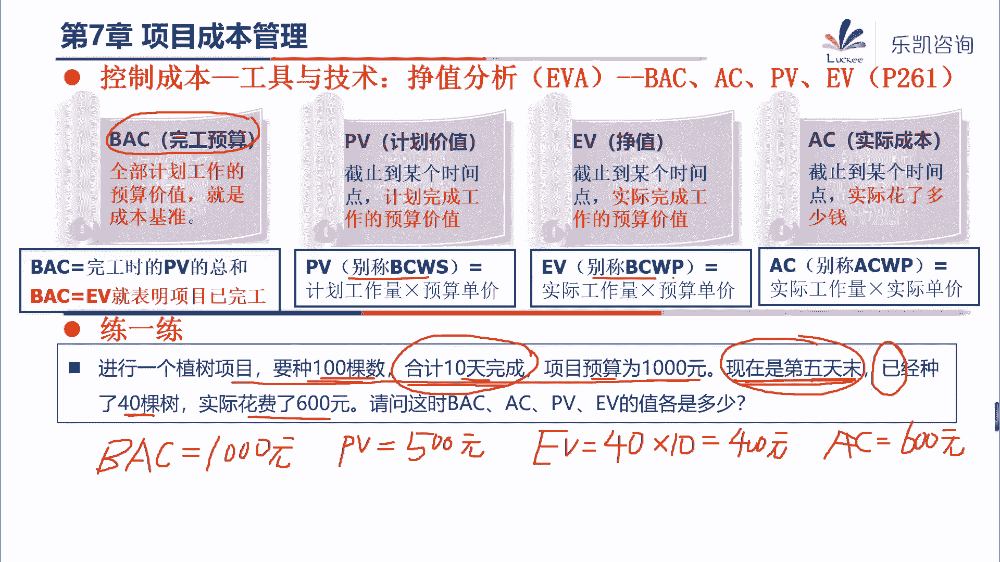

现在考试不会用这种别称的，这个章节最容易出的就是计算题啊，好关于这个，全程在讲义上是有的啊。

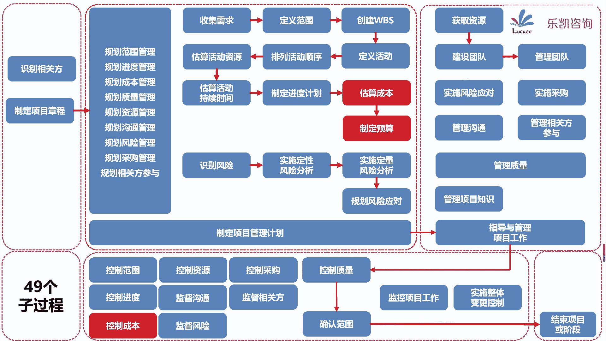

关于这个李青同学问的这个问题啊，我大致知道他是什么意思，关于这个问题，我解释一下好吧，预算和价值究竟是什么关系，就拿我们刚刚举的例子来说，我这个项目呢，项目的目标是五天做五个包子出来。

每天这个包子的成本是100块钱，把包子做出来，好，那么首先整个项目的预算我们是清楚的，预算是500块，对吧好，那么接下来每一个包子它的价值是多少，这个价值不是指我们到外面去卖给客户多少。

不是这个意思对吧，就是说我们希望用500块钱把五个包子做出来，那么每一个包子的价值，每个包子实际上是多少钱的工作呢，那么你会发现每个包子每天做一个嘛，每个包子就能100块了对吧，所以我们才说呢。

在第二天下班的时候，按照计划好，pv应该等于多少，那么pv按照计划，我们要做两个包子，对吧，那么这两个包子相当于多少的预算价值呢，五个包子预算是500块的价值，那么你计划应该做两个包子，我们可以这么说。

相当于计划应该完成价值多少钱的工作，200，是这个道理吧，是吧，所以说呢500叫什么，叫总预算或者叫总的预算价值，那么每个包子不就是100的预算价值吗，好徐小楷说价值和成本可以理解为一个概念吗。

那么徐小凯我就问你一个问题啊，这个500块叫不叫成本，叫这个项目的成本几种吧，那么我们这个项目的目的，就是把这500块的成本转化成什么，把这500块的成本转化成这五个包子，对不对，那么你所谓的价值。

我就认为你说的是预算价值，你说这一个包子多少钱，那么这一个包子就是100块钱，那么至于你最后给客户卖多少钱，那是你卖的事，对吧，那么说到这里，徐小可爱同学啊，包括其他同学，我想问大家一个问题。

大家注意听啊，我跟客户约定好，我用500块的成本，花五天时间做出五个包子，我们约定好每个包子，它的预算价值就是100对吧，好在第一天做包子的时候，我这么做的，跑到北京，我在上海啊，我跑到北京去买了面粉。

从上海到北京来回呢，我是坐高铁的，来回的高铁加买面粉的钱，一共花了我1000块钱，那么最终我也把这个包子做出来了，请问这个包子，ev我完成的工作是多少，我再说一下啊。

我们当时约定好了500块钱做五个包子，每个包子价值100对吧，那么在第一天下班的时候，我发现包子是做出来了，但是是怎么做的呢，他是到北京去买的面粉做的，来回高铁1000块钱，那么这个包子我们算多少钱呢。

已经完成了工作算多少，第一天啊，我们就说第一天，究竟算100还是算1000，好大家注意，我们只能说你这个包子已经完成的价值是100，这个1000是什么，这个1000是指你花了1000，明白吗。

但问题是不是说你花了1000，这个包子价值就是1000啊，这个价值叫什么，大家一定要注意，这个价值叫预算价值，那么什么叫预算价值呢，就是当初我们做这个项目的时候，我们的预算是500。

每个包子的预算价值就是100，你只要把包子做出来，就等于你完成了这个项目中100块的工作对吧，那么至于你花多少钱，这跟我没有关系，你不要说你去北京买面粉，你去美国买，你去火星买，那是你的事。

你最终只要是交付了，我这个包子是符合验收标准的包子，那么它就是100块的工作，就价值100，是不是这个道理对吧，这才符合逻辑啊，那么刚刚有1000的同学，我问一下，比如说你叫我帮你去买个包子。

我买好了给你，我告诉你，你要给我1000块钱对吧，为什么要给1000块钱呢，我说我去北京买了一个包子给你的，你同意吗，你肯定不同意呀，为什么，因为他妈的我心里包子一个包子就这么点钱，你说去北京买的。

我就要给你钱啊，谁让你去北京买的对吧，当时我们不是约定好吗，成本基准500吗，每个包子100把它做出来吗，大家明白这个意思吗，1v叫预算价值，他不看ac的，你ac花多少钱是你花的事，对吧好。

那么说到这里，我问大家一个问题啊，在最后一天，我发现了一个情况，1v，等于b a c，好，请问这代表什么，那么我们就根据它的含义来啊，ev就是到最后一天为止，我已经完成了多少，对吧好。

我发现我已经完成了工作，等于500，说明什么，说明项目完成了对吧，我项目已经完成了，百分之百好，那么我问一下大家啊，因为有没有可能大于b a c，我们刚刚说的那个情况是ev等于bc项目完成了，对吧。

完工了，那么有没有可能ev是大于bc的，有可能吗，不可能的，你再怎么样ev也应该最多等于b a c，那么什么意思呢，拿我们刚刚这个例子来说，一共就是一个500块的项目，一共就是做五个包子对吧。

您最多的就是把这五个包子做出来了，对吧，因为等于bc了，那么有人说好，我不但做出了五个包子，我还多做了两个馒头，那这怎么算对吧，计划做五个包子，我呢多做了两个馒头，我问一下这两个馒头有价值吗。

我们当初说的是用500块钱做五个包子，你不但做了五个包子，你还做了两个馒头，那么请问这两个馒头有价值吗，它没有价值啊，它叫什么，它叫范围蔓延了，明白吗，那么有人说这个是客户让我做的呀，好客户让你做。

你应该怎么办，你应该走变更流程啊，在这个项目里面应该变更，比如说啊一共是580对吧，因为你叫我多做两个馒头，对应了这80块钱，那么我的成本要变成580，那么最终你也做了五个包子，两个馒头。

那也是ea等于b a c啊，对不对，你变更了之后，那么也是e v等于b a c，你不变更，那么你做的东西就是范围蔓延或者叫镀金，就是没有价值的，明白吧，所以ev是不可能大于bc的，不可能出现这种情况的。

你要多做，一定要走变更，你不走变更，你多做的东西就没有价值，理解这个意思没有，所以这些东西一定要搞清楚的啊，ev是不可能大于bc的，那么什么东西可以大于b a c，好注意，花钱是没底的。

ac你可以花很多，对吧，你花钱是个无底洞啊，谁知道你花了多少啊对吧，但是意味是不可能的，意味是不可能的，好吧，那么吴雨晴问了一个问题说，那么这个项目最后赚了多少钱呢，这就是我一开始说的，大家注意啊。

我们这一章叫什么，我们这一章叫成本管理，对吧，我们不考虑说这个项目利润赚多少钱，我们只考虑诶，比如说那我一开始就说的500万的项目，你的成本定的是400万，我们要考虑的是什么。

就是怎么用这400万把它做出来对吧，我们希望成本就这400万，如果你最终是450，这个叫成本超支，如果你最终做的是350，这个叫成本节约，对吧，至于你项目的利润是多少，那是那是另外那是另外一回事。

我们强调成本管理，怎么样管好成本，最好成本不要曹植，好吧，这些东西自己要想不清楚。

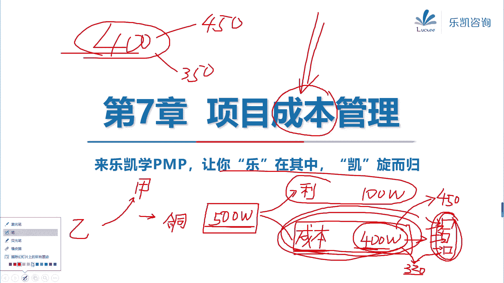

要好好的去想一想啊，究竟什么叫成本管理好吧，然后接下来这几个值啊要考虑清楚好吧。

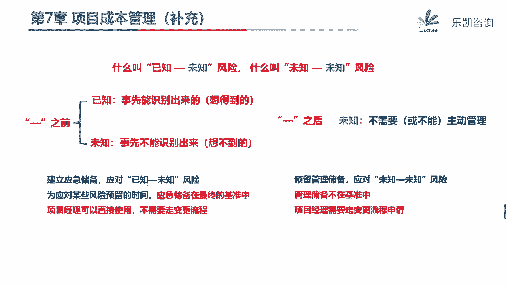

我们后面再讲政治管理的时候，是不考虑储备的啊。

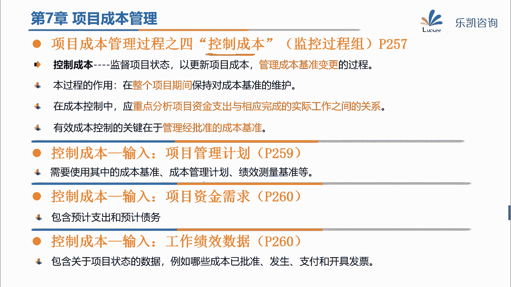

不考虑储备的，在政治管理的题目里面，不会去计算什么其他的储备好吧，计算题确实不考虑储备，把储备混在一起呢也没有意义，考应急储备和管理储备，它也只是考概念性的东西，好还有什么问题没有。

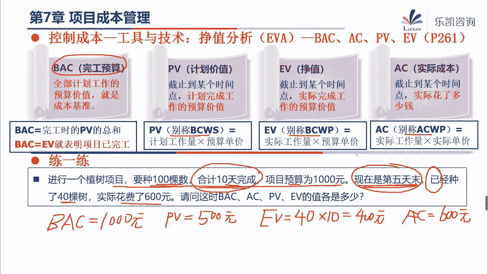

好如果没有什么问题啊，大家客户可以考虑一下这个问题，bc减去ev是什么意思，还有bc减去ac是什么意思，好吧这两个大家可以课后去考虑一下，其实刚刚有的同学问了一个问题啊，其实b c呢它有两重含义对吧。

什么两层含义呢，你可以说bc就是这个项目一共要做多少对吧，叫这个项目的总价值，你一共要做的东西一共价值多少对吧，那么这个价值实际上就是什么呢，当初我们定好这个项目的总预算是多少，对吧。

那么你就自己去看一看了，我项目一共要做这么多，ev是什么，我已经做了多少，那么这个一减代表什么意思对吧，其实上面这个叫还剩多少工作没做，对吧好，下面一共这么多预算，你已经花了这么多，这个一级代表什么。

这个代表还剩多少钱，是吧，这个大家课后可以去考虑一下好吧，那么这两天的每日一练呢，大家去做一做啊，包括多练一练，把这几个值啊，b a c p v e v a c把他给搞熟，好直白见同学，我说一下啊。

直白剑同学问了一个问题，他说总价值等于总预算，那怎么挣钱啊，大家注意啊，这个bc跟挣多少钱有关系吗，这个一定要把这个光，要把这个观点扭扭转过来啊，b a c b a c叫成本基准，我们成本的管理。

我们希望达到一个什么样的水平，花这么多钱就做这么多事儿，能明白这个意思吧，我再次说一下啊，比如说我们这个项目跟客户签的合同是500万，其中100万叫利润对吧，还有400万是我们的成本，成本管理是指什么。

成本管理，是指用400万把对应的东西做出来对吧，这个400万也叫总预算，也应该对应着我们最终做出来的东西的总价值，理想状态下应该是什么，我们花400万就做出400万的价值，我们只讲这一块对吧。

那么如果说你超出400万叫成本超支，低于400万叫成本节约，但是这只是讲成本跟利润没有直接关系，明白吧，所以这边啊手机上只讲成本的时候，好控制进度，实际上今天已经提到了一部分对吧。

比如说我们在某一个时间点看s v，或者看s p i，如果spi小于一代表什么延期了，那么你肯定要采取一些纠正措施嘛对吧，如果s v a s p大于一，代表什么进度提前了吗对吧。

这实际上就是在某一个时间点，对进度绩效来进行计算，然后来发现我们项目的进度究竟是提携了，还是落后了，好吧好，说到这里啊，还没到十点钟，给大家出一道题，这道题非常的恶心好吧，这道题是这样的。

某项目spi等于0。8，cpi等于1。2，好吧考试的时候我们就不考虑那种特殊情况了，那么我们就根据大于一小于来判断，那么这个项目说明什么进度落后，但是成本怎么样呢，成本节约了好项目经理呢做了一些纠正。

经过纠正之后，他又去测了一下项目的绩效啊，比如说过了一个月，他又去测了一下，发现在那个时间点，s p i已经变成了一点，对吧好cpi呢变成了1。01，纠正了，请问项目经理采取了什么措施，a，进度压缩。

赶工，c快速跟进，好d是一个雷锋选项，直接排除掉不对的abc里面选哪一个，这道题目你们将来在做每日练的时候，应该会遇到很恶心的一道题，好啊，这道题目呢s p i0。8cpi一点二，它是进度落后。

成本节约对吧好，你会发现它的成本1。2变成1。01，说明他花了钱，花了钱之后呢，进度变成了一点，应该是花钱买了时间，所以这道题目很多同学选的b，花钱买时间了对吧，那么我问一下选a的同学理由是什么。

我看到也有不少同学选了a，为什么选a呢，好有的同学说，因为a呢比较我比较范围比较大，进度压缩，它包括了赶工，包括了快速跟进，好这个理由对吗，这个理由不对的对吧，为什么呢，因为我之前就说了，我问你是哪人。

a相当于你在说你是地球人，b呢相当于说你是北京的，你说地球人这个答案有意义吗，这种答案是没有意义的，对吧，所以不是说哪个范围大就选哪个，但是呢这道题目啊确实答案不是b，应该是a，确实不是b啊。

这道题目答案应该选a，那么理由是什么，我说一下啊，这道题目当初出出来之后啊，错了一大片，选a的理由并不是a的范围，大，明白吧，选a的理由是这道题目一定，赶工了，对吧，但是注意也有可能，同时做了快速跟进。

也就是说你没有办法证明，他真的就纯粹做了赶工诶，他有没有可能达到这种效果，是我又赶工了，又快速跟进了，双管齐下，所以得到这样一个结果有没有可能呢，诶当时我一看好像确实也是这样哦对吧，你只能从表面上看啊。

cpi降低了，他一定赶工了，那么快速跟进有没有可能也做了呢，你能不能证明没有做过快速跟进呢，你证明不了对吧，所以他确实有可能又赶工了，又快速跟进了，最终达到了这样一个效果，对吧。

所以当时这道题目给的答案是a，我们只能选择进度压缩对吧，因为你没有办法证明他没有快速跟进啊，明白吗，所以这道题目的答案给的是a啊，给的是a，不能选b选b，就意味着你认为他只赶工了，明白吧。

选b就意味着你认为他只是做了赶工，但是有没有可能也做了快速跟进呢，是吧，所以这道题目呢很恶心啊，那现在的考试不会考这种题目，那么这种题目呢我一直觉得是什么情况啊，我还是觉得出题的人呢。

他小时候肯定他妈遇到一些童年的阴影对吧，导致了他的这个扭曲的心态，所以呢一定要出一种恶心的题目，让大家做错了他才开心对吧，所以这种题目呢在我当年考试的时候是遇到的，明白吧。

但是你们现在考试不太会出现这种题目，因为教育的目的不是为了难为学生对吧，我一直是这个观点说，那我们出一道题目一定要有很多的坑对吧，看大家栽在坑里面吗，或者我们讲课的时候，一定要讲一些高大上的东西。

讲一些东西他妈别人都听不懂，哎哟好牛逼啊，这才叫好吗，这我觉得不好，教育的目的是让大家了解这个东西，学到一些东西，是不是就这么简单，就这么纯粹，不要搞那些花里胡哨的是吧，所以这道题目呢我拿出来说一说。

如果大家以后在每日一练遇到了，稍微注意一下就可以了，好吧本身没什么意义，好吧好，那么今天我们就先这样吧，如果大家还有什么问题在群里面相互讨论。

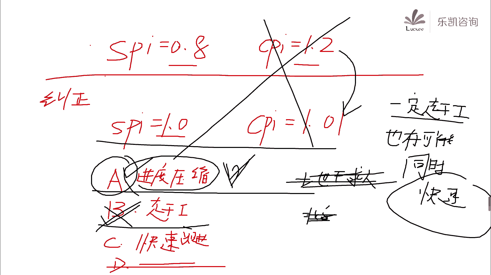

或者直接艾特我也行好吧，我希望大家在客户啊一定要做好一件事，就是把这几个值它的意思一定要巩固巩固，因为后面我们还是有很多的计算，跟这几个跟这四个值是有关系的，好吧，一定要把它巩固清楚。

它的各自的含义是什么，好今天就先这样吧。

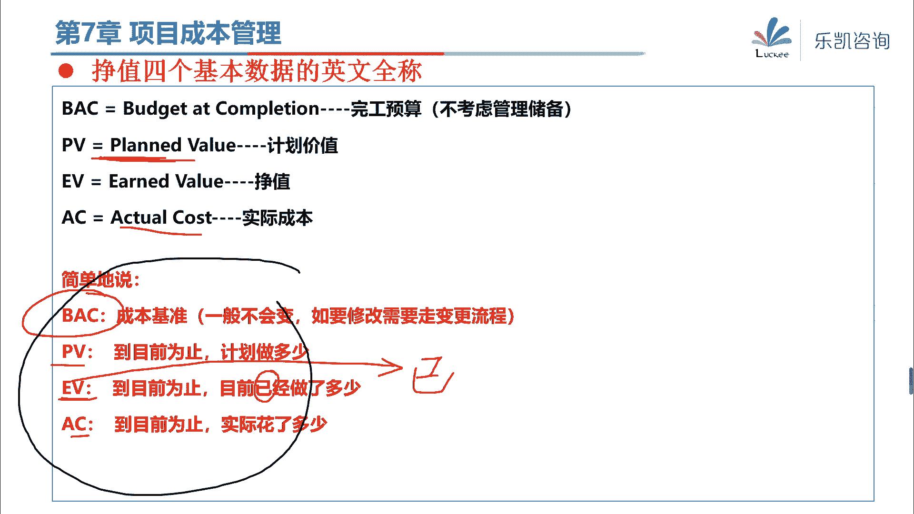