# 2024年PMP认证考试课程针对PMP新考纲最新免费零基础也能轻松听懂 - P11：PMP第7章：项目成本管理（下） - 乐凯咨询 - BV1Rj411G7gs

好各位同学晚上好，今天晚上呢，我们把这个正值管理的剩下的部分呢，跟大家一起来学习一下好吧，那么今天的这个课程大家要注意一下啊，今天的这个课程，号称是p m p里面计算最难的一节课。

但是实际上我个人觉得啊，计算呢对于我们中国人来说还是比较简单的，所以大家在一会听课的时候一定要认真去听，我不会按照书上的来讲，因为p m p书上讲的呢我觉得太复杂，不太好理解好吧。

那么我们要用我们比较正常的思维方式来思考，怎么怎么样去做政治管理的相对应的部分，那么在学习之前呢，上一节课我们在讲政治管理的时候，着重提到了这么四个值对吧，第一个是b a c。

也就是这个项目我们的完工预算是多少，或者说成本基准是多少对吧，那么一个项目的成本基准定下来之后，那么我们就可以根据他目前处于什么时间对吧，我们去找到剩下的这三个值。

比如说到目前为止计划要做多少plant value，也就是p为，然后我们已经做了多少呢，那计划是计划呀对吧，那么我们真正做了多少呢，那么已经做了多少叫n value，叫意为正直。

然后做这些东西我们又花了多少钱呢，这个叫ac extra cost对吧，那么我们有了这四个值之后，我们还可以知道当前的进度绩效和成本绩效，比如说我们可以判断s v，s p i或者c v c p i。

那么这些计算呢我希望大家要熟悉好吧，那么接下来除了了解我们当前的进度，绩效和成本绩效以外，我们正值管理还需要做一件事，做什么事情呢，就是对将来要做一个预测对吧，那么大家可以回忆。

我们在第四章讲工作绩效报告的时候，工作绩效报告他要包括什么，它要包括当前的绩效信息，还有对将来做的一个预测，那么今天我们看一看，怎么对将来的一些数据做一些预测好。

那么我们看这个例子，假如说我们现在有一个项目啊，我们这个项目呢预算是600块钱，那么这个项目呢要做六天啊，每天呢我们要完成100块的工作对吧，最终把这个预算600块的项目把它给做完，交付掉。

那么现在呢他说是第二天下班的时候，那么第二天下班的时候呢，发现真正完成了已经完成了多少呢，已经完成了计划里面的150块的工作，而完成这150块的工作呢花了300块钱，好，那么根据我们上一节课学到的内容。

我们在第二天下班的时候，我们可以得到相关的进度，绩效和成本绩效对吧好，那么我们一起来练习一下，预算是600，那么第二天下班的时候，pv计划要做多少工作，那么这个应该是能够很简单看出来的对吧。

那么上面的这个是计划，每天计划都是做100，那么第二天下班的时候，按照我们的计划来说，tv在这个时间点应该是完成200对吧，所以我们说pv等于200元，对吧，pv等于200元好。

那么接下来在第二天下班的时候，我们实际上去看一看，我们已经做了多少呢，好已经以就是e意味，那么题干告诉我们，我们已经完成了多少工作呢，好已经完成了，那红色的这一块完成了100，这一块完成了一半50。

他说已经完成了150，那么e为等于150块，对吧，那么为了做这150块的工作花了多少钱呢，那么在做的时候可能出现了一些问题对吧，可能造成了一些材料的浪费，可能做出来一些不合格的东西对吧。

总之浪费了一些钱，那么题目也告诉我们了，他花费了a c等于300，那么从这个信息里面，我们可以得到进度绩效指数s p i等于多少，那么spi等于ev我们已经做的去除以计划对吧，这个是进度方面的绩效。

应该等于0。75进度落后了，对吧，那么成本绩效，那么什么叫成本绩效呢，实际上就是成本的使用率cpi，那么cpi等于多少呢，你做是做了150，但是呢你为了做这150，你已经花了300，成本大大超支。

cpi等于0。5对吧，那么它意味着我们每做0。5的工作，就要花一块钱，是这个意思吧，好那么这是我们上一节课学到的一些内容，那么从目前来看，它进度落后了，成本也超支了，好那么接下来问大家一个问题啊。

我们已经知道了cpi和pi，很明显这个项目做的不好，那么我问一下大家，我们能不能预测，这个项目在最终做完的时候啊，他不管什么时候做完，我估计呢他六天呢，按照他这样一个效率，六天也做不完对吧。

那么不管怎么说，在他最终做完的时候，我们先看钱方面的事情啊，你们觉得600块钱这个预算，能不能把这个项目做完，那么目前是一个成本超支的状态了对吧，你为了做这150块的工作，已经花了300了。

那么剩下的工作，你觉得这个600块钱能够把它包住吗，能够做得完吗，那么我有很多同学发现我估计做不完了，我估计做不完了对吧，因为现在呢成本已经怎么样，已经超支了，你做这么一点点就已经花了300。

你后面的这个不可能做完的呀，对吧好，那么大家我们在做项目的时候要注意这一点啊，一旦成本超支，基本上来说这个项目最终肯定会超支，大家知道为什么吗，唉虽然这个项目还没做完，现在还在第二天下班的时候。

但是这两天的工作成本已经超了，那么这个项目基本上呢它的成本是很难扭转了，很难大家知道为什么吗，我们在管理里面有一句话啊，成本一旦超支，那么接下来这种情况几乎是很难改变的，那么为什么要这么说。

因为即便你剩下的工作按照原计划，一点也不操之，但是由于你前面已经超了，那么整个项目它也是抄的，那么有同学说，那么后面的工作难道我成本不能节约吗，能是能，但是这种情况很少见，在什么情况下。

后续的工作成本才能够节约呢，除非你的技术取得了重大的突破，除非你的材料价格出现大幅度的下降对吧，否则在正常情况下，或者说在理论上来说，你最多跟你预期的一致对吧，不太会去节约那么多钱对吧。

所以说我估计啊挣600块钱，要把这个项目做完很难了，那么这个时候我就想知道，那么把这个项目做完，预计要多少呢，好那么我问一下大家，如果我在这个时间点想知道把这个项目做完，那么大概要多少钱。

你们觉得关键点在于知道什么，那么我们用一个来描述整个项目做完，我预估要多少钱，那么估计啊，这个估在英文里面呢叫estimate，所以我们引入了一个概念叫ea c，同样是在完成的时候。

at competition，在完成的时候，我估计要花多少钱好，那么有同学说，如果我想知道最终这个项目啊，做完估计要花多少钱，那么比较关键的就是我要看，剩余的这一块我估计要花多少，那么为什么这么说呢。

因为你前面的这一部分工作已经做掉的，是花了300，这个是客观事实吧，那么关键就看你还没有做到这一块，我要仔细的去想一想要花多少钱，那么这一块要花多少钱呢，我们也给他一个东西叫也是一个估算。

但是这个估算是尚虚的，对吧，就剩下的这个t呢就是to to complete，那么剩余的这些工作估计要花多少钱，那么如果我能把剩余的这一块算出来，那么我不就有这样一个关系吗，最终这个项目要花多少钱。

就等于我已经花的这300加上，剩下的这些工作估计要花多少，对吧好，那么接下来我们看第一种做法，我要知道剩下的工作要花多少，那么我这样做吧，由于现在呢我发现情况呢跟我们预期的不一样。

所以我觉得呢这个原先的计划呢可能靠不住了，那么我做了一件事，我是这样做的，我把这剩下的每一块工作啊，我根据现在的情况重新做了一个估算，而我把剩下的每一个都重新估了一下啊，比如说这个原来是50。

我觉得50搞不定了，我估计得按照现在的情况要60，这个呢好，我估计要120对吧，那么这一块呢我估计还是100好，这一块呢我估计呢比如说要80，而这一块我估计要240，我把每一块都估出来。

那么我最终完成估计要花多少钱，能不能知道，这就能知道了，那么这个ac是知道的，等于300了，etc是多少呢，etc就把我刚刚剩下的这一块一个一个估的，全部都怎么样，全部都把它加起来嘛，不就好了吗对吧。

所以这种方法是一种方法，但是这种方法是一个很笨的办法对吧，他把剩下的工作全部都重新估了一下，然后把它夹走。

那么这就得到我最终结束的时候，估计要花多少钱，那么我们用一道题目啊来看一下，看这道题目，他说我们项目的预算呢是这样的，当初的计划呢是做四个任务，任务w100 美金，任务x150 ，任务y200 。

任务z呢是110好，那么从这个条件我们可以知道bc，我们的成本基准是多少，这个能看得出来吧，那么你既然当初的计划是做这四个任务，而且每个任务都分配了这么多的预算，那么bc很明显。

整个项目的成本基本就是560，对吧，四个任务，任务w任务x任务y任务z，这是我们当初的预算好，那么到目前为止呢，他说是这样的任务，w跟x呢完成了啊，w做完了，x呢也做完了，但是呢他们花的钱呢是这样的。

w花了40，x花了200亿好，那么到目前为止，我们一共花了多少钱，知道吗，那么很明显了，到目前为止一共花了w40 x是210，一共花了250了，对吧好，那么接下来我们一看这个跟计划不一样。

可能情况呢跟我们想象的不同，所以呢我觉得原先的计划呢可能我们做不到了，那么接下来他做了一件事，做了一件什么事呢，他说剩余的任务啊，我重新估了一下，那么剩余就是y跟z了对吧，y跟z呢我重新估了一下。

他是这样估的，我估计y要花220，我估计z呢要花90美金，那么也就是说我们剩余的工作估计要花多少，剩下的工作估计要花多少，叫etc，对吧，estimate to complete。

就是剩余的完工尚需估计要花多少，那么我发现剩余的工作按照我目前的估算，算下来，还估计要花310对吧，好这一部分我估计要花300亿，然后呢已经花了250好，那么从这边我能得出一个结论，那么我估一估啊。

整个项目对吧，estimate a complete，整个项目在完工的时候，我估计要花多少钱呢，好已经花掉的钱，这个是不能改变的客观事实，那么还剩余的工作呢，我也估了一下要花多少钱对吧。

那么算下来等于250+310=560，对吧好，那么我发现诶，我估计啊做完这个项目要花560，而我当初的预算呢也要花560，那么最终我得出了一个什么结论好，那么按照这种预测。

我估计项目还是会按预算来完成的，这道题目选了c好，那么这种做法大家能够理解吧，有人说这个他太简单了，这不是这不小学的计算题吗，那你以为有多难呢，就这么简单啊对吧，你要知道完工的时候估计要花多少。

你就把已经花掉的钱加上剩余的工作，估计要花多少不就出来了吗对吧，所以大家要注意啊，e a c是什么东西，是我们对项目完成的时候做的一个估算对吧，而b c是什么，b a c b a c是一个预算好。

大家能不能理解预算和估算有什么区别，能理解吗，你有没有发现预算是我们当初的计划，俗称叫成本基准，那么成本基准是我们当初获得批准的成本基准，它能变吗，它不能变对吧，你想变就必须要走变更流程，这个叫预算。

它是不能变的对吧，那么估算是什么，估算是在我们做的过程当中，在某一个时间点做了一个估计，他是算出来的对吧，通过我们的计算算出来的，那么最终算出来等于多少，这是我们算出来的对吧，预算是不能变的。

估算呢是我们算的，很多同学理解的还是比较清楚的，好吧好，那么大家注意这是第一种算法，这是第一种算法，好吧好。

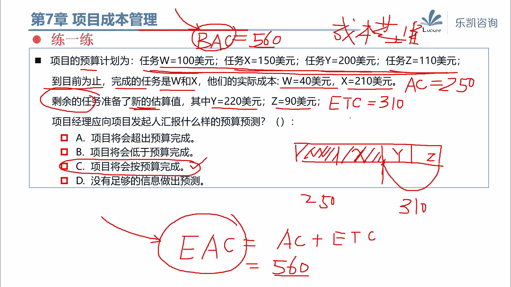

那么接下来有人说，那么我不这么算，他说我怎么算呢，好我发现啊是这样的，现在呢做了150块的工作，就花了300，那么我去了解了一下情况，我去了解了一下情况啊，我发现呢我们呢就这个水平啊。

我们当初呢太乐观了，结果我们发现团队呢就这个水平，他就是做150，实际上要花300好，假如说保持这个水平，那么最终这个项目做完要花多少钱呢，他说我这么算行不行，你看啊，一共600 600块的项目啊。

我已经做了150好，那么我问一下大家还剩多少没做，知道吗，还有人说靠，这不很简单吗，还剩多少工作，就把600减去已经做掉的不就好了吗，还剩450的工作没做呗，对吧好，那么你如果按照这个理论。

你做150就要花300，假如我们的团队就是这个水平对吧，后续的工作也是这个水平，那么450块的工作要花多少呢，那么这也是一个小学的计算题，150花300，那么450要花多少，你要做这450。

估计他年龄就得花900呀，对吧，那么整个项目要花多少呢，整个项目你已经花掉的是300，剩下的450估计要花900，那么整个项目，你如果按照这样的一个情况来做的话，就要花1200啊，这个能够理解吧。

好那么这个1200是怎么来的呢，其实很简单，已经花掉的钱花了300对吧好，接下来剩余的工作450，就是把我们总的要完成的工作减去，我已经完成的b c减e v嘛，这个450吗，好怎么出。

你看你的绩效成本绩效是0。5吧，你每座0。5就要花一块，每座一块就要花两块，所以它除什么，他就除以你当前的c p i，你就这个效率对吧，算出来不就是1200吗，对吧好，那么这种做法我们给了它一个名字啊。

大家注意这种做法，我们把它叫典型的做法，那么什么叫典型的做法，就是当前的这个cpi具有典型性，就是之前的工作是按照这个cpi后续的工作呢，也是按照这个cp i这个cpi会一直保持下去。

或者说剩余的工作会按照当前的绩效继续做，当前的绩效具有典型性，对吧好，那么接下来有人会说了，但是我看偏报考书上的公式不是这么写的呀，书上的公式典型性的算法是这么算的，他是把bc直接除以的cpi，好。

那么接下来我们看一下他们是不是一回事，这个公式把它变成ac加上bc，除以cpi再减去e v除以cpi好，大家注意，1v除以cpi等于什么，ev除以cpi，它就等于a c呀对吧。

那么a c跟这个就抵消掉了，那么这个公式就化简成了b a c除以cpi，对吧，那么这是从数学公式上，我们可以推出这样一个结果，那么我们如果不用公式来推，能不能看出来也可以这么去算呢，也能够看出来的。

那么大家想一想，假如说我前面的这一部分工作，是按照这个cpi做的，我剩余的这些工作也是按照这个cpi做的，那么也就意味着我整个项目，从头到尾都是按照这个cpi做的了。

那么可不就是把b a c除以cpi吗，对吧，所以公式再多，它的道理都是一样的，总之都是按照当前的绩效去做，那么这种做法叫典型的做法好，那么接下来我问一下我们讲的第二种方法，典型的算法做预测。

大家能不能理解啊，不管你是用这个公式来算，还是用这个公式来算，总之就是剩余的工作，会按照当前这个cpi一直保持下去难吗，我觉得也不难对吧，这也是小学的计算的一个水平啊，说实话，政治管理的这些计算啊。

在我小孩当年读3年级的时候，我就把它出成应用题给他做了对吧，其实3年级的水平他也能够搞定，这个其实很简单，好吧好，那么如果这一块没什么问题，那么接下来我们再介绍第三种方法。

那么第三种方法呢他是这么说的啊，他说现在呢我发现进度落后了，成本超支了对吧，这当然不太好，那么我呢就到团队里面去了解是什么情况，好了解了之后发现啊，前段时间出现问题呢，它是有一些特殊情况导致的。

什么情况呢，前段时间世界杯哎呀，大家都喜欢看球，影响了工作对吧，那么从现在开始，从今以后剩余的工作会恢复原计划，那么也就是说当前这个cpi它不具有典型性，所以我们给它取了一个名字叫非典型。

就当前的这个cpi不具有典型性，后续的工作会恢复到原计划，那么这里我就问大家了，你看啊，现在已经花了300对吧，那么还剩多少工作呢，剩余的工作是b c减去e v，还剩450的工作没做。

那么剩余的工作按照原计划是什么意思啊，按照原计划，剩余450块的工作，我们得花多少钱呢，好我们忽然想到我们在做成本的时候，我们说原计划，如果所有的工作按照计划来做的话，理论上来说。

应该是每花一块钱就完成一块钱的工作，你剩450的工作按照原计划，那么理论上就应该花450，那么如果你说剩余的工作按照原计划来做，那么就是这么多，剩450就花450对吧，那么你除cpi，你也是除了原计划。

原计划就是一比一的关系吗，每花一块钱做一块钱的事嘛，好那么如果按照非典型的做法，那么这个时候我们项目完工要多少钱呢，已经花掉了300，对吧，还剩450块的工作没做，但是这450块的工作呢。

会按照原计划去做的啊，他不会有什么偏差的对吧，你做450就花450，那么最终这个项目做完的时候，就要花750块钱，那么这种做法叫非典型好吧，那么非典型的含义就是，我剩下的工作是按照原计划去做的。

一比一的这种关系去做的，那么我可以算出来好，那么按照原计划去做，我这个项目要花多少钱好，那么我问一下非典型，这个意思大家能够理解吗，也很简单吧对吧，你花了多少钱，然后剩余的工作是多少，剩余多少就花多少。

按照原计划嘛对吧，那么接下来整个项目花多少钱就可以了，好那么如果非典型大家也理解了对吧，其实很简单啊，我觉得这个没什么难的，那么接下来我希望大家观察一下这一部分，好，你们发现有什么特点吗。

当然最终典型的做法可以化简成这个公式对吧，但是我们看一看这一部分啊，诶你会发现其实他们做法，在某种程度上来说是一致的对吧，他是怎么做的呢，他们都是这样的，已经花掉的钱是客观事实，这个是不变的对吧。

那么关键就在于剩余的工作，b c减e v，剩余的这部分工作你怎么做，如果你是按照当前的cpi做，那么就除以当前的cpi，如果你是非典型，按照原计划去做，那么你就除以一，对吧实际上就是我们有同学说的。

关键就看这一部分它除的是什么，不就好了吗，对吧好，那么接下来问大家一个问题啊，看看大家能不能把这个公式写出来，假如在实际做项目的时候，我告诉你啊，这道题目剩余的工作，它既不是按照当前的绩效来做的。

也不是按照原计划来做的，好剩余的工作我给了你一个绩效，我说剩余的工作经过我们请专家去评估去分析，发现剩余的工作是按照0。8的绩效去做的，那么接下来我们应该怎么去算，这个公式能写出来吗。

而我剩余的工作也不是按照当前的cpi继续做的，也不是按照原计划去做的对吧，那算到0。8啊，我们请专家去论证，论证了半天，说0。8好，那么有同学说那么简单，ac已经花掉的钱你是不能变的。

加上剩余的工作是b a c减去已经完成了吗，那就是剩余的了，好那么接下来你说是按照0。8，那么就除以0。8，不就这么简单吗，对吧好，那么接下来我再问啊，专家论证下来呢，他发现现在呢进度落后了。

成本也超支了对吧，本来呢我们想用典型的做法去做的，只要除以cpi就行了，但是专家说，由于你进度也落后了，你进度落后呢，后面就需要赶工了，赶工还要花钱了，就会让你的成本雪上加霜。

所以专家他说剩余的工作怎么算呢，我们要按照这个绩效成本现在很差，同时还要考虑到进度，同时考虑到进度和成本，把它们相乘作为一个最终的绩效好，那么接下来这个时候，我们能不能把项目完工的时候。

要花多少钱估算出来，好马上有同学，龚凯西同学马上说了，那么就这么做呗，反正已经花掉的钱是不变的对吧，那么就看剩余的工作按照多少来做了，那么你既然专家说剩余的工作的绩效，要同时考虑到进度和成本，对吧好。

那么我们就除以cpi乘以s p i对吧，总而言之，就是你只要告诉我，剩余的工作按照什么绩效去做，我就去除以什么绩效不就好了吗，对吧好，所以接下来书上第三个公式出来了，ac加上b a c检验ev去处理。

这样一个叫综合绩效比，同时考虑到进度和成本，对吧，那么这就是我们p m p书上的那，除了这种我们一开始讲的最笨的一种方法以外，剩下的这三种方法你会发现啊，当初我在学的时候啊，我听老师讲。

包括我自己看pmbok，看了一本书，看得我一头雾水对吧，看到我云里雾里，但是后来我自己回头一看，你会发现这三种情况，它的公式，看上去是三个，实际上呢我感觉就是一个，对吧，那么实际上它的主要的思想就是指。

我只要把现在已经花的钱加上我剩余的工作，bc减ev对吧，剩这么多工作，那么剩这么多工作是按照什么绩效去做呢，如果是典型的，那么我除的就是cpi，如果是非典型，按照原计划去做，那么我就除以一对吧。

如果你说它既不是典型，又不是非典型，是给我某个特殊的绩效啊，你告诉我是0。8，我就除0。8，你告诉我是1。2，我就除1。2，你告诉我要同时考虑到进度和成本好，那么我就除以cpi乘以pi对吧。

你告诉我剩余的工作按照什么绩效去做，我就除以什么绩效不就好了吗，好那么关于这一块，现在大家看一看，用这种方法来说有没有难度，我觉得这个很简单，那就是小学的水平啊。

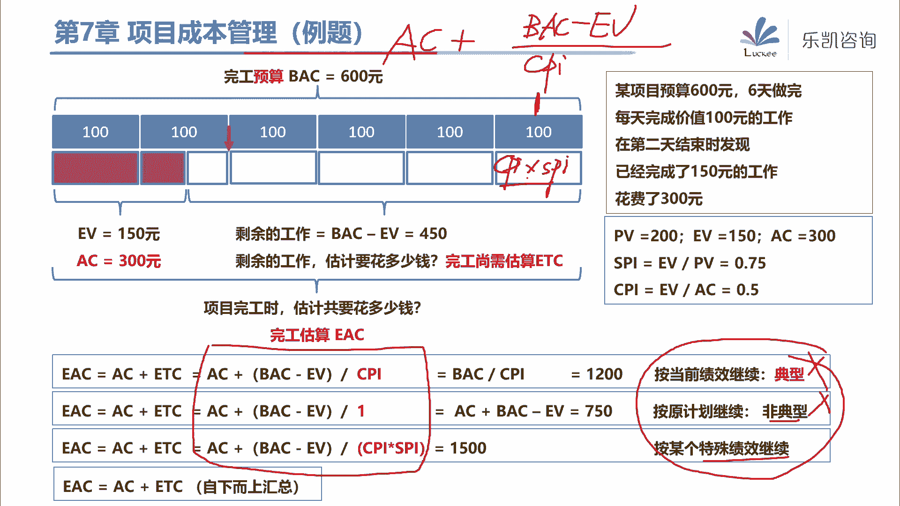

有什么难呢，对吧好，那么接下来我们用一道题目来练一练好吧，好我们看这道题目，计划十天完成预算1000块的工作，那么在第五天结束的时候，统计是这样的，完成了400，花了800，问你完工的时候需要花多少钱。

好我们先把基本的值写出来，从题目中我们可以看出来，b a c这个项目的成本基准或者叫完工预算，他告诉我了，是1000 1000元，对吧好，那么接下来在第五天结束的时候，诶，一共十天，现在时间过去了一半。

第五天结束的时候，那么按照计划来说，你应该做多少啊，那按照计划来说吧，你应该做一半了对吧，那么pv应该等于500了，那么你做了多少呢，完成了多少呢，好完成了400，那么1v等于400。

你完成的工作是400块，你花了多少呢，花了800啊，ac等于800块，对吧，那么这是我们的这些基本的值，那么顺便我们把这两个算出来，c p i啊，等于1v除以ac 400÷800=0。5对吧。

好s p i400 除以500=0。8，把这个顺手就把它算出来了，好那么接下来他问完工的时候需要花多少钱，好这个时候有同学就问了，那么我们学了这么多种方法，我究竟用典型还是用非典型还是用什么方法呢。

好大家注意啊，这一块一定要注意，我们在考试的时候，我们默认用典型，就是如果题目中什么都不说啊，什么都不说，默认用典型，明白吧，就像我们这个三点估算，默认用贝塔分布一样的好。

那么首先我们用典型的做法来算一算，那么这种情况下项目完工的时候要花多少钱，那么在后面大家熟悉了之后，可以直接用这个公式bc除以cpi对吧，比较简单对吧，因为你剩余的工作也上到这个cpi。

就等于整个项目上到这个cpi，算出来等于2000对吧，或者有的同学说，哎我觉得那种故事比较好理解对吧，ac已经完成了，加上剩余的b a c简ev，剩余的工作是按照当前的cpi，那么也可以对吧。

那么不管你怎么算，典型的算出来都是2000，对吧好，那么这是题目，什么都不说，我们默认用典型或者题目说剩余的工作，按照当前绩效，我们也用典型，对吧好，假如说这道题目问的时候多加了一句，他这么问的。

他说假如剩余的工作，我们会按照原计划或者按照计划绩效完成，好，那么这个时候用什么方法，那么如果他题目中，他说剩余的工作会按照原计划，或者按照计划绩效去做，那么这个时候就是非典型了。

好非典型就是值剩余的工作，b a c减e v剩多少就花多少，一比一的关系吗，原计划不就是做多少花多少嘛，对吧好，那么这个时候更加简单，你自己去算一算，ac等于800 800。

加上1000-400 1400了，对吧，那么非典型的就是1400好，我问一下典型和非典型，大家会做了没有，考试最难就到这个难度了，就是目前的考试啊，现在的偏僻考试的计算题最难。

就是这个难度只会比这个简单，不会比这个难对吧，那么有的同学说我靠，这简直在侮辱我的智商对吧，那这个跟玩儿一样，小学的计算题啊，对吧，那么有同学说考试发计算器吗，好以前没有疫情的时候，考试还发计算机对吧。

那么现在呢有了疫情，考试不发计算机了，不发计算机呢就意味着更简单，数字也很简单对吧好，那么接下来我再说一下，我们以前考的时候比较难的几种考法好吧，大家注意啊，像我们现在考试都问完工的时候需要花多少钱。

对吧好，那么我问一下，你觉得整个项目做完了之后，做完的时候啊，这个钱当然是不够的对吧，我们刚刚说典型慢算出来是2000，非典型慢算出来是1400对吧，也就是说项目完成的时候，这个1000块钱。

那我估计是不够的，那么大家想一想啊，我们刚刚算出来spi进度绩效是0。8，那么你觉得这个项目做完的时候是十天吗，这道题目是问了钱了，那么你觉得时间够吗，十天时间够不够呢，那么我感觉进度是落后的。

这个时间估计也不够啊，那么有同学说，那么我能不能知道项目做完要花多少时间呢。

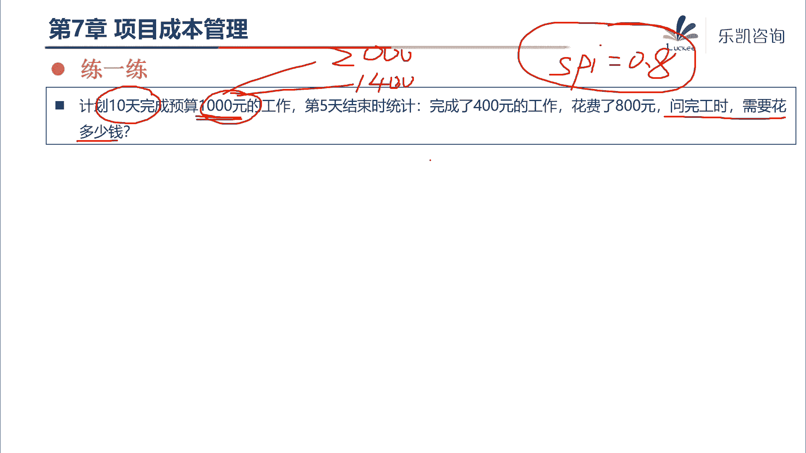

可以的好，我们还回到我们一开始讲的这个简单的例子啊，我们大家看一看，在这个例子当中，第二天下班的时候，spi等于0。75对吧，也就是说，你每一天只能做0。75天的工作量对吧，那么像这道题目里面。

就是第二天下班的时候，你只做了1。5天的工作量好，那么大家能不能算一算一个原来六天的项目，按照这样一个进度绩效实际上要多少天，那么马上有同学反应过来了对吧，你一天只能做0。75。

那么你一共有六天的工作量啊，那么要一共多少题呢，除以0。75不就好了吗。

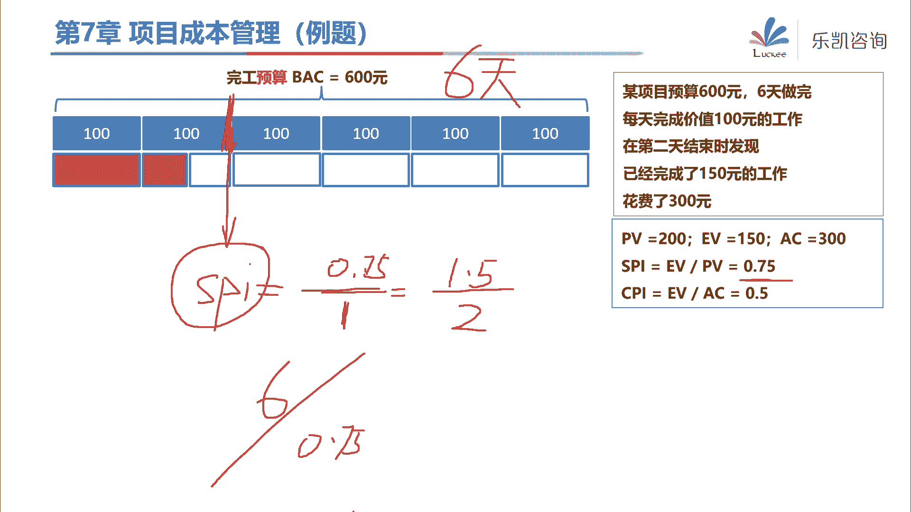

对吧，那么这道题目也是一样的，如果他问你要花多少时间，你怎么算好，我们当时算出来s p i等于0。8好，大家注意，其实算时间也有典型和非典型，我们首先看第一种情况，默认用典型的做法好，假如到目前为止。

你的进度绩效是0。8，一直保持这个绩效，我们可以怎么算时间，大家注意，请你统一把刚刚的那b a c除以cpi，这个公式全部都换成什么，全部都换成跟时间有关的，那么这个公式就变成了什么，就变成了总工期。

也就是这个题目里面的十天，这个时候去除以什么呢，就不是除以cp i了，是除以s p i，因为你要算什么算时间，时间跟什么有关，跟进度有关对吧，所以这道题目典型的做法，最终算出来是十去除以0。8。

这个项目按照你这样的速度啊，要12。5天才能做完，对吧，把所有的跟钱有关的都换成时间方面的，这个也很简单吧对吧，那么有同学说，那么假如说它是非典型，怎么算时间呢，好非典型的时候我们算钱是怎么算的呢。

ac加上b a c减去e v对吧，剩余的工作按照一比一的关系去做嘛，好把它全部都换成时间，好我们来看，首先到目前为止一共过去了多少天，用了多少时间，题目告诉我们了，现在是第五天结束的时候。

到目前为止已经用掉了五天对吧，那么假如说剩余的工作按照原计划去做好，那么剩余的工作是多少天的工作量呢，一共是十天的工作，你到目前为止完成了几天呢，完成了400，完成了400。

相当于原来十天工作里面的四天，对吧，也就是说你还剩六天的工作量没做，那么按照原计划六天的工作量，你就是花六天做完吗，对吧好，那么这个时候按照非典型，11天把整个项目做掉，好换成时间也是一样的去做好吧。

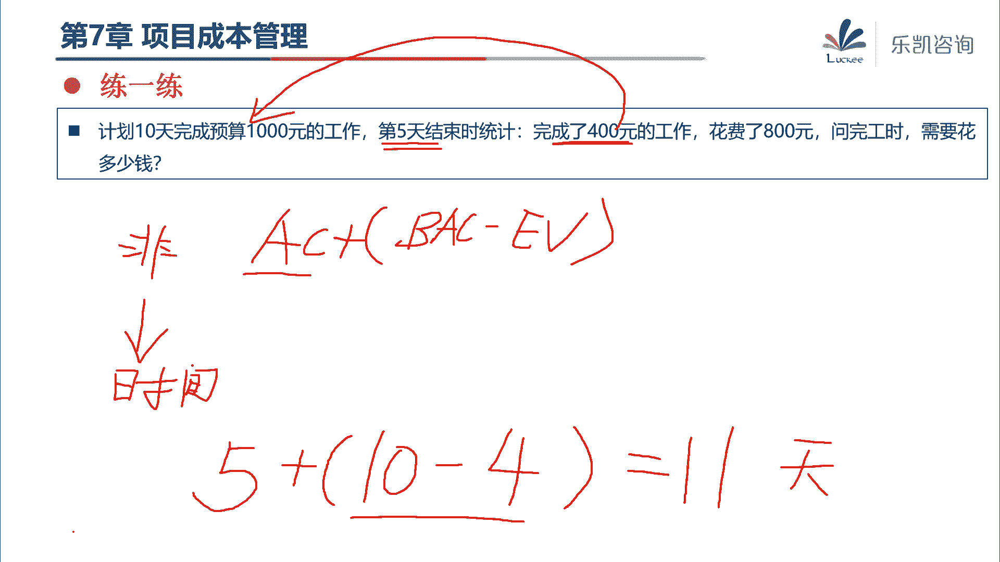

那么典型和非典型其实也就是这样了好吧，大家在做题的时候呢，注意看一下题目，他的说法默认用典型，那么我希望大家不管是算钱还是算时间，都要会做好吧好，那么接下来我给大家看一下，从偏僻。

1999年引入中国到现在这么多年。

最难的一道预测的题目，好我们看这道题目啊，这道题目的题干呢我们在上一节课接触过对吧，似曾相识，他说任务a的成本估算啊是1000美金，计划完工日期是12月30号，总工期十天对吧，那么项目经理这个水货呢。

他一直等到最后一天下班的时候才去看，发现任务只完成了70%，到目前为止花费了600美金对吧，那么肯定是进度落后了，那么接下来他说，项目经理为该任务增加了利民资源，把绩效提高到了1。5。

那么问你新的工期是多少，他首先他是算时间的，问的是工期对吧，那么接下来我问一下大家，它是典型还是非典型，能看得出来吗，这道题目他问的是工期，那么它是典型还是非典型呢，好王立顺同学说是非典型，对吧啊。

大家都一致同意是非典型，好大家要注意啊，这个地方在我们刚开始学的时候容易出问题，什么叫典型呢，典型就是指按照当前的绩效，那么这道题目当然不是按照当前绩效去做了，他肯定不是典型了，那么什么叫非典型呢。

好大家注意啊，非典型是指按照原计划或者叫按照计划的绩效，那么这道题目是按照计划绩效去做的吗，他也不是按照计划去做的呀，所以这道题目它既不是典型，也不是非典型对吧，发现掉科比了对吧，第一次接触对吧。

说的时候呢，确实很容易有这样一个理解的误区对吧，那么现在我们发现它既不是典型，也不是非典型，那么接下来怎么办好，不要慌，不要乱，先回忆一下我们非典型算钱的公式是什么，我们说你不管怎么说。

反正记住这个公式，ac加上剩余的工作b a c简ev它既不是当前的，也不是计划的，那么他告诉我用什么，我就除以什么除以1。5，那么有的同学说这个1。5是cpi还是s t i呢。

还是c p i乘以s t i呢，还是什么意思呢，这些你都不要管，总之他告诉你剩余的工作会按照1。5的绩效，你就去除以1。5就好了吗，对吧好，那么这个是算钱的咯，但是这道题目不是让你算钱，他是要你算什么。

算时间啊，对吧好，把这个公式里面所有的东西都替换成时间单位，首先到目前为止已经过去了多少天，总工期十天，现在是最后一天，下班的时候，十天都他娘的用掉了，对吧好，接下来还剩余多少天的工作量呢。

原计划总工期是十天，你完成了多少，完成了70%对吧，也就是完成了七天了，那么原计划十天的工作量，你到目前为止完成了70%嘛，完成了七天对吧，那么剩余的这个工作量，会按照1。5的绩效去做好。

你就会发现算出来也很简单，等于12天这道题目b就把它选出来了，对吧也很简单的好吧，那么这道题目还有一种问法大家要注意的啊，很多同学呢学得还可以，觉得这些东西都很简单，但是考试的时候呢选错了。

因为呢他问的时候呢，他换了一种问法，他说这个项目还需要多少天，那么你要注意啊，我估计整个项目做完一共要12天，人家问的是还需要多少天，那么你要知道还需要的要把这个十减掉啊，还需要的就是这一部分吗。

对吧etc嘛还需要的是两瓶啊。

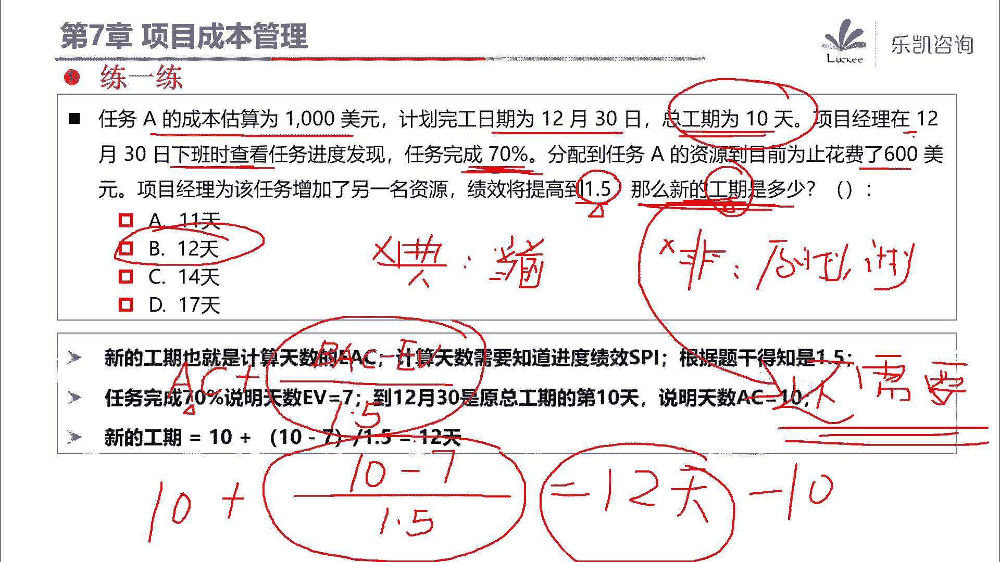

那么这些细节要稍微注意一下好吧，那么关于预测e a c这一块。

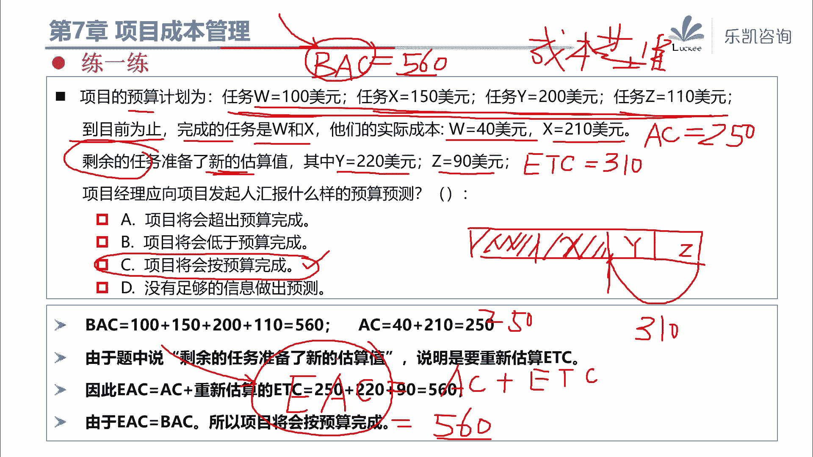

e a c也好，etc也好，那么我相信大家通过这几个例子啊，还是能够理解的对吧，本质上ea c等于ac加上e t c，也就是剩余的工作估计要花多少，那么etc它有三种情况对吧，要么典型除以当前迹象。

要么是按照原计划，要么按照特殊迹象，好吧好。

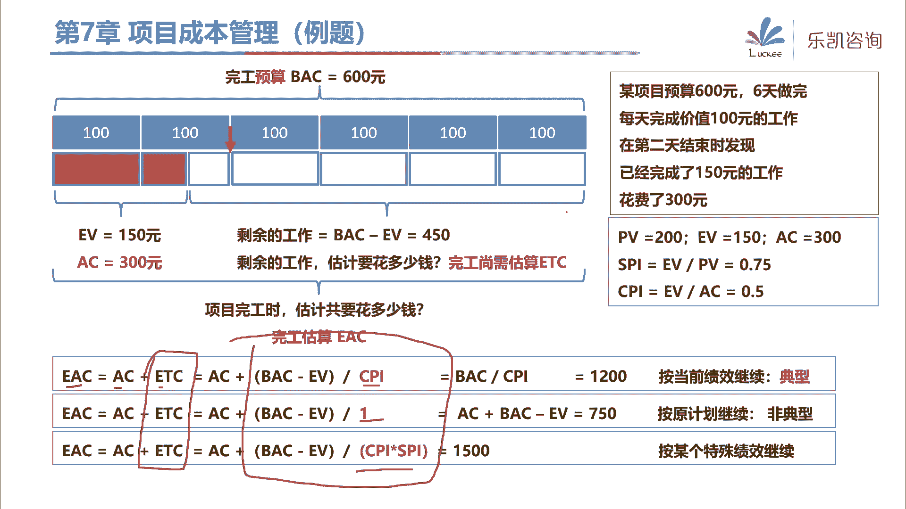

那么这是关于我们预测的这一块，那么除了预测以外呢，我们还可以算一个东西，叫完工尚需绩效指数t cpi，那么我先说一下关于这个t cpi这个公式啊。

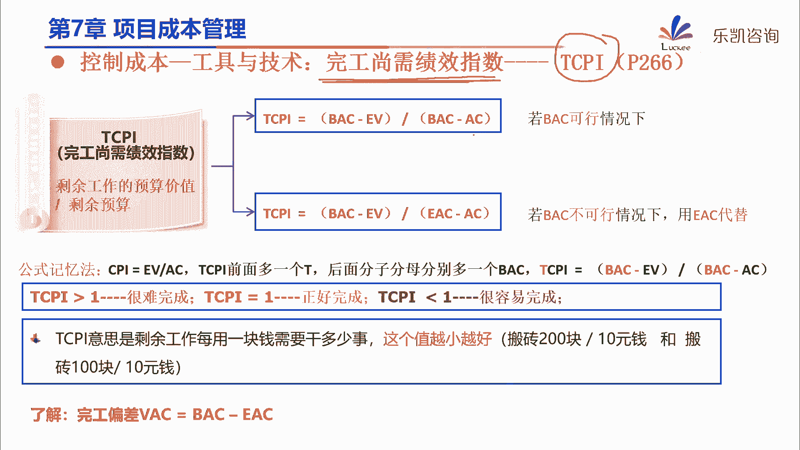

怎么去记，然后我再解释一下什么叫tcp i好吧，cpi呢这个公式我们学过对吧，cpi等于e v除以a c，那么如果题目问你完工绩效，完工剩余绩效指数t cpi，那么把分子分母都用bc去减一减，对吧。

多了一个t，那么分子分母都用bc去减一减就可以了，那么这个公式记呢很简单，用这种方法去记就很好记，但是对于我们学习来说，我们一定要知道这个公式它具体的含义是什么，对吧好，那么我们来分析一下这个公式。

它的含义是什么啊，我们看分子bc减ev是什么意思，啊就像我们刚刚说的，一共是1000块的工作对吧，你到目前为止已经完成了700好，请问bc简易为它的含义是什么呢，你会发现这个疯子的含义啊。

实际上在说一件事，就是我还剩，多少工作没有做，对吧，或者我们完整地说就是剩余的工作，它对应的预算价值是多少对吧，我们还有原计划300块的工作没有做，是这个意思吧，好那么我们再分析一下分母是什么意思呢。

而我们整个项目是1000块的预算，到目前为止已经花了600块，父母是什么，一共是1000块钱的预算，你到目前为止已经花了600块，那么父母无非就是这个意思吧，叫剩余的，对吧，还剩多少钱嘛。

那么这个tcp i完工尚需绩效指数，它的含义是什么意思，无非就是说我用剩余的钱去完成剩余的工作，究竟它难不难对吧好，那么比如说假如我剩下一块钱的工作要做，但是我还有两块钱可以花。

这个t cpi算出来等于0。5好，你们觉得接下来的工作用两块钱去做，价值一块钱的工作，或者说我还有一块钱的工作没做，但是我可以花两块钱，这个容易吗，哎我觉得这个就很容易呀对吧，你看我还剩一块钱的工作。

但是我的兜里面呢还有两块钱，我靠这个就太舒服了，对吧，有人说随便怎么做，做马句应该能把它做掉吧，好假如反过来说，假如我还有两块钱的工作没做，但是我的兜里面还剩的钱是一块钱，这个容易吗。

靠这个就不太容易了对吧，我还有两块钱的工作没做，但兜里只有一块钱，这我靠这个就很难了对吧，所以你会发现t cpi怎么样，t c p i越小越好。

越小越好，对吧好，所以p m p里面他又引入了这样一个东西啊。

叫完工尚需绩效指数，对吧，那么他说完工上学记教师数量，实际上就是指剩余的工作除以剩余的预算，如果tcp i小于一，很容易完成，如果tcp大于一呢，就很难完成，等于一呢就刚好对吧好。

那么接下来流浪同学问了一个问题，他说那假如说我是预算是1000，到目前为止我已经花了1000，进一减等于零，那这怎么算啊，我们小学就学过啊，分母等于零，这个除除下来是没有意义的对吧。

假如说你的预算就是1000，而到目前为止已经花了1000，那怎么办呢，好，那么这个时候我们就认为这个bc已经不可行了，b a c已经不可行了对吧，那么如果b a c不可行。

我们就用e a c来取代它去算好吧，那么这一块大家稍微注意一下啊，有这么一个说法，实际上考试从来没有考到过，比较常见的，要考就是考这个要考就是考这个好吧，所以把这个公式把它记住就可以了。

知道它的意思好吧，tcpi越小越好，当然最后还有一个完工偏差，这个就没什么好说的。

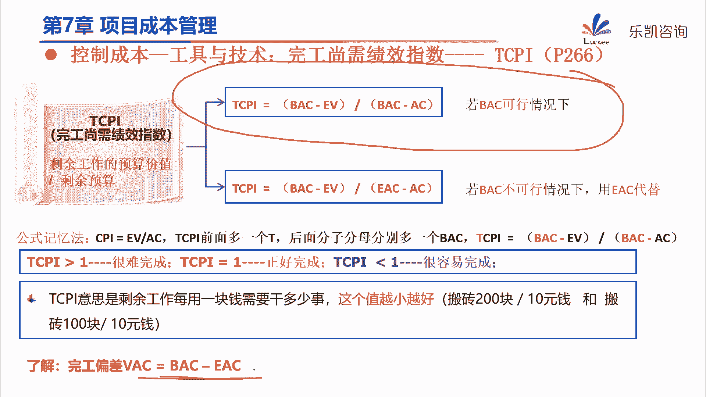

b a c减e a c吗，好吧好，那么到目前为止，我们正值管理的所有的计算就这么多，那么大家需要的所有的英文的全称，刚刚在讲的时候，有同学在问，什么叫e a c呀，什么叫etc呀，对吧，能都在这边。

完工时候的估算对吧，e7 c完工尚需估算，这些全称都帮你们列在这边。

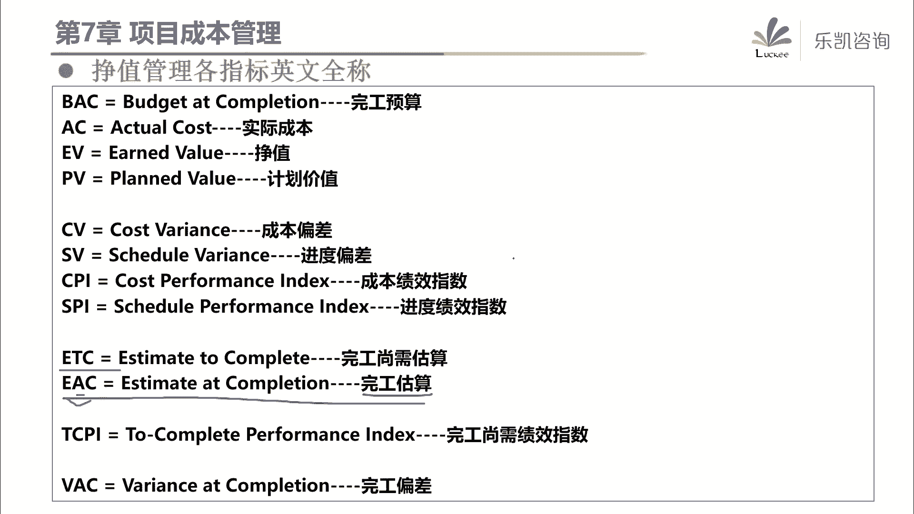

如果你们想了解的，可以去看一看好吧，那么所有的公式都列在这边对吧，我们要做政治管理，首先要知道这几个基础的值，这几个基础的值是原始的观察值和测量值，叫工作绩效数据对吧，那么接下来这一块我们叫偏差分析。

看目前为止有没有存在偏差的对吧，比如说进度偏差，成本偏差，或者我们换一种表现形式，用进度绩效指数，成本绩效指数，总之ea那个ev在前面，要么1v在分子对吧，那么我们今天讲的叫什么呢，叫趋势分析对吧。

偏差分析是看当前的偏差，趋势分析是对将来做一个预测对吧，那么除了趋势分析这三种典型，非典型还有特殊绩效以外，我们还介绍了t cpi完工尚需绩效指数对吧，重点是记住前面的这个就可以了。

那么这些东西呢我希望大家要熟悉，那么我们在星期六可以通过周练习，帮大家一起来巩固一下好吧，那么这是我们所有的政治管理的有关的计算，其实很简单啊，其实很简单好，那么接下来除了做好政治管理对吧。

在控制成本的时候，包括控制进度也是一样的啊，除了做好这种正值管理。

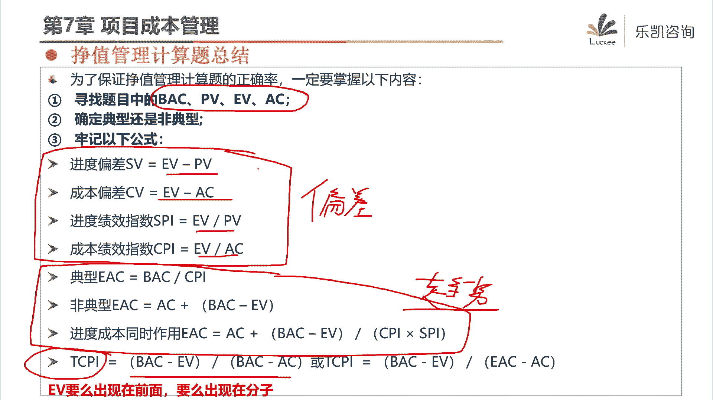

做好分析以外，那么接下来还要注意做好储备分析，那么什么叫储备分析呢，我们在规划的时候有一个工具叫储备分析对吧，那么规划的时候的储备分析是说，我们知道有一个已知风险，我们留多少应急储备吗。

那么监控过程控制成本，它的储备分析是什么意思，他说实际上是判断我们这些储备，说白了啊，就是剩余的储备和剩余的风险是不是匹配对吧，那么我们这个储备留下来，有的已经风险发生了，已经用掉了。

那么还剩下了这些钱，当然也还剩下一些风险，那么用剩下的储备来应对剩余的风险，它合理不合理，是做这样一个分析好吧，那么另外呢在上一节课下课之后，有很多同学问了我这样一个问题。

他说我们在上一节课讲成本基准的时候说过，成本基准里面是包括应急储备的对吧，那么我有说过，如果风险没有发生，应急储备应该怎么样，大家还记得那句话吗，项目经理要根据实际的情况对吧，如果风险发生了。

那么就动用应急储备，当然不需要走变更，那么如果没有想象的那么严重，或者说干脆干脆就没有发生，我们要取消或者减少应急储备，那么有同学就会问了，那么假如有一个风险没有发生，把它取消掉，或者只用了一部分。

还有一部分呢你要把它划掉，要减少掉，那么这个时候成本基准不是变了吗，要不要走变更呢，好大家注意啊，在pp里面原话是这么说的，如果以识别的风险没有发生好，他用了一个词。

就可能要从预算中扣除未使用的应急储备，那么这样做的目的是什么，这样做的目的是为其他的项目，或者为你的公司，为你的组织的运营要腾出资源，那么为什么这边用了一个可能这个词呢，就是说一般在实际做项目的时候。

我们不会再做项目的中途去做这个操作，我们一般是等项目整个结束的时候，在一起统一去结算明白吧，也就是说不需要走那么多变更好吧，那么我对大家的要求就是大家不要去在意哎呀，是不是我们现在立即就要去把这笔扣掉。

是不是现在就立即要走变更流程，这个倒没有必要，大家只要记住，如果你不用，那么就要取消或者减少应急储备就可以了好吧，考试也只会考你这一点。

至于实际工作的做法，它多种多样好吧，那么控制成本内容就这么多。

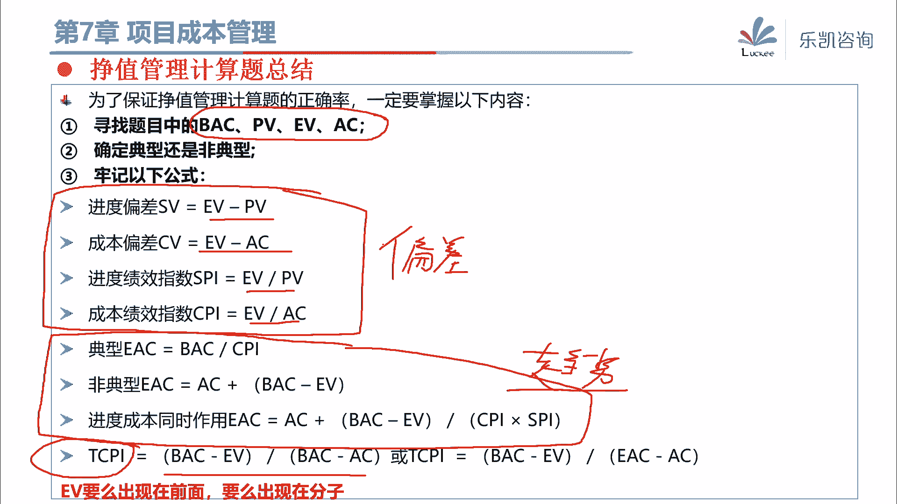

那么接下来还剩余半个小时，我们要补充讲一讲其他的内容。

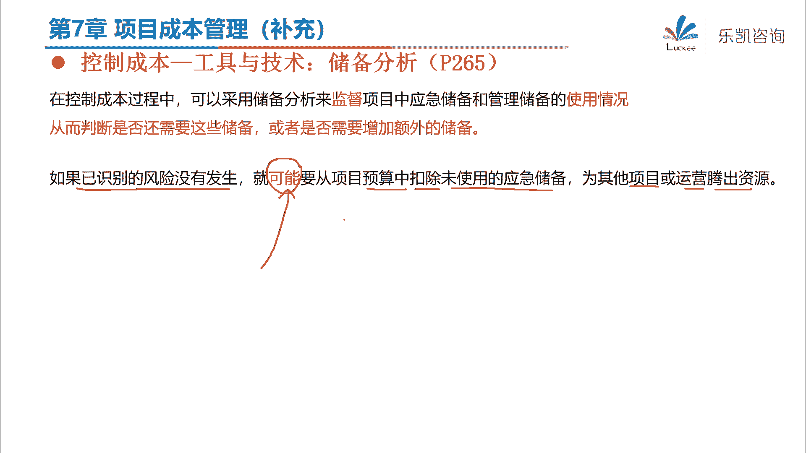

首先第一个我们要补充讲一讲成本的类型，在我们做项目的时候啊，其实成本呢分为很多种对吧，那么从不同的维度，我们可以分成直接成本和间接成本，这是一对固定成本和可变成本，这个是一对，那么什么叫直接成本呢。

就是直接用在你这个项目上，而直接在你项目上发生的，比如说项目的全职人员的差旅费啊，工资啊等等，那么什么叫间接成本呢，好间接成本呢就是指不是你这个项目花的钱，唉这个钱不是你项目花了。

或者说不仅仅是你一个项目花了，需要你出一部分的，比如说举一个例子，你们公司有房租对吧，每个月公司都要交房租费，那么公司的这个房租费，这个成本算到哪个项目上呢，这个好像算到哪个项目上都不好对吧。

那这个时候怎么办，我们就需要多个项目一起来分摊，那么要注意像这种需要项目分摊的成本，像管理费啊，水电费啊，房租费啊，这个就叫间接成本好吧，那么这个是一对好吧，那么还有一对呢叫固定成本和可变成本。

那么这是从另外一个维度来分的，什么叫固定成本呢，简单的说就是一次性投入以后再也不变了，比如说我买了一台打印机，我买了一台扫描仪，我买了一台电脑，一次性投入以后不变了，那么什么叫可变成本呢。

可变成本就是他一直在变的，特别是随着时间或者工作量的改变，它会变，特别是涉及到什么，比如说一些消耗品，像a4 纸墨盒对吧，人工费呀，你时间越长，它用的越多，它是变的，这个叫可变成本。

那么固定成本跟可变成本它是一对好吧，那么这两对现在考试不太会考的，但是大家要了解它的概念好吧，那么我们整个项目的成本，有的时候是需要考虑到像间接成本这种东西的，好吧好，那么接下来全生命周期成本。

那么什么叫全生命周期呢，我们在一开始的时候属于什么，在讲的时候叫产品生命周期，就是就是属于这种全生命周期，产品生命周期就是指产品从概念阶段，一直到最终退出市场消亡整个过程，在这个产品生命周期整个过程中。

发生的所有的成本叫全生命周期成本好吧，这个概念稍微了解一下就可以了，好，那么接下来比较重要的是讲这两个，沉没成本和机会成本，那么这两个考试呢考的也不多，也很少了，但是我希望大家要理解好吧。

首先我们重点看一下沉没成本，什么叫沉没成本，大家注意任何已经发生的成本，不管你花得合理还是不合理，它都叫沉没成本，俗称叫已经花掉的钱，他已经花掉了就算了，那么为什么要说这句话呢。

因为我们在后续决策的时候，我们不应该去考虑沉没成本了，明白吧好我用一个例子来考验大家啊，有的道理很简单。

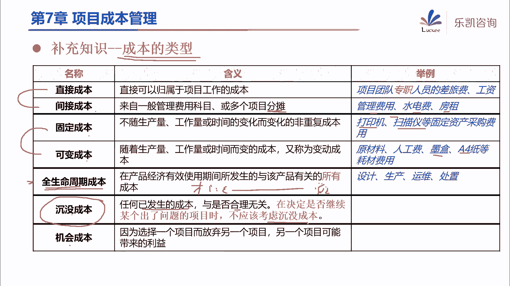

但是呢在实际选择的时候容易错。

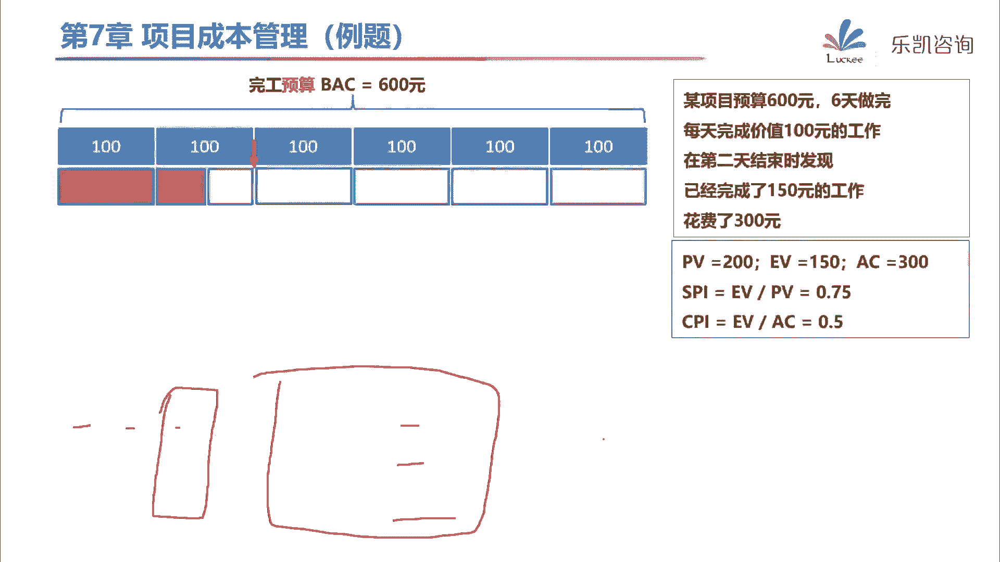

比如说问大家一个问题啊，我，现在公司呢有a有b两个项目好吧，那么a项目呢是这样的，a项目到目前为止ac啊花掉的钱，a项目到目前为止已经花了10万，b项目到目前为止已经花了100万。

那么这两个项目呢还在做对吧好，那么这两个项目会在什么时候完成呢，好这两个项目会在这个月的20号，1月20日完成，而且我告诉大家啊，这两个项目不光是同一天完成，而且呢从今天开始，今天是1月4号。

从今天开始到1月20号，不再需要投入任何成本了啊，不要你花钱了对吧，你的本子好了，等着1月20号就完成了，但是现在呢忽然来了一个通知，是这样说的，他说啊，我发现啊，在1月20号，如果a完成，我可以收入。

3万，在1月20号必完成，我可以带来多少收入呢，5万，但是现在公司呢压力很大，年底的日子都不好过呀，这两个项目只能继续一个有另外一个要被干掉，那么问一下，接下来你是继续做a还是继续做b。

好这个问题大家要考虑一下，好我发现大家的意见不统一对吧，有大部分同学说的是继续做b，但是也有一小部分同学说的是a，那么我先问一下，绝对要继续做a的同学，你的理由是什么，我们特别请女同学对吧。

来回答一下刘丽丽同学，为什么你会选择做a，啊不是投入少啊，你会你会发现我刚刚是说的很清楚，1月4号到1月20号对吧，我说的是不再投入了，或者说这两个项目投入是一样的好吧。

1月4号到1月20号投入是一样的，但是做完了呢一个会收入3万，一个会收入5万，对吧，投入都是一样的，一样要这么多投入，同样的人力投入，但是呢我们现在呢没有这么多人投了，不可能同时做两个项目对吧。

我只能做一个要干掉一个，我来帮选a的同学说一下啊，为什么要选a，有同学说你看a多好，a花了10万，你继续投下去呢，收入3万对吧，虽然也不咋地吧，但是10万收入3万对吧，你再看b已经投了100万。

同样的投入投下去，你只能收回5万，这个这个比例看下去好像b很难看，对吧，好注意啊，这道题目应该选择继续做b，那么为什么呢，你仔细想一想啊，到目前为止公司已经花了多少钱，首先不管你是继续做a还是继续做b。

不管你怎么选，总之到目前为止，这个110万怎么样，它已经花掉了，这个花掉的钱他还回得来吗，他回不来了对吧，也就是说不管你今后做什么选，择，过去的就已经过去了，对吧，我们先不说你选a选b。

不管你选择a还是选择b花掉的，它已经花掉了，那么接下来我告诉你，继续做a收3万，继续做b收5万，你做哪个，要注意我们要做b这就是在做决策的时候，大家注意不要考虑沉没成本，有没有体会这个意思。

就是说不管过去怎么样，他都已经过去了，他是过去的事情了，我将来做决策的时候，我不要考虑过去的事情了，过去的已经成为了沉没成本，明白吗，所以我们在做项目的时候，头脑一定要清醒好吧，实际上我问一下大家。

我们生活难道不是这样吗对吧，比如说我老婆这个人，他就没有做到这一点，每次他妈跟我吵架的时候对吧，以前的陈芝麻烂谷子的事情都要翻出来，他们讲一遍，对吧啊，你以前那时候没钱的时候。

你以前那时候还是做程序员的时候对吧，你怎么怎么样，你回家从来不做什么事情，都是我怎么怎么唉呀，以前是以前，对不对，以前有什么好说的呢，是吧，我们以前的都不要看了，我们看以后啊。

是不是沉没成本不要去多考虑好吧。

那么我们pp也是这么说的，在做决策的时候啊，不要考虑到存过程的，好吧好，这是沉没成本的含义，大家一定要注意的好吧，接下来机会成本，那么什么叫机会成本啊，首先大家要注意，机会成本并不是真正发生的成本。

机会成本的含义是什么呢，他说因为选择一个项目而放弃另外一个项目，你放弃掉的就是机会成本，比如说我现在有a和b这两个项目，那么我发现做a呢它的收益利润啊，或者说利润做a的利润是8万，作弊有5万的利润好。

那么如果说我选择了a意味着什么呢，意味我放弃了b了，放弃了b，那么就是我选择a的机会成本对吧，你选择a就要放弃b，那么同样的你选择b就要放弃a吗，你选择了b，那么你的机会成本是多少。

选择了b机会成本就是8万对吧，那么为什么要提到机会成本呢，这就想到了我们之前讲范围的时候，说过的一个概念叫镀金，叫镀金对吧，那么镀金是指你投入的钱，但是不带来价值，为什么我们反对镀金。

因为镀金会造成极大的机会成本对吧，你作弊放弃了别的对吧，你本身b有没有什么价值是吧，所以说我们反对镀金好吧，机会成本这个概念呢稍微了解一下就行了，那么这是这几种成本的类型啊。

这里面特别要理解沉没成本这一块，我觉得不管对我们今后的工作还是这个生活，其实都是有很大的帮助的，真的有很多事情不要去看。

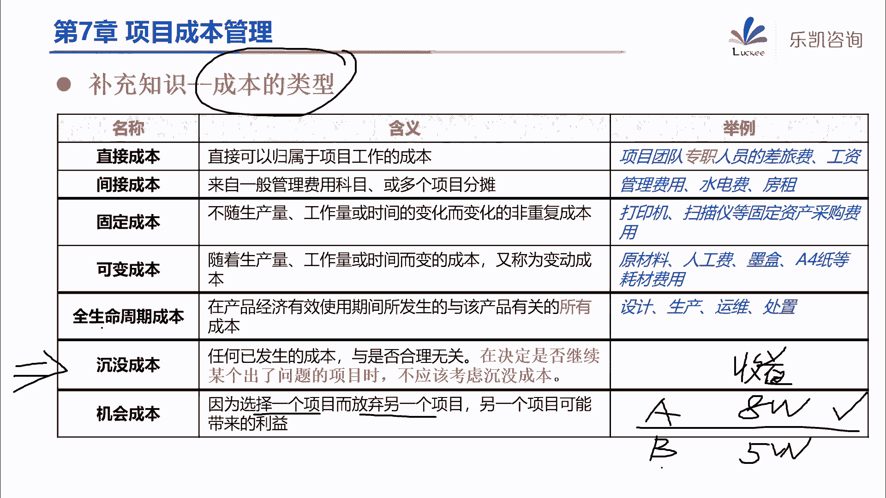

不要去看，好吧好，接下来还有一些财务的概念，那么财务概念这一块呢，实际上应该在讲商业论证的时候就要去讲，那么我们在计算的时候一起去讲讲，那么第一个概念呢叫限值和折现率啊，这些概念呢大家呢要了解一下啊。

有的p的不考了，但是有的考的我会说的，首先第一个概念叫限制，那么现值呢它的缩写也叫pv，但是不是我们政治管理的pv好吧，那么为什么要强调限值这个概念呢，我举一个例子啊，比如说我现在找大家借8000块。

8000美金，3年之后对吧，因为我们手头比较紧，我3年之后我再还给你8000美金，你们接受吗，那很多同学肯定不接受啊，靠你现在找我借8000美金，3年之后还我8000美金。

3年之后的8000美金跟现在的8000美金，它不是一个不是一个概念啊，好，为什么现在的8000跟3年后的8000，它不是一个概念呢，因为这里面就涉及到什么，涉及到折现率或者涉及到什么呢。

我们把折现率啊用一个更简单的说法，大家更容易理解叫类似于通货膨胀，通货膨胀对吧，就像我们有同学说的钱是有它的时间价值的，那么我就想知道3年之后的8000，相当于现在的多少钱呢。

好我就要把3年之后的钱通过折现率折一折，直到现在多少钱对吧。

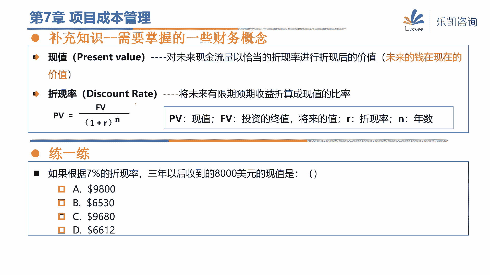

所以在我们讲义上出现了像这种公式，包括后面还有可能出现这种公式，那么大家不要害怕，讲义上为什么有这种公式的出现对吧，因为这种故事写在讲义上，会显得讲义的逼格很高对吧。

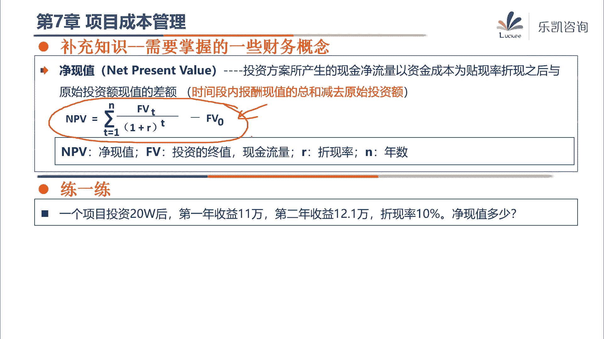

实际上呢不需要这么复杂，好吧，我解释一下你们就知道了啊，不要看这个公式，这个公式写出来，那是唬人用的，那么要知道3年之后的8000美金是多少钱，很简单啊，题目都会告诉你折现率是多少的。

或者通货膨胀是多少的，你怎么做呢，很简单，8000就是3年之后的8000了，你要折一折去除以一加7%对吧，1年就折一次，2年就折两次，3年呢就折三次，这不就算出来了吗，那么有的同学说。

考试的时候遇到这种题目怎么办好，以前可以用计算器的时候很简单，你就按计算器8000÷1。07，再除以1。07，再除以1。07，明白吗，那么现在由于有疫情出现了，考试不发计算器了。

那么这种题目也就意味着什么，现在不考了，明白吗，现在不考了，但是大家要知道它的意思是什么，好吧，就是说多年之后的钱，肯定跟现在同样的钱是不一样的，它是有通货膨胀的，有折现率的，我要把它去折对吧。

那么我要知道折现率，然后一个一个去折出来，直到现在看一看究竟是多少钱就可以了。

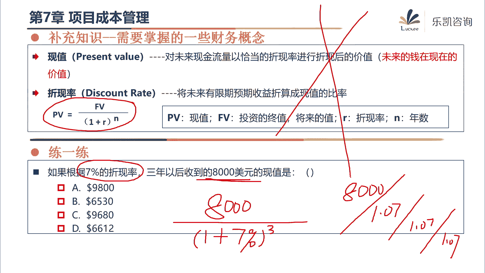

好吧好，接下来再看净现值，npv，ntv呢也是一个财务指标，那么什么叫npv呢，pv就是值，我们最终啊俗称叫净收益是多少，我们把将来的钱减去投资对吧，好，我们看一下，直接用题目来看啊，不要看这个公式啊。

他说一个项目的投资20万，第1年收益11万，第2年收益12。1万，折现率是10%，那么近限值是多少，好这种题目怎么算啊，很简单，我们先把收益先折到现在，那第2年是12。1万对吧，他告诉你折现率是10%。

那么他要经过2年了，要折两次，对吧，然后接下来第1年收益是11万，那么经过1年要折一次，这才是真正的收益，第1年收益多少，第2年收益多少，这才是折到现在的收益吧，好这个项目当前现在就要投20万，对吧。

那么这样一节才是我们2年之后的净现值，或者叫净收益n p v对吧，好有的同学会发现啊，最终算出来n p v等于零，那么我问一下大家，npv等于零代表什么意思，能理解吗，npv等于零，它是什么意思。

知道吗，诶我第2年的收益相当于现在多少钱，第1年的收益相当于现在多少钱对吧，那么我今年呢就要投20万，我发现啊，现在投20万在1年之后拿这么多，2年之后拿这么多，我一算减去20之后等于零。

好有人说白干了对吧，当然你说白干了，白搞了也对啊，但是换一种说法，我们可以这么说，2年怎么样，2年我们收回了成本，对吧，2年我们收回了成本，那么有同学说这个20万为什么不要折啊。

因为20万是什么时候要投的，大家注意我的说法啊，这个项目现在就要投20万，现在就要投20万，现在的20万就是20万对吧，那么现在投了20万之后，在1年之后我收入多少，1年之后的收入要折的。

2年之后收入多少，这个是要折的对吧，20万是我现在就要掏出来的，那么mtv等于零，就代表2年之后能够回本对吧好，那么这个计算np v怎么算，现在也不会考了，但是大家要明白一个道理啊。

如果我们在现在论证的时候发现我投20万，2年之后，np v等于零或者npv甚至大于零，这个项目能不能做，这个项目是可以做的，但是如果你算一算，发现npv有一个项目npv是小于零的，那么意味着什么。

意味着这个项目也许就不值得投资了对吧，那么大家要注意npv是越大越好，所以说现在考试会出这样一种题目。

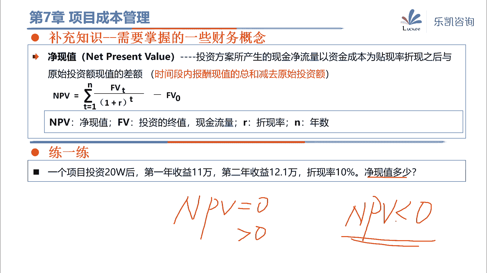

好吧，这道题目会做吗，以下是几个潜在项目的npv信息，作为项目经理，你最佳选择应该是哪一个，这种题目啊他考试会考的啊，只要你的眼睛没有毛病，只要你的眼睛是没问题的，你就能够把它选出来，你就选什么。

首先第一个这个负的，谁敢做这种项目啊，那么同样在这个里面你选什么，你当你选一个最大的n p v，越大越好，明白吧，好这种题目会做吧。

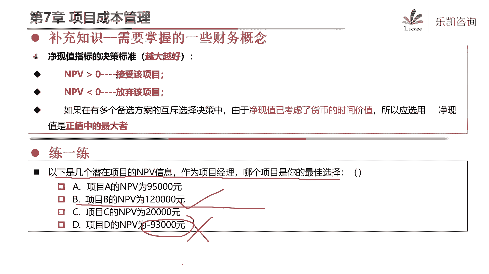

n p v越大越好，好吧好，接下来再看内部收益率，这个现在考试不好，大家稍微理理解一下就行了。

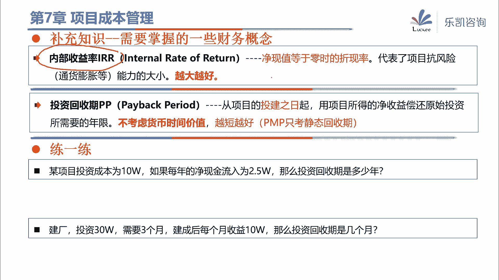

什么叫内部收益率呢，就是n p v等于零的时候的折现率，那么像这道题目对吧，哎我算出来正好mp v等于零，那么我们就说这个折现率10%，叫内部收益率好吧。

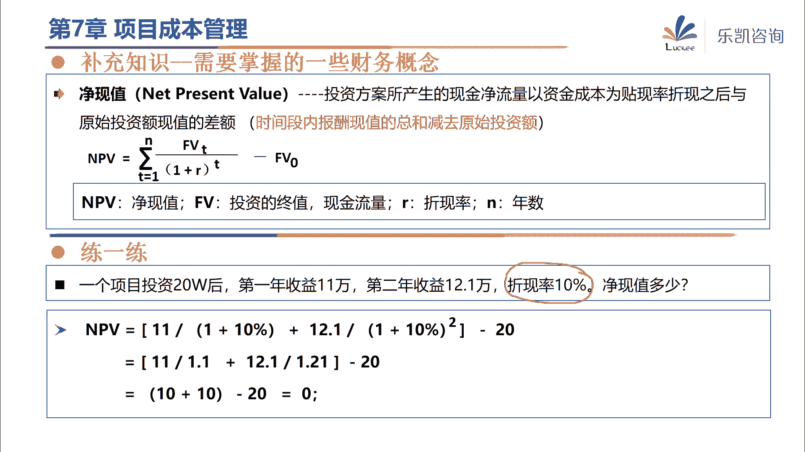

那么内部收益率呢越大越好，因为越大就代表了抗风险的能力越大，这个呢稍微了解一下，现在考试不会考到的，那么现在考试仍然会考到的，另外一个是什么啊，就是这个东西投资回收期，那么什么叫投资回收期呢。

就是从这个项目投建之日起，我们取得的收益正好能够抵消掉我们的投资，说白了就是回本多长时间能够收回成本对吧，那么偏僻里面的投资回收期呢更简单，他不考虑时间价值好吧，比如说我们看这道题目。

有一个项目投资成本是10万，每年净现金流入2。5万，多长时间回本，这个会算吧，这太简单了，10÷2。5，很明显，4年回本对吧，我们不要考虑说2。5要不要折，因为在pp里面注意在算投资回收期的时候。

我们就不考虑货币价值时间的呃，货币的时间价值了，只考虑静态回收期，好吧好，第二道题目，建厂投资30万，需要三个月，建成之后每个月收益10万，几个月回本，那么大家要注意这道题目，一定要强调这句话。

从头建之日起，你建厂需要三个月，这个时间是要算的，对吧，而且这三个月是没有任何收益的，你建成了之后好，一共投了30万，每个月收益10万，所以六个月收回成本好吧，那么这种题目一定要会做的。

那么我们在做项目的一开始的选择的时候啊，一定要注意，如果从投资回收期的角度来说，我们要选择什么，越要选择投资回收期越短的对吧，越短的越好，那么np v越大越好，投资回收期越短越好好吧。

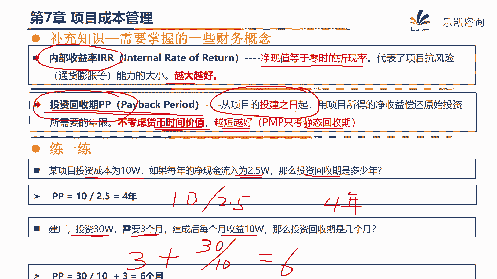

这两个搞清楚就可以了，那么其他的像什么投资回报率，roi或者收益成本比bcr这个东西呢，稍微看一下就行了，好吧，那么像这些都是财务指标，那么我们在初期商业论证的时候在论证什么。

实际上就是论证这些财务指标，比如说啊我们有多个项目，我们考虑他们分别n p p是多少对吧，或者投资回收期是多少，那么如果题目中说到np v那么我们就选大的，如果题目是以投资回收期为指标的。

我们就选短的好吧，那么这些东西呢稍微了解一下。

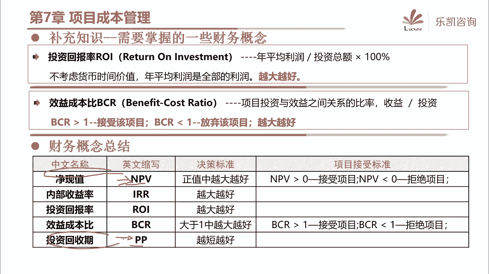

现在考的特别少了特别少了，好吧好，那么第六章我们就讲这么多好吧，那么我们到目前为止啊，范围进度成本啊，三块已经减掉了好吧，那么这三块的关系呢其实还是比较重要的，我希望大家通过第五章，第六章。

第七章这三章的学习，对于我们项目中的范进程，这三个重点要有了解好吧，我们从收集需求到定义范围到创建w b s对吧，这是范围的范围基准，然后接下来定义的活动排列的活动顺序对吧，估算活动持续时间。

然后制定进度计划，从范围得到了进度对吧，然后根据进度计划去估算成本，去制定预算得到了成本，所以我们叫范进程，范进程好吧，那么567这三章的内容，大家要自己能够学着把规划的这几个过程，把它串出来好吧。

怎么样从范围，我们是怎么样一步一步学到进度的，然后进度是怎么样一步一步估算出成本，制定出预算的，好吧好，那么今天我们就讲到这里啊，我们在周六的时候会有大量的计算题。

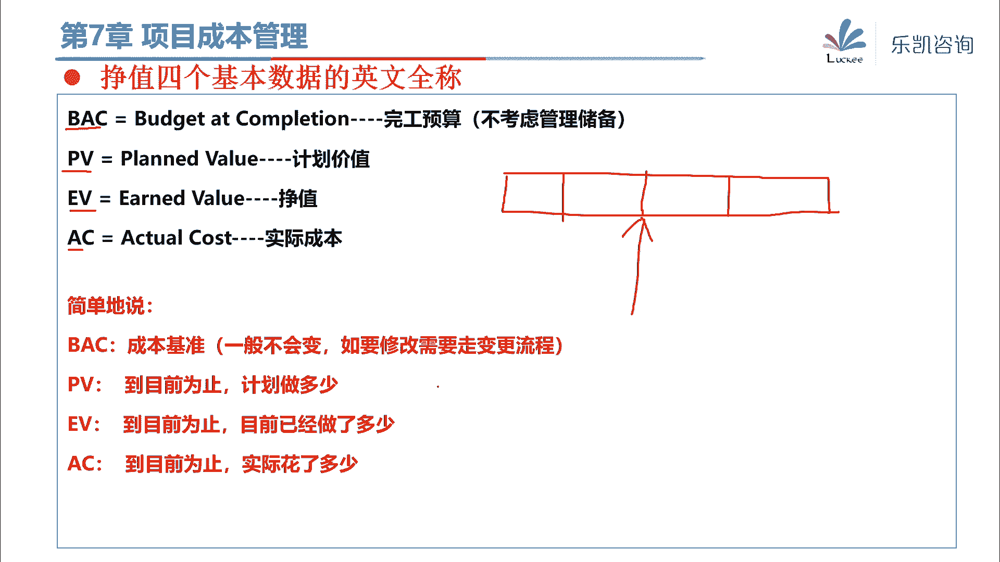

来帮大家巩固这一块。

巩固这一块的计算，大家一次性把这一块练熟了，一直到考试就不要去管了好吧。

只要在这里把它学的很灵活，很熟练了，后面再考试就不要去管了，考试这种题目很少很少遇到了，也很简单，肯定会做的好吧好，那么今天的课程有没有什么不理解的地方，有什么问题留下来答疑好吧，考那个周六啊。

周六大家在做题的时候用计算器啊，用一下手机上的计算器。

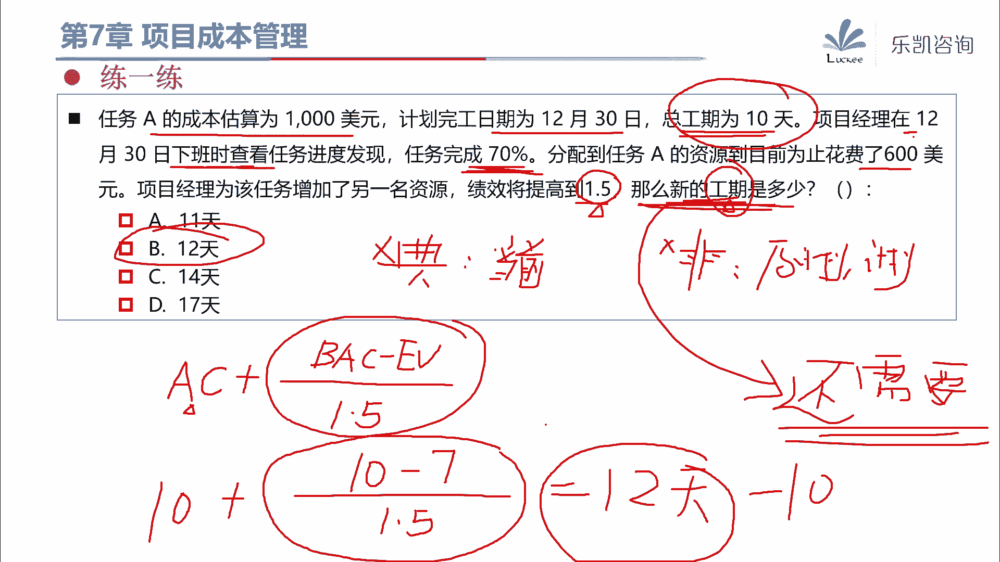

现在考试是不能带计算器的，我们平时练习，你可以自己用计算器去算一算，考试呢由于现在这个以前是发计算机，现在呢由于疫情的原因呢，他不发了，因为你发了计算机又不是送给你的，他发了之后。

计算器要把它给回收的呀，对吧，那么一一方一回收，这就有问题，所以他干脆就不发计算器了，那么不发计算器就意味着计算题很少，很简单，好有人同时问了一个问题啊，说有两个项目，a项目，b项目。

a项目已经投入了100万收入3万，b项目已经投入了10万，收入5万，我跟你跟大家说一下啊，你不要跟我说，a已经投了100，b已经投了十，明白吗，这个叫已经花掉的钱，我还是这个意思。

不管你后面选择a选择b，总之你110万是不是已经花了，是这个意思吧，不管你的选择是什么啊，选什么，我们一会儿再说，对不对，那么你告诉我，不管你选什么，是不是这100万跟这10万都已经花了，是不是呢。

对不对，那么这100万和10万还需要考虑吗，你就不要考虑了呀，有什么好考虑的，我选a也好，选b也好，反正这110万是已经花了，也就是花掉的钱不要考虑了，我们只看什么，只看我现在我哪做哪个选择。

我的收入是最大的，对不对，这有什么好纠结的呢，班永强，你要注意一下你的问题跟这个是两个问题，班永强，你的问题是什么，你说的是啊，有一个项目我投100万收入3万，还有一个项目我投10万收入5万。

请问你是什么时候说这句话的，你是在这两个项目怎么样，还没做的时候，对不对，那么这两个项目a和b还没做的时候，你让我选，那还用说吗，我肯定选b啊，傻子才会选a，那么我们刚刚说的什么叫沉没成本呢。

沉没成本是这两个项目已经花掉了对吧，所以我在上课的时候是这么说的，a项目已经花了100万，b项目已经花了10万，对吧，那么这个100万跟这个10万都已经花了，这个有啥好考虑的，明白这个意思吧。

沉没成本他说的是什么，对于已经花掉的钱，我们不要去想了，好吧，他不是做论证了，这个能够搞清楚吧，好有同学说多久回本的项目算一个好项目，这个呢不用没什么好说的啊，我们没有一个指标说多久回本。

回收期越短越好，你说我今天投了10万，明天就回本，最好，好有同学问了一个问题，他说实际项目中价值跟工期它不是线性的，这怎么办，比如说我们刚刚说的1000块的项目干十天对吧，在第五天的时候。

我们认为pv就等于500，那么实际做项目的时候，每天正好是100吗，他肯定不是啊对吧，实际做项目的时候他是这样的，比如说诶第一天我们计划100诶，第二天可能是这样的，300诶，第三天又变成了200。

对吧，那么这种情况我们怎么去算，其实很简单啊，我们在实际做项目的时候，你就这么去算，比如说呢第二天pv知道吧，你原来的pv是平均算的，那么实际做项目的时候pv你就按照计划去算，这个时候第二天下班的时候。

pv他就是400，对吧，然后你做了多少，你自己去看，你花了多少，你花掉的钱还不知道吗，拿发票拿过来加一加吗，对吧，ac不就出来了吗，然后你再去看spi和cpi是什么情况，明白这个意思吧。

那么至于后面的预测，你就要考虑清楚，究竟你这种情况适不适合用典型，还是说你能够保证后续恢复成原计划，用非典型对吧，或者说用其他的绩效，那么这个要根据项目的实际情况去考虑的，我告诉大家啊。

政治管理这一套方法论是一个很好的方法论，但是在实际做项目的时候，有的项目不太好用，明白吧，为什么不太好用呢，这几个值有一个值其实不太好抓，哪个值不太好抓呀，pv很简单，你对照计划去加就行了，对不对。

反正就是到某一个时间为止，我计划一共要做多少ac呢，也很好算，因为ac是花掉的钱，花掉的钱你自己，那你不管从财务那边，还是从你们公司的系统里面能够看到的，花掉的钱花了多少就多少，关键是ev不太好算。

有的同学说ev不是很简单吗，你做了多少就多少，有的时候没法算的，我问大家一个问题啊，这里有一个电饭锅，电饭锅呢在烧饭是要烧一锅饭，这一锅饭的价值30块，现在呢这个饭呢正煮到一半，你说它煮熟了没有呢。

没熟，你说他煮了没有呢，也不能说一点都没煮吧，他已经在冒烟了，已经在咕嘟咕嘟在响了，那么你说在这种状态下，这个ev算多少，算30不行，算零不行，那么你算多少呢，算十吗，15呢还是20呢。

好像怎么算都不太好，对吧，所以ev实际上是最难抓的一个数据对吧，当然我们在实际做项目的时候，有很多的手段去做，包括在我给那个我们上海的一家企业，就是商飞嘛，坐飞机的在给他们讲这这节政治管理的时候。

我也介绍了很多的方法啊，比如说用里程碑法呀，用各种方法去算，但是实际上ev这一块不是很好抓好吧，不是很好做，所以大家对于这一块的理论学习啊。

要知道好吧，实际做项目的时候能用多少用多少啊。

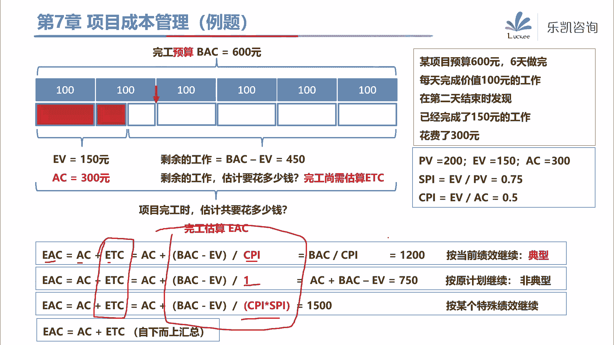

不要觉得我学的这个政治管理啊，我后面在项目里面一定要去算的很清楚对吧。

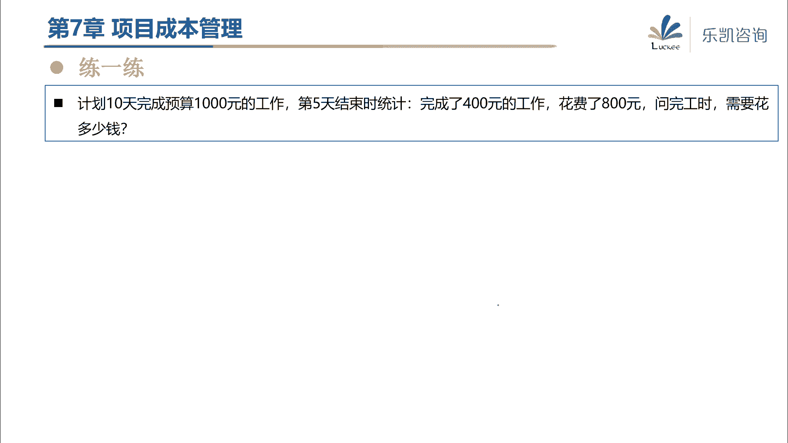

要看情况的，有的项目真的不适合用。

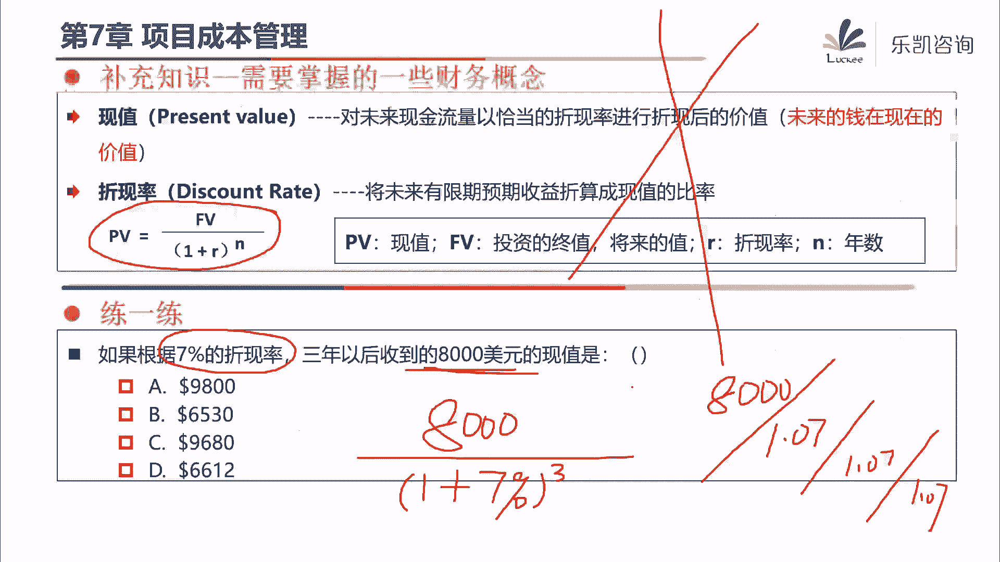

好有的同学说怎么样去理解内部收益率。

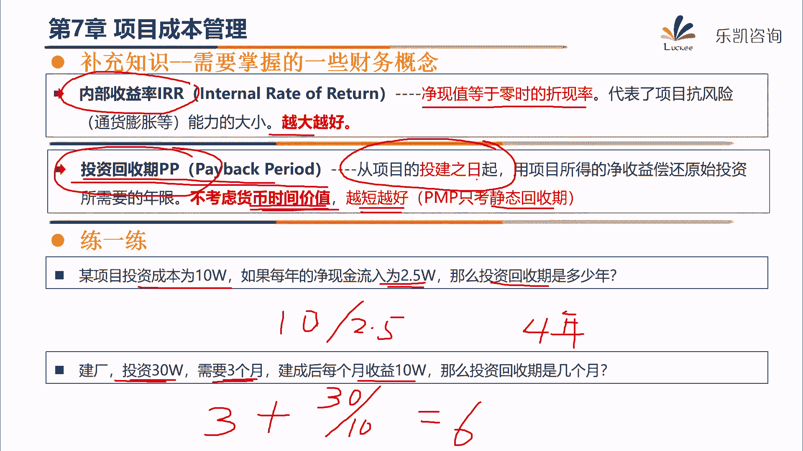

i r2 越大，抗风险的能力越强，我举一个例子，有a和b两个项目，好a项目呢是这么说的，他第1年的收入，第1年的收益啊，a的折现率，比如说是xb的折现率是y好，a是这么说的。

一加x第1年的收入是收益是a对吧，然后接下来第2年的收益是b，除以一加x的平方减去投资等于零，n p v等于零，那么这个x就叫它的内部收益率i r2 好，假如说我发现算下来x等于10%好。

b项目呢是这样的，第1年的收益除以一加上y，然后第2年的收益除以一加上y的平方，然后减去投资也等于零对吧好，我算出来发现y呢等于15%，那么这两个项目，哪一个项目抗风险的能力要强一些。

好接下来注意听我说的话，a项目是什么情况，当通货膨胀达到10%的时候，我这个项目不亏本，b是什么情况，当通货膨胀达到15%的时候，不亏吧，好谁抗风险的能力强，对吧，用一个简单的描述你就会发现了对吧。

a项目是什么意思呢，通货膨胀达到10%，我不亏本，b说通货膨胀是15%，我也不亏本，很明显b抗风险的能力要强一些对吧。

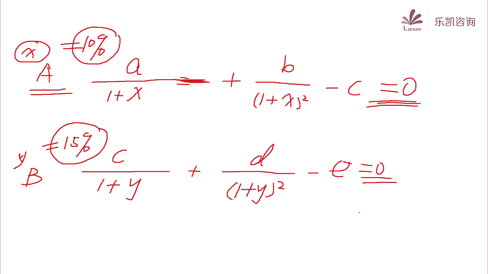

所以呢我们在刚刚上课的时候。

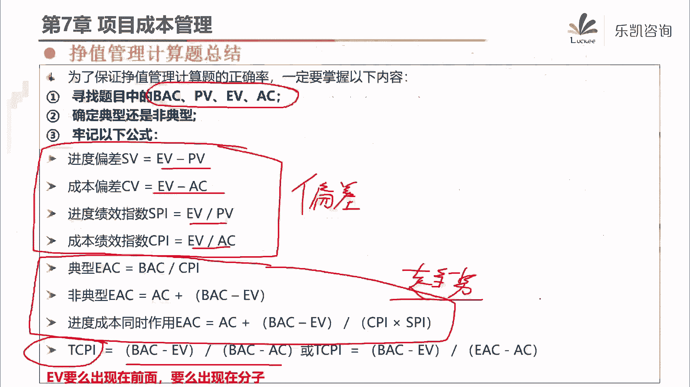

笼统呢就说了这样一个观点，了解一下啊，什么叫内部收益率对吧，那么内部收益率越大，抗风险的能力越强，就这个意思，明白吧，那么现在我们不要求大家去，计算这个内部收益率，好有同学说。

项目的投资回收期是从投降之日起开始算的，但是有一些项目，他投的钱并不是一开始全部投的。

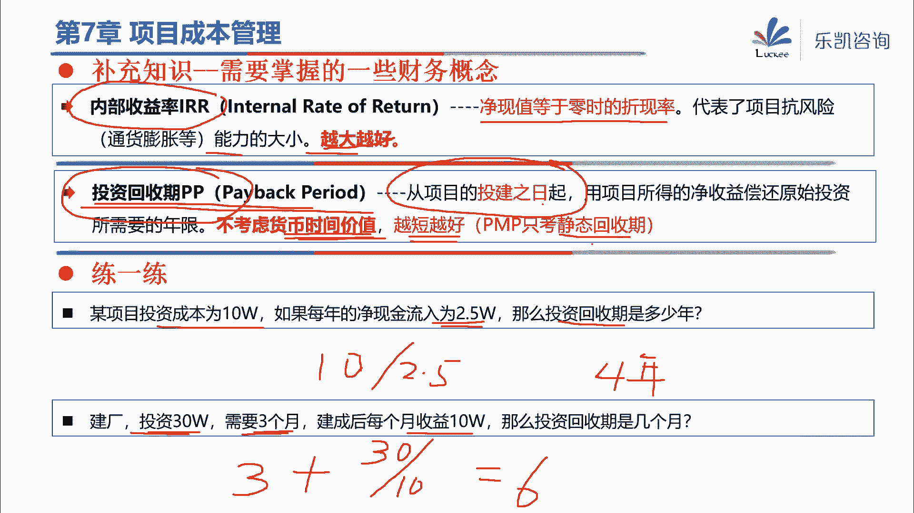

而是逐渐投的，那么这个需要特殊考虑吧，关于这个问题。

我说一下啊，其实几乎任何一个项目的投入，它都是分阶段投入的，我们很少见，有什么项目在开始的时候，直接把钱全部投进来对吧，我们讲成本的时候，说成本它都是分阶段去投入的，都是这样的，对吧，但不管怎么说。

虽然我一开始还没有投入，但是我有什么，我肯定有一个数字吧，我整个项目总的投入是多少吧，对吧好，我预计最终我会回收回多少吧，多长时间收回成本，你这个数字是有的呀，你根据这个去计算就好了呀，明白这个意思吧。

至于说这笔钱他分几次投到这个项目里面，那这个是我们不要关心的，我觉得没有必要关心，我们这个星期六用题目去巩固一下，这一章的一些公式和计算好吧，然后星期六呢做一个单元测试，我们第六章和第七章的实战。

我们会放到第八章那一章，周六去讲，那么我们这两个星期主要把这两块计算的，我们把它巩固一下好吧，好有同学说考试的时候，如果说关键路径的总幅度时间大于零，是不是错的，那么你要看他这句话是怎么说的，明白吧。

我们一般说关键路径上的活动，总幅度时间应该是等于零对吧，但是有没有可能出现大于零或者小于零呢，也不是完全不可能，比如说我们在上课的时候说过，如果活动延期了，那么总幅度时间是负的。

如果关键录音的活动提前了，那么它的浮动时间就是正的，对吧，严格的说，关键路径的活动的总幅度时间可以是正的，可以是负的，也可以是零，都有可能的。

关于r o i和bcr这个东西啊，稍微去看一看就行了，不要去花太多的事情好吧，2o i他说的是年平均利润除以投资总额，效益成本比是指项目的投资跟效益之间的比例，好吧，这个我觉得你是不是这个没有搞清楚啊。

利润跟这个投资，他的关系是什么，明白吗，包括收入跟收益对吧，像这些东西啊啊如果有兴趣的自己去看一看，思维导图肯定会放在d盘的。

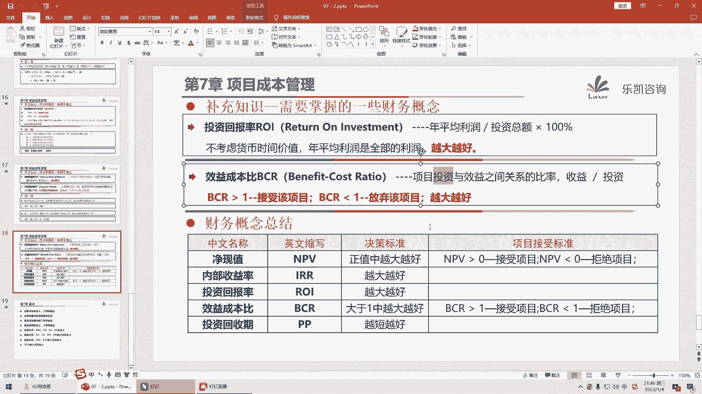

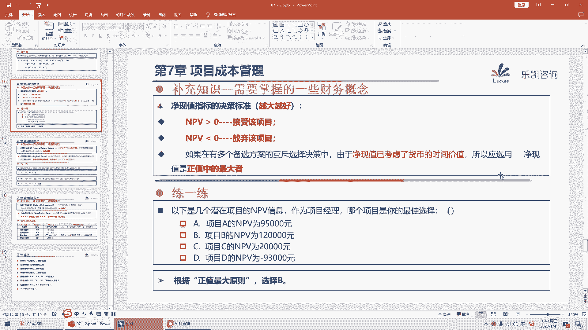

大家的重点啊，还是把它放到政治管理的这一块计算。

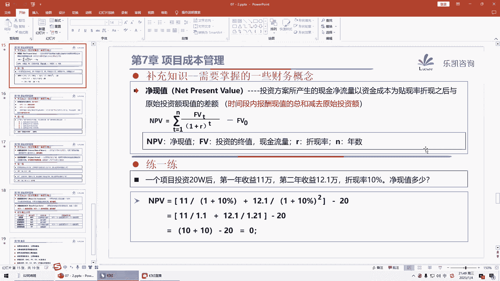

我们后面不太会有时间再去复习这一块了，因为这一块计算的比较简单好吧，我们在这个时候把它一次性听懂，基本上一直到考试我们就不太会变了，好还有什么问题没有，如果没什么问题，我们今天就先这样好吧。

如果大家在后面复习的时候，遇到什么有难度的地方啊，有什么疑问，大家可以在群里面相互去讨论，或者直接艾特我，好吧好。

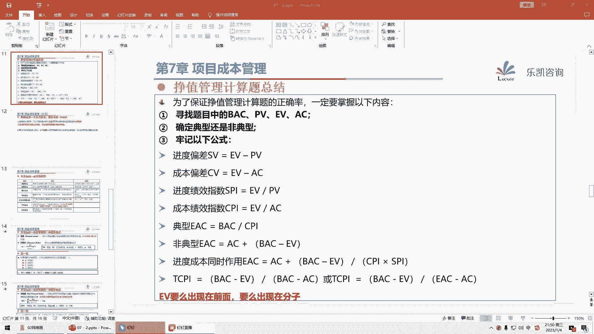