# 2024年PMP认证考试课程针对PMP新考纲最新免费零基础也能轻松听懂 - P13：PMP第8章：项目质量管理（下） - 乐凯咨询 - BV1Rj411G7gs

好各位同学晚上好，上一节课呢，我们学的这个第八章项目的质量管理对吧，那么我们讲了，如果要做好质量管理，首先我们要有计划，就是p t c里面的p对吧，所以我们讲了怎么去规划质量管理。

输出的质量管理计划和质量测量指标，然后接下来我们说，质量管理实际上并不是只去检查结果，我们更重要的是要管好过程，因为过程管的好会带来一些好的结果对吧，如果过程不好。

那么结果往往是不在我们控制范围之内的啊，会出很多的意外，所以说我们要重视过程管理，所以我们讲了管理质量这个过程对吧，管理质量就是为了管过程的，那么我们管理质量介绍了两个工具。

一个就是我们p里面的第一大审计叫质量审计，另外呢还有核对单对吧。

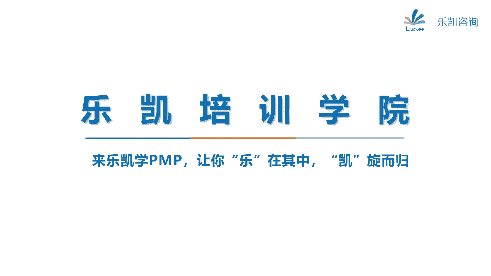

那么接下来我们看一下，还有什么工具可以帮助我们来管理过程，那么首先我们看数据分析技术，在这些工具里面啊，文件分析呢就是查一查文件这个比较简单，备选方案分析，就是从很多备选方案里面去选择一种。

这个呢我们也讲了很多，那么比较重要的是这两个工具啊，第一个叫根本原因分析，简称叫rca，root cause analysis，也就是说在我们发现问题的时候，我们一定要想办法找到问题的根本原因是什么。

那么为什么要找到问题的根本原因呢，因为只有找到问题的根本原因，我们才能够从源头上解决问题，那么从源头上解决问题了，总结的经验教训，我们可以杜绝问题的再次发生，所以这个工具是比较重要的一个工具。

那么我们在平时的工作或者做项目的过程当中，遇到问题，一定要去找问题的根本原因，如果你没有找到问题的根本原因，那么这个问题有可能你表面上是解决了，但是呢用我们一句俗话说叫治标不治本对吧。

所以一定要去找问题的根本原因好吧，那么这种工具在考试中会经常出现啊，比如说出了一个问题，那么问你现在我要查原因，应该用什么方法，只要叫你查原因，你就一定要查根本原因，用根本原因分析对吧。

因为只有他能够从源头上解决问题好，另外第二个工具叫过程分析，这个工具也要注意，它是很典型的管过程的一个工具，他说什么叫过程分析呢，就是我们要识别我们这些过程当中，有没有哪些改进的机会对吧。

比如说发现过程中存在哪些问题，而有哪些制约因素会影响我们的过程，以及我们要发现一些非增值活动，那么关于这个非增值活动呢，我稍微解释一下啊，大家知道什么叫非增值活动吗，其实从它的字面意思就可以看出来。

非增值就是这些活动呢是不会带来价值的，那么大家通过我们之前的学习，能不能猜到，比如说有哪些活动叫非增值活动吗，唉就像张勇说的，不产生效益的对吧，不带来价值的，有同学夏林同学马上说出来了对吧。

我们之前讲到的镀金，镀金这种活动肯定是不带来价值的，对吧，包括我们的一些浪费，我们如果做制造业的同学，应该听说过什么八大浪费对吧，那么像这种非政治活动，我们要把它找出来对吧，要去避免这些东西。

当然大家要注意啊，非政治活动并不是说所有的都是不好的好吧，那么这里呢给大家稍微提一提啊，考试不一定考，其实非增值活动呢也分为不必要的，必要的，那么不必要的就是我们刚刚说的像镀金啊，浪费啊。

我们要尽量的去避免对吧，但是也有一类活动，它是非增值活动，也就是说不带来新的价值，但是它却是必要的，大家能猜得到是什么活动吗，啊我们这些活动要做，你做了，那也没有新的价值，但是呢又不得不做。

那这种也有的，比如说举一个很简单的例子测试，你说测试这种东西它带来什么新的价值吗，它不会带来什么新的价值对吧，你但是呢你要不要做呢，你肯定还是要做的，你不测又不行对吧，所以像这种的叫必要的非增值活动。

那么我们所谓的发现非正式活动，主要是这种像镀金浪费这种，那么我们在做的过程当中，如果有什么需要改进的啊，如果有一些镀金的或者浪费的行为，我们要尽量的去避免，那么过程分析主要是这个作用好吧。

那么这两个工具呢比较简单大致的说一说，大家再结合字面意思，就知道它是啊怎么去用的好吧，那么决策就是多标准决策分析这种工具呢，我们之前讲过多次，我们就不说了好吧，那么接下来有几张图很重要，也是考试的重点。

大家一定要掌握。

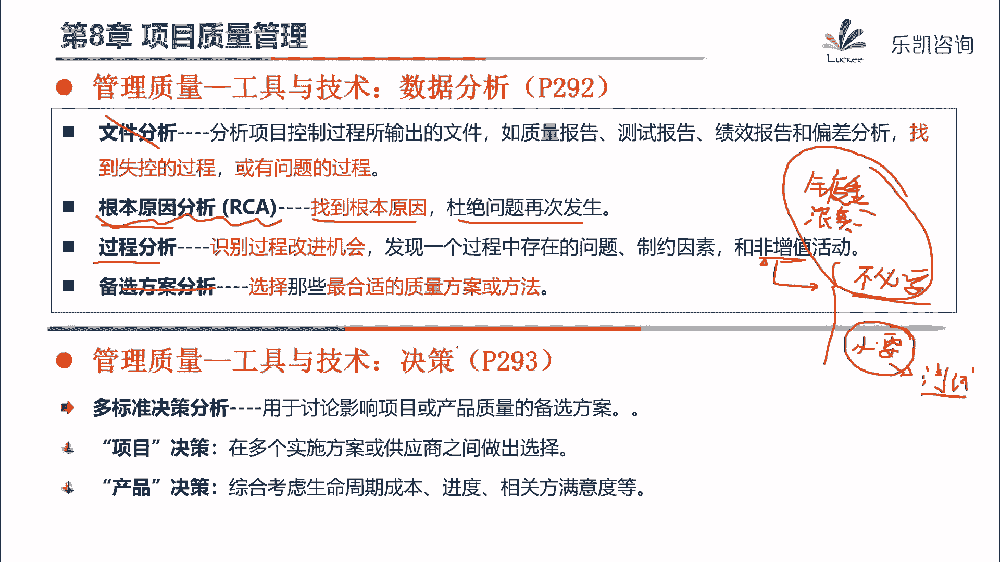

首先看第一张图，第一张图叫英国图，因果图也叫鱼骨图，也叫石川图，我们在上一节课介绍过一个质量管理大师，教师穿心对吧啊，就是用他的名字来命名的，那么也叫yy分析图，那么这个图是用来干什么的呢。

他说这个图啊是用来把问题那放在鱼头的位置，然后从各个分支去不断地问，为什么为什么一直找到问题的根本原因对吧，那么我们做制造业的同学，应该听说过这样一个说法，叫人，料，法环对吧，那么什么叫人机料，法环呢。

就是说当我们发现了一个问题的时候，我们怎么去画这张图，我们把问题放在鱼头的位置啊，现在遇到一个什么样的问题对吧好，那么接下来我们从人员的角度去看一看诶，是什么原因导致这个问题的，包括g呢，就是设备对吧。

然后料就是物料，发就是方法对吧，环就是环境，那么人机料法环这几个维度不断的问，为什么为什么去找到问题的根本原因，那么由于我们有一些同学他不是做制造业的，所以我们讲义上的举了一个例子。

比如说我们把问题放在鱼头的位置啊，诶我发觉最近我的学习情况不太好，比如说我们做周练习，做单元测试，发掘风速比较低好，那么接下来我从这几个分支，分别去找根本原因对吧，学习方法呀，非智力因素啊。

智力因素啊对吧，去找好，那么接下来，为什么学习状况不好呢，那么为什么你水平不高呢，啊因为我的基础知识掌握的不好对吧，好往下拨了一层，那么再问为什么你的基础知识掌握的不好呢，哦因为有一些定义我搞不清楚。

很混淆对吧，当然你可以再问为什么你的定义比较混淆呢，因为我课后没有很多的时间来复习对吧好，那么为什么你课后很多的没有很多的时间呢，因为现在年底了特别的忙对吧，这是我们很多同学给我的一个最终的答复。

那么最终我们就发现啊，原来是由于最近啊时间丰富的比较少啊，工作特别忙导致的对吧，导致了我基础知识不扎实，导致了我学习状况不好，所以他是用这种方法，那不断的问为什么，为什么去干什么，去追溯。

去追溯问题的来源，究竟问题来源于什么地方，那么通过不断的问，为什么，为什么，包括我们常说的那用五个y，其实这个五个y啊不一定是问五次，为什么对吧，它体现的是一种什么呢，叫打破砂锅。

问到底一定要找到问题的来源，也就是问题的根本原因究竟是什么，那么我们找到根本原因就可以去解决问题对吧，那么因果图是用来找根本原因的，一个很典型的工具，那么我当时在学p m p的时候啊。

学到这个因果图的时候，我听到了一个故事，我感觉这个故事呢其实还是很有意义的，所以呢我分享给大家好吧，希望给大家能够有一些启发，那么我当年在学这个工具的时候啊，我听到这样一个说法，说在日本的企业里面啊。

有这样一个东西，叫安东省嗯，啊这个翻译的可能不一样，有的叫安东，有的叫安东对吧，那么总之大致的读音上差不多，那么什么叫做安东省呢，他说是这样的，在一个流水线上啊，在流水线上。

那么流水线上有很多的工位了对吧，每个人都要完成一道工序了，然后接下来在这个工位旁边呢有一根拉绳，有一根绳子，那么这个拉绳是干什么用的呢，说这个拉绳秀是拉下来之后啊，就是当你发现问题诶。

你发现这道这个东西到你这边，你发现有问题，你就拉下这个绳子，那么一拉这个绳子会导致什么呢，会导致整个流水线停掉对吧，那么对于这种事情是比较严重的对吧啊，整个流水线都停掉了，那还得了好。

然后接下来大家停下来怎么办，大家就从四面八方围过来围观对吧，哎你为什么要拉这个绳子，为什么把这个生产线给搞停了，好然后这个人就说了，我发现什么什么东西在这边是有问题的，对吧好，那么发现问题怎么办。

查原因，为什么，为什么会出现这个问题，到上一道工序去围观对吧，哎你回答一下为什么会出现这个问题呢，好那么这个人我也不知道啊，我是对照我们的操作手册去做的呀，对吧好，那么接下来再问为什么对照操作手册去做。

还会出问题呢，再去围观对吧好，最终发现这个操作手册版本有错，那么再问，为什么为什么会出现这种版本错误的情况，好最终查到了原因，那么查到了问题的根本原因之后，接下来怎么办。

那么接下来希望以后不要有这种情况对吧，大家要吸取经验教训以后，我们要杜绝问题的再次发生，那么接下来搞清楚了生产线再跑起来对吧好，如果发现问题怎么办，另一个哥们儿又把这个绳子拉下来了。

那么整个生产线又停下来了，又去问为什么，为什么又去找根本原因对吧，然后我们以后要避免这个问题，那么我问一下大家，用这种做法来搞生产，他有什么不好的地方能够看得出来吧，这很明显这样搞。

我靠这个效率太低了对吧，你比如说你生产电视机的，你这个一天能生产几台电视机啊，你这个要等死人的对吧，所以说一般的企业还真的不会这么搞，那么什么人这么搞的呢，日本人这么搞的对吧，但是你会发现啊。

他这样搞下去，到最后变成了一个什么后果啊，我们有一句俗话叫，当优秀成为了一种习惯之后，你会发现很可怕，它可怕在什么地方啊，第一当他不断地坚持这样做下去，几十年之后，你会发现它的效率逐渐的上来了。

效率上来了也也不比你们慢多少对吧，第二个更可怕的是什么呢，就它的质量，非常的牛逼，我不知不知道有没有跟我差不多年龄的，像七零后，八零后，八零后这种对吧，小时候我有很多同学买的日本的家电，九几年90年代。

那个时候日本的家电数量，平心而论确实做得不错对吧，也包括我们现在有一些人去日本去旅游，也会去买一些这个日本的一些东西啊，比如说那像我朋友去日本买什么电饭煲啊，保温杯啊对吧。

那确实他们做的质量还是很不错的对吧，那么我后来呢我看到这个问题之后呢，我也想到我身边也有这样的例子啊，比如说，小孩儿在很小的时候放学做作业的时候，我们都强调什么呢，要一笔一画地把字写好是吧。

那么一笔一划把字写好，他会有一个什么后果呢，他作业做得慢啊对吧，所以我小孩在刚刚读小学的时候啊，我我每次都会讲到我小孩这个故事啊，各位有小孩的同学要吸取经验教训，我小孩在上1年级的时候，我们家住三楼。

他的同学住四楼，四楼的那是一个小姑娘，每天做作业要做到晚上的九点钟，十点钟，我小孩做作业七点钟肯定做完了对吧，当时我老婆很开心，言外之意呢，我小孩很聪明对吧，但是我发觉我小孩的字写的不太好。

那么这个事情呢也没有引起重视对吧，好时间不用长，过了几年上4年级的时候，34年级的时候，你就会发现到后面大家做作业的速度差不多，但是有一个很可怕的地方啊，就是别的小孩儿，那楼上的那个小孩儿写的作业。

家长会上是用来展览的，我小孩的作业经常被老师扔到门外对吧，包括到现在啊，已经读高一了啊，昨天在家里面考试，我看到他在家里面写的答题卡，我真佩服他们的老师能看得懂他的字对吧。

那么你说你发现这个问题你要去改变，他能不能改呢，说实话我尝试过很多次改变，改不了了，我也知道这个东西不是一朝一夕，能够改得过来的对吧，那么也就是说你坚持这样做下去之后，你会发现啊。

真的你好像跟别人已经拉开了很大的差距，而且你要追上别人，诶，好像一时半会儿很难追上去对吧，所以说呢，为什么很多质量管理商人的一些思想啊，在日本能够推得下去，真的大家可以好好的去想一想对吧。

包括我在讲第八章，一开始的时候，我就问了大家一个问题啊，我说戴明博士的思想，为什么在日本被日本人接受了，日本实现了经济的腾飞对吧，我说经济吧，说经济说实话，对我们这些凡夫俗子来说太遥远是吧。

但是呢我在上一节课提到过一个事情，大家都公认的就是日本的足球对吧，在我们小时候那个年代，他们日本的足球跟中国足球的水平，那么差不多对吧，谁也不要笑话谁，大家都很臭是吧。

但是他就能搞一个什么所谓的百年计划是吧，那么到现在能看出差距了吗，看出来了对吧，日本队亚洲劲旅对吧，中国队，啊不用多说了是吧，大家都懂的，所以说真的有一些地方，大家真的要值得好好的去思考思考好吧。

那么回到这个工具，因果图是用来干什么的，一定要记住啊，因果图是用来不断的问，为什么为什么问五个y追溯问题的来源，去查问题的根本原因的，当然第六版说它是用来查问题的主要原因，或根本原因好吧。

那么重点还是根本原因，这个要记住的好吧，那么另外可能有同学会提出一个疑问，那么既然因果图也是用来查根本原因的，他跟我们之前讲的根本原因分析，root cause analysis有什么区别呢，大家注意。

我们可以把因果图看成是根本，原因分析里面的一种工具，就是根本原因分析啊，可以用很多的工具，其中比较有代表性的就是因果图，那么在考试的时候大家要注意啊，如果一道题目问你，我们现在要查原因。

那么我们应该用什么方法，那么大家注意他只是单纯的说查原因，你就说我要查根本原因，我们用根本原因分析对吧，好，如果他问的是，那么我现在要查就是查根本原因，那么用什么好，说到查根本原因的时候。

那么要借助这个工具，用因果图或者叫鱼骨图好吧，这个图在考试中出现的比较多，也比较简单，遇到考这个工具的，他就是送分题一定要做对的好，接下来第二个图直方图。

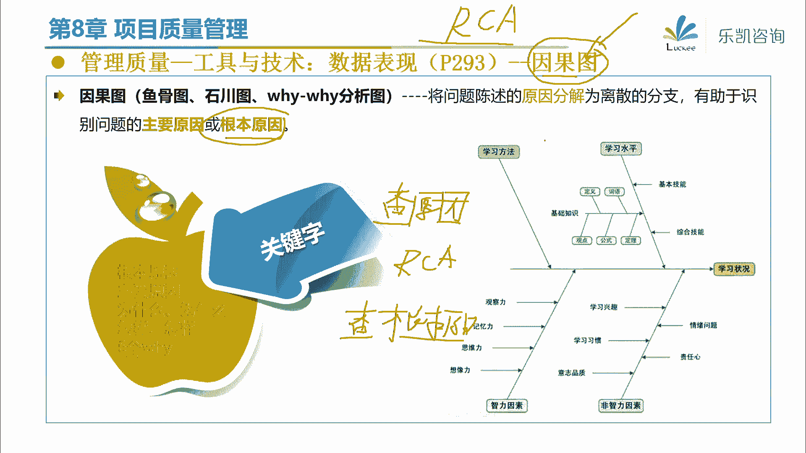

那么什么叫直方图呢，直方图其实很简单，它就是一个数据的条形图对吧，比如说像这个例子啊，为什么我们没有及时的登记工作时间呢，它是有原因的对吧，那么什么原因导致的呢，它可能有多种原因对吧。

他说时间不足多少次，22次管理指令，三次过程文件有问题，30次系统故障，三次旅行16次对吧，反正把各种原因它分别是多少次啊，就是说多少的频率或者频次，它把它显示出来对吧。

那么像这张图写的是显示的是什么呢，显示的是平次，就是次数，那么什么叫显示频率呢，其实很简单，你把总次数算一算，然后每一个占百分之多少啊，你用百分比来表示也可以，比如说时间不足占50%对吧。

管理指令占5%啊，过程文件占百分之多少，你把百分比列出来也行，那么它就是一个简单的，显示频率和频次的一个工具，那么这个工具呢它比较简单，是一个简单的数据条形图，那么在这个工具的基础上。

我们要补充一张图叫帕雷托图，那么这个图在书上没有，但是考试的时候很有可能会考到，那么接下来我介绍一下直方图的升级版。

叫帕雷托，帕雷托图，有的地方也把它翻译成叫柏拉图，实际上帕雷托啊，它并不是项目管理方面的专家，帕雷托，他是一个人名，他是意大利的一个经济学家，那么他提出的一个观点，大家一定听说过，叫80%的财富。

掌握在20%的人手上对吧，他的说法简称叫二八定律，对吧，就80%的财富，掌握在20%的人手上，那么为什么在我们管理上面，也引用了这样一个观点，而且我们还形成了帕雷托图呢，因为一样的在管理上。

80%的问题，是由20%的原因导致的对吧，那么接下来我用一个例子来给大家演示一下，这张图是怎么画的，好吧好，比如说我想知道大家迟到的原因是什么，那么我统计了一下，我一共统计了200次的迟到对吧。

好堵车导致了迟到72次啊，有一些呆萌的人对吧，迷路导致的迟到八次，由于天气原因导致的迟到24次，睡过头92次，还有其他五花八门的原因四次，那么接下来怎么办呢，好接下来对应的频率，那这个是频率。

这个是平次都可以列出来对吧，那么接下来它跟直方图的区别在什么地方，第一他做了排序，对吧，他画了这张图，这个坐标显示的是平次，这边的纵坐标呢显示的是频率，然后接下来我们排序，先画第一个最大的最大的是谁呢。

是睡过头对吧，那么睡过头占46%，一共是92次，好那么接下来我们就把这个柱子画出来，次数92次，占46%，在这个里，那么接下来再看第二大原因，好第二大原因是什么呢，是堵车，堵车占多少次呢，占36%，好。

大家注意啊，堵车把次数画出来是72字，但是它的频率要画多少呢，要画82%嘶，那么有人说这82%是怎么来的呀，好82%，他是把之前的46%加上，这一次的36%，加出来之后是82%。

也就是说它跟直方图第二个不一样的地方，是它的频率用的是什么频率呢，我们叫累计频率，啊我们不是算他自己的频率，后面的都要算累计频率，那么36%加46%，那么就到82%，在这个点对吧好。

然后接下来再看第三个，第三个是12%，那么这个12%也不是点，就描在12%的对吧，你次数是24次，但是频率是多少呢，再累加变成了94%，好，那么逐个逐个累加，最终到百分之百了，好。

接下来你把这些点连起来，他就是这么一个情况，那么连起来之后，我们在80%左右的地方看一看，好这个点之前的主要是由什么东西组成的，那么接下来这两个比较重要的，我们就找出来了对吧，你会发现大量的迟到。

其实是由少量的这两个原因导致的对吧，那么用帕雷托图有什么好处，用帕雷托图是用来找什么原因呢。

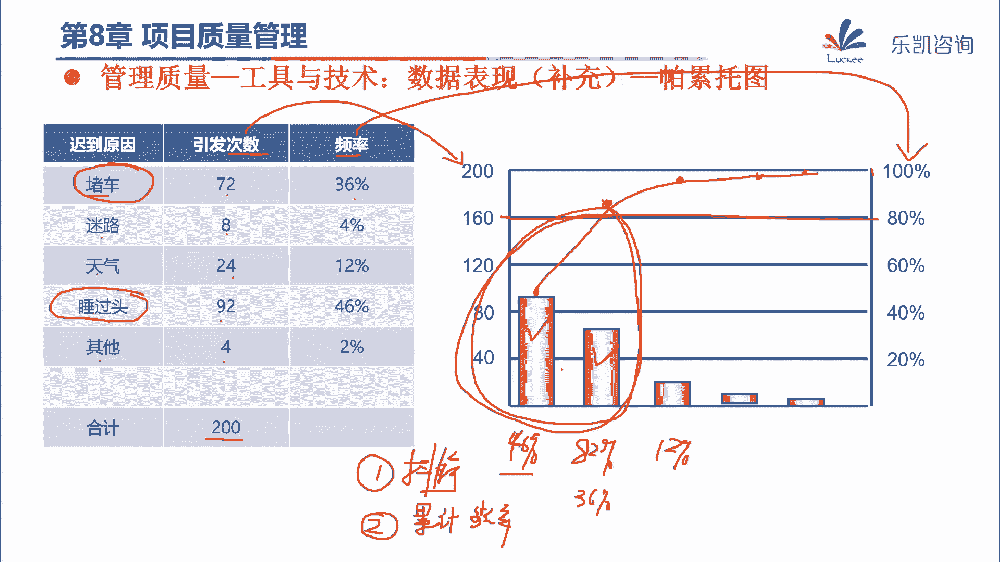

好大家注意，用帕雷托图是在众多的原因里面去找主要原因，它是用来找主要原因的对吧，那么接下来我问一下大家，为什么我们要找主要原因，对吧，原因都找到了，就这么多，那么为什么我们要去找主要原因呢对吧。

要识别造成大多数问题的少数重要原因呢，建筑的目的是为了什么，好大家注意用这个图的思想是什么啊，其实很简单，就是我们俗称的叫抓大，放小，对吧，抓大放小，通过这个图我们可以有重点的去采取纠正措施。

因为你会发现啊，其实我们要一下子解决所有的问题，这个是不现实的对吧，有各种各样的原因都会导致这个问题，那么我们说把所有的原因全部都搞定，这个呢我们资源有限，我们人力有限，我们的时间也有限对吧。

那么如果你想得到一个很大的提高，其实最有效的方法是什么，就是把这些主要原因解决了对吧，比如说你把这两个原因解决了，那么你的迟到的情况就会得到大大的改观，是这个道理吧，所以说帕雷托图是很典型的。

用来找主要原因的一个工具，那么我们刚刚在学鱼骨图的时候说过，哎，鱼骨图也可以用来找主要原因或者根本原因啊，好大家注意，在考试中，如果问你哪一个图能够找到主要原因有帕雷托，一定要优先选择帕雷托。

它是找主要原因的最好的一个工具，明白吧，那么帕雷托图它跟直方图的区别是什么，大家也要注意的，它体现了两点不同，第一个他排序了对吧，第二个它的频率不是简单的频率，不是自己的频率，而是强调累计频率。

那么我们在以后做项目的过程当中，如果发现导致一个问题，是有很多的原因导致的对吧，我们可以借助这个工具去找到主要原因，然后抓大放小，那么这种问题出现就会很少很少好吧，那么这个图在书上没有。

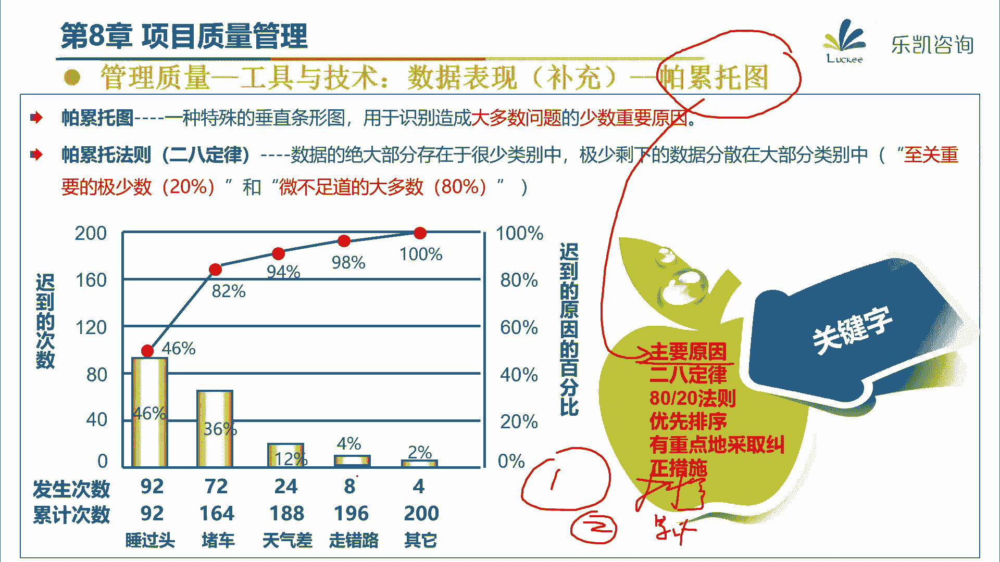

大家一定要记住的，好吧好，接下来还有散点图，那么什么叫散点图呢，好散点图就是用来描述两个变量之间，究竟有没有关系的，那么说到这里呢，我倒想起了很早以前的一个故事，以前呢有一个超市叫沃尔玛对吧。

那么沃尔玛呢在很早的时候呢想搞一件事，就是做这样一个东西叫bi商业智能对吧，他希望在超市的时候，超市里面用这样一种系统，来提高他们的这个啊销售额，那么当时呢有一家公司呢，就帮他们去做这套这套系统。

那么做完了之后呢，就发现一件很奇怪的事，我相信很多同学应该听说过这样一个案例，奇怪在什么地方呢，就是他发现啊，当纸尿布，当纸尿布卖得多的时候，这个啤酒啊，同时卖的也很多对吧，那当时呢得到这样一个结果呢。

但是大家很费解，就是说纸尿布和啤酒好像两个不同的类别呀，对吧，那为什么纸尿布多的时候，啤酒卖的也多呢对吧，那么当时的技术人员发现了这样一个数据的，第一件事情是干什么的，第一件事情不是做别的事情。

第一件事情是道歉，说不好意思，我们好像这个程序出问题了啊，我们回头去检查一下对吧，好检查之后呢，发现呢这个程序又没问题，对吧，那么后来呢他们花了很大的时间去研究啊，最终发现啊确实只要不跟啤酒是有关系的。

什么关系呢，他说在国外啊，比如说像美国球赛比较多，很多人喜欢看球对吧，同时呢小孩呢用纸尿布呢哎也有了很大的年龄，那么当父亲去超市买啤酒的时候，会想起诶家里好像纸尿布也不多了，顺手买纸尿布。

那么当小孩的母亲去超市买纸尿布的时候，也会想起来诶，家里的啤酒好像不多了，顺手去买啤酒，那么这就导致了纸尿布和啤酒之间，它的销量好像是有一些关系对吧好，那么实际上呢如果当初用这样一个工具散点图。

也许我们就不需要花那么多的时间，就能够很简单地分析出，这两者之间究竟有没有关系，那么接下来大致的演示一下啊，怎么借助散点图来分析这两个变量有没有关系。

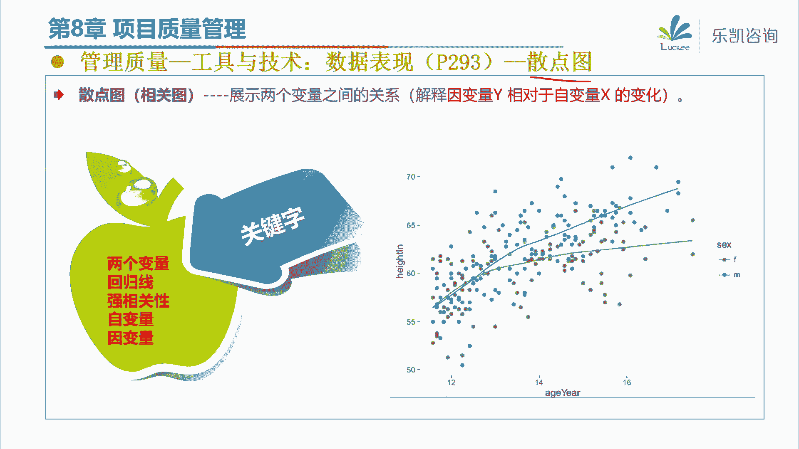

好很简单的，我们来画一张图，这张图很简单，就两个坐标，一个就是啤酒的销量，啊啤酒每天卖了多少罐，然后另外一个维度呢，另外一个坐标就是纸尿布好，纸尿布每天卖多少包，好那么接下来你怎么去画这张图呢。

你就分析，比如说一个月啊，统计一个月好，第一天啤酒卖了多少，纸尿布卖了多少，把数据分别列出来，比如说这边是啊，纸尿布的高速的数量，纵坐标是啤酒的灌输的数量，好，第一天我发现啤酒比如说卖了1000罐对吧。

那么纸尿布卖了，比如说50包好，那么接下来他的点在这边，这是第一天的点对吧好，第二天啤酒卖了900罐啊，比如说纸尿布卖了35包对吧，好，第二天的点在这个位置，那么第三天啤酒多少罐，纸尿布多少包好。

把每一天的这个点描出来对吧，好描出来之后，如果说你发现啊，就是这些点成一种强相关性对吧，或者叫正弦关系，那么就代表这两个变量之间，应该是有关联关系的，它们相互之间是有关系的对吧，那么反过来说。

假如你统计了每一天的啤酒和纸尿布的数量，把这个点找出来，这些点呢是这样的，你画不出像我们刚刚的这条回归线啊，它很离散，那么就代表这两个变量之间，应该是没有关系的对吧。

那么其实你用这张简单的图就可以看出来，这两个变量之间。

究竟有没有所谓的叫自变量和因变量的关系啊，如果说你能够画出类似这样一种回归性的对吧，那么这就代表他们有有关系的啊，那么我刚刚画的这种叫正回归正向的对吧，那么我们也可以是负向的，就是一个月大。

另外一个越小，那不管怎么说，正的负的都代表他们正相关，负相关都代表有关系对吧，那么如果说完全没有关系的，那么它的点应该是很散的，画不出一根线的，对吧好，那么如果我们用这张图发现。

啤酒的销量跟纸尿布的销量是有关系的，那么各位同学应该知道，在超市里面我们应该怎么去安排吧，其实很简单，在往纸尿布走的路上，我们可以放啤酒，对吧，那么这样可以相互去促进他们的销售。

那么有的同学说这个线是怎么画，实际上在我们的ppt里面都有这样一张图，对吧，在pp里面都有这样一张一张工具，你只要把数据放进去，它的图不就自然形成了吗，就像我刚刚说的啤酒跟纸尿布对吧。

啤酒每一天销量多少，纸尿布销量多少，你有这两个横坐标和纵坐标，你是不是就可以描述一个点了对吧，第一天的点，第二天的点一直到几十天的一个点，把点全部都瞄上去，那么你就大致看一看。

就知道他们究竟有没有相关性嘛对吧，你只是要判断他们之间有没有关系嘛，至于他们是什么样一种关系对吧，具体的参数怎么去除，这个形式不重要，这个图主要是用来展示什么呢，两个变量之间究竟有没有关联关系的。

明白吧，那么这就是一个散点图，所以在考试当中经常会问你啊，我发觉员工的休息时间啊，跟什么什么东西不知道有没有关系，那么你用什么图来看一看究竟有没有关系呢，那么就用散点图好吧，散点图就是分析两个变量之间。

究竟有没有关系的，那么这几张图啊。

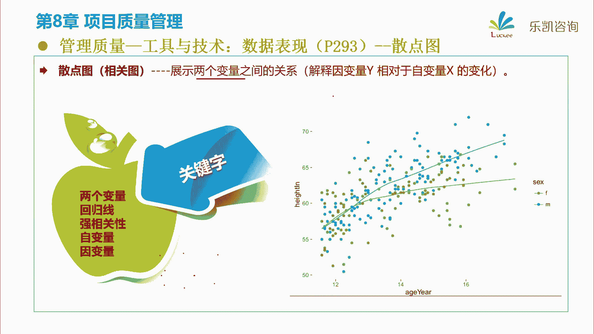

大家一定要引起重视，在考试的时候考的特别的多好吧，找根本原因的因果图，找主要原因的首选帕雷托好吧，如果没有帕雷托，那么你可以选英国图好吧。

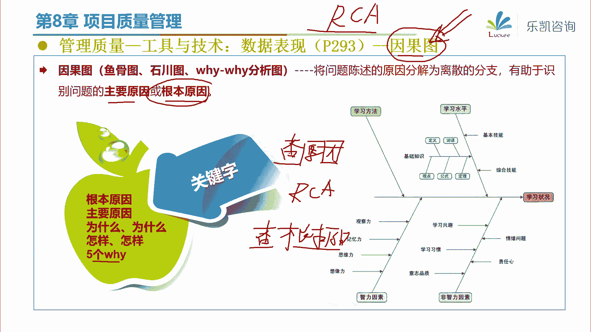

因果图主要是根本原因，帕雷托是主要原因，然后接下来散点图是分析两个病人之间，究竟有没有关系，那么我们在管理质量的时候啊，我们当要解决一些问题的时候，我们可以根据需要去选择，比如说你要查根本原因。

用鱼骨图对吧，原因太多，要找主要原因，用散点图啊，用那个帕雷托图，然后看看这两种基因有没有关系，用三电图好吧好。

另外还有我们说这个过程叫管理质量，而不是叫以前的实施质量保证，为什么呢，因为他考虑到了设计，对吧，那么这边提出来一个工具叫面向x的设计，简称叫df x design for x，那么为什么有一个x呢。

这个x代表什么呢，x可以代表各种方面，比如说我想在这个项目中做面向安全的设计，唉我们上一节课举了一个例子，班学生做课桌对吧，那么我面向面向安全的设计呢，我就这么设计，把课桌的四个角不要做直角对吧。

做成这种圆角的，那么为什么要考虑这个问题呢，因为在下课的时候，学生会打打闹闹，万一摔下来撞到脚上，那么圆角伤害性会小一些对吧，那么这种就叫面向安全性的设计对吧，当然如果说我希望我这个项目运行比较稳定。

我可以面向稳定性的设计，面向扩展性的设计对吧，实际上大家从我刚刚的描述，应该能够发现一个问题，什么叫做面向x的设计，它的目的是为了什么，其实你面向什么做设计，你的目的就是为了什么呢。

优化设计的某个方面对吧，你面向什么做设计，不就是为了优化设计的某个方面吗，比如说你是为了优化安全，优化稳定性对吧，甚至你面向成本的设计，是为了优化什么的成本对吧，那么这个工具比较简单。

你想对什么东西有优化，那么你就做面向什么东西的设计，好吧好，那么另外还有问题解决，那么问题解决这个工具呢其实很简单，其实很简单，但是我发觉啊，很多人第一不会用，第二呢考试也不会考啊，这个是很可惜的。

那么为什么说有很多人不会用呢，我们有很多人在做项目的过程中，甚至在我们日常的生活当中，都没有用好这个工具，对吧，那么他说遇到一个问题，我们应该怎么解决，要分为这六步，一定义定义问题是什么。

二识别识别这个问题的根本原因是什么，好三方案我们要生成很多的方案，对吧好，四选择选择一个最佳的方案，五执行执行这个方案，然后六验证验证这个方案是不是有效，对看上去很复杂，但是实际上啊我们真正要解决问题。

就是按照这六步来的，比如说我举一个例子，今天下课之后，你发现你的女朋友不开心，坐在沙发上生闷气，这是不是一个问题，这很明显是一个问题啊，那么这个问题要不要解决，怎么解决呢，首先第一步定义问题。

什么叫定义问题呢，就是要把问题描述清楚啊，我开开心心在上课对吧，我这么好学对吧，我也不知道怎么了，一下课之后呢，靠女朋友坐在沙发上生闷气对吧，那么你先要把这个问题描述清楚。

然后最好把这个问题记在一个地方，好问一下大家，问题记在什么地方，新问题出现了，定义好了，我们把它记在什么地方，还记得吗，对了问题日志，对吧，注意啊，问题是记在问题日志，这是一个问题。

那么接下来我们要解决它对吧好，那么接下来第二步干什么，唉人之常情嘛，你下了课之后发现你女朋友坐在沙发上不开心，你没有一点求生欲吗，你肯定要去干什么，要去查原因啊，第二步识别就是识别问题的根本原因对吧。

你不能找一些表面的原因，你问他哎你怎么了，他说我不舒服啊，不舒服啊，那早点休息吧，这个就没什么鸟用对吧，一定要识别问题的根本原因对吧，要去套他的话对吧，哎问他你怎么啦对吧，咱们这么多年了。

我们应该坦诚相待嘛对吧，你说一下究竟是什么事情惹你不开心了呀对吧，一定要识别问题的根本原因，把这个原因找出来，好在你的哄骗诱导之下，他说出来了，刚刚你在上课的时候，你的手机响了对吧，他看了一眼你的手机。

发现是你的前女友给你发微信了，终于找到了问题的根本原因对吧，你的前女友在你上课的时候，因为你上课没带手机吗，放在坐上马，结果手机一响，他一看你的前女友给你发微信了是吧，那么接下来你干什么。

那么很多同学马上脑子就转起来了对吧，干什么想很多种方案来解决这个问题啊，有什么方案，比如说哎呀，我是先跪下来认错，还是给他买个包哄一下他对吧，还是怎么怎么样对吧，各种各样的方案，脑子里面就开始撞了好。

然后接下来第四步，最终在这么多方案里面，我选择了一个最佳方案对吧，方案有很多啊，但是我要选择一个最佳的就买一包，太贵了对吧啊，有的人说带他出去吃顿好的也行对吧，但是更重要的一点就是要当着他的面。

把你的前女友的微信给删掉对吧，而且你要明白对吧，一个合格的前任应该像什么，应该他妈像死了一样对吧，不要再联系了，好选择了这个方案之后，接下来第五步干什么，你就要去执行，对吧，你要去做呀，对吧。

你光定方案是没有用的，好当着他的面把微信删掉，然后哎呀这事我不好对吧，怎么怎么样，明天我带你去吃个好吃的是吧，好接下来第六步干什么，验证，对吧，验证你的这个方案有没有起到效果，是不是，那么你想一想。

平时我们的日常生活，是不是都是这么去解决问题的，这就是pp里面讲的方法嘛对吧，pp它其实最大的一个作用是什么，就是把我们常用的一些方法做了总结和归纳，对吧，回过头来再看一看p m p里面讲的问题解决。

是不是就这六部嘛，第一步第一问题对吧，第二步了解问题的根本原因是什么，然后马上脑子里面想各种各样的方案，选择一个最佳的方案，然后去执行，然后验证一下这个问题搞定了没有，对不对。

所以这个其实是很简单的一个逻辑对吧，不要觉得很难背，你想一想你日常的生活就知道了，所以那问题解决就分这么六步，那么在考试的时候他会怎么考啊，很简单，有两种题目大家要注意了啊，第一种题目他会这么说。

在我们做项目的过程当中遇到了某个问题对吧，好问你首先做什么，那么大家要注意，当你发现啊，四个选项当中有一个选项是记录在问题日志，对吧或者呢叫更新问题日志，那么这个选项就是必选的对吧。

因为为什么预告问题你首先做什么，你看这六步的第一步是什么，第一步就是定义问题，那么定义清楚记在什么地方，就是记载问题日志，所以问题首先做什么，有更新问题日志必然选它，那么这种题目就是送分的啊。

三秒一定要把答案选出来，超过一秒我都鄙视你，明白吧，好第二种题目也是很常见的考法，现在在做项目的过程当中，项目经理发现了一个问题，那么项目经理下一步应该做什么好，a b c d4 个选项呢。

它都没有定义，没有记录问题日志，但是它有一个特点，有三个选项都在说我直接去行动啊，我撩起袖子，我就去找客户啊，或者我直接去找客户怎么怎么样了对吧，或者我直接怎么怎么样了，三个选项都是直接去行动。

只有一个选项是这么说的，他说我先分析一下，导致这个问题的根本原因是什么，那么大家要注意这种题目是什么题目，这种题目就是这两天有人在群里问的一种题目，叫山洞，一封信，那么什么叫煽动一分析呢。

就是当遇到这种题目，问你要解决这个问题怎么办，有三个选项是直接他妈去行动了，只有一个选项是我要分析问题的根本原因，在解决问题的时候，煽动一分析的题目，闭着眼睛去选，分析百分之百是对的对吧。

那么到底在什么地方呢，你会发现分析问题的根本原因是第二步对吧，这是第二步，而真正去行动是什么呢，行动是第五步去执行，所以问你下一步做什么，按照顺序来说，应该是先做第二步，识别问题的根本原因好吧。

那么这两种题目在考试中也经常出现，一旦出现这个分是必拿的，而且要快三秒钟，一定要把它做对好吧，那么这几个问题都是比较这几个工具啊，都是比较典型的工具，大家可以关注一下，那么另外还有我们要做好过程。

还可以用质量改进方法，那么这里面就有两个啊比较高大上的工具了，一个叫p d c a就是戴明博士提出来的对吧，戴明环计划实施检查行动，还有一个就是六西格玛，那么六西格玛呢，其实我们有专门的一个课程对吧。

曾经的我也曾经我年少无知的时候，我也去学了这门课程对吧，68它还分很多的等级，好像有什么绿带黑带啊，黑带大师啊对吧，那么六西格玛实际上是说什么呢，就是我们的缺陷率要做到，要低于百万分之3。4啊。

那么这个呢稍微了解一下，如果有兴趣的同学可以去学一学对吧，但是呢我友情提示啊，这个要看个人实力对吧，我当初为什么学不下去呢，啊因为到后面考黑带，考黑带大师，那那东西我听一听费用呢就让我对吧。

让我学不下去，这个费用呢是有点高的，那么大家有兴趣的可以去了解一下好吧，那么这个工具呢稍微了解一下，有这么个东西就可以了，好那么我们通过这些工具来对过程进行管理，那么最终把过程管好了之后会得到什么呢。

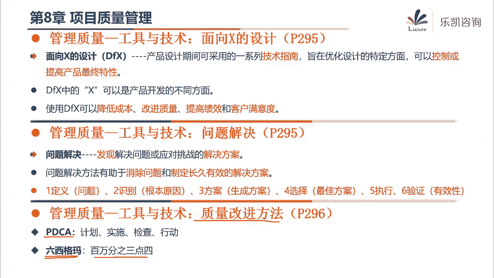

得到我上一节课给大家展示的一个东西，叫质量报告啊，质量报告，那么质量报告就是我们反馈的整个过程的，一些问题对吧，包括我们针对这些问题会提出一些改善的建议，或者纠正的一些建议。

那么这份报告呢它是可以是图片形式的，可以是文件形式的好吧，目的就是为了能够帮助我们纠正一些过程的，好吧，就是我上一节给大家看的那个我们的q a人员，最终出的那份报告，那么同时这个过程还会输出。

所谓的测试与评估文件，那么这个呢有点类似于我们软件行业的，叫测试用例这种东西啊，主要是为了方便后续的控制质量的，那么如果说在这个过程中发现了一些问题，需要纠正，它会影响到我们的项目管理计划对吧。

那么我们要提出变更请求好吧，那么总的来说这个过程它的工具是比较重要的，好吧好，那么这个是管理质量，大家一定要记住啊，管理质量是为了管过程的对吧，那么通过我们这个过程的学习。

特别是对于一些平时接触质量比较少的同学，要注意，其实质量是靠过程对吧，管起来的，而不是直接去查结果对吧，质量不是靠检查出来的。

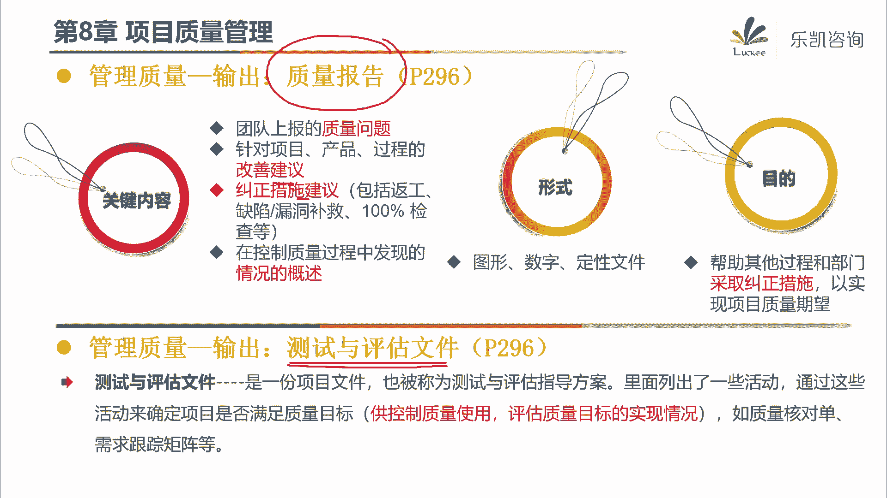

好吧好，那么接下来第三个过程，第三个过程叫控制质量，那么我们说规划质量是定标准管理，质量管过程，那么控制质量我们也用三个字来总结，控制质量叫查，结果，对吧，虽然我们说好的过程，那么结果就不太会有问题。

但是不代表这个结果我们就不查了，我们过程要做好，但是最终的结果我们仍然要去查，那么查结果查结果，其实我们在很早以前就说过他了，它跟一个词有关，叫什么呢，核实大家还记得吧。

说我们的可交付成果要具有可核实性，而我们的可交付成果做出来之后要经过什么，要经过核实吗，要经过控制质量，所以这个过程实际上就是何时项目的可交付，成果和工作是不是达到相关方的质量要求对吧。

那么如果达到了就可供晏殊，那么这个过程做完了之后，可供验收是交给谁去验收，交给确认范围去验收好吧，那么在我们敏捷项目当中，他说q c应该由全部成员来做，那么控制质量简称就叫qc嘛。

call it control对吧，那么另外他还说有的行业qc就更为严格，比如说制药，医疗运输，核能等等，这些行业它的qc就很严格，为什么很严格，因为万一他们qc不严格，出了问题好。

那就是很严重的问题对吧，包括我们建筑业啊，也是一样的对吧，你比如说我现在在上课的这个地方，就时刻的警醒我，建筑业的qc一定要很严格，因为我们家后面那个小区，就是曾经上海倒楼的那个小区，对吧。

这个楼倒了就不是小事儿啊，当初那个楼还没有交付，里面有一个工人在里面，结果死了对吧，那么最终我也很很感兴趣啊，最最终这个判决会怎么判，我特地去查了那个报道，项目经理被判了3年了对吧，所以这种特殊行业。

它对质量的要求是非常严格的，是非常严格的好吧，不在浦东了，不是之前上海不是有一件事情，楼倒了吗，当时我还没住在这边，我同事住在这边对吧，说早晨晚上睡觉的时候，感觉好像是有那么点动静。

早晨起床刷牙的时候总感觉少了点什么，对吧啊，我同事是这么跟我描述的，他一边在刷牙，一边在想，今天感觉少了点什么，当时我还问他，我说怎么你的电瓶车被偷了，他的电瓶车偷了，那倒也不奇怪对吧。

我忽然发现有一栋楼他妈不见了对吧，然后他说我看了一看，那个楼趴在地上啊，结果死了一个人，是吧，然后项目经理呢我后来看了一个报道啊，项目经理当时好像是涉及到那个资质的挂靠。

他并没有到现场去组织项目管理工作对吧，然后好像是被判了3年，所以这些行业对质量的要求还是比较严格的，所以大家，这个我不建议大家考这种高风险的证书是吧，比如说什么消防啊，什么什么乱七八糟的啊。

因为楼还没有交付嘛，还没有交付是吧，所以还好啊，如果交付了出事，那就很可怕了，好吧好，那么接下来我们看一下怎么来控制质量。

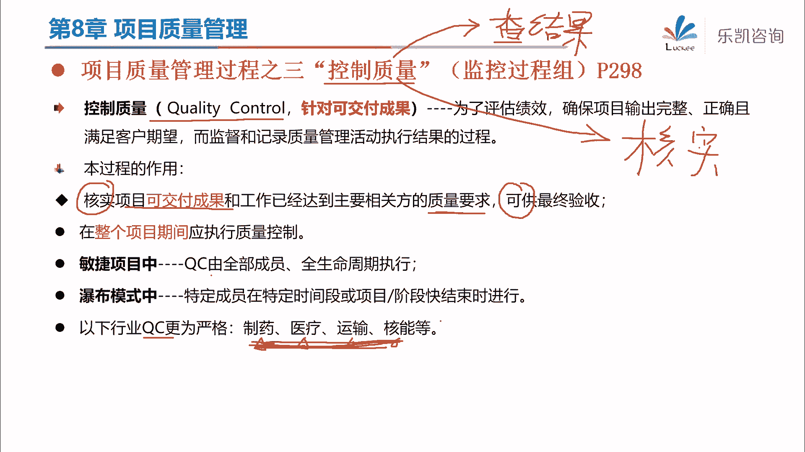

首先控制质量要去核实可交付成果，我们要借助一些文件，借助一些输入的好，借助什么输入，最主要的就是这个东西，大家还记得我们在规划质量的时候，输出了两个文件对吧，一个输出了质量管理计划。

还有一个输出了质量测量指标，质量测量指标就是衡量可交付成果，具体是不是合格的这样一个具体的指标对吧，而且我们还说过允许接受的误差范围叫什么呢，叫公差，如果你超出这个范围，那么就不合格。

所以这是一个非常重要的输入，那么另外呢还有一个输入大家要注意的，我们在讲管理质量的时候，说到过批准的变更请求对吧，有没有再按照正确的流程在实施，那么这边它输入了批准的变更请求，那么主要是看什么。

注意控制质量，查结果对吧，它的结果做对了没有，那么这也是一个输入，当然另外最后一个关键的输入，就是我们的控制质量是为了干什么，是为了何时可交付成果的呀，所以它的输入也会有可交付成果对吧好。

那么接下来我们看怎么去核实它，怎么去核实可交付成果。

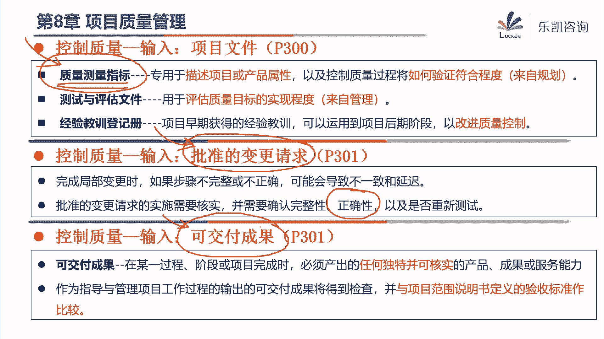

那么借助一些工具，首先第一个checklist和对单，那么这边的核对单呢，它仍然是用来一个一条一条跟你合适的，一个核对单，只不过这个核对单里面的内容写的是什么呢，可能是写了一些技术参数对吧。

唉比如说长政府不能超过多少，你这个打造了吧，好宽政府不能超过多少，那么这里面可能是一些技术规范的参数，那么去看你每一个参数是不是符合好吧，那么第二个工具呢跟他名字有点像，叫核查表好。

大家注意核查表跟核对单不要搞混了啊，核对单我们之前讲过很多了好吧，那么核查表是我们第一次遇到，核查表是什么意思呢，其实它是一个简单的计数表，它就是一个简单的技术表，在我们去核实可交付成果的时候。

我们可能会发现一些缺陷，那么每一种缺陷各出现了多少次，它会把它统计出来，比如说这边上什么sw浮高多少次对吧，欠屏多少次，联系多少次，当然这个图呢，我怀疑是不是老外喜欢这么画对吧。

用这样的一种方法画四个竖线，再画一个斜杠，那么如果是中国人呢，我觉得可能会写正字对吧，一个正两个正对吧，用这种方法，那么不管怎么说，他会把各种缺陷的数量出现过多少次，把它统计出来啊。

比如说分别这种缺陷各出现了多少次，然后合计多少字，那么把它一直统计出来，这其实就是一个很简单的技术表，所以核查表我们也有的时候把它叫计数表，用来计数的，那么关键是核查表做出来之后，这个一眼看过去呢。

好像看不出个什么名堂，所以我们可以把它转化成另外一种图，好转化成什么图，你看啊每个有各自的次数，还有总的次数，所以我们就可以算出来，每个东西它的频率是多少对吧，那么有了频率我们可以干什么呢。

第一我们可以对它进行排序对吧，好第二除了排序以外，我们还可以算出累计频率，然后在80%的地方划一根线去找什么，去找主要原因，所以我们可以用帕雷托图来进行更好的展示，好吧，有1年就考了一道很恶心的题目。

他说核查表统计出来的数据可以通过手啊，那个我们去计数计缺陷的数量对吧，我们记了很多数量，接下来我们用什么工具来进行更好的展示呢，那么这个时候不要去选择核查表，要进行更好的展示，是用帕雷托图来展示的。

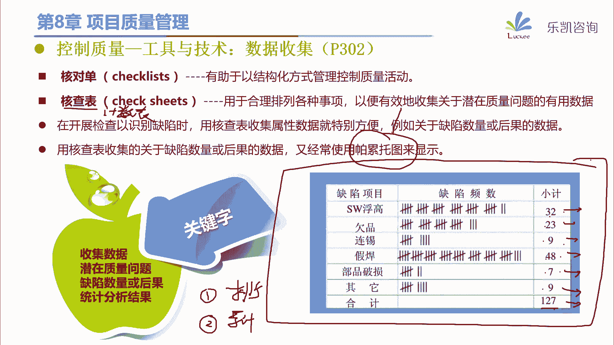

好吧好，那么接下来我们还可以对结果做什么呢，做统计抽样，这个我们在一开始上课的时候就讲过对吧，我们统计抽样可以用属性抽样，指定一个性或者用变量抽样，那么至于我们抽样的频率多久抽一次对吧。

每一次抽一下规模应该抽多少，那么这个我们可以在规划质量管理，也就是说做质量管理计划的时候，在里面把它说清楚好吧，那么像绩效审查根本原因分析这个呢很简单，大家看一看就行了，那么主要的一个工具是。

这个我们要对可交付成果进行检查，我们要去检查这些结果，它的质量是不是合格，那么我觉得有两个工具分别体现了两个过程，我们可以把它结合起来看啊，质量知识领域这两个过程啊，一个叫管理质量，一个叫控制质量。

我们说管理质量管过程，控制质量查结果，那么他们各自的很有代表性的工具是什么呢，管理质量的代表性的工具是这个叫审计啊。

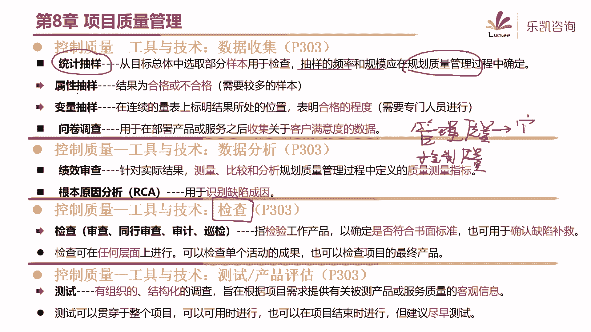

也叫质量审计，我们也可以说叫审计，是审核什么审的过程，而控制质量很有代表性的工具是什么呢，是检查，对吧，所以我们也说审计审过程，而检查是查的结果对吧，那么我们可以通过属性抽样变量抽样。

或者可以通过我们的传统的测试，来对结果进行检查，判断可交付成果究竟是不是符合我们的啊，质量标准对吧，那么如果合格，那么就合格，如果不合格，那么我们要采取一些措施，好吧好。

那么另外控制质量还有一个考得非常多的工具，叫控制图，那么控制图是干什么运动呢，他说我们在查结果的时候，我们可以结合这张图啊，控制图来显示一个过程是否稳定，或者是否具有可预测的绩效，那么这里面就涉及到。

规格线和控制线，那么接下来我用一个例子帮大家说一下，什么叫规格性和控制性，好吧，举一个例子啊，各位女同学啊，特别是我们已经学了pmp的女同学对吧，你们呢有兴趣的可以做这样一件事。

你们可以看一看你的男朋友或者你的老公，一般来说下班时间到家啊，就是到家时间一般是几点钟，对吧，比如说那你经过长时间的分析和观察，你会发现啊，比如说你老公或者你男朋友，到家的时间应该是在七点钟左右，好吧。

那么这条线我们把它叫平均值七点钟，但是呢他是不是正好七点钟到家呢，这当然是有一些波动的对吧，他不可能正好七点钟有可能早一点，有可能晚一点对吧，好没关系，我们允许它出现一些偏差对吧，那么至于偏差是多少呢。

你根据历史的样本数据，你根据历史的样本数据啊，你去自己去定一下啊，实际上呢我们有计算的方法啊，有兴趣的可以去搜索一下什么叫做方差，怎么通过方差来寻找到标准差好吧，那么这一块呢我就不细讲了。

假如说你定下来一个标准差是五分钟，一个标准差是五分钟，那么我们可以把两根线画出来，叫控制上限和控制下限，控制上限画在什么呢，减三个标准差，也就是在18：45，控制下限就是加三个标准差，在19：15。

那么为什么要把这两根线算出来呢，因为你要知道啊，一般来说它回家可能早可能晚，但是应该是在这样一个范围之内波动对吧啊，要么七点之前一点到家，要么七点之后到家，但是一般来说应该在18：45到，19：

15之间，那么这个范围我们叫控制界限对吧，那么如果有一天，你发现他是在18：45之前到家的，或者在19：15以后到家的，那么你要怎么办，要不要弄死他，注意要冷静啊，不要弄死他，在我们管理学上。

这种情况叫什么，这种情况我们给了它一个定义，叫失控，叫失控，那么失控呢代表什么呢，不代表他真的有问题，不代表他真的有问题，但是失控它体现了什么呢，它体现了多多少少有一些不正常对吧，或者说它比较特殊。

对吧，那么遇到这种不正常的特殊的情况，你要干什么呢，对了我们不要弄死他对吧，那么在我们做项目的时候也是一样的啊，不要去停工停产，我们要干什么，我们要去了解一下原因是什么，因为你失控了呀对吧。

诶你今天怎么这么早就回来了，或者诶你今天怎么这么晚回来了呀对吧，你们你要问一问啊，对吧好，这是第一个要注意的，这是第一种失控的情况，第二个还要注意，有的男人比较爱伪装对吧，他也许明明在外面搞什么事了。

但是呢他每天下班回家的时候掐好时间，它都会保证在七点钟左右，它没有超出这个范围，那么你要注意第二种情况，假如他有连续的七天，如果连续的七天啊，注意连续的七天在七点钟以前到家，或者连续的七天。

在七点钟以后到家，那么在pp里面叫什么呢，叫连续的七天，这个结果在均值的同一侧对吧，就连续的七天要么在这个均值的上方，要么连续的七天呢在均值的下方，注意这也叫失控对吧，因为这很有可能就是他的一种伪装。

明白吗，正常来说我们理论上啊，我们回家的时间应该是在什么，应该是在七点钟上下，在波动波动对吧，你说有个连续的几天，两三天是可以的对吧，但是如果你连续的七天呢，这个一般来说不太正常对吧。

所以我们在pp里面他有一个原则，它定义了一个原则啊，就叫七点规则，七点原则，如果你连续七天在均值的同一侧，这也叫时空，你也要知道这很特殊，你要了解一下原因是什么对吧，但是要注意啊，这只是代表失控。

千万不要弄死他，好吧好，另外除了这两根线，还有两根线，这两根线大家注意，不是我们计算出来的，而是我们人为定义的，比如说客户定义的啊，或者说啊像刚刚那个例子里面，你的家规里面定义的，比如说你定义的两根线。

一根线是六点，对吧，还有一根线是八点，那么这两根线是什么线，这两根线叫规格上下限，那么我们曾经有一个同学，给他取了一个很好听的名字，这两根线叫高压线，什么叫高压线呢，什么叫规格上下线呢，就这个线不能碰。

一碰就得死对吧，比如说你如果发现有一天，他是六点钟之前就到家了，突破了这个高压线，或者在八点钟之后到家了，那怎么办，什么话都不要说，让那些跪在门口，为什么，因为它突破了我们这个家庭的底线对吧。

查都不用查对吧，你肯定错了，先跪在门口跪一会儿对吧，那么这两根线叫什么叫规格线，那么突破规格线了，那么就代表他一定是出问题的好吧，那么规格线中间的这一段空间我们叫什么呢，我们就叫公差对吧。

而我们刚刚说的控制上下限之间的叫什么呢。

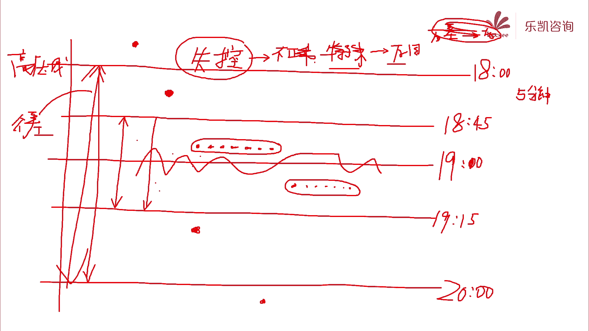

只叫控制界限，好吧好，那么回过头来我们看p m p里面，他是怎么说的啊。

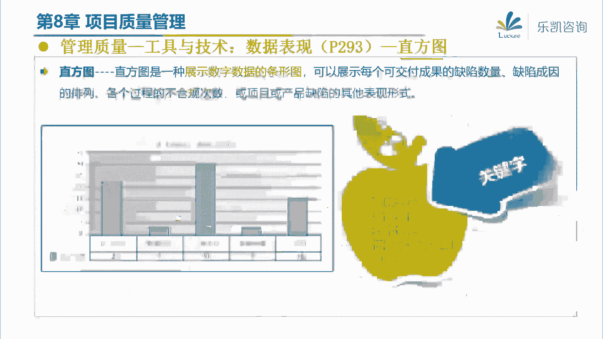

他说我们在控制时间的时候呢，可以结合这张图叫控制图，来确定一个过程是否稳定，包括这句话也很重要，是否具有可预测的绩效，那么他说在我们这个图里面呢，有规格上下限和控制上下限，那么什么叫规格上下限呢。

好规格上下限就是高压线，它反映了可允许的最大值和最小值对吧。

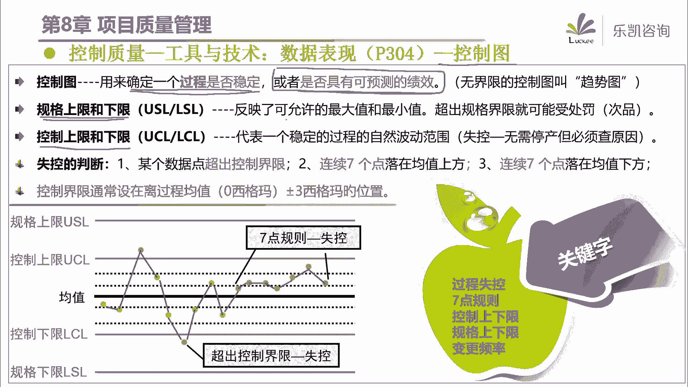

那么这个最大值和最小值之间的这个范围，就是我们所谓的公差范围，如果你连这根规格线都突破了，那么就代表你一定不合格，一定要出问题，一定是出问题的好吧，所以超出规格线的是一定有问题的。

那么另外两根线控制上下限呢，它实际上是在均值的正-3个sega的位置，算出来的对吧，那么如果说发现我们的数据超出了控制线，或者呢连续七个点在均值的同一方同一侧，那么这个是什么情况，这个只代表失控。

这种情况比较特殊，那么特殊你要怎么办，你不需要停产，但是要去查原因好吧，那么这个控制图在考试中经常考到啊，经常考到大家要注意的好吧，那么我们在上一节课，在一开始有两个概念，我们说一会儿讲什么叫做公差。

那规格上下限之间的叫公差，控制线之间的叫控制界限，那么公差跟控制线线实际上就是这个区别，好吧好，那么这个图要特别的注意的很重要，那么通过这些工具，我们对可交付成果进行核实，最终我们得到了什么呢。

那么这个过程会输出质量控制测量结果，对吧，那么我们不是给他做的质量控制吗，做了qc吗，那么最终会有一个q c出来的一个最终的结果，对吧，那么大家还有印象吗，这个东西又会交给我们的管理质量吧。

作为输入交给管理质量，通过结果来干什么，通过结果来反思过程，还记得吧，这就是管理质量里面的所谓的act，对吧，我们看是不是要对过程做一些过程改进好，那么这是第一个输出，那么第二个输出叫什么呢。

叫核实的可交付成果啊，核实的可交付成果，那么如果说我们发现可交付成果的质量，是符合要求的，那么就输出了核实的可交付成果，对吧好，那么话又说回来了，如果说发现它不符合质量要求，那怎么办好，大家注意。

如果我们qc发现不合格，那么要记录原因，然后要走变更流程干什么呢，做缺陷补救，要走缺陷补救好吧，那么这是控制质量的一个重要的输出啊，质量控制，测量结果核实的可交付成果以及变更请求，那么说到这里。

大家对可交付成果的一个过程，大家还有印象吗。

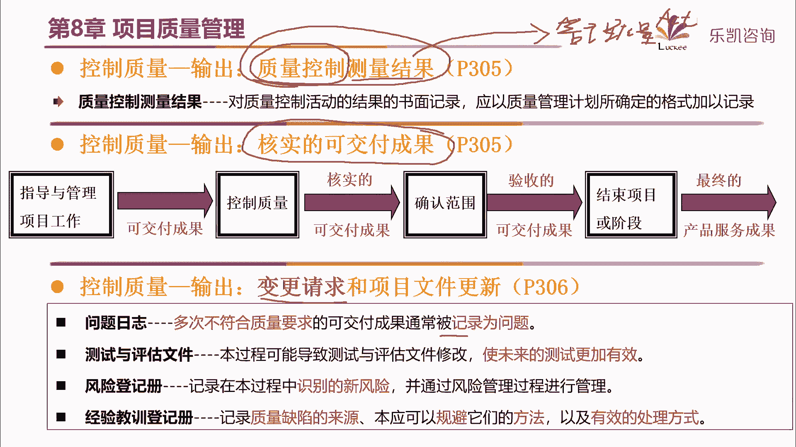

大家还记得这张图吗，我们回过头来再看一下，当初我给大家画了这张图对吧，一个可交付成果，它是怎么样一步一步从可交付成果变成合适的，变成验收的，到到最后变成最终的产品的，那我们做项目。

首先一开始启动的时候有项目章程对吧，项目章程里面有高层级的宏观的这些东西，那么我们在真正实施的时候，我们要把它细化，所以我们先收集的需求对吧，然后在定义范围的时候，我们把可交付成果和验收标准。

先跟客户呢达成了共识，先定义出来了对吧，然后形成的书面的这一份叫范围说明书，还记得吧，范围说明书里面就写清楚了，为了满足这些需求，我们最终要交付什么可交付成果，它的验收标准又是什么对吧，然后接下来。

当然后面我们可交付成果还做了什么事情呢，把它分解对吧，创建w bs得到工作包，然后把工作包在分解分解成活动对吧，好，那么在这里问大家一个问题啊，我们指导与管理项目工作叫执行，其实执行是执行了什么。

其实很简单，指导与管理项目工作不就是去执行那些活动吗，该做的活动你要做呀，那么把活动一做，工作包不就有了吗对吧，那么到最后最终什么东西有了呢，你执行到最后不就是把对应的可交付成果，把它给做出来了吗。

对吧，实际上呢我们这边把w b s分解，最底层是工作包，工作包分解成活动，活动的去安排时间，安排资源，让自然去做嘛，那么所谓的去做就是做活动了，执行活动，那么执行活动的最终的目的就是为了什么。

就是为了把当初那定义的可交付成果，把它给做出来对吧，那么做出来之后，我们说不能交给客户啊，我们在讲上一节课的时候说过，最差的一种质量管理方法，就是做完了之后，他们自己查都不查，让客户来帮你查。

这个是最差的，所以我们可交付成果做出来之后要交给谁，要交给我们现在讲的这个过程，控制质量要去核实对吧啊，不管我们做统计抽样也好，还是用测试的方法去做检查也好，最终如果没有问题合格的。

那么我们就得到了核实的可交付成果对吧，当然如果不合格，我们刚刚说要记录原因，走变更流程好，那么接下来核实的可交付成果就可以交给谁呢，交给客户或者发起人去验收，那么验收或者叫验证叫validate。

validate scope叫确认范围对吧，确认范围不能看字面意思，它的英文叫validate scope，叫验证对吧，所以这些东西交给客户或发起人去验收，得到验收的可交付成果对吧。

那么这些东西都通过了验收，而且我们说要有书面的文件，那么一旦这些都验收了，那么最终收尾的时候，我们只需要做一个什么呢，形式验收对吧，专家过来看一看相应的确认文件啊，都通过验收了。

那么最终得到了最终的产品服务成果，那么该移交的移交，符合项目的成功标准或者退出标准，那么整个项目收尾收掉对吧，那么现在看这张图，我相信很多同学应该就看得比较清楚一点好吧，那么说到这里呢。

我再次强调一下控制质量和确认范围它的区别。

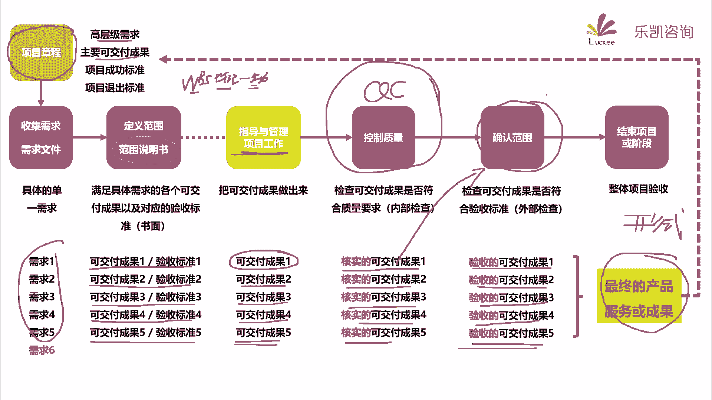

我再次说一下啊，第一个控制质量是由谁做的，控制质量是我们自己内部做的对吧，一般是我们内部做的，我们有自己的测试部门或者质检部门对吧，我们来看一看我们做的可交付成果，究竟质量是不是合格。

它关注的是质量是否合格对吧，我们要对照质量测量指标，那么确认范围是谁做的呢，是需要客户和发起人参与的对吧，他们是验收可交付成果的，那么验收可交付成果不看你，不不光看你的质量好不好啊，更主要的是看什么。

试看你是不是符合我们当初定义的验收标准，或者是不是符合我们的需求，那么在这里就有一个问题，我想问一下大家，质量做得好就质量没问题，合格的是不是就一定意味着符合需求，哎很多人不明白说这两个有什么区别啊。

其实很简单一个问题啊，就是你质量是好的，你是不是一定符合需求呢，其实这是两码事对吧，质量好是质量好对吧，但是别人是不是真正需要你这个东西，是不是能解决别人的问题，这个呢其实要看需求对吧。

有可能你当初需求没有调研对啊，虽然你做的东西质量没问题，但是不一定是别人要的，明白吧，我举一个例子啊，这项目上的例子呢我就不说了对吧，有很多很多，比如说举一个例子，你到外面去啊，今天晚上吃什么呢。

吃碗面，你跟老板说，老板给我来碗面，对吧啊，就兰州拉面嘛，老板给你来了一碗拉面，好，面上来了之后，接下来它质量有没有问题，它质量没问题，但是端上来之后你不吃，你很恼火，为什么不吃呢。

你发现这个面里面有香菜，有的人呢不吃香菜对吧，那么问题呢，当时的需求没搞清楚，你也没说，老板也没问对吧，那么你说这个面质量本身有没有问题对吧，色香味俱全，里面也没有苍蝇，也没有蟑螂对吧，质量有问题吗。

没问题，但是你吃吗，你不吃对吧，你的需求没有搞清楚，你也没说他也没用对吧，那么在我们项目上也会经常出现这种情况是吧，你东西做的是没问题的，但是有一些需求呢客户也没提，或者客户也没说清楚。

你也没有了解清楚，好结果做出来之后，别人说这里不满意，那里不满意，明白吗，所以说质量控制，质量和确认范围它实际上是两个概念对吧，一个叫verify，它是用来核实是不是合格的对吧。

但是不要以为合格了就一定能通过验收，对吧，因为验收最终看什么验收标准好吧，这两个稍微注意一下啊，那么一般来说呢我们是先做qc，先做控制质量，后座确认范围好吧，那么这个是控制质量这个过程，那么到目前为止。

质量管理的三个过程就结束了啊，其实很简单啊，一个就是定标准的，一个就是我们如何管过程，那么管好过程，可交互结构做出来之后，我们还要去查结果，那么在考试的时候，这个知识领域首先考的比较多的是什么呢。

是它的工具，大家对工具要熟。

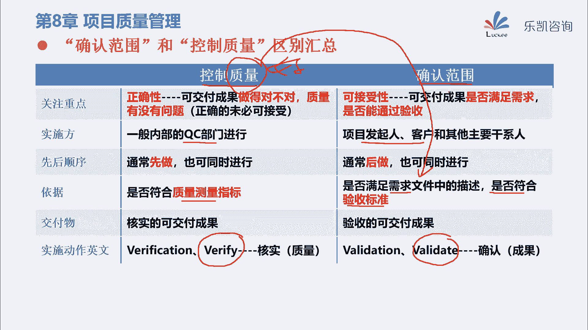

特别是我们上课强调的工具一定要输好吧，那么第二个还有一些常见的考法跟大家说一下，我们质量的三个过程，如果要简单的理解，就用三个字来理解，规划质量是为了定标准的对吧，我们要符合什么标准。

这个标准一般指国家标准或者行业标准，当然同时这个过程还输出了一个叫质量，测量指标，这个别忘了好吧，那么第二个管理质量管理质量叫管过程的，俗称叫qa对吧，你的过程每一步是不是符合。

我们组织现有的政策流程和程序对吧，那么你过程管好了，一般来说结果呢就不会有太大的问题，当然我们对结果还是要进行检查的，所以控制质量呢叫查结果好吧，那么这几个字呢可以简单的让大家去区分。

特别是管理质量和控制质量的区别是什么，那么接下来在考试的时候，经常会出现这样一种问法，如何避免对吧，那么你要看他怎么问的，假如说客户发现了缺陷啊，我们说一般客户发现的缺陷，就叫外部置换成本对吧。

客户如果发现了缺陷问你，那么你最起码事先要做好什么，那么大家要注意事先，我们一定要做好qc，我们自己要查对吧，尽量的避免什么呢，避免把问题流入到客户手上，因为这会导致外部失败成本对吧好，假如说问你。

那么如果是qc的时候，发现了很多缺陷，而我们自己内部检查的时候，发现我们做的东西不行啊，那么你事先应该做好什么，那么事先我们要做好过程管理，要做好q a好吧，这两个要注意的啊。

客户发现的问题事先做好什么，那么最起码要做好qc，qc有问题事先做好什么，做好q a好，还有第三点很重要啊，在我们qc的时候，如果发现了缺陷怎么办，这里面要分两种情况，大家要注意的，第一种情况就是。

如果题目中说我们在做完可交付成果之后，发现有少数或者有部分可交付成果有缺陷，那怎么办好，要注意遇到这种情况，我们第一步要查原因是什么，为什么这些可叫我通过有缺陷，第二个我们要经过变更流程做缺陷补救。

明白吧，那么这是有缺陷的，那么我们要去这么去处理好，但是如果他这么说，如果是大量的可交付成果有缺陷，它体现注意啊，体现大量，那么这个时候就不要去做缺陷补救了，要去干什么，首先要去反思过程。

要去做好过程管理，要去审查过程，那么我用一个例子来解释一下，为什么有两种不同的做法啊，比如说我们上一节课举了个例子，我们炸薯条，今天家里来了很多客人对吧，我要炸薯条，要炸很多对吧，我要炸100份薯条。

好我先炸了十份，发现其中有两份炸糊了，那怎么办，好，这叫少数的部分的出问题，那么我们要查原因对吧，哦发现是什么地方操作不规范导致的好，那么接下来怎么办呢，要么做缺陷补救，要么重新炸对吧。

总之这两份不行吗，就再炸两分喽，好大家注意，如果说你炸十份或者炸20份，你全部都糊了，这20份薯条炸出来没有哪一份是好的，那么你就要注意了啊，你很有理由去怀疑一点，就是这一套流程本身是不是就是错的。

对吧，你这个时候不要去重新炸啊，不要去重新炸，因为你重新炸，你再炸20份，很可能20分还是糊的对吧，为什么，因为很有可能你这一套操作流程本身就是错的，你基于这个错误的流程，你不管炸多少份都是糊的。

所以这个时候首先要做的一件事是什么，就是你要去查过程，要去反思过程，明白吗，这就是少数和大量不同的处理方法，好吧好，那么接下来第八章的重点在这边啊。

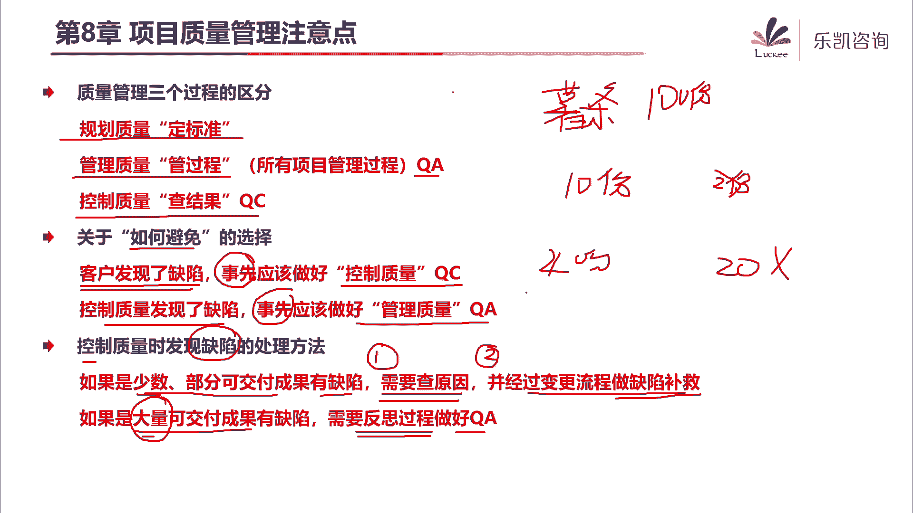

了解一下几个质量管理大师，那么包括这几个概念，它的区别是比较重要的好吧，然后我们前面讲的规划质量，前面讲的这几点稍微注意一下，那么这一章主要是什么呢，主要是它的工具对吧，比如说规划质量的。

我们着重讲到的成本效益分析质量成本流程图，然后管理质量的重要的工具啊，比如说审计啊啊质量审计啊对吧，包括各张各种图啊，什么鱼骨图啊，直方图，帕雷托散点图，包括问题解决对吧，然后控制质量的工具。

比如说我们说到的核查表啊，统计抽样检查呀，包括控制图啊对吧，这些比较重要啊，第八章考得比较多的是它的工具，那么我希望大家通过对第八章的学习啊，能够对大家的思想上起到一些转变的作用对吧。

大家一定要注意我刚刚说的，我这个在讲质量的时候说的这句话，我们的质量绝对不是靠检查和测试测出来的，我们的质量是通过规划和设计出来的，是通过过程管出来的对吧，所以我们什么事情都要重视过程，明白吧。

我们的学习也要重视过程，我们的工作也要重视过程，只要只有一个好的过程，才能得到一个好的结果，好吧好，那么今天我们就讲到这里好，接下来关于晶晶讲的东西有没有什么问题的，有问题的留下来啊。

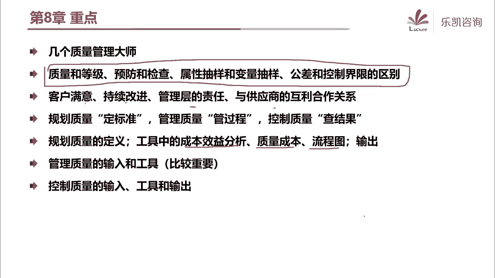

对于第八章有没有什么问题的嗯，好有人问了一个问题，合格率和合格的程度有什么区别，那么我用一个例子来说一下啊，比如说我统计了一下，统计了一下我们单元测试的成绩，我发现我们所有完成单元测试的同学里面。

有95%的人合格，比如说上一次的单元测12超过了35分，对吧好，然后接下来还有5%的人不合格，好请问这是属性抽样还是变量抽样，其实这个很简单啊，就是你就看他最终给你的结果是定一个姓呢，还是有一个区间呢。

对吧，你看它的结果只讲了两种啊，只讲了两种，哪两种呢，好注意，一种叫合格，一种叫不合格对吧，凡事结果只有两种，要么合格，要么不合格，要么正确，要么不正确，对吧啊，考试要么通过，要么不通过好。

大家注意这都叫什么属性，就像我们的性别一样的，你要么男的，要么女的，对不对，这就叫属性啊，这就是一个简单的属性，明白吧，那么什么叫合格的程度呢，注意啊，合格的程度并不是说这里面有百分之多少合格。

百分之多少不合格，合格的程度，是指你能够知道你在一个连续的区间里面，你在哪一个位置，比如说同样是95%合格的好，45分以上的有多少人，40~45的有多少人对吧，35~40的有多少人，30~35的多少人。

30分以下的多少人好，你能够找到你在哪一个档次啊，比如说我在这个档次对吧，你也合格了，但是你呢在这个档次，明白吗，就是说它不但能够告诉你你合格了，而且还会告诉你你有多合格呀对吧，你有多牛逼啊。

那么这种叫什么，这种就叫变量抽样，明白吧，比如说他的说法有很多啊，45以上的百分之五四十到45分的啊，20%，35分到40分的35%对吧，那么不管怎么说，他只要有这种连续的区间，能够证明你有多牛逼的。

这种就叫变量抽样，明白吗，如果不能证明你有多牛逼，你看你也叫合格，他也叫合格，这个就不叫变量抽样，这个就叫属性抽样，你只有一个属性，你跟他是一样的，你们都叫合格，就这么回事儿，现在理解了吧好吧。

你只要知道他如果单纯的说合格不合格对吧，正确不正确，通过不通过，就像区分性别一样的，男的还是女的，这就叫属性，重要就定一个性，要么对，要么错，要么证明，要么反面对吧，好放弃军说，废弃成本是为了解决。

已经产生的失败而带来的成本，一次性成本是为了避免失败而带来的，成本的付出，这句话是对的呀，这有什么问题啊，这个是对的呀，临终前问的这个问题是什么意思啊，控制质量的输出，合适的可叫做集中。

关联性是什么意思啊，什么叫关联性，好小芳同学，我说一下啊，只要是客户发现的问题，它就是外部失败，明白吧，什么叫内部失败呢，就是团队自己发现的，那么发现了需要返工了，或者发现了一些废品了。

那么这个叫内部失败，明白吗，他不看说什么反攻还是废品，只要是客户发现的，就叫外部失败什么，当然你说客户发现了，你要不要去返工，要返工，但是这里面是两种成本，明白吗，反攻是反攻啊，外部失败成本是什么。

是客户发现了之后导致的客户的满意度的下降，品牌受损对吧，还包括保修等等，这就叫外部失败什么，只要是客户发现了，就是外外外那个外部失败了，散点图的关联性啊，散点图的关联性，就是指这两个变量究竟有没有关系。

比如说我举一个例子啊，我们以前在没有疫情的时候，我们有面授班，对吧，那么我问一下，在面授班里面，我想了解男同学的成绩，跟我们班上的美女的数量，啊有多少个美女，有女同学吗，它们之间有没有关系。

你说得清楚吗，这个东西其实有的东西啊，这两者间有没有关系，你说不清楚，对吧，那么如果你说不清楚，你就要去看究竟有没有关系，那么你就可以画图啊，对吧，用图来告诉你啊，那么你怎么画呢。

好一个坐标就是男同学的成绩啊，比如说总分多少分，把各个分数段作为纵坐标列出来，女同学的数量呢多少个，用横坐标列出来，那么你就调查每一个班嘛对吧，好这个班女同学多少个美女。

有多少个男同学的成绩大致在什么分数段，那么两个维度是不是可以描述一个点了啊，比如说男同学的分数段在这个分数段，那么他那个班上的美女数量是多少个，把这个点描出来，那么最终你就看什么呢，你就看这个点描。

全部都描出来之后，因为你要统计几十个班，几百个班嘛，有足够的样本数据吗，那么你就有足够的点吗，好假如这些点你会发现存在一种相关性，那么像我画的这个图叫什么呢，叫负相关，就美女越多，难度越大。

成绩越差对吧，那么不管怎么说，这也是叫有关系，那么如果形成这样一种回归性的，就代表什么，这两者之间我们可以初步判断是有关系的对吧，那么换句说法，如果说你画的点是比较离散的。

没有一个什么好像这种线性关系了，那么这种就告诉我们，这两者之间应该没什么关系，明白吧，实际上散点图就是用来确认这两个变量之间，究竟有没有相关性，什么叫相关性呢，就是一个东西随着另外一个东西的变化。

比如说这个东西多了，那个东西也会跟着变多，或者这个东西多了，另外一个东西呢会变得越来越少，那不管怎么说，这就叫有关系对吧，如果说这个东西不管怎么变，那个东西呢他自己有自己的数据，一点关系都没有。

那么就代表这两者没有相关系，好胡斌说审计算外部的还是内部的，我们的审计有两种啊，内审和外省都有的，好吧，可以去看一下质量审计那一块，可以是随机进行的，也可以是事先安排的，可以是内省，也可以是外省。

好帕雷托图的问题在什么地方。

刚刚在讲这个例子的时候，什么地方不明白唉。

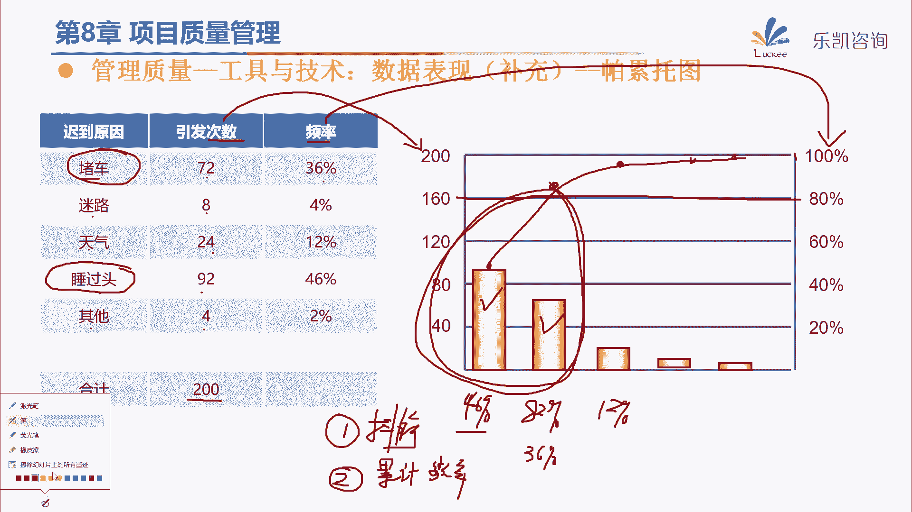

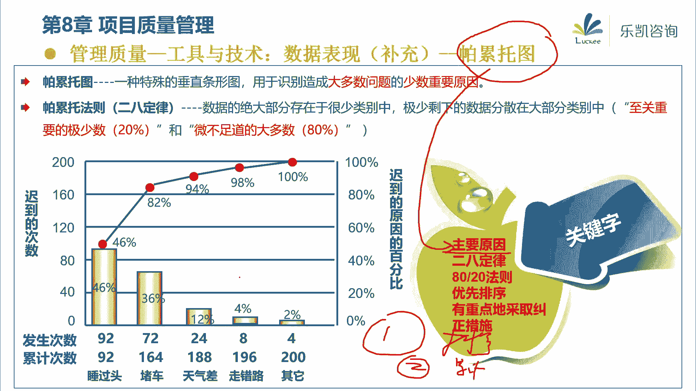

帕雷托图实际上很简单啊，第一个排序，第二个算累计频率对吧，你比如说排序最大的一个是什么，是这个，睡过头92次占总次数的46%，对吧好，第二个柱子是哪一个呢，是它堵车，堵车占36%，但是注意啊。

我们第二个柱子，那第一个柱子的点画在46%，第二个柱子的碟它不是画36%，他是把这两个相加画在82%，我们算的是累计频率对吧，所以这个点画在82%，那么同样的后面这个频率。

第三个我们看一看是天气占12%吧，好我们也不是画在12%，是累计82%，加12%到94%，画在94%对吧，他算的是什么呢，是累计频率啊，累计频率对吧，好，一直累积到最后，是不是呢。

整个的频率加起来是不是百分之百嘛，对不对，那么这几个点是不是连起来一直会连到，累计到多少，累计到百分之百吗，那么接下来我们怎么办呢，二八定律嘛，在80%的地方着重看这根线嘛对吧。

这根线跟这个曲线交叉的点，它对应的这一部分是什么，把这一部分的主要原因找出来吗对吧，那么至于其他的这些东西我们就不考虑了呀，对吧，我们要抓的就是这两个主要原因嘛。

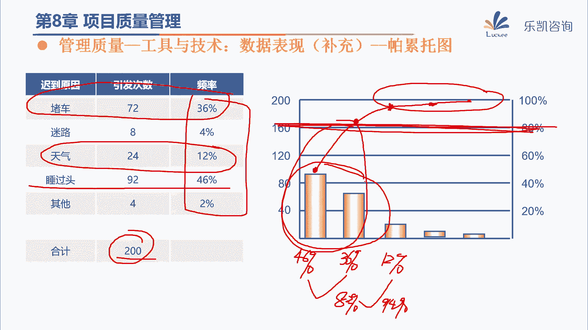

明白这个意思吧，那这张图就是把累计频率46%，加36%，是82%吧，然后前面再累计这三个累计94%对吧，我们要关注的是什么，我们要关注的是80%，这一边，在80%左右啊，不一定是非常正确。

正好正好80%在这边，大致对应的两个主要的原因把它抓出来对吧，我们重点就关注这个叫主要原因，这就叫抓大放小嘛对吧，那么我们接下来要解决的就是这两个，这些工具啊大家要了解他们自己的意思啊。

要了解他们各自的意思，包括图大致的样子，在脑子里面有一个印象。

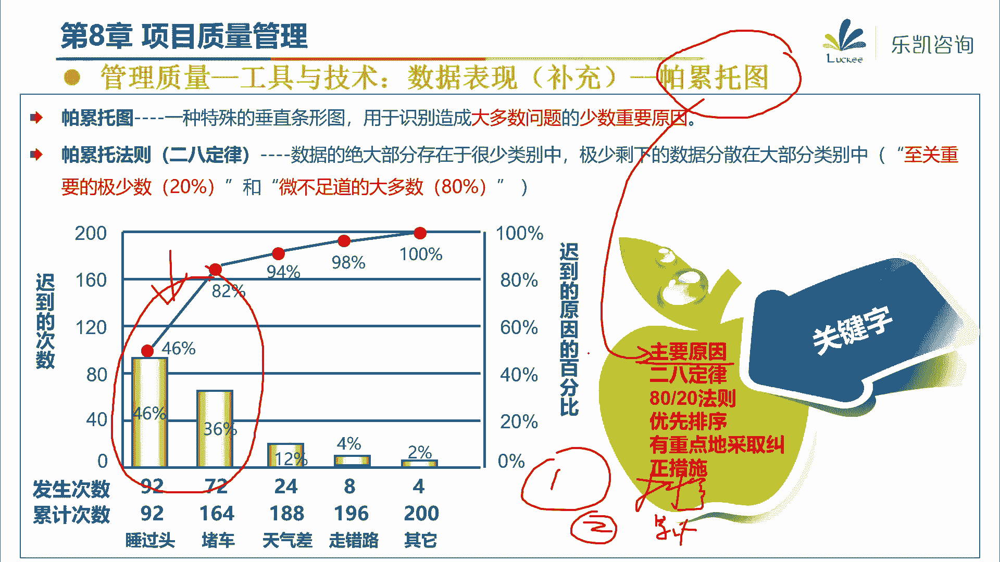

我们在实际工作的时候，可能要几个工具连起来用，要混用的，对吧，比如说我们首先用控制图来发现是失控了，那么查原因的时候呢，可能有很多原因，究竟哪个跟这个有关系，用散点图来分析关系对吧。

然后接下来再用帕雷托去寻找主要原因，那么针对每一个原因，我们去看一看它的根本原因是什么，结合起来用，都有可能的好吧，那p p里面不会考的这么复杂，p p里面就看关键字，这些工具啊。

大家课后可以再通过这个每日一练去巩固一下，好吧，其实很简单啊，那么我这里呢我纠正一下大家的一个误区，其实有部分同学有这样一个情况，什么情况呢，上课讲的都听得懂对吧，特别是有一些例子听了也有意思。

但是呢反馈是什么呢，一听就懂，一做就忘对吧，然后有好几个同学问我说，哎tim老师，我这种情况还有救吗，正不正常，我明确告诉你，非常正常，为什么说非常正常呢，大家注意啊，过目不忘，过耳不忘。

一听就能记住的，这种人叫什么，这种人叫他妈学霸，学霸生下来就是用来侮辱我们的对吧，你会发现有的人记忆力很好，过目不忘，过耳不忘对吧，一听就懂就记住了，但是要注意，我们99%的人都是普通人对吧。

普通人都是有记忆曲线的，都会遗忘的，所以我们对于我们大部分人来说，需要做什么工作，需要做复习工作对吧，你要指望说哎呀我不复习，我就这样听一听对吧，甚至我一边听一边嗑瓜子对吧，哎我都全部记住了，不现实啊。

明白吧，所以说有这种问题不代表你不正常，反而觉得反而应该是什么呢，你应该很正常，你应该很正常，所以课后要注意复习，明白吗，那么现阶段我希望大家能把基础要打好，我们后面在考前，大家会带着大家去复习。

这个考试没有那么简单的说听一听就能够考，还是要复习的啊，所以大家在课后的时候把这些工具啊，稍微再巩固一下，然后我们那个星期六，我们会把第八章的周练习再讲一遍，然后再讲一讲有关实战的东西好吧。

思维导图我已经放到这个钉钉的网盘里面了啊，大家可以去看一看好吧，那么质量这边的实战呢，我觉得它比较依赖于具体的行业，啊通用的不太好讲，那么我上课给大家看了一些例子，也是我们这个行业的一些例子好吧。

但是我觉得思想都是一样的，管好过程，特别是很多人对过程他不太重视对吧，管好过程，查好结果，你的质量就不会有什么太大问题，好吧好，如果没有什么其他问题，我们今天就先这样啊，有问题在群里面讨论。

或者直接艾特我都可以好吧，然后星期六我们刷一下题，在做这章的这个周练习再巩固一下，然后我们再聊一聊这个678这三章的实战啊，一般我们会怎么去处理。

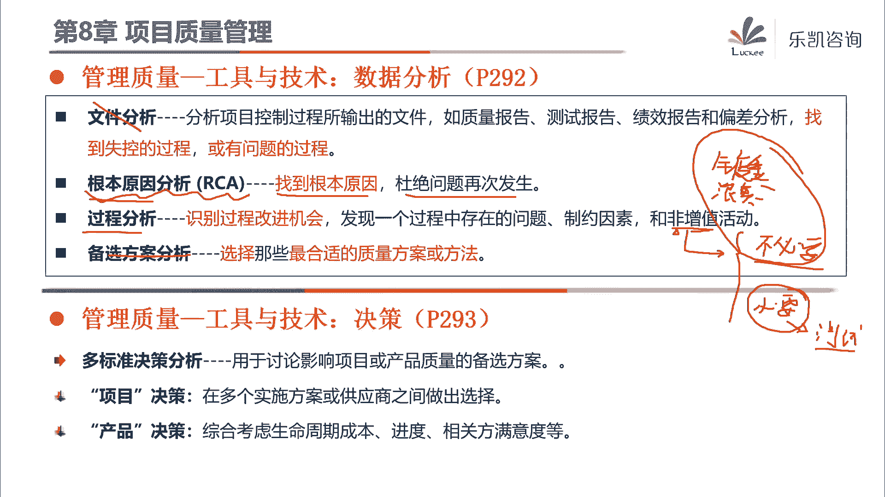