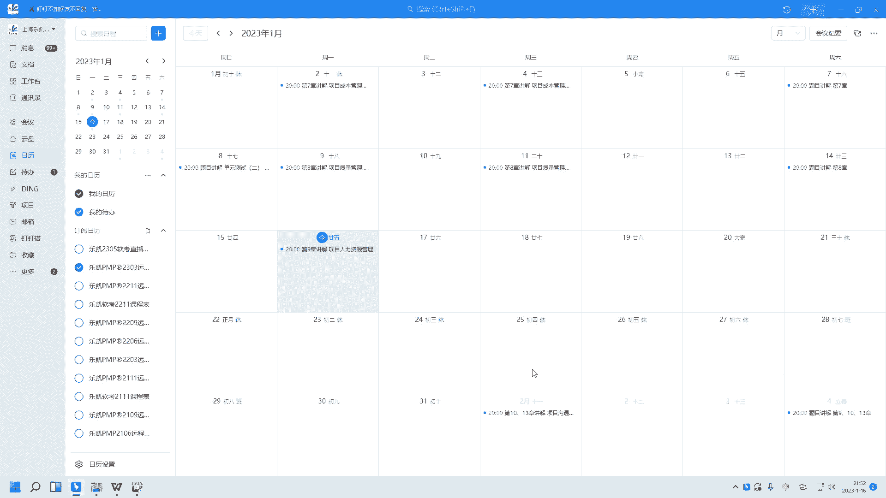

# 2024年PMP认证考试课程针对PMP新考纲最新免费零基础也能轻松听懂 - P14：第9章：项目资源管理 - 乐凯咨询 - BV1Rj411G7gs

各位同学晚上好，今天晚上呢我们一起来学习一下第九章，项目的资源管理好吧，那么学习项目的资源管理呢，实际上我们就要先明白一个问题，就是什么叫做项目的资源，那么我们在一开始上课的时候。

有同学说这个资源跟资金有什么区别对吧，那么我们通过学习成本管理，我们知道资源它实际上跟什么有关的资源呃，那个资金跟什么有关，资金跟钱有关对吧，那么资源跟什么有关呢，那么资源我们说它实际上包括两种资源啊。

一种叫做人力资源，也就是我们怎么去管我们的团队，那么还有一种呢叫实物资源，那么什么叫实物资源呢，就是说我们在做项目的时候呢，可能涉及到一些设备和材料对吧，那么所以资源管理。

它实际上包括人力资源和食物资源的管理，那么在这两块资源里面，人力的管理它是重点，也是我们第九章的重点好吧，那么我们在学习之前，我们先了解一下，关于我们人员管理的几个激励理论。

那么这些激励理论呢，我相信大家多多少少都应该听说过对吧，那么我们一起来看一下，首先第一个叫马斯洛需求层次理论，那么什么叫马斯洛需求层次理论呢，他说我们的人呢有五个层次的需求。

那么从最低到最高依次是生理需求，安全需求，社交需求，尊重需求和自我实现，那么他提出一个概念，他说人们只在较低层次的需求得到满足之后，我们才会去追求较高层次的需求，那么这几个需求我分别解释一下好吧。

首先第一个叫生理需求，那么什么叫生理需求呢，生理需求就是最基本的，为了让人活下来必须具备的，比如说食物啊，水呀，睡眠啊对吧，那么我们有很多人其实在这一层次苦苦的挣扎，那么我们用一个古典名著来对应这几层。

那么生理需求这一层，就有点像西游记里面的一个人，就是猪八戒对吧，那么你会发现猪八戒，他就是停留在生理需求这个层次，他每天要么就是叫肚子饿了对吧，要么就是在旁边偷懒睡觉，那么这种人就很明显。

他的生理需求还没有得到满足，那么如果在我们生理需求得到满足之后，那么接下来我们就会考虑什么呢，我们需要秩序和平和稳定，那么这类需求安全需求，那么在西游记这个团队里面，谁是处在这个层次呢。

很典型的就是沙僧对吧，那么我相信我们有很多同学是看过西游记的，那么大家还记得沙僧最经典的台词是什么吗，沙僧最经典的台词就是不好了，师傅被妖怪抓走了对吧，要么大师兄不好了。

师傅和二师兄都被妖怪抓走了是吧啊，极度的缺乏这个安全感，他希望和平，包括在团队其内讧要分行李的时候对吧，那么这个沙僧呢，都是不希望这个团队散伙的是吧，所以他希望秩序和平和稳定啊，它是安全需求。

那么安全需求如果说得到了满足，那么他会追求什么呢，叫社交需求，那么也叫社会需求，那么也就是说我们人是有社会属性，或者说社交属性的，我们需要友情啊，亲情啊，归属感啊对吧，那么在这个团队里面。

谁处在这一层呢，就是唐僧胯下的那匹白龙马对吧，那么白龙马他为什么缺乏社交需求呢，大家还记得西游记这个片段吗，这个白龙马是一个什么人，但是呢由于家庭出现了一些变故啊，家破人亡，自己的妞也跟别人跑了对吧。

我还记得那小子叫什么来着，叫九头虫是吧，是不是他女友好像跟九头虫给跑了，所以他没有亲情，没有友情，也缺乏爱情对吧，他是很典型的很缺乏社交需求的一个人，那么后来他总算找到了唐僧的这支团队啊，去西天取经啊。

我记得很深刻啊，最终这个人也被封为八部天龙是吧，哎所以这个呢叫社交需求，就是我缺乏友情，亲情归属感，那么如果说社交需求得到满足，我们就会追追求追求，追求什么呢，叫尊重需求，那么尊重需求在这个团队里面。

比较典型的是谁呢，是唐僧对吧，那么唐僧这个人他希望得到一些成就，希望得到尊重，那么有人说，你怎么看出来唐僧是需要得到尊重的呢，唐僧希望你听话对吧，那么如果你不听话呢，他会念紧箍咒啊是吧。

那么什么叫自我实现呢，自我实现就是它是自主的，自发的，而自觉的就像孙悟空这种人，孙悟空这种人，他生下来是干什么的，你会发现这只猴子生下来就是打妖怪的对吧，你唐僧叫我打的，我当然会打你唐僧不叫我打的呢。

他说我也要打是吧，我生下来就是打妖怪的，他就是这种啊自觉的自主的在做一些事情，叫自我实现需求，那么西游记这个团队啊，实际上这五个人，正好符合了马斯洛需求的五个层次啊，所以我们在理解这个马斯洛需求层次的。

这几个层次的时候，我们可以结合西游记这个团队去了解，这样的了解的会稍微的深刻一些，好吧，那么实际上我不知道大家有没有听说过，有没有听过其他的管理的课程，其实有很多管理课程啊。

都是用的这个西游记的团队来作为例子来讲的，那么为什么说西游记这个团队呢，他很有代表性呢，因为西游记这个团队，它符合很多团队的特点，比如说你会发现在一个团队里面，总有一个喋喋不休的项目经理对吧。

看上去的能力呢其实又很一般，那像唐僧这样的项目经理对吧，那么团队里面有一些技术大牛，但是技术大牛他脾气很臭，很有性格，他不太服从管理谁呢，孙悟空对吧，那么团队里面有没有偷奸耍滑的，唉天天在那摸鱼的。

有没有也有猪八戒对吧，那么有没有朝九晚五啊，你说他有什么很大的成就吗，也说不上来，你说他有什么不好吗，也谈不上对吧，也有的像沙僧这样的人是吧，所以这个团队呢真的很符合这个，叫什么。

我们日常的所遇到的一些团队的一些特点是吧，那么曾经呢我还记得有一个很有意思的事情，说在这团队里面这几个人里面啊，说唐僧师徒四人，当时没有把白龙马放进去，说唐僧师徒四个人。

那么如果要在这个团队里面开除掉一个人。

对吧，说谁应该把它干掉。

有这样一个问卷调查，那么大家觉得如果在团队里面要干掉一个人，你们觉得应该把谁干掉，啊唐僧，孙悟空，沙僧和八戒，你们觉得应该把谁干掉，当年其实有这样一个投票的啊，就是说在师徒四个人里面要干掉一个人。

把一个人开除掉，开除谁，啊有人说唐僧对吧，这个项目经理不行，还有呢八戒，对吧，那么开出8g的原因是什么呢，好吃懒做，啊还有人说开除做不通，这个人不太好管，对吧好，我跟大家说啊。

其实当年出了这样一个问卷调查，最终投票下来，大家知道得票最多的是谁吗，其实让很多人很意外的啊，我记得当年最终投票得票最多的是这个人，沙僧，沙僧被干掉了，那么为什么沙僧被干掉了呢，你会发现从业务能力来说。

沙僧的业务强不强，他肯定比不上孙悟空对吧，那么他比得过猪八戒吗，沙僧和猪八戒的战斗力谁强啊，实际上猪八戒的战斗力要强一些对吧，因为当初我记得沙僧这个人在入伙的时候，其实不是说悟空出手的，是八戒出手。

把他打服的，被八戒打得都不敢露头了对吧，所以从业务能力上来说呢，他的这个能力呢一般般对吧，那么从其他方面来说，比如说有人说的，从情商这个角度来说对吧，他比得过八戒吗，他也比不过八戒对吧。

沙僧这种人就是老老实实朝九晚五的人，那这个人到最终的反而是投票最多的，那么我为什么要说这个问题呢，因为刚刚在上课的时候，我看到有一个同学说，好像是张勇还是谁啊对吧，说最近公司裁员还是比较多的。

所以我希望大家在公司里面，尽量的要避免做这种人，不要做这种人就是杀生这样的人，因为这样的人我说句实话，可替代性很强，很容易被替代掉对吧，你说你的业务上也没什么亮点，其实业务能力一般。

然后呢情商呢也是一般对吧，所以到后面的可能日子不是很好过对吧，那么我们不管怎么说，在一个公司里面，或者说在一个团队里面，我们要提高自己的不可替代性，不可替代性，好吧好。

那么这个是这个是这个马斯洛需求层次，那么这几层呢大家稍微了解一下，现在考试呢倒不一定考，那么我们学团队的管理呢。

要知道这些基地理论好，然后接下来赫兹伯格的双因素理论，那么什么叫双因素理论啊，他说，其实会决定人类行为的有两类因素，一类的叫保健因素，那么这个保健因素啊，也有一个说法叫卫生因素啊。

保健因素或者叫卫生因素，那么还有一个因素呢叫激励因素，那么这两个因素有什么区别呢，他说保健因素是导致不满足感的，什么意思呢，就是说这些因素做得好呢，不会提高基地啊，他对提高基地没什么帮助，但是要注意。

如果说这些因素做得不好。

就会损害激励，所以它会导致不满足感，那么比如说哪些东西叫保健因素呢，像工作环境啊，像工资啊，同事的关系啊等等，那么这些就是保健因素，那么保健因素相当于马斯洛需求层次的，比较低的三层对吧。

那么这里面我用一个例子来帮助大家理解一下，什么叫做做得好没什么用，但是做得不好呢会损害到机翼好，比较典型的就是这个东西工资好，问大家一个问题啊，每个月按时发工资，你们你有没有觉得这家公司很难得。

我要为公司肝脑涂地，有吗啊，比如说我们有些同学5号发工资的对吧，或者15号发工资的，发工资的那一天，唉哟我银行卡有一个消息发过来了对吧，哎呦今天发工资了呀，这个公司真是不错啊，有没有得到激励，没有对吧。

我们很多同学说他娘的，这不是应该的吗，20发工资是公司的本分啊，对吧好，那么反过来说，如果到了发工资的那一天，结果公司说最近资金压力比较大，我们工资下个月再说对吧，比如说这个月的工资应该发了。

15号发工资了，公司说这个月先不发，等年后再发好，这个时候有什么想法啊，你看啊他20发，你觉得是应该的，这就叫做得好，不会有任何的基因对吧，那么反过来说，如果他现在不按时发，做得不好呢，靠。

你估计要把桌子都掀了，对吧啊，甚至有同学会说这个公司怎么怎么样对吧，对公司肯定会有一些很大的意见，所以这种就叫你做得好，其实没什么用，但是你做的不好呢，反而就会损害激励。

那所以这种呢叫会导致不满足感的因素，叫保健因素，那么什么叫做导致满足感的因素，或者说能够真正激励别人的因素呢，那么这个叫激励因素，那么什么叫激励因素呢，比如说成就感，责任得到任何的赞赏对吧。

包括挑战性兴趣等等，那么这个它对应了马斯洛需求层次的高氧层，对吧，比如说责任感，成就感等等这种，那么像我以前我们的公司一般是怎么激励我的，倒不一定说有什么奖金啊之类的对吧。

那我的领导呢一般是这么激励我的，比如说公司新建了一个项目，中标了一个项目，这个项目呢实际上谁他妈都不愿意做，然后我的领导呢是怎么跟我说的呢，他说现在公司中标了一个项目，这个项目的难度很大，也很重要对吧。

我整个公司这么多项目经理啊，我想来想去啊，只有马衡马经理，我觉得你是能力最强的，也是让我最放心的一个，对吧好马航同学一听领导这么说，只有我一个人能力最强，最让领导放心啊，好那么这个时候马腾同学怎么办。

胸脯一拍，领导放心对吧，这个项目交给我，我一定怎么怎么样对吧，为什么，因为除了你别人都做不好对吧，只有履行，那么这种才是所谓的激励因素对吧，所以说赫兹伯格他认为啊，说保健因素是只能导致不满足感。

它起不到激励作用对吧，你做得好没什么用，做得不好呢会不满意，而真正起到激励作用的应该是这些东西好吧，这个叫赫兹伯格双因素理论，那么还有一个理论叫梅克，那个麦克雷格的叫xy理论，那么麦克雷格的xy理论呢。

实际上是说的传统管理跟现代管理的区别，那么什么叫x理论呢，x理论就像打了一个叉一样的，就是不好对吧，因为传统的管理，大家知道传统的管理方法，是用什么方式来管理呢，它一般是用命令。

或者叫控制的方式在管理病人，那么为什么要用命令和控制的方式，去管理别人呢，因为他人认为人都是消极懒惰的，缺乏进取心的，总是逃避责任的，所以我要给你下达命令诶，我要去监控对吧，这个是传统的叫x理论。

那么什么叫y理论呢，那么y像一个勾一样的对吧，认为人是积极的愿意进步的，那么我们现代管理呢认为啊，那么由于人是积极的愿意进步的，所以我们应该用什么方式去管别人呢，啊我们应该用叫支持，对吧。

那么我们后面再讲敏捷的时候，会说到一种服务的类型叫仆人式领导对吧，或者叫服务型领导，那么这个时候我们一般是在提供支持，来促进协作，叫支持协作好吧，所以说x理论和y理论，实际上它体现了传统的管理。

和现代管理的一个区别好吧，那么这三个理论是啊说的比较多的，当然还有其他的，比如说威廉大内的z理论啊，威廉大内呢这是一个日裔的美国人对吧，那么他研究了日本的这个很多的公司，他提出了z理论。

就是说我们要终身雇佣，要培养多面手对吧，那么在一家公司，你终身雇佣了那么这么长时间怎么办呢，他会把你转到各个岗位去锻炼，得到多多方面的一个锻炼啊，包括弗洛姆的期望理论，麦克利兰的成就动机理论。

那么这些理论呢，大家有兴趣可以稍微去了解一下好吧。

那么现在考试这些激励理论呢考的很少。

那么大家呢稍微的啊，如果说药剂的话呢，稍微了解一下前三个就可以了啊，然后接下来还有几个概念，我们也要明白一个叫边际福利和额外待遇啊，那么什么叫边际福利，什么叫额外待遇啊。

所谓的边际福利就是指阳光普照这一种的，那么现在接近年底了对吧，很多公司肯定也要开一些年会，这个编辑福利有点像年会上的什么，怎么讲呢，叫阳光普照奖对吧，就是所有员工都可以享受的福利，就叫边际福利。

比如说五险一金啊，比如说基础培训啊对吧，所有人都有的，那么跟它对应的叫额外待遇，那么额外待遇很明显就不是所有人都有的对吧，他是给某些特殊的员工的一些特殊的奖励，因为你特别的优秀，所以给了你这样一个奖励。

比如说由于你这个人干得比较好，你跟其他人不一样，所以公司给了你一个固定的车位对吧，唉或者说由于你干得特别的好，所以呢你上下班不用打卡，而别人是需要打卡的，那么像这种叫额外待遇。

那么这一对他的意思要理解清楚，那么还有一个概念呢叫光环效应好，什么叫光环效应啊，光环效应就是我们俗话说的叫一好百好，对吧，比如说我们在看电视剧的时候，你会发现一般来说，这个正面的角色好人都怎么样。

都是长得很帅的，玉树临风的对吧，那么那些坏人反派，他一般找的那些人都是穷凶极恶的那种人对吧，哎让人一看就知道什么，哪个是好人，哪个是坏人对吧，那么实际上我们是不是这样呢，比如说我举一个很简单的例子。

长得帅的人，他就一定很善良嘛，对吧，或者我们在实际的工作当中，技术好的人让他去带团队，他就一定管得好吗，其实不一定对吧，那么我们在现实的工作当中，往往就会遇到很多的光环效应，比如说最典型的是什么。

我们有的人技术很好，然后公司的领导就让他作为项目经理，去带团队对吧，实际上这种做法科学吗，它是不科学的，这就是一种光环效应，认为他技术好，所以就把它称作管理，而实际上管理靠的是什么，靠的是管理的经验。

它不是靠你的技术对吧，所以呢像这种指定一个优秀的技术专家，当项目经理，这就是很典型的光环效应，那么我们以后在管理的时候，要避免这种光环效应对吧，项目经理应该由谁来担，项目经理应该让有管理经验的人。

最起码要接受过什么项目管理培训的人，咳咳咳好吧，那么光环效应这个呢很简单，大家可以去了解一下，那么后面呢关于项目经理的管理风格啊。

包括项目经的几种权利啊，实际上我们在前面第三章的时候都已经讲过了。

大家可以再去回顾一下好吧，那么我们看一下第九章pinbox里面讲了哪些内容，全不可明说，项目的资源管理的核心概念，就是我们要对两大类资源进行管理，那么一类就是人力资源，也就是团队。

那么还有一类就是食物资源，包括设备材料，基础设施这些，那么当然我刚刚说过，重点是我们要了解对团队怎么去管理，那么另外他说项目经理要明确在团队中的定位，他首先是一个团队的管理者对吧。

那么管理者就是指我们要负责各种，比如说启动规划，执行监控等等这些项目啊，这些过程，那么另外呢他还是一个领导者对吧，那么他要去领导团队，要去培养团队的技能和能力，提高团队的积极性，那么另外不管是谁。

都要遵守我们的相应的职业道德好，然后接下来他说。

那么现在在管理上风格已经发生了变化，我们过去是用命令和控制型，也就是我们刚刚说的激励理论里面的，x理论对吧，用命令和控制的方式认为人是懒惰的，需要管的，那么现在呢我们逐渐要改成协作和知识性。

因为我们认为仍是积极的进步的对吧，那么另外他说我们在管理的时候，出现了一些趋势和信息实践，包括什么呢，包括对于资源的一些管理方法，比如说精益的管理啊，比如说像just in time，对吧啊。

准时制生产，那么包括我们还要重视情商好，说到情商啊，我们一直在说这个人情商高，这个人情商不高，那么究竟什么叫情商，那么在p m p里面其实也给情商做了一个定义，实际上情商就是什么呢，就是管理自己的情绪。

或者管理他人情绪的一个能力啊，我们要注重情商的管理，另外我们要把团队最好打造成叫自组织团队好，那么这里我解释一下什么叫自主制，那么自组织团队是什么意思呢，他说这个团队啊是由通用的装材组成的。

而不是主题专家，那么这句话是什么意思呢，就是说我们团队里面的人，什么叫通用的招财啊，我们以前什么叫人才，我们一般说这个人比较专精于某一个方面，比如说在我们it行业，诶，这个人是数据库方面的专家。

或者这个人是算法方面的专家对吧，唉在其他行业，比如说这个人唉在这一方面啊，经验很丰富对吧，那么这种人才我们把它叫a型人才，爱心人才就是专精于某一个领域，那么现在呢我们要求要打造成自治团队。

要用通用的专才好，什么叫通用的又叫专才呢，好实际上叫梯形人才，那么你会发现机器人才是什么特点，它有一个方向是非常的精通的，但是在其他领域怎么样，其实他也有一些了解对吧，那么也就是说。

它实际上是由各种各样的t型人才，组成的一个团队，你可以把t型人才理解成什么呢，理解成特种兵对吧，就像我们有人说的什么全站工程师对吧，那么特种兵你说一个特种兵，一个小组就这么几个人，当然从分工上来说。

可能有的人比较精通于狙击，有的人精通于爆破，有的人精通于开车对吧，但是如果开车的人受伤了，那么狙击手能不能开车，他也能够开车对吧，那么由这些机器人才组成，而且他是积极的主动的。

那么我们就不太需要进行集中的管控，我们就可以用支持和协作的方式啊，来管理团队好吧，那么这个叫自主团队，特别是在敏捷的项目中，我们非常提倡，要把团队逐渐打造成一支自组织团队，那么关于这个概念。

我们在讲敏捷的时候再去详细的去讲，那么另外他还说到我们要运用虚拟团队对吧，那么什么叫虚拟团队，大家知道这个词的意思是什么吗，所谓的虚拟团队啊，就是指云队友，什么叫云队友呢，就是大家不是面对面在一起工作。

不在同一个物理地点，那么他可能在不同的物理地点，然后我们通过一些在线的啊协作工具，来一起合作完成项目，那么虚拟团队这种团队它有什么特点，它的优点是，我们可以把很多人纳入到我们的团队对吧。

比如说我们的网络班，我跟各位同学实际上就是一支虚拟团队对吧，我们很多人当地可能没有pmp的培训机构，那么你可以报网络班对吧，那么你找了一个上海的培训机构，那么我跟大家介绍一个虚拟团队。

那么它的优势是哎我们可以减少出差成本啊，我们可以纳入更多的专家，我们可以有更多的选择对吧，但是它也有它的缺点，它的缺点是什么，它的缺点是沟通，我们一定要仔细的规划，因为这个沟通很重要对吧好。

那么接下来我们看一下第九章的这几个过程，那么要做好对资源的管理，我们要做好哪几个过程啊，首先第一个我们首先要有个计划，我们要规划资源管理对吧，那么很明显，这个过程会输出一份叫资源管理计划。

那么规划资源管理就是我们要想清楚啊，我们将来如何去估算，获取管理和利用各种资源对吧，他还是在说how，我们要想清楚我们将来怎么去管资源对吧，那么怎么去管资源，其中就涉及到一点。

就是我们团队需要什么样的角色，他们要完成什么样的工作，或者说他们的职责是什么，那么所以这个过程它的工具相对来说呢，要了解一下，我们要做这些规划，那么如何获取对吧，如何估算如何获取管理和利用。

那么首先我们就要明白诶，那我特别是我们的团队，人力资源这一块，我的团队需要什么角色呢，他的职责是什么呢。

好，那么接下来他说，我们可以借助这么几个工具来了解，比如说我们可以用层级型的，举证型的或者文本型的，来明确我们团队所需的角色和职责，那么说到角色和职责啊，特别是说到职责。

大家有没有想到我们之前讲过的一个东西啊，叫w bs，我们当时在讲w bs的时候，说到了好几个原则，其中有一个原则叫什么叫责任要唯一，w b s的每一个工作包，都要有唯一的小组来负责对吧。

所以我们可以借助于w bs，来明确高层级的职责，什么叫高层级的职责呢，就是说他们要细化到每一个人，但是它细化到了工作包由哪一个小组来负责，对吧，我记住他来明确高层级的职责，那么这是一种沉积型的。

那么还有一种叫组织分解结构o b s啊，那么关于o b s的，我解释一下什么叫做组织分解结构啊，大家在公司上班的时候，有没有看到过公司的组织架构图啊，对吧，那么组织架构图是怎么画的呢。

比如说这边画的是啊总经理对吧，然后接下来下面有各个事业部，对吧，然后每个事业部里面他又分自己的，比如说销售部啊，技术部啊，对吧啊，包括什么其他部门啊对吧，然后销售部里面可能还还分销售啊，售前啊等等。

那么这是一个整个组织的组织架构图，那么组织分解结构呢，实际上就是类似于这种叫组织架构图的一个样，子，对吧好，那么接下来他说组织分解结构，有助于查看对应的全部项目职责，那么这句话是什么意思呢。

哎为什么组织分离结构能够做到这一点呢。

好接下来我给大家画一张图，大家看一下，首先呢我先画w p s一个项目的工作分解结构，w bs是这样画的，项目我们第二层可以放可交付成果，对吧，然后可交付成果分解成工作包。

那么wbs的最底层我们把它称之为工作包，对吧好，那么w b s画好了之后，接下来组织分解结构呢，我这样画，我把它横过来画啊，这个是总经理或者叫总裁办，然后呢下面呢又分了各个事业部。

啊比如说文化教育事业部啊，或者说什么政务服务部啊，医疗卫生事业部啊，好每个事业部下面，拥有各自的部门对吧，好接下来我，啊我这样一画有什么好处，我就看这个工作包有哪一个部门负责。

比如说这个工作包是由这个部门负责的对吧，好这个工作包呢是由这两个负责的，哎这个工作包是由谁负责的，这个工作包是由谁负责对吧，把各自负责的部门全部都勾出来，那么接下来通过这样一张举证。

我就知道我只要知道某一个部门是什么部门，我就知道他在这个项目上对应的，负责的是哪一个工作簿对吧，我找到任何一个部门。

都可以知道它对应的工作包是什么，那么这就是所谓的哎。

我们通过o b s来了解，他在项目中承担了所有的全部的工作。

好吧，这个呢稍微了解一下啊，有组织分解结构这样一个东西，可以帮助我们了解每个部门，它对应的在项目上承担什么工作，那么当然还有一个叫资源分类机构，这个呢我们后面稍微提一提啊，这个不重要，好吧好。

那么这是第一个叫层积型的，我们可以借助成绩型的，来明确一些高成绩的角色和职责，那么第二个比较重要的工具叫举证型的啊，责任分配举证，那么责任分配矩阵呢，他说我们在大型项目中啊。

其实我们可以单纯的用一个矩阵，其实这个举证是哪来的呢，大家可以看一下。

我刚刚画到图里面的这个块这个位置，对吧，其实这个位置就是一个举证。

那么举证型的他说有什么好处呢，在我们项目当中，我们可以借助于这样的一个举证。

来明确高层级的职责对吧，当然他说其实这个矩阵呢除了高层级的以外，我们低层级的我们也可以去指定，当我们有了活动之后，我们甚至可以明确具体的活动由谁来负责，那么其中有一个比较有代表性的矩阵。

就叫r a c i矩阵，那么r a c i举证，是责任分配矩阵里面典型的一种，那么r a c i这四个字母分别代表什么意思呢，r就是responsible，就是这个活动由谁来执行。

那么a呢叫accountable，就是这个活动由谁来负责，c呢就是consult，这个活动可以找谁咨咨询对吧，包括i就是inform，就是这个活动的情况，谁需要了解，谁需要知情啊，这个叫r c i举证。

那么i si举证里面就明确了，每一个具体的活动有哪一个具体的人负责好，那么接下来大家要注意一点啊，这四个字母里面哪一个字母代表了，最终由谁负责呢，是a accountable，那么有的同学说。

responsible不也是有一种负责的意思吗，好responsible实际上是更多的说谁来干什么呢，谁来真正的去执行，去干，那么举一个例子，比如说啊制定项目章程这样一个活动，你们觉得应该由谁来负责。

最终负责人是谁，项目章程，项目章程最终是谁，是accountable，知道吗，谁最终负责，所谓的负责就是指我们要负责这份文件的批准，签字或者发布，那么谁是accountable，要注意是发起人对吧。

那么responsible是谁呢，responsible是指这个东西谁来写呢，那么写一般是项目经理去写对吧，再比如说我们年底年底要出放假通知了，放假通知最终是由谁负责啊，大家注意。

那么你就要看这个东西最终谁签字批准。

那么我们说年底的放假通知，最终是由公司的管理层，或者公司的老板来负责的，他批准的对吧，但是这份通知的他的编写呀，包括粘贴呀，是由谁呀，其实是由行政或者人事来负责执行的对吧。

所以一个活动最终的负责人我们要看accountable，而不是responsible，好吧，那么在考试的时候，曾经考过这样一个i s a矩阵，那么他是怎么考的呢，他给了你四个选项，a b c d。

他问你哪一个活动的安排是不合理的，好大家注意什么叫做不合理啊，一个活动我们可以有多个i有多个c对吧，甚至有多个二都不要紧，但是大家要注意啊，一个活动他的accountable我们强调a怎么样。

只能有一个，那么有1年考试的时候，这道题目就给某一个活动安排了两个accountable，那么这种安排就是不合理的，好吧，我们强调责任要怎么样，要唯一好，大家知道为什么责任要唯一吗。

我们的工作包层面对吧，高层级的我们要求要有唯一的小组来负责，活动层面对吧，具体的活动我们也强调要用唯一的人来负责，那么为什么责任要唯一呢对了，因为负责的人太多就容易扯皮对吧，那么什么叫做扯皮呢。

实际上就是我们这边说的教职责不清，职责不清，所以说责任分配举证它最大的作用是什么，是确保一项任务只有一个人负责，从而避免职责不清，那么这种是用举证型的方式来说清楚，角色和职责的，那么还有一种叫文本型。

我们讲义上没有写例子对吧，但是我相信不写，大家都明白，大家见过文本型的描述角色和职责的例子吗。

我们有很多人打算要换工作对吧，在招聘网站上有什么东西，由job description接地对吧，招聘网站上发出一个职位，他就用文本的方式来明白，来你来描述了哎这个职位他的角色是什么，他的职责是什么。

这就是文本型的对吧，那么我们通过这些东西来明确，我们的角色和职责，然后最终我们要做出一份资源管理计划，要说清楚我们将来如何去分配，如何去管理资源，对吧好，那么接下来我们看一下资源管理计划里面。

一般包括哪些内容啊，或者说有什么地方是需要我们考虑的，我们要明白我们将来会怎么样去识别资源，怎么样去获取资源，另外要写清楚我这个项目中需要什么角色，他的职责是什么对吧，当然他有一定的权利。

他的职权是什么，他有什么能力要求，甚至包括我们这个项目中，我们项目有项目的组织图对吧，哎比如说项目经理，然后接下来分管了技术经理呀，啊包括进度经理啊等等对吧，那么技术经理下面又管了哪些人，项目的组织图。

那么这种图能够明确，我们团队成员之间的汇报关系，那么这些东西都是我们要考虑的，除此之外，还有一些重要的东西在考试中也经常出现。

也是我们实际做项目的时候需要考虑的，比如说我们如何给成员做培训，培训策略是什么，我们团队建设的方法有哪些，包括我们何时给予团队奖励，什么时候给予什么奖励，对吧，这些都是我们在一开始做资源管理计划的时候。

是需要考虑的好吧，那么资源管理计划主要包括了这些内容，那么除了资源管理计划以外，另外还会输出一个东西叫团队章程，那么团队章程呢也叫基本规则，那么什么叫基本规则呢，好当我们大家加入一个团队的时候啊。

不说团队好了，就说我们打网络游戏对吧，当我们加入了一个帮会的时候，或者说我们加qq群，以前很早的时候加qq群对吧，加群的时候一般我们都会有什么帮会，是有帮规的，群是有什么群规的对吧。

我们说什么事情都要有一个规矩，你不要说管一个团队，做一个项目啊，你就是，落草为寇，做强盗土匪吗，我们还要定个规矩呢对吧，所以说什么叫团队章程，什么叫基本规则呢，实际上就是。

我们事先要给这个团队定一个规矩对吧，那么p m p里面说什么叫团队商城，就是为团队创造价值观共识和工作指南的文件，那么在这份文件里面，对团队成员的可接受的行为，确立了明确的期望对吧。

那么尽早认可和遵守有助于减少误解，提高生产力对吧，然后他说了，比如说我们对行为规范啊，沟通啊，决策啊，好，特别是会议礼仪等等领域要说清楚，那么在考试的时候，会议理考得比较多啊。

比如说题目中经常出现这种情况，说现在在开会的时候，有多个人同时发言，有的人在会议上公开的去啊，批判别人，那么这种是什么没做好，说白了都是规矩没做好对吧，所以我们要尽早的把这个讨论章程和基本规则。

把它定下来，那么大家要注意啊，有一个很重要的这一份团队章程，或者叫基本规则是由谁来定的，包括罗文聪刚刚问了一个问题，能不能改好，注意团队章程，它是应该由团队一起来制定的。

最最起码要团队参与制定团队战场对吧，而且这个团队章程是需要定期的审查和更新的，好吧，那么我们有了这样一份文件，那么大家才会了解啊，我们这个团队大家应该怎么去合作好吧，他不是po，也不是发起人。

也不是项目经理，应该是由整个团队一起来制定好吧，治理好了之后，我们要注意更新好，那么这个我是我们规划资源要做的两件事，我们要输出资源管理计划。

另外我们要定好团队的规矩，也就是团队专场，那么接下来我们要估算活动资源，那么这个过程我说一下啊，估算活动资源，看到这个过程的名字，你有没有想到另外一个，名字很相似的一个过程啊。

我们之前学过一个过程叫估算活动，什么估算活动持续时间对吧，包括还有估算成本啊，估算活动的成本，那么估算活动资源这个过程呢，他本来呢是放在第六章，估算活动持续时间之后，就做了估算活动资源。

那么现在的第六版认为反正是对资源的管理，既然你是估算活动资源，那么就把它放在第九章吧，那么不管原来放在第六章，还是现在放在第九章，那么不管怎么说，这个过程呢都没什么很大的意义。

因为他就是估一估我们团队究竟需要多少，各种类型的资源对吧，所以这个过程呢大家稍微了解一下。

大致的去看一看啊，我们整个团队需要什么类型的资源，需要数量是多少对吧，那么最终他输出了自然需求，包括我们形成了一个资源分解结构，那么看这张图，这张图就是所谓的资源分解结构，那么既然是分解结构。

他肯定有这个东西对吧，breakdown structure，那么资源是resource，所以我们把它叫r b s，也就是说当我们活动估出来之后啊，我们要大致知道这个活动需要什么类型的资源。

当然后数量是多少对吧，那么这个叫资源需求，那么你知道了需要什么类型的资源，我们还可以把它形成这样一种叫资源分解结构，比如说啊，最终我知道我这个项目它需要人力资源材料，还有社会。

其中人力资源又包括什么什么人，什么什么角色，什么什么角色，这些角色可能还分高级中级初级对吧，材料又分为什么，那么把它汇总在一起，它的意义是什么呢，汇总在一起呢有一个好处。

就是特别是对材料跟设备这种资源啊，你有没有发现可能这个活动也需要买网线，那个活动也需要用到网线，那么用这样一种东西把它给全部都分类，把它弄出来之后，有利于同一种材料的批量采购啊，有这么一个好处。

实际上这个过程意义不大，也不是第九章的重点好吧，那么接下来我们着重讲第九章的重点，比较重要的三个执行过程，也是管理团队管人的三个过程。

首先第一个叫获取资源，那么什么叫获取资源，获取资源，就是指我们需要获取我们团队所需的一些资源，特别是人力资源好吧，那么大家要知道项目经理他手底下有人吗，他是没人的对吧，那么这个时候项目经理要注意什么好。

在获取资源一开始有三点我们需要注意的，第一点，项目经理应该进行有效的谈判，去影响那些能够为项目提供所需资源的人，好，我问一下你们觉得这个人最有可能是谁，那项目经理手上没人了，所以他要跟别人去谈判。

去影响那些有人的对吧，拥有资源的人跟他去谈判，然后跟他谈判之后可以去获取一些相应的资源，谁呢啊，很多人说发起人其实发起人不对的，大家要知道啊，人力资源其实是掌握在谁的手里面，大家还记得矩阵型组织结构。

人是从哪儿来的吗，还记得我们讲的矩阵型组织结构吧，在矩阵型组织结构里面，我们默认了啊，我们的组织结构都是矩阵型组织结构，矩阵型组织结构里面人主要是从这边来的啊，各个职能部门里面来的对吧。

从各个职能部门里面抽人过来做项目，做完项目之后怎么样各回各家，各找各妈，所以说最有可能谈的就是职能经理，好吧好，另外资源或人员不足或者能力不足，会降低项目的成功率，甚至导致项目取消，第三点。

如果说没有办法获得所需的资源，那么你可能不得不使用替代资源对吧，那么什么叫替代资源呢，就是这个资源呢，总之呢跟我的期望呢是有一些差距的对吧，所以他也许能力较低好，那么大家要注意。

一旦你不得不使用替代资源，你就要考虑一个问题啊，就是我们在资源管理计划里面说到的，你怎么用培训策略对他进行什么呢，培训好吧，那么这三句话都是要注意的，那么接下来我们具体的怎么去获取资源呢。

好这些过程里面工具很重要啊，输入倒不太重要，工具很重要，那么接下来我不按照pp的顺序去讲，我们这么去看啊。

怎么去找到这些人，首先有一个工具叫御风派，好从字面意思来说，什么叫御风派，御风派就是在做项目之前就事先说好，给我的，事先确定好，给我这个项目的实物资源或者人力资源对吧，比如说它有三种情况。

第一种情况在竞标过程中承诺风派的啊，比如说我们在竞标的时候，我们在里面明确写好了我们这个项目对吧，会有什么什么人参与的，那么第二种情况叫取决于特定人员的专有技能，对吧好什么叫取决于特定员的专用技能呢。

比如说我做这个项目需要用到一些技术，而在我们整个公司懂这个技术的谁呢，唉就只有某一个人，那么既然我这个项目开始要做了，就意味着这个人一定是我的团队成员对吧，这叫取决于什么呢，特定人员的专有技能。

那么第三种情况，就是在一开始项目章程当中就指定好的对吧，那么这些御风派啊，御风派就是预先或者说事先就说好会给你的，那么这些人你当然要先把他拉过来对吧，到你的把他拉到你的团队里面来。

所以第一件事情要先看一看我们这个团队，有没有御风派的团队成员，有没有事先就说好给我用的，那么我当然不让了，要把它拿过来，那么光拿这些人不够啊，还需要人吗，那么接下来你怎么办。

那么接下来你肯定是在公司里面去找了，要找一些合适的人啊对吧，那么早的时候我们怎么找呢。

好我们这么来找，我们在公司里面有很多的候选人对吧，那么哪些人比较适合到我的项目上呢，好我从多个维度或者说从多个标准，然后设置权重对吧，好权重乘以具体的得分，然后算出总分对吧，我看一看诶。

比如说分数超过多少的，我都可以去争取一下好，请问这是一种什么方法，我们之前接触过吗，多个标准，然后每个标准有不同的权重，然后再对每个标准去打分，权重乘以得分，然后累加算出总分对吧。

这种方法我们在第五章的时候收集需求，我们详细讲过叫多标准决策分析对吧，我们可以通过这样一种工具来物色，接下来我希望那些人能够到我的项目上来是吧，好那么接下来光你希望没有用啊，那么这些人现在在哪儿呢。

有两种情况，这些人要么在他对应的职能部门对吧，要么这些人呢，还有一种情况就是在别的项目上对吧，所以接下来我们要做的第三件事情叫谈判。

好，大家注意谈判这个词呢，我觉得呢说的呢不太好，一般呢在考试中有一种翻译的方法叫协商对吧，那么这个时候我们项目经理要跟谁去协商，或者说跟谁去谈判呢，好我要人，那么首先我要跟职能经理去谈判。

因为有一些人他还在职能部门对吧，所以呢我跟职能经理去谈判，我可以在要求的时间内来获得一些最佳的资源，对吧，那么有可能这些人呢他已经不在职能部门了，已经被其他的项目经理呢要走了。

已经在对于其他项目经理工作了，在别的项目上了，那么我们还可以跟其他项目管理团队去谈判，对吧，甚至如果说供应商那边还有一些好的资源，我们还可以跟外部组织去谈判，那么总之通过谈判这种方法。

想办法来影响这些人，让他们把对应的资源能够交给我们，那么在这里面有一个细节啊，以前考试呢曾经考过，现在考试呢不太好，不太考好，我问一下，如果我们把人分为两种，一种叫普通人，一种叫牛人。

那么请问跟职能经理谈判，能够得到的人一般是普通人还是牛逼的人，大家考虑一下这个问题，跟职能经理去谈判，然后得到的资源一般是普通人还是牛逼的人，好大家都一致认为是普通人是吧。

但是你看p p里面是怎么说的呢，他说在要求的时间内获得最佳资源，这个最佳资源是普通人吗，不应该是牛逼的人吗，好大家注意啊，这里面有一个细节，我们看一下，他说是说了最佳资源。

但是前面有一些修饰的什么最佳资源呢，在要求的实现内，你能获得的资源里面的一个最佳资源，我说一下，其实你跟职能进去谈判，大多数谈的是普通人对吧，很多人说那牛逼的人为什么谈不了，很简单。

牛逼的人基本上都不会在职能部门了，那么请问牛逼的人去哪儿了，那些特殊的稀缺的资源诶，职能经理，一个职能部门里面当然有一些人是很牛的呀，那么很牛的人去哪儿了呢，其实很简单，那些特殊的稀缺的资源怎么样。

理论上来说早就被别的项目怎么样要走了，是这个道理吧，唉如果真的有一些很牛逼的人，特殊的稀缺的资源，早就被别的项目，在你之前的启动的一些项目，其他项目经理早就要走了对吧。

那么什么叫做要求的实现类的最佳资源呢，说白了就是那么你现在你的项目开始了，你急着要人，那怎么办呢，只能在目前矮子里面挑一个将军吗，是不是，所以说跟直男经理去谈，我们一般谈的是什么呢。

一般谈的是普通人好吧，而特殊的稀缺资源在别的项目上，那么别的项目上需要跟谁谈好，我们跟其他项目管理团队去谈，一般谈到的是特殊稀缺资源，或者呢我们找外部组织去谈，也可以找到合适的特殊的稀缺资源好吧。

那么这个细节呢稍微了解一下好，谈好了之后，人还是不够，那怎么办，我发现我们这边人是不够的，但是呢我们有外地的分公司，比如说我们有成都的分公司，我们有西安的分公司对吧，这些分公司有人，但是有一个问题啊。

你让这些人都出差到上海来工作，来来回回这个差旅费啊，住宿费也太高了，你如果是这样的话，我这个项目就干脆做不成啊对吧，那么我又要用到外地的，比如说成都的西安的不在同一个物理地点的人。

但是呢我又不希望他出差，出差成本又太高好，那这个时候怎么办，那么这个时候我们可以用虚拟团队对吧，比如说他们还是在成都或者在西安那边，在分公司上班对吧，也在为我们的项目工作。

但是我们可以通过一些在线的工具对吧啊，比如说用电话会议，用电话会议这种方法来进行沟通，所以最后一个工具我们实在不行，还可以考虑虚拟团队，那么当然我们特别强调啊，在考试中看到虚拟团队就要注意一个问题。

沟通非常的重要啊，沟通非常的重要，好吧好，那么我们通过这些工具。

首先御风派给我的，我要全部都抓过来，接下来我们通过多标准决策分析去物色一些人。

然后分别在职能部门的跟职能经理去谈，如果这些人在别的项目上要跟别的项目去谈，甚至有一些外部的组织，我们要去谈判对吧好，谈判谈判之后发现如果还是人不够，那怎么办，我们再有虚拟团队。

总之千方百计要找到我们需要的人，然后把他们拉到一个团队里面，为一个项目来工作。

对吧好，那么到这个时候我们就输出了项目团队派工单，当然如果涉及到实物资源，还有实物资源分配的对吧，那么大家要注意项目团队派工单是什么意思呢，好其实这个就是简单的我们团队的一个花名册，好吧。

这里面就记录了我们团队包括了哪些人，这些人在项目中他的角色是什么，职责是什么对吧，这个叫项目团队的派工单，那么另外这个过程还输出了资源日历诶，说到这个，我感觉我在第六章好像也讲过一个日历，什么日历啊。

叫项目日历对吧，那么这边叫资源整理，项目日历是指我们项目什么时候工作，什么时候不工作对吧，那么资源日历是什么意思呢，好大家注意啊，你们觉得一个团队成员在我们项目上工作，是从头到尾全部都在我这个项目上吗。

啊比如说我们有一个团队成员，他是做设计的对吧，做ui设计的，或者说是一个美工，那么你说这个美工他是从头到尾，全过程都在我这个项目上吗，实际上有很多资源都不是的对吧，他只是有一段时间在我这个项目上。

做项目上的工作，其他时间呢可能在别的项目上，可能回自己的职能部门对吧，所以说我们要说清楚，我们每一个资源什么时候可用，在我这个项目上要用多久，那么资源日历就是来说清楚，每个资源几号到几号。

在我这个项目上的一份文件，我们把它俗称为每一个资源的档期啊，这个叫资源日历好吧，那么当然这个过程还更新了事业环境因素，那么有的同学说更新了哪一个事业环境因素啊，还记得我们事业环境因素里面。

有一个叫资源的可用性吗，那么由于你获取资源把人拉走了，那么你的组织里面资源的可用性就降低了，所以它更新了适应环境因素，好吧好，那么通过这些工具。

最终我们完成了这样一个过程，叫获取资源，好获取资源俗称叫什么呢，拉人，或者叫拉队伍啊，我们把这个团队把人都拉过来，把团队组建好，好吧好。

那么接下来该有的人你获取好了，接下来干什么好，那么我问大家一个问题，团队刚刚组建好，项目经理一开始最有可能做的一件事是什么，我们在座的其实有一些人是带项目的对吧，好把这些人都找好了。

然后接下来准备团队要开始一起搞了，干什么好，将手血就比较有经验，他说这样把大伙叫过来一起吃个饭，我看到很多项目地都这么做了，对吧啊，把这个团队组建好了，首先第一件事找个地方，我们先吃个饭好。

为什么要吃饭，因为很多项目都明白，很多项目经理都明白啊，你们说人在一起是不是就是一个团队呢，诶是不是我找了五六个人在一起了，我们说我们一起来做这个项目对吧，我都我都跟你们职能经理都打好招呼了。

是不是我们就一起开始干活了，其实不是的，人在一起他未必是一个团队啊对吧，团队不是简单的把人凑在一起啊，好周凯说他叫团伙，大家注意啊，他也不叫团伙，明白吧。

那么我说一下啊，说一句题外话，我发觉我每次讲课，很多人对团伙啊有一种误解，有什么误解呢，他认为我们人在一起不一定是个团队对吧，最多称之为一个团伙，你们以为团伙就很low吗，其实团伙有的时候在某种程度上。

比团队的战斗力更强，你们千万不要小看了团伙对吧，那么我每次讲到这里呢，我都给大家分享一个说法啊，我记得曾经有一个有一个人提出这样一个说法，他说我们团队呢其实是一步一步发展来的，怎么发什么呢。

他说其实团队呀一开始不叫团队，叫职业共同体，什么叫职业共同体啊，就是大家都是一个公司的员工对吧，哎大家都问一个公司工作，所以呢叫职业共同体，那么随着大家一起磨合会变成什么呢，叫利益共同体对吧。

唉比如说公司觉得你们干得不错，配合得很好，他可以提出用股票期权来留住大家对吧，那么大家利益绑在一起，利益共同体是吧，好然后接下来再往上，我们发觉我们好像可以把现在的事情，当成我们的事业。

所以变成了事业共同体对吧，哎比如说很多公司那部门叫什么叫事业部对吧，什么医疗卫生事业部啊，政府服务事业部啊，对吧好，然后如果干得再好，大家的命运连在一起，叫命运共同体啊，大家命运息息相关。

那么这个时候就是一个比较好的一个团队了，对吧好，那么我们反过来看团伙团伙是什么，好大家注意，团伙没有这么多的步骤，团伙从一开始就是他妈的命运共同体，同意吗，团伙的战斗力是很强的对吧，唉我举一个例子。

比如说一开始团队还是职业共同体的时候，而我们在一起上班的时候要开会好，我们五六个人开会，这个时候忽然呢我尿急，我想去一趟厕所，你去不去，你当然去对吧，人有三急嘛，我开会的时候去个厕所有什么问题啊。

好我们换一种场景，如果是一个团伙，这帮小子在抢银行对吧，其中有三个人进去抢了，有一个人在外面干什么呢，在把风对吧，在车上等着，这个时候在车上的这个人尿急，你说他会不会说哎你们三兄弟心强对吧。

我出去尿个尿，等我尿完了尿回来带你们走，他会吗，他不会，他宁愿他妈的尿裤子，他都不会走，为什么，因为他深刻地认识到，他们一开始就是命运共同体对吧，所以大家不要小看团伙啊，团伙的战斗力实际上非常的强对吧。

我们在组建团队的初期，我们刚刚把人拉在一起的时候，他不是团队，他也不是团伙，最多只是什么呢，大家凑在一起而已好吧，那么也就是说我们要把这些人打造成一支团队，是需要付出努力的。

所以接下来这个过程叫建设团队，那么我们看一下pp里面是怎么说的，pmp里面说有一个模型呢叫塔克曼阶梯理论，他说团队呢需要经过这么几个阶段啊，不是说一开始就是一个很成熟的团队了。

首先呢他说人都拉在一起叫什么呢，叫形成阶段，那么行政阶段的特点是什么呢，相互认识相互独立，不一定开诚布公对吧，大家都有一些羞涩对吧，哎都伪装的很好啊，比如说我跟我老婆刚认识的时候，就处于形成阶段。

相互认识相互独立，不一定开诚布公对吧，好确立了男女朋友关系之后，感觉好像形成了一个团队，真正在一起了之后呢，会发现有一些冲突，有一些矛盾有不同的观点和意见，那么这个团队就发展到了什么呢，正当阶段对吧。

唉我跟我老婆确定好了在一起了，唉总发觉他有他的缺点，我有我的缺点，那么开始有冲突了，有矛盾了，有一些不同的观点了，那么开始团队在震荡对吧好，然后再经过一段时间的磨合，发现呢，其实这些缺点呢也没什么大事。

总体来说还是不错的，所以开始协同工作，开始相互信任，那么到了规范阶段，到了规范阶段对吧，诶好像开始规范起来了，像个过日子的了对吧，然后再经过一段时间才到了成熟阶段，什么叫成熟阶段，组织有序平稳高效。

相互依靠对吧，那么像我跟我老婆现在就到了成熟阶段，相互依靠，谁也离不开谁啊，我经常跟我朋友说的，我在公司有的时候跟几个朋友啊聊一聊，或者玩打麻将，打的晚一点，那么我老婆马上就打个电话过来对吧。

离不开我啊，什么时候回来，到现在他妈还不回来对吧，你要么别回来了，离不开我，成熟阶段是吧，好那么最终项目是临时的，人生也是临时的对吧，项目有收尾的时候，人也有嗝屁的时候，那么最终当然会面临解散阶段对吧。

释放人员解散团队，那么不管哪个团队，他说塔克曼模型都会经历啊，团队都会经历这么几个阶段，形成正当规范，成熟和解散好吧，那么另外呢，他说尽管这些阶段通常是按顺序进行的，然而团队有可能停在某个阶段啊。

比如说我也发现有的团队一直在震荡阶段，一直在不断的震荡对吧，甚至退回到较早的阶段，哎明明已经开始规范了，结果出了一个什么问题，又退回到震荡阶段了对吧，当然如果曾经团队成员共事过，也可以跳过某个阶段哎。

比如说这两个团队成员，以前在别的项目上合作过，他跳过震荡到了规范也可能的对吧，所以这个塔克曼阶梯理论啊，按照一般情况下是这么几个顺序，但是有可能停，有可能退，有可能跳好吧。

那么由于认识到团队会经历这么几个阶段，所以我们要做好一件事，我们要建设团队，那么什么叫建设团队呢，建设团队就是指我们要想办法提高工作能力，促进成员互动，改善团队整体氛围，来干什么呢，提高项目绩效。

那么大家要注意这个过程，它着眼于什么，他不针对某某一个人，他着眼于整个团队，他希望整个团队，他的绩效要得到提高，那么接下来怎么去提高整个团队的绩效，怎么让整个团队像一个团队一样好。

我们来看他的几个重要的工具。

第一个工具叫集中办公，集中办公也叫紧密举证，什么意思呢，集中办公就是指把大家安排在，同一个物理地点工作，就是大家在一起工作，对吧，那么大家在一起工作它的好处有什么，可以增进沟通，哎呀沟通效率非常高。

大家知道最有效的沟通是什么，就是面对面嘛对吧，所以集中办公可以增进沟通，另外大家在一起有这样一种氛围，可以加强集体感，加强集体感对吧，但是呢，我们也不是所有的成员，都能够在同一个物理地点工作的。

所以在p m p里面说，如果做不到集中办公，我们也可以临时集中办公，这个呢我相信大家很多人应该经历过啊，就是说我们并不是一个项目，从头到尾大家都在一起工作，但是在项目的一些比较关键的节点。

比如说在做一些评审的时候，在项目验收的时候，那么临时大家要凑在一起对吧，我们经常有一个所谓的叫做战士，这个听说过吗，叫war room，所有的作战事就是我们在同一个地方对吧。

一起面对面的这样的效率比较高一些是吧，那么这个工具叫集中办公，要注意它的特点，增进沟通，加强集体反对吧，啊如果实在不能集中办公，就不要集中办公对吧，或者说有条件的话，可以在某个重要的时间节点。

我们去集中办公好，接下来还有不管是集中办公的还是虚拟团队的，我们都要用合适的沟通技术对吧，究竟我们是用视频会议，还是说用面对面的会议沟通技术要把握好，那么这个工具呢稍微看一看比较简单。

那么另外我们还要有人际关系与团队技能，比如说我们要有冲突管理，要有影响力，要激励别人，要谈判，这些呢稍微看一看好吧，那么比较重要的是，这个东西叫团队建设，我相信很多人都听说过这个东西。

团队建设的英文叫team building，好大家一定经历过一些团建吧，常见的团建有哪几种形式啊，比如说刚刚有同学说的师范，对吧，我们很多项目经理说，今天晚上我们一起吃个饭，不叫吃饭啊。

今天晚上我们一起搞个团建，对吧啊去什么地方聚一下，比如说吃个饭啊，唱个歌啊对吧，还有的到野外去做一些这个拓展啊，啊找一些这个野外的一些，比如说一些基地对吧，做一些拓展。

像什么有人说的什么真人cs啊等等等，对吧好，那么我问一下啊，团队建设的形式多种多样对吧，哎我们可以通过举办各种活动来团建，甚至可以是什么呢，五分钟的议程，比如说刚刚有同学在说的，有一个词叫什么呢。

破冰活动，对吧，唉比如说我组织各位团队成员一起，第一次我们来开个会吧，然后我们来破个兵，每个人自我介绍一下，说一下自己的爱好特长对吧，那么这些都是团建啊，各种各样的团建，那么我问一下。

你们觉得团建的目的是为了什么呀，哎我们为什么要组织大家一起吃个饭，要一起唱个歌对吧，唉哪怕是会议上一个五分钟的破冰活动，我为什么要这么做啊，好张艺谋说这样团队会更加的融洽对吧，哎大家的关系会比较好。

促进团队的和谐对吧，好大家说的都对啊，团队建设的目的，其实是为了强化团队的社交关系，打造积极合作的工作环境对吧，但是我要跟大家说啊，实际上团竞的最终的目的是什么，为什么要促进大家的关系。

为什么要打造合作，积极合作的环境啊，其实最终的目的是为了这个，大家可以在旁边记一下，是为了更好地协同工作，对吧，这才是我们团建的最终的目的，最终实际上是为了让大家像自己人一样，更好地协同工作。

提高整个团队的绩效好吧，那么team building是一个比较重要的工具好。

另外还有认可与奖励，好我们为什么要提出认可与奖励这样一个工具，原因就在这句话，我们要不断的去激励别人，那么怎么去激励别人呢，他说当人们感受到自己在祖宗的价值，同时通过获得奖励来体现什么呢。

奖励它的作用是可以体现别人的价值对吧，而一旦通过奖励体现出它的价值，哎哟他很重要啊，他很牛逼啊对吧，那么相应的人就会受到激励，那么我们在资源管理计划里面对吧，我们一开始就规划了关于认可与奖励。

何时给予什么样的认可与奖励，那么这里面就涉及到什么呢，我们一开始讲的马斯洛需求层次好，问大家一个问题，对于刚刚毕业的应届毕业生，他们的收入比较低，但是呢我发现他在项目上又做得比较好。

请问比较有效的奖励是什么奖励，那么我们为什么要讲激励理论呢，因为我们可以初步判断，这个人可能还停留在马斯洛需求层次的，比如说生理需求对吧，他刚刚毕业，收入不高，又在外面租了房子，他要愁吃饭呢对吧。

那么对于这种我给予什么奖励，哎很多人都知道应该发钱发钱奖金嘛对吧，把那个金雪同学拉出去给我打，金雪说画饼对吧，呃这个就比较过分对吧，不要画饼，该发钱的，发钱申请一些奖金吧对吧好，那么接下来我再问。

假如我们团队里面有一个公司的技术大牛，这个人的特点是什么呢，他的工资很高对吧，你发个什么500 1000的奖励，人家根本就不当回事的，但是呢他在项目上确实也做的比较好，那么这个时候你怎么奖励他。

那么你就要分析这个人，他属于马斯洛需求层次的哪一层对吧，他可能已经不在生理需求，也不再安全需求，也不在社交需求，它在什么，他可能在尊重需求，他需要得到尊重对吧，需要得到认可，那么这个时候你给他发什么。

你就不要花钱给他发荣誉证书嘛对吧，所以说大家要注意啊，只有能够满足被奖励者某个重要需求的奖励，才是有效的奖励，你看一看别人他缺什么，那么你讲什么，这个才是比较合理的一个奖励对吧。

然后他说可以正式和非正式的方式给予奖励，但是不要授权别人颁发奖励对吧，你自己去颁发好，另外这句话要注意的啊，通常金钱是有形的奖励，然而也存在同样有效，甚至更加有效的无形的奖励，好刚刚我说发荣誉证书。

有人说算了，还不如他们钱呢，好大家注意啊，荣誉证书就是那种无形的奖励，你们觉得荣誉证书跟钱谁比较重要一些，特别是对于工作了几年的人来说，谁比较重要，好大家注意啊，我希望在座的各位同学。

特别是工作了很多年的，要重视无形的讲义，我说一下为什么要重视无形的奖励啊，最近这段时间呢，我发现我们有很多同学呢心思比较活对吧，因为年底了快结束了，年终末也拿到了，所以有很多同学呢就打算开。

过年来是不是换个好的工作跳个槽，然后呢把简历发给我，让我帮他看一看，那么我发现大家写的简历里面，有一个很共通的问题，什么问题呢，他只写了他的工作经历或者项目经历，我做了什么，我做了什么。

但是他缺少了一个很重要的部分，就是我这个项目取得了什么样的一个业绩，取得了什么样一个成果，我在这家公司，我有工作经历对吧，我在这家公司这几年我担任了什么什么什么，但是我取得了什么荣誉呢。

我取得了什么成果呢，没有明白吗，大家知道我当初离职的时候，我做什么了，我从上一家公司离职，我还没来乐凯的时候啊，当然那时候我还没有来得开，我从上一家公司离职，到我们公司总总部办了退工单之后。

我就做了一件事，把我这几年在公司拿到的所有的荣誉证书，奖杯全部都排在一边，用手机拍了个照，然后发了一个朋友圈对吧，发了一个朋友圈之后又说了一句装逼的话对吧，大致的意思就是在公司这么多年，公司对我不错。

我也算尽心尽力对吧好，下面都是荣誉证书的图，发完朋友圈之后，有很多的猎头都在微信上问我，哎兄弟，你是不是离职了，我这边有一个工作来推给你，怎么怎么样，大家要知道啊，其实这些东西都是能够说明问题的对吧。

你不是要向新的公司证明，你在以前的公司干得很不错吗，你用什么来证明呢，就靠你嘴巴说你做了什么吗，其实更好的是什么，更好的就是用这种无形的奖励来证明明白吧，就包括我后来做培训也是一样的。

我们有很多学员来报名的时候，他一般会问一个问题，你们讲师做过项目没有啊，那么这个时候我怎么说对吧，这个时候我们的销售怎么说，他们一般会说做过项目对吧，做过什么什么项目，什么项目还拿过什么什么奖。

为什么当初我做项目的时候，要配合业主单位去申报一些奖项呢对吧，比如说我有一个项目，就是我在成都做的那个项目，拿到了什么第二支第二届数字一场什么创新奖，唉我为什么要拿这个奖呢。

其实也是为自己去后续考虑的明白吧，所以大家要重视这种无形的奖励，你说给你奖励一个一两千块钱，实际上我个人觉得呢意义不是很大好吧，认可与奖励这一块，我希望大家要重视的是很重要的，好吧好，接下来还有培训。

我们在做项目的时候，我们刚刚说，如果我们获取的资源能力较低，是一个替代资源，我们就要考虑培训对吧，那么培训的目的是什么，培训的目的是减少团队成员的差异，让大家的能力呢能够差不多好。

我问一下大家知道我们为什么要培训吗，哎我们为什么要培训，要提高员工的能力，减少他们之间的差异，为什么要这么做，其实很简单啊，比如说我们现在有两个人，一个a一个b a的能力很强对吧，有多强呢，有这么强。

b的能力很弱，有多弱呢，这么弱，是吧好这俩哥们儿在一个项目上一起工作，这个时候我项目经理要分配任务，好任务a比如说第一个任务任务一，这个任务呢很有难度，我感觉分给b b搞不定。

所以我就把任务一分给了a对吧好，接下来又来一个任务二，任务二呢也有难度，我感觉b呢还是搞不定，所以我还是只能分给a任务三，任务四都给了a b，反而坐在那没什么重要的事情，看对吧，那么这就导致了。

大家有没有发现这样一个这样一个问题啊，在很多公司出现了一种情况叫所谓的能者多劳，发现没有，就是说谁能力越强，反而他娘的谁做的越多，对吧啊，所谓的能者多劳，而那些菜鸟对吧，那些能力不强的。

他反而他妈过得很滋润对吧，因为领导也知道我能力他们很差对吧，他也不会把这些任务分给我，而实际上他们的两个人的工资有多大的差距呢，其实工资收入上又没有太大的差距，对吧是吧。

哎我一说很多同学马上都深有体会是吧好，那么最终会导致一个什么结果呢，长期下去会导致什么结果，那么a就两种情况，一种情况就是直接他妈摆烂，你分给我什么，我也不会做，我也不会，大家都不会对吧。

要么第二种情况a心里想卡，老子他妈不跟你们玩了，跳槽对吧，所以说不管哪一种情况，都会让公司受到很大的影响是吧，所以说我们要通过培训来减少他们的差异对吧，你把这个差异减少了之后，诶。

最起码我们在做项目的时候，在做任务分配的时候，你看这两个人技术差不多，那么是不是任务相对来说，分配出来会比较合理一些呀对吧，所以说大家要注意培训啊，培训的目的是为了减少差异，减少差异好吧。

那么培训他说什么时候需要培训好，在考试的时候什么时候需要培训呢，很典型的，当我们缺乏必要的管理或者技术技能啊，不管是管理技能或者技术技能好吧，技术技能就是偏技术的啊，比如说程序员写代码的能力啊。

这个就是技术技能，而管理技能是什么呢，管理技能就是跟项目管理有方有关的，比如说这个人是不是能够遵守合理的流程啊，比如说变更有没有走变更流程啊，那么如果你对这个没有意识，这个叫管理技能缺失。

那么不管是缺管理技能还是缺技术技能，我们都要培训好吧，技能不足我们就培训好，接下来我问一下，在考试的时候技能不足，你选什么，选培训，如果培训了之后还是不行，你觉得应该怎么办，那么大家注意。

如果培训了还是不行，千万不要选择把这个人开除。

培训了之后还是不行，有两种做法，一种做法就是继续培训，培训到他死为止好吧，不抛弃不放弃，第二种选择是什么呢，哎我培训了，但是还是不行，那怎么办好，我要审查一下我的培训的策略对吧。

我们在一开始是有培训的策略，写在资源管理计划里面的，那么为什么培训的不行呢，是不是我这个培训的策略有问题，我要反思的好吧好，那么这个是工具培训，那么当然还有一个工具叫个人和团队评估，这个呢有点类似于。

我们现在很多同学会做的一件事，叫360度绩效考核对吧，洞察成员的优势和劣势，评估他们的偏好和期望，那么这个工具呢稍微的去看一看，考试中出现的很少，那么最终我们通过这些工具，比如说集中办公团队建设。

任何与奖励培训对吧等等，来提高整个团队的绩效，那么最终这个过程输出了团队绩效评价，那么我们从四个指标来评价团队的绩效对吧，一个人技能有没有改进，第二个团队能力有没有改进，第三个团队的离职率有没有降低。

凝聚力有没有加强，一共是这四个，好吧好，那么这个是建设团队，把我们的这些人打造成一个团队，提高整个团队的绩效，好那么接下来还要注意我们有一句俗话，叫人就是江湖，有人的地方就有江湖，不管你怎么样。

塔克曼阶梯理论还说过，我们有什么正当阶段，那么在人与人相处的过程中，如果出现了一些冲突，爆发了一些矛盾，这个时候怎么办呢，好接下来他还讲了另外一个过程叫管理团队。

那么跟建设团队不同，他没有说这个过程是用来提高绩效的，他用了一个词叫优化，绩效优化这个词就很能够说明问题，说明现在怎么样不好对吧，所以我要优化，让它变好，那么这个过程是跟踪团队的表现。

团队学员的表现提供反馈，解决问题的一个过程，特别是用来什么呢，管理冲突的对吧，人与人之间肯定会有冲突好，那么接下来这个过程有一个输入，我们可以参考，当团队出现了冲突，我们之前定的团队章程。

也就是这个规矩，会为我们提供解决冲突的指南对吧，那么这个过程重点他在讲遇到冲突，我们应该怎么办好，那么这里面有两个地方很重要，第一个冲突管理的顺序要注意的，大家要知道冲突是不可避免的，由于资源的稀缺。

由于进度的优先级，由于大家各自的风格差异，性格差异对吧，所以会爆发冲突，那么出现了冲突怎么办呢，首先第一步要注意由团队成员自行解决好，我问一下为什么一开始的冲突，比如说a和b两个人有矛盾了。

有不同的意见和观点了对吧，为什么首先由他们自行解决呢，知道为什么吗，我们刚刚说冲突嘛总是不可避免的对吧，但是项目经理千万不要一看到冲突，马上就插手对吧，最好让他们学着自己去解决。

哎我们有句俗话是这么说的，叫解铃还须系铃人是吧，你不可能一辈子这样护着呀，大家都要学会解决冲突，所以首先由他们双方自行解决，那么接下来如果说冲突升级了，怎么办好，那么这个时候项目经理应该提供协助。

但是大家要注意是私下的，什么叫私下的呢，就是说我们不公开，我们分别找a去谈一谈，或者分别找b去谈一谈对吧，哎尽量的去劝一劝啊，或者说去缓和缓和好，然后接下来如果私下处理还不行对吧，严重影响到项目。

那怎么办好，如果破坏继续存在，我们就要用正式的程序好，什么叫正式的程序呢，比如说上会，在会议上提出批评对吧，甚至包括惩戒措施，那么这个顺序要记住啊，冲突如果发生，首先由团队权自行解决。

然后呢项目进行提供协助，实在不行，再走正式流程，那么这是第一个比较重要的点。

第二个就是五种常见的冲突解决方法，这个是考试必考的，考试必考的好吧，那么真正遇到冲突，项目经理来解决，怎么去解决呢，啊他说有这么五种方法，首先第一种啊叫撤退回避，那么我们在讲每种方法的时候。

都从两个维度来说，一个维度是问题解决了没有对吧，还有一个维度就是关系好不好，那么首先第一个叫撤退回避，什么叫撤退回b呢，a和b有了冲突对吧，那么他们是怎么做的呢，算了算了，老子不跟你扯了好吧。

说的都对是吧，那么像这种就是撤退回避不跟你讨论了，不跟你聊了，从冲突中退出对吧，或者呢把问题推迟或者推给别人解决，哎比如说有冲突了，唉算了算了，这个我们下次再说吧对吧，唉或者这个事情你等他来了再说吧。

像这种那问题解决了吗，没有解决在这边关系好吗，关系不好，在这边，所以撤退回避啊，问题没有得到解决，关系呢也不好对吧，好那么我们再看强迫命令，什么叫强迫命令呢，a和b有冲突了。

好这个时候项目经理说我们听a的，对吧，或者项目经理说唉我觉得b这个说法不错，按照b的来好，大家注意，只要你推了某一方的观点，对强迫命令我们用一个说法叫推一方观点，只要你推一方就是强迫命令对吧。

那么强迫命令还有另外一个情况下会用，当遇到紧急问题的时候，也需要强迫命令，比如说考试的时候经常出现暴风雨会来了对吧，暴风雨马上就要来了，这个时候呢，两个团队成员对于这个窗户怎么装还在争论。

那么这个时候项目经理应该怎么办好，紧急问题也要用强迫命令，那么强迫命令的特点是什么呢，问题解决了对吧，但是关系呢不太好，所以他在这个位置，是吧好然后接下来我们再看合作解决问题，那么这个就不用说了。

就是有什么冲突，我们怎么办呢，综合考虑不同的观点和意见，合作的态度，开放式的对话，引导各方达成共识和承诺，实际上最终有没有引导各方达成共识都不重要，只要你体现了合作的态度，开放式的对话。

他就是在合作解决问题，那么这种方法最终问题达成共识一定能够解决，关系也比较好，所以合作和解决问题在这个位置，那么五种方法里面的撤退回避，强迫合作解决都很简单，也都很理解对吧，接下来我说两个容易乱的啊。

一个叫缓和包容，一个叫妥协调解好，这两个有什么区别啊，说到缓和包容，我就想到了一片海啊，那片海呢我们说是我们的对吧，但是有的国家来说是他们的，那么这就出现了什么呢，出现了冲突啊对吧。

那么这个时候我们是怎么处理的呢，共同开发对吧，在很早以前我们是不是有这样一个说法呀，那么也就是什么意思呢，哎呀你也别说是你的对吧，我也不跟你去扯这个东西，我们有什么争议的，我们先放一放对吧。

那么我们都要干什么呢，哎我们都要一些资源嘛，要石油吗，要天然气吗，对吧，哎你该怎么弄怎么弄吧，所以在这种情况下，你会发现有一个特点，什么特点，问题解决了吗，问题没有解决，因为他搁置了争议对吧。

但是相对而言关系怎么样呢，唉并没有出现什么局部的战争啊，没有怎么样关系的，还说得过去对吧，所以这种叫什么叫缓和包容，我们看p n p里的说法，什么叫缓和包容，强调一致性而非差异。

也就是所谓的求同存异对吧，那么缓和包容是缓和的，什么是缓和的关系，但是问题没有得到解决，对吧，这个是缓和包容啊，当然了，达则自古以来是吧，呃也不能这么拼命的说啊，其实有一些东西呢可能大家没有关注对吧。

用的缓和包容的方法，但是有没有发现，开发开发者他妈的居然在那出现了一个机场，你们看过相应的报道吗，对吧，莫名其妙的说填海，忽然搞了一个什么机场出来了对吧，现在好像还有个什么事出现了啊。

大家有兴趣可以去看一下对吧，但是本来我们的说法是缓和包容的说法，那么这个叫缓和包容好，接下来还有妥协调解，大家注意什么叫妥协调解啊，他跟缓和包容的区别在什么地方，什么叫妥协调解呢，比如说在年底的时候。

你跟我，你跟你跟你老婆说啊，这个原来一个月1000块钱的生活费太低了，新的1年要有新的收入，对吧好，我希望在过年之后，每月的生活费要变成3000，对吧，你老婆一听肯定不乐意啊，靠原来1000块钱一个月。

现在你过个年要求高了，要给3000块一个月给你生活费太高了，你老婆不同意，那么这时候矛盾就出现了冲突，就产生了对吧好，最终你的老婆是这样说的，3000不行，我最多一个月给你2000块钱。

行就行不行就拉倒，那么这个时候你想一想，你本来是要3000的，最终你老婆给你2000，你满意吗，唉也不能说不满意，但是也不能说很满意对吧，叫一定程度的满意是吧，那么作为你老婆来说。

本来只要给你1000的，你现在提出来要3000对吧，你提出这样一个问题好，最终呢你没有接受一切，但是呢你也没有硬生生要3000，最终呢要了2000，那么这个问题解决了吗，也不能说没解决。

也不能说完美的解决了对吧，只能叫部分解决，所以呢它跟缓和包容的最大的区别是什么，问题解决了没有，问题部分解决了对吧，缓和包容是不解决问题，关系很好，他呢是问题部分解决了，那么关系呢关系呢也不能说很好。

只能说一定程度的满意对吧，这个叫妥协调解好吧，那么这五种方法啊，我希望大家结合这张图把它记清楚，特别是妥协，调解跟缓和抱怨的区别要搞清楚好吧，那么这是五种常见的冲突解决方法，那么另外我还要说一句题外话。

请问这五种方法默认最好的应该是哪一种呢，好大家注意，在没有任何要求的时候，默认最好的是合作解决问题对吧，但是实际上呢其实我们没有所谓的好与不好，在不同的场合我们可能要用不同的方法好吧。

那么这一块我们在实战的时候会去再去聊一聊。

好，那么除了这个以外，当然管理团队还说我们还要有人际与关系，人际关系与团队技能对吧，比如说我们要用情商，什么叫情商呢，识别评估和管理个人情绪以及他人情绪，以及团队情绪的能力对吧，包括我们要有影响力。

要有领导力，那么像这些东西呢，大家稍微看一看就可以了，好吧好，那么这个第九章还有一个过程叫控制资源，这个过程呢我觉得没有必要讲，很无聊啊，控制资源说的是控制食物资源，材料和设备。

而材料设备你说他又不是个人。

又没有生命，你怎么去控制呢，实际上最终还是要通过谈判，去影响那些拥有资源的人，哎其实是一样的好吧。

所以第九章的重点是对人的管理，对团队的管理，特别重要的就是这几个管人的过程，怎么去获取资源，怎么去建设团队，怎么去管理团队，好吧好，那个今天呢我们花了点时间啊，拖了一点时间把第九章剪掉了。

那么我们以前都是第九章一节课就把它讲了的，那么这节课呢是我们年前的最后一节课了好吧，年前的最后一节课，然后年后我们会继续的去讲后面的课程，那么我希望大家在过年的这段时间啊，稍微的去看一看。

特别是之前的课没有更完的好吧，特别是之前的课没有更完的，那么我希望大家抽空呢去把没有听的课，你最起码去把它听一听好吧，那么我也不希望大家花太多的时间，在这个上面啊，稍微的去看一看。

把一路的课补一补就可以了啊，我希望大家能过一个好年好吧，那么在来年我希望大家能够工作顺利是吧，20222022年确实说实话啊，我个人对2022年的评价就是，乏陈可善，索然无味对吧。

甚至这个遇到了很多的困难，那么明年呢我觉得明年当然有明年的痛苦是吧，但是明年也一定有明年的幸福是吧，所以我希望大家有一个乐观的心态，好吧好，那第九章就这么多，大家在刚刚听的时候有没有什么问题啊。

如果有问题的，我们可以一起聊一聊，啊有人说年后的课什么时候开始，你可以看一下丁丁的课表，我帮大家看一下啊。

我记得好像是1月啊，1月30号啊，还是什么时候。

要到2月1号，2月1号，2月1号我们讲第十章和第13章，好有同学说，在敏捷里面怎么去搞所谓的资源日历，我说一下敏捷项目，更传统的项目不太一样，明白吧，敏捷项目呢它比较倾向于集中办公，也比较倾向于全职。

所以它不会存在说多个项目去共享一个资源，过年的时候可以回答问题的，但是呢这个年底的可能事情比较多，如果大家微信上问我问题，我没有回答的话，我一般晚上会看一看的好吧，可能回答不是那么及时。

但是过年还是会回答问题的，包括我过过年，还有一些其他的事情，要那个其他的p p t要写，我肯定是有时间坐在电脑面前的好吧，那么关于考试报名呢，大家不要着急，他开放了报名，我们会有通知的。

对的赵学峰说的对的，我觉得呢过年期间啊，大家的稍微的听一听，特别是之前课没有上完的啊，没有听的课补一补就行了，这个不要花太多的时间在这个学习，这个学习pmp上面这个门课程的培训呢，不需要大家这样。

好刘丽丽同学，我说一下啊，估算活动资源是在后面讲的没有错，但是在后面讲的不一定是在后面做明白吧，比如说我们在讲第13章的时候，第13章的时候有一个过程叫识别相关方，在启动的时候，我们就要识别相关方对吧。

那么第九章嘛，它是从知识领域的角度来说，它放在第九章，但不代表后面的章节，所有的过程都是放在后面，做完，对吧，其实真正做的顺序是按照启动规划执行，监控收尾这个顺序吧，它不是按照知识领域的顺序。

好胡敏同学问了一个问题，说获取资源为什么不在规划过程中，其实大家呢一我知道有同学有一个疑问啊。

就是说。

规划的时候，如果没有团队是谁在规划对吧，那么关于这个问题我说一下啊，有几个概念呢，大家如果看到仔细的同学，应该看到有不同的说法，有这么两个说法，大家看一下啊，一个叫项目管理团队，还有一个就叫项目团队。

对吧，那么这两者是什么区别啊，一般来说普通的团队成员是在执行过程中对吧，先获取资源，然后后面的建设团队啊，管理团队呀对吧，是在执行的时候做的，那么在之前规划的时候是哪些人呢。

实际上呢是一个叫所谓的项目管理团队，那么比如说这些人是由哪些人组成的，项目经理早期就有的对吧，在规划之前就认命好了，那么实际上像一些比如说项目经理的助理啊，对吧，包括像一些比较核心的技术经理啊等等。

这些人组成了一个叫所谓的项目管理团队，那么项目管理团队是干什么的，实际上在团队里面除了有项目经理以外，还有一些其他的人来配合，项目经理来管理整个团队对吧，比如说技术经理啊，项目助理啊等等。

那么接下来才是团队成员好吧，那么在早期实际上这个团队是可以存在的，所以在规划的时候，那么一般重要的事情他们可以去处理好吧，那么真正的团队成员呢，实际上确实是在执行过程，在获取资源的时候把他拉过来的。

好吧，当然如果是一些小型的项目，或者说团队成员是比较固定的对吧，那么这个团队他是本来就存在的，那么项目过来的时候，那么大家就已经一起上了，这也是有可能的，啊有人说听课和做题哪个重要，听课当然很重要。

但是我还是那句话，光听听懂是很简单的，我相信大部分人都能够听得懂，但是听懂不一定能够记得住，也不一定就能够正确的解题对吧，所以说做题呢不要做的太多对吧，该做的题像我们每日一练啊，做练习啊。

该做的你做对吧，其他的也没有必要去多做对吧，还是需要通过做题来对一些知识点做一些巩固，或者做一些检查，只看讲义不看教材，这个是可以的，因为讲义也是教材里面的内容拿过来的嘛，明白吗。

那么这些重要的你把它掌握了呢，问题也不大的，好于鹏飞问了一个问题，说检查和测试属于控制质量，那么管理质量一般是什么情形，大家记住一点啊，第八章我们的质量管理，检查也好，测试也好，他们是针对什么检查。

查的是结果，测试也是测的结果，你的结果合格还是不合格对吧，针对结果的都是控制质量管理，质量管的是什么，他不是管理结果的，它是管理的过程的，好王禹熙同学问了一个问题啊，问得很好，他说刚刚我们讲的一个过程。

估算活动资源这个过程的输入有资源日历对吧，而资源日历是哪来的呢，资源日历是执行过程中的一个过程，获取资源的输出，获取资源才输出的资源日历，那么怎么解释一个规划过程，估算活动资源的输入。

又出现了资源日历呢，大家注意啊，我们的项目规划，比如说估算活动资源，规划并不是一次作用的，我们项目存在滚动式规划，明白吗，另外我们在项目的每个阶段都要重复执行，五大过程中。

所以说并不是说在规划的时候就没有执行的，像资源日历的这种东西作为输入啊，由于它存在滚动式规划，由于在每个阶段都要做五大过程组对吧，哎比如说你这次规划的时候，这个阶段的规划的时候。

我们要参考已有的资源能力，这个是有可能的好吧，我们在一开始学这个1~3的时候就说过，其实过程之间并没有严格的说先后顺序对吧，过程组合过程之间也是重叠的啊，因为这里面有很多的问题很复杂。

比如说涉及到滚动式规划呀，涉及到这个每个阶段的这个五大过程组的，都会这个执行五大过程组啊，所以就会出现这样的一个情况，有人说根据历史大数据，经过考前复习，做题的正确率有机会提高吗，啊那我告诉你啊。

根据历史的大数据，考前复习对你的成绩的提高有很大的帮助，好吧，我们平时的讲课主要是让大家听懂，然后大家自己去做每日一练对吧，周练习，而考前的复习就很纯粹，他就是为了应付考试，帮大家去巩固的。

帮大家去熟悉解题思路的，所以几套模拟题做下来，大家的这个成绩一定是会有提高的，好吧，大家呢不要去不要去担心啊，不要去担心，只要按照这个我们的节奏，该上的课上该做的题做都不会有什么太大问题，好吧。

不要去担心这个事情，好如果没有什么其他问题，要么我们今天就先这样好吧，然后大家如果说有什么疑问的，在过年期间我还是有空的，大家可以在群里面讨论，好吧，如果说不行的话，直接找我也可以的好吧，好没什么。

我们就先这样吧好吧，有什么问题在群里面再继续问。

