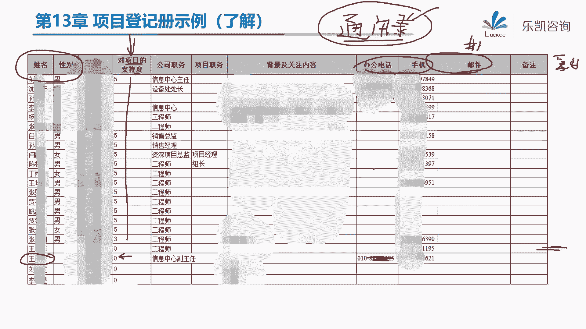

# 2024年PMP认证考试课程针对PMP新考纲最新免费零基础也能轻松听懂 - P15：第10、13章：项目沟通、相关方管理 - 乐凯咨询 - BV1Rj411G7gs

好各位同学，新年好，今天晚上呢我们继续这个3月份的课程好吧，那么我们很多同学看到了这个考试的安排，那么现在大家应该知道我们3月份的考试呢，实际上是留给遗留的学员的啊。

就是去年的11月份本来应该考试的同学，那么由于当时疫情的原因，所以呢很多人没有考，很多地区都没有考对吧，所以3月份是留给他们的，那么我们3月份班的，是调到了5月份去考试对吧，那么我们的安排呢是这样。

我们3月份的课程照常会继续进行啊，直到把整本书讲结束，那么在3月18号开始，我们会再开一期，那么我希望我们3月份班的同学，一定要抓住这次机会，那么为什么这么说呢，因为5月份的考试。

他的考纲也就是考试的内容，仍然是跟现在是一致的啊，不是用的新教材好吧，所以说5月份是比较重要的一个机会，那么如果说之前大家掌握的不好的，那么可以趁这个3月18号那一期的那个班，在一起的再听一遍好吧。

那么另外呢还有新报名的同学也是一样的，我们要抓住这个机会啊，尽量的在5月份能够能够这个顺利的参加考试，然后通过这个考试好吧，那么到了8月份呢，很有可能会使用第七版的教材。

所以说我觉得考试这个事情呢宜早不宜晚，好吧好，那么我们其他的就不多说了，具体的安排那个教务老师在群里面已经发过了，如果有不清楚的，可以再问教务老师好吧，那么接下来我们继续把剩下的这几章，我们一起过掉。

好那么今天我们主要讲两章内容，第十章项目的沟通管理，还有第十章章相关方，那么为什么这两章放在同一天去讲呢，因为本来呢这两章啊它是同一张，那么后面呢只是把它拆成了两张。

因为它是属于两个知识领域，那么我们先看沟通管理，那么项目的沟通管理呢，实际上在我们做项目的过程当中是很重要的，大家知道我们项目经理平时要花多少时间，花在沟通上吗，实际上这个时间是很多的啊。

要花90%以上的时间用来沟通，所以沟通是非常重要的好吧，那么大家要注意在我们项目管理里面，特别是我们pp里面所谓的沟通是什么意思，哎我们说相互之间有矛盾啊，没有把它沟通好对吧，哎或者相互之间意见不一致。

我们需要多沟通，这个叫沟通吗，实际上这个不叫沟通，在我们项目管理里面，所谓的沟通是非常纯粹的一个沟通，也就是他说的是信息的交换，那么什么叫信息的交换呢，简单的说就是信息的传递。

信息的收发只有这个东西叫做沟通好吧，那么沟通的它有多种形式，比如说书面的口头啊等等等等形式，那么在这里面呢有一个很有意思的法则，叫梅拉宾法则，考试的时候倒没有考到过，但是大家学习沟通的要稍微了解一下。

那么梅拉宾法则说的是什么意思呢，他说我们在沟通的时候啊，有两种，一种呢我们可以把它叫语言类沟通，还有一种呢叫非语言类对吧，那么语言类沟通呢占45%，让我们很意外的这个占比反而比较小。

那么非语言类沟通的占比是55%，那么什么叫非语言类呢，其实就是肢体语言，比如说一些手势动作，面部表情对吧，那么梅拉宾法则说，其实肢体语言更加能够体现我们的真实意图，对吧。

那么语言类沟通里面的真正的遣词造句，只是7%，还有38%是辅助的语言，大家知道什么叫辅助语言吗，实际上辅助语言就包括比如说语音和语调，那么我想对于我们中国人来说，大家应该有一个很深刻的认识。

就是同一句话用不同的语音跟语调说出来，他表达的意思很有可能就是不一样的，比如说举一个例子，我今天晚上想找聂丽同学吃个宵夜对吧，那么我跟聂丽说，诶小聂同学下了课之后，咱们搞个烧烤去不去，好。

小聂同学一听挺好，说我去，那么这代表什么，代表他同意了，我的建议是吧，下了课之后就去嘛对吧好，那么假如说换一个语音语调，你明天上班的时候，忽然发现你的办公桌上有一张请帖，你打开请帖一看。

是一个别的部门的，很少跟你打交道的同事要结婚，给你放了一个喜帖对吧，这个时候你忽然感慨说了一句，我去好，请问这种语音语调代表你去还是不去，那么你这样说的话很明显就是什么，就是你不想去，对不对。

那本身就不是同一个部门，本身很想打交道对吧，你结婚，实际上对我来说没有什么太大的关系对吧，你放个请帖放在我桌上，你一看我去代表什么，代表你不想去，是不是，所以说同样的一句话对吧。

不同的语音语调它会体现不同的意思，所以辅助语言这一块哪怕在语言类里面啊，辅助语言这一块要占38%，而真正的文字其实只占7%好吧，那么这一块梅拉宾法则呢虽然考试没有考过。

但是呢大家可以去体会一下，好吧好，那么接下来他还说，那么沟通呢可以从多个维度来划分，比如说我们可以分为内部和外部这样一个维度，内部就是项目内的，外部就是跟项目以外的对吧，那么正式和非正式是第二个维度。

这些都比较简单啊，不重要啊，很简单，那么我们有正式的沟通方法，比如说我们做报告，我们开会对吧，简报等等，那么非正式的呢，比如说电子邮件备忘物好，那么这里我说一下啊，大家要注意一下。

电子邮件它是非正式的沟通，对吧，那么我们看这边电子邮件，如果从这个维度来说，它属于书面还是口头呢，它属于书面，但是不管怎么说，电子邮件它属于非正式沟通，那么有的同学会问，那么在我们项目上正式的沟通。

一般我们不发邮件发什么呢，好有没有同学知道我们在做项目的时候，如果有一些正式的问题需要交涉，我们一般用什么样的方式，有同学知道吗，唉比如说我们的项目延期了啊，客户或者说业主非常的不满意啊。

打算要搞我们了，他一般会发什么，他一般对了，一般会发联络单或者叫发寒，明白吧，他不会说写一份邮件发给你的，这个是不正式的，一般会发函或者发工作联系单，像这种东西就比较正式了好吧。

所以电子游戏一般是非正式的，那么沟通还包括其他的维度，包括垂直和水平对吧，同级至今叫水平，上下级之间叫垂直，那么包括官方非官方口头，非口头。

那么这些东西呢稍微了解一下，那这个比较简单啊，比较简单，那么另外他说沟通的核心概念啊，他再次说了，其实就是指发送或者接收信息，所以说大家一定要注意啊，什么叫沟通有问题，就是指信息的收发出现了问题。

才叫沟通问题好吧，那么项目经理，大部分时间都需要跟相关方去沟通，那么我们要尽力去预防理解错误和沟通错误，那么另外他还提到了传统的书面沟通，有一个5c原则，那么这个5c原则呢，考试中也从来没有考到过啊。

大家可以了解一下好吧，它包括第一个c correct，正确的语法和拼写，对吧，那么大家要注意啊，我们在做项目的时候，当我们在跟相关方做一些沟通的时候，我们比如说要发一些邮件啊，或者要发一些信息啊。

一定要注意正确的语法和拼写，这是一个很基本的东西，那么我曾经见到过有项目经理出现过这种问题，比如说我收到项目经理发的工作周报，发现周报里面有错别字，大家知道，当别人看到你的周报。

或者说其他的信息里面有错别字，人家有一个什么感觉，如果你老是出现错别字，这就会导致什么呢，导致别人会感觉你这个人呢不严谨对吧，不负责啊，会给人这样一种很不好的感觉，那么另外我们在描述的时候要注意简洁啊。

不要扯很多，要不要有这些多余的文字，那么另外我们的目的要清晰对吧，我们的逻辑要连贯对吧，要简洁，目的要清晰，逻辑要连贯，唉我觉得这个事情怎么怎么样，你就说得很清楚，不要绕来绕去。

因为我们做项目沟通要讲究效率啊，不要去拐弯抹角，不像我们平时的生活，对吧啊我觉得你是个好人对吧，你有什么什么什么优点，说了一大堆，最后来一句，咱们俩不合适，这个不是我们项目中沟通的形式对吧。

我们项目中的沟通要体现简洁，目的要清晰对吧，那么另外逻辑要连贯，包括要有受控的语句和想法的承接，那么这个比如说在我们学工作绩效报告的时候，那么涉及到大篇幅的一些文字，那么我们要注意我们从小写作文的时候。

老师就叫我们有一个词，就是这个想法和承接之类的，叫什么呢，我们在写一篇文章的时候要承上启下对吧，那么这些地方要注意的，那么通过这样一个5c的原则，可以减轻一些理解的错误。

那么这些东西呢大家呢稍微了解一下啊，不是考试的一个重点。

好吧好，那么接下来他说现在呢我们有一些风格的变化，比如说我们在做项目的时候，要把相关方纳入到项目评审范围，让相关方参加一些会议对吧，那么另外他还说到一点，他说社交工具的使用日益增多啊。

我们有很多的社交工具，比如说最典型的是什么呢，微信抖音对吧，然后接下来他说，社交媒体工具不仅能够支持信息的交换，而且也有助于建立更深层次的信任和社群关系，那么这句话我希望大家在平时做项目的时候。

一定要注意，那么问大家一个问题，我们在做项目的时候对吧，一般我们会加甲方他们的微信啊，或者我们拉一个微信群，包括我们也会加他们个人的微信，那么加了他微信之后，在你下班晚上在家里面躺在床上休息的时候。

你看到甲方发了一条朋友圈，那么请问各位项目经理，你应该干什么，唉晚上我回家躺在床上一看，甲方爸爸发了一条朋友圈对吧，说他今天去钓鱼了，唉钓了几条，个头还不小，我们应该怎么办，好很多同学说要点赞对吧。

唉我们现在有一个关系叫点赞之交，啊要要评论对吧，好跟大家说啊，点赞和评论这个很初级，明白吧，当然这个是要做的，点赞和评论应该是要做的，那么大家要知道我遇到这种情况，我会干什么，我会去了解钓鱼有关的内容。

那么大家知道为什么我要去了解这个东西呢，因为在接下来工作的过程当中，有的时候啊，我们在工作的时候不是全部都是公对公啊，有的时候也会闲聊的嘛对吧，那么闲聊的时候你要聊什么好，大家注意。

闲聊的时候你就可以聊他的兴趣爱好对吧，哎比如说我跟肖思宇肖老师在做项目，肖老师是我的甲方对吧好，那么接下来做项目做了形象来的时候，诶，我忽然问一下肖老师，诶，夏老师，我看到你好像前两天去钓鱼了对吧。

哎收获还很多，我呢也喜欢钓鱼，但问题是什么呢，我钓鱼老是钓不上来，你有什么技巧，能不能教教我对吧，那么你要知道肖老师他是钓鱼的高手啊对吧，他的爱好就是这个，那么当你去问肖老师的时候，肖老师会怎么样。

唉他就会非常的感兴趣对吧，哎就会告诉你钓鱼首先要怎么样对吧，什么鱼用几号线，用几号钩子对吧，然后钓鱼什么时间点去钓对吧，什么鱼用什么饵会跟你讲得一非常的清楚，那么聊着聊着大家关系不就进了吗，是不是。

所以说我觉得做项目经理啊，要有这样一种敏感性对吧，你如果说单纯的跟客户是公对公的，那么这个大家的关系也就很一般是吧，但是如果说能够建立更深层次的信，任和社群关系，大家关系近了。

那么也非常有利于项目的推进好吧，那么这个大家要注意的啊，好然后接下来还要注意多面性的沟通方法对吧，要考虑所可所有可用的技术，要尊重文化差异，要尊重沟通方式的偏好，那么大家要注意啊，这个也很重要。

比如说我不说做项目啊，我说一个很简单的一个问题，各位同学给父母发微信的时候，你们是发语音条还是发文字，你跟你同事发消息的时候，你又是发语音条还是发文字呢，你会发现这里面好像是有一些区别的。

比如说我给我爸妈发微信，我一般是发语音条对吧，为什么呢，因为我爸妈已经上了点年纪了对吧，看了看不清楚，你说发一大段文字，然后他要眼睛对吧，仔细的看，一边看一边读，我靠等你一段话读下来之后，十几分钟。

20分钟过去了对吧，所以一般我给我爸妈，特别是给我妈发发消息，我一般是发语音条对吧，那么给同事发消息发什么呢，一般我是发文字，为什么呢，因为你不知道他是不是在开会啊，或者是怎么样是吧。

那么比如说在我开会的时候，我最害怕就是收到那种60秒的语音条，真的很头疼啊，虽然现在可以把它转文字，但是转的呢不是很清楚对吧，我更希望你是把文字发过来对吧，所以说大家要注意对于不同的人。

不同的文化背景对吧，不同的沟通偏好，那么我们沟通的方法也是不一样的好吧，这个要注意的好，那么接下来我们看一下我们在pp里面。

具体我们应该怎么去沟通，应该怎么去处理这些沟通有关的事情，那么首先我们看第一个过程，第一个过程叫规划沟通管理，那么大家要注意啊，我们之前学了很多的知识领域对吧，比如说范围里面的规划。

范围进度里面的规划进度对吧，规划成本规划质量，规划资源等等，那么这些过程都是要写一份管理计划，比如说范围管理计划，成本管理计划，我们也说过，管理计划说的是号，告诉我们怎么去管范围，怎么去管进度。

那么这边规划沟通管理也是一样的，告诉我们要写一份计划对吧，要说清楚我们将来怎么去管沟通，但是要注意这个过程很重要，因为规划沟通里面输出的沟通管理，计划里面是有沟通的，而且他还不是一个可有可无的计划。

那么为什么这么说呢，我们看一下啊，他说规划沟通管理是基于注意啊，基于每个相关方或者相关方群体的需要，然后制定恰当的方法和计划的过程，也就是说我的沟通要怎么样呢，用一个词来说，要因人而异。

因为他说我们要基于每个相关方的需要去沟通，对吧，不是所有人都需要这些信息，也不是所有人都喜欢用这种方式去沟通，所以我们要因人而异，那么这个过程的作用就是，我们要根据相关方的实际需要。

来制定适合的沟通计划，然后来提高我们的沟通效率和效果对吧，那么大家要注意啊，这个计划在规划的时候，我希望大家要注意记住两个字，网络上很流行的两个字叫舔狗，大家知道什么叫舔狗吗，就是在沟通这个事情上。

我们要做好一条舔狗，叫别人希望怎么沟通，我们就怎么跟他沟通，而不是说我定的规矩让别人来遵守，说我们项目上所有的沟通都用电话，都用邮件对吧，这个不对的，我们一定要看别人喜欢什么，他说用电话就用电话。

他说用邮件就用邮件，明白吗，这一点非常的重要好吧，那么既然要基于每个相关方的要求，要基于每个相关方的要求，那么我们就要参考什么呢，相关方登计策，我们项目中究竟有哪些相关方。

然后再去分析他们需要沟通什么信息，需要用什么样的手段来沟通，对吧好，那么接下来我们看一下做好这份沟通管理计划。

我们需要用到什么工具，首先我们需要做好沟通需求分析，那么什么叫沟通需求分析呢，就是我们要了解啊，项目中的这些相关方，包括客户，包括领导对吧，他们究竟需要什么类型的信息，他们需要用什么格式来沟通。

包括这些信息对相关方的价值究竟怎么样，明白吧，所以沟通需求分析就是要分析每一个相关方，需要什么信息对吧，包括类型格式价值，那么大家要注意这些相关方，我们几乎是都要跟他们去沟通的，那么不能有遗漏。

那么这边有一个很小的计算，在考试的时候是很容易考到的啊，沟通渠道的计算，就是我们这些人一共有多少条沟通渠道，那么什么叫沟通渠道呢，比如说我要跟游客沟通，那么我跟他之间就有一条沟通渠道对吧。

那么我来帮大家练一下啊，我问一下两个人之间很显然有一个渠道好，三个人之间相互沟通有几条渠道呢，三角形三条渠道对吧好，假如我们做项目的时候是四个人沟通，四个人有几条渠道，能看出来吗，一条两条，三条四条。

五条六条，有六条渠道对吧好，那么接下来五个人呢，六个人呢，诶这让我想起了高中时候的排列组合，有这样一个说法，叫你n个人cn 2，应该有这么这么多条沟通渠道对吧，那么pmp里面直接把这个公式写出来了。

当有n个人沟通的时候，那么沟通渠道就是n乘以n减1÷2，所以在考试的时候呢，他经常会这么问你啊，我现在整个项目团队，包括相关方一共是十个人，那么请问这里面有多少条沟通渠道，那么你就套公式对吧。

10x9÷2对吧，算出来等于45，就这么简单，现在偏僻考试的计算题非常简单，对吧好，然后接下来他说现在又加入了两个相关方，变成了12个人，问你增加了多少条沟通渠道，那么你先算12个人有多少条呢。

12x11，n乘以n减一吗，除以22个人是66条渠道，那么66-45，那么就是增加了21条渠道对吧，那么这个计算一定要会的啊，一定要会的非常的简单好吧好，那么沟通需求分析就是分析这些东西。

那么做好了沟通需求分析之后，接下来我们还要选择相应的沟通技术，那么什么叫沟通技术呢，比如说我们是用电话呀还是用邮件啊对吧，哎还是用其他的一些东西来沟通啊，那么沟通技术这个东西呢。

这个本身这个工具并不重要，那么大家主要要注意什么，我们将来在做项目的时候要合理的选择，比如说我们要考虑到信息的紧迫性对吧，包括信息的敏感性，保密性等等，比如说一般对于紧急信息，我们一般采取电话沟通对吧。

比如说有一些很敏感的，很保密的一些信息，我们可能是面对面的沟通对吧，所以沟通技术这个工具倒不是很重要，但是大家注意在将来做项目的时候，要合理的去选择好吧。

那么这是第二个工具，那么第三个工具就是我们沟通的时候，要了解沟通模型，要了解沟通模型，那么沟通模型呢这边写了很多，实际上我帮大家总结一下。

大致就是分为这么几个，那首先第一个叫编码，啊一个简单的沟通模型其实就是这样，那么什么叫编码呢，编码就是指我要把我大脑里面的一些想法，通过编码的方式把它变成什，么，要把它变成，比如说文字或者呢语音对吧。

这个叫编码，把我脑子里面的想法形成文字或者形成语音，那么编码编好了之后，我想要跟谁沟通，比如说我想跟张健同学，小张同学沟通，接下来怎么办，接下来第二步我们要传递啊，我通过一些技术去传递。

比如说我给他打电话啊，我给他发微信都可以对吧好，那么这个是我信息的发送方，要做的事情对吧，编码传递，那么传递过去之后，接下来张健同学收到了我的信息，他首先要干什么呢，他要解码，那么什么叫解码呢。

解码就是说他看到这段文字，或者他听到这段语音之后，他要知道我想表达什么意思对吧，他首先要解码啊，了解我想描述什么，或者我想表达什么，或者我想传达什么好，解码之后，接下来好这个地方大家要注意的。

首先要做一件事情，叫确认收到，你首先要确认收到，然后接下来才是给予反馈，好大家知道确认收到是什么意思吗，能不能理解这个词这个步骤诶，什么叫确认收到，它跟反馈有什么区别啊，我们上课用的是钉钉这个工具。

其实钉钉里面有一个功能，就是做的这件事确认收到，大家知道是什么吗，就是当别人发了一条消息给消息给你，你把这个消息打开解码之后，他忽然标记了一个这样一个状态，叫以毒，对吧，那么这个东西呢。

它不代表你是同意了还是不同意，你理解了还是不理解对吧，它只代表什么呢，代表你收到了这个信息对吧，那么至于你是同意还是不同意，理解还是不理解这个谁也不知道对吧，那么真正你最终同意不同意是通过什么来的。

通过反馈来的对吧，所以其实沟通就是这么一个简单的模型对吧，比如说我编了一段文字，我说张健今天晚上下了课，有没有时间啊，我们聚一聚啊对吧，然后通过丁丁把这个信息传递过去了，那么张健把钉钉打开一看。

看到这段文字啊，jim老师下了课之后想约我聊聊，对吧，好同时丁丁忽然标记一个以毒代表这个信息，张健已经收到了，但是张健呢他没有立即的回复对吧，张健心想，刚刚开过年来第一节课上课对吧。

下了课之后就想叫我出去聊聊，这小子不会找我借钱吧，是不是过年回去花的钱太多，要找我借钱啊，对吧好，他犹豫了半天，但是不管怎么说，在他犹豫的时候，这个信息已经标志了已读，他已经收到了对吧。

那么最终张建给予的反馈说啊，jm老师不好意思，今天晚上呢我还要复习偏僻，我就不去了吧，有什么事以后再说吧对吧，那么这个才是最终的反馈。

所以沟通模型实际上就这么简单，那么为什么要讲这个沟通模型呢。

那么大家要知道通过这个沟沟通模型，我们要知道发送方要做什么，发送方要做好编码和传递信息对吧，那么接收方要做什么呢，要注意解码，那么同时你如果一时半会儿回答不了，你要确认收到对吧。

告诉别人我已经收到这个信息了对吧，然后后面你再给出反馈和响应，那么另外还要注意，在整个过程当中要注意管理噪音好，我问一下大家知道什么叫沟通过程中的噪音吗，所谓的噪音就是会干扰到我们沟通的对吧。

会对我们的沟通产生影响或者产生误解了好，什么叫噪音，大家能想到类似的例子吗，啊有人说这个歧义对吧，不同的意见，这个不算噪音啊，噪音是什么啊，影响我们理解的，比如说我举几个例子，第一个方言。

将来如果说大家做外地项目，做外地项目啊，有可能会是会遇到这种噪音，方言明白吧，比如说我以前在哪一个项目上遇到这种噪音呢，在成都的项目上遇到了这种噪音，我当时那个项目是在成都做的。

有的时候呢我听了不太听不太懂对吧，所以我就跟供应商，包括跟业主发的，有些老师说哎不好意思啊，您刚刚说的我没有听明白，您能不能用这个用普通话再说一下好吧，那他们说我刚刚讲的就是普通话呀对吧。

但实际上这里面有一些东西，我确实没有听懂对吧，这里面是有一些发言影响的，我觉得在成都那一点，川普的好像这个出现的比较多一些对吧，那么这是一种，那么还有一种是我们年轻人啊，容易犯的一个错误。

是什么错误呢，也是一种噪音啊，就是网络语音对吧，现在这个网络呢这个网网络的这个越来越发达，那么很出现了很多的网络语言，那么这个网络语言呢，也会导致一些理解上的一些偏差，对吧啊，比如说什么emo啊对吧。

所以我特地为了这个词我去百度了一下，究竟他妈什么叫emo，那这个确实因为我们很少玩这个网络对吧，确实我看到这些东西呢，要去百度百度究竟这个东西代表什么意思对吧，那么像这些东西会对我们的沟通产生勾人干扰。

或者产生误解的这种，对吧，那就包括刚刚苏振国同学打的这个词对吧，这玩意儿我也好像经常看到，但是我还没有来得及去百度，这个词究竟是什么意思对吧，那么大家要注意啊，在我们做项目的时候，要尽量去避免这种东西。

因为我这个如果说你发个消息里面有这种东西，我确实我要去百度1下，因为我问嘛又不好意思问对吧，但是我又想知道究竟是什么意思，所以我真的要去了解一下这个词究竟是什么，好吧，那么我们在做项目的时候。

要注意避免这种东西好吧，好沟通模型告诉我们沟通实际上是怎么实现的，那么我们要注意发送方要做什么，接收方要做什么对吧，然后要注意避免一些噪音，好吧好，那么接下来还有沟通方法，那么大家注意。

这个工具是考试中经常出现的好吧，那么什么叫做沟通方法呢，他说我们常见的沟通方法有三种，一种叫推式沟通，一种叫互动式沟通，还有一种叫拉式沟通，那么什么叫推式沟通呢，那么推式沟通。

一般是站在信息的发送方的角度上，对吧，他经常会用的一种方式叫推，那么比如说我们发邮件发传真，这就是推式沟通，那么推式沟通的特点是什么，注意他只管发对吧，你想发邮件，我只管发，发传真，我只管发。

那么我只是为了把信息发给特定的受众，那么至于你有没有收到，那么这个叫推式沟通，那么还有一种呢叫拉式沟通，拉式沟通呢是站在接收方的角度，需要接收方主动去获取的，比如说举一个例子，最典型的是什么。

最典型的就是我们的钉钉的网盘，我们有一些学习资料对吧，是放在网盘里面的，那么由于我们的学员很多对吧，信息量很大或者受众很多，我不可能一个一个去发呀，也不可能一个一个跟你去交代怎么去用啊啊。

去哪里去看啊对吧，所以我直接放到网盘里面，那么大家有需要的，大家主动地自主地去从网盘上面去下载，那么这种是接收方主动获取的叫拉式沟通对吧，那么还有一种就是互动式沟通，那么这就是指在双方或者多方之间。

做实施多项的交换，那么这种是效率最高的好吧，那么考试的时候经常会考你各种场景，我们应该用什么方法，比如说如果我们要强调效率最高，效果最好的，我们当然有互动式沟通对吧好，但是如果题目中说，而我跟多个企业。

每个企业有多个相关方，有很多的人要沟通对吧，我要传达一些信息，那么如果说信息量很大或者受众很多的时候，那么就要用拉式沟通明白吧，那么这些这两个是考的最多的啊，推式沟通几乎没有考过。

那么互动式和拉式要注意的好吧，那么这三种方法其实用一个例子啊，大家很好去理解的，我们把我们要传递的信息看成什么，我们要把传递的信息，看成是我们自己的一个快递，我相信我们在座的所有的同学。

都应该收到过快递对吧，如果我们的信息是一个快递，什么叫推式沟通呢，推式沟通就是快递员把你的快递，直接放到你家的水表箱里面对吧，因为你不在家对吧，他只能把快递，把这个信息往你的水表箱里面一放。

就扔过去就行了，那么至于你有没有收到，他是无法保证的对吧，那么什么叫互动式沟通呢，好你正好在家里面，快递员就把这个信息交到你的手上，直接面对面的实时多下了沟通，这个叫互动式沟通，那么接下来我问一下。

大家知道哪一种是拉屎沟通吗，在我们小区里面有一种东西叫菜鸟驿站对吧，那么菜鸟驿站或者快递柜，就是需要你主动去获取的对吧，那么现在也有很多的快递，全部都是放在菜鸟驿站对吧，那么你自己过去自己去找。

自己去找，找到你自己的快递，自己拿走，那么这种叫什么，就是相当于我们这边的拉升沟通好吧，那么这种题目很简单，那么我相信大家在后面做题的时候，这种分数一定是必拿的分数好吧，沟通方法是考的比较多的好吧。

一定要注意这个工具，那么另外接下来还有一个工具也要注意。

叫沟通风格评估，我们刚刚讲了唉。

我们要做沟通需求分析对吧，然后选择合理的技术，要了解模型，要选择合适的沟通方法，另外还要做好沟通风格评估，那么什么叫沟通风格评估呢，我们要去识别相关方偏好，他们喜欢用什么方法，喜欢用什么技术。

说白了我们要干什么，我们要去做好一条舔狗，你喜欢用互动式沟通，交互式沟通，我就跟你交互式沟通，你喜欢用电话，我就给你打电话，你喜欢发邮件，我就给你发邮件对吧，一定要了解他们有什么偏好。

然后接下来我就用你喜欢的方式好，大家注意这句话，他说这种技术常用于不支持项目的相关方，大家要知道我们在做项目的时候，甲方那边并不是所有人都支持我们的，对吧啊，由于我们的项目可能损害了一些人的利益。

或者由于我们的项目给别人带来了，更多的额外的工作，所以别人可能会有一些人，对我们的项目是有一些抵触的，他不太支持我们这个项目，那么对于这种鸟人，大家要注意，你更加需要干什么，更加需要因人而异。

更加需要做好一条舔狗对吧，本来别人就不支持你了对吧，你还有一个他不喜欢的方式，就本来我就不太爱你，不太爱跟你沟通，你还给我发60秒的语音条，我靠那么我更加不太可能看看，所以对于这种不支持项目的相关方。

更加要注意沟通风格评估对吧好，那么我们通过这些工具，我们要合理的去规划好对吧，跟每个相关方，我们应该怎么沟通。

他需要什么信息是吧，那么最终形成了这一份叫沟通管理计划，好大家注意沟通管理计划，它的内容我们要了解的好吧，在考试的时候，凡是考到沟通这一块的，基本上都是考到他，那么沟通管理计划要注意一句话，我们以前说。

叉叉管理计划里面是没有这个东西的，比如说范围管理计划里面没有范围，进度管理计划里面没有进度，但是要注意沟通管理计划里面是有沟通的，因为我们需要因人而异的去量身定制，所以它里面会说清楚每个相关方。

它的沟通需求是什么，他需要沟通什么信息，用什么语言，用什么格式对吧，包括我们发送信息或者接收信息的实现和频率，谁负责发送保密信息对吧，包括通用术语表，通用术语表，比如说我们一些啊有点类似于名词解释对吧。

包括在我们沟通遇到问题的时候，或者在我们做项目遇到问题的时候，我们应该用什么样的问题升级程序，那么这些东西在沟通管理计划里面，都会写得很清楚，都会写得很清楚明白吧，所以沟通管理计划里面是有沟通的。

他是因人而异的，把这些东西事先都计划好的，那么最终才形成了一份沟通管理计划对吧，那么考试的时候他经常会怎么考呢，它经常会出现一些题目，它是沟通问题，会涉及到让我们去更新沟通管理计划的。

比如说会出现什么情况啊，跟大家总结一下，当题目中说到信息一定要注意啊，我们沟通只是讲信息的传递或者信息的交换，当说到有信息啊，比如说有一份文件啊，或者有一份图纸啊等等，多发了啊，他的描述是啊。

我们团队成员收到了很多无关的邮件，这个叫信息多发了对吧，或者信息呢少发了唉，有的相关方抱怨，为什么没有收到这个信息呢对吧，信息的少发，还有信息发得太迟了，迟发了啊，相关方听到这个信息感到很惊讶对吧。

唉为什么你现在才让别人知道啊，多发少发十发，包括你发的东西，别人看不懂啊，这就涉及到语言的问题对吧，发的东西别人看不懂，或者呢还有一个东西跟沟通有关，我们第九章讲到的虚拟团队，虚拟团队产生了误解。

那么遇到这些问题都代表什么，都代表你的信息的传递出现了问题，说明什么，说明你的沟通管理计划可能是有问题的，所以遇到这种情况，我们一般的选择就是更新沟通管理计划，或者审查沟通管理计划对吧。

如果你沟通管理计划还没做，那么你要立即去创建一份沟通管理计划，那么这种题目就是送分的好吧，那么后面再练习的时候，或者在模拟的时候，大家会发现这种题目啊，一定要把它做对好吧，凡是说到信息交换的问题。

它就是沟通问题好，那么接下来，计划做好了之后，我们怎么办，唉我们打算沟通嘛，因为我们项目上，90%的时间都是在跟相关方沟通嘛，那么我们跟每个人对吧，用什么形式沟通，他需要什么信息，我都已经理解清楚了。

而且形成了沟通管理计划，那么接下来干什么呢，那么接下来我们就要按照这份计划去干什么，去跟别人做信息的交换。

就要真正去跟别人沟通了对吧，所以接下来第二个过程叫管理沟通，管理沟通它是一个真正去执行的过程对吧，你之前不是已经计划好了吗，谁需要什么信息，用什么技术跟他去沟通吗对吧。

那么接下来你就按照这个计划去做嘛对吧，你把信息该传递给谁就传递给谁吗对吧，所以这个过程很简单啊，大家不要花太多的时间，他就是直接去跟别人沟通的一个过程对吧，那么其实这个过程我们就要按照沟通管理计划。

把信息传递给需要的人，那么比较常见的一种载体，信息的载体是什么呢，就是我们之前讲到的叫工作绩效报告，对吧啊，包括我们项目中常见的状态报告，进展报告，我们比如说周五要开周例会呀。

或者每一个阶段要开状态会议呀，那么我们要汇报项目的状态和进展对吧，那么这些东西要形成工作绩效报告，然后拿着工作绩效报告去干什么，去跟别人汇报对吧，形成我们的项目的沟通记录，那么这个过程很简单。

就是这么一个简单的输入工具和输出，所谓的沟通，就是拿着报告跟别人去汇报就可以了对吧，那么当然有同学说，那么除了工作需要报告，还有没有别的东西呢，也有的，比如说我问一下啊。

假如我们要跟别人就某一个变更去沟通，那么我们要拿着什么，还记得吗，唉我们要跟别人，我们项目上有很多的变更对吧，之前我们讲第四章的时候，说过变更的一些管理的流程，那么我们要跟别人去沟通一些变更。

我们手上要拿着什么呢，那么我们一般会拿着这个东西叫变更对了，变更日志，对吧，变更日志，当然有同学说变更单要不要也需要的对吧好，那么再比如说我们项目中出现了一个问题，我们要就这个问题展开讨论，去开个会。

然后我们要拿着什么，那么跟问题相关的问题日志对吧。

包括质量，我们在做审计的时候发现了一些问题对吧，我们要拿着质量报告，那么这些其实也是这个过程的输入，但是这些呢比较次要，那么最常见的是什么，就是拿着工作绩效报告去跟别人汇报好吧。

那么这个过程就比较简单了，那么接下来我问一下，假如在我们沟通的过程当中，我发现诶，感觉好像用这个技术沟通的效果不好对吧，本来我在做计划的时候，是说我每周给他打一次电话去沟通这个事情。

但是我发觉了他对这个方式呢好像比较抗拒啊，我当初的计划呢好像不太对，别人不太喜欢用这种方式，那么在这个过程当中，当我发现的问题，我要干什么，唉我本来当初规划好的啊，我跟这个人每周五一次对吧。

用电话去沟通一下我这个项目的情况，但是呢我忽然发现这个效果不好，电话里面都说不清楚，那么这个时候说明什么好，有同学马上反应过来，说明我当初的计划是存在问题的，我要去调整我的计划对吧，那么这是什么工作。

这就是所谓的监督沟通，那么监督沟通这个过程也很简单，他说其实监督沟通，就是优化信息的传递流程对吧，那么我们希望在监督的过程当中发现问题，然后去解决问题，来提高我们的沟通的效果啊，就这么简单。

那么如果发现我们的沟通是存在问题的，要改沟通管理计划，那怎么办，好，刚刚有同学说，那么改要不要走变更流程呢，注意看这个输出，要走变更流程去更新我们的沟通管理计划。

好吧好，那么沟通实际上就这么多，内容很简单很简单。

内容很少啊，主要的就是这个过程规划，沟通输出的沟通管理计划好吧。

那么整个沟通沟通大家要注意的这几个问题，我帮大家总结一下，其实很简单，第一个大家一定要注意在我们pp里面，什么是沟通问题，只有信息交换出现的问题才是沟通问题，最典型的在考试中经常出现的信息。

多发了少发了十发了对吧，你发的东西像汉谟拉比法典，根本他妈看不懂对吧，或者发的东西别人不方便阅读等等，只有这种信息的交换出问题，才叫沟通问题，这是第一个要注意的，第二个要注意的，我再次强调。

沟通的策略或者沟通的计划一定是量身定制的，要注意要迎合他们的偏好，要做好一条舔狗好，那么接下来我问一个问题啊，我明明做了一个计划，是每周跟这个相关方去开会的，结果呢，这个相关方呢。

他平时经常找我团队里面的人打电话，去了解一些信息，对吧，哎这就很苦恼了，我明明一开始规划沟通是每个星期开一次会的，结果呢他在平时呢又经常打电话找其他人，找我的团队成员了解一些信息好。

那么接下来我应该怎么做，我是让他遵守我的计划呢，还是我去了解他的沟通需求，去调整我的计划呢，遇到这种问题，我们应该怎么去选择，那么大家要注意，我们的计划是量身定制的，当我们计划做了以后，别人没有遵守。

我不能够要求他遵守，而是要去反思我的这个计划好像是有问题的，我要去跟他了解了解他的沟通需求，然后再去调整我的计划，这才对好吧，一定要注意做好一条舔狗该做的事情，好吧好。

那么接下来这几个工具来沟通需求分析，沟通方法，沟通风格评估是比较重要的，工具也比较简单对吧，大家要有印象，那么另外沟通管理计划里面包括哪些内容，要稍微注意一下好吧。

那么管理沟通跟监督沟通这两个过程很简单啊，考点也没有，大家可以稍微的看一看，那么沟通就这么多好。

那么接下来相关方，我们不管是在讲范围收集需求的时候也好，还是讲质量，还是讲我们刚刚的沟通都涉及到相关方对吧，包括一个东西叫相关方登记册，那么究竟这是什么东西呢，好那么第13章他讲了相关方的这些概念。

首先要注意什么叫做相关方，那么相关方呢实际上还有一个说法叫干系人，这是老版本的说法对吧，那么当然第七版的教材里面，也会把相关方再次更换成干系人好吧，先官方就是干系人，那么究竟什么叫先王方。

什么叫干系人呢，好相关方就是指跟项目有关的各方干系人，跟消防方是一样的对吧，就是跟项目有关系的这些人，那么具体的解释就是凡是会受到项目的影响，不管是积极还是消极的，只要他会受到项目影响。

或者呢能够对项目施加影响的任何人，他就是想方法好，那么大家能够想到项目中的相关方有哪些吗，你就套这个定义嘛，凡是能够影响项目或者受项目影响的，都叫相关方，那么它的范围就很大呀，能够想到有哪些相关方吗。

比如说最典型的客户对吧，或者用户他就是一个非常重要的相关方，甲方嘛他肯定是一个很重要的相关方啊，对吧好，有人说供应商是不是当然也是对吧，内部的领导，是不是也是我们公司内部的领导也好，职能经理也好。

职能部门的人也好对吧，只要他能够影响项目，它就是相关方，或者说项目影响也是相关方对吧，包括有同学说的诶，你自己的家人是不是相关方也是啊，他也受到这个项目的影响啊，所以相关方的范围很大。

当然我们一般说的相关方是指什么呢，直接跟项目有关的核心相关方对吧，那么为什么我们要去了解相关方呢，因为相关方的满意度应该作为项目的目标，加以识别和管理，相关方的满意度是很重要的。

我在启动的时候就跟大家谈论过一个问题，大家知道什么样的项目是成功的项目吗，实际上我做了这么多年项目，我最深的一个感触就是你能够搞定不同的人，你能够搞定这些相关方，让相关方都满意。

那么这个项目就是一个成功的项目对吧，其实它不在于你的进度做的有多提前，你的成本节约了多少对吧等等等等，实际上你只要能够做到让相关方满意，这就是一个成功的项目，好吧好。

那么另外还说相关方的范围正在扩大对吧，像我们做项目唉，有的时候遇到一些环境保护组织啊对吧，像这边的环保人士啊对吧，包括那些自认为自己受到影响的人，他也是相关方对吧，那么相关方我们一定要重视。

要加以管理，那么接下来我们看一下相关方的这几个过程，首先大家会发现我们的需求质量，包括我们刚刚讲的沟通都跟相关方有关，所以在项目的早期，我们就要做好一件事，要识别相关方，那么这个事情要尽早去做。

所以它属于启动过程组的一个事情，很早我们就要去识别相关方了对吧，我们要定期去识别相关方，分析和技术，他们的利益啊，参与度，影响力等等，一定要把这些相关方识别出来好，那么这里大家要注意一个词叫定期。

知道是什么意思吗，就是我们在项目启动的时候就要做好这个事情，但是呢不止做一次，因为随着我们项目的推进，会出现很多新的相关方出现对吧，所以我们要定期的去把这些人也要识别出来，要了解清楚他们的利益参与度。

相互依赖性对吧，那么在最早的时候，我们可以通过什么来识别，比如说早期我们通过项目章程，商业文件来识别相关方。

那么随着项目的推进，可能从项目管理计划，项目文件里面。

协议里面再去识别，所以我们要定期识别，那么这个过程一定要重视它的工具和输出。

那么怎么去怎么去识别呢，好我们可以用问卷和调查的方式去识别对吧，包括我们讲的头脑风暴的方法去识别，那么还有一个叫头脑写作，头脑写作呢实际上跟头脑风暴是差不多的，你可以把它叫书面化的头脑风暴对吧，他说诶。

我们可以用这种方法，在纸上面把自己的想法写出来，然后再收集起来去看啊，是一种书面形式的头脑风暴，那么通过这些方法来收集相关方的信息，那么这里面我想问一个问题啊，我做一个项目有哪些相关方。

为什么要用头脑风暴这种方法，我大致想一想不就好了吗，比如说我举一个例子啊，我们现在有一个项目要做，我们要去政府部门里面给政府做一个项目对吧，那么我们要识别相关方，那么为什么要头脑风暴畅所欲言呢。

哎大家随便说对吧，哪些是相关方，我们不至于不分析，不批判不批判对吧，你随便说好，大家注意，刚刚我看到其实有同学说到一个相关方，有人呢觉得很搞笑，他说到了这个相关方。

我们政府部门的楼下一般有这个人叫门卫对吧，但是有同学提到这个词的时候呢，其他同学在笑说门卫也是县官方，你是来搞笑的吧，对吧好，那么我问一下，首先门卫它是不是相关方，唉我们套相关方的定义啊。

凡是能够影响项目或者受项目影响的人，他就是相关方，那么能为它符合这个定义吗，它会不会影响你的项目，会啊，它就是一个相关方对吧，而且有很多人确实忽略了这种相关方，我跟跟你们说啊，这种相关方也是要注意的。

比如说像我以前全部都是做政府项目的对吧，大家这个没有接触过，或者说没有吃过亏，大家他可能不知道，所以我现在跟大家说一下我的亲身经历好吧，我们以前做政府项目，一般在政府办公楼的楼下。

一楼是有一个门卫的对吧，门卫前面摆了一张桌子，上面有一个签到了一个有一个表格对吧，凡是你去开会，你一定要写清楚我是哪家公司的，我几点几分来的，我是来找谁的，做什么事情呢，哎一般都是要登记的。

你登记好了之后，别人才会让你上去说这个道理吧，那么我一般会怎么做呢，我遇到这种人，我登记好了，会跟他感谢一下，给他发根烟对吧，然后我上去开会，再给他发根烟，跟他稍微聊两句对吧，反正闲扯嘛。

闲聊什么都可以嘛，哎比如说哎师傅，你们一般几点钟下班啊对吧，哎你们平时这个人多不多啊，哎有没有遇到一些难搞的人呢对吧，随便抽抽烟聊聊天不就熟了吗，混得脸熟吗，好那么到最后就会出现一种什么情况呢。

我去开会，我不需要签字，我去开会，门卫他认识我吗对吧，他会说诶，哎我说是啊，最近项目比较紧张对吧，这个开会比较多，他说哦，领导好像刚到对吧，你上去吧，我就上去了，你不要去写那些东西了。

但是有的项目经理呢他不会去跟别人搞关系，每局一次他妈签一次，每局一次签一次对吧，哎有的时候呢还会产生一些矛盾，好了，一旦产生矛盾，你就等着吧对吧，明明你很着急，他就不让你上去，你就要必须把它写清楚。

是不是，所以说不要小看这些人啊，这些人也是相关方，我们也要加以管理，那么这边我们用头脑风暴的目的是为了什么，实际上用头脑风暴的目的就是畅所欲言，避免有一些遗漏，好吧，那么通过这些技术。

我们可以收集到相关方的一种信息，什么信息呢，叫生份信息，哎有的同学说什么叫身份信息啊，说白了就是很基本的一些信息，比如说姓名对吧，年龄性别邮箱电话啊，这个基本的信息。

我们是可以通过这些东西把它收集到的好。

那么收集来了之后，接下来干什么呢，大家注意，我们不光要识别相关方。

我们还要分析他们的利益啊，参与度啊，所以收集完了之后，我们还要做分析分析好，大家注意要做好相关方的分析对吧，比如说这个相关方在组织内的位置是什么，在项目中是否承担什么角色，跟项目的利害关系大不大。

他的期望态度是什么，对吧，那么一定要做好相关方分析。

那么你分析好了这些东西之后，就会得到你的什么，你的评估结果，所以通过这个工具可以得到评估信息对吧，哎这个人他的权利怎么样，对项目的态度是怎么样的对吧，他对项目感不感兴趣等等，好你分析好了。

得到评估信息之后，然后你再去干什么呢，再去给他做分类分类可以得到分类信息，那么怎么去分类呢，好我们可以通过这个工具来分类，大家注意啊，这边一定要认真听，因为这个工具在考试中经常出现。

但是在我们的书上是没有的，好吧，这个工具叫权力利益二维方格，一般对于小型项目，我们可以用这样一个工具，那么什么叫权利，利益的二维方格呢，好它从两个维度，一个叫权力。

所谓的权利就是他的职位是高还是低了对吧，那么另外一个维度就是利益好，什么叫利益呢，注意力就是指他对这个项目他关心还是不关心，关注还是不关注对吧，好，怎么去分，遇到权力高力高的双高的这种人。

我们一定要重点管理好，而且对于这个项目又很关心，利益又很高，知道是谁吗，对吧啊，职位很高，非常高，而且对这个项目呢非常的关心，非常的关注，他利益很高，什么人，好有人说甲方的老总，甲方的负责人。

甲方的老板对了，而且要注意这个领导啊，一般是分管这个项目的领导，明白吧，而我们又是做的信息化项目对吧，他属于分管领导，他的职位很高，而且就直接分管我们这个项目，权利利益都很高，那么对于这种人怎么样。

我们一定要重点管理，要密切关注他对吧好，但是呢对这个项目呢不关心，利益很低好，请问这种人是什么人，但是呢利益呢不高，我刚刚举了一个例子，说我们是做信息化项目的对吧，那么甲方那边的领导呢。

好消失于说隔壁的领导，实际上就是他是一个领导，但是呢它不具体管我们这一块对吧，比如说我刚刚举的例子，他不管我们信息化项目对吧，人家领导权利当然高，但是他管我这个项目，对我这个项目呢不太关心对吧。

那么对于这种人我们应该怎么去管理，我们要令其满意，大家知道为什么要令其满意吗，很简单，因为他会帮你吗，他不太会帮你，因为他跟你那没有什么太多关系，但是如果你得罪他，他要弄死你呢，很容易，对不对。

他虽然不太会帮你，但是他想搞你呢很容易的，所以对于这种人，我们一定要让他满意就可以了，令其满意是吧好，另外有一次考试还问了一个问题，这种人一般在什么会议上会出现，你比如说我们的每周的例会呀。

或者项目的一些这个呃状态报告会议呀，他会来吗，你会发现这些人一般的会议他不会来对吧，那么他什么时候会出现呢，好有很多同学说了什么时候，总结来说，一般在这种高层级的会议上，他才会露个脸对吧。

比如说我们有同学王律师说的，验收的时候啊对吧，包括启动的时候啊是吧，像这种高层级的会议上，他才会出来露个脸，哎，这边要剪彩了，你来一下，这边要电击了，用铁锹挖两锹土了，他来了对吧，那么平时他会出现吗。

平时他不会出现，所以一般在高层级的会议上，这种人会出现对吧好，那么除了这两种人，就是说权利呢职权的不是那么高，但是呢非常关心我这个项目好，请问这种人我们要随时告知，很典型的是甲方那边的什么人。

权力不高对吧，一般是某个主任对吧，但是呢利益很高，非常关心这个项目，好有同学马上说了，是甲方的谁呀，甲方的对接人，实际上就是甲方的项目经理对吧，甲方那边有一个人来跟我们对接的。

因为一般这种人的权利高不高，但权力不是太高，权利不高，但是呢他负责跟我们对接，他对我们这个项目非常的操心，因为他做不好要挨骂是吧，所以这种人我们要干什么，我们要随时告知项目的一些信息，对吧好。

那么甲方还有一些小透明，比如说我们刚刚举的例子，门卫门卫是哪一种人，权利低，有什么权利啊，没什么权利的利益呢，利也很低双低，那么对于这种人怎么办，注意我们不是不管他，我们要监督。

大家知道为什么对于这种权利，低利率的相关方，我们并没有抛弃他，我们也要花点精力去监督监督呢，那么刚刚讲的门卫对吧，大家会知道，如果你搞崩了，他可能会给你设置一些人为的障碍是吧。

好还有一次在做项目的时候啊，我们项目组里面有一个小伙问我，他说你看啊，客户那个科室里面的那个谁谁谁，年纪呢又很轻对吧，能力量又不行啊，怎么怎么样，言下之意呢就很看不起人家对吧，那么这种相关方。

一个年轻的小伙在甲方那边要权利没权利对吧，要立嘛也没什么利益，而且他本身能力也很差，那么你说对于这种相关方要不要监督呢，要监督的，我当时就问了我们项目组那个小伙一个问题啊。

我说你都觉得甲方那边的那个人能力又差对吧，又年轻啊啊各方面都不好，但是你有没有想过一个问题，就是这种人为什么会进这个单位呢，对吧，这里面可能有很多什么，可能有很多其他的一些关系在里面对吧。

所以对于这些人我们也要去稍微维护一下，要去监督的，要去监督的好吧，所以这种这四个维度分别要怎么处理，大家要注意好吧，这个叫权利利益方格，也是我们考试当中的一个重点啊，考得很多，这个工具在书上还没有。

那么对于小型项目，我们用这样一个工具就可以分类，把它分好了对吧，那么如果说人多一些怎么办啊，除了权利和利益，我们可能还要分析影响啊，或者分析作用啊，那么从两个维度加一个变成三个维度。

那可能就变成了立方体对吧，那么如果人数再多，那么就变成了凸显模型，那么关于这两块，大家可以稍微花点时间看一下讲义上的这一页，那么考试的时候考的很少。

考的最多的是这个，好吧好，那么接下来我们通过这些工具。

得到了相关方的身份信息，评估信息，分类信息对吧，当然我们其他还有一些工具，比如说我们要了解影响和方向，如果相关方有大量相关方。

相关方太多，还要考虑优先级对吧，那么结合这些，最终我们形成了一份相关方登记册，好我们注意看相关方登记册里面包括什么，你看它就包括了我们刚刚说的，通过一些数据收集得到的身份信息。

通过相关方分析得到的评估信息，通过权利利益方格对它分类。

得到的分类信息对吧，那么接下来我给大家看一个例子，这一份就是我们的相关方登记册，那么每一个相关方都会列在里面，那么像比如姓名性别这种就是很典型的对吧，这种叫身份信息很基本的啊，包括办公电话。

手机邮件等等，那么包括那对项目的支持程度，这个就是什么呢，评估信息对吧，那么当然你也可以去分类，那么我想说一点啊，这份文档只给大家作为参考，大家在实际做项目的时候，我建议大家不要去写这份文档，明白吧。

我们在实际做项目的时候，不要写这份文档，我们可以换另外一种文档，更简单，叫项目的通讯录，这是我的个人建议啊，真正在做项目的时候，我们只写通讯录，不要写太多的评估信息，分类信息，大家知道为什么吗。

唉我们做项目出现的比较多的，实际上是通讯录对吧，只写名字，电话邮件，最多加个职位就结束了，像这种对项目的支持程度打分不要学，包括刚刚有人说的兴趣爱好，对项目的一些期望要求，这些都不要写，为什么。

因为很有可能会涉及到敏感信息的泄露对吧，万一这份文档你没有保护好，流出去了对吧，我正好就是这个单位的王老师，我看到你在这份文件里面写，我对项目的支持程度是零，虽然我不知道这个零代表什么意思对吧。

但是他娘的其他人都是五啊，都是三啊，到我这就变成了零对吧，好那么我就让你知道知道什么叫零是吧，再比如说爱好，这个人爱好占这个人爱占小便宜对吧，唉这个人喜欢别人请他吃饭，靠这种东西泄露出去还得了啊。

所以说我建议大家在真正做项目的时候，你只写通讯录就可以了，其他东西记在脑子里明白吗，其他东西把它记在脑子里好吧好。

那么另外还有一个细节要注意的，他说，识别相关方在启动的时候就会做，那么首次识别的时候不要提出任何变更请求，他不会涉及到计划的变更的对吧，但是由于识别相关方是一个定期要做的事。

所以在后续定期识别相关方的时候，就有可能会影响到我们的项目管理计划，好问一个问题，在定期识别相关方的时候，如果出现了新的相关方，会影响我们的哪一个管理计划，能够想得到吗，由于出现了新的相关方。

所以我要跟新的小汪汪去沟通，所以沟通渠道它肯定变了，包括新的相关方，它有一些他的沟通的要求，沟通的偏好对吧，出现新的相关方，它可能会对，那我们刚刚讲的沟通管理机构会产生一些变更。

所以这边在后续在规划的时候，出现了新的相关方，可能会影响到我们的计划，要提出变更请求去更新，好吧好，那么这是第一个过程，启动的时候就要做的识别相关方好，然后接下来识别好了，相关方要干什么。

你有要求要跟他去沟通的。

那么你跟他沟通去对吧，另外单纯的这个相关方还要做好一件事。

要规划相关方参与，那么什么叫规划相关方参与呢，刚刚那个过程识别相关方是把人识别出来，那么人识别出来了，你知道这个人的评估信息了，他的期望态度，兴趣爱好好，我问一下大家，当你知道别人的兴趣爱好，期望态度。

你觉得你应该干什么，哎我们说做项目要让相关方满意呀对吧，那么我先把相关方都找出来了，然后我还分析了分析了他的兴趣爱好啊，态度啊，对吧等等等等等等，所有的东西分析清楚了，形成了相关方的预测。

那么接下来干什么好，有人说要投其所好，还没那么快，首先我们要做这件事，叫规划相关方参与，我用了三个字来描述，叫要，策略，我们要搞定相关方，我们当然要定搞定它的策略，对吧，当然了。

pp里面讲的呢就比较正面是吧，他是这么说的，根据相关方的需要，希望利益和对项目的潜在影响，然后制定相关方参与项目的方法，靠对吧，你再看这句话，提供与相关方进行有效互动的可行计划，这他妈不是一回事吗。

不就是你要定稿人的策略吗，你打算怎么去搞定他吗，是吧好那么你打算怎么去搞定他，你要参考什么，你要参考你刚刚写的那一份很重要的东西，叫相关方登记册啊，西官方登记册里面有这些人的期望态度，兴趣爱好。

什么东西都有啊，那么你要参考他来定策略啊对吧。

那么接下来具体怎么去定策略呢，好我们要做假设条件和制约因素分析，要做根本原因分析对吧，然如果说遇到相关方很多的，我们还要确定优先级啊，这些工具我们之前都讲过对吧，包括如果你自己不知道怎么去搞定别人。

可以标杆对照吗，看看人家做得好的是怎么搞定的，你学吗，对吧好，另外还有一个衡水的工具，美国人说我们还可以借助这样一个工具，叫相关方参与度评估举证，对吧好，那么接下来我来给大家介绍一下。

这个水货究竟是什么意思啊，美国人呢你要知道对吧，国外的人一般对人情世故，跟我们中国人比起来还是有差距的。

所以他们用了这样一个工具，他说我们把相关方分为这么五档，第一档叫不了解，就是这个相关方对我们项目的完全不了解，第二种呢叫抵制，而这种人抵制我们的项目，第三档叫中立，他也不抵制，但是呢也不支持。

属于中立的一种相关方，那么第四档呢叫支持啊，这种人很支持我们，那么最高的叫领导，那么下面的四种呢其实区别都是很明显的，从字面意思就能够看得出来，对吧好，那么接下来支持和领导的区别是什么啊。

支持呢他偏被动，领导呢他偏主动，对吧，那么什么叫被动呢，比如说我现在在讲课，我跟我老婆说，诶你帮我倒杯水好，我老婆就帮我倒了杯水，如果我有要求，那么他会支持我，这个叫被动，那么什么叫主动呢。

主动就是不需要我说对吧，哎他就在旁边转悠，看到我杯子没水了，就赶紧来加个水，他比较积极，在保证项目的成功，一个偏被动，一个偏主动好吧，那么不管怎么说，老外说我们把它分为这么无党。

然后接下来把所有的相关方列在这边，然后接下来用c表示当前这个相关方是哪一种，对吧，那这个c代表什么呢，其实就是英文字母的current，当前c嘛对吧，然后接下来用d表示我需要它是哪一种。

或者说我期望这个相关方应该是哪一种，这个d的就是英文字母的desire d开头的好，然后他说用c表示当前这个相关方是哪一档，用d表示我们希望它是哪一档，如果发觉c和d不在同一个格子里面，那么说明什么。

他说如果你发现像这种c和d差距较大，或者c和g不在同一个格子里面的，那么你要注意了，说明我们对这些人要采取行动，要跟他沟通，要想办法消除差距，我当时看到这个工具，我都看懵了，靠就这么个玩意儿。

还要写个表格，还要用c表示当前的，用d表示我们期望的结果，写出来之后才发现c和d不在一起，看人家对你什么态度，你自己没点数吗，还需要画个表格吗，那不管怎么说，既然pp里面介绍了这个工具。

那么我们就学习一下这个工具啊，这么牛逼的一个工具叫相关方参与度评估举证，把所有的人列出来对吧，c表示当前的d表示我期望的，然后c和d不在一个格子里面，就代表啊我们要采取行动，要消除这个差距。

就这么个工具，但是话又说回来了，我问一下相关方三，这个人c和d是一致的，他当前是支持我们的，我也希望他是支持我们的，那么对于这种人，我们应该怎么办啊，他已经这样了，我们应该怎么办，大家注意。

我们不不能放任不管，我们仍然要监督，人家要监督的好吧啊，包括像我们女同学说的，要维护对吧，不能放任不管的啊。

还是要把它监督下去的好，那么通过这些工具，我们定好怎么样搞定这些人的策略，输出了相关方参与计划，那么我们看一下p m p里面是怎么说，这份计划的，他说相关方参与计划。

是用于促进相关方有效参与决策和执行的，策略和行动，说白了就是定的搞定这些人的策略对吧，那么相关方参与计划里面，就包括了这些相关方的信息，包括了相关方之间的交叉关系，对吧好，另外他还说了这样一句话。

项目经理要意识到相关方参与计划的敏感性，对吧，并采取恰当的预防措施，这个跟我刚刚说相关方登记册的时候，是一回事儿对吧，你既然有了相关方登记册，知道他他的兴趣爱好希望，然后你又定了一些策略啊。

你打算怎么去搞定他，这些东西都是很敏感的，一定要采取相应的预防措施，它是很敏感的对吧，所以规划相关方参与，其实说来说去就三个字，要定策略好，那么接下来我再问你有了相关方登记册。

你根据消化方登记册定好了搞人的策略，那么接下来请问你会干什么，相关方我都识别了，形成了相关方登记测都评估好了，都分类好了，根据这些评估和分类，我还定好了，搞定他们的策略，那么接下来干什么。

接下来你就根据这个策略去干什么，唉要实施了，要开始去搞定他了对吧。

所以接下来这个过程叫管理相关方，参与这个过程用两个字来描述，就是我们要根据策略来盘他，不就这么简单吗，对不对，你人有了搞定他的策略也有了，接下来就根据策略去盘它吗对吧，当然pp里面说的没有这么赤裸裸。

p p里面是这么说的，他说我们要跟相关方进行协作和沟通，来干什么呢，来满足他的需要和期望对吧，来处理问题，那么通过这种方式来促进相关方合理地参与，我们要通过这些方法来提高相关方，对我们的支持。

尽可能的去降低他们对我们的抵制，对吧好，那么这个过程在考试中题目出现了也是很多的，那么我说一下一般会出现什么题目啊，在题目中会突然出现有一个鸟人对吧，这个鸟人在干什么呢，它题目会有一个场景。

而我们正在做项目，然后附近的居民怎么怎么样，有一个环保组织怎么怎么样，总之有人在抵制你，有人在反对你，有人在威胁你啊，威胁要起诉你对吧，不管是抵制反对威胁等等等等，总之总结成一句话。

就是我发现有一个鸟人在兴风作浪，有一个相关方不支持，那么接下来我们就要想办法去盘它，那么怎么去盘它呢，好这个过程其实考的最多的并不是工具和输出，考得最多的是这四句话，我们要引导相关方参与。

只有相关方参与进来，了解了我们的项目，才有可能获得他们的支持对吧，所以这是第一句话，引导参与获得支持，那么第二句话是什么呢，我们要通过谈判沟通来管理相关方的期望，相关方的期望呢也是需要管理的对吧。

然后接下来处理风险预测，相关方可能出现了问题，然后第四点澄清和解决问题对吧，有人在抵制你，有人在反对里，有人在威胁你，那么我们就要去管理相关方参与。

具体的就是这四句话好吧，那么它的输入工具这些东西呢稍微看一看啊。

输入那只要是相关方在抵制反对威胁。

在兴风作浪，你可以把它记到问题日志对吧。

然后再结合相关方登记册对吧，结合相关方参与计划，然后想办法来搞定它对吧，那么在搞定它的过程当中，可能由于相关犯的一些要求，会有一些东西呢超出我们的范围，像我们在做项目的时候，经常遇到这种情况对吧。

相关方忽然提出来要增加一个功能，要增加一个设备对吧，然后呢脾气还很大，你如果不给他增加了，他就不同意。

怎么怎么样，那么这个时候可能会涉及到变更的好吧，那么这个过程主要是搞定人。

记住这四句话就可以了，好那么接下来我问一下，你发现有一个相关方，他比较爱占小便宜，对吧，你识别出来了这个相关方啊，这个相关方呢它有一定的权利对吧，对下面有些影响，他呢也爱占小便宜。

那么你当时定的策略呢就是给他送礼对吧，在过年的时候，你给你们的销售打电话了，让销售给他送点礼，销售的也送了好，送了之后发觉开过年来做项目的时候，他仍然是脾气很大对吧，感觉这个人呢没有任何改进。

没有搞定他好，请问你觉得是什么问题，诶我明明已经识别到相关方啊，然后我也评估好了，然后定好了策略，然后我根据这个策略我去盘它了呀，结果盘完了之后发现那不行，什么问题，有同学说说明你的策略有问题了对吧。

我们要审查相关方参与计划，我们是不是当时定的策略是有问题的。

所以那最后一个过程叫监督相关方参与，一样的对吧，我们要监督相关方的关系，并通过修订相应的策略，来引导相关方合理的参与，来提升相关方参与的效率和效果对吧。

所以呢这个过程也很简单，就是要审查策略，我们要做根本原因分析，要做相关方分析。

了解究竟什么地方出了问题对吧，然后接下来再通过一些人际关系技能啊，去分析一下，如果确实有问题，我们要提出变更，请求这个过程没有考点，从来没有考过，但是大家要理解意思对吧，我们在管理相关的过程当中。

可能我们的手段是有些问题的，比如说刚刚有同学说的，是不是送礼少了两箱土特产好，我问一下啊，各位项目经理以后工作，做项目的时候，难免都会遇到这些问题的，这个很正常，那么我想考验一下大家的情商。

在过年的时候，你从老家回来带了土特产，送给相关方，请问这种做法好不好，有同学说收礼是我们公司的红线对吧，我们不允许收礼，那你要看这个礼是什么礼对吧，因为我们做项目，确实呢给甲方带来了一些额外的工作。

造成了一些麻烦，所以当我们逢年过节的时候呢，会表示一下心意对吧，略微表示一下心意对吧，你只要不要超标就可以了吗，是不是好，那么关键是你用什么东西来表心意呢，好土特产行不行呢，好不好，我告诉大家不好。

不要说对吧，你会发现不行啊，有同学说送礼确实是一门学问啊，大家知道为什么土特产不好吗，因为你虽然觉得这个东西是个好东西，但是由于地区的文化差异，别人不一定知道这是一个好东西对吧。

有一些东西看上去呢不好不太干净，但实际上是一个好东西，比如说像什么腊肉啊对吧，包括什么火腿啊，那表面可能都长毛了，但别人看了之后都不敢吃对吧，所以土特产呢不要去送，这个是不好的对吧好，那么我再问。

那么送茶叶好不好呢，有人说碧螺春龙井对吧，就是茶叶吗，茶叶好不好呢，我告诉大家也不太好，大家知道为什么茶叶不太好吗，我友情提示一下啊，茶叶你要送要有两个前提，第一个前提就是你懂察，就你自己啊。

送的人你是懂茶的，而且收的人他也是懂的，因为茶叶这个玩意儿呢，好的跟差的差距太大了，一盒茶如果送给不懂的人，谁都不知道这盒茶究竟是个什么茶，对吧就对了，就像我们李斌同学说的，他没个标准是吧。

你送一条烟嘛，他多少钱就多少钱，你送一瓶酒多少钱就多少钱，但是你说一盒茶叶多少钱呢，不知道，对吧，还有人说送卡，那么一般我们在做项目的时候，逢年过节会表示一下对吧，给甲方的对接人呢送一张卡。

这个东西也不违规对吧，也不超标，比如说送个500 1000的卡购物卡可以吗，这个是可以的对吧，但是呢多多少少也代表了你没有花什么心思，那么有人说，那么我送什么呢啊，有同学说这个送礼最好送什么。

我建议大家送什么东西啊，你稍微花点心思送一些别人经常用到的对吧，第一个经常用到的，第二个呢要，怎么说呢，叫出现这种东西，出现溢价的，就这个东西感觉不值这么多钱，明白吧，比如说我举一个例子啊。

大家对比一下，我们公司给我们的预算是，给甲方的对接人500块钱的预算，送个小礼物，我可以选择送他500块钱的手机，我也可以送他500块钱的打火机，你觉得送哪一个好一些，你是500块钱的手机。

靠你这是在误人对吧，什么他们他娘的手机啊，怎么就500块钱，这玩意儿能用，感觉都不像是人用的对吧，但是如果你送500块钱的打火机呢，我靠这个打火机好贵呀对吧，这个牌子是个名牌对吧，很贵。

那我平时抽烟又用打火机，我每次掏出这个打火机，我就想到这是我们张庆东张经理送给我的对吧，唉张庆东送了我一个打火机，这个500块呢是吧，你看看，所以不同的同样的一个价格啊。

不同的东西它的送存的效果是不一样的好吧，那么这些东西大家在真正做项目，在工作的过程当中，自己要慢慢去体会。

好吧好那么这个过程这个知识领域啊。

相关方比较重要的，实际上是前面几个怎么去识别相关方对吧。

然后规划相关方参与里面的这个工具，虽然很水，要了解一下，然后怎么去管理相关方。

比较重要的是这四句话，考试是经常在这里面去考的好吧。

所以这个相关方知识领域要掌握的重点是，识别相关方的重要的工具和输出相关方参与度，评估举证它的含义，然后包括这四句话，那么考试另外还有一些考法，最常见的就是当有人在兴风作浪的时候，他有两种问法啊。

第一种问法就是在题干是这么说的，有一个鸟人在兴风作浪，啊有人在反对你，抵制你，威胁你，如果问你，你事先应该做好什么，那么你要注意我们事情要尽早要识别相关方，尽早去做好相关方分析。

让相关方尽早参与三个早早识别，早分析，早参与对吧好，如果换个问法，有个鸟人在兴风作浪，你下一步应该做什么好，你下一步要么就是管理相关方参与，就是做这四句话对吧，要么就是我审查审查我的相关方参与计划。

是不是我的策略，当时是有问题的好吧，那么这些东西，大家可以通过我们后续的题目再去巩固一下，好吧，那么今天我们就讲这两章沟通和相关方，那么这两章内容都很少，以前呢是同一张好吧。

那么最后我再说一下，在真正后面做模拟的时候，我们有很多同学会遇到一个问题，就是一道题目，他究竟是沟通题还是相关方提，那么我希望大家要做好区分，这是我们有部分同学经常遇到的一些问题。

那么怎么去区分这道题目，是沟通有问题还是相关方有问题呢，好很简单，如果说到是信息的问题，什么叫信息的问题，就是我们刚刚说的有信息多发了，少发了十发了，总之是信息出的问题，那么它就是沟通出了问题。

我们要审查或者更新沟通管理计划对吧，那么假如是人出的问题，有一个鸟人对吧，有一个孙子，他在反对你在抵制，你，在威胁你，是有人在兴风作浪的，那么这个就是相关方的问题，那么你就要去管理相关方参与好吧。

这两个手机上应该是很好区分的，很好区分的好吧好，那么今天的课我们就到这里为止，那么接下来今天讲的内容，有没有什么不明白的地方，留下来答疑，沟通跟相关方，在考试当中其实还是有一定的题量的啊。

这些题目呢我希望大家要尽量做对，因为比较简单啊，比较简单，p m p的考试呢，他不会问你具体的细节对吧，比如说有人在反对你。

抵制你，你应该怎么办呢，你就套这四句话嘛，透这四句话对吧，比如说最常见的就是啊，我去跟他了解一下他反对的理由是什么，原因是什么，可以问啊，现在是答疑时间啊。

有什么问题都可以问，沟通风格评估跟沟通方法。

它是两个不同的东西啊，那推式拉式互动式，这个叫沟通方法，明白吧，沟通风格评估是什么意思呢，就是说我们要了解别人喜欢用什么方法，好有同学问了一个问题，他说信息传递出了问题，归根到底是不是人的问题。

因为信息是人联络的，好，要注意啊，信息是人来传递的，但是你要知道人是根据什么来传递的，人是根据沟通管理计划来传递的，明白吧，所以说沟通问题为什么说要审查沟通管理计划，就是这个道理好吧。

然后接下来有同学说，管理相关方参与的这四句话有没有优先级关系。

没有在考试的时候，选项里面只有一个选项跟这四句话是有关系的，它不会出同时出现两个好吧，然后接下来张善一同学问了一个问题。

他说相关方参与度评估，举证有没有可能出现这种情况，比如说d是抵制的，c反而是支持出现这种情况，不会，明白吧，不会出现这种很怪异的情况，难道还要降低它的这种参与度吗，像这种一般不会有的。

好吧好，李娜说虚拟团队是什么意思。

我们刚刚在讲沟通的时候，说到啊，什么时候是沟通问题，其中有一种情况就是虚拟团队出现一些误解。

那么什么叫虚拟团队呢，应该是一个新报名的同学吧对吧，我们第九章说过虚拟团队俗称叫云队友，简单的说就是大家不在同一个城市，不在同一个物理地点对吧，但是大家在同时为一个项目工作，所以我们用一种比如说视频啊。

电话呀对吧，用这种方式来沟通的，那么这种就叫虚拟团队，明白吗，大家不在同一个地点，比如说我们在上海有公司，那么我们这个项目呢还有成都分公司，西安分公司有同事在参与，不在同一个地方。

我们是通过比如说视频对吧，视频会以这种方法来沟通的，那么大家要知道虚拟团队最重要的是什么问题，其实最重要的就是沟通问题，明白吗，所以在考试中，但凡出现说虚拟团队之间产生了一些误解啊。

那么问你你应该怎么办，那么你一定要注意，一定是跟沟通有关的，要审查沟通管理计划，明白吧，所以虚拟团队对虚拟团队本身没有什么问题啊，我们这边说的是信息多发少发，植发看不懂不方便。

或者虚拟团队中间出现了一些理解的偏差，那么这些都很有可能是沟通问题。

相关方如果兴风作浪对吧，问你事先应该做好什么事，情，要找时别找分析，找参与，张健，你说的是对的啊，漏发就是我们说的少发吗，有啊，比如说题目中会出现有相关方在抱怨说诶，他们没有收到相应的文件。

这就是所谓的信息的少发，或者你说的漏发信息，多发少发，迟发对吧，包括发的东西看不懂，不方便阅读，这些都是沟通问题，好吧，这些题目呢其实很简单啊很简单，我希望大家在做题的时候，这种题目一定要拿分的。

好工海锡同学问了一个问题，他说这些管理计划里面，是不是只有沟通管理计划里面有东西，应该说比较典型的，确实只有沟通管理计划，那么其他的也有一些，比如说那我们刚刚说的相关方参与计划里面。

也有相关方的一些信息对吧，那么相对来说沟通管理计划比较典型，早识别是指我们项目经理要尽早识别相关方，早分析就是要尽早做好相关方的分析对吧，早参与就是我们要尽早让相关方参与进来，明白吧，为什么呢。

因为我们要尽早引导他参与，只有他参与进来，才容易获得他的支持，如果他连参与都不参与，你想让他支持，这个是几乎不可能的对吧，所以这个早参与是确实实让相关方要尽早参与，好吧，这三个枣意思稍微注意一下。

其实很简单，尽早识别，尽早做好分析，尽早让他们参与。

对的，沟通管理计划也是好说的是我们如何去沟通，但是沟通管理计划里面有具体的内容好吧，这点要注意的，沟通管理计划里面会涉及到谁需要什么信息，对吧，用什么格式，用什么形式，是用什么频率。

所以沟通管理计划里面有实质性的内容，喏需要沟通的信息，包括用什么语言，用什么格式，用它的内容的详细程度它都有的，所以沟通管理计划里面是有沟通的，它不是一个很形式的文件，对吧，所以王连顺你要注意一下啊。

其实很简单，为什么沟通管理计划里面要有沟通。

因为我们在一开始就说过，我们的沟通要怎么规划，要基于每个相关方的需求，他真的是量身定制的，所以它一定有实质的内容，而不是说所有的项目都通用的，这个是不可能的，好工海锡同学问了一个很好的问题。

他说为什么识别相关方的输入，有相关方参与计划，因为我们说识别相关方，它是一个怎么样的过程呢，它是一个定期要做的过程对吧，你说你启动的时候当然没有相关方参与计划，但是由于你定期要做这件事情。

那么你后面在规划的时候就会出现这个计划，那么有的时候这个计划也会作为输入，来帮助你做下一次的识别相关方，相对来说这两个知识领域比较简单好吧，在后面做题的时候，大家只要掌握一定的技巧。

这些题目都是必拿分的题目，好如果没有什么问题，我们课程就到这里为止好吧，我们这个周六我们会刷一些题目，然后呢刷完题目之后，我们会讲一下第九章和今天讲的10 13的，我们在实际做项目里面的一些实战的经验。

到时候有兴趣的大家可以听一听，好吧好，那个我再次说一下啊，3月份的考试是留给遗留的学员的，因为去年的疫情问题，所以3月份是留给去年10月份班的同学来考的，那么现在的3月份班，他的考试放到了5月份对吧。

那么5月份呢我收到的消息是，应该是最后一次用第六版了，8月份很有可能会用第七版的教材，所以我希望大家现在3月份班的同学啊，5月份的考试尽量要参加，包括新报名的同学要注意的。

我们在3月18号会正式的再开一期课，那么这一期课一方面是我们现在有很多同学，刚刚报名对吧，所以要帮他重新讲一遍，那么另一方面也希望3月份班当时学的不好的，你可以选择再去听一下好吧，一定要把握这个机会。

在5月份我希望大家尽早把它考试考掉，免得夜长梦多好吧，那么现在5月份什么时候考，时间还没有定对吧，那么我估计呢按照以往的惯例呢，下旬偏多，上旬呢不太可能，好吧，所以说大家一定要把握住这次机会啊。

在5月份一定要把它给烤掉，那么有同学说，那么3月份班后面的串讲啊复习啊，是不是正常进行，3月份八后面的串讲复习是正常进行的，但是这些课是为了帮助11月份班的同学，去复习的啊，大家也可以选择去听好吧。

反正有课都会连播的，都会开直播的啊，大家可以去听好吧，那么我希望不管怎么说，5月份那一次考试，大家一定要把它搞掉好吧，有任何问题及时跟我们联系，这个时间是肯定来得及的，时间是肯定来得及的，明白吗。

现在才2月1号，而且我们3月份会再开一期课，时间肯定来得及好吧，5月份的考试不会跟软考冲突的啊，应该是不会的，啊录播肯定是有回放的，录播肯定是有回放的，这个不用操心，好那么今天我们就先这样好吧。

有其他问题我们在群里面可以直接艾特我，如果说有这个呃这个考试的这个相关的问题，你也可以问教务老师好吧。

