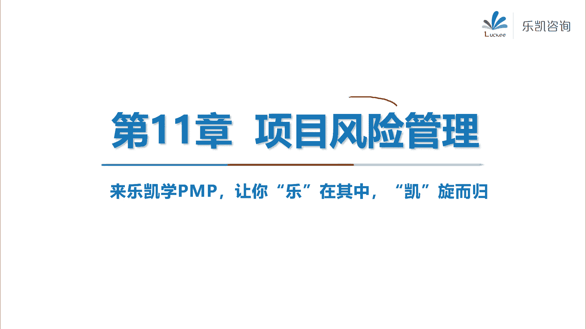
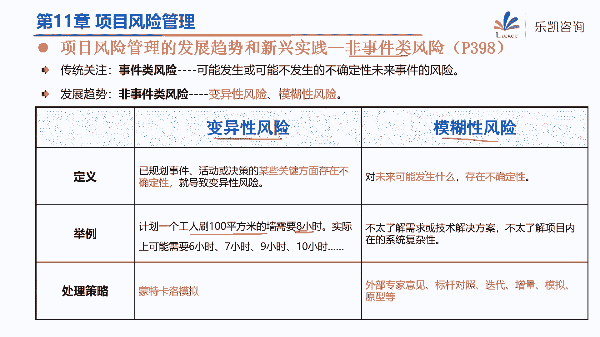
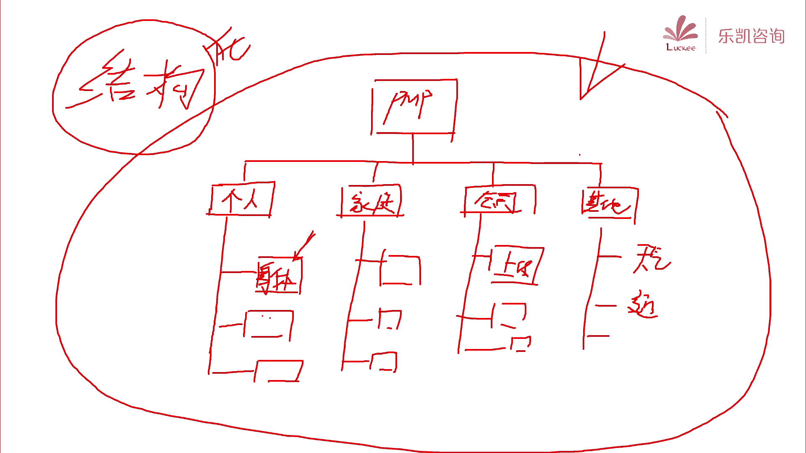
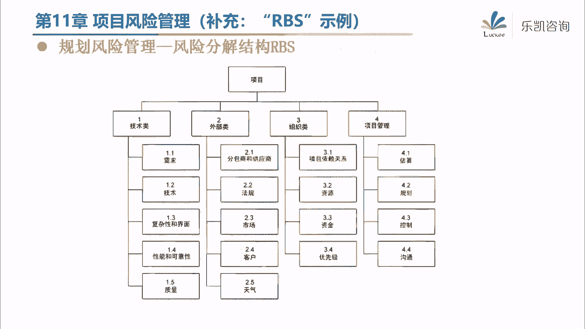
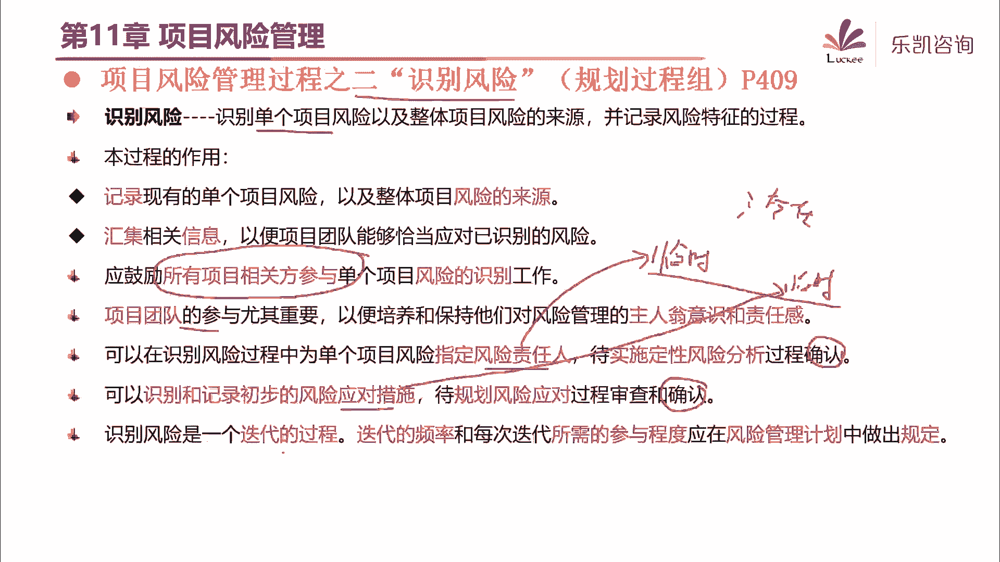

# 2024年PMP认证考试课程针对PMP新考纲最新免费零基础也能轻松听懂 - P16：PMP第11章：项目风险管理（上） - 乐凯咨询 - BV1Rj411G7gs

好，各位同学晚上好，今天晚上呢我们开始学习项目的风险管理好吧，那么项目的风险管理呢在我们考试当中，或者说在我们平时管项目的过程当中，都是一个非常重要的环节对吧，那么为什么说。

风险管理是一个非常重要的环节呢，我们有一句俗话说，有钱难买早知道，那么也就是说，如果有一些东西，我们能够及早地做好应对的计划，及早地把它考虑在内，那么我们的项目呢，可能会大大的提高成功的可能性对吧。

那么如果说有的东西你没有想到诶，他突然就这么发生了，搞得你措手不及，那么这会影响项目的成功的概率，所以风险管理是非常重要的一个环节，那么要学习风险管理，首先我们就要知道究竟什么东西被称之为风险。

那么我们pp里面对风险的定义是这样的，他说什么是项目风险呢，他说项目风险是一种不确定的事件或条件，那么这个不确定的事件或条件就意味着什么呢，我也不知道他是不是会发生，它有可能会发生，也有可能呢不会发生。

也就是说它的发生是怎么样呢，是有一定的概率的，它有不确定性对吧，那么为什么项目会有不确定性呢，好大家还记不记得我们在学习项目管理的时候，在一开始项目有很多的特点，大家知道项目的哪一个特点。

它带来的不确定性吗，我们说项目是临时的，项目是独特的，那么由于项目是独特的，所以每个项目都会有不确定性对吧，所以说项目的独特性，就代表了项目多多少少都有一些不确定性，那么有可能会发生一些东西对吧。

那么另外还要注意，一旦它发生，就会对一个或多个项目目标，造成积极或消极的影响，就是说我不知道这个东西它会不会发生对吧，那么如果它发生了，会给项目带来影响，那么像这种东西就叫做风险。

那么它的特点就是它是有概率的，那么一旦发生就会带来影响，那么高风险要一起来看的，有一个很相近的，我们有部分同学搞不清楚的叫问题，啊我们说项目中有任何的问题对吧，我们要把它记录在问题日志。

我们要想办法来解决问题，那么问题跟风险最大的区别在什么地方，有同学知道吗，唉我们在后面我们要考虑这个东西，它究竟是一个问题还是一个风险呢，好问题跟风险最大的区别是什么，那么有一个很明显的区别。

我们有同学已经说出来了对吧，问题它是什么，要注意，问题是现在客观存在的，客观存在的，或者说我们换一个说法，就是哎我们很多同学说的，他正在发生，它已经发生了对吧，而风险呢他现在还没发生，它是有概率发生的。

这是问题和风险最大的区别，当然还有同学比较细心，他发现了说问题啊，他都是不好的，但是风险呢要注意，那有积极的，有消极的，那么实际上风险它是一个中性词，那么有同学说风险还有好的吗，唉确实有好的啊。

我们平时说到风险都感觉不太好，但是实际上将来有概率发生的，会带来影响的，有可能是正面的影响，有可能是负面的影响对吧，那么如果带来正面的或者积极的影响呢，我们把它叫机会啊，我们有一个机会。

如果抓住这个机会会怎么怎么样对吧，如果是带来负面影响的，我们把它叫威胁，那么机会跟威胁统称为风险，所以大家要注意在学习的时候，风险它是一个中性词好吧，那么风险最重要的三个因素，就是我们刚刚说的啊。

风险是一种事件或条件，它是有概率发生的，一旦发生就会给项目带来影响，那么接下来我再问一个问题，这个概率和影响哪个更重要一些，我们既然要管理风险对吧，风险是有概率发生的，发生会带来影响。

那么肯定要从这两个维度入手去处理了，那么概率跟风险我们更应该关注哪一个呢，哪一个比较重要一些呢，好我们有同学说是概率，有同学说是影响，那么我们不妨用一个例子来想一想啊，比如说现在我的窗外正在下雨。

现在正在下雨对吧，那么明天上班的时候下雨的概率高不高，我觉得概率非常的高对吧，那么明天我们要不要去上班呢，我想大部分打工人都应该去上班，为什么呢，虽然明天下雨的概率特别高，但是呢影响不是那么大。

那下雨谁没见过啊对吧，你打伞吗不就好了吗，难道下雨就不上班了对吧，所以说概率高就一定很重要吗，不一定，那么有同学说是不是影响呢，好那么我问大家一个问题，你们说如果外星人打地球，这对我们的影响大不大。

这不废话吗，外星人打地球，大家都得嗝屁啊，还上什么班啊，上个毛啊，影响很大呀对吧，那么你现在会不会跟你的领导说，领导我感觉明天有可能外星人打地球，所以我明天不去上班了，你领导会怎么想你，你领导一定会想。

你是不是有点毛病对吧，哎为什么这么想呢，虽然外星人打地球的影响很大，但是它的概率怎么样，这概率太低了对吧，所以从这个角度来说，好像影响呢也不是那么重要，那么我们应该怎么去考虑。

其实概率更影响要综合去考虑对吧，所以我们将来在评估一个风险的时候，我们经常用到这样一个词，大家可能会经常遇到叫我们要考虑风险的敞口，就像一个口袋一样的对吧，这个口袋的口子敞开的有多大。

那么风险的这个敞口应该用什么来衡量，那么要注意我们要综合考虑概率和影响，所以我们一般是把概率去乘以影响，然后进行相互的比较，看看哪一个风险是高危的风险，好吧好，那么接下来还有他说。

我们在做项目管理的时候呢，要关注两个层面的风险，一个叫单个项目风险，一个叫整体项目风险，那么这两个概念呢稍微了解一下，很简单啊，那么单个项目风险很明显，就是某一个事件或条件对吧，那么一旦发生。

就会对项目带来积极或消极的影响，那么什么叫整体项目风险呢，整体项目风险就是包括所有的单个风险在内的，所有的不确定性，那么要注意这里面有一个细节，他说整个项目的风险要大于项目中，单个风险之和啊。

那么为什么有这样一个说法呢，唉说我们有风险，a风险，b风险c，那么整个项目的风险是不是就是简单的，a加b加c呢，他说不是要比a加b加c还要大一些，为什么，因为它包含了所有的不确定性。

甚至包括了风险跟风险之间的，相互的一些影响啊，比如说我在以前讲成本的时候，我举过一个例子对吧，我说有一个孕妇她感冒了，那么感冒有没有风险，这是有风险的对吧，那么要不要吃药呢，吃药有没有风险呢。

也有风险的，那么是不是感冒了，风险加吃药的风险就这么简单呢，其实还不一定，由于它是一个孕妇，你这个药呢还不能随便乱吃对吧，所以这个呢是情况更加的复杂，所以说整体的风险要大于单个风险之合啊。

就这么个意思好吧好，那么另外他还说，我们项目中的有三种性质的风险，那么这一块呢我们再回顾一下啊，我们在以前讲风险的时候，我们喜欢用这种方式，中间有一个破折号，对吧，然后左边分为已知或者未知。

右边分为已知或者未知，那么左边这一部分代表什么呢，代表风险，你能不能事先想得到对吧，哎比如说事先想得到的，明天可能会下雨，明天可能会堵车，那么这些我能想得到的都叫已知对吧，那么明天想不到的呢叫位置。

这是左边这一半所代表的意思，那么右边这一般代表什么呢，代表你能不能主动地去有一些应对的计划，或者应对的措施，如果你有，那么就是已知的，没有就是未知的，那么我们之前在学习的时候，我们接触过这两种。

一种叫已知，未知，也就是说风险呢我是想得到的，但是呢我不想主动管理，或者我也不需要主动管理，那就这样吧，那么我们就建立了应急储备对吧，那么对于未知未知风险，我们想不到的，我们要用管理储备对吧。

当然用的时候要走变更流程，那么当时在讲的时候，有同学就提出来，那么有没有我又想得到的，而且我又能主动去应对的风险呢，也有的，那么这是我们在风险这一章啊，主要的一些应对措施好吧。

那么这个我们在后面会详细的去学习。

那么风险在管理的时候，还要注意我们风险的态度啊，是不一样的，那么关于这一点呢，大家呢要稍微了解一下啊，我们每一个项目由于有不同的相关方，所以我们项目的风险的态度都是不一样的，那么这里面就涉及到三个概念。

一个叫风险偏好啊，风险偏好就是这个组织或者这个人，他愿不愿意承受风险，那么还有一个就是风险承受力，风险承受力呢就是它能承受多大的风险，那么还有一个叫风险临界值，就是多大的风险，他需要去管理。

那么这三个怎么去理解呢，我们用一个小例子去简单的理解一下，在座的各位同学有没有平时会打打麻将的，其实用打麻将这个例子呢，就很好了解这三个东西对吧，比如说就拿我来说，我呢偶尔可能会跟朋友去打一场麻将对吧。

那么打麻将它是有风险的，有输赢的对吧，那么这个风险我应该怎么办，我应该怎么用什么态度呢，那么我的态度是这样的，我呢有两个值，第一个值呢我第一层输赢可能在100块以下，那么这个100块是什么东西。

这个100块就是我的临界值，临界值就代表我要表认真去管理，比如说，如果我发现这场麻将的输赢是小于100块的，那就随便打，有什么好管的对吧，你输到底了，就输个100块钱，娱乐舆论嘛，那就不要主动管理。

那么如果说我发现这场麻将的大小，输赢会超过100块，那么我就要认真去打了，我就要主动去管理了对吧，所以这个东西就决定了我要不要认真去管理，这个叫临界值对吧，那么还有一个点是什么呢，好还有一个点叫承受力。

那么我的承受力是多少呢，我的承受力是1000，那么这个承受力是什么意思啊，如果我发觉这场麻将的输赢，甚至已经超过了1000，它超出了我能承受的范围，那么这场麻将我就坚决不打，太大了。

不是我这种人能打的对吧，哎如果说我觉得这场麻将的输赢呢在1000以内，那么我还是可以参与参与的，还是我能够承受的对吧，所以临界值决定了你要不要用心去管理，然后承受力决定了你究竟要不要做这件事情。

超出承受力的就不要做了对吧，那么正常的人来说，那么我们应该是风险的偏好，我的态度应该是在临界值跟承受力之间的，对吧好，那么你会发现，其实呢我们身边有这样的人，他明明承受不了这么大的输赢对吧。

但是他还是愿意去打这场麻将，也就是说他的偏好啊，他可能不在这两者之间，它在这个位置叫偏好，大于了承受力，好大家知道这种人是什么人吗，你明明不能承受1000块的输赢，但是你却愿意去打这么大的一个麻将。

这种人是什么人，好我们有很多同学说了，这种人叫赌徒对吧赌徒，那么赌徒实际上是一种什么人呢，他是一种风险冒进者，他知道有这个风险，但是他不怕他接受了对吧，那么在这种人脑子里面有一句话是怎么说的。

哎赌一赌搏一搏，单车有可能变摩托对吧，他希望单车变摩托，所以他冒险去做这件事儿了对吧，那么我们发现还有一种人，他是这样的，他虽然100块是一个很小的输赢，但是他说只要有输钱的可能我就不打好，它的偏好呢。

在这个位置，也就是说它的偏好，他的主观的意愿偏好甚至小于了临界值，好这种人是什么人，好有同学说这种人就是非常保守的对吧，正式为同学说，那么很正确啊，其实这种人就是叫风险的规避者，或者非常的叫保守者对吧。

就是说你不管怎么说，你只要有输赢，我就不想来，那么这种人他脑子里面也有一句话，他脑子里面在想什么，不要赌不要博，为什么呢，因为有可能他妈奥迪变奥拓啊是吧，哎所以这种人叫风险的保守者，风险的厌恶者。

风险的规避者对吧，他非常的抗拒风险，那么这是一个麻将的例子，来说清楚这三者之间的关系，那么对于我们做项目而言，那么我们正确的态度是什么，那么实际上呢我们觉得正确的态度是，我们要站在风险中立的态度。

就是说我们既不要冒险，也不要呢避险对吧，我们应该在这个范围内里面，我们要大于临界值，但是呢也不能超出承受力，哎我们要有一个风险中立的态度好吧，那么我们在做项目的时候，为什么要关注这些东西。

因为项目的认识的相关方是不同的对吧，所以每个不同的相关方，它的风险态度也是不一样的，那么他们的风险态度就决定了我们将来管风险，应该用什么样的一种方式去管理好吧，那么这三个呢稍微了解一下啊。

用这个例子去理解比较简单，那么他说另外呢，我们之前讲风险是一种事件或条件，一旦发生，怎么怎么样对吧，那么现在呢有一个新的趋势，就是它还有一个叫非事件类风险，就是说没有什么事件发生啊。

他跟我们刚刚出的风险不一样，说由于今天下雨对吧，所以明天可能有堵车的风险，它是由某个事件带来的影响，但是呢现在有一些风险是没有事情发生，他自己本身就有不确定性，比如说那有一种叫变异性风险。

那么变异性风险就是指没有人影响它，它本身就有一些不确定性，比如说举个例子，我们请一个工人来刷100平方的墙，那么刷100平方的强要多长时间呢，要八个小时，那么即便没有任何事情，没有任何人去影响他。

他一定正好是八小时刷完吗，这个也不一定的对吧，他可能会七个小时，可能会九个小时，它本身就存在一种不确定性对吧，那么这种叫变异性风险，那么我们可以借助于蒙特卡罗，不断的去模拟来应对这种风险。

那么还有一种风险叫模糊性风险啊，也没有什么事件来影响，是因为我们对未来呢确实不太了解对吧，比如说有一些技术方案不太了解，比如说客户的一些需求不太了解，所以这里面也存在一些风险。

那么这种风险我们可以通过比如说原型法呀啊，比如说专家判断啊，来帮助我们去解决，那么这两类非事件类风险呢，大家稍微有个概念就可以了，那么我们学习的重点，还是怎么去管理事件类风险好吧。

那么另外他还说我们在做项目的时候，还有两个要关注的，一个就是要提高项目的韧性好，什么叫提高项目的韧性呢，这个韧性说白了，就是我们要提高我们的项目抗风险的能力，对吧就是要耐造一些。

不能说有一些风吹草动就不行了，那么怎样去提高我们的抗风险的能力呢，好他说了，比如说我们要留出一定的储备啊，我们要有灵活的变更机制，因为他说确实有的风险是我们一开始想不到的。

只有发生了之后才会被发现的对吧，所以我们要留出储备，要有灵活的变更机制，要关注早期的风险信号等等，那么通过这些方法来提高我们项目的，风险的抗性对吧好，另外他说我们还要做好整合式风险管理。

那么什么叫整合式风险管理呢，他说较高层面识别的风险，比如说我们公司的管理层对吧，高级管理层识别的风险可能要交给团队去管理，这是从上往下对吧，去下放唉，比如说我们以前在公司的时候，我们当时我记得啊。

我以前的公司有一个专门的部门，叫安全部门对吧，那么他我们经常收到他的邮件，说哎最近公司发现了有某个病毒，非常的猖獗对吧，一旦中毒之后会导致资料的丢失对吧，那么希望各个项目团队要下载什么补丁啊。

然后打好这个补丁，做好数据的备份，那么这就是在公司较高层面上，识别到了一些风险，那么具体的处理交给谁去处理呢，要求各个团队要求事先去处理好对吧，那么也有较低层面识别的风险。

那么在团队这个层面是解决不了的，需要上报给高级管理层去处理的，比如说我们以前就遇到过一种情况，团队在做项目的时候，发现供应商跟项目经理说，如果你们公司能够跟我们公司，签订战略合作协议。

那么你们的采购的东西呢会有一定的折扣，那么这个是不是风险呢，当然是这个属于积极的风险，叫机会对吧，那么作为一个项目经理来说，他是不可能去跟供应商的公司签这个协议的。

所以项目经理会把这个问题报给公司的管理层，唉，是不是从公司层面来说，跟供应商的公司签订这样一个协议，那么对我们项目来说，我们采购的成本啊会低一些对吧，所以说我们有的风险需要交给团队去处理。

有的风险需要上报给管理层去处理，那么这种叫整合式风险管理，整合式风险管理好吧，那么前面这些内容呢，大家呢一定要有一个比较好的了解，特别是关于风险的定义，风险的概率和影响。

它代表的含义一定要清楚好吧，那么接下来我们看一下p p里面它是怎么讲。

我们如何来管理风险的，他说我们要管风险啊，首先要做一个过程啊，仍然是叫规划叉叉管理，那么风险就叫规划风险管理，那么按照以往的惯例，我想大家应该有这样一个觉悟对吧，什么叫规划，风险管理。

实际上就是要做一份指南行的计划，风险管理计划，告诉我们将来如何去管理风险对吧，那么其实风险这一章呢，我建议大家不要去死记硬背。

风险这一章呢其实很好懂。

那么为什么这么说呢，我举一个例子啊，如果问你，你打算将来如何去管风险，要写这样一个指南性的计划，那么大家从常识来说，能不能想一想，哎我们管风险大致要分为哪几个步骤，这个能想得到吗。

虽然我们没有学过p m p啊，之前没有学过风险管理，对吧好，那么比如说现在有一个项目交给你了，那么你是项目经理了，那么项目总有不确定性的，总有风险的，那么你想一想，我们应该如何去管风险呢。

你觉得应该包括哪些步骤或者哪些程序，好有同学说了，我觉得啊，首先第一个我们要尽量的去识别出来，对吧，那么我这个项目可能什么方面有风险，是什么风险对吧，唉就像我们有同学说的，要识别出来。

要找到可能存在哪些风险，那么第一步把风险全部都识别出来，识别完了之后，接下来怎么办，我们周星同学说，我们识别出来的风险啊，不止一个有多个，但是我们的精力或者我们的资源是有限的。

我们不可能对每一个风险都详细的去处理，当遇到大量的风险的时候，我们就不得不考虑一件事，什么事儿呢叫优先级，这个也很好理解吧对吧，哎有的风险是高危风险，有的风险呢是低危风险对吧，你说天上下雨。

这个是dv的，被雨淋到嘛，最多掉几根头发了，反正我头发本来就不多，掉两个就掉两个对吧，天上下雨就是低微的，天上下砖头靠，这就是高危的，要死人的对吧，所以风险的优先级它是不一样的。

那么就决定了我们的重视的程度也是不一样的，对吧，所以在识别之后，识别出来的风险，我们要排优先级对吧，好，那么排好了优先级之后，接下来我们要怎么办呢，那么我们有同学说了，那么接下来就该根据优先级从高到低。

我们要去干什么，我们要去规划一下，我们打算怎么去应对它，对吧，唉我们肯定要制定一些措施，我怎么样来处理这个风险啊，比如说把它的严重程度降低一些呀，或者说想办法能不能规避这个风险啊对吧。

要有一些应对的措施，然后定了这些措施之后，那么我们再去应对它，让这个风险能够得到管理不就好了吗，那么实际上就是这么几个步骤对吧，其实p m p你会发现后面讲的也就这些，这跟我们其实常识没有什么区别对吧。

所以接下来我们要做一份风险管理计划，我们就要说清楚，我们将来会如何去管理这些风险，如何去管理这些风险，对吧好，那么接下来有一些准备性的工作，我们是要做好的，那么哪些准备性的工作在规划的时候要做好呢。

我举一个例子啊，比如说我们5月份，pmp考试它是一个项目，那么大家想一想这个项目有什么风险，我们尝试来识别一下，能够想得到有什么风险吗，唉5月份pp考试，你觉得有什么风险。

那么我们很多同学要识别出风险吗，最直接的就是什么呢，头脑风暴了对吧啊，比如说有同学说会不会延期啊对吧，那么现在呢一般来说不太会延期了对吧，唉有的同学说会不会堵车呀对吧，唉会不会这个身体不舒服生病啊对吧。

会不会迟到啊，这些都是风险对吧，那么你会发现我们在识别的时候会非常的乱，非常的乱，所以说为了帮助我们将来去识别风险啊，那么我们在前期要做好一些准备工作，我们要用这种方式，我们要有结构。

那么为什么说要有结构呢，我们虽然要头脑风暴啊，但是不要去乱，我们可以先定义一个结构出来，比如说那5月份的p m p考试会有哪些风险啊，我们从这几个角度来说，比如说从你个人角度来说。

你自身存在什么风险对吧，然后接下来从你的家庭角度来说，你家里会不会有什么风险，导致你不能够顺利的考试，然后从公司的角度来说，公司工作上有没有什么风险，会影响你的考试对吧，然后接下来还有其他。

比如说环境啊对吧等等，好我们先从这几个地方对吧来考虑，然后如果你觉得还不够细，我们还可以再拆分，再细分为这几个部分，比如说个人有哪些风险呢，好再分为，比如说生病发烧啊，拉肚子啊，这个是什么身体方面的。

对吧，唉包括情绪方面的，呃比如说态度方面的对吧，那么家庭也可以细分，比如说父母类的风险啊，比如说配偶类的风险，子女类的风险对吧，那么公司也可以细分，比如说这个，上级领导可能会带来的风险，同事供应商。

那么其他的也可以再细分，比如说天气类的风险对吧，交通类的风险啊，你这可以把它再分为小的那边，那么接下来我们后面在识别的时候啊，就按照这样一种结构来做，一种结构化的头脑风暴，大家能够明白。

用这种结构化的方式再去头脑风暴，有什么好处吗，你会觉得用这种方式一个一个的去头脑风暴啊，比如说我们来识别一下风险啊，首先我们识别一下身体方面有什么风险啊，可能感冒，可能发烧，可能拉肚子对吧啊。

然后一个一个来这样去识别啊，有的同学说会比较全面，会比较怎么样，哎会比较张庆东说不乱，也就是说有条理会比较清晰一些，是这个道理吧，所以说我们在做这份指南的时候，我们可以先把这种准备好。

那么这个东西叫什么呢，这种东西我们把它称之为风险分解结构。

叫r b s好。

我给大家看一个rbs的例子，在讲义上有的在这在我们写这份指南的时候，我们往往会列出一个ibs，那么就是risk风险，risk breakdown structure叫风险分解结构对吧，那么风险。

风险结构，实际上就是把风险按照大类小类来进行划分，它里面包括的内容是什么，它里面包括的内容是一个风险的类别对吧，那么上上面比较高的是叫大类别，底层的叫小类别对吧，那么把这样一个二bs做好之后。

有助于我们将来有条理的去识别风险对吧，唉说到rbs，大家有没有觉得熟悉，我们在第九章好像也学过rb，但是那个不叫风险分离结构，那个r叫resource，叫资源，还记得我们第九章带过了一个东西对吧。

不是很重要的，叫资源分解结构对吧，当然还有类似的，我们以前学的w b s对吧，那么资源分解结构那个叫resource对吧，那么这边也叫啊叫risk，好吧好，那么我们可以先把这个准备工作先把它做好。

那么除此之外呢，还有一些准备工作要做的，比如说我们刚刚说到，将来我们还要对风险牌优先级，对吧，要评级，那么既然要评级，我们是不是事先要把各种等级把它给定义好啊，而我们说风险是由概率。

影响来综合考量的对吧，那么我们是不是首先把概率分为几档，要定义好啊，比如说概率我定义为这么几档，这个风险发生的概率很高，然后接下来下一档叫高，中低很低啊，我将来的风险在给他评估概率的时候。

分为这么无档去评估啊，很高高中低很低，影响我也化为五档，很大，中小很小，那么我事先把概率和影响这几档都定义出来，那么将来如果来了一个风险a，我就判断a这个风险概率怎么样，影响怎么样。

然后再综合考虑概率和影响，也就是风险的敞口，那么大家觉得这样定义行不行，唉我们先把概率和影响分别定义成这么无档，可以吗，当然也可以，但是你会发现呢这样去定义呢，好像有一点点问题，问题在什么地方呢。

比如说将来在评估某一个风险，比如说风险a的时候啊，它的概率很高，影响很大，那么你说这个风险是什么风险呢，概率又高，影响又大，它当然是一个高危风险对吧，但是如果又来了一个风险b，它是这样的概率很高。

影响呢很小，那么你说很高乘以很小，这个是个什么玩意儿啊，对吧，你这个就搞不太清楚，搞不太清楚，不利于风险之间的比较，对吧，你比如说风险b是概率很高，影响很小，风险c呢是概率很低而影响大。

你这个怎么去比较呢，所以一般来说我们不用这种文字去定义，那么我们一般怎么定义呢，好我们一般呢可以用数字来定义，比如说概率啊，我们分为这么几档，最低的一档是一，然后三，913579，我用数字来定义对吧。

而且我要说清楚什么情况下，这个风险的概率可以打九分，什么情况下是打七分，要描述清楚对吧，然后影响的定义呢，我们也把它定义清楚，用数字1268，当然我们也说清楚，什么情况下影响可以认为是八。

什么情况下影响可以认为是六，那么如果出现了一个风险，我们就从这个定义来判断它的概率，可以打多少分，影响可以打多少分啊，比如说概率是七，影响是四，那么最终这个风险就是28分对吧，再来一个风险啊，概率是五。

影响是六，最终得分是30分，那么b就比a要重要一些对吧，所以说我们在一开始的时候，我们要把概率和影响要定义清楚。

要定义清楚，所以那我们见，我们来一起来看一下这两个东西啊，首先第一个东西叫风险，概率的定义或者影响的定义，那么我们就拿其中一个举例子，比如说这边就是关于风险影响的定义，它设置了这么几档，一个叫很低0。

05，d说的是0。1中等0。2高，0。4很高0。8，然后下面都描述清楚了，什么情况下算00：05，什么情况下算0。1分对吧，同样的什么情况下算0。8分都定义的很清楚，那么这个是影响的定义。

那么概率的定义我们是不是也可以定义呢，啊比如说我们还有一张表，用0。1，0。3，0。5，0。7，对概率再做一个定义不就好了吗，那么我们用数字来把概率和影响的这几档，定义出来对吧。

那么一旦定义出来之后，我们就可以得到第二个东西叫概率和影响举证，这是我们pmbok书上的这张图，但是这张图呢它出现的比较突兀，很多同学不理解说这张图哪来的好，我带大家来解读一下这张图啊。

首先大家明不明白，为什么这张图是左右两边对称的，这个应该能够看得出来吧，我们说风险有正面的，有负面的，或者说有机会有威胁，所以机会威胁他一定是相同的划分对吧，它肯定是对称的，有左边一部分。

右边一部分对吧，那么我们再看横坐标说的是什么，那，这个是什么，这个实际上就是我们影响定义好的那几档对吧，0。050。1，0。2，0。40。8，这是我们关于影响的定义对吧，那么纵坐标是什么呢。

纵坐标也有一个类似的关于概率的定义，概率也分为这么几档，那么一旦这两个定义好了之后，我们就可以把概率乘以影响算出来，比如说0。72是哪来的呢，0。9x0。8不就是0。72吗。

那么把这个格子里面的数字一个一个都算出来，那么有同学说0。1x0。05，应该等于0。005啊，这边为什么是0。01呢，好四舍五入了，所以是0。01对吧，那么全部都算出来之后，就形成了这样一张表格。

那么形成这一张表格之后，接下来怎么办呢，好我们可以定义一下最终风险了，长苦超过多少的是高危风险，比如说在这张图里面，这家公司是这么定义的，最终风险敞口超过0。24的这一部分，他们就认为是高危风险对吧。

那么风险敞口低于0。08的就是低危风险，那么这是这家公司事先做好的定义，当然了，有的同学说，那么我可不可以不用这种数字，我觉得用小数计算很麻烦，我用整数来计算概率，定义成123，影响也定义成123。

可不可以呢，大家觉得可不可以唉，我在对概率和影响定义级别，定义档次的时候，我不按照税率来定义，我自己来定义，可不可以。

可以吗，当然可以对吧好，那么接下来我们用一个例子来练习一下啊，我们用一个简单的例子来练习一下，现在呢我要对项目进行风险管理对吧，那么在做风险管理的时候呢，是这样的，我的概率，我事先定义好，概率分为三档。

就是123，而且我描述的很清楚，什么叫三呢，三就是指极有可能发生，二就是指它有一定的概率会发生，一就是几乎不太可能发生，这是对于概率的定义就得三难对吧，好，关于影响的定义呢，我是这么定义的。

影响也分为123，那么什么叫三呢，影响三的意思就是对公司会造成重大影响，会导致客户的起诉对吧，好二呢就是对公司造成一定的影响，但是呢客户满意度呢还凑合，那么一呢就是对公司来说几乎没有影响对吧。

好概率和影响我都定义好了，这几档接下来能不能画出概率和影响矩阵，概率有了影响，有了矩阵能画吗，很好画的，首先左右两边机会威胁是对称的对吧，那么接下来影响呢是那321，同样的机会威胁都是一样的。

321概率呢是也是这三的123对吧，然后接下来我们把两者相乘把数字算出来啊，三三得九，二三得六，一三得三对吧，然后这边是二三得六，二二得四，一二得二，那么这边是一三得三，一二得二一得一。

把这些全部都算出来对吧，那么这边对称的也是一样的，63642321对吧，那么最终这样一个概率和影响矩阵，我们不就做出来了吗，对吧，每一个格子都是概率去乘以影响，得到的一个结果好。

那么接下来我们再做一个定义，最终风险敞口超过三的这一部分，我们认为是高危风险，比三大的啊，比三大的是高危风险好，那么也就是这一块，那么这一块的背景色我们就可以把它涂灰，将来这一块就是高危风险对吧。

实际上这个比较简单，你事先把它定义好，你根据你的习惯有可以，你可以用小数，也可以用整数去定义就行了，那么最终形成这样一个概率和影响矩阵对吧，那么这就是我们在一开始要做的一些准备工作。

最终输出一个风险管理计划。

那么接下来我们看一下p p里面是怎么说的啊，他说规划风险管理，实际上就是指我们要制定一个指南性的东西，要定义我们将来如何去管理风险，对吧，那么这个过程的输入呢。

要关注一个相关方的风险偏好，那么最终我们要形成一份风险管理计划，风险管理计划里面会说我们将来如何去管风险，它包括风险的管理的战略职责，对吧好，接下来几个比较重要的，另外啊包括几个这几个重要的啊。

一个是为了便于后续识别风险，所以我们可以先做一个rbs。

就这个东西先做好，这个会有助于我们将来去识别风险对吧，那么我们刚刚说的，相关方对待风险是一种什么偏好，也要把它写到这份计划里面，然后风险概率和影响怎么去定义，对吧，比如说概率分为几档，影响分为几档。

要定义好，那么注意看p m p里面也是这么说的，他说这个定义啊，项目可以自行定义啊，你可以自己去定义，或者呢，如果你们公司已经有这样一个定义好的东西，你就把你们公司定义好的东西拿过来用，都可以对吧。

那么这些定义好了之后，再形成一个概率和影响矩阵，那么至于最终风险的敞口大于多少的是高，小于多少的是低风险。

那么一般通常由你们的公司来决定对吧。

唉比如说这家公司，他的决定就是，将来最终风险敞口超过0。24的。

都叫高危风险对吧，那么我们把这些东西做好之后，那么我们的风险的规划工作，基本上就完成了对吧，所以风险管理计划里面，它就包括了这四个重要的，r b s相关方的风险偏好，概率和影响，定义和概率和影响举证。

先把这些东西先准备好好，但是我要问一句，风险管理计划里面有没有记录具体的风险，大家考虑一下这个问题啊，我们刚刚在说将来如何去管风险，我们要事先做好一些准备，要写一些指南性的东西。

那么它里面有没有具体的风险呢，哎比如说明天可能会下雨啊，明天可能会堵车，明天可能会怎么怎么样。

要注意啊，没有，即便是r bs要注意，r bs里面它最多也只是风险了什么，最多也只是风险的小的类别。

他没有具体的风险的对吧，所以一定要注意，风险管理计划是一份指南性的文件，它里面不记录具体的风险好吧，那么刚刚有同学问到他说，那么角色和职责是代表具体的人吗，也不是角色和职责是值你这样一个角色。

在风险管理方面你承担什么职责，比如说我举个例子啊，发起人在风险管理的过程当中要承担什么责任，项目经理要承担什么责任，测试人员要承担什么责任，你看我没有说张三还是李四，我只是说什么一个角色。

这个角色就类似于什么呢，一个职位对吧，哎你作为发起人，你要注意好什么，你作为项目经理，你要注意什么啊，你作为公司的测试人员，你作为qq人员，我们只说一个角色啊，没有具体的人，好吧好，那么到这里为止。

我们的风险的规划工作就做完了，那么接下来我们就可以按照我们刚刚说的步骤。

从识别开始一个一个来处理。

所以接下来我们看一下第二个过程，接下来我们就要开始先识别风险了，那么什么叫识别风险呢，识别风险就是我们要识别单个项目风险，以及整体项目风险的来源，记录项目风险的特征，那么这里面呢主要是单个风险对吧。

那么这个过程的作用就是记录单个项目风险，以及整体风险的来源，那么谁应该参与识别风险呢，好大家注意，我们要鼓励所有相关方一起来识别风险，大家都要参与，而且团队的参与尤为重要。

要培养他们的主人翁意识和责任感，对吧，大家都要来参与，那么另外他说在识别风险的时候呢，我们如果识别到一个风险，我们可以为这个风险指定风险责任人，那么等后面的某一个过程再进行确认。

我们也可以对风险做一个初步的应对啊，规划一个初步的应对，那么最终是不是用这种方案来应对呢，我们也要后续来确认，所以在这边啊，我们可以把这个责任人看成是什么呢，临时工临时暂时由你来负责。

这个应对呢也是临时的，对吧，那么p p里面用了一个词叫潜在的，潜在的责任人和潜在的应对啊，这个呢稍微了解一下，那么另外他说识别风险啊，所以它是一个迭代的过程，什么意思呢，就是我们识别风险。

这个工作不是说一次性就做完了，我们可能每隔多久就要识别一致，因为项目在不断的变化对吧，我们外部的环境也在不断的变化，有可能有一些新的风险，所以我们要定期的去识别一下，好吧好。

那么识别风险这个过程它比较重要的是，我们要用什么工具来识别输入。

难道不重要啊，工具比较重要，那么接下来我们来看一下有哪些常见的工具，首先第一个就是我们刚刚在讲二bs的时候，用到的叫头脑风暴对吧，畅所欲言，比如说诶明天我们去上班是一个项目，明天可能会遇到什么风险呢。

啊比如可能会迟到对吧，哎比如说明天在路上可能被狗咬，这些都是风险，只要你想得到的，你就把它说出来，当然他说我们可以自由地头脑风暴，也可以用一种比较有条理的，就是我们刚刚说的叫结构化的头脑风暴。

那么借助于什么东西做结构化的头脑风暴呢，就借助于我们刚刚已经在规划的时候做好的，叫风险，风险结构来作为一个框架，帮助我们来头脑风暴对吧，那么头脑风暴这个工具我们接触的太多了，很简单好。

那么接下来还有我们还可以跟别人做反弹，interview，而在信任和保密的环境下跟别人去聊一聊，来识别一些风险啊，这个更简单，没什么好说的，对吧好，然后他说还可以借助于核对单来识别风险好，关于这个工具。

我们稍微的展开讲一讲啊，我们知道核对单我们接触过很多次，叫checklist，对吧啊，有一个清单，然后我们一个一个来确认来打勾，那么为什么识别风险有这样一个核对单呢，他是这么说的。

他说我们可以把类似项目啊，我们可能做过类似的项目，或者其他的一些信息来源，那么这些里面有什么呢，有一些比如说类似项目遇到过的具体的风险，我们把它全部都拿过来啊，比如说我们现在在做b项目。

我们曾经做过一个很类似的a项目，那么这个项目遇到过什么风险呢，我们把它全部都拿过来，放到这个check list里面，对吧，然后我们一个一个去看诶，这个风险有没有可能在我的项目中出现，这个风险。

我的项目中是不是存在这个风险，是不是存在对吧，那么用这种方式借助于历史信息，我们也可以去识别到一些风险对吧，但是有两个细节大家是要注意的，第一个，我们识别风险能不能完全依赖这一份checklist。

啊实际上就是我们做项目的风险管理，能不能完全依赖类似项目出现过的风险呢，很明显不能，为什么不能，因为很简单，项目是怎么样，项目是独特的对吧，每个项目都有它的独特性啊，我们有同学说包括但不限于对吧。

所以在pvp里面他也说的很清楚，不要用核对单来取代所需的风险识别工作，为什么呢，他说因为我们要注意考察，未在核对当中列出的风险对吧，那么这是第一个细节要注意的好，第二个细节要注意的。

核对单里面的东西是什么东西啊，它是类似项目中出现过的风险，这里面列出来的是一个具体的风险对吧，哎只不过我们去看一看，会不会在这个项目中出现而已好吧，那么这个工具比较简单，实际上就是去扫一眼历史信息嘛。

少一点类似项目中曾经出现过的风险吗，那么是不是要把它纳入到。

我们这个项目的风险当中对吧，那么这些工具都比较简单啊，好然后接下来还有根本原因分析，看到这个工具，有的同学就很晕了，这个玩意儿不是用来解决问题的吗，去寻找问题的根本原因的吗。

p m p里面说它也可以用来识别风险，他说怎么去识别呢，很简单，这样你把问题啊，我们就用鱼骨图来说，你把问题放在鱼头的位置，然后你考虑一下为什么会导致这个问题，最终找到的最根本的东西就叫什么呢。

就叫有可能带来这个问题的威胁对吧，或者我们可以把收益收益啊，把收益放在鱼头的位置，然后你不断的问为什么为什么为什么唉，为什么我们会取得这样一个收益呢，那么最终找到了最根本的东西。

就是有可能带来这个收益的机会，所以我们也可以记住这样一种方法，来识别威胁和机会好吧，那么第二个呢叫假设条件和制约因素分析，这个呢考试考的不多，但是呢要好好去理解，说到假设条件和制约因素，大家有没有印象。

我们在一开始讲制定项目章程的时候，就输出了一份文件，这份文件是用来记录，所有的假设条件和资源因素的，还记得是什么吗，我们有一个文件叫假设日志，有印象吗，但是我们说所有的假设条件和制约因素。

全部都要记录到这个假设日志里面对吧，那么为什么要把它全部都记录到，假设日志里面呢，因为我们要分析所有的假设条件和注意因素，假设条件就是指前提条件对吧，那么如果说你觉得假设条件不成立，那么就会识别出什么。

识别出威胁，比如说我举一个例子啊，现在我们已经学到了第11章了对吧，当然考试呢是5月份去考啊，但是呢大家在当初报名p m p的时候，你们一定关心过一个问题，说我来学p m p最终考试通过率高不高对吧。

那么我们的课程顾问呢会这么跟你说啊，通过率是很高的，只要你跟着进度，每天不要花太多时间，每天花个一小时对吧，问题都不大的好，所以说pmp呢通过其实并不难，它是有一个假设条件的，什么假设条件。

他的假设条件就是只要你跟着进度，只要你每天稍微花个一个小时去看一看，这个就没什么问题对吧好，那么现在回过头来，我们看一看当初的这个假设条件，现在还成立吗，其实我想对于部分同学来说。

这个假设条件已经不成立了对吧，因为有些同学他就没有跟着这个节奏来，每天就没有去稍微花点时间，那么假设条件不成立，就意味着什么，就意味着有风险，而且这个风险是比较负面的，是有威胁的，对吧，有威胁的。

那么这个就是代表了为什么要分析假设条件，因为我们如果一旦发现假设条件不成立，那么威胁就出现了，是吧好，那么什么叫制约因素呢，至于因素就是限制我们的因素对吧，比如说举一个例子啊。

原来我们在座的大部分同学应该是什么时候考，试，应该是3月份考试，所以我们复习的时间有限对吧，这个对我们来说是一种制约因素对吧，就这么点时间复习呀，没有很充足的时间呢对吧，诶结果呢通知出来了。

说3月份的考试呢是留给之前遗留的学员的，对吧，唉我们这一批的呢把它调整到5月份，那么调整到5月份，这个制约因素就怎么样就放松了，原来3月份考试了，就这么点时间，现在挪到5月份去考试，对于有一些同学来说。

这是一个什么注意啊，这是一个他娘的机会呀，机会来了，兄弟们以前没有好好听课的，又多了一些时间啊对吧，所以你有没有发现我们现在上课的人少了，我们现在只有他娘的550个人听课了对吧。

以往上课都是1000多个人听课，为什么现在上课的人少了呢，因为很多同学觉得机会来了，不着急呀对吧，那现在时间还早啊，等到我们下一期3月18号开课的时候，我再跟着学一遍，不就好了吗，不就稳了吗是吧。

所以呢当制约因素放松了，就会给我们带来机会对吧，所以我们可以通过假设条件和资源因素分析，来识别出威胁和机会好吧，那么这个呢考的不多，但是大家要有一个很好的了解，好吧好，接下来第三个工具文件分析啊。

数据分析里面的第三个工具文件分析，这个呢很简单，对文件做结构化的审查啊，这个有啥意思呢，就是去查一查文件，识别一下风险对吧好，接下来还有一个叫斯沃特分析，大家注意识别风险的工具里面，最重要的。

最容易考到的就是所有的分析，大家知道为什么考试喜欢考斯沃特分析吗，因为它叫sweat，这个词看起来逼格很高对吧，所以考的也比较多，那么什么叫smart分析，为什么它能够识别风险，我详细说一下。

我们有很多同学可能在其他的管理课程上，也听说过所有的分析对吧，那么说的就包括这四个字母啊，rength，weakness，opportunity和thread，优势劣势机会威胁。

那么怎么去做sword分析呢，好我用一个例子来说一下。

比如说举个例子啊，我们有很多同学学骗p是为了转行啊，因为他现在是做技术的，他想转转什么呢，转管理，那么大家要知道啊，技术转管理这个事情他有没有风险呢，它当然也是有风险的对吧。

那么我们要把这些风险都识别出来好，怎么去识别呢，我们可以这么去识别，首先我们先想一想我们自己有什么优势，rength，啊我们现在的优势有什么对吧，然后再想一想，哎我们有什么劣势，wkness。

那么通过优势来识别机会，通过劣势呢来识别威胁，对吧好，那么我们在座的如果有做技术的同学，想做管理的，正好我们借这个机会，我们来梳理一下，技术想转管理，首先我们分析一下啊，优势是什么。

啊我们要说做技术的人普遍的优势啊，汪邦村同学说他长得帅，这个呢是你个人的优势对吧好，一般来说对于我们做技术的人来说，技术的人有什么优势呢，好战友说了，第一个很直白的懂技术吗对吧，俗称叫什么呢。

在我们招聘的时候，往往有这么一句话叫有技术背景，对吧，好还有呢啊，有人说逻辑思维能力很强啊，做事情很有逻辑，好还有没有，啊有同学说不会被团队骗啊，说的东西会让人信服，有一定的专家权利。

不容易被开发忽悠对吧啊，有人说做技术的人一般比较老实，一般的他有原则，有责任心是吧，哎这都是我们做技术人员的优势好，那么接下来我们就考虑一下，通过优势我们能够带来什么机会，比如说。

有技术背景会带来什么机会，由于我懂技术，所以可能我跟团队呀，跟技术人员沟通的时候会比较顺畅对吧，哎我有逻辑会带来什么机会呢，唉可能我对项目管理中一些工作的安排，会比较有条理对吧，哎包括我有责任心等等。

会带来什么机会，可能我会怎么怎么样，唉可能我会更加容易获得甲方的信任对吧，那么这些都是可能出现的机会了，那么这个就是opportunity机会对吧，好，那么再想一想做技术的人有什么劣势呢。

你们觉得做技术的人要转管理，他的劣势是什么，有什么劣势，我觉得大部分的技术人员，首先一个劣势就是内向，对吧，因为这个好像跟别人打交道比较少，比较内向对吧，而且还有人说说的，有的同学说的性格比较孤僻啊。

或者比较容易钻牛角尖啊对吧，还有有同学说的非常正确，技术转管理它难难在什么地方，难在他没有经验，没管过项目，对吧，唉包括这个可能不善于交际好，那么这些历史会带来什么威胁呢，好内向会带来什么威胁。

有可能在做项目的过程中，跟客户的沟通上会存在一定的障碍对吧，有可能说话不太注意的时候，甚至会得罪客户对吧，由于没有管理经验会导致什么呢，唉有可能在做项目管理的时候，可能会有一些缺失，导致有一些混乱对吧。

好不善于交际会带来什么威胁呢，啊有可能跟客户平时的关系不是太近，不是太融洽对吧，那么这些都是由劣势带来了什么带来的威胁three，所以说在我们p m p里面，为什么把所有的分析这个工具。

作为识别风险的工具呢，实际上它是这么来的，通过优势来识别出机会，通过劣势来识别出威胁，而机会跟威胁在我们p m p里面就统称，为什么呢，统称为风险，所以它是一个识别风险的工具，明白吗。

当然实际上所有的分析，它的内容远远大于简单的识别风险对吧，它还包括说我们根据所有的分析，可以定一些策略，比如说什么s o策略，对吧啊，发挥自己的优势，抓住机会，我们应该用什么策略。

接下来我们根据这个原则，我们要定什么策略对吧，哎比如说其他的一些什么啊，要避免自己的劣势了啊，要尽量的去规避一些威胁了，我们用什么策略。

那么如果大家有兴趣，可以去详细的去了解这个工具，那么在我们pp里面。

只是很简单的，把它作为一种风险识别的工具就可以了对吧，通过优势识别机会，通过劣势来识别威胁，那么考试的时候也爱考这个工具，只要你看到sweat，你就知道他在干什么。

他在识别风险就可以了，好吧好，那么另外识别风险，还可以用人际关系与团队技能啊来识别，还可以借助于提示清单啊，什么叫提示清单，就是提示我们，提示我们，引导我们来识别风险的清单。

比如说我们刚刚说的最典型的风险分解结构，r bs的底层，二bs的底层是什么呢，就是风险具体的小类别对吧，用它作为提示清单来帮助我们识别风险，诶，说到这里，我忽然想问一个问题啊。

这个提示清单跟我们之前讲的核对单，各位同学觉得有什么区别吗。

对吧，提示清单，他说我们可以把rbs的底层作为提示清单，来提示我们啊，天气类的对吧啊，身体类的来提示我们识别风险，那么它跟我们前面讲的核对单有什么区别呢，好有同学说提示清单是方向性的。

啊基本上呢已经说的差不多了啊，大家要注意提示清单，比如说r b s的底层它是一个什么东西啊。

注意啊，r b s的底层是什么，它是具体的风险吗，它不是它是风险的一个小类别，对吧啊比如说我们刚刚举例的天气类的呀对吧，身体累的呀，它是小类别。

它是类别，而核对单里面记的是什么，核对单里面记得是类似项目，或者说历史项目中曾经出现过的具体的风险，对吧。

和队长里面是具体的一个，一个曾经出现过的风险，而提示清单只是什么，它只是一个类别，而不是具体的风险，好吧，这个要注意的好，那么这些就是常见的识别风险的工具。

那么通过这些工具最终识别出来风险，形成了风险登记册，好大家注意这份文件非常重要，当我们识别到一个风险，要把它记在什么地方，我这边特地强调一下啊，一旦我们识别到新的风险，首先第一步是把它记在风险登记册。

而不是记在风险管理计划，这个大家都明白吧，风险管理计划它是一个指南型的计划，他是不会记住具体的风险的，那么识别的风险记在什么地方，就记在风险登记册里面，那么在这个时候我们可以记住什么东西。

我们可以记录识别的哪些风险，一条一条的都记进去对吧，包括我们临时指定一个人负责，但是是临时的，所以我们叫潜在的责任人，我们也有一些大致的应对，我们叫潜在的应对对吧，那么除了风险登记册以外。

还有一份风险报告，那么这个报告呢比较简单。

就是大致描述一下我识别了多少个风险，对吧好，那么接下来给大家看一个例子啊，这是我们往期学员去识别偏僻，考试当天有哪些风险识别出来的一些例子，比如说我们识别出来了，生病堵车忘带证件，找不到考场对吧。

那么上面的这些我们把它叫威胁，威胁对吧，那么识别出来之后，大事先临时想一想谁来负责啊，但是想一想我们可能会怎么去应对，所以叫潜在的责任人，潜在的应对对吧，要注意下面一半也要识别。

我们很多项目经理在做项目的时候呢，往往下面这一半呢不识别了，下面这一半是什么东西呢，注意风险是中性词，它既包括威胁，也包括什么，也包括机会，所以我们也识别了相应的机会，比如说考试的时候遇到原题对吧。

唉比如说考试要考很长的时间，将近四个小时，所以中间是允许大家去厕所的，结果你去厕所发现诶推开厕所的门，坑位上居然放了一本pmbo，这是不是机会，这当然是机会对啊，比如说你去厕所的时候。

看到有一个小子在那抽烟，仔细一看，靠，这不是我们的金木老师吗，请问这是不是机会，这当然是一个机会对吧，那么不管怎么说，威胁和机会都要把它完整的识别进去好吧，那么你识别了多少。

全部都一条一条的把它记到风险登记册里面好，那么接下来风险都识别完了，当然了，我们刚刚也说风险识别是定期对吧，迭代的不是一次性的，那么我们每一次识别完了之后，接下来干什么呢，我们说风险啊。

它的优先级肯定是有高有低的，所以接下来我们就做我们刚刚同学说到的，我们来排优先级对吧，那么怎么去排优先级呢，我们就要开始评估每一个风险，它的概率和影响是多少，最终概率乘以影响得分。

也就是风险的敞口是多少，对吧好，那么接下来大家注意听啊，考试当天生病概率是多少，那么这个问题就来了呀，这个概率是多少，我应该写什么呢，好请问我写的时候要依据什么东西，就这个风险概率究竟写多少。

影响写多少，我的依据是什么，有人说20%，有人说0。5依据是什么，啊有人说依据你自己的身体情况，当然要看身体情况，但是你看了身体情况之后，你接下来这个概率这个格子填多少呢，你填什么呢。

你要通过什么好，苏振国同学说得很对。

要根据什么来填，不是瞎填的，比如说举一个例子啊，你这个风险的影响填多少，你要根据当初的定义来填对吧，比如说你看哎一旦这个风险发生，会带来多大的影响呢，啊假如影响在这边，那么你影响那个格子就填什么数据呢。

你就要填0。2，对吧，那你要去根据这个定义，根据你的情况去看它符合定义里面的哪一个档。

对吧，你比如说诶这个生病的影响在这档。

那么我的影响就填什么呢，就根据我当初的定义好，我的影响就要填0。2，对吧，同样概率也要填，也有一张定义的表格对吧，概率和影响的定义都有吗，好比如说概率是0。3，这样填的，那么填完了之后。

你就会乘出来峰值是0。06对吧，那么每一个风险你都要去评估概率和影响，算出得分，概率影响算出得分对吧，包括机会也是一样的，比如说考试的时候遇到原题概率是多少好。

那么根据我们刚刚概率的定义。

0。10。3，0。5，0。7，0。9，好概率可以打多少呢。

我们很多同学很关心这个问题对吧，我告诉大家，概率在这块可以达到0。9，根据这几次的考试情况，概率可以达到0。9，明白吧，那么影响打多少呢，我告诉大家啊，影响一般也就是0。2，你看啊很多同学就惊呆了。

我靠概率这么高啊，这说明大家对风险学习的还不到位，因为风险除了概率以外还有影响啊，那么这是什么意思呢，就是说在现在考试的时候，原题几乎是有的，但是影响是什么意思，就是原体的数量不是太多，明白吗。

你说有没有原题，很高概率会有原题，但是影响呢就原题的数量多不多呢，不多对吧，比如说可能有个十来道啊，啊可能有个20来道啊，都是有可能的，总之不是太多，对吧，所以最终这个风险的敞口是多少呢，是0。180。

18对吧，唉再比如说厕所里有pmbok概率是多少，概率也可以是0。9，那为什么概率这么高啊，考自己放一本不行吗，唉不过我事先我说一下啊，我这只是上课的时候举个例子啊，大家千万别这么做好吧。

我以前在讲课的时候，用这个例子说厕所有篇报和概率很高，实在不行，自己放一本，结果我们有的同学在考试的时候，真正在厕所里面放了一本书，考完了之后跟我说，金木老师。

我在考试之前把pm box真的就放到厕所里面去了，然后他中途去上厕所的时候出现了一件事情，他推开那个坑位进去一看，靠书没了，被人收走了对吧，我我我很紧张，我说你书上有没有写名字啊，他说没写。

所以我特地说一下，这只是我上课举的一个例子啊，你们千万别这么做，好吧啊，即便你们这么做了，说概率很高，推开门之后还有书对吧，但是我告诉你影响也是很低很低的，几乎可以忽略不计好吧，为什么呢，我告诉大家。

因为现在考试的题目都是情景题，你翻书是翻不到的，翻书是翻不到的好吧，所以这个风险的敞口很低很低，零点几很低很低，好吧好，再比如说我在厕所抽烟概率是多少，那么这个呢就要看性别的对吧。

毕竟呢我是从来不去女厕所的，哎女厕所去的耍流氓对吧，那么男同学呢可能有那么一点概率，比如说0。3，那么影响大不大，影响非常的大对吧，如果你真的遇到我，你问我一些问题，我难道会不回答吗，我肯定会回答呀。

所以最终的成果是0。24对吧好，那么不管怎么说，所有的概率和影响都要评估出来，评估出来之后算出你的分数是多少对吧，那么最终就形成这样一个表格，当然注意啊，还有一个地方要注意的。

在这个时候我们还要明确责任人，大家能不能理解责任人跟潜在的责任人，他的区别是什么，潜在的责任人说白了是临时工，唉暂定由谁来负责对吧，暂时定还不确定啊，占地由谁来负责，而责任人就是最终明确下来。

这个风险应该由谁来负责对吧，那么我们以往你会发现，大部分问这个世界是由谁负责呢，项目经理负最终责任，但是在风险这边，每个风险有单独的责任人，因为全部都由项目经理来负责呢，这个呢不太现实啊，不太现实好吧。

接下来我问一下，当我们做到这一步了，我当然可以根据这个峰值来排什么来排优先级，但是我想问一个问题啊，0。08就是这个风险算不算高危风险，0。56算不算高危风险，这个我们要知道的就哪些是高危风险。

哪些是低危风险，唉我们依据什么来定义呢，最终的数字算出来了，我们要看什么，我们要用哪一张表去查好，很多同学这个意思已经讲出来了，我们要看什么表啊。

这个时候不是看定义，是看什么，还记得吧，看这个看概率和影响，定义好之后画出来的那个矩阵对吧，比如说我们刚刚发现一个威胁，最终算出来是0。08，0。08，在什么位置啊，在这个位置说明他是一个中等风险。

中等的威胁对吧，我们刚刚看到一个机会是0。56，0。56，在这说明他是一个什么高优先级的机会对吧，所以通过这样一个矩阵，我们就可以看出来哪些是高优先级的，哪些是低优先级的对吧。

它的风它的风味也看得很清楚的对吧。

所以我们可以结合概率和影响举证，来区分哪些是高危风险，哪些是低危风险，好吧好，那么实际上我们做的这个过程。

就是我们接下来要讲的实施定性风险分析，那么接下来我们来看pp里面是怎么描述，我们刚刚的这个过程的，他说什么叫定性风险分析呢，通过评估单个风险发生的概率和影响对吧，然后对风险进行优先级排序。

那么优先级排序是为后续的分析提供基础的，所以这个过程它最大的作用是干什么，就是排风险的优先级，或者说评估风险的优先级，对吧好，他说这个过程的作用就是我们评估好了之后，可以重点关注高优先级风险。

那么在这个过程中，还会确认每个风险最终的责任人是谁，那么一旦定义了由谁来负责，那么就由他负责后续的相应的工作。

对吧好，那么接下来他用的什么工具呢，他说我们每个风险都要评估概率和影响，所以有个工具叫风险概率和影响评估对吧，就像我们刚刚评估的这个风险概率是0。3，影响是0。2，一个一个都要评估对吧。

那么这里面有两个地方都要注意的，每个风险都要评估，你不评估你没法排优先级啊，对吧好，第二个要注意的，如果有一些风险，我们通过查概率和影响举证，发现它是低概率和影响的风险，也就叫低危风险。

那么这些风险要不要把它删掉呢，注意不要删掉，为什么不要删掉呢，他说这些风险也要供未来监控好，大家知道什么意思吗。

唉比如说我们刚刚说的那些低v的风险，像这种呢0。04的不要删掉对吧，当然了。

他说要把它放到风险登记册里面的观察清单，实际上呢你也可以不做观察清单，你可以用它的背景色啊，像我以前做项目这个风险登记册，低危风险的背景色就用灰色，就用灰色吧，灰色就说明它是一个低微风险。

那么为什么不要删掉调监控呢，好有同学说到了第一个原因，因为风险的概率和影响可能会发生变化，有的父亲你觉得现在概率很低，但是过了一段时间，你忽然会发现它发生的概率变高了对吧，就是概率和影响可能会变化的。

所以我们要不断的去监督的，这是第一个原因，那么第二个原因是什么呢，这些风险也不要删，不要不要把它删掉，保留在里面，可以作为什么，知道吗，虽然在我这个项目上，它是一个低危风险，但是我不去把它删掉。

我把它保留在里面，它可以作为什么，它可以作为组织过程资产，是不是供未来的项目去参考对吧，很多同学发现了吧，其实你这个东西可以作为组织过程资产嘛，未来的项目到时候可以去参考他们。

也许未来的项目这个风险还是比较重要的好吧，所以这个细节要注意啊，低危风险不要把它删掉，可以供未来参考，当然除了评估概率和影响以外，如果在实际做项目的时候有需要，还可以评估其他的因素对吧。

那么我们pp里面只重视概率和影响，你还可以评估紧迫性啊，临近性啊，可管理性啊等等啊，这个呢可以去看一看，好吧好，接下来有一个细节要注意的。

我们当初在评估概率和影响的时候，说这个概率是0。3，这个影响是0。8，大家有没有觉得有一些问题啊，在我们给概率和影响打分的时候，每个风险概率打多少分，影响打多少分，其实多多少少带有一些什么。

带有一些主观性对吧，虽然我们在定义的时候是定义的很清楚的对吧。

什么样的影响是0。2。

什么样的影响是0。8，但是我们真正在定义的时候，多多少少会带有一些主观性对吧。

这就会导致我们的这些数据质量不是太好。

所以他在这边提到一点叫风险数据质量评估啊，这个呢稍微了解一下，他说为了提高我们数据的准确性和可靠性，我们可以展开问卷调查，我们可以做加权，来提高我们数据的准确性和可靠性对吧，唉这个呢可以稍微了解一下。

实际上这个问题呢不是一个大问题啊。

关于这个问题我一会会补充说一下，为什么它不是一个大问题，好吧好，那么另外他说我们还可以利用概率和影响举证，去区分谁是高危的，谁是低微的对吧，那么另外我们还可以对风险进行分类啊，识别了风险之后。

我们可以分类啊啊比如说有一类是天气的风险，它特别的多，那么我们就要特别关注什么，特别关注项目施工的时候的天气对吧，也就是说当我们分类分好了之后，发现哪一个类别里面风险特别多。

可以帮助我们把注意力集中到那个领域，比如说天气内的风险太多了，所以我要时刻关注天气对吧，再比如说由于这些都是天气类的风险，我可能制定一个通用的应对就可以了好吧，那么这些工具呢都比较简单。

也很好理解，那么做完了之后，最终我们更新风险登记册，把这一块把它给填好，这就是我们的定性风险分析这个过程，它最终就输出了风险登记册的更新，那么接下来最后我想说一个问题啊。

为什么我刚刚在讲到这个工具，风险数据和质量评估的时候，我说其实这个问题不是太大呢。

因为这个过程叫定性好。

我问大家一个问题啊，在我们评估概率和影响的时候，明明是有数字的，为什么我们把这个过程叫做定性，而不是定量，知道为什么吗，这个问题大家要搞清楚的对吧，我们明明概率有数字分为自己的影响，也有数字分为自己的。

为什么它叫定性呢，而不是定量呢，好我问一下啊，这些数字的本质大家知道是什么吗，比如说这个0。3是代表概率是30%吗，这个0。2是代表影响是0。2个亿吗，其实不是这个数字，数字的本质是什么。

其实这个数字的本质啊，大家要注意它实际上只是一个分数，所以我喜欢把它叫概率多少分，影响多少分对吧，你比如说我们当初在定义的时候，如何用13579来定义，那么概率有可能这边就不是0。3，而是三分。

这只是一个风俗，或者说是一个权重对吧，那么你说这个分数和权重有什么实际的意义吗，注意它没有实际的意义，比如说举一个例子，我们拿两个人啊，我拿两个人来打风，一个人叫高圆圆，我的女神，如果让我给高圆圆打分。

我打多少分呢，我起码要打95分，对吧，那么如果我对我自己的老婆打分打多少分呢，当然我老婆也不错，我可以打到90分，那么你说95分跟90分，他有什么具体的含义吗，它没有什么具体的含义。

我们只不过是打了一个风俗对吧，那么这些风速最大的一个作用是什么，其实最大的一个作用，只不过是帮助我们来干什么，帮助我们来排优先级，对吧，就是看谁重要一些嘛，对不对，那么为什么要排优先级呢。

当我们资源有限的时候，我们要知道自己最优先要处理什么，比如说下了课之后，高圆圆要请我吃宵夜，我老婆也想跟我吃宵夜，这个时候怎么去选择好，从这个分数来看，优先要选择跟高圆圆吃宵夜，因为他的优先级高对吧。

如果要说分数真的有什么含义，只有这样一个含义，就是区分大和小，区分优先级的高和低，是不是，所以它没有什么其他的具体的含义啊，所以虽然它是一个数字，但是仍然是定的一个性，而不是量，明白吧。

我希望大家通过这个例子能够理解啊，为什么有数字的仍然是定性好吧，那么至于定量，那么我们后面再讲，这是我们星期三要讲的内容，好吧好，那么今天的课程我们就到这里为止，我们今天讲了风险的一些基本的定义的介绍。

对吧，包括这个我们怎么去形成一份风险管理计划，重点要包括哪些内容，然后接下来我们通过一些工具怎么去识别风险，识别了风险之后，接下来我们怎么去定性对吧，唉为什么有了数字打分比的大小，它仍然是定性好吧。

那么对于今天的课程的内容，大家有没有什么不明白的，如果有不明白的，我们留下来答疑，其实我觉得大家不要把风险想得很难对吧，实际上风险跟我们常识是一致的对吧，你无非就是那除了把这份计划先做好以外。

无非就是识别了，识别完了之后排优先级了对吧，排完优先级，那么我们星期三会讲哪些比较重要的对吧，那么我们怎么去规划一些措施对吧，然后接下来去处理，然后去监督一下不就好了吗是吧。

所以风险实际呢不要想的很难啊，它非常符合我们常识的做法，很简单，我是说今天的课程有没有什么不明白的，留下来答疑对吧，把公海西拖出去打工，海锡说有一个问题，为什么喜欢高圆圆，喜欢一个人需要理由吗。

是不是再说了，这也不是这次课程的问题啊，好不好，有没有什么其他的问题，正经一点的啊，不正经的就不要说了，好有同学问了一个很好的问题啊，他说如果最终算出来它的风险敞口，也就是这个峰值是一样的，那怎么处理。

好注意啊，峰值是一样的，那么我们就同等对待，同等对待好吧，这个问题呢倒让我想起了另外一个问题，好我问一下大家啊，来我们看一下，这边我们有一个机会是0。18，对吧好，假如说我这边这个风险啊，概率是0。5。

影响是0。4，它算出来最终的分值是0。20，好问一下大家啊，这两个风险我们要重视哪一个注意哦，一个是威胁，一个是机会哦，上面的这个是威胁对吧，下面的这个是机会，好威胁，最终的敞口是0。2，机会呢是0。

18，这个时候我们应该关注哪一个，好那么我发现大家的回答都是正确的，就是说我们在关注的时候啊，我们站在什么角度注意啊，我们站在风险中立的角度对吧，就是我们不去管，不是说诶有机会我们一定要追逐机会。

威胁和机会是一样的对吧，哪个敞口大，我们就关注哪一个，而不看他是威胁还是机会，一样的对吧，我们只看最终的场口，你不要说啊，由于这是一个机会，所以我就要关注机会，不对的，没有这个说法好吧，哪个敞口大。

我们就关注哪个，就像我们打牌一样的，虽然是输对吧，虽然是威胁是输，但是少输也是赢啊，一样的好吧，所以呢我们最终就是根据这个风险的敞口，来排优先级，他肯定有大有小，如果真的是一致的。

那么我们就同等对待好吧。

好概率和影响，举证是由项目经理跟团队一起来定的啊。

如果是你们公司里面没有啊。

是需要具体去为这个项目去做的，那么就是由项目经理跟团队自行定义的好吧，一般这种事情都是项目经理跟团队一起去做，要做就是一起去做，那么如其实大部分情况下不太会需要去做，比如说我以前的公司啊。

我们在星期六讲实战的时候，可以给大家看一下相应的文档，其实一般公司里面都是有这种通用的定义的啊，不需要你自己去定义好吧，说自己定义的这种情况呢，实际上很少，实际上很少。

好有同学问了一个问题，他说我们的风险既然有威胁和机会，那么这个影响量表是不是应该也是对称的，是这样的啊，注意看我这个例子里面就写了。

仅反映消极的影响，那么积极的影响也是这么几档对吧，你看这个举证呢，消极的影响，积极的影响，它的定义也是对应对称的，对的谢文斌说的很对，其实这个概率和影响的定义或者举证，包括rbs。

有的行业它是有自己的行业里面的一些东西，对这个举证公海吸收的很对啊，这个举证是在什么时候做的，那两个东西要区分清楚啊，概率和影响举证是什么时候做的，是在规划的时候做的对吧。

那么这个东西作为工具是在哪一个过程。

作为工具的呢，是在定性的时候作为工具的对吧。

因为在定性分析之后，我们要根据概率和影响矩阵来区分，哪个是高危风险，哪个是低危风险，所以呢它的工具里面有概率和影响矩阵对吧，所以这个要分开来说，概率和影响举证，是我们在规划风险的时候做好的。

或者说已经定好的，那么作为工具呢是在定性的时候作为工具的。

好徐小杰同学问了一个问题，说风险登记册和风险报告有什么区别，我说一下啊，风险登记册就是这种玩意儿，对吧，那么我们今天已经讲了这一部分，星期三还有很多东西，就是这一部分我们要讲对吧，那么这个是风险的预测。

那么风险报告呢注意啊，报告是什么东西，报告就是一份书面的报告，它是用来跟相关方沟通的，明白这是单独的地方，那么风险报告里面写什么内容呢，风险报告里面一般写一些总结性的内容，比如说报告里面会这么写啊。

我们于几月几日跟所有相关方一起识别的风险，在这次识别风险的过程当中，我们一共识别了四个威胁对吧，还有四个机会，其中什么什么威胁是高危的，什么什么机会也是高优先级的，对吧，那么这些描述形成了一份报告。

那么最终这份报告大家知道在哪一个过程用吗，还记得我们有一个过程，是拿着报告去跟别人汇报，对了在管理沟通，你们有兴趣可以去翻一翻对吧，我们在讲管理沟通的时候说过说过啊。

管理沟通最核心的输入当然是工作绩效报告，但是也有一些其他的东西，比如说跟别人去沟通，变更要拿变更日志，沟通问题要拿问题日志，沟通风险要拿什么，要拿风险报告，质量沟通质量要拿质量报告。

最终这个报告会拿过去跟别人去沟通对吧，所以报告是一种电子的或者实物的，一份书面的报告，就是做一些总结性的一些描述，公海西注意一下啊。

举证是在规划的时候做的。

包括举证你的数据也是在规划的时候就填好的，能明白这个意思吧，这些数据哪来的呀，其实当你概率分为好几档，影响分为好几档，这个格子里面的数据我们就可以算出来了，是吧，而且算好了之后。

立即我们就要定义好超过多少是高危风险，所以在规划的时候，这一份完整的举证我们就已经做好了，所以我刚才说在规划的时候。

我们把这个矩阵做好了，然后接下来在定性的时候把它作为工具来用的。

黄同学问了一个问题，他说为什么要区分潜在责任人和最终的责任人，因为在一开始识别风险的时候啊，那个时候呢其实还没有经过仔细的分析对吧，所以说呢我们当然要安排一个责任人，因为有的时候要考虑风险的紧迫性。

可能马上就要去着手处理，那么如果在没有进行完整的定性分析的时候，我们有潜在的责任人，就说唉这个东西唉，暂时由徐小杰同学负责一下对吧，那么经过了仔细的评估之后，定性分析，合作之后。

有可能发现这个风险比想象中的要严重，或者比想象中的要简单，可能徐小杰同学呢让他去负责，他可能能力不足，或者呢他大材小用了，总之不是很合适对吧，所以最终我们又明确好责任人应该是谁呢。

唉应该是比如说龚海希同学明白吧，所以他一开始有一个潜在的责任人，像临时工一样的临时决定，唉暂时由你先管一管吧对吧，等我们仔细的去定性分析了之后，我们最终在定有可能仍然是你。

也有可能我们要换成别的人来负责，啊姜亚坤同学问了一个问题，他说可不可以这么去理解风险，如果应对失败了就是问题，我的建议啊最好不要这么理解，我承认有这样一种说法啊，说风险一旦发生了，就成为了问题。

但实际上这个不利于学习，为什么这么说呢，因为在考试的时候，问题勾风险它是两条线问题，我们有问题的解决方法，还记得吧，那六部叫定义问题对吧，一定义二分析分析根本原因，三方案四选择五执行六验证。

这是问题解决的这条路，六步我们第八章学习到的对吧，风险的有风险的，他自己的一条路就是识别定性，定量规划应对，实施应对，所以说我们最好不要把问题跟风险，一定要硬生生地联系起来。

这个会导致我们将来对问题和风险呢搞不清楚，好吧，问题就是问题，问题走问题解决的路，风险就是风险，风险走风险管理的这条路，好李佳伟同学问了一个问题，也问得很好，他说在风险登记册里面填这些东西。

包括责任人可能会变化，这些东动作要不要走变更流程好，大家注意不要走，为什么不要做，因为风险登记册，它不属于项目管理计划的组成部分，它不属于项目管理计划类，它属于什么，它属于项目文件，明白吧。

简单的说这个风险登记册是给谁看的呢，其实是给项目团队自己使用的，当我识别了一个风险啊，我就记下来，然后跟团队商量一下怎么样去应对对吧，他不需要得到相关方的批准，你说我寄一条风险也要别人批准吗。

这个不需要，所以像这种叫项目文件类，我团队在管理项目的过程当中，我自己使用的那类似的还有什么呢，问题日志啊对吧，包括经验教训登记册呀，那这些东西你加问题也好，加经验教训也好，都不需要获得批准好吧。

因为它不需要基准化，不需要成为基准，那么就不要走变更流程，其实风险这一块啊，还是我那句话，应对计划也不需要，但是应对计划我们星期三会讲，它可能会导致基准的变更对吧，因为应对计划它也是写在这里面的。

写在风险登记册里面的，好陈坤同学问了一个问题，说识别风险是指真正出现风险吗，呃这个说法不准确，什么叫做识别风险啊，通俗地说就是去想，你能想得到吧，这个时候风险还没有发生，但是我已经想得到了。

比如说我举一个例子啊，我问一下陈坤同学，明天上班有什么风险，你能识别出来吗，那这样说就比较清楚了对吧，哎明天上班有什么风险，我们来识别一下，比如说明天上班有可能会堵车对吧，明天上班的路上可能被狗追着咬。

那么你说这些风险发生了吗，他没有发生，那么什么叫识别识别，就是我现在在干什么，在想嘛，唉我在想明天可能会有什么情况，对吧哎有的同学说的堵车呀，有可能明天会睡过头啊，对吧哎有可能明天会怎么怎么样啊。

所谓的识别不是指风险发生啊，就是指我想到了这样这样一些风险，理解这个意思吧，所谓的识别风险就是把将来可能发生的事情，把它给找出来嘛对吧，当然不是所有的风险都能够识别出来的，对吧，这个我们也承认。

所以我们才说有一种风险很特殊嘛，叫未知风险嘛，但是能想得到的尽量要把它想出来，能找出来的要尽量把它找出来好完成，同学问了一个问题，他说低风险是否有时效性，我说一下啊。

其实应该说时效性的跟风险的高和低没有关系，有一些风险它就是有时效性，明白吧，就是只有在那段时间里面有可能出现这个风险，如果那段时间平稳度过了，这个风险就再也不会发生了，那么这种风险就叫有时效性的风险。

我们有一些风险很很典型的，就是只有在那段时间可能会出现，如果那段时间平稳度过了，他就不会出现了，所以这种风险就叫有时效性的，它无所谓什么高风险，低风险好吧，它是跟另一段特殊的时间是有关系的。

好吉利同学说低风险是这影响小吗，注意啊，我们所谓的高危和低危不只是说影响小，而是说什么，而是说风险的最终的敞口小，好吧，什么叫敞口概率乘以影响，啊说到这里啊，我想到一个问题对吧，最后再考一考，大家。

我现在有一个高优先级的，机会，注意啊，我现在发现了有一个高优先级的机会，那么请问这代表着这个机会是容易，被抓住，还是不容易被抓住，来考虑一下这个问题，假如说我现在识别到一个高优先级的机会。

那么这意味着这个机会是容易被抓住呢，还是不容易被抓住呢，很多同学有点害怕对吧，说的不一定哎，不要担心啊，我是比较正常的人，我没有那么阴暗啊，这个题目比较正常，比较正常啊，大家要注意啊。

首先我们要理解什么叫高优先级机会，所谓的高优先级机会就说明什么呢，它的场口怎么样，它的场口是很大的，对吧，那么什么叫敞口很大呢，敞口很大，就意味着概率和影响怎么样都很大对吧，概率很高，影响很大。

他才叫敞口大，高优先级，那么像我们有的同学说的啊，概率低影响大，这个一定是高优先级吗，它不一定对吧，所以高优先级机会就说明它的敞口很大，说明概率和影响都比较大，那么概率很高就意味着什么。

意味着容易被抓住对吧，因为它出现的概率太高了，你伸伸手就抓出来对吧，这个题目你们在做每日一练的时候会遇到的，那么如果没有什么其他问题，我们今天就先这样好吧，那么这今天学到这几个过程其实都很好懂啊。

然后我们星期三再把后面的重要的一些过程，我们再讲一遍，风险呢其实不难的，它跟常识是一致的好吧，那么今天我们就先这样，如果大家还有什么问题可以在群里面呃，再继续的沟通或者直接问我都可以，好吧好。

