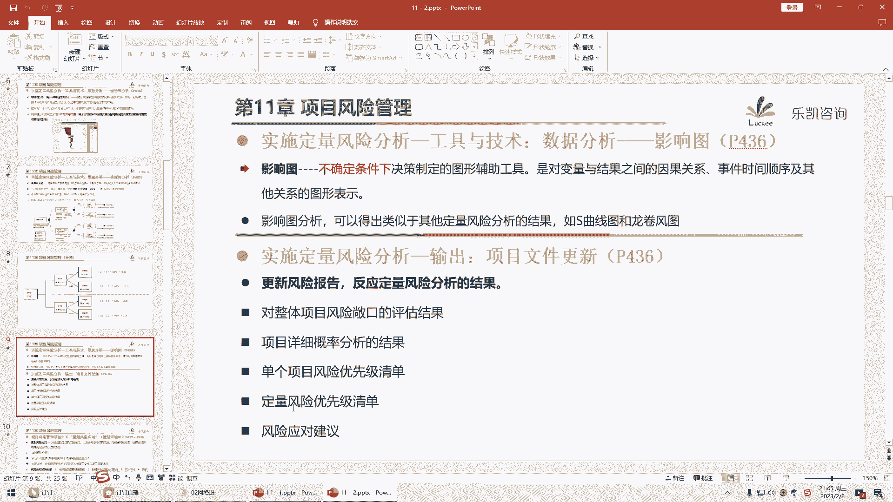
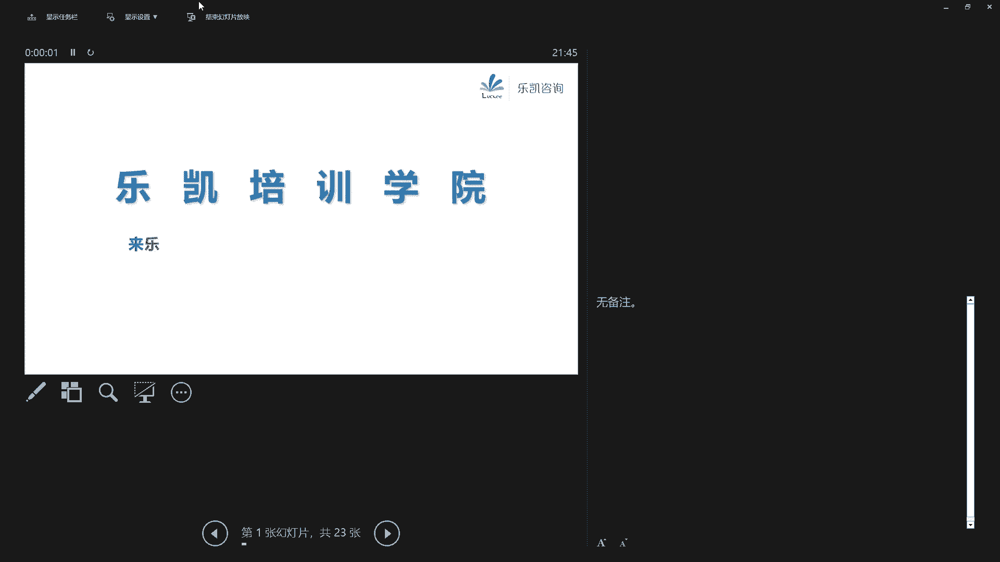
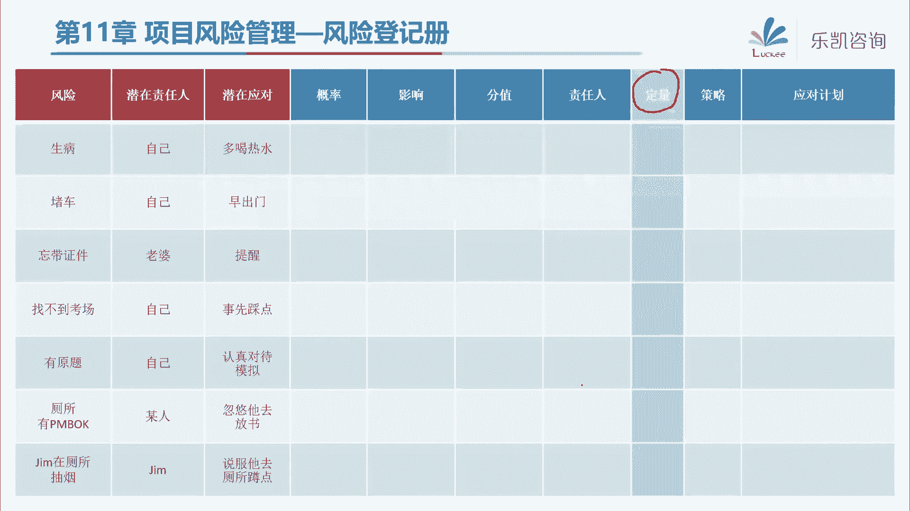
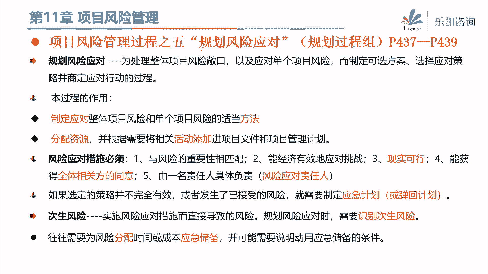

# 2024年PMP认证考试课程针对PMP新考纲最新免费零基础也能轻松听懂 - P17：PMP第11章：项目风险管理（下） - 乐凯咨询 - BV1Rj411G7gs

好各位同学晚上好，今天晚上呢我们继续学风险管理的下半部分，好吧，那么上个上一节课呢，我们学习了风险管理的前面几个过程，我们说要做好风险管理呢，实际上很简单，跟我们的常识差不多对吧，首先我们要有一份指南。

做一份风险管理计划，然后接下来我们要把尽可能我们能想到的风险，全部都识别出来，然后接下来识别出来之后，我们讲了一个非常重要的过程，就是要定性，要排优先级对吧，那么接下来我们把剩余的几个过程再讲一遍。

那么在讲定性的时候啊，如果有一些同学啊，客户呢，看来讲义呢会发现有这么一句话在这里，在我们讲定性的时候呢，在我们讲义上有这么一句话，很奇怪，他说定性这个过程做完之后，接下来可以进入什么过程呢。

可以进入定量风险分析，或者呢就直接进入规划风险应对，那么按照我们常规的思维对吧，定性只不过是定一个性而已，那么接下来我们应该学习定量了，那么为什么在定性做完了之后。

pm报告里面忽然有这么一句话很莫名其妙对吧，说做完了定性，我们就可以直接去想一想，这些风险怎么去应对了啊，言下之意呢，就是我们有可能就不做定量了，那么有同学知道是为什么吗。

那么这里呢就涉及到一个概念问题啊，就是什么叫定性，什么叫做定量，或者说定性和定量哪个更容易做一些，对吧，那么按照我们常识来说，相对而言定性呢定个性比较容易一些，但是你要说把它真正具体的量化出来呢。

其实有很多事情是很难的，比如说我们同样有一个人对吧，你说他长得帅不帅，而我们觉得他挺帅的对吧，但是你一定要定一个量说，那么他帅到什么程度呢，怎么把它量化出来呢，其实这个很难对吧，那么我们风险也是一样的。

为什么说定性做完了，我们不一定要做定量，其实就在于并非所有的风险都能够量化，也并非所有的风险都需要量化对吧，你要把它量化出来是很难的，那么我们也就意味着定量风险分析这个过程。

其实并不是很常见的一个过程对吧，他说定量风险分析，实际上就是要量化风险的敞口，那么我们上一个上一节课程啊，学过风险的敞口，实际上是概率，去乘以影响，那么怎么样去量化这个风险的敞口呢。

实际上就是要把概率和影响量化出来对吧，那么我们之前在定性的时候说一个风险，比如说风险a它发生的概率是0。3分，带来的影响是0。8分，那么最终它的敞口得分是00：24，那么这个0。

24可以跟别的风险去比较，大小排优先级对吧，哪个更重要一些，那么如果你要量化就要做到什么程度，就要做到这个0。3分还不够，他真正的概率发生的概率是百分之多少，比如说这个0。3对应的概率是40%。

那么影响是0。8呢也不够，我们要把真正它带来多少价值的影响，要量化出来，比如说它会带来10万人民币的影响，那么这个时候才能把它的场口量化出来啊，这个风险的敞口量化出来等于4万对吧，那么很明显。

你要抓到真正的概率和影响是很难的，所以pbox里面也是这么说的，并非所有的项目都要做定量风险分析，也不是所有的风险都能够定量对吧，所以这个过程呢，大家知道它具体的含义就可以了，真正我们在平时在用的时候。

其实用的并不多好吧，那么在考试当中涉及到的考点也不多，那么有一些基本的概念呢，大家要了解一下，那么我们要对一个风险去量化，要知道它的概率，大家印象当中还记不记得，我们以前学过的什么东西。

会涉及到一些概率的计算的，还记得吗，我记得在讲第六章的时候，给大家讲过一个工具叫三点估算，大家还有印象吗，那么那一节课在末尾的时候，我补充讲了一些考试不考的内容，我说三点估算呢，实际上考的难一点呢。

还可以算概率，正-1个标准差68%对吧，正-2个标准差，中心的概率是95%对吧，然后正-3个标准差是99%，还记得吧，那么实际上要找到概率，一种最常见的方法，就是做像这种概率分布类的东西。

那么所以它的工具里面就包括说，如果我们要对一个风险进行量化，我们首先可以做反弹，向专家去征求一些基本的信息，比如说最悲观，最乐观，最可能这些基础的数据对吧好，然后有了这些基础的数据之后。

我们再使用一些不确定性的表现方式，比如说我们可以用概率分布，那这里面就提到了我们的贝塔分布，来表示数值的可能区间，那么这样可以抓到一些概率啊，概率究竟是百分之多少，当然我们还介绍过蒙特卡罗对吧。

通过蒙特卡罗来不断的模拟，那么这些基本的概念呢稍微了解一下啊，实际上在我们考试的时候不会让你去算啊，具体风险发生的概率是多少，这个概率一般是告诉你的好吧，那么另外呢这个工具在考试中呢偶尔会出现。

就是定量风险分析，里面有一个工具叫敏感性分析，那么要求大家要掌握它的基本的概念，什么叫敏感性分析呢，他说敏感性分析就是要确定哪些风险，对项目有最大的潜在影响，那么他是怎么做的呢，他说很简单。

我们把其他所有的不确定因素，就是把其他的所有的风险放在一个基准值对吧，然后我们只考察每个风险的变化，会对项目带来多大的影响，那么这个敏感性分析它的概念，让我想起了我们日常生活中，也有一种类似的做法。

比如说我们有很多同学是已经有小孩儿的对吧，那么有的时候小孩呢容易过敏，但是呢我们不知道是什么原因，导致他过敏的对吧，有可能是花粉导致它过敏哎，有可能是螨虫导致的过敏，有可能是蛋白质导致的过敏。

那么这个时候呢，我们就要到医院去做一个过敏原测试对吧，敏感性分析，就相当于我们日常生活中的过敏源测试，那么到医院去做测试，我们是怎么测的呢，要去不断的去扎针对吧，先扎一针，看一看诶是不是花粉过敏。

再扎一针，看一下哎是不是蛋白质过敏对吧，那么这个也是一样的，他不考虑所有的风险放在一起的情况，他只考虑单个风险对项目的影响，那么比如说第一个风险，对项目会带来消极的影响，而且影响很大。

我们可以从大到小去做优先级排序对吧，好第二个风险呢影响会稍微小一些，但是呢影响也比较大，好第三个风险呢对项目产生的是积极的影响，是这样的啊，第四个风险就是这样的，第五个风险是这样的，那么把风险从大到小。

因为他有积极和消极的对吧，那么去分别把它的影响，把它给炼化出来，那么最终就形成了这样这样一张图，那么这样一张图呢在考试中出现的比较多对吧，叫龙卷风图，那么考试的时候经常会问你。

龙卷风图是一种风险定性分析的，还是定量分析的工具，那么这个时候你要知道，它是定量风险分析的一个工具，属于敏感性分析里面的一种很有代表性的图，好吧，那么这个基本的概念大家要有印象。

那么另外其实定量风险分析，最主要的是要量化风险的场合，那么在考试当中会出现计算题对吧，那么这就涉及到有个工具叫决策树分析，关于决策树分析的，大家要会算也比较简单好吧。

那么我们直接用一个例子来跟大家说一下，决策树分析的含义是什么，为什么它叫决策树，实际上决策树分析的本质，就是预期货币价值分析，那么预期货币价值分析的本质就是，我们要量化出风险的概率和影响。

然后算出它的场口，然后便于我们去进行决策，比如说我们有这样一个例子，他说我们现在啊有一个工厂，那么现在呢我们不知道是重新建一个工厂呢，还是把原有的工厂进行扩建，那么这就需要我们决策了对吧。

那么怎么去决策呢，好一般来说他会把一些已知条件告诉你的，比如说他这么说，新建一个工厂需要投资1。2个亿，那么市场上是什么情况呢，它是有风险的，他说有60%的可能性，这个市场呢有强需求。

那么什么叫强需求呢，就是指我们工厂生产出来的产品呢，在市场上很畅销对吧，卖得很好，市场的需求很旺盛，那么在这种情况下，我们会收入两个亿对吧，当然这只是有败60%的可能。

那么还有40%的可能呢是一个弱需求，那么所谓的弱需求就是指市场上需求不是很好，我们这个产品卖得不太好，那么这种情况下会收入0。9个亿，那么这是新建的这两种情况，那么如果我们扩建一个工厂呢。

好扩建的投资就没有新建那么多，扩建只要投资0。5个亿，那么60%强需求的情况下，我们会收入1。2个亿，同样还有40%的可能性是弱需求，收入0。6个亿，那么这些已知条件告诉我们了，需要我们来决策。

我们究竟是新建一个工厂，还是在原有的基础上去扩建这个工程，那么这个时候我们就可以用决策树，或者用预期价值，预期货币价值分析来进行计算，那么怎么去计算呢，很简单，我们有一个原则。

我们对待风险应该站在什么样一个角度啊，我们既不要只看到好的机会对吧，但是我们也要看到什么呢，有一些威胁的存在，所以我们关于风险，应该站在一个风险中立的角度，那么我们来分别算一算这两种情况下。

我们最终的一个值是多少，比如说第一种情况，新建一个工厂，投资1。2个亿对吧，那么有一种可能会收入两个亿，好收入减投资，把收入的两个亿减去1。2个亿，这就是我们的利润了，那么这种利润有多少的可能性呢。

有60%的可能性对吧，那么算出来这种情况下，我们最终会收入0。48亿，但是我们要站在风险中立的角度，还要考虑其他的情况，也有可能是弱需求，那么弱需求我们收入是0。9个亿，投资都要投掉1。2个亿。

亏了对吧，那么这种可能性也有的，有40%的可能性，那么最终算出来这种情况是负的，0。12个亿，那么也就是说，最终我们新建工厂这种情况最多的值是多少呢，把这两个相加就得到，最终应该是0。36，对吧。

那么同样的扩建也是用这种做法对吧，收入减投资乘以概率，收入减投资乘以概率，然后这两个再相加得到扩建，最终我们得到的结论是0。46，那么从这个分析的角度来说，我们应该选择新建还是扩建。

那么很明显我们要选择扩建，因为扩建算出来我们的收益可能会大一些对吧，那么通过这种来做出决策，这就是一种决策树分析，而决策树分析的本质，实际上就是去量化风险的概率和影响。

然后去算出它量化出来的敞口是多少好吧，那么关于这个计算呢，实际上呢还有一种更加简单一点的方法，我个人觉得比较简单一点的方法，不用这么麻烦啊，其实是一个意思，大家看一下啊，比如说新建这个工厂。

我们怎么去算呢，我个人喜欢这么去算，新建工厂收入两个亿对吧，那么这种可能性是60%，那么另外一种情况是弱需求，弱需求收入0。9个亿，这种情况呢是40%，当然我现在算的都仅仅是收入了，对吧。

好收入都算出来了，我最终直接一次性减去投资1。2个亿，对吧，那么这样算出来也能得到新建是0。36，实际上跟下面拆开来算是一样的对吧，但是我个人喜欢用这种方法，就是最后一次性减去投资，那么下面也是一样的。

那收入1。2个亿，这种情况是60%，然后收入0。6个亿的情况是40%，这都是收入了，好最后一次性减去投资0。5也能算出来，等于0。46好吧，那么大家在算的时候呢，按照个人习惯去算就可以了好吧。

那么这种计算呢相对来说对于我们中国人来说，很简单对吧，很简单，所以接下来呢我出一道题目啊，给大家练习一下这种计算题，在考试中遇到的就是送分的啊，他不会让你去算概率和影响，只会告诉你概率和影响。

让你算出最终的一个结果，好吧好，那么接下来我用一道题目给大家练习一下，我现在呢在做项目的时候，涉及到两个方案，一个是a方案，一个呢是用b方案，那么这两个方案的区别是什么呢，如果我用a方案。

我发现我的成本啊是这样的，用a方案，有70%的可能会需要10万的成本，有20%的可能需要花5万的成本，当然还有一些可能只需要花3万的成本，这是a方案好吧，那么b方案呢是这样的。

我如果用b方案有80%的可能性，需要9万的成本，当然也有可能只需要6万的成本好，那么接下来我们最终应该选择a方案，还是b方案，大家可以快速的去算一算好吧，我再重复一下这道题目，我在做项目的时候呢。

有两个方案，那么a方案是70%的可能性，需要10万的成本，20%的可能性需要5万的成本，那么剩下的可能性需要3万的成本对吧，那么b也是需要成本的，80%的可能性要9万，剩下的可能性要6万。

那么应该选择a方还是b方好，那么这里呢他没有说到投资跟收入的关系对吧，他只是说到另外一种情况，纯粹的花钱需要成本对吧，那我们算一下a最终的值是多少呢，好很简单，70%乘以十。

等于20/700x5=1对吧，站在风险中立的角度嘛，还剩下多少可能性呢，他没说说，当然还有可能要3万的成本，那么这个3万的成本概率是多少呢，那么很明显了，70%，20%还剩下的就是10%。

那么10%的可能性需要3万了，好算出来等于0。3，那么我们有同学已经算出来了，a算出来最终的结果是8。3的成本对吧好，接下来b 80%的可能性需要9万的成本，那么这种分支上面算出来是7。2。

那么剩下的可能剩下是多少呢，20%了对吧，需要6万的成本，那么这个算出来等于1。2，也就是说b最终的成本是8。4，好那么这两种方案我们应该选择哪一种，那么这里要注意啊，对于我们绝大多数同学来说。

算都是很容易的，关键是算对了之后要选对这道题目，要选择方案a，有的在说你不是选大的吗，怎么会选了方a呢，要注意，这道题目跟我刚刚讲的那道题目是不一样的，刚刚讲新建和扩建工程，我们在算什么。

我们再算收益对吧，那么对于收益来说，要选择大的越大越好，而这道题目在问什么，再问成本，那么对于成本来说，我们要选择小的越小越好好吧，那么以前的考这种计算考的还比较多。

那么要说难的就难在这边可能有一个小的陷阱，大家要注意避开对吧，究竟他在问收益还是成本好吧，那么本质上它的计算实际上并不难，就是风险敞口的量化的计算，把量化的概率乘以量化的影响。

然后再算一个总和就可以了好吧，那么定量风险分析，实际上就是敏感性分析和决策树分析，这两个工具，大家需要了解，包括计算需要掌握，那么这个过程的本质实际上呢意义不是很大，说实话，我这么多年做项目啊。

也很少说对哪一个风险去做量化，有很多东西呢实际上是很难量化的好吧，那么如果有些风险你能够量化的，就把它量化出来对吧，当然也可以结合影响图啊，然后最终去更新我们的风险登记册，把量化的结果填上去好吧。

那么这个东西呢，实际上呢，这个过程我希望大家不要太花太多的时间，抓住这两个点就可以了，好，那么接下来定性做完了，那么能量化的呢我们也量化出来了，那么接下来这个过程就非常非常的重要。

在我们实际工作中和我们考试当中，都是非常重要的一个过程，那么这个过程叫规划风险应对我们风险识别了，我们也定性了，甚至能量化的量化了，那么接下来我们就要根据风险的优先级，去规划一下。

我们打算怎么去应对这些风险对吧，那么应对这个风险的目的是为了干什么，是为了处理风险的敞口，是不是处理风险的敞口，对吧好，那么这个过程的作用就是，我们要制定对整体项目风险。

特别是单个风险应对的恰当的方法对吧，然后接下来他说风险应对措施要注意，首先要跟风险的重要性相匹配，而就是重要的风险，我们可能要用一些比较付出代价的，一些应对方式对吧，当然我们要考虑经济有效现实可行。

那么另外要获得全体相关方的同意，好一旦同意了之后，那么接下来就由一个具体的人来负责，后续的应对谁呢，就是我们上节课讲的风险责任人好，那么接下来我们看一下风险最常见的，应该怎么去应对。

那么这个过程它的工具大家一定要好好的掌握，对大家以后做项目是有帮助的，好吧好，首先我们来看威胁的应对策略，我们说风险是一个中性词对吧，它是指将来可能发生，而且一旦发生会带来积极或消极的影响。

那么消极的影响的风险就叫威胁，那么对于这些威胁，我们怎么去应对呢，好首先我们讲这个策略叫上报，我们在上一节课讲过整合式风险管理对吧，如果我们团队发现了一个风险，但是这个风险我们团队解决不了。

或者不在项目的层面上啊，已经超出了我们项目经理的权限了，那么这个时候怎么办，那么这个时候我们就要上报给上一层，比如说上报给发起人，上报给项目级或者项目组合对吧，那么对于上报的威胁，我们就不再进行监督了。

一旦我们上报上去，我们就不再监督了，我们只需要保证上报了之后，那么有相关的人员来处理就可以了，所以这种策略呢比较简单对吧，就是实在没办法了，那么就上报嘛好，那么比较重要的是下面四种策略，首先我们看规避。

好什么叫规避风险，大家从他的字面意思能够看得出来吗，啊我现在有一个风险，我要把它规避掉，什么叫规避，规避就是指完全避开这个风险，那么怎么去避开这个风险呢，我们可以这么去考虑啊，风险它是由两个因素得到的。

对吧，我们说风险的敞口取决于风险的概率，乘以风险的影响，所谓的规避就是完全避开，完全避开就是指让它的敞口变成多少呢，变成零，那么大家想一想，我要让概率去乘以影响变成零，我们有什么方式啊。

好我们的范玉生同学说了一种方式，是把概率变成零，什么意思，就是让这个风险绝对不会发生，那让它概率变成零对吧，那么还有一种方式呢，就是让他的影响变成零也可以吧对吧，哎张勇就说了，不一定概率变成零啊。

影响其中一个变成零就可以了对吧，当然如果你足够牛逼，概率和影响都变成零也行对吧，那么这种就是规避，那么有的同学说概率变成零可能吗，影响变成零可能吗，好接下来我举几个例子啊，比如说郑世伟同学觉得不可能。

那么我就问小郑同学一个问题啊，假如说郑世伟同学正在做一件坏事儿，他在做坏事的时候呢，我刚好路过，被我发现了对吧，诶我发现小郑同学在做坏事儿，那么我发现了之后，我就有一种风险啊，我有可能是会说出去啊。

跟别人到处乱说啊，对吧啊，正式为怎么怎么样了，怎么怎么样了，这对这四位同学来说是有风险的，那么我想问一下郑世伟同学，如果要你规避这个风险，你有没有想到什么手段，让概率变成零。

你看这不就马上想到了一种策略吗，规避的策略在我们电视上，电影里面经常看到的对吧，有一句台词是这么说的，我只相信只有死人才能够保守秘密对吧，然后话刚说完，直接一刀，请问在电视电影里面。

这种手段实际上是一种什么手段，他就是规避风险的手段，他把概率变成了零，为什么，因为死人他不会说话呀，他能够保守秘密呀对吧，那么在刚刚我们有一些同学提出来的一些策略，比如说哎呀我讨好你呀，我贿赂你呀。

这个能够完全把概率变成零吗，不能你们仔细想一想，是不是这个道理啊，比如说正事不说，哎呀吉姆老师，我请你吃饭，吃好吃的对吧，哎我给你送烟送酒能够规避掉这个风险吗，你最多只能说怎么样，唉我们后面会讲。

最多只能说减轻了，但是你不能说完全规避掉对吧，规避就是一定要把概率变成零对吧好，那么哪一种情况是把影响变成零呢，影响变成零的意思就是指这个风险啊，还是有可能发生的，但是它发生了之后呢。

他不会对我的项目带来影响，好我再举个例子来考考大家啊，比如说明天星期四，我们上班有迟到的风险，请问怎么规避迟到的风险，注意啊，我再次强调一下，所谓的规避就是百分之百规避掉，你。

怎么样能够做到我百分之百不迟到，你看各位猥琐的项目经理，就想到了很多规避的方法，比如说有同学说靠我请假不就好了吗，对吧，再比如说老子今天不回家，我就睡在办公室，做教育要规避这要求，这也叫规避啊对吧。

那么我们回回过头来看一看这个例子，明天星期一四上班有堵车的风险对吧，我可能会迟到，那么我怎么去规避这种，比如说堵车的风险呢，好我就睡在公司，今晚我住在公司，那么接下来大家考虑啊，我住在公司。

明天上班堵车的风险，他的概率存不存在，当然存在，该堵车还是堵车，但问题是由于我睡在了公司，你堵车跟我有关系吗，你赌你的跟我有啥关系啊，对吧，我睡在公司了呀，所以说呢还有一种情况就是虽然概率是存在的。

但是由于税贷公司你对我不产生任何的影响，影响变成了零，明白吗，所以呢大家一定要注意规避，实际上就是值，要么让风险不发生，把概率变成零，要么让项目免受影响，把我们的影响变成零对吧。

那么常见的规避策略有这些，大家可以关注一下，比如说我们可以延长进度，争取足够的时间，我们可以改变策略对吧，我们做项目的时候，可能这种策略会遇到一些风险，那么我改变另外一种策略不就好了吗对吧。

再比如说缩减范围啊，我们发现有一些工作包是有风险的，比如说以前就考到一道题目，我们发现有一个工作包，会导致我们的员工受到伤害的风险，那么我们怎么样去处理这个风险呢，那么有一种方法就是缩减范围啊。

这个工作簿不做了，规避掉这个风险对吧，当然还包括澄清需求啊等等，那么大家要注意，有什么风险是需要我们去规避的，我们为什么要想方设法，想尽一切方法来规避掉这种风险，那么规避这种策略往往是针对什么风险。

往往是针对高优先级的风险啊，高优先级的风险也就是我们这边说的威胁对吧，像这种高优先级的啊，极有可能发生，而且发生了之后破坏性很强的，那么我们最好想办法要把它规避掉好，那么对于规避这个策略大家应该知道了。

那么我们以后在做项目遇到高危风险，我们可以从这两个手段去入手，要么概率变成零，要么影响变成零，好吧好，那么接下来再看这个策略叫转移，那么什么叫转移呢，你会发现啊有一些风险啊，我们想规避，但是呢规避不了。

比如说举个简单的例子，我们有很多同学呢都有车，我们平时开车肯定会遇到风险对吧，比如说被别人刮了呀，被别人蹭了呀对吧，你说我开车技术好，你技术好有什么用，对不对，你不刮别人，别人会夸你呀对吧。

你说这个风险怎么规避呢，规避不掉啊，那怎么办呢啊不要担心，还有我们可以用另外一种策略叫转移，那么什么叫转移呢，他说转移呢是这样的，我们把应对威胁的责任转移给第三方，让第三方管理风险，并且承担威胁。

发生了影响，就是威胁一旦发生有影响，让第三方来承担对吧，比如说什么手段，我们有很多同学就说了，我可以买保险对吧，比如说我们给车子买保险，包括我们在项目上涉及到的履约保函啊，担保啊对吧。

包括我们项目中还有一种常见的方法，外包也是一种方法对吧，外包也是把责任转移给第三方，但是要注意这里面有一个非常重要的点，你凭什么把风险能够转移给第三方，保险公司，为什么愿意来承担。

或者我们把东西外包出去，我们的供应商为什么愿意承担这个风险，因为我们通常需要干什么，我们通常需要支付转移费用啊，要花钱的对吧，不花钱，谁帮你来挡这个枪啊对吧，所以转移有一个最大的特点。

就是他要支付风险的转移费用，这是第一个，第二个大家要注意的啊，我们说风险敞口是有概率和影响决定的，我们刚刚的规避是概率变成零或者影响变成零，那么我们考虑一下转移这种策略，比如说我们买保险。

我们在做项目的时候，用履约保函，或者我们把东西外包给供应商，在这种情况下，请问风险发生的概率，它变了没有，唉这个问题大家要考虑一下，就是我们买了个保险，风险发生的概率它有变化吗。

是不是说我们给车子买了个保险，所以别人蹭我们的概率就小了呢，唉你会发现这个概率好像没什么变化对吧，你说这个对概率有什么变化呢，没什么变化，你买了个保险，该蹭还是蹭，该刮还是刮，对吧好。

那么我们再看影响变了吗，就是一旦被蹭了之后，影响变了没有，啊有的同学说影响变了，为什么呢，保险公司给我赔钱了，实际上呢这个说法呢不太准确，应该说影响是没有变的，只不过影响怎么样，看这句话。

影响由别人帮你承担了，明白吧，就是该修还是要修啊，你不能说买了保险，你车子蹭了，难道不修吗，该修还是要修，该花钱还是要花钱，该花时间呢还是要花时间对吧，只不过其中有一部分经济方面的影响。

让保险公司来承担了对吧，要第三方帮你承担了，但是钱花不花呢还是要花的对吧，所以本质上来说，转移这种策略它没有改变风险的概率和影响，只不过让第三方来办理管理，然后由第三方来承担责任了对吧。

所以这里面有一句话，转移风险，只是把风险的责任简单地推给了另一方对吧，而并没有消除风险，这是转移跟规避的区别，就是该存在的还是存在，只不过第三方帮你承担了一下对吧好，那么这是转移。

我相信大家通过买保险的例子，应该了解这个策略的含义对吧好，那么还有一些风险呢，我们发现规避呢规避不了，转移呢，也没有靠谱的第三方转移对吧，那么还有一种策略叫什么呢，叫减轻，那么减轻这个就很简单了。

从字面意思来说，什么叫减轻，减轻就是要把风险的敞口变什么呢，变小吗好那么同样的道理，我问一下，要让风险的敞口变小，风险的优先级变低，我们可能可以从哪两个方向去考虑呢，那么很明显。

要么让风险发生的概率啊变低，要么让风险发生之后带来的影响变低对吧，或者两个都变低，那么两个都小了之后，最终承下来的结果不就小了吗对吧，那么小到什么程度呢，大家还记不记得我们上一节课讲过一个概念。

叫风险的临界值啊，就是把它变小小到什么程度，小到我根本就不care啊，无所谓对吧，小到我的临界值以内，让我可以接受就可以了，对吧好，那么这里面他就说了，减轻风险的例子有很多，比如说在我们项目上。

我们可以采用更加简单的流程啊，我们一个一个来分析一下啊，流程更简单，它会有什么好处，流程更简单，出现问题的概率就越小吧，它是降概率的对吧，流程越简单，出错的可能性就越小，进行更多的测试，好测的越多。

客户发现了外部失败成本就越小吧，可能性就越小对吧，然后我们选择更可靠的卖方，好注意啊，这里有一个细节，我们要对比起来看的，如果我们跟供应商签订合同，外包掉，这个叫转移对吧，但是在这之前。

如果有多个供应商，我们用这么一个说法，叫在多个供应商里面选择更可靠的供应商，也就是更可靠的卖方，那么这是一种什么策略呢，在这个时候还不涉及到转移，在这个时候实际上是一种策略，叫减轻唉。

为什么这个要减轻呢，因为更可靠的，或者说更靠谱的供应商意味着什么，出问题的可能性就要小一些对吧，这是人之常情嘛，就像我们很多女孩子找男朋友，我们希望找一个什么，我们希望找一个更加稳重一点的，对吧。

更加稳重一点的，那么出问题的可能性要小一些，一个道理对吧，所以在多个供应商里面，去选择一个更可靠的供应商，在这个时候我们就要减轻对吧，那么最终我们跟供应商签订合同去外包，这个才叫转移。

这个要注意的好吧好，另外还有我们之前学过的一个重要的工具，我们在做需求的时候，我们可以用圆形法，那么圆形法也是减轻的一种策略对吧，我们用圆形法先做一个模型出来，那么可以减轻反攻的风险，还记得吧。

好另外最后还有一种例子，也是考试中经常出现的，叫加入冗余部件，大家见过冗余部件吗，我们有一些行业是经常见到的，比如说像我们it行业，做i t行业的，如果做过机房工程的对吧，在我们机房里面。

我们有一种做法叫双机热备，这个我们做it的同学是很清楚的，那么大家知道双机热备是为了什么吗，比如说我们有一些很重要的东西啊，比如说核心交换机，核心交换机我们一般是两台两台都在工作对吧，包括我们的服务器。

也是两台两台都在工作，那么这样做的好处是什么呢，万一有一台服务器挂了，那么服务器上面的虚拟机，会飘到另外一台服务器上，它还可以工作，那么这种就是我们i t行业里面，所谓的双机热备好，这是一种什么策略。

这就是一种风险减轻的策略，它减轻了什么，减轻了风险发生之后带来的影响对吧，那么最好嘛当然是不出问题，那么一旦出了问题呢，好那么一太坏了，另外一台还在用，还可以撑一撑对吧，那么如果不是it行业的同学。

在我们日常生活中，你也会看到一些例子的，比如说啊我们在高速公路上，我们过年回来的时候对吧，开车的同学，在高速公路上会看到那些很长的大货车对吧，你有没有一个疑问啊，就是我们自己的私家车就四个轮子。

那么为什么大货车每一个装轮胎的地方，它装了两个轮子啊，对吧，那么考虑一下这种情况，如果说货车的司机在开车的时候，发现好有一个位置的轮胎，有两个轮胎，其中的一个轮胎呢漏气了，对吧好，请问漏气了之后。

他能不能把车子勉勉强强开到服务区，可以吗，可以的对吧，因为为什么呢，他同一个地方他装了两个轮胎呀，装了两个轮胎啊，那么有一个轮胎漏气了，那么还有一个轮胎可以稍微撑一撑啊对吧。

那么你说龚海希同学有一个轮胎漏气了，你说好不好，当然不好，有影响对吧，但是影响有那么大吗，注意啊，我说的不是后备箱里面的轮胎啊，我说的是大货车，我感觉大家是不是没有见过大货车啊。

比如说一个很长的厢式货车，它的轮胎你们有没有观察过它是怎么装的，在这个位置本来是装一个轮胎，但是呢他装了两个，你们发现了没有，注意啊，我说的不是我们家用汽车，说在后备箱里放了一个备胎，而不是那样的啊。

我是说他两个轮胎都在用双排的，对吧，那么在这种情况下，万一发现有一个轮胎有一点漏气，你说对我们的运输有没有影响，有影响，但是影响大不大，由于我装了两个轮胎，对吧，我觉得这个影响不是很大。

我们还可以撑一撑，那么这种就是减轻风险发生的影响，能明白这个意思吧，所以说减轻实际上是要么降低概率，要么减轻影响，想办法把敞口降到可接受的临界值范围内，那么这个叫减轻好吧。

那么我们回顾一下刚刚讲的三个例子，规避是把敞口变成零，转移呢理论上不变，减轻呢是把敞口尽量的降低，它虽然没有低到零对吧，但是降低了我们可接受的范围了，好还有一种叫接受，那么什么叫接受。

接受就是承认风险的存在，承认威胁的存在，但是我们不主动采取措施啊，我知道有这个风险，但是呢我不想管好，大家注意啊，我们刚刚讲的上报需要我们主动往上去报的，规避对吧，不管你是延长进度，改变策略。

也是我们要主动去处理的转移，我们需要去买保险，减轻呢我们要想办法降低概率，降低影响，这几种方法都比较怎么样，这几种方法都是要我们主动去处理的，那么回忆一下我们讲风险的时候说过，对于一个我们已知的风险。

我们已经能够识别出来的风险，我们能不能主动管理呢，如果能主动管理，那么就是已知已知对吧，简称叫已知，但是还有一种就是说我们不主动管理，那么不主动管理就是风险是已知的，但是我们管理的手段是未知的诶。

说到这个已知未知，大家想到什么没有啊，前面几种是风险是已知的，我们要怎么应对，我也规划好了，也是已知的对吧，那么如果你不想主动处理，那么就是风险是已知的，你怎么去处理呢，未知说到已知为之。

大家脑子里面忽然跳出来一个词，什么词呢，这好像不就是我们之前讲的要建立应急储备吗，对吧，我们说对于已知未知风险要建立应急储备，我们看一下是不是这种情况篇，报告里面说虽然接受啊，它本质上他不主动偏被动。

但是呢他细分出来也分主动接受和被动接受，那么主动接受呢，有一种方法就是建立应急储备对吧，那么被动结束了就更加过分，就是大家说的躺平摆烂对吧，哎呀你爱怎么样怎么样，那么这种叫被动接受。

那么我们说的应急储备留了一些应急储备的，还算偏主动一点点对吧，这个叫主动接受好，那么我问一下大家，建立应急储备，应急储备，这个应急储备包括哪几种情况，知道吗，比如说对于进度方面的应急储备。

我们要留一些什么，唉我们在讲进度的时候，在估算活动持续时间，大家还有印象吗，我们也说到了，有一个工具叫储备分析，我们要考虑应急储备对吧，那么进度方面我们就是要留一些时间吧，所以应急储备的有一种情况。

就是我们要留一些时间，唉，我们有同学说了，留一些余量对吧，好，对于成本这个知识领域，我们所谓的应急储备是留什么，很明显就是留一些钱，对吧，你成本嘛不就是多留点钱吗，啊我知道有这样一个风险。

但是我不打算用理他，我留点钱，如果它发生了，我就再花几笔钱就行了，是吧好，还有还有一种就是留一些资源，那么有同学说什么叫留一些资源，刚刚我们有一个同学小龚同学问了一个问题，说我刚刚举的例子。

大货车两个轮胎双排一起装在跑，这个叫减轻，然后他问了我一个问题，他说，那么我们家用汽车后备箱里面放一个轮胎，算什么呢，那么我们来考虑这个问题啊，你后备箱里面放一个轮胎，它对风险的减轻有意义吗。

你是降低了概率呢，还是降低了影响呢，你轮胎放在后备箱对吧，你也没有降低概率，你也没有降低影响，你只不过怎么样了，你只不过是留了一些资源而已对吧，那么一旦风险发生，那么我就用这个资源坏了吗。

我就去换嘛对吧，所以对于爆胎这个风险，我们的后备箱里的轮胎是一种什么策略，实际上就是建立了应急储备，我主动接受了而已，能不能理解这个问题好吧，比如说呢再比如说很典型的例子啊，年前抖音上有一个新闻对吧。

就是骑摩托车的，好像有一个还是网红对吧，出了一些事故，对吧，那么我以骑摩托车为例，同样是头盔，大家考虑一下啊，骑摩托车也是有风险的，我们要戴头盔，请问戴头盔是什么策略，唉我骑的时候头盔就戴着了。

这是什么策略，这是减轻对吧，一旦风险发生，我戴着头盔可以减轻一些影响，那么我们换一个思路去考虑，为什么我们交警说我们骑车一定要戴头盔呢，好如果我们不戴头盔，把头盔拿在手上，或者头盔放在家里面。

这是一种什么策略，大家要注意，你头盔不戴就谈不上减轻，你不戴头盔就意味着你怎么样，你接受了这个风险，是不是这个道理，你你就这么接受了呀对吧，所以说这里面刚刚问了这个问题啊，实际上就是有这个区别的好吧。

那么在这里我说一下啊，在考试的时候，大家不要考虑得这么复杂，明白吗，在考试的时候容易出现一个词叫背景，内奸只要说到背景，我们统一把它认为是冗余部件，都认为是减轻就可以了好吧，不要考虑的那么复杂。

只不过我们有同学问了这个问题，我觉得要最好把它说清楚的，那么我们要说一说的好吧，那么有同学说激素跟上报是什么区别，注意啊，上报你还把他抱上去了，接受呢就啥也没做呀，对吧，接受就是你啥也没做呀，好吧好。

那么这是我们应对威胁的这么几种策略，那么我相信通过我的讲解，大家应该有一个很好的理解，那么我建议大家，其实这些策略啊，就从他的这两个因素去考虑对吧，规避就是概率变零或者影响变零。

转移呢其实这两个本质上没什么变化，减轻呢就是概率降低或者影响降低对吧，那么接受呢就是不主动管理任何风险好吧，那么徐同业同学说的问题，我刚刚说了啊，只要说到背景，我们不考虑冷背。

我们一致把它认为是热备好吧，也就是减轻的一种做法好吧，考试不会考得这么细的啊，这个已经涉及到特殊行业的一些相关的知识了，好吧，说到背景就是减轻好，那么最后我再问大家一个很有意思的问题啊，大家考虑一下。

假如我发现我们的项目中有一些风险，它属于高危的威胁，啊我发现这个风险是一个高危的威胁，我让你在这四种里面啊，上报就不要说了，上报嘛就是网上报满，那么剩下的这四种里面，我让大家选择两种方式。

你觉得应该选择哪两种策略来处理，高危的威胁比较好一些，好第一个马上反应过来了对吧，对于高危的我们要规避，能规避的就规避，还有呢，如果要你选两个，除了规避，你打算再选哪一个，那么这里面就出现了矛盾对吧。

接受是没人选的，接受就是被动嘛，偏被动嘛，这个肯定不行，那么究竟是转移还是减轻呢，好完了时候说肯定是买保险高危嘛对吧，转移跟大家说一下啊，在我们做项目的时候，高危风险能规避的就规避。

不能规避的优先考虑减轻，我说一下啊，为什么要优先考虑减轻，所谓的减轻大家要注意啊，不是说随便减轻的，就是说减轻是什么意思，要想办法把风险降低到可接受的范围，那么有人说为什么不是转移呢。

我举一个例子大家就会明白啊，我们在做项目的时候，特别是做我们跟土建相关的，跟工程相关的项目的时候，在我们施工现场一般有一条明文规定，就是进入施工现场必须要干什么，进入施工现场，必须要戴安全帽。

那么首先大家回答我戴安全帽，它是一种什么策略，对吧，唉我们做土建项目，我们做工程相关的项目，在你进入施工现场的时候，你必须要带安全帽，那么戴安全帽是一种什么策略呢，好大家都很清楚，是减轻的策略。

因为它没有规避风险对吧，脑袋会被砸吗，还是有概率的，但是砸下来之后，由于你带了安全帽，最多呢稍微有一点轻微的脑震荡对吧，这个叫减轻，那么什么叫转移呢，啊我们有同学说了，那么我们也可以给我们的员工买保险。

这叫转移，那么如果在这里面让你优先选择一个，你选减轻还是选转移呢，是不是买了保险之后，我就可以为所欲为呢，注意啊，买了保险没用的，你买了保险不戴安全帽，被砸了之后是什么后果。

后果就是虽然保险公司给你赔钱，但是这个钱可能花不了了，最终钱是别人的，甚至老婆孩子都是别人的，是这个道理吧，所以说大家要注意，对于高危风险，我们优先要干什么，规避规避不了，想办法减轻。

实际上减轻的优先级比转移，在某种程度上要高一些，好吧，你们在后面做每日一练的时候会遇到这种题目，说高危风险，我们一般采用哪两种策略能规避，最好能减轻他也是好的对吧，因为减轻就是能够降低到可接受的范围呀。

我可以接受的呀，好吧好，那么这个是应对威胁的这几种策略，那么我们说风险是一个中性词了，除了威胁，还有什么，还有机会了，那么对于机会同样也有策略，那么我们来看一看，好吧好。

遇到一些将来可能对我们项目有利的，积极的风险，我们也叫机会，那么对于机会我们有哪些策略呢，好第一个仍然是上报，这虽然是一个机会，但是呢不在我项目层面解决，对吧好，我们在下一节课举过一个例子。

大家还记得吧，我说我们在做项目的时候，发现供应商跟我说，如果我们的公司跟供应商的公司能签订，战略合作协议，那么我们采购设备的成本会便宜一些，会有一些优惠，那么这是不是一个机会呢，是一个机会。

但是这个机会在不在我项目层面呢，我项目经理是不能代表公司跟他们签协议的，对吧，所以这种机会不在我项目层面的，我仍然需要上报报上去对吧，那么报上去了我们就不再管了对吧，只要报上去之后。

有相应的人愿意承担相应的责任就可以了，那么这个仍然是上报，好吧好，那么接下来再看机会也有四种策略，第一种叫开拓，那么什么叫开拓，开拓是说如果我们发现了高优先级机会，我们就可以选择开拓策略，什么叫开拓呢。

开拓就是把发生的概率尽量提高到百分之百，这个好像跟我们刚刚讲的威胁的哪一种策略，正好是截然相反的呀，我感觉他跟规避正好是相反的，对对规避是说让风险不发生变成零，那么开拓开拓机会是什么意思呢。

让他百分之百发生，确保抓住这个机会对吧，好在考试中经常考的很典型的例子啊，怎么样去百分之百抓住这个机会，他说比如说我们把我们公司里面，或者说组织里面最牛逼的资源分到项目上来，或者用全新的升级的技术。

所以这里面开拓的例子有两个，要么用牛逼的人，要么用牛逼的技术对吧，那么这个时候有同学会提出一个疑问，难道你用牛逼的人或者用牛逼的技术，就能够百分之百抓住这个机会吗，那么你一定要这么说嘛，也确实不是。

但是大家要注意啊，从策略的角度来说，你这样做的策略，或者说你这样做的目的是为了什么，实际上就是要百分之百抓住这个机会对吧，所以我们把它看成是什么呢，是开拓好吧，一定要注意啊，开拓就是要么用牛逼的人。

要么用牛逼的技术好，那么除了开拓以外，还有分享，分享是什么意思呢，他说我们把应对的机会啊，他的责任转移给第三方对吧，然后共享机会带来的部分收益，比如说我们可以建立合伙关系，建立合作团队，建立特殊公司。

合资企业对吧，那么这也是找第三方，那么这个跟刚刚的转移正好是对应的对吧，转移是把责任转移给第三方，然后让别人来承担我们的影响，风险是什么呢，哎有同学说的有钱一起赚对吧，比如说举一个例子。

我觉得我讲偏僻还可以对吧，但是我只会讲pp我没什么存款，比如说张勇同学对吧，张勇同学有大量的存款，那么有可能张勇同学出钱，我出力对吧，我们也开一家t m t培训公司对吧，还在什么乐凯干啊，不干了对吧。

我们俩人出去对吧，那么这种叫什么，这种就是我们一起去合作，然后赚了钱共享这个收益就可以了对吧，所以这个跟之前的转移是什么，实际上是对应的是吧，好再看提高一提高跟刚刚那什么是对的呢，刚刚刚的降低是对的。

降低说减轻概率，减轻影响，提高呢就是提升概率提升影响，因为这个是一个机会嘛对吧，好注意，这里有一个例子要认真听啊，考试中经常考到提高的粒子是什么，比如说他说到了为早日完成活动而增加资源。

那么考试的时候经常考到一道题是什么题目呢，就是让你选择我加了人之后，究竟算开拓还是算提高，这个是经常考到的，那么你怎么去判断，你就要看题目中的描述，如果题目中说诶，我把组织里面最有经验的人。

我们最资深的什么什么人对吧，总之说来说去是一个牛逼的人给你了，那么牛逼的人就是开拓的策略一定要注意的啊，这是考试会考的，那么如果题目中什么都没说啊，就是为了抓住这个机会，我帮你多增加了几名资源，注意啊。

他只是说帮你多增加了几名资源，但是没有说到牛逼的人，那么对于普通人来说，这就是一种提高的策略，好吧，这里面有一个细节是一个考点一定要注意的好，那么最后当然我们也包括接受，什么叫接受。

就是承认机会是存在的，但是呢我不主动采取措施，本质上呢它是被动的对吧，只不过呢它也可以建立应急储备，对吧叫主动接受，或者呢直接躺平，被动接受，那么有的同学可能会有一个疑问了，你说威胁建立应急储备。

主动接受，我还能够理解这个机会怎么建立应急储备啊，对吧，你看我们渔民同学就问了诶，为什么机会也可以精灵应急储备呢，说主动接受呢，我举一个例子啊，比如说今天在上课之前，我们有一个同学，比如说张珊珊同学。

小张同学在上课之前问了我一个问题，jim老师一会儿上完课之后，你还有别的事吗，我说没有说，完了之后小张同学呢也没说别的事儿对吧，什么都没说，他说哦，我知道了，那么这里面就存在一个机会呀。

我在想是不是我下了课之后，小张同学要请我吃顿烧烤啊，这是不是机会是机会，但是我又不确定对吧，你说我这个人也比较害羞，我也不好问啊，说你是不是等我下了课之后要请我吃烧烤啊，总之对我来说。

我感觉这是有一个机会的对吧，有人请我吃烧烤，我靠这当然是一个机会好，那么我怎么办呢，我也没有上报，也没有开拓，也没有风险，也没有提高，我只是做了一件事，做了一件什么事呢，原本我上完课之后对吧。

唉我想稍微休息一下，比如说玩个游戏啊啊或者怎么怎么样的，现在我把玩游戏的时间留下来了，流出来了对吧，我建立了一级储备，那段时间我就空在那边，那么如果小张同学他最终跟我说，请我吃烧烤了，我赶紧就出去对吧。

大吃一顿，那么如果小张同学他什么都不说，那就算了，是不是，那么这种其实就是针对机会了，什么主动接受，我也把时间留出来了对吧，那么就看你请不请我了，你请我我就去，你不请我，那我就算了对吧。

所以机会也是有接受的好吧，那么我们回顾一下威胁和机会这两种策略，实际上换报跟接受这两种都有对吧，那么剩下的这三个我们可以结合起来去记对吧，什么叫规避，什么叫开拓，然后转移跟风险减轻和提高，好吧好。

那么这个是针对威胁的或者机会的具体的策略，那么我们最终在做项目的时候，我们就要分析每一个风险对吧，那么我们之前识别的风险定性了，那么能量化的也定量了对吧，那么接下来针对每一个风险就要定策略了。

比如说堵车考试那天有堵车的风险，我们定什么策略呢，啊定规避的策略，那么具体你怎么去应对，要一个计划写在旁边呢，我怎么规避的呢，啊我在附近订了个酒店，对吧啊比如说这个风险你怎么去提高的呢。

啊我模拟的时候多看看模拟题对吧，每一个风险都要定好策略，然后对应的详细的应对的计划，那么定好了之后也要把它写到风险等级上好吧，那么这个是比较重要的两个工具，机会跟威胁应对的策略好，还有其他的工具。

我们再看一下，还有应急应对策略，好大家注意啊，什么叫应急应对策略，这种策略很特殊，他说我们发现啊有一些风险呢，它有点特殊，它特殊在在风险发生之前，是有一些充分的预警信号的，对吧，那么对于这种风险。

我们就不是做普通的应对，而是做应急应对好，那么我举一个例子，大家来考虑一下这两种，我们刚刚说到普通的应对和应急应对，它的区别是什么，好吧，比如说举一个例子，我们有一个同学小严同学。

今天晚上要陪客户搓麻将，搓麻将回家很晚，那么他老婆呢最近脾气不太好，有一个风险，注意在题目中啊，往往突出这个词就意味着有风险，可能可能会被老婆打到，生活不能自理，这是一个高危风险对吧。

那么我们普通的应对是怎么应对的，我们先识别风险对吧，识别了之后定性定性，就发现它是高危风险了对吧，当然你能够定量的也可以定量好，定性定量做好了之后，规划应对，我们要定义策略，我的策略是规避。

那么我怎么规避呢，具体的应对是这样的，我直接离家出走，老子不回家了，这不就把风险规避了吗，你打不到了对吧，那么这个是一般的应对，那么什么叫应急应对，什么叫有预警呢，现在出现这样一种情况。

虽然这个风险是一个高危风险，但是这个风险是有预警的，就是他老婆动手打人之前啊，他是有预警的，有什么预警呢，如果他回家之后，他老婆叫他亲爱的，那么就说明风平浪静，不会揍他对吧，但是如果回家之后。

他老婆不是叫他亲爱的，叫的是他的名字，那么就注意了，就要就要注意了，就代表什么呢，代表他即将遭受毒打，就是他老婆打人之前是有预兆的对吧好，那么针对这种有预警的风险，我们就不要这么莽撞的去应对。

我们可以干什么呢，我们可以做应急应对策略，我们可以定一个叫应急计划，那么应急计划是这样的，什么时候做呢，说这样我们等预警发生的时候再去处理对吧，比如说你先回去，回去之后看你老婆究竟是怎么叫你的对吧。

如果叫你亲爱的，那么什么都不要做了，好事啊对吧，如果你老婆叫你的名字好，这个时候叫什么叫预警发生，大家注意啊，问大家一个问题，请问预警发生跟风险发生是一回事吗，大家要注意啊，不是一回事儿对吧。

这个能够理解吧，预警发生就意味着他即将要遭受毒打，但是这个时候风险还没发生，还没揍他呢对吧，所以在预警发生的时候，我们再决定马上跑，这是我们定的叫应急计划，所以应急计划大家要注意什么时候定应急计划。

就是这个风险有充分的预警信号，那么在预警发生的时候，我们要做的计划，这个就叫应急计划，好吧好，那么除了应急计划以外，还有一种也属于我们的应急力策略，叫弹回计划，那么关于这个计划呢，他的解释我说一下啊。

考试中考得很少，什么叫弹回计划啊，弹回计划说白了就是b计划，好我举一个例子，明天上班有一个风险，明天有堵车的风险，那么我们怎么去管理这个风险呢，首先我识别了堵车的风险对吧，然后我定性了。

然后接下来该定量的定量，那么规划应对的时候呢，我是这样的，首先我定了一个叫减轻的策略，怎么减轻呢，好我可以坐地铁，对吧唉这个是策略和具体的应对，但是呢我这个人呢比较谨慎，因为我记得我我们上海啊。

地铁有的时候也会出故障的对吧，所以呢除了这个计划以外，我又搞了一个叫弹回计划，实际上弹回计划就是备用计划或者叫b计划，这个计划也一起写在风险登记册里面，如果说到时候地铁也出现故障了，那怎么办。

那我赶紧扫一辆共享单车，老子骑车，对吧哎或者有同学说的实在不行，我就直接请假调休对吧，总之我有另外一种方案，那么这个叫b计划，那么谈回计划是什么时候用的好，弹回计划的含义就是。

一般我们会设置主计划和备用计划，在主计划无效的时候，我们采用的这个计划，我们就把它叫弹回计划，实际上弹回计划就是b计划好吧，那么这个叫应急应对策略，在考试中考的不多，但是我希望大家能够掌握。

因为我们在做项目的时候，有一些风险，确实是有一些预警的，对吧啊，比如说我们听说有一些政策可能会出来了，对吧啊，或者怎么怎么样，那么我们也也许可以用这一种叫，应急应对的方法来处理，好吧，好。

另外他还说我们在应对的时候，还要注意两种特殊的风险，一个叫次生风险，一个叫残余风险，对吧好，那么什么叫刺身风险，什么叫残余风险，我说一下啊，问大家一个问题啊，我在识别5月份pmp考试的时候有什么风险。

识别到一个叫堵车，我定的策略是规避附近订个酒店，那么我问一下，如果那个时候我订个酒店，住到酒店里面，有没有可能出现其他的问题，就是我本来是规避这个风险，我才去住酒店的对吧，那么本来不住酒店嘛就算了。

结果呢住了酒店有没有可能导致其他的问题呢，有的对吧，哎我们有同学说了，刺身风险，这叫刺身风险，什么风险，隔壁太吵了，结果你一个晚上都没睡好，第二天考试怎么考啊，我跟你们说啊，我真的遇到过这种风险的。

知道吧，我有一次住酒店，隔壁就住了一个变态，我不知道这小子是怎么想的，因为本身呢我晚上备备课啊，回答回答问题，我本身睡得也比较晚，对吧啊，12点多一点钟才睡，结果就在我快睡的时候。

隔壁的那孙子居然放起了京剧，我不知道为什么就三更半夜的，你看京剧，你是你的爱好，我也能够理解对吧，但是你把京剧放的那么响干什么呢，搞得我一晚上都睡不着对吧，那么有人说你可以打电话给前台啊。

我也打电话给前台了，但问题是前台没人接呀，我下去一看前台没人对吧，然后我敲门呢，别人也不开门，因为本身放了盐，声音也很小，他也听不到我敲门对吧，哎呀搞得我没有办法陪着他。

陪隔壁的那小子踢了两个小时的京剧啊，硬生生听了两小时，明白吧，所以说这种你本来是想住酒店诶，我离的，比如说那次我离开会的地方近一点对吧，规避掉堵车的风险，结果呢由于你这样一种应对，带来了其他的风险。

那么这个叫什么，这个就叫自身风险，好吧好，自身风险的含义就是由于我应对风险的，导致了另外一个风险的产生，那么这另外一个风险就叫刺身风险好，还有一种叫残余风险，那么什么叫残余风险呢，其实这个很简单啊。

我们有一些风险是用减轻的策略的，那么减轻并没有完全规避对吧，多多少少虽然我们可接受，但是这个风险还是存在的吧对吧，那么这种通常是可以接受的，仍然残留的风险就叫残余风险，好吧。

我们有同学给这两个风险起了两个词，我觉得很好记，他说什么叫自身风险呢，四声风险有点像我们所谓的教并发症，由于一个病引起了另外一个病，对吧，这个叫并发症，那么什么叫残余风险呢。

残余风险呢它是原来这个风险遗留的一些风险，残余下来的叫后遗症，对吧，所以说自身风险和财运风险，你换成这两个词去理解就非常好理解对吧，一个是并发症，一个是后遗症，好吧好，那么接下来还说我们规划应对呢。

可以对整体项目风险定一些应对的策略对吧，那么对于整体项目风险，什么叫整体项目风险，就是整个项目的包含了所有的不确定性的，那么对于整个项目而言，我们也可以有一些策略的，比如说规避，那么怎么去规避呢。

对于整个项目来说，如果风险太高，我们可以在范围中取消高风险工作，甚至最极端的情况下，我不做这个项目了对吧，那么开拓什么叫开拓，在范围中增加高收益的工作啊，有一次考到一道题目，很有意思。

说我们在做项目的过程中，发现了一批极具价值的古董对吧，那么经过研究，决定把这个古董的发掘工作，也纳入到项目的范围问题，这是一种什么策略对吧，那在范围中增加高收益的工作，这就是对于整体项目而言。

是一种开拓的策略对吧，那么当然也包括转移或者分享，减轻或者提高对吧，当然实在不行也可以接受，那么有同学可能细心的同学会问一个问题，为什么没有上报啊，为什么没有上报，对于整整体的项目风险来说。

你整个项目的风险你都上报啊，这个不现实的，所以这里没有上报好吧，因为这是整体项目风险，包含了项目的所有的不确定性，你打包去上报掉好，那这个东西还要你管什么呢，对吧好，接下来还有一些其他的工具。

我们稍微理解一下，这些工具比较简单，我们可以做备选方案分析，那么什么叫备选方案分析呢，我们应对一个风险，比如说明天可能会堵车，唉我可以规避他旁边订个酒店，我可以减轻它，我早一点出门对吧，其实方案有很多。

那么我们就要考虑，比如说我们刚刚说的经济价值啊，各个方面要做备选方案分析对吧，那么另外我们还可以做成本效益分析，好我再一次问大家一个问题，成本效益分析是为了决定什么，还记得吗，哎我做一件事情，我分析啊。

我要投入多少成本，我投入这些成本呢，我又会带来多少的收益，对吧，那么成本和效益分析是为了决定什么呢，对了是为了决定我们这个东西值不值得，对吧，是不是值得去做，那么在风险这边怎么做成本效益分析呢。

很简单啊，我问一个问题，我相信大家都会做，我们有一个风险概率，量化出来是30%，影响炼化出来是50万，那么我们认为这个风险是一个高危风险，那么我们决定规避它，结果我发现啊，如果我们要规避它要花多少钱呢。

要花掉20万，你觉得这个事情值得还是不值得，那么你就要去算了这个风险的敞口是多少呢，30%乘以50万，长口就只有15万对吧，你花20万块钱去规避一个15万敞口的风险，这个划不来呀，划不来对吧。

实际上这个就是成本效益分析，好吧好，那么通过这些工具，我们定好合适的策略，包括合适的应对计划，那么最终我们就要去更新我们的项目文件，更新风险登记册，就像我们刚刚的这张图。

我们把最终定好的策略和具体的应对更新进去，那么这里注意一个细节，大家注意一下啊，这个过程我补充说一下啊，这个过程输出了变更，请求大家知道为什么吗，你想啊我们用了一些策略，比如说规避我们要缩减范围。

比如说我们为了减轻，我们要购买冗余部件，要做更多的测试，那么这些策略会导致一个什么后果啊，由于我缩减了范围，我影响了范围基准，由于我要购买冗余部件对吧，要做更多的测试，所以可能我影响了进度。

影响了成本基准，所以一旦我们决定要这么做，接下来我们就要怎么样，我们就要走变更流程，提变更请求获得批准对吧，批准了之后，我们就要去更新我们的项目管理计划，所以这边他说如果商定的应对策略。

导致了一些基准的变更，而且基准的变更最终也获得了批准，那么我们就要更新相应的基准，好吧，这个细节注意一下好，那么规划应对，规划完了对吧，最终我们定好了策略啊，如果有变更了，我们也走了流程了。

那么也获得了批准，那么接下来怎么办，接下来这个过程叫实施风险应对好，大家注意这个过程只要记住一个字就可以了，好吧，你没有听错，这个过程只要记住一个字，就是要干，一定要干，那么为什么在pmbok第六版啊。

这是pmbok第六版新加的一个过程，为什么要加这样一个过程呢，说pmi发现其实有很多的团队啊，风险也是这么管的，但是出了一个什么问题呢，定了策略，定了计划之后，就没有人去实施了，没有人去执行了。

比如说你已经说了，要规避这个风险，要去订一个酒店，那么你得有人去定啊，比如说你打算转移这个风险对吧，要去买保险，那么你要有人去买，跟保险公司去谈啊，对吧，你策略定好了，但是你不执行到最后还不是等于零吗。

所以那这个过程，他说要确保二人照计划商定的应对措施，来管理风险仓库的大小对吧，那么只有责任人随机执行，我们每个风险都有风险，责任人，只有风险责任人真正去实施啊，也就是去干，真正去落实下去。

那么这个风险的敞口才有机会得到主动的管理，对吧，那么我们项目经理就要去影响这些责任人，一定要真正的落实下去，好吧好，那么落实下去之后，那么事情总算差不多了，那么要注意不要忘了，我们也不是一劳永逸的。

我们还要时不时的要监督风险，所以最后一个过程就是讲的监督风险，监督风险就是在整个项目期间去监督商定的，应对计划的实施跟踪，以识别的风险，识别和分析新风险，以及注意评估风险管理过程的有效性。

就是我们要评估评估，我们这个风险管理过程是不是有效的，我们风险敞口是不是已经得到了主动的管理，对吧，那么这个过程的输入当然有风险分体测，那么怎么去监督风险呢，啊我们可以做技术绩效分析，这个工具的不重要。

稍微看一下，就是把取得的结果跟计划去比较对吧，哎是不是产生了一些作用，那么我可以做储备分析好，还是这句话，监控过程组的储备分析是分析什么，是分析剩余的储备和剩余的风险是不是匹配。

简单的说就是我还剩这些风险，我还甚至其一起储备对吧，那么用剩余的钱来搞定剩余的风险，这个够不够呢对吧，是做这个分析好吧好，那么这个过程比较重要的工具是这两个，一个是风险审计好，说到风险审计。

大家想到过我们之前学过的第一个审计吗，叫质量审计对吧，质量审计审过程，那么风险审计呢也是审过程的对吧，风险审计就是我们要评估我们整个风险，管理过程的有效性的啊，他也是审过程的。

那么这个风险审计在什么时候做呢，我们一般会开一个会议啊，这个会议呢叫风险审查会对吧，我们可以定期的去安排风险的审查，那么在这个时候我们要去审查以识别的风险，它的管理的有效性对吧，那么在风险审查的时候呢。

还要评估当前风险，关闭过时风险好，那么这里大家注意一个词啊，什么叫关闭过时风险，那么大家要注意啊，有一些风险是有时效性的，就是它只在某个特定的时间有可能发生，如果过了这个时间呢，它就再也不会发生了。

比如说举一个例子，我们明天一天作为一个项目，它有很多的风险，比如说早晨可能会堵车对吧，中午可能吃饭的时候要排队，晚上下班的时候也有可能会堵车对吧，好结果呢我发现已经到了明天中午了对吧。

我发现早晨来上班的时候没有堵车，那么这个风险它就过时了，它不再会发生了，那么对于这些你确定不再会发生的风险，我们应该怎么处理呢，好第六版的p m p用了关闭这个词，而老版本用的是这个词，叫删除。

好我问一下大家，为什么关闭会好一些，为什么这种过时的风险，不把它直接从风险登记册里面删掉，什么叫关闭啊，关闭就是风险，后面可能有一个状态，把这个状态改成关闭状态对吧，那么为什么是改这个关闭状态。

而不是把它删除呢，好大家反应都很快，因为这个东西是比较重要的组织过程资产对吧，虽然你在这个项目上没有发生，但是也值得给将来的项目去参考，所以我们用了关闭这个词好吧，那么另外还有一个细节要注意啊。

在这个会议当中，我们也可以识别出新的风险，那么如果识别出新的风险，究竟是属于监督风险这个过程呢，还是属于识别风险这个过程呢，那么你就要看他是在什么场合下，识别出这个风险的。

如果他强调是在风险审查会上识别的，那么就属于监督风险好吧，如果不提这个会就属于识别风险好吧，那么在整个监督风险的过程当中，那么这就是监督风险这个过程好吧好，那么风险的这几个过程呢，实际上看上去过程很多。

实际上逻辑比较清晰对吧，我们再回顾一下整个风险，我们怎么去管理，我们怎么去管理项目中的风险呢，首先我们要做一份风险管理计划，把准备工作做好，比如说rbc啊，概率和影响的定义，概率和影响举证啊对吧。

包括相关方的风险偏好好，然后接下来一步一步的来，首先要识别风险，把风险尽可能的识别出来，写到风险登记册对吧，然后接下来定性能定量的定量，然后规划应对，实施应对，同时全过程监督风险就可以了好吧。

那么风险在考试当中，经常考的题型有这么几种啊，首先他会给一道题，那么你拿到这道题，如果是风险有关的，你要明确一件事儿，这个风险究竟是识别了还是发生了，那么这个是要注意的好吧，那么什么是风险识别的呢。

那么风险识别一般会这么说，项目经理发现什么什么情况，这可能会导致什么什么什么，大家注意非常关键的一个词，就是这个这可能会导致什么什么，99%都是用的这个词，那么其他的也有一些可能对吧。

比如说项目经理担忧什么什么，这也能有一点风险的意思，但是大部分情况下都会出现可能这个词，那么出现可能这个词，就意味着我们识别到一个风险，那么接下来你干什么，首先要做的是什么，更新风险等计策。

就是一旦我们识别的风险，首先就要更新风险的计策，或者用其他的说法，比如说查阅风险登记册，哎这个风险有没有记在里面对吧，或者直接记录在风险登记册，总之第一步一定要把它记进去对吧，那么挤进去之后。

接下来立即随后就会做的是什么呢，定性定量规划应对实施应对，这个是识别了之后，一条龙全部都要做掉了，那么还有一种情况，就是题目中里面会说风险发生了，那么这个时候你就要去看，是已知风险发生还是未知风险发生。

比如说他这么描述，我们之前识别到了一个风险对吧，那么在这个时候这个风险变成了事实，或者直接说这个风险发生了，那么这就是我们之前的已知风险发生了，那么已知风险发生了怎么办呢，好查阅风险登记册。

直接去处置就可以了，你当时是定的什么策略对吧，当时做了什么东西，那么现在这个风险的发生了，我们该怎么处理，怎么处理，查阅风险登记册直接应对，如果要用储备，一般适用的应急储备。

因为已知风险我们都是建立了应急储备对吧，那么如果题目中说出现了一个意外的东西对吧，那么这就代表是一个未知风险发生，那么这就不在我们刚刚讨论的流程里面对吧，风险登记册里面，所有的风险都是我们识别出来的。

但是也有一些意外的事情，那么未知风险发生，我们要采取全面措施，那么提交变更请求，用管理储备好，这里出现一个词叫全变措施，什么叫全变措施，这个词听上去很高大上，实际上全变措施的意思就是值我们随机应变。

他不是什么计划对吧，全变措施就是随机应变，灵活应对，比如说你走在马路上，忽然有一个神经病拿着菜刀来砍你靠，谁会想得到有这种事呢对吧，它是一种未知风险吧，那么未知风险发生了，你也不能站在那不动啊。

站在那不动，他要砍你的，所以你要干什么，你要随机应变，灵活应对，赶紧跑，赶紧找警察对吧，这个叫权变措施好吧，其实很简单，就是随机应变，灵活应对，好吧好，那么一般来说，风险的管理的流程。

就是我们啊上一节课和这节课讲的这几个过程，那么我希望大家在复习这个过程的时候啊，只要抓住一个东西，抓什么东西，抓住风险登记册，你会发现我们讲的这些过程，搞来搞去都在搞什么呢，风险登记册这么一张表格。

那首先识别风险，得到了这些东西，然后紧接着定性，对吧，能量化的定量，然后规划应对对吧，然后要让这个责任人实施应对，当然全过程我们也要去监控这些风险，做好风险的审计对吧，实际上说来说去都是绕着什么呢。

绕着这个风险登记册来的，好吧好，那么今天的课程我们就到这里为止，大家呢这个课后呢再去捋一下这个过程，实际上我觉得风险管理过程啊，跟我们的常识是匹配的啊，他符合常识，他就是这么一步一步来的啊。

没有什么很高深的技巧，好吧好，那么接下来有疑问的同学可以提出来，我来答疑，首先我回答第一个问题，有同学说应急计划或者弹回计划，他用的钱在机组里面吗，那么一般来说是不在的，明白吧。

因为我们在规划风险应对的时候呢，其实我们还不知道具体的应对用什么措施对吧，我也我也不知道需要多少钱多少时间，所以大家有没有发现啊，不管你用什么样的工具，是普通的应对还是应急应对，还是用什么其他的方式。

总之最终在你规划应对结束了之后，它才会输出变更请求，明白吧，好张珊珊问了一个问题，说自身风险是什么时候寄进去的，注意啊，一样的，只要你识别出来了，你就要把它挤进去，不需要等明白吧，自身风险它也是风险。

只要你识别出来了，你想到了，你就把它记进去，啊余鹏飞同学问了一个问题，他说风险登记册和风险管理计划，哪一个有具体的人，我觉得这个问题呢应该这么说啊，风险登记册和风险管理计划里面啊。

相对来说风险登记册里面有具体的东西，风险管理计划里面有什么有角色和职责对吧，一般他不强调具体的人好吧，那么这个问题呢实际上呢我觉得应该这么说，风险管理计划是一种指南性的东西。

它更多的是偏向流程和程序对吧，那么具体的东西包括具体的风险，以及它对应的责任人，以及他对应的具体的应对，统一去找什么，统一去找风险登记册，好吧，杨承东问了一个问题，说如果风险发生了，那是不是就是问题了。

要用问题的解决方法，我在上一节课说过啊，不要这么去考虑，不要这么去考虑啊，为什么不要这么去考虑呢，我们确实有一个说法说，风险一旦发生就成为了问题，但是要注意这句话在考试中会害了你。

因为考试中的考法风险和问题它是不同的，解决的步骤，明白吧，那问题的解决是我们第八章讲到的，问题是怎么解决的，首先第一步记录问题，记录在问题日志或者叫定义问题是吧，好然后接下来第二步识别问题的根本原因。

第三步生成很多的方案对吧，然后选择一个方案，然后去执行这个方案，最后去验证这个问题得到了解决，没有是吧，所以考问题的题目它一般是考这套流程，还记得我在上课讲过两种考法吧，一种是出现了问题怎么办好。

首先第一步更新问题日志，遇到一个问题是直接去解决呢，还是先分析呢，好我说识别是第二步，执行是第五步，所以三动一分析优先选分析对吧，那么这是问题的这一套流程，那么风险他在考你的时候。

他不会把你跟问题混起来的对吧，风险有风险的流程，它的流程是什么，首先识别识别完了，紧接着立即定性定量对吧，规划应对，实施应对，当然我们全过程还要去监督，他是走的这一套流程。

所以我不希望大家把这两个概念混起来，好吧啊，我们平时确实说啊问题，风险发生就成为一个问题，但是在考试当中他不会混起来考，反而考试当中要你区分清楚，你究竟是选择走这条路还是走这条路，也就是说你要区分清楚。

题目中描述的是一个问题还是一个风险对吧，那么怎么去区分呢，现在已经客观存在的就是一个问题，将来可能发生的它就是一个风险对吧，区分清楚了问题走问题的解决顺序，风险走风险的管理顺序，不要还，好。

有同学说这些风险的应对策略，用的都是应急储备吗，还是说也有可能是管理储备呢，好我说一下啊，对于已知未知风险来说，就是这种对于我们用接受的策略来处理的风险，由于我们当初是建立的应急储备。

那么我们就用应急储备，而这种风险它不是用的应急储备，他用的是什么，他直接是走的变更流程，能明白这个意思吧，比如说我举一个例子，你要购买冗余部件了对吧，你要做更多的测试了啊，你发现需要一笔钱。

比如说需要10万，那这个10万哪来的呢，它不是应急储备，也不是什么所谓的管理储备，它是啊，我要走变更流程对吧，那么这个10万块钱拿过来了，那么更新了，我的成本基准明白吧，他是这么来的。

所以我们在上一节课一开始。

我们回头看一下这边啊。

现在我们看这一边，大家应该就理解得很清楚了，那对于我们能够识别出来的风险，如果你不打算主动管理，我们就建立应急储备对吧，如果你打算主动管理，那么我们就要走变更流程，那么走了变更流程。

这个多出来的东西当然就直接进入了进度，或者进入了成本对吧，走了变更流程，那么新的时间，新的成本肯定要纳入到我们的基准嘛对吧，那么对于未知风险好，大家注意啊，未知风险有没有可能出现在风险登记册上呢。

考虑一下这个问题，未知风险有没有可能出现在风险登记册上，让我们去定性定量规划应对呢，那他不可能啊，为什么不可能呢，什么叫未知风险，就是你连想都没想到对吧，超出了你的认知范围，就是有一种叫黑天鹅事件。

我靠我想都没想到还有这种事情呢对吧，所以它不可能出现在风险登记册上，当初我们一定也没有做过定性定量规划应对，对吧，像这种意外的东西，我们只能用管理储备，我们在做项目的时候。

也有一种类似的费用叫不可预见费用，谁想得到想不到的，好还有一个问题说，风险数据质量评估为什么只有定性，有定量，没有这个问题，我们要考虑一下啊，就是我们说的定性和定量它的区别是什么，定性呢相对来说不太准。

对吧它只有一个模糊的一个说法，就像我们刚刚说的对吧，比如说a和b谁长得帅一些呢，我们觉得a长得帅一些，b呢相对来说不是那么帅，对吧，这个叫定性，所以它不太准呢，我们可能要用多种手段。

让我们定的这个性能稍微要正确一些对吧，那么定量不一样，定量意味着什么，意味着我们从某种程度上，是可以把它量化出来的，对吧，比如说我们刚刚讲的每一个风险概率，真正我们能够量化出来概率是30%。

影响我们也做出了量化，量化出来的影响就是20万对吧，所以这个东西你既然能够量化出来，相对来说就是比较什么比较准确的，或者说比较客观的，是这个道理吧，所以说在这个过程呢倒不强调说什么啊，什么数据质量评估。

这个一般来说你能够量化出来的，都是相对来说有依据比较客观的好吧，但实际上我跟大家说一下啊，虽然这个东西能够量化出来都是比较客观的，但是在我们风险管理的过程当中，就这两个过程而言，反而是定性重要。

反而是定性这个过程重要，为什么定性这个过程重要，因为它是必须要做的，而且是每个风险都要做的，每一个风险我们都要定性对吧，虽然我们不能量化，但是我们可以定性呢对吧，我们可以打风啊，只要我们能打分。

我们就可以干什么，我们就可以排优先级对吧，所以说到给风险排优先级的是哪一个过程，大家注意一定要选择定性，而不能选择定量，因为不是所有的风险都能够量化，对吧，所以这个过程反而在考试中比较重要。

在我们实际做项目也比较重要，是必做的，而定量规律，这玩意儿怎么去量化呀，啊说我有一个风险，一旦风险发生，会降低客户的满意度，你告诉我降低客户满意度，量化出来的影响是多少，10万 8万没法说啊，好吧。

定量最终量化的结果，是要把它放到风险登记册的啊，我这个例子里面是能够定量的，就定位好吧，我们在回顾风险整个管理过程的时候，你就回顾这张风险的预测就可以了对吧，实际上就是这些东西，好刘慧同学问了一个问题。

他说应急储备，我留一些应急储备。

这难道不主动吗，好我们注意一下啊，我们刚刚在讲这个风险的应对策略的时候嗯，在这里对吧，我们说接受啊，它本身的含义是什么，激素本身的含义就是，那不管机会也好还是威胁也好，它都是承认这个风险的存在。

而不主动采取措施，所以接受它本质上是偏被动的对吧，他不像上报上报，我要主动去上报啊，主动去规避，主动去买保险对吧，主动去购买冗余部件，做更多的测试，接受就很简单，就留点余量就好了呀，对吧。

所以接受本身来说它是偏被动的，只不过呢被动接受里面的，只不过接受里面也分为稍微主动一点的，叫主动接受，但即便是主动接受，也仅仅是留了一些余量而已，对吧，他既没有规避掉风险，也没有减轻风险。

也没有把风险让第三方来承担对吧，他可以这么说吧，对于这个风险来说，这种措施毫无作为，这样说能够理解吧，就接受这种策略，对于这个风险来说，你说它有什么作为呢，他没什么作为，对吧，或者我换一个说法啊。

说到这里，我想问大家一个问题啊，有没有发现上报也好，规避也好，转移也好，减轻也好，这些策略应该在什么时候做啊，他们都是在风险发生之前就要做很多事儿的，在风险识别了之后发生之前，该上报的你要上报。

该规避的，你要采取措施规避对吧，该转移的转移，该减轻的减轻对吧，它的重心在什么，就是说这些东西的重心在于风险发生之前，而接受这个策略，当然他事先也要建立应急储备，但是它的重心在什么。

它的重心在于风险发生之后，我要用这些储备去解决，对吧他们处置的重心也不一样，所以接受呢它是偏被动，他对避免风险的发生，其实或者说减轻肺炎的发生毫无作用，风险这个过程啊，大家稍微的复习一下。

考试中是一个重点，好吧，我们周六会做那个周练习，那么周练习的难度已经超过了考试的难度，现在考试的难度没有那么高，对的，建立应急储备是在风险发生之前，但是我刚刚说的是，接受它处置的重点在什么对吧。

重点在于风险发生的时候，用应急储备去处理这个风险对吧，而前面几种策略的重点在于什么呢，重点在于在风险发生之前要采取一些主动措施，好有人问了一个问题，说这几种策略能不能组合对吧，我既减轻呃。

我也去想办法去啊，用别的措施，或者说减轻里面我采取的即用什么啊，冗余组件啊，延续外包啊，其实你说的这个不就是主计划和备用计划吗，是这个意思吧，一个风险，我们制定了两个计划，一个是主计划，一个是备用计划。

如果主计划无效，那么我们就用备用计划，一般是这种做法，蒙特卡罗呢大家不需要去掌握，这个pmp里面呢只是提到了一下，之前呢我们也讲过，其实蒙特卡罗的含义是什么，蒙特卡罗的含义就是单变量反复的去模拟。

明白吗，比如说我举一个例子，为什么蒙特卡罗是一个定量的工具，我们做a活动，需要多少成本，它是有最悲观，最乐观和最可能的，通过三点估算算出一个平均值，a活动需要10万对吧，b活动也需要10万。

c活动也需要10万，那么我们的成本是多少呢，是30万，整个项目的成本是30万对吧，但是一定是30万嘛，我们用的是三点估算，这个10万只不过是一个平均值对吧，那么我们通过贝塔分布。

我们发现其实有百分之多少的，可能可能需要9万 8万，有多少人可能需要11万12万对吧，那么这里面都存在一些概率了，那么对于整个项目而言，我问一下有没有多少的可能性，可以用27万把它搞定呢。

有没有多少的可能性，可以用31万把它搞定呢，完全也是有可能的对吧，每一个活动的成本是有概率的，不同的概率对应了不同的成本，对于整个项目而言，整个项目它的成本也是有概率分布的对吧。

所以我们可以结合一些模拟的工具去反复模拟，然后知道整个项目的对应的成本，它的一个概率分布其实就是这个意思好吧，考试不会考这些东西的啊，他只会问你，蒙特卡罗是定性的工具还是定量的工具，你知道啊。

是定量的工具就可以了对吧，因为它已经涉及到了量化出来的概率分布，那么它一定是定量的，好王海龙同学说整体项目的应对策略重要吗，嗯不重要，考试的重点风险这边永远是针对单个风险，而且永远是针对事件类风险。

这是考试的重点，实际上也是我们平时管项目的一个重点，等星期六讲实战的时候，我可以把我们以前公司的文档打开，给大家看一下，实际上风险这一块，我个人觉得pp里面已经讲的真的很全面了，很全面了。

好如果没有什么其他问题，我们今天就先这样好吧，还有什么不明白的地方可以在群里面讨论，或者直接艾特我都可以好吧，那么我们星期六我们再看一下周练习，然后再讲一下风险，这边我们常见的一些文档好。

