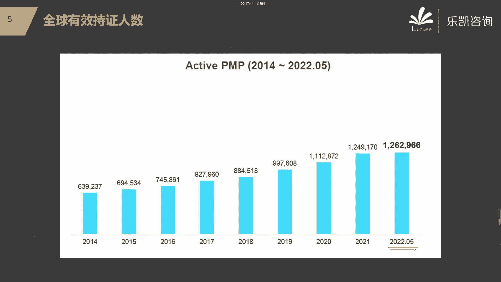
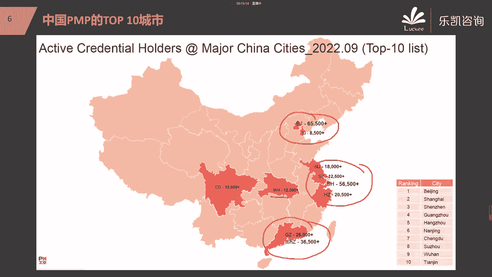
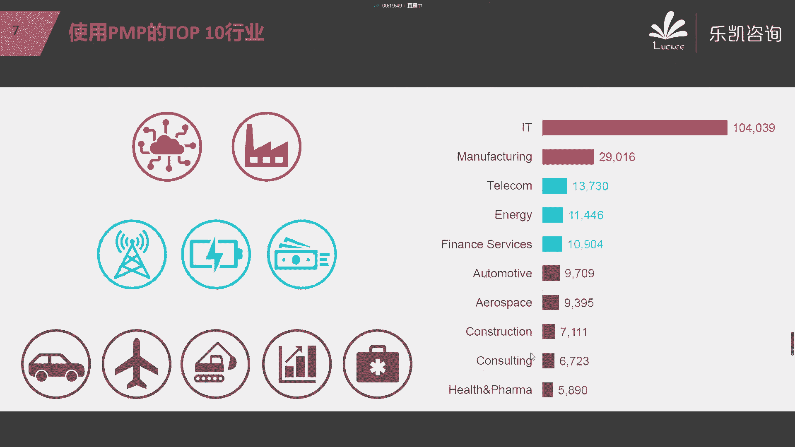
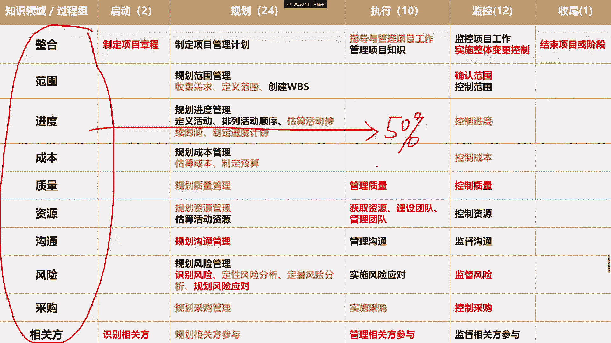
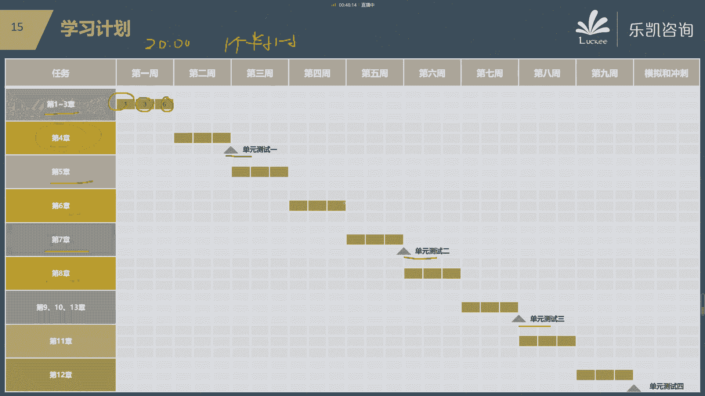
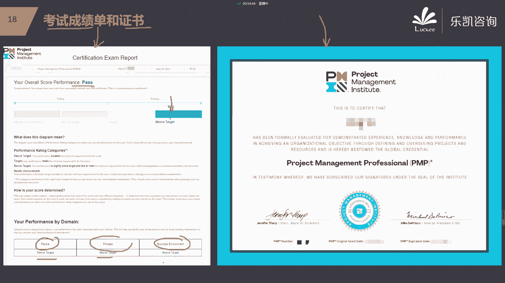

# 2024年PMP认证考试课程针对PMP新考纲最新免费零基础也能轻松听懂 - P1：PMP前言：备考PMP前，你一定要了解的内容 - 乐凯咨询 - BV1Rj411G7gs

好各位同学大家好，欢迎大家来参加这个我们3月份班的启动课，好吧，那么今天晚上呢其实主要的目的呢，就是给大家介绍一下，我们关于PMP的一些学习的内容，包括后续的一些学习的计划，然后呢也让大家尽早的熟悉。

用钉钉这样一种直播的模式好吧，所以我们今天晚上呢其实不是一个正式的课，他的内容很少，我们呢主要先介绍一下什么叫PMP，然后让我们的培训内容包括哪些，然后我们后续的学习计划是什么。

以及我们通过这一次的培训，我们的真正的一个学习的目标究竟是什么，这个要跟大家说一下的好吧，那么首先我们看一下关于PMP的一些介绍，那么大家在报名学习PMP之前，应该多多少少对PMP有一些了解对吧。

那么PMP呢实际上是一个缩写，它的全称叫项目管理专业人士资格认证对吧，Project management professional，那么这样一个项目管理专业人士的资格认证。

是由美国的项目管理协会PMP，他推出来的一个认证，啊不要问是不是录播，是不是直播对吧，我觉得有人在纠结录播的问题，只能说明直播的效果太好了，今年是22年12月3号对吧，我们的启动很好吧好。

那么美国项目管理协会PMI推出的这个认证呢，是一个项目管理的认证，那么我相信大家呢多多少少，应该也听说过其他的一些认证，他推出了一个叫普斯特的认证，对吧，然后我们国内也有我们各行各业的。

项目管理的资格认证，比如说我们it行业在我们国内有软考，我们的建筑业，在我们国内有一建二建对吧等等类似的认证，包括我们有敏捷的认证，那么这些认证跟PMP认证相比，它最大的不同点。

PMP最大的不同点是什么呢，其实呢我觉得最大的不同点就在于PMP的认证，它的推广的力度很强，而且他的认可的程度也很高，这个认证在全球的190多个国家和地区，得到了推广对吧，可以说从认可度上来说。

这个认证是认可度最高的一个认证，从全球范围来说好吧，那么在现在我们学习PMP的人数逐年在增加，从2014年的63万，一直到今年的5月份统计下来，在全球有效的执政人员应该是126万。

那么实际上这个是5月份的一个数据，那么我前两天接到PMI的数据，截止到10月份。

应该是有129万有效的执政人员，那么大家可以想一想，这129万有多少，在我们国内，其实我们中国的占比是很大的，在我们中国有34。92%，就是在这129万里面啊，在我们中国有34。9%万。

那么我们中国拥有这个PMP证书的这些人员，主要分布在这么一些城市，比如说北京，天津这个区域，包括我们的长三角，特别是上海这一块，对比上海杭州苏州南京，那么包括珠三角，广州深圳啊，包括华中地区的武汉。

包括成都这几个地方，实际上考的人数非常多的，那么为什么很多人要考这样一个认证呢，啊我相信很多人会有这样一个疑问，就是说这个认证究竟为什么考的这么多，因为我们每一个人都处于可能不同的行业对吧。

那么这个认证他是怎么样去，有利于各个行业的呢，那么实际上这个认证，它并不是针对于哪一个行业来讲的，比如说有的同学说我没有做过开发啊，我不是做技术的啊，我是制造业的啊，我是这个建筑业的。

我能不能考这个认证，其实都是可以考的，因为这个认证呢，他是把项目管理里面一些共性的地方。

把它抽出来，形成了一个知识体系，那么我们也通过统计了解到，目前来说用这个认证用的比较多的行业，这十个行业是最高的，当然是it行业用的比较多对吧，那实际上比如说制造业，包括我们的通信行业，能源业。

包括我们最近这几年，我们发现像咨询医疗卫生，包括还有我们的汽车行业，实际上考这个认证的人特别的多好吧，那么接下来我们介绍一下，我们这次培训的一个主要的内容。

那么我们这次培训呢，它主要的教材是以这个教材是以这个为主的，叫PMP，那么PMP呢，就是大家很多同学已经收到的那一本，我刚刚看到很多人评论对吧，说这辈子都他娘的，没看过这么厚的一本书对吧。

那么那本书叫什么呢，叫PMP，叫项目管理知识体系，Project management，Body of knowledge，那么这本书确实很厚，那现在呢我们已经更新到第六版。

所以大家拿到的教材是第六版的教材，就是这一本，那么这是我们上课的时候主讲得一些内容对吧，那么我们这本教材里面主要包括了什么呢，好它主要包括了五大过程组，十大知识领域以及49个子过程。

那么我相信大家在了解PMP之前啊，很多人应该听说过什么叫五大过程组，什么叫十大知识领域，什么49个子过程对吧，那实际上这本书呢你会发现1~3章，他讲的东西都是一些比较基础的概念性的东西。

那么从第四章到第13章，它是按照知识领域的角度来讲的，那么我大致给大家介绍一下，这十大知识领域主要在说什么，好吧，比如说我们第四章整合知识领域，它实际上是站在一个稍微高一点的层次，站在一个整合的角度说。

最终我们项目应该怎么去做，启动规划，执行监控收尾，然后接下来从第五章开始，他就会把项目管理里面的每一个方面，都详细的去阐述清楚，比如说关于范围，那么这个知识领域他就会介绍我们做项目。

首先要知道我们要做什么，那么也就是说范围在说什么呢，再说我们客户的需求怎么去收集，收集完需求之后，怎么样跟客户确定我们要交付什么成果对吧，然后这些成果怎么去分解，那么为什么他首先要讲范围，要明确。

我们一个项目首先要明确我们要做什么呢，因为很简单，范围是所有东西的一个基础，因为只有我们了解了我们这个项目要做什么，接下来我们才能够去估什么呢，估我们这个项目的工期有多长，那么所以接下来讲完了范围。

我们就会介绍我们项目的进度是怎么来的，怎么样去给一个项目排进度的计划对吧，所以进度他会详细的描述，我们这个项目大概要做多久，对吧，然后接下来我们明确的项目要做多久，要投入什么样的资源。

我们就可以去估计我们这个项目的成本，大概需要多少对吧，那么这就是我们这个项目相应的预算这一块，那么成本就告诉我们，这个项目大概我们做下来要花多少，那么这三块就是我们所谓的范围进度成本。

也是我们项目管理当中的铁三角对吧，然后接下来第八章会介绍，除了关注范围进度成本以外，我们还要关注质量，而我们怎么样去管我们的缺陷，质量跟什么有关，其实质量就很大程度上取决于我们的缺陷。

怎么样去把它给尽量的减少对吧，所以说质量它会告诉我们我们如何去规划，如何去啊进行后续的一些管理，那么关于这一块啊，我希望大家呢稍微注意一下，没有学过项目管理的，可能有一些想法是不对的。

我在这里考一考大家啊，说到质量，一个项目要保证它质量要做得好，大家能想到最直接的手段是什么，我们在上课的时候，这个问题我问过很多的同学对吧，很多同学都告诉我说到质量想到什么呢，想到这个东西。

我们在做项目过程中要多检查，要多测试，对比如说我们软件行业要测试，我们的制造业，我们要检查，不管是啊一般的检查也好，还是说东西很多，我们用抽检的方法也好对吧，但是实际上大家要注意，我们学完了PMP。

你们你就会发现啊，质量从来不是靠检查得到的，质量应该通过什么来保证质量，我们应该通过良好的设计和很好的过程来保证，质量，不是靠检查和测试出来的对吧，那么为什么说我们在质量这一块，我们非常强调过程的管理。

我们非常强调，可能有的同学听说过这个词叫QA对吧，为什么我们说流程很重要，我们一定要去遵守相应的流程，其实大家可以想一个很简单的道理，我在讲质量的时候就问过大家一个问题，我说肯德基跟麦当劳。

在我们全国开了那么多家门店对吧，那么你想一想，为什么我们去任何一家，肯德基或者麦当劳的门店，我们吃到的东西它的味道也好对吧，或者说它的环境也好，它的各方面基本上都差不多，他是怎么能够做到这一点的。

实际上它很大的程度上取决于什么，取决于它有一个非常标准化的一个流程对吧，那么也就是说只要你过程是遵守相应的标准的，那么你的质量就应该会做到什么样一个程度，而不是靠后续的检查和测试来保证我们的质量。

好吧好，那么接下来第九章我们会讲资源管理，那么资源管理什么叫我们项目管理的资源呢，其实资源它包括人力资源，当然也包括实物资源，那么实物资源，就比如说我们做项目所需要的材料设备。

那么很显然第九章的重点在于什么呢，第九章的重点在于人力资源，也就是说他会告诉我们怎么去带我们的团队，对吧，从我们团队最初怎么去组建，然后接下来怎么样去进行团队建设，让我们的团队的绩效提高。

包括当团队中有一些问题的时候，有一些冲突的时候，我们怎么去处理，那么在第九章我们都会详细的学习到好吧，然后第十章再讲沟通，我们项目中沟通会很多，那么沟通主要是在说什么呢，我们的信息怎么去传递。

而我们怎么样去制定我们的沟通计划，怎么样去跟别人去沟通，然后第11章会介绍我们的风险管理，那么在我们项目中，风险也是很重要的一个部分，我们俗话说叫有钱难买，早知道对吧，唉早知道怎么怎么样。

早知道怎么怎么样，实际上这意味着什么，意味着我们对风险的管理不是太重视，那么第11章会告诉我们，我们一个项目怎么样去合理的管好我们的风险，对吧，怎么去识别，怎么去定性定量的分析，怎么去规划应对，好吧好。

然后第12章再讲采购好，这一章是比较特殊的一个章节，那么为什么说这一章比较特殊呢，因为其他的章节基本上都是站在乙方的角度，那么我不管大家有没有做过项目吧，我觉得大家应该听说过这种说法对吧，甲方乙方。

那么其他章节主要是站在乙方的角度说，我们怎么样服务于客户，我们怎么样把这个项目做出来，怎么去交付给客户对吧，但是在做的时候，我们会发现有一些东西，我们公司本身是不生产的，唉比如说我们给政府做项目的时候。

要做一个信息化的项目，我们的服务器交换机是不生产的，那这个时候怎么办，那么这个时候就需要找一个人，什么人呢，大家应该听说过叫供应商对吧，那么我们要选择供应商去采购对吧。

那么这个时候我们就站在了一个甲方的角度，我们比如说要通过招投标的手段来选择供应商，然后接下来还要对供应商进行合理的管理，所以第12章是一个很特殊的章节，因为它站在了甲方的角度。

在告诉我们我们应该怎么样去做招投标，怎么样去选择供应商，包括我们后续怎么样去管理供应商的绩效好吧，然后最后第13章讲得是相关方，那么什么叫相关方呢，在老版本里面叫干系人，叫干系人好吧。

那么其实相关方就是指跟项目有关的各方唉，不管你是受项目影响还是能影响项目的，它都叫相关方，那么第13章，这个章节也是比较重要的一个章节，那么我也希望大家在学习的时候要多去思考。

那么为什么说这一章很重要呢，因为我这么多年做项目的经验，告诉我一个项目怎么样才能算成功，搞定所有的人，让所有的人都基本上能够满意，那么这个项目就算成功的，我们的项目当然会交付一些东西给客户。

但是最终我们要获得客户的认可对吧，而且最终用我们这些成果的也都是客户，所以说怎么样去管理相关方的期望，怎么样让相关方参与进来，怎么来提高相关方的支持，这对我们都是比较重要的，所以第13章。

他会详细的去讲相关方的这些内容好吧，那么这是我们这本书的主要的内容，那么有人说我们就学这些内容吗，这些内容已经很多了对吧，但是呢告诉大家，这些内容在考试的时候占比是多少呢。

这些内容在考试的时候占比是50%，只占50%，那么还有50%是什么，那么如果说偏僻这一套啊，我们给它一个名字叫预测型，用计划来驱动的，那么还有50%。

他考的是敏捷的内容，那么敏捷是一种适应性的一种做法，那么有人说什么叫预测型，什么叫敏捷，适应性对吧，我举个例子啊，我之前呢曾经问过我的一些同学，我说我们吃饭呢我们对比两种啊，一种是我们去吃这种叫婚宴。

啊比如说我们有朋友或者有亲戚结婚对吧，我们去参加婚礼，那么肯定要参加婚宴了，肯定要吃个饭啊对吧，那么还有一种呢，就是我们找一个地方去吃自助餐，好问一下大家吃婚宴跟吃自助餐，它的区别在什么地方。

大家能明白这两种吃法它的区别是什么吗，唉有人说敏捷就是快，其实这个说法呢不正不正确，啊有人说婚宴要给钱对吧，好像你吃自助餐不用给钱一样都得给钱啊，他最大的区别是什么啊。

你们有没有发现我们去吃婚宴吃的东西，它是事先有一个计划的，对吧，婚宴他吃什么，他都是有事先的计划，他计划好的，比如说我们亲戚朋友在举办婚礼之前，他一定跟酒店他已经定好了，他的一桌的标准是什么，对吧。

唉有几个热菜，有几个凉菜，然后一桌大概是什么样的一个档次，它都已经定定好了，然后接下来我们去参加婚宴，实际上是用什么来驱动，其实很大程度上是用计划来驱动，你坐下来先上几个菜。

然后接下来他又陆陆续续上几个菜，这些菜都是事先计划好的，那么问大家一个问题了，假如说我们在座的没有结婚的同学，将来在办婚礼的时候发现了一个问题，好像我订的这个酒店了，他的菜的分量很少对吧。

我感觉大家的吃的好像都不太够啊，我想临时加几个菜，那这个时候你觉得麻烦不麻烦，那么这实践呢就是我们用计划来驱动，遇到的一些问题，那么我们如果说在进行婚宴的时候发现菜不够，我要加几个菜，可不可以呢。

当然不是说不可以对吧，但是呢我们肯定要去走一些流程对，比如说我们要去跟酒店方去协商，唉我们感觉菜不够，我想加几个菜，那么原来一周的预算是多少，由于你加了，比如说两个菜或者几个菜。

那么所以导致我们每一桌的标准，可能会发生一些变化啊，我们要加多少钱，怎么怎么样对吧，他肯定是需要经过这样一个操作的，那么这是我们计划驱动的一种特点，当然我们外面大部分项目，包括我们的传统项目。

比如说我们的建筑业，制造业，包括我们像我以前做的政府的信息化的项目，基本上都是用计划来驱动的，那么用计划来驱动它的好处是什么呢，它的好处是比较可控对吧，而且比较能够清晰地了解项目的绩效。

那么自助餐它是什么特点呢，你们会发现我们现在还有一种项目，可能我们以前没有做过对吧，比如说我们常见的一些创新的项目，那么这些创新的项目我们之前完全没有经验，没有做过。

甚至我也不知道我们这个东西放到市场上，客户的反应怎么样，人家愿不愿意用我们的产品，所以这个时候我们可能用计划来驱动，说事先做一个计划，这个就不太可行了，那么这个时候我们怎么办。

我们可能就需要用敏捷的方法去做对吧，那么敏捷的方法用这个例子来说，就有点像吃自助餐，那么敏捷，它不是用计划来驱动的，大家知道敏捷用什么来驱动吗，唉就像宋志强说的，那么这个时候我们应该用什么来驱动呢。

我们一个创新的项目，希望他得到客户的认可，那么这个时候很大程度上我们要用价值来驱动，就哪些东西是价值最大的，或者说有的同学说客户最需要的对吧，能解决客户痛点了等等，实际上最终就是用价值来驱动了。

哪些东西的价值最高，我们就优先去完成什么，我们用小步快走的方法来实现，那么这个就很像什么呢，很像吃自助餐，比如说如果我们去吃自助餐，你会有什么计划吗，其实我没什么计划对吧，我一般是看什么呢。

去选那些最贵的价值最高的先吃，比如说海鲜对吧，平时在家舍不得吃啊，你吃什么，很少有一些同学说我去吃一些什么蔬菜呀，吃一些什么寿司啊，基本上都是吃最贵的，价值最高的对吧，好这个吃完了之后。

接下来再选什么呢，再选剩下的菜里面价值最高的对吧，1。1点的去小步快走，用价值来驱动，那么这是一种另外的知识体系敏捷，那么我们在讲课的过程当中，还有50%的内容，50%的考试内容是来源于敏捷。

所以我们在PMP学完了之后啊，我们会完整的讲敏捷的这一套东西，包括我们敏捷的宣言对吧，包括我们敏捷的12原则，这个实际上是希望大家能够认真去理解的，当然敏捷的实践我们也会着重的去讲。

那么我们着重会讲敏捷，实践当中的比较成熟的这一块叫scream，也是我们考试中的重点对吧，包括com里面的3355，三个角色，三个弓箭，五个世界五大价值观，那么除了SRAM以外。

我们会顺带的去介绍一下我们的看板啊，敏捷的另外的一些实践，比如说看板啊，比如说极限编程，那么这些我们都会有一些内容的涉及，那么这一块内容在考试中占50%，那么有人说我知道有同学会提出两个问题啊。

我这里一起解释一下，第一有人说敏捷有没有教材，那么我跟大家说一下，敏捷设计的教材很多，但是PMP当中考试的敏捷，它没有专门的对应的教材，那么我希望大家以我们的讲义为主好吧，因为我们讲义上。

实际上是介绍了我们敏捷的大部分内容，包括他对考试的内容是有一些侧重的，好吧，这是第一个，第二个呢有人说敏捷的内容，我看课表上好像排的不多，这是为什么好，我说一下啊。

因为完整的敏捷的培训一共也只有两天的时间，那么如果说我们只是介绍这些东西，实际上本身的内容确实也不太多，那么有人说，这一点内容为什么能占到50%呢，它的题目不是很多吗，虽然他的题目很多。

但是它的考点并不多，我不知道这边有没有11月份延期的同学啊，我们11月份延期考试的同学应该做过了，模拟二，模拟三，模拟四和模拟五，大家会发现当时我们在做模拟234的时候，有很多同学分数很高。

但是做到模拟五呢，反而风速会有降低，最大的区别在什么地方，就在于我们这三套模拟234的模拟，也就是跟考试很类似的，有50%的敏捷的这种卷子，大家其实反而分数会做得高，为什么呢，因为敏捷他知识点比较少。

翻来覆去，就是那些，而模拟五呢很大的程度上的题目，实际上是我们刚刚讲得PMP里面的，预测性的题目，那个呢反而会难一些，所以说大家对敏捷这一块，我觉得不要去担心什么好吧，后面我们的讲解和我们的练习。

已经足够应付考试了，已经大大超出了我们考试的要求好吧，那么至于有同学说的，要不要去买课外书，要不要在外面去买题目，我只能说都不需要，不要去浪费这个钱了，没有必要去浪费好吧，跟着我们的节奏就可以了。

好然后接下来考试是由这两部分构成的，每个部分各占50%，那么接下来我介绍一下考试的一些内容好吧，那么我们最终考试是这样的，考试时间是230分钟，230分钟，将近四个小时好吧。

然后考试的形式呢是在我们国内对吧，是笔试的，也就是说我们要涂答题卡的啊，要涂答题卡，那么考试的语言，有人说这是一个美国的PMI的认证，他会不会对英文有要求，没有要求，因为考试的时候是中英文对照的啊。

中英文对照的，那么考试的题型呢我跟大家说一下，首先呢人家是纯粹的项目管理的考试，所以呢题型也比较简单，全部都是选择题，都是选择题，那么题目呢它分为单选题和多选题，那么一共是180道题。

那么这180道题里面，多选题大概有多少道啊，多少选题大概是10~15道多选题，对吧，有人说这个多选难不难好，我给大家看一下例子啊，左边的是单选题，右边的是多选题。

那么你会发现为什么说英文好不好不是很重要，因为每一道题目他都是有中文跟英文两种的，两两个两两个说明了对，比如说一道题，他首先用英文描述一遍，然后再用中文去描述一遍，所以说你的英文好不好。

其实呢不是太重要，当然我承认啊，题目的中文的翻译不是很好，但是呢这个英文啊不是很重要，大部分题目呢还是可以，可以说没什么问题的好吧，那么这是单选题和多选题的，它形式都是有中英文的。

那么另外多选题他做了一件事，他会告诉你这道题有几个正确答案，比如说这道题目，不管是在英文的部分还是在中文的部分，都告诉你了，请你选几个选项，那么这个难度就大大降低了，明白吧，就是说人家告诉你了。

你选四个，那么你就去选四个，你不要选三个，也不要选五个对吧，他告诉你选两个，那么你就选两个，明白吗，所以说多选题，那么到这种程度来说，实际上我觉得难度呢也不是太高，也不是太高好吧。

那么这是多选题和单选题的形式，那么大家了解了就可以了，好，那么这180道题里面有五道题是不计分的，那么什么叫不计分呢，其实很简单，就是它里面有五道题，你做对了也不得分，做错了也不扣分，明白吧。

也就是说真正记分的实际上是175分，那么有人说考多少分算通过，那么正常来说啊，我们建议大家，最起码最低最低要考到110分以上，因为175分的60%，差不多是105左右对吧，然后再加上五道不计分的题目。

那么一共是110分，那么后续在模拟的时候，最低要求一定要超过110分，实际上到后面大家的要求应该定在120好吧，那么有人说不计分的题目它的意义是什么，哎呀这个呢其实很简单啊。

大家猜一猜这种考试他的题库要不要更新啊，他的题库肯定要更新啊，他不可能翻来覆去的都考这些题目啊，那这个题库的更新通过什么来更新呢，我不能随随便便拉一道题就放进去啊，好那么这些题目作为不计分的题目。

陆陆续续地加在考试里面，他也要通过考试的结果来检查，这些题目的质量怎么样，哎如果说这些题目的质量可以，那么就把这些题目再纳入到题库里面，实际上更多的是出于什么呢，出于更新的一个目的好吧。

那么这五道题是哪五道题呢，谁也不知道，明白吧，谁也不知道，就是你180道题目都是一样的，你也不知道这些题目哪五道题是积分的，或者是不计分的，好吧好，那么接下来考试在什么地方考试，考试是就近月考的。

那么我解释一下什么叫就近月考，这个考试是全国统一考试的啊，除非有疫情，部分地区可能不考，那么正常来说是全国统一的时间考试的，那么在各地都是有考场的，比如说如果你是成都的，你就选择成都的考场好吧。

如果你是上海的，就选择上海的考场，如果你是北京的，就选择北京的考场，明白吧，唉你在什么地方，你就就近选择考场去考试，那么时间都是统一的好吧，我刚刚说过考试是笔试啊，虽然都是选择题，但是要涂答题卡的好吧。

那么这是考试的相关的内容，那么刚刚我在讲的时候，有同学这个在问，那么我们后续的学习怎么去学，我们从这个下周一开始啊，下周一开始我们开始正式的开始PMP的讲解，那么我们的这个讲解呢。

一周一般来说是三次好吧，那么周一周三和周六都是晚上的八点钟开始，那么每一次的课呢一般来说是一个半小时，因为太长了之后呢，大家呢可能也坐不住对吧，那么下一周我们会讲1~3章。

那么1~3章呢它是一些基本的这个概念对吧，然后接下来再下一周你会发现，基本上我们一周就是讲一章内容，一周就是讲义一章的内容，那么这样安排我希望大家能够做到什么呢，其实一周去学一章的内容啊。

这个压力是很小的，那么大家有很多的时间去干什么呢，去好好的去巩固对吧，所以我希望大家每一周的内容，大家一定要把它掌握好，当然我们在中途会安排单元测试，做一些阶段性的考察。

那么如果说大家阶段性的考试成绩不理想的，那么一定要认真的去对你的薄弱的环节，去好好的巩固一下好吧，那么有人说，如果说136我没有参加，那怎么办，那么很简单，后面有录播的，包括我们这节课上完也是有录播的。

大家可以去看好吧好，那么PMP课的内容我们讲完了之后。

接下来我们会讲敏捷的内容，包括我们会对PMP和敏捷的内容做一个复习，然后给大家讲解解题思路，然后我们还有四次的模拟对吧，一般来说是3~4次的模拟，然后接下来讲解考试注意事项，那么大家就可以去参加考试了。

好吧好，然后这个二维码是我们上课的日历好吧，大家可以去用钉钉，扫这个二维码去订阅这个日历，那么你到时候在钉钉上就能够看到，什么时候有课，那么这节课主要是讲什么，明白吧。

那么有人说能不能讲一讲之前考试的一些情况，这个呢不能讲对吧，我知道很多同学关心通过率的问题，因为为什么不能讲呢，前两天呢这个已经上级主管单位联系我们，不允许公布通过率。

但是呢我希望大家不要去担心这个问题，好吧，这个11月份考试的同学考过的，你们如果说有时运会延期的，应该在群里面看到他们的反馈了对吧，听我的就不会有错了是吧，我平时告诉你们要重视哪些地方，包括这个模拟题。

哪些地方，哪些题型是要注意的，大家一定要听进去，不要到最后难出问题，就是有个别同学考完了之后后悔啊，我好后悔没有听这三套模拟题的讲解呀对吧，我这个怎么怎么样，哎呀有钱难买，早知道啊对吧。

那尽早做好风险管理啊，你们该做的事情要做好啊好吧，所以这个东西呢不要去担心啊，这个考试的这个通过率，我觉得不是什么太大的一个问题好吧，那么刚刚有同学说，那么这个什么以前的5A啊，包括现在的3A啊。

是什么意思好关于这个问题让我回答一下啊，这个考试呢考试的题目它主要分为了三大块，一块是主要考人员方面的，比如说跟团队怎么去管理，比如说对相关方的管理等等，那么还有一块是考过程的，还有一块是考业务环境的。

那么这三大块它题目的数量占比是不一样的，人员占42%，过程占50%，业务环境占8%，那么这三块呢你最最终考多少分，他是给会给你打等级的，明白吧，那么什么叫A呢，A就是指你这一块题目做得很好。

叫above target，高于目标T呢就是正好达到目标，B呢就是低于目标N就是有待提高对吧，所以他会看你人员过程，业务环境这三块，他的题目分别做得怎么样，那么假如说你人员这一块做得很好。

过程也做的很好，业务环境也做的很好，那么你这三块都达到了A的标准，那么你的成绩单上最终的结果就是3A，3A那么现在PMP最好的成绩就是3A，那么以前呢是分五大过程组的维度去考察的，所以它有5A这个说法。

那么现在由于只考察这三个维度，所以最高的分数就是3A的分数好吧，但是呢我想提醒一下啊，你的最终的成绩不管是显示着什么，它跟你的通过和不通过没有直接的关系，也就是说你的成绩是什么等级。

其实他并不能完全决定你通过还是不通过，最终决定你通过不通过的是看什么呢，还是看风俗，比如说我举一个例子啊，大家看一下绿色的，比如说绿色的这个同学啊，我给它取个名字叫小绿同学。

小绿同学的成绩是一个T1个B1个N，对吧，那么红色的这个小红同学呢也是一P1BEN，两个人的等级是一样的，但是有可能小绿同学他通过了，但是小红同学呢他没有通过，大家知道为什么吗，唉大家成绩都是一样的。

都是1tb应，为什么有人通过了，有人没有通过，对了大家会发现有一个什么问题啊，小绿同学这个TT在什么地方，他T在过程，而过程的占比是50%，也就是差不多有90道题，说明他对的题目是比较多的对吧。

那么小红同学呢他也有一个T，但是它的占比，它这个替在业务环境，它的占比只有8%对吧，那么它的题量就很少，即便你做的很好，那么你对的题目也不太多对吧，所以说最终决定大家考试通过还是不通过的。

实际上还是取决于大家能够对多少道题目好吧，那么这个等级呢，实际上考试的成绩就是给大家看一看的，那么我可以给大家看一下，最终考试完了之后会收到两个东西啊，一个是成绩单，一个是证书。

那么只要你通过的都会有证书，大家的证书都是一样的对吧，那么另外呢大家还会收到一份成绩单，比如说这份成绩单，就是我们以前学习的一个成绩单，你会发现它会告诉你你的结果是通过对吧。

然后接下来你的位置在什么地方，然后你三个部分人员过程，商业环境分别得到了什么等级。

那像这张成绩单就是三个都是A，所以叫商3A好吧，那么最终反正是证书呢都是一样的，证书都是一样的好吧，那么我在这里跟大家说一下啊，在讲课之前，我看到有很多同学在聊天啊，有人说我们要好好学习啊。

我们要一次过，我们要怎么怎么样对吧，我觉得呢我今天要特别强调一下，关于我们这次培训的一个学习的目标，那么关于这个学习目标的问题啊，我首先要说一说这个证书的问题，虽然我是做PMP培训的。

但是我可以告诉大家，这个证书其实并不是一个什么身份的象征，我从来不喜欢这么去宣传，我反而觉得这个证书是一个什么呢，是一个项目管理的一个准入的一个门槛，这个考试也不是一个人才的选拔性的考试对吧。

你会发现通过率这么高，说明这个考试是一个什么考试，其实它不是一个人才选拔型的考试，否则不可能通过率有这么高对吧，所以我跟大家说啊，我们这一次培训不要把目的放在哪一张证书上，甚至我知道有同学在说啊。

我以前有一个同事，我有一个朋友也报道乐凯，我看他平时也不怎么学习，对吧啊，就考前冲刺了一下，做了几道题也过了，其实我觉得这个过是没有什么意义的，你们有没有发现啊，同样都是有证书的。

为什么有的人还是住高楼，有人住深沟，有人光芒万丈，有人一身锈啊，同样是有证书的对吧，你要说这个证书，不要跟我讲什么含金量不含金量的事儿，我们就不要说偏僻的证书啊，我们就说这个证书。

我们本科毕业学士学位证书，你说学士学位的证书含金量高不高，肯定比PMP的证书要高多了对吧，但是都有学士学位证书，为什么每个人的发展是不一样的呢，实际上我们要看出的不是要看重的不是证书。

而是你在这个过程当中，你能够得到什么，你能够学到什么，这才是这个培训的意义，好吧，所以接下来我跟大家说一下我们正确的目标，或者说我们通过这次的学习，我们应该得到什么，我觉得应该得到这么几个方面，第一个。

从刚刚的上课之前的大家在聊天的过程当中，我发现有的人他现在还不是项目经理，很多人是做技术的对吧，那么做技术的就会遇到一个问题，对威胁是做技术的很明显会遇到一个问题，就是随着年龄的增长。

你可能在技术这条路上很难走下去，很难走下去对吧，而且技术这一块啊，对待像我们40来岁的人很不友好，那么这几年疫情的原因对吧，你们有很多公司日子都不好过，比如说这个我曾经就职过的一家公司。

很大的一个几千人的上市公司啊，说裁员就裁员，对吧，连声招呼都不会打，马上就宣布裁员，那么我就在想，那么我以前那些做技术的同事，30多岁，40来岁的，那么这个时候如果被裁掉了之后。

用这个年龄再去找一个技术性的工作容易吗，他其实是很不容易的对吧，所以其实有很多人早就在准备做一件事，做什么事情呢，转型对吧，那么最常见的就是什么呢，技术去转管理去转管理。

因为管理这个职位相对来说对年龄来说呢，它的容忍度要高一些，我见过40多岁的项目经理，但是40多岁的技术呢说实话不太多见对吧，所以我们有很多同学来学习是为了促进转型的，我觉得这是一个很好的一个目的对吧。

那么我们转型的时候，你会发现，如果我以前是做技术的，我要去面试项目经理，我最大的问题是什么，其实我最大的问题是我没有管理经验，那么你们有管理经验，你怎么办，你就要做一件事，在你转型的时候。

你就要装得自己很有经验对吧，那么你怎么装成很有经验的样子呢，你也不能面试的时候瞎扯呀对吧，那么理论的学习，其实是一个对转型很有帮助的一个手段对吧，你学了PMP之后，你大概知道啊，项目管理应该怎么去管。

然后接下来再去看一看我之前做过的项目诶，那个项目有什么地方是做得不错的，有什么地方是做得还不够的对吧，你把这一块搞清楚了，那么面试的时候你也有的说呀对吧，所以我觉得这个对转型这一块。

是有很大的帮助的好吧，那么有的同学说，那么我现在已经是项目经理了，那么我来学这个，那么我应该要达成什么目标呢，好那么如果说大家已经是项目经理的，通过项目管理的，那么我希望大家通过PMP的学习。

对项目管理的整个知识体系，要有一个全面的了解啊，我们以前呢可能你会发现啊，有很多同学说到什么地方呢，他说诶这个好像我之前也接触过，也了解，只不过我不知道他这样一个专业的说法。

只不过我不知道他们之间相互的关系对吧，所以通过PMP的学习，我希望大家借这个机会，对于整个一个管理体系要自己做一个梳理，唉，他这个体系究竟是怎么样，一步一步把这个项目把它管好的好吧，这是第二个目标。

那么第三个目标就是，我希望大家通过PMP的学习，在将来的项目管理的路上，能够尽早的跟客户，跟其他的相关方去建立信任，这也是我们学习PMP的一个目的，学了PMP之后，我们可以提升自己的专业形象。

尽早跟客户建立信任，我们有很多同学说学了PMP之后，对唉我开会的时候，或者说我在这个公司内部交流的时候，我说了之后啊，很多其他同事都不敢说了，那为什么呢，因为你说的一些词啊很专业，对啊。

说的好听点叫很专业，说的直白一点就是你学的偏僻之后，你说的一些词呢逼格很高，比如说你跟客户在开会的时候说，哎呀你提的这个东西啊，属于变更，我们要走变更流程去处理对，比如说你在公司内部在立项的时候说。

哎我们要做一个成本效益分析等等等等对吧，那么你想一想，你说的这些东西说出来之后，会给人一个什么感觉，别人会觉得哎哟这个人好像不错呀，好像是一个内行，其实他听懂了吗，其实他也听不懂。

但是大家要知道他听不懂他能怎么办，他只能点点头，你说得很有道理，不就这样吗，是不是，那么我们将来做项目的时候，我们会遇到很多的人，比如说我们要跟客户打交道，那么我们要跟监理打交道，我们国内做项目啊。

我们要跟监理打交道，我们要跟戴甲方打交道对吧，那么客户他不懂，他会感觉到你很专业，那么那些懂的人呢，对比如说监理，比如说戴甲方等等，这些懂的人，他听了之后会有什么感觉。

他会觉得诶这哥们儿好像挺有经验的对吧，那么给人这样一种感觉之后，就有助于什么呢，有助于尽早的建立信任，建立信任，那么一旦相关方对你比较信任，那么你后续的一些工作就比较好推进明白吗。

那么如果说你跟客户在谈的时候，不要说你说的东西，客户听懂啊，反过来客户和监理他们说的东西你反而听不懂，那么这个时候就会给别人一个什么感觉呢，就会给别人一个感觉，这哥们儿好像不靠谱对吧。

那么他们就很容易用一个什么方式来跟你，沟通呢，就我看到的很容易用上下级的方式来跟你沟通，唉比如说给你提要求啊，你帮我做这个，你帮我做那个，这对我们项目管理后续就比较被动对吧。

所以通过这个学习可以去提升自己的专业形象，尽早的去建立信任对吧，包括树立自己的个人品牌好吧，那么最后一点，我觉得我们要通过这个过程的学习，要能够形成一些社区对，比如说我们要认识很多的同行。

我们要认识在群里面啊，比如说诶正好大家都是一个地方的，可以去了解一些资源，我曾经就遇到我们很多的同学啊，他在跳槽的时候，实际上是通过我们的学员去内部推荐的，我们已经遇到很多这样的成功的案例了，对吧。

哎正好我想去哪个公司，正好我们乐凯这边诶，有同学在那家公司，其实这个是很有好处的好吧，我觉得我们学习的真正的目标，其实应该是这几个目标好吧，那么考试当然最终我们也要应付考试，那么应付考试大家不要担心。

我们通过后续的复习和冲刺，我觉得应付考试问题都不大，那么关键是大家在这个过程当中，一定要有很好的收获好吧，那么所以为了帮大家能够达成这些目标，在星期六大家这个地方听一下啊，为了帮助大家达成这些目标。

在星期六晚上我们不是八点钟开始上课吗，八点钟我们上到差不多是09：30一个半小时，那么在这一节课结束之后，我会额外再多开一节课，那么多开一节课讲什么呢，讲我们真正做项目中涉及到的一些文档。

包括我们遇到的一些问题，他跟PMP之间它的对应关系我都会讲得，那么在讲得时候，我会把我曾经做过项目，做过的项目，因为我做了很多项目，那么其中也有一些项目呢，是在国家这边拿过奖的，比如说这个项目。

应该就是我在成都做的一个国家的示范性项目，好吧，那么我会把这些项目的一些相应的文档拿出来，那么从第四章开始，整合管理开始，讲完了之后，我们在星期六晚上会额外再多开一节课，讲项目管理的实践。

那么每个星期我们学到什么地方，那么一般来说我的实践就会讲到什么地方，那么到时候呢大家可以看一下对应的文档，它应该怎么去写，包括我们项目管理当中一些常见的一些问题，我们怎么去解决好吧，因为PMP里面。

它大致的只会说我们正确的流程是什么，但是实际做项目比理论要复杂得多，对吧啊，很多同学这个曾经说过对吧，我跟客户讲道理，他跟我耍流氓，我跟客户耍流氓，这小子又跟我讲道理对吧，他他都有他的说法。

那么当客户提出一些无理的要求的时候，我们怎么通过一些PMP里面介绍了一些手段，来解决这些问题，那么这一部分呢它不是考试的内容啊，它不是考试的内容好吧，他不是考试的内容，所以说大家呢自己看情况。

如果说你星期天没什么事儿啊，如果说你有兴趣的，那么你星期六在讲完课之后可以去听一听，我相信呢，这一块呢对大家以后做项目管理是很有帮助的，包括说对转型的同学，将来的面试，我觉得也是很有帮助的好吧。

因为面试当中基本上常见的问题，也是问这些刁钻的问题好吧，所以说我会通过这样一个方式，来帮助大家来达成这些目标，好吧好，然后最后我说一下，我们后续学习的一个注意事项好吧，第一个啊。

我希望大家在下个星期开课之后，一定要做好复习工作，一定要做好复习工作，好吧，那么有人说我要不要预习，那么预习呢你有时间就去预习一下，没有实践呢，实际上呢我觉得也没有什么太大意义。

因为拿到书的同学你去翻一翻，你会发现这个书你看得进去吗，其实看书是看不进去的对吧，那么预习这一块呢，我觉得呢对大家不做要求，但是我希望大家在听完课之后复习一定要重要，一定要重视，为什么这么说啊。

因为你听懂了，你不一定记得住，明白吧，我可以这么说，如果上课的时候你认真听了，你们有听懂，这不是你的问题好吧，你上课认真听了之后没有听懂，这是老师的问题，不是你的问题，但是你听懂了之后，你后续没有复习。

你记不住，那这个确实是你自己需要解决的好吧，这是第一个一定要重视复习工作啊，我已经看到有很多同学说，上课的时候我都听得懂，只要做题的时候不会做，一做就忘对吧，那为什么呢，因为你课后没有复习啊对吧。

那么有人说课后复习怎么去复习，是不是要要重新再看一遍，这个看你的时间，我呢帮大家准备好了一些东西，每一章的重点，就每一章我们讲课的重点，我都帮大家整理出来了，我后面会放到钉钉钉的网盘里面的。

不管是PDF格式的还是思维导图格式的，我都会帮大家整理好对吧，你复习我都会告诉你，你复习什么地方，你花点时间去看就行了，因为一个星期就讲一章内容嘛好吧，然后第二个我不希望大家去死记硬背。

死记硬背的工作量太大对吧，你要去记住最好的方法是什么，就是先理解对吧，上课先听懂，然后客户再在这个基础上去复习啊，如果说有不会的，直接在群里面问好吧，或者跟同学去讨论，讨论不清楚的。

我在群里面直接艾特我就可以了，然后第三个我不建议大家去盲目刷题，明白吧，不要去盲目刷题，不要到外面去买什么参考书，不要到外面去找什么题目都不要，我可以跟大家说，外面的题目他肯定没有我们这边的题目好。

没有我们的题目心对吧，这个我就不去多说了，你们自己去理解就可以了，或者你们去问问你们之前介绍你们过来的朋，友和同事就可以了，所以说不要去花那个冤枉钱到外面买书啊，买题啊，没有必要好吧，第四点我说一下。

尽量参加直播，那么为什么我说要尽量参加直播啊，因为在直播的时候，大家可以在旁边打字，有什么问题也可以可以在旁边打字打出来问，那么我会如果说一句话，两句话都能说清楚的，我会及时的去回答好吧。

所以说直播是大家在一起去学，而录播啊，有人说我没有参加直播，没关系啊，我可以看录播啊，录播不一样，相信我啊，录播真的不一样，因为录播是你一个人在学，你一个人在学就容易怎么样呢，听一会儿唉哟去个厕所对吧。

刷会儿抖音明白吧，所以说录播它的效果不一定好的，能直播的一定要参加直播好吧，然后第五点我建议大家带着空杯的心态去学习，有人说我做了很多年项目管理了，怎么怎么样，你做了很多年不一定是对的，明白吧。

考试也不是根据你做了很多年的经验来考的，他是考他自己的这套体系，所以说不管你觉得他讲得东西，跟你的实际是不是一致，我觉得首先要带着空杯的心态去学习，所以说从这个角度来说啊，没有项目管理经验的。

反而学起来呢，我觉得倒没有很多的困扰好吧，那么最后一点，我还是希望大家都在群里面沟通啊，不管你去沟通什么问题，不管是学习的问题，还是你在做项目的时候遇到的一些问题，大家可以去多沟通。

那么我希望大家在接下来的这段过程当中，不光到最后啊能拿到一个证书，更多的是确实在这个过程当中，能够学到一些有用的东西，最起码让我知道了啊，整个项目管理是怎么回事，好吧好。

那么我们今天呢花了一个小时的时间，给大家做了一个简单的介绍，那么我希望下周周一开始的课，大家一定要总是的去参加，好吧好，那么接下来在刚刚讲的过程当中，有没有什么问题的，或者说对这个学习或者考试。

这个地方有什么地方不太明白的，需要了解的，现在可以问好吧，好有人说考试的成绩3A的比例大概有多少，我记得我们前几次考试的3A的比例啊，有特别高的，大概是多少呢，我记得是有50%多的人是考了3A对吧。

有一次正常来说呢，我觉得3A的比例应该是在，30%左右好吧，然后多选题跟单选题的这个分数是不是一样的，关于这一点呢，我觉得呢我们模拟的时候肯定都是一样的啊，基本上权重是一样的好吧。

那么至于说它真正的评分依据是不是不一样，这个我们不清楚，因为他没有对外公布过，啊有人说敏捷实践指南是推荐的书吗，敏捷实践指南呢大家可以去看一看好吧，我们后面讲的内容呢已经在敏捷实践指南里面。

跟考试有关的已经抽出来了，那么至于其他的部分，你可以去看一看，这个我觉得呢看一看也没什么问题，但是呢如果说你时间比较少的话呢，你就抓住讲义这一块，啊有人说PMP播客的这本厚的教材有必要看吗，还是那句话。

有时间你就看一看，没有时间，我对大家提一个最低的要求，就是你必须要把上课的东西全部都搞懂，好徐小楷问了一个问题，他说每周建议学习多少时间，我说一下啊，我建议大家不是每周，我建议大家每天花一个小时，好吧。

就是讲课，开课之后，每天花一个小时稍微看一看，讲过的内容，多了也没有意思，多了也没有意思好吧，每天有个一个小时不得了了，有同学问到这个教材改版的问题，我说一下啊，第七版确实已经出来了。

但是我说一下第七版，我们培训机构还没有拿到实体书，我们还没有拿到实体书，那么也就是说3月份的考试一定是用的第六版，这个是已经明确的，那么至于明年什么时候会改用第七版，这个现在还不知道。

没有一个明确的说法，所以我也希望大家啊这一次学完了之后，下一次考试能考的尽量把它烤掉，明白吧，啊有同学说学习的时候要不要记笔记，你自己在讲义上有一些重要的地方嘛，可以去记一记的好吧。

那么我希望我建议大家用用一个方法去学啊，其实我每次都是跟同学这样去建议的，有一个学习方法，我不知道大家有没有听说过叫这个方法，叫费曼学习法，什么叫费曼学习法啊，就是说你怎么样去复习呢。

你怎么样去知道你有没有掌握呢，其实很简单，就是你学完了之后，你觉得你已经可以了，你自己把它讲出来对吧，你给你的老婆去讲一讲啊，比如说女同学给你老公去讲一讲，没结婚的，给家里养了一只狗讲一讲对吧。

反正不管对谁讲得对着自己的脚趾头讲得可以，你只要自己能够把它讲出来就没什么问题了，如果你讲到什么地方，你卡住了诶，我不知道这个是什么意思了，那么就说明这个地方你掌握得不是太好对吧，那么就翻一翻就好了嘛。

因为一周学的东西就那么一点对吧，大家一定要稳扎稳打，那么后面压力就不会打，刘宏伟说，我想给我的老板讲一讲，这个就要看你个人的影响力了对吧，如果影响力不够的，我不建议你尝试。

上课的时候我们还是以讲义为主的啊，我们还是以讲义为主的，所以说书这一块呢大家有时间可以去翻一翻，如果暂时没收到书的，也不用去担心，好吧，啊有同学刚刚问了一个问题，他说产品经理，和项目经理有什么区别。

他们是有交叉的部分，但是他们侧重点是不一样的，好吧，产品经理顾名思义，它关注的是什么呢，关注的是产品，他需要考虑什么呢，他需要考虑，我这个产品是为了解决客户的什么痛点，哪些人是我的客户人群对吧。

哎我怎么样去发布我们的产品，通过几个版本去发布，来达到一个什么目的，他关注在产品这一块，而项目经理他考虑的是什么，项目经理他考虑的是，当我明确的需求之后，接下来我怎么去排进度，怎么去估成本。

怎么去安排人力，他的目的在于我在有限的时间和资源的约束下，把这些东西把它怎么顺利的做出来，顺利地交付出去对吧，所以项目经理他关注的是什么，关注的是合理的去安排资源，最终把这些成果交付掉，明白吧。

产品经理上关注的是产品的本身，那么他们在什么地方会有一些交叉呢，他们在需求这一块会有很大的交叉，那么我们PMP里面也会讲，关于怎么去收集需求对吧，怎么去定义范围，那么更多的项目经理是管项目的生命周期。

这一块啊，怎么从项目的开始到结束，最终发布这个产品，怎么去交付这个产品，有人说项目经理跟产品经理哪一个，发展前景好一点，我觉得这个呢确实没有什么可比性对吧，用每一句老话说叫360行，行行出状元。

我见过很多的产品经理，你见过很多的项目经理对吧，这个其实因人而异的，考完之后一般是6~8周出成绩啊，就是考试结束之后是6~8周，也就是一个半月到两个月出成绩，出了成绩。

你通过了之后就会就可以去下载电子证书的，关于证书的问题，我说一下啊，考完之后6~8周就出成绩，那么在这个时候就可以去下载电子证书，明白吧，那么有人说纸质证书什么时候能拿到，纸质的证书，时间很长。

为什么时间很长呢，因为纸质的证书是从国外寄过来的，明白吧，是从国外寄过来的，所以时间很长，那么可能要等到大半年，这样的一个时间才会有通知，让大家去填地址，去记纸质的证书好吧，而且这个据我所知啊。

现在疫情管控期间，国外过来的这些纸质的东西，它不是能够一次性就能够发过来的，他是要分批的，明白吧，他是要分批的，孙金阳说电子证书有防伪吗，这个呢我觉得不要去操心这个问题啊。

因为如果说用人单位对大家的证书有疑问的，他一定可以到网站上去查，到的证书是有编号的对吧，根据这些内容到网上去查，他能够把你当时考试的信息全部都查出来，所以这个不要去担心。

好吧好有同学问到关于这个证书续证的问题，PMP的证书我说一下啊，有效期3年，那么有效期3年，到了3年之后怎么办，就涉及到一个虚症的问题，那么虚证它有两个要求，第一个，他需要60个pd。

那么PDU呢是一个缩写，叫专业发展单元，其实你可以把PDU看成什么呢，就看成是一个学风，对吧，那么这个PDU你怎么去获得呢，比如说你参加一些活动，听一些讲座，那么相应的举办方就会给你PD。

那么这个PDO谁给给我说一下啊，PGO一般来说就是由注册教育机构，简称叫REP，他有权给大家发pg，比如说乐凯，乐凯就是IP机构，也就是说理论上来说，如果你现在有一个证书，我明天就可以帮你加满60个P。

明白吧，理论上是可以这么操作的，好吧，这是第一个要求，那么第二个要求就是续证还需要150美金，就这两个要求，那么150美金，让我觉得没有什么好多说的，3年吧，我算了一下，平均一天一块钱，就这么回事。

那么关于这个pd既然有人问了，我说一下啊，PGO大家不要花钱到外面买，不但需要花钱，而且还有风险，如果你那时候要续证，你缺pg，请你找乐凯，找你的销售也叫课程顾问，他会免费帮你解决的，能明白吗。

因为我们是注册教育机构，我们有权给大家加pd，不要到淘宝上啊，到别的地方去花钱买，因为万一那些机构出了问题，那你的PUU也是有问题的好吧，所以PTU这一块我相信你们在报名的时候。

课程顾问应该跟你们说过了，你只要在我们这边报名的，不会让你去操心这个问题了，我们会帮你们去解决的，而且不需要你们花钱的好吧，这个PDU确实很简单，比如说PMP，你们为为什么你们要知道。

我为什么知道PMI的一些数据，因为我们经常帮助PMI做一些问卷调查，明白吧，那么问卷调查呢有的时候需要大家去参与的，明白吧，那么大家只要参与了，那么就会有pd的，如果销售辞职了，老师呀，我先说一下啊。

乐凯从开公司到现在没有销售辞职过对吧，这一点是我觉得很自豪的一点，没有销售辞职，这是第一个，第二个销售辞职了，直接上我们的官网联系在线客服就可以了，或者打我们的400电话也行，明白吧，这个不要操心啊。

证书是3年续一次的，有同学说海外就是海外的考题，跟国内的考题是不是不一样，我说一下啊，确实是不一样的，我们有国外的机考班，国外的这个考试啊，他是在电脑上考的，所以他有连线题啊，就是这边几个。

这边几个让你去连线对吧，包括要拖动一些什么滑块啊等等，其实它的本质还是选择题好吧，考试的内容还是一样的，这个如果在机考班的群里面，你们看一下曾经考过的同学，他他他给出的一些反馈，你们就明白了。

题目都是一样的好吧，叙政是3年续一次，如果忘了，我们会提醒你的，明白吧，比如说各位学完了之后，考完有了证书，3年之后我们有销售员会提醒你，你快过期了，要不要去续证，明白吧，唉如果说你有犹豫也没关系。

3年之后不是马上要续的，还有一年的缓冲期，让你考虑考虑对吧，你实在不行，你就考虑今年要不要续对吧，你一年总想清楚了吧，他想清楚了之后再续，要续的时候再找我们续都可以的，好吧。

到时候我们会有人打电话会通知你们的啊，有人说考试要不要带笔，是带什么2B的铅笔呢，还是带什么，这个呢就不要去操心了啊，考试之前我会跟你们说的好吧，考试他的文具会发的，不用你们带的啊。

这些问题在考试之前我都会说注意事项的，3A跟不是3A的确实没有什么太大区别，明白吧，因为我刚刚说过，不管你考3A还是考什么成绩，证书都是一样的，在证书上是不体现成绩的好吧，如果要说有什么不一样的。

无非就是学了之后大家的收获可能不一样，虚证不需要考试的啊，续证只要你有PDU，然后交费用就可以了，哎对的，刘宏伟说的对的啊，3A跟不3A没有什么别的影响，唯一的影响就是影响你吹牛逼。

对比3AM稍微牛一点，你就跟别人说，哎我考过了，我考了3A最好的成绩不是3A吗，你就说一句，我考过了对吧，其他的没什么区别，复习的时候我会给大家一些复习的资料的，大家可以去看一看好吧，如果你有时间说。

我想把这个讲得课再回放再看一遍也行，这个看个人的时间，呃有人说还没收到教材，可能是刚报名的同学，这个不要不要操心啊，我们每一次讲课之前，会有电子版发到钉钉的网盘里面的，好吧。

我发现大家现在都是热情满满对吧，都想撩起袖子，马上就干，我希望大家这个热情要保持下去，下个星期开课了，大家上完课之后，我们就要开始按部就班的去复习，好吧，答错题不会倒扣分的，你对了就有分吗，不对吗。

就没有分吗，答错题不会扣分，不会倒扣分的，project的这个操作我说一下，我们在讲进度这一章的时候，我会演示一下project，但是我不会完整的从头到尾去给大家，一步一步的去教project的。

去怎么去用，好吧，这个如果大家有需要的话，可以到网上去找这种类似的视频的资源，还是比较多的，课上我会去演示一下，给大家做一个简单的介绍，但是不会完整的从头到尾讲义讲某一个工具，因为它毕竟是项目管理。

它着重于什么呢，着重于这套知识体系，着重于项目管理的思想，而不是说我们要纠结于，某一个工具的具体的使用，有同学说多选题，如果多选了，少选了，给不给分，从目前来看呢，应该是不给分的。

我们在模拟的时候也是这么去判的好吧，那么还是那句话，具体他究竟给不给分，他也没有一个很明确的标准把它公开出来，他并没有公开，做题我们有乐凯的app啊，你可以去下载，好如果没有什么其他问题的话。

我们今天就先这样好吧啊，如果说刚刚刷屏太快，我有什么问题没有看到的，别人还想聊啊，那个有同学还想了解的，那么可以在微信群，你们继续艾特我去问好吧，反正有什么问题及时在群里面去沟通好吧，那么下个星期开始。

我们要正式的开始进入学习了，那么希望大家就像我刚刚说的，一定要稳扎稳打，好吧好，今年就不耽误大家时间了，我们今天就先这样，我们下周再正式的开始学习，好吧好，先这样啊。

