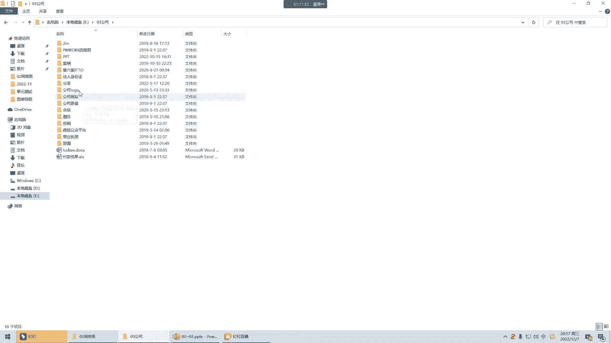
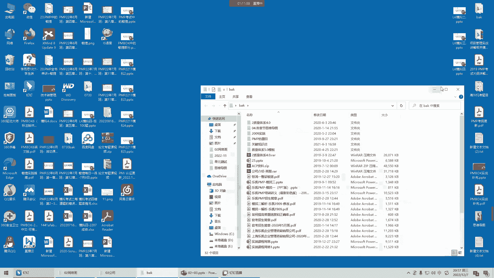
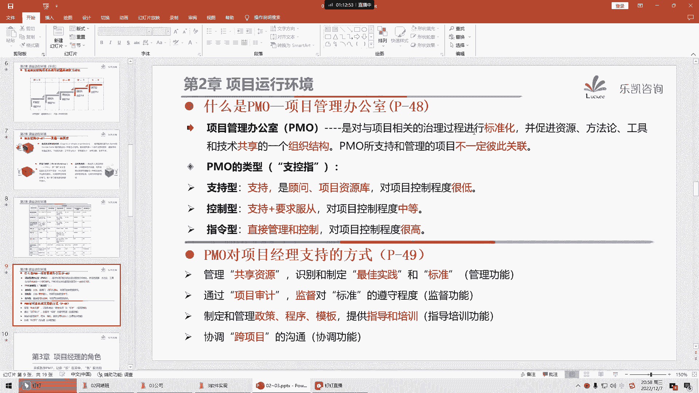
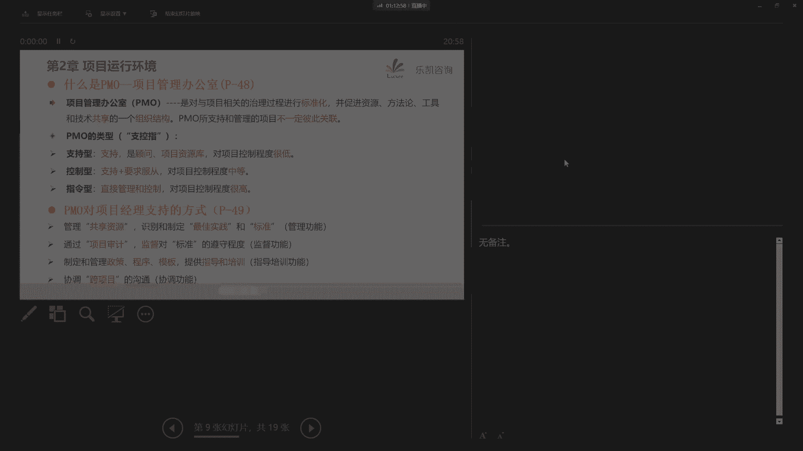
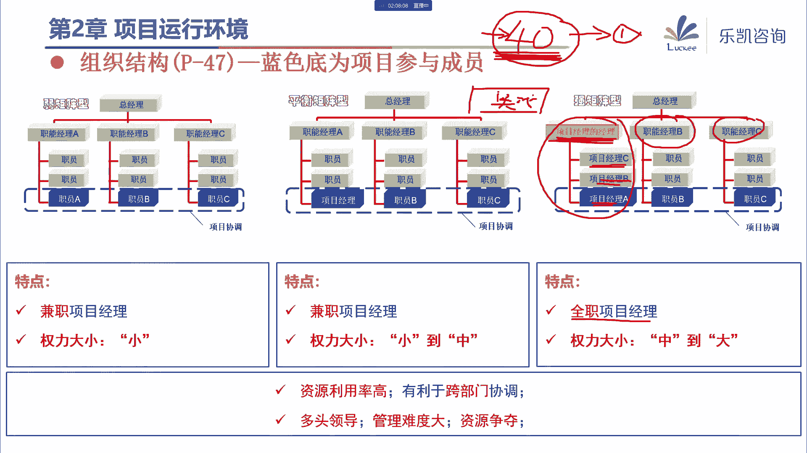

# 2024年PMP认证考试课程针对PMP新考纲最新免费零基础也能轻松听懂 - P3：PMP第2~3章：项目运行环境、项目经理的角色 - 乐凯咨询 - BV1Rj411G7gs

好各位同学晚上好，今天晚上我们一起来学习一下第二章，项目的运行环境，以及第三章关于项目经理的角色好吧，那么这两章内容呢相对来说考点比较少，那么在学的时候呢，涉及到考试的地方，大家要引起重视好吧。

那么到时候讲的时候呢，我也会及时的去提醒大家，那么首先我们看第二章项目的运行环境，我们在项目运行的过程当中啊，有一些因素会对我们项目产生一些影响，那么这两大因素大家要引起重视，首先第一个叫事业环境因素。

那么什么叫事业环境因素呢，从他的这个名字上来看，我们就可以看得出来它是一些环境类的因素，那么我们的项目不管是在什么地方去执行，我们一定会受到环境的影响，那么这些事业环境因素，它是指项目团队不能控制的啊。

这是它的一个特点，是我们无法控制的，而且呢又会对我们项目产生影响，限制或指令作用的各种条件，那么由于它是不能控制的，又会对我们产生影响，所以它有可能会提高或限制项目管理的灵活性，然后对我们的项目结果。

产生积极或者消极的影响，那么具体哪些算我们不能控制的啊，它的特点就是不可控对吧，那么哪些是我们不能控制的事业环境因素呢，那么它分为内部的跟外部的，那么这边所谓的内部和外部啊。

他一般说的是这个东西叫执行组织，所谓执行组织，就是指我们项目经理所在的这个组织，或者说就是我们项目经理所在的公司对吧，那么也就是说我们组织的内部和外部，都有这些不可控的因素。

比如说在考试当中经常出现的啊，像我们组织的文化和结构，包括我们组织的一些基础设施，这些都是我们无法控制的对吧，还有比较典型的考试中出现的最多的，我们组织用的信息技术软件，我们所有的软件都是我们不可控的。

比如说我们在做项目的时候，我们一般会用到项目管理信息系统，那么很多同学可能会见到过啊，比如说有的公司用的是什么肠道啊，对吧啊，用的是什么ja啊这种，那么具体你们公司用的是哪一套系统。

包括像我们以前公司用的是自己开发的，一套系统，那么这个是我们无法改变的，对吧啊，再比如说我们的一些财务系统用的是金蝶的，还是用有的等等，这些都是我们不可控的啊。

包括有同学说的用的e r p是哪一家的对吧，这些我们都控制不了，还有资源的可用性，我们组织或者说我们的公司，究竟有多少资源可用啊，可用的人是多是少，这个我们也控制不了，还有员工的能力。

我们也控制不了对吧，我们组织的员工的能力，它究竟是强还是弱，这个我们也无法控制，那么说到这一点，大家一定要注意啊，我们强调的是不可控对吧，那么有同学呢曾经提出一些疑问，他说员工的能力啊不是可以改变吗。

对吧，我们在做项目的过程当中，我们可能会对员工进行培训，那么他的能力是不是有可能提高呢，那么大家一定要注意啊，我们所谓的改变，最多只能说我们的项目，会对员工的能力产生一定的影响，但是影响不代表可控对吧。

你虽然会产生影响，但是你无法控制他的能力，一下子能够提高到多高对吧，这个是我们无法控制的，所以它特点是什么，一定要注意是不可控，那么外部也有一些不可控的环境因素，比如说我们现在的市场条件怎么样，对吧啊。

比如说社会的一些影响，包括那最典型的考试中经常出现的法律法规，这个是我们只能遵守的，我们控制不了对吧，包括商业数据库，那么商业数据库我说一下，很多同学可能不清楚，我们在做项目的时候啊。

有一些东西也不是我们想怎么样就怎么样的，对吧啊，比如说我们在做项目的时候，可能会遇到一些设备的价格或者材料的价格，比如说我们在做项目经常用的一些材料，像我们做政府的信息化项目，我们经常会采购一些。

比如说安普的超六类线对吧，包括我们涉及到综合布线，可能要用镀锌管，那么这种像材料类的网线多少钱，一箱镀锌管多少钱1米，不是你说多少就是多少的，那么一般来说政府它会有一个定额的标准。

他约定好多少钱就多少钱，那么这些东西也是我们不可控的，再比如说政府或者行业标准，这个也是我们控制不了的对吧，那么财务要考虑的因素，最典型的，比如说我们做海外项目，可能涉及到这个问题。

关税关税我们控制不了，包括我们不同货币之间的汇率问题，这个也是我们无法控制的对吧，再比如说物理环境要素，像天气，什么台风啊，暴雨啊，这些我们都控制不了，俗话说天要下雨，娘要嫁人对吧，这个怎么控制呢。

无法控制的，那么这些东西我们都是不可控的，那么我问大家一个问题啊，那么这些不可控的东西我们应该怎么处理，那么大家要注意环境类的东西不可控，我们不可能去改变环境，第一个我们能力有限。

第二个我们在上一节课讲过项目，它本身也是临时的对吧，在这段时间内，你想要改变环境，这怎么现实呢，这个是不现实的，所以我们要干什么好，王旭东说，我们要提前考虑对吧，哎这个是对的。

我们首先提前要注意到这些东西，另外我们还需要在这些环境下面去遵守它，然后呢我们看怎么样去处理它对吧，这是第一个要注意的，那么第二个要注意的，我们刚刚在讲的过程当中，可能会给大家一个误解。

就是这些环境对我们项目来说是不利的，但实际上大家要注意事业环境因素，它有好有坏，它是中立的，那他说可以提高或限制项目管理的灵活性，可以产生积极或者消极的影响，那么有同学说。

那么什么东西是可以提高我们的灵活性的呢，什么东西是可以带来积极的影响的呢，大家有没有遇到过一些你不可控的，但是对我们来说是有利的，一些环境因素啊，有遇到过吗，比如说我举一个例子，我们在座的有没有同学。

所在的公司加班不是随意加班的，是需要打申请的，而且申请完了之后，获得的同意你才可以加班，加班会提供加班费，有吗，你看李家辉就马上打了个一对吧，很多同学都说，有的把这些打一的同学名字记下来对吧。

课后跟他们聊一聊，他们公司还招不招人，像这种事业环境因素，实际上就是比较有利的对吧，它可以带来积极的影响，唉虽然我们有加班对吧，但是我们不是这个无限制的加班，我们加班是需要申请的，只需要审批的。

然后加班还是有加班费的对吧，所以说有一些事业环境因素啊，它其实对我们来说是可以提高项目管理的，灵活性的对吧，那么事业环境因素一定要注意它的特点啊，是我们不可控的需要遵守的，这是事业环境因素的一大特点。

那么我们在考试的时候，我圈出来的这些东西，大家一定要印象比较深刻，也比较好懂对吧，无法控制嘛，就这些东西最常见嘛是吧，那么这是我影响我们项目的第一大因素，我们在后续不管做什么管理过程。

我们都要考虑到事业环境因素，好吧好，包括有同学说的原材料的价格下跌，这当然也是我们的事业环境因素，我们也无法控制，但是这个对我们来说应该是产生积极的影响，好吧好，那么这是第一类。

那么第二类呢叫组织过程资产好，那么大家注意一下它的名字叫组织，我们的组织在这些年做项目的过程当中，积累的一些资产好，我问一下大家，你觉得我们组织在这么多年做项目的过程中，积累的资产。

哪些东西是比较典型的，大家能想得到吗，你说我们一个项目一个项目做下来，最终积累了什么好，有同学马上反应过来文档对吧，历史的一些文档，还有呢好，罗浩东说经验教训对吧，包括游客说的很准确，叫知识库。

那么像这些东西就是很典型的积累下来的资产，对吧好，那么我再问一下，这些积累下来的资产主要是为谁提供服务的，其实很简单，组织过程资产，就像我们现实生活中所说的遗产对吧，唉老子很有钱，等他挂了之后。

他的钱留给谁呢，留给他的儿子吗对吧，那么做项目也是一样，历史项目积累的经验教训是有利于谁呢，有利于后续的项目对吧，是为后续的项目提供一些帮助的，所以它的作用是很明显的，它有利于未来的项目对吧。

那么这就涉及到我们考试中，经常遇到的一种题目，我们说项目是独特的，那么上一个项目做好什么，有利于下一个项目呢，很明显，上一个项目要注意组织过程资产的积累对吧，那么这是第一个，第二个要注意组织过程资产。

也就是说我们积累的这些经验教训，是必须要使用的吗，其实不是对吧，我们可以去参考，但是我们在用的时候，我们要选择性的使用对吧，你能用的就用，不能用的呢也不强求人家是给你参考的，所以它体现的不是不可控。

它体现什么呢，可以裁剪对吧，我们要选择性的使用，那么我们新的项目起来，我们可以去找类似的项目，然后对类似的项目积累的一些组织过程资产，进行裁剪去选择，那么同时我们在做项目的过程当中。

我们自己这个项目的组织过程，资产也要注意干什么呢，多更新，多积累对吧，我们要把我们这个项目的经验教训，更新到我们组织的组织过程资产，那么组织过程资产很多形式是以什么形式呢，是以知识库的形式。

刚刚有同学说到，比如说我说一下啊，为什么我们要用知识库的形式来处理，比如说我们有一个项目是a项目，那么a项目在做的过程当中，积累了一些经验教训，那么按照我们常见的做法，有同学说。

那么我们这些文档要把它处理好，那么这些文档算不上组织过程，资产当然也算的，但是有一个问题，后续我们又有b项目，b项目有他的一些东西，c项目有他的一些东西，对吧好，这个时候我们用心启动了一个d项目。

那么d项目如果要参考的话，去翻a或者翻翻b方c的文档，这个就很复杂，这怎么翻啊，一堆文档在那边，所以呢我们组织里面很多公司，经常会引入一个东西叫知识库，知识库呢，它可以以一个内部的网站的形式来呈现。

那么我们这些经验教学，可以把它都更新到这个知识库里面，对b的也更新进去，好c的也更新进去，而且一般这些知识库呢它还是带检索功能的，还可以去干，根据一些条件去检索去查询。

那么这个时候我们d项目要查找东西的时候，就不要去各个项目上去访问的对吧，我们直接到知识库里面去检索就可以了对吧，当然同时d项目在做的时候，我们一些东西也要把它更新进去。

那么后续的项目都可以去参考这个知识库，所以组织过程资产最典型的实际上就是经验，教训类知识库内的一些东西，好吧，那么说到这里，我想问一下大家，那么我们比如说现在有一个项目正在做。

我们应该在什么时候去把东西更新到组织过程，过程资产里面去啊，对吧，他是强调我们不但可以裁剪使用，还要多积累呀，那么我们当前这个项目的一些经验教训，一些好的不好的对吧，都要把它更新进去。

那么什么时候把它更新到组织过程，资产里面去呢，好其实一开始很多同学可能会有一个想法，等项目结束的时候，或者等阶段结束的时候对吧，那么我们后面会说叫收尾的时候好，大家一定要注意啊。

千万不能等收尾的时候再更新，我们应该在全过程或者叫全生命周期过程，去更新组织过程资产好，为什么我们强调全过程要随时更新，因为如果你都到收尾的时候去更新，很有可能会造成知识的流失好吧。

所以我们一定要全过程随时去更新好，那么偏僻里面说组织过程资产呢，它包括两大类信息对吧，一类就是过程政策和程序类的，比如说我们这么多项目积累下来的一些标准啊，或者模板对吧，这个是很典型的。

看到模板肯定是组织过程资产，包括一些程序类的东西，那么大家要注意这一类的东西，一般来说不是我们项目经理，或者说团队来处理的，那么我们后面会讲有一个专门的组织叫po，一般是由他来处理的。

来梳理我们的指南流程，包括形成一些标准，形成一些模板对吧，那么我们团队比较容易更新了组织过程资产，实际上是这个东西叫组织的知识库，那么这里面就涉及到各种知识库，特别是经验教训知识库对吧。

那么像这些东西啊，是比较典型的组织过程资产模板，经验教训知识库，包括以往项目的档案等等，那么组织过程资产的特点就是，我们是可以裁剪使用的，而且我们要注意不断的去积累。

那么这两个东西事业环境因素跟组织过程资产，在我们今后做项目管理的过程当中，每一个过程都必须要考虑，都必须要考虑的好吧，那么这两者在考试的时候呢，他不会去明确的问啊，这个是不是事业环境因素。

这个是不是组织工人资产，那么了解他的意思就可以了，而且这两者之间啊要注意有一些交叉，我们有同学在看书的时候啊，经常在微信上问我一个问题，他说我在看书的时候，看到书上事业环境因素有供应商清单。

那么组织过程资产里面也有供应商清单，怎么都有，那么这个时候我们就要看题目中他是怎么说的，那么接下来一样的啊，根据我的描述，大家来选择是事业环境因素还是组织过程资产，首先我这么描述。

他说现在我们在做一个项目，我们要选择供应商，那么公司有一个要求，我们的供应商必须要从公司的合格，供应商清单里面进行选择，那么请问这句话它体现的是哪一个，究竟体现了不可控的事业环境因素呢。

还是可以裁剪的组织过程资产呢，那么大家要注意，其实这句话它是产生了限制和指令作用，他必须要从这里面进行选择，别的地方不能选，那么这个是我们必须要遵守的，在这种情况下，这个供应商清单就作为事业环境因素。

比较合适一些对吧，但是换一个说法，假如他这么说，现在我们公司有一个新项目要选择供应商，那么项目经理可以参考组织的合格供应商清单，进行选择，也可以自行决定，好注意，它体现了一个词，叫这个东西。

可以供你参考，对吧，那么一旦说可以供你参考，就意味着你可以去干什么呢，去裁剪对吧，那你可以用也可以不用，那么这个就体现了组织过程资产好吧，所以这些东西呢其实是有一些交叉的，大家呢这个可以去理解一下啊。

考试不会考这么难，那么考试一般考会考什么，考这些比较典型的东西对吧，这些东西都是一目了然的，一看就知道是哪一种，好吧好，那么这是我们第二章的第一个考点，我们要了解什么叫事业环境因素，什么叫组织过程资产。

那么这是影响我们项目运行的两大因素，那么第二个考点呢，在这里，事业环境因素里面有一个东西叫组织结构，那么这个我们也需要引起重视，那么我们看一下这几种组织结构，组织结构呢分为这么几种，第一种呢叫职能型。

也叫集中式组织结构，那么也就是说什么叫组织结构啊，就是我们公司的这样一种公司的结构，那么像这种职能型组织结构，它的特点是什么，那总经理下面管辖的是多个职能部门对吧，比如说销售部，市场部，技术部对吧。

然后每个部门呢有职能部门的经理来负责，我们简称叫职能经理，然后每一个职能部门里面有他们自己的职员，对吧好，如果我们公司是这种组织结构，那么一般就是职能型组织结构，那么在这种组织结构下面。

如果我们要做一个项目，需要各个部门的配合，那怎么办呢，好比如说我们需要这三个人，每个部门出一个人去配合做项目，那么在这种环境下做项目，首先你会发现谁是项目经理呢，那么一般来说领导可能会这么说。

那个小a啊，这个项目你负责牵头一下对吧，就随口说一下就行了，所以这种人是兼职的项目经理，兼职的项目经理啊，我们一般也把它叫联络员，那么说的好听一点叫联络员啊，说的不好听呢，就是传话筒就要传个话啊。

协调协调就行了对吧，主要是一个联络员的身份，那么这种人他的权利大不大呢，很明显他的权力很小，甚至呢就没有什么权利对吧好，那么在这种情况下，那么我们看一下啊，比如说现在这个兼职的项目经理，也叫联络员对吧。

职员a他有事情需要让b去做好，a跟b说了，b做不做，你们想一想，在这种环境下，a让b去做事，b做不到，b这个时候呢一般是不会做的，为什么不会做呢，因为很简单啊，职员b他自己有自己的本职工作对吧。

那么如果他要做，首先起码要等自己的本职工作把它做掉对吧，本职工作做掉之后，他会不会帮你做呢，我们刚刚有一个同学说，这个时候就要看心情了对吧，我做完了，我摸个鱼不可以吗，我干嘛一定要配合你呢。

一定要帮你做呢，你又不是我的领导，是不是，所以在很多情况下，我们会发现这种组织结构里面，a直接去找b这个是不可行的，对吧好，那么这个时候小a同学一看，靠，我感觉好像叫不动你呀，没办法。

我找我的老大来让你做行不行呢，唉我找只能进你a来让b配合我，这个时候b心理吗，实际上也是很不爽的，为什么他很不爽，你说你的职位是比我高，没错，你是部门经理，但问题是我又不是你的人对吧。

你手伸的也太长了吧对吧，你别的部门的经理，你怎么来让我来做事情呢对吧，这个我感觉也不行，那么一般来说在这种情况下，b会礼貌地拒绝职能经理a，比如说我们很多同学一定有这样的一个经验，对吧，一般会这么说。

唉领导不好意思，这个我呢最近呢确实比较忙对吧，我手头上也有很多的工作，要不这样吧，要不然你找我的老大去商量一下对吧，唉你们俩领导之间呢，你看一看哪个工作比较优先，如果说比较你的工作这个比较优先的话。

那么让我到老大跟我说一声对吧，这样的我也好办事，是不是，所以说你会发现在这种组织结构里面，如果我们要去做不同部门之间的协调，那怎么办，他一般会这么协调，a去找他的老大，只能经理a职。

能经理a呢跟职能经理b双方去协调，协调完了之后，b再把任务下发给职员b，对吧，用这种方式来促进跨部门的协调对吧，这是在我们很多企业里面都很常见的，那么这种方法很明显，它的缺点是什么。

它的缺点是跨部门的联系效率太低了对吧，跨部门的联系效率太低，那么它的本质是由于什么导致的，是因为项目经理他根根本就没有什么权利，他就是一个联络员，你说他能怎么办，所以他只能找老大呀，让老大去协调啊。

也就是说在这种组织结构里面，协调工作主要是由谁在进行，实际上是在这个层面在进行协调，而不是成员之间直接去协调对吧，那么这种组织结构有没有好处呢，唉缺点是很明显的，项目经理权力很小。

所以他没有办法实现跨部门的协调，必须要通过部门经理，职能经理这一层对吧，那么他有没有优点呢，好它的优点也是有的啊，这些东西虽然考试不考啊，但是呢大家要了解一下它的优点是什么啊，我们在同一个职能部门。

第一它的优点在于相互之间可以相互学习对吧，因为大家都是做的同一个工作，比如说都是销售，都是技术，相互之间可以讨论，可以学可以学习对吧，那么第二个好处是什么呢，第二个好处在于职业路径它很清晰对吧啊。

有同学说可以相互学习，有归属感，这都是好处，另外职业路径很清晰，那么我问一下职员a他的职业路径是什么，能看得出来吗，就是一步一步在这个部门里面往上爬，直到他做到什么，直到他做到职能经理a的位置对吧。

他可以从这个部门的一些员工到骨干到主管，所以说他的职业的路线还是比较清晰的好吧，那么我我说一下啊，我每次讲到这里呢，我都想提醒一下我们有一些同学，这些同学的想法呢很危险对吧，我说他一步一步往上爬。

最终成为职能经理，但是不代表要干掉职能经理好吧，我再次说一下啊，现在的小孩思想很危险，不要老是想要干掉自己的老大，因为领导他能够做领导，他一定有他的过人之处对吧，他的人脉，他的关系。

他的能力一定是有一定要求的，那么我们应该怎么去做，我们应该尽可能的去配合职能经理，让这个部门的业绩受到公司的重视对吧，然后职能经理他升上去了，他升上去之后，那么他的坑就留下来了对吧，那么他的坑留下来。

这个时候让谁来蹲他的坑呢，那么一般来说公司也会听他的意见，这个时候他心里想一想啊，当初在这个部门小a同学啊，从各方面来说都比较优秀对吧，是我的得力助手，是我的心腹，所以呢我建议让他来做职能经理，对不对。

这个才是比较正确的一个方法，而不是要去干掉老大对吧，干掉老大的结果呢很悲剧的啊，大部分都是没有把老大干掉，自己呢走人，好吧好，那么这个是职能型组织结构，那么我们要注意的是什么呢，它的权力大小。

项目经理的权利很小，甚至没有，那么请问各位，如果作为项目经理在这种权利下面去推进项目，你们乐意吗，当然不乐意呀对吧，权利都没有嗯，这个东西做项目怎么行呢啊，有人说那么权力小也不用担什么责任啊。

那么这一点呢也错了啊，你权利再小，出了问题也是你背锅，所以与其到最后都是要自己去背锅，因为项目经理是负责整个项目的吗，你项目除了任何问题都是项目经理负责，与其是这样，我不不如什么呢，要一个权力最大的。

那么权力最大的是哪一种组织结构好，是这一种叫项目型，那么这是另外一个极端，我们看一下这种组织结构，它的特点是什么，总经理下面直接是由项目经理带的各个团队，对吧，哎比如说项目一部项目二部，项目三步。

那么项目经理下面直接管理他自己的团队成员，注意啊，这些人不属于其他部门，都归项目经理一个人管，那么这种形式很明显，项目经理他就不再是兼职的，他一定是一个全职的项目经理，他专门就是做项目管理工作的对吧。

而且权力大小很大，甚至到全部，那么这里有一个细节，我说一下啊，为什么这边权力大小不直接说全部，而是说大到全部，好我问一个问题，请问在这种组织结构下面，有没有之前我们讲的职能部门，有吗。

在这种组织结构里面，有没有职能部门，他有的你想一想吧，这种组织结构里面有没有财务部啊，要不要给你发工资啊对吧，包括我们做项目最常见的还有什么法务部门啊，这些部门总有的吧，你难道没人给你发工资吗。

难道没有人事部门吗，人事行政部门吗，那肯定是有的，但是为什么这边说到大甚至全部呢，因为这些部门它对我们项目有多大的影响呢，实际上他们对我们的项目来说，一般来说影响不太大对吧。

所以这边项目经理的权利呢他说很大很大，有的时候甚至极端的时候到达全部对吧，那么这对于我们项目经理，做项目来说是非常有利的对吧，项目经理的控制程度很高，所有的人都听他一个人的，所有的资源都归他管。

但是这种组织结构也有缺点，第一个缺点是什么呢，叫资源重复配置好，我解释一下什么叫资源重复配置啊，既然你要保证所有人都全心全意为你服务，不做其他的事情，不属于其他任何职能部门。

那么你这个项目上所需要的角色，你就必须要有对吧，不管是人力资源还是实物资源，你该有的人都必须要配齐对吧，你涉及到的东西你必须都要准备好，那么同样的b项目也需要做到对吧，所有人员都要配备全c。

要做到所有成员都要配备权，那么这个时候就会显得我们的人员会比较臃肿，甚至我们的一些设备也比较臃肿对吧，比如说我举一个例子，我以前在成都做项目的时候，我们在成都实际上有两个项目组，有两个项目组对吧。

那么由于我们都是在外地的，那么人员要过去，另外呢你该买的也得买呀，比如说最典型的一个东西就是打印机，知道这个事情我印象很深刻，a项目组要买一台打印机，那么b项目组买不买，一开始b项目组没买对吧。

他也是想节约一下成本，那么要打印的时候呢，到a项目上来打印，你说一次两次可以啊，项目上特别是验收的时候，要打印的东西太多了，这个打印都是上千的费用啊，那么你说在这种情况下，a会让你买吗，a会让你打吗。

他肯定不会啊对吧，一会儿说没a4 纸了，一会儿说墨盒用光了，总之很麻烦，所以不得已b呢也只能去买一台打印机，那么到最后这两个项目结束，就变成了有两台打印机对吧，所以说你要人员或者要实物资源都配备权。

必然会造成资源的重复配置对吧，当然这还不是最严重的啊，最严重的是这个容易造成无家可归的感觉，好有同学说，那么他们不都是听项目经理的吗，都在为这个项目服务吗，为什么会无家可归呢，大家还记得我们上一节课。

讲过项目的一个特点吗，叫临时性，项目它终归是要终止的，那么我问一下，等项目结束的时候，这些人去哪儿，你想一想项目是临时的对吧好，我们在这边做一个项目，做完了之后怎么办，有人说，那我去别的项目行不行。

不好意思啊，别的项目坑都满了，一个萝卜一个坑啊，你去别的项目有人要你吗，是不是你去哪儿，你又不属于任何职能部门，你又不能回任何职能部门，所以大家有没有发现啊，我们有很多公司就是遇到这个问题。

比如说我经常看到，有的公司在某一个地区有一个项目，这个时候呢，他们就在这个地区招聘一些人去做这个项目，等项目做完了之后，我见过最极端的一种做法是什么，做法就是等项目做完之后，把这些人全部都裁掉。

全部都裁掉对吧，所以说在这种组织结构里面，很容易会导致大家没有归属感对吧，会导致无家可归的感觉，这也是这个组织结构的最大的一个问题对吧，虽然项目经理权力很大，甚至到全部。

但是会导致资源的无家可归的情况好，那么接下来有人会问了，既然这种权力太小不好，这种权力太大又不好对吧，那么有没有什么比较好的做法，或者我们可不可以这样做，我们用一个折中的方式，有吗，有的矩阵型好。

介于这两者中间的叫矩阵型，那么矩阵型组织结构分为三种，叫弱矩阵，平衡矩阵和强矩阵，那么我们首先说一下啊，什么叫矩阵型组织结构好，我们以平衡矩阵为例，你会发现首先它跟职能型最大的不同，在什么地方。

而举证型他给项目经理提高了一些权利，允许项目经理直接去指挥这些项目的成员，它可以解决跨部门沟通的问题对吧，就说项目经理的权利，比职能型肯定是要高一些的，那么另外这些人呢，他本身又属于各个职能部门。

那么在做项目的时候，他会怎么做呢，他会这样做好，我从职能部门里面抽人，他们形成一个项目组或者项目团队，那么我们约定这些人要听项目经理的，可以直接跨部门沟通对吧，那么等项目做完了之后怎么办。

等项目做完了之后，这些人从哪个部门来的，还回哪个部门去，那么这样也解决了项目型的无家可归的问题，对吧，哎有项目你们一起过来做项目，做完项目你们还回各自的部门，那么这种就是很典型的矩阵型。

那么在我们外面各个公司里面，实际上比较常见的也是用矩阵型组织结构，那么我们刚刚说他解决了跨部门沟通的问题，也解决了无家可归的问题，那么这种组织结构有没有它自己的缺点呢，大家要知道没有什么事情是完美的。

这种组织结构也有它的缺点，好它的缺点是什么，我们看一下啊，职员c他要不要听职能经理的，你很明显要听职能经理的呀对吧，好职员c又要做项目，他要不要听项目经理了，那也得听啊对吧，那这个时候怎么办呢。

那比如说在之前讲课的时候，我就问我们以前的学员问了一个问题，我说假如职员c现在给你打电话，说明天早晨九点钟部门开会议很重要，所有人必须要参加对吧，好项目经理说，明天早晨九点钟。

我们在项目现场要给客户的大领导汇报对吧，所有人必须要参加，那这个时候怎么办，你明天是回公司开部门会议，还是去项目现场跟客户的大领导去汇报，你这个时候就很无奈呀，对吧啊，虽然有一些猥琐的同学。

我记得以前有一个很猥琐的同学说，我这样我哪儿都不去，我跟职能经理说，明天我要去项目上开会，没办法走不开，跟项目经理说，明天我要回部门开会，走不开，然后我明天哪都不去对吧，躺在家里面看世界杯行不行。

这个东西呢你开个玩笑是可以的对吧，你怎么能每次都这么做呢，这个很明显是不现实的对吧，那么为什么大家会产生一些很纠结的想法，说我究竟应该去哪儿，因为大家不知道职能经理和项目经理，究竟谁说的话。

或者说谁的权力更大一些对吧，所以矩阵型组织结构，它就把它再做了一个进一步的划分，那么他怎么做呢，他这样做的，比如说有的公司是这么规定的，项目经理，他的职级要比职能经理呢要高一级。

比如说像我之前就职的公司，他就是这种划分项目经理的职级啊，比职能经理要高一级，那么职能经理主要的任务是什么，直男经理主要的任务是，对他们部门的成员做培训做指导，当项目经理需要做项目的时候。

那么他可以到这个部门来挑人，那么这个时候，职能经理实际上可以把它看成是什么呢，看成是一个叫资源池，对吧，你是为公司提供资源池的，那么我要人我到你这边来挑，那么所有事情以什么为主，以我的项目为主。

那么这种就是举强矩阵的组织结构，项目经理的权利相对来说叫中到大，一般来说就是跟职能经理比较起来啊，一般来说是要比你大一些对吧，那么这种就是强矩阵的组织结构，那么在这种组织结构里面，直圆c就比较明确了。

那么项目比较重要，我去参加项目的会议对吧，那么另外一种组织结构叫弱矩阵，好弱矩阵是反过来的，他是这样的这个组织啊，还是以职能工作为主，啊比如说职能部门是一个很重要的业务部门。

那么项目经理呢比职能经理的职级呢要低，那么在这种情况下就变成了弱矩阵对吧，也就是说其实还是职能经理他的权利要高一些，那么在这种情况下，职员c也知道，那么一般来说我要听职能经理，c的比较多一些对吧。

所以这种呢叫弱矩阵，所以弱矩阵的权利呢，相对来说项目经理还是还是小的好吧，那么这两种实际上还算比较明确，那么烦就烦在中间的这种，中间的这种呢叫平衡型矩阵或者叫均衡型矩阵。

那么项目经理的权利呢跟职能经理差不多，但是呢小道中对吧，那么在这种情况下，我问一下大家，如果我们在平衡型举证里面工作，我们的权利比职能经理的权利呢要略小一些，但是呢我又希望及时的去推进项目。

那么大家觉得我们应该怎么做，啊我们是平衡性举证对吧，我的权利呢，跟职能部门的经理的权利也差不多啊，如果要严格的说呢，可能还比他要小一些，那么这个时候，我也希望我的项目能够顺利的去推进呢，那怎么办呢。

好有同学说，那么这个时候就要跟职能经理去协商了对吧，去沟通了，要跟他家，要跟他们去干什么呢，搞好关系了啊，包括有人说要发挥自己的个人魅力对吧，确实啊，在这个时候我们可能就需要通过谈判沟通。

或者呢叫发挥自己的影响力，影响力对吧，这种情况啊其实是很常见的很常见的，那么我以前呢也会用一些手段，用什么手段啊，我给大家介绍一下，其实最好的方法，我觉得就是用这种方法。

让项目组的成员到项目现场去驻场办公，大家有没有看过这种做法，就是说客户那边有一个项目，我们也不要在公司呆着对吧，那在公司呆着呢也不利于项目的推进，干脆这样，大家跟我一起到项目现场去驻场办公。

那么我一般做项目我会怎么办呢，我会找客户，让他们在他们那边提供一个办公室，对吧，然后我过去把这些人都叫过去，我们驻场办公，这样效率也比较高，而且呢也能够提高自己的影响力。

这样做为什么可以提高自己的影响力，比如说职能经理要找c做一件事情，结果一看哎这小子跑哪去了，怎么不在部门里面啊，好别人说他去项目现场了，第一次找他不在，第二次找他又不在，他会怎么办。

他就不会去找c了对吧，他可以让他们部门的其他人去做这个事情是吧，所以说我们中国有一句古话，就像有同学说的叫近水楼台先得月，向阳花木易为春，我把他拉过来了，那么你职能经理对他的影响就比较小一些。

而我项目经理对他的影响力就比较大一些对吧，用这种方法来提高自己的影响，尽量的让他们以项目工作为主是吧，那么这个时候有人说，这个好像对人家不太好吧对吧，好像对职员c不太好吧。

你搞到后面职员c应该会被老大针对吧，那么这就要看你项目经理怎么去做人了是吧，那么我之前在讲课的时候，我也说过，一定要注意啊，你后续的一些手段要用上，比如说等项目结束的时候，我一般会干什么。

我一般会做这个事情，写感谢信，明白吧，这个感谢信写给谁啊，是有讲究的，这封信要发送给职能经理，发送给职能经理，同时要操送给总经理，明白吧，发给职能经理，同时要操送给总经理，那么信的内容是这么说的对吧。

感谢某某某部门的部门经理，为我提供了职员c这样一个团队成员对吧，由于贵部门的大力支持，由于职员c的努力的工作对吧，为我的项目提供了什么什么什么的支持，对吧啊正因为如此，我们的项目才能够顺利的推进下去。

所以呢现在在项目收尾的时候对吧，我代表我们整个项目团队给职能经理表示感谢，我们也期待我们跟这样优秀的部门，有再一次的合作的机会对吧，你把这个信写好，发给职能经理，然后呢抄送给总经理，在直升机里一看。

我靠什么姓这么严重啊，还要操控总经理啊，结果一看哦，再说我们部门的这个c职员，c在这个项目上干的真实很不错啊对吧，怎么怎么样，这都是我领导有方啊，对吧啊，总经理一看也知道啊，我这个职能部门平时培养人。

培养的多好多好多好对吧，他还会针对c吗，靠为你争光了呀，怎么会针对c呢，是不是那么项目经理要注意啊，人家职能部门的人过来帮你做项目，却是人家付出的努力，那么我们一定要用一些方式在他的领导面前。

要体现他在项目中的价值好吧，当然这个呢是我们平时在做项目的时候，一些手段问题啊，这个倒不是考试的内容，那么总之还是这一点，就是说不管怎么说啊，其实不管哪一种组织结构，我们项目经理都要想方设法。

来提高自己的影响力对吧，你只有提高自己的影响力，你才能够把这个项目顺利的推下去，好吧好，那么这是我们最常见的这几种组织结构，职能型，矩阵型和项目型，那么矩阵型呢当然分为三种对吧，若矩阵平衡矩阵和强矩阵。

那么现在考试会不会考呢，仍然会考到这个点，那么考试会考什么，考试会考权力大小，那么我希望大家一定要记住它的权力大小，那么我补充一张图啊，我就不画了，我事先把它做好了，这个怎么记很简单啊。

我们只要记住一个东西，就是平衡矩阵对吧，我相信通过我刚刚那个例子，大家对平衡矩阵的印象应该会很深刻，项目经理权力有限，小道中，你记住这个就行了，好然后接下来你做什么事情呢，左边右边去推一推对吧。

比如说如果权力再大一点，就是强举证，那么强举证他的权力是什么情况，什么情况呢，好把中拉过来好，那么强矩阵很显然就是中道大，如果再往大了说，最大的就是项目型了，那么项目型态的权利呢好把大拉过来。

那么就是大到全部对吧，那么这是往大了说强矩阵，项目型它的权力大小你就知道了，那么往小了说好，如果是弱矩阵，很明显把小拉过来，所以若举这个是小对吧，好如果是最小的，我们说的一个传话筒嘛，叫职能型嘛。

那么职能型很明显，弱矩阵都是小了，那么你只能是很小，甚至没有，对吧，所以说我们只要记住中间的这个东西，然后左推右推，那么整个这五个就全部记住了，好吧好，那么另外我们在做题的时候。

可能会遇到一个东西叫紧密矩阵，那么大家注意啊，紧密矩阵我们刚刚在这几种里面没有讲过，它不是一种组织结构啊，我们在第九章会讲到它其实是集中办公好吧，常见的几种组织结构就是这么几种。

当然在书上还说了其他的一些类型，那么这几种呢考试呢几乎没有涉及到，我们顺便来提一提啊，好我们看这种有畸形或简单型，好什么叫有机型或简单型，我建议大家呢就想一想这个东西，比如说最常见的就是一般的创业公司。

那么创业公司或者初创公司它的特点是什么，它的特点是人很少，专业化少，管理层次少对吧，它俗称叫肩并肩工作，比如说我们初创的公司一共就六个人，有没有可能说一个人是总经理，两个副总，还有三个部门总监。

我靠个个都是领导，没有必要一个六个人的初创公司，大家又是老板，又是员工，大家一起肩并肩工作，没有什么职能划分的对吧，所以这种叫有机型或简单型组织，好吧好，接下来还有多部门组织，那么什么叫多部门组织呢。

这个呢也很常见，比如说我之前的公司就是这样，比如说在上海有总公司，然后呢每一个区域有分区域的公司，比如说我们有华南地区的公司，有西南地区的公司对吧，唉有分公司的，那么分公司呢实现半自制来完成。

我们下达的财务指标就行了，那么这个是多部门组织，那么最后一种呢叫虚拟型组织好，什么叫虚拟型组织，我说一下啊，虚拟型组织就是大家根本就不在一个公司，对吧，只不过我们有一个项目临时把人员召集起来的。

这种情况呢，实际上在电影里面看得比较多，比如说我们现在有一个特定的机遇，我们想要干一票，那么想要干一票怎么办呢，好我早在爆破方面比较厉害的专家，我找在电脑方面比较厉害的一个高手对吧。

我再找一个对军火非常了解的，再找一个对开车比较熟练的，然后把这些人拉在一起好，我们一起临时形成了一个组织对吧，然后我们去干一票，做完之后随机就解散掉了对吧，这个叫虚拟型组织。

就大家根本就不在同一个公司的，只不过说哎为了同一个目标，临时把他拉到一起了好吧，那么这几种类型呢，大家稍微有个印象就可以了啊，考试呢要考实际上就是考这几种的权利大小，好吧好。

那么这个是常见的这些组织结构，当然在我们书上也会描述的，这是我们第二章的内容里面的第二个考点，那么接下来第三个考点是po，那么什么叫po啊，其实在我们第二章所有的描述里面，关于po的描述呢。

他是这么说的，他说项目经理呢我们还要了解啊，在我们组织里面，有一个其实是一个永久的职能部门，他叫项目管理办公室，project management office对吧，那么这种这一堆人是干什么呢。

他说我们要对过程进行标准化啊，促进资源方法论，工具和技术共享的一个组织结构对吧，那么po它主要是对项目经理提供支持的好，我想问一下各位同学，公司有没有po这样一个部门，唉，有的同学说没见过这个部门。

好我说一下啊，没见过呢，有可能有两种情况，一种就是你们公司确实没有人做这个事情对吧，还有一种情况是什么，还有一种情况就是我们有其他的类似的人，来做这个部分了，比如说质量管理部，他承担了这部分工作。

那么这些人主要干什么，主要就是对流程进行标准化，包括对项目经理提供培训的好，我给大家看一个东西啊，我不知道我这个电脑上有没有。

好看这个吧，哦有的。

好大家看一下，比如说我以前的公司啊，他对项目管理当中所有的过程，他都会有文档要求，而这些文档比如说需求应该怎么写对吧，包括一些设计文档应该怎么写，它的模板全部都弄好了，明白吧，他的模板全部都弄好了。

那么这些模板实际上是这些人花了很长的时间，全部都建立起来的，那我记得我当时在的时候是五点的版本，那么以前是四点的版本对吧，那么四点的版本的时候呢，其实文档就已经有很多了。

那么这些模板实际上是经过了很长时间，那么这堆人把它记录起来的，那么我们有专门的人来做这种标准化的工作。

明白吗，那么我们比如说有很多项目经理说。

哎我写需求文件，我不知道怎么写，那怎么办呢，好别人给你一个模板对吧，所以像这些人，那我们还记得刚刚在讲组织过程资产的时候，有一类组织过程资产叫过程政策和程序类的，包括要标准化的一些东西。

其实都是他们来做的，对吧好，但是要注意po其实，并不是每个项目经理都喜欢的好，我问一下啊，如果公司有po这样一个部门的，有没有同学能说一说，你们对他们的感觉是什么感觉，刚刚有同学说我们公司有pm。

但是我感觉没什么用，这还是一种比较客气的评论对吧，其实我看到很多项目经理对po，或者说对所谓的质量管理部，他的评论是什么呢，简直就是个事儿，妈对吧，事儿太多了，我项目上这么忙。

你还在跟我纠结这些问题对吧，管得太死了，怎么怎么样，其实评价都很不好，是吧，而实际上p o应该是对项目经理提供支持的，那么我觉得出现这种情况，主要是p o对自己需要做到多大的控制，没有搞清楚。

所以在pp里面啊，他说到了po有可能存在的三种类型啊，不是说pm就可以对项目进行随便指指点点的，实际上他要分情况的，那么第一种呢叫支持型啊，支持性，比如说在我们公司这一块东西不成熟的时候。

特别是像我看到有很多公司刚刚成立pmo的时，候，实际上比较适合的应该用支持型这种类型的pm，那么什么叫支持型啊，就是说不要想着去管，控制程度应该是很低的，你应该作为什么，你应该作为一个顾问。

作为一个资源库，也就是说比较合理的场景呢，应该是这样的，当项目经理他缺少什么模板，或者项目具体什么地方不会的时候，这个时候你才应该站出来，哎，你是不是需要需求规格说明书的模板，我这里有一份。

要不你拿去看一看对吧，唉你是不是这里不记不太清楚啊，要不要我给你讲一讲对吧，你只要提供支持就行了，你不要去那儿指手画脚啊，必须要这样，必须要那样对吧，特别是在不成熟的时候，或者刚刚组建po的时候。

我们应该用支持型的po来管理项目经理，提供知识对吧，那么假如说我们经过一段时间，唉基本上已经比较成熟了，唉比如说举一个例子，各个项目经理都在用我们这一套模板，那么这个时候我们才可以提出要求，比如说。

那我们现在所有项目经理都在用我们这套东西，对吧，要不这样吧，将来有新的项目经理过来，首先我们给他培训，然后要求他们，那么模板就必须应该用我们这一套统一的东西，对吧，当然你自己可以裁剪。

逐渐的变成控制型对吧，那么如果说是一些公司的一些战略性的项目，或者说重点项目或者说标杆项目，那么po一定要深入具体的管理工作的，那么这个叫指令型，那么这种是控制程度最高的，就是关注细节了好吧。

所以我们应该根据不同的情况，不同的发展阶段来选择不同的类型的屏幕好吧，那么大家对这三种pm控制程度，一定要注意的好吧，支持型是最低的，指令型是最高的，那么中间是控制型的，那么我说一下啊。

很多同学支持型是比较了解的，理解是什么意思，关于控制型和指令型，搞不清楚，那么我说一下，控制型跟指令型最大的区别是什么，控制型只关注规范性的东西，不关注细节，而指令行它会深入项目中的每一个具体的细节。

或者关注项目中的某一个具体的事情，好吧，那么我举一个例子啊，帮助大家去理解一下这三种的区别是什么，比如说什么叫支持型的pm，举一个例子，在我家里，我爸就属于支持性，在我们家会做饭的有三个人，一个是我爸。

一个是我妈，还有一个就是我老婆，那么为什么说我爸是支持型呢，因为如果我爸到我这边来，他一定会买菜做饭对吧，那么他不管你吃不吃，反正他会做的，你不吃他自己吃，吃不完他自己带走对吧，他只保证一点。

就是反正只要你下班回家是有饭吃的，你回来吃也好，不回来吃也好，他无所谓对吧，它是只提供支持，不做任何要求，它的控制程度是很低的，这就是我们说的，那在项目上，我只给你提供知识，你用不用随你对吧，好。

什么叫控制型呢，控制型就是他稍微有一些要求了，那么这种人是谁呢，这个人就是我老婆，我老婆就是很典型的控制型，他会做饭吗，他会做，但是他有要求他的要求是什么，他的要求是你必须回家吃饭。

他只对这个大的层面上有一个要求，为什么你必须要回家吃饭呢，因为老娘做了饭，你就他妈必须回家吃饭，你不回家吃饭，我做了干啥对吧，所以说那只要我老婆做饭，我必须要回家吃饭对吧，我如果不回家，我一定要a嘛。

当然了，至于我回家吃饭之后，具体的细节他管吗，他不管，比如说你吃饭的时候是站着吃也好，是坐着吃也好，你跪着吃呢也行对吧，你怎么吃都行，他不管你只要回家吃什么都好说，那么这就等同于我们在做项目的时候。

也是一样的，你只要遵守我们组织的流程就行了，具体细节你怎么做，随便你对吧，你根据你下落的实际情况，你自己去做去对吧，所以要注意啊，控制型虽然有控制两个字，但是实际上控制程度是中等的对吧。

那么什么叫指令型呢，所以指令型就深入到项目的细节了，刚刚有同学说是不是直接参与项目管理工作，是有这个可能的，比如说在我家里面，我老妈就是典型的指令型，如果是我妈做的饭，比如说我妈到我家来了，给我做了饭。

我回家吃饭，每一步她都要管的对吧，首先坐下来不行，先去把手洗一洗对吧，好洗完手之后诶，你先尝一尝这个菜对吧，这个菜啊今天很新鲜的对吧，我怎么怎么样买到的，你试试看对吧，然后你吃了之后。

他还问唉这个菜咸不咸啊，淡不淡啊对吧，然后哎再喝口汤嘛，慢一点，不要吃那么快，吃那么快，怎么怎么不好，每一步他都要管，每一个细节他都要管明白吧，就像我们在做项目的时候，比如说项目中一些变更啊对吧。

项目中一些具体的计划呀等等，他都要管，那么这种就是关注到细节层面的，那每一个细节他都会下达一些指令呢，那么这个叫什么，这个叫指令型好吧，所以控制型跟指令型一定要搞清楚，它的控制程度是不一样的好吧。

那么不管怎么说，实际上po最终是要给项目经理提供支持，包括制定最佳实践和标准啊，做一些模板啊，对吧啊，制定一些政策程序和流程啊等等，甚至包括对跨项目的工作进行一些指导啊，那么po在我们。

考试当中实际上涉及的倒不多，明白吧，在考试中涉及的不是太多，但是呢大家要对它有一个了解，实际上我们在平时公司做项目的时候啊，其实po呢有点像项目经理的娘家人对吧，就有什么困难，你可以去找他帮助帮助你。

这个都无所谓了，那么另外呢我我还是想说一点啊，最近呢有很多同学在跟我聊，关于这个跳槽的事情，那么我发现了这里面呢还有一些女同学啊，也是做项目经理的对吧，那么我相信做过项目管理的啊，特别是如果这个项目。

那像我以前接触的要跟一些像土建来打交道的，实际上呢在现场是很累的，而且现场环境呢说实话也不是很好对吧，那么我建议啊，我建议如果说你实在对项目管理或者项目经理，这个职位有点厌倦了，你不妨考虑这个方向。

也有很多公司对吧，你可以到猎聘网上去看一下，他们在招po的经理对吧，或者再招po，那低低一点的叫po专员，那么实际上我觉得女孩子有一个什么优点呢，就是做事做事情比较负责，比较仔细对吧。

那么其实这也是一个去处，当你有了项目管理经验了对吧，你又不想到项目现场风吹日晒对吧，特别是跟那些啊像我这种爱抽烟的人打交道的，那么你不妨可以去考虑这个方向对吧，唉把这个公司的一些体系文件去梳理梳理。

我觉得这也是挺好的，好吧好，那么第二章其实书上讲的内容呢不多，我把它总结一下，就这三个点，大家把它搞清楚就可以了，好吧好，接下来我们看第三章，第三章呢实际上是第六版。

当初改版的时候新加了一张叫项目经理的角色，那么首先我们做项目管理，我们打算做项目经理，一定要了解项目经理究竟是一个什么角色，那么在讲之前，我问一下大家，你们心目中的项目经理是一个什么样的人。

做项目经理的不要说好吧，现在还没有做项目经理的，不妨说一说你们心中，你觉得项目经理这个人是一个什么样的人，简单的说这个人牛逼不牛逼对吧，你佩不佩服他，马恒说，我感觉项目经理其他都好，就是不做事。

他是一个不做事的人，对吧其实很多啊，特别像我以前也是做技术的，我当初做技术的时候也觉得项目经理啊，感觉这孙子太轻松了对吧，你说技术吧又没有什么要求对吧，然后呢就是跟客户去沟通沟通协调协调。

然后回来呢就催催进度，时不时的的不在公司，你问他去哪儿了，他说跟客户去开会了对吧，也不知道他真正去哪儿了，等他回来之后就开始下任务，催进度，一会儿这一会儿那对吧，我感觉好像我也可以是吧。

所以我才转型做了项目经理，那么事实情况是这样吗，好我们先看一看po他那个pmp，他是怎么说的，好吧，pp说首先什么叫项目经理，项目经理是由执行组织，那我们刚刚说执行组织就是公司嘛对吧。

是由执行组织委派领导团队实现目标的任务，他是一个领导，他领导团队实现目标，对吧，看上去牛不牛，当然好像有一点牛，但是呢我提醒一下大家这几个细节啊，我问一下，实现目标，和定目标有没有区别，对吧，马超说啊。

原来我是个领导对吧，还很开心，那么我想问一下，实现目标，带着团队实现目标和定目标有没有区别，比如说我举个例子，马超刚刚认为他是个领导对吧，很开心，我看马超不爽，我想下了课之后找几个兄弟揍他一顿。

那么在这个项目中，谁是定目标的，老大看马超不爽，下了课之后想揍他一顿，对吧好，那么请问实现目标的是谁，我们俗称叫什么呢，实际上你会发现实现目标的，我们称之为马仔，对不对。

因为老大他是不可能治自己去实现目标的，老大是定目标的，就是真正的老大是定目标的，那么实现目标的是谁呢，是马仔对吧，那么项目经理实际上是一个什么身份，实际上是一个马仔的身份，当然他有没有他的团队成员。

有的马仔肯定也不是一个人去的，他也是带着几个小弟去的对吧，所以首先要注意啊，不要把自己想的太高，实际上项目仅仅是一个马仔的什么，这是第一个，第二个，我问一下马仔要带一些小弟过去实现目标，这些小弟哪来的。

这些小弟是一开始就追随你的吗，其实不是啊，因为我们说过，其实在我们组织结构里面，最常见的一种组织结构是什么，组织结构，我们刚刚说的是矩阵型组织结构，那么大家回答我，我们在外面最常见的矩阵型组织结构里面。

马仔的小弟是哪来的，马仔的小弟对吧，那我们看一看是从职能经理手上借过来的，你发现没有，其实从我们的组织结构里面来说，项目经理跟他们并没有明确的上下级的关系，对吧，反而是职能经理跟他们有上下级关系。

只不过我们在做项目的时候，这些小弟哪来的呢，从各个职能部门寄过来的对吧，所以你带着这一群不是你亲生的小弟，来一起实现目标，这个工作好做吗，其实不是那么好做，不是那么好做对吧，所以说大家要注意啊。

项目经理第一他的工作其实是有很大的难度的，不是什么人都能够做项目经理的对吧，第二个还要注意有一个很尴尬的局面啊，我希望大家在以后做项目的时候呢，你要学会调整什么很尴尬的情况呢，我们刚刚说项目是临时的了。

那么项目是临时的，就代表有项目的时候，你是马总对吧，在客户那边叫马总，等项目结束了，你回到公司，有可能你就变成了小马，这个也不一定啊对吧，所以说其实项目经理这个工作不太好做，不太好做。

不是什么人都能够做的，那么正是因为如此，所以我们才要认真的去学习pmp，去了解这里面的这些情况，对吧，那么当然偏僻，没说项目经理不需要承担项目做的每一个角色，对吧。

哎我们只需要具备什么什么什么东西就可以了，而项目经理主要的作用是规划那个协调能力，对吧，主要是协调啊，这个是pp里面的一些说法好吧，但是呢具体的它里面的本质的一些情况。

我们要了解项目经理不是那么好做的好吧，那么偏偏偏说，那么项目经理应该发挥自己的影响力，比如说在项目层面上，要充当团队和老大之间的桥梁啊，老大是谁，我们下个星期会详细的讲到一个人叫发起人，发起人。

我们在上一节课啊，实际上讲到商业论证和效益管理计划的时候，如果大家回头看一看讲义，会发现有这样一个人好吧，那么另外还要跟组织的其他项目进行互动，要关注行业趋势，那么这一页的内容啊，这些自己看一看好吧。

这一页的内容实际上不是很重要，那么现在天麦就是美国项目管理协会，对我们项目经理的能力呢有这样一个要求，他说我们要具备这三种技能，那么这三种技能大家要关心一下的，他说作为一个项目经理，要具备技术。

项目管理技能，那么什么叫技术项目管理技能呢，就是我们要有效运用项目管理知识，实现项目的一些推进来达到预期的结果啊，比如说简单的怎么收集需求，怎么排进度，怎么管成本，怎么控质量对吧，怎么管风险等等。

这些都属于技术项目管理技能，那么这种技能从哪获得，这就是我们pmp培训的目的，我们通过p m p的培训，会让大家知道怎么去收集需求，怎么去排进度对吧，包括后面的成本质量怎么去管。

那么第二个技能叫战略和商务管理技能好，那么这一类是什么技能呢，总结成两个字，就是它跟这个有关，跟行业有关，那么我希望大家在平时啊做项目的过程当中，除了把项目做好，还要关注我们各自的行业的知识。

其实行业知识对项目进度来说也比较重要对吧，我说一个很简单的道理，比如说我以前都是做政府的信息化项目的，对吧啊，我是项目经理，做了很多年，但是如果你让我现在到一家建筑公司，做项目经理，实际上我是没法做的。

为什么呢，因为这里面涉及到很多的行业知识对吧，唉比如说做这个医疗卫生的，有它的具体的一些行业知识，比如做保险的，有保险的行业知识对吧，哎做这个建筑的，有建筑业的，做金融的，有金融的，虽然都叫项目经理。

但是你的行业是不一样的对吧，那么具备行业知识有什么好处，就像刚刚有同学说的，那么你跟客户去打交道的时候，你才有共同的语言是吧，比如说我印象很深刻的，我以前在做项目的时候，有一个项目涉及到这个财务的对吧。

那么你就必须要具备一些相应的，财务行业的知识对吧，什么叫借，什么叫带对吧，g是什么意思，带是什么意思，他们财务说的有借必有贷，借贷必相等对吧，这些东西是什么意思，你必须要了解，你不能说你跟客户说的时候。

你说得很业余，那么这个时候客户呢就会不信任你是吧，所以行业知识是比较重要的，那么第三种呢，第三个技能叫领导力技能，那么什么叫领导力技能啊，领导力技能就是指导激励团队的一些能力，它跟很多东西有关。

比如说协商啊，抗压呀，沟通啊，包括人际关系技能，软技能啊对吧，甚至跟情商是有关系的，那么领导力技能，也是我们项目经理需要具备的一个能力，那么这三种技能里面，第一个技能比较容易能够获取。

我们参加pp的培训就可以了，第二个需要我们在平时多积累对吧，其实最难的是什么呢，最难的是第三个领导力技能，这个是很难的，对吧，这也是我们很多同学转型做项目经理，遇到的最大的一个问题。

就是比如说我们可能沟通能力有欠缺，可能我们这个情商不是那么高对吧，那么我希望大家如果打算做项目经理这一块，一定要多锻炼，一定要多锻炼，我们可以去关注一下，那些做得好的人是怎么做的，那么像我以前啊。

一般会跟别人去学，怎么去学呢，在我们公司内部，实际上有一种人，他在这些方面相对来说做得比较好，你跟他去学好吧，什么人知道吗，在我们公司里面哪一类人这种做得比较好对吧，说被客户骂了也能笑嘻嘻的对吧。

有再大的压力，他也能怎么怎么样，然后说出来的话，别人听了之后就很舒服，谁对了，销售，销售我们在做项目的时候，经常会跟销售去配合对吧，其实销售呢我发现有很多优秀的销售，在这方面是做得很好的对吧。

我们可以去跟优秀的销售去学，可以跟那些比较好的项目经理去学，那么有人说我绝不会怎么办，我也见过的啊，有的人说我就是这样的人，我就学不会，你让我去拍客户马屁，我拍完了之后我会恶心好几天，那怎么办好。

我说一下啊，如果你真的是这种人，你说你完全学不会，你不愿意这样去做，那么我觉得实在不行了，你就少说多做吧，我我其实说实话，对于这一点，我倒不认同，说一定要做的有多好，我觉得每个人都有每个人的闪光点。

对吧啊，每个人都有自己的道，我觉得走自己的道就可以了，比如说如果你这一方面比较欠缺，那么你就认认真真把事情做好对吧，多有一些责任心，多了解行业知识好吧，实在没有办法，那么就算了，我觉得这个东西呢。

到不是说一定要达到多高的一个程度啊，我一向是这样认为，我跟我们公司的项目经理说，其实每个人都有自己的道，你不一定要学着谁，对吧啊，如果说这个方面你确实有问题，那么其他方面把它提升提升好吧好。

接下来第三章还要了解的就是项目经理，他的几种权利，啊那么项目经理在管项目的时候，我们会行使一些权利，那么首先既然是项目经理，由执行组织委派的，那么你一定有正式的权利，也叫法定权利，合法权利对吧。

我们可以利用这些权利，去让我们的团队成员来服从我们，那么这个权利又引申出来两种权利，一种是奖励权利啊，我可以去给别人一些奖励，当然做得不好的时候给予一些惩罚，所以他又引申出来奖励权利跟惩罚权利对吧。

那么这个呢其实比较好懂，那么比较好的是什么呢，比较好的是专家权利，那么什么叫专家权利呢，就是由于你体现了你的专业性，体现了你的个人的技术专长，所以别人信任你对吧，你比如说我们平时在日常生活当中。

为什么我们希望听一些专家的建议对吧，哪怕去医院看个病嘛，也想挂个专家门怎么办，那么为什么我们比较喜欢听专家的话，就是因为它体现了技术专长，就像我在启动课的时候对吧，我说的你系统的学过项目管理。

你说出来的东西让别人觉得你很专业，那么别人即便没听懂，他也只能点着头说嗯，你说的很有道理对吧，其实就是这么回事，所以专家权利也能够获得别人的追随，别人也会服从对吧，那么这几种权利其实相对来说也比较好懂。

那么比较特殊的是这个东西叫参照权利，也叫前世权利，那么什么叫参照权利或者叫前世权利呢，在pp里面说，由于他的吸引力，建立了别人对他的忠诚，或者呢由于一些其他的因素，比如说什么因素啊，俗话说叫狐假虎威。

就是这个人不牛逼，但是他背后有一个人很牛逼，比如说他是领导面前的红人，对吧，那么这也是一种参照权利，所以说创造权利要注意啊，除了个人的吸引力以外，还有一种很特殊的就是狐假虎威这一种，明白吗。

这也这也是一种成长权利，我不知道大家有没有在公司里见过这种权利，对吧，就是自己不是很牛，但是背后有一个人很牛，见过吗，我以前在公司啊，我就用过这种叫参照权利，什么事情呢，我原来做项目的时候啊。

我记得那时候是在成都做项目，就是在成都那个项目上遇到这个事情，我们公司部门订机票一般定什么机票啊，一般定要么很早，要么很晚的，而且是浦东机场出发的，那么大家要知道，上海的浦东机场离市区的其实是很远的。

对吧，所以呢我每一次呢这个出发我都很头疼对吧，那么晚又去浦东，说实话真的很不乐意，那么后来有一次呢我从成都回来的时候，居然定的是虹桥机场的，我靠我就很意外啊，这个怎么回事啊，怎么直接飞虹桥了。

好后来呢我才知道，这趟飞机不是直飞虹桥，是成都，先飞到九华山，九华山下了飞机之后，再从九华山飞上海，整个一个过程，他们飞了我五个小时，我出国都够了，所以这件事情搞得我非常的不爽对吧。

其实我本来是一个很善良的人对吧，我比较比较好说话，但是这个事情呢让我实在觉得很不爽，那后来怎么办呢，后来我就去找他们领导，找他们部门，找他们领导，为什么找他们领导呢，因为他们的领导跟我是大学同学对吧。

我去了，我也没说别的，我就当着他的面跟他领导聊了一聊，我们大学的时光，对吧，聊完了之后，旁边还有一个小伙说啊，你们是同学呀，我说对呀，而且我们还是同一个宿舍的，聊完我就走了，对吧好。

后来我再次回成都的时候，我收到了机票的那个信息，首先第一个它是从虹桥机场出发的对吧，是从虹桥机场出发的，几点钟呢，下午的三点多钟出发，然后我带着我的项目助理，带着团队里面的一个小伙儿。

我们一起去坐飞机对吧，三点多钟的飞机到了成都，正好吃晚饭，这让我是很意外的对吧，最让我意外的是什么，那班飞机居然是商务舱，不是头等舱啊，是商务舱，因为我们公司的这个飞机，基本上定的是春秋航空。

春秋航空没有什么头等舱，只有商务舱对吧，但是商务舱也是有好处的，就是别人在排队，你忽然听到广播里面叫你的名字，明白吧，而且你要知道春秋航空是没有吃饭的，没有饭的，但是商务舱是有饭吃的，明白吗。

那你会觉得你好像跪了一辈子，突然站起来了，明白吧，所以有的时候呢我们可以通过，那我不是他的领导，我不能直接要他，要他怎么去做，我也没有办法去批评的对吧，但是我可以发挥我的参照权利呀对吧，虽然我不牛逼。

但是我同学他是你的领导啊，他牛逼啊，这就可以了呀对吧，所以呢参照权利要注意，它不是单指个人吸引力对吧，有的时候也指什么狐假虎威这种，就是说你如果想得罪我，请你参照参照我背后的那个人。

那么有1年考试他考过一道题，大家听一下就知道了啊，他说项目经理跟公司的ceo是邻居，而且关系特别的好，那么团队成员比较服从项目经理，请问项目经理用的是什么权利，这个是参照权利，好吧好。

那么这是项目经理的几种权利，另外还有项目经理常见的这几种领导力风格，而不同的项目经理有不同的风格，那么大致可以分为这么几种，第一种叫泛任性，放任型的就是项目经理不太会管，甩手掌柜嘛对吧，叫无为而治。

就我自己不去管，你们自己去折腾嘛，那么这种领导力风和他还是有好处的，是的你没有听错，他是有好处的，它的好处是什么呢，这种做法有利于创新，就是他们折腾的时候，有利于搞出一个很新的东西出来对吧，有利于创新。

当然它的缺点是什么呢，搞不好就容易失控啊，这个也是很显而易见的对吧啊，有人说敏捷里面是不是这种，不是啊，敏捷里面不是放任心的好吧好，第二种叫交易性，那么交易型呢是最常用的一种风格，我就是交易型的风格。

那么什么叫交易型呢，很简单，把目标定好对吧，同时说好奖励，你只要达成目标，我就给你什么奖励，像一场交易一样的对吧，但是我喜欢这种，就是大家很明确对吧，目标是什么，你达成目标我给你什么，你做到什么程度。

给什么奖励，你做到了我就给你是吧，那么包括例外管理，实际上也是一种交易型的一个例子，那么什么叫例外管理啊，其实就是别人都没有，就你是一个例外对吧，好第三种叫服务型。

好敏捷里面实际上是这种敏捷里面的项目经理，或者叫团队的促进者，一般我们用服务型，也就是说团队呢他是自主的在做一些事情的，我们叫我们后面会讲叫自组织团队对吧，那么这个时候我们应该干什么，我们不是不管。

我们是要提供服务，提供支持，对吧，比如说你遇到什么困难，遇到什么障碍，我帮你去解决对吧，我关注个人的成长学习真的，那么这种叫什么呢，叫服务型好吧，不断的去折腾，然后提高追随者的能力，好大家要注意啊。

说到创新，有利于创新的是放任心，但是它是通过创新，通过折腾来提高别人的能力的，好吧好，接下来还有魅力型，那么有的项目经理就是魅力型，精神饱满，热情洋溢，充满自信，说服力强，好吧就这种人啊。

有点像很多年以前的对吧，马老师那种人经常去演讲，而且听了之后他们热血沸腾是吧，这种就是很典型的魅力型的好吧，那么交互型的就是指有几种结合在一起的，比如说交易型，魅力型，那么这几种领导力风格呢。

大家稍微了解一下好吧，那么项目基于常见的权利，和常见的几种领导力风格就这么多，那么最后呢第三章他说，那么不管怎么说，项目经理它是一个整合者，对吧啊，我们要跟发起人合作，要跟团队合作。

但是呢项目经理在做整合工作的时候呢，其实是比较困难的啊，因为整个它是一个系统行为，人类行为它有不明确性好吧，那么我们今后会在过程层面，因为我们后面会学很多的过程，过程需要整合，然后不同的人有不同的认知。

有不同的背景，那么认知和背景都需要整合，那么这些东西呢大家稍微看一看啊，考试不可能考这种很死板的概念的，我觉得不要花太多的时间，好吧好，那么今天我们第二章跟第三章大致讲了一下，其实内容很少啊。

都是一些概念性的东西，那么我希望大家在这几个地方要注意一下，第一个就是事业环境因素跟组织过程，资产的典型的例子，要有印象好吧，然后接下来就是考点各个组织结构，项目经理的权力大小好吧。

那么我们后面再说到组织结构的时候，默认就是说的矩阵型好吧，因为矩阵型它比较适合于跨部门协调，那么另外pm的三种类型，它的控制力的大小，要注意从小到大是怎么排序的，包括项目经理的定义是什么。

然后puma对项目经理的要求，然后项目经理的几种权利和领导力风格，就这些好吧，那么这些内容呢，实际上都是一些概念性的东西啊，我觉得没有什么太多可说的啊，大家呢有兴趣的回头呢再稍微翻一翻，好吧好。

那么今天我们的课程就到这里为止，那么今天讲的这些点，大家有没有什么听不懂的地方，有没有什么地方是不理解的，接下来我们开始答疑好吧，之前还是偏基础的一些概念啊，这个只能说我们在后面学习之前。

我们稍微了解一下这些概念，免得到后面这个遇到的时候呢，会，觉得很陌生，好有同学说，为什么敏捷里面要求是服务型的领导，我们后面再讲敏捷的时候会说啊，因为敏捷呢，我们希望团队逐渐变成叫自组织团队。

什么叫自组织团队呢，就是他有很多的事情是授权给团队去做的，由团队来决定任务的分配，由团队来决定任务的估算对吧，由团队来决定具体任务怎么去做，那么在这种情况下，由于团队是自组织的。

所以我们项目经理要做的是什么，要做的是我们要服务于他们，要服务于他们对吧，就是给他们提供支持和协作，他们有什么困难好，我们给予支持就可以了，那么这就体现了传统项目管理，跟敏捷的一个最大的区别。

我们传统的做法是什么，我们项目经理一般是用命令和控制型，对吧，唉比如说我们项目经理要分配任务啊，谁做什么谁做什么，然后要对计划对吧，让他们去做，那么现在呢，实际上我们越来越多的企业强调什么呢。

强调支持和协作，也就是服务型的，因为团队会逐渐变成自主制作团队，那么这个时候我们是不需要去命令和控制的，明白吧，我们要有自知识和协作，所以敏捷里面它更多的是服务型的领导力风格，正值数据这一块啊。

先放一放，我们在第七章会详细的去讲一个方法论，叫正值管理，好有同学问了一个问题，他说指令型的po跟项目经理是一个什么关系，因为我们刚刚在讲课的时候说，指令型的pm会深入去管理项目的细节，那么我说一下啊。

一般来说如果是指令型的pm，很有可能会出现一种情况，就是这个指令型的po实际上会充当一个角色，我们下个星期会讲的叫发起人的角色，有的项目是由po来发起的，明白吧，也就是说实际上在这种情况下。

他已经承担了发起人的角色了，那么他当然要关心项目的一些具体的情况好吧，但是项目的执行仍然是项目经理，带着团队去执行的，好有同学说什么样的公司和行业，应该采用什么样的po类型，我说一下啊。

其实这个跟行业没有什么太大的关系，明白吧，我觉得这个跟什么有关，跟我们各个企业的项目管理的成熟度，是有关系的，如果说呢我举一个例子，假如说我们这个公司本身自己都没有一套，完整的项目管理体系对吧。

像这种体系性的东西，流程性的东西都没有定好对吧，只是在很早期的一个阶段，那么这个时候你po最好先从知识型做起，对吧，因为你直接拿你的一套东西去控制别人对吧，或者说下达指令，这个不一定符合实际情况。

不一定符合你的项目的，或者说你们公司的实际情况，所以这个时候应该是用是从知识型做起，那么假如说你们成熟度已经到了一定的程度了，那么你可以形成一些体系，然后用控制型明白吧，那么至于指令型的，我说句实话啊。

我工作这么多年，做了这么多项目，我还真的很少见到这种程度的，一般很少见，很少见说他深入到项目里面的每一个细节，一般很少见，比较多见的是什么呢，就是当我们层速度到达了一定的程度之后，多进的是控制性指令型。

这个东西呢说实话我是很少见到这种，我觉得这个，如果大家以后有机会接触到pm的工作啊，一定要冷静，一定要冷静好吧，首先要从支持型的做起，第二个要注意啊，po这个工作不太好做，不太好做，好吧。

如果你公司要组建po，你还可以尝试一下，如果说你现在要跳槽去找一个po的工作，那么一定要注意的，一定要注意的啊，这个工作不是很好做，他是他是一个很好的去处，但是不是很好做，其实倒不是别的原因啊，是因为。

短期内很难出成果，能明白我的意思吧，我们去一家新公司跳槽去，我们肯定是有试用期的对吧，比如说我如果是去做pm的工作，在短期内很难体现出成果，好有同学说pm跟qa有什么区别啊，我说一下，其实问这个问题呢。

说明你肯定是接触过qa的对吧，而实际上我告诉大家，我上一家公司他也没有骗谋对吧，但是在没有pm的时候，由我们的质量管理部承担了这部分工作，也就是什么呢，我们所谓的qa部门，明白吧，就是这些工作。

这两者之间肯定是有重合的，是有重合的，有的公司他没有骗谋，但是这一部分工作交给谁去做了呢，由质量管理部去做了，特别是q a这帮人对吧，他们也会去梳理一些标准，建立一些流程，因为为什么呢。

我们qa有一个很重要的工作对吧，叫审计，对吧，那么审计是审什么，审计就是在审流程的，我们项目管理的每一步有没有遵守组织的政策，流程和程序对吧，那么如果公司没有po，很有可能流程本身就是由qa部门的人。

他去制定的，然后接下来他去审计，你有没有遵守他们的这个流程对吧，所以有很多公司他不一定有po这个部门，但是用其他的说法替代了，或者说由其他的角色承担了这部分工作，对的就是周明元说的。

qualia assurance，质量保证，好还有什么其他问题没有，其实前面1~3章还是比较简单的啊，那么我们下个星期会开始，深入每一个过程的学习啊，那个每一个过程就比较重要一些好吧。

前面1~3章呢更多的是一些概念性的东西，大家呢把一些重要的概念，把它理解清楚就可以了，好有人说职能型跟弱矩阵，这两种组织结构的区别是什么，其实区别就在图上来，我们看一下职能型跟弱矩阵。

你觉得图上的区别是什么，唯一的区别就是它的协调层面不一样了，明白吧，弱矩阵它虽然叫弱举证，他好歹也叫举证行吗，那么举证型是允许项目经理直接去做，跨部门协调的，它是有一定权利的对吧。

而职能型项目经理没有什么权利，只能通过老大去协调，只有这唯一的一个区别对吧，如果要说到根本原因啊，它的区别在于什么地方，就在于权力大小，你注意一下啊，职能型项目经理的权利叫很小，甚至没有。

我们把它称之为联络员，俗称叫传话筒对吧，弱矩阵呢他的权利小是有一些的了对吧，那么在这种情况下，我们通常把项目经理叫什么呢，虽然也是经验值的，但是我们一般把它叫协调员，对吧，那么协调员比联络员。

他的权力就要大一些，明白吧，收集的唯一的区别就是协调层面不一样了，不再是通过质量经理去协调，今天的内容有思维导图的，一会儿我会把思维导图放到钉钉的网盘，好吧，呃郑维嘉问了一个问题。

他说强举证里面项目经理是不是也一样，无家可归不会的啊，你看一下强举证里面的项目经理，他也归一个领导统一去管理的，叫项目经理的经理，明白吧，那么我觉得项目经理的经理呢，你可以把它简单地认为是什么。

我不知道大家有没有见过这种部门，像我以前的公司，其实专门那有职能部门，但是有专门一个部门，就是项目管理部门，项目管理部门里面，就是各个项目经理部门的领导，一般是由谁担任的，一般是由项目总监来担任。

明白吗，那么为什么它叫全职的项目经理呢，就是在这种公司里面，他就有一个明确的职位，就叫项目经理，像我们以前这个在公司的这个系统里面啊，是能够看到自己的这个职级的对吧，那么职位名称就叫项目经理。

那么职级是多少级，它是有明确的这样一个职位的对吧，那么这些项目这些都属于项目管理部，由所谓的项目经理的经理，那么实际上可以把它理解成通俗意义上的，项目总监来统一管理，好如果没有什么其他问题。

我们今天就先这样好吧，因为确实讲的东西呢也比较简单，没有什么很难理解的，那么我们下个星期开始，正式进入十大知识领域的学习，那么十大知识领域的学习，其实说白了就是要认真理解每一个过程好吧，那么相对来说。

从下个星期开始，课程就比较重要一些，那么大家一定要了解每一个过程是干什么的，他所谓的输入工具和输出有哪些，好吧好，今天我就不耽误大家时间了，如果有什么问题，大家在群里面在讨论，如果有不清楚的。

直接再问我，好吧好，今天就先这样，一会儿，我把这个思维导图，把它放到这个钉钉的网盘里面，大家有需要的可以去下载好吧，那么星期六呢是这样的，星期六晚上不讲正式的课啊，星期六晚上呢是讲题。

我们在星期五左右会开放1~3章的练习，有40道题，他不是每日一练啊，叫周练习有40道题，那么大家可以抽时间去做一下，我们星期六晚上八点钟会讲解这40道题，好吧，这是第一件事好吧。

然后接下来从下个星期开始，下个星期开始的星期六，除了讲这40道题以外，讲完了之后，那么我们会讲一些非考试内容，就是我们一些实战的经验啊，比如说我们讲到第四章做书到哪几个过程。

在实际做项目的时候会出哪些文档，对吧啊，应该去怎么去管这个，在下个星期六开始讲完题目之后，我会额外再多讲一个小时，每个星期的项目经理的，这个每个星期我们学过的内容，对应的实际的项目中。

遇到哪些文档会说一说的好吧，还有一些极端问题的处理方式，到时候跟大家讨论一下，好吧好，那么今天我们就这样，我们星期六晚上呢，把这40道题再一起去看一看，题在a p p上面会有的。

星期五我们会开放这40道题，好吧好，先这样。

