# 2024年PMP认证考试课程针对PMP新考纲最新免费零基础也能轻松听懂 - P4：PMP第4章：项目整合管理（上） - 乐凯咨询 - BV1Rj411G7gs

好各位同学晚上好，今天晚上我们一起来开始学习第四章，项目整合管理好吧，那么我们今天晚上呢，就讲项目整合管理的三个过程，那么在我们学习之前呢，首先我们对一些这个基本的一些概念啊，我们要有一些了解。

比如说我们这本书在后续的学习过程当中，我们一般会接触到常见的这样几方，那么首先第一方呢就是出钱的这一方啊，比如说我有钱对吧，那么我想需要购买一些产品服务或成果，那么这一方呢在我们平时的日常生活中。

我们俗称叫甲方对吧，有钱的甲方爸爸，那么在我们pmbok里面呢一般不叫甲方，在我们pmbok里面一般叫买方啊，就是我需要去买一些可交付成果对吧，那么接下来由另外一方跟他签订合同。

然后为他去做这些产品复活成果，最终交付可交付成果的，那么这一方真正去实施的，或者说真正去执行的一方呢叫乙方对吧，我们平常都叫乙方，那么在pmbok里面一般也很少说乙方，那么一般我们说是卖方对吧。

就是出卖我们的可交付成果的好吧，那么这两方是比较常见的啊，在我们日常生活中的甲方和乙方，那么也也有的地方，比如说在工程项目上叫建设方，承建方，那么在乙方做项目的过程当中，它可能涉及到一些材料设备对吧。

那么他自己不生产，就像我之前说我们给政府做项目的时候，我们有一些服务器交换机，不是我们it公司生产的，那么这个时候呢乙方又需要去找到另外一种人，找他的供应商去供货，那么这个时候。

这两者之间又存在了甲方和乙方的关系好吧，那么这是我们项目管理中常见的三方，那么在我们后续的学习过程当中，我们主要是站在这样一个角度啊，站在乙方的角度在描述我们怎么样给客户交付，可交付成果。

那么只有一章就是第12章，第12章讲采购管理的时候，他会说到我们怎么去管供应商好吧，那么这是我们项目中常见的这三方，那么另外接下来在我们学习的过程当中，我们会逐个的去学习49个过程。

那么这四个过程对大家的要求是，我们要了解每个过程的定义是什么，那么这个过程为什么要做，它的作用是什么对吧，然后接下来我们怎么样去做这个过程，我们需要什么样的i t t o，那么所谓it to呢。

就是输入工具和技术以及输出对吧，那么输入就是指我们做这个过程，我们需要依据什么啊，就是说原材料，我们的原材料是什么，那么通过工具和技术对这些东西进行加工，进行处理，那么最终我们是为了输出什么。

那么这些核心的东西啊，在我们上课的时候会进行强调，那么大家对这些重要的过程以及重要的i t t，一定要有深刻的印象好吧，那么接下来我们看第四章项目整合管理，那么整合管理这一章我说一下啊。

它是我们十大知识领域里面，最难的一个知识领域，但是同时也是最简单的一个知识领域，那么为什么会有这样一个矛盾的说法呢，因为我发现啊，有部分同学为什么觉得难，是因为他对这一章的这两个字没有搞清楚。

那么首先问大家一个问，题，在学习之前，大家觉得整合这个词它代表了什么意思，这个词一定要搞清楚的，对吧，如果你搞清楚了，你会发觉这一章其实很简单对吧，如果你没有搞清楚，你就会非常的纠结，那么什么叫整合呢。

整合实际上就是把它组装起来，把它合并起来对吧，包括有同学说到把它装订起来，把他打包汇总对吧好，那么接下来大家一定要注意一个问题，请问这一章会不会讲一些细节的问题，会讲细节吗。

我们有一些同学为什么在这一章学习会很困难，比如说这一章他讲的是什么，说当你的轮子有了，当你的车架有了，当你的方向盘发动机都有了好，那么我们这辆车就整合出来了对吧，那么很多同学在一开始学的时候说。

那么轮子是哪来的呢，那么发动机是哪来的呢，我们后续会逐一的去讲对吧，但是在这一章我们不考虑轮子哪来的，发动机哪来的，我们只要搞清楚我们做这个项目，最终是为了整合得到哪些东西就可以了好吧。

所以对于整合这个词的概念，大家一定要清楚，那么在pmbok里面，他也是这么说的，他说在项目管理当中，整合是兼具统一，合并等等这些性质，那么整合的行动要贯穿始终，那么项目整合管理应该由项目经理来负责。

而且呢要注意，整合的责任是不能够被授权或转移的，就是说只有项目经理来负责整合，那么道理很简单，因为只有项目经理，它才能够占到占到项目的整个全局的层面，去考虑如何去整合好吧，那么项目经理。

项目经理呢对整个项目肯定是承担最终责任的，那么在现在的发展趋势和新兴实践里面，有这么几个地方大家要注意的，第一个，为了便于我们后续的项目管理工作，我们在做项目的过程当中，可以采用一些自动化的工具。

比如说p mix系统，这个叫项目管理信息系统，那么很明显，这个属于我们之前讲过的事业环境因素对吧，那么我们有很多公司会采用这样的系统，比如说我们市场上比较常见的像肠道，像极软对吧，或者呢我们有的公司。

像我以前的公司，自己会开发一套项目管理信息系统，那么用这些工具可以提高我们的管理的效率，包括我们可以用一些可视化的工具啊，比如说我们如果有一些同学搞过敏捷的，可以用一些像看板啊。

这种东西来初级知识的转移，来看到实时的状态对吧，那么另外要注意，我们还要做好整个过程的知识管理，因为我们现在的人员流动性和不稳定性，会容易导致我们在管理的过程中知识的流失，那么这些东西啊。

大家稍微看一看就可以了，那么在这里面有一点需要注意的，就是他要求现在要增加项目经理的职责，那么增加什么职责呢，他说项目经理应该被要求介入到启动和结束项，目，特别提到，例如开展商业论证。

那么我们在上一上一个星期学过商业论证，这样一个东西对吧，那么商业论证是论证这个项目是否值得投资的，那么项目经理现在要求在论证阶段，就要介入进去了，那么大家想一想，这样做的好处是什么。

啊比如说我们很多人做项目管理的时候，一般是公司现在有一个项目立项了对吧，那么项目经理介入了，那么为什么在前期论证的时候，项目经理就要要求介入进去了，好有同学说这样做能够了解项目的价值，对吧。

因为商业论证说的是，我们这个项目是否值得投资，那么还有呢，啊有人说我们可以明确项目的目标，明确项目的这个要求对吧，可以提前做一些准备，其实我们越早的进入这个状态，就能够越早的了解更多的信息。

特别是一些背景信息对吧，其实我们很多同学可能在做项目的时候，不太关注这些信息啊，但是这些信息实际上对我们来说是比较重要的，对吧，那比如说我们做一个项目，大家以后如果做项目一定要注意这些方面的。

我们这个项目它的资金来源是从什么地方来的，对吧，客户那边的资金是从哪来的，究竟是财政这边的资金，还是客户那边的自由的资金对吧，再比如说最终这个项目验收是由谁验收的，是由客户验收呢。

还是由客户的上级主管单位去验收呢对吧，那么不同的相关方去验收，他们的要求也是不一样的，那么像这些背景信息了解清楚了，那么就会避免我们在后续做项目的时候，会遇到一些问题对吧。

所以说我们一定要去尽早的去介入好吧，那么他说在敏捷这种项目里面，那么团队是以专家的身份参与的，那么团队呢他由于有一个自组织的特点，所以他团队来自主决定一些计划对吧，那么敏捷里面的项目经理。

重点是营造一个合作型的决策氛围对吧，我们说叫服务式的领导，或者叫普瑞士领导，那么关于敏捷这一块，大家先稍微放一放，稍微了解一下，我们后面会完整的去讲好吧，那么接下来我们看一下。

整个管理主要讲了哪几个过程，首先第一个过程叫制定项目章程，制定项目章程呢，它属于启动过程组对吧，我们有五大过程组，那么我们说每一个过程在那张表里面对吧，它有两个维度，它纵向属于某一个过程组。

横向呢属于某一个知识领域，那么制定项目章程，它属于整整合知识领域，启动过程组好吧，那么制定项目章程这个过程是干什么的，他说我们既然要开始做一个项目，那么首先我们要写一份文件，写一份什么文件呢。

能够正式批准项目，并且呢授权项目经理在将来的活动中，使用组织资源的这样一份文件，那么大家想一想，我们在平时做项目的过程当中，或者说我们做过项目的同学，有没有听说过项目章程这样一个说法。

其实在我们国内做项目很少见，有纯粹的说有这样一个说法叫项目章程，但实际上啊我们有很多类似的文件，跟项目章程是一样的对吧，我相信大家一定听说过，比如说立项书，我们做一个项目，一般我们在内部一定要立项对吧。

哎像有同学说的，我们要填立项申请表等等对吧，那么像这种立项书，包括像我们做政府项目啊，对吧，那么像这些东西，实际上就是我们所谓的项目章程，立项要确定项目的政治地位，其实这些就等同于项目章程。

那么我们做这一项这样一个文件的目的，就是为了正式批准项目授权项目经理对吧，明确项目跟组织战略目标的关系，确立项目的正式地位，然后展示组织对项目的承诺，那么这就是我们项目章程这份文件的一个作用。

好那么接下来他说项目章程这份文件啊，他是在执行组织和需求，组织之间建立伙伴关系的好大家看一下，我们首先看什么叫需求组织，哎我们之前第二章讲了一些组织结构对吧，我们说组织实际上就是我们的所谓的公司。

那么执行组织就是我们项目经理所在的公司，那么需求组织是哪一方呢，需求组织就是需要我们这个项目的人，需求组织很明显，他其实说的就是甲方，对吧，而执行组织呢说的就是乙方。

所以项目章程这句话实际上说的就是在甲方，或者说在客户和谁之间呢，和我们执行组织，也就是我们项目经理带的那支团队之间，这两方之间建立了伙伴关系对吧，那么接下来他说，那么我们经过批准的项目章程。

就意味着项目的正式启动，那么问题来了，这个项目章程谁批准，或者说项目应该由谁启动呢，他说项目注意啊，应该由项目以外的实体来启动，我们说项目的团队啊，是由项目经理带着团队成员一起去做的。

他们形成了一个团队，那么项目的启动就不能由项目经理来启动，应该由这个团队以外的，由项目以外的实体来启动对吧，那么比如说有发起人，有项目级或者项目管理办公室等等，那么最常见的实际上就是发起人好。

发起人这个人很重要，在我这边啊，我习惯把发起人称之为项目经理的干爹对吧，因为他是什么人，顾名思义他是发起这个项目的人好，那么接下来大家要注意，有同学会问，那么发起人是甲方的还是乙方的呢，那么大家要注意。

其实这个问题要看你站在哪一个角度来讲，比如说我举一个例子，我们有同学家里要装修对吧，那么你是甲方了，那么装修公司是乙方了，那么站在你甲方这个角度，有没有人发起这个项目呢，肯定有的。

比如说你或者你老婆对吧，发起这个项目啊，我要把家里装修一下对吧好，那么接下来装修公司，他就会百分之百帮你装修吗，你跟这家装修公司去谈了，这个发掘发掘价格谈不拢，他就不想做。

那么你不得不找另外一家装修公司去谈好，那么我问一下，请问装修公司要考虑什么问题，装修公司要考虑我承接你这个项目，这个项目做下来究竟有没有商业价值啊对吧，或者说他要考虑一个问题啊。

他要考虑我这个项目值不值得做呀，哎有同学说的要考虑收益成本啊对吧，实际上也就是说他们要做论证啊对吧，所以站在装修公司那一方，最终是不是也需要有一个人来做商业论证，来决定这个项目是不是要让他启动，对吧好。

那么我们在上一个星期说过，商业论证这种商业文件是由谁做的，当时我们就提到了一个人叫发起人，所以说其实甲方有甲方的发起人，乙方也有乙方的发起人，那么一般来说我们站在乙方的角度来讲，这个过程。

那么我们默认认为发起的是乙方的，那么接下来我再问第二个问题，你们觉得在我们乙方公司，什么人可以称之为发起人，刚刚在讲的过程当中，有同学说，是不是就是我们公司的销售算发起人好，大家注意。

销售并不能最终决定这个项目做还是不做，销售最多是出去干什么呢，跑业务的对吧，去拉业务的，拉单子的，那么最终决定决定做还是不做的，他是谁，它一定是某一个高级管理层对吧，有可能是你的老板诶。

有可能是我们这边说的，比如说高于项目层面的项目集对吧，或者有可能是某一个总监之类的，他一定是有一定的职权的，销售不算啊，销售不算好吧，所以发起人是真正拍板决定做这个项目的人。

他有权决定能够让这个项目正式启动，去立项的人，好吧好，那么接下来我们用一道练习来看一下啊，我们看这道题目很简单的一道题，他说a公司承接了一个b公司的外包项目啊，也就是说甲方是谁呢，甲方是b公司。

那么a公司呢是作为乙方，承接了甲方的一个项目，对吧好，那么接下来谁负责给a公司的项目经理，提供项目章程，好我们看一下这道题目应该选哪一个，那么根据我们刚刚的描述啊，在这个题目里面。

a公司实际上是一个乙方对吧，那么乙方的项目经理应该由谁来提供项目章程，由谁来认命呢，那么很很明显应该是乙方的一个发起人了，所以这道题目呢应该是选择a啊，我看大部分同学啊，74%的人还是能选对的好吧。

这道题目应该是选择a，那么稍微增加一点难度，我把题目改一改好吧，a公司承接了一个b公司的外包项目好，谁负责给a公司的项目经理提供项目章程，我把选项改一改，我把a改成a公司的项目经理。

把b改成b公司的项目经理，好这个时候我们应该选什么，那么如果遇到这种题目，大家就要注意我们刚刚强调的一个点啊，首先项目应该由谁启动，我们刚刚说项目应该由项目以外的实体来启动，对吧，所以我刚刚说啊。

项目经理是不能自己来启动一个项目的，项目经理是一个带领团队执行目标的人对吧，去执行去实现目标的人，那么项目经理就不要去选了，那么另外呢b公司是甲方也不要选了，那么这道题目如果这样改。

我们可以选择d可以由职能经理来启动好吧，那么这就是这句话，项目必须由项目以外的实体来启动啊，一定要注意项目经理是不能自己启动的，好吧好，项目经理应该参与项目章程的制定，好这句话我要强调一下啊。

我很多同学到后面会遇到这样一个问题，既然我们项目是由发起人啊，主要是由发起人来启动的对吧，由发起人来发布项目章程，或者由他来批准项目章程，那么为什么项目经理，又要参与项目章程的制定呢。

那么这里面就涉及到一个问题啊，大家一定要区分清楚，关于制定，批准，这是两码事儿，我举一个很简单的例子，马上我们元旦要放假了，对吧，那么放假的通知是由谁制定的，如果要说到制定。

那么一般是我们比如说行政对吧，哎或者人事都可以由他们来制定的对吧，但是最终是由谁批准的，那么一定要注意，批准是由公司的领导批准的对吧，所以在这里他虽然说项目经理要参与制定。

那么项目经理能不能制定项目章程呢，它当然可以啊对吧，其实很多公司的项目都是项目经理来制定，这个项目单层，但是如果要说到批准，我们才强调好批准应该由发起人批准好吧，这个区别要注意一下。

那么另外他说我们最好在制定项目章程的时候，最晚对于早没有要求啊，越早越好，我们刚刚说最好能够介入到商业论证，最晚必须在规划开始前好，大家知道为什么吗，最晚必须要在规划之前，我们说发起人是真正立项的。

批准项目的对吧，它是定目标的，对吧，那么大家想一想，我们在上一节课说过，老大是负责定目标的，那么这个老大是谁呢，就是我们现在讲的发起人，老大定了目标，那么接下来谁负责去做计划对吧。

我们之前上课举了一个例子，老大定了个目标，要去贬一个人对吧，那么接下来谁负责做计划，在什么路线去埋伏他对吧，准备什么工具谁呢，我们一般说老大他不会亲自动手的，一般谁呢，一般由马仔来动手对吧。

那么马仔带着一帮小弟去做，你肯定要规划好路线啊，然后接下来准备一些工具啊，那么马仔是谁呢，马仔是项目经理对吧，所以说为什么最晚必须在规划之前，要有项目经理，因为具体的规划工作已经不是发起人的责任了。

好吧好，那么接下来他说我们可以通过编制项目章程，来确认项目是符合组织战略的，那么我们在执行外部项目的时候，一般要有正式的合同对吧，然后项目章程呢它不是合同啊，因为合同里面可以用于一些啊做一些承诺。

包括可以用于一些交换的对价，可以体现在合同里面，那么这些东西呢稍微看一看，那么接下来大家考虑一个问题，我们了解了什么是项目章程，了解了什么是发起人对吧，那么接下来大家想一想，假如现在有一个项目交给你了。

唉你是项目经理，我现在就要求你项目经理要制定项目章程，那么大家觉得我们项目章程应该怎么写，这里面应该包括什么内容，能猜到吗，唉我们说项目章程是让项目名正言顺，让项目经理名正言顺。

那么我们现在要写一份项目章程，那么这份项目章程里面要包括什么呢，项目经理的职责权利要说清楚，哎这个是要有的，还有呢好有人说项目的一些背景，包括项目的目的，对吧啊，有人说项目的范围啊，成本啊。

进度啊对吧好，杨庆说到还要一些大的时间节点，确实我们确实要包括这些内容，比如说我们做这个项目的目的是什么，目标是什么，怎么样算成功对吧，什么情况下可以退出，当然也包括大家说的范围，进度成本。

但是我想再问一下啊，请问这个范围也好，进度也好，成本也好，我们应该是概括的还是详细的，在我们立项的时候，在我们介绍这个项目的时候，除了目的目标这些东西对吧，那么接下来项目的范围大致做哪些。

我们的进度大致是怎么安排的，成本大概是多少，应该是概括的还是详细的，在前期对了，有同学说得很好，在前期在启动的时候是没有办法详细的，我们在写立项书的时候，只能有一个概括的，或者叫有一个比较宏观的对吧。

所以在我们pm报告里面，经常会在项目章程的内容里面出现这样一个词，叫高层级的，什么叫高层级的呢，高层级的就是指宏观的，他其实不是说得很详细对吧，当然还包括项目经理的职责和权利。

还包括发起人的姓名这些东西好，那么接下来我们考虑一下，那么让我来写这份文件，我可以参考什么呢，也就是说我们的输入可以有哪些呢，在很早的时候刚启动这个项目，你说我能参考什么诶，我忽然想到一个东西啊。

在项目前期发起人不是搞了一个文件嘛，叫商业文件啊对吧，商业文件里面就包括了我们前期的商业论证，包括了效益管理计划呀，那么商业论证里面，他当然会说我们这个项目他的需求是什么对吧，或者说相关的目的是什么。

包括既然你做了论证，肯定有成本效益分析之类的东西对吧，好，说到成本效益分析啊，其实大家会发现pm报告里面有很多东西啊，看字面意思就能够明白，比如说能看出来什么叫成本效益分析吧，很简单。

做这个项目我们需要投入多少成本，另外投入这些成本做完了之后，我们会带来什么样的效益对吧，去比较一下投入和产出嘛对吧，比较完了之后，我们再决定值得还是不值得投资吗，那么像上商业论证这样一种文件里面。

他一定是有这种分析的对吧，一定是有相关的商业需求的，那么我们可以去参考这些东西来了解我们，比如说项目的目标啊，项目的目的呀对吧，而包括成本相关的一些东西啊，这些都是可以参考的，但是有一个问题大家要注意。

前期发起人对这个项目做了论证，对吧，有商业文件，然后经过一段时间之后，我们决定正式启动这个项目，正式立项好，有没有可能出现这种情况啊，当时在论证的时候，这个项目是值得投资的，可以做。

但是到目前情况发生了变化对吧，现在的这个阶段，我发现这个项目可能已经不值得投资了，有没有这个可能，这完全是有的对吧，因为它中间是肯定是经过了一段时间的，前期是先论证对吧，论证完了之后再启动。

在你启动的时候，你忽然发觉诶，就像我们有同学说的，有可能有些材料价格变了对吧，有可能出现了一些事业环境因素，法律法规变了，忽然现在这个项目不能做了，所以说大家要注意，由于商业文件是在项目之前制定的。

所以项目经理要注意干什么，要注意定期审核，那么在考试的时候，有一种题目就出现了，好问你啊，如果项目经理发现商业论证有问题，那么接下来我们应该怎么办，啊比如说商业论证现在出问题了，他不值得投资了。

我发觉商业论证是有问题的，那么这个时候怎么办呢，我们做还是不做，对吧，有同学说为什么要定期审核，我们在启动之前要审核，在做的过程当中要不要审核呢，也要审核，因为在做的过程当中。

也有可能一些事业环境因素发生变化呀，对吧好，那么不管在什么时候，当我们发现商业论证这个时候不成立的时候，那这个时候怎么办，首先大家要注意商业文件，它是项目之前就做好的，它不是我们项目过程中做出来的文件。

所以项目经理是不能够更新或者修改的，项目经理没有权利更新或者修改，那么这个时候我们项目经理应该怎么办，也不要盲目的去做，所以在这种题目里面经常会出现一个选项，就是我们要向发起人或者要向相关方提出建议。

明白吧，我们一定要及时的去提出建议诶，我发现现在好像这个论证不成立了对吧，然后接下来我们再决定下一步做什么，好吧好，那么这个是我们的第一个输入，我们可以参考商业文件，那么除了商业文件以外。

我们还可以参考什么，刚刚有同学提到一个东西叫合同啊，我们确实有一个输入叫协议，那么协议呢实际上有多种形式，那么最常见的就是我们给甲方做项目的时候，我们给外部客户做项目的时候，一般把它称之为合同对吧。

像合同里面也会有相应的信息来供我们参考，来写这份项目章程，比如说合同里面，它一定会约定我们项目的工期是多久对吧，唉包括这个我们项目的总的预算是多少，包括我们要做哪些内容。

肯定有相应的工作说明书之类的东西对吧，所以我们可以参考合同，来帮助我们来编写这一份立项书对吧，那么除了合同以外，协议其实还有其他的形式，比如说谅解备忘录，这也是一种协议，那么什么叫谅解备忘录呢。

稍微了解一下啊，这个不是说我们要原谅谁啊，谅解备忘录是指在双方体谅双方了解的基础上，我们形成了一个备忘物好吧，包括向我们提供服务的有服务品质协议，s la对吧，意向书等等，那么最常见的就是合同好吧。

那么除了商业文件跟协议这两个输入以外，还有两个输入在讲义上没有协，但是我们也需要引起重视，适应环境因素和组织过程资产对吧，我们在上一节课讲了，它也是影响我们项目的每一个过程的，我们一定要考虑的。

那么在这里呢我想说一下啊，这些输入大家要注意，并不是说必须要有，有什么你就用什么，比如说刚刚有同学问了一个问题，他说在做项目章程之前一定会有合同吗，其实不一定的对吧，有可能我们的公司拿到合同之后。

再去做项目的立项啊，项目的启动也有可能在没有拿到合同的时候，我们就要开始去立项了对吧，所以这些输入啊并不是百分之百都有的，那么有什么你就参考什么，明白吗，这是第一个好，第二个我说一个考试不考的东西啊。

我们有没有同学见过，还没有签合同，我们就要开始启动，就要开始干了，有同学见过吗，在我们实际做项目的时候，大家有没有遇到过诶，合同还没签呢，但是我们事要先做了，有吗，太常见了对吧。

因为我们现在有很多项目的工期很紧张对吧，往往其实在我做的项目过程当中，最常见的就是一般是我们中标了之后，我们就要启动了，那个时候还没有合同好，那么接下来我们讨论一下考试不考的内容，像这种项目。

在我以前的公司把它称之为叫先行实施，那么如果大家以后遇到了这种情况，你们觉得应该做好什么，啊张庆东说还没中标就干完了，这种话不要在直播的时候说啊，这个涉及到违规啊，好吧好。

那么先行实施的项目还没合同就要先做了，这个时候我们要注意什么，好大家要注意这种项目，确实啊很多同学意识到要特别注意风险，有很多的风险啊，比较大的一个风险是什么，就是它的资金的风险。

资金究竟什么时候能够到位对吧，因为新型实施就涉及到什么呢，垫资啊，但是不是所有的公司都能够垫资的对吧，那么第一个资金什么时候能够到位，第二个你现在做的工作，这个工作量有没有什么记录，对吧。

你不要到最后你做了，由于没有合同，别人不认，那么像这些风险其实都是要注意的，好吧好，那么这个是制定项目章程的输入，就是我们可以参考的一些内容好，那么接下来有了商业文件，或者说我们有了合同。

我们考虑的事业环境因素跟组织过程资产，接下来我们要开始做项目章程了对吧，写这份文件了，但是光有这些怎么写呢，没写过呀，怎么办，那么这个时候我们就要采用一些工具和技术好，我们看一下。

我们可以用什么工具和技术来帮助我们完成，这份项目章程，第一个叫专家判断好，我说一下，这个工具是pmbok里面我认为最水的一个工具，那么为什么它很水呢，我们来看一下什么叫专家，这个专家大家注意。

跟我们平时对专家的了解是不一样的，我们平时了解的专家一般是什么呢，比如说大学里面的某个教授对吧，哎比如说这个行业里面的一些啊，比较知名的一些专家，那pmbok里面的专家呢，他不是这个意思。

他说只要具有专业学历，你有相应的知识技能，有经验，甚至有培训经历的任何人，他都是专家对吧，就是说只要你能够觉得他会给你提供帮助的，这些人就叫专家，那么专家判断就是让大家来帮忙帮你看一看，对吧啊。

这种工具呢其实很简单啊，就是只要你有任何经验的啊，有培训经历的，都可以帮忙一起来看一看，所以这个工区衡水好吧，那么我们还可以用什么工具啊，接下来我说一下这些工具呢，大家不要去死记硬背。

我们可以从字面意思去了解，比如说头脑风暴这个工具大家应该听说过吧，唉我们一般有一个主持人，就一个主题，然后说，那么大伙儿我们一起来头脑风暴一下是吧，哎比如说最近晚上都有世界杯。

你们觉得我们看世界杯的时候，吃什么东西比较好一些对吧好，那么我们集思广益，大家都说啊，随便说，畅所欲言嘛，那么看世界杯的时候吃什么，啊有人说呃吃点瓜子啊对吧，哎吃点爆米花呀对吧，那么有人说了。

我们就把它记下来就可以了对吧，还有人说可以吃串儿啊对吧，唉有人说吃火锅呀对吧，好大家要注意啊，不管别人说什么，我们只需要干什么呢，我们只需要做一件事儿，我们只需要收集，我们只需要收集对吧。

比如说有同学说的喝啤酒，我们不要去批判，他说哎呦，喝啤酒不好吧，大晚上的喝啤酒容易痛风啊，对吧好，我问一下大家，为什么头脑风暴在做的过程当中，我们只要收集就行了，我们不要去质疑，不要去分析。

更加不要去批判，不要去反对，大家知道为什么吗，为什么对了，因为如果我们对别人的观点提出质疑，提出批判和反对，就会打击别人的积极性，那么一旦你打击了别人的积极性，这就会导致什么，达不到头脑风暴的目的。

因为我们头脑风暴大家要注意啊，以后我们做项目，如果用头脑风暴，我们一定要关注这个东西，我们要关注我们收集到的信息的数量，而不是去关注这些信息本身的质量，明白吧，质量这个东西在我们后面会去考虑。

他提的这个观点有没有道理对吧，现在不要去管，我们现在只追求数量好吧，这是头脑风暴的一个特点，它的特点就是畅所欲言，好吧好，接下来我们还可以通过焦点小老祖去讨论好，什么叫焦点小组啊。

英文叫focus group，那么顾名思义，焦点小组就是指我们可能对某一个领域，不太了解，所以我们需要怎么办呢，好我们需要聚焦，聚焦在某一个点，所以它才叫焦点小组，聚焦在某一个点对吧。

比如说我们在做项目章程的时候，我们对财务这一块不太了解，那么这个时候我就找谁呢，我就找财务有关的相关方，或者呢找财务有关的主题专家好，大家注意，主题专家才是我们通常意义上所说的大牛对吧。

叫subject matter expert，缩写叫s m e，那么我们找这些人聚焦在某一个点，那么这就叫焦点小组，我们在做项目章程的时候，经常会遇到，比如说法律法规方面我们不了解。

所以我们要找法务的一些人，包括一些专家来讨论，聚焦在这一块领域对吧，或者我们对财务这一块不了解诶，找财务的一群人聚焦在这个领域，所以这个就叫焦点小组，聚焦在某一个点好吧。

当然还可以用一种最简单的方法叫反弹，interview对吧，就是跟别人直接去聊好吧，那么这些工具都比较简单啊，都比较简单，那么当然为了便于制定项目章程，我们还可以去开一些会议对吧。

我们可以去开会讨论讨论，当然开会的时候我们要注意做好这几件事啊，特别是人际关系技能要做好，比如说要做好冲突管理，那么这个我们在第九章会详细的讲，一般我们意见不一致，可能会有一些冲突。

那么我们要用冲突管理的方法来达成共识，包括我们要去引导各方好，那么引导也是为了达成最终的决定，那么引导跟冲突管理的区别是什么呢，引导他侧重于把不同的意见，把它最终达成共识。

那么冲突管理的侧重点是在于解决冲突，解决冲突最好的结果是达成共识，当然我们第九章会学还有很多其他的方法好吧，那么这些呢稍微了解一下，那么另外开会还要做好会议管理工作。

比如说我们不要把不同的会议混在一起开，那么另外要注意面对面的会议效果是最好的，好吧，那么我们现在有的时候也必须要召开虚拟会议，好，请问大家知不知道什么叫虚拟会议啊，什么叫虚拟会议，知道吗。

我相信这几年啊，很多人都开过虚拟会议，所谓的虚拟会议就是指，大家不在同一个物理地点对吧，哎我们可以开视频会议，我们可以开线上会议对吧，那么这个就叫虚拟会议，那么我们如果不能做到面对面开会。

那么最起码我们可以通过虚拟会议，来做到什么呢，做到实时吗，对吧，所以他说唉面对面的会议效果是最好的，那么有的时候呢我们可能需要看一些虚拟会议，那么另外会前我们要有明确的议程对吧。

会后我们要形成书面的会议纪要，那么这些东西呢都比较简单好吧，那么我们通过这些工具，再结合我们之前的输入，我们最终可以把项目章程做出来，那么接下来我给大家看一份，我以前公司的项目章程好吧。

其实呢有很多公司啊，羡慕章程不太会用文件来写，因为大部分公司都有项目管理信息系统，一般我们都是在线上在系统上去立项的，那么这份文档也是，从我们以前的公司的系统里面，我把它给扒下来了，好吧。

那么首先呢说法的有很多啊，比如说什么项目立项书啊，对吧啊，包括项目立项申请啊等等，好，那么这里面他会不会介绍项目的名称是什么，客户是谁，在什么地方实施对吧，如果有合同，那么一般会写合同编号。

合同名称包括合同金额好，接下来他会写一个大的要求项目的进度目标，我们约定是几月几号到几月几号对吧，然后接下来最多他会说什么呢，就像我们刚刚有同学说的，最多他会说一些大的节点对吧，那么大的节点。

我们在第六章会讲叫什么叫里程碑对吧，比如说我们在什么时候要完成什么，而且一般会对应付款比例对吧啊，什么时候完成什么，什么时候完成什么，这个就是主要的里程碑，然后接下来还有我们的成本好吧。

那么像我们一般做it项目呢，主要是以人力成本来体现的对吧，好，接下来还有项目经理是谁，项目经理的职责有哪些对吧，包括我们高层级的范围，项目主要要交付哪些可交付成果，包括主要的相关方客户那边有谁。

包括这个项目有没有什么高层级的风险对吧，那么这些风险你打算怎么处理好，接下来，那么我们还有发起人类最终的一个签字对吧，那么最终这份文档不管你是用书面的，还是在我们系统里面直接去把它写好。

那么最终获得批准。

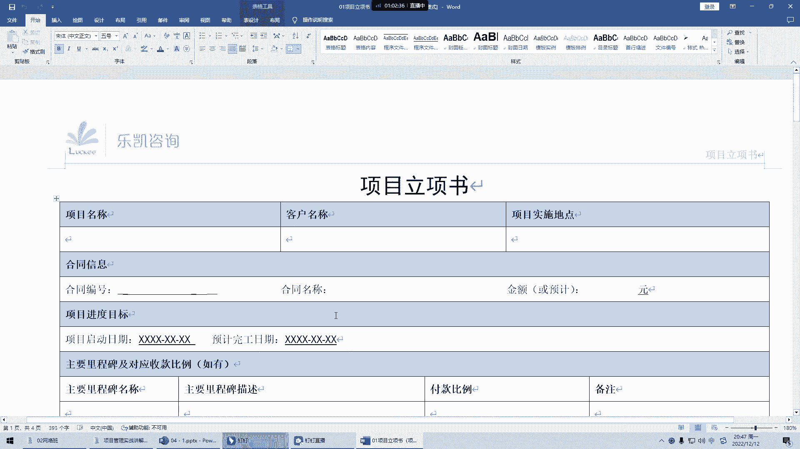

那么这个项目的正式立项就完成了好吧，所以接下来我们看一下pmbok里面，他是怎么说的，他说我们这个过程啊最终是为了做项目章程，那么项目章程是由是由项目的启动者。

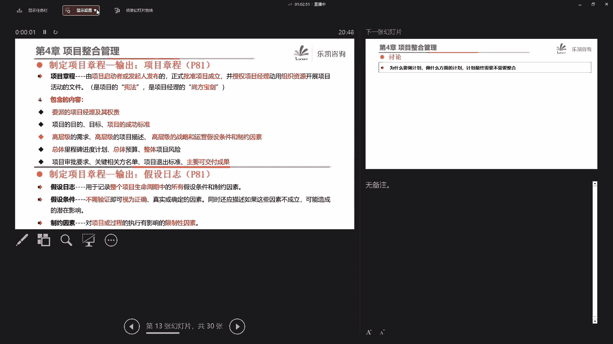

或者发起人来发布的，是用来正式批准项目的，那么项目章程包括的内容是什么呢，好内容是很重要的好吧，它包括项目的目的目标，成功标准，包括退出标准对吧，然后接下来大家要注意啊，注意这些说法。

我们这个项目的高层级的需求，高层级的描述对吧，总体的里程碑进度计划，总体的预算，整体的风险好，你会发现说来说去都是高层级的，总体的，也就是说项目章程里面说的都比较怎么样，都比较宏观，都比较宏观对吧。

哎包括我们将来要交付什么，主要可交付成果啊等等，当然既然是授权项目经理的，那么这些内容大家为什么要记住，在考试当中，只要说到高层级的，只要说到跟战略有关的，唯独只有一个东西，什么东西呢，就是项目章程。

只有项目章程，它是高层级的，我们后续学习了一些什么计划呀，这些都是很具体的好吧，说到高层级的，总体的问你从哪儿看，统一去找项目章程，好吧好，那么这是第一个输出，除了这个输出以外。

它还会出一个东西叫假设日志，那么假设日志呢，实际上是用来记录整个项目过程中，所有的假设条件和制约因素的，那么我们第六版的篇报告里面，他没有详细的去说什么叫假设条件，什么叫制约因素对吧。

那么这里呢我大致给大家介绍一下啊，假设条件就是值我们在做项目的时候，有一些我们认为应该成立的叫前提条件，对吧，就是我们要顺利的按照我们这个计划来做项目，我们必须有什么前提对吧。

比如说大家能够想到的假设条件有哪些呢，有没有同学能够想到，啊我们要做这个项目，我们已经定了一个大的目标了对吧，然后有高层级的进度的里程碑计划对吧好，那么接下来前提是什么，啊有同学说了。

前提是我们公司的人员要充足，对吧好，还有同学说了，前提是客户那边的资金要及时到位对吧，你比如说第一批款，首付款什么时候给，你要按时给呀，你否则这不是影响我们的这个一些设备，材料的一些采购吗，对吧。

那么这些都是前提啊，对吧好，再比如说举一个例子，大家来学习pmp，我们现在是3月份班好，请问我们顺利做完这个项目，它的假设条件是什么，唉，p m p这个学习的这个项目，顺利完成考试好。

那么它的假设条件是什么，我觉得有这么几个，第一个明年疫情会有很大的改变，对吧啊，这是事业环境因素的外部的一些假设对吧好，第二个对于我们同学来说，我们在打电话咨询的时候都会问课程顾问，诶。

这个通过率高不高啊对吧，唉我们课程顾问说这个通过率一般很高呢对吧，但是他后面会补充一句，只要你跟着进度学，那就没问题，所以假设条件就是大家要干什么，每天稍微花一点时间啊，比如说我在启动课的时候说。

每天花不要多一个小时就行了，对吧好，那么话要说回来，有没有可能这些因素，就是这些假设到最终是不成立的呢，有这个可能吗，好告诉大家是有可能的是有可能的对吧，我记得在很早以前啊，当时我在给一个面授班讲偏僻。

那么面授班呢相对来说人数比较少，他们每次的测验的成绩呢我都看得到，我发觉有一个同学他的成绩呢很分数很低，我就非常的担心对吧，然后我就做了一个事儿，做了什么事儿呢，我晚上九点钟给这个同学打电话。

这哥们儿接了我电话之后，我问他，我说你今天复习了吗，他说唉老师我在复习呢，我一听就知道是扯淡，因为他这个电话的背景啊就很嘈杂，我感觉就是在一个酒吧，或者在一个什么地方对吧，我感觉我的智商受到了侮辱。

所以我说你在复习是吧，请把你的书翻到115页，你告诉我第一句讲的是什么好，结果这哥们儿说，哎呀老师不好意思，我刚刚在复习对吧，我复习完了，我刚出来啊，这个时候我就意识到什么，这个假设条件可能不成立好。

那么请问如果你发现假设条件不成立，就意味着什么，就意味着这个项目存在威胁，有一些威胁可能会导致我们项目失败，明白吧好，那么这个是假设条件好，另外什么叫制约因素呢，好。

制约因素就是对我们项目产生限制的一些因素，好吧，产生限制的因素，那么比如说有哪些限制啊，比如说我们这个项目工期必须控制在几个月，比如说我们项目的成本唉，就只能是多少。

那么这些限制就像绑在我们身上的绳子一样，会限制我们项目的，那么如果说有一天我发觉制约因素得到了放松，诶，原来法律法规是不允许的，后来呢他感觉他好像开放了，允许了可以这么做。

那么这个时候我们就会发现一些什么呢，有利于我们项目的机会好，那么大家要注意，我们把这些假设条件和制约因素记下来的，目的是什么，目的是将来我们要通过假设条件和制约因素，识别威胁和机会。

而威胁和机会就是我们项目中的什么东西呢，是我们第11章要讲的风险，风险是一个中性词，它就包括了可能出现的威胁，以及可能会被我们抓住的机会，好吧，所以在一开始，我们就要建立好这一份叫假设日志。

把我们所有的假设条件和制约因素，全部都把它放进去，好吧好，那么接下来有同学问了一个问题，我解释一下啊，有同学说，制约因素跟事业环境因素是不是一回事儿，好，我说一下啊，制约因素属于事业环境因素的一种。

但是跟事业环境因素有本质的区别，好吧，我举一个例子说一下啊，什么叫事业环境因素，事业环境因素是针对整个环境的，比如说在我们中国这个环境下，你不管是在上海还是在北京对吧，还是在广州还是在别的地方。

你只要在中国这个环境下面，那么你跟别人结婚，你就要遵守什么，你就要遵守婚姻法，不管你是哪里的家庭，你都要遵循这个环境下面的统一的婚姻法，那么这种环境类的东西，你处在这个环境就必须要遵守了。

那么这种叫事业环境因素，那么什么叫制约因素呢，好比如说上海的这对小夫妻结婚，丈母娘说彩礼60万，对吧，北京的说结婚彩礼80万，管住的说结婚不要什么彩礼，意思一下有个2万块钱就可以了，好注意啊。

虽然在同一个环境下，但是每个项目它的制约因素不一样，明白吗，各有各的制约因素，这就好比我们有的项目的工期要求八个月，有的项目的工期要求六个月，有的项目的工期呢哎可能是12个月，每个项目有各自的制约因素。

制约因素最明显的一个例子体现在什么地方，它体现在各自的合同里面，能明白吧，好吧好，那么接下来这个过程就到此为止，好吧，那么我们首先要启动项目，我们的目的是要做出一份项目章程，我们可以参考什么。

然后用什么工具，最终项目章程里面包括什么，好吧，那么我相信大家应该比较清楚了好，接下来我们讲规划的整合，那么说到规划大家想到什么呢，大家很明显会想到计划对吧，确实我们规划过程组肯定要做很多的计划。

那么我问一下各位，不管是做过项目的还是没有做过项目的啊，我问一下做项目需不需要计划，需要做计划吗，哎你说到规划，规划肯定跟计划有关系啊对吧，那么我们做项目要不要计划好，很多人说需要，那么我问一下。

为什么需要计划，哎我们做项目，为什么，包括有同学说我们很多事情基本上都需要计划，为什么呢，对了，其实计划最大的一个目的就是它是我们的鸡爪，那么什么叫基准啊，其实基准就是我们的一个依据，大家想一想。

如果没有这样一种基准，你的项目究竟是进度快了还是慢了，你做的范围是多做了还是少做了呀，那么当你有这些问题的时候，其实都是把这些把我们项目的实际的东西，去跟什么去比较，实际上都是去跟计划。

或者说跟这一份基准去比较对吧，比如说我们原来的计划是做到什么地方，你现在做到什么地方，这才能体现出你是快了还是慢了对吧，如果没有计划，你怎么去比较呢，所以我们一定要做计划好。

那么接下来大家考虑一下我们要做什么计划，不管做过项目的还是没有做过项目的啊，你们有没有听说过有哪几种计划是必须要做的，首先有一个我觉得是很多人都听说过的对吧，叫这个东西，进度计划，嗯对吧。

你任何项目不管是生产力的项目，制造业的也好，建筑业的也好，还是我们软件行业的也好，但不管叫开发计划还是叫生产计划，实际上都是跟进度有关的，对吧好，除了进度计划以外，还有同学说到的。

比如说我们跟资金有关的成本方面的，在我们p p里面叫成本管理计划，对吧对吧，当然也包括成本基准这些东西，那么范围这边有吗，也有的，对吧，包括有人说的质量需要有计划吗，也需要有，包括资源管理需要有计划吗。

需要有对吧好，那么我们项目中有这么多的计划，那么我们在整合过程，他在讲什么呢，其实很简单，就讲了一个字，一个词叫整合，我们看一下他是怎么说的啊，他说我们的规划的整合的名字叫制定座椅，他不是做哪一份计划。

他不是说做进度计划，也不是说做成本计划，他说的是做整个项目的项目管理计划，那么怎么做整个项目的项目管理计划呢，他怎么来的呢，好他说这样我们把项目计划的所有组成部分啊。

比如说我们刚刚同学说到的进度的计划呀，成本的计划呀，资源的范围到风险的，把所有的组成部分拿过来，拿过来干什么，把它整合在一起，就变成了这个东西，整合这个词，其实我可以用一个更加明显的词来替换一下。

叫什么呢，其实就是把它装订在一起，对吧，我只要最终把这些所有的计划都做出来之后，把它装订在一起，不就形成了这样一份叫整个项目的项目，管理计划吗，对吧，所以这个过程他讲了什么，他什么也没讲。

就说我们最终要把它装订起来，好吧好，那么接下来大家看这张图来回答我一个问题啊，我们整个规划过程组，这一组有这么多过程，对吧好，我们刚刚说，将来我们在讲到第五章讲范围的时候，范围有范围的计划。

进度呢好有进度的计划，成本有最终的预算，也有成本的管理计划，质量有质量的计划对吧，资源有我们怎么管资源的计划，沟通有沟通的计划，有风险的计划，有采购的计划，有管理相关方的一些计划。

最终这些计划要交给谁呢，要交给我们现在讲的这个过程，把它去装订装订在一起，那么请问你们觉得这个过程制定项目管理计划，是在整个规划过程组的开始去做，还是在整个规划过程组的结尾去做，这个能够想通吗。

就是反正你最终要把这些东西都把它装订起来，那么你这个工作是在规划的一开始做，还是在规划快结束的时候去做呢，那么很明显你既然要装订，那么你肯定到最后等这些组成部分都有了之后。

才去把它装订成完整的一份项目管理计划吧，对吧好，那么接下来我们看一下pm报告里面是怎么说的，他说唉呀这个过程呢很简单对吧，就是生成一份综合的文件对吧，那么他说整个的项目管理计划呢。

可以是概括的或者详细的，那么计划呢要注意我们要足够强大，要应对不断的变化，然后呢像我们刚刚说的，最终我们要基准化，什么叫基准化呢，就是要各方都一致认可这份计划，把它形成我们项目的依据对吧好。

那么这个时候有同学说了，我们不是有一句俗话叫计划赶不上变化吗，那怎么办呢，好大家要注意，我们这些计划最终要达成共识，要把它基准化，那么如果你要改行不行呢，可以的，但是不能随便的改，我们在星期三会讲。

如果一旦基准化了，你要改就必须要走流程去改对吧，那么另外还要注意我们的计划要渐进明细好，这是我们项目中的一个特点，那么什么叫渐进明细啊，我跟大家说一下，我举一个例子。

比如说我现在要做一份整个项目的计划啊，我们就说进度方面的计划好了，好比如说一个六个月的项目，我们怎么做计划，你说我六个月啊，我把计划排好，每一天做什么啊，我排的很细，然后下个月每一天做什么对吧。

再下个月每一天做什么都排得很细，你这样去做计划行不行呢，其实不行，因为我们项目管理是科学，它不是玄学对吧，我们不是算命的，我哪知道后面每一天具体做什么呀，所以我们做计划一般会怎么做呢。

好我们一般会这么做，现阶段的工作我们可以把它细化出来拍一拍，但是将来很远期的工作，我们可能只有两个什么呢，叫概要任务对吧，甚至呢我们就只有一个大的节点，李程碑对吧，这该再远的地方，那更加不清楚了。

那么我们可以那还是一些概括性的任务，那么这是我们计划的一点的版本对吧，好，随着我们项目的实施，我们有很多信息就比较明朗了，那么接下来这个阶段的工作做完了，下个阶段的工作呢，我们也清楚了。

那么好下个阶段的也在把它细化，那么同样的远的地方，我们只能有一个概要的任务放在那边，那么这是计划的二点的版本对吧，那么我们是通过这种方法来实现渐进明细的，渐进明细的好吧，所以我们的计划不是一步到位的。

它需要不断的更新来渐渐明晰，好吧好，那么接下来回到这个过程，既然我们要装订，把这些东西都装订在一起，形成一份综合的项目管理计划，那么大家觉得这个过程的输入应该有什么。

每一个过程其实就是我们项目中的每一道工序，对吧，哎我们要做这样一个过程，做整合管理，其中的制定项目管理计划，那么接下来我们输入要用什么，好有人说项目章程，那么这个我们可以参考好，很多同学发现了。

那么你就需要什么，你将来就需要这些各种子计划呀，各种组成部分啊，好所以我们看一下篇报告里面的输入啊，好他说做这个过程需要什么输入呢，项目章程，另外还有其他过程的输出，其他什么过程的输出呢。

其他规划过程做好的子计划都要交给我，那么看到这里大家就应该明白了，这些其他规划过程，就是我们刚刚说的下面的这些过程，这些过程做出来的子计划都要交给我，对吧，然后接下来我去干什么呢，我去装订就可以了。

这就是这个过程就讲了一个意思，就是整合装订好，那么会用到什么工具呢，这些工具头脑风暴，焦点小组，反弹冲突管理引导会议管理我们都见过，接下来多了一个工具叫核对单，好我们看一下为什么要用这个工具。

核对单的英文叫checklist，听起来好像哎哟很高大上对吧，实际上大家都用过，比如说我们有很多女同学一定用过，我看到有很多的女同学啊，是这样的，在公司的电脑的显示器上会贴一张纸，那么贴这张纸。

它里面会列出来我今天要做哪些工作对吧，然后每做完一项我们就打一个勾，每做完一项我们就打一个勾对吧，用这种打勾的这种叫checklist来干什么，来提醒我们我们要做哪些，千万不要有遗漏对吧。

那么这个过程一样的，我们要整合那么多的计划，很有可能出现遗漏啊，所以我们需要有这样一个和对单，或者叫checklist对吧，只要我们整合了一个进去，我们就打一个勾，准备好了一个我们就打一个勾。

那么所有的东西都准备好了，我们就把它装订就可以了嘛对吧，所以这个工具实际上啊听起来感觉很高大上，实际上呢很简单好吧，check list好，另外我们刚刚说，既然最终在规划的快结束的时候。

我们把它装订成一份综合的项目管理计划，那么接下来还涉及到一个工具。

我们要开一个会议，这个会议呢叫开工会议，kick off meeting，对吧好，那么我说一下什么叫开工会议啊，我建议大家把开工会议呢，这个公字稍微把它写长一点，这个数啊，开工会议就是开干，你想一想。

如果我们所有的计划都准备好了，都把它装订成一份了对吧，一旦大家一致认可了这一份综合的计划，那么接下来我们就可以去干什么，我们就可以按照这一份，我们确定好的计划去执行，对不对，那么你计划都已经搞完了。

都已经一致认可了，那么我们就根据这个计划去干什么，真正撩起袖子去干啊，所以说开工会议，kick off meeting，实际上就是开干的会议对吧，那么要注意的是这个会议在什么时候开对吧，他是干什么的好。

大家注意，他说这个会议啊是规划即将结束的时候，他还属于规划过程中对吧，规划即将结束的时候啊，这个时候执行还没有开始，那么这个会议上是干什么，他要获得主要相关方，就是我们项目的主要的各方。

对项目管理计划的一致认可对吧，那么我们做计划，我们由于像我们之前讲的，我们是矩阵型组织结构，我们用了职能部门的人对吧，那么接下来我们要干什么呢，好我们要让所有的相关方，比如说职能经理呀。

公司的管理层呢一起来看这份计划，甚至有的时候需要客户也一起来看一下，那么在这个会议上，我们要传达项目的目标，获得团队对项目的承诺，要说明每个人的角色和职责，那么大家一致的认可了这份计划。

那么这个计划形成了基准，那么我们就按照这个计划去做了好吧，那么这里面大家有两个东西啊，要把它区分清楚啊，项目章程是由谁批准的，大家注意项目章程是由发起人批准的，而项目管理计划是由谁批的。

项目管理计划不是一个人说了算的，项目管理计划我们叫有主要的相关方，主要的相关方好吧，那么相关方就包括了，其实相关方，相关方就是跟我们相项目相关的各方对吧，包括我们自己内部的职能经理呀，发起人啊对吧。

包括甚至外部的客户啊，那么有同学问了一个很好的问题啊，他说，这么多人拉在一起开会，如果这些相关方有一些人没时间，那怎么办，唉这也是我们考试的时候经常遇到的一种题目，我要组织pick off会议。

开工会议对吧，那么我需要获得所有相关方的一些认可支持，结果呢就是有那么一两个孙子，他就是没时间，那怎么办呢，好大家要注意，遇到这种情况很简单啊，不要求他们一定要参加啊，说百分之百的参加啊。

有人说用虚拟会议行不行不行，为什么呢，只要题目中说到他没时间，就代表他真的不能来啊，比如说别人在飞机上，或者别人呢在医院里面看病，你说这个时候怎么用虚拟会议啊，对吧啊，包括比如说相关方。

有一个客户正好是一个女领导，他快要生小孩了，这人家怎么开会啊，这些都不重要，那么重要的是什么好，如果有相关方没时间，我们要么在这个会议之前，去跟他讨论，要么在这个会议之后找个时间去跟他讨论。

不管你会前跟他接触也好，会后跟他接触也好，总之你要让他去参与这个事情，然后获得什么，获得他的承诺，这一点很重要，明白吗，就是说他如果实在来不了，那么你也要汇钱或者会后去跟他沟通对吧。

然后最终获得他的承诺，好吧好，那么这个会议呢在考试中出现的比较多，希望大家要引起重视啊，他的这个主要的目的是什么，包括谁去批准项目管理计划，那么现在啊我们在考试当中一般都叫k cf会议。

在以前考试的时候呢，有可能把它翻译成启动会议，那么我们是中英文的对照的，大家看好这个英文就可以了。

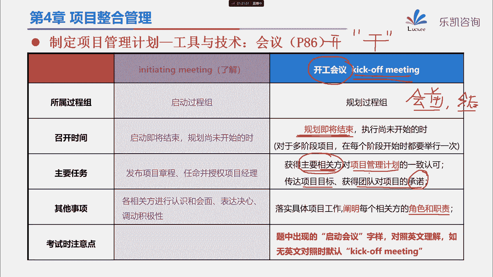

好吧好，那么最终这个过程装订了一份，综合的项目管理计划，那么项目管理计划里面包括了这些子计划，包括了这些基准对吧，那么关于还有一些其他的组件，关于这些东西呢，大家稍微去看一看就可以了。

我们在后面学习的过程当中，每一个都会陆陆续续的接触到。

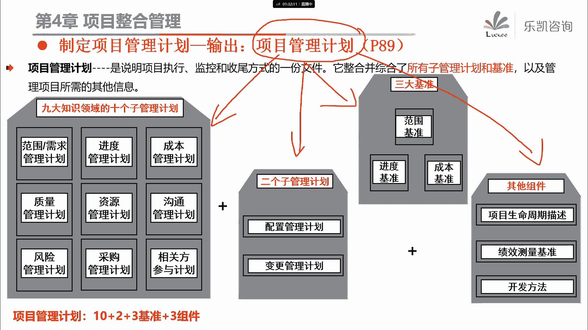

好吧，包括我们后面会讲什么叫指南型的计划。

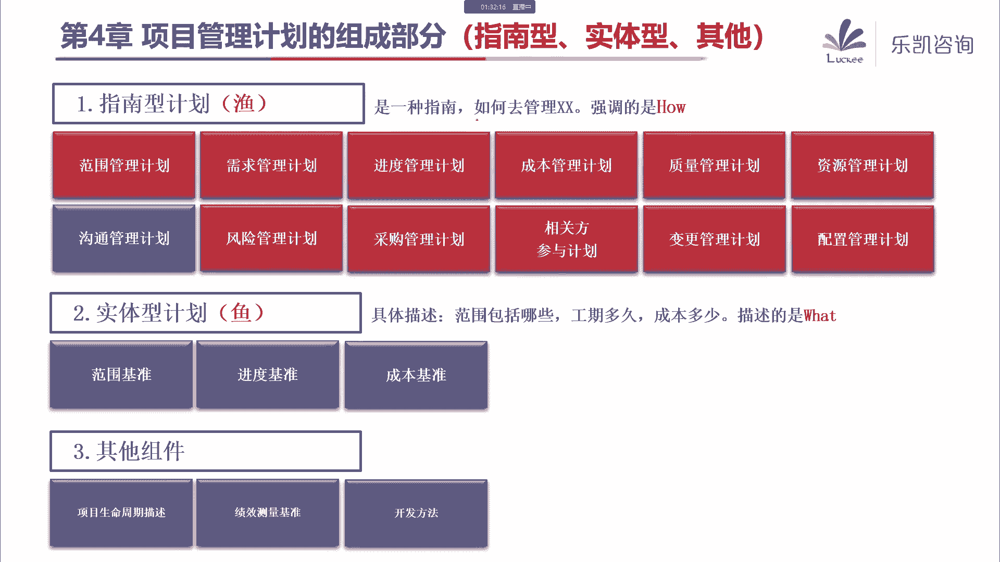

什么叫实体型的计划，那么这些东西呢，大家有兴趣的可以稍微的先了解了解。

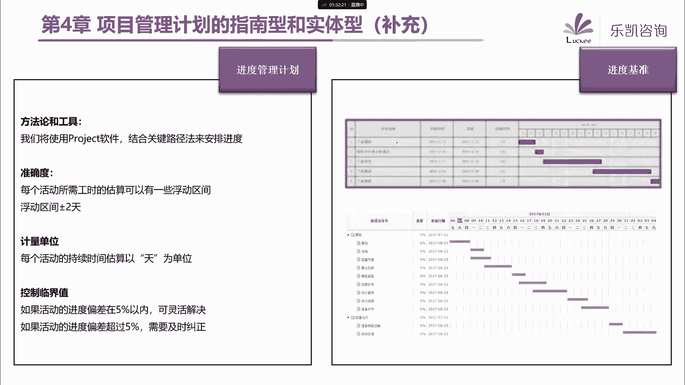

我们后面会逐个的去讲，好吧好。

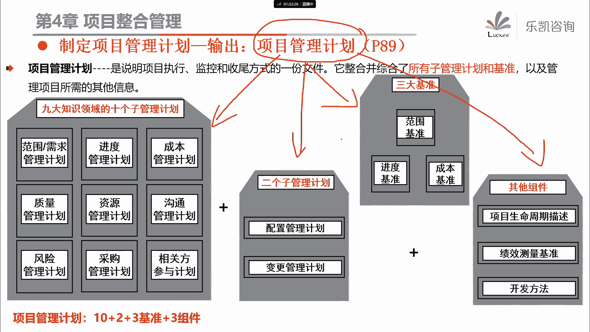

那么另外要注意啊，其实在我们整个做项目的过程当中，除了计划以外，还有一些非计划类的东西，比如说我们之前讲过的一个东西，我们遇到经验教训，我们也要把它记下来啊对吧，像经验教训登记册。

包括我们在项目中遇到的一些问题，我们要把它记在问题日志啊对吧，那么这些东西大家想一想，这些东西需要得到相关方的批准吗，比如说我总结了一个经验教训，我记了一个东西，我需要别人去批准吗，其实不需要。

那么这些东西就不需要形成基准，它就不是一个计划，那么这类东西把它叫什么呢，好大家注意，我们有一个专门的一个专有名词，注意啊，在这些过程中，我们团队自己使用的一些文件，我们把它叫项目文件好吧。

所以我们在整个项目过程中，大致的把一些文档啊分成两类，那么一类是需要一致批准的项目管理计划类，一类是项目文件类，好吧，在我们书上89页有这张表格，他说到了哪些是项目管理计划，哪些是项目文件。

这些东西呢不要去背啊，不要去背，等你学的学完了之后，你自然就知道哪些是计划，哪些是文件，好吧好，那么这是我们规划的整合，大家明白了整合的意思吗，其实这个过程啥也没讲就讲了。

最终我要把它装订成一份综合的项目管理计划，对吧，所以整合这个知识领域，它其实就讲了一些整合的点，没有讲细节，好吧好，那么接下来到了执行的整合，他在说什么呢，那么我问一下，如果有了执行啊，如果有了计划。

接下来我们应该怎么去执行，哎我计划都定好了，那么接下来怎么去做呢，那么很明显我们要做这几件事，要招兵吧对吧，比如说我们第九章会讲到的，怎么去组建团队，包括怎么去建设团队对吧，包括我们还要干什么呢。

买马吧，比如说我们第12章会讲的，我们要去采购吧对吧，包括有同学说我们要分配任务吧，要分配人员吧，让他去做吧，好那么对于整合的执行来说，他只讲最终我们整合出什么东西出来，他不讲细节对吧，他不会去讲。

哎我们怎么去分配任务，怎么去安排团队，怎么去采购，我们看一下他怎么说的，他说第三个过程指导与管理项目工作啊，他说这是一个整合过程，它属于执行过程中对吧，那么我们最终招兵买马最终是为了什么。

他说最终我们实际上是为了做项目管理，计划中确定的工作对吧，最终把我们的可交付成果把它做出来，我们要整合人力，整合物力对吧，整合这些资源，最终把东西做出来就行了，至于人哪来怎么去采购。

那是其他地方要讲的对吧，这边就说我们是为了把东西做出来是吧，那么另外要注意，如果说我们的计划会发生变化，我们批准了之后，这些已经批准的变更，我们也是要做的好，我问一下，从这句话，大家能不能看出来。

这个过程有哪两个比较重要的输入，就是最终我们项目把可教育生活做出来啊，我们要依据什么，很明显是有这两个，第一个就是我们要按照项目管理计划去做，这里面确定的工作吗，对吧，所以这是一个很重要的输入。

要按计划去做，那么另外还有一个什么重要的输入呢，如果将来我们发生了变化，所以批准的变更对吧，经过批准的变更，我们也要把它做出来，那么这就是这两个重要的输入对吧啊，我们去按计划去做。

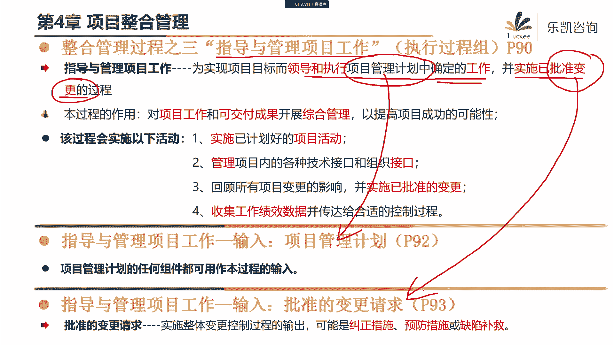

如果有变更，批准的变更，我们也要去做好，那么接下来他介绍了，那么我们可以通过什么来做呢，他说我们可以通过p m4 系统，叫项目管理信息系统啊，比如说我们可以利用这里面的，比如说做计划的进度，计划工具啊。

啊比如说这个工作授权系统啊，好工作授权系统，我说一下工作授权系统等同于什么，等同于oa，好吧，进度计划工具呢我们后面会介绍，比如说project，信息收集与发布工具有点像什么呢，内部的邮件系统对吧。

配置管理系统，有点像我们后面要讲的版本控制对吧。

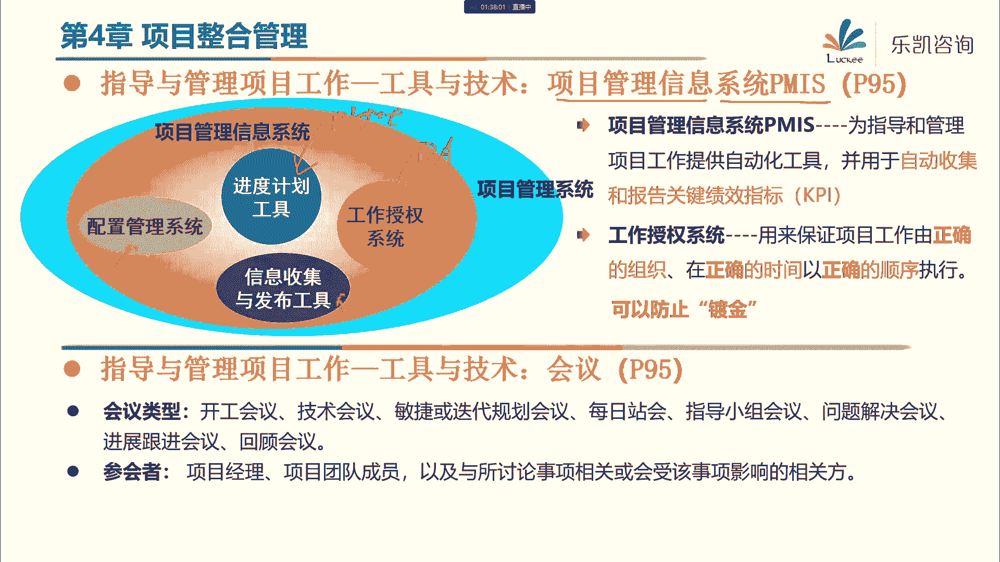

那么这些东西都是信息技术软件，那么是我们的事业环境因素，公司有什么你就用什么好吧，那么这个过程工具不重要，这个过程最终我们要了解，那么我们整合的人力和物力，最终我们这个过程会做出来什么啊。

最终我们整合了人力物力，要做出我们的可交付成果，对吧，那么可交付成果我们一开始就接触过了，他说可交付成果就是任何一个过程阶段，或者项目完成的时候，产出的独特的并且可核实的这些东西对吧。

那么我们强调为什么要强调可核实呢，因为我们做完了之后并不是直接交给客户的，我们要去干什么，我们要去检查，要去测试，所以可交付成果它是具有可核实性的好吧，那么另外大家要注意，可交付成果是一个统称。

它包括我们最终的产品，也包括我们在这个过程中做的项目管理计划，它都叫可交付成果，那么我们要整合人力物力，把这些产品全部都做出来，同时相应的计划也要有，这是我们的第一个输出，那么第二个输出是什么呢。

第二个输出就是我们在做的过程当中，可以收集到一些原始的观察值和测量值，那么这个是什么，比如说我们在做的过程当中，我们要实时的去看看我们完成了多少啊对吧，花了多少钱啊，那么这些原始的观察值和测量值。

叫工作绩效数据，叫工作绩效数据对吧，我们之前讲过，那么工作绩效数据将来我们可以做分析，了解我们项目的一些状态好，那么如果说遇到一些问题怎么办，我们可以把它统一记录在问题日志，这是一份项目文件。

那么我们项目中所有的问题，都可以把它记到问题日志，那么问题日志在记的时候要描述清楚，问题是什么，我们打算让谁来负责，我们希望在什么时候得到解决对吧，那么问题日志会随着新问题的出现。

和老问题的解决不断的去更新，那这也是一个很常见的输出好，另外还有一个比较关键的输出，在我们真正执行的时候，有可能会出现一些变化的，你做着做着，比如说我觉得我要多加一些设备对吧。

或者我们软件行业要多加一些功能，那么这个时候很有可能在做的时候，会输出什么呢，会输出变更请求，好我问一下做过项目的同学，有没有听说过这样一个东西叫cr，听说过吗，应该有很多做项目的同学。

听说过这个东西叫c2 对吧，change request变更请求，比如说我给大家看一眼我项目上的变更请求，变更请求有很多的说法对吧啊，比如说c2 呀，比如说变更单啊，或者变更申请啊。

那么这一份文档就是我项目中在做的过程当中，不得不做变更，那么这个时候怎么办，唉我们说我们可以改变一些计划对吧，那么这个时候我们要提变更请求好，这份文档一般会这样写，在我们国内做项目啊。

我们一般是给监理提变更对吧，至某某某监理公司由于什么什么原因，所以我们提醒关于什么什么的工程变更，那么接下来这个变更后面会负啊，变更情况说明具体的变更的方案对吧，涉及到价格的一定要写清楚。

比如说报价清单，报价说明等等，明白吧好，那么这些东西最终谁来审批，他肯定有一个正式的流程去审批的对吧，像我这个项目，那不光是我们这边出审批意见，监理单位啊，比如说工程监理啊，投资监理啊，他都要去审批。

对吧，只有经过完整的审批流程之后，那么你才能做好吧，那么我们这边输出的变更请求，就是一个普通的变更单，那么这个变更请求最终一定要获得批准好吧，那么它将包括里面说变更请求是关于任何文档。

可交付成果或者基准的正式的一些题型的变更，它可以是直接的间接的外部的或内部的，可以是法律要求或者合同要求的对吧，那么变更他可以口头提，但是必须要书面的形式去记录，好。

那么接下来变更它具体的细分了这么几种类型，纠正措施，预防措施，缺陷补救和更新，那么我说一下这几种的区别啊，什么叫纠正措施啊，纠正措施就是当我们发现项目有一些偏差之后，我们事后要通过一些变更来纠正。

最简单的例子是什么，将来如果我们发现进度慢了，延期了，那这个时候怎么办呢，我们就要去纠正啊，要赶上这个进度啊，好那么这个时候我们就必须要干什么，我们就必须要比如说加班啊或者加人啊，用这种方式来纠正。

所以说纠正类的变更是一般在什么时候做，在事后的，我们把它称之为纠正对吧，那么什么叫预防呢，预防是事前的变更还没发生问题，在之前我们就要做变更了对吧，比如说我举一个例子，一道题目这么说嗯。

我现在项目的进度啊已经延期了啊，进度已经延期了，那么这个时候项目经理呢，他提交了一份便当请求，他要求我们要增加资源，加班加点去改善这个进度，去维护原先的计划，那么这种变更是什么类型的变更。

那么大家要注意，既然是已经延期了，是事后的，那么这个应该算什么呢，算纠正措施对吧，那么什么叫预防呢，好他可以这么说，由于下个月就要过年了对吧，很多同事呢要休年假，这有可能对我们的项目的进度造成影响。

所以在现在我就提交了背景的请求，要求大家现在要怎么怎么样来改善进度，好，这个是什么，注意这个就是事前做好的预防工作，那么这种就叫预防措施好吧，所以我们一个是事前的，一个是事后的，好吧好。

那么接下来什么叫缺陷补救呢，好大家要注意啊，曲线补救跟你的进度快与慢，成本超支还是范围多与少没有关系，缺陷补救只针对一种问题，就是质量问题，明白吧，我们做的东西质量不合格，有一些缺陷对吧。

那么这个时候我们就要做缺陷补救，唉比如说这个我们做软件行业的遇到了一些bug，比如说我们制造业做的一些东西，可能有些技术参数达不到对吧，不合格，那么当然最后还有一种变更，是直接更新的计划的。

直接改计划的好吧，那么这几种类型呢大家稍微了解一下，现在的考试呢不会去让你去细分这些东西好吧，那么变更呢大师里有这么多种好吧，最终要获得批准，那么今天呢我们就只讲这三个过程啊，我们今天的课程就到此为止。

那么接下来我要说一下啊，大家听了这三个过程，有没有觉得这三个过程讲的很空啊，对吧，这感觉好像什么都没讲，那么为什么会出现这种情况呢，就因为这个过程它叫项目的整合管理，那么我帮大家回顾一下。

我们今天讲的这三个过程，为什么它叫整合管理啊，第一个关于启动的整合，启动在整合什么，我们前期有一些商业文件，我们可能跟客户签订了协议，这些东西算什么呢，其实这些东西算背景项目的一些背景对吧。

我们做的是背景的整合，然后促成什么呢，促成项目的正式的立项，对吧，所以我们第一个过程叫制定项目章程，实际上就是把这些背景信息整合起来，写一份项目章程，然后让发起人批准，最终确立项目的正式地位。

这个是背景层面的整合对吧好，接下来讲规划的时候，注意啊，他没有讲进度计划怎么做，没有讲成本计划怎么做，没有讲质量的风险呢，什么都没讲，他只说了一件事，他说将来当我们有了这些子计划之后，我们要做一件事。

做什么事呢，我们要把它全部拿过来，然后装订在一起，对吧，形成一份综合的项目管理计划，然后干什么呢，好然后开一个kick off会议，大家一致认可了，那么我们就按照这个来干对吧。

所以注意我一开始在上课的时候就说过，这个过程我们不要去关注这些具体的细节，哪儿来，你只要知道这个整合过程他在干什么就行了，对吧好，再到执行的整合，按照道理讲，你应该说你怎么样招兵有人吧。

你怎么样买马有设备吧对吧，你怎么样去分配任务吧，你怎么去安排工作吧，他什么都没讲，他说反正最终我们是为了什么，最终我们是为了把可交付成果，把它做出来对吧，有问题即问题，日志有变更，你提变更请求明白吗。

所以说我们今天讲的第四章的这几个过程，他没有讲细节，只体现了整合，那么接下来我问大家一个问题啊，我们在讲课的时候又看到了这张表格。

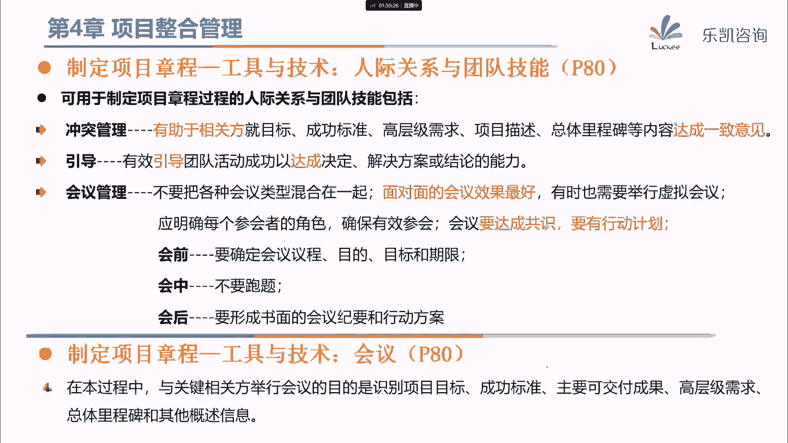

大家知不知道我们后面要讲的详细的，每一个过程，像这些这些过程啊，最终我们做这些过程的目的是为了什么，知道吗，为什么首先要讲整合知识领域，因为我们最终后面的这些东西都是为了什么呢。

都是为了实现最终的整合启动，有启动需要整合的东西，规划，你做这些最终是为了整合出项目管理计划，执行招兵也好，买马也好，这些东西最终也是为了整合，把可交付成果做出来对吧，监控的这些信息。

最终也要把它整合起来，其实我们做项目所有的事情，最终都是为了整合好吧，这是第一个我要强调大家注意的，那么第二个要注意的，大家有没有发现我们实际做项目的顺序，跟pmbok讲解的顺序是不一样的。

这就会给大家一开始的学习带来一些困难，比如说我们真正做项目的顺序应该是这么做啊，先做项目章程，接下来我们就开始收集需求，排进度，弄成本管质量对吧，然后这些都弄完了好再来做项目管理计划。

然后接下来组建团队去采购，然后再来去执行，实际做项目应该是按照什么顺序呢，应该是按照纵向的顺序先启动，然后再规划，规划好了之后再执行，然后全过程监控，最终收尾，而pmbok讲的顺序。

它不是按照纵向的过程组的顺序来讲的，它是按照横向的，先讲整合，再讲范围，再讲进度，按照知识领域来讲的对吧，所以他这个顺序呢，但是大家要理解他为什么要按照知识领域来讲，有同学知道为什么吗。

明明项目应该按照这个顺序先启动的，事情做完了，然后再做规划呀，然后你才去执行啊，再去监控啊，唉为什么偏颇和第四章开始到第13章，是按照知识领域的维度来讲的，好大家注意，因为pmbok这本书内容很多。

那么这就意味着我们有不同的人用这本书，它需要有不同的地方，比如说我一说大家就会明白啊，如果你在公司里面，你的职位是ba商业分析师，或者呢是需求工程师，你应该重视什么，你在学这本书的时候。

你应该重视的是第五章，这一招是跟需求有关系的，那么如果你在公司是做成本管理的，那么你应该重视哪一章呢，你应该重视第七章成本管理，如果你在公司是做风险管理的，做风控的，那么你要关注的是哪一张呢。

第11章风险管理对吧，那么那么同样的，如果你在公司，你是负责采购的，那么你要关注第12章采购管理对吧，他这样去按照这样一个顺序去讲，实际上是为了干什么呢，把每一个知识领域把它分开对吧。

把每个知识领域分开，所以说他按照这样一个方法去讲，那么我建议大家现在要做的事情是什么，其实我们不要去纠结别的问题，我们只要把每一个过程都把它了解清楚了，那么在最后大家应该看到过。

我们以前的这个课程的介绍对吧，最后我会帮大家把这些过程。

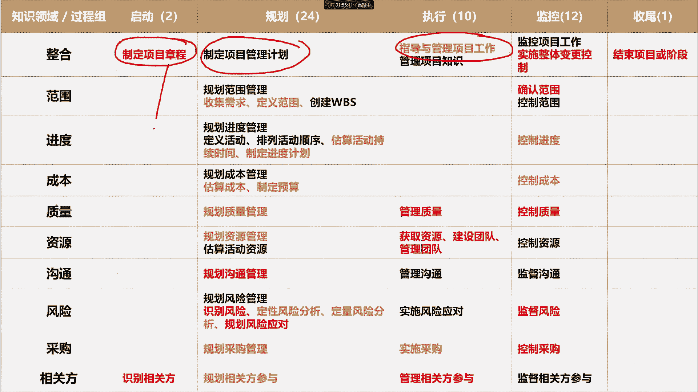

按照顺序再去把它串起来，那么这个时候整个项目从头到尾大家就清楚了，好吧，所以我们现在的任务就是，你把每个过程就像一根项链一样的，你把每一颗珍珠都把它学好，那么最终串成一个项链就比较简单好吧好。

那么今天的课程我们就到这里，那么今天讲的内容有没有什么疑问的，有疑问的同学现在开始答疑好吧，今天就讲了三个过程，关于启动的整合，规划的整合还是执行的整合，好有同学说，在规划之前呢，好我说一下啊。

在上课的时候已经说了，在启动的时候啊，项目章程最终是由发起人批准的，对吧，那么到了规划的时候，做计划发起者会帮忙做计划吗，他是不会帮忙做计划的，计划一定是项目经理带着团队去做对吧。

必须要在规划之前明白吧，你否则的话你规划了都已经在规划了，没有项目经理，那么接下来谁去做计划呢，明白这个意思吧，好接下来有同学说镀金是什么意思，这个呢我们后面会讲啊，现在呢先了解一下什么叫镀金啊。

简单的说就是客户没要你做，但是你自己呢主动去做的，明白吧，我们在下个星期会讲范围，会讲镀金，就是说客户没让你做，你为了讨好客户呢，去多做了一些本身不在计划内的东西，好那么我问一下这样做有问题吗。

有问题的，为什么有问题啊，第一个你这样做在浪费你们组织的资源，浪费组织的资源对吧，第二个镀金的东西出了问题，你要不要管啊，你也得管对吧，所以我们在pmbok后面的学习，特别是我们周三的学习。

会强调我们项目的执行是按照什么来执行，是按照计划来执行，如果你一定要做计划以外的东西，就必须要怎么样，就必须要获得批准，明白吧，镀金会带来很大的问题，我们在下个星期讲范围的时候会详细的去讲。

有一个同学提了一个很有代表性的问题啊，他说啊it go是每个过程的重点，这些东西怎么去背，我说一下啊，这些东西的不要死记硬背，我来帮大家演示一下你应该怎么去背好吧，比如说制定项目章程，来我问一下啊。

作为一个启动的整合，在这个阶段，你觉得他能参考的输入有什么，你能回忆得出来吗，我觉得应该基本上都能够回忆得出来，对吧，你比如说前期的商业文件，你肯定要参考啊对吧，有合同的，你参考合同呢不就这两个输入吗。

对吧好，再比如说我们刚刚讲的指导与管理项目工作，这样一个执行过程，它的输入是什么，那么你就回忆一下这个过程是干啥的呀，这个过程他说要按照计划去做对吧，另外如果有变对吧，那么批准的变更也要做。

那么这两个核心的输入不就记住了吗，一个叫项目管理计划，一个叫批准的变更请求对吧，所以输入怎么去记，你了解了这个过程是做什么的，你的输入就应该能够记得住，对吧好，那么接下来工具怎么去记呢。

其实对于工具的要求不是太高，大家做到一点啊，你不需要背每一个过程有什么工具。

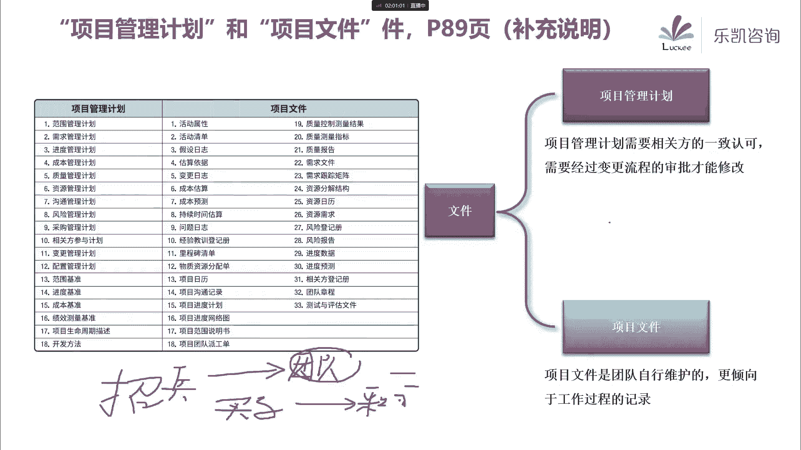

但是你要知道每一个工具是什么意思，比如说我问一下。

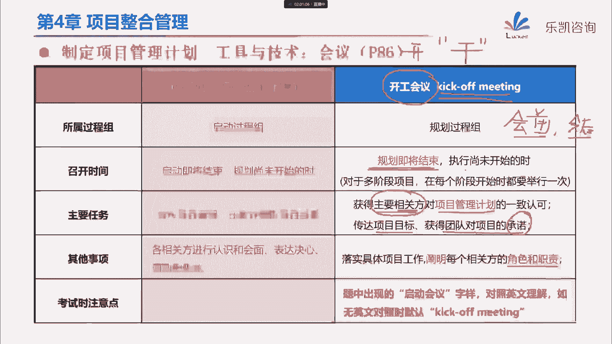

为了避免遗漏，我们一般会采用一种工具对吧。

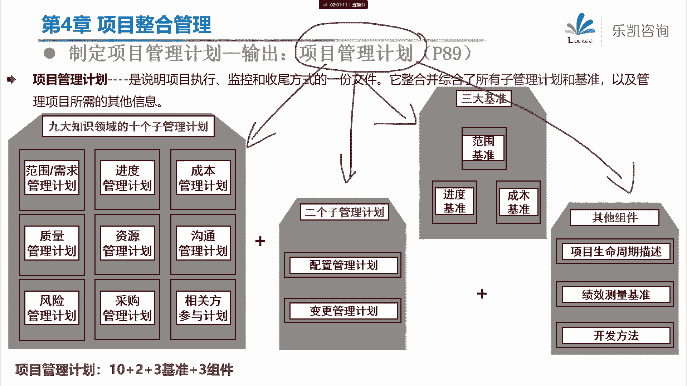

我们可以把要做的事情列在这个工具，这个清单里面，然后呢用这种方式来提醒我们避免遗漏，那么请问这是什么工具啊，你听啊。

这不就是check list吗，好了你就知道了，这个是check list和对的对吧好，再比如说我们现在要讨论一个问题，我们找了注意啊，他一般会这么描述，我们找了同一个领域的专家，再来进行讨论。

这是什么工具，那么你就要知道啊，同一个领域的专家，比如说我们聚焦在法律这个领域，或者聚焦在财务这个领域，聚焦在某一个领域的这个叫什么，聚焦在某一个点嘛，焦点小组嘛，是不是。

那么你这些工具了解他的意思就行了，考试也只也只是这么问啊，啊比如说项目经理遇到一个什么问题，他需要怎么做对吧，那么这涉及到什么，那么选项里面就有这些工具，这些东西都很简单啊，不要去死记硬背的明白吧。

那么至于有同学说。

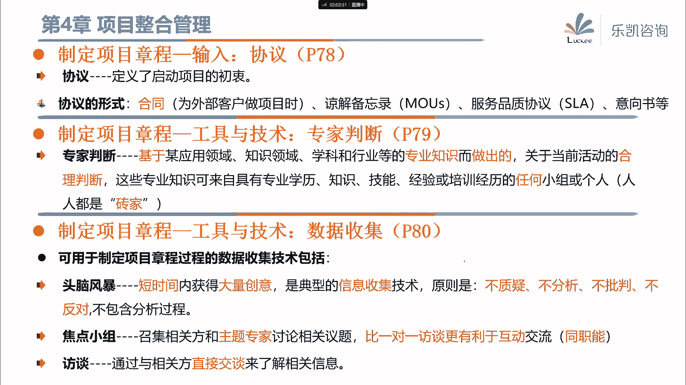

那么讲了这么多，我哪知道哪些是重点呢，你去参考什么。

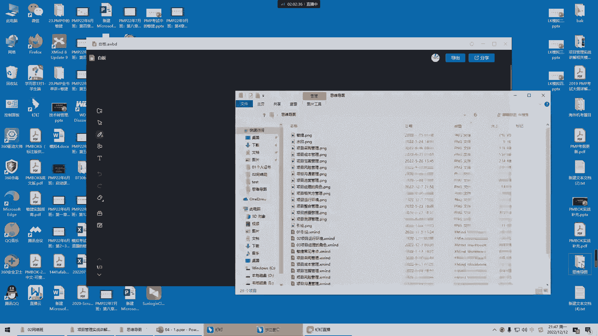

等我们第四章讲完了之后，我会给大家一样的。

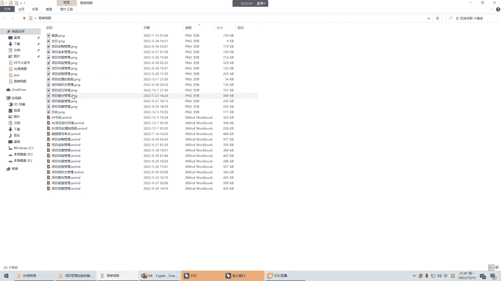

有思维导图，明白吧，你会发现我的思维导图里面输入工具输出。

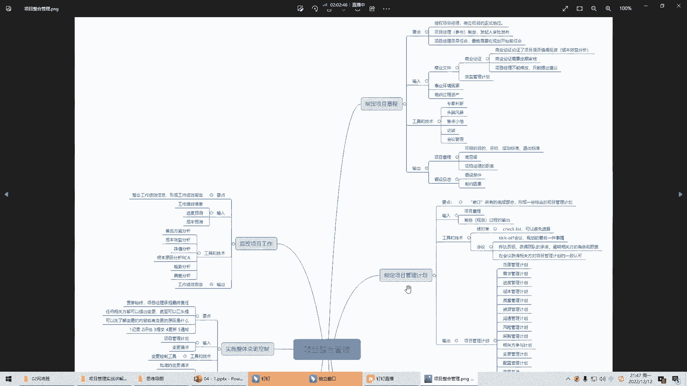

我没有把一些所有的东西都把它列在里面对吧，你只要把这些里面强调的东西记住，有这个印象就可以了，明白吧，学偏僻千万不要背，说实话，大家呢平时都有工作，都有自己的生活，没那么多时间去背了，你稍微复习复习。

对这些东西有印象就可以了，明白吧，就像我们有同学说的，毕竟考试是什么题目，它是选择题，好吧好，那么接下来有同学问了一个很好的问题，他说，那么按照道理讲，那么为什么在制定项目章程的时候。

就提到了项目经理呢，为什么在前期商业论证的时候，就要求项目经理介入呢，对吧好，关于这个问题，小李同学，我问一下你结婚了没有，李同学，你结婚了吗，我请问啊，在你结婚之前，你跟你老婆谈恋爱的时候。

你是怎么称呼你老婆的，啊你跟一个女孩子双方都有意思对吧，你们正式确立了男女朋友关系，还没结婚呢，你的微信上是怎么备注的，大部分人都会背诵两个字叫老婆，那么请问了，你还没结婚呢，你凭什么叫别人老婆。

你这不是耍流氓吗，原因很简单，因为在你眼中，他就是你要找到的那个人，对不对，那么我们这边也是一样的啊，在项目章程之前有没有项目经理，有可以有，只不过这个项目经理怎么样呢。

我们可以把它理解成他是准项目经理，或者说这个项目的基本上是交给他负责了对吧，确实是在项目章程批准的时候，能够理解这个意思吧，所以就会出现这种情况，说诶还没有羡慕张总的时候，哪来的项目经理参与商业论证啊。

哪来的项目经理去制定项目章程啊对吧，这个时候他是一个候选人，他是一个准项目经理，好吧，这个问题问得挺好啊，越早越好对吧，早点介入，那么项目章程最终发布的时候，好吧，我觉得这个问题提得挺好的啊。

好季克杨同学问了一个问题啊，他说制定项目章程难道不需要客户参与吗，难道客户没有要求吗，有的啊，有的，那么有没有同学告诉我，在制定项目章程的过程当中，我们在什么地方考虑到了客户的要求。

项目章程呢它毕竟是一份内部的文件对吧，这是立项，那么我们当然要考虑客户的要求啊，那么什么时候考虑的呢，张良凯同学第一个说出了答案，在什么地方，在这儿，我们要参考协议，对吧，其实我们这些高层级的预算啊。

总体里程碑进度计划呀对吧，甚至包括主要的可交付成果，很大一部分来源来源于什么，来源于我们跟客户签的合同，对吧，有这个输入一定会考虑的，好有人说到k off跟启动会议的事情。

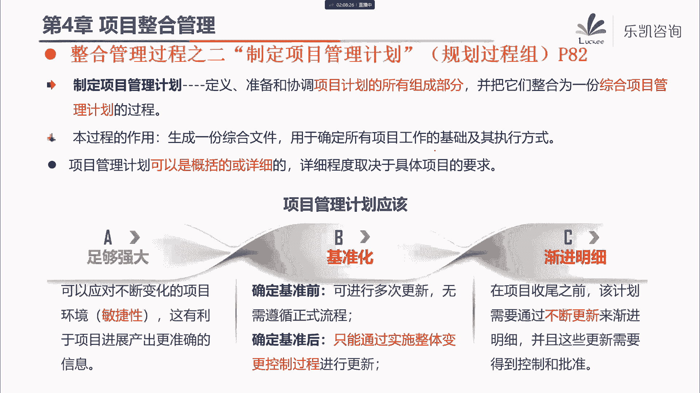

我说一下啊，为什么在讲义上会特别提醒一下呢，因为现在呢我们第六版的考试，基本上k off会议都叫开工会议了好吧，那么以前呢翻译的问题，有可能把它翻译成启动会议，这个呢大家稍微注意一下就行了。

如果你实在不放心怎么办呢，很简单，因为题目是有英文的，你看一下kick off meeting，他说的是这个，那么你就要知道他是规划即将结束的时候，开的这个会议啊，就这个婚姻好吧。

那么至于项目刚刚开始启动，开始立项的时候开的会议，这个呢稍微了解一下，考试的时候呢没有考过，好吧啊，有兴趣的了解一下，好公海欠还是公海西啊，这个是一个多音色，好像对项目管理计划。

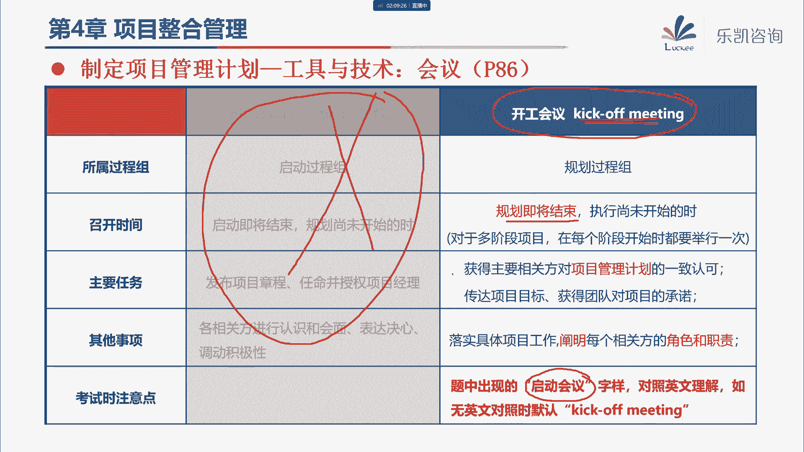

它不属于项目文件啊，我说一下，我们项目中的文件也好，或者说就是项目中要产生的文档也好，它分为两类，好吧，分为两大类，那么那些需要大家一致认可，不能随便改的，作为我们管理的依据的，这一类叫项目管理计划类。

它的特点是不能随意改，要改要走变更流程，明白吧，那么还有一类它的名字，注意啊，他就叫项目文件，它是一个专业名词，它就叫上项目文件，明白吧，那么这些东西呢是团队自己拿在手上的，为了便于为了帮助我们管理的。

比如说经验教训登记册啊，比如说问题日志啊，你该记记该改改，不需要别人批准的，好吧，所以项目中的文件或者说文档分为这两类，分为这两类好吧，没有谁属于谁，这是病，这是同一个层级的两类。

好有同学说计划在渐进明细的时候，需要一致认可吗，需要的啊。

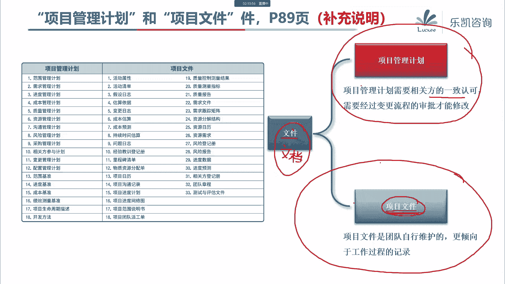

注意看讲义的这里。

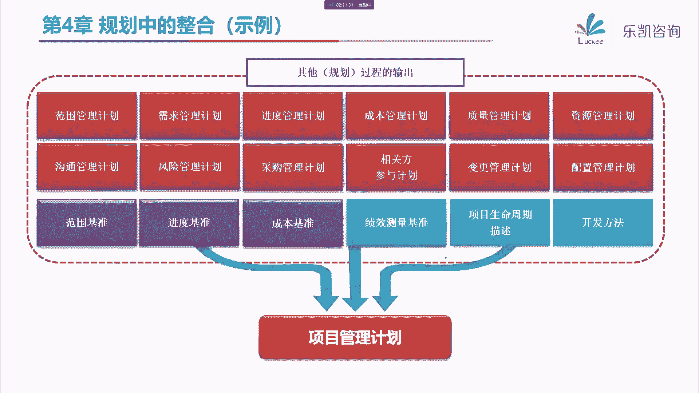

项目管理计划，确实要通过不断的更新来渐进明细，但是要注意，这些更新也需要得到控制和批准，明白吗，只要计划的更新，一定要走变更流程，我们星期三会讲的，那么至于说进度计划为什么不算项目管理计划。

这个到我们第六章你就会明白了，好吧，进度在项目管理计划里面有两个，一个叫进度基准，一个叫进度管理计划，但是进度计划不是我们在讲第六章的时候，会详细的去描述，好有同学说假设条件跟制约因素，能不能再讲一下。

我说一下啊，假设条件这个词啊，我建议大家在理解的时候，换成这个词叫前提条件，我们做项目，既然你要按计划去执行，它一定是有前提的，我不知道大家做过项目的同学啊，有没有写过我们项目中每一个东西要20。

做它的前置条件是什么，一般我们会写的就是你这个前提是什么，对吧，我举一个例子，比如说我们在做项目的过程当中，有一些事情啊是需要甲方准备好的对吧，比如说我在做项目的时候，我们涉及到机房，机房的设备的调试。

对吧，那么机房设备的调试有一个前提是什么呢，就是客户那边的光纤，电信的光纤要到位啊，要拉到机房了对吧，如果你这个东西不到技法，我怎么调试呢对吧，那么像这些东西，就是我们顺利去完成我们计划的一个前提条件。

对吧，那么这些前提条件或者叫假设条件，我们要把它写清楚的，那么写清楚的目的是什么，万一到时候这个条件不成立，就会对我们项目带来影响对吧，那么这些东西叫假设条件，或者呢就是我们通俗上所说的叫前提条件。

那么什么叫制约因素啊，制约因素是指对我们项目产生限制的一些因素，比较典型的就是合同当中的条款，比如说我这个项目能不能慢慢做呢，不能因为合同要求六个月之内必须要结束，我这个项目钱可不可以随便花呢。

不能对吧，因为合同的总金额就那么多对吧，那么这些都是制约因素啊，明白吧，制约因素，你就看成是绑在我们项目身上的绳子对吧，那么我们为什么要记录这些制约因素，因为我们要看这些制约因素有没有得到放松。

如果制约因素放松，我们就有很多的机会，那么假设条件跟风行有什么关系啊，因为如果这些前提到时候是不成立的，就会带来什么，就会给我们项目带来威胁，明白吧，如果这些制约因素诶能够得到放松，能够稍微宽松一点。

这也许会给我们项目带来机会，那么我们要干什么，我们要想办法规避威胁，抓住机会，威胁和机会统称就叫风险，我们第11章的风险管理，有一个工具，就叫假设条件和制约因素分析，来帮助我们识别威胁和机会的，好吧。

这就是我们记住假设条件和制约因素，的一个目的，好我说一下啊，不要看书上是怎么写在书上的，89页，他也给出了明确的分类，明白吧，关于项目管理计划和项目文件，我觉得比较合适的是看书上的89页。

就是那本很厚的，偏报考的89页，他明确把项目管理计划和项目文件，把它给分出来了，你去看这一块是比较清楚的好吧，其他地方的最好不要去看，因为为什么呢，你最终所有的东西当然都包括项目的文件对吧。

项目的历史文件都，那不管是项目管理计划还是项目文件等，项目结束了，最终都属于项目的历史文件，对吧，但是在一开始的时候，我们需要细分，因为有的东西在做的时候，在项目执行的时候，有的东西需要相关方去批准。

而有的东西呢不需要相关方去批准，这涉及到修改的时候，要不要走变更的问题，还有什么其他问题没有啊。

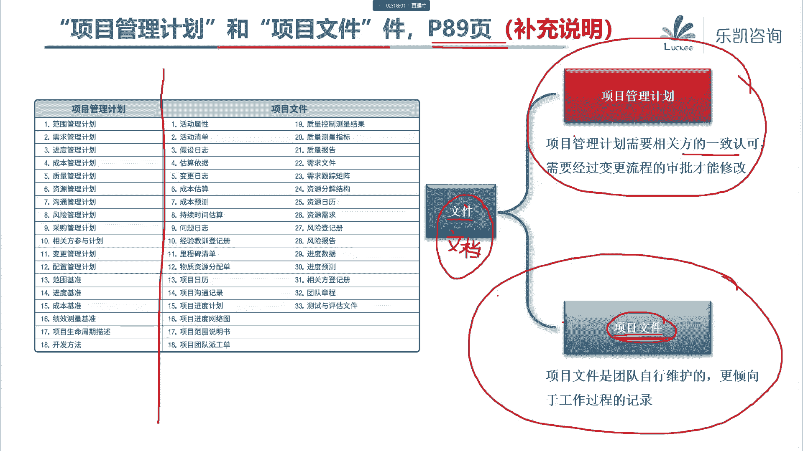

制约因素跟假设条件不是一回事啊。

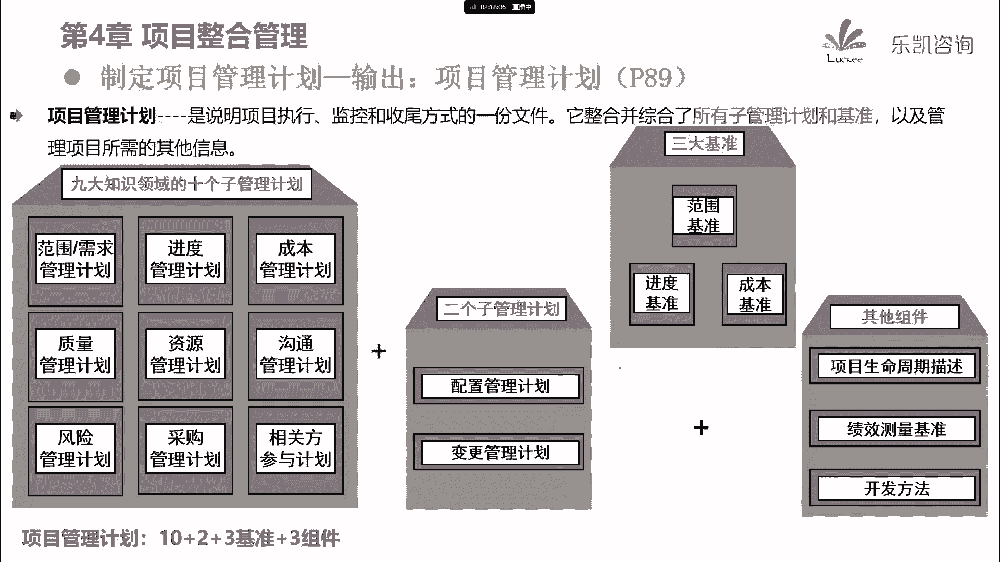

不要把它混在一起，假设条件是一个前提条件，明白吧，你说项目只有50万的资金不能超，那么你说的这个事情其实是一个制约因素，对的商业论证可以由项目经理来做，我们也可以由商业分析师参与。

但是最终的批准是发起人批准，所以说小龚同学问的这个问题问得很好啊，大家要注意商业文件，项目章程，项目经理可不可以做，项目经理都可以做，做是无所谓的，明白吧，我们只强调p，项目经理不能批，对吧。

商业论证项目经理不能批发起人批，项目章程也是发起人批，而且还有一点，大家有没有发现，一旦批准了之后，项目经理也不能改，对吧，商业论证一旦有了，一旦批了，你后续启动的时候，即便你审查的有问题，你能改吗。

你不能改，项目章程，项目经理能改吗，也不能改，因为大家要明白一个很简单的道理啊，如果一定要说谁能改，那么还是一样的，谁有权利批，谁才有权利去改对吧，因为你其他人改了之后，即便你改了。

最终也要获得他的重新的批准，对的，刚刚有同学说的，假设客户的资金能够如期的到账，那么这个就是假设条件对吧，或者说诶我们这个项目，我们打算在几月几号开始去实施，那么我希望在几月几号。

或者说合同签订后的几个工作日，那么第一笔款要到，那么这个是什么，这个是假释条件，如果他不能及时到位，那么这肯定是有风险的，假如条件不成立，会带来风险，对吧，那么制约因素说的是什么呢。

说的是限制你的一些因素啊，比如说学pmp这个项目有没有制约因素，有制约因素在我们国内是统一考试的对吧，它限制了你必须在那个时候考啊，其他时间不行啊，那么比如说诶有一天公司派你去国外。

那么国外考p m p它就是随时约考的，它没有固定的时间的对吧，那么这个时候就相当于什么呢，相当于绑在你身上一个绳子松开来了，那么这个时候你就要抓住这个机会对吧啊，原来我在国内考p mp是有限制的。

必须要全国统一考试，他说几月几号就几月几号，而这个时候呢正好公司派我去国外对吧，去干什么，哎我正好没有这个限制了，国外它是随时约考的，那么我是不是可以抓住这个机会，顺便去约个考，把pp给烤掉了，对不对。

这就是制约因素不存在了，或者说制约因素放松了，那么就出现了什么呢，出现了机会，那么我们可以去抓住这样一个机会，好如果没有其他问题，好项目章程里面高层级的东西啊，我说一下啊，什么叫高层级的风险。

比如说举一个例子，我们有一些具体的风险啊，比如说我们这么去描述客户那边受到一些影响，他们的服务器有可能不会按时到货，这会对我们项目的后续的调试对吧，和使用带来风险，或者说对我们项目的进度带来风险。

那么这就是一个很具体的风险对吧，那么什么叫高层级风险呢，高层级风险他不是说的具体的哪一个点，他说的比如说他会这么描述，我们跟这个供应商没有合作过，对吧，我们跟这个供应商没有合作过。

所以在供应商这一块可能有一些风险对吧，或者我们公司资源不是太充足，或者这个项目的技术难度很大，它存在一些技术性的风险对吧，就笼统的说了一句，他不是说到具体的哪一个方面对吧，具体的哪一个事件。

他就整体的说一说啊，我们这个项目技术难度很高，存在技术性的风险对吧，或者我们这个项目供应商从来没合作过，这里面可能会有问题，明白吧，所谓的高层级的就是很宏观的，它不具体不具体，那么具体的东西我们在后面。

每一个章节会具体的去说啊，比如说范围怎么去把它细化，进度怎么去把它吸排好吧，项目章程在立项的时候，我们只有一个总体的东西明白吧，唉都是宏观性质的啊，随着我们的学习啊，我们有一些具体的东西会接触到。

就像我们刚刚说的，有一个同学对吧，他如果没有结婚，如果想找老婆做这样一个项目，高层级的需求是什么，他可能就随便说一句，唉呀，人好就行了，长相嘛大大方方的就可以了，就这些东西说的很含糊，什么叫人好。

什么叫长相大大方方对吧，这些东西你立项可以，但是后面具体去执行的时候，团队是没法执行的，所以我们后面才会讲什么呢，我们要收集详细的需求，比如说你希望这个你将来的老婆，年龄范围是什么范围，身高多少对吧。

从事什么工作，他的性格是什么性格，我们后续都要去把需求去干什么，都要去把需求把它细化出来，这才能指导我们执行明白吧，所以说还记得我上课说过一句话吗，凡是跟组织战略有关的，我们统一去找项目章程。

因为项目章程它的层级比较高，是高层级的对吧，那么具体的执行层面的，我们要依据什么，我们要依据将来的项目管理计划，包括这里面详细的一些基准和子计划。

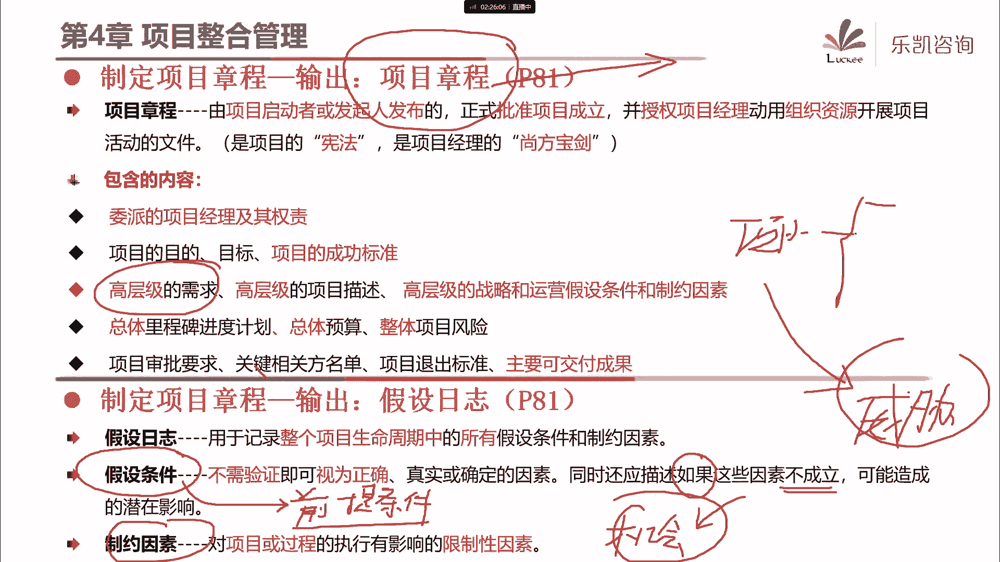

它是具体的操作层面的好吧，光有项目章程，它是无法指导我们去实施的，我觉得这个问题问得挺好的啊，在下个星期我们学需求的时候，其实大家是要考虑这个问题，我们当时在项目章程里面。

在合同里面是有一些客户的要求的，也叫需求，为什么我们要做收集需求这个工作呢，对吧，实际上就是要把宏观的需求把它去细化出来，好如果没有什么其他问题，我们今天就先到这里好吧，如果还有什么疑问的。

可以在微信群里面相互讨论一下，或者直接艾特我好吧，有问题大家尽量在微信里面问啊，因为丁丁呢我很少看丁丁，一般是只是用来上课的，好吧啊，有什么问题及时的沟通好。

