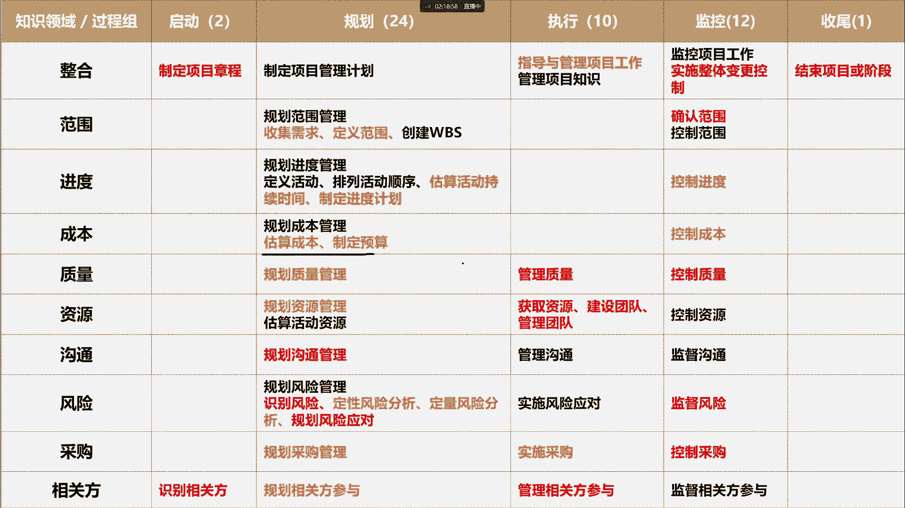
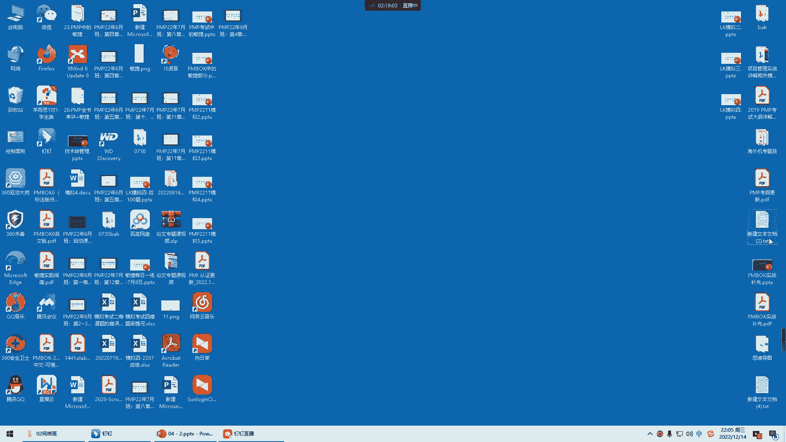
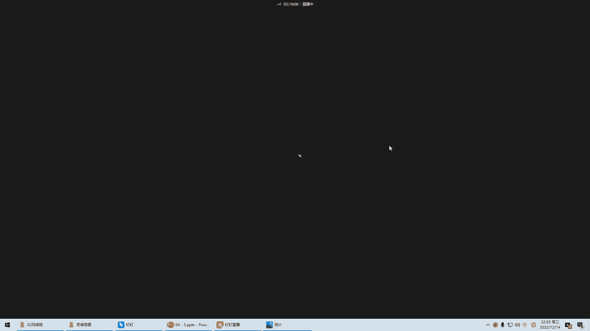
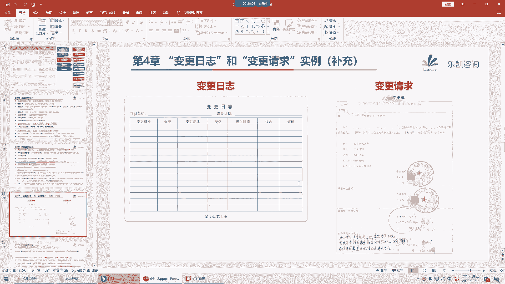
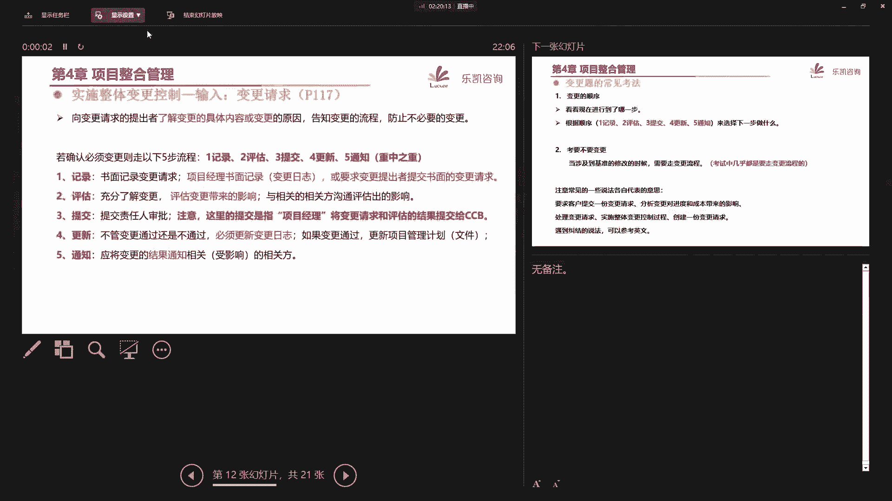
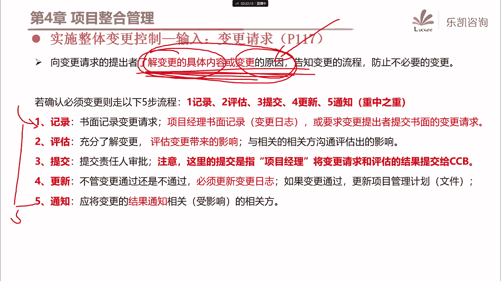

# 2024年PMP认证考试课程针对PMP新考纲最新免费零基础也能轻松听懂 - P5：PMP第4章：项目整合管理（下） - 乐凯咨询 - BV1Rj411G7gs

好各位同学晚上好，我们在星期一的时候呢，我们已经开始学习了第四章项目整合管理对吧，我们开始进入了49个过程的学习，那么上一节课呢我们主要学习了启动的整合，规划的整合和执行的整合。

那么接下来我们把剩下的这几个整合的过程呢，再一起看一下好吧，那么执行的整合呢，其实还有一个啊，就是这个过程叫管理项目知识，那么管理项目知识这个过程是干什么的呢，他说我们要用现有的知识。

那现有的知识实际上是什么呢，是我们的组织过程资产，包括我们在当前项目中已经有的一些知识对吧，那么我们要利用现有的知识，然后生成新的知识来实现项目目标，帮助组织来学习，那么做这个过程的目的。

熟鸡蛋就是为了整合知识嘛，那么整合知识主要是有利于什么呢，那么大家一定要注意，我们一定要用当前的知识来支持什么，来支持未来的项目或阶段，就是说我们为什么要做好知识管理，为什么要积累经验教训对吧。

主要是为了有利于将来的项目或者将来的阶段，那么在这个过程当中啊，它有几个概念，大家要稍微注意一下，第一个知识呢实际上分为两种，一种叫显性知识，一种叫隐性知识，那么显性知识就是指我们容易用用这个文字啊。

图片或者数字进行编撰，简单的说就是我们能够把它写下来的，这些知识叫显性知识，那么这种知识它的特点是什么呢，它的特点是它容易分享对吧，比如说我们有很多东西，都会用这种显性知识的方式来进行传递和分享。

像比如说大家怎么样使用钉钉啊对吧，比如说像pmbok，他也是写成一本书，然后给大家的，大家可以随便去买对吧，那么虽然它容易分享，但是呢它不能保证被正确的理解或运用，这是显性知识的一个特点，诶。

分享起来很容易，但是呢要让别人全部都了解，其实呢不一定那么容易对吧，那么另一种是隐性知识，那么隐性知识就是直我们难以把它给写出来的，很难把它写出来啊，比如说像一些信念啊，洞察力啊，经验和诀窍啊。

有的东西呢说或者说写把它写下来呢，写不清楚对吧，那么有一个很典型的例子啊，比如说我们在座的有很多同学一定会开车对吧，那么开车我们要怎么办，我们肯定要找一个驾校去学习啊对吧。

那么特别是在我们学到科目二或者科目三啊，特别是科目三我们在考大路考路考的时候，你的教练是怎么教你的，有没有哪一个教练说，来来来，我这里有一本秘籍对吧，这本秘籍你拿回去读一读，那么接下来在路上怎么开车。

你就会了，不可能的对吧，没有哪个教练会给你一本秘籍的，是不是，那么教练是怎么教你的呢，好你在开车，然后教练在旁边干什么，在进行友好的人际交流和互动对吧，唉有的时候呢可能还要问候你两句诶，通过这种形式。

你慢慢的也就学会了，你让他写写出来啊，他是不可能写出来的对吧，所以说像这种呢，开车就是一种很典型的什么经验和诀窍是吧，那么像这种经验诀窍我们一般都是通过什么，通过人际交流和互动啊。

通过这种互动的方式来进行分享，所以说这两种知识啊各有特点啊，显性的容易把它写下来，容易分享，隐性的呢不容易写下来，需要通过人际的交流和互动来分享好吧，那么我们在真正做项目的时候。

我们一定要重视知识的管理，因为我们在第四章一开始的时候就说过，现在啊这个人员流动比较频繁，很容易造成知识的流失，所以我们要做好知识管理的工作，对吧好，那么注意这边有一个考点出现了。

要做好知识管理最重要的是什么啊，他说我们做知识管理最重要的环节是，我们要营造一种信任的氛围啊，要营造一种信任的氛围，另外呢要激励人们分享自己的知识，和关注他人的知识，就是我们项目经理是有责任。

要营造这样一种氛围的啊，让大家能够进行更多的这种知识的共享工作，好吧，那么这个过程它的输入呢，其实没有什么好多说的啊，主要的输入呢就是这个东西，经验教训登记册，包括我们刚刚提到的组织过程资产对吧。

哎我们要提供一些现有的知识，然后来促进生成新的知识，那么至于其他的速度，大家稍微看一看，我们后面会讲的好吧，那么这个过程呢有两个工具，这两个工具呢稍微重要一些，那么重要，不是说他考试要考。

而是说我们在平时做项目的过程中，要学会去使用，比如说有同学刚刚问到，那么我们怎么做好知识的共享呢，对吧好，我们先看第一个工具叫知识管理，他说我们怎么样去整合知识，做好知识的共享，那么我们可以用这个工具。

这个工具可以把员工联系起来，所以他是把人联系起来，那么把人联系起来可以干什么呢，可以合作生成新的知识，分享隐性知识，然后我们可以集成不同的成员所拥有的知识，对吧好，那么我问一下大家，大家平时在公司里面。

有没有用过一些人际互动的方式，来做一些知识的共享，遇到过吗，比如说比较典型的啊，像我们有的公司可能会项目经理啊，每个月或者说每隔一段时间，我们会组织一次项目经理的大会对吧，像经验交流会等等对吧。

这就是一种很简单的知识管理的工作对吧好，那么我在平时做项目的时候，我用了两种方法来做好知识管理，来促进人与人之间的联系，这两种方法大家在以后工作的过程当中，可以考虑使用好吧，一种方法叫工作跟随。

那么什么叫工作跟随呢，在我以前的公司，我当时在做项目管理的时候啊，我们公司有这样一个做法，就是凡事将来想做项目经理的啊，不管你是技术也好，你是设计也好对吧，凡是你将来想做项目经理，愿意去带一些项目的。

那么要做一件事儿，就是首先你要成为项目助理，先跟着一个老项目经理呢，先做几年项目对吧，所以我们公司项目经理一般是要带项目助理的，那么项目助理带过去一起做项目，他有个什么好处呢。

就是项目经理一方面呢可以项目助理呢，一方面可以帮个忙打打下手，另外一方面呢他也需要去观察项目经理，从项目开始到最后他是怎么去做的对吧，包括他是怎么准备项目的启动的，怎么去跟客户开会的对吧。

怎么去跟客户谈判的，整个一个过程他都要跟着这个叫工作，跟随工作跟随，简单的说就是师傅在做徒弟，跟在后面干什么呢，再看对吧，那么用这种方式啊，就像有同学说的，老带新的方式，那么来促进知识的共享。

促进知识的这个分享对吧，那么这是一种比较常见的方法，在我以前的公司呢用的比较多，叫工作跟随，那么还有一种方法呢，我也用过的这种方法叫这个，叫跟随，指导，好那么大家注意跟随指导呢。

跟我们刚刚讲的工作跟随呢，它是反过来的，那么什么叫跟随指导啊，比如说我以前有一个项目，也是一个外地的项目，那么我跟项目跟项目助理说，我说这个项目啊，这样因为你也跟我做了好几个项目了对吧。

这个项目呢你就直接去做对吧，那么你直接去做呢，我并不是说我不去，我也会跟着你去的，你所有的开会，所有的跟客户的谈判，所有的工作的安排，我都会跟在你旁边，但是我不会说什么，你自己去弄对吧。

那么如果说我发现你做的有问题的，那怎么办，因为我们在外地一般会租一个房子嘛对吧，我说晚上等回到我们的宿舍之后，我再跟你说是吧，好那么接下来项目助理就直接开始去做了啊，他作为一个现场的实时经理。

那么他去做，包括他跟客户开会，他跟客户去谈判，我在旁边也听着，那么如果发现有一些问题的回来，我就跟他说，那你今天哪一句话其实说的是不合适的对吧，为什么不合适啊，有这样一个问题。

那么以后你应该怎么去说对吧，就是这种方式就是说白了就是徒弟去做，那么师傅呢在旁边呢指导对吧，那么像这种叫跟随指导，叫跟随指导，好吧啊，有同学说这个为什么不住酒店，我们做外地项目。

带一个团队过去要做很长的时间啊，啊可能要做七八个月啊，就住酒店，说实话项目的成本扛不住啊对吧，那不管怎么说啊，反正到最终因为大家要注意一点，在客户现场，在客户面前不要去批评别人好吧。

这个我是有这样一个原则的，就是说他们做的再不好，在客户面前是不能提出批评的对吧，你如果在客户面前去批评别人，会打击别人的积极性对吧，会影响他在客户那边，现在的在客户那边。

现在已经好不容易树立起来的一种啊，不管是威望也好或者信任也好对吧，所以说一般我们在客户那边不要当面去批评，如果有什么做得不对的，那么回来等下了班之后，回到我们住的地方，我们再慢慢去说啊。

去教教别人嘛对吧，那么像这种叫跟随指导，那么实际上我觉得在做项目的过程当中啊，这两种方法是比较好用的方法，那么除此以外，当然就是我们刚刚说的唉，我们还可以开一些经验教训的分享会啊对吧。

看一些项目经理的交流会啊，那么通过这种方法来分享经验和教训，那么另外我提一个细节啊，我们在分享的时候不一定只分享经验，说我做得好的，我拿出来分享，实际上有一些教训也可以拿出来分享的，对吧啊。

比如说我在什么地方，由于我当时怎么怎么考虑不全面，所以导致了这样一个问题，那么风险教训的目的是什么，目的是我们其他人要注意去避免类似的问题，好吧，那么不管怎么说，知识管理它体现的是什么。

人与人之间的互动，所以它比较有利于哪一种知识的共享呢，比较有利于隐性知识，隐性知识好吧，那么这是第一个工具，那么第二个工具呢叫信息管理，那信息管理它就比较偏向于什么呢，显性知识的分享。

那么他是怎么做的呢，实际上说白了就是我们要把一些东西啊，把它记录下来，对吧啊，我们可以去创建一些，比如说像在知识库里面写一些文章啊，对吧啊，写一写一些其他的东西，那么用这种方式来促进显性知识的分享。

形成文档，形成文章也好对吧，形成案例也好都可以，那么这里面呢我也可以分享一个细节啊，我们可以通过一些手段来促进显性知识，向隐性知识的延伸，那么这句话是什么意思呢，比如说我们在公司的内部网站上。

我们可以发表一篇文章对吧，哎比如说关于什么什么，什么什么东西的一个讨论对吧，那么这篇文章的末尾可以增加这么一句话说，哎如果说有什么其他的观点的诶，我们欢迎大家来跟我一起交流，然后留一下公司的钉钉号。

或者留一下个人的微信号，就是说通过增加一些互动的要素，来促进人与人之间的互动，促进像隐性知识的延伸好吧，那么这两个工具，实际上在我们平时做项目的过程当中啊，是用的比较多的，那么这两个工具呢虽然考的不多。

但是大家呢可以去在今后的做项目过程中，可以去尝试使用好吧，那么至于其他的工具，什么积极的倾听啊，引导技术啊，领导力，人际交往，政治意识这些都比较简单，大家稍微看一看啊。

人际关系与团队技能其实就是字面意思啊，没有什么好多说的，那么这个过程最终是为了得到什么，最终是为了得到一份经验教训登记册好，大家注意这份文件他是这么说的，这一份经验教训登记册在项目的早期。

我们就应该创建，就一开始就要创建议，你可以认为是一份空白的文档，早期就要创建了，那么什么时候要总结经验教训呢，其实我们之前已经讲过了，在整个项目期间，我们都要不断的更新，都要不断的更新对吧。

那么最终等项目做完了之后，那么这一份经验教训登记册要放到什么地方去，要把它放到我们经验教训知识库，也就是说我们组织过程资产里面去对吧，那么这样做会有利于未来的项目，那么说到这里，我想问一个问题啊。

你们有没有发现这个过程，它的输入有经验教训登记册，你看对吧，然后最终这个过程做完了，得到的输出又有经验教训登记册，大家能明白为什么这个过程输入有它，输出还是有它吗，能够理解吧。

好有人说以前项目的经验教训的计策，这个说法呢不是很准确，因为以前项目的经验教训呢，其实是组织过程资产对吧，那么为什么这边输入除了组织过程资产以外，在讲义上明确写了经验教训的计策输出，又有经验教训的计策。

好，大家注意，其实呢它就体现了这个过程的一句话，我们要使用现有的知识，那么什么意思呢，比如说在一开始的时候，我们有一份经验教训登记册对吧，这里面呢记录了两条经验教训，那么经过我们在项目期间不断的总结。

不断的积累对吧，好最终它里面又增加了三条，对吧好，然后再做哎，又积累了几条，又增加了几条，对吧，那么你看从这个过程当中，这个东西是作为输入吧，然后输出了新的版本的经验教训登记册，然后他又作为输入对吧。

然后又得到更新版本的经验，教学的历史，实际上他在不断的干什么呢，不断的更新，不断的总结吗，对吧，就这么回事，所以他又是输入，又是输出好吧，那么另外大家要注意的，在考试当中有一种题目啊，一定要特别重视啊。

特别简单，一定要把这个分数拿到，凡是说到上一个项目，做什么东西有利于未来的项目，那么一定要注意项目它本身是独特的对吧，那么如果一定要说项目跟项目之间有什么联系，那么唯一的联系是什么呢。

其实就是我们组织的组织过程资产，也就是经验教训之类的，所以说说到上一个项目，做什么东西能够有利于未来的项目，那么这种题目的选择要么就是经验教训的计策，要么就是更明确的叫组织过程资产对吧。

项目和项目之间就这么一点关系，好吧好，那么这个过程很简单，实际上他在强调我们要做好知识的整合，好接下来我们再看，我们刚刚讲了执行的一个知识的整合，接下来监控的整合，看这个过程叫监控项目工作。

那么首先我说一下啊，在座的各位同学有没有谁知道，或者说有没有谁对这两者是有疑问的，究竟什么叫过程，什么叫过程组，有没有人有疑问的，啊有同学加我微信，然后问我这样一个问题，就说什么叫过程啊。

什么叫过程组啊，那么我们现在陆陆续续讲的，一个一个的叫什么呢，比如说我们上节课讲的制定项目章程啊，制定项目管理计划呀，指导与管理项目工作，包括我们刚刚讲的管理项目知识对吧，这个叫什么好，大家注意啊。

这里面一个一个的一共是49个叫什么，49个叫过程，那这些所有的一个一个的都叫过程，他有输入，有工具，有输出对吧，那么我在一开始就跟大家说过，这49个过程呢，你可以把它看成是一个班级里面的，49个学生好。

那么接下来什么叫过程组呢，这49个学生坐在教室里面，他要分什么，他要分组啊对吧，竖着分的就叫一组一组啊，第一小组，第二小组，第三小组，那么你看这49个过程竖着分，一共分成了五组，那第一组，第二组。

第三组，第四组和最后的第五组，那么五组呢分别给了他一些名称对吧，一个叫启动过程组，这些过程都是在启动的时候要做的，一个叫规划过程组对吧，一个叫执行过程组，一个叫监控过程组，还有一个叫收尾过程组。

所以呢就像我们教室里面49个学生，竖着来分的，就是五组五大过程组对吧，当然我之前说，你要知道一个学生在教室里面坐什么位置，除了足以外还有什么，还有几排嘛对吧，那么横着封又封成了石牌对吧。

那么这十排是什么呢，就是十大知识领域对吧，所以不管说五大过程组还是十大知识领域，实际上说来说去是什么东西，说来说去都是说的这49个过程，明白吗，所以这49个叫过程，而把过程进行的分组就叫过程组好。

那么接下来我问一下，监控项目工作是过程还是过程组，这很明显是一个过程对吧，监控项目工作它是一个过程对吧，那么这个过程它属于监控过程组，也属于整合知识领域，明白吧，它是一个过程，而监控过程组是什么东西。

如果要说到整个一个监控过程组是这一块，这些过程形成了一个小组，才叫过程组好吧，那么现在大家其实都是很清楚的对吧，都是回答的啊，它是过程，那么为什么我要强调这一点啊，因为学着学着就有同学忘记了。

特别是看到这个名字，监控项目工作感觉是一个过程组，实际上它是一个过程好吧，这是第一个要注意的，那么我们要看这个过程是干什么的呢，它为什么属于监控的整合工作呢，好，他说这个过程啊。

是跟踪审查和报告项目整体进展的，让大家了解项目的当前状态，让大家呢做一些预测，了解将来可能是什么状态对吧，然后这个过程是唯一一个输出工作，绩效报告的过程，那么我问一下啊，根据我们已经学到的知识。

你们觉得如果要输出工作绩效报告，那么应该是什么东西整合成报告，关于这一点大家还有印象吗，我们把什么东西整合起来变成报告呢，在我们一开始第一节课讲过三个东西，工作绩效数据，工作绩效信息。

工作绩效报告对吧好，那么我们当时讲的时候说，数据是最原始的观察值和测量值，数据要经过整合分析，变成工作绩效信息对吧，然后把信息整合起来，形成一份报告，所以说你要得到工作绩效报告，你要整合什么。

注意要整合的是工作绩效信息，所以这个过程的输入就出现了工作绩效信息，那么讲到这里，有同学又会有一个疑问，既然这个过程是把信息整合成报告的，那么又在什么过程是把数据变信息的呢，好那么关于这一点啊。

我详细给大家讲解一下，我们之前讲过这些过程，首先我们要做一份项目管理计划对吧，然后我们呢要按照这个计划去执行，那么在执行的过程当中会有一些实际的数据啊，比如说我究竟完成了多少，怎么怎么样对吧。

那么把这实际的数据跟计划去比较，你就会发现可能存在什么呢，我们用一个词来说，可能存在差距，或者叫可能存在偏差对吧，那么体现在什么地方呢，比如说我们在将来讲第五章，就下个星期讲第五章的时候再讲到控制范围。

我们就会把实际我们做的东西跟计划去比较，我们就会发现我们究竟有没有少做，或者有没有多做，对吧好，那么一比较发现这些偏差，那么这些偏差是什么东西，其实就是范围方面的工作绩效信息对吧。

也就是说将来我们在第五章的控制范围，会得到范围方面的工作绩效信息，那么同样的我们把实际的进度跟计划去比较，就会发现什么呢，进度方面的偏差，在我们第六章控制进度，通过这种分析就会发现诶。

进度是提前还是落后了，就会得到进度的工作绩效信息对吧，包括成本去比较，得到成本方面的工作绩效信息，也就是说在后面每一个知识领域，他总有一个控制控制过程对吧，叫控制什么什么什么或者监督什么什么什么。

会得到对应的工作绩效信息好，那么接下来有了这些工作绩效信息，我们应该怎么去跟别人汇报，怎么跟客户汇报，怎么跟领导汇报呢，我们是只汇报范围吗，还是只汇报进度呢，都不会，因为这个汇报是不完整的。

我们要汇报就必须要干一件事儿，好干一件什么事儿，我们有范围的绩效信息了，有进度的绩效信息，有成本的绩效信息对吧，有各个维度的绩效信息，我们要做一件事，你看有同学就很好，余豪同学就说了一个很专业的词。

我们要把这些信息怎么样，要整合，把信息整合起来，最终形成一份报告，跟别人去汇报是不是好，所以这个过程监控项目工作他是干什么的，大家明白了没有，他没有讲具体的每一个维度，它的数据怎么配信息。

他说的是等你们各自的信息都有了之后，怎么办呢，好交给我，交给我来做整合，或者我们还可以用上一节课，说到了一个很通俗的词叫什么呢，装订对吧，把这些信息整合起来，装订起来，形成一份什么综合的报告对吧。

所以在这个过程他没有讲数据变信息，他只是讲了，最终我们要把信息装订成一份拍投稿，所以这个过程他的输入一定有工作绩效信息，而输出会输出什么会输出工作绩效报告，好吧好。

那么这个过程了解了这个关键的输入和输出，基本上就差不多了，那么这个过程还有一个好处是什么呢，它的工具，就是我们将来怎么样去把信息整合成报告啊，好他的工具里面提到了很多的分析技术。

这些分析技术呢在后面都会陆陆续续出现，但是这边呢实际上可以把它看成是一个汇总啊，我们可以去了解每一种分析技术，那么我们一个一个来看一下，那么大家要注意在pp里面的这些分析技术，大部分很简单。

我们只要看名字就行了，那么第一个政治分析呢，我们先放一放，这是我们第七章讲政治管理的重点啊，我们后面会讲怎么做政治分析，好吧好，接下来我们一个一个来看，首先偏差分析好，说到偏差分析。

大家能不能告诉我是看什么跟什么之间的偏差，很明显嘛，偏差偏差实际上就是看实际或者说实际啊，和什么和计划，或者说和目标之间的差距嘛对吧，所以偏差分析很简单，就是审查目标绩效跟实际绩效之间的差异对吧。

那么一审查就会发现进度是快了还是慢了呀，那很简单的偏差分析好，接下来趋势分析，好从字面意思可以看出来，趋势分析是看什么，看趋势的，根据现在来预测将来唉，有人说怎么去预测啊，好很简单，我举一个例子。

我现在有一个项目啊，原计划呢是四天把它做完，四天做完一个项目，那么在第二天下班的时候啊，我发现实际上大家只完成了其中一天的工作量，就第二天下班的时候，只完成了一天的工作量对吧，那么我们可以预测一下。

按照这样一种工作的绩效，唉如果保持这样一个效率，那么最终这个项目做完得需要多少天，那么很多人一看这不很简单吗，小学的计算题啊对吧，过去了两天你才干了一天，只有计划的一半啊，所以原计划要四天的。

我估计啊你照这个绩效做下去啊，四天是做不完的，你可能要八天才能做完对吧，实际上这种就叫趋势分析好，所以说这个过程它的输入有两个东西啊，一个叫将来我们进度方面的预测，一个是成本方面的预测。

那么通过这些预测，我们做好趋势分析，好吧好，接下来再看根本原因分析，根本原因分析是一个很重要的工具，不管是在我们学习的时候，还是在将来做项目的时候，都是一个很重要的工具，它的缩写叫rca。

很多同学应该听说过叫root cause analysis对吧，根本原因分析，那么他的意思是什么呢，当我们遇到问题的时候，我们要学会找问题的根本原因好，请问找问题的根本原因目的是为了什么。

我们为什么要找到问题的根本原因，其实这些东西啊没有那么高升，没有那么复杂，大家在日常生活中一定也遇到了这种问题，你如果不找根本原因就解决不了问题对吧，比如说你发现最近你老婆有点不开心，这是一个问题吗。

这是一个问题，那么接下来你问你老婆诶，你为什么最近不太开心啊，你老婆跟你说，哎呀，反正我就是有点不舒服，那么很多同学是怎么解决这个问题的呢，哦那你多喝点热水哦对吧，要多注意身体哦，那么这种能解决问题吗。

不能解决问题，为什么不能解决问题，因为你没有查到问题的根本原因是什么对吧，你这个东西呢说实话是不解决问题的，那么你一定要想方设法的去不断的问为什么，为什么对吧，一定要找到问题的根本原因，好问了。

最终经过你的反复的引导，你老婆终于把实话说出来了，今天已经他娘的12月14号了对吧，没几天就是圣诞节了，然后呢你什么东西都没有准备，他的购物车也没有清空对吧，你老婆感觉你最近是不是不爱他了。

这才是问题的根本原因对吧，这个问题不是你多喝几杯热水就能够解决的，对吧好，那么接下来你知道了这个根本原因之后怎么办，你就要针对这个原因去解决呀对吧，哎你比如说你就要开始思考去安排。

而接下来怎么样去跟他过圣诞节对吧，然后呢稍微的要透露一些讯息给他，让他知道你是在乎他的，对不对，这才能解决问题，所以说一样的我们做项目也是一样的啊，我亲眼看见有很多项目经理对吧，说哎呀这个客户很难缠啊。

哎那个项目很挑剔啊对吧，这个世界上没有无缘无故的爱，也没有无缘无故的恨，是不是客户为什么觉得这个东西很，你为什么觉得客户很烦，对吧，哎老师不跟你确认，他一定是有他的原因的，你一定要找到问题的根本原因啊。

我印象很深刻啊，有一次我有一个学员，我们有一个学员问了我，问了我一个问题，他说我这个项目正在需求阶段，要跟客户确认需求，但是呢我感觉需求已经写的很清楚了，客户就是不跟我确认。

每次去都要给我挑一些毛病出来，他说jm老师，你觉得这个问题应该怎么解决，我说要解决问题，那么你首先要知道他为什么会出现这种情况呢，对吧，我说你好好反思一下，在做项目这段过程当中，有没有什么地方。

比如说你对他造成了不好的印象啊，或者说比如说你的一些东西影响了他的利益呀，或者说给他增加了一些负担啊等等之类的，有没有，他说诶你要这么一说的话，好像还真有是什么事情呢，他说在我们这个需求里面啊。

其中有一项工作叫数据的迁移，就是客户有一个老的系统啊，要把数据迁移到新的系统，那么当时呢他们要求客户呢，自己去做数据的迁移，那么客户认为呢这个工作量太大，那影响他们的这个正常的工作。

所以呢客户呢当时就没同意这个事情，我说那这个数据的迁移需要多长时间呢，他说如果客户做的话，可能要一两天，那么如果我们帮客户做的话呢，半天，我说这样你呢先不要说需求的事，先去把这个问题解决了对吧。

你跟客户这么说，数据迁移呢你们做一部分，顺便让客户呢在旁边看一看，你们是怎么去导入新数据的对吧，也作为一个培训，然后呢稍微留一点给客户做一下，让客户也去熟悉一下对吧，先把这个问题解决了好，后来他听我的。

把这个问题解决了，那么需求最终也顺利的确认掉了，也就是说，实际上我们一定要找到问题的根本原因，在什么地方对吧，不找到根本原因是不解决问题的好吧，所以根本原因分析它的作用，就是从源头上解决问题。

杜绝问题的再次发生，好再看备选方案分析，那么一样的，我们还是从字面意思来看，什么叫备选方案分析，所谓备选方案分析，就是指我们在解决一个问题的时候呢，可能有很多种方案对吧，有a方案，有b方案，c方案。

那么这些备选方案呢各有各的好，各有各的不好，那这个时候怎么办呢，我们就要在这些方案当中去选择一个，比较合适的方案，明白吧，比如说举一个例子，最近你发现小孩的学习不好，你有什么方案能够提高他的成绩呢。

好有这么几个方案，第一个发报培训班，报培训班的好处是什么，哎可能教的比较好一些，比较系统一些，他的问题是什么，费用，他们太高了，我小孩上的培训班，这个费用比我交pp的费用还要高对吧，这当然是他的缺点。

还有什么方法呢，买资料让他自己看资料刷题对吧好，还有什么方法呢，还有同学说的做，对吧，揍一下他就老实了，那么奏有没有好处有好处的，经济实惠呀，注意一下，不要什么成本的，但是有没有什么坏处也有坏处的对吧。

毕竟我们不提倡体罚对吧，而且做了之后呢，那么这些备选方案之间，最终你要进行什么，你就要进行备选方案分析，然后最终你要确定在你当前这种情况下，比较合适的方法是什么对吧，那么我们在做项目的时候也是一样的。

比如说举一个例子，我们以前，在做项目的时候，因为我们是做这个政府的信息化项目的，那么我们经常会涉及到一些方案的选择，比如说我们要做这样一个东西叫无线定位，啊什么叫无线定位呢。

比如说你到了一个大的一个建筑物里面，或者大的一个展馆，大的一个商场里面也好，你要能够在手机上来看得出你自己所在的位置，在什么位置对吧，手机上是有这个建筑物的电子地图的，包括每一层有一共有多少层。

每一层它有一个平面图，我们要通过你的手机来定位，你这个人在这个区域的哪一个位置对吧，那么无线定位它本身就有很多种方案，比如说我们直接可以用无线ap的wifi，用这种方法来定位。

那么这种方法的特点是什么呢，反正你要装无线ap对吧，直接用这个东西来定位，通过信号的强弱来定位就比较好的，经济实惠的方法，但是问题是它的精度不是太准，一般偏差会有3米左右对吧。

那么或者我们还可以用另外一种方法，用什么呢，用蓝牙，用蓝牙来定位对吧，用i p c这种东西，那么这些东西实际上都是不同的方案，那么我们要反正我们要实现这样一个效果，那么最终用什么方案来定位呢。

我们就要做备选方案的分析对吧，我们在项目上，有很多地方都要去做备选方案的分析，这是一种很常见的一种分析技术，好吧好，再看成本效益分析，说到这个工具，我觉得大家应该不陌生吧。

我们之前在讲商业论证的时候就说过对吧，那么一样的通过字面意思，我们也应该知道什么叫成本效益分析，我们做事情是要投入成本的，对吧好，那么大家要注意啊，一般来说如果成本增加，我们的效益会怎么样。

那么在一定的范围内，随着我们成本的加大投入，我们取得的效益呢也会稍微高一些，但是这并不绝对，你会发现有的时候啊，你成本价得再高，效益呢也就这么一点了，他一定会什么呢，注意这边其实所谓的最低是什么意思啊。

实际上就是我们一定要找到那样一个叫边际点，要找到那个最合适的点，比如说我举一个例子，我们要保证pmp学得好，顺利通过考试，我们是要投入成本的，投入多少成本好，每天投入一个小时，对于大部分人来说。

会拿到什么结果，对吧啊，那么有人说，那么我投入每天投入两个小时行不行呢，也行对吧，那么可能会好一些，比如说可能会有个2a啊，是不是有可能有3a啊，都是有可能的，那么有人说，那么我每天投入四个小时行不行。

我感觉呢学pp每天花四个小时来学的，多多少少证明什么呢，证明你脑子有点不灵光对吧，不是说别的东西啊，就是说为了这么个事情去投入四个小时，何必呢，对不对，你小孩不要辅导啊，家里不要照顾啊，工作不要做啊。

没有必要投入这么大的成本是吧，所以我觉得最合适的是什么，我们不要投入的成本太少，说哎呀，一分钟都不想花，我就只听个课，这个不对，也不要投入的太多，对每天四个小时，那神经病吗对吧，比较好的是什么。

那我个人觉得这就是一个最好的成本投入，那么这个成本投入对应的效益也是比较合适的，对吧，所以成本效益分析是什么意思，就是我们要分析投入多少成本，带来多少效益，比较合适的做法是什么好吧。

那么这边把所有的分析技术呢，集合起来讲了一下，大家呢根据字面意思啊，稍微去了解了解啊，这个很简单好吧，那么最终这个过程主要是为了，把信息整合成报告，那么这个报告主要是为了帮助大家啊，我们形成了一份报告。

最终拿着报告跟客户啊，跟相关方去沟通，那么最终的目的是什么，实际上我们之前做过一道题对吧，报告最终的目的是为了制定决策，采取行动或者引起关注的好吧，当然在我们实际工作中，它不一定叫工作绩效报告。

他有可能叫状态报告，有可能叫进展报告啊，总之都是工作绩效报告的意思，好吧好，那么这是监控的整合啊，它整合了什么，他将来会把所有的信息整合成一份报告，好，接下来再看在监控过程中，还有一个整合过程。

叫实施整体变更控制，那么这个过程相对来说就比较重要，在考试当中，这是一个重点，重点很重要的，在我们项目管理当中也是一个重点，因为如果你的变更没有管好，这个项目一定会出问题好吧。

那么我们看一下这个过程是干什么的，实施整体变更控制，这个过程是审查所有的变更请求，然后决定是不是批准变更对吧，并对变更的处理结果进行沟通的一个过程对吧，他说这个过程啊，这个过程它本身是不提变更请求的。

这个过程他只处理变更，那么我们在上一节课讲执行的时候说过，在执行的过程中，可能会出现跟原计划啊不同的地方，我们要做一些调整，做一些修改，那么这个时候我们就需要走变更流程来处理，那么变更流程就是这个过程。

处理变更的这样一个流程好吧，那么说到变更啊，我相信做过项目的同学应该都听说过对吧，那么我给大家看一下，我们平时做项目经常涉及到的几份文档，这份文档是我们之前上课的时候给大家看过的，如果你有变更要做。

那怎么办呢，我们要有书面的变更请求，我们要首先写一份啊，不管叫变更请求，change your request c2 对吧，或者叫变更单也好，总之要有一个书面的东西，像这边啊我们提交什么什么样的变更。

然后接下来后面还有很多的附件，比如说变更的情况说明啊，或者说涉及到相关的要报价的，那么相关的报价说明啊等等，对吧好，那么另外还有一份文件就是变更日志，那么变更日志这里面是记录了所有的变更的。

比如说这个变更请求啊，那么对应的是什么呢，对应的就是这个日志里面的某一条啊，比如说这个变更是编号00001分类，那么我们上一节课讲过一些常见的分类，比如说是纠正措施还是预防措施对吧，还是缺陷补救好。

变更大致描述一下几月几号谁提交的，当前是什么状态对吧好，那么变更的详细内容对应的什么呢，变更的详细内容，就对应在这一份完整的变更请求里面，对吧好，那么我们有变更了，先记在变更日志。

然后接下来有对应的一份正式的变更请求，那么接下来变更交给谁去审批，好有没有同学，我们在有没有同学知道啊，在我们国内做项目的时候，变更一般提交给谁去审批，好有同学说交给发起人去审批，交给po去审批。

对吧好，我跟大家说啊，其实变更在我们实际做项目的时候，是交给谁审批啊，在我们国内有这样一个人，有这样一种身份叫经理，明白吧，在我们p m p里面没有，但是在我们国内做项目是很常见的。

一般来说变更呢首先要交给监理单位去审批，那么监理呢实际上就是监管整个项目的对吧，包括这个特别是变更的一些啊，处理要看你是不是符合相关的规定的对吧，那么除了监理以外，我问一下啊。

你们觉得甲方也就是客户那边，他要不要批，要吗，你涉及到一些费用的变更啊，涉及到一些东西，客户要不要批啊，那客户也得批啊对吧，然后接下来你自己我们重庆方要不要批，你当然要批，像有的时候还会出现什么呢。

我有一些项目会出现一些专家的，比如说某个大学的教授，比如说中科院的一些专家，他会全程跟着的对吧，甚至还有可能出现什么问题啊，就是甲方他自己不懂项目管理，但是呢他找了一家公司啊，代替他进行项目管理的。

我们俗称叫什么呢，叫戴甲方啊，或者叫待见对吧，那么这些人要不要审批呢，也要审批，所以你会发现最终呢这一份变更单，他的敲章不是说哪一方敲章的对吧，你自己要审批，然后接下来自己审批没问题了。

首先提交给监理单位，而且监理呢还分为好几种，比如说像工程监理呀对吧，投资监理呀对吧，然后接下来反面后面还有客户要什么批对吧，那么这些各方都要去一起审批，大家一致审批通过了。

那么接下来我们才要按照批准的变更去处理，明白吧，所以说变更它一定会通过某种形式的审批，然后才能够得到批准的，那么我们看一下pp里面是怎么做的啊，他说实施整体变更控制呢，贯穿始终，项目经理负最终责任对吧。

一定要确保只有批准的变更，才能纳入到基本当中好，接下来这几句话大家要注意看啊，首先任何相关方都可以提出变更请求，任何相关方都可以提，比如说客户想增加一个设备，客户想增增加一个功能，他肯定会急变更的啊。

我想加一个东西对吧，比如说专家觉得你应该怎么怎么做，什么地方要调整，专家也可以提，包括我们自己，乙方可以提吗，也可以提，任何相关方都可以提出变更请求，甚至可以口头提，但是要注意必须以书面形式记录好。

问一下大家为什么强调变更必须要书面化，虽然所有人都可以提对吧，所有相关方都可以提，然后呢甚至可以口头提，但是他必须要以书面形式记录，为什么要书面化呢，好有同学说我们要留下痕迹，要留下证据。

不然到后面要扯皮对吧，这个说法对不对，非常正确，我们必须要留痕，而且这些东西也是最终我们项目验收的时候，不可缺少的材料之一，对吧好，这是一个最主要的目的，那么我这么多年做项目的经验告诉我们。

其实书面记录还有一个好处，有一个什么好处啊，你会发现做项目的时候总有一些鸟人，这种鸟人呢一会儿一个想法对吧，哎你们能不能把那边做成这个样子，哎你们能不能加这个能不能改，那个就说起来了，就很轻飘飘的。

就一句话很随意对吧，但是如果你这么说啊，啊这个家呢是没什么问题的，但是呢对我们项目的原先的计划，可能会有一些影响，那么如果是这样的话，要不然这样吧，老师啊，比如说赵老师，我这里有一份变更单对吧。

你要么把它填一下，我们来评估一下，然后我们再上会去讨论一下，如果没有什么问题对吧，那么我们该怎么处理，怎么处理好，那么这个时候你就会发现这些鸟人会这么说啊，这么麻烦哦，那我就是随便说一说，能能带掉吗。

就带掉，如果说这么麻烦的话，我们就后面再说，是不是，那么到最后你就会发现啊，其实书面化还有一个好处，就是也会拦掉一些叫无脑的变更对吧，就张嘴就来了，这个有什么意思呢，是不是，所以说不管怎么说。

我们强调变更都必须要以书面形式记录对吧，一旦书面记录下来，就意味着我们要走变更流程了，好那么这是第一个首先要记录，那么记录了之后，接下来怎么办，接下来我们要评估，注意谁评估项目经理负最终责任。

项目经理要带着团队，甚至要跟相关方一起去评估评估什么东西，评估变更对我们的进度和成本的影响，实际上要评估对我们整个项目管理计划的影响，对吧，究竟有多大的影响对吧好，那么接下来评估好了之后怎么办。

大家千万要记住一句话，评估好了之后，项目经理不要去决定变还是不变，那么谁可以决定呢，那么我们要看项目管理计划里面有一份计划，叫变更管理计划，就这个里面是说会说清楚的。

究竟谁由谁来最终批准或者推迟或者否决变更，那么接下来就要交给这样一个人，或者这样一个组织，让他们来决定对吧，那么最常见的一种组织是什么呢，再往p m p里面叫c c b好，这是一个缩写。

叫change control board，变更控制委员会好吧，那么有同学说，那么变更控制委员会是由哪些人组成的呢，好其实就是我们平时做项目的这一群人，有甲方的代表，有我们乙方的项目经理，有监理方。

有待甲方有专家明白吧，这其实就等同于我们pmp里面的，叫变更控制委员会好吧，由他最终来决定这个变更是批准还是否决，项目经理呢，一般来说啊涉及到计划的变更，涉及到基准的变更，我们都不要去自己去处理啊。

一定要由c c b来最终决定好，那么最终决定了有两种可能，第一种可能c c b最终同意了这个变更好，那么接下来我们应该做什么，啊客户提了一个书面的变更，这个变更的影响呢。

是会让我们项目要延长两个月的时间，要增加50万的费用对吧，那么我们评估了影响之后，把这个评估结果提交给ccp ccb审批了，他觉得这个病根是有必要的，是必须要做的，他们最终批准了，批准了之后。

我们要干什么，那么首先我们原先进度这边，这个计划是不是要做更新呢，我们肯定要肯定要更新进度方面的一些计划呀，对吧，包括成本这边要不要更新啊，肯定要更新啊，把计划更新好了之后。

然后接下来在通知相应的相关方对吧，所以要更新要通知，那么这是同一的情况了，好那么如果cc b觉得这个变更是没有必要的，他否决了，那么这个时候怎么办，有的同学说，那否决的就不做呗，否决了就否决了。

还能怎么办好，大家注意，一样要更新，要通知，那么否决的时候更新什么呢，大家注意啊，在变更日志这份文档里面有一个很重要的东西，就是当前变更的状态是什么，对吧，这个变更究竟是已经提交了还是被批准了。

还是被否决了，你这个状态要把它更新进去的，所以你更新虽然不更新计划，但是日志是肯定要更新的，对吧好，另外最终这个结果也要通知给相应的相关方啊，比如说告诉客户，这个辩论被最终会上否掉了对吧。

那么这其实就是一个完整的变更流程，那么接下来我帮大家总结一下啊，其实变更流程呢在学习的角度来说，一点都不复杂对吧，那么我们怎么去处理变更，当有人那输入提交了一份变更请求，对吧啊。

不管是口头提的还是怎么说，那么我们应该怎么办，当然前期啊我们首先要跟他做一些沟通，要了解变更的提出者，他提的变更的具体的内容，或者变更的原因是什么对吧，那么这个前期我们要了解的。

那么接下来如果确认要走变更流程了，那么这五步我帮大家总结一下啊，叫一记录，我们一定要书面记录对吧，或者说我们要把这个变更啊，一定要书面化，那么什么叫书面化呢，我们可以由项目经理记录在变更日志。

我们可以写一份书面的变更请求，或者呢唉我自己不写，谁提的变更，我给他这个单子，让他填写这份变更单啊，也叫由变更的提出者提交书面的变更请求，好，那么这里我问一下啊，变更的提出者，比如说客户有一个变更想做。

我们叫他填个单子，那么这边变更的提出者提交书面的变更请求，这个提交是指提交给谁呀，这个要搞清楚的啊，就是当变更的提出者有一个变更，有个这样一个想法，我需要你书面化形成文档，那么你填了这个单子之后。

你提交给谁好，大家注意，这个时候并不是提交给ccb，为什么，因为他还没有经过评估，这个时候只不过是什么呢，提交给项目经理，那么这一步等同于什么呢，等同于项目经理自己写，变了对吧。

要么你项目经理自己写写这份变更请求，要么你让提出者去填这份单子对吧，填好了之后交给你，总之这个请求要把它书面化记录下来好吧，这边一定要注意的好吧好，然后接下来一定是项目经理，拿到这份书面的变更之后。

要评估谁评估项目经理评估，或者带着团队，或者跟相关方一起去评估评估变更带来的影响，对吧好，评估清楚了之后，第三步是提交好，大家注意这边的提交是谁，把什么提交给谁，第三步的提交一定要注意。

这里的提交是指项目经理要把书面的变更，和他评估的结果提交给谁呢，这边才是真正的项目经理，提交给cc b提交给变更控制委员会对吧好，然后接下来ccb去审批，那么这个时候审批不管是通过还是不通过。

总之要做第四步更新对吧，你通过了，那么就要更新相应的计划和变更日志，你就算不通过，那么也必须要更新变更日志对吧，好更新完了之后，接下来要通知要通知受影响的相关方，比如说要通知客户，这个变更被批了。

要通知团队，我们现在有一个什么变更，肯定要做了对吧，所以正常的流程是这1~5部叫一记录，二评估，三提交四更新五通知，这个流程非常的重要，一定要非常的熟好吧，那么考试的时候变更题会怎么考。

它一般有两种考法，第一种考法就是问你下一步做什么，有有关变更顺序的，比如说我举一个例子啊，项目经理收到客户的一个变更请求，要求增加一些功能，对吧好，经过会议的讨论，最终cc b否决了这项变了。

那么项目经理下一步要做什么，那么他如果这个问题要知道，既然说到c c b最终否决了这项变更，说明第三步提交已经做完了，而且cc b有结果了，已经否决了，那么项目经理下一步做什么呢。

那么你就要选择下一步我们要更新，要更新变更日志，把状态更新进去对吧好，再比如说，客户决定要修改某个设备的尺寸对吧，那么客户向项目经理提出了这样一个要求，项目经理首先应该做什么，对吧，或者这么说啊。

客户给项目经理发了一份邮件，这个邮件里面要求啊，我们要更改一个产品的尺寸，更改一个设备的尺寸，那么项目经理首先要做什么，或者项目具体下一步做什么好，大家注意下一步一定要选择记录。

那么为什么我要说这一点啊，有同学说客户不是发了邮件吗，他不是已经把这个东西书面化了吗，那么我们所谓的记记录啊，实际上是形成书面的变更请求，要做那份书面的变更单，而不是只单纯的发一个邮件对吧。

所以首先我们要记住好结果，你一看abcd 4个选项，你发现没有哪个选项在说记录的事儿，那么这个时候你选择什么，就这四个选项里面没有记录，那么要注意啊，做题要灵活，如果你发现四个选项里面没有记录。

那么你就看有没有评估，对不对，那么你就往后选吧，有记录选记录，没有记录呢就选评估吗，这个做题要灵活啊，这个有的时候呢有的同学问了这个问题，让我觉得匪夷所思，他说你不是说变更第一步要记录吗。

为什么你选了评估呢，那么这四个选项里面没有记录，你怎么办呢，对吧啊，我经常对这个同学对这种同学问一个问题，你走在路上尿急的时候，你首先要找什么，首先要找厕所对吧，结果呢你放眼望去方圆2km的地方。

妈的一个厕所都没有，但是你看了一片小树丛，小树林，你说你接下来应该做什么，你不知道吗，对不对，没有记录就评估嘛，没有厕所就钻小树林嘛，对不对，你如果这种东西都不知道灵活去处理，那么就活该你尿裤子吗。

是不是，所以一定要灵活好吧，顺序一定要记清楚好，这是第一种考法好吧好，第二种考法更简单，也是更常见的一种考法，很常见的，就问你要不要走变更流程好，接下来我问一下大家，你们觉得在考试的考试的过程当中啊。

问你要不要走变更流程，你是选择要还是选择不要，比如说啊我们已经有了一版设计图纸，这个设计图纸呢第一版已经出来了，还没有交给客户，我们在内部评审，在内部评审的时候，发现设计图纸有一个地方错了。

那么我们要改这个设计图纸，那么接下来选项里面有的说要走变更，有的说不要走变更，那么我们是选择要还是不要呢，那么这个时候啊，你就记住两句话，第一句话就是如果不要走变更流程，那么这道题他想考我什么。

他没有考点啊对吧，第二句话就是一定要记住，我在上课的时候说过的这句话，叫六亲不认走流程，铁面无私走流程，不管他说的这个变更多小对吧，或者怎么怎么样对吧，哎呀说不影响进度啊啊或者成本增加，影响很小啊。

不管他怎么说，总之我们一定要走变更流程去处理明白吧，那么我刚刚说的设计图纸，它的修改为什么要走变更，那么大家要注意啊，因为设计图纸是属于一种什么东西啊，它属于一种可交付成果，而且特别是像图纸这种东西。

它一般会有什么限制呢，它一般是有版本号的，就有的可交付成果虽然没有交给客户，但是一旦他已经有了一点的版本，接下来就不能随便改，如果你随便改到最后版本会出现什么，会出现混乱。

谁都不知道最新的版本究竟是哪一版对吧，所以可交付成果一旦有了第一个版本，你后面要改就必然要走变更流程去处理，不能随便去变好吧，所以呢不用想这么多，一个很简单的技巧，就是考试的时候六亲不认走变更流程。

明白吧好，那么接下来我们要注意一下，考试中的常见的说法，我们一起来看一下啊，好看一下，要求客户提交一份变更请求啊，客户说我要变啊，我要增加设备，要增加什么东西，那么项目经理要求客户提交一份变更请求。

我问一下这是第几步，第几部好，很多同学都比较清醒对吧，虽然有提交，但是客户是提交给谁呢，提交给项目经理，其实就等同于呢我们刚刚说的这句话，要求变更提出者，提交书面的变更请求给项目经理对吧。

这是变更的第一步，非常好啊，好再看分析变更对进度和成本带来的影响，这个是第几步，分析嘛就是评估嘛，很明显的，第二步，第二步对吧，好，再看创建一份变更请求，那么大家要注意啊，变更请求就是这个东西。

那么创建一份书面的变更请求，这是第几步呢，这就等同于书面化，注意这是书面化，填这份变更单，所谓创建一份变更请求，就是填好这一份变更单嘛对吧，要注意这是第一步，不是第三步啊，创建一份变更请求。

填好这份单子，明白吧，创建就等同于记录好吧好，接下来实施整体变更控制过程，有的时候在变更题里面会出现这种选项，那么这种选项，99%的可能就是正确选项，因为实施整体变更控制过程说的是什么呢。

说的是1~5步一条龙走一遍，1~5步全部走一遍，明白吧，包括处理变更请求，有1年考试呢选项里面出现了这种选项，叫处理变更请求，那么他用了一个英文单词，我看了一下英文，英文是process。

那么这个其实也是说的变更流程的1~5步，整个处理一遍好吧，那么这种常见的说法，在我们后面周练习单元测试，包括模拟里面都有很多的练习，那么我希望大家要做到一点啊，变更题的分数要百分之百全部都拿到好吧。

其实这个题目不难的，很简单的好，那么接下来我们看一下p里面讲的这个过程，输入当然有变更请求对吧，然后接下来工具有所谓的变更控制工具，那么这里面就涉及到配置管理系统，那么配置管理系统等同于什么呢。

我们做i t的同学应该比较熟悉，等同于s v n这种做版本控制的，那么这一块现在的考试不太会涉及到了，好吧，我们在讲实战的时候，我们再讲一讲好，然后最终这个过程输出了什么，如果变更获得批准。

就输出批准的变更请求对吧，那么不管批准不批准，总之变更日志是需要更新的好吧，当然批准吗，那么就会更新项目管理计划不批准，那么最起码要更新变更日志，所以它会输出批准的变更请求，或者这些东西的更新。

那么这边我说一下啊，有同学有的有一些疑问，他说变更一定是交给ccb来审批吗，就像高学同学问的，项目经理审批和cc b审批有什么不同，那么我说一下啊，在实际做项目的时候，变更可以由项目进行审批。

那么它们的区别在于什么，在于变更的级别是不一样的，明白吧，举一个例子啊，我们是做手机上面的app的，好在这个app里面有一个按钮，原来是在右下角的，我现在希望把它调成右上角。

那么这个可交付成果他肯定也要更新啊，也有新的版本号啊，那么这种变更无伤大雅的，项目经理可不可以p呢，他当然可以批对吧，但是一般来说，涉及到一些基准或者计划的修改的，比如说进度要延两个月。

成本要增加几10万，像这种变更一般都是由c c b来审批的，那么所以说不同的人审批它代表了什么，代表了变更的级别不一样，像有的公司内部会明确定义，什么样的变更叫一级变更，什么样的变更叫二级变更。

那么一级变更谁审批，二级变更谁审批好吧，但是大家要注意两句话啊，第一句话在我们考试当中不要考虑这种问题，全部都选择cc对吧啊，比如说现在项目经理评估好了，这个变更了要交给谁，你不要选择项目经理自己审批。

也不要选择交给发起人，大家默认都选择cc好吧，这是第一句话要记住的，第二句话，如果他明确说啊，这句话是错的，明白吧，不是变格都必须由ccb审批的啊，我们只是在考试的时候默认选择cc b好吧好。

那么整个过程就是这样一个过程，实际上我们这个实施整体变更控制过程，讲的这些变更的流程，大家知道属于什么吗，我们在这个过程当中讲的所谓的1~5部，这个流程，实际上就是我们项目管理计划里面。

其中一个计划的主要内容，这个计划叫变更管理计划，明白吧，变更管理计划，实际上变更管理计划，他说的就是我们的处理变更的流程，明白吗，好那么这是我们的食指令并行控制过程，所有的变更都要交给他来处理好。

最后还有一个整合过程叫结束项目或阶段，好这个过程我们俗称叫收尾，为什么这个过程直接叫收尾呢，好因为我们看这张图啊，你会发现啊，整个收尾过程组这一组里面有几个过程，这一组里面就这个过程就他一个。

所以这个过程结束项目或阶段，我们有的时候也俗称叫收尾，那么我们仔细读一下他的名字啊，结束项目或阶段，大家还记得我说过的一句话吗，一个项目做完了，要做项目的收尾，但同时我们项目又是分阶段去管理的。

我们可以把每一个阶段看成什么，而每一个阶段有他的阶段的目标，每一个阶段有他该做的事情，我们可以把每一个阶段看成是一个小项目对吧，所以阶段结束也会有什么呢，也会有阶段的收尾，明白吧。

所以呢这个过程他说叫结束项目或阶段，啊不管是项目收尾还是阶段收尾，都叫收尾过程，那么收尾实际上就是终结整个项目，或者终结某个阶段的这样一个过程，那么它的作用是我们要去存档相应的信息，完成相应的计划。

然后释放组织的资源对吧，但是大家要注意这个收尾它是一个形式收尾，好那么接下来我解释一下啊，什么叫形式收尾，说到收尾啊，很多同学都会跟一个词联系起来，就是关于整个项目的验收，对吧。

收尾实践就是验收整个项目嘛，那么我想问做过项目的同学啊，我们每个项目最终验收的时候，一般都会开一个验收会对吧，那么请问验收会一般我们会开多长时间，唉整个一个验收过程。

像我们做政府项目一般会涉及到专家验收对吧，那么整个专家验收会有多长时间呢，对吧，这么大的一个项目，那么专家过来验收，要验收多久，一般来说一天对吧，像我做的国家的一些项目。

就是一天上午是甲方跟专家自己去汇报，下午是组织专家验收对吧，那么如果是一些体量小的，确实可能半天就可以了，或者两三个小时开个验收会就结束了，那么我想问一下大家，比如说我们做it项目的啊，举一个例子。

合同里面有一条说我们机房的设备啊，我们机房的设备，最起码要保证七二十四小时不间断工作，你专家凭什么就半天就验收掉了对吧，这个不行，你专家搬个小板凳坐在机房，你两只眼睛盯着这个设备，7x24小时。

有没有专家这么做，没有的，你要专家坐在机房里面定义的设备，做汽车和34小时，他要死的，不可能这么做的，对吧好，那么我问一下，那么你是用什么东西来证明，7x24小时不间断工作的呢。

实际上在我们之前好有同学说的很对，在我们验收之前，肯定已经有了甲方的相应的部门出具了什么呢，比如说运行报告啊，对吧啊，试运行报告啊等等之类的东西，他一定有这些书面的东西，那么专家最终来验收是验了什么。

你会发现其实专家最终来验收不是验收的，具体的设备，他验的是什么，验的是这个东西，印的是报告，应的是相应的结论，是不是这个道理，所以说为什么我说这个过程，它是一个形式的验收呢，实际上就是看一些相应的结论。

相应的报告就可以了对吧，那么有的同学说，那么他们做形式的验收，那么真正的验收在什么地方呢，好真正的验收我们下个星期会讲，在第五章有一个过程，它是专门验收可交付成果的好吧。

所以这个过程实际上是一个形式的验收，那么他具体怎么做呢，它分为这么几步，首先第一步我们一定会比如说召开一些会议，对吧啊，比如说专家验收会来最终获得整个项目的验收，这是第一步，那么验收就可以收尾了吗。

还不行，接下来第二步，我们还要把最终我们做出来的可交付成果，要移交给相应的部门对吧，因为我们项目做完了，最终做出来的东西不是我们项目用的，是客户用的对吧，该移交的移交好，然后接下来第三步。

我们还要总结和记录经验教训对吧，那么总结和记录的经验教训之后，不要忘记，第四步，还是要把它们更新到组织过程资产对吧好，接下来该总结的总结了，该更新的更新了，那么项目中这些文档怎么办呢。

好这些文档最终我们要归档，要归档好，我说一下啊，关于归档有一个细节，我建议大家以后可以考虑，我们项目中的文档是很多的对吧，你说一个项目就是一堆文档，那么多个项目一来这些文档堆什么地方啊。

没有什么地方好堆的，如果你实在没有什么地方堆，也不要随意的处理，你最起码要做好一件事儿，把这些相应的文档把它扫描一下，最起码把电子档要归档明白吗，为什么，如果你不归档，万一出问题会有很大的麻烦。

因为在这个时候，一般来说我们项目的尾款还没有收到，明白吧，尾款还没有收到，我就经历过这样一个项目啊，我们有一个项目验收验掉了对吧，相关方都比较满意，然后接下来呢我们该撤的撤走了，都回回到资源。

都回到别的项目上去了，那么接下来我们开始做别的项目了，甚至到后面的我都离职了，结果后来我以前的同事给我打电话，他说以前项目上的资料还在吗，我说我哪知道我当时离职的时候，不都已经交接掉了吗。

你问问交接的那个人，他放在什么地方啊，好到最后真的找不到了，那么别人由于一些公司的运转困难，到最后他尾款一直不付，你注意你就要走一些正式的程序啊，可能要走法律途径啊，那么你的证据呢好了，找不到了。

那你说麻烦不麻烦对吧，所以说像这些文件的归档，如果你实在觉得这堆文件放得太占地方了，没地方放，你最起码要做好什么呢，电子的归档扫描好了之后，归档到一个地方去好吧，然后最后我们要释放资源，最后要释放资源。

那么什么叫释放资源啊，释放资源实际上就是做这个事情，叫解散团队，那么我们默认是矩阵型组织结构对吧，做完了之后，各回各家，各找各妈团队解散掉释放资源，所以收尾呢比较重要的是，这六步它是有顺序的啊。

1~6部这个顺序一定要记住，是经常考到的，那么还有两部相关方满意度调查啊，也叫客户满意度调查，还有一个庆功会，这两步呢可有可无的，不是那么重要，所以我们说收尾呢，一共是6+2这样的一个步骤，好吧。

其实这个比较重要，大家要记住好，那么接下来，还有一种特殊的情况，这是我们项目正常获得验收对吧，走这个顺序了，那么如果这个项目提前终止了，怎么办好，如果提前终止有两步要变一变，这个就不叫获得验收。

第一步我们要把它改成叫什么呢，叫记录原因，你提前终止它的原因是什么，然后第二步呢，把已完成和未完成的可交付成果，都要移交给别人好吧，其他的步骤都是一样的，该做什么还做什么，甚至你想开个庆功会都可以。

但是第一部和第二部是不一样的，好吧，就是这边的这句话，那么我们看一下p p里面是怎么说的，pmp里面说我们要做整个项目的收尾工作，要依靠哪些输入呢，好他说首先我们要有这个东西，项目章程。

为什么要有项目章程，我问一个问题啊，项目章程里面有没有所谓的项目的验收标准，有吗，项目章程里面有没有所谓项目的验收标准好，我特地强调一下，注意没有没有，为什么，因为项目章程里面说的不叫项目的验收标准。

我们在pp里名叫项目的成功标准，成功标准，如果说下路出现一些特殊的情况，要提前终止，那么它也有对应的什么呢，所以有对应的叫退出标准，明白吗，有成功标准和退出标准，但是唯独我们没有整个项目的验收标准。

这个说法在pp里面，我们后面会讲，验收标准是针对可交付成果的好吧，只有整个项目什么情况下判定项目是成功的，或者在不得已的情况下，我们什么情况下是可以退出的啊，成功标准和退出标准好吧好。

那么这是我们要参考项目章程的一个目的，另外，我们说过，既然这个过程是一个形式的验收，那么形式的验收是验了什么，实验的那些最终的结论对吧，所以它的输入有什么，应该是有事先已经验收掉的可交付成果。

明白吗啊他有这样一个输入，那么关于这样一个输入呢，我们在下节课讲范围的时候，大家会明确啊，实际上就是我们的可交付成果啊，经过了核实，然后经过了客户的业务部门的验收，已经验收了，那么专家再去审查一下。

这些验收的可交付成果就可以了，做一个形式的验收，好吧好，当然在收尾的时候，关于收尾的一些指南和要求，在组织过程三里面有的我们可以去参考对吧，那么有了这些输入，接下来我们可以召开一些专家会议对吧。

来确认这个项目是不是可以通过验收，那么最终得到了最终的产品服务或成果的移交，好，那么注意为什么我们做完了要移交，因为项目是临时的，我们做完了之后，可交付成果有可能会交给另外一个团队或组织。

比如说交给谁呢，交给客户去做运营，那么如果出了问题，在后续使用出了问题怎么办好，我们一般也有支撑，支撑部门去做什么呢，做维护对吧，我们俗称叫什么呢，叫运维，总之要移交给别人，因为项目是临时的对吧。

我们资源已经释放了，没有人了，所以要么有其他人运营或者其他的团队来运维，组织项目管不了了，好吧好，当然他还会输出一份最终的报告，那么这个呢稍微看一下就可以了啊，整个收尾过程就是这样的好。

另外在组织过程资产里面也要做一些更新，那么特别他提到了，我们要有项目或阶段的收尾文件，这份文件能够表明我们项目已经正式应收，或者交给他人，另外就是我刚刚说的，如果项目提前终止。

那么这两步第一步和第二步要改成这个好吧，那么这是整个项目收尾的过程，那么在整个pmp的考试当中，考的比较多的是什么呢，其实一个就是我刚刚说的收尾的步骤，大家要记清楚，另外还有一些常见的考法要熟悉。

比如说大家一定要重视啊，什么时候代表我这个项目收尾结束了，当题目中出现，我已经释放资源了，或者当题目中出现，我已经有了项目或阶段收尾文件了，才代表整个项目彻底结束了对吧，因为收尾它有很多的步骤嘛对吧。

他有可能是收尾彻底做完，也有可能是收尾期间，那么不同的情况对我们的选择就是不一样的，比如说考试中还有一些经常的常见的考法，他一般问在收回的过程中，你下一步做什么，那么你就要判断了。

如果题目中说我已经释放了资源啊，就是说收尾已经彻底完成了好，那么接下来问你在这个时候客户发现有缺陷，那怎么办，那么你就要考虑啊，项目已经释放资源了，这个时候有缺陷，项目经理要不要管呢。

你连团队都不存在了，资源都释放掉了，你说项目经理怎么管呢，所以这个时候项目已经全部终止掉了，项目经理就没法管，那么在这种情况下，一般会找谁呢，一般在考试当中会找运营去解决，而实际上呢这个说法不是很准确。

其实比较准确的说法是什么呢，运维或者叫支撑部门，支持部门让他们来解决对吧，因为项目已经结束了，团队都释放了，你不可能再去解决这个问题了，对吧好，这是发现缺陷的做法啊，如果客户说我现在呢你项目已经做完了。

资源释放了，他又提出了一些新的需求，那怎么办，也没办法处理啊，你说项目经理能怎么办呢，你只能建议客户怎么样新开一个项目去处理，因为这个项目已经释放资源了，已经完成了收尾了对吧，那么这是第一种情况。

就是收尾彻底做完的情况，那么我们经常会怎么去处理，那么如果他说在收尾期间注意啊，还没释放资源，在收尾期间，客户发现了缺陷，那么你项目经理管不管，那么你要注意项目经理就一定要管，那么这个时候遇到缺陷。

我们要怎么办，在上一节课我们提到了一个词，大家还记得吗，叫缺陷补救，那么我没办法，只能走变更流程做曲线补救对吧，那么如果在社会期间或提了一个新需求，怎么办好，你可以走变更流程去处理。

当然由于现在是收尾这个阶段了，你也可以建议客户给他提一个建议，让他是不是新开一个项目对吧，就是我们同学所俗称的叫可不可以放到二级，这也是可以的，可以提出这个建议好吧，当然最保险的就是走变更流程。

反正不会错的好吧，那么这是常见的考法，那么大家要注意的，那么还有一种考法，就是如果题目问到在收尾期间，项目经理又被分配给新的项目了啊，意思就是问你是优先完成本项目的收尾呢，还是优先去处理新项目的启动呢。

那么大家一定要注意，要优先保证当前项目的收尾，好吧，那么这是一些常见的考法，在后面的大家都会遇到的，那么最后整个收尾过程啊，其实还是比较简单的，就那么六好，那么今天呢我们课程呢就这么多，那么第四章啊。

我帮大家再总结一下，第四章叫整合管理，大家到现在有没有明白整合的事情，整合的意思对吧，他在讲什么，从启动开始讲了启动的整合啊，我有商业文件，而我有协议，把这些背景整合整合成什么呢，项目章程，对吧。

那么规划的整合呢，他没有讲具体的计划，他是说你的所有的子计划都好了之后，全部交给我干什么呢，装订起来形成了项目管理计划对吧，然后开一个kick off会议，这一句是规划的尾巴上是整合了对吧好。

然后执行的时候，他没有讲具体的人力物力怎么来，他说反正我们要整合所有的人力物力，所有的资源来干什么，做出可交付成果有问题，积分新日志有变更，提变更请求对吧，然后我们今天讲的管理项目知识。

把所有人的知识要进行整合，做好知识管理对吧，好监控项目工作呢范围，将来的范围，绩效信息进度，绩效信息，成本的绩效信息，所有的绩效信息要给我整合成一份什么呢，工作绩效报告对吧。

另外所有的变更都要经过我干什么，走流程，对吧，你包括收尾也是一样的，所有已经验收的可交付成果拿过来，我们组织专家验收，然后得到最终的产品服务或成果对吧，所以你会发现他没有讲到具体的细节，他都在讲什么。

都在讲整合叠整合叠对吧，其实都是在讲的整合点，所以这个过程叫什么呢，叫项目的整合管理，实际上我们后面我们会讲很多的过程对吧，其实后面所有的过程最终都是为谁服务的，都是为我们的整合来服务的好吧。

所以大家一定要记清楚整合的意思是什么，好吧好，那么今天我们就先到这里啊，接下来今天讲的课程有没有什么不明白的地方，我们可以留下来答疑，今天讲的内容有没有什么不明白的，最后一个点哪里不明白。

嗯好我先回一下念力的问题啊，他说这句话是什么意思，说这个过程不会提出变更请求，只处理变更，不产生变更，这里的我们是指什么，就是指这个过程，就是这个过程本身他不会去输出变更请求，明白吧，他只会审批变更。

究竟是批准还是否决对吧，它是用来批变更的，它不会提变更，就是这个过程啊，实施人类变更控制，实施整体变更控制，这个过程它是用来批变更的，它不会提变更，了解这个意思吧，好有人说c c b包括项目经理吗。

肯定包括的啊，我说一下，其实p m p里面的，所谓的c c b通常包括哪些人啊，一般来说甲方甲方会有哪些人参与呢，甲方的对接人，实际上俗称就是甲方的项目经理对吧，还有甲方的分管的领导。

那么在我们乙方这一边，肯定项目经理发起人是要参与的对吧，那么还有第三方，比如说监理方，比如说专家，还有比如说项目管理公司，或者俗称叫戴甲方对吧，这些人都要参与讨论，参与审批的。

好念力说哪个过程可以提病跟请求呢，指导与管理项目工作对吧，他就输出了变更请求，其实最常见的在什么时候会提变更呢，是在监控过程，我们后面学到的控制进度啊，控制成本啊，明白吧，比如说你发现进度慢了。

要走变更吧，唉比如说你控制范围发现有东西少做了，漏做了，你要走变更吗，对了整体变更控制就是指所有的变更，注意啊，注意我说的这句话，我没有说所有的变更必须由ccb处理，我说的是所有的变更都要怎么办呢。

都要走流程，对吧，至于这个流程里面是怎么规定的，什么病人由谁审批，那么你去看这个流程就可以了，只不过我们考试的时候默认是交给c c b对吧，那么大家一定要理解啊，为什么我们强调变更必须要走流程呢。

我不走流程就这样做可以吗，不行，你有没有发现如果不走流程啊，会造成项目范围和进度的失控，明白吧，会造成范围和进度的失控，我相信很多同学做项目都会遇到这种情况的啊，比如说原来我们这个项目。

就做了这么几件事儿啊，就做了这四件事，然后工期要求呢，工期，比如说五个月对吧，好整个项目的预算，比如说300万，好这个时候客户说我要加一个东西，如果你不走流程对吧，就这样帮客户加了，会造成什么后果。

你会发现五个月根本做不完，你要么会有大量的加班，要么就只能跟客户协商延期，而且预算300万也包不住对吧，会大大增加项目的负担，会导致项目的失控，所以我们强调必须要走变更流程。

但是又会出现一个很现实的问题，什么问题呢，有没有发现会遇到这种情况，你跟客户讲道理，客户跟你耍流氓，当你说我要走变更流程的时候，客户会跟你说，这个项目交给你们公司做这么大一个项目，叫你加这么点东西。

你就跟我谈费用，跟我谈变更对吧，你们这个态度有问题啊，怎么怎么样是吧，你想走变更流程，客户不同意走变更流程，这种情况是很常见的，那么这种情况怎么去处理，p m p里面他没有说，对吧。

实际上这些东西就要靠实际的一些啊，实操来处理，那么关于这一块，我们在星期六晚上做实战分享的时候，我们会给大家介绍一些常见的处理方法，啊有人说你不走流程我就不做啊，可不可以，客户说你不做。

我就找你的领导投诉，对吧，你说你不做后面二期你就不要参与了，你怎么办，这种情况是很常见的，其实方法有很多啊，方法有很多，我随便介绍一个方法啊，我以前用过了，大家知道pp里面有cc b。

在我们实际做项目的时候有谁呢，我们刚刚说有甲方的相关的人员，有乙方的相关的人员，还有一方叫监理方，这是最常见的啊，当然还有专家对待甲方之类的好，我问一下大家，大家知不知道监理是一个什么样的生活。

监理呢实际上就是监管整个项目过程，要合理合规的这样一种身份，它常见的他常驻的方法啊，这他他常用的一些他常驻的一些工作，在我们实际做项目的时候，叫四控三管一协调，对吧，那么理论上来说，它是作为一个第三方。

要站在第三方的立场上，要保持公平公正来负责整个项目的合理合规，对吧，但是呢有一个问题，做过项目的同学知不知道监理方，他一般比较偏向于谁呀，知道吗，监理方它一般比较偏向于哪一方，他一般比较偏向于甲方。

他一般比较听甲方的，那么大家知道为什么监理方他比较听甲方的吗，这些东西不是考试内容啊，但是我觉得聊一聊呢挺有意思的，他为什么偏向于甲方，那么大家注意，因为监理方的费用，基本上很多情况下是由谁付的呢。

是由甲方负的，甲方跟乙方之间签订的合同，一般我们把它叫什么呢，叫建设合同啊，某某某项目的建设合同，那么请的监理方一般也是甲方负责的对吧，甲方给他们付钱的，他们签的叫什么合同呢，叫某某某项目的监理合同。

那么要注意甲方是给监理付钱的，那么你说监理方会偏向于谁呢，会偏向于甲方，对吧，所以很多人对监理方呢，特别是我们项目经理对监理方的印象不是太好，不是太好，对吧好，那么接下来在变更遇到这种情况的时候。

我们要学会利用监理方啊，要学会善于利用监理方，好，我问大家一个问题啊，你说甲方对我们有一些工作不满的时候，甲方为什么很多时候不直接找我们，而是让经理方来找我们，大家知道为什么吗，对吧。

甲方对我们的工作不满意，他并没有说跟我们闹得很僵，他很多时候一般会给监理方一个眼神对吧，眼神一来，建立房懂了好，借力方开始说了，你这里不好，那里不好，怎么怎么样，为什么，那么大家要注意，我个人觉得啊。

一个聪明的甲方不会跟乙方闹得太僵，闹到太僵之后呢，其实不利于项目的推进对吧，比如说很简单的我们家里装修，你也是一个甲方了，装修公司是乙方了，你会不会把装修公司当孙子一样使唤呢，会不会把矛盾扩大呢。

其实最好呢是不要这样做对吧，因为到后面容易导致很多的问题不可控，所以一般来说甲方会给金立方一个眼神，那么建立方就懂了，开始来搞你了对吧，那么反过来乙方也不要直接去找甲方，有一些甲方不专业的对吧。

这些想法应该通过谁来说呢，你说甲方不信呢对吧，甲方不信任你的，你应该通过谁来说呢，通过监理方来说明白吗，那么有一次我做项目就遇到一个事情，就是涉及到变更的，那么是什么事情呢。

甲方在我们做项目的时候要增加一块系统，这个系统呢本身不大对吧，那么我算了一下呢，加软件加一些材料费用，那么一共也就8万块钱，就这么回事，那么我也提出来，我们要走变更流程，要评估影响对吧。

然后我们要更新进度计划，然后成本这笔钱从哪儿来对吧，甲方要解决，不管是你用自己的自有资金啊，还是像用什么开放费呀对吧，总之要有来源啊，那么甲方呢他当时不同意，就是我刚刚说的，你们这么大一个项目。

就帮我们把这个东西做了又怎么了是吧，那么后来呢我一直说不行，因为我们这个项目对吧，有很多的困难啊，成本呢比较紧张，怎么怎么样，好甲方呢，他跟我耍流氓，他说了这么一句话，他说这样你们先做，先把它做了。

钱我们会给的，什么时候给呢，明年从他们的开办费里面出这笔钱，那么人家话都已经说到这个份上了，说钱少不了你的，但是现在我们没钱，要明年的开放费里面有这笔钱，到时候再付给你好，他这么说，你做不做。

那么我说做对吧，但是领导我这里有一份变更单，我也不需要你们现在付钱，先帮我把这份变更单把它敲章确认了对吧，你说你今年没钱，明年付可以吗，可以呀，我找公司申请啊，我们配合啊对吧，但是流程先把它走掉。

说甲方一听考还要搞这么个玩意儿，对吧哦他估计想这样一搞，赖也赖不掉啊，所以他一直就不肯签这个变更的对吧好，那么这个时候甲方就让谁来跟我说呢，让经理来跟我说，唉说这个对吧，这个事情你们要过问一下好。

那么这个时候呢，建立方呢在会上就提出来了，说甲方已经明确表态了，有这笔钱给你们用对吧，哎明年才付，要不你们就现在先把他做掉，好那么我就反问了经理一句话，但我也不找你甲方对吧，我说了你也很抵触。

我就问监理方，我说请问监理方，你们监理里面四控三管一协调，其中的有一个控制叫变更控制，那么我们在做项目的时候，遇到这种变更，我们应该怎么做，对吧，我不说怎么做，我问你监理方应该怎么做。

你经理方在会上把它说一说好，我问了这句话之后，接立方就非常的尴尬呀对吧，因为他也知道我是做项目管理的，他虽然不知道我是p m p的讲师对吧，但是他听到我这个话，他就知道我肯定是对这一行比较清楚的。

那么这一方面就支支吾吾的对吧，那到最后呢建立方没办法就说了一句，他说按照项目管理的流程来说啊，确实我们要走变更流程对吧，那么我这边呢也只是代表甲方，跟你们去协商一下啊，我说协商可以啊，不用付钱啊。

但是流程要先走掉啊，要不然我也没有依据啊，对吧好，那么最终通过监理方的嘴巴，让甲方把这个单子签下来了，明白吧，所以有的时候我们可以利用监理方，去促成这些事情，当然了，这个也会导致我跟监理方之间的关系。

产生一些变化，所以后面我就做了一件事，做了一件什么事呢，这个事情呢我不提倡啊，我做了一件事，我有一天跑到监理的公司，我给了他一张公交卡，明白吧，诶我说我正好路过这边，然后呢。

我们公司呢给我们项目经理搞了一张公交卡，我说我平时又不坐地铁的，我基本上都是打车过去的对吧，这个东西留着没什么用，哎呀我说这个东西你拿着吧，就是你不光要会争自己的理啊，你到后面还要维护好这个关系啊。

明白吗，想不通吧，公交卡，你说谁送礼会送这个东西呢，我又不是送你的了，我没有送礼呀对吧，只不过公司给我们发的一个公交卡呀，那么公交卡里面哎，不要说打发要饭的这么这么难听吧，公交卡里面是可以充值的。

兄弟对吧，你愿意充，你充个8000，出个1万都可以啊，明白吗，就这个公交卡是给项目经理对吧，平时坐地铁用的啊，我很少坐地铁，因为我家里离地铁很远对吧，我一般都是自己开车啊，啊或者打个车就过去了是吧。

所以这个卡我用不到，你拿着吧，反正留着放着浪费也是浪费了，明白吧，可以换现金的啊，可以换现金的，可以到地铁站换现金，所以说有的时候啊在做项目的时候，要灵活的去运用各方客户，他不一定会听你的。

但是经理说的话呢，他会听的好吧，那么类似的手段其实有很多啊，我们在讲这个第五章的时候，会给大家介绍很多种方法，怎么样去啊，在这种情况下，能够保证我们做好相应的变更流程对吧，尽量的避免公司的损失。

公交卡当然可以换现金啊，至少在我们上还是可以的，明白吧，你到地铁站把公交卡给他，说这个公交号我不要了，退给你，你们的钱给我，好有同学说戴甲方和监理方会不会同时存在，会的这个很常见的，带甲方是带甲方。

监理方是监理方，这不是一回事儿，这些东西如果说大家有兴趣的话，所以在星期六我们这个刷完题之后啊，我们再讲一些实战，就是关于第四章的这些过程的实战，大家可以去到时候讨论一下好吧，然后王桂娟同学说。

整合管理和其他的九大知识领域，他的关系是什么，其实就是我之前讲的其他九大知识领域里面，所有的这些过程最终是为了谁，最终都是为了整合明白吧，比如说呢，这些过程最终是为了什么。

最终是为了最终形成一份项目管理计划，我们组建团队实施采购对吧，包括跟相关去沟通，最终是为了什么，最终是为了把可交付成果做出来对吧，这些所有的控制是为了什么，最终是为了整合成工作绩效报告。

所以如果要问第四章，整合知识领域跟其他知识领域的关系，我们可以这么说，其他知识领域做的所有的工作，最终的目的都是为了整合，都是为了整合，好李东池同学说，政治分析和偏差分析的区别是什么，我说一下啊。

在第七章我们讲政治管理的时候，你仔细去看一下这里面的这些小标题啊，政治分析实际上说的是什么啊，实际上说的是怎么去找项目的，b a c p v e v a c这些最基础的工作，绩效数据偏差分析。

是找什么呢，是找s v c v要算的对吧，s p i c p i进度绩效指标程度绩效指数对吧，请承诺成本绩效指标，那么政治分析和偏差分析，一个是找基础的数据的，一个是做分析得到一些工作绩效信息的。

那么其实除了这两个分析还有什么呢，趋势分析我们今天讲的，那么趋势分析是看什么的，算完工估算的esc的，好吧，这个我们在讲第七章的时候，可以通过证实方法，证实的管理的方法论，来了解一下什么是政治分析。

什么是偏差分析，什么是趋势分析，好吧，那么对于这些概念的理解，我希望还是要理解清楚这个概念性的东西，比较简单对吧，很简单的通过字面意思你就知道啊，什么是偏差，什么是趋势，就这么回事，一个简写都没听懂。

很正常，因为还没讲嘛对吧，那么有同学问了，我大致说一说吧，好啊，蔡柏良同学说，更新变更管理计划，这句话正确吗，大家注意一下啊，变更管理计划是什么东西，变更管理计划呢。

实际上就是我们今天讲的1~5部的流程，这里面写的就是我们的1~5部的流程，也就是说，变更管理计划是一个什么样的性质的文件呢，它是一个流程性质的文件，或者是一个指南性质的文件。

告诉我们如何去处理变更的对吧，那么一般来说，这种流程性和指南性的东西要不要更新呢，好大家注意，一般不更新，明白吧，如果你范围变了，你可以更新范围，进度变了，更新进度成本变了，更新成本，但是变更管理计划。

他这个流程是不变的，一般这个流程是不更新的对吧，那么如果一定要问这一套流程，什么情况下会更新，只有一种情况，就是你这套流程本身错了，懂这个意思吧，除非我这个流程本身是错的，那么我才会导致流程的更新。

否则的话一般不会动这个流程，不会动这个指南型的东西的，好吧，流程本身它只要不存在问题，我们只要遵守就可以了啊，你第一步做什么，第二步做什么是吧，关于这个问题啊，我希望在下个星期讲范围的时候。

我们可以再听一听，下个星期一样有类似的东西，范围管理计划对吧，哎为什么范围管理计划一般不更新，要更新，只更新范围基准对吧，他就是这个道理，范围管理计划也是一个流程型的指南型的东西。

好有人说五大过程组十大知识领域，为什么是四九个过程，不是50个，那它不是每个坑都有一个萝卜的，你看看这些地方，他都没有过程，而有的地方呢又有多个过程，明白吧，所以它不是标准的5x10=50。

发现缺陷谁可以提啊，谁都可以提啊，项目经理也可以提，团队学员也可以提，因为你缺陷总归要解决，啊有人说这张图里面颜色是什么意思啊，红色的呢相对来说比较重要，橙色的呢也很重要对吧。

黑色的呢就没有什么太多的内容，关于这个每一章有哪些重点啊，我建议大家可以对照那份东西，就是思维导图好吧，思维导图里面写的东西大家要稍微看一看的，如果思维导图里面不存在的东西。

那么就稍微的带一带就行了好吧，其实这个思维导图已经。

把这个每一章的这个重点啊，都把它列出来了。

整合管理需要了解的都在这里面好吧，大家我已经放到d盘里面去了，大家可以有时间的时候，复习的时候去对照这一分去复习啊，如果这里面没有体现的，我觉得就不要花太多的时间，好吧好，那么我们今天要么就先这样好吧。

如果说有其他问题可以在群里面讨论，那么大家在课后呢要做好复习工作啊，做好复习工作，然后这个我们星期六晚上还是一样的，会刷这个40道题，然后讲完题之后，我们会讲实战，好吧好，那么最后我再说一个问题。

有同学说变更流程里面有一种题目，它会出现一个选项，叫当客户提了一个变更请求，有一个选项叫了解变更的原因是什么，那么我怎么选好，大家注意，如果出现这个选项，你就优先选择这个选项，他在记录之前。

那注意看这里啊，如果客户跟你说。

我要做一个变更，如果出现这个方这这些说法啊，我要了解变更的内容是什么，或者了解变更的原因是什么，那么就优先选它，因为只有了解清楚了之后，我才能走下面的一记录对吧，你不了解清楚，你记也没法记啊。

没法书面化，所以这种情况很少见对吧，在我们以往的学员里面经常是这么说，变更流程有1~5部，前面还有一部不常见的，了解变更的内容或者原因对吧，如果出现了它，要么就优先选他，这种情况出现的不多。

但是我们在周练习里面会有类似的题目的，到时候遇到了我再去讲一讲好吧，那么关于如何去复习呢，我之前说过了，你呢就自己去回顾一下，你去想一想诶，我们第四章第一个过程启动的整合讲的是什么，有什么关键的输入。

我还记得什么工具输出了什么对吧，然后再回想一下第二个过程，规划的整合是什么对吧，然后执行的整合有什么自己能回顾出来，我觉得就可以了，如果你回顾的时候什么地方呢卡住了，那么说明你在你对这个地方印象不深刻。

那么这个时候就有针对性的去巩固一下，就可以了，好吧好，那么今天我们就先这样好吧，有其他问题在群里面多讨论，或者直接艾特我也可以的，好吧好。

