# 2024年PMP认证考试课程针对PMP新考纲最新免费零基础也能轻松听懂 - P9：PMP第6章：项目进度管理（下） - 乐凯咨询 - BV1Rj411G7gs

好各位同学晚上好，今天晚上呢，我们把这个进度的最重要的一个过程啊，制定进度计划，跟大家一起来看一下好吧，那么我们上一节课讲了关于项目的进度管理，那么我们说项目的进度是哪来的。

大家可以回顾一下这个过程对吧，那么进度实际上是由范围来决定的，我们在做范围的时候，首先收集的需求，然后跟相关方定义了我们这个项目要交付什么，可交付成果，我们定义的范围对吧，那么可交付成果太大了。

怎么去管呢，把它分解成较小的更易于管理的组件，创建w b s得到了工作包，那么我们说工作包不能直接来排进度，因为工作包是由活动得到的，有的活动可以同时做，有的活动可以先后做。

所以我们接下来在进度这一块啊，除了规划进度管理以外，我们直接就讲了定义活动，把工作包拆成了活动对吧，那么有了这一堆活动之后，我们说你要知道整个项目的工期，首先我们要排列活动顺序啊。

不管用紧前关系绘图法pdm，还是说要考虑依赖关系，还是说考虑提前量和滞后量，总之我们要生成项目进度网络图，那么关于罗这张图还不够，我们还要知道图当中每一个节点，也就是每一个活动，它究竟需要多长时间。

所以我们用了这个类比估算对吧，专家专家判断的一种啊，整体估算的一种自上而下的估算，那么类比估算或者参数估算三点估算，包括考虑到一些储备对吧，那么我们一起来做一个事情，叫估算活动持续时间。

那么这节课我们就在这些东西的基础上，我们有了网络图。

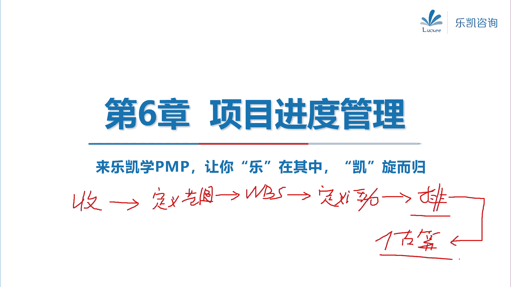

有了活动的持续时间，我们怎么样来确定我们整个项目的工期，那么接下来我们看一下这个过程，叫制定进度计划，制定进度计划这个过程呢，他说我们是分析活动顺序，持续时间，资源需求和资源因素。

来创建一个进度模型的对吧，那么这个过程的作用，就是要制定具有计划日期的进度模型，也就是我们要把这个工期啊把它给排出来，那么它的输入其实很简单，就是我们刚刚讲的，我们已经有了一堆活动对吧，有活动清单。

活动属性，有活动的持续时间，包括有网络图，那么接下来怎么去排进度呢，好我们直接看工具，他说首先我们可以用进度网络分析法，这个工具呢稍微看一看啊，它是一个很笼统的工具。

他说我们要结合我们后面要讲的关键路径法，资源优化，建模技术等等，然后去分析整个的进度网络，那么要注意，在路径汇聚点和路径分支点往往有高风险，这个时候我们要注意的，那么我们在上一节课也讲过了这些内容对吧。

那么接下来我们着重看后面的这几种，首先关键路径法这个工具非常的重要。

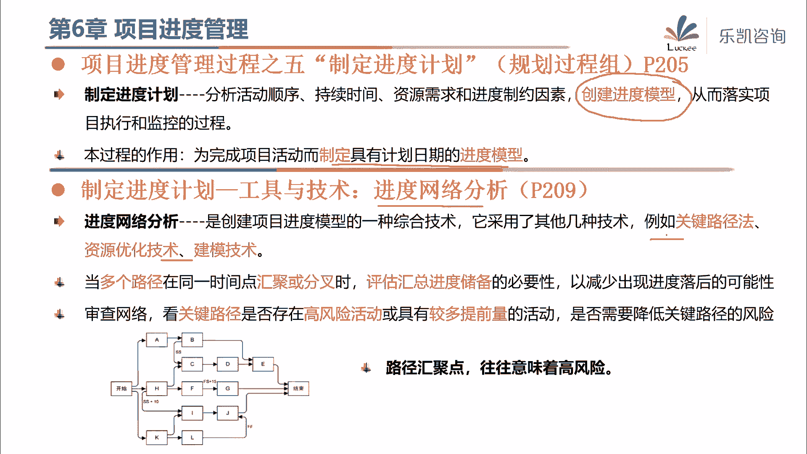

也是我们这一章的一个重点，那么关键路径法缩写叫cpm critical pass method，那么关键路径法，它是怎么样来确定我们的工期的呢，好举一个例子，比如说我们现在有一个很简单的项目。

我们把它拆分成了活动，然后排列的活动顺序得到了网络图，然后呢了解了每个活动的持续时间，他是这样的，他说a活动先做a活动呢要五天，a做完了之后做b和c好，这里我问一下啊。

a和b以及a和c之间就画了一个箭头，那么请问a和b和a和c之间，它们是什么样的逻辑关系，那么我们在上一节课讲到，如果线上什么都不写，默认就是fs关系对吧，默认是fs关系，那么fs关系可以默认不写的好。

然后b和c做完了之后，我们开始做d，那么d需要15天对吧好，那么接下来问大家一个问题，我们先用常识来判断一下这个项目，理论上来说要多少天，能看得出来吗，那么大家要注意啊，这四个活动每个活动都要做。

都必须要完成对吧，因为我们只有把每个活动都完成了，这个项目才算做完，那么这个活动这样去安排整个项目要多少天呢，好我看到游客同学啊，他跟其他主题的答案不一样，他说要25天。

那么我们不妨呢用这种方法来看一下啊，你看首先我们先做aa呢要五天对吧，好，那么a做完了之后才能开始b和c，那么b呢也要五天好，那么接下来从这张图我们看一下，做完了之后我们能不能开始做d。

这个问题是我们要注意的，就是说b已经做完了对吧，那么d能不能做，那么我们看一下这个图的逻辑，什么时候可以开始呢，它有两个前提，一个是b要做完，还有一个就是c要做完对吧，那么我记得上一节课。

就有同学提出这样一个疑问，他说如果这两个活动时间不一样，那遇到这种情况怎么办呢，好b做完了能不能做d好，要注意不能坐地，为什么呢，因为c还没做完，那么你要做d你还要等要等什么呢，要等c做完了才能做d。

所以说即便b5 天做完了没用对吧，你做完了也得等着，那么你还要做c一定要等c也做完了，那么b也做完，c也做完，我们才能做d对吧，那么这个时候你看一下，由于这样一种逻辑上的约束，所以这个项目要多少天。

那a要五天对吧，b和c虽然是同时做的，但是c要十天，所以你这个阶段你再怎么样，我估计最起码要十天吧对吧，然后接下来你再做d d要15天，所以整个项目要多少天，整个项目要30天。

理论上来说你最快也要30天对吧，那么当我们发现了这样一个规律之后，我们就定义了一条关键路径，那么什么叫关键路径呢，关键路径就是值这个项目当中最长的那条路径，所谓最长就是耗时最多的那条路径。

那么你这个项目的工期，你最起码要满足这样一个长度吧对吧，比如说我们在这个图里面有两条路径对吧，从起点到终点有这么两条，一条是a b d，那么单独看abd的长度是多少呢，应该是25。

还有一条路径是c d a c d的长度是30对吧，那么最长的那一条很明显是acd，那么这一条我们就把它称之为关键路径，那么也就是说这个项目你理论上来说，再怎么样也需要30天才能完全做完对吧。

所以我们有这样一个说法，关键路径是最长的路径，他决定的项目最短也需要30天才能做完好，那么通过刚刚的这个很简单的例子，大家有没有理解关键路径是怎么来的对吧，实际上就是把所有的路径列出来。

找出最长的那一条，这就是关键路径，这就是我们理论上项目需要多少天，对吧好，那么接下来我们看一下。

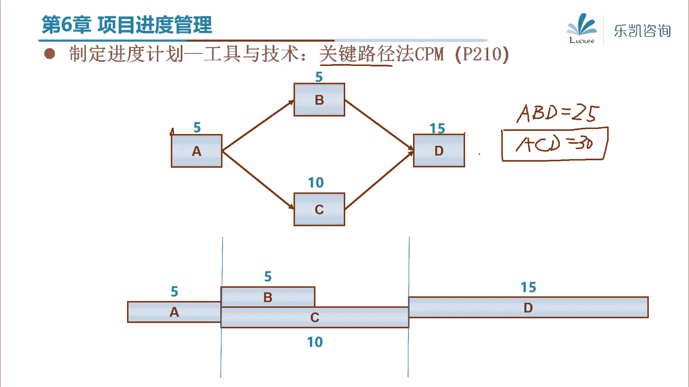

如果再复杂一点，再复杂一点好，我们看一看这张图，这张图如果问你工期需要多少天，按理论上来说对吧，我们现在只讲理论，理论上来说最起码要多少天，那么你怎么做好，考试的时候，或者我们实际做项目的时候。

遇到这种图很简单，把路径都找出来，我们按照从左到右从上往下的顺序对吧好，第一条路径应该是a那a做完了，根据这个逻辑关系做d，然后d做完了做h做结对吧好，首先第一条列出来a h j。

那么这条路径的长度是多少呢，14对吧好，第二条那一样的，从左往右从上往下，h j一定要逻辑是连贯的啊，b做完了做e e做完了做h h做完做j好，b e h j这条路径的长度是13对吧。

好第三条是b f j这条路径的长度是九，然后是c g绝这条路径的长度也是14好，那么从我们的这个结果来看，这个项目的关键路径是多少天，那么很多同学看出来了14题，也就是这个项目理想状态下。

你最起码需要14天才能做完对吧，但是有同学马上发现了一个问题，虽然关键路径是14，但是我发现这边有两条路径是14啊，那么接下来问大家一个问题了，如果关键路径超过一条，有多条关键路径越多。

说明我们这个项目在14天完成的，风险是越大呢还是越小呢，唉我们在做项目的时候，确实关键路径可能会出现多条对吧，那么如果关键路径越多，那么这个风险就怎么样好，很多同学说风险就越大，确实是这样，为什么。

因为你想啊这两条路径上的东西，这两条路径上的活动，任何一个活动出问题对吧，像这些活动，任何一个活动延期，这就会导致什么，导致我们项目就得延期，比如说a延期的一天变成二，它变成了15。

那么我们的项目就要延一天，因为关键路径是15吗对吧，那么比如说这边的g不是六啊，是八延了两天，那么这条路径变16，那么工期也会受到影响对吧，任何一个关键路径上的活动啊，我们也把它叫关键路径活动。

只要任何一个关键路径上的活动出了问题，我们这个项目都会受到影响，所以关键路径越多，那么受到的影响或者说风险就越大对吧，受到影响的可能性就越高，那么另外还要注意一个细节啊，在我们实际做项目的时候。

要注意的除了14是关键路径以外，好排第二的叫次关键路径啊，就像家里老人生了两个儿子对吧，那么有两个儿子，一个是长子，那么第二个就是次子吗，对吧好，那么接下来我问一个问题，如果次关键路径跟关键路径越接近。

它的风险是大还是小，那么这道题目你看啊次关键路径是13，那么项目的工期是由关键路径决定的啊，工期14，那么由于13跟14很接近啊，你要注意，万一这里面有一个活动延期的很厉害。

他很有可能这条路径的长度就会超过14，所以越接近风险也是越大的对吧，哎其实这个很简单对吧，这关键路径关键路径说白了就这么个玩意儿，就是找最长的那条路径，那么关键路径这个东西，我们找出来的意义有什么。

第一个就是我们能知道，理论上这个项目最起码需要多少天。

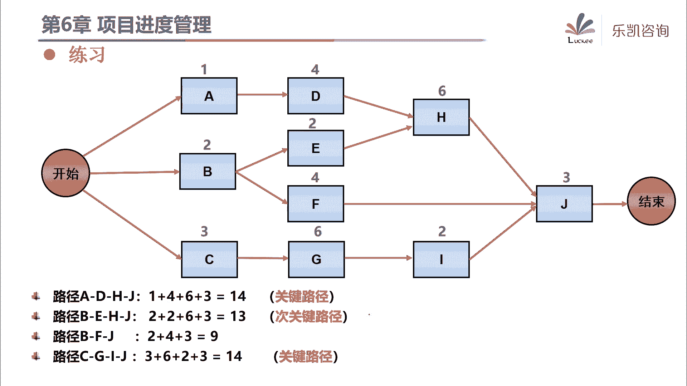

那么第二个还有什么意义呢，好问大家一个问题啊，我们用刚刚这个简单的例子来看，请问在刚刚这个例子里面，谁工作我们不希望他延期，而谁的工作允许有那么一点延期呢，好我们马上发现我们刚刚讲这个例子里面。

关键路径是a c d对吧，它决定了项目的工期，那么a是五天，c是十天，d是15天，再加一加等于30天对吧，那么也就是说a c d这种在关键路径上的活动，能不能延期，他不能延期对吧。

你比如说a变成六工期变不变，他肯定变啊，d变成16工期也得变了，c变成11，它也得变啊对吧，那么关键路径上的活动，a c d我们是不希望它延期的，如果它延期就会影响我们整个项目的计划啊，原计划30天。

那就做不完对吧，那么b，b可不可以延期，我们这个b活动可以延期吗，我b延期了一天可以吗，哎感觉好像可以对吧，为什么呢，因为你延期一天，你六天做完，反正你也得等着你，d也不能做，因为c还没做完嘛对吧。

闭延期两天可以吗，三天可以吗对吧，四天可以吗，五天可以吗，好有同学说b可以延期五天，为什么，因为b它不在关键路径上，它允许有一些什么呢，灵活性，那么我们把b可以延期的时间。

把它称之为叫b这个活动的总浮动时间，它允许有一些浮动或者叫总时差，那么所以我们在做项目的时候啊，并不是说所有人都得加班，我们要看情况，理论上来说啊，理论上来说，在这种情况下，b是可以延期五天的。

那么这个五天是怎么来的呢，其实我们通过肉眼观察就可以看得到对吧，你反正是要做十天，你b就算五天做完了，你剩下的五天你也得等着吗对吧。

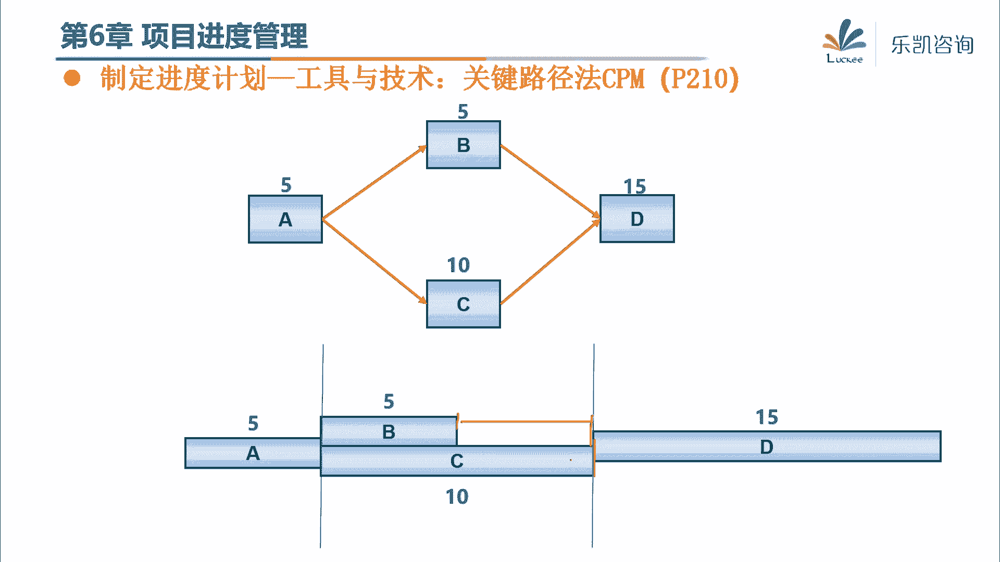

所以我们说b的总浮动时间或者总时差，是五天好，那么接下来我问一下总幅度时间是多少天，f是多少天你会知道啊，简单的我们肉眼就能够看出来，如果在实际项目中活动太多。

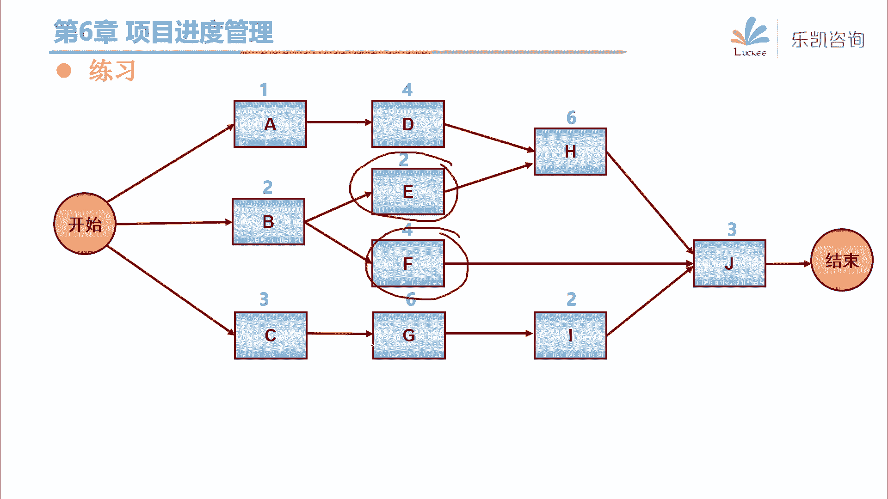

有上百个活动，你这个肉眼看就看不出来了，那么这个时候怎么办呢，好我们就用了一种方法叫顺推逆推，在关键路径里面可以顺推逆推，来找到每个活动的总浮动时间。

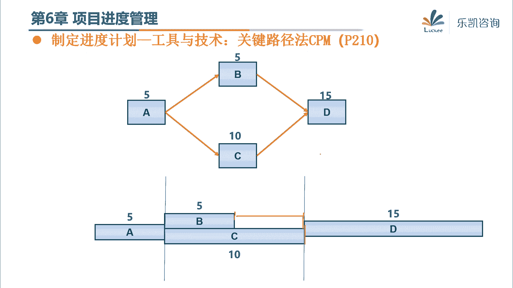

那么怎么去顺推逆推呢，好我们这样定义，我们说刚刚那个b活动，这个活动他一定有开始，几月几号开始对吧，几月几号结束，you start you finish对吧，那么p这个活动最早可以在什么时候开始。

最晚我们允许它什么时候开始，一个early，一个late对吧，最早和最晚好，那么我们就用七个格子来描述这个活动，就是我们要找到这个活动最早什么时候开始，然后最晚最早什么时候结束，最晚什么时候开始。

最晚什么时候结束，比如说我举一个例子，假如我们发现b这个活动最早第二天可以开始，那么首先大家回答我，那么必要做五天了，这个五天是活动的持续时间，我们估出来的，对吧好，请问b最早什么时候结束。

第二天开始做，b要做五天，第几天结束，好有同学说第七天结束对吧，来我们把手伸出来啊，我们来掰一掰手指头，第二天开始做五天，那么做的是哪五天呢，那第二天是一天吧，23456不是第七天哦，是第六天结束啊。

诶大家有没有发现这个问题啊，为什么呢，因为我们说第二天开始，实际上是第二天上班的时候就开始算对吧，所以第二天算一天了对吧，那么接下来23456在第六天，什么时候，第六天下班的时候，你仔细想一想。

是不是这个道理，如果是第二天开始，那么就一定是在第六天下班的时候结束，那么这个细节是要注意的，明白吗，那么这种方法是比较符合实际情况的啊，我们能明确看到这个活动，假如说他从第二天开始。

那么应该是第六天下班的时候结束好，那么如果我这么说，这个活动呢不一定要第二天开始，他可以往后拖一拖，他可以最晚的第四天开始好，那么我问一下，第四天开始做五天，第几天结束，啊第四天开始做b，然后做了五天。

第几天结束，那么把手指头伸出来，第四天是一天对吧，45678，就像我们过年打跑得快一样了，出个顺子嘛，五张对吧，45678，第八天下班的时候结束对吧，那么这里面这个细节大家要注意啊，不能错好吧啊。

第二天开始做五天，第六天结束，第四天开始做五天，那么第八天结束好，那么接下来，如果这个活动有这样一个特点，那么请问b活动允许延期多少天，哎我们通过这几个数字就能算出来，有人说怎么算呢，很简单。

你可以第二天开始吧，延期一天可以第三天开始吧，再延期一天，最晚可以第四天开始吧，所以你给延期多少天呢，把4-2不就好了吗对吧，我可以延期两天吧，你最早是第二天开始，最晚是第四天开始。

那么我可以延期多少天，延期两天对吧，唉有人说我不用4-2，我用8-6，可不可以，一样的道理啊对吧，你最晚第六天结束啊，最早第六天结束，最晚呢可以第八天结束，那么这也意味着你可以延期两天。

而这个两天就是我们刚刚讲的总浮动时间，所以我们把总浮动时间可以停在这个地方，这就是总浮动时间对吧，那么总浮动时间的缩写叫total float，那么这些缩写的大致呢稍微了解一下，根据英文来记对吧。

early start，early finish，let start，let finish，那么这七个格子的数据我们都能够抓出来，那么接下来就一个问题了，那么每一个活动我哪知道他最早什么时候开始。

最晚什么时候开始呢，好接下来我们介绍一下顺推和逆推，那么这是我们刚刚举的这个简单的例子对吧，a做完了做b和c好，b和c做完了之后呢，做d a要五天，b要五天，c20 天，第25天，那么接下来我们来推好。

大家注意啊，在pp里面我们顺推逆推的做法是从第一天开始，那么刚刚有同学说到我在学别的东西，比如说学软考的时候啊，他是从第零天开始的，那么大家注意第零天开始便于计算，但是它不符合实际情况，我们一个活动。

我们一般是说从第一天开始做到第几天，这样呢它跟实际情况是正好匹配，正好对应的，那么我们在p里面，如果按照这种做法，那么我们来推一下，如果a活动从第一天开始做，要做五天，那么请问最早什么时候结束。

这个能看出来吗，a活动最早什么时候结束，第一天开始做，那么掰手指头做五天，12345，那么很多人发现第五天就结束了，那么这就意味着a活动在第五天下班的时候，可以做完对吧。

如果按照这样的一个五天的持续时间的话，第五天做完好，那么接下来我问一下b和c，它取决于a的结束，那么大家知道b和c在什么时候开始吗，啊我一看a活动在第五天下班的时候做完了，那么接下来可以做b和c了。

那么b和c在什么时候呢，那么你只能在第六天的时候开始做b和c，对吧好，那么我们再看b第六天开始做b做五天，第几天解锁，那么很多同学从这里就总结了一个规律对吧，其实你如果算一算呢，你就这样算。

6+5-1嘛，6+5减个一嘛对吧，那678 90嘛，第十天结束对吧好，那么同样的c最早什么时候结束，那么到后面大家算得熟练了，就比较简单，肯定是第15天结束，对吧，那你第六天开始做十天。

那么第15天结束好，那么接下来我们看一下d什么时候开始，那么这个时候问题就来了，你说b在第十天下班的时候结束了，但是呢d的开始呢还要等c结束，c呢是在第15天才结束的对吧。

所以这个时候我们必须要等c结束了才能做d，那么c是第15天结束的，那么d只能第16天开始了，对吧好，那么大家注意这个叫什么，我们从左往右去推对吧，我们叫顺推，就像我们写字一样的，也是从左往右去写的。

那么顺推遇到两个紧前活动的时候，我们要按照谁为依据呢，顺推要找最大的为依据，比如说在顺推的时候有十和15，要以15为依据对吧，那么d是16开始好，那么接下来第16开始做，15天，第几天结束。

第30天结束对吧，马上就算出来了，那么到这里为止，顺推上面的一半我们全部都推出来了对吧，根据活动的持续时间，根据逻辑关系，从第一天开始推好，我发现最终最后一个活动，应该是在第30天做完了。

那么上面的顺推做完了之后，接下来干什么呢，好找做这个事情，我们要做逆推，好，顺推是指什么意思，顺推是指从一推到最后我们这道题，那30是最大的一个数字，那么逆推是什么意思呢。

好逆推就是指我们要从最大的一个数字反过来，推到什么呢，推到一，那么怎么去推，我们首先把这个格子先写一个30，好那么接下来有人说，那么你能不能说一说，为什么这个格子就写30呢，他为什么不是28。

为什么不是32，诶，为什么他就是从30往前去推呢，好我问一下大家啊，我说这句话，大家看同意不同意啊，一个项目的最后一个活动，他一定在关键路径上，大家同意吗，唉不管你这个项目啊有多少条路径，乱七八糟的。

怎么怎么样对吧，总之最终到了最后一个活动，最后一个活动他一定在关键路径上对吧，最后一个活动就像排队的时候，最后一位同学，如果最后一个活动他稍微往后延一延，你这个项目他肯定要延期，是这个意思吧。

那么既然最后一个活动在关键路径上，就意味着，其实我们最后一个活动他是不允许延期的，他没有什么浮动时间，他的总浮动时间应该是零对吧，那么从这个角度来说呢，多少减去30=0呢，当然就是30-30=0好吧。

那么其实这些东西呢其实很简单啊，大家只要记住逆推，就是从最大的往前去推就可以了，明白吧好，那么接下来如果这边是30，30-30=0，那么我问一下这边填多少。

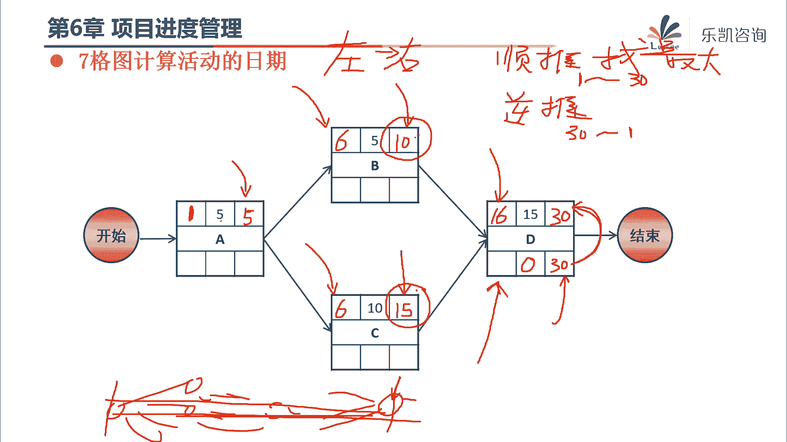

啊我们逆推这边填了30，总浮动时间是零，那么这个格子填多少，有人说靠这个怎么停啊，我也不知道呀，大家有没有发现一个规律啊，我们刚刚在讲一个活动的总浮动时间的时候，说过，最晚减最早应该等于这边的最晚减。

最早还记得吗。

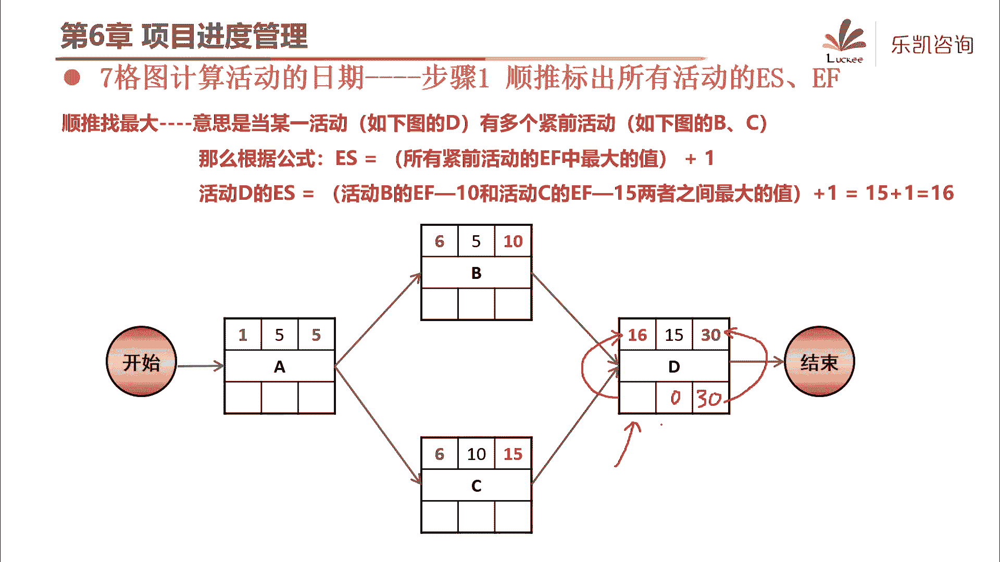

对吧，就是竖着减的应该是相等的，那我们刚刚不是讲过这个例子吗。

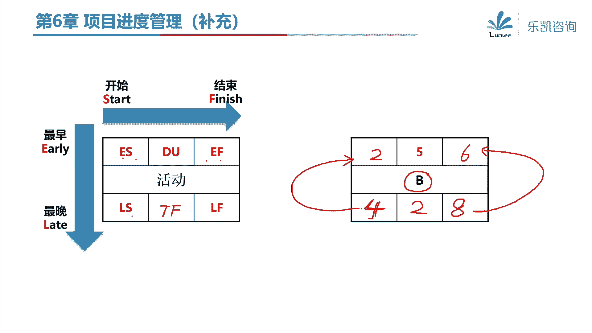

我们说b这个活动那4-2=2，我们也可以用8-6=2对吧，所以呢这边，数字减了30，减30应该等于这个数字减16，所以这个格子填什么，我们就可以直接填16，我们可以算出来的对吧。

也就是说d这个活动最晚的开始是16好，d这个活动最晚16开始，那么我问一下b和c最晚什么时候要结束，我们就逆推往前去推b和c嘛，你要保证d最晚16开始，那么你b和c再怎么样，你15必须要结束了。

要不然最晚他16开始不了啊，对吧好，那么我们再看b，由于b最晚是15，最早结束的是11-10，5-10能算出来总浮动时间是五了，b可以延期五天了，好那么接下来多少减去六也等于五呢，b的追完开始填什么。

那么b的最晚开始马上就算出来了，应该是等于11，11-6=5对吧，那么同样的道理，再看c由于最晚结束，15最早结束也是15，最晚减最早等于零，那么c这个格子多少减6=0呢，好这边就只能停六，对吧。

那么通过这一步，我们把b和c最晚多少算一算总幅度，时间算一算，那么最晚开始就得到了一个是11，一个是六好，那么接下来问题来了，我要保证b最晚第11天开始，我也要保证c最晚第六天开始。

那么a什么时候要结束，好马上有同学发现了，这边好像只能填五啊对吧，因为你看虽然b是11，但是c他六就要开始了，那么c6 就要开始，我就必须五要结束了，对吧好，有没有发现在逆推的时候。

我们刚刚说顺推找最大，逆推我们要依据什么，要依据最小的，所以逆推找最小，以它为依据来逆推，那么a这边就只能填五，那么接下来5-5=0，那么多少减1=0呢，好1-1=0，那么最终我们就把这个网络图。

用七格图的方法推出来了，那么有人会说，你费这么大的力气画这张图干啥呀，你有没有发现这个图告诉我们很多信息啊，比如说首先这个项目的工期是多少天，一眼就看出来了，这个项目的理想工期是30天。

好这个项目的关键路径是哪一条，什么叫关键路径啊，关键路径就是不允许延期的，换句话说就是他有没有浮动时间呢，他没有总浮动时间，每一个活动的总浮动时间都是零对吧，或者叫总时差都是零诶。

我把总浮动时间或者叫总时差是零的，找出来有哪些活动呢，cd这就组成了我们的关键路径对吧，那么关键路径活动的总浮动时间是零，告诉我们a不能延期，c不能延期，d不能延期，好b允不允许延期，允许写的很清楚。

b允许延期多少天，允许延期五天对吧，那么用这个七个图，我可以知道每一个活动他的情况最早什么时候，最晚什么时候有没有总浮动时间，允不允许延期，一目了然对吧，那么所有的活动，我们只要把七个图画出来。

他的情况我们就非常的清楚，那么关于顺推和逆推，在考试的时候它是不考的，但是我希望作为一个项目经理，要知道这个七格图它的原理是什么好吧。

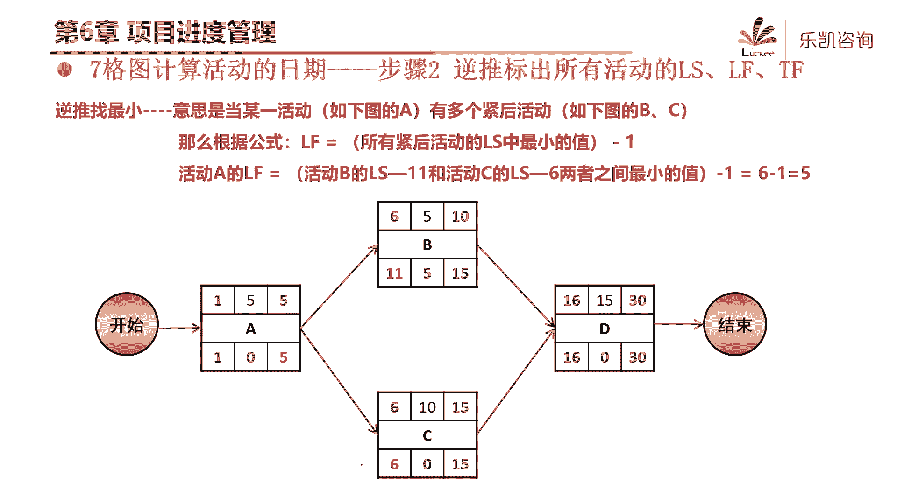

那么接下来我们用一道题目来练习一下好吧。

那么第一次顺便力推，大家可能不太熟练，我们再用一道题目来巩固一下，好看这道题目，这道题目呢也很简单啊，就这么六个活动，那么a做完了做b和e，那么b做完了呢可以做c做d，然后d和e做完了做f就这么一张图。

每个活动除了e是四天以外，其他的都只需要一天，那么接下来我们再一起顺推逆推来巩固一下，好吧，好还是从第一天开始，第一天做a需要做一天，那么什么时候结束，那么第一天开始做一天，那么不就是第一天下班的时候。

a就可以做完吗，那对吧，那你只要做一天吗，那么第一天下班的时候就做完了好，那么由于b和e呢要等a结束了才能开始，那么你只能第二天上班的时候安排作弊，安排做一对吧，b和e就只能第二天开始了。

那么我们先看上面的b第二天开始做一天，那么第二天当天就结束了对吧，然后接下来c那么第三天开始好做一天，第三天当天结束，d呢好，第四天开始啊，由于c是第三天结束的，那么d只能第四天开始了，好他做一天。

第四天结束，对吧好，那么f第几天开始要注意f，我们不能说五要注意f它有两个前提，一个是d要做完，还有一个是e要做完对吧，那么我们要先看一下e e是什么情况，e第二天开始做四天好，第几天结束。

2345做四天，第五天结束啊，对吧好，根据我们刚刚的说法，顺推找最大，由于一是第五天结束，而f必须要等e做完，所以f只能第六天开始对吧，那么做一天在第六天当天把f做完对吧，那么顺推到这里就全部推出来了。

好我问一下现在顺推有没有问题，这个计算慢一点不要紧啊，只要理解了就好对吧，这顺推就很简单，你就从第一天根据逻辑关系嘛后去推嘛，遇到有多个的，那么顺推找最大决定下一个活动第几天开始嘛，就这么简单对吧好。

如果说顺推没什么问题了，那么接下来我们再逆推好，逆推的时候从最大的往一去推吗，那么这边写六对吧好6-6=0，那么这个格子写多少呢，多少减6=0呢，这边也是六嘛，因为要保证左右两边竖着检验都是相等的吗。

对吧好，由于f最晚开始是六，那么你第第五天要结束了，第五天也要结束了对吧好，我们先推上面的5-4，你可以延期一天，那么这边多少减4=1呢，那么也是五对吧好，然后它是五往前推，这个是四，4-3=1。

那么多少减3=1呢，那么这边你也只能填四了对吧好，这个四再往前推，你既然最晚是四开始，那么b在三就要结束了，第三天要结束好，3-2=1，那么这边一样的多少减2=1呢，三，对吧。

那么这个时候要注意不要急着去推a这个活动，因为a它的颈后有两个活动，我们要看一看e啊，好e5 减去5=0，对吧，那么多少减去2=0呢，这边那么就只能填二好，发现逆推的时候要怎么样逆推找最小。

以最小的为依据，如因为e最晚要第二天开始，那么你a在第一天就必须要结束了，对吧好，接下来1-1=0，好这边一样的填一好，到这里为止，我问一下顺推，逆推，大家稍微有点感觉了没有，应该都比较清楚吧。

其实顺推逆推很简单对吧，那么从这张图我们可以看出来，整个项目的总工期是六天对吧，关键路径是aef对吧，那么这三个活动总浮动时间是零，代表它不能延期好，那么接下来这三个活动呢，b可以延期一天对吧。

c可以延期一天，d可以延期一天，但是在这里我要说一下啊，我们说的总浮动时间，总浮动时间或者叫总时差是针对什么来说的，大家注意是针对单个活动来说的，什么意思，就是说我们可以这么说啊，可以延期一天。

因为b有一天的总浮动时间对吧，好或者注意啊，或者c可以延期一天，明白吧，或者你可以这么说，可以延期一天，明白吗，我们说的延期我们不看整个路径，我们只看单个活动啊，你问我必可以延期一天好。

我告诉你b可以延期一天，你问我c可以延期几天呢，好我只能告诉你一个c可以延期一天，同样的，你问我d可以延期几天，我也告诉你d可以延期一天，但是大家要注意，如果在实际做项目的时候，真正延了一天啊。

原来是一天的，他用两天做完了，一旦出现这种情况好，你看啊，这边就变成了三吧，这边就变成了四吧，这边就变成了五八，就会导致后面的c和d不再有总浮动时间，对吧，那么为什么会出现这种情况呢。

好我们用这张图画出来就比较清楚，你看啊，这张图每个格子一个格子就代表一天对吧，那么e是四天，a是一贴，f一贴好，bcd都是一天，那么从这张图我们就看得很清楚，你说b可不可以延期，可以可以延期几天。

可以延期一天对吧，好要注意，如果抛开b不谈，单纯问c可以延期多少天，那么我也只能说c可以赢一天对吧，同样的抛开b和c不谈，问d那么d也可以赢一天对吧，也就是说总幅度时间是针对谁来说的。

我们只看单独的一个活动，而不看整个路径对吧，因为很明显一旦被延期了，那么c和d它就无法延期了，所以总浮动时间我们只针对单个活动，好吧好，那么接下来我问大家一个问题啊，我们刚刚说b和c和d对吧。

单纯的来考虑，都可以延期一天，那么地延期一天，跟c延期一天，我们把d和c拿出来看啊，这两个活动延期有没有区别，那么我们看这两种情况啊，如果d和c延期一天，他们的共同点是什么，好d延期一天。

那就变成这个样子，它不影响总工期对吧，还是六天，那么c如果说d不动啊，b和d都不动，c延期一天，他变成这个样子，他也不影响总工期，对总工期来说都不影响，因为我们说总幅度时间就是这个活动可以延期。

又不影响总工期的时间吗，对吧好，但是你看一下c和d的延期，有没有什么地方是不一样的，感觉是有的，那么这边大家注意听好吧，区别在什么地方，d延期一天，它影响f的开始吗。

你看f反正要等e结束了才能开始对吧好，我d就算延期一天，它影响到他后面的f吗，它不影响你f该第六天开始还是第六天开始，对不对，那么也就是说我d延期一天，我不影响我后面的任何一个活动。

所以我这么说d他非常的自由，对吧啊，我可以放飞自我，我必延期一天，你虽然f在我后面，但是我又不影响你了，对吧好，我们再看cc如果延期一天，c后面是谁呀，c后面是d呀，那么你c延期一天。

d就只能往后拖一天了，那么从某种意义上来说，c就怎么样，c就会影响到别的活动，或者我们可以这么说，c延期虽然不影响总的工期，但是他多多少少有一些不自由对吧，那么在pp里面除了总浮动时间以外。

我们就还提出了另外一个概念叫自由浮动时间，那么什么叫自由浮动时间呢，或者叫自由时差呢，就是这个活动可以延期多少天，不影响他后面的活动，好回过头来我们看这张图，大家告诉我d的总浮动时间是多少。

那么马上从图上找出来d的总浮动时间是一天，那么d的自由浮动是多少呢，那么根据我们刚刚的概念，就是d的自由浮动市值，d延期多少天，不影响f的开始好，那么d理论上最早是第四天结束，它可以延到什么时候。

唉有同学说我可以延到第五天结束，不要紧吧对吧，我有一天的自由时间吧，好这个自由时间怎么去算呢，其实很简单，用这两个去解，6-4，再减去一，它的自由浮动等于一天，那么有同学就会问了，你6-4我可以理解的。

你再减个一，这他娘的是什么玩意儿，好，我说一下，为什么这边要减一啊，因为这个四代表什么，代表第四天什么时候，第四天下班的时候，而这个六代表什么，这个六代表第六天什么时候呢，上班的时候，对吧。

那么第四天的下班跟第六天的上班之间，实际上不是两天，只有几天呢，只有一天对吧，所以我们在算自由浮动时间的时候，要这么算，86-4，还要再减去一个一，这才是他的自由浮动时间好，那么接下来我问一下大家。

c的总浮动时间是一了，大家能不能算一算c的自由浮动是几，那么一样的自由浮动，就是不影响紧后活动的最早开始，把什么和什么解呢，把今后活动的最早开始减去，这个活动的最早结束对吧，再减14-3，再减一。

你会发现c的自由浮动时间是零对吧，这也就意味着c那这种情况它有一天的总浮动，但是自由浮动时间是零，这意味着什么，意味着c延期一天，不影响整个项目的工期，但是它会影响什么，它会影响他后面的活动的开始对吧。

那么这个叫总浮动和自由浮动啊，要理解这个概念好吧，考试呢到考的不会去考这个东西啊，偶尔呢考一考概念，但是我觉得作为一个项目经理呢，还是要去理解这些的，那呃理解这些内容。

那么为什么要跟大家去花这么长的时间讲顺推，逆推，讲总浮动，自由浮动啊，好那么这里我跟大家说一下啊，当我们了解了这些原理之后，当我们遇到一个大型复杂项目，有成百上千的活动之后。

我们可以用什么方法做出这个项目的机构图呢，我们就可以把这些原理把它作为什么作为算法，然后让谁来帮我们顺推逆推，由软件来帮我们，根据这些算法自动完成顺推和逆推，所以接下来我给大家演示一下常见的项目管理。

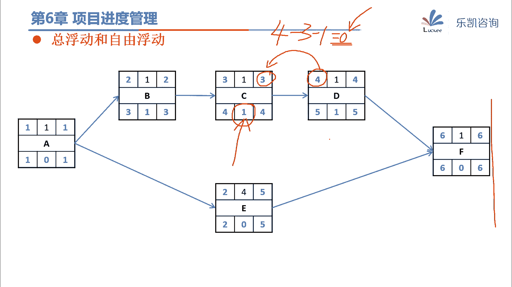

进度，进度管理软件它是怎么做的，好吧。

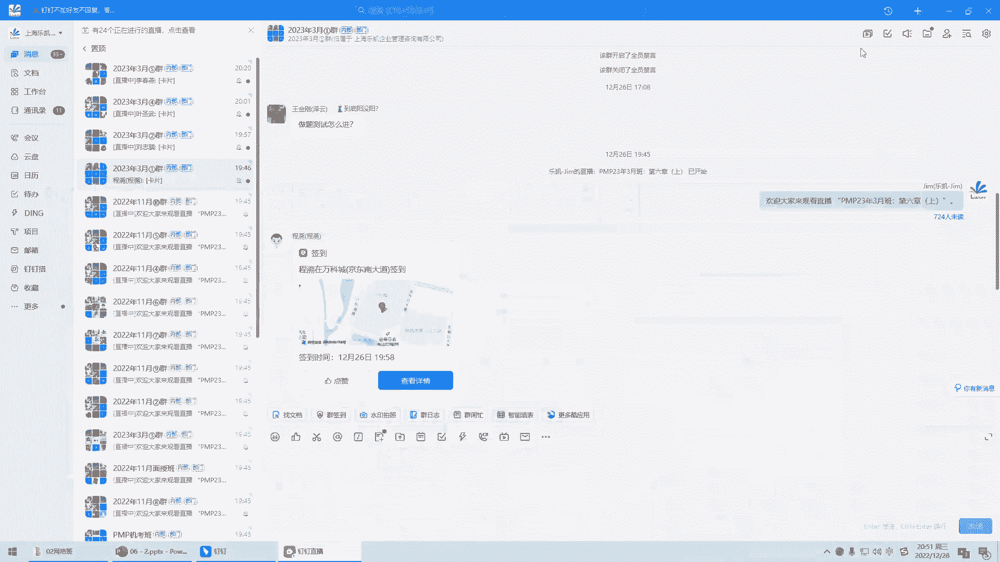

那么最常见的一个工具呢，实际上就是我们所谓的project好，大家注意啊，这是project啊，不是excel好吧，好比如说我们就用书上的这个例子来模拟一下，他说有任务a对吧，好a的工期是五天。

那么假如说我们a是从今天开始的，做五天好，你会发现右边它自动就有一个横杠，横道一样的东西出来了对吧，那么右边他就安排好了哦，你从今天开始做a活动要五天，那么今天是星期三，要做到什么时候呢。

要做到下个星期二好，我问一下大家，做五天为什么是做到下个星期二结束啊，做五天不是星期三，星期四，星期五，星期六，星期天不就好了吗，为什么它自动就排到星期二去了，会排七天呢。

你会发现因为星期六星期天默认是什么，默认是休息日对吧，所以他把休息日跳掉了，他往后再排了两天对吧，当然我们可以把星期六星期天设置成工作日，他就会排到星期天就结束了，好吧好，接下来a做完了做什么呢。

做b好，书上的例子，b也要五天，然后做c需要十天对吧好，接下来注意逻辑关系，什么时候做b呢，a做完了做b什么时候做c呢，a做完了做c，所以我们就把b的紧前活动设置成a好吧。

那么我们这边紧前活动我们不写a，我们写a前面的这个序号，当然了，我也可以这样写，我不写一，我写的完整理解是ef的关系对吧，那么但是我们说过s f s可以默认不写，那么它就变成了一对吧。

那么如果有滞后量的，我们可以写1f s啊，我们可以如果有滞后量，可以这么去写1f s，比如说，加一嗯，对吧，那么没有滞后量，单纯的fs关系我们可以省略不写，就是一好，接下来b和c做完了，做d。

写错地方了啊，在这b和c做完了做d那么d要多少天呢，15天好，那么d什么时候开始，d要等b和c做完了开始，也就是等序号二，序号三做完了，他开始对吧好，那么接下来我们就把这个图画出来了。

那么从这个图上我们能够得到很多的信息啊，比如说得到什么信息呢，我可以画一个摘要任务啊，做一个总结啊，比如说这是我们的一个演示项目对吧，这个项目里面包括了abcd 4个活动。

然后他们的逻辑关系是这个关系好，接下来你会发现它自动就告诉我们，这个项目一共要多长时间呢，一共一共要30个工作日，一共要30个工作，他告诉你了，自动软件就算出来了对吧好，关键路径是哪一条呢。

那么我们可以把关键路径啊，把它给显示出来，哪一条是关键路径好，他马上告诉我了，ab这是很关键的，关键路径上的活动对吧，这些活动是不能延期的好，那么接下来，如果我想知道每一个活动的总浮动时间，怎么办呢。

叫总啊，叫可宽严，总时间，对吧，那么每一个活动的总浮动时间，我也一目了然对吧，我也知道哪个活动可以延期，哪个活动是不能延期的，那么这些软件它就把我们所有的信息，自动的就告诉我们了，那么话又说回来了。

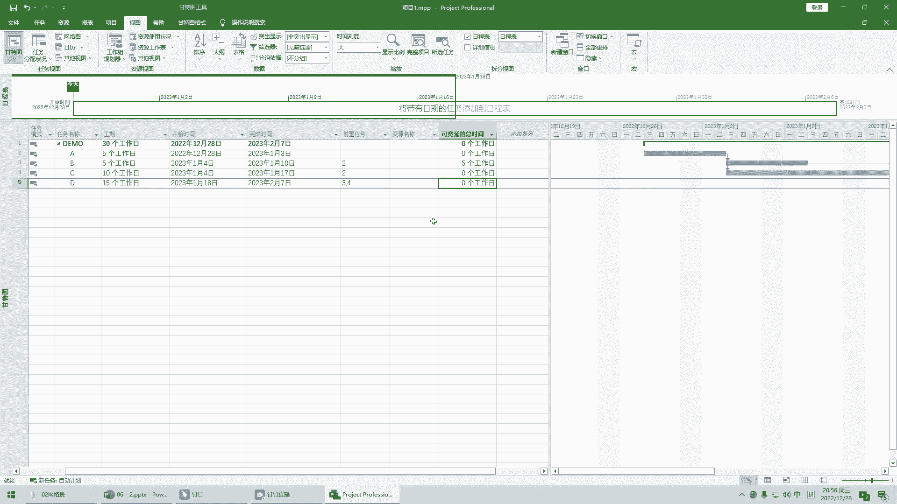

他是怎么样做的，实际上就是我们刚刚讲的顺推，逆推这样一个过程对吧，通过顺推逆推，把这样一套逻辑形成什么，把这样一套逻辑变成算法，用软件来帮助我们计算。

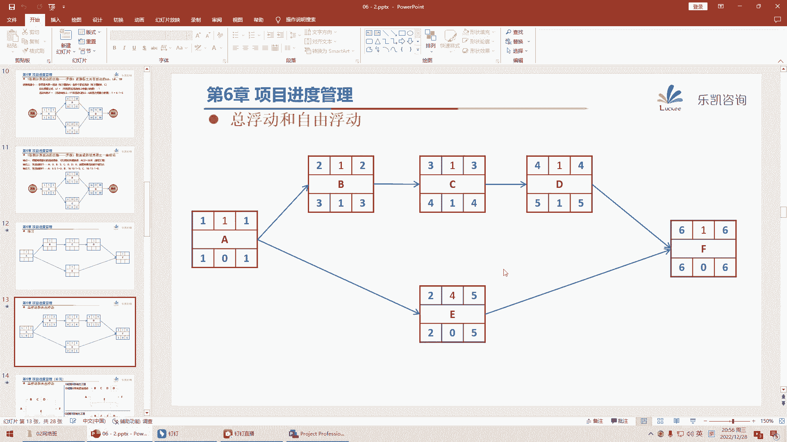

不就好了吗对吧，所以说我为什么说，大家最好要了解这样一个原理啊，我觉得作为一个项目经理，不管将来要会用这些工具，还要知道这些工具内部的原理是什么，好吧好，有人说想要这个工具很简单，直接淘宝对吧。

你看我用的是什么正版的，到淘宝去买六块钱好吧，六块啊，有兴趣的可以去自己花六块钱，去淘宝上去找一找，买一买对吧，那么至于这个project怎么去用，正版的序列号肯定是要钱的，好吧。

那么至于project它具体怎么去使用啊，这个视频到处都有啊，可以到b站啊，到各个网站上去搜啊，有时间可以自己去用一用，好吧好，那么这个是关于关键路径的这些基本的概念，好吧，当然了，有同学说的很对啊。

其实呢工具是其次，我们只要知道了这个原理，你用用用也好，不用也好，都可以对吧，包括你用project也好，你用猥琐也好对吧，你将来用了什么像肠道啊，像鸡肉一样也好，但是我想说的是。

大家同不同意这样一个观点啊，只要你弄懂了原理，其实工具的使用上手是很快的，是不是你搞清楚了，这个原理无非就是工具怎么用呢，就像用一个word一样的对吧，你说word那么多功能，你常用的不就那么几个吗。

你上手其实是很快的，所以工具它不是很重要，重要的是它的原理是什么。

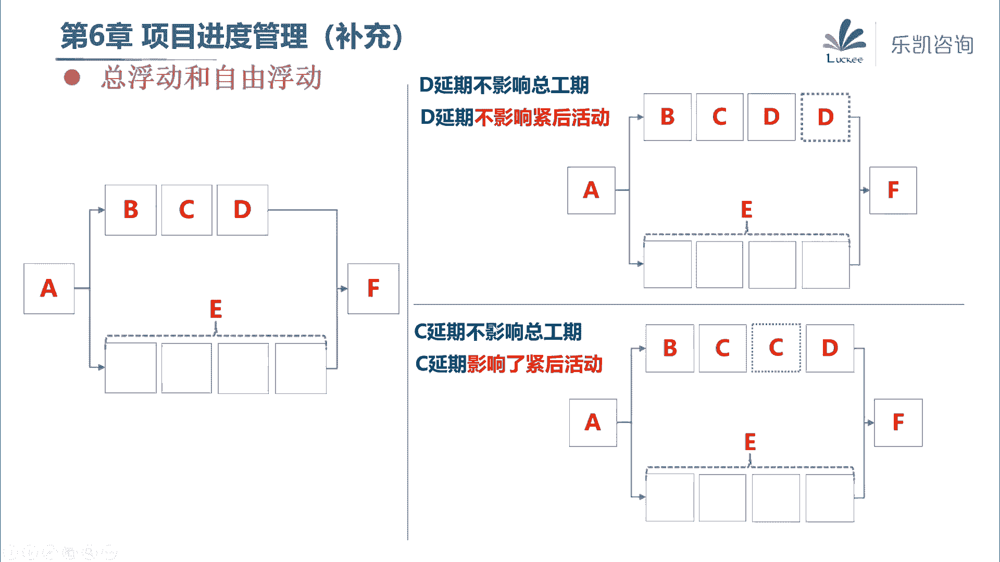

好吧好，那么关键路径法这个工具我们讲完了，接下来我们看一下它的总结啊，他说第一什么叫关键路径，关键路径是项目中最长的那条路径，它理论上决定了项目最短需要多少时间对吧好，总幅度时间，什么叫总幅度呢。

就是活动可以延期，但是不延误完工日期的对吧，好注意一下啊，总浮动时间体现了进度的灵活性，就是哪些活动可以延期，哪些活动呢，不一定说啊，延期了就一定要加班对吧，它体现了进度的灵活性。

当然有一个比总浮动时间还要牛逼对吧，你总浮动时间是不延误，项目的完工日期就可以了，我有一个更牛逼的叫自由浮动时间，自由浮动时间说什么，他说我延期不光是不影响整个项目了，对吧，这个叫自由浮动好。

接下来关键路径可以存在多条，关键路径越多，风险越大对吧，次关键路径跟它越接近，风险越大，关键路径的活动被称为关键路径活动，这些都是废话对吧，很简单好关键，我们看这一局关键路径的活动的总浮动时间。

可以是正的。

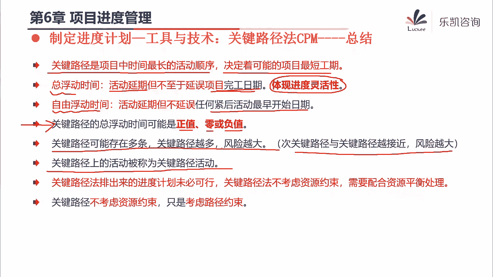

可以是零，可以是负的，那么这句话我要解释一下啊，为什么有这样一个说法好，当我们做完顺推和逆推之后，大家要注意，理论上来说，关键路径上的总浮动时间应该是多少，应该是零对吧，那么什么情况下。

关键路径上的活动，它的总浮动时间可以是正的甚至是负的呢，好在我们真正执行的时候会出现这种情况，比如说大家看这种情况啊，现在我们这个计划排好了，我们按照这个计划来执行了，在执行的时候，a做完了，a做完了。

接下来做b和c在做c的时候出现了一个问题，原计划c是十天做完的，结果出了一些问题，他12天才做完，也就是说c什么时候结束，c在第17天才结束，对吧好，那么这个时候客户的说我不管，反正我弟不能变。

必须要第30天做完好，那么这个时候你会发现在这种情况下，c的总浮动时间是多少啊，你用15-17算出来的总幅度时间就负了呀，变成-2了，好我问一下，当总浮动时间是负的，就意味着什么好大家注意。

这是考试经常问到的一种考法啊，说有一个活动走活动时间，我发现是负的，那么是负的就意味着什么好，大家注意，就意味着这个活动它怎么样，它延期了，那么你后面就需要干什么，要采取一些措施了。

否则的话整个工期也得严了对吧，那么同样的道理，有负就有正了，比如说原计划十天做完的，他花八天就做完了，那么这边就变成13了。

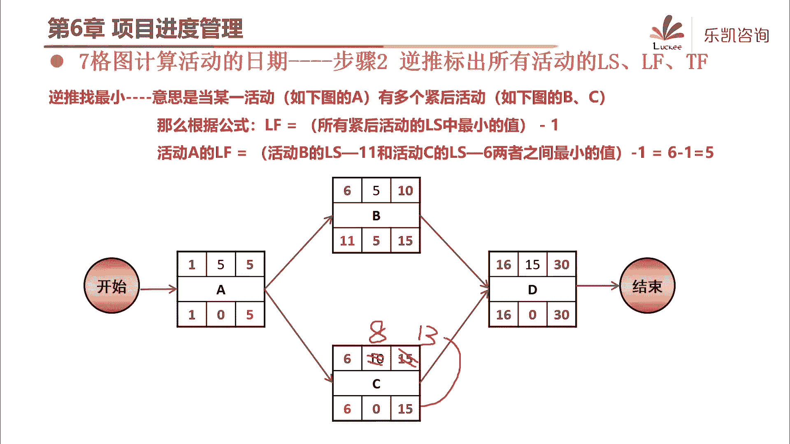

那么这个时候15-13就等于二了，那么这就提前了呢对吧。

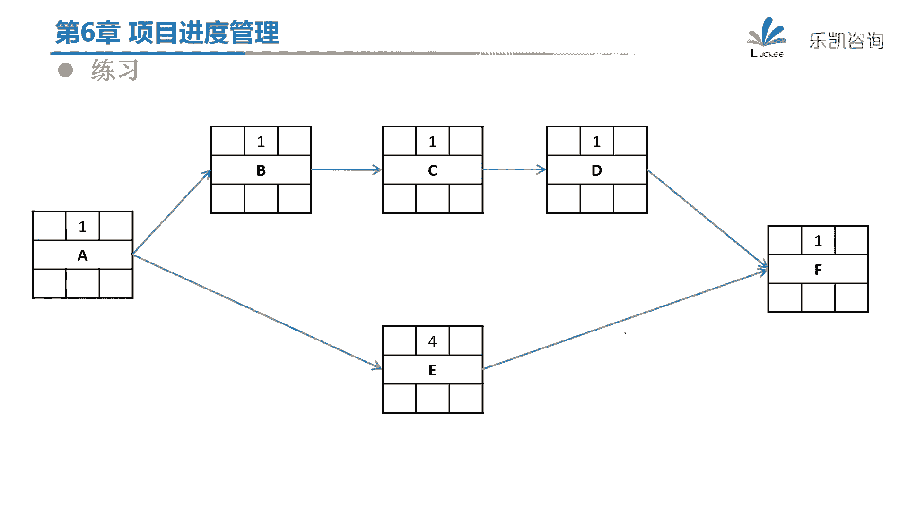

所以说那我们理论上顺推逆推做完了，关键路径的总幅度时间应该是零，但是在实际情况下，有可能由于一些活动的延期或者提前完成，导致他的总浮动时间出现正值或者负值，好吧这个能够理解吧，好接下来还有一句话。

他说用关键路径法把我们的工期算出来，或者把我们的计划最终排出来啊，其实呢还不一定还不一定可行，为什么说这个计划不可行呢，刚刚其实有同学就提出这样一个疑问，什么疑问，你光考虑到活动要多少天，谁先做谁后做。

但是你没有考虑到做这个活动的人啊，人够不够啊，也就是说我们刚刚的关键路径法，他没有考虑一个什么问题呢，没有考虑到资源的问题，所以这个计划就不一定可行，那么大家一定要记住这句话啊。

关键路径法他排出来的计划不一定可行，他有一个黄金搭档，你用了关键路径法，就一定要用这个东西，这个东西叫资源优化。

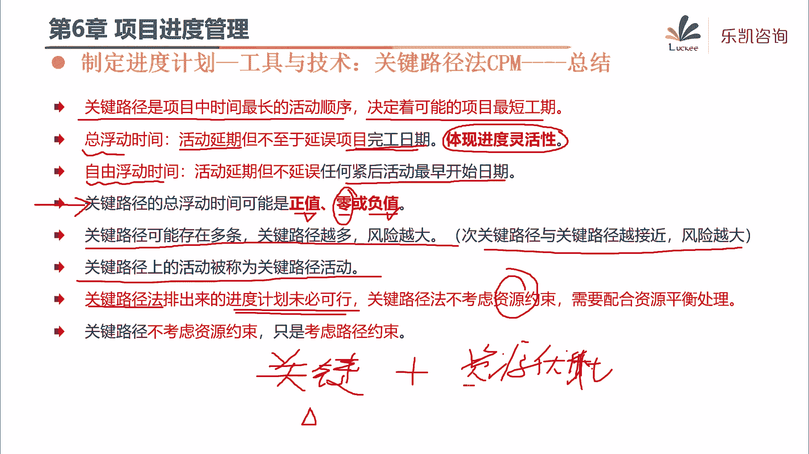

好那么接下来我们讲一讲什么叫资源优化技术，那么资源优化技术，他说就是根据资源供需情况来调整进度模型，它包括两种方法，资源平衡和资源平滑好。

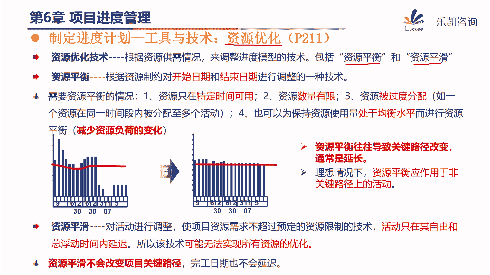

大家注意，关于这两种方法，我只讲一次，大家要明白它们的区别是什么，好吧，那么接下来注意听什么叫资源平衡，什么叫资源平滑好，我们看例子来，大家看这张图，假如每个活动都只需要一天。

那么请问这个项目的工期是多少天，a做完了做b b做完了做c对吧，a做完了做d d做完了做e好，然后c和e做完了做f，那么如果我们不考虑资源问题啊，我们看一下第一天做a，第二天做b和d，第三天做c和e。

第四天做f对吧，那么整个项目的工期其实是几天呢，四天四零就搞定了，对吧，两条路径一条是ab cf，一条是a d e f对吧，那么不管哪条路径，它都是四天好，那么接下来我安排人去做，我发现这样一个问题啊。

我发现了b活动啊，在我们公司就只有王立顺同学能做，小王同学只有他一个人会做b，同时呢我又发现啊能做d的这个人啊，在我们公司也只有王立顺同学一个人会做，其他人都不会，那这个时候就出现了一个什么情况。

好那你说这第二天咋办呢对吧，你第一天把a做完了，第二天要做吧，b只能交给他做，d也只能交给他做，一天要做两个工作对吧，那么肯定有人会提醒啊，说你这个不行啊，你这个不是把女人当男人用，把男人当畜生用吗。

对吧，那为了解决这个问题，那你说怎么办好，曾经有同学是这么说的，他说你不傻帽吗，你干嘛要这样呢，你先做c然后再做b把这两个人换一换，不就解决了这个问题吗，好请问这样行不行，他说你看b是他做。

但是c不是把b和c换一换，先做c后做b，这样行吗，这样不行，为什么不行呢，因为人家之间有逻辑关系啊，有fs的关系啊对吧，先有儿子后，先有的爸爸后有的儿子对吧，你怎么能说先换一换，儿子先出来，爸爸在后面。

这不对的对吧，所以这样乱调是不行的，那你说怎么调，啊有人说cd互换一样的道理啊，cd也不能互换啊，是b他们有逻辑关系，你不能这样去换了对吧，想来想去没什么办法，所以最终决定这样吧，实在没办法对吧。

那怎么办呢，要么把b往后延一天对吧，要么怎么办，你把d往后挪一天，总之要避开对吧，大家注意，我们不考虑其他问题啊，假如单纯的要解决资源的，像这种叫资源超负荷的问题对吧，假如要单纯地解决这个问题。

是不是只能这么做对吧好，那么我们假如说这么做，我们加了一天的滞后量，把b和d错开来好，请问我这样一安排带来什么后果，哎资源的冲突是解决了，但是带来什么后果呢，这个时候我们看一下这个项目。

工期变成了多少啊，这个项目有两条路径，一条是a cf，它的长度是四对吧，好有一条路径是a ef，那么a d e f长度是多少，这个时候长度变成了五，为什么变成五呢，你看a一天d一天，一天f一天。

中间还要滞后一天对吧，也就是说它会导致什么，导致关键路径的延长，那么这种方法叫什么，这种方法叫资源平衡，它的特点是它简单粗暴，很有效对吧，反正就往后延一天，但是它会怎么样，会造成关键路径的延长。

那么另外一种资源平滑是什么意思，好我再举个例子，大家看一下好，大家告诉我这个项目工期是多少天，那么一样的，第一条路径是a b d对吧，长度是四，每个活动一天吗，好第二条路径是a c e长度是几呢。

是三对吧，好，那么这个项目的攻击取最长的那一条了，四天对吧，好，接下来安排任务了，又出现问题了，b这个活动还是只有王连顺同学会，c这个活动呢还是只有他一个人会靠，第二天又冲突了，那么这个时候怎么办。

有人说诶这个情况跟刚刚那个情况不一样，不一样，在什么地方呢，就是c这个活动他有一天的浮动时间吧对吧，c有一天的总浮动时间，那么你干嘛要凑热闹，让他在第二天做呢对吧，我把c怎么样，就想把箱子往后划一划。

划一格诶，我变成这样一种情况，那么它不就解决了资源的冲突问题吗，对吧好，那么出现这种情况，解决了资源的冲突，我们再看一下工期变了没有呢，好两条路径，第一条a b d e还是需要四天。

第二条a c e现在要多少天呢，原来a c e是三天对吧，你现在a c e再考虑一天的滞后量也是四天，但不管怎么说，总工期他变了没有，他没变呀对吧，所以大家注意这种情况，我们叫什么，我们叫他运气好对吧。

为什么运气好呢，正好c他有浮动时间，可以往后滑一天，它不影响工期，也解决了这个问题，那么这种我们就叫资源平滑对吧，我们叫资源平滑，那么大家要注意资源平滑这种工具它的特点啊。

它的特点是它不影响我们项目的工期，但是要注意注意什么，大家要注意要看你的命好不好对吧，那你能够滑，你才滑呀，你假如刚刚这种情况，你说地它划不动你怎么办，你这个情况下地就不能滑呀对吧。

所以呢资源平滑看命了，命好，你就能划不改变攻击命不好，你就划不了对吧，或者我可以这么说，如果你滑不动。

那么你怎么样，你就不得不做资源平衡是吧，好我们回过头来看一下pmp里面他是怎么说的，他说资源优化呀，包括资源平衡和资源平滑对吧，那么总的来说，在资源特定时间，可用资源数量有限或者被过度分配的时候。

我们为了保持资源使用量处于均衡的水平，我们就要做资源的平滑或者平衡对吧，那么这两者的区别是什么呢，资源平衡往往导致关键路径的改变，通常是延长对吧，那么资源平滑呢，它不会改变关键路径。

但是也无法实现所有的优化，他要看运气好不好对吧，那么这就是这两者的区别，那么考试呢实际上资源平衡，资源平滑这个点区别考的不太多对吧，那么大家要理解他的意思是什么，那么另外要注意，不管是资源平衡也好。

还是资源平滑也好，它的作用是什么，大家要注意，它的作用是减少资源负荷的变化。

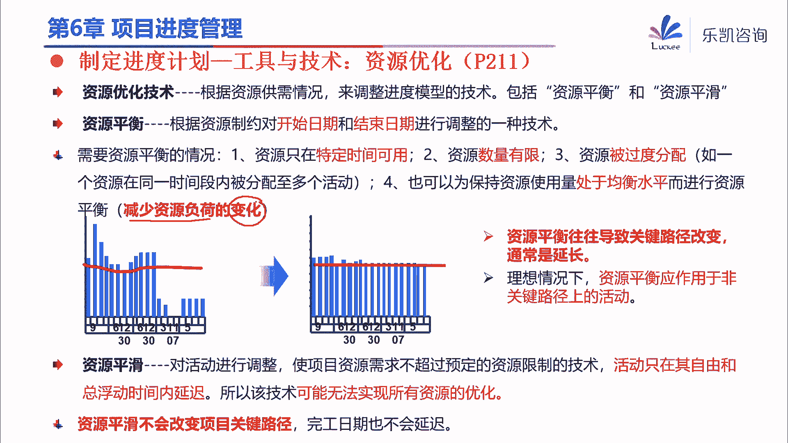

好大家注意啊，不管我们做资源平衡还是做资源平滑，我问一下，以这个人他是几天的工作量，能看得出来吗，就是我不管你做什么操作，你说以这个人是几天的工作量，他变了吗，其实工作量没变对吧。

你反正是要做b和d对吧，无非就是要么你资源平衡，要么你资源平滑，反正是两天的工作量，也就是说大家注意资源的负荷是不变的。

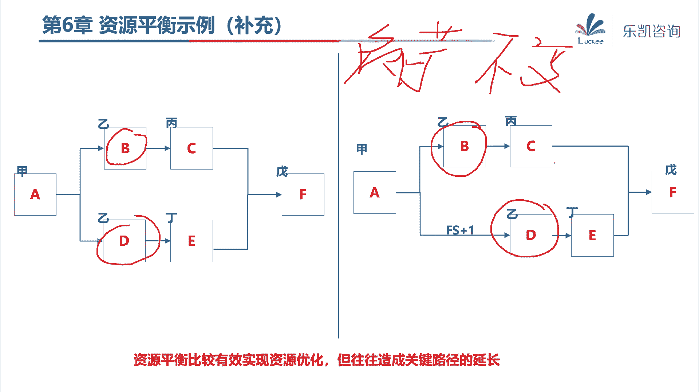

原来两天，现在还是两天，那么什么东西变了呢，好，复合的变化他变了变得更怎么样，变得更均衡了，其实他想体现的是这个意思，不要差距太大，忙的时候呢忙得要死，闲的时候呢又闲的要死，这样不好对吧。

稍微平衡平衡对吧，你不要他娘的，一天工作16个小时对吧，你这样封两天，每天工作八小时，这样怎么样，这样就不容易猝死啊是吧，你大起大落是容易猝死的对吧，所以它减少的是什么，大家要注意减少的是复合的变化。

而不是减少负荷，负荷它都是一样的，反正是两天的工作量好吧，所以资源平衡和资源平滑要稍微注意一下好。

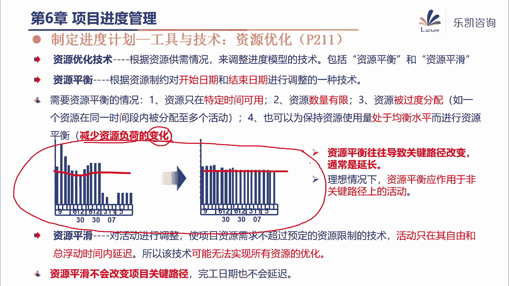

那么接下来我们考虑了关键路径法。

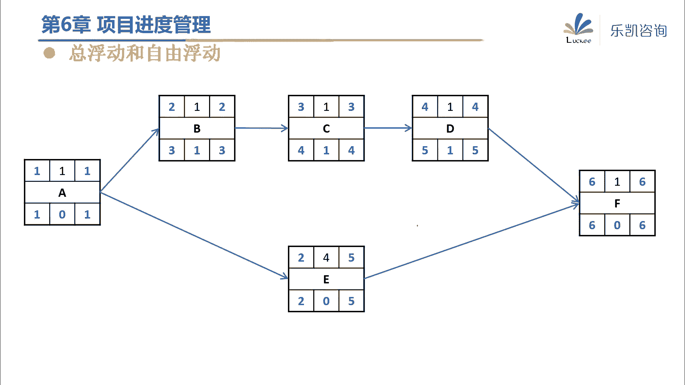

我们考虑了资源优化技术。

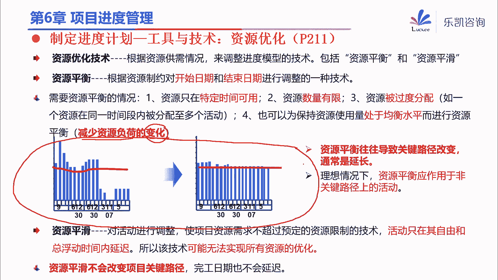

那么这个进度计划是不是就合理了呢，啊他说我们还要考虑做一些假设情景分析，那么什么叫假设情景分析呢，啊就是我们要考虑如果出现这个情况，我们的经营计划会怎么样，如果出现那个情况，我们的计划会怎么样。

就是不断的在什么呢，不断的在yy啊，yy各种情况，然后评估我们的进度计划，在各种情况下的可行性，也就是说它是干什么，他是为了考虑风险的问题的对吧，那么这个工具大家稍微了解一下啊，我们可以考虑一些风险。

另外我们还可以用蒙特卡罗的方法，对我们的进度进行模拟好，我问一下大家有没有听说过蒙特卡罗，我觉得有的同学应该听说过的嗯，蒙特卡罗，他是一个，应该是世界上的三大的赌场之一啊，啊你们都没听说过吗。

那蒙特卡罗不是一个很有名的一个赌场吗，对吧，就像什么什么拉斯维加斯，澳门啊这种性质的对吧，蒙特卡罗也是一个赌场啊，啊那么pp里面的蒙特卡罗模拟是什么意思呢，它是指我们可以对活动来反复的模拟。

来得到我们整个进度的一个概率，我们可以用工具来做蒙特卡罗，这个呢稍微了解一下就行了啊，那么如果有兴趣的同学。

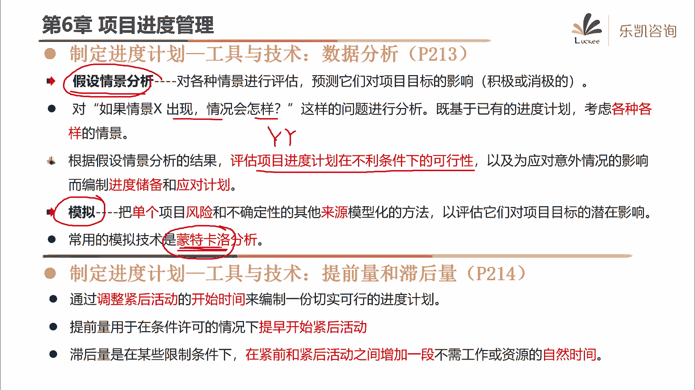

我大致来跟大家说一下它的原理是什么，好吧，稍微简单说一说，假如我一个项目是这样的，我就三个活动，aa做完了做b，好b做完了做c，a要十天，b要十天，c要十天，他们是fs的关系好。

那么请问整个项目工期是多少，那么这个简单呀对吧，就一条路径，a做完了做b b做了做c嘛，整个项目的工期就是30天嘛，不就出来了吗对吧，但是大家要注意啊，我们在规划的时候可以定出来工期是30天。

但是a 10天这个叫什么，这个叫活动的持续时间，是我们当初估出来的，那么这个a真的要十天吗，不一定吧，比如说我们用三点估算去算一算，虽然算出来a的平均工期是十天，但是他有没有概率在九天就把它做完了。

有没有概率在11天把它做完了，他都是有概率的吧，比如说a在九天之内完成的概率啊，啊或者说这样吧，a在12天之内完成的概率对吧，可能达到90%，有90%的可能性是在12天之内完成的，对吧好。

然后接下来b是不是，我们也可以做一个概率的分布做统计啊，就是我们上一节课对吧，后面补充了一些内容，那么它是不是也有12，是也有90%的可能性在12天内做完，那么同样的c是不是也是这样。

他是不是也有90%的可能性，在12天之内做完，那么总的来说，有没有可能这个项目需要36天，有的在36天之内做完的可能性是多少，乘一乘72%几对吧，那么同样的，我们还可以模拟出。

a在11天之内做完的概率是多少，在九天之内做完的概率是多少，反复的去模拟，最终得到我们整个项目的工期，实际上它也有一个概率分布对吧，比如说整个项目，在27天之内做完的概率是多少。

在30天之内做完的概率是多少，在32天做完的概率是多少对吧，它是通过每一个活动。

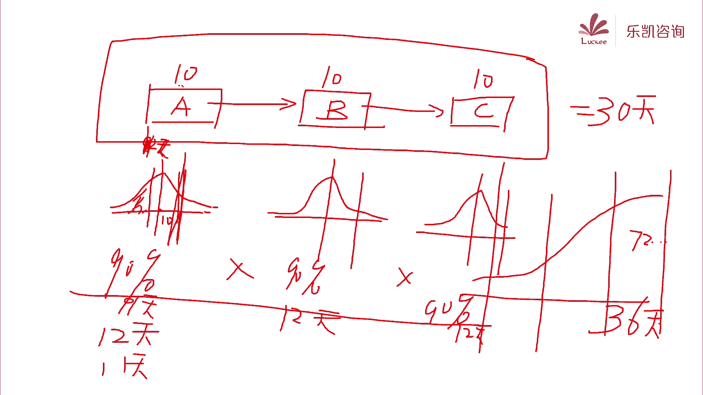

它的单变量的反复模拟，最终来得到整个项目工期。

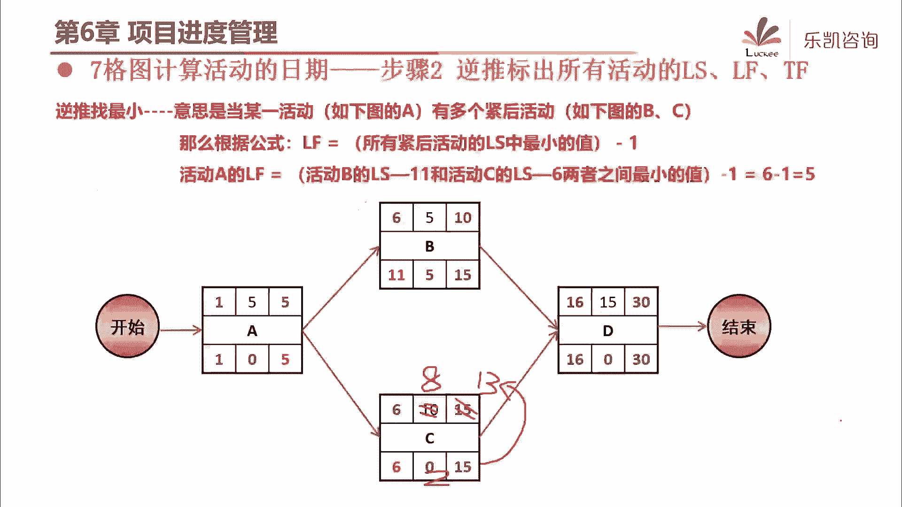

它的一个可能的概率分布好吧，那么这个工具呢稍微了解一下啊，有这么一个东西叫模拟蒙特卡罗，当然我们还要考虑到提前量和滞后量，比如说我们刚刚在讲资源优化的时候，就涉及到了滞后量，对吧好。

那么到这里为止考虑的风险，考虑的概率，我们考虑的提前量和滞后量，那么我们这个计划算完成了吗，很多人觉得到这里，我们的计划算比较可行了对吧，我们关键路径法考虑了逻辑关系，通过资源优化。

考虑到资源的一些问题，考虑到风险，考虑到体量，滞后量，但是我想问一下啊，在这个时候我们跟客户签合同了没有，你想一想啊，在我们项目启动的时候，在制定项目章程的时候，我们就跟客户签了合同吧，很有可能吧对吧。

因为项目章程有一个输入就是协议嘛对吧，那么合同上是不是已经有了工期的要求啊。

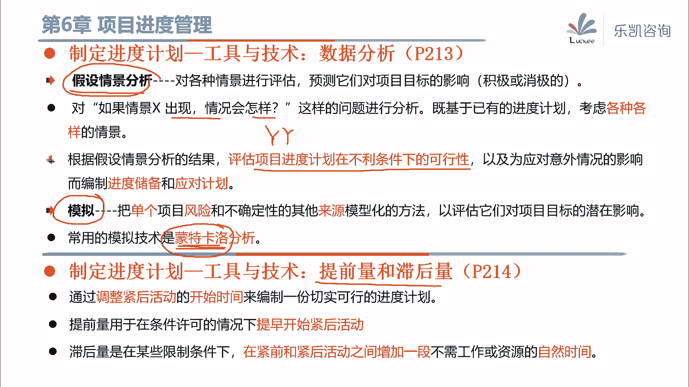

那么有没有可能出现这种情况呢。

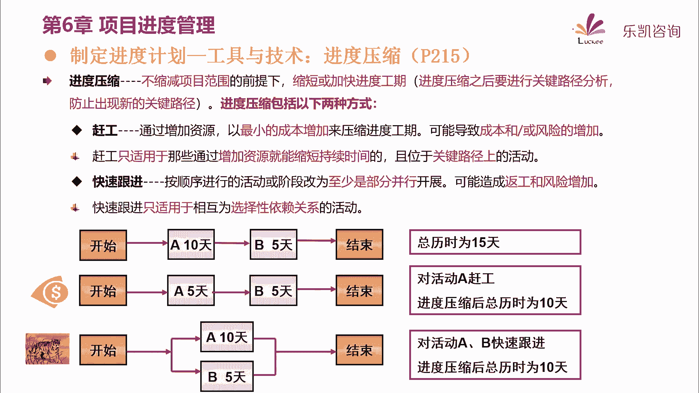

就是我通过关键路径法，通过资源约束我排出来好，我觉得这个项目比较理论上需要30天，结果呢我发现销售跟客户签的合同是，28天之内把这个项目做完，有没有这个可能，这个完全有可能的对吧。

唉根据我们那需求到范围到w bs到工作包，把工作包拆成活动，然后排列活动顺序，估了活动时间，然后通过关键路径法对吧，通过资源优化好排排排排下来，哎呀我排了一个进入计划，比较合理的计划出来了。

是30天把这个项目搞定，结果呢一看合同靠销售，这帮鸟人当初跟客户签合同的时候，说，28天就要干完喽。

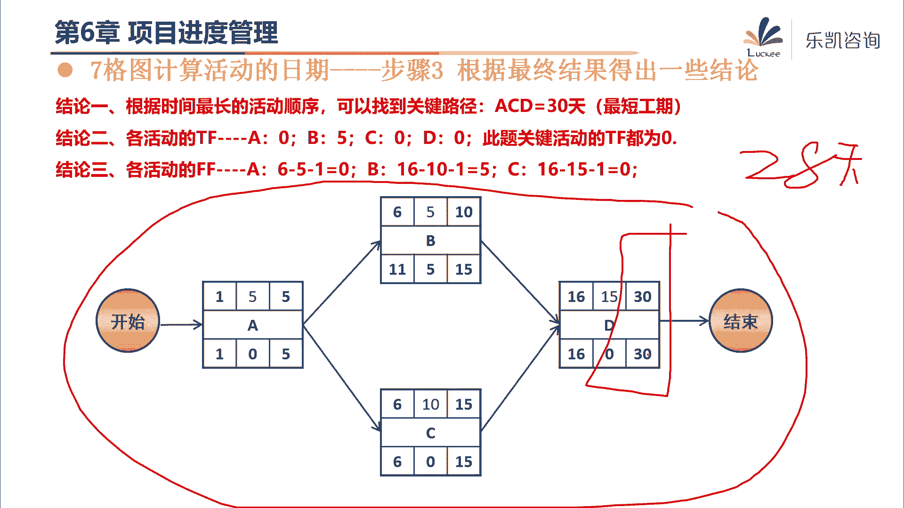

那怎么办好。

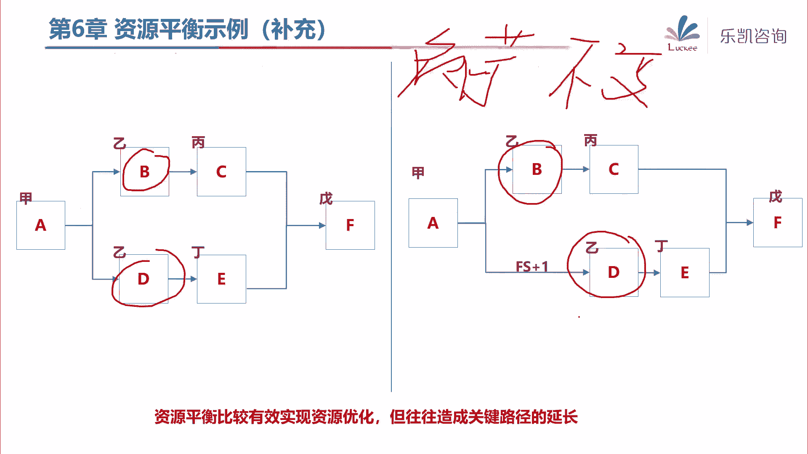

那么这个时候就涉及到我们在规划的时候，很有可能要用到这个工具，叫进度压缩对吧好，什么叫进度压缩，他说在不缩减项目范围的前提下啊，当然前提就是该做的都得做，但是呢我们还要缩短或者加快我们的工期对吧。

那么没办法，你怎么办呢，你只能用一些手段来压缩呀，好怎么去压缩进度，压缩有两种常见的方法，一个叫赶工，一个叫快速跟进，好我分别解释一下第一个什么叫赶工，这个是考试的重点啊，考试的重点，什么叫赶工呢。

他说我们通过增加资源，以最小的成本增加来压缩工期，那么它常见的做法是什么呢，好常见的做法，大家可以在讲义上写一下，有三种做法，要么家人，原来你一个人搬砖的，给你加两个人对吧，你们三个人一起搬对吧。

要么呢不加人，但是呢你一个人干，你得怎么样呢，你参加都得加班啊，对吧，要么加人，要么你加班，那么还有一种叫驾驶，叫什么叫加急啊，我不知道大家有没有听说过这个说法，唉我以前做项目就遇到一次加急的对吧。

我们要印刷一个东西，工厂说你要排队啊，要两个星期，我说我等不起了对吧，能不能有什么其他措施，他说要不这样吧，要么你给我付一点加急费对吧，那么我把你排到前面去好，大家注意，不管家人还还是加班还是加急。

其实它的本质是什么，好它的本质是花钱，然后来买时间，这是赶工的本质对吧，赶工的本质就是花钱来换时间，花钱来买时间，对吧好，所以大家能不能明白啊，如果有一道题目是这么问你的，说赶工，它的后果是什么。

好给你两个选择啊，成本增加，好b工期，被缩短，选哪个，那么大家要注意赶工百分之百会出现的后果，它必然会出现的一个后果，就是a它的成本一定会增加，成本一定会增加对吧，那么有人说工期缩短不也是很很正常的吗。

好大家注意啊，赶工只适用于那些增加资源，就能够缩短时间的活动，有一些活动你赶工都没有用对吧，甚至我们在上一节课还讲过，如果你加了很多的人，由于需要协调，需要培训，有的时候甚至可能还达不到赶工的效果对吧。

所以说赶工百分之百出现的是，成本一定会增加对吧，当然大部分情况下赶工会缩短工期，那么另外还有赶工也会造成风险的增加，但是呢大家要注意，风险不是一个重点啊，你说我加班有没有可能导致由于人员疲劳。

会出现很多的错误呢，有没有可能加班太多，导致员工猝死呢，都有的对吧，但是风险不是重点，我们赶工的重点是什么，成本一定会增加好，这是第一种方法，那么第二种方法，你说如果我不考虑成本，那怎么办呢，快速跟进。

什么叫快速跟进，快速跟进就是你原来需要多少天啊，还是多少天，比如说a 10天对吧，b5 天不变，我也不加班，也不怎么样，a还是十连b还是五天，但是他把先后做的a和b怎么样呢，并行去做对吧。

就是把原来顺序进行，按顺序进行的活动改成什么呢，改成并行，最起码是部分并行，有的时候甚至是完全并行都是有可能的对吧，那么这样做他也会缩短攻击诶，说到这里，我忽然想到我们上一节课讲依赖关系的时候。

说到一个关系啊，什么关系啊，选择性依赖关系，我们当时说选择性依赖关系的时候，好像就是这样吧对吧哎，原来最佳实践是先后做的，考虑到他们是选择性依赖关系，所以我们可以把它并行，用快速跟进的方法对吧。

所以这种方法快速跟进，只适用于选择性依赖关系，如果强制性依赖，你就不能并行，对吧好，那么大家要注意快速跟进，理论上来说要不要更多的钱，那么理论上来说呢是不需要更多的钱的，但是快速跟进比较关注什么。

你并行去做，风险特别大，风险特别大，明白吧，他的风险很高，那么一旦风险发生了，你肯定就会需要花钱，明白吗，那么我们说快速跟进的时候比较关注什么，大家注意比较关注的是风险，当然也有可能造成成本的增加。

明白吧，不是说快速跟进不要钱，而是快速跟进不需要额外的钱对吧，赶工是花额外的钱来买十斤，快速跟进的就是改变一下活动的逻辑关系，原来顺序做的改成并行去做对吧，那么理论上来说呢，不要钱，不要额外的费用。

但是它风险增加了对吧，风险增加了，那么一旦风险发生，你你返工了就需要钱好吧，我们主要关注它的风险，那么为什么要强调一个关注成本，一个关注风险呢，好因为在考试的时候大家要做出选择，比如说在考试的时候啊。

当我们进度落后了，问你怎么办好，大家要注意题目中是怎么说的，假如题目中有这句话叫不计成本啊，钱不是问题，不惜一切代价好，你要选什么，既然钱不是问题，那就花钱来买时间，那么我们就选赶工，明白吧。

因为题目他这么说了，说钱不是问题，不惜一切代价，那么就赶工加人加班加急好，如果题目中是这么说的，他说哎呀，我现在没有额外的资源了对吧，我的成本呢也不能超支，那这个时候你怎么办。

那这个时候你只能选择快速跟进，明白吗，所以题目中他怎么说，你就要怎么选，那么如果题目中什么都不说说啊，他就是说我现在工期落后了，你怎么办，那么你可以选择进度压缩，因为进度压缩就包括了这两种好吧。

那么如果没有进度压缩，优先选择赶工，在选择快速跟进，赶工呢一般来说比快速跟进更加合理，更加合理，好吧快速跟进的这个是承担了很大的风险的，好吧好，那么这个是我们进度压缩的两个重要的工具啊，一个叫赶工。

一个叫快速跟进，当然我们在做练习的时候呢，可能会出现一道很难的题目，那么那个题目呢需要计算主要是赶工的，他有这样一个说法，以最小的成本增加了压缩工期好吧，那么这个呢现在不太考了。

大家如果遇到了稍微注意一下，比如说现在a和b一共要15天，我希望把15天变成13天，在13天做完，那么谁去加班两天呢，是a加班还是b加班呢，好a做a的这个人是周继国，周同学，他一天的成本2000。

作弊的是我jm一天的成本500，那么你说同样是加班，让谁加班呢，你当然选择一个便宜点的去加班对吧，赶工他体型要以最小的成本增加好吧，那么这些题目呢在我们中练习的时候。

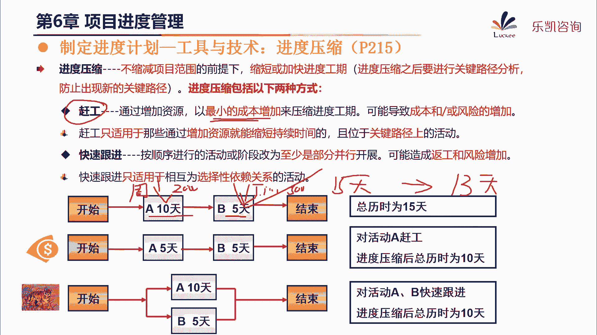

大家可以好好的去练一下好不好，那么通过这些工具再结合p mix系统好吧，那么敏捷里面的这些东西呢，我们后面会讲啊，那么最终通过这些过程，我们得到了进度基准好，这边大家注意听一下啊。

有人在一开始学的时候就问了一个问题，进度管理计划是一个指南型的东西对吧，他说的是我们如何管进度，我们的单位是什么，我们的准确度达到多少，他没有实际的进度对吧，但是进度管理计划是属于项目管理计划。

的一部分的对吧，那么同样的进度基准，也是我们项目管理计划的一部分对吧，它是经过相关方最终批准的一个进度模型，形成了一个基准是吧，好那么接下来还有一个东西叫项目进度计划，这个它是项目文件。

当然是有很多同学不理解对吧，唉为什么这个是项目文件呢，好这里大家注意听一下啊，进度基准呢它是一个经批准的进度模型，就像我刚刚给大家看的project是一样的，你可以把它理解成我们在找工作的时候啊。

我们在招聘网站，比如说在猎聘网站上面，会填我们个人的简历对吧，那么填好的简历一保存就形成了一个模型，那么接下来我问一下，你想把这个简历发给其他人对吧，比如说发给你的同学，带你同学来推荐或者发给猎头。

或者发给我，那么你简历怎么发给我，好很多同学会做一件事，把这个网站上保存好的简历，怎么样把它导出来，导出什么格式呢，比如说我可以从网站上导出word格式的对吧，或者导成pdf格式的，或者导成图片格式的。

是不是，然后导出来之后再发给别人去看吧，好那么这边也是一样的，进度计划是什么意思，当我们有了进度基准之后，我们可以从这个模型里面。

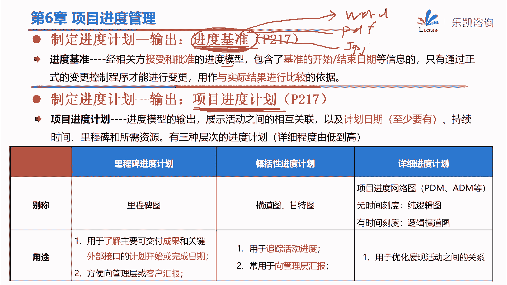

导出不同格式的进度计划，比如说像这种只显示主要里程碑的叫里程碑图，我们可以导成这种格式对吧，就像我们project右边的这一块，这个叫什么叫横道图或者甘特图，也可以导成这种格式。

那这就是完整的一个project。

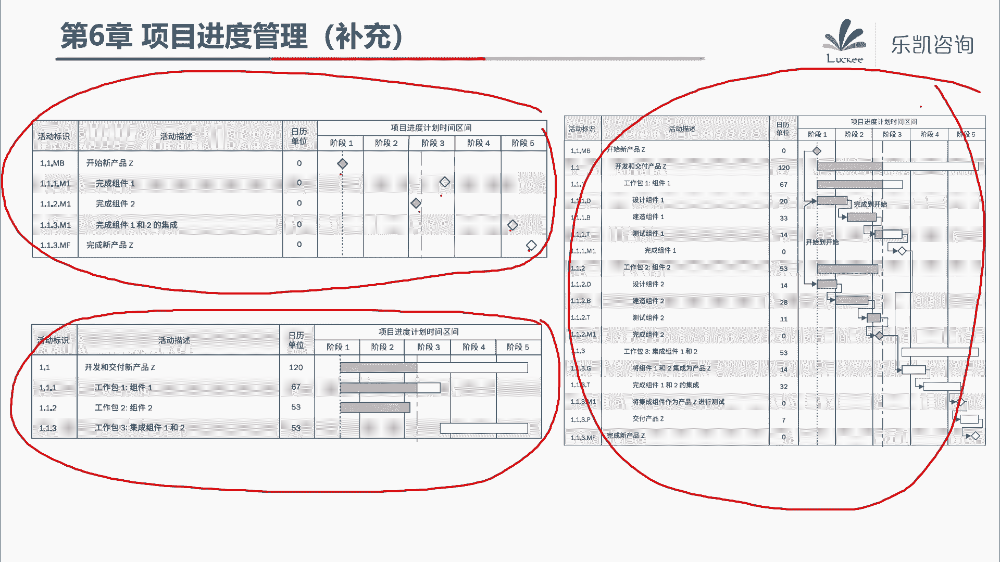

它的演示叫项目进度网络图，或者叫逻辑横道图对吧，所以说项目进度计划是什么，是从我们进度模型里面导出来的，各种形式的一个文件对吧，那么这三种文件大家要了解一下，最容易考到的是什么呢。

就是当我们需要向管理层汇报的时候，问你用什么图，要用横道图或者甘特图好吧，那么里程碑图呢主要是向客户去汇报啊，更多的是向客户汇报，了解主要的可交付成果跟外部接口对吧，跟管理层汇报呢用的是这个图。

横道图或者甘特图，那么我们还可以有更详细的，比如说逻辑横道图好吧，那么这个呢稍微了解一下，所以项目进度计划它只是一份项目文件。

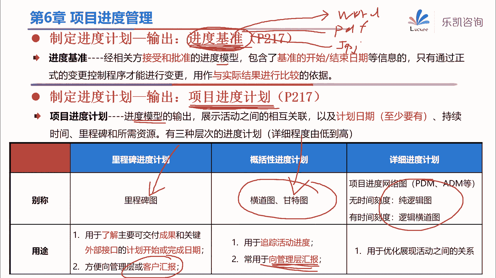

而不属于我们项目管理计划的一部分。

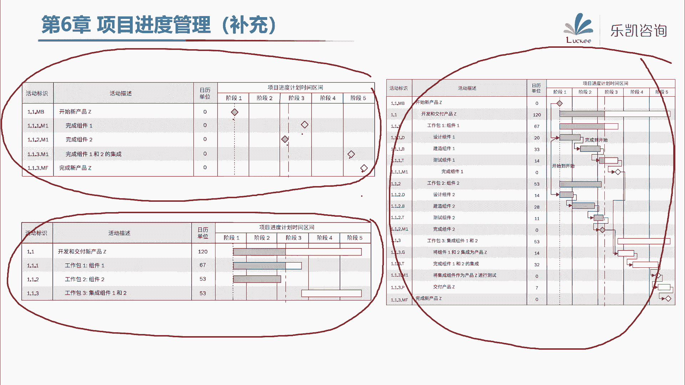

好吧好，那么到这里我们的计划都有了，另外这个过程还输出了一个东西叫项目日历，什么叫项目日历啊，其实刚刚大家应该看到了，我们有标准日历，标准日历就是周一到周五上班，周六周日休息。

但是我们在实际做项目的时候呢，不一定按照这个日历对吧，那么这个时候你就需要说清楚，在我们整个工期之内，哪些属于工作日，哪些属于非工作日，好吧，这个就是我们的项目日历，这个呢稍微注意一下。

包括刚才有同学说的，可能还涉及到好几班对吧，什么早班晚班几班倒的，这个要说清楚的，那么这个就是项目日历好吧，要到这里为止，我们的进度才算规划结束好，那么接下来还有一个过程叫控制进度，我们今天不讲好吧。

控制进度我们放到下个星期。

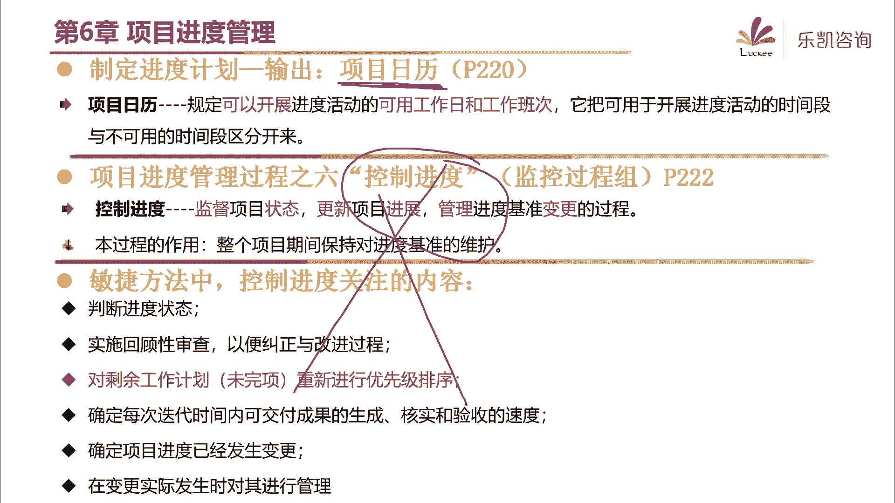

在正值管理里面一起去讲好吧，那么我们今天主要就讲了这样一个过程。

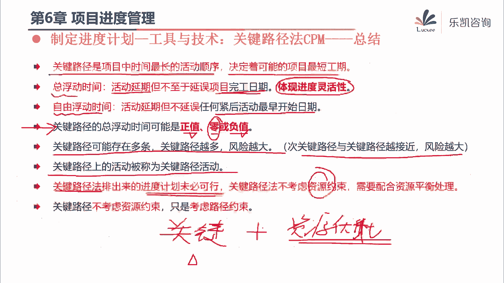

如何去制定一个进度计划对吧，怎么用关键路径法。

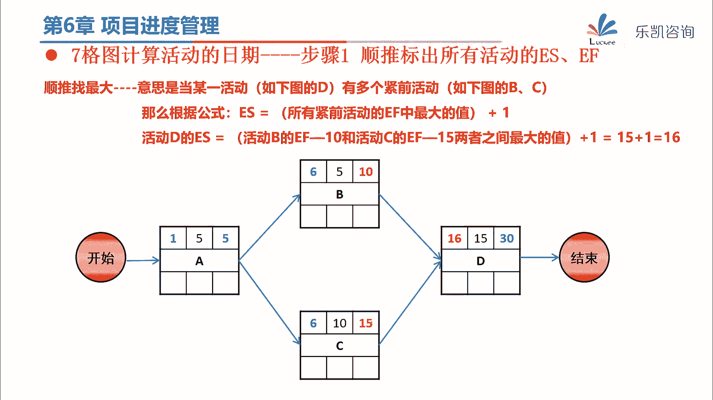

怎么去结合资源优化，然后怎么去考虑进度压缩对吧。

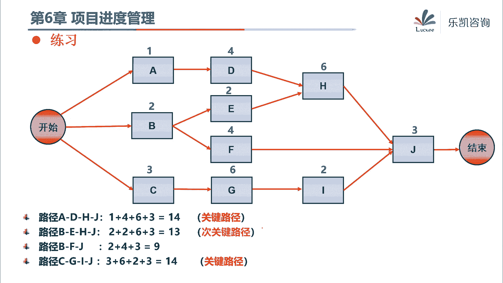

最终得到我们的进度计划，包括我们的记录基准，好吧好，那么今天的课程我们就到这里为止，接下来有没有什么没有听懂的地方啊，我们开始答疑好吧，控制进度为什么不讲，因为控制进度无非就是监督嘛，提前还是落后嘛。

这个很简单啊，在政治管理里面会有进度绩效指数，进度偏差的，好有人说进度基准如何批准，跟范围基准一样的，有主要相关方一起批准。

好班永强同学问了一个问题，他说假如，需要一天，a做完了，做b b呢需要两天，好a做完了，做cc呢需要三天，就这样一张图，怎么做顺推逆推啊，好这样一张图，最后一个活动它是开口的，我们来推一下好不好。

这种图怎么去推，首先a第一天开始做一天，第一天结束吧对吧好，b和c第二天开始，做两天，第三天结束，c做三天，第四天结束，顺推结束了，好接下来我问一下逆推的时候，b的最晚和c的最晚填什么，小问题。

你看啊你顺推最大推到哪个数字啊，你顺推最大是不是推到四啊，那么你逆推的时候都从四开始推啊，不就好了对吧，那么这个时候有同学不服气了，凭什么凭什么你从四开始推呀，好如果你实在不服气。

你这样假设b和c后面还有一个活动叫d，对吧好，那么这个时候你看d的最早开始，是不是得填五啊，那顺推找最大嘛，他是不是得一天五，假如说d是一天，那么他是不是第五天结束好，那么这个时候你知道了啊。

那么这边填5505好，在逆推的时候，由于它是五，所以呢b这边是不是四，c这边是不是四对吧好，等你画完了之后，把后面的这一块用橡皮全部擦掉，不就好了吗，是不是，所以大家记住啊，其实很简单。

逆推的时候填的数字是哪一个数字，你顺推推下来最大是几，逆推的时候，就从那个最大的数字往前推推到一就可以了，明白吗好吧，其实这个很简单啊，想清楚了就行了，然后你就记住，反正顺推最大推到哪个，最大推到四。

那么就从四往前推，好李斌说，那么如果d的最早开始是十，你如果d的最早开始是十，你就需要前面有一个活动，最早结束是几啊，是九啊，对吧，你没有哪个活动最早结束是九，它凭什么是十啊，对不对，你现在顺推找最大。

你找出来是四，那么d它就必然是五开始，对不对，怎么可能是十开始呢，是这个道理吧，好有人说fs减几在图上怎么画，你就这么写吗，fs减几吗，减一吗，明白吧，你算的时候要注意把这一天算进去画，就这么画。

就是把这个滞后量写在这根线上就行了，好张青同学问了一个问题，说体现进度灵活性的，为什么是总浮动时间，而不是自由浮动，因为进度的灵活性，就是指不影响项目的总工期就可以了，好吧，不需要那么严格。

其实大家有没有发现一个问题，自由浮动比总幅度它更加厉害，更加严格对吧，那么我们体现进度的灵活性，只要不延误什么呢，项目的攻击就行了，倒不一定说，没有必要那么严格好吧。

所以我们说总浮动时间体现了进度的灵活性，而不需要用到自由浮动时间，好有人说学的内容现在越来越多了。

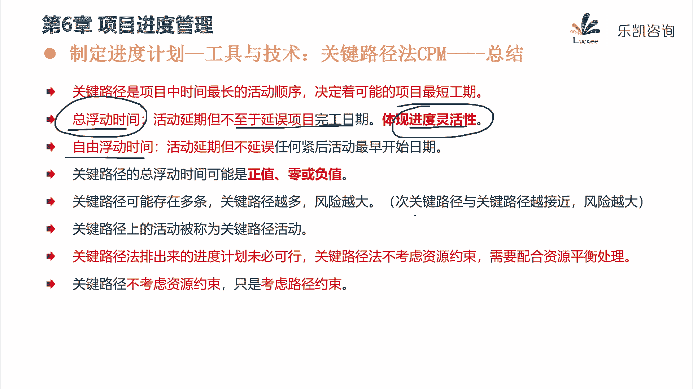

感觉串很难，实际上我觉得啊大家把基本功打好，串就不难，比如说我帮大家串一下范围和进步，我们回忆一下我们这条线，特别是规划的这一部分是怎么说的，最早项目启动，有项目的章程，项目章程里面有需求吗。

有有范围吗，有有进度吗，有但是很可惜他们都是宏观的较高层级的对吧，那么接下来我们首先细化的需求做了收集需求，这是我们规划开始学习的比较，第一个像模像样的过程对吧，当然前期前面还有规划范围管理。

那个就不说了，比较实质做的一些事情就是收集需求，需求都收集了，我们要对需求做筛选，然后要定义好，用什么可交付成果来满足这个需求，所以我们做了定义范围，把可交付成果是什么，验收标准是什么，要把它说清楚。

跟客户达成共识，好可见不是我地域清楚了之后，发现它太大，不太好管，那怎么办呢，把它分解成较小的，更易于管理的组件，所以我们做了创建w bs，而这个过程的目的是为了得到什么，是为了得到工作包，对吧好。

到这里范围的规划结束了，有了工作包之后，我们规划了进度管理，当然接下来我们做了一件事，把工作包分解成更细的，叫什么活动，所以我们以工作包也就是范围基准为输入，我们做了这样一个过程，叫定义活动。

把它打散变成一堆活动以及里程碑对吧，我们输出的是活动清单，活动属性和里程碑清单好，有了这一堆活动之后，我们开始干什么，开始考虑他们的逻辑关系，排列活动顺序，排列活动顺序。

我们用pgm紧前关系绘图法呀等等，包括体量滞后量对吧，包括依赖关系，形成了项目进度网络图对吧，然后有了这张图还不够，我们还估算了每个活动的持续时间，估算活动持续时间，对吧。

用三点估算啊啊做这个类比估算啊，参数估算啊等等，好把时间都估出来，有了网络图，有了每个活动的时间，我们今天讲了好，制定进度计划，用关键路径法对吧，结合资源优化，结合这个进度，压缩工具等等。

最终把计划做出来，所以从这条线能够很明显地看出，怎么样从高层级的去细化，得到细化好的范围对吧，然后接下来范围怎么变，活动得到进度，那么我们下个星期会讲，从进度怎么样算出我们项目的成本。

有没有了解规划它们之间的相互的关系对吧，实际上就是这么来的嘛，从范围到进度，那么下个星期从进度到成本，把规划的先做好，到最后形成一份综合的项目管理计划，然后去执行，那么监控的时候该怎么监控，怎么监控。

对吧，这些东西自己有时间去想一想啊，实际上很简单，p m p里面他虽然讲的内容多，但是呢他分得很细，实际上你总结一下，其实就那么一点好吧，那么星期六呢还是一样的，我们会把进度的题目刷一下对吧。

让大家对一些概念更加的强化，然后讲完了40道题之后，我们再讲进度这边他的一些实战的东西，比如说怎么解决帕金森的问题对吧，比如说工期特别不合理，在合同里面特别不合理，那么我们后续用什么手段来争取一些时间。

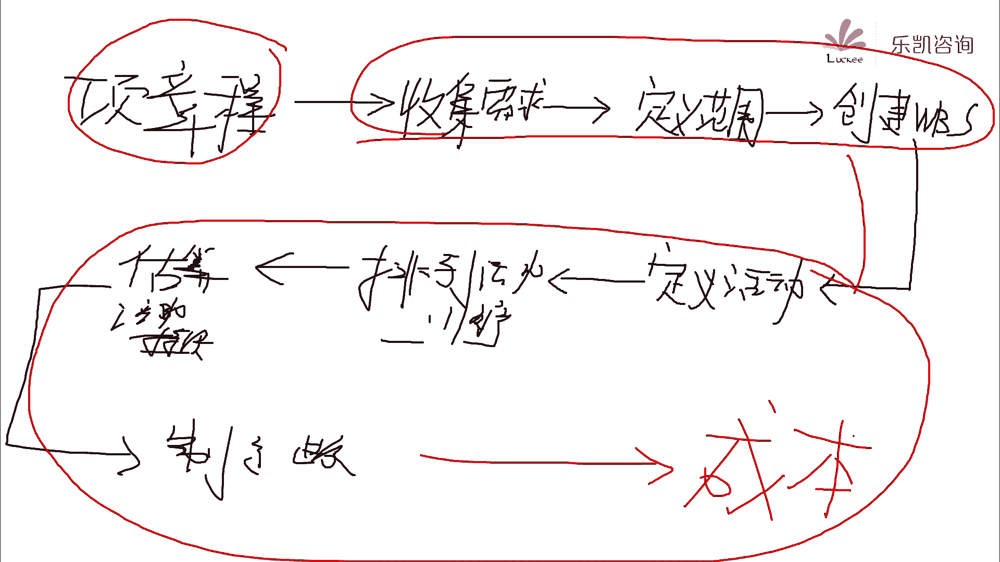

好吧，那么有人说进度基准是什么，那在project里面它是有一个工具的，叫设置机械，看到没有，机械就是baseline，就是基准啊，设置机械设置基准好吧。

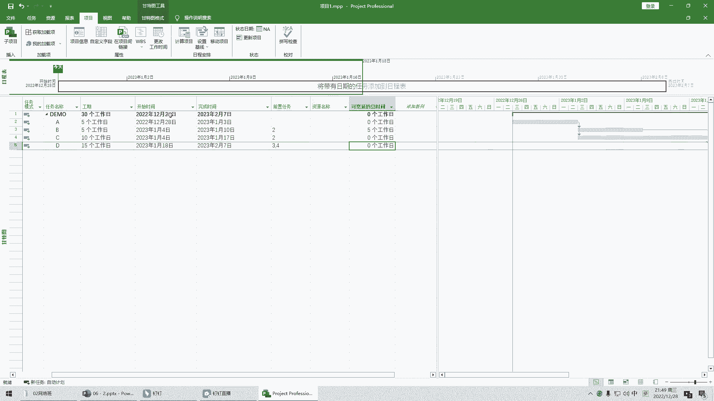

那么这个就是进度基准，那么你可以从这个里面导出去各种各样的图，导出来的东西就叫进度计划好吧，现在大家要学着去串一串对吧，我每讲完了一个章节，我都会帮大家去串一串，如果实在串不起来也没关系。

偏僻学完了之后，整本书我会帮你们再去串一串的，好吧，这个不要担心啊，大家做好课后的巩固工作就可以了，好吧好，那么今天我们要么就先这样吧，就先这样，如果还有什么问题，我们在群里面多沟通啊。

或者直接问我也可以好吧。

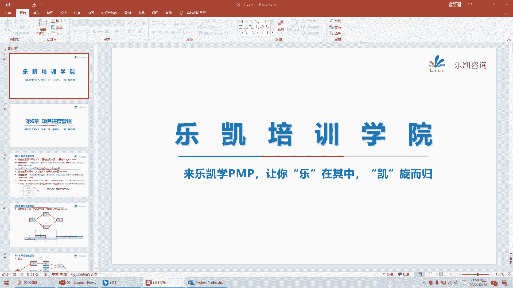