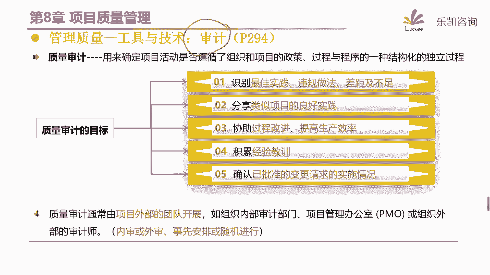
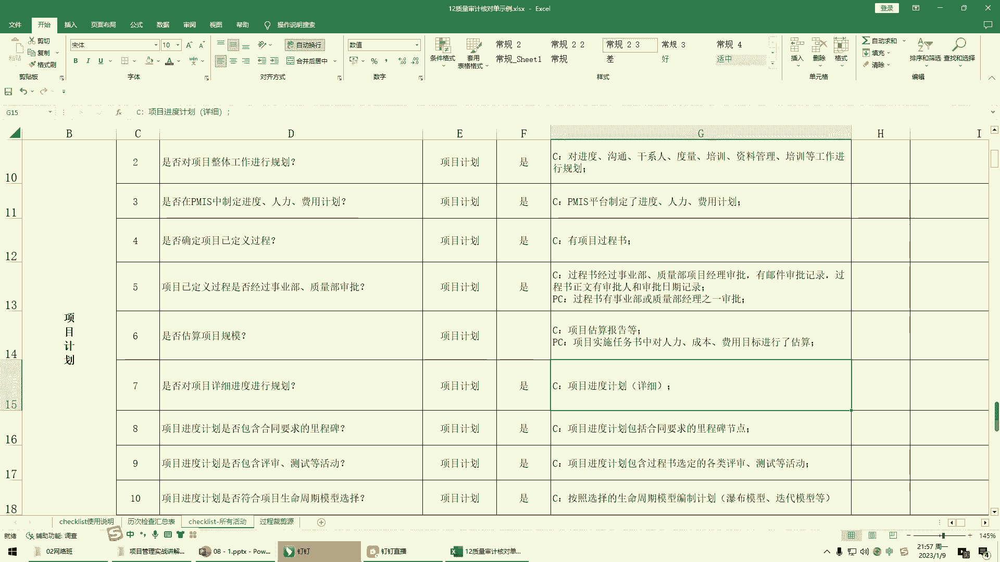

# 2024年PMP认证考试课程针对PMP新考纲最新免费零基础也能轻松听懂 - P12：PMP第8章：项目质量管理（上） - 乐凯咨询 - BV1Rj411G7gs

好各位同学晚上好，今天晚上呢我们一起来学习第八章，项目的质量管理好吧，那么我们之前呢学了项目的范围，进度和成本，那么放进程之间的关系呢，我相信大家应该能够有一定的理解对吧。

那么接下来呢我们看一下在项目管理过程当中，其实还有一个环节是比较重要的，就是项目的质量管理，那么项目的质量管理大家知道它为什么重要吗，大家可以聊一下啊，就是说我们在做项目的时候。

需不需要关注质量这个环节，或者说质量它的重要性体现在什么地方，那么我们很多同学可能有这样一个概念对吧，唉我们觉得质量还是比较重要的对吧，那么为什么它很重要呢，啊很多人说因为如果你质量做的不好对吧。

那么客户那边呢会有一些意见拒绝验收对吧，那么如果拒绝验收会给我们带来很多的啊，比如说回款的困难啊等等各方面对吧，包括还有我们一些特殊的行业，比如说特别是制造业啊，建筑业呀对吧，那么特别是建筑业。

包括重大的市政工程，如果你的质量做的不好，可能会带来一些灾难性的后果是吧，所以说质量呢它确实是比较重要的一个环节，那么我觉得呢大家说的都都在点子上啊，那么质量呢确实我们是需要特别重视的。

那么一方面会影响我们公司的声誉，另一方面呢会对吧，如果质量做的不好，会带来很多不好的后果，那么另外呢，其实还有一个大家容易忽视的一个地方，质量为什么重要，在这几年我们疫情这几年啊。

其实很多公司都很困难对吧，那么很多公司都很困难，他就会提倡一句话叫什么呢，叫开源节流，提出过这个说法吧对吧，就是收入来源要希望要多一些，然后呢支出呢要希望少一些开源节流。

那么实际上真正能做到开源节流的有多少呢，实际上并不多，那么有什么办法能够带来成本的降低呢，其实有一个比较好的办法，就是要关注质量，因为呢曾经有人说过这么一句话，他说质量代表着纯利润。

那么这是一个很有意思的观点啊，跟大家说一下，为什么说质量代表了纯利润，举一个例子，假如说我现在呢做做一个包子，对吧，那么假如说我做一个包子的成本是两块钱，那么一般来说，这个包子卖给客户卖多少钱呢。

比如说卖三块，好那么大家想一想，两块钱的包子，这个项目顺利的做完，卖给客户三块，我们企业会带来多少钱的利润，那么基本上也就是一块钱的利润，对吧，那么这个毛利呢已经达到了33%了。

1/3的利润应该是比较贵的了对吧，应该说还是利润比较高的了，那么大家想一想，即便那我们把这个包子做好，顺利的卖给客户，我们也就赚一块钱的利润，但是你想一想，假如说我们在做包子的时候，质量没做好。

花了两块钱，但是包子没有做出来，这会导致什么后果，你会发现包子做好了，卖出去你也就挣一块钱对吧，但是如果这个包子做砸了呢，直接两块钱全部都报废掉对吧，所以说在很多制造业的公司，他们会有这样一个观点。

其实质量它代表了纯利润，如果你质量做得好，减少废品，减少返工，那么这一部分钱会大大地节约下来好吧，那么我们在讲质量之前呢，我们先聊一下关于质量，这里这边的几个质量管理大师。

那么首先第一个比较有名的叫代名，那么大家注意代名呢，他全名叫爱德华兹戴明，他不是中国人，他是一个美国人对吧，那么戴明博士呢，我相信很多人应该听说过他的一个理论，叫p d c a有同学听说过吧对吧。

那么什么叫p d c呢，他说我们做事情呢应该遵守这样一个叫戴明环，所谓的p就是我们首先要有计划，然后有了计划之后呢，根据计划去执行，去do对吧，d就是执行，然后接下来做完了之后呢。

我们要去check去检查对吧好，那么关键的一点，什么叫a就是我们检查了之后发现的问题，我们要去总结，要去行动，要去改进，所以最后一个a叫act，那么戴明博士，他提出来p d c a的这样一个观点，好吧。

那么实际上戴明博士这个人呢，在质量管理领域可以说是一个封神的一个人物，他一开始在美国啊，其实戴明博士就提出了这样一个观点，那么他的这样一个观点，戴明华实际上是一个什么思想呢，叫持续改进，持续改进对吧。

那么当时戴明博士在美国提出来这样一个观点，因为他美国人嘛，那么在美国提出来这样一个观点啊，很多人不接受，对吧，那么为什么不接受呢，你比如说大家觉得哦我们经过这个计划，然后执行检查，然后再改进。

通过这样一个循环不断的去持续改进啊，戴明博士说可以有什么好处呢，我们可以节约很多的成本，减少很多的反攻和废品对吧，提高我们的质量，那么这省下来的钱可以做什么，省下来的钱我们可以多开几个工厂。

多加几条生产线，那么最终可以实现社会的经济的腾飞，那么美国人是不相信的，实际上大部分人都不会相信对吧，为什么呢，你想一想啊，这就好比有一个人跟我说说，唉金木老师，你抽烟抽了多少年了，我掐指一算。

我抽烟抽了20年了对吧，他说你如果20年不抽烟，你应该已经有你自己的宝马了，那么这句话有没有道理呢，听上去是有道理的，但是感觉有那么点玄乎是吧，202 10年不抽烟对吧。

那么你省下来的钱足够买一辆宝马了对吧，但是很多人呢听了之后呢，感觉是有道理的，但是呢觉得这个好像你真正执行的，很难执行对吧，就比如说很多人也不抽烟，但是他把他的宝马在哪呢，是不是，所以很多人是不相信的。

那么有一个有一些人他相信了，那么在1945年的时候，日本被炸了一遍对吧，那么日本人呢也是很这个很奇怪的啊，就是说谁把他打服了呢，他就佩服谁对吧，所以呢被炸了一遍之后呢，要做战后的重建。

那么就请美国人过来做战后重建，那么这个时候呢代云博士就去了日本，那么去了日本之后，日本人接受了戴明博士的这个观点对吧，那你们有没有发现就是日本人啊，他这个很奇怪啊，他这个做事情啊。

啊给人一种说不来的感觉，这个前段时间刚刚世界杯结束啊，嗯我呢对足球不太感兴趣对吧，那么我想问一下这个懂足球的同学，这个日本队，现在在亚洲它处于一个什么水平，有没有懂足球的同学知道的。

就日本队这支球队在亚洲，它属于一个什么样的水平，啊，有人说日本队在亚洲，基本上已经是天花板的存在了对吧，一般来说我们可以认为他是亚洲第一了是吧，但是我记得我小的时候，我印象当中。

日本队的足球水平其实也不怎么样啊，如果说跟我年龄差不多的，七零后，八零后应该知道，其实很早以前日本队的水平呢其实也不怎么样，那么我之前的印象很深刻的，我听说日本呢搞了一个叫什么东西呢，好像叫足球的。

叫百年计划，啊如果我没记错的话，好像是有这么一个说法对吧，那什么叫百年计划呢，就是说他知道自己的足球水平那么很臭对吧，然后他说没关系，这样我们用100年的时间对吧，哎我们从青少年开始，我们努力100年。

然后将来怎么怎么样怎么怎么样是吧，那当时听了这个你就很无奈啊，我靠这100年下来真的能够坚持下去吗对吧，就像美国人不相信戴明博士的pdc，但是日本人他就是这么轴，他就是这么做了对吧，好果然短短几十年。

日本实现了经济的腾飞是吧，那么戴明博士后来离开日本回到美国的时候，戴明博士把他在日本研究的一些文献手稿，全部都留在了日本，然后回到了美国，然后后来美国的华尔街有一个记者，我记得写了一篇文章。

文章的题目好像是为什么日本行，而美国不行对吧，那么这个文章里面就提到了一个人，就是戴明博士啊，后来才知道哦，原来戴明是他们自己美国人对吧，所以戴明博士呢，这个本身他这一生啊也是很有传奇色，传奇色彩的。

然后呢呃他的这个在质量领域啊，它的名气也是比较大的，在日本这个国家的这个质量奖，它就叫戴明奖，是以戴明博士来命名的好吧，那么戴明博士的主要观点，实际上就是通过pd c来持续改进，不断的去改进。

包括他说预防是剩余检查的啊，包括质量成本85%都是管理的问题，那么像戴明博士的这些原则要稍微了解一下，好吧好，那么接下来还有朱兰猪栏呢，他提出来质量的三部曲啊，就是质量要做计划，然后要做控制，要做改进。

这实际上对应了我们接下来要讲的，第八章的三个过程，然后另外呢他提出来质量和等级是有区别的，那么一会儿我们会详细的去讲好吧，质量和等级的区别在什么地方，那么另外还有一些质量大师，比如说克鲁斯比。

那么克鲁斯比呢他提出来一个东西叫零缺陷，零缺陷，那么当时呢，我第一次了解到克鲁斯比的理论的时候呢，我觉得呢这个几乎是不可能，怎么可能做到零缺陷的对吧，然后后来我就了解了一下他说的具体的内容。

他说第一次就把事情做对，代价是最小的，对吧，然后他认为质量是免费的，那么他说的这个是什么意思呢，他说我们需要提高质量，那么提高质量怎么去提高呢，我们要做一些培训，要买一些设备等等。

那么也就是说它是需要干什么，它是需要投入一些资金的，那么投入了这些资金和成本之后，它会带来什么好处呢，它可以减少返工对吧，减少废品，那么这一部分是不是又节约了一部分费用呢，那么你会发现。

其实节约的钱要远远大于当初的投入，所以他认为质量是免费的好吧，那么他的这些观点呢，大家有兴趣也可以去了解一下，另外包括比如说还有这个人石川，石川的全名叫石川心，你看到这个名字，看到这个人的照片。

就知道他是一个日本人对吧，那么它主要的作用是总结的质量的七工具，另外它比较有代表性的一个工具，就是以他的名字命名的，叫石川图，也叫鱼骨图对吧，如果做过制造业的同学，应该听说过这样一个说法啊。

人机料法环实际上就是这个工具，那么我们后面也会详细的去讲解这个工具好吧，那么包括田口红衣或者叫田口玄一啊，他提出来实验设计的方法，那么像这些质量管理大师呢，虽然现在呢不太考了啊，现在这么多年都没考了。

但是我觉得如果学质量的话呢，这几个质量管理大师要稍微的了解一下，好吧好，那么另外在pm报考一开始他就讲了这句话，在第八章质量啊，一开始啊他就讲了这句话，他说项目的质量管理。

要兼顾项目管理和项目可交付成果两个方面，那么说到这里啊，我首先要问大家一个问题，如果我问大家怎么样来提高我们项目啊，产出的一些东西的质量，你们觉得我们应该用什么手段，啊不管是制造业的，建筑业的。

还是我们软件行业的对吧，哎我又想把质量搞好，你马上能够想到的手段有哪些，其实我们很多人想到的是什么啊，对于我们平时没有接触过质量的人来说，马上能想到的是这些东西，比如说检查，像我们制造业里面啊。

比如说有抽检啊，对吧等等，还有测试，对吧，通过这些手段来提高质量，但是我们在质量这个过程这个知识领域，第一句话篇文博客里面就说，项目质量管理要兼顾项目管理和项目可交互，通过两个方面。

那么这句话是什么意思呢，检查和测试是针对什么，是针对结果对吧，我对结果去检查去测试，那么我们质量是不是我们最终对结果进行检查，去测试，去抽检，就能够保证我们的质量做得好呢。

其实不是有一个东西跟他同样重要，甚至在某种程度上来说比它更加重要，什么东西就是过程，所谓的项目管理实际上就是过程对吧，那么为什么我们会提出这样一个观点，因为过程如果做好了。

你的结果就不太会有什么太大的问题对吧，那么我们强调我们要有一个标准化的过程，然后我们要符合这样的过程对吧，过程是非常重要的好吧，那么我们在第八章的学习的时候，大家可以去体会一下，为什么过程是这么的重要。

好吧好，那么一开始的pm box里面，他就讲了这几个概念的区别，他说那么我们要学习质量管理呢，首先有这样几个核心概念，要知道的第一个质量和等级是不一样的，那么什么叫质量呢。

他说质量是作为实现的性能或成果，是一系列特性，内在特性满足要求的程度对吧，那么在我们做题的时候，质量往往跟什么有关呢，跟这个有关，大家可以了解一下啊，题目中经常出现的一个词叫技术规范。

要满足一定的技术规范对吧，那么什么叫等级呢，他说等级是一种设计意图啊，是对不同的可加物存活的级别分类，这两个呢我建议大家不要去背，你理解就可以了对吧，其实有一个很简单的例子啊，我们可以来说明这个问题。

比如说作为我们项目经理，我们经常去出差对吧，其实最好的一个例子是什么呢，就是我们出差住酒店，那么我问一下，我们到一个城市住酒店，五星级，四星级，三星级，包括经济连锁型酒店。

它们的区别是质量不同还是等级不同，那么其实应该是等级不同对吧，很多同学马上就反应过来，那么为什么说等级不同呢，因为他为什么要区分五星级，四星级，三星级啊，它是一种设计意图，我们一个城市的酒店。

它是面向很多不同的人群的对吧，五星级的是给谁做的对吧，四星级三星级给谁做的，像我以前作为项目经理，我出差我基本上住的是什么经济连锁型酒店，比如说汉庭莫泰这种酒店对吧，那么他是级别的一个分类。

它主要是解决不同人群的住宿的问题对吧，那么我以前住经济连锁型酒店，虽然不像五星级酒店，那么高端，但是我能够发觉推开门之后，整个房间是干净的对吧，然后有24小时热水，雪白的床单对吧，然后马桶下水也很快。

我觉得这个质量就很ok对吧，所以说像这种它只是一个等级的问题，那么什么是质量问题呢，我问一下大家啊，比如说五星级酒店，它等级很高，你们有没有见过它质量不行的，遇到过这种情况吗。

我记得几年前有这样一个报道，说有一家五星级酒店，用那个洗手间里的浴巾去擦马桶，大家看到过这个新闻吗，对吧，那虽然是一个五星级酒店，但是呢好像他在这方面很不规范，这个在新闻上报道出来的对吧。

好像用这个洗手间里的那个浴巾去擦马桶啊，那么这种就说明什么，就是说高等级不一定意味着高质量对吧，低等级呢也不一定意味着低质量，你说等级低可以吗，可以的，你像我以前做的什么汉庭啊对吧等等。

这些酒店我都没有发现有什么问题啊对吧，但是你的质量有问题，这就一定是一个问题好吧，所以说大家要注意质量和等级的区别好吧，等级低不是一个问题啊，等级它是一个设计意图，等级低点不要紧，但是你质量达不到要求。

这肯定是有问题的，那么我们在做项目的时候，项目经理和项目管理团队要负责权衡，我们这个项目究竟应该达到什么样的等级，包括我们的质量要达到什么要求好吧，那么这是等级和质量的区别。

那么大家记住酒店的这个例子就可以了，很好懂好吧好，另外他还提到预防和检查也是有区别的，那么我们刚刚在讲戴明博士的时候，他提到一个观点说预防剩余检查好，大家能够理解为什么预防剩余检查吗。

因为从某种程度上来说啊，我们检查只能得到一个什么，其实检查不能起到避免的作用，检查只能得到一个结果对吧，唉就像我们有同学说的，检查的时候，他已经已成定局了啊，举个简单的例子，比如说。

我们现在大家可能运动都比较少，都比较胖，可能有脂肪肝对吧，那么你要避免自己有脂肪肝，你应该怎么做，你说我去做体检能不能避免对吧，当然我承认体检很重要，但是体检只能得到一个结果对吧。

就是你究竟是有脂肪肝还是没有脂肪肝，但是如果你要真正去避免脂肪肝，不是靠体检来避免的，靠什么，要靠平时的预防，比如说要多运动，要注意饮食对吧，所以说在篇报告里面，他说预防是保证过程中不出现错误对吧。

那么这样可以避免结果有问题，而检查呢只是查一个结果，最多只能保证啊有问题及时的查出来，不把它放到客户手上对吧，所以预防是剩余检查的好，那么接下来还有一个概念，叫属性抽样和变量抽样。

那么属性抽样和变量抽样，实际上都属于我们质量里面一种常见的做法，叫抽样，好首先我问一下大家，大家听说过抽烟吗，啊我们可能做制造业的同学，这个概念提的比较多对吧，我们要抽检啊。

比如说我们有一大批的东西做出来了，那么为什么要抽检，而不是每一个都去检查呢，那么原因可能有两个，第一个我们做出来的东西啊太多了对吧，所以我们只能取一些批次去干什么呢，去抽检对吧，这是第一个原因。

那么第二个原因是什么呢，有可能我们检查的手段是一种破坏性测试对吧，比如说大家刷抖音的时候，有没有看到有，比如说中保研搞的那个汽车的碰撞测试对吧，那么你说我们生产了100台车，我怎么去检查呢。

我把这100台车都去转一转吧，那么这100台车撞下来之后全部都报废了，那么你这种测试是破坏性的测试对吧，那么你只能去抽取一些样本去去检查，而不是说每个都去检查，这个是不可能的对吧好。

那么抽样的时候它就涉及到两种，一种是属性抽样，一种是变量抽样好，什么叫属性抽样啊，大家注意属性抽象，就是说我对结果只需要一个定性的一个结果，比如说我取了100个样本，您告诉我有多少合格。

有多少不合格对吧，有多少正确，有多少不正确，它就两种对吧，要么零要么一啊，比如说我取了这么多样本，其中有95%的是正确的啊，有5%的是不正确的，或者有95%合格，5%不合格，那么只要你的结果就两个。

要么对，要么错，要么正确，要么不正确，要么合格，要么不合格，那么这种都叫属性抽样，我只要知道一个姓定性的一个结果就可以了，对吧，比如说将来等大家参加完了p mp考试，那么我想知道大家考试的情况。

我也可以抽取一部分同学对吧，那么我就看这部分同学里面有百分之多少的通，过，有百分之多少呢，不通过对吧，这个就叫属性抽样，那么什么叫变量抽样呢，好变量抽样就是指它不仅仅看你通过不通过，还要看你合格的程度。

好问大家一个问题，考试有很多人都能够通过，这些通过的人，他们的成绩有区别吗，你会发现是有区别的对吧，通过不通过这个只是很简单的去定个性，但是即便是通过的人，他的成绩呢也是有区别的。

比如说我们详细去分析一下，会发现啊，有30%的同学，他是3a的成绩通过的对吧，这个我们一般叫什么呢，叫学霸学的比较好的对吧啊，然后有20%的同学，比如说是2a通过的对吧。

那还有百分之多少的同学是低空飘过的是吧，那么这个时候你就能够在这个连续的区间里面，找到你的位置在什么地方，比如说你在这边呢还是在这边呢对吧，虽然你通过了，虽然你是合格的。

但是通过变量抽样能够知道你合格的程度，你究竟在哪一个梯队对吧，那么这种叫变量抽样好吧，那么这两种呢它的区别稍微了解一下，那么第三类概念就是公差和控制界限这一块呢，我们在后面学习的时候。

我们讲控制图的时候再详细的去讲好吧，大家先放一放，那么这是我们一开始他要我们了解的，这几对核心的概念，要把它区分清楚，那么另外他说现在呢，其实我们质量管理有五种水平对吧。

那么我们可能不同的公司它处于不同的水平，那么首先最低的一层是什么水平呢，他说完全没有质量管理，做完了之后直接甩给客户对吧，让客户来发现缺陷，就是谁去检查，谁去测试呢，他自己不管。

把客户变成我们自己的测试对吧，那么这是一种最低的一个档次，那么这样做有什么坏处，客户会非常的恼火对吧，会怀疑你们公司的实力，怀疑你们公司的水平，那么这是最差的一种质量管理水平，那么有的公司做的好一点呢。

哎能够到这一层，他会做一件事情叫质量控制，那么质量控制这个词呢，其实在我们前面讲课的时候，都跟大家提到过对吧，俗称叫什么呢，qc call it control对吧，那么qc是什么意思呢。

刚刚有同学说哎qc是什么意思好，大家注意，他说我们要先检查，先测试，看一看我们的结果有没有问题，如果有问题，我们要纠正，如果没有问题的才能交给客户，所以说qc，实际上就是我们之前说的检查或者测试。

那么要注意qc是针对什么qc，它针对的是结果，我们对我们最终的结果去检查去测试对吧，哎如果没有问题，那么我们再交给客户，那么这是做得稍微好一点的，在这一层第二层，那么我以前的公司，我觉得它在第三层。

那么第三层是什么呢，他说要通过质量保证来看什么来检查过程，那么这一层呢我们把它叫qa，quality assurance，那么q a是什么意思呢，就是说我们刚刚说啊，一个好的结果是哪来的。

一个好的结果应该是由一些好的过程得到的，结果不是天上掉下来的对吧，它是通过过程得到的，所以我们把过程都要规范化，我们要保证符合我们的标准的政策，流程和程序对吧，所以在这一层他就非常重视过程管理。

只要你过程做得好，那么结果就不会差对吧，那么我以前的公司他能够做到这一层，虽然是一个软件行业的公司对吧，但是已经能够做到这一层了，那么第四层说的是什么呢，说的是把质量融入到规划和设计。

就是在我们一开始规划和设计的时候，就要特别重视质量，那么我给它取了一个名字，在plan的时候，qp的时候就要重视质量，好吧好，那么最牛逼的一次呢，就是质量已经成为了我们组织的一种文化。

那么这五层呢大家稍微了解一下，有这么一个说法好吧，自己有兴趣的也可以去对照一下，你们自己的公司，他现在处于哪一层好吧，那么依次递增的是这五层，那么另外他还说我们还有一些概念，或者说有一些理念。

我们是需要知道的，我们做项目要让客户满意，那么什么叫让客户满意呢，就是我们要符合要求，适合使用对吧，那么另外我们要持续改进好，大家注意啊，持续改进是什么意思，他说我们要通过持续不断的小改进。

积累成大改进，那么这样一种做法，往往比瞬间的大改进会更有价值，而p d c a就是质量改进的基础，问大家一点啊，为什么我们强调通过持续不断的小改进积累，形成大的改进，为什么我们不强调一瞬间的大的改进。

而是要通过小的改进去不断的积累，你会发现我们有很多事情啊，不是一蹴而就的对吧，你说我们的质量不好，能一下子变好吗，能一口吃成个胖子吗，这个是不现实的对吧，所以我们要不断的去什么呢，去持续改进。

不断的去积累对吧，如果用一个很形象的话说，就是如果你打算把步子迈得大，你就会发现你做的这件事情就容易扯到蛋，是这个道理吧，步子迈得太大就容易扯到蛋，所以呢如果你要真的去优化质量。

那么我们强调以持续不断的小改进去积累，而不是说异想天开，说一下子有个什么大的改进，这个不现实的好吧，那么第三点叫管理层的责任好，大家注意什么叫管理层的责任，8515原则，那么我我说一下啊。

8515原则并不是二八定律啊，我们后面会讲二八定律，什么叫8515原则呢，他说只要有问题，管理层要负责85%的责任，而真正的一线员工只有15%的责任，好大家同意这个观点吗。

这也是我们戴明博士当初提出的一个原则对吧，说质量问题应该有85%是管理的责任，而真正的一线员工只有15%的责任，其实很多人是不同意这个观点的，包括我印象很深刻啊，我有一次给一个企业做培训。

他们大概有四五十个项目经理坐在那听课对吧，当我说了这个观点了之后呢，他们都不同意对吧，说这个东西呢，我觉得这个项目做得不好，本来就不是我的问题是吧，包括我以前在公司。

我也跟我们公司的项目具体讨论过这个问题，他们也不以为然，对吧，我们有的同学说汪汪村说原来同意的，后来不同意对吧，什么理由呢，他也说了啊，旁边打字说了，员工摆烂培训不听是吧，好那么我跟大家说啊。

我以前找项目经理聊，也有项目经理是跟我这么说的，那么我希望大家考虑这么几个问题啊，我曾经也问过我们项目经理这三个问题，第一个问题，当你发现某个人不行，你觉得是这个人的问题对吧，哎这个某个人他不行。

做的不好，那么首先你告诉我你是什么时候发现的，对吧，你不要说项目结束了之后，你觉得他不好，你什么时候觉得这个人不行的好，马上我们有项目经理说我早就发现了，对吧啊，我什么什么时候就觉得这个小子不靠谱。

那么第二个问题好，那么你发现他不靠谱的时候，你是怎么帮助他的，对吧，你讲给我听一听，就你发现这个人不行，能力不行，水平不行，那么接下来你是怎么帮助他的，对吧好，如果您说了啊，我怎么怎么帮助他。

怎么怎么帮助他，但是呢好像没什么作用，那么第三点，当你发觉你帮助他之后，也不能起到效果，你接下来又是怎么做的，其实很多项目其实到这一步就不做了，对吧，实际上你会发现啊，你作为一个管理者。

当你发现你的团队成员有问题的时候，那么你要想办法去协助他，去帮助他对吧，如果你一个人觉得你帮助不了，你，需要一些资资源的支持，那么你也要尽快的去反馈啊对吧，而不是说让他自生自灭啊，明白吧。

管理层的责任实际上是很重要的啊，我建议大家在今后的工作中，一定要重视管理层的责任，明白吧，为什么这么说，你会发现有的公司会出现这样一种情况，高层有问题不承认，谁的问题呢，忠诚的问题，忠诚有问题。

不承认谁的问题，一线员工的问题，对于一线员工的问题，他也不承认，谁的问题呢，是他妈实习生的问题对吧，从上往下一直在推卸责任，那么整个公司你会发现，到最终就变成一个什么局面，就大家都不再解决问题。

都在推卸责任，这就是所谓的叫什么呢，如果说底层不行也就罢了，兵熊熊一个对吧，如果说管理层也是这样做的，那么将熊就他妈熊一窝好吧，所以说一定要重视管理层的责任，然后第四点与供应商要建立互利合作的关系。

好关于这一点，我跟大家说一下啊，我们在做项目的时候，我们会用到供应商，我们有一些东西是供应商做的对吧，那么大家知道为什么要跟供应商建立，互利合作的关系，包括我们要着眼于长期的关系，而不是短期的利益。

知道为什么吗，比如说我发现有的公司是怎么做的啊，我们在做一个项目的时候，其中有一部分我们打算外包找供应商来做，对吧，好，假如说我们自己核算了一下，这一部分的成本大概要多少呢。

好这一部分的成本大概要比如说30万，那么接下来我们想找一个供应商去做，那么一般我们的商务会出面了对吧，去联系各个供应商，那么这个时候商务给供应商的报价报多少，他就报30万。

那么你说成本算一算都要30万了，你给人家报30万，供应商会做吗，供应商他不太会做对吧好，那么这个时候我就发现商务是怎么说的，他说兄弟这一次呢把它做了，我也知道不挣钱对吧，但是接下来我们有好几个项目啊。

会参与招投标，估计呢也十拿九稳的，这些项目都有这一部分是吧，那么你这一次不挣钱，你下一次呢不就挣钱了吗，好有没有道理有道理，桂玉山一听嗯，好像是这么回事儿，那么就签合同做吧，对吧好。

接下来到了第二个项目的时候，又跟他说了啊，这个项目中标了对吧，这一块仍然交给你做，注意啊，他没有画饼，他确实找到这个供应商跟他说了，这一块还是交给你做，但是注意，当供应商觉得他要挣钱的时候。

商务忽然跟他说，这一次这个部分10万，靠供应商一提，为什么只有10万块钱啊，之前不是30万吗，好这个时候商务是怎么跟他说的，他说你之前不是在这个项目上做过了吗，对吧，同样的东西你把它搬过来。

重新再搞一套不就好了吗是吧，你们逐渐要把它产品化呀，是吧，哎我们领导说本来5万块钱就够了，我还帮你争取了一下，10万块钱好，顾一山一听，他心里爽吗，他肯定不爽啊，那么供应商就会问一句话。

是不是把之前做过的这一套搬过来就可以了，啊商务说没问题，一模一样的，你搬过来就行了，好签合同，这一块10万人家也做，但是大家要注意啊，我经常发现啊，几乎是百分之百都会有这种情况出现。

就是由于我们项目是独特的，你说这个项目的甲方对这一块会不会提要求呢，他肯定会提要求啊，他肯定不会百分之百跟这个是一致的呀，那么提要求就需要什么就需要改呀，比如说在软件行业就需要做二次开发呀。

好那么这个时候供应商会帮你做二次开发吗，供应商说，这个事情啊给他们加钱，对吧，因为你当时说把它搬过来就行了，我就以产品的价格报给你的，你现在就往二次开发，那不就得算工作量吗，得加钱吗对吧。

接下来商务跟供应商之间就闹崩了对吧，到最后谈的不愉快，商务心想算了算了，不跟你扯了，给你加点钱，等这次做完，老子他妈再也不找你做了对吧，好供应商心里呢也是这么想的，供应商说算了算了，稍微加一点。

我就帮你干了，但是下次老子再也不接你的项目了，好到最后这个供应商就流失了对吧，那么下一次项目再遇到这一块，历史总是惊人的相似对吧，又去找一个供应商，新的供应商对吧，跟这个新的供应商说。

哎兄弟这一次30万把他做掉，他不挣钱，我知道，但是我们后面还有别的项目，这次不挣钱，吓死你不就挣钱了吗，对吧好，然后又是同样的套路再来一遍，那么你会发现有很多公司，它的供应商存在一个什么情况啊。

我经常看到这种情况，就是做一个走一个做一个走一个对吧，那么这会导致一个什么后果，就是我们项目中的这一部分东西，它的质量永远不会持续改进对吧，它永远是一点的版本对吧，那么你说这个东西有什么提高呢。

它其实就没有什么提高，所以说我们强调其实跟供应商的合作啊，要着眼于长期的关系，而不是短期的利益好吧，那么前面这四点是我们篇报告里面，明确提到的四点，那么下面比如说预防剩余，检查下质量成本啊等等这一块呢。

大家稍微看一看啊，稍微看一看好不好，那么接下来我们前面的需要了解的一些，核心内容就这么多，接下来我们看第八章质量管理的这几个过程，首先第一个过程叫规划质量管理，那么什么叫规划质量管理呢。

他说这个过程就是指，我们在做项目规划的时候啊，我们要了解我们究竟要达到什么样的质量要，求和标准，对吧，你说我们要质量做得好，这个好不是我们一个好字就能够解释的呀对吧，那么一般来说。

我们质量是要达到一些相应的标准的，那么在规划的时候，我们要定好我们要达到什么样的一个标准，那么另外一样的质量管理计划，还会说我们将来如何去管质量，比如说我们将来如何去管过程呢，如何去查结果啊对吧。

所以我们首先第一件事，要把质量管理计划把它给做出来，那么质量管理计划要做他的输入，我们可以参考一些公司现有的一些东西对吧，特别是这边我提到一个东西啊，叫组织过程资产，组织过程资产里面涉及到什么呢。

涉及到我们公司的质量政策，因为每一个公司或者每一个企业，它对质量的认知是不同的，那么质量政策是由谁提出来的，实际上是由我们组织的高级管理层提出来的，那么最简单的质量政策是什么啊。

其实最简单的质量政策就是贴在我们施工现场，或者我们生产车间墙上的那行标语，它体现了我们的企业对质量的态度对吧，比如说质量就是生命啊，比如说质量那个质量重于效率等等。

那么这些东西就体现了我们组织对质量的态度，那么像这些东西就是我们的质量政策，那么我们在做质量管理计划的时候呢，要参考我们组织里面如果有的话，现有的质量政策是什么对吧，那么另外呢。

如果说我们的组织没有什么很明确的质量政策，或者说我们这个项目是由多个公司合作的，那么项目经理和团队，就需要为这个项目来定一个质量政策，对吧好，那么接下来规划质量主要是为了要形成质量，管理计划。

要包含这些质量政策对吧，要说清楚我们要达到什么样的标准，但是我们很多同学没有做过这个东西啊，唉比如说，现在有一个项目让你去做对吧，然后呢我们要强调质量，你怎么样去做出一个质量管理计划呢。

那么我们要定标准，有的同学说我也不知道要达到什么标准啊，比如说我想开一个快餐店，那么餐饮行业要达到什么标准呢，我不知道，那么你不知道你可以怎么办好，如果你不知道，我们可以做标杆对照。

这是我们第二次接触到这个工具对吧，那么什么叫标杆对照呢，就是说我们可以找做得好的企业对吧，这种标杆企业去看一看，看看人家用的是什么样的一个标准对吧，唉比如说肯德基，麦当劳他们用的是什么标准。

我们是不是可以参考一下对吧，识别最佳实践，形成改进意见，然后帮助我们来了解啊，一般餐饮行业应该要达到什么什么标准，标杆对照一下吧，或者我们可以头脑风暴一下。

或者我们可以找一些专家去做一些interview，做反弹对吧，在信任和保密的环境下去了解，那么输入这些工具呢，我们之前都讲过啊，都比较简单，那么关键是具体的我们怎么去做呢。

好那么这里面有几个工具是比较重要的，好第一个工具叫成本效益分析，大家还记得这样一个工具吗，什么叫成本效益分析，就是我们做一件事情啊，它是需要成本的，但是如果做成了之后呢，它是会带来效益的。

那么我们就要分析成本和效益的关系，那么什么时候见过这个工具呢，在商业论证的时候就有这个工具对吧，好成本效益分析我们要得到一个什么结论，还记得吗，其实要得到一个什么结论，就是我们在计划啊，在规划的时候。

我们打算做一些事情，或者说用一些手段，这些东西对了，这些东西值得，还是不值得做，那么为什么我们在规划质量的时候，要用到这个工具啊，因为我们刚刚说质量管理计划要说清楚，我们要达到什么样的标准。

你要达到这个标准，我们就要计划我们将来如何去管过程，如何去查结果对吧，比如说管过程，我们是不是需要安排一些人，去对过程做一些检查，比如说查结果，我们是不是要买一些仪器，要买一些设备来去检测对吧。

那么买仪器买设备它是需要什么，它是需要投入的对吧，那么检测了，如果发现了废品和反攻，或者说哎，我们保障的过程是可以带来什么成本的，节约的对吧，那么我们就要看这个投入跟产出，是不是符合我们的预期对吧。

是不是值得去做，所以说呢他要用到成本效益分析这样一个工具，要比较可行的，可能的成本和预期的效益，那么在考试的时候呢，曾经出过一道题，是这么说的，他说，项目经理呢现在正在做质量管理计划。

他在决定我们在将来管质量的时候呢，是不是要用一种技术对吧，这个技术呢它比较昂贵，但是如果用了这个技术，将来会减少很多的反攻跟废品对吧，那么请问项目经理应该做什么，那么大家要注意，凡是说到做一件事情。

我们要投入什么，但是呢又能够带来什么好处，那么你首先要做什么，首先就要做成本效益分析对吧，看它值得还是不值得，所以在规划质量的时候，我们会用到这个工具，来决定我们将来怎么去管质量。

是不是要用到一些手段对吧好，另外第二个工具叫质量成本，我们在讲第六章估算成本的时候，提到过这个东西质量成本对吧，那么什么叫质量成本呢，他说我们要注意啊，我们的质量它包括一致性成本跟非一致性成本。

质量是肯定需要成本的对吧，那么什么叫一致性成本呢，一次性成本就是为了防止失败，我们做了这件事情带来的成本，它包括预防成本和评价成本对吧，那么预防成本就是做一些预防性的工作，比如说我们可以对员工进行培训。

我们可以用一些可靠的设备对吧，我们可以把流程文档化，我们可以选择在正确的时间做正确的事，那么用这些工作来预防发生一些问题对吧，当然培训设备需不需要钱，需要钱，那么这部分钱我们把它叫预防成本对吧。

那么什么叫评价成本呢，好评价成本也叫检查成本，就是我们需要做检查，需要做测试，那么你说检查测试需要成本吗，当然需要成本，比如说我们一辆汽车对吧，造出来之后要去做碰撞测试，一撞就是钱啊。

检查和测试当然也需要成本对吧，包括我刚刚说的叫破坏性测试，那么不管怎么说，这些成本都是为了什么呢，防止失败的对吧，叫一致性成本，那么另外一种成本呢叫非一致性成本，那么什么叫非一致性成本呢。

它还有两种说法叫失败成本，或者叫缺陷成本，那么他是为了处理失败而花费着什么对吧，它包括内部失败跟外部失败，那么什么叫内部失败啊，大家注意这两个要区分的，内部失败就是团队自己发现的。

比如说我们发现啊有一些问题需要反攻啊，我们发现这些东西不行，它是一个废品，团队自己发现了返工废品，这些成本叫内部失败成本，那么什么叫外部失败成本呢，好大家注意在考试的时候经常考到。

只要是客户发现的都叫外部失败成本，比如说客户发现了一些问题导致的债务，保修业务流失对吧，这些都是外部失败成本，那么我们为什么要去了解质量成本，因为我们要尽量的去干什么呢，尽量去提高一致性成本。

然后降低非一致性成本好吧，那么关于这个工具，大家要掌握的就是各种成本，它对应的例子有哪些，比如说预防成本有哪些，评价成本有哪些，内部失败，外部失败好吧，考试的时候基本上就是啊跟你说一个，比如说废品啊。

然后叫你去选择这是一种什么成本，你要知道这是内部是外成本，好吧好，那么除了这两个工具以外，多标准决策分析这个工具啊，我们之前讲过了很多次了，我觉得这个就没有必要去讲了对吧，多个维度用权重和得分去排序嘛。

然后看一看哪个指标下比较优先嘛，然后接下来这张图是比较重要的，我们在规划质量的时候，要要利用利用到这个工具啊，叫流程图，那么我相信很多同学应该都用过流程图，包括我们书上也有一个例子叫sip模型对吧。

这就是一个流程图，那么大家能不能理解我们在规划的时候，为什么要用到流程图，我们想了解整个项目它的流程，它对质量有什么帮助呢，哦我们很多人应该都接触过流程图的对吧，你做一个项目肯定有项目的流程好。

那么流程图在这边它有什么作用，好我举一个例子啊，比如说今天下了课，我想做一个项目，做什么项目呢，很简单，炸薯条，对吧，今天晚上说实话晚饭都还没吃，所以呢我要炸薯条，那么我是发起人对吧，我老婆是项目经理。

他要负责把这个项目做好，那么为了保证这个项目的质量，我利用了这样一个工具流程图，我先把炸薯条，所有的流程呢都画出来对吧，比如说首先要有土豆，然后接下来要干什么，土豆要去皮，去完皮之后要切成条对吧。

切完了条之后，注意要在水里面先泡五分钟对吧，那么泡好了之后呢，要把它撩起来之后要把它沥干，那你不能直接撩起来就去炸对吧，那么沥干了之后能不能炸呢，为了保证口感还不要去炸，要先去焯水啊，在水里面过一下。

焯水的目的是为了实现断生这样一个效果对吧，好断生做完了之后能炸吗，不要炸，先冷冻半小时对吧，冷冻半小时拿出来之后倒倒油加热，把油加到六层热，然后先炸第一次对吧，炸完第一次之后把它捞出来控油。

然后再把油加热到八成热再炸，第二次好，第二次炸完了之后出锅，这个薯条口感是比较好的，可以比得上肯德基，麦当劳，基本上没有什么差别对吧好，那么我为什么要把这个流程画出来，因为我觉得啊当流程图画出来之后。

我就发现在我老婆做这个项目的过程当中，有一些地方是要注意的，比如说他有没有泡五分钟，比如说他有没有立竿，他有没有断生，有没有冷冻足够半小时，有没有达到半小时这样一个时间对吧，包括炸的时候。

第一次炸油温是不是六层，第二次炸油温是不是八层好，我为什么要把这些地方标出来，大家注意啊，因为在这些地方是什么地方，是整个项目中容易出错的地方，明白吧，这些地方是整个项目中容易出错的地方。

那么大家要知道容易出错的地方就意味着什么，就意味着将来我们在做项目过程管理的时候，我们可能就要对这些地方进行什么，要进行监督，这些过程究竟有没有做好，我们要在这边设置检查点对吧，那么这就是流程图的意义。

所以我们篇报告里面他是这么说的，他说流程图实际上就是用来，显示一系列的步骤和顺序的对吧，那么了解流程图，了解我们整个事情的流程有什么好处呢，他说我们根据流程图可以改进过程，可以识别，可能出现质量缺陷。

或者需要纳入到质量检查的地方，那么由于我们现在在规划质量，不是在决定我们将来如何去管过程，如何去查结果吗，那么这些地方你就要把它列出来啊，将来在什么什么地方我们要进行检查明白吧。

所以流程图是这样一个意义，这是一个比较重要的工具啊，在考试中经常会考到的，好吧好，那么接下来还有一些其他的工具，比如说规划质量，我们还可以用逻辑数据模型啊，就是说不依赖于软件，我们就可以识别出一些数据。

完整性或者质量方面的问题啊，包括思维导图啊对吧，包括矩阵图这些东西呢自己稍微看一看，这个不是很重要啊，矩阵图你就把它理解成什么呢，是一个excel就可以了好吧，它可以显示一些重要的质量测量指标。

这一块我建议大家了解，从来没有考到过，也没有什么意义好吧，那么最终呢，我们当然可以通过规划一些检查和测试，那么最终我们得到一个质量管理计划，包括我们输出质量测量指标，那么关于这两个输出。

我要详细去讲一讲呢，好有同学提问说什么叫逻辑数据模型，我稍微跟大家说一下吧，c box模型就是一个流程图，就是一个流程度的含义，它的作用就是显示步骤和分支，好吧。

逻辑数据模型的我建议大家不要花太多的时间，这个工具的作用就是，我们不要用什么软件开发技术，我们去识别数据完整性，它究竟是不是完整，我举一个例子啊，比如说，我现在要给一个电商开发网站，对吧，那么开发网站。

肯定会涉及到一些数据的一些交互，比如说用户需要登录吧对吧，好，用户登录了之后，他要干什么，他要去选择商品去下单吧，下订单对吧，然后订单支付了之后要去送货吧，要去派送吧对吧。

那么我们可以不需要用一些软件技术，我们就可以用一些，比如说像这种简单的一些图示，去分析他们数据的一些关系，比如说呢用户我肯定要有用户名和密码去登录，当然用户还有用户自己的一些详细的信息对吧，好。

登录好了之后，商品呢有商品的信息对吧，这个商品图片是什么，价格是多少，场地等等，那么接下来如果用户选择了若干个商品，那么最终它会形成什么呢，形成订单对吧，比如很多的商品最终会形成一个订单。

那么订单号是多少，总总金额是多少，支付状态是多少对吧，其实就是我们软件里面所谓的叫一二图对吧，那么我们也不需要说搞得很复杂，其实你用一个简单的这种一二图，就可以大致的把它画出来好吧。

这一块呢实际上大家可以稍微的了解一下，我觉得如果不是做这个行业的呢，其实我觉得就不要太去关注他好吧，那么最终主要是要做出质量管理计划，以及我们的质量测量指标，那么关于这两个东西大家是需要掌握的。

因为不管对什么行业，如果你要涉及到质量，你要了解它的内容是什么好吧，那么首先我们看什么叫质量管理计划，最终得到的质量管理计划，里面应该包括哪些内容，质量管理计划就是指我们要描述清楚。

我们如何来实现质量目标对吧，包括什么呢，包括要说清楚我们的质量政策是什么，质量标准有哪些，质量目标有什么对吧，而质量测量指标是一个具体的指标，那么我用一个例子给大家说一下啊，比如说我们做一个项目。

要给客户定制五个桌子对吧，那么我们利用了之前的工具，比如说我们做了成本效益分析，我们了解到质量成本，我们呢利用的流程图对吧啊，包括标杆对照，那么最终我们形成了一份质量管理计划。

那么这个计划里面会包括这么几个东西，第一我们组织的质量政策是什么，那么之间政策基本上就是一句话对吧，比如说把客户的满意度放在第一位好，接下来我们不是要定标准吗，我们标杆对照找别的企业去对照。

就是为了知道别人的标准是什么好，大家注意这个质量标准最终应该是什么标准，应该是某个国家标准，或者某一个行业标准，大家有没有见过我们项目上的一些文档，特别是在招投标的时候说啊。

我们这个项目将符合gb多少多少多少对吧，比如说这边的例子也是一样的，我们这个项目我们的课桌符合gb t好，大家知道gb是什么意思吗，其实gb就是国家标准它的缩写对吧，那么带一个斜杠t是什么意思呢。

国家标准里面的推荐标准t就是推荐对吧，所以说我们最终要明确，我们这个项目要达到什么样的一个质量标准，实际上就是指我们要符合什么样的国家标准，或者行业标准对吧，好然后接下来我们要明确我们的质量目标，对吧。

我们的借，我们的质量目标是缺陷率要低于1%，另外还要说清楚，跟质量有管理有关的角色和职责，好这里大家注意一下啊，有一个小细节，角色他是不是具体的某个人，那么一般要注意我们在写质量管理计划的时候。

我们写这个角色他的职责是什么，并不是具体的张三或者李四对吧，我们一般会怎么写呢，会写某一个角色，其实就是某一个职位对吧，这个角色他对应的责任是什么，比如说发起人，在质量这一块他的职责是什么对吧。

那么我不明确这个人是张三还是李四，李四，总之发起人对吧，然后接下来还有项目经理，它的质量这边他的职责是什么对吧，包括我们的qc人员，他是什么职责，我们的q a人员他是什么职责对吧，他不针对具体的人。

他只针对某个角色，这个角色实际上就是某一个岗位，或者某一个职位好吧，那么另外还要说清楚，将来我们在整个过程当中会怎么样去管理质量，怎么样去管过程，怎么样去控制质量，实际上就是说怎么样去查结果对吧。

那么这些内容就形成了一份质量管理计划，那么除了这份计划以外，还会输出一个东西叫质量测量指标好，大家注意啊，这个指标就是将来真正去核实，可交付成果的具体的指标，比如说我们的课桌最终做出来之后。

怎么样定义为合格好，它的漆膜有什么要求，材料有什么要求，工艺有什么要求对吧，比如说尺寸啊，桌面高，桌面高允许的误差范围是正-2毫米，然后靠背点距离，允许的误差范围是正-15毫米。

这是我们可接受的一个范围，如果你将来做出来的课桌超出了这个范围，就意味着什么呢，就意味着你做出来的东西不合格，明白吧，所以质量测量指标，它是一个具体的去衡量可交付成果，是不是合格的一个很具体的指标。

那么有没有制造业的同学知道啊，这样一个误差范围，我们通常把它称之为什么，知道吗，有同学知道吗，就是我一个可交付成果对吧，它的尺寸呢他肯定是允许有一些误差范围的啊，不可能做到百分之百精确的。

那么如果你在这个范围里面，那么就没问题，超出这个范围呢就叫不合格，好很多同学回答出来了啊，这个范围就是我们后面会讲的叫公差，公差好吧，现在先了解一下，后面我们会讲到公差这个概念，那么到目前为止。

整个规划质量就这么多好吧，那么最终就是为了做出一份质量管理计划，做出一份质量测量指标，那么规划做完了，接下来做什么，按照我们戴明博士的代名环，我们做事情首先要有计划对吧啊，我们已经定好了计划。

我们这个项目的质量要达到什么标准对吧，达到什么目标，然后接下来我们怎么样去管理质量，怎么样去控制质量对吧，包括具体的可交付成果，它的公差范围都给你定好了，那么接下来干什么。

接下来你就要去按照这个计划去执行的对吧，所以第二个过程叫管理质量，它属于执行过程组，那么大家一定要注意啊，管理质量这个过程它主要是干什么的，如果我们把规划质量，这个过程用三个字来描述说规划质量。

它主要做了一件事，定标准，对吧，我们这个项目最终要符合什么标准，那么规划质量用三个字来描述，叫定标准，那么管理质量我们也用三个字来描述它，大家一定要记得管理质量它是干什么的，它叫管过程。

它是用来管过程的，那么很多同学在学习这个过程的时候，是有困难的，为什么有困难，因为有很多同学，他平时的工作完全不涉及到管过程，所以大家一定要了解管过程的含义是什么啊，那么在讲这个过程之前。

我首先问大家一个问题，有没有发现在我们，每个城市都有很多的麦当劳，肯德基的门店，不管你去哪一个城市吃肯德基或者麦当劳，你会发现它们的味道都差不多，他们的工作方式对吧啊。

包括他们做出来的东西的味道都是差不多的，那么你想一想，在这么多城市，为什么他们能够做到这种，几乎是统一的一个结果呢，他们是怎么做到的，其实你仔细想一想，这个也确实是很神奇的一件事情啊对吧。

这个大家其实都在不同的城市对吧，唉我们很多同学说，不光是工作的方式啊，包括店铺的装修风格啊，包括这个味道啊，基本上都是一样的，诶，他为什么能够做到，不管是什么城市什么团队。

他做出来的东西都是这样一个标准的东西呢，啊有同学说，因为它有标准的流程，对吧好它有一套标准的流程，但是各位同学，光有流程是没有用的，你要做到做出来的东西味道都一致，不但要有流程，更重要的是什么。

更重要的是你要去遵守这一套流程对吧，其实肯德基，麦当劳，他们都有自己的流程管理，那么管理质量实际上说的是什么，实际上说的就是我们要去管好过程，我们每一步都要符合我们组织的政策，流程和程序好吧。

那么我们看一下pm报告里面是怎么说的，说管理质量就是把我们组织的质量，政策用于项目对吧，把质量管理计划转化为可以执行的质量活动，那么这个过程的作用就是，我们要提高质量目标实现的可能性，识别无效的过程啊。

就是说如果有一些过程是无效的，要把它识别出来，如果说做出来的东西是有问题的，我们也要了解是什么原因导致的，因为我们要看一看过程是不是有问题对吧，那么管理质量呢，注意这句话有时也被称为质量保证。

也就是我们俗称的叫qa quality assurance，他是为了管过程的，那么在第六版篇报告里面，为什么把它改名叫管理质量呢，他说因为他比质量保证范围要更广一些，它不只是关注过程，还关注过程的改进。

还关注设计的一些方面好吧，所以他现在叫管理质量，那么不管怎么说，他还是比较重视什么的过程管理的，所以我们叫管理质量管过程，那么怎么样去做好过程管理呢，啊他说我们不同的这个角色啊，都要做出一些努力。

这一块呢稍微的去看一看，然后接下来他说我们要利用我们之前的，比如说质量管理计划作为输入，对吧啊，包括我们要参考经验教训啊，包括我们要知道我们这个项目要达到什么样的，一个指标我们可能要设置测试的场景。

这些呢稍微看一看就可以了，那么关键是这样一个输入，很奇怪，就是我们管理质量，它的输入为什么会有这样一个东西叫质量控制，测量结果，好我们从字面意思来看啊，质量控制的测量结果它应该是哪儿得到的。

我们说那质量有三个过程，一个是规划质量管理对吧，一个是管理质量，然后就是对最终的结果要去做控制质量，比如说做检查测试对吧，那么我们常见的做完检查，做完测试之后，我们肯定有一些什么呢，测试报告了。

有一些测试的结果了对吧，那么按照道理讲，质量控制的测量结果，应该是最终控制质量得到的一个结果，那么这个结果为什么会作为管理质量的输入呢，好大家有没有发现一个很奇怪的问题啊。

就是我们刚刚在讲戴明环的时候说过叫pd c a，而我们第八章只有三个过程对吧，p，我们可以把它理解为我们刚刚讲的规划，质量管理，d呢就是我们这边现在要做的，管过程的管理质量对吧，那么很明显。

我们星期三还有一个过程控制质量要讲，那么c就是控制质量，那么控制质量得到的一些结果，为什么会作为管理质量的输入啊，实际上这边你会发现少了一个a，少了一个a，那么这边实际上就是把控制质量的。

拿到的结果拿过来干什么呢，去分析结果，这一步a也属于管理质量对吧，他会把这个结果拿过来干什么呢，因为你要知道结果是由谁带来的，结果是由过程带来的，所以它可以通过这些结果去干什么。

去反思过程过程里面有什么地方是有问题的，是需要改进的，所以这个东西作为输入，它体现了什么呢，体现了pd c a里面的a好吧，那么这个输入稍微注意一下，为什么会出现好吧，那么这个过程比较重要的是它的工具。

那么今天我们着重讲请这两个工具啊，一个是核对单，一个是质量，审计好吧，那么我首先用我项目上的一个例子，来给大家讲一讲什么叫审计，什么叫管过程，好吧好，我给大家看一份文档，好大家看一下这份文档。

这份文档呢是我们公司的q a啊，我们专门有q a人员，就是管过程的，这些人呢他手上拿着这份文档，那么这份文档它是怎么用的呢，比如说啊举一个例子，当时我在广州做项目的时候，项目呢正在做对吧。

在项目做的中途，我忽然有一天接到我们公司华南地区qa的电话，对吧，第一个电话打过来，哎，某某某经理你好，我是华南地区的q a，明天早晨十点钟我到你的项目现场，我们要做一件事，做什么事呢，要审计你的项目。

注意啊，审计是审什么，是审过程对吧好，然后接下来他会提出要求，明天上午十点钟我会到，请你把项目中所有的文档，所有的文档全部都准备好，我要来做审计好，到了第二天十点钟他就来了。

来了之后他就把这份表格打开对吧，然后接下来，当然这份表格是不会让你看到的对吧，你坐在他对面，然后他就问你，你这个项目当时售前售后的交接做了没有啊，那么项目经理要回答有没有做，但不是你嘴巴回答的对吧。

那么你说你做了，你要把你交接的文档拿过来给他看一下，包括你在公司的p mix平台上面有没有立项对吧，如果立项了，那么你要打开这个系统，让他看一看当时立项里面那些东西是怎么填的，包括有没有召开启动会对吧。

如果你召开了启动会，那么他会说请你把启动会的ppt会议纪要，包括当时开会的会议签到表，都拿出来给我看一下对吧好，那么他一个一个去跟你对，如果你这些东西都有，那么他会给你打一个c就是符合要求对吧好。

如果是部分符合，那么就是pc，如果是不符合，那么就是nc对吧好，他会给你一个一个都给你去打，那么他要检查的东西有很多啊，比如说那你，需求这一块，你有没有识别客户那边有哪些主要的相关方。

你的需求有没有经过用户的确认对吧，如果你确认了，请你把用户签字的文件拿出来给我看一下，包括你的变更有没有走变更管理对吧，有没有对变更进行跟踪等等，那每一步他都会去查，好我问一下他为什么要查这些步骤。

对吧，整个一个项目啊，他会跟着你的计划，你现在应该做到什么阶段对吧，那么之前这些工，这些这些工作应该都已经做完了吗，那么做完了我就来跟你一个一个去对一下对吧，你这个做完了吗，啊这个东西做了吗。

你的需求确认了吗，你的计划排过吗，客户同意了吗，客户签字了吗，这是在查什么，这是在查理每一步是不是符合我们组织的政策，流程和程序是不是规范好，那么大家想一想，如果每一步都是规范的，那么会怎么样。

如果有很多步骤你都没有做，是不规范的，那么又会怎么样，那么我们还是回到我们一开始说的那句话，结果是哪儿来的，结果是由这些过程带来的，对吧，为什么很多项目经理做项目的时候，他会比如说范围蔓延啊对吧。

你会发现很有可能就是这一步跟用户确认需求，需求没有经过用户的评审，没有书面的确认对吧，也就是说如果这些过程你不做好，你的结果就会出问题，反过来说，如果这些过程每一步你都是做好的。

那么一般来说就不太会有太大的问题对吧，所以他会来查你的过程来做审计，来保障你的过程是没问题的，那么你的结果不太会有太大的问题对吧好，然后接下来他经过这些审计之后，审计完了，最终会给你打一个分对吧。

他就回去了，好过两天之后你会收到一份邮件对吧，那么这份邮件呢是发送给项目经理的对吧，超送给像，我当时是抄送给我们事业部的总经理的，它会有一个报告出来对吧，比如说啊报告一下这个项目到目前为止对吧。

那么有人说这个审计一般在什么时候做呢，注意啊，这个审计在整个项目的任何一个时间，他都可以来，它是随机的，明白吗，像这种审计是随机的，就是它有可能在某一个阶段就来一下，你不要说他上个星期来了。

或者上个月来了，下个月就不来了，他下个月可能还会来对吧，他会根据你的项目的计划去看，你应该做到什么程度对吧，那么你该做哪些事情，然后把你该做的东西全部都跟你对一遍，明白吧好然后接下来他会跟你对一遍。

你有多少项是符合的，有多少项是不符合的，有多少项是部分符合的对吧好，然后最终他会给你一个得分，整个项目你的过程符合度得分是多少分，那么在我们公司啊，我们以前的上市公司。

我们的要求是项目经理的分数要超过80分，超过80分算优秀对吧，那么对于我这种对吧，对偏僻这种这套太熟悉的人，你搞这个东西太简单了对吧，所以呢我的项目审计基本上都是超过90分的，对吧好，然后他会说。

那么感觉都是做的比较规范的，那么另外他也会把问题列出来，他审计的过程当中发现你存在什么问题，注意啊，这些问题是没有关闭的，那么意味着什么，意味着他下次来还会去看你，这些问题解决了没有，对吧好。

最后他会给你提供一些建议啊，第一个你的项目整个过程是比较规范的，第二个在接下来的过程当中，你要重视什么什么明白吧好，那么这是整个一份报告质量审计，质量审计的报告好吧，那么通过这个例子大家要知道啊。

管理质量也好，或者审计也好，他们是针对什么，他们不查结果，他们是针对的过程好吧，那么我们看一下工具，我们今天先接触这两个工具啊，第一个工具叫核对单，对吧，checklist，那么我刚刚打开的第一份文件。

就是每一步对吧，都都有的，那个就是一个checklist对吧，因为我审计要审理的过程嘛，那么要审理的过程我就要核实核实什么，核实你的这些一系列的步骤，是不是已经得到了执行，是不是已经落实了，明白吗。

所以那我刚刚那份文件的名字就叫check list，核对单对吧，那么我们要根据这个一个一个去省，一个一个去打勾，然后接下来我们的qa人员，拿着这一份核对单对吧，跟我一起去对这个工作叫什么呢。

好这个工作叫审计，这是我们pmp里面接触到的第一个审计啊，叫质量审计，那么质量审计就是用来确定，我们在项目执行的过程中，是不是遵守了组织的政策过程和程序对吧，那么他的目标是什么啊。

我用了五个词帮大家总结了一下，叫一识别，二分享，三协助，四积累，五确认，那么这五个词是什么意思，第一个它会识别你做得不好的对吧，有没有什么差距，那么第二个在审计的过程中。

我们的审计人员也会分享类似项目的良好实践，或者说行业中的良好时间，比如说在审计的时候，他发现你这边做的不好，那么他会怎么说呢，好他会说诶我之前审过一个项目，那个项目的项目经理是怎么做的对吧。

他也会跟你说的，那么他审计的目的是为了什么呢，是为了协助过程改进，协助提高生产率，那么另外也希望通过审计来积累经验教训对吧，那么我经常有好几次遇到我们的审计人员，他会做一件事，他在审计我项目的时候。

发现我项目中有一些文档他做的很简单，但是又很好用，那么他会把这些东西带回去对吧，那么也许在我们质量体系的那份文，文件的清单里面，你会发现随着它的版本的升级，忽然多了一份文档对吧。

这份文档就是从当初我们项目中，某一个项目里面拿出来的，比较好的把它放进去的，所以每一所审计我们要强调经验教训的积累，然后最后第五五确认是什么，要确认已批准的变更请求的实施情况，好大家注意。

我们回忆一下变更流程，我们说变更流程是一记录，二评估，三提交，四更新，五通知，对吧，那么经过了这个流程之后变更，如果获得了批准，我们要交给指导与管理项目工作去执行了好，那么你是不是得考虑一下。

那么它整个执行过程是不是正确呢，那么在什么地方看，也是在这边看对吧，批准的变更请求已经在做了，那么他是不是在按照正确的流程在做，所以这边也是看什么呢，也是看它的过程正确不正确对吧，那么做这件事情的人。

我刚刚叫审计人员，在我们pp里面叫什么呢，我们给了他一个名称叫审计师，审计师好吧，那么他说审计师一般是由项目，外部的团队来开展的，也就是说审计师是项目以外的人，为什么审计师是项目以外的人，项目经理对吧。

带着一群人形成了一个项目团队在做项目，审计师一般是项目以外的，为什么，因为你自己省自己是没有意义的对吧，大家要知道啊，很多公司里面qa人员，对吧，就是这个审计师啊，q a人员，他们所在的部门。

你知道跟别的事业部是什么关系吗，它不属于任何一个事业部，明白吧，他不属于任何一个事业部，像我以前的公司，他们只属于我们整个公司的叫质量管理部，我们专门有这样一个部门对吧，它不属于什么什么医疗卫生事业部。

也不属于什么，比如说什么文化教育事业部，它不属于任何一个事业部对吧，他直接归总公司管理，它就叫质量管理部门对吧，他负责对公司所有事业部的所有项目做审计，所以说那他是项目以外的人来管理的对吧。

比如说有组织内部的审计部门对吧，啊包括po也可以做一些审计，那么除了我们内部审计以外，还有可能有外部的审计师对吧，那么不管内部外部的，我们都叫审计师好吧，那么审计的时候呢，他说我们审计可以是事先安排的。

比如说我以前的公司啊，一般在每年的78月份会在固定的时间点，固定的地方对所有的重点项目做审计，但是也可以是随机进行的，就是我刚刚说的那一种随机进行的好吧，所以这些点要了解啊，质量审计是干什么的。

他的目标是什么，包括审计师可以是内部的，外部的，然后审计可以是事先安排的，也可以是随机进行的，好吧好，那么今天我们就先了解这两个工具就可以了，剩下的工具我们星期三再去讲好吧，那么刚刚有人说。

我怎么感觉审计师好像权力很大对吧，不至于对吧，你说一个公司的质量管理部的人，过来来帮你做一个内省，这不管你的分数高也好低也好，这个有什么很严重的事情吗，你最多被你的事业部的总经理骂你一顿咯对吧，绩效吗。

第一点了对吧，但是呢有一些地方嘛你要做到让人家舒服对吧，你比如说人家要来审计了，像我们外地项目啊，华南地区的qa过来审计，人家坐高铁啊，比如说从别的地方坐高铁到这边了，下了车之后你去接一下。

人家总应该吧对吧，接到人家之后打车开过来，然后中午审计完了，中午吃顿饭总应该的吧，吃完饭之后他要省就省，他要聊就聊，聊完了之后再打个车把他送回高铁站，这种应该的吧对吧，那这种这种东西那就没什么好说的。

该招待招待是吧，但是你说有什么其他的收入，这个不可能的，不现实的。

好吧好，那么今天我们就先讲到这里好吧，那么今天讲的东西有没有什么疑问的。

有疑问的我们留下来答疑好吧，剩下的内容我们后面再讲啊，好过宏基度又问了一个问题，说审计跟核对单有什么区别，我说一下，其实很简单，我用一句话来描述一下啊，就是我这么说，审计师，审计师拿着，核对单。

核对单就是一份文档，就是一个工具嘛，审计师他就是拿着这个核对单，对你的项目做什么呢，审计，明白吧，也就是说啊，我刚刚给大家看到这份文件，那它的名字就叫质量审计和对单，明白吗，和对单就是指这个东西。

这个就叫核对单，那么审计师就拿着这份核对单，他不是要跟你说那么多废话吗，啊你这个做了吗，下一步这个做了吗对吧，他跟你去核对的这样一个过程，它是在干什么呀，他就是在做审计，明白吗，所以呢核对单就是这一份。

然后他做的这个事情就叫审计，流程跟计划不是一回事啊，流程图说的是我们做一件事情的步骤，对吧啊，第一步做什么，接下来第二步做什么，第三步做什么，他跟w bs不是一回事，流程都是流程图啊，活动是活动。

活动是怎么来的，活动是我们把可交付成果分解对吧，分解成工作包，工作包分解再分解成活动，明白吧，这是这一块的啊，可交付成果到工作包到活动，然后排活动顺序，流程图跟活动没有关系的，流程图是说哎我们整个项目。

比如说我们其中有一个东西，它流程第一步做什么，第二步做什么，它跟进度，那活动是用来排什么，是用来排进度的，好我来回答两个问题啊，我觉得这两个问题问得挺好的，首先第一个问题，有同学问。

既然我们质量审计第五个目的看已批准的，变更请求的实际情况，对吧，那么管理质量的输入，为什么没有批准的变更请求，好关于这个问题我说一下啊，我们看这两个过程，一个叫指导与管理，项目工作，一个叫什么呢。

管理质量就是我们刚刚学的，对吧，那么指导与管理项目工作这个过程，它是一个我们整个项目的整合，里面的执行过程对吧，那么我们按照什么来执行呢，按照我们的项目管理计划来执行，这是一个比较核心的输入对吧好。

还有一个输入是什么呢，就是批准的变更请求，我们也要去执行，对吧，所以批准的变更请求什么时候作为输入呢，在这边作为的输入，那么管理质量是做什么的，通过我们刚刚的这两个工具啊。

管理质量是值有一个审计师拿着核对单对吧，去看你这里面每一步是不是都做了，包括你批准的变更请求是不是在正确的实施，所以你可以把管理质量这个过程看成是什么呢，伴随着执行过程在做的对吧，他就是在看这个过程。

你的每一步是不是合理合规，所以说批准的变更请求作为输入，在这边已经作为了输入对吧，你只要去看整个这个过程，是不是在按照组织的政策，流程和程序在走就可以了，包括该做的都没有都做了没有。

包括批准的变更请求在做了没有对吧，那么只有在什么时候会把它单独拿出来，作为输入呢，在最终不光是看过程啊，最终还要看结果，就是你批准的变更请求，即便跟计划，这些工作都在按政策流程和程序在做。

那么最终结果又做对了吗，那么我们在星期三会讲，这个时候会把批准的变更请求作为输入来，最终检查他有没有得到真正的落实，那么这个时候会把它作为输入好吧，实际上我们可以把管理质量这个过程，看成是一个辅助过程。

就是为了保证你的执行是符合政策，流程和程序的，好吧，这第一个问题，那么第二个问题，有人说质量控制测量结果这一块不太清楚，好那么关于这个问题我说一下啊，我们的质量呢就三个过程，你要管好质量，首先要有什么。

首先要有计划，对吧，质量管理计划就是我们说的p，我们今天学的第一个过程，有了计划之后，接下来你就要真正去监控过程啊，去管过程的对吧，所以接下来是d对吧啊，我们一边在执行做指导与管理项目工作。

我们一边那就像我刚刚说的，管理质量，要去看他的每一步都是不是符合组织的政策，流程和程序的好，然后最终做完了可交付成果有了之后，我们要做c check，要去看可交付成果是不是合格对吧。

比如说我们软件行业要做什么，要做测试对吧，制造业要做什么呢，要做检查，要做抽检好，不管是测试也好，检查也好，他会得到一个结果吧对吧，比如说常见的结果有哪些，像我们软件行业有一个结果叫测试报告对吧。

哎就是我测下来你就应有多少个bug，对吧啊，各种等级的bug各有多少个，那么这个是测试报告，那么这个测试报告就是最终检查的结果，在我们p里面叫什么呢，就叫质量控制，啊就是我们做检查要做测试，质量控制。

得到了一个测量结果，对吧，就叫质量控制测量结果，那么你拿到这样一个结果之后，你要去干什么，有问题当然要解决问题，但是有的时候你得做一件事，你可能要反思过程，对吧，因为结果是哪来的。

结果是通过过程做出来的对吧，那么为什么有一些结果是不尽如人意的呢，所以我们要去分析哪些过程，导致了这些不良的结果，如果是过程有问题，我们怎么去改进过程对吧，那么这部分工作是什么。

就是我们的持续改进的p c c里面的a明白吧，那么这一部分改进的工作也属于什么呢，也属于管理质量，对吧，因为管理质量，我们刚刚就说要包括识别无效的过程要改进，所以说你会发现我们在管理质量的时候啊。

在这个过程，由于我们在管理质量的时候要识别无效的过程，包括我们后面还有个工具叫过程要改进，所以我们要依据什么，要依据结果去分析，这些结果是由哪些过程产生的对吧，那么我们要回过头来对这些过程进行改进。

所以它的输入会有这样一个质量控制，测量结果对吧，那么正因为这样，那么p，到c这是我们三个过程，再加上对过程的改进a那么这个循环就完整了，明白了吧，所以第八章质量管理虽然只有三个过程。

但是第二个过程它包含了d和a，它仍然是完整的pdc，那么有同学说qc和qa有什么区别，实际上这个呢我们一直在讲这个区别好吧，qa其实就是我们的管理质量，它的作用是管过程，qc是干什么的，我们星期三会讲。

它是查结果的，这就是这两者的最大的区别，能理解这个意思吧，一个是着重你的过程是不是都符合要求对吧，我们说只要你的过程，你的每一步啊，我们用check list的去看都是符合要求的。

那么结果就不会有太大的问题，但是要注意哦，虽然结果我们认为不会有太大的问题，那么最终结果出来了，你要不要查呢，对吧，我们不能说啊，由于我们过程都是符合要求的，所以结果就百分之百没问题。

这个倒也不至于对吧，过程我们要管好，但是结果我们仍然要检查，对吧，所以qa是针对过程的，qc是针对结果的好吧，那么这两个工具对应的过程，q a实际上就是对应的我们的管理质量。

第二个过程qc对应的是什么呢，我们星期三会讲的控制质量这个过程，好吧，那么星期三学完了之后，大家会发现什么叫qa，什么叫qc，第八章的重点啊，实际上是工具，如果上课没有讲过的工具，你就不要花时间去看。

好吧，能够在以后的项目中用到的，包括考试中考到的，我们都会着重去讲，好马宇杰说，那么在软件项目中，qa和qc分别是指的什么呢，好，我问一下啊，我上课举的这个例子，这个是qa还是q。

你会发现这个例子是qa，他在查什么，他在查过程，你的过程每一步有没有遵守这个呢，我做的就是软件项目，那从这个文档的内容你也看得看得出来，这就是一个软件项目对吧，每一步都做了吗，你该开的会开了吗。

启动会开了没有啊对吧，你的计划做了总体的规划吗对吧，包括你的需求，用户确认了吗，你是怎么调研的呀，用户有没有评审，有没有确认对吧，包括后面那软件的设计，你的概要设计做了吗，你的数据库设计做了吗对吧。

包括你的编码规范，你建立了吗是吧，你对关键代码有没有做过评审啊等等，这其实就是我软件行业里面的查过程的对吧，那么qc是什么，我问你软件行业里面有没有测试啊，对吧，你整个一个系统做好了之后。

你不打算去测试吗，你肯定要测试啊对吧，比如说我们自己可能要测试，我们可能还要请第三方，比如说我们上海的普洱对吧，普洱去测试，然后他们要出去测试报告，那么像这种测试类的工工工作，就叫针对结果的qc，对吧。

所以仍然是这样的啊，一个是查过程，一个是查结果，明白吗，那么有同学说qc跟确认范围有什么区别，这个我们在星期三会去讲好吧，实际上我们前面已经讲过了啊，qc是我们自己内部做的，对吧，我们内部都有qc人员。

比如说我们软件行业里面叫什么叫测试对吧，我们有一个工作岗位就叫测试人员，是吧，都是我们内部的确认范围呢是验收，是要找客户去验收的，它是由客户参与的对吧，这个我们在星期三我们再巩固一下。

实际上我觉得大家的困难在什么地方，其实我讲的这些东西呢，制造业应该是很熟悉的，你会发现有很多软件行业的人反而不懂，大家知道为什么吗，因为恕我直言啊，我觉得我们软件行业对质量这一块，是他们管得最差的一块。

甚至有很多人不知道啊，软件行业里面居然还有qa啊，还有过程管理啊，我跟你说真的有的，明白吧，你像我们以前的公司，一个上市公司，它为什么有自己的质量体系对吧，有质量清单，为什么有所谓的。

大家有没有听说过这样一个说法，叫软件成熟度模型，有这样一个东西，我们以前的公司是cm mi，c m m i它是分级别的，我们是五级c m y5 对吧，那为什么做得好的软件公司，它都有这些，对吧。

有机会大家真的要到一些大的企业里面去，看一看，就是那我们做政府项目啊，这些东西都是很重要的对吧，那么为什么软件行业普遍的对质量不太关注呢，这个呢有它的客观原因，因为制造业，建筑业，核能行业，医疗行业。

这些行业如果质量做得不好，后果是很严重的，会死人的对吧，而软件行业你质量做得不好，死机了，服务器停了，干掉了，那又怎么样呢，是不是，所以我确实啊软件行业对质量这一块呢，不是太重视。

那我希望大家通过对第八章的学习啊，能够了解一下质量这一块别人是怎么玩的啊，实际上软件行业是可以这么去做的啊，你想想我以前的公司对吧，1年做多少政府项目啊，多少个项目啊对吧，在那么多的项目的情况下。

真正说做到后面做砸了啊，到最后跟客户闹崩了，说走法律程序的几乎没有，几乎没有，他是怎么做到的，其实我觉得很大一块，也取决于我们有一套标准的质量体系，就像我刚刚说的，你看一看他的这一份清单里面。

他能把该规避的问题都规避了，对吧，如果有一些严重的问题，那么他在你没有做，你如果有一些比较重要的步骤啊，你没有做好，会导致严重的后果，那么他在审计的时候就已经发现了对吧，他一定会让你去整改的。

那么到最后就不太会有很大的问题对吧，你说有一些小问题有没有肯定都有，多多少少都有一些，但是说带来灾难性后果的，这种情况是很少的好吧，所以大家要重视过程管理，我还是那句话。

一个好的过程才能带来一个好的结果对吧，你没有过程就不要说什么结果，那只是碰运气是吧，就像学习偏僻也是一样的，有一个好的过程，你的结果基本上都是通过对吧，当然你说你我平时不上课不听课。

我最终考试能不能通过呢，我也不能说不能，但是那个呢需要碰运气对吧，毕竟嘛有5%的人是有可能不通过的，呀对吧，其实是一个道理，一个道理对吧，我们以后做任何事情，不管是学习也好，做项目也好。

都要重视过程管理，把过程做好，结果就不会差到哪儿去，对的陈凡同学说的这句话是对的啊，质量是怎么来的，质量是靠规划和设计得到的，质量它绝对不是靠检查得到的，好吧好，如果没有什么其他问题。

我们今天就先这样啊，然后剩下的工具刚刚有同学说的什么鱼骨图啊，散点图啊，这些这些图包括这个控制质量，我们在星期三我们会着重去讲一讲，这些各个工具的一些特点好吧，第八章工具很重要啊。

考试一般考工具考的比较多，好吧好。

