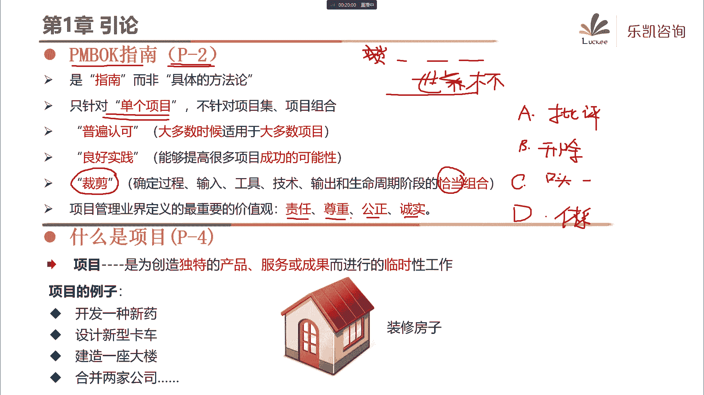
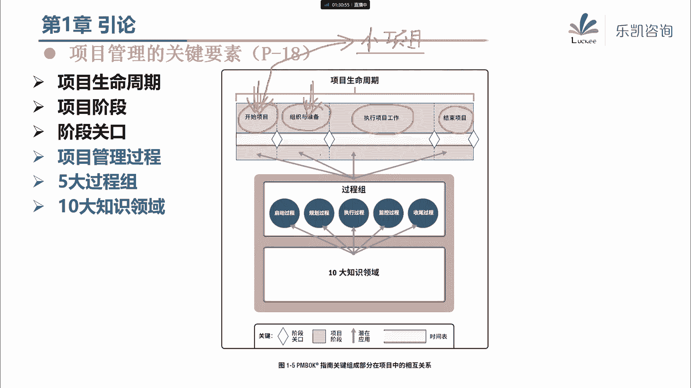
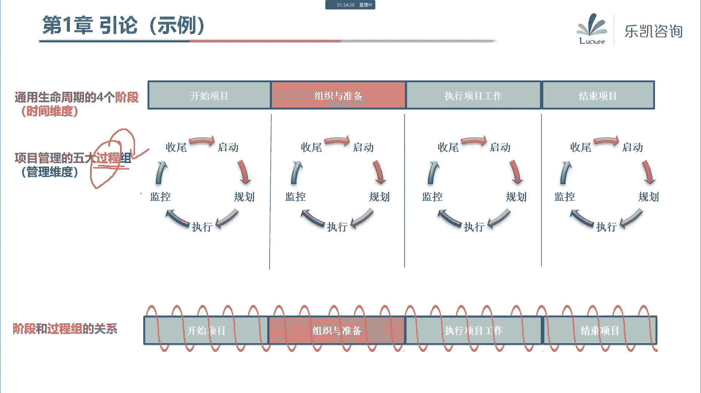
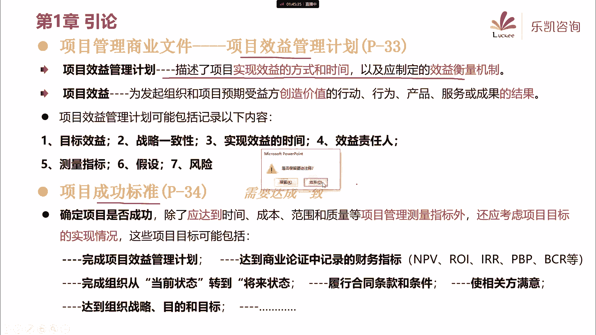
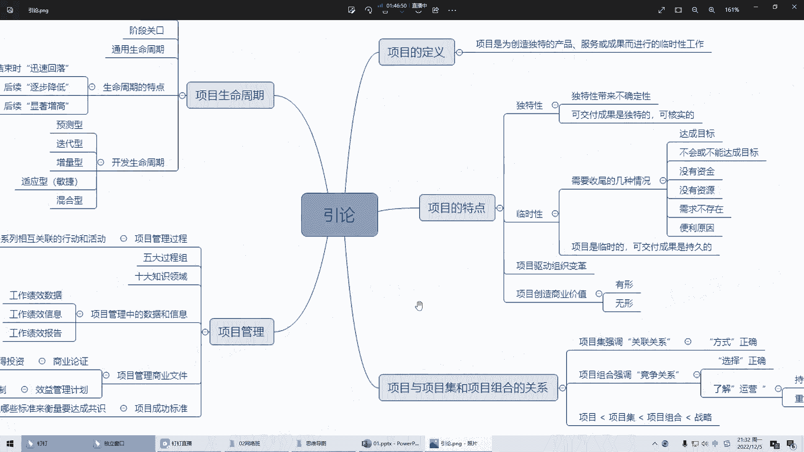

# 2024年PMP认证考试课程针对PMP新考纲最新免费零基础也能轻松听懂 - P2：PMP第1章：引论 - 乐凯咨询 - BV1Rj411G7gs

好各位同学晚上好，今天晚上我们开始p m p的正式的学习好吧，那么今天晚上呢，我们主要的任务是学习第一章引论，那么第一章引论呢，实际上就是引导大家在后续学习的时候，我们要了解的一些论述。

实际上就是一些概念性的东西，那么我希望大家在听的时候，把这些基本的概念听懂就可以了好吧，那么讲完了之后，我会帮大家再回顾一下，这一章的一些重要的内容好，那么首先我们看一下一开始p mp里面。

他提到的一些内容，那么我们这次的学习是针对那一本很厚的书，叫pb，我们在启动课的时候说过，这个叫项目管理知识体系对吧，那么它是一本很厚的指南，那么我们在上课的时候呢。

我们不管是电子课件还是大家自己拿到的讲义，实际上是我们上课的一个根本，所以说大家围绕这个讲义去学就可以了，那么我们讲义中的内容对应的pm报告的第几页，我们也把它标注出来了，好吧，这个地方稍微注意一下。

那么我们讲课的依据就是这本pb，他首先说它是一份指南，而不是一个具体的方法论，那么这句话是什么意思呢，我们在启动会的时候说，我们是把项目管理里面所有有共性的部分，把它抽出来了。

所以它不会涉及到具体的工具的使用，或者涉及到具体的某一个行业，它只是一个指南性的东西，那么另外我们学的这本东西呢，它是针对单个项目的啊，我们是学的单个项目如何去管理。

而不针对多个项目的项目级或者项目组合，那么关于项目集和项目组合，我们后续呢会介绍一下它的基本的概念好吧，那么这本指南，他说他是一个普遍认可的良好世界，那么也就是说，其实它大多数时候适用于大多数项目。

那么所谓良好时间修车时，我们按照这本指南的内容去做项目呢，可以提高很多项目成功的可能性，那么另外要注意这个词，我们在学习的时候，包括我们在后续使用的时候要注意裁剪，那么这个词我解释一下啊，说到裁剪。

我就想到我们中国有一句古话叫看菜吃饭，量体裁衣对吧，那么遥想当年我还小的时候啊，那个时候人民生活不富裕啊，不像现在我们要买一件衬衫对吧，到超市里面去买就可以了，那么我们小时候像我上小学的时候。

穿衬衫是怎么穿的呢，买了布之后呢，然后找一家裁缝店，让裁缝去做对吧，那么我们买了一块布之后，这块布所有的东西都要用到衣服上吗，其实不是的对吧，总有一些不需要用的地方会把它裁剪掉的。

那么我们在学习pmp的时候也是一样的啊，也是一样的，我们这本书讲的内容是很多的啊，讲的内容是很多的，那么是不是我们在后续做项目的时候，每个环节都要去用呢，其实不是这样啊。

我们每一个项目都有每个项目的特点对吧，所以我们要选择恰当的组合，并不是所有的东西都要用，那么说到这里啊，大家还要注意一下，我们每个人他做衣服，他裁剪的尺寸是不一样的，那么同样的道理。

我们不同的项目需要做哪些裁剪，它会一样吗，其实它也是不一样的对吧，所以不同的项目我们也要做不同的裁剪好吧，那么另外呢我们要注意我们在学习的时候，要了解项目管理业界定义的最重要的价值观，比如说责任。

尊重公正和诚实啊，这些东西呢都是要注意的，最起码在我们后续做题的时候，它会时时刻刻包含在我们的题目当中好吧，比如说我举一个例子啊，出道题考一考，大家最近这段时间呢，很多同学肯定会熬夜的，为什么会熬夜呢。

因为很多同学呢喜欢看世界杯，对吧，我经常看到我的群里面三点钟，两点钟还有很多人在聊进球的事情，那么比如说我出一道题目，你现在发现啊，你的团队里面有一个成员，那么这个成员呢在做项目的过程当中啊。

你忽然发现他这几天的精神状态不太好，对吧啊，比如说这个影响到他的工作绩效，那么经过了解之后，你发现啊，为什么会导致这个情况呢，是因为他熬夜看世界杯导致的，那么接下来你了解了这个情况之后，你应该做什么好。

给你几个选择，a，批评，b开除，对吧好c，口头警告，让他回家先休息，啊随便出一个很简单的问题啊。

好大家看一下这种题目应该选什么。

我再重复一下题目啊，项目经理在做项目的过程中，发现一个团队成员状态不佳，严重影响了团队成员的绩效对吧，经过了解，是由于团队成员的个人问题导致了，比如说那最近世界杯看世界杯导致了，那么项目经理应该怎么做。

是批评还是开除还是口头教育，还是让他回家休息，单选题啊，那么我发觉很多同学还是情商比较高的，这道题目的正确答案应该是什么。

这道题目的正确答案应该是d，让他回家休息，为什么，因为首先他是一个人，有什么事情等他休息好了之后再说明白吧，那么类似的题目其实在我们考试中吧，它虽然不涉及到什么知识点，但是他经常会出现。

比如说我们曾经在考试的时候出现过，发现团队成员用的是试用版的软件啊，说实话就是一个盗版软件，那么你项目经理发现了应该怎么办，那么应该用正版对吧，像这种体现价值观的东西其实很简单，你怎么去做啊。

美国人的考试对吧，你就把自己当成是上帝，你觉得上帝会怎么选就怎么选，好吧好，接下来天文报告里面说了，首先介绍了什么是项目，那么既然是学项目管理，首先我们就要了解什么是项目对吧。

其实我们身边有很多项目的例子，比如说我们讲义上说的开发一种新药，设计一个卡车，建造一座大楼对吧等等等等，包括装修一套房子，那么这些都是项目，我们甚至有人说什么都可以当做项目来做，那么究竟什么是项目呢。

好p m p给了一个很简单的定义，他说项目是为了创造独特的产品服务或成果，而进行的临时性工作，这是项目的定义，那么大家对这句话要引起重视，因为这句话虽然短，但是它体现了项目的好几个特点。

那么我们逐个来看一下，首先他提到项目是独特的，那么为什么是独特的呢，他说因为我们创造的产品服务或成果，它是独特的。

那么产品服务或成果呢说的太啰嗦了，我们给他一个总结，把它叫可交付成果，那么也就是我们有的同学可能在做项目的时候，俗称的叫什么呢，叫交付物对吧，唉小到一份文档，一份图纸，大到一个产品，它都是交付。

那么我们就可交付成果，那么项目为什么是独特的，他说因为我们产出的可交付成果是独特的对吧，哎我们不同的项目，我们交付的可交付成果当然是不同的好，那么有同学可能会提出疑问，那么如果说我们在做项目的时候。

我们用的是同一支团队，做的是同样一个东西，那么这个还有独特性吗，比如说我举一个例子，我们是做建筑业的啊，我们公司是盖楼的，我们刚刚帮一个客户盖了一栋楼，然后我们又接了另外一个项目。

那么另外一个项目呢也是盖同样的楼对吧，我们还是同样的一个团队去帮他盖楼，那么这个还独特吧，好p m p里面他说的很清楚，他说即便我们在做项目的过程中，存在一些重复的元素。

但是这不会改变项目本质上的独特性，也就是说这个仍然是独特的好，为什么仍然是独特的，大家能够想得到，有什么地方会导致它仍然是独特的吗，其实很简单，比如说由于客户是不一样的，所以客户的期望也是不同的对吧。

由于你施工的季节不一样，施工的时间不一样，你的材料的价格也是不一样的对吧，所以说虽然我们可能有一些重复的元素，所以它不会改变项目本身的独特性，用一句俗话说，诶，就像有同学小吴同学说的。

世界上没有完全相同的两片树叶对吧，实际上这个独特性我感觉这个很简单对吧，那么要注意的是什么，正是由于每个项目就是它是独特的啊，所以说要注意项目的独特性，就会带来不确定性对吧，不是说你之前做过类似的项目。

那么你这个项目就一定做得好的，每个项目都是独特的嘛，所以由于它的独特性就会带来不确定性好，什么叫不不确定性，有同学知道吗，也就是说我们项目与生俱来就会有一些什么呢，我们后面会学到很重要的一个章节。

与生俱来的就会有风险，每个项目是独特的，所以每个项目都会存在风险对吧，你上一个项目做得好，不代表你同样的项目就会一样做得好，你上一个项目做的不好呢，哎我以前经常跟我的学员跟我的朋友说。

你上一个项目做的不好，不代表你下一个项目就做的不好，有可能做的还要烂，也是有可能的，因为项目它是独特的，好吧好，那么另外这里面还有两个细节，大家要注意一下啊，我们刚刚讲到项目的独特性。

是因为它的可交付成果是独特的，那么可交付成果这边有两个细节要注意的，首先可交付成果不光是独特的，而且我们强调可交付成果一定要具有可核实性，好，怎么去理解这个可核实性啊，我觉得呢我们要注意这个词。

核实和另外一个词叫验证，或者叫验收，那么我们的可交付成果做出来之后，当然最终是要交给客户验收的，但是我们说我们的可交付成果，首先要具有可核实性好，为什么为什么不说验收，而是说首先要具有可核实性。

因为大家要注意，我们在交给客户验收之前啊，不管我们是做制造业的，还是我们做it行业的同学，大家知道我们在交给客户验收之前，我们自己要干什么，比如说我们制造业常做的抽检对吧。

比如说我们软件行业常驻的要测试对吧，那么像检查测试这种就是一个核实的过程，所以说可交付成果首先要就要具有什么，要具有可核实性好吧，这是第一个要注意的，而不是说直接就让他去验证。

或者说验收一定要核实好吧好，那么接下来还要注意，既然我们可交付成果，包括产品服务或成果，也就是说可交付成果呢有可能是有形的，也有可能是无形的，比如说我们盖一栋楼，那么这栋楼的可交付成果。

就是这栋楼本身它是有形的对吧，那么我们来学p m p也是一个项目，那么我们学pp最终的可交互成果是什么，其实是一个知识，是一个成果性的东西，它就是无形的，好吧好，那么这是项目的第一个特点。

项目要具有独特性，那么接下来刚刚那句话里面还强调了一点，项目是一个临时性的工作，这是项目的第二大特点，那么什么叫临时性，临时性就是指这个项目，它一定是有一个时间的阶段的，他一定是有明确的起点和终点的啊。

这个我想大家啊应该都很清楚，比如说我们盖一栋楼也好，我们装修一套房子也好，或者我们举办一场婚礼也好对吧，这些都是项目，那么它的临时性就代表他是有开始，有结束时间的，而不是说一直把它做下去对吧。

那么要注意的是两个细节，临时性不一定意味着项目的持续时间短，说到零时，很多人觉得诶是不是时间很短啊，实际上不是这样，比如说我们一些国家的大型的项目，它的时间可能会很长，可能会跨度好几年对吧。

跨度十几年都是有可能的，那么第二个要注意的，虽然项目是临时的，但是我们最终交付的可交付成果，它一般是持久的，一般不具有临时性，好吧好比如说我们刚刚说过一个例子，比如说举办一场婚礼，他是临时的。

那么举办一场婚礼是一个项目了，那么这个项目的可交付成果是什么，哎我们想一想，举办一场婚礼，最终可交付成果是什么，其实最终的可交付成果，就是双方之间的婚姻关系对吧，那么这个婚姻关系。

它有什么明确的起点和终点吗，他没有，最起码在我们结婚的时候，我们没想过啥时候就散伙嘛对吧，所以说虽然项目呢那场婚礼是临时的，但是最终的可交付成果它一般是持久的，我们没有明确的起点和终点，好吧好。

那么既然项目是临时的，那么项目总有结束的时候，那么什么时候项目会结束，或者说什么情况下项目会结束呢，好那么我们看一下项目终止的这几种情况。

第一种情况，当项目达成目标的时候，项目就结束了，唉比如说我们举办一场婚礼，那么婚礼顺利办完了，那就结束了对吧，比如说我们盖一栋楼，楼盖完了，那么就结束了对吧，那么这是正常的项目的宗旨的情况。

那么除了这种情况以外，其他情况下我们也需要终止，比如说第二种情况，不会或者不能达到目标，这个项目啊，我们经过评估发现不可能达到目标了，那么不可能达到目标，你还要继续做下去吗。

实际上我们就要考虑把这个项目怎么样，把它给终止掉，不要做了，那么这种情况也属于项目终止的情况对吧，虽然他不是顺利做完，但是也需要增值，那么第三种情况，项目缺乏资金的时候啊，我们特别是我们建筑业。

我们会发现有很多烂尾楼对吧，那么刚刚有同学说，那么烂尾楼这种项目算临时吗，也算临时的对吧，你会发现一旦资金链断了之后，这个项目就要停了，不能再做了，你也做不下去了，那么这个时候我们项目也需要怎么样呢。

终止掉对吧，然后接下来项目的需求不存在了，哎，比如说由于一些战略的变化而导致，这个项目没有价值了，那么我们就把它停掉了对吧，还有没有办法获取人力或物力资源，没有资源的时候，我们也需要把项目停掉对吧。

这些情况都会导致项目的宗旨，所以那么项目要么是顺利做完，要么是中途夭折，总之项目一定是临时的，他不可能让你子子孙孙一直把它做下去，对吧好，那么赵楠同学提了一个问题，他说那么如果资金链断了，停下停下来。

终止之后，后续能够重新启动吗，后续当然是可以的，但是要注意你重新启动是什么，它是一个新项目了，你要重新开始了，好吧好，那么第二个问题，有同学提到说资金跟资源有什么区别，好，我说一下啊。

资金跟资源在我们项目管理里面，其实是有明确的区别的，资金跟什么有关，资金它跟钱有关，对吧啊，比如说我们所谓的缺乏资金，就是指没钱了，那么什么叫资源呢，资源它不是钱，它是我们做项目需要的，比如说人力资源。

比如说实物资源，像材料啊，设备呀等等对吧，这个是有区别的啊，那么接下来还有最后一种情况说，由于法律原因或者病理原因终止的，那么法律原因很很好懂啊，比如说由于一些原因，法律叫停的一些项目对吧。

那么什么叫便利原因呢，这个呢不是考试的一个重点啊，啊我稍微解释一下所谓的便利原因，实际上是指甲方便利，那么什么叫甲方便利呢，我举一个很简单的例子啊，大家去体会一下，比如说我现在有一套房子要出租，对吧。

这是我们我现实生活中经常遇到的情况啊，我有一套房子要出租，好有一个同学要来租我的房子，那么按照道理讲，我们要签订合同了，对吧好，然后接下来注意，我听说这一片马上要拆迁，那么这个合同我签还是不签呢。

那么我想租，但是我在合同里面要约定一条关于甲方的便利，那么怎么去约定呢，就是如果在租的过程当中遇到动迁，那么我们可以甲方提出终止合同对吧，也就是说在甲方处于一些情况下，他可以去终止合同。

那么像这种情况要把它写进合同里面好吧，那么这种叫甲方便利，那么不管怎么说，出现这种情况，它就会导致我们项目的宗旨对吧，不管你做完了还是你再也做不完了，那么这就体现了项目的临时性，那么刚刚有同学说。

那么后续的维护呢，后续的维护我们一会儿会讲那个不叫项目，那个我们一般叫运营好吧，那么出现这些情况，项目经理应该做什么，那么大家要注意项目经理，我们在下个星期会讲一个过程，一般要做好收尾的工作，好吧好。

那么这是项目的第二个特点，项目是临时的，那么接下来还有第三个特点叫项目，或者叫驱动组织的变更，那么这也是项目的一个特点，好其实很简单，比如说我们乐凯是培训项目管理的对吧，那么我现在发起一个项目。

我打算做什么呢，我打算做学历教育对吧，那么这个项目他也是临时的，也是独特的，对我们要成立这样一个学历教育的部门，那么一旦我们用了这种手段，我们就可以把组织从当前的状态，把它推动到另一个状态。

说白了就是我们可能会开拓一块新的领域，开拓一个新的市场对吧，那么这也是项目的一个特点。

好吧好，那么最后还有项目的另外一个，最后的一个特点啊，项目能够创造商业价值对吧，我们为什么要做项目，其实很明显，就是我们的项目的成果，能够给各方带来效益对吧，这个效益一定要注意啊，它可以是有形的。

也可以是无形的，或者两者都有，那么说到效益，我们往往会想到有形的效益，比如说哎我们做项目可以挣钱，涉及到一些货币资产，涉及到股东权益，固定设施工具市场份额，那么像这种能够用数据量化出来的。

这个叫有形的效益，但是要注意也有的项目虽然不挣钱，但是我们仍然会做，有同学见到过不挣钱的项目吗，比如说有人提到了公益项目，公益项目它的商业价值是什么，其实公益项目的商业价值就是这种无形的效益。

它为公众带来了利益对吧，哎比如说在山区里面，我们援助山区去搞几个水井对吧，那么也有是为了提高我们的品牌认知度，提高我们生育的，我们会发现啊，大家在平时生活中，有没有发现有很多事情很奇怪。

就是明明是一些烧钱的东西，但是呢却有很多人在做，那么你们说他们烧钱是为了什么对吧，其实我们这种例子看了很多啊，比如说当初在滴滴刚刚出来的时候，滴滴是烧钱的对吧，比如说精通搞物流的时候。

一开始他是烧钱的对吧，比如说我们在做政府项目，做招投标的时候，我们看到有些公司设置低价中标，那么为什么他们要做这些东西呢，他们更多的就是为了生育，为了品牌认知度对吧，甚至为了他们战略的一致性而考虑。

他并不并不是为了挣钱，是这个道理吧，所以说我们项目的商业价值一定要注意，它不一定是有形的，也有可能是无形的，好吧好，那么我们刚刚讲了项目的很简，讲了几个很简单的特点啊，项目是临时的，项目是独特的。

项目要创造商业价值等等，所以说基于项目的这些特点，那么我们就要重视项目管理工作，那么什么是项目管理呢，这个概念呢不重要啊，大家稍微看一看，那么为什么说我们要重视项目管理工作，因为很简单。

由于项目是临时的，所以它是有进度的约束的，是这个道理吧，你项目是临时的，你肯定他进度是有要求的，由于项目是独特的，所以你每个项目都要搞清楚它的范围，由于我们的可交付成果要核实，所以我们要关注质量对吧。

包括我们项目要创造商业价值，特别是涉及到有形的商业价值，我们要关注成本，要关注投入多少资源，那么这些东西相互之间需要干什么，需要平衡，我们不能只关注范围，也不能只关注进度对吧。

所以我们项目管理比较重要的一个环节，就是我们将来需要平衡这些各方面的因素好吧，所以项目管理是比较重要的，那么接下来项目管理，它主要是面向单个项目管理的，那么我们刚刚还说过。

有多个项目形成的项目集和项目组合，那么项目跟项目及以及项目组合，它们是什么关系呢。

好我们看一下pmp里面这个说法，他说什么是项目级呢，项目级就是一组相互关联，并且被协调管理的项目，一组项目，那么项目组合呢也是一组项目，但是不一定有依赖关系，其实看这两句话。

不一定能看得出来他们的区别是什么，所以呢我举一个例子啊，我想找一个男同学，我们这边有没有还没结婚的男同学，应该很多吧，大家都比较年轻对吧，我请一个男同学来回答一下，好吧，通过这个例子啊。

我们来看一看项目集和项目组合，它的区别是什么，好随便找一个啊，闫鹏同学，好我问闫鹏同学一个问题啊，假如说现在呢有几个优秀的女孩子都喜欢，闫鹏同学，一个呢是他青梅竹马的发小，对a。

一个是他在大学时候认识的一个优秀的女孩，一个是他在现在工作的时候认识的一个c，那么这三个女孩呢都喜欢闫鹏同学，因为闫鹏同学太优秀了，对吧好，那么接下来，首先我们看一下，这三个女孩儿之间有什么关系吗。

其实我觉得他没什么关系对吧，那么你要真正说他们有什么关系呢，我只能说他们只存在竞争关系，那么在这种情况下，请问闫鹏同学，你要注意什么。

啊杨洪天说不要注意小孩才做选择题，我听到杨洪天的话，我闻到了一股渣男的味道，请大家把杨洪天同学拖出去打，这个是不正确的，我们三观要正，那么在这种情况下，我们需要注意什么，好我说一个词，大家同意不同意啊。

在这种情况下，我们要注意选择要正确，你将来究竟希望跟谁在一起，你的选择要正确对吧，也就是说在这些人当中，你一定要注意什么，你一定要注意这个问题，优先级的问题，一定要注意优先级的问题对吧。

有的人才是你真正的选择，而有的人只能作为普通的朋友，对不对，那么也就是说，那如果我们把这些都看成是一个一个项目，那么这些东西放在一起应该作为什么来管理呢，好大家要注意，应该作为项目组合来管理。

那么项目组合的层级是很高的，它是为了实现某个战略目标而组合管理的，但是有两个地方要注意的，他们本身之间不一定有什么依赖关系，而且我们要注意，在这种情况下，如果一定要说有关系是什么关系呢。

我用一个词来描述一下，最多叫它们之间存在竞争关系对吧，多个项目在一起，我们要竞争资源，因为资源是有限的嘛，所以我们就必须要关注什么，要关注优先顺序，对吧，所以我刚刚才说这种情况下，我们强调选择要正确。

要选择正确的项目去做，对吧好，那么我们再看第二种情况，最终闫鹏同学选了a对吧好，闫鹏同学跟小a同学最终结婚了，成立了一个家庭，那么我问一下，闫鹏同学跟小a同学之间有没有关系，那当然有关系啊对吧。

他们都已经组建了家庭了，那么这个时候我们要关注什么，注意这两个项目之间就有相互的关联关系，那么我们就需要协调对吧，你肯定要协调好啊，一个家庭，比如说谁的工作清闲一点，那么谁就承担更多的家务对吧。

哎谁的工作复杂一点，烦一点，那么相对来说加盟的就少做一点，总之要配合好，要协调好啊，所以这个时候我们就不再关注优先级了，我们关注的是什么，相互之间的关联关系或者协调关系对吧，那么这种就是项目级。

所以说我总结一下来说啊，项目组合它关注的是优先级的问题，而项目集关注的是什么呢，相互之间的协调问题好吧，那么我用项目上的一个例子，来帮大家明确一下啊，比如说我们看这个例子，那么我们在电子讲义上。

可能会出现这种页面上面写的示例的，那么写示例呢在我们纸质的讲义上是没有的啊，那么这个是为了便于大家上课的时候，我手画的太麻烦，所以我事先画了一个例子，好，我们大家看一下，假如我现在是一个酒店集团。

那么我现在呢打算在三个城市开酒店，酒店a酒店b酒店c，当然我酒店自己还有一些日常的运营工作对吧，那么这几个项目之间它们存在什么关系呢，其实更多的是存在竞争关系，因为我们酒店集团现在资金是有限的。

不可能三个酒店同时开，我们就要做出选择对吧，究竟在哪个城市开，能够实现什么，能够实现我们的回报最大化，或者说收益的最大化对吧，所以这些东西放在一起，我们要把它作为什么来考虑。

我们要把它作为项目组合来考虑对吧，因为他们之间如果一定要说有关系，只是什么呢，竞争关系对吧，所以在这种情况下，我们要考虑我们选择要正确，究竟我们选择先开哪一家酒店，他的回报是最大的对吧，我们强调什么呢。

优先级哪个优先级是最高的，那么这个是项目组合好，接下来假如我们选择在a城市，把这个酒店开下来，那么开这个酒店也会涉及到许多项目啊，比如说我们盖一个酒店，肯定涉及到弱电，消防装修，包括酒店也有信息化对吧。

那么这些项目之间需要协调吗，当然需要协调啊对吧，比如说我们在做消防，做装修的时候，我们信息化也需要把线布好啊，相互之间要配合好啊，你总不能说等大家装修好了之后，你再去布线吧，这个是不现实的。

所以说在这种情况下，注意我们关注的是什么，我们关注的是大家相互之间要协调，相互之间是有依赖的对吧，那么也就是说我们关注的是关联关系，而不是竞争关系，那么这一堆东西虽然也是多个项目组成的。

我们把它当做项目级来管理，所以项目集它不是强调选择正确，它强调的是我们协调的方式要正确，明白吧，协调的方式要正确，那么当然项目集里面它就包括了单个项目，比如说信息化项目啊，我们做信息化的对吧。

那么信息化项目它就包括，比如说软件的需求量也行啊，开发呀等等，那么单个项目他只要关注自己的执行的方式，正确就可以了好吧，所以说项目组合，项目集跟项目它之间它的区别和联系，可以通过这张图来大致的看一下。

那么从层级上来说啊，大家注意，一般来说项目组合的层级是比较高的，他是直接跟着组织的战略去走的，那么项目组合里面会包括项目级，或者包括单个的项目，所以项目级呢，它的层级比项目组合要稍微低一些。

那么最简单的就是什么呢，就是单个项目的管理，你管好自己就行了好吧，那么关于层级这一块，我给大家说一个很简单的方式去记一下，很简单，项目两个字，项目集三个字，项目组合四个字，字数越多的。

它的层级就越高对吧，那么不管怎么说，这些东西最终都服务于什么，都服务于我们这个组织，或者说我们这个公司的战略，都要跟我们公司的战略保持一致好吧。

那么p p里面他给出了一些专门的定义，大家有时间去看一看，我觉得看看这个定义啊，其实不一定能够看得懂好吧，大家根据这个例子来去去理解一下，那么我们刚刚在讲项目组合的时候。

其实大家会发现除了里面包括一些项目集以外，还包括这样一个东西叫运营。

那么运营是什么意思，好我们回忆一下我们刚刚举过的一个例子啊。

我们说举办一场婚礼是一个项目，因为它是临时的，独特的，那么请问结婚之后，婚后的每一天他临时吗，他独特吗，这个问题我觉得闫鹏是没法回答的，因为他还没有结婚，对于我们已经结婚的人来说。

我觉得婚后的每一天他真的不算下，为什么呢，因为日复一日，年复1年，每天都是柴米油盐，对吧，我感觉他不临时啊，我不知道什么时候会结束，我也觉得他不独特，好像今天跟昨天没什么区别是吧，他不临时不独特。

我们可以说它是持续的重复的，对吧，那么这个算项目吗，这个不算项目，这个算什么，这个只能算运营啊，只能算运营是吧，那么包括我们刚刚有同学说的诶，那么我们项目做好了之后，后续的维护啊等等，这个算什么呢。

重复的持续的，我们一般把它叫运营，那么大家要注意，一般来说我们约定俗成，把一些重复的持续的工作呢，把它看作是运营，好吧啊，我们也不要去钻牛角尖，比如说我记得在疫情之前啊，我给面授班讲课的时候。

有同学就反对这个观点，他说我觉得婚后每一天也是项目，我说为什么他说我能做到每一天都不一样，每一天都有一个小惊喜，那么请问老师这个每一天算不算项目呢，唉一时间我无言以对对吧。

那么后来呢我说如果你真能够做到这一点对吧，那么也可以认为你婚后的每一天都是一个项目，对吧，但是从一般情况下来说，我们约定俗成的婚后的每一天呢，他就是一个持续的重复性的工作好吧，再比如说我们生产一个产品。

它是一个项目临时的独特的后续的批量生产，这算什么呢，算硬云好吧，那么运营跟项目从它的特点上，我们可以作为作为一个区分好吧，那么我们在整个公，整个公司或者说整个组织运营的过程当中。

其实项目跟运营是有交叉的，对吧比如说我们在项目开始的时候，要从运营抽一些资源过来，项目结束了，资源要回到运营，那么关于运营这个东西呢，大家稍微了解一下就可以了，那么不管怎么说，我们刚刚说的项目组合也好。

项目集也好，项目也好，最终都是服务于组织的战略的。

所以呢在p里面呢了解一下，有这么个东西叫组织级项目管理，就是我们为了实现我们组织的战略目标，把项目组合，项目集和项目整合起来一起去管，好吧好，那么说到这里，我问一下啊。

我们一直在说这些东西都要符合组织的战略，有没有同学知道战略是什么玩意儿，什么叫战略啊，啊有人说长远的发展长远的目标对吧，其实战略就是一个长期的目标，我们所有的事情都要符合我们组织的战略，好吧好。

那么这是我们刚刚介绍的项目，以及顺带说到了，项目跟项目集和项目组合之间的关系，那么接下来我们看一下，既然我们是学项目管理。

那么我们要了解项目管理里面的关键要素，那么这些关键要素就包括了项目的生命周期，项目的阶段，阶段关口等等，那么我给大家一个建议啊，不要把p m p选显得有多高深，实际上它比较简单。

一般的东西呢我相信大部分人都知道，比如说我们先不看pp的内容，我问大家一下，既然一个项目是临时的，那么就说明项目一定有它的开始，也一定有它的结束，不管你是顺利的做完还是中途夭折对吧，总之有开始有结束。

那么从一个项目的开始到结束，这样一段周期是什么呢，就像一个人从他生命的开始到最终的结束，不管是寿终正寝还是中途夭折，这样一段周期，我们就把它称之为生命周期对吧，所以什么叫项目的生命周期。

因为项目是临时的，从开始到结束这段周期就叫它的生命周期好，那么什么叫阶段呢，好我问一下，我们管一个项目，我们一般会怎么管，唉，比如说我现在呢想做一个事情，算一个小项目，我让我公司的一个团队对吧。

我给他一个星期的时间，五天把它做掉，那么我们管的时候应该怎么管，我可不可以今天周一给他们安排任务，然后中午的时候找他们要结果，这样管行不行，这样管不行，我们有同学说到一个很专业的词。

说我们要设置里程碑啊，那么什么意思呢，就是说我们要定一些小目标啊对吧，比如说我可能在周二的时候要做到什么程度，对吧，唉我可能在周三的时候要做到什么程度，我在周四的时候要做到什么程度对吧。

我们不能在最后直接要一个结果，最后要一个结果有可能是一个惊吓对吧，所以我们中途要设立一个小目标，我们也就是说要把项目切成一段一段的是吧，每一段要做好这个阶段该做的事情，那么切成了一段一段的，这个叫什么。

这个就叫项目的阶段好，那么接下来大家考虑两个问题啊，第一个问题，我们不同行业的项目，它划分的阶段一样吗，我感觉是不一样的，比如说建筑业我们盖一栋楼，它分的阶段跟软件这个项目分的阶段。

不管是阶段的数量上也好，还是阶段的名称也好，那肯定是不一样的嘛对吧，那么不同项目它当然可以分成不同的阶段是吧，好第二个问题，那么我们就拿一个项目来说，它阶段的划分，你们觉得是分得细一点好。

还是分得粗一点好，有同学说这个不好说，你说分细一点好不好呢，分细一点有好处，你这样的管起来呢，管理的力度会很强对吧，但是呢也有一个问题，你分的太细，你的管理成本太高了啊，比如说我们五天的工作。

我每一个小时划分一个阶段行不行呢，容易挨打，这个这个太烦了，那么粗一点行不行呢，粗一点有好处，管理成本很低，但是呢有有可能容易失控，所以说阶段的划分要注意第二个特点，它不是越细越好对吧，它要恰当啊。

其实这些东西一说大家都明白对吧，然后我们在阶段做完的时候，我们有一些阶段的关口，比如说在这些位置，我们要判断我们这个阶段做完了没有对吧，包括我们下一个阶段能不能开始，那么这些东西其实都比较简单好吧。

那么我们看一下pp里面是怎么说的，偏偏他原是这么说的，他说什么叫项目的生命周期，那就是项目从启动到完成，所经历的一系列的阶段对吧，那么另外他说这些阶段的关系可以是顺序的，迭代的交叠的。

那么这个呢稍微了解一下，所谓顺序，就是上一个阶段做完了，然后接下来做下一个阶段，再做下一个阶段，这个就叫顺序的，那么什么叫迭代的呢，那么有的项目是这样做的诶，我先做第一个版本，然后接下来优化一下。

再细化第二个版本，那么这个叫迭代的对吧，那么什么叫交叠的呢，交叠的就是上一个阶段还没完成，下一个阶段可以先提前开始有一些重叠啊，那么这个比较简单，那么接下来p mt里面还说到了一个东西。

叫项目的通用生命周期，那么什么叫通用生命周期啊。

我们刚刚说每一个项目由于它的行业不同，我们划分的阶段也是不一样的，比如说我举一个例子，人这一生可以划分成这些阶段，软件可以划分成这些阶段，对吧，包括我们学p m p是一个项目，也可以划分成这些阶段。

那么我们为了便于讲解，我们不可能说拿哪一个特殊的一个例子来讲，我们把它概括了一下，我们说不管怎么说，不管你是什么项目，这些阶段概括起来实际上就是四个阶段，一个叫开始阶段。

我们要做一些开始要要做的一些工作，然后开始了之后，我们要开始做一些组织与准备工作对吧，然后接下来我们要开始我们的执行，最终我们要结束这个项目，比如说我们可以把这个项目啊，学前当成是开始。

然后这一块你学习知识就要组织于准备，把这一块工作看成是执行，最后是结束项目对吧，那么这个实际上就是为了便于讲解。

总结了一个叫通用的生命周期，他说所有项目其实都呈现这个通用的生命周期，那么在这样一个生命周期的过程当中，它有什么特点呢，好他说一般来说啊。

我们项目的成本跟人力投入是这样的，在项目开始的时候缓慢增加，在执行的时候达到最高，那么在快结束的时候会迅速回落，那么缓慢增加，在执行的时候达到最高，这个都好理解，那么请问什么叫在结束的时候会迅速回落呢。

为什么在结束的时候会迅速回落，那么这里有一个细节大家可以了解一下，一般我们在项目结束的时候啊，我们要终止这个项目，或者说我们要收回这个项目，我们收尾的时候，一般我们会提倡要快速收尾对吧，要快速收尾。

因为我们资源要释放，人力资源要释放啊，我们要快速收尾，所以说在结束的时候，资源会迅速的回落，那么另外他说在项目一开始的时候啊，风险也好，或者说不确定性也好，相关方的影响力。

或者说变更的数量在开始的时候是很多的，而我们做一个项目，一开始很多东西不明朗对吧，风险很高，然后呢有很多的不确定性，那么什么叫变更呢，就是说我们可能需要做一些变化，那么在一开始的时候是很多的。

那么随着项目的进行，也比较明确了，那么像这些东西会逐渐的降低，但是这里面有一个地方要注意的啊，风险和变更的数量会逐渐减少，但是一旦风险和变更发生，它的影响它是越来越大的，这个能够理解吧。

比如说我们家里面装修一套房子，一开始呢我们可能要做一些调整，我们也会遇到很多的不确定性，风险和变更的数量是越来越少的，一开始很多对吧，然后越来越少，那么他的影响呢，你家里的房子都快装修好了。

你跟装修公司说，我不想用地面装了，我想铺地板，这个时候就很烦了对吧，也就是说在项目后期，风险和变更的代价是很大的好吧，那么这些东西都比较简单啊，他说的都是项目生命周期里面的一些组成。

那么我们对这些概念，什么叫生命周期，什么叫阶段。

什么叫阶段关口，包括它的特点有一些了解就可以了，好，那么接下来我们目前考试在第一章当中。

仍然涉及到的一个考点来了，所以接下来的大家要仔细听啊，现在我们第六版还提出来一个东西，叫开发生命周期，那么什么叫开发生命周期呢，他说我们一个项目由开始到结束，为了便于管理。

我们把它划分成了若干的阶段对吧，也就是说，生命周期其实是由一个一个阶段组成的，那么接下来他说在这些阶段里面，有一些阶段是跟我们的最终的可交付成果，的开发直接相关的，那么这些阶段就形成了开发生命周期。

也就是说开发生命周期，实际上是项目生命周期的一部分对吧，这个概念很简单，那么重点呢其实并不是它的概念，重点在于什么呢，他说开发生命周期有好几种形式，它可以是预测的，迭代的，增量的，适应的，甚至是混合的。

那么关于这一块，仍然是我们现在考试的一个考点，所以我希望接下来大家要仔细听，这几种生命周期的类型，它的区别是什么，以及什么情况下用什么样的生命周期好吧，首先我们先介绍一下预测型生命周期好。

我问一下大家，从它的字面意思预测，你能看出来这种生命周期的特点是什么，从字面意思来说，就是我们做这些项目啊，是可以预测的，我们先做什么，然后做什么，然后再做什么对吧，其实预测型我们在启动课的时候提到过。

也叫什么呢，我们可以排除一个计划，用计划来驱动对吧，唉我们可以排除计划，我们第一个阶段做什么，然后接下来第二个阶段，第三个阶段，第四个阶段，一个阶段一个阶段往下做对吧，那么这种有点像什么呢。

有点像瀑布一样的，所以它也叫瀑布型生命周期好，那么我问一下，假如说我们有一个项目，我想用预测型的生命周期，用计划来驱动，排个计划，然后按照计划去做，它必须有什么样的前提，而这种项目我们平时见的很多啊。

比如说我们的建筑业的项目盖楼，他肯定是有计划的对吧，哎比如说制造业的项目对吧，也是有计划的，包括我们做政府的项目，像我以前做政府的信息化项目，肯定也是有计划的，那么如果你打算用这种形式来做项目。

它的特点是什么呢，好有同学说了，你需求要明确呀对吧，需求一定要明确，你对你要做的产品要有充分的了解呀，你们要有厚实的行业基础，也就是也就是说你们要有很多的成功案例，要有很多的经验啊对吧。

所以基于这些基础需求是明确的，你有你有充分的了解，你有深厚的基础，所以你看很多建筑公司在盖楼的时候，人家马上计划就排出来，然后按照计划去推就好了嘛对吧，那么我们外面80%以上的项目。

实际上都是用的预测性，用计划来驱动，那么这是预测型的特点，需求明确，有厚实的行业基础，然后我们排个计划，按照计划去执行就行了，但是呢也不是所有的项目它都符合这个特点的，所以我们接下来又有了别的形式。

第二种叫迭代形，我觉得千言万语呢可以汇成这样一张图，什么叫迭代型呢，比如说我要画一张蒙娜丽莎的图，我那不是分阶段，不是按照计划的，我也不知道客户喜欢什么好，我这样吧，我先画一张草图，画好了之后给客户说。

你看画成这样行不行对吧，呃客户说行是行啊，但是你这画的也太草了吧对吧，这个就几个白描对吧，这个东西不算个事儿啊，方向是对的，但是要细化一下好，那么接下来第二个版本，我把细节再优化一下。

该上颜色的上颜色对吧，哎什么地方用什么色块，什么地方用什么色块，好细化了一下第二个版本行不行呢，好客户又提出一些反馈意见，我又细化了第三个版本，那么这种方法就叫迭代型生命周期。

就是说我们在做项目的时候啊，不是说分阶段按部就班的去做的，我们先做一个版本，然后获取反馈，然后再去优化得到第二个版本，那么迭代型生命周期，它就是用一些重复的循环来实现一个目的，什么目的啊。

来实现从模糊到清晰这样一个目的对吧，那么这是一种迭代型的生命周期，当然还有增量型的生命周期。

他说同样是画一幅画对吧，这样吧，我先画一部分再说，你叫我完整的排个计划，我也排不出来，你叫我先做一个版本的，我可能出于一些困难，我也做不出来，那怎么办呢，好那么我先画一部分。

然后接下来再补充另外的一部分，最后再把它做完，那么增量型生命周期就是指我们从部分到整体，去渐进的增加，去渐渐的增加好吧。

那么大家要注意迭代型跟增量型，对大家的要求是，要理解迭代和增量的区别是什么。

好吧，我们在实际做项目的时候，不可能止迭代，或者说只是做增量，一般我们在做项目的时候。

迭代跟增量是一起去用的好吧，那么大家要清楚迭代跟增量，我们在外面很多地方，其实没有讲清楚它的概念上的区别，那么从这两张图一定要明白，迭代和增量的区别是什么，好吧。

一个是不断的重复，一个是一一点点的渐进的增加，那么这两种呢它也不是我们考试的重点。

那么考试的重点是什么呢，是我们刚刚讲的预测型，什么情况下用预测，另外一个就是适应性。

也就是我们常说的敏捷好，那么接下来我们先稍微提一下敏捷的概念好吧，大家理解一下敏捷他的思想是什么，我举一个例子，假如说我现在呢要做一个东西，跟微信的功能呢差不多对吧，那么我怎么做呢，我是先这样做的。

我把要做的功能啊，先把它列出来，这些东西呢都叫什么呢，都叫代办事项，对吧，我打算做这些东西，但是问题是遇到什么困难啊，第一个我叫我排一个计划呢，我排不出，为什么排不出呢，我也不知道，这个市场它需要什么。

他对这个功能有没有一些其他的要求对吧，哎我只能走一步算一步，那么我怎么做呢，好我是这么做的，首先啊我把现有的这些东西啊，按照价值排个序，优先级排个序，那么我了解到现在呢，市场上比较需要的是什么呢。

他说市场上比较需要的是这个玩意儿，朋友圈，为什么市场上比较需要朋友圈这个功能啊，他说那比如说我们加班加到很晚，怎么让领导知道发个朋友圈嘛对吧，你买了一个包，怎么让你的闺蜜知道发个朋友圈吗对吧。

那么也就是说朋友圈这个功能呢很重要，我们必须要先快速退出市场，去占有市场，包括我们要获取客户的反馈，那怎么做，我这样做，首先我只是去了解朋友圈对吧，我们定下来朋友圈他的需求是什么。

然后他的设计开发测试不足，我们先把朋友圈这一块把它做掉对吧，那么做完了之后干什么呢，好做完了之后，我们就赶紧要客户，要相关方来干什么，我们一起来演示一下，这个是不是符合大家的要求对吧，有没有问题好。

如果没有问题，我们也许会怎么样，也许我们就会先把朋友圈这个东西先发布出去，让用户去使用对吧，那么这样做的好处是什么呢，用户极尽早的去使用，我们可以抓住核心用户，我们可以占有市场，我们可以获取客户的反馈。

对吧好，如果朋友圈做完了，接下来干什么，我们再看剩下来的功能里面，哪一个优先级是最高的，我们又要去了解了，好我们了解来了解去发现摇一摇优先级很高，对吧，因为我们说摇一摇啊。

有的时候我们要找一个陌生人去吐槽一下，所以这个优先级很高，那么接下来我们就一样的，在下一个spring，我们就把摇一摇这个功能把它做出来，去演示，去发布好，那么从这个意义上来说，你们有没有感觉。

这种做法实际上跟我们前面讲的增量差不多啊。

对吧，也是先做一部分再做另一部分，一点一点的往上增加对吧，但是它跟增量的区别是什么。

它跟增量的区别是它强调了一个东西，大家知道它强调什么吗，他强调价值问题，他非常强调优先级，就是我们一定要看优先级最高的，我们要优先处理，然后接下来优先级第二的，它不是随便说啊。

我先做一部分再做一部分就行了，他非常强调价值关系，他非常强调优先级的问题对吧好，那么有可能在做的时候会遇到这个问题啊，我摇一摇做完了之后，结果去给客户演示，演示的时候呢，客户说你这个这个功能啊做的不对。

啊你这个摇一摇做的不对，我们要的不是这个你理解错了，最终的我们没有发布，他失败了好，那这个时候怎么办呢，如果说摇一摇这个东西的优先级仍然特别高，那么我们在下一次有限的时间之内，我们会重复干什么呢。

还是做摇一摇，啊还是做摇一摇啊，我们要把这个摇一摇去细化对吧，达到我们的要求之后再去发布，那么从这个程度上来说，这有点像我们之前的迭代的做法对吧，不断的细化，最终要把它完成，但是大家有没有发现。

这个迭代跟我们之前讲的迭代有什么区别啊，我们之前讲的迭代是，整个版本先做一遍，然后接下来整个版本再做一个细化的，对整体做迭代对吧。

而我们这边的迭代只针对什么，只针对其中的那一部分去做迭代对吧，所以敏捷或者说叫适应性啊，敏捷其实就是适应性，它里面有增量，有迭代，但是它强调什么呢，增量强调优先级，迭代呢也足够的小对吧好。

另外敏捷还有一个特点，什么特点呢，叫拥抱变更，比如说我做着做着我忽然发现一个问题，当我摇一摇做完了之后，交付给市场，市场说这个摇一摇一摇啊，是摇到一个人，但是呢相隔1200多公里太远了对吧。

唉我能不能在我周围去找一些人跟他去聊一聊，好，这个时候市场有一个功能呼声很高，叫附近的人，那么你会发现这个功能，在原先的待办事项列表列表里面有吗，他没有，那么这个时候怎么办呢。

好那么我们可以把这些功能放到这里面去，跟剩余的去排优先级，如果他的优先级确实是剩余的里面最高的，那么我们可以接下来就做附近的人对吧，哎在敏捷里面他不一定要遵循什么计划啊，敏捷有一个原则。

就是适应变化要胜过遵循计划对吧，你有什么新的东西你可以放进来去排优先级，如果优先级是很高的，那么我们下一步就做这个优先级比较高的对吧，所以敏捷它的特点是什么啊，大家注意我们说的适应性生命周期。

其实就是指的敏捷，那么敏捷的特点就是，我们是以较小的增量去快速迭代，而且我们每一次做完一些东西，都会要求我们的客户去频繁的参与对吧，那么这种生命周期的类型，它能够响应快速响应市场的变化。

它适用于创新的项目，那么当然我们在pmp学完了之后，我们会系统的去讲敏捷的一些原则对吧，敏捷的宣言，敏捷的原则包括敏捷的一些实践，那么这边大家先了解一下，适应型生命周期的特点，好吧好，那么在考试的时候。

为什么说它仍然是一个考点啊，考试的时候他往往会这么玩，我现在有一个项目，我们公司在这个行业已经深耕了十多年了啊，项目的需求我们非常的了解啊，我们很有经验，那么这个时候，我们应该用哪一种类型的生命周期。

那么这个时候你要知道，既然是有厚实的行业基础，需求也比较明确，我们就可以定一个计划，用计划来驱动用预测型的生命周期好吧，那么再比如说他会输一个说一个场景，他说而我们现在有一个项目，它是一个创新项目。

我们希望快速的退出市场，来快速获取客户的反馈，那么这个时候应该用什么方法呢，好，一般来说我会选择敏捷型或者叫适应性，生命周期好吧，那么这两种考得比较多。

那么迭代和增量呢其实考得很少，因为我们很少有项目说我们只用迭代，或者只用增量好吧，那么一般在老版本里面可能会有这么一句话，说，对于大型复杂项目，我们可能用迭代和增量型对吧，但是现在考试一般如果考这个点。

其实让你选择比较多的，就是要么就是预测。

要么就是敏捷好吧好，那么接下来我们一开始说还有混合型生命周期。

那么这个又是什么意思呢，好混合型生命周期就是值，有可能存在多种类型的在一起。

比如说我们有的项目又有预测的。

又有敏捷的，我举一个例子啊，比如说我们有一个项目，它涉及到什么呢，涉及到施工，涉及到设备的采购，那么像施工这一部分，他肯定是明确的对吧，包括我们设备的采购这一部分呢，它也是明确的。

那么像这些东西我们可以用预测的方法去做，但是这里面呢还存在一部分软件开发的工作，对吧，那么这一部分工作呢需求不明确，而且呢一直在变，那么这一部分我们可以用什么呢，用敏捷的方法来做，所以说在整个项目当中。

它可能存在这种又有预测，又有敏捷的，那么我们把它叫混合型生命周期好吧。

那么这些概念呢一定要理解清楚，特别是什么叫预测。

什么叫敏捷，好吧好，那么这个是开发生命周期的一个相关的知识点。

也是我们目前在考试中仍然可能会遇到的，那么除此以外，p m p里面呢还提出了一些其他的概念，比如说他还讲了产品生命周期，我们一起来看一下这些东西都比较简单，那么我们刚刚讲到项目的生命周期。

那么什么叫产品生命周期呢，好我们说我们做项目是为了产出产品，服务或成果对吧，那么产品也有它的生命周期，什么叫产品的生命周期啊，产品的生命周期就是指从它的概念到交付，到成熟到最终衰退退出市场的这个过程。

那么为了便于大家理解，我举一个例子好吧，大家来看一看项目生命周期跟产品生命周期，它的区别是什么，好比如说我举一个例子，我们有一些产品呢现在已经不见了，比如说在我刚刚读大学的时候，那时候还没有手机。

在我们上海呢曾经出现过一个东西叫小灵通，可能现在很多同学对这个东西很陌生对吧，不知道这是什么玩意儿，这个小灵通呢跟手机差不多的外形，但是呢它是固定电话的号码对吧，也可以打电话对吧。

那么我们就以这个东西为例啊，我不知道大家有没有听说过这个玩意儿，那么什么叫产品生命周期啊，比如说我们呢提出一个概念，说，我们要开发一个能够随身携带的一个通讯工具，啊他不是这个手机啊。

它是用的固定的电话号码，那么我们有了这个概念之后好，接下来我们干什么呢，我们就开始要立项了，唉我觉得这个东西有必要做对吧，我们立项之后，那么项目就开始了，接下来我们开始做这个小灵通好。

一直到项目结束的时候，我们小林从这个产品呢出来了，对吧，那么从项目的立项一直到最终项目结束，这一段属于什么呢，属于项目的生命周期，那么产品做出来之后，产品的生命周期结束了吗，好大家注意。

产品的生命周期是指一直到什么时候，一直到它废弃掉，到退出市场了，也就是说你项目虽然结束了，但是产品它后续还有很多工作要做啊，它包括什么，包括维护对吧，包括升级改造，后面还有一堆事情，一直到什么时候呢。

一直到这个产品在市场上看不到了，他已经彻底的退出市场了，那么这个时候对了，就像我们有同学说的，产品被淘汰了，那么从产品的概念到产品最终被市场淘汰，整个一个过程叫产品的生命周期好吧。

那么从我这个例子和这张图我们可以看出来，实际上产品生命周期的概念，要远远大于项目的生命周期对吧，项目结束了，产品它有可能还需要做其他的工作，那么这个东西呢大家稍微了解一下就可以了，好吧。

那么p m p里面包括他讲的项目的阶段对吧。

我们刚刚说了啊，就是把它划分成一段一段的叫项目的阶段，包括我们也说到了怎么去划分，我们要注意两个字要恰当，不要太粗，也不要太细对吧，包括阶段和阶段之间我们有什么呢。

有阶段的关口对吧，那么阶段的关口的作用，无非就是审查上一个阶段有没有做完，然后决策一下能不能进入下一个阶段，那么这些基本的概念呢，大家稍微看一看就行了啊，不要花太多的时间，好吧好。

那么接下来还有一个东西要注意的，我们刚刚讲的是项目的生命周期，项目的阶段对吧，包括我们也提到了阶段关口，那么我们后续的学习，而且同学说阶段关口是不是里程碑，也可以看成是里程碑好吧，它有很多的说法。

那么我们后续的学习其实跟阶段有关系吗，没有什么太大的关系，我问大家一个问题啊，我们来学的是项目管理，我们了解了项目，要把它分成一段一段的去管对吧，那么接下来我想问一下，那么你们觉得每个阶段要怎么管呢。

啊我知道一个项目要分成多个阶段对吧，然后每个阶段有阶段关口，我甚至知道，我们可能还有不同的生命中心类型啊，比如说我们可以一段一段的用预测型，我们可以用迭代，用增量，甚至用敏捷的方法去做。

那么接下来我们怎么去管这些阶段呢，我们毕竟学的是项目管理啊，好张凡同学说了一个观点，他说每个阶段有每个阶段的交付成果，每个阶段有每个阶段的交付物对吧，其实我觉得张凡同学说得很对，其实很简单。

我跟大家说一个小技巧啊，怎么去理解它，我们可以把每一个阶段看成是什么，我们可以把每一个阶段看成是一个小项目，对吧，你先不要去想整个项目怎么样，你每个阶段都有每个阶段的目标嘛对吧。

比如说我在这个阶段我要做什么，我把这个阶段的目标达成，然后下一个阶段做什么，下一个阶段的目标达成，对不对，那么每个阶段它其实都是一个小项目，那么实际上也就是说，其实每一个阶段它的管理也应该是大差不差的。

对吧好比如说我问大家一个问题啊。

我们以一个人为例，假如说这个人的一生是一个项目，从他出生零岁到最终死亡100岁，我们也划分了四个阶段啊，比如说从他出生到四岁，这个阶段就开始项目阶段，他刚刚开始他的人生对吧，那么四岁开始读幼儿园。

一直到22岁大学毕业，这是组织与准备阶段，他在学习，那么22岁毕业了之后开始工作，到65岁退休，这是执行阶段，那么65岁到100岁退休，这是结束项目阶段好，那么我们怎么样管好这个项目。

实际上我觉得每个阶段的管理方式都是一样的，怎么去管呢，我们可以这么关，把每一个阶段拿出来，我们每个阶段都要达成他的目标，我们先启动这个阶段，啊比如说我们要做一些启动的一些仪式啊。

你现在刚刚来到这个世界上了对吧，然后接下来我们要准备什么什么东西，然后接下来我们要规划一下，这个阶段他要做什么，它要达成什么目标，我们把这个规划做好之后，按照这个规划，我们让他去执行。

你把这个阶段该完成的工作把它完成对吧好，然后执行完了之后，我们当然还要监控，你是不是按照我们的规划去做的，然后最终这个阶段结束收尾对吧，那么接下来这个阶段结束了之后，又进入下一个阶段，那么也是一样的。

比如说我们开始读书了，开始上学了，那么我们启动这个阶段啊，你开始做一个学生了，对吧啊，你要怎么怎么样，要怎么怎么样，然后给他这个阶段做一些规划，你是读完中学就出国，还是读完大学再出国，还是怎么怎么样。

对吧好，然后接下来按照这个计划去执行，那么同时要监控是不是按照我们的计划在走啊，有没有早恋啊，有没有做古惑仔啊对吧，那么最终这个阶段做完了，收尾好，你会发现后面也是一样的，启动规划执行监控收尾。

启动规划执行监控收尾，那么每一个阶段都做的事情是什么呢，实际上就是我们后面要重点学习的，叫五大过程组，那么大家要注意阶段是阶段，每个阶段做到管理性质的工作叫过程组，它是不一样的。

那么如果一定要说阶段和过程组是什么关系，其实就是我刚刚说的，每个阶段都要重复执行这种工作，重复执行五大过程组，那么有同学说，那究竟什么叫过程组呢，究竟什么叫过程组，过程组。

过程组就是由这些过程形成的小组，那么在启动课的时候。

包括同学啊，我们同学在报名之前一定了解过，我们在后面学习的重点是学习这49个过程，对吧，那么这19个过程呢，我们把它分成了五组，启动过程组，他说的是我们每一个阶段启动的时候，我们要做哪些工作。

规划过程组，说的是我们在规划的时候要做什么工作对吧，然后执行过程组，监控过程组，收尾过程组，实际上是把我们后面即将要学习的，49个过程分成了五组，那么有同学说。

那每个阶段都要做五大过程组，是不是意味着。

每个阶段都要做这49个过程呢，好理论上确实每个阶段都要做这49个过程，但是实际上不一定，为什么，有没有同学知道为什么，就是你刚刚说每个阶段都要做好这五大过程组，那么为什么不是这49个过程都做呢。

因为我们说由于项目是独特的，所以不同的项目要做不同的裁剪，要做裁决对吧，没有必要全部都做，你需要做哪些，那么就裁决哪些，好吧好，那么这个是过程组的概念，实际上就是我们后面学习的每一个过程，分成了五组。

那么细心的同学如果翻过书会发现啊，我们讲的时候并不是先讲启动，后讲规划，再讲执行，再讲监控，再讲收尾，我们讲的时候呢是横着讲的，先讲第四章整合，然后再讲第五章，第六章对吧，一直到第13章。

那么这横着的又是什么呢，这横着的叫十大知识领域，比如说他专门讲范围的范围，知识领域，比如说专门讲进度的进度知识领域，那么五大过程组十大知识领域，实际上他说的都是一回事，都是我们即将要学的49个过程。

那么关于这一点怎么去理解啊，我跟大家说一下，用一个很简单的方式去理解，假如说我们把后面要学的这49个过程，看成是一个教室里面的49个同学，那么我问一下，如果我想知道一个同学他在什么位置。

那么我们应该怎么去回答，啊比如说我想问一下这个同学在这个教室里面，他在什么位置啊，那么我们一般会说两个维度，一个维度是什么呢，对了他在第几列，那么这个第几列是一个维度对吧，他就是五大过程组，那分组嘛。

五大组吗，那么另外一个维度是什么呢，就是知识领域，它在第几排，对吧，实际上那过程阻隔十大知识领域就是两个维度，一个是几第几列，一个是第几排，所以说不管你说的是五大过程组也好，还是十大知识领域也好。

归根到底说的都是什么，说的都是这49个过程对吧，那么每一个过程它都有两个属性，它属于哪一个过程组。

属于哪一个知识领域，所以说我们现在看一下偏僻名的这张图。

大家能够理解这张图吗，我们来总结一下啊，一个项目它有开始和结束时间，这段时间叫项目的生命周期对吧，那么为了便于管理，我们把生命周期切成了一段一段的，那么这个叫项目生命周期的阶段。

那么每一个阶段都有各自的小目标，我们可以把它看成是一个小项目来管理，那么每一个小项目怎么管理呢，好我们要做好启动该做的事，启动这个阶段要做什么，然后规划这个阶段做什么，执行监控收尾。

每个阶段都会做五大过程组，而实际上每个阶段都要做五大过程组，就等同于每个阶段都要做十大知识领域。

对吧，因为不管你五大过程组还是十大知识领域。

说来说去，说的都是这49个过程，这是我们今后学习的重点对吧，当然我们也说过，每一个阶段并不是所有的东西都要做的，我们也要考虑裁剪的问题，好吧，那么这一块呢大家先了解一下啊。

后续我们学习了你们就非常的清楚了，好吧好，那么我们后续学习的重点。

实际上是去学习每一个过程，那么我们后面在讲解的时候会说，每一个过程它的输入有什么工具和技术，有什么输出，有什么啊，这也就是我们所说的所谓的i t t o，那么后面呢我们可以在每一个过程详细的去了，解。

现在呢我们先知道有这么个东西就可以了，好吧好，那么除了这些以外，我们还要了解在今后我们学习的过程当中。

或者说我们在做项目的过程当中，我们还会涉及到一些项目中的数据好吧，那么这些数据它的意思我们也要了解一下了，工作绩效数据，工作绩效信息和工作绩效报告，那么现在这节课我们只介绍一个简单的概念，好吧。

那么后面我们会接触到这些东西的，那么什么叫工作绩效数据，什么叫工作绩效信息，什么叫工作绩效报告，我建议大家不要看这些东西，这些东西看起来太枯燥了，而且你也记不住，明白吧，我们用一个例子来记一下。

比如说什么叫工作绩效数据啊。

工作绩效数据就是在我们做项目的过程中，能够直接观察到的，或者直接测量到的最原始的数据，比如说举一个例子，我现在要做一个项目，我要去健身对吧，那么我要去健身，走到健身房，我首先要做体测呀，我要量身高。

我要测体重，那么身高一定有数据，体重一定有数据对吧。

那么这种最原始的观察值和测量值。

就叫工作绩效数据，好测完了这些之后，接下来我们怎么办，接下来我们会算一个东西叫bmi指数，对吧，那么bmi指数算出来是29。98，这也是一个数据，但是我想问一下，这个数据跟前面的数据有什么不一样。

有同学能够看出来吗，这个数据跟前面的数据有什么不一样，你会发现它不是原始的观察值和测量值对吧，它是需要通过分析，还有同学说通过计算得到的，那么我们项目中有的时候需要对这些数据去分。

析，了解我们的绩效的，那么像这种那进行整合和分析得到的数据。

这个就叫工作绩效信息对吧，哎比如说我们算了一下，根据你的身高和体重，算出来你的bmi指数29。98好，那么这个光是信息，在我们项目中也不会起到最大的作用，那么一般我们在做项目的时候还需要干什么。

还需要跟别人去汇报，要写一份报告对吧，那么这个报告，他就会把你的这些数据和信息放进去啊，身高多少，体重多少，我们算出来你的编码指数是多少，然后最终给予一个结论，你现在属于肥胖，有高血压对吧。

有可能有高血压，胆固醇，高血脂动脉硬化，然后最终形成决策，你需要办卡对吧，需要找教练，那么整个一份不管是电子的还是纸质的。

叫什么呢，叫报告，那么这其实跟我们项目上也是一样的啊，在做项目中，原始的观察值和测量值叫工作绩效数据，我们分析之后得到的加工后的数据叫信息，然后把这些整合起来，形成一份电子的或者书面的这些报告。

我们把它叫工作绩效报告好吧，我们在后续做项目的时候会接触到他们，大家了解这个概念，了解相互之间的关系就可以了，数据加工得到信息信息汇总形成报告好吧。

那么另外我们不光要管项目。

我们还要了解项目前期的一些东西，这些东西呢不是我们项目经理做的，但是我们需要做一些了解，比如说它涉及到我们前期的一些商业文件，这个我们也是要知道的好吧，那么商业文件里面就包括商业论证，和效益管理计划。

那么什么叫商业论证啊，商业论证实际上就是，我们在真正开始启动这个项目之前，前期一定有一些可行性研究报告，特别是经济可行性研究报告对吧，那么他论证是论证什么，是论证这个项目是不是值得投资。

究竟值得做还是不值得做，那么前期是有专门的人，我们下个星期会讲，叫发起人来负责制定和维护的，那么我们项目经理对这份文件。

也需要有一定的了解好吧，那么另外前期还有一份叫效益管理计划，他会描述我们项目应该用什么方式，包括在什么时间实现效益，以及将来怎么去衡量效益，那么这个东西我们也要注意一下好吧，我们在做项目的时候。

前期的这两份文件啊，可能会对我们项目有一些帮助，那么具体的我们在下个星期，在第四章的时候会去讲好吧，那么另外我们项目一开始也要定成功标准，就是我们这个项目最终怎么样算成功，那么这些成功标准不一定是啊。

进度方面的或者范围方面的，那么不管怎么说，成功标准要跟相关方达成一致好吧。

那么这些内容大家稍微了解一下啊。

那么我们今天的第一章主要就讲这些，基本上都是一些概念性的东西好吧，那么最后呢我帮大家去梳理一下，我们这一章主要是跟大家介绍哪些内容。

我们今天第一节课主要是讲的引论。

那么请问实际上是一些概念性的东西，那么大家要知道我们后续的学习，为了大家的沟通能在一个频道上，所以我们要对这些概念有一个共同的认识对吧，那么接下来大家沟通起来才会比较的方便。

所以我们今天首先给大家定义了。

什么叫项目对吧。

然后项目包括哪些特点，我们讲了项目的独特性是什么意思，项目的临时性是什么意思对吧。

包括项目能够创造商业价值是吧。

好，然后我们还讲了，项目跟项目集和项目组合的关系，特别强调了项目集和项目组合之间的区别对吧，然后接下来我们介绍了项目的组成部分。

比如说项目的生命周期是什么意思，什么叫阶段，什么叫阶段关口，包括我们总结了一个叫通用生命周期对吧，包括生命周期有哪些特点，那么另外我们还强调，生命周期里面有一个部分是跟开发直接有关的，它叫开发生命周期。

那么开发生命周期这几种类型是很重要的对吧，这几种类型的区别大家一定要搞清楚，那么另外我们说项目的阶段，其实可以看成是一个小项目，每个阶段都要做五大过程组，十大知识领域对吧。

另外我们将来在做项目的过程当中，还要留意项目管理中的一些数据和信息，我们要注意前期的商业文件，特别是商业论证和效益管理计划对吧，包括我们在一开始做项目的时候，要定义好项目的成功标准。

那么成功标准最终我们需要跟各方达成共识。

那么大家会发现，实际上把这些内容放到思维导图里面去看一看，你就会发现都是一些概念性的东西好吧，那么我希望通过这节课，大家对这张思维导图里面的概念，能够有一些了解，那么从明天开始。

我们会有每天八道题的练习，大家可以通过乐凯的app去做这些练习，那么前面的这些题呢都是单选题，比较简单，都是概念性的东西，如果做错了，那么回头把对应的地方去看一看就可以了好吧。

那么这份思维导图，咳咳在下课之后。

我会把它更新到丁丁的啊，网盘好吧，我会把它放进去的啊。

到时候呢大家可以去统一的去看一看，用这个来复习也可以好吧，我会把它放到这个，我看一下啊，我们每一章的这个电子课件的这个文件夹下面，好吧，大家有需要的可以去下载，然后根据这个去复习，好吧好。

那么今天我们概念的介绍就到这里为止，那么接下来今天这个课程有没有什么地方，没有听明白的，可以留下来答疑好吧，如果没有问题的，可以先走啊，有问题的可以留下来，刚刚有什么地方没有听懂的可以问。

呼呼呼呼，好我首先回答一个问题啊，有同学说我们今天讲了项目的生命周期，开发生命周期跟产品生命周期对吧，那么这几种生命周期的区别是什么，那么关于这个问题，我统一的讲一下啊，把这几种生命周期放在一起。

我们这么来说啊，从大到小来说，假如说我现在想开发一个产品，好吧，那么产品生命周期，生命周期嘛，顾名思义就是从这个产品开始到最终，那么产品谈不上死亡对吧，那么最终叫什么呢，最终叫退出市场，整个一个过程。

对吧，所以说什么叫产品生命周期，像我刚刚举的那个例子，小灵通的例子，从这个产品有这样一个概念提出来，概念阶段开始，然后有了这个概念之后，最终我们决定立项做这个东西，把这个产品做出来对吧，好还还不算完。

还包括产品做出来之后，我们可能还要维护啊对吧，我们还要升级改造啊，那么一直到最后实在没办法了，退出市场，退出市场，在市场上这个产品消失了，那么这个才算产品最终消亡，所以从产品的概念阶段啊。

比如说一个手机也好，或者一辆汽车也好，从概念阶段一直到生产出来，一直到维护到升级，到最终退出这个商，这个市场上不再有这个产品出售了，那么整个一个过程叫产品的生命周期好，这个能够理解吗，从这个产品有概念。

一直到这个产品退出这个市场，那么这段过程叫产品生命周期，那么项目生命周期是哪一段呢，好我们刚刚说过，当我们有这个概念，当我们决定做，我们是不是要立项啊，开始做这个产品，那么直到经过一段时间。

我们把这个产品真正做出来，当我们交付了这样一个产品，这段过程是什么呢，从项目的开始对吧，一直到最终这个项目完成，达成目标，把这个项目交付出去，那么这一段过程它是项目的生命周期，对吧。

我们这个项目的目的就是为了交付这个产品，这个能够理解吧，这个是项目的生命周期，当然有人说，那么后续这个产品的升级，能不能把它当成是一个项目来做呢，当然也可以，这是一个新的项目，叫升级项目对吧。

也就是说在整个产品生命周期里面，它可能会包含一个或多个项目的生命周期，所以产品生命周期的范围，要比项目生命周期的范围要大得多，对吧好，那么现在产品生命周期跟项目生命周期，能够区分出来了吧。

这个应该可以吧，那么有人说什么后续的批量生产啊，包括这个什么什么，这个当然有对吧，在这一块项目做完了，那你当然可以去量产，当然可以去怎么怎么样，好吧好，那么接下来什么叫开发生命周期呢。

我们项目呢做是要分阶段去做的，对吧好，接下来开发生命周期的定义是这样的，他说那我们有的阶段呢可能是做一些计划呀，或者做一些准备呀对吧，但是有一些阶段，他就是在正儿八经的在开发这个产品，对吧。

那么这个直接跟产品的开发有关的阶段，它就形成了叫开发生命周期，对吧，那么开发生命周期，实际上是项目生命周期的一部分，我们从上课的这个地址也可以看得出来。

那什么叫开发生命周期呢，他说在项目生命周期内，在整个项目声明中心内，跟我们的产品开发相关的啊，其他的都不要说，仅仅跟它的开发有关的那么几个阶段，它就是开发生命周期对吧，比如说我们盖一栋楼。

前期肯定有设计啊，有图纸啊，有什么对吧，但是什么叫开发阶段，其实说白了就是施工阶段，对吧。

那么像这种阶段就形成了开发生命周期，那么我的建议是什么啊。

我的建议是，你只要知道开发生命周期，是项目生命周期的一部分就行了，那么至于开发生命周期和项目生命周期，要不要完全剥离开来呢，其实我觉得是不需要的，明白吧，因为我们第一章的重点是什么，第一章的重点。

实际上是开发生命周期的那几种类型，把它区分清楚就可以了，好吧，那么这几个生命周期的层级关系能够明白吧，从这张图可以看出来，一般来说，产品生命周期的范围要大于项目生命周期。

而开发生命周期呢又是项目生命周期的一部分，对吧，实际上就是这种关系嘛，一个产品生命周期包含了一个或多个，项目生命周期，一个项目生命周期也包含了一个，当然也有可能是多个开发生命周期，好吧好。

接下来第二个问题，有同学说迭代跟敏捷有什么区别。

那么我们在上课的时候说过啊。

其实说白了敏捷里面它有迭代，有增量，对吧，我们说呢比如说你朋友圈做完了，接下来做摇一摇，这个就是什么，这个就是增量，对吧，你先做一个后座一个，这不是渐进的增加吗，这个就叫增量了对吧。

那么再比如说你朋友圈做的不好，下一次要继续去完善你的朋友圈，那么这个叫什么，这个叫迭代，所以说首先要明白敏捷也叫适应性，适应性里面有增量，有迭代它都有，但是跟我们通常说的迭代和质量有什么区别啊。

第一要注意的，我们之前讲迭代，你会发现是整个项目迭代对啊，比如说画一幅画，整个一幅画先画一个版本，然后接下来整个一幅画再画，第二个版本是整个项目的一个迭代。

而敏捷里面我们是对整个项目去迭代吗，其实不是，我们只是对朋友圈，如果你做得不好，那么朋友圈我们去迭代一次，所以它的迭代会很快会很快明白吗。

那么接下来增量有什么区别呢，我们在讲增量的时候只说过啊，我们要渐进的增加，从部分到整体，但是敏捷里面的增量它很强调一个东西。

就是我不是随便增加的，我增加要靠什么来增加，一定要看优先级，他非常强调优先级对吧，在敏捷里面他强调谁的价值高，我们就优先做哪一块，明白吗，所以敏捷或者叫适应性生命周期里面，他有迭代有增量。

但是它有一个不一样的地方，就是它强调增量要有最高的价值，然后迭代是非常小的一个迭代，它不是整个项目的一个迭代好吧。

所以敏捷里面有增量，有迭代，那么至于混合，我说一下啊。

混合就是指这几种，特别是啊预测和敏捷都有的，这个叫混合，那么我说一下，为什么我们现在要提出一个混合的概念啊，我们有很多项目，我们有很多公司原先做的项目，都是预测型的项目，用计划来驱动的。

但是有可能现在很多人发现，我们很多事情他复杂，他很复杂，他很多变，用这个预测型的方法呢不好，所以我们要用敏捷的方法来做，但是大家要知道啊，从预测直接跨度到敏捷是很难的，你会发现很多公司用敏捷。

到最后呢用得不伦不类对吧，那么既然从预测到敏捷，这个跨度很大，我们就需要什么，我们就需要中间有一个过渡的方法，那么怎么去过渡呢，好我们可以这么做，我们把项目当中如果有比较明确的部分。

比如说这一部分需求是很明确的，那么这一部分我们用什么来做，我们用预测的方法来做，拍计划对吧，那么项目中有另外一个部分，它是多变的，那么这部分用预测的方法不太好做，那么我们可以在这部分尝试用敏捷去做。

那么有预测，有敏捷，实际上它就是混合，所以其实混合型生命周期对吧，一开始提出来是为了实现从预测到敏捷的过渡，当然有一些项目它本身的一些特点，我们也确实要用混合，比如说我在上课举个例子。

一个项目涉及到一些施工采购，还有软件，那么施工采购它本身明确的就用预测做，软件不明确就用敏捷做，那么整个项目它就是混合型的好吧，所以我们所谓的混合啊，其实一般说的是有预测，有敏捷，有预测，有敏捷。

好还有什么其他问题没有，第一节课啊，一下子讲这么多概念，大家会觉得有点累对吧，但是大家放心，唉这些概念就讲一次，后面不会讲概念了，啊有人说说说阶段关口，阶段关口这个东西呢其实很简单啊。

你想一想，如果一个项目啊分成若干个阶段来做，请问在这个阶段快结束的时候，你应该做什么，在一个阶段快结束，下一个阶段快开始的时候，在这个点你应该做什么，我说一下，大家同意吗，你大致要做两类事情。

一类是什么呢，审查，你要审查什么，你这个阶段该做的都做了没有，这个阶段的目标达成了没有，是不是，另外你还要可能要做一件事情，做什么事情呢，决策你要决策什么呢，我现在是不是可以进入下一个阶段了。

还是说我由于出现一些问题，我不得不停在这个阶段，甚至还有一种更加极端的情况，什么情况，这个项目做到这边，我感觉他们一塌糊涂，所以我们决策直接把这个项目干掉，不要做了再做下去啊，劳命伤财。

所以这个点阶段关口它是一个什么点，它是一个审查点，同时也是一个决策点对吧，那么这就是我们pp里面他说的这个意思对吧。

其实bp里面说的这些东西呢，我个人觉得跟我们的一般的认知，不太会有太大的区别对吧，他要审查是不是达成了这些东西，他要决策是不是可以进入下个阶段，还是说要整改，甚至直接把整个项目直接就干掉，对吧。

所以说阶段关口它有很多的说法叫阶段审查点，阶段门关键决策点也叫下一个阶段的入口，或者这个阶段的出口对吧，甚至还有有同学说到的，有的时候也叫里程碑，有的时候我们要在这个时间点来决定，这个项目还有意义吗。

所以它也叫项目的杀敌或者叫生死点对吧，cure point，那么像这些东西呢，这种概念稍微了解一下就行了，好吧，这个就是阶段挂火，其实很简单啊，很简单好，有同学说我们刚刚讲的项目的特点。

能不能举一个例子。

这个例子太多了，你知道美团是干什么的吗，按照我们的想法，美团就是一个正经搞团购送外卖的呀，对吧好，但是美团搞了一个项目，搞了一个什么项目呢，他开发了一个软件叫美团打车，你们看到过吗。

我前段时间在我们公司电梯里面的广告，都是美团打车的广告，那么你说一个正经送外卖的，他为什么要搞美团打车对吧，要搞这样一个软件，要搞这样一个系统呢，它肯定也是，那这个软件肯定是一个项目呀。

通过项目来做的呀对吧，他通过这个项目它已经涉及到了移动出行领域，是不是，那么他就把通过项目，把组织呢从当前原来是正经搞团购的，搞外卖的诶，变成了将来我有团购，有外卖，我还涉及移动出行，是不是。

推动组织从当前状态转变成另外一个状态，明白这个意思吧，实际上你可以把它简单地认为，他开拓了一个新的业务，他涉足了一个新的领域对吧，那么这个业务和领域它是怎么开拓出来的，它通过项目唉。

我们通过项目做出来一个东西，然后接下来去运营这个东西，提供一些服务嘛，能理解这个意思吧，其实这些东西很简单啊，很简单，好还有什么不明白的，因为这个人数比较多啊，刷屏比较快，还有什么问题吗。

资金跟资源的区别，我刚刚上课的时候说过啊，资金它跟什么有关，它跟钱有关，对吧，我们项目中所谓的钱实际上就涉及到什么呢，我们后面要学习的成本，我们要控成本对吧，比如说我们要去我们刚刚讲到工作绩效数据吗。

工作绩效信息吗，我们要去通过数据，然后计算，而资源跟什么有关，资源它一般是指人力资源或者实物资源对吧，那么人力资源说的是什么，实际上说的是团队，实物资源，塑料是什么呢，材料对吧，设备这些东西。

所以它是资金跟资源是两码事，明白吧，你资金的问题不一定是资源的问题，资源的问题也不是资金的问题，好吧，我举一个例子啊，你们再去理解一下，假如说那刚刚上课说的小严同学，如果打算要结婚，他有没有钱举办婚礼。

他当然有，但是他忽然发现现在酒店特别难订，你有资金，但是你没有资源，这个项目做做得了吗，做不了对吧，小严同学有钱吗，有钱啊，但是现在酒店要么涉及到防疫的一些要求啊，要么怎么样啊。

还酒店不接受你的预定了啊，我们酒店不不接受这个预定，我们现在暂时搞不了婚礼对吧，你有资金，资金有没有问题，没有问题，资源有问题吗，资源有问题，你没有资源对吧，所以资金跟资源在我们项目管理上是两码事。

好吧，资金跟成本有关，那么资源跟团队呀，跟设备材料是有关系的，好张帆同学问了一个问题，说怎么去理解可核实和可验证啊，我说一下这两者的区别好吧，我们说我们的可交付成果要具有的特点，是可核实性。

而不是可验证性，那么为什么这么说啊，因为我们的可交付成果做出来之后，首先并不是交给客户的，而是要干什么，而是要做内部，我们自己要做检查，要做测试，我们在第八章质量管理里面会讲，其实这个环节叫什么呢。

这个环节是我们内部做的叫qc质量控制对吧，因为我们说我们做的可交付成果，不能直接交给客户的，万一有问题会影响客户的满意度，会影响公司的形象，影响公司的商誉对吧，所以首先可交付成果要具备的特点是要可核实。

我们要通过一些质量指标，质量测量指标来自己测，自己查它究竟是合格还是不合格，所以首先要解决的是我们做的东西它合格吗，对吧，那么只有在我们自己查完了之后，发现它是合格的概念的情况下。

接下来我们才考虑把它交给客户干什么，所谓的验证是什么啊，验证就是验证它是不是满足需求，是不是解决了客户的问题对吧，那么这一步工作实际上是什么，实际上涉及到验收，明白吧，那么我们可将会成果刚刚做出来之后。

先不考虑验收的事，首先要考虑的是这个玩意儿，你首先合格不合格，然后合格了，我们再去谈是不是解决了客户的问题，能不能通过验收，明白吗，所以可交付成果要具备的是可核实性，而不是可验证性，首先他要做的是核实。

那么这个我们在后面的讲解啊，在讲第五章确认范围和第八章控制质量的时候，我想大家会了解得非常的清楚，张方有没有明白这样一个说法嗯，好有同学说，你说项目是独特的，假如我跟我老婆离婚了，又复婚了。

那么这个是新的项目吗，这当然是啊，当然是啊，好周明园，我说一下啊。

我们接下来特别是下个星期在讲的时候，我们就不去讲什么生命周期了。

我们讲的都是管理过程好吧。

那么要注意的是，我们接下来讲的p m p名的内容对吧。

其实主要是依据什么呢，pmp主要是依据预测性去讲的，明白吧，主要是依据预测性去讲的，那么敏捷我们有单独的敏捷的课程，也就是说敏捷跟p m p里面的这些五大过程组，十大知识领域，它不是同一套知识体系好吧。

p m p里面它一般是按照预测型，用计划来驱动，包括我们后面会说我们怎么样去做计划，怎么样去做变更对吧，如果计划有变化，怎么做变更，那么后面敏捷我们会单独的去讲，这是两个不同的体系，好流动问了一个问题。

他说为什么每个过程都要经过。

每个阶段都要经过五大过程组，十大知识领域对吧，我说一下啊，其实我们生命周期划分成阶段，它是用什么来划分的呢，其实它实际上是通过更多的，通过时间维度来划分的，对吧，比如说我们一天也可以把它分成早成中午。

下午晚上分成这几个阶段对吧，那么为了达成我们阶段的目标，我们要做一些管理性质的工作，那么管理性质的工作就包括，那你早晨怎么样达成你早晨该达成的目标，你肯定要启动啊，要规划呀，要执行啊，要监控了。

要收尾呀对吧，那么这些管理性质的工作他都是要做的，所以每个阶段都要做好这些管理性质的工作，来达成我们的阶段目标。

那么这个如果你实在不理解啊。

其实等同于什么，我问一下，我们大部分人学习都会经历这么几个阶段，小学中学，大学，这个叫阶段，那么你小学怎么样达成你小学的目标呢，你要做一些管理的手段啊，比如说你要听课呀，你要复习呀，然后你要参加考试啊。

考试完了之后要总结呀，这是小学的这一这一套东西吧，到了中学是不是也是这一套，上课要听课，听完课要复习对吧，然后参加考试考完要总结，到了大学是不是又是这一套听课复习，考试总结对吧。

你的管理的手段实际上在每个阶段都是要做的，明白吧，所以一个是时间的维度，一个是管理的维度，那么这两者的关系就是我上课画的这张图。

每个阶段都要重复执行这些管理性质的工作。

每个阶段都要重复执行五大过程组。

啊就是这一边的，好吧，那么这一块呢到后面我们学完了之后呢，可能大家就会比较清楚一些好吧，明年考试不是第七版哦，3月份班的考试仍然是第六版的教材好吧，第七版它如果要用，肯定会实现有通知的。

好另外还有一个问题。

有同学说，那么里程碑是不是就是阶段关口，我说一下啊，我们刚刚说过阶段关口是一个审查点，也是一个决策点对吧，那么阶段关口它有很多的说法，那么一般我们把它叫什么呢，叫关键决策点对吧，或者叫阶段门阶段审查点。

那么有的时候呢他跟里程碑也是重合的，或者我们也把它叫里程碑，对吧，一般这些点往往也是跟里程碑一一对应的，你可以认为是里程碑式阶段关口的一种说法，一种说法，好羽泉同学说新考纲跟旧考纲有啥区别。

现在不要问这个问题了啊，我说一下，到了你们这一批已经无所谓新考纲就考纲了，因为考纲的改版已经在6月份，今年的6月份就已经改完了，而且已经考了五六次了对吧，6月份考了一次，7月份考了两次，8月份考了一次。

11月份又考了两次上下午的对吧，所以现在这个考纲对你们来说，已经谈不上新考纲了，明白吧，新口干早就已经在用了，所以我们才会额外的多讲敏捷这一部分，是吧，所以说在这个启动课的时候，我提都没提什么新考纲。

旧考纲的事情早就已经改完了，好如果没什么问题，我们今天就到这里好吧，如果大家还有什么疑问的，大家可以在微信群里面相互讨论一下，如果实在讨论不清楚，直接艾特我就可以了好吧。

那么我希望大家明天开始把每天的八道题，很快的啊在app上面自己做一下，然后呢如果有做错的，回头看一看对应的知识点好吧，那么星期三我们会把第二章和第三章，内容比较少，一起把它剪掉好吧。

思维导图我已经发到群里面了，大家有需要的可以自己到那个钉钉的网盘里面，自己去获取，好吧好。

