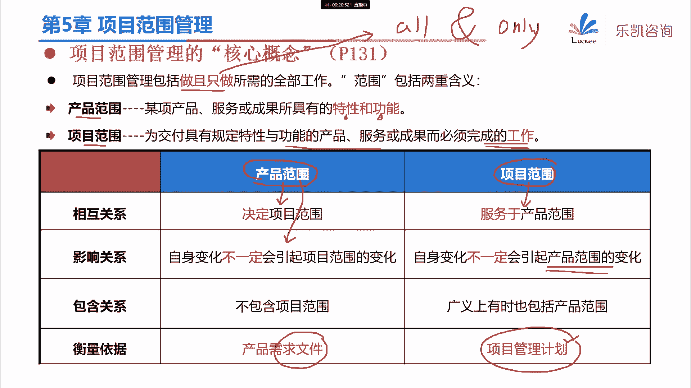
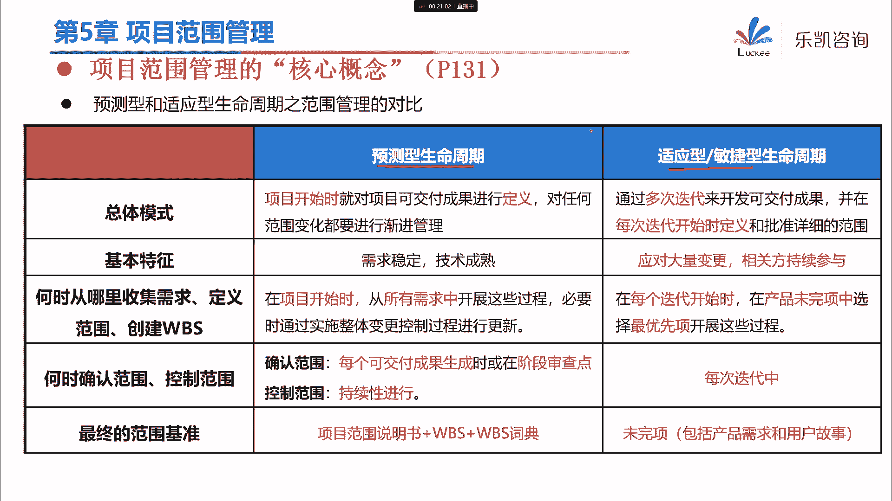
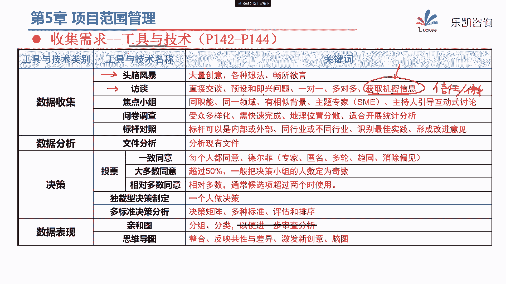
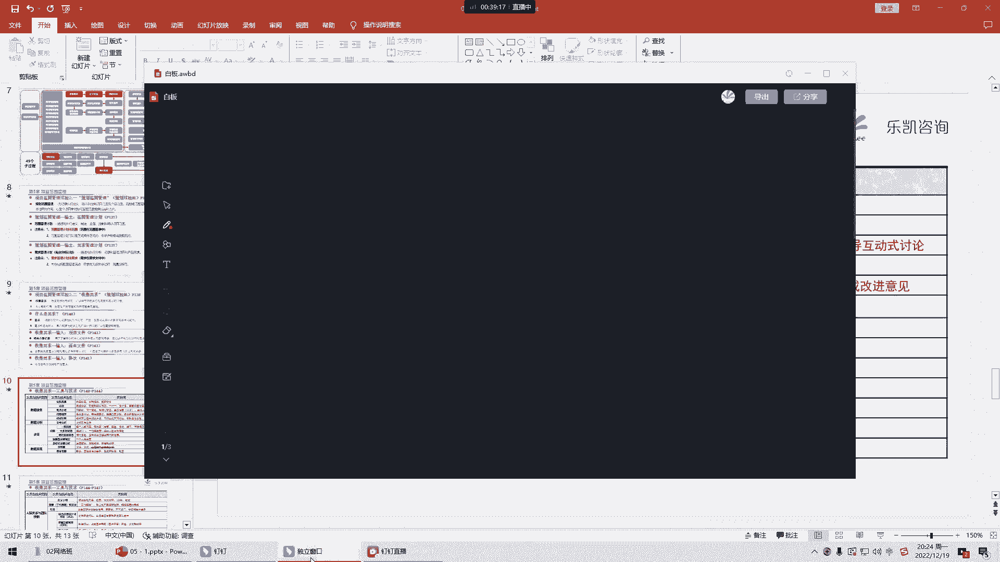
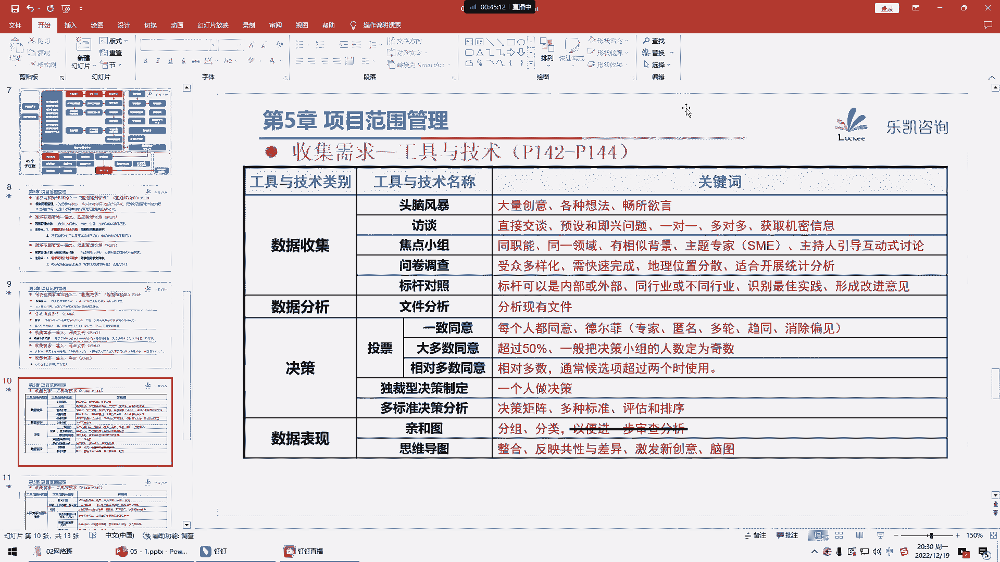
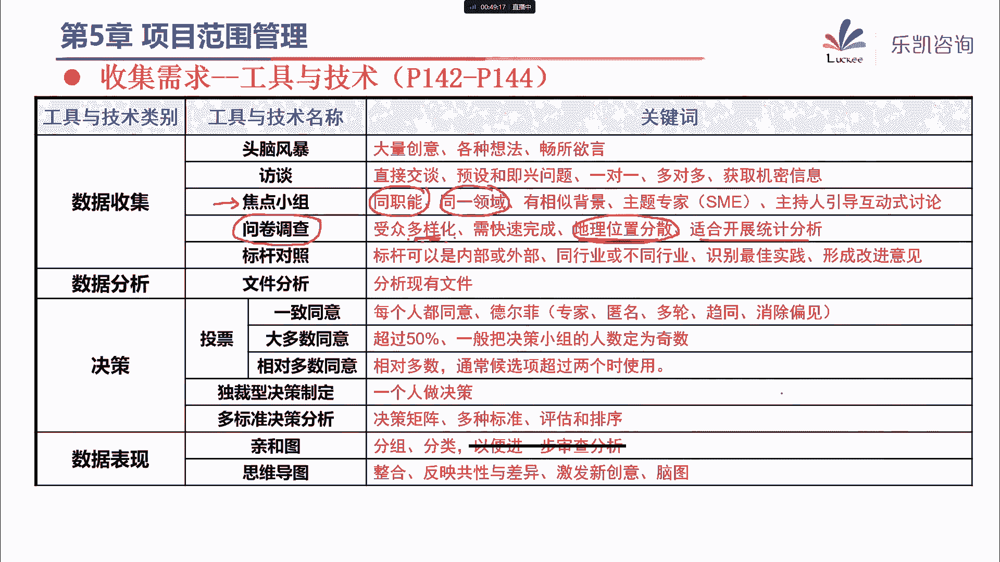
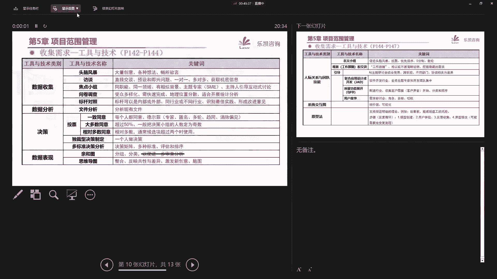
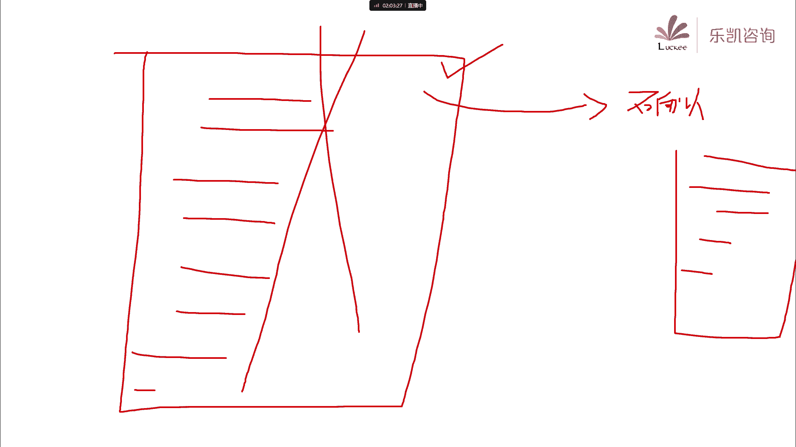

# 2024年PMP认证考试课程针对PMP新考纲最新免费零基础也能轻松听懂 - P6：PMP第5章：项目范围管理（上） - 乐凯咨询 - BV1Rj411G7gs

好，各位同学晚上好，今天晚上我们开始学习第五章项目范围管理，那么从今天开始，我们就开始深入学习项目管理的，具体的每一个细节好吧，那么说到项目的范围管理呢，首先大家要知道范围是什么意思。

那么我们在做项目的过程当中，可能有很多同学听到听到过这样一个说法，对吧，说我们项目中啊有比较重要的三个东西叫饭进，城，那么什么叫范进程呢，就是范围进度和成本，那么为什么我们一般说放进程。

放进程范围要放在前面呢，那么因为范围他说的是什么呢，范围说的是我们这个项目啊，最终要交付什么可交付成果，或者说通俗一点说，就是我们这个项目最终要做出什么东西出来，对吧，那么为什么这个东西要先讲呢。

道理很简单，因为只有我们知道了我们这个项目要做什么，然后接下来我们才能规划出，我们这个项目的工期要多久，也就是进度，那么接下来才能知道我们这个项目的成本，大概是需要多少，所以有这么一句话说。

范围是龙头对吧，我们必须要先确定范围，这是一个很典型的用计划驱动的项目管理，所必须要重视的一个环节对吧，范围一定要明确，那么在p m p里面说，项目范围的核心概念是什么呢，他说项目的范围管理。

包括注意这句话啊，做且只做所需的全部工作，也就是说他强调什么呢，我们该做的肯定都要做对吧，但是要注意我们也只做该做的事对吧，叫all and only，那么如果说我们要多做啊。

或者说我们有些东西需要少做，那么多做少做，我们应该怎么处理好，大家学了上星期的课程应该会明白，如果要多做或者少做，那么你就必须要怎么样，先要走变更流程对吧，要去修改我们的计划或者基准。

然后变更了批准了之后，我们才能多做或者少做，否则的话我们不可以轻易的多做少做的，那么接下来他说其实在我们项目管理当中啊，范围呢它是包括两重含义的啊，一般呢我们统一的都叫范围，但实际上要细分的包括两种。

一个叫产品范围，一个叫项目范围，那么什么叫产品范围呢，产品范围就是我们交付的那些东西，需要具备的特性和功能，那么项目范围呢就是为了交付这些东西，我们必须完成的工作，那么这里面有什么区别啊。

我们举一个例子，比如说我们要交付给客户一份盒饭啊，交付下一份饭，那么什么叫产品范围呢，就是这个范围的特性是什么啊，这个饭的特性它是一份盖浇饭对吧，有菜有饭怎么怎么样，然后功能是什么呢，功能它是移动饭。

它是一个食物可以填饱肚子的，那这个叫产品范围，那么什么叫项目范围呢，好我们为了交付这份饭，我们可能要做一些相应的规划的工作啊，或者要开一些会议啊，要做一些项目管理有关的工作。

那么这些所有的工作叫项目范围对吧，那么实际上我们在讲范围的时候，不太去区分产品范围和项目范围，那么这两个概念呢大家可以稍微了解一下，那么另外呢他说产品范围啊，我们要交付什么，就决定了我们要做哪些工作啊。

产品范围决定了项目范围，那么反过来说，我们做的这些工作是为了什么呢，是为了提供这些特性和功能的，所以项目范围呢服务于产品范围对吧，那么但是大家要注意，其实这两者并没有什么必然的说。

一个变化引起另外一个东西的变化，比如说举一个例子，我们先看这一块，如果我们要完成的工作变多了，那么我们的特性和功能，也就是产品的范围一定会变吗，哎比如说我在给客户交付这份盒饭的时候，我多做了一些工作啊。

我不是简单的去找一个供应商，我找了好几家供应商组织的招投标，怎么怎么样对吧，然后最终定下来由谁做，然后最终交付，那么你多做了一些工作，它的特性变了没有呢，其实它的特性不一定变，你交付的还是这份饭对吧。

那么再看，那么如果产品范围变了，它的特性变了，我们的工作就一定会变吗，也不一定，那么关于这一点的，有同学有疑问，他说你交付的特性都变了，你的工作难道不会变吗，好比如说我们现在要给客户，他家里面有一堵墙。

我要给他刷油漆对吧，那么一开始呢客户说我喜欢红色，你帮我把它刷成红色，还没刷呢，客户说哎呀算了，还是刷成蓝色吧对吧，那么这堵墙的特性变了没有，他肯定变了，颜色由红色变成了蓝色对吧，但是工作变了吗。

其实工作并没有变，还是去刷那堵墙好吧，所以这两者的变化不一定会引起立方的变化，那么产品范围最终由什么来衡量，由需求文件来衡量我们的产品范围有没有达成，而项目范围呢要用项目管理计划来衡量好。

那么这里有一个细节啊，很多同学在做题的时候容易错，我们一个项目的范围完成得怎么样，应该根据什么，要根据项目管理计划，因为我们是按计划去执行的。

好吧好，那么接下来预测型，也就是我们p m p里面主要讲的计划驱动型，生命周期和敏捷，他在范围这边不同的做法。

我们在这边呢先放一放，我们后面会统一的去讲好吧，那么在现在发展趋势和新兴实践里面，他说到一个词，他说需求一直是项目管理中的重点，好说到这里啊，我就有个疑问啊，讲范围讲得好好的，为什么忽然又讲到需求啊。

这个需求跟范围究竟是什么关系啊，实际上我们很多做项目的同学听得比较多的，反而不是范围，反而是什么呢，是需求，那么为什么在讲范围一开始，他会莫名其妙说这句话，说需求一直是项目管理的重点。

需求跟范围之间究竟是什么关系好，那么接下来我们先讨论一下，需求跟范围是什么关系，好张勇说需求决定了范围对吧，唉很多同学都有这样一个想法，需求决定了范围，这些东西呢可能我们有这样一些想法。

但是怎么去区分需求和范围呢，好我用一个例子来考一考大家啊，我现在这么说，我需要，一瓶，可乐，好那么我问一下，我现在需要一瓶可乐，这个可乐算是需求呢还是算范围呢，我们在做项目的时候，客户忽然会这么说对吧。

哎我们需要一个什么功能，我们需要一个什么设备，我们需要做，我们需要，那这看上去呢好像是需求对吧，那很多同学都说这是一个需求，实际上大家要注意这个并不是需求，这个是明确提出了一个什么呢。

要你交付的可交付成果，实际上这个偏向于范围，那么大家注意一下啊，在这句话里面能不能体现客户的需求啊，大家要注意，在这句话里面其实不能体现客户的需求，那么我会帮大家分析一下，大家也许就清楚了。

比如说我们的需求应该是什么，我们的需求应该这么描述，我，现在口渴，对吧，我口渴，那么我口渴的我就想喝点东西，这是我的需求对吧，所以我希望你为了满足我这个需求，你最终交付我什么东西呢，你交付我一瓶可乐。

对吧，那么从这个角度来看，口渴要喝东西，实际上才是客户的真正的需求对吧，而可乐只是最终的一个解决方案，或者说最终要交付的一个可交付成果，对吧好，还有一种情况是这样说的，就像廖建波同学说的。

我现在需要烧一道菜，叫可乐鸡翅，对吧，所以呢我现在需要你交付一瓶可乐，那么客户最终就提了一句话，说我需要一瓶可乐，但实际上我们一定要了解他的需求究竟是什么，好，大家知道。

为什么我们要了解他最终的需求是什么吗，因为这两种情况它可能带来不同的解决方案，比如说如果他的需求是要烧可乐鸡翅，那么没有办法，你必然要交付他一瓶可乐对吧，而如果说他的需求只是口渴了。

我们其实不一定要交付可乐的，我们最终交付什么，其实我们可以跟客户去协商的对吧，哎我现在市场上没有可乐，那么雪碧行不行呢，农夫山泉行不行呢，橙汁行不行呢，对吧，所以说为什么最终的范围。

我们必须要弄明白客户真正的需求是什么，它的原因就在这边对吧，因为我们只有了解最终的需求，才能够准确做出交付好吧，所以说刚刚大家说的是对的啊，我们为什么讲范围就必须要谈到需求，因为需求它最终决定了范围。

对吧好，所以回到这句话，需求是项目管理中的重点对吧，那么接下来他说我们有这样一个人，叫商业分析师ba啊，b iness analysis，我们有的公司是有这样一个职位的，他说商业分析师呢。

如果有这样的人可以负责需求管理相关的活动，就是他去了解客户最终的需求是什么，那么这个时候呢，我们项目经理只要带着团队最终去交付，符合他需求的可交付成果，然后把这个项目按时按预算完成就可以了对吧。

但是话又说回来了，有的公司并没有明确的ba，或者说需求工程师这样一个职位，那么这个时候就需要项目经理，去了解客户的需求好吧，所以说对于这一块项目经理也要搞清楚的，那么在敏捷里面要考虑的因素。

我们在后面会统一的讲，敏捷里面的范进程怎么去处理好吧，那么陈成业同学说，需求是原因，范围是可交付成果，我觉得呢这个话呢说了也没有什么问题好吧，应该说需求是什么，是一个最真实的一个需要对吧。

其实需求它就是一种需要，那么我们为了满足这种需要，我们要交付一些可交付成果，好吧好，那么接下来我们看具体的过程，我们今天讲的内容呢，其实主要只讲一个过程好吧，那么我们先看第一个过程叫规划范围管理好。

首先看一下什么叫规划范围管理，他说规划范围管理啊，就是为了记录如何注意啊，注意这个词，我们将来如何去定义范围，如何去确认范围，如何去控制范围对吧，为我们将来管理范围提供一个指南和方向的。

那么它最终会形成一份叫范围管理计划对吧，那么同时范围跟需求有关，它也会同时形成一份叫需求管理计划，那么范围管理计划说的是如何管范围，需求管理计划说的是如何管需求好，那么首先这两个计划。

我建议大家不要花太多的时间，那么为什么不要花太多时间呢，因为第一我们在实际做项目的时候，不太写这些计划，这个计划的可能一句话就带过了，pmp里面也说它可以是正式甚至非正式的，可以是高度概括的对吧。

那么第二个我希望大家要注意什么呢，这两个计划说的都是我们怎么管范围，怎么管需求，它体现的是什么呢，如何也就是说他在强调how，那么这有点像什么呢，有点像我们上个星期讲过的一个计划，叫变更管理计划对吧。

变更管理计划里面说的是如何管变更啊，我们第一步要记录，第二步要评估，第三步，第四步，第五步对吧，好，那么同样的范围管理计划和需求管理计划，也应该是这种指南型的计划。

所以大家要注意一下我们一个项目要交付什么，或者我们这个项目的需求是什么，它会不会写到这些管理计划里面，他一般不会写对吧，这些管理计划一定是一些流程性的，程序性的东西好吧。

那么最终我们的范围和需求应该记在什么地方，我们后面的过程会体现，那么这个过程一定要注意啊，这些指南型的计划，一般我们不会去记录真正的范围，或者记录真正的需求，好吧，这些计划的一般我们也不太去写好。

那么接下来我们着重看这个过程，那么怎么去广范围，首先第一步，范围源自于需求，那么我们一定要强调一个过程叫收集需求好，说到收集需求，我想问大家一个问题啊，我们在目前学到的所有的东西里面。

有没有哪一份文件已经涉及到了客户的需求，其实是有的，比如说我们之前学过的项目章程对吧，甚至合同里面也有对吧，那么项目章程里面肯定是有，我们这个项目的需求的，那么既然项目章程里面已经有了需求。

为什么我们在这个过程一定要再做一步，收集需求的工作对吧，项目章程里面不是已经有了吗，那么大家要注意我们在讲项目章程的时候，说到了需求的时候，前面有一个形容词叫什么呢，叫高层级需求。

它是一个宏观的或者概括的，那么做过项目的同学，大家会发现合同里面的要求，或者我们的招投标文件里面的要求，他其实怎么样，一句话就说了啊，我们需要这个功能，这个功能是实现什么什么目的的啊，我们需要这个产品。

或者我们需要这个设备，这个设备能怎么怎么样对吧，一句话就说过去了，这个太粗略了，是宏观的，他没有办法指导我们具体的去实施项目，所以说我们这边收集需求它是做一件事情，把宏观的需求怎么样。

一定要把它细化出来，一定要细化出来，所以收集需求它就是为了实现我们的目标，来确定记录和管理相关方的需要和需求的过程，那么他也说了什么叫需求呢，他说我们要根据协议或者其他的强制规范。

我们最终交付的东西需要具备什么能力，那么他说需求包括各方提出来的以量化，并且书面记录的需要和期望，好，我问一下我们在收集需求的时候，为什么要强调需求要可量化，我们真正做项目的时候啊。

我们的需求在描述的时候，最好也要把它量化去描述，为什么要提到这一点呢，好比如说我举一个例子，我们做it的同学，一定有这样一个遇到这样一个问题，比如说我们开发一个网站好，我们要求网页在点击之后啊。

响应速度要快，对吧好，我们做建筑业的同学对吧啊，或者说我们做一些设计的同学，可能有这样的一个说法，说啊，我们的设计要大气，好请问这种描述需求的方式好不好，其实不太好，为什么不太好呢，因为它没有量化。

什么叫快，什么叫大气，你将来验收的时候怎么去验收呢对吧，有人觉得一个网页的响应速度，在七秒之内就算快，有人觉得超过三秒就已经很慢了对吧，再比如说哎我们要买车，那么4s店的销售问你对车子有什么要求。

我的车子要起步快，什么叫起步快，没个标准啊对吧，你可以把它量化出来，如果能量化一定要量化，比如说啊我的什么加速对吧，百米百秒加速要达到多少多少秒对吧，那么像这种你如果能够量化出来的。

那么最好能够量化出来，免得到最后验收的时候会有争议好吧，所以一般我们建议啊，需求到时候谈的时候要可以量化，那么怎么去收集需求呢，好收集需求肯定要跟人去收集对吧，那么我们后面会接触到一个东西。

叫相关方登记册啊，找哪些人去收集需求，包括我们可以参考我们前面讲的，商业论证和协议，那么这个过程的重点不在于这里啊，这个过程他的考试的重点，包括我们在以后做项目的时候，要注意的点在于什么呢。

在于它的工具和技术，收集需求的工具和技术，每一个大家都要了解，而且在今后管项目的过程中要灵活使用好吧，那么我在讲的时候呢，我会介绍每一个工具的特点好吧，大家一定要仔细的了解清楚。

那么首先他说到我们有这种方法，我们可以用头脑风暴的方法来收集需求，那么这个工具呢其实我们接触过对吧，头脑风暴我们说不至于不分析，大家畅所欲言，哎有什么需求拉着客户过来挤，我们头脑风暴一下好吧。

这种方法很简单，但是大家要注意啊，我们所有的工具不是说强制你要使用的，我们在使用的时候要注意什么，要注意选择，要注意裁剪，那么我说一个考试不考的啊，我建议大家在以后做项目的时候。

如果是我们有一份固定总价合同，就这个合同说好了多少钱对吧，固定总价合同范围如果是比较明确的，我们尽量不要用头脑风暴这种方法，那么什么时候用头脑风暴这种方法呢，在我们做创新的产品的时候。

就是市场上没有这个产品，而我们是第一家做这个东西的，做创新产品的时候，我们可以用头脑风暴的方法，大家知道为什么吗，假如说我们跟客户有一个明确的合同，明确约定的范围，然后明确的整个合同价格是多少。

你就不要头脑风暴了，如果你头脑风暴，客户的想法五花八门，但是有很多呢又是在合同以外的，你说客户提出来了，你做不做呢，你做吧，超出合同范围，你不做吧，客户会很不满意对吧。

所以在这种情况下就不要去头脑风暴对吧，但是如果我们是自己做一个创新的产品呢，这就需要我们干什么哎，去发散性的思维对吧，那么这个时候我们就要集思广益，畅所欲言是吧，所以说这种工具使用的时候要注意场合。

好吧好，第二个工具我们也接触过，叫反弹interview，这也是我们收集需求最常见的一种工具，比如说我们走到客户那边对吧，跟甲方约好时间，约好地点，然后我们找相应的人开始去干什么呢，去跟他们聊一聊对吧。

我们提出一些预设的或者机芯的问题对吧，了解他们的需求是什么，那么反弹它有一个细节啊，他说反弹这种方法可以获取机密信息，那么接下来我问一下大家啊，假如以后各位作为项目经理要调研项目的需求。

我们走到客户那边去，想找各个业务部门的对接人对吧，分别去了解他们的需求是什么，那么请问大家，我们应该在什么样的场合下做需求调研，是直接去他的办公室，在他的工位旁边调研，还是去事先跟他说好。

我们去约一个会议室，到会议室里面去调研，你们觉得哪一种做法比较常见，好马恒说了，在会议室调研需求比较常见，一般不会去办公室，在他的工位旁边对吧，因为办公室里面呢还有其他人好，那么大家想一想，为什么呢。

为什么我们要找会议室，而不是找办公室呢，大家要知道啊，如果有别人在旁边，你调研需求，有可能他有一些东西呢，他就不会说对吧，有别人站在旁边，他这个出于一些顾虑了，他就不太好说。

所以说我们可以找一个叫什么呢，我们可以找一个叫信任，和保密的环境，在这种环境下去跟他反弹，那么这样在聊的过程当中，有助于获取一些机密信息，比如说聊着聊着啊，他就会说哎呀，你不知道，他是一个什么人对吧。

他非常注重细节，或者说他非常在意这个设计上的一些东西啊，所以你们在后面做的时候，要特别注意这一块是吧，一定要在信任和保密的环境下开展，所以反弹这边有一个细节容易获取机密信息，好吧好。

那么接下来按照惯例啊，再考大家一个考试不考的问题。

好嗯嗯。

比如说我们做项目啊，像我做政府项目跟客户去调研需求，一般我也是找一个会议室，那么政府部门的会议室呢一般都是长条的对吧，这里有一个门，下面有一个门，然后里面的会议桌一般也是长条的，对吧好这样一个会议室。

然后接下来这里有一个位置啊，这里有位置，对吧，然后这边也有，好我首先问一下啊，假如你是项目经理，假如你能够决定，那么请问进了这个会议室之后，你希望甲方的老师他坐在什么位置。

这里面啊其实有很多的细节在里面好吧，那么其实我觉得作为我是项目经理，我最希望他坐的位置呢是坐2号位，然后我做3号位，这是最好的对吧，他做二，我做三，那么有人说为什么呢。

他说我们一般调研需求客户都是坐在6号位啊，对吧，我们坐在2号位啊，那么为什么这样去做不行呢，好大家注意啊，这里面有一个细节问题，6号位这个位置是很差的，为什么很差呢，大家注意第一点。

6号位这个位置它有个特点，它正对着门，正对着门，那么正对着门，因为我们一般开会的时候啊，不太会去关门，特别是如果只有两个人反弹的时候啊，和一对一的反弹，这个时候呢不太好关门，对吧好，如果他正对着门。

那么接下来门口有人走来走去，就会出现什么情况呢，比如说他的领导从这边走过去了，他马上就会追出去，哎领导你等一等，你等一等啊，我这边有一个东西让你批一下是不是好，如果他的下属走过去，唉，小李你等一等。

上次交代你的事情，你做得怎么样了对吧，所以这是第一个问题，容易受到干扰，还有一个问题也很严重啊，第二个问题我问一下，如果他往6号位一坐，你能做什么地方，有人说老子他妈坐1号位像话吗。

啊到政府里面部门开会，人家坐6号位，你特娘的坐1号位，这肯定不像话呀，所以他坐6号位，你就必须做几号位呢，你就必须做2号位，是不是你其他还能怎么办好，那么这样一做，我问一下大家，面对面的就是坐的位置啊。

坐在对面坐的这种往往像什么呢，我跟大家说面对面的一座，从感觉上来看，就像谈判，就像谈判，明白吧，那么有人说好，那么我不做2号位，我不谈判了，我坐7号位行不行呢，一样有这个问题啊。

你不解决第一个问题啊对吧，所以说呢这里面有一个小细节，我建议大家可以参考一下我的做法，那么我一般是怎么做呢，我一般是这样，我也知道他不可能按照我的要求背对大门，因为背对大门呢没有安全感。

所以呢我就老老实实一进会议室，我就把这个凳子呢拖一拖对吧，然后我说诶赵老师请坐，对吧好赵老师请坐就坐这里了，就让他做1号位就行了，然后接下来我怎么做呢，好我把2号位的凳子挪一挪。

挪到人能够坐在这个角落上，然后把我的笔记本打开，对吧，那么这样做有什么好处，第一这样做代表我在跟你合作，而不是谈判对吧，我坐在你角落边上，我把电脑打开，一边说一边跟你说，再介绍我们这个项目对吧。

第二个呢我坐在这个角落上，我用我魁梧的身躯，可以把你的视线稍微挡一挡对吧，所以说啊在一些不方便关门的场合，我建议大家可以引导客户直接坐这个位置对吧，然后你就挂角落上一挂，用你的身体挡一挡对吧。

另一方面呢也不像那种对面坐，有谈判的这种感觉对吧，然后仔细的跟人家去聊一些需求，或者说聊一些你的想法对吧，那么这样也容易让别人专注于这场调研好吧，那么这个是反弹这边要注意的一些细节。

大家以后呢可以去尝试一下啊。

经过我的实践呢，我觉得这种做法相对来说效果要好一些好吧，当然这个不是考试内容啊，不是考试内容好吧，大家可以在在后面做项目的过程当中，尝试着去用一用，好吧好那么第三个工具叫焦点小组。

焦点小组这个工具呢我们也讲过啊，我们也讲过对吧，我们说焦点小组是什么意思，我们可以聚焦在某一个点，所以说大家要注意啊，焦点小组它一定有一个关键词，就是我们聚焦在这个点的人一般是什么人。

一般是同一个职能的或者同一个领域的啊，比如说我们需求有是跟什么有关系呢，跟法律法规有关系的对吧好，那么我们就请法律方面的专家，其他专家我们不要找了，跟财务有关系的，就找财务方面的专家。

那么这个焦点小组我们之前讲过对吧，很简单的聚焦在某一个点吧，focus group好，接下来还有问卷调查，用问卷调查的方法来收集需求，那么这种方法我觉得大家应该都接触过对吧，像以前互联网不发达的时代。

我们在大马路上会看到很多小姐姐在发单子，让我们做问卷调查，现在这些年互联网发达了之后，我们一般在微信上对吧，还有一些这个问卷调查直接就推过来了，不管是我们工作环境还是我们小孩的学校。

可能都有类似的问卷调查，那么问卷调查这种方法，也是一种收集需求的方法，它的特点是什么呢，它的特点是受众多样化，而我们可以接受很多很多样的受众，然后呢特别是这个东西叫地理位置分散。

比如说我们在给一个企业调需求的时，候，他们在全国各地有很多的分公司，那么我们全国各地到处飞，这个成本太高啊，那么这个时候怎么办，好，地理位置分散，我统一给他们发在线的问卷调查就好了吗。

那么另外它还有一个特点，就是我们可以开展统计分析对吧，你们不是都填了问卷吗，好填了问卷之后，我们收回来后台做一个统计分析，有多少人赞同哪一种方案，多少人赞同哪一种方案对吧。

这是一种很常见的收集需求的方法，那么在考试的时候，这个工具也经常出现，大家要注意，凡是出现啊地理位置分散对吧，包括受众多样化或者受众很多，要快速开展统计分析，一定是选择问卷调查这种工具好吧。

那么这个工具大家今后如果要用也要特别注意，有没有同学知道问卷调查这种方法，他的问题是什么，如果有用过的同学啊，问卷调查他的问题是什么，其实这个工具啊不一定是百分之百都好的，他多多少少都有一些啊。

比如说有一些这个不太准确的一些地方是吧，那么问卷调查最大的问题就在于什么呢，它的真实性是存疑的，比如说我自己就有这样一个体会啊，学校的老师给我发问卷，让我填，我首先看这个问卷是实名的还是匿名的。

如果是实名的呢，唉我可以仔细看一看，选一选，如果是匿名的，我就随便选，为什么呢，因为我也很忙啊，我哪有时间帮你去填这个问卷啊对吧，所以问卷调查最大的问题就是，它的准确性是存疑的。

所以将来大家在使用的时候，我说一下啊，如果我们将来要用这样的工具来收集需求，那么大家一定要重视一个东西，要重视问卷的设计。

好比如说举一个例子啊，为什么说要重视问卷的设计啊，举一个例子，我们在给别人发问卷的时候，为了防止别人填写的问卷里面是随便填的，我们可以在问卷里面，他的问题的设置上要做一些要有些手段。

比如说比较常见的手段，就是我们要设置一个互斥的问题，对吧，要设置一些互斥的问题，比如说举个例子，张小宇同学收到了一份问卷，好，第一道题目就问他，你的性别是男的还是女的好，张小宇同学肯定啊。

一看这个名字就是个爷们儿嘛，勾了个男对吧好，那么接下来还有其他的问题，比如说你喜欢足球吗，对吧啊，你最近看世界杯都没有啊，怎么怎么样怎么怎么样，对吧好，接下来忽然有一道题问他，你平时是穿裤子比较多。

还是穿裙子比较多，好张小宇选了一个穿裙子比较多对吧好，后面又有很多很多问题对吧，那么最终这份问卷啊，我收上来一看，后台一统计，张小雨他是一个男的对吧，然后他平时又爱穿裙子，这什么套路啊对吧。

这我感觉好像这个不太对呀，作为一个男的，你说平时穿裙子的，这个概率其实是比较少的对吧，所以出现这种啊，我举个例子就是举的什么呢，有两个矛盾的选择，这个叫互斥，那么出现这种互斥的选择。

那么我们可以认为什么呢，我们可以认为这份问卷不纳入统计，这份问卷作废，明白吧，那么我们用这个例子想说明什么，我们在设计问卷的时候，一定要买入一些像这种互斥的问题，互斥的问题，如果一旦发现有矛盾。

我们就认为这个问卷是无效的好吧，那么其实大家如果有兴趣啊，后面做问卷调查的时候，一定要注意这个问卷的安排，大家可以去参考一下其他的资料，他有很多的原则在里面好吧，那么这个不是我们p m p考试的内容。

p p考试呢比较简单对吧，你只要知道啊，什么情况下要用什么问卷调查就行了啊，地理位置分散对吧，适合开展统计分析，那么一定要选择工具调查，好吧好，接下来再看标杆对照，那么大家注意，我还是那句话。

偏僻里面没有什么很高深的东西，很多东西呢从字面意思就可以看出来，大家知道什么叫标杆对照吗，标杆对照就是benchmark对吧，就是说我们找一个标杆过来对照对照好，那么我再问一下。

首先我们要考虑究竟什么叫标杆，其实我觉得张勇同学说标杆就是竞品，竞品分析对吧，其实我觉得他跟竞品还不太一样，关键就是大家要知道什么叫做标杆，你说什么东西可以称之为标杆呢，李宁同学说得很好。

标杆一般就是同行当中做得比较好的对吧，发挥到榜样作用的，比如说呢我随便说一说，大家就能够轻易的找出标杆，比如说短视频软件，你们觉得谁是标杆，这个就不用说了对吧，我觉得短视频软件做的比较好的。

无非就是像抖音啊，快手啊这种对吧，那么这个就是标杆呀，好再比如说移动出行领域，谁是标杆啊，不用说滴滴呀，以前的滴滴呀对吧，是不是那么像这种就叫标杆，那么也就是说什么叫做标杆对照呢。

我看一看人家做得好的是怎么做的，我去对照对照好吧，其实我觉得呢大家刚刚说了一个字啊，说了一个字啊，很传神，什么字呢，就是，你不要说你不会对吧，你说你需求我不知道有什么需求，你不会你不知道抄吗对吧。

以前我刷抖音的时候看到一个段子，说一个产品经理叫程序员要做什么功能，什么功能说的又不清楚，程序员很恼火，就说哎呀算了算了，别说了，你就告诉我你要抄谁的，我去看就行了对吧，所以标杆对照是什么呢。

就是抄就是去山寨对吧，说的好听一点就叫标杆对照叫借鉴对吧，参考标杆，那么标杆对照的目的是什么，很简单，识别最佳实践，对吧，就是人家做得好的那些最佳实践是怎么做的，我去识别一下，然后形成改进意见啊。

我按照他的样子去改一改，明白吧，其实很简单，那么他说标杆可以是内部或者外部的公司，有做的好的，那么我就内部标杆对照公司没有做得好的诶，外部有做的好的，那么我就外部表方队长都可以啊对吧好。

同行业和不同行业的，同行业的我们可以理解了，大家都是做短视频软件的，我当然可以标杆对照呀，那不同行业的标杆对照是什么意思啊，不同行业的能标杆对照吗，可以的，我举一个例子啊。

比如说我发现现在有一个软件挺好的对吧，他解决了我们喝酒不开车，开车不喝酒的问题，什么软件叫滴滴代驾，我喝了酒，我不能开车对吧，那么我找一个代驾嘛，是吧好，我看到这个，我忽然有一个灵感，马上要过年了。

过年有很多的聚会要喝酒，我开发一个软件，我不是移动出行领域的啊，我是人情世故领域的，我开发一个软件叫滴滴代喝，那么我是想做一个什么呢，唉我今天晚上有个局对吧，我要想把这个兄弟。

或者把这个客户要把他喝趴下，但是我自己呢他们酒量只有二两，我喝不了，那怎么办呢，诶我有一个软件叫滴滴代喝，我找周围能喝酒的，然后下个单对吧，然后这哥们接了单之后过来哎，就说是我们的同事。

然后一起去喝对吧，把这个客户喝趴下好，喝完了之后客户也喝趴下了对吧，合同也签了好，我给你五星好评，然后给你结结单对吧，可以吗，也可以，这是同行业吗，这当然不是同行业啊，一个是出行领域的啊，一个是什么呢。

喝酒这方面的，这肯定不是同行业，但是我们解决方案是一样的，我们都依赖什么呢，移动互联网的技术对吧，所以说不同行业的也可以标杆对照啊，就像有同学说的，其实解决问题的方法有可能是一样的，好吧好。

那么这几种工具其实都比较简单，从字面意思大致想一想就知道它的意思是什么，好吧好，接下来文件分析这个工具呢，我说实话有点low啊，有点low，他说的就是我们要分析现有的文件，那么你分析什么呢。

无非就是分析商业文件吗，无非就是分析合同了对吧，这个东西呢你爱怎么分析怎么分析，他没有什么考点，好吧好，接下来还有他说，我们可以通过一些决策技术，来对需求做一些决策啊，比如说他说第一种叫投票。

那么投票里面分为好多种，一个叫一致统一好，说到这里啊，书上没有说，但是考试会有的一个考点，大家要注意一种方法叫德尔菲，那么德尔菲这种方法用来决定需求，它可以起到消除偏见趋同的一个作用。

那么究竟德尔菲是什么意思呢，好我用一个例子来说一下，比如说举一个例子，最近呢大家都知道不太好出门，对吧啊，这个我自己呢，可能家里面呢也有人出了一些问题，所以呢我也自己也不好出去，老是憋在家里面很难受。

那么我想呢过了这个星期，如果我没有什么问题，下个星期我就要跟我的朋友一定要去聚一聚，那么跟朋友去聚一聚就涉及到一个问题啊，吃什么，对吧，其实这个问题很难回答，其实大家有没有发现我们每天关于自己吃什么。

其实是很纠结的一件事，我也不知道要吃什么好，那么这个时候怎么办，我可以找三个专家，那么要注意啊，三个专家相互之间是不知道对方的存在的对吧，那么找了三个专家呢，大家注意我是怎么去找专家。

来帮我做这件事情的，分别跟三个专家联系对吧，我就把我的苦恼先跟a说一说，再跟b说一说，再跟c说一说，那么一开始呢我是这么说的，我呢下个星期想跟几个兄弟来嗨一下对吧，那么你说吃点什么呢，好a专家来说。

要不这样吧，你们都是男的对吧，饭量比较大，你去吃自助，对吧，这是a专家给我决定了十字组，吃到扶墙出，那么b专家说什么呢，他说在一起当然是吃火锅比较有气氛，对吧好刚刚还有一个专家说吃什么呢。

好王旭东王老师说，兄弟在一起当然是吃烧烤更加有气氛啊，好那么这是第一轮，三个专家都给出了不同的意见对吧，你说意见一致吗，意见当然不一致好没关系，我把这三个专项的意见呢拿回来之后。

那我原来对吃什么完全没有概念的，但是呢我结合这三个专家的意见呢，诶我感觉好像搞个火锅也不错嘛，冬天了嘛挺好的，这是一个好想法，好大家注意第二轮，我在第一轮的基础上，我又问了，这样吧。

假如说我决定现在吃火锅，你觉得我们去哪儿吃，大概要花多少钱，好a专家一停靠，搞了半天，原来是几个屌丝对吧，还吃什么自助啊，吃火锅吗，那么去海底捞咯对吧，哎你们三五个人吃一吃吗，大概1000块钱的标准了。

1000块钱，海底捞好，a专家给了这个方向对吧好，那么b专家又说了，诶，那么火锅不就是我说的吗，那这样在你家小区旁边有一个潮汕牛肉锅，还不错对吧，你们三五个人去吃一吃。

大概也就600块钱就差不多了对吧好，c专家说，搞了半天，你还要吃点火锅呀，那么吃火锅吗，比如说找一个什么小肥羊啊，怎么怎么样，对吧啊，差不多嘛，500块钱好吧好，那么第二轮出来了，那么在第二轮的基础上。

我可以进一步提一些要求对吧，哎比如说这个我这几个兄弟呢，有的人呢忌口对吧，而不吃羊肉的，然后呢要注意什么什么什么，那么你们再看一看吃什么比较合适好，然后再根据我的反馈再来第三轮，那么大家会发现啊。

经过一轮，然后收集信息反馈之后再来一轮，然后再收集信息反馈之后再来一轮，那么最终你会发现，原来我对吃什么是完全没概念的，但是通过一轮一轮最终的整理到最后怎么样，你会发现。

最终我们可能会在某一个点达成了一致对吧，那么这个实际上就是德尔菲的一个作用，那么为什么要用德尔菲这种方法来收集需求呢，好大家有没有发现德尔菲的特点是什么啊，我们找了多个专家，但是他强调什么呢。

专家要匿名，什么叫匿名啊，匿名就是背靠背，谁都不知道谁的存在对吧，那么为什么要匿名去处理呢，因为他这样做的目的是为了消除偏见，防止有一些人他很强势，对其他人造成影响对吧，那么通过多文之后。

最终我们达成一致，最终来趋同好吧，这是一种德尔菲的方法，那么我们后面再讲敏捷的时候啊，其实在敏捷里面如果做过敏捷的同学啊，敏捷里面有一个工具就是基于德尔菲的，我们后面讲到的敏捷里面的叫计划扑克。

它就是计划的基于德尔菲的好吧，那么这个德尔菲在书上没有，大家如果考试的时候遇到，特别是遇到专家啊或者多轮，哪怕出现这两个关键词，你就要注意了，他可能就得用多少飞，好吧好。

接下来第二种决策方法叫大多数统一，哎呀这个就很简单了，超过50%的人同意，就是大多数吗，比如说啊我们在招投标的时候，专家对吧，包括我昨那个前天在讲实战的时候，我们验收的时候的专家一般是几个人呢。

一般是奇数对吧，唉我们找三个或者五个或者七个专家过来，然后接下来我们最终来决定，那么最终怎么决定呢，超过50%的人同意，那么就算同意，这个就叫大多数同意，好吧好，讲到这里，我为了保险，我还是说一下啊。

以前考过一道题，是这样说的，项目经理要做一个决策，他找了几个专家呢，他找了五个专家，那么最终的结果是什么呢，有三个专家注意啊，他说的是有伤，是有三个专家他不同意，好那么最终项目经理也就不同意了。

那么请问项目经理用的是什么方法，啊一共找了五个专家对吧，那么其中有三个专家没同意，那么项目经理最终也就没有同意，那么项目经理用的是什么方法呢，那么大家要注意超过50%的就算了，这个就是大多数同意。

我为什么要讲这道题，因为当时居然还有好几个同学问我，这个为什么叫大多数统一啊，这不是大多数不同意吗，靠这个学习的时候要灵活明白吧，这个方法的名字就是大多数同意这个结果好吧，不要不敢选啊。

你知道这个意思就行了好吧，如果以后遇到这种题目，千万不要做错，只要超过50%，这个就叫大多数同意，好吧好，接下来相对多数统一，那么什么叫相对多数啊，他说有的时候呢，我们可能没有哪一个超过50%对吧。

比如说我们现在有a方案，有b方案，有c方案，有d方案，那么同意a方案的人呢，有40%的人是同意的，同意b的是30%，同意c的人有20%，同意d的呢有10%对吧，那么最终我们决定用a方案。

那么你说他有没有超过50%呢，没有对吧，但是相对来说很多人都同意了a，那么这个叫相对多数好吧，这是一种决策方法，这个就没什么好说的对吧，一个人最终对需求做了决定好，接下来还有多标准决策分析好。

那么大家注意多标准决策分析，这个工具在很多地方都会出现好吧，那么我们只在这边详细的去讲一讲，什么叫多标准决策分析好吧，其实多标准决策分析的也很简单，从它的字面意思来说，就是指我们要从多个角度去考虑吗。

比如说最典型的一个例子是什么，我们有很多的女同学还没有对象，马上又快过年了，回家又要被催了对吧，那么你就要到身边去物色，物色究竟找谁做你的男朋友呢，好比如说现在有了两个人，一个是a一个是b。

那么你怎么去决定a和b谁比较合适，做你的男朋友，那么我们看人要全面对吧，不能只看一面，比如说我们要看这个人，他的阅历怎么样，对吧，找一个男朋友啊，不要找那种很呆很萌的对吧，大家都很忙。

没有那么多时间教他做人，找一个呢这个稍微有点阅历了对吧，然后这个人他本身他是不是够真诚，这也是一个方面对吧，还有呢啊有的同学说长相也很重要，毕竟要带回家过年嘛啊不要说帅吧，这个说的太赤裸了啊。

长相这也是要考虑的一个方面对吧好，还有呢啊有人说收入也很重要，对吧，物质基础也是比较重要的好，那么我们找了这几个维度对吧，那么这几个维度要注意啊，它的权重是不一样的对吧，比如说我们在座的女同学。

你们觉得哪一个维度权重比较要高一些啊，比如说这样吧，我们就简单一点啊，我们就设置，就100分的权重吗，权重分100分，怎么去分配，哪一个比较重要，啊有人说长相很重要，这个张勇一看就是个男的。

你来凑什么热闹，你看看人家说得多好，真诚很重要对吧，这是我们女同学说的，哎我们既然在一起生活，相互要真诚，那么这个权重占多少，这个权重占50分，对吧好，那么接下来长相这么重要呢，长相当然也重要啊对吧。

你最起码带过去不要吓人吧，那么长相权重是多少，还有人说20分，好有人说收入也很重要对吧，毕竟要一起过日子的对吧好，20分好，阅历权重放多少，阅历嘛也不是特别的重要，稍微有一点就可以了，十分对吧好。

那么接下来你就要把a和b做多标准决策分析，怎么去做呢，很简单啊，每一个维度它有一个单独的风俗，比如说阅历分总分十分真诚的，总分是十分长相的十分收入的十分对吧好，你看一下a他能拿多少分。

比如说a这个人阅历还是比较丰富的，他在这个十分里面可以拿到八分，那么真诚吗啊很真诚也可以拿到八分，长相呢长相一般三分啊，比如说收入还可以六分对吧，那么同样的给b做做一个打分吗，啊b的阅历不足五分。

增程呢六分涨价呢涨得不错对吧，七分收入呢还行，八分好，那么接下来很简单，我们就做一件事，把权重乘以得分对吧，好这边乘以乘80，把权重乘以得分400，权重乘以得分60对吧，那么这边是120好。

然后再累加累加就得到a最终的得分对吧，大致算一算460，120，580+80 660分，对吧好，然后接下来b也是一样的，权重乘以得分50分，然后50x60 300，权重乘以那个得分吧，算出最终的总分吧。

271百四二八一百六对吧，那么算一算他最终的得分是650，对吧好，那么最终你应该选择谁呢，根据多标准决策的结果，你应该比较适合选择a作弊的男朋友，因为她毕竟多了十分对吧，所以说大家注意多标准决策分析。

其实呢从它的字面意思就可以看出来了，他是从多个标准对吧，多个标准，然后权重乘以得分，最终去评判明白吧，他一定是考虑多个标准的好，接下来再看清河图，那么清河图这个工具是干什么的啊，大家记住一句话。

什么叫清河呀，清河就是相亲的，相近的，还有亲戚关系的对吧，那么清河图实际上是干什么的呢，我们前面有一些工具是只追求数量，不追求质量的，比如说头脑风暴，那么收集了大量的创意之后，我们可以干什么呢。

哎我们可以用清河图来进行分组合分类对吧，比如说，在刚刚开始开课的时候，我就看到有同学在做这件事情啊，举一个例子，我们一开始开课的时候，我们很多同学参加直播，很新鲜，对吧好，大家都是一个一个，有为青年。

然后在开课的时候呢，忽然有一个人说了一句话，说诶有没有在深圳的同学啊，我们一起来搞一个小群，来相互监督，相互学习一下好，马上有几个人响应了，哎我是真的诶，我也是深圳的啊。

我也是真正的对吧好这四个人私下去沟通去了，然后别人一看诶，那么我们也搞一个吧，唉有没有什么上海的，我们来搞一个群啊，有没有在北京的来搞一个群对吧，所以呢在众多创意里面，我们把相亲的相近的把它分组了。

对吧，那么风阻的这种图就是清河图好吧，那么另外还有一种图呢叫思维导图，我相信这个大家应该很熟悉了，因为每一章的重点，我都把它做成了思维导图对吧，唉比如说第四章一共有几个过程。

第一个过程输入工具输出是什么，第二个过程输入工具输出，第三个过程输入工具输出对吧，把这一章的所有的信息怎么样整合成一张图，反映共性与差异，激发新创意对吧，那么这个就叫清河图。

那么这两个图相对来说知道意思就行了好吧，考试一般考的不是太多，还有我们收集需求，还可以用一些人际关系与团队技能，比如说我们可以用名义小组这样一个工具，那么名义小组是怎么做的呢。

他说我们可以通过投票排序最终的来选择，我举一个例子啊，你们记这个例子就行了，在我小时候啊，不是小时候啊，应该说在我年轻的时候对吧，那时候全国有一些风靡全国的选秀节目，比如说什么超级女声，快乐男声啊对吧。

包括现在也有像什么中国好声音啊，那么他们是怎么样去选择这些选手的呢，他们是这么选的，对吧啊，比如说我们先每一个地区啊，比如说什么华东赛区的什么100强对吧，然后华中赛区100强好，先选出来，选出来之后。

然后接下来再投票对吧，一轮一轮的往里面投，直到最终全国什么十强对吧，然后再投票什么十进八八进六对吧，到最后好选出来，其实名义小组我建议大家把这个词啊，看成是这个叫名义，那么为什么可以看成是这个名义呢。

实际上他说的意思是什么，就是我们每个人在每一轮，我们手上都有一票对吧，那么我们在每一轮都可以去投票，然后去决出最终的多少钱对吧，去排序，那么其实就是这个意思好吧，这个工具其实很简单，就是人手一票。

然后我们一起来做这件事啊，我们去一起投一投，然后选出来前面的多少钱就可以了，好吧好，然后接下来观察和交谈，这个工具在考试中出现的不多，但是在工作中用的很多好，什么叫观察和交谈啊，首先要注意观察和交谈。

它不是反弹，他不是正儿八经的跟别人坐下来说，哎我们就这个事情，我问你答对吧，他可能是随便聊，随便扯淡对吧，那么为什么要这么做呢，因为我们在工作的过程当中，有可能会遇到两种情况。

第一种情况就是别人难以说清楚，就是别人呢他的表达有问题，难以说清，你要观察，或者呢别人不愿意清晰的说明，那么你要干什么，你要交谈，你要去套他的话啊，比如说我举两个例子啊。

第一个例子是我做项目这么多年唯一的一次啊，什么例子呢，就是我在收集需求的时候，当我收集到一个业务部门的时候，发现这个业务部门的对接人，他是一个聋哑人，那么这就是第一种，别人难以说清对吧，你说一个聋哑人。

你去找他收集需求，怎么去收集需求对吧，那么当时呢我在收集需求的时候，甲方的领导就跟我说了，说这个部门的需求收集啊，你要想一些办法，我说唉领导怎么了，他说这个部门的老师他很特殊，因为我们是政府部门。

那么我们就必须要给一些身体不方便的人员，要提供一些工作岗位对吧，那么正好呢这个部门的对接人，因为他不需要跟外界沟通吗，他是做一些比如说子类资料啊，档案整理的，那么他是一个聋哑人。

那么他们那边的流程你看一看你怎么去调研好，那么一开始我也是跟大家想的一样的，很简单对吧，我说你们平时是怎么沟通的呢，好人家说我们平时就是发微信啊，打字啊，那么我就决定那么打字跟他沟通好。

我跑到那边把电脑打开，word打开，开始打字，老师您好，我是哪家公司的项目经理对吧，我今天来主要是跟你来调研需求好，然后我打完了字，他也去打字，但是你要知道啊，这个打字我靠太慢了，我可能还快一点对吧。

我做这一行的，人家不一定打字很快，那么一上午呢聊来聊去，就没聊到很重要的一些细节，那么中午吃饭的时候呢，我就在想究竟用什么办法来解决这个问题，这样也不是个事儿啊，对吧好，我忽然想到了这样一个工具。

观察和交谈啊，就这个工具，所以后面下午我跑过去，我就跟他打字说了这么一句话，我说老师这样吧，我安排我的助理跟您一起工作，对吧，这个叫什么，其实就是工作跟随我，让我的助理跟您一起工作。

他看一看你平时那比如说他跟着你一个星期，他看一看你平时主要是做哪些事，怎么去做的，那么了解清楚了之后，我们再形成一份流程，或者形成一份需求文档，然后我们再一起去对一对对吧，那么什么地方你觉得有问题的。

我们再去调整不就好了吗对吧，这比打字不是要快多了，所以这是第一种方法，就是当别人难以说清的时候，我们可以用这种观察的方法对吧好，还有一种方法就是还有一种情况是什么呢，别人不愿意说清楚对吧。

特别是我们做政府部门的项目的时候，往往要听清楚对吧，在交谈的过程中，要挖掘出别人的隐藏需求，我相信大家呢可能平时应该也有这个体会对吧，比如说，我们带着孩子到别人家里面做客，孩子呢很调皮，人家说了一句话。

这个小孩儿倒是挺生龙活虎的，对吧，唉或者说这个小孩倒是挺活泼的嘛，那么有可能对吧，他这句话里面就包含了一些隐藏的需求，就是你这小孩他妈太闹腾了，你能不能管一管啊，对吧，唉有可能有这种意思在里面对吧。

再比如说你做项目的时候啊，我以前也遇到的，我们一个项目经理就是在收集需求的时候，甲方有一个老师把手机拿出来，哎呀我也不知道为什么，最近这两天我手机他妈的越来越卡了，那么你就想一想，你在收集需求的时候。

人家为什么要说诶，我最近怎么感觉我的手机手机越来越卡了对吧，也许他有一些隐藏需求在里面明白吧，所以当别人难以说清，或者不愿意清晰说明的时候，我们可以用观察和交谈的方法，来挖掘别人的隐藏需求，好吧。

那么我们还是有很多同学比较机灵的对吧，哎我们有很多同学说我靠，莫非这孙子想要我买，给他买一个自信点，把那个问号去掉，对吧，当时我们项目经理也有这个想法，所以回来就跟领导说了，我这一次收集需求。

其他都挺好，就是他忽然提到过两次，他的手机很卡，我感觉对吧，怎么怎么样，是吧，那所以呢我们有的时候啊，可以通过观察和交谈来挖，来挖掘一些隐藏的需求好，然后接下来还有，我们还可以去用引导的方法来收集需求。

好什么叫引导啊，我建议建议大家引导这个工具，可以跟另外一个工具结合起来去记，我们之前讲过一个工具是强调同职能的，大家还记得是什么吗，因为同一个职能或者同一个部门，或者同一个领域。

我们用可以方便的干什么呢，方便地聚焦在某一个点对吧，所以凡是说到同职能，同部门的或者同一个业务领域的，我们有一个工具来收集需求，叫焦点小组对吧，聚焦在这个点，那么如果是不同部门的需要协调的怎么办呢。

好我们就要用这个工具叫引导引导，好引导的特点是什么，他说引导呢一般跟主题研讨会结合使用，所以呢我们往往也把这个工具叫引导式研讨会，对吧啊，它可以跟一些会议结合起来用，那么它的作用是什么呢。

它说它的作用是协调跨部门啊，就是不同部门的一些需求，协调相关方的差异，引导的目的就是干什么呢，我们之前一开始就讲过，就是为了最终达成共识吗对吧，那么怎么去引导呢，比如说在我们的软件行业里面有这种做法。

叫阶级联合，应用开发业务专家跟开发团队在一起对吧，集中在一起，那么制造业有q f d质量功能展开，那么我们后面要讲的敏捷，里面有一个东西叫用户故事，your story对吧。

那么这三个呢大家都可以了解一下就可以了，好吧，因为每一个展开呢都要讲很多那么偏僻的考试，只是让你知道有这样一个工具叫引导，对吧，它的作用是什么，那么常见的三种了解一下就可以了好吧。

那么引导的最大的一个目的，是协调跨部门的需求，或者协调不同人员的想法的差异，好吧，这是它的一个最大的作用，因为最终我们一定要有个结论，要达成共识好吧，但是我要跟大家说一下这个工具。

我不建议大家在将来的项目管理工作中使用，明白吗，或者说如果你要用这个工具，你一定要自己真的要么你关系够硬，要么你自己够牛逼，否则的话就不要去尝试用这个工具了，比如说我说一个场景，大家去体会一下啊。

客户那边有一个a部门，有一个b部门好，我们在调研需求的时候，a部门和b部门对其中的一个业务有争议，a部门说这个业务应该让b去做对吧，就是两个部门有一些业务交叉的，有一些这个工作交叉的地方。

a部门说这个需求不在我们这边实现，这个部分应该让这个这个功能呢，应该让b部门去做好，b部门说这个业务啊应该是他们的事对吧好，那么客户那边a部门和b部门意见不一致，那么这个时候我问一下，你要不要引导。

那么如果在考试的时候问你，我们应该用什么工具，我们应该用引导这个工具好吧，那么在真正做项目的时候啊，我们一定要看情况的，一般来说这种情况我不建议大家去引导，因为不管你说这个东西应该让a做还是让b做。

你都会得罪人，都会得罪人，明白吧，唉就像我有同学说的，有一些不满意的，最终都会发泄到你的身上对吧，那么像这种情况，我觉得啊我们该回避的回避对吧，比如说我发现这个情况，我就找甲方的项目经理。

找甲方的对接人对吧啊，需求调研我们基本上都调研清楚了，但是呢有一个地方呢，你们内部的意见都不一致对吧，那么作为我们这边是提供解决方案的，那么其实不管是放到a这边处理，还是放到b这边处理呢。

我们都遇到过对吧，我我们都有对应的解决方案，那关键就是最终你们要定一下，究竟这一块是放到哪里，对吧，所以这个时候千万不要去站队，要回避了啊，引导不是那么好引导的，其实这个工具说起来容易啊。

有很多事情呢真的叫知易行难，说起来容易，但是做起来很难的，很难的，好吧好，接下来还有我们可以用系统交互图来处理，考试时考试啊，兄弟啊，不要搞错了，考试说到诶，跨部门需求要协调，用什么工具。

你当然用引导对吧，我只是说在你实际管项目的时候出现这个问题，一定要谨慎对吧，因为我们乙方有一个原则，什么原则呢，我们尽量不要介入到甲方的内部的斗争对吧，很容易被别人当枪使好吧。

那考试嘛跨部门你就选择引导就可以了，好吧好，接下来，还有我们可以用系统交互图的方法来收集需求，系统交互图呢就是画一些图，比如说最常见的啊，如果说做it行业的，应该知道叫网络拓扑图这种图对吧啊。

比如说我要说清楚我这个机房需要做成什么样，好，我画一张图，电信的光纤进来之后，先经过我们的防火墙对吧好，经过防火墙之后，我们再接到核心交换机对吧，核心交换机呢有两台，一组一倍的，做的是热备好。

接下来核心交换机再接到什么什么地方对吧啊，然后下面再接什么服务器啊对吧，而在接什么其他的无线设备啊，就是这张图，对吧，这个就是所谓的拓扑图，那么我们可以画图的方法，来说明我们的一些需求，好吧。

这个呢稍微了解一下啊，稍微了解一下好，还有圆形法，这个工具很重要，在实际的做项目的过程中也很好用，好吧，那么什么叫圆形法，其实说白了就是做一个什么呢，做一个模型，其实我们有很多行业都会有类似的做法。

比如说那我们有同学说的，我们软件行业可以用，对吧，或者用磨刀，来做一些圆形对吧，你说一个软件怎么样给客户展示呢，你要我一下子做出来，我做不出来，我可以先做一个模型，让你先用的对吧好。

再比如说刚刚有同学提到的江守雷同学提到的，我们建筑业也经常用圆形阀，那么建筑业用什么圆心法呢，我们建筑也有一个房间叫样板间，这个我相信很多同学在买房的时候都听说过了，对吧，还有一个楼盘要开盘了对吧。

那么要开盘了之后呢，好我们要去去了之后看什么呢，先看它的样板间，然后卖房的小姐姐把你带过去啊，将来我们交付的是精装修交付对吧，唉我们最终交付的就是这个样子啊，你进到房间一看哦，装修的怎么怎么样对吧。

房型怎么怎么样是吧，好我们制造业有没有用原心法，制造业也有的，我们做制造业的同学，我问一下你们制造业有没有这样一个说法，叫我们先打个样，对吧，这个我以前跟制造业也打过交道的，我们要做一些东西。

要找一个工厂对吧，那么工厂说你这个东西啊要开模的，开模费很贵了对吧，你千万要搞清楚啊，不要到最后如果开模废掉了，这个钱就浪费了，我说靠，那这个东西怎么办呢，他说这样啊，我给你打个样。

做个小样寄过来给你对吧，然后你看一看尺寸行不行对吧，这也是一种做模型的，所以说圆形法原型法什么意思，就是我们做一个模型好，那么接下来我问一下大家，我们用圆心法有什么好处，哎我们为什么要做一个模型出来啊。

比如说我们软件要做一个模型出来啊，比如说我们建筑业要一个样板间，比如我们制造业要打个样对吧，哪怕过年回家相亲嘛，也要发一个照片嘛，对不对，唉为什么要用这种可视化的一种东西来呈现呢，好大家要注意啊。

你们有没有发现，我们有很多人在收集区域的时候，有这样一个问题，我们需求的描述一般用文字来描述，然而不同的人对同一段文字，他的理解可能是不一样的对吧，读到这段文字，你明明想表达的是这个样子。

但是客户听了之后，他感觉应该是那个样子对吧，这就会造成理解的差异，那么到最后你按照你的想法做出来了，客户同意吗，客户会一看靠，这是你当初跟我说的这个东西吗，这好像不是吧对吧。

我感觉你当初这这个事不是这么说的，要改这就会造成什么，这就会造成反攻，反攻对吧，所以我们要用这种圆形法，用这种可视化的方法来干什么，来尽量的减少返工，减轻反攻的风险好吧，这是我们用原型法的一个目的。

所以说我们可以怎么办，我们可以按照这些步骤，首先我们创建一个模型，然后接下来交给客户去体验，然后客户就这个模型看到了之后给出一些反馈，然后我们再用原型去什么呢，修改它，修改这个原型对吧。

当然刚刚有同学说原型一定要做的很细吗，这个其实不一定，我觉得能够达到目的就可以了对吧，我们一般圆形还分什么呢，比如说低保真原型啊，高保真原型啊，对吧啊，不一定要做的很细，但是一定要让别人知道啊。

我们要做最终要交付一个什么东西好吧，那么这些工具都是收集需求的工具，那么对大家的要求是什么啊，第一个应付考试的要求是说到一些关键字，你要知道他说的是哪个工具对吧，哎比如说到地理位置分散。

适合开展统计分析，你要知道啊，问卷调查对吧，哎比如他说道哎我们要挖掘隐藏需求，要知道是观察和交谈，比如说到跨部门的差异要协调，你要知道是引导，这是考试的要求好吧，那么将来在用的时候。

大家也要注意这些工具不是都要用的，你要根据你项目的情况去选择使用，要去采集好吧，那么最终通过这些工具，把客户的详细的具体的需求都收集清楚，那么这个过程最终输出了什么，他输出了一份文件叫需求文件。

那么这个需求文件就有点类似于，我们很多同学在上课一开始说到的，叫需求规格说明书对吧，那么作需求文件是什么，他是这么说的，需求文件描述了各种单一的需求，注意他用了一个词不叫高层级了，它叫单一的需求。

那么而且说清楚了，这些单一的需求将如何满足，跟项目相关的业务需求好，什么叫业务需求呢，看这里其实就是我们项目章程里面所说的，较高层级需求，所以这个需求文件它里面记录的是什么。

它里面记录的是详细的单一的需求，而这些需求最终能够满足我们的高层级需求，我们可以把需求文件看成是什么，看成是他把项目章程里面的高层级需求，做了什么，做了进一步的细化，做了进一步的细化好吧。

那么这是第一个输出，那么现在大家要知道我们项目的需求，是记在什么地方，是记在需求文件里面的，对吧好，那么另外还有一个输出叫需求跟踪矩阵，那么我说一下什么叫需求跟踪矩阵啊，我们需求是记在需求文件的。

我们可以把需求文件里面记录的，一条一条的单一需求，都拿过来列在这个表格的这一块，那么将来我们肯定也要交付客户，一些可交付成果了，对吧好，那么我们也可以把对应的可交付成果，填在这里面。

那么你说需求跟可交付成果之间有没有关系呢，他肯定有对应关系的，比如说由于客户口渴了，所以我这边交付了一瓶可乐对吧，我们一定有某一个可交付成果，是为了满足其中的某一个需求的，对吧好。

那么接下来大家注意这几种情况啊，假如说我现在有一条需求，客户提出来的这条需求，但是呢最终我做的这些成果里面，没有哪个可交付成果是跟它对应的，没有哪个可交付成果能够解决这个需求，好。

请问这说明出现了什么问题，客户明明当初有这个需求，但是我们却不知道交付了什么东西来满足他，好像没有什么东西能够满足他，那么这说明什么问题呢，好有同学说的说的很对，这说明我们做的东西有遗漏对吧。

客户的需求我们并没有满足，我们可能有遗漏漏做了，对吧好，那么反过来说，我发现我们做了一个可交付成果出来了，但是呢我想来想去啊，我不知道这个可交付成果，是为了满足哪一个需求，这是反过来叫逆向跟踪诶。

我说可见不成功，我我发现我们做了一个这个东西出来，但是我不知道他是为了满足哪个需求，那么最有可能说明什么，说明我们范围可能多做了对吧，那么我们星期三会讲这个叫什么呢，叫范围蔓延了或者镀金了，好吧好。

所以说我们看一下需求跟踪矩阵，它的作用是什么啊，他说我们这个过程还会输出一个最初的需求，跟踪矩阵，那么需求跟踪矩阵它的作用是什么，是把需求从来源链接到可交付成果的一种表格，对吧，那么他这样做的目的。

把需求跟可交付成果，甚至把它跟业务目标，项目目标都联系起来，那么有助于确保每个需求都是有价值的对吧，那么这个表格在整个生命周期过程中，是用来跟踪需求的，那就是我刚刚说的，从需求到可交付成果的正向跟踪。

包括从可交付成果到需求的逆向跟踪对吧，那么来避免遗漏对吧，它就是这样一个作用好，那么到这里我想问一下大家啊，你们觉得最终这个需求跟踪矩阵，会用在我们五大过程组，哪一个过程中，对吧，你从它的作用来看啊。

它的作用就是将来我们在全过程根据需求，跟踪矩阵来跟踪需求，来看一看有没有多做的，有没有少做的好，很多同学发现了他很有可能是用在监控过程中，也就是说这个过程输出的需求，跟踪矩阵会在什么时候使用。

一般会在一些监控过程中使用，比如说我们星期三会讲到的控制范围，好吧好，那么另外呢，下一节课我们会讲其他的一些过程对吧，那么这里大家要思考一个问题啊，我们这个过程叫收集需求，他只强调收集对吧。

但是我们收集到的需求不一定都要实现，所以说这个需求文件啊，包括这个需求跟踪矩阵，它并不是一个最终的版本，我们可能要通过后面的一些过程，对需求干什么呢，做一些筛选，那么我们在星期三会讲。

我们最终怎么样把它定下来，然后后面又应该怎么去处理好吧，那么这是我们星期三要讲的内容，那么今天我们就只讲一个过程好吧，今天我们重点就讲收集需求，特别是它的工具，那么这些工具大家不要去死记硬背。

那很多工具通过他的关键字，再结合我上课举的这个例子，实际上我觉得基本上大家都能够掌握好吧好，那么今天的课程我们就到这里为止，那么接下来我问一下，有没有什么地方没有听懂的好吧，如果有没有听懂的。

留下来答疑好吧，现在开始答疑啊，好杨承东同学说，需求跟可交付成果是一对一对应的吗，这个不一定的好吧，因为我们有一个可交付成果，可能要解决好几个需求，也有可能我们某一个需求，要对应的好几个可交付成果对吧。

那么虽然它不是严格的一对一的，但是它一定是有关联关系的，好圆圆圆同学问了一个问题，说用户故事是不是就是用户画像，不是啊，这是两回事，用户画像的是用户画像，他是描述唉你的用户是一般是什么人对吧。

就它的特点是什么，用户故事呢是在敏捷里面描述需求的一种方式，好吧，他一般说的是作为一个什么样的角色啊，我是一个什么角色，所以我需要一个什么样的功能好吧，那么用这个功能来实现什么样的价值。

它主要体现了价值交付，这个是敏捷里面描述需求的一种方法，项目章程不包括需求文件啊，这是两份文件，项目章程是项目章程，需求文件是需求文件好吧，项目章程记录的是高层级需求啊，我就是我之前举的一个例子嘛对吧。

比如说高层级需求是什么，项目章程里面记录了很多高层级的，像高层级的需求啊，总体的进度啊，总体的预算啊，高层级的风险啊对吧，比如说高层级的需求是什么呢，我要找一个女朋友，这就是一句话对吧，高层级的需求。

那么这个需求太概括了，你光有这个需求，我怎么帮你实施啊对吧，我帮你找个女朋友，你肯定不满意啊，对不对，所以光有高层级的需求，是不能帮助我们去实施的，我们一定要把这个需求把它细化出来。

比如说你对他的工作有什么要求吗，对他的身高有要求吗，对他的收入有什么要求对吧，而对他这个比如说他是什么地方的人有要求吗，等等等等对吧，这些要把它细化出来啊，那么这些具体的单一的需求，都把它写在什么地方。

写在需求文件里面，而这些单一的需求它最终是为了满足什么，满足你这个高层级需求的，明白吗，所以说其实需求文件就是把项目章程里面，高层级的需求做了进一步的细化，做了进一步的细化，好有同学问了一个问题。

他说我们在这边讲了一个投票，在名义小组里面又捡到了投票，那么这两个投票有什么区别，我说一下啊，我们这边讲的投票，虽然我们不要求大家记住前面的类别，但是大家可以看一看啊，我们这边投票是为了干什么呢。

其实是为了决策，对吧，比如说最终大家一致同意了，最终我们大部分人同意了，或者相对多数同意了，这个都叫形成最终的决策，要的是一个什么，这边的投票要的是一个结果对吧，而我们这边的民意小组是什么工具类型呢。

叫人际关系与团队技能，也就是说他其实说的是投票这样一个过程，对吧啊，我们通过投票这样一个过程来给他排序，明白吗，他不是要一个决策的结果，好有人说需求和范围的概念，其实这个很简单啊。

需求是一个需要范围是什么，范围是我们最终交付什么，可交付成果，大家一定听说过，互联网上有一个很经典的例子，什么例子呢，客户找福特，要一匹，更快的马，对吧，这是客户找福特提的一个要求，说我要一匹更快的马。

那么福特说你为什么要一匹更快的马，好客户说，因为他可以跑得更快，然后福特又问，那么你为什么需要跑得更快呢，客户说，因为这样我可以更早到达我的目的地，对吧好，那么最终福特说。

那么你最终其实你真正的需求是什么，注意啊，需求只是一种需要，他没有任何的指向性，说我要这个我要那个不是这样的需求，是我有一种需要，那么在这个故事里面，客户的真正的需求是什么，是他要更早地到达目的地。

我们在描述需求的时候，只需要描述你的需要是什么就可以了对吧，那么至于说最终我是交付你一匹马呢，还是交付你一辆汽车呢，你要交付什么，这个是什么，这个是你将来要做的范围，对吧，比如说啊。

我知道了你的需求是更早的到达目的地，最终我们也协商一致，那么这个项目我就交付了一辆汽车吧，好一旦定了之后，那么接下来你就要考虑这个汽车，我们该怎么做呀，包括哪几个组成部分啊，怎么去安排。

怎么去分工啊对吧，那么这就是后面我们工作的范围，要把这个汽车做出来，汽车是我们要工作的范围，或者说是我们要交付的成果对吧，而需求是客户最原始的一种需要而已，明白这个意思吧，所以要注意啊。

需求它其实只是一种需要，只不过我们平时呢跟客户沟通的时候，有很多时候呢可能啊没有分得这么细对吧，客服说哎呀我要个这个，我要个那个，实际上真正的需求应该是说明需要就可以了。

需求文件在五大过程组里面属于规划过程组，好吧，如果要说阶段应该是在组织与准备阶段，好有同学问了一个实际的工作的问题，他说初期的时候啊颗粒度不够细对吧，到后面实现的时候呢，感觉工作量超标了。

那这个时候应该怎么做好，我说一下啊，出现这个问题呢，其实要用很多的手段，比如说我就举一个很简单的例子啊，大家一定都接触过的，比如说我现在有一个手机上的app，那么手机上的app它肯定有一个功能。

就是登录功能对吧，那么我们在招标文件里面描述这一段需求，一般会怎么写呢，啊我们要有让用户登录的，或者说注册的一个页面对吧，那么用户可以输入用户名密码，然后登录进这个系统，然后做后续的操作好。

哪怕是一个登录注册也有可能出问题的，比如说最终做的时候有很多细节的登录注册，输了用户名，输了密码之后，要不要验证码呀，验证码是用图片啊，还是用拼图啊这种方式啊，哎他如果连续几次输入错误。

要不要把这个账户锁掉啊对吧，你会发现原来一个就一句话的登录注册到后面，我靠说不定会搞得非常的复杂，是不是有这种情况呢，当然是有这种情况的，那么这就需要我们将来在做项目的时候要注意，第一个要控住范围。

那么怎么去控制范围啊，一般来说我们像这些东西最终会形成什么呢，会最终形成一份报价的对吧，那么一般来说像这一块功能，在我们的报价清单里面，要么会有一个对应的价格，要么会有对应的一个什么呢，人力安排对吧。

比如说多少人天，那么我们在给客户交方案的时候，那么我们一定要跟我们当初的预算，就是这个小功能的预算一定要匹配对吧，因为你当时如果抱着人听是很少的，那么其实这个就应该做的不要那么复杂对吧，那么有同学说。

那么如果你不做这么复杂，那么客户要做得很复杂，你怎么办呢，那么这个时候我们就需要用相关方的一些技能，去管理相关方对吧，你要说清楚唉，我们为什么对吧，或者说我们在客户的这个场景下面。

为什么我们比较适合用这种方法，明白吧，你千万不要做着做着越做越大，越做越大对吧，你要对照这个东西去看看，对照这个东西去看对吧，那么另外我也说一下啊，这也体现了很多项目经理存在的一个问题，什么问题呢。

大家知不知道，很多项目经理写需求文件是怎么写的，我看到很多很多项目经理写需求文件的时候，这个需求就是直接去抄投标文件，那么通过我们这一节课的学习，大家会发现，其实需求文件就是要把需求细化对吧。

而你去抄这个投标文件这样一种很宏观的东西，你抄过来，你这个需求等于没做呀，所以那这些东西做到什么程度，我们也应该在什么地方说清楚呢，我们最好就在需求文件这个过程当中，在收集区域的过程当中。

要跟客户尽快的达成共识，要把它说清楚，免得到后面出现扯皮，好吧，一定要控住的，一定要控住的，你否则到后面这个项目做下来，你肯定是包不住的呀，不管是进度还是成本都是包不住的，这节课其实内容不是很多啊。

比较简单，就是一个过程吧，收集序的工具对吧，大家把这些工具一定要掌握好，考试还是考得比较多的好，有人说需求是谁做的，范围是谁做的，在我们pp里面，默认像这些东西规划的东西。

都是项目经理带着团队一起去做的好吧，那么如果你要问最终由谁负责，那肯定是项目经理负责，多标准决策分析，就是我们刚刚上课举的那个例子啊，从多个角度去评判，要从多个维度去打分，好吧，如果这块不清楚的。

可以回过头去再看一看，我们上课举的这个例子其实比较简单啊，其实我们在做项目的时候，有很多地方都会用到多标准决策分析对吧，比如说我们同样的需求有不同的方案，那么每一个方案要考虑它的成本方面对吧。

或者施工难度方面等等这几个方面，然后综合去考虑，可能哪一个方案比较好一些，好有同学说关于需求这一块，还有一个职位也容易接触到，就是产品经理对吧，那么这个呢其实取决于我们各个组织的分工。

那么产品经理和项目经理，在这一块是有一定的交叉的，是有一定的交叉的好吧，那么也看我们用的是什么类型的生命周期，比如说如果我们用的是我们后面最后要讲的，敏捷的这种做法的话。

那么需求主要是由产品负责人po来负责的好吧，那么传统的这种计划驱动的工，计划驱动的这种项目啊，用于这种预测型的这个生命周期的，那么就要看公司有没有专门负责需求的人了，对吧，如果有ba啊啊。

或者有专门负责需求的产品啊，那么可能是由他们负责，如果没有的话，那么就是项目经理负责，好有人说在我们实际做项目的时候，需需要细化到什么程度呢，其实我觉得如果你对这一块拿不拿不准对吧，你怎么办呢。

就是按照按照我说的，你看一看这一块对应的，当初我们的报价清单里面，每一项的这个它不是都有一个报价吗，就是我这一块对应当初的报价是多少，我们当初其实我们自己想做到什么程度呢对吧。

那么你就把需求把它给按照我们的方法写出来，明白吧，我们在这一周的实战里面会讲一点啊，就是我们的需求啊，我一般很建议大家用一种方法，就是客户的这个需求，我们呢先写一版出来，协议版出来之后呢。

去跟客户做一件事，就是确认，对吧，而不是说我们什么都不写，让客户去提这两种做法呢，后面这种做法让客户去提，这种做法很容易导致范围的失控，明白吧，那么我们给客户做项目，每一个需求应该怎么做对吧。

我们最好自己先梳理，把需求规格说明书，然后跟客户去确认，让客户在我们的基础上做一些调整，这样比较可控一点对吧，因为我们用这种方法做项目，叫预测型生命周期，本身我们就是它的前提是什么。

范围相对来说比较明确，而且我们公司在这个行业，有厚实的行业基础对吧，所以我们完全有能力去写出一份，这样的需求文件出来，然后写出来之后跟客户去开会去确认，没问题，那么就没问题对吧，如果有一些少量的调整。

那么有一个度的问题吗，能接受就调整吗对吧，不要去让别人去随便的提啊，让别人就这样从无到有，他随便去提，我靠这个东西呢很容易导致失控的，对的恒天宇同学说的对的啊，需求最早是源于什么。

其实需求最早源于项目章程里面的高层级需求，对吧，而项目章程里面的高层级需求又源自于什么呢，又源自于我们的商业论证里面的商业需求，或者我们协议里面的一些写写出来的需求对吧，那么像商业论证里面的商业需求。

包括协议里面的一些需求，最终都把它整合成的，项目章程里面的高层级需求对吧，那么我们需求文件，是把高层级需求做进一步的细化嘛，对吧，你要把它一条条描述清楚吗，然后细化好了之后再定义好。

我们用什么可交付成果来满足它对吧，那么把可交付成本也定下来，我们就清楚了啊，实际上我们这个项目就是要交付出这些东西，出来来满足客户的需求了，不就这回事吗，好吧，下一节课，星期三的课。

会帮大家总结一下他们之间的关系的，到时候可以再去听一下，好如果没有什么其他问题，我们今天就先这样好吧，如果还有什么不明白的地方，我们可以在群里面再沟通啊，如果说讨论不清楚的，可以直接艾特我好吧。

那么希望大家在课后呢，把这些工具呢稍微再熟悉熟悉好吧，那么今天我们就先到这里啊。

