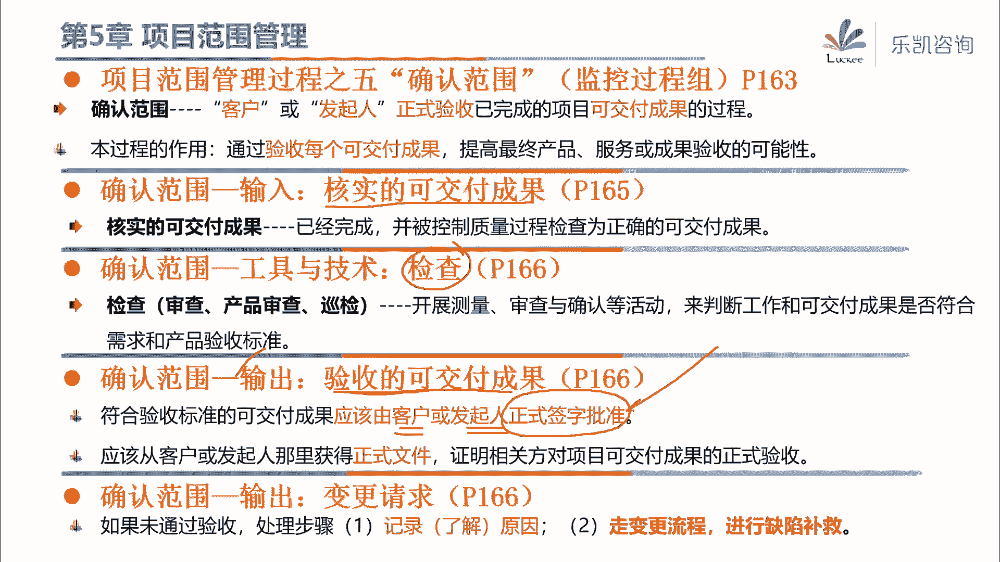
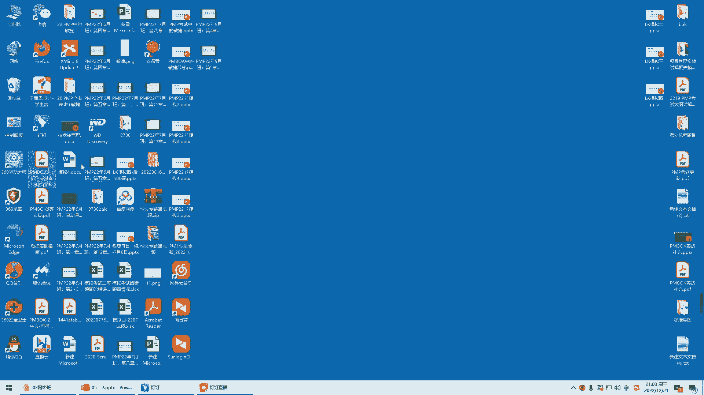
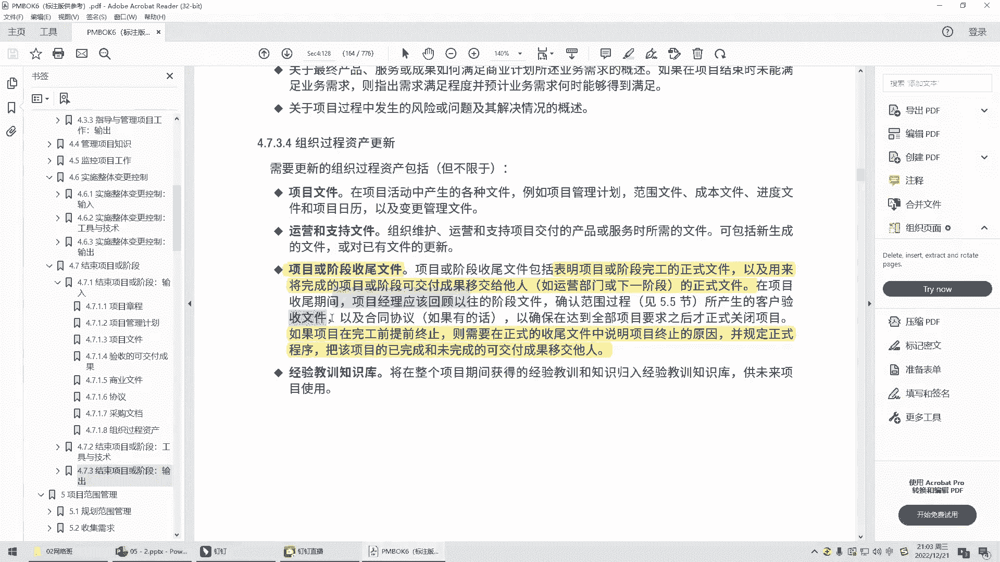
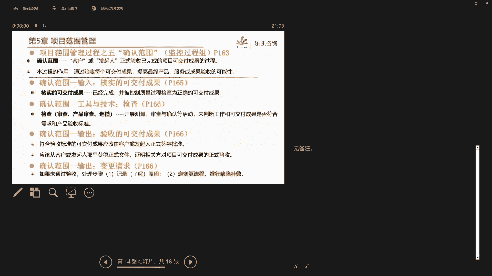
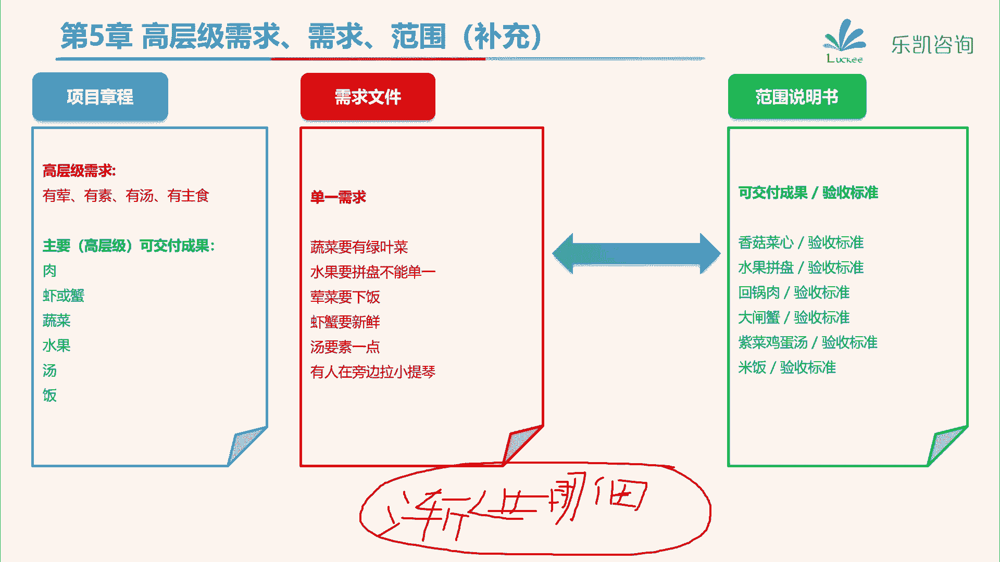

# 2024年PMP认证考试课程针对PMP新考纲最新免费零基础也能轻松听懂 - P7：PMP第5章：项目范围管理（下） - 乐凯咨询 - BV1Rj411G7gs

好各位同学晚上好，今天晚上呢我们学习第五章的下半部分，那么我们在上一节课呢，主要学习的第五章的前两个过程对吧，那么其中第一个过程比较简单，做一些指南型的计划，叫规划范围管理，那么紧接着我们做了收集需求。

我们通过各种各样的工具来收集需求，那么收集需求的目的主要是让项目章程里面，高层级的需求去把它详细的把它列出来对吧，那么我们把所有的单一的需求，把它列在需求文件，那么同时在这个过程。

我们还生成了一份叫需求跟踪矩阵对吧，那么是将来用来跟踪需求的，那么接下来我们看一下接下来的这几个过程，那么我们在上一节课说我们收集的需求啊，并不是全部都要做的，因为我们毕竟项目是有合同约束的。

那么可能有的时候呢收集的一些需求呢，经过我们的分析和判断，我们发现这个需求呢，它是不在合同范围内的对吧，包括有一些需求呢，它是不太正确的，那么我们要对需求文件里面的需求去做一件事，情，做什么事情呢。

要去筛选，就是说究竟哪些需求是我们最终要满足的对吧，那么这个过程就比较重要，这个过程叫定义范围，就是我们要把这个项目的范围给定下来，那么实际上定义范围这个过程呢，啊pm box里面讲的这个作用呢。

我觉得呢还不如他后面讲的这句话重要，他说这个过程实际上就是从需求文件中，我们要选取，要选我们最终会实现哪些需求对吧，然后再制定出关于项目及其产品，服务或成果的详细的描述。

那么也就是说其实这个过程要做两件事，第一件事就是我们要选需求啊，比如说客户说他饿了，他渴了对吧，他空虚了，寂寞了，那么我们这个项目究竟是为了解决他什么需求，把它选出来，然后还有一件事情就是我们要定义好。

将来我们用什么可交付成果来满足，或者说来解决这些需求，对吧好，那么从这句话大家能不能猜得到，既然我们要做这两件事，那么它的输入主要的应该有什么，那么首先第一个我们要选需求，那么我们依据什么来选择。

我们上一节课讲了所有的需求，我们都已经把它调研清楚了，列在一个文件里面，这个文件叫什么呢，叫需求文件对吧，那么你既然要选择需求，肯定要参考我们之前已经做好的需求文件，去选择吗对吧。

所以需求文件是一个非常重要的输入，我们要依据它来选择，那么第二个要注意的就是，我们要做一些可交付成果来满足这些需求，那么这又可以参考什么呢，好那么在前期在我们的项目章程里面，有一些高层级的可交付成果。

这个我们也可以参考，所以说大家要根据这个过程，他做的事情要能够想得到，他有这两个比较重要的输入对吧，那么有了这些东西作为参考作为依据，也就是说我们说的输入，那么接下来怎么去定可交付成果好。

那么这就涉及到它的一些工具了，那么我来说嗯，大家来回答好吧，比如说现在客户有一个需求，他渴了，那么他想喝点东西，那么我们要交付什么呢，我们的方案有很多，我们可以交付他一瓶可乐。

我们可以交付他一瓶雪碧对吧，我们也可以交付他一瓶农夫山泉，这些都是可行的方案，那么我们要去分析在这些备选方案里面，究竟哪一个方案比较符合客户的需求，或者说比较适合我们的项目。

那么大家能想到这是一个什么工具吗，在众多的备选方案当中，我们去分析来选择一个最合适的方案，涉及到什么工具，这个工具我们之前讲过的对吧，很简单，就是字面意思，他叫备选方案分析嘛对吧。

在很多的备选方案里面去选择一个，那么不就是备选方案分析吗对吧，那么假如说你要更好的去完成备选方案分析，我们还可以再细化，用一些更加详细的做法，比如说我们可以从好几个维度来设置权重，来给这些方案打分对吧。

比如说我从成本的角度啊，从这个施工难度的角度对吧，而从这个稳定性的角度，然后设置不同的权重去打风，然后权重乘以得分去算总分好，算出来究竟是a方案好还是b方案好，那么这是一种什么方法。

这就是一个更加具体的叫多标准，决策分析的方法对吧，那么这个方法我们在上节课也讲过，那么再比如如果大家对交付什么可交付成果，意见不一致对吧，我们还可以用一种方法来引导大家达成共识。

那么说到引导相关方之间的差异来达成共识的，那么最典型的就是引导对吧，所以这些工具都是我们之前接触过的，非常简单的工具，那么这个过程呢还有一个工具叫产品分析，这个呢大家稍微了解一下啊，产品分析。

实际上就是把我们的产品做一些分解呀对吧，做一些系统分析或者做一些需求分析，那么大家要知道这样一个概念，大致知道一下好吧，那么主要的还是三个上面的三个方案比较典型，那么这个过程它比较重要的是。

我们最终选择了需求，然后跟客户确定好，我们最终交付什么来满足客户的需求，一定要形成一份文件好，这份文件叫范围说明书，这份文件很重要好吧，那么为什么说它很重要呢，他说项目范围说明书实际上是对项目的范围。

主要可交付成果做了一个描述，在这份说明书里面，他详细描述了项目的可交付成果，它代表了相关方之间就项目范围达成了共识，就最终我们形成了这份文件对吧，那么这份文件里面它包括哪些内容呢。

他说这份文件它包括产品范围描述，也就是说细化了我们项目章程里面的，或者说需求文件里面，说我们成果所需要具备的一些特征对吧，他另外还有一对很重要的，我们这个项目会交付哪些可交付成果。

然后它对应的验收标准又是什么，好大家注意啊，说到可交付成果跟验收标准记在什么地方，我们统一去找项目范围说明书，那么我问个问题啊，对于整个项目来说，在pmp里面有没有说过验收标准，大家一定要注意。

在我们项目管理里面，对于整个项目来说，它只有成功标准和退出标准对吧，那么正儿八经的说到验收标准呢是针对什么的，是针对我们项目中每一个要交付的成果啊，可交付成果它才有对应的验收标准。

所以说在考试中经常问到唉，我想知道我们整个项目要交付哪些可交付成果，它对应的验收标准是什么，那么这一对，一定要到项目范围说明书里面去找好吧，那么另外在项目范围说明书里面。

还会出现一块特殊的内容叫除外责任，那么这里我想问一下大家啊，项目范围说明书不是详细的描述了，我们要做哪些可交付成果吗，那么这个除外责任也就是哪些是不做的，为什么要写在范围说明书里面，有同学知道吗。

我们项目范围说明书的概念是说，哎我们最终要跟客户确定好，用什么可交付成果来满足我们的需求对吧，那么那些不属于我们项目范围的内容，为什么要在里面写一写呢，我们不做的事情太多了对吧好，有人说防止范围蔓延啊。

防止甲方需求增加对吧，呃稍微有点道理啊，我举一个例子呢，可能大家会理解的比较清楚一些，比如说我问一下啊，在我们做项目的过程当中，有没有什么工作是范围的界定上比较模糊的，比如说我举一个例子。

it行业在我们it行业给客户做项目的时候，比如说我给客户做一个网站，那么客户的这个网站呢，它叫它有一个特点啊，他说我们要支持多国语言版本啊，除了中文网站，还有英文网站，对吧好，那么接下来我问一下。

关于这个网站的英文的翻译，你觉得是甲方该提供的还是乙方要做的，对吧，如果这一块啊没有什么地方说的很清楚啊，就说合同里面要做一个网站，然后这个网站呢要支持多国语言版本对吧。

那么多国语言版本肯定涉及到翻译的问题了，那么这个翻译是应该甲方提供的，还是应该乙方去做呢，那么我们有很多同学说这是甲方应该做的对吧，但是你们信不信，如果你不说清楚。

有很多甲方就认为这是你们乙方应该做的呀，对吧，我整个网站都交给你了，你为什么不做啊，你叫我翻译，我也没有人翻译啊对吧，所以这一块就比较模糊对吧好，再比如说我再举个建筑业方面的例子。

我们上一节课讲过原型法，我们说有一个楼盘开盘了，然后呢，售楼处的小姐姐带着大家去看样板房，对吧好，我问一下买过房的同学啊，你看到的样板房里面所有的东西，将来他们都会交付吗，啊有人说我去看了样板房。

哎呦挺漂亮的对吧，他说最终交付就是这样的，那么是不是这个房子里面所有的东西，他都会交付呢，那么买过房的同学一定有经验对吧，什么东西他不交付家具啊对吧，还有一些什么灯啊，什么东西他是不会交付的。

你比如说你看到样板房，唉，这个样板房里面有一张沙发对吧，唉有几张餐餐桌，房间里面有床，这个他交付的时候会交付吗，这个他是不会交付的，对吧啊当然有人说小姐姐也不会交付，嗯啊佩服对吧，考虑问题很全面。

那当然也不会交付，所以你在买房的时候，售楼处的小姐姐也一般会说一句话对吧，而我们最终精装修交付的就是这个样子，当然这里面的家具这些我们是不包含的对吧好，也就是说什么时候我们需要明确除外责任呢。

其实并不是说我们所有不做的都要明确，而是在什么地方，特别是在那些切割面不是很清楚的地方，容易让人引起争议的地方，我们一定要明确说清楚对吧，比如说常见的刚刚我举的例子。

售楼处的小姐姐会说最终精装修交付对吧，那么我们家具是不包含的，他会说一下的对吧，包括我们软件，有的时候在写合同的时候会说，哎我们只提供软件部分对吧，那么服务器交换机我们是不包含的，那么像这些东西啊。

一定要说清楚，因为他比较模糊，或者说客户呢有可能他不太清楚，那么这样做就有助于管理相关方的期望，减少范围蔓延，那么范围蔓延我们后面会讲好吧，所以除外责任，他是这个目的，用我们一句俗话说什么呢。

我这个项目就是我帮你找老婆对吧，但是我不包你生儿子的啊，这些模糊的地方一定要说清楚，我只帮你做什么对吧，其他的我是不包的，好吧好，那么接下来了解了范围说明书之后，我问一下大家，大家对于项目章程。

需求文件和范围说明书之间的关系，有没有搞清楚，我用一个例子啊，来帮大家梳理一下这三者之间的关系，比如说举一个例子，左畅同学笑得很开心对吧，小左同学要做一个项目，有一天他想请我吃顿饭，那么这是项目吧。

这是项目临时的独特的，那么做项目首先要有一个项目章程，好项目章程会怎么写，他会这么写，这个项目高层级的需求，他大致了解了一下，前期嘛从商业文件里面，或者从协议里面了解到好。

那么有高层级的需求是这顿饭要有荤有素，有汤有主食，你看这就是很高层级的需求，很宏观对吧，然后接下来这个项目有哪些高层级的，或者说主要的可交付成果呢，好也明确了，那么要有肉，有虾或蟹，蔬菜水果汤，还有放。

还有饭对吧好，那么这个是项目章程，那么大家要注意项目章程里面有需求，也有可交付成果，但是他们的特点是什么，叫高层级的，或者叫宏观的，很宏观对吧，那么这些东西能够指导我们做项目吗，他指导不了。

所以我们要用一个过程叫收集需求，来把这些需求呢细化好，细化出来的东西放在什么地方，放在需求文件里面对吧，那么怎么细化呢，好什么叫有素呢，好蔬菜要有绿叶菜，什么叫有荤呢，好荤菜要下饭对吧啊，什么叫有汤呢。

汤要素一点对吧，这是小左同学找我调研需求，那么我说出来具体的单一的需求，甚至我还提到，吃饭的时候要有个人在旁边拉小提琴，那么这都是一些具体的需求放在需求文件里面，那么接下来有了需求之后。

我们刚刚讲的定义范围干什么好，他做了两件事，首先第一件事我们要筛选，最终我们会实现哪些需求，比如说小左同学一看，这玩意儿还要拉个小提琴啊，这不在我的项目范围里面啊，那么这个要把它筛选去掉对吧。

那么其他的需求都是符合合同的好，第二点还要做一件事儿，我们要定义好可交付成果来满足这些需求，要跟客户达成共识，形成一份范围说明书，比如说蔬菜要有绿叶菜，那么我用什么可交付成果来满足客户呢。

我要跟他商量唉，香菇菜心行不行，然后香菇菜心我们会达到什么样的验收标准，对吧，哎比如说荤菜要下饭好荤菜，那么我最终交付回锅肉行不行，回锅肉对应的是什么验收标准，把所有的可交付成果和对应的验收标准。

全部都跟客户达成共识，然后写到了范围说明书里面对吧，那么这就从需求具体的明确到了这个项目，我们要交付什么可交付成果，那么接下来我们只要把这些可交付成果，按照验收标准做出来不就好了吗，对吧好。

那么接下来问大家一个问题，那么需求最终会用可交付成果来实现，反过来说，可交付成果，它存在的目的也是为了满足某一个需求，那么你说需求跟可交付成果之间，有没有一些对应的关系啊，肯定有吧。

那么请问这个对应的关系记在什么地方，我把客户的需求细化了，然后我也想到一些可交付成果来对应它，那么这两者之间的对应关系，我们应该把它记在什么地方，好小李同学说得非常好，就是我们上一节课讲的一个东西。

我们可以从需求链接到可交付成果做正向跟踪，我们也可以从可相互成果去看一看，他为了缓和符合什么需求做逆向跟踪对吧，那么用这个东西我们可以全过程来跟踪需求，确保每一个需求都有价值。

确保每一个需求都得以实现对吧，这个东西叫需求跟踪矩阵，就是我们上一节课要讲的内容对吧好，那么经过这一节课，我们筛选了需求，那么很明显这个过程大家有兴趣可以看一看书，在这个过程也会更新最终的需求文件。

更新我们的需求跟踪矩阵，需要需求跟踪矩阵，好吧好，那么这个过程就是定义范围，定义范围的目的，就是把这些可交付成果跟客户最终定下来，形成一份书面的文件，叫范围说明书，那么接下来怎么办呢。

接下来我们要考虑的是什么，我们要考虑的就是这些可交付成功，那么接下来怎么做了，那么在实际做项目的时候，大家会发现啊，这些可交付成果啊，不是哪一个人，或者甚至不是哪一个团队能做出来的，它可能很大很复杂。

那么接下来呢这些东西如果你要说怎么做呢，感觉颗粒度还是太大，无从下手啊，那么这个时候怎么办呢，好那么问大家一个问题，我房子装修好了，我想买一个衣柜，这个衣柜呢很大，已经送到楼底下了，我发现了。

直接从电梯搬上去呢，这个电梯放不下对吧，那么对于这个很大的，你一次性很难把它解决的东西，我们应该怎么样去处理呢，好马上有同学想到了说，你既然一口气不能够把它做出来吗，你这样吧。

你把这个衣柜呢把它分成好几块对吧，哎把它拆分拆分，然后你把每一块都把它搬到家里去，是不是，那么每一块搬到家里去之后再把它拼起来，最终做一个整合不就好了吗对吧。

所以接下来在qq box里面介绍了这样一个过程，叫创建w bs好，首先说一下什么叫w b s，w bs叫工作分解结构，work breakdown structure对吧，那么什么叫创建工作分解结构呢。

他说那么就是把可交付成果和项目工作，分解成较小的，更易于管理的组件，就你一下子搞不出来，那么你就把它分一分对吧，分到颗粒度小一点，那么可以由一个小组把它做出来不就好了吗，对吧好。

那么接下来首先用一个例子来跟大家讲解一下，这个过程，其实这个过程很简单好吧，就拿我们刚刚举的这个例子来说，小左同学想请我吃饭，他收集了需求，定义了范围，形成了范围说明书对吧，那么范围说明书里面就明确了。

我们这个项目要交付什么，可交付成果，好像刚刚说的香菇菜心水果回锅肉，大闸蟹，紫菜鸡蛋汤米饭对吧，好，大家注意，有一个东西我们刚刚没说，这个东西叫项目管理，还有同学说为什么会多这一块啊，好注意。

看我们刚刚讲的定义，我们除了把可交付成果分解以外，把项目的工作也要分解，那么大家想一想，我们做项目肯定会涉及到做一些计划了，肯定要开一些会议了，那么这些算不算我们项目范围的一部分呢，那当然也算啊。

所以大家要注意，项目管理工作也算是我们工作的一部分好吧，那么除了可交付成果以外，我们项目工作也要把它分解好，那么接下来怎么去分解，很简单，我们从上往下逐层分解，比如说举一个例子，香菇菜心。

我感觉这个可交付成果太大了，不太好处理，我可以怎么分解，我就把它分解成一个小组负责去搞香菇，一个小组负责到地里面去挖菜，搞菜心对吧，那么最终整合起来不就形成了香菇菜心吗，对吧好，再比如说回锅肉。

这个可交付成果也很大呀，工作量太大，那么怎么处理呢，好这样，我让一个小组负责回锅肉所需的配菜对吧，我让另一个小组来负责所需的肉，那么这个时候呢负责配菜的小组又说了，这个回锅肉的配菜也很多呀。

工作量也很大，那怎么办呢，好如果你觉得分的还不够细，那么你可以把配菜再封，配菜有哪些好，有人要去地里面搞蒜叶子，有人要去市场上，因为家里没有种对吧，要去菜市场买青椒好，那么有的蒜叶子有了青椒。

配菜也就有了对吧，所以说其实呢我们只要把颗粒度很大的，把它去分解就可以了，那么接下来问大家两个问题啊，第一个问题，不同的可交付成果所需要分解的程度，你们觉得相同吗，哎大家考虑一下这个问题。

不同的可交付成果它能够分解多少层，或者说它需要分解到多少层，它相同吗，那么你会发现不同的可交付成果，实际上可以分解到不同的层次对吧，你比如说回锅肉，这个就比较复杂一点，可能要多分几层对吧。

你再比如说大闸蟹，大闸蟹这个东西有啥好分的，买回来之后往锅上一放一蒸就好了，这个东西就比较方便对吧好，那么这是第一个，那么第二个我想问一下大家，你觉得每一个可交付成果应该差不多分几层，可以分得清楚。

这是我们有很多同学问我的一个问题，他说我明白你这个过程的意思对吧啊，就是把它封了，但是老师你觉得这个东西应该分几层呢，在实际做项目的时候对吧，比如说我们一个系统应该分多少层呢。

好那么在这里我想跟大家说一下啊，其实分多少层不重要好吧，我们后面会讲一个建议，建议分多少层，但是在我实际做项目的时候，我跟大家说啊，我有一个原则，我是这么分的，大家可以参考，就是分解到什么程度呢。

分解到你这个东西啊，可以由单独的一个小组，但因为个人不一定对吧，他毕竟还是一个可交付成果，那么你最起码要保证他能够有一个单独的小组，能够把它负责掉，那么为什么我有这样一个要求呢。

因为如果你觉得这个东西一个小组做不了，还需要多个小组一起去做，那么这个呢就不太恰当，因为到最后呢谁负责，你会搞得很不清楚对吧，所以我建议能够把它分到什么呢，哎单独的这个小组他能够把它处理掉就可以了。

明白这个意思吧，其实具体分几层呢，这个呢看实际的情况好吧，看实际的情况好，那么分好了之后，为了后面便于描述，或者为了后面便于把这些东西分配给，不同的小组，不同的城市来负责，我们可以给他一个编号。

比如说这个整个项目我把它编号是一，那么它下面包含的可交互组合，就是1。11。2，1。3对吧，那么1。3回锅肉再封，就是1。3。11。3。2，好再分，就是1。3。1。1，1。3。1。2。

那么这个编码呢大家可以根据自己的习惯，自己去分配这个编码，好吧好，那么这个过程其实就是创建这样一个，层级型的工作分解结构，那么我们看一下p p里面他怎么说的好，他说创建w b s。

就是把可交付成果跟项目工作分解，分解成较小的，根据管理的组件好，然后他说w bs也就是工作分解结构，组织并定义了项目的总范围，好那么我们经常有同学说，那么刚刚我们讲的范围，说明书不也定义了范围吗。

为什么强调wb s组织，并定义了项目的总范围呢，好说到组织大家想到什么，比如说我们的公司就是一个组织对吧，比如说有组织的犯罪，这个犯罪团伙也是个组织，说到组织你又想到什么呢。

你就想到这里面的人好像是有一些层次的，有层级关系的对吧，哎是有结构的，所以说呢你看这个东西，这个东西就是一个有组织的对吧，而且定义的项目的总范围，所以一般说谁组织并定义了项目的总范围呢。

我们一般选择这样一种层级结构，w b s好，接下来另外还有一个比较重要的地方，他说wb是分解到最底层，分解到最底层的部分叫什么呢，就叫工作包，它的名字叫工作包好，那么我问一下。

你们觉得分解到最底层的东西，它本质上是个什么东西啊，有个别同学想不明白风起到最底层的是什么，好我就问了他一个问题，我说有一块大的玻璃，你想搬到家里去，搬不进去，你用砖头一砸把它砸碎了对吧。

然后再一点一点的搬家里去，那么我问你砸碎的东西是什么东西呢，好他说砸碎的东西也叫玻璃啊，那么砸碎的玻璃跟那整块玻璃是什么关系，其实很简单，这个东西叫什么，其实跟他一样，也叫可交付成果，那么区别在于什么。

我们用一个词来说啊，其实区别就是这个区别，就是最底层的这个可交付成果啊，它的颗粒度，怎么样呢，它的颗粒度更小，对吧或者说它更碎，因为你把它分解了吗，那么分解了它也叫可交付成果，只不过它颗粒度太小了对吧。

唉是将来交给每一个小组去负责的，所以说大家要注意工作包，其实它的本质是一个名词，它也是可交付成果，好吧好，然后接下来我们怎么样来做这个过程，它的输入应该有什么好，大家想一想啊。

我们这个过程是把可交付成果分解成工作包的，那么请问他的输入我们要参考什么，讲义上没写对吧，没写是因为太简单了，那么大家要能够想得到，这个过程输入应该有什么呀，好杨立恒马上说了，要有范围说明书。

因为可交付成果你去哪儿找，在我们刚刚跟客户定义好的范围说明书里面，对吧，你把范围说明书里面的可交付成果，往这一列不就好了吗，然后你去分解嘛对吧，所以它的输入一定有范围说明书，当然还有一些其他的输入。

比如说需求文件，大家可以参考一下，那么接下来怎么做呢，它的工具就叫分解啊，我们就是把可交付成果逐步分解为工作包，这样一个过程，那么p m p里面也讲了，他怎么分解，关于这块内容呢，大家了解一下就行了啊。

他说首先第一步我们从范围说，说明书里面去识别和分析，我们要交付哪些可交付成果和相关的工作，那么接下来确定一下w bs的结构，唉我们是用树形结构还是怎么说对吧，那么有的时候呢不一定用树形结构。

有的时候是用这种结构的，比如说那这个可消化成果分解啊，再分解对吧好，然后接下来再来分解里面可以再分解多少级，对吧好，我问一下有没有同学见过这一块，在我们做项目管理里面有一个软件叫project。

打开project，你会发现左边的这一块，实际上它就是在干什么呢，逐层分解右边它会有对应的什么呢，甘特图在这一边好吧，那么我们在讲第六章的时候，我会演示一下这个工具好吧，所以说它的编排方法。

结构和编排方法多种多样都可以好，然后接下来他说自上而下逐层分解，分解好了之后，分配标志码啊，就是分配编码，你怎么随便定义一个编码，这样去分配好，然后在核实它分解的是否恰当啊，就做了这么个事情对吧好。

然后他说分解呢还可以这样分啊，我们刚刚讲的这种是把可交付成果，放在第二层去组成分解对吧，然后他说我们还可以有其他的做法，比如说我们把项目生命周期的阶段，放在第二层啊，比如说吃饭这个项目对吧。

我可以按照阶段分成，买菜阶段对吧好，然后接下来切配阶段，然后接下来烹饪阶段对吧，然后接下来装盘啊，阶段对吧啊，包括最后的用餐阶段，然后接下来买菜阶段，再看买菜我要买哪些可交付成果。

那么这个时候他就是把阶段放在第二层，然后可交付成果放在第三层，然后再去分解可交付成果，得到工作包好吧，那么这两种方法都可以，他还说如果有一些东西是我们需要外包的，由供应商做的。

那么供应商的工作也要把它纳入到我们的wbs，来，保证整个项目是完整的好吧，那么这些东西呢大家呢稍微了解一下，考试呢涉及的很少，他这里面只是详细的去说明了啊，我们怎么去组成分解好。

然后接下来分解完了之后带来一个问题，我们刚刚说分解了形成这样一个层级结构，那么将来我们每一个工作包，都要交给一个小组去负责了，那么这个小组观看这个层级结构是不够的呀，好那怎么办呢，这样青椒啊。

我用一份文件详细描述一下，这个可交付成果清缴，也就是编号是1。3。1。2，他应该由哪个小组负责对吧，应该做到什么样的一个标准，然后他可能需要多少费用，需要在多少时间之内做完对吧，它的质量要求是什么。

好有一块很详细的描述，那么同样的蒜叶子也是某个小组负责的，那么算叶子也有一张纸了，1。3。1。1来描述算叶子怎么怎么样对吧，那么其他的菜心也有，包括上一层的配菜，应该也有一个更高层级的小组。

来负责整个的配菜对吧，好这些东西每一个都有一张纸来描述，那么这些值把它装订在一起，有点像什么，有点像一个带编码的什么东西呢，有点像词典，那么将来每一个小组，如果想了解他具体的详细的内容。

比如说哎我想知道这个1。5。2，鸡蛋应该做到什么程度，我就到这个词典里面去翻，翻到1。5。2，那么这里面就有很详细的工作的描述啊，哪个小组负责进度，什么要求，需要什么资源，成本大概是多少对吧。

包括验收标准他都会说的很清楚明白吧，那么这个所有的装订在一起的就叫wbs词典，它是用来配合解释这样一个层级结构的，好吧好，那么p p里面还说了，他说创建w bs要注意这些地方，敏捷里面我们后面会讲啊。

这个先不要看好，他，说不同的可交付成果可以分解到不同的层次，对吧，这个要注意的，我们刚刚讲过的，那么另外分解的时候并不是分得越细越好，因为如果你分得越细，会造成什么，会造成管理的成本太高。

数据汇总也比较困难对吧，你分的太细不是一个好事，恰当就好了，那么另外他还提到一个概念，他说有一些可交付成果啊，有可能现在呢信息还不太明确对吧，只能分解到某个层次，那么这种可交付成果怎么办。

你只能先放一放，等后面明确了之后再去分解，那么这个暂时放一放的叫什么呢，比如说在我们这个例子里面，好举一个例子，回锅肉分解到配菜和肉好，这个时候呢客户说哎呀这个回锅肉啊，老是那些配菜吃腻了，我想换一换。

那么小丑同学说可以啊，那么你要换什么配菜呢，用什么配菜炒呢，我说这样吧，我暂时还没想好，等我想好了之后再说吧，那么如果出现这种情况，客户说有些东西还需要考虑考虑还没定下来，那怎么办，那么就临时放一放。

那么这个东西分的不上不下的，你说它叫什么呢，它又不是可消化成果，又不叫工作包，那么这个东西它怎么样呢，它有待，进一步，规划对吧，或者有待进一步细化的，那么这个我们暂时放一放的。

我们把它叫规划保规划宝好吧，那么这是我们创建w b s里面的，p m p里面讲的几个注意点，另外他还说我们有这么几个原则啊，这几个原则的有两个是考试考的比较多，也是我们必须遵守的啊，我先把这两个讲一讲。

第一个原则叫百分之百原则，那么什么叫百分百原则呢，就是你分解好了之后，从上往下逐层汇总，你要正好得到这个项目不能有多的，也不能有少的，那么这个叫百分之百原则，就是不要多不要少，那么这也符合我们。

范围一开始讲的那句话叫什么呢，叫all and功能，对吧，不要多不要少，正正好好，就这么多对吧，比如说举一个例子啊，你们觉得我现在画的这个图，这个例子它符不符合百分之百原则，其实严格的来说啊。

它是不符合的，那么为什么不符合呢，比如说你看蒜叶子和青椒能不能得到配菜，能得到配菜，但是配菜和肉放在一起能变成回锅肉吗，你缺了些东西啊，它不能变成回锅肉对吧，你比如说你缺了什么调料，对吧。

你配菜和肉放在一起不可能直接变成回锅肉的，你调料要有吧对吧，比如调料里面还可以再分分成什么什么什么，对吧好，然后接下来除了配菜，除了肉，除了调料，还有还有一些工作要做什么工作，对了。

有人说的还需要别人去炒嘛，但是注意啊，我们说w bs里面它都是名词，要么分解的是可交付成果，要么分解的是工作，所以我们不要用炒这种动词，我们可以用这种工作叫烹饪工作对吧，还需要做一些烹饪工作。

当然有同学说的还需要一些厨具等等，那么大家理解这个意思就好对吧，总之从下往上去汇总，我们去检查，既没有多的，也没有少的，要符合百分之百原则，避免工作的遗漏，对吧好，另外还有一个原则是必须要遵守的。

叫责任要明确，那么什么叫责任要明确呢，就是我刚刚说的，我们要求w bs里面每一个工作包都要续有，都要具有唯一的责任人物，好，大家知道为什么我们强调，必须有唯一的责任人吗，在我们做项目管理的时候。

有两种情况都不能接受，一种情况就是没人负责，那么没人负责的东西肯定做不好对吧好，第二种情况呢就是有多人负责，或者有多个小组负责，那么有多个小组来负责呢，也他妈做不好对吧。

那到最后呢也不知道究竟是谁的责任，你推我我推你，所以说这边我们要求什么，就是每一个工作包要有唯一的小组对吧，那么这边责任唯一不一定是个人啊，唯一的小组来负责，那么这个责任人就是明确道诶。

我们这个工作包有哪个小组最终来负责，出了问题我就找他对吧好，另外还有两个原则是建议的啊，一个叫80小时原则，这个是建议的，就是说我们建议工作包啊，工作包我们不是交给某个小组去负责吗。

我们建议这个小组做这个工作包啊，不要超过80个小时，也就是两周的时间不要超过两周，如果超过两周说明什么呢，说明这个工作包其实工作量还是比较大的，我们就建议再分一分好吧，那么另外的一个建议呢。

就是我们的w b s建议呢是4~6层好吧，那么这两个只是一个建议啊，大家呢可以稍微了解一下，其实有一些行业啊，他可能做的东西比较庞大，4~6层的是肯定不可行的，比如说在几年前。

我到这个一家公司做这个正职管理，就是范进城这一块的这个培训，这家公司呢很特殊，他是做什么的呢，他是坐飞机的，对吧，他们有一个这个园区，在我们上海紫竹这边，叫商飞嘛，商飞坐飞机的。

当时我就给他们培训这一块，你说人家一个坐飞机的，我看了一下他们的w p s，我靠怎么可能4~6成啊对吧，他们的这个成绩很多的，所以说这边呢只是一个建议啊，只是一个建议，明白吧，建议80小时。

建议呢分到4~6层，而不是强制要求的好，那么这个过程做完了之后得到了什么，这个过程做完了之后，很明显一个得到了w bs这样一个层级结构，对吧，另外还得到什么呢。

还得到我们刚刚说的w bs词典这样一个东西，所以说大家注意，我接下来要说的话，这个过程，实际上本质只输出了wb和wb的词典，明白吧，这个过程，它本质上实际上只输出了wb和wb词典。

那么另外我们刚刚在定义范围的时候，还输出了范围说明书，对吧好，那么把这三个东西打包在一起获得批准，就形成了我们范围方面的基准，就明确了我们整个项目的范围是什么对吧，那有范围说明书，如果你要颗粒度很细的。

有什么由w bs和w bs指令，那么他们一起打包获得批准，就形成了范围基准，那么接下来有两个问题需要大家考虑的，第一个问题，范围基准由谁来批准，有同学知道吗，范围基准应该由谁来批准。

那么这个问题就要就要想一想啊，范围基准它属于项目管理计划的一部分吧，唉我们说项目管理计划，就包括或一些子计划和基准，那么范围基准，肯定是属于项目管理计划的一部分了，那么项目管理计划谁批准呢。

项目管理计划是由相关方批准的，那么范围基准你说二谁批准，当然也应该由相关方来批准，注意啊，范围基准由于它是项目管理计划的一部分，所以它仍然是由关键相关方，或者主要的相关方来批准。

那么这里我想问一个问题啊，我们说最终我们所有的计划和基准，会整合成一份综合的项目管理计划，开kick off会议对吧，那么大家想一想，那么我们现在先做出一个范围基准，是现在就获得批准呢。

还是等到k客户会议的时候一起去获得批准，我们虽然先学了制定项目管理计划对吧，但是我们说那个是整合的，规划的尾巴上做的对吧，那么一开始规划我们做的肯定是收集收集需求，定义范围，创建w b s。

然后形成范围基准了，那么是现在就让他p呢，还是在k客服会议的时候再让他p，那么这就回答了，我们有个别同学在微信上问我的一个问题，我们有同学说，老师你说在规划的尾巴上开一个keoff会议。

来一致认可这份项目管理计划，那么如果开会的时候别人不认可怎么办呢，对吧你说短短的开个黑客户不也就认可了吗，好实际上他是这么做的啊，你想一想范围基准，如果现在不批，你根据这个范围去做后面的进度啊。

做成本啊，对吧等等等，你都做完了，开ktv会议的时候，客户说不对呀，你这个范围基准不是我们之前讨论的呀，有问题啊，好一旦你范围错了，会导致什么后果，你后面的进度安排，你后面的成本全他妈错了对吧。

所以说正确的方法应该是什么范围，基准定下来之后先获得批准对吧，然后接下来根据批准的范围再去规划进度，好进度批了之后再去规划成本，其实这些东西都要陆陆续续获得批准好，然后在最终开k off会议的时候。

大家有没有感觉就比较顺利一些对吧，而最终开个t cf，我们一起再过一项综合的这一份项目管理计划，好，没问题了，我们就撩起袖子开干进入执行是吧，所以说一般来说啊，我们这个范围基准应该也是。

现在先得到批准的好，那么在考试的时候在这一块啊，经常考一个问题，经常考可交付成果和验收标准去哪儿找，好大家注意啊，这两天在群里面有同学问的问题，就犯了这个错误，类似的错误我要说一下的，如果问你。

我要找可交付成果和验收标准，最佳答案是什么，最佳答案是范围说明书，因为这里面有颗粒度合适的可交付成果，有它对应的验收标准，这是最佳答案好吧，所以如果他这么问，最佳答案就是范围说明书。

那么如果选项中没有范围说明书怎么办好，我们可以退而求其次，选什么呢，选这个东西，wb是直连，对吧，那么wb是词典里面就包括了颗粒度更小的，可交付成果，也包括了对应的验收标准，这个可以选。

但是他问题是什么呢，它太碎了，靠力度太细了对吧，那么自选可以选它，那么如果这两个都没有，你在选择范围基范围基准好吧，那么我说一下，我们有部分同学啊容易犯一个什么错误呢，他觉得我应该选范围基准。

为什么他说那范围基准包括了范围说明书，包括了w bs词典，甚至还包括w bs，选一个大的不就好了吗，大家注意啊，我们在选择的时候，不是说选大的，而是要选择什么最恰当的，比如说我举一个例子，赵祖的同学。

你是哪里人，那么小赵同学听到这个答案，他一定会回答我啊，我是上海的啊，我是北京的，或者我是重庆的对吧，如果说他回答我，我是个地球人，你觉得我会满意吗，我感觉你在侮辱我的智商，对不对。

你跟我说回答地球人有什么有什么意义呢对吧，所以选不是说选大的，要选一个比较恰当的，对不对，好那么再比如如果有一天我们科技进步了，我们可以做星际旅行了，一堆外星人跟小赵同学坐在一起对吧啊。

有来自这个土星的，有来自这个火星的对吧，还有来自地球的小赵同学，结果有一个火星人问他，诶，哥们儿，你哪儿来的呀，这个时候你回答我是成都的就不合适了对吧，这个时候你反而应该回答我是地球的。

所以说其实我们选择不是说要想要选一个大的，还是选一个小的，要根据问题选一个最恰当的一个好吧，那么这一块要注意了好，那么这个过程呢，有一个东西呢在pm报告里面提到过，但是考试呢几乎没有怎么考。

他提到一个概念啊，叫控制账户，那么关于这个东西呢，我大致介绍一下啊，什么叫控制账户呢，控制账户就是在我们的w bs里面，选择了一个控制点，那么这个控制点它一般在什么地方，一般在可交付成果这一层以下。

在工作包这一层以上，我们选择了一个控制点，那么为什么要选择这样一个控制点呢，对于大型项目来说，项目经理管不到这个层次啊，比如说有的项目体量很大，小组有很多，而且还包括了很多的分包对吧。

那么项目经理管不到这么细的一个城市，那么项目经理管什么好，项目经理说细节，这个我就不管了，由你们各自的小组负责，那么我就看一看这个方面的，比如说整个这个环节的，它的一个整体的绩效怎么样啊。

比如说你的整个的一个进度怎么样，整体的一个成本有没有什么偏差对吧，那么如果说项目经理在管理的时候发觉诶，这样管好像项目失控了，没有管好，那怎么办，那么我们可以把这个点呢往下移，比如说移到这个层次。

那么它就能够管得更细一些对吧，所以说这个控制账户他的意义是什么，就是我们看在哪一个点来考虑项目的绩效，那么通过这个节点上移或者下移，来实现我们的粗放管理或者精细管理好吧。

那么这个呢稍微了解一下就行了好吧，有这样一个东西好，那么这个过程是我们的创建wb，那么范围的规划到这里就结束了，我们下个星期会讲继续把工作包再分分成活动，怎么去排进度，好吧好，那么接下来还有两个过程。

它不属于规划过程中，它属于监控过程中，好我们首先看这个过程叫确认范围，好这个过程大家一定要仔细听，第一它比较重要，第二个容易错，首先我说一下啊，确认范围，这个翻译翻得很不好，我们有很多同学说。

确认范围就是把范围跟客户做个确认吧，其实不是这个意思，跟客户把范围定下来的，叫定义范围，那么确认范围是什么意思呢，好我把它的英文原文写一下啊，大家就了解了它的英文原文叫validate scope。

他的英文啊叫validate scope，实际上我觉得应该翻译成什么呢，应该翻译成叫验证对吧，或运输也可以对吧，你搞个确认的，这个容易产生歧义啊，其实我觉得应该叫验证或者叫验收范围对吧好。

那么接下来注意看他的解释啊，他的解释倒是解释的很清楚，他说这个过程就是由客户或者发起人干什么呢，正式验收我们完成的可交付成果，他是验收可交付成果的对吧，那么我们在第四章讲了一个叫收尾的过程。

我们说收尾是做一个形式验收，那么真正的实际的验收是什么呢，就是这个过程验收每一个可交付成果，那么它的作用是什么，他说我通过验收每个可交付成果来提高什么，来提高最终项目验收的可能性。

也就是说这个过程是为了保障谁的呢，是为了保障最终的收尾的这个过程的好，那么接下来大家注意听我画了一张图，把我们已经学习学习的这几个过程，帮大家呢串一串好吧，那么我相信很多同学听了之后应该会很有收获。

好我们来看这张图，对于我们整个项目来说，在项目刚启动的时候，我们首先确定了项目章程，由发起人发布了对吧，那么这个项目章程里面有需求，有可交付成果，但是它都是叫高层级的，颗粒度很大，很宏观。

不能指导我们执行对吧好，那么为了能够顺利的我们实施这个项目，交付给客户，相应的可交付成果，我们首先把项目章程里面，高层级的需求做了一个细化，细化成了单一的需求对吧，那么这个过程叫收集需求。

把需求细化成一条一条的具体的单一的需求好，然后接下来我们对需求进行了筛选对吧，然后接下来又确定了，用什么可交付成果来满足这个需求，那么这个过程就是我们今天讲的叫定义范围，把可交付成果定下来。

验收标准说清楚对吧，然后把它写进范围说明书里面，跟客户跟相关方达成共识对吧，当然我们后面还做了很多其他的工作，直到我们规划的尾巴上开了k off，把项目管理计划一致获得了批准，好在执行的时候。

我们学过一个过程指导与管理项目工作，这个过程就把我们当初定好的可交付成果，怎么样，一个一个都把它给做出来了对吧，所以这个过程指导与管理项目工作，他就输出了我们的可交付成果好，那么大家还记得。

可交付成果应该具有什么特点吗，可交付成果应该具有什么特点，我们说可交付成果是独特的，并且可核实的对吧，那么也就是说我们做出来之后啊，并不是直接交给客户的，我们要做一件事情叫可核实，那么什么叫核实呢。

也就是说我们内部啊，一般有一些质检部门要做qc控制质量，比如说做什么事情呢，我们内部要做检查对吧，比如说我们制造业要检查要抽检，比如说我们it行业要做测试对吧，通过检查和测试来核实这些可交付成果。

那么如果这些可交付成果质量是没问题的，那么就变成了核实的可交付成果，好这一块我们还没讲，这一块会在第八章讲质量的时候去讲，对吧，那么总之第八章我们会讲可交付成果，通过这样一个过程，qc或者叫控制质量。

把它输出变成核实的可交付成果好，如果说可交付成果核实了没问题了，接下来怎么办，接下来才能够交给客户或者发起人去验收，那么验收就是我们现在讲的这个过程，叫确认范围，对吧，那么确认范围。

就是把核实的可交付成果拿过来验收，变成一个一个验收的可交付成果对吧，所以这个过程才是真正的实际的验收，把每一个可交付成果，我们都认为质量是合格的，交给客户或发起人去验收好，验收完了之后，接下来干什么。

我们进入整合，最终把它整合成最终的产品服务或成果，就是我们讲的结束项目或阶段，来验收整个项目对吧，那么整个项目符合成功标准或者退出标准，那么这个项目就收尾输掉好吧，所以整个一个过程实际上我们学到的啊。

现在我们学到这些过程，除了质量以外，其他的我们是都可以串的起来的对吧，从章程细化到需求，然后形成范围说明书，然后最终执行的时候把可交付成果做出来对吧，然后通过qc到确认范围，最终整个项目收尾收掉。

那么从这张图大家也会看得出来啊，确认范围这个过程它的输入应该有什么，你会发现确认范围的输入应该有它呀，对吧，有合适的可交付成果啊，它的输出是什么呢，它的输出应该是他呀验收的可交付成果啊，对吧好。

所以你看p mp里面这个过程，其实这样看就很清楚了，输入核实的可交付成果对吧好，然后交给客户或者发起了演说，输出了什么，通过这个过程，我们得到了验收的可交付成果对吧，那么用的工具很简单。

就是这些人根据验收标准，因为每一个可交付成本不都有验收标准吗，根据验收标准对它进行检查，是不是符合验收标准，那么符合验收标准就验收掉，对吧好，然后他说验收的可交付成果。

应该由客户或者发起人正式签字批准好，我问一下，为什么这边强调正式签字批准，每一个可交付成果的验收，我们都需要有正式的签字批准，为什么，还有人说为了便于后续要钱对吧，用来用来避免以后不不承认对吧。

其实也就是工作要留痕嘛对吧，也有这样一个书面的东西吗，好大家说的有没有道理，有道理对吧，但是还有一个作用，好有一个同学说出来了，这个同学姓什么，姓敖是吧，敖学德，包括我们赵祖的同学也说出来了啊。

还有一个作用是什么，大家还记不记得收尾的时候是要做形式验收的，那么你收尾的时候，那些专家做形式验收的时候看什么，他不会跑到你，其实很少跑到你现场，说哎你把这个设备运行一遍，让我看一看对吧。

这这不太常见对吧，那么他们形式演出他们用的是什么，其实就是看这些每一个可交付成果，你当初有没有获得正式的签字批准对吧，也就是说其实这些东西在最终收尾的时候，形式验收的时候也是需要的。

那么关于这一点呢，在pmbok里面它的细节上也有一些体现，好吧，当然这个不是重点啊，我可以带大家带大家来看一下。

我们看一下我们第四章在讲收尾的时候啊，结束项目或阶段，他说在收尾期间，那在项目收尾期间，项目具体应该回顾什么文件呢，好要回顾这个文件确认范围过程所产生的，客户的验收文件。

因为收尾的时候形式验收是需要的对吧。

那么这里面呢，有同学会问一个另外一个细节的问题。

他说那么确认范围，这句话为什么是客户或者发起人验收呢，那么这句话的意思呢实际上是这样的，我们做项目呢，其实大部分项目是对外的，要跟客户签合同的，那么对于这种对外的项目应该由谁验收呢，很明显客户验收对吧。

但是我们也有一些项目是我们公司内部做的，内部立项的一些项目，那么这些项目一般是由谁验收的，就是发起人去验收好吧，这个其实很简单好，那么这个是可交付成果通过验收了，那么我们可以得到验收的，可交付成果。

由他们来签字批准对吧，那么万一在验收的时候发现有问题，那怎么办，诶这个口腔是我没有获得验收好，那么他说首先第一步我们要记录或者了解，要记住原因，了解原因，然后接下来确实有问题的，我们要走变更流程。

做缺陷补救或者做一些纠正都可以好吧，那么这个比较简单，大家记住，有问题先查原因，然后再走变更就可以了，那么这个过程就是确认范围的过程好，那么大家能不能体会为什么这个过程很重要。

因为这个过程它保障了哪个哪个确认范围，他的之所以重要，是因为他给最终的形式验收，也就是给最终的收尾提供了保证对吧，尽量做到如果有问题在什么地方发现，在这个时候发现。

而不要等到最终验收的时候再去出问题对吧，它保障了收尾好吧，这是这个过程最大的一个作用，通过验收每个可交付成果来保障收尾好，那么这是确认范围这个过程，那么范围里面还有一个控制过程叫控制范围。

那么大家要注意每一个过程它的意思是什么，一定要注意的好吧，那么什么叫控制范围呢，我们之前不是定义好了范围基准吗，这个项目要做什么对吧，那么最终做出来之后要去验收，那么在做的过程中，我们要保证一件事情啊。

什么事情呢不要多做，也不要少做对吧，就是我全过程要看诶，你做的东西是不是属于我们的范围基准，如果是的，你就做，如果不是的，就不要做对吧，那么最终也要看一看，不要多也不要少，这个过程就叫控制范围。

它是用来确保整个期间对范围基准进行维护的，那么如果说你一定要多做，哎我发现你有一个东西啊不属于基准，但是你在做，如果你一定要做怎么办好，一旦我发现了这个问题，我就要跟另外一个过程结合起来处理。

叫实施整体变更控制，就是说你如果要多做或者要少做，必须要怎么样，必须要走变更对吧，所以这个过程你既然要控制范围，不要多，不要少，它的输入肯定有我们的项目管理计划，特别是里面的范围基准对吧好。

另外它的工具也很明显，我们要把实际的工作跟我们的范围基准去比较，去看有没有偏差，所以它会涉及到偏差分析对吧，那么偏差分析就是把我们的实际跟基准去比较，好看一看，如果说不行的话，就要走变更。

那么这个东西呢其实很简单啊，了解了就行，那么这里呢有一个词，我说一下，在这边讲偏差分析的时候，他提到一个词，他说如果有偏差，我们要看是否处于临界值区间，意思就是说如果在临界值以内，那么就不要采取措施。

如果超出这个临界值，那么就需要采取措施好，那么大家能不能体会什么叫做临界值啊，什么叫临界值，有这样一种感觉吗，好我举一个例子啊，比如说马恒同学现在有一个项目交给你好吧。

这个项目呢是给客户做一个很大型的信息化项，目，也是某个政府部门的对吧，那么这个项目很大啊，像我们一般做的这个信息化的项目，大的有1000多万，1200万好吧，比如说1200万体量的项目。

马恒同学是项目经理好，今天呢马恒同学下班的时候遇到了甲方的领导，遇到了我，我说唉马经理，我有一些文件要拷给你，你去参考一下对吧，但是呢我这边呢好像没有这个移动硬盘，这个马经理。

你能不能明天带两个移动硬盘过来呀，马航同学一听，我们的项目合同里面没有移动硬盘了对吧，你叫我带两个移动硬盘，这不行好马衡马上说我学了pmp对吧，这两个移动硬盘超出了范围，所以我要你填一个变更单。

走变更流程，我们上会讨论一下，如果没有问题了，批准了之后，那么接下来我去买两个移动硬盘给你好，请问马航同学会不会这么做，很明显不会嘛对吧，我刚刚问能不能提供移动硬盘的时候，马上就马上说了，可以啊。

没问题啊，哎为什么他不走变更呢，大家要注意啊，说我们学了p m p超出范围就要走变更流程啊，靠移动硬盘，一般的就100多，两个就200块钱，你自己买两个移动硬盘，然后走你们公司的报销流程。

报销掉不就好了吗对吧，所以马航同学说哎呀这个不要走变更啊，明天我就带给你就行了是吧，好到了明天马航同学给了我两个移动硬盘，明天下班的时候呢，我又找到马航了，我说马经理，我感觉我们这边的系统啊。

这三台服务器不够，你能不能帮我买两台服务器啊，好马航同学行不行，服务器三台，我感觉他好像不太够，你再帮我多买两台行不行，这马克一提靠你蹬鼻子上脸了是吧，这两台服务器就有点过分了。

一台服务器好到十多万呢对吧，两台服务器就几10万了，20万了，那这个时候怎么办，那肯定要走变更流程啊，要评估影响啊对吧，所以说其实要不要走变更流程，在我们实际做项目的时候，它确实有一个什么问题呢。

它确实有一个度的问题对吧，那么这个度实际上就是我们这边所说的临界值，临界值对吧，那么至于这个度是多少，那么我们要看不同的项目，它跟不同的项目有关系，那么我们在具体做项目的时候。

可以在范围管理计划里面说清楚，这个度应该是多少好吧，那么大家要注意啊，我刚刚举的这个例子，是为了便于大家了解什么叫临界值啊，我们在实际做项目的时候要灵活好，大家注意在考试的时候不要犹豫。

考试的时候仍然记住这三个字，叫走流程对吧，铁面无私走流程，六亲不认走流程，遇到额外的，遇到新的什么都不要管，直接选择走变更流程好吧，实际做项目我们是要考虑这个临界值的好，那么除了偏差分析。

当然我们还可以根据趋势去做一个趋势分析，看看我们的绩效是在改善还是在恶化，因为趋势是对将来做的一个预测嘛对吧，那么关于这一点，我们在第六章会详细的去讲怎么做趋势分析好。

那么另外这个过程呢有一个概念大家要清楚的，叫范围蔓延，那么什么叫范围蔓延呢，我们说范围强调哦，and only做且仅做对吧，如果你要多做或者少做啊，特别是那我们实际做项目要多做，你就必须要走变更流程。

一定要让我们的变更受控，那么如果你没有走流程，导致了范围的失控，这就造成了范围蔓延，所以范围蔓延就是指未经控制的范围的扩大，就是你没有走变更流程对吧，那么范围蔓延里面呢还会细分，比如说客户让你做的。

你没走变更流程就做了，这个叫普通的范围蔓延，还有一种很特殊的范围蔓延，叫什么呢，叫镀金，那么什么叫镀金呢，从它的字面意思你就可以看出来，哎呀好像镀了一层金，是为了干什么呢，是为了讨好客户的。

就是说客户没让你做，但是呢你为了讨好客户而做的，不解决实际问题，也没有什么价值的活动啊，就是为了讨好客户，那么大家要注意，不管是出现了范围蔓延还是镀金，对我们项目来说都是不利的。

甚至我们认为这都是失败的项目，那么我们应该怎么做，如果出现了范围蔓延或者镀金，首先第一步我们要停止这种不良变更，什么叫不良变更呢，就是他没走流程对吧，你只要不遵守流程呢，都叫不良变更，首先这个变更要停。

然后接下来我们要补变更流程对吧，那么不必跟流程就涉及到什么呢，我们要重新走到五步，一记录二评估，三提交四更新五通知，好问题来了，如果第三步提交了之后获得了批准，那还好，那么我们更新项目管理计划。

更新变更日志，然后通知，那么如果第三步补的这个变更流程，没有获得批准呢，那怎么办，那么就没有办法，我们只能取消不良变更对吧，你比如说盖楼盖好了之后，你防止顶楼漏水，你在顶楼上面又加了半层。

这个设计图上没有的对吧，那么发现这个问题，我们就要补变更流程，如果最终变更流程没有获得批准，那么就没有办法必须要取消不良变更对吧，在上一节课有同学也问了一个问题，说我们建筑行业有的时候会出现。

这个图纸跟施工是不符合的，那么我觉得呢你应该明白这个道理啊对吧，设计跟施工不符是一个很严重的问题啊，你这个倒是一个p是审批是不通过的对吧，你如果要做并要做变更，一定要走流程，获得了批准之后。

你再去修改相应的设计，如果你没有改，你就做了，那么到最后省下来好是有问题的，明白吧，也就是说一定要保证计划跟实际是一致的，你不能计划的是a实际做的是b变，一个没有p的，就要把它取消掉。

那么这里我说一下范围蔓延呢，我估计呢大家不会做，但是镀金这个事情啊，很多人会做，特别是谁呢，特别是公司的领导会做，我不知道大家有没有这样这样一种经历啊，就是在我们做项目的时候，做着做着领导过来看了一眼。

然后跟客户开个会，就帮客户做这做，那而多加一个这个多加这个设备，多加一个那个设备对吧，你感觉这样做呢，好像跟客户的关系的维护是有好处的，但实际上啊这个有很大的问题，有很大的问题好吧。

我希望大家关于这一点也要特别注意，那么有人说哎为什么镀金影响会这么大呢，第一个镀金，它本身对这个项目来说是没有价值的，明白吧，那么第二个你镀金的东西呢，还有可能带来一些其他的问题，是吧。

你就好比假如说你是一个卖东西的，你本来就卖这个东西就好了，哎你说我还赠送你这个东西，那么你赠送的东西如果出问题了，你要不要处理呢，你到最后可能会投入更多的人力去折腾，这个事情，得不偿失对吧。

那个我之前在给面授班和之前的，应该是9月份的那个那期讲课的时候，我就说到了我实际的这个遇到的一个问题啊，我们当时在给某个政府部门，做一个信息化的项目，那么在做信息化的项目的时候呢，到了某一个时间点。

对吧，但是问题是什么呢，这个活动在做的时候啊，其实我们的信息化并没有完全做完，那么这个时候呢就没有什么东西可以呈现的好，那么这个时候呢我就收到了领导的一个通知，领导说这样我们虽然现在没有什么可呈现的。

但是我们可以做一些东西来体现一下，我们信息化对吧，唉来这个给甲方脸上增点光，那么做了一个什么东西呢，他说这样，但是我们是做那个展馆的吗，他说我们对客户的整个展馆啊，做一个叫720度的虚拟掌管，对吧。

然后做好了之后啊，拍摄好了之后就放到客户的微信公众号上对吧，然后点微信公众号上这个菜单，就可以看到客户的整个一个展馆，那么一层对吧，有哪些区域，有哪些展区，包括每一个展区有哪些藏品对吧。

产品的图片什么各个方面都很清楚，做这个东西放到上面好不好，本来项目里面没有这个东西的对吧，那么为了讨好客户，多做了这样一个东西，费用呢也不是很高，找几个人来拍一拍，弄一弄，大概十来万吧，就这么回事儿。

当时弄好了之后，客户一看也挺满意，挺好的，感觉好像客户满意度得到了提高，结果后来大家知道出现什么问题了吗，好展馆里面有一个区域啊，它叫临时展览，简称叫灵感对吧，就别的地方都是叫常设展览。

唉反正成长久都是这样一个摆放的对吧，常设展览，但是呢有一些区域它叫灵感就临时展览，什么叫临时展览呢，就是这个月我展示这批文物，到了下个月我可能就要换一批，甚至呢还有别的博物馆的一些产品。

拿到我这边来搞一些活动，做展览好，那么你想这一块区域里面放的这些东西，就会怎么样，随时发生变化吗，你最起码每个月都会发生变化吗，那么变了之后，你这个区域要不要重新拍啊，你说你不拍吧。

好人家甲方到领导问了，哎我们这个月领涨又变了，你们要不找个人过来把这一块重新拍一下对吧，领导说了，你拍不拍，你说你来拍吧，每次一来就是一些成本对吧，关键是1年好多次啊，而且还没有个头啊对吧。

你本来是多做了一个东西，结果呢诶，反复的要搞，反复的要搞对吧，会给后面带来很多的麻烦，所以我建议大家啊，如果你要做，那怎么办，刚刚有同学也问到，那么如果是解决实际问题的，确实有价值的啊。

比如说客户觉得这个东西挺好的，我也确实需要，如果你一定要做，那怎么办，那么你就一定要走变更流程，要做好合理的评估对吧，然后这一块我们要增加多少费用，后续维护要怎么算，你都要评估好对吧。

你不能一拍脑袋就做不走变更，那么你这个项目的成本肯定是包不住的，明白吗，所以后来我好不容易才想了一个办法，把这个事情给搞定了，想了个什么办法呢，在快过年的时候，我记得冬天啊已经开始下雪了。

甲方的领导跟我说，唉呀最近怎么来我们这边的人很少啊，唉他这个馆是免费的，但是他也需要有业绩的，就是他领导说怎么来我这边参观的人很少啊，那么你想上海的冬天本身也很冷对吧，再飘点雨，谁愿意出门啊对吧。

那这个时候呢我就跟领导说，领导其实有一句话，我一直想说，领导说什么，你说呀，我说你看啊，我们把这些东西都做好了之后放到微信上，那么大家是不是在家里面，躲在被窝里面就能够看了呢对吧。

而且你每次领涨有个新的东西，一来你就及时的去做了拍摄对吧，这个对于这个客流量不好啊对吧，我说我介意啊，这个东西啊也不要老是去拍，老是去弄了，你就放一个差不多的一些东西，给别人看一看就行了对吧。

不要老是换人，老实话反而没人来了，诶领导一听嗯好像是这么个道理啊对吧，哎我说这些东西给上级领导汇报的时候，给他们看一看就可以了，甚至都不需要给别人去开放对吧，好，后来再反复的怂恿。

下面把这块功能从微信上去掉了，明白吧，要不然你到后面你的事儿多的是啊对吧，一会儿来拍，一会儿来拍，谁受得了，你到这个领导都受不了，领导都会找你吐槽啊，怎么老这样啊，又要拍啊对吧。

所以说这种东西啊一定要走变更流程，一定要经过合理的评估好吧好，那么我们今天主要讲的内容就是这些啊，怎么去定义范围，怎么去创建w bs，然后做完了之后最终怎么去确认范围，怎么去控制范围好吧。

那么关于范围的这个思维导图，我已经叫教务老师放到d盘了，大家有时间的可以去看一看好吧，那么这个过程啊，特别是收集需求的工具，还有这几个过程的意思啊，什么叫定义范围，什么叫确认范围，什么叫控制范围。

一定要搞清楚，一定要搞清楚好吧，如果你不搞清楚了，在做题的时候呢，这这些几个过程它的作用容易容易打架，一定要把它弄清楚，好吧好，那么今天我们就先到这里好，接下来有没有什么问题的，我们开始答疑。

关于范围这一块有什么没有听明白的地方吗，需求文件里面的需求可不可以在项目章程外，一般不会的，明白吧，因为你看项目章程的需求是哪来的，项目章程的需求，它是通过商业文件和合同，最终整合成了项目章程。

那么如果说你的这个需求，已经不属于任何一个宏观的需求了，在这个需求以外的，其实大部分也是在合同以外的，明白吧，那么这种需求你要特别的注意啊，如果确实是在合同以外的，你就要走变更了，好有同学说。

w b s的输入有范围说明书，输出也有范围说明书，关于这一点呢，我在上课的时候已经说了啊，其实创建w bs这个过程，它的输出只有这两个w bs和w bs词典，明白吧。

那么这边输出它其实不是输出的范围说明书，它输出的叫范围基准对吧，那么当它输出的w bs和w bs 10点以后，又把我们刚刚的范围说明书拿过来，把三者打包一起作为了一个范围基准。

所以严格的说创建w p s这个过程，它输出的并不是范围说明书，而是一个获得批准的范围基准，好王丽顺问了一个问题啊，他说工作包叫可笑，错误不严谨，应该这么说啊，我们看pp里面的这句话，他说什么叫工作包呢。

工作包就是作为结果的工作产品或可交付成果，实际上工作包就是把大的可交付成果，把它分解了对吧，分解了成，分解成一个一个小的组成部分，那么它也是一种成果，只不过它的颗粒度比较小一些，好有人说。

如果客户觉得他的需求没有实现，那么是不是要去看需求跟踪矩阵，可以看需求跟踪举证明白吗，看他的需求对应了什么可交付成果，这个可交付成果做了没有对吧，那么如果可交付成果已经做了。

但是他认为做的可交付成果不符合他们的要求，那么我们就要看什么，我们就要看可交付成果对应了什么验收标准，有没有按照验收标准把它给做出来，明白吧，所以你的说法是对的啊，我们可以看需求更多举证啊。

龚凯西说的是对的，啊有人说范围说明书没有组织范围是什么意思，我刚刚说过啊，说到组织你就想到什么，你就想到我们公司是有组织结构的，犯罪团伙也是有组织的，什么意思，就是有层级有一级级的对吧。

说到有组织有层级的，那么就是w b s范围，说明说是一份文件，它里面倒没有严格的区分层级，因为他没有做分解的工作，好有人说wbs跟活动是什么关系对吧，因为这边说到他不是活动本身，那么我说一下啊。

我们下个星期讲进度的时候，就会说活动这个事情，那么为什么我说工作包是一个名词呢，好青椒它叫名词是一个工作包对吧，但是我问一下回锅肉所需要的青椒，你怎么来，那么下个星期我们就可以把青椒再一次分解。

分解成活动，分解成什么活动呢，比如说把它分解成，我首先要去菜市场去买青椒对吧，买回来之后我还要去洗一洗吧，还要去切一切吧，那么通过这些动作最终才得到这样一个结果，对吧，所以这个结果是一个名词是工作包。

而活动是什么，活动就是你要去买，你要去洗，你要去切，那么现在既然有同学问了，那么我就考大家一个问题啊，为什么在讲进度的时候，要把它分解成这些活动呢，大家想一想，青椒我去市场买，买回来洗再切要15分钟。

蒜叶子我也要去菜市场去买蒜叶子，洗蒜叶子，切蒜叶子一共也要15分钟，那么请问你想一想啊，蒜叶子跟青椒到时候排进度的时候，你说工期要多久，我说要30分钟，你们觉得对还是不对。

那青椒买洗切一共三一共15分钟啊，蒜叶子买洗切也是15分钟，所以这两个东西形成了配菜，我觉得要30分钟，这样对吗，好不对不对，在什么地方，有人说你二啊买青椒和买蒜叶子，这两个活动可以怎么样。

你可以同时做呀，反正都是买一起买不就好了吗，然后买完了之后诶，你在洗什么，在切什么对吧，所以你会发现为什么在讲进度的时候，要进一步分成活动，因为有的活动可以同时做，有的活动必须要先后做。

你光有工作包去排进度是不准确的好吧，那么这个我们在下个星期就会讲，怎么样把工作包分解成活动，然后怎么去排进度，得到一个进度计划，怎么去估算我们这个项目的工期是多少，怎么样去控制进度，明白吧。

其实p m p里面他讲的非常的细啊，实际做项目的时候，很多工作我们就一起把它做掉了对吧，可将我从我一放马上分解，然后马上分解成活动，然后去排一下关系，形成一个甘特图对吧，但是p m p里面。

它是一块一块仔细的去讲的对吧，他连需求跟范围都分开来讲了，先收集需求对吧，需求是需要，然后再定范围，用什么来满足这个需求，然后再把这个定好的可效果成果，他新讲附到工作包对吧，行政范围基准好。

到这里范围的事情规划就做完了，那么至于后面怎么去分活动，怎么去排进度，那是进度的事情，所以他讲得很细，好刚刚有同学说这一章跟整合管理是什么关系，好整合管理，我们规划就讲了一个过程，叫制定项目管理计划。

对吧，那么制定项目管理计划，我们说他是做了一个整合，我们在上课用了一个词叫装订嘛，那么你装订什么呢，好就要装订我们刚刚说的范围相关的计划，范围管理计划，需求管理计划对吧，另外我们最终形成的范围基准。

这是它的一部分，我们下个星期还会讲进度管理计划，进度计算，然后成本的管理计划，成本计算对吧，等把这些都讲完了之后，你就会发现哦，该有的都有了，然后我们最终把它装订，形成一份综合的项目管理计划。

明白这个意思吧，所以我们第四章先讲了整合，然后我们现在讲的就是每一个很具体的范围，怎么做，下个星期讲进度怎么做，成本怎么做对吧，质量资源等等一个一个去往下讲，先讲的整合后讲的细节。

确认范围需要范围说明书作为输入的啊，需要的你看一下他的输入，讲义上虽然没写很简单，课本上有他的详细的输入，它一定有项目管理计划，特别是里面的范围基准好吧，然后公海系同学说。

确认范围和控制范围对的监控过程，大家注意我们后面讲的每一个知识领域，从范围开始的监控过程，监控过程都会做一件事情，把数据变信息对吧，范围有范围的工作，绩效信息进度，有进度的工作，绩效信息成本。

有成本的信息对吧，那么所有的信息在监控项目工作，那个过程整合成了什么，还记得吗，这些信息整合成了一份报告，叫工作绩效报告好吧，在所有的范围开始的过程，它的监控的子过程，比如说确认范围，控制范围。

我们后面的控制进度，控制成本，控制质质量对吧，控制资源，包括监督沟通啊啊，控制风险啊，控制采购啊啊，包括监督相关方啊，他们都会做一件事，就是把数据变信息，然后各自的信息整合成了一份报告。

这些东西还是比较简单的啊，我希望大家不要去死记硬背，对吧，你了解了每一个过程是做什么的，大致猜得到它的输入和输出，至于工具哎，看到工具的名字，知道他是什么意思就可以了，好杨承东说。

如果需求包括了项目的高层级需求，为什么还有删除这个过程，你说的删除是什么意思啊，你说的删除是指这个吗，是说这句话里面的这个选曲吗，要把一些需求排除掉是吧，之所以在定义范围的时候。

要对我们的需求做一个筛选对吧，是因为我们前一个过程叫什么呢，我们前一个过程它侧重于收集需求，它侧重于收集对吧，比如说最典型的一个工具叫什么呢，叫头脑风暴对吧，那么也就意味着在我们收集需求的过程当中。

由于我们的工具采取的不一样，可能会出现有一些客户我们收集到的需求，其实它本身是不在我们的范围内的，用一句很通俗的话说叫什么呢，叫不在合同范围内，对吧，所以这个时候我们就要去把这些合同以外的。

把它筛选出来，那么理论上我们应该怎么办，我们就应该走变更流程，如果你一定要做，后面肯定会涉及到变形的对吧，如果你说你现在不处理，我们就直接定义范围，就直接创建w bs，好在创建w bs的时候。

你也会发现最终它不符合百分之百原则，他肯定超出了，明白吧，所以我们前一个过程它侧重于收集，那他只说收集需求，他其实没有提到需求分析，那么这边他提到什么，在这边有一个工具产品分析。

有一种说法就叫需求分析对吧，如果不在我们的范围内，确实要把它筛选出去了，好杨承东，注意一下啊，这也是我们有很多同学问了一个问题，我们很多同学说我们实际做项目的时候，不是有一部叫需求确认吗，对吧。

那么在pp里面你会发现它没有这一步对吧，说到基准，我们第一个接触到的就是范围基准，然后就是进度基准，成本基准，我们没有所谓的需求基准，这个事情，也就是说收集需求，这边需不需要跟客户达成共识，形成基准呢。

其实不需要，明白吧，所以收集需求他并没有强调要达成共识，要有一个确认的工作，这部分工作是放到什么地方一起去做的呢，放在定义范围的时候一起去做了，在定义范围的时候，他会去筛选需求，对吧。

那么就像周星同学说的，那么筛选的时候要不要走变更呢，由于我们需求并没有所谓的基准，所以这边也没有说到走变更的事，因为基准还没有定嘛，也就无所谓什么变更了对吧，那么在这边把该筛选的筛选掉。

然后跟客户最终定下来，形成了范围基准，这就是我们定义范围要做的工作对吧，所以你看定义范围这句话，他说做的就两件事情啊，第一件事情从需求文件里面选取最终的需求，然后第二个用什么可交付成果。

来满足这些选中的需求，好姜至鹏说确认范围的时候，验收可交付成本要验收到什么程度，其实不需要验收的那么细啊，每一个可交付成果都有对应的什么东西呢，验收标准，你就最终验收可交付成果和对应的验收标准。

就可以了，明白吧，那么马云说创建w bs不适用于预测型项目吧，不对的，创建w bs就是预测型项目里面该做的，那么马航同学要注意啊，我们虽然说预测型项目是用计划驱动的对吧，但是一开始也并不是说。

我们能够把它分解到全部清楚的，因为计划我们讲过一个词，还有印象吗，计划我们也需要做这件事情，叫渐进，明示，哦是马马宣鹤是吧，注意啊，虽然我们wbs里面有规划包，哎要在明确的时候再进一步规划。

但是这个也符合预测的特点，因为本身我们的计划就是渐渐明晰，对了，就像我们公海西同学说的，也叫滚动式规划，滚动式规划，好有同学说做范围的时候，实际在项目中除了变更流程以外，怎么去强调这个范围卖淫。

或者怎么去避免范围卖淫，那么这样我们星期六一样的，先刷题对吧，讲40道题，讲完了之后，我给大家分享一下，在实际做项目的时候，除了变更流程，还有什么方法能够控制好范围，好吧，其实常见的做法有很多啊。

常见的做法有很多，到时候讲实战的时候跟大家去说一说，好如果没有什么其他问题，我们今天就先这样好吧，大家把这个客户的一些每日每日一练啊，多巩固巩固啊，然后我们周六呢再去做一下题目，然后再讲一下实战。

好吧好，那么我们就先这样吧。

