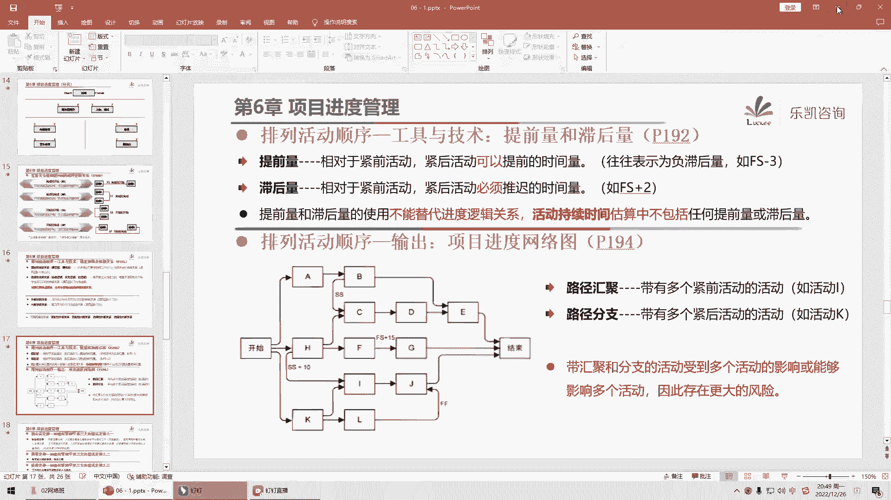
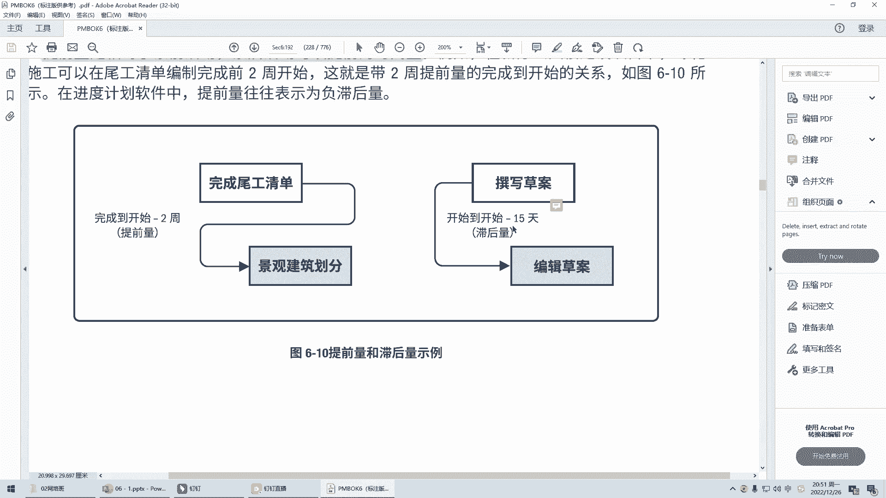
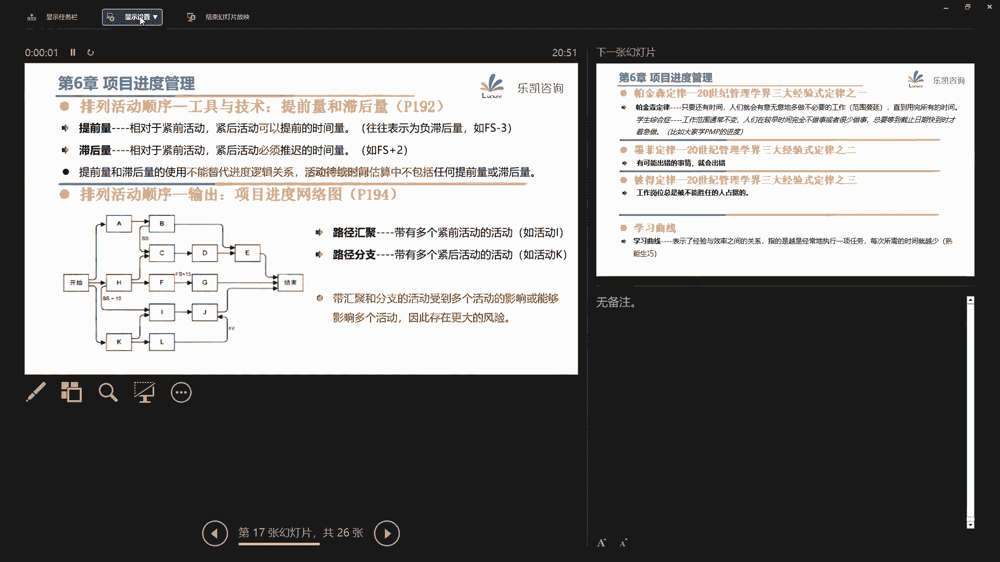
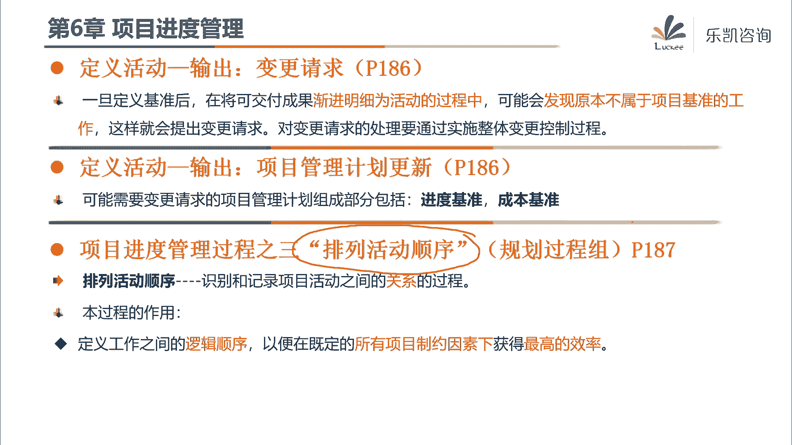

# 2024年PMP认证考试课程针对PMP新考纲最新免费零基础也能轻松听懂 - P8：PMP第6章：项目进度管理（上） - 乐凯咨询 - BV1Rj411G7gs

好各位同学晚上好，今天晚上我们开始学习第六章，项目的进度管理好吧，那么项目的进度管理这一章呢，实际上在我们考试当中呢，不是一个非常重要的一个章节，但是呢，我还是希望大家能够认真的去学习这一章。

因为这一章对我们以后将来管理项目啊，是很有帮助的，那么为什么说对以后管理项目是很有帮助的呢，项目的进度管理这个维度啊它比较特殊，在我们老版本里面，它叫项目的时间管理，也就是说它很明显跟什么有关。

跟时间有关，那么一旦它跟时间有关，它就有一个很特殊的属性啊，我们有一首歌里面是这么唱的对吧，时间是一场有去无回的旅行啊，你说范围多一点少一点，我们可以走变更做呗对吧，哎你说成本超一点。

那么我们可以去申请一些新的预算呗，但是时间这个东西很特殊啊，你如果说时间过了，你就买不回来了，所以说我们有很多项目非常重视进度的管理，特别是我们有一些明确的时间节点要求的时候。

他的进度管理就特别的重要对吧，所以这一章大家要好好去学一学，那么我们在这一章里面会着重的去讲，整个项目的进度是怎么来的，怎么去排这个项目的工期，以及对进度做的一些常见的控制的手段啊。

会有一些常见的一些做法对吧，那么大家一定要好好去学好吧，那么pmp里面他说进度管理的核心概念，实际上就是我们要选择做进度计划的方法啊，比如说我们后面会着重讲的关键路径法呀，对吧等等。

那么通过这些方法把项目的一些特定的数据，把它输到一些进度计划编制工具里面啊，比如说我们常见的像project等等啊这种工具，然后来创建出项目的进度模型对吧，然后在这个模型里面再导出我们的进度计划。

那么它要求我们在整个项目期间，要保持计划的灵活性，然后呢要及时的去调整，那么在这边他说现在的发展趋势和新兴，实践里面啊，有一些特殊的项目，我们可以用，比如说这个在敏捷里面加ascrime。

可以用rap的方法对吧，或者用像这种看板这种方法来处理，那么这一块呢是在敏捷里面的内容，我们在敏捷里面统一的去讲解这一部分，好吧好，那么接下来我们看一下进度管理的这几个过程，首先从我们第五章学习了之后。

接下来每一个章节，第一个过程都是规划某某某管理，比如说第六章讲进度，他第一个过程就会讲规划进度管理，那么为什么要讲这个过程呢，他说我们要在整个项目期间对如何去管进度，要提供指南和方向，那么这个过程。

他是为了做出一份叫进度管理计划，那么根据我们之前学习的内容，大家会发现进度管理计划他说的是什么呢，如何管进度，说的是how对吧，也是一种流程性或者指南性的东西，所以这里面并没有我们这个项目。

它具体的工期要求是什么，那么像这种指南性的东西里面会说什么呢，好这边他大致做了一些说明，他说比如说在敏捷里面，我们后面会讲到的关于迭代的长度啊，发布计划呀对吧，包括那我们的准确度啊。

啊比如说我们某一个活动究竟要多少天，那么有可能不一定是百分之百准确，我们要给出一个浮动的区间，比如说这边的啊这个活动十天，政府两天对吧，然后另外我们在一开始要约定好，我们进度的计量单位是什么。

比如说我们常见的用日历日对吧，用天来表示哎，我们每个活动它需要多少天，整个项目一共要多少天，那么我也见过有一些进度适用，比如说哎第一周我们做什么，第二周做什么，用周对吧等等，那么你用什么计量单位。

我们一开始要约定清楚，包括还有控制临界值，我们也要说清楚，那么说到控制临界值，大家有没有这样一种这个感觉对吧，我们在第五章其实讲过控制临界值，那么为什么要定义好控制临界值呢，好比如说我们一个项目的工期。

最终定下来是八个月，那么我们有没有可能说正正好好，八个月把这个项目做完呢，当然是有的，但是概率很小，它总有一些偏差吧对吧，早一天晚一天都是有可能的是吧，那么接下来一个八个月的项目，说我晚了一天。

那么这个行不行呢，可以吗，八个月的项目我迟了一天，可以吗，一般情况下来说这个是可以接受的对吧，一般情况下来说是可以接受的对吧好，那么假如说是一个八天的项目，我早一天晚一天行不行呢，这个就不行对吧。

所以每一个项目我们允许出现了偏差是多少，我们要把它定义下来，那么一般我们在做管理计划的时候，我们会约定好允许出现的最大偏差是多少，一般我们用一个百分比，比如说我们进度的偏差最大不能超过3%。

如果超过3%，我们就要主动去管理，如果偏差在3%以内，这个很正常好吧，那么包括我们将来如何去测量绩效，那么关于这个测量绩效，我们在后面特别是第七章会讲政治管理好吧，那么关于这个固定公式法呢。

这个大家稍微了解一下，我们在讲十章的时候，会给大家去介绍固定公式法好吧，所以第一个过程它其实没什么内容啊，就是为了做一个指南性的计划，叫进度管理计划好，那么接下来真正要做的一些工作。

是从第二个过程开始的，那么在讲第二个过程之前啊，我们先回忆一下上节课讲的内容，我们说当我们跟客户收集的需求好，定义了范围之后，为了便于管理，我们把范围分解成较小的，更容易管理的组成部分，这个叫什么。

这个叫工作包，工作包对吧，那么在之前上课的时候，我们讲过一个内容，说工作包能不能作为依据，来给我们的项目排工期呢，那么当时很多同学说不行对吧，那么为什么不行呢，但是我们说。

那青椒这个东西是需要很多的活动来得到的，对吧，比如说我们青椒从哪儿来，要去菜场去买，买回来之后要洗，洗完了要切对吧，算叶子也需要买，买回来要洗，洗完了要切，那么为什么不能直接说诶。

我算叶子买回来洗洗切切要15分钟，青椒买回来洗洗切切也是15分钟，所以整个的配菜要30分钟，为什么不能这样呢，因为我们很多同学发现有一些活动，它是可以同时做的，比如说买蒜叶子跟买青椒可以同时做对吧。

那么后面的工作也许我们可以要先后做，我们必须要先后做对吧，那么这个时候他需要的时间就不是简单的，15+15，是这个道理吧，所以说我们要知道进度，光到工作包这个层次还是不够的。

那么接下来pp就介绍了一个过程叫定义活动，那么我们看一下这个定义活动是怎么说的，他说定义活动啊，就是把工作包分解成活动对吧，工作包是哪来的，我们说工作包的本质是可交付成果。

这个成果是由一系列的活动得到的，那么你要知道准确的进度，就要把这些活动把它给定义出来，或者说把它给分解出来好，那么接下来问大家一个问题，既然要把工作包分解成活动，做这样一个过程叫定义活动。

那么大家能知道这个过程的输入有什么吗，啊我们根据上一节课的内容，要把工作包把它拆成一个一个的活动，那么你说输入要什么，很明显吧，很多同学想到那么收入肯定要工作包嘛，对吧啊，包括有同学说要用w bs嘛。

对吧好，那么w bs对应的那个词典要不要参考呢，词典里面有详细的描述也需要参考啊，所以说这边就提到一个很重要的输入，你既然要定义活动，就必须要w b s w b s直连，也就是说什么东西呢。

范围基准要作为输入对吧，那么通过范围基准作为输入，那么接下来我们就去分解，把工作包再分解成活动，比如说我们这边说的青椒哪来的，通过这几个活动得到的啊，把这个青椒分解成了活动。

算义子是通过这几个活动得到的，也把它分解成活动对吧，那么怎么去分呢，好他提到一个工具叫分解啊，就是你自己反正有经验的自己去分一分就行了，那么在这个工具里面有一句话呢，稍微注意一下。

他说让团队成员参与分解过程，有助于得到更好的更准确的结果，那么想一想也确实是这个道理啊，项目经理他不一定了解具体的工作呀，那么团队一起来参与分解，可以得到一个更好的对吧，更准确的结果。

那么这个工具其实很简单，大家一起来把它分解成活动就可以了，但是分解的时候可能会遇到一个问题啊，我们在之前讲课的时候说，当我们要分解的时候，发现有一些东西啊，它并不是工作包层次对吧。

比如说我们举了一个例子说哎，假如说客户对回锅肉需要的配菜还没决定，暂时先放一放，它并不是最终的工作包，这个东西叫什么，还记得吗，他有待进一步规划，叫什么，所以它叫规划宝，像这种现在还不太清楚的。

那么这就涉及到什么，这就涉及到需要渐进明细啊对吧，我们需要在信息明朗的时候，把规划包变成工作包，然后再把它变成活动，所以这里面就涉及到一个工具，叫滚动式规划，其实滚动式规划啊也好，或者叫波浪式规划也好。

它就是一个渐进明细的一个思想对吧，由于你有规划报，所以我们必须要渐进明细，不是一次性就能做完的对吧好，那么这个过程很简单，把工作包分解成活动对吧，涉及到滚动式规划，涉及到分解。

那么最终我们就可以得到活动清单啊，我们有一份清单会列出来，我们所分解得到的所有的活动，当然活动清单里面还有每个活动的属性啊，比如说这个活动名称是什么，谁负责他的描述是什么对吧，活动清单，活动属性。

那么另外在这个过程除了活动要分解出来以外，我们还要定义好里程碑，要得到一份里程碑的清单，好问一下各位同学，平时有没有听说过这个词叫里程碑啊，英文叫milestone对吧，我相信很多同学应该听说过。

那么什么叫做里程碑呢，那么用一个简单的例子来理解一下人这一生，如果是一个项目，你觉得他有什么重要的里程碑，那么很明显当这个人出生的时候，肯定是一个里程碑对吧，哎比如说这个开始上学了，是一个里程碑对吧。

大学毕业算不算一个里程碑，肯定算对吧，结婚是里程碑吗，是生小孩也是对吧，退休算不算也算，那么什么叫里程碑呢，其实我们大致知道他的意思对吧，那么有同学说了，里程碑是什么，里程碑。

它的本质就是一个重要的时间点或者事件，唉就是在我们整个项目过程当中，有一些重要的时间点对吧，那么这些东西就是里程碑，那么这个东西我们也要把它给定义出来，那么p mp里面说里程碑可以是强制性的。

或者选择性的，那么这句话我解释一下，很简单，什么叫强制性的里程碑啊，一般是合同要求的，我们有很多同学经过合同对吧，合同里面会有要求诶，合同签订后，多少个工作日或者多少个日历日之内，我们要做到什么。

然后接下来再过多长时间，我们要完成什么对吧，那么这个东西就是合同要求的，你不能违背的，你如果违背可能会带来一些，比如说违约对吧，那么这个就是强制性的里程碑，那么还有一种是选择性的，那么什么叫选择性的呢。

好选择性的里程碑，意思就是我们是根据一些历史的经验，我们自己定的，好举一个例子，合同里面要求多长时间之内完成需求对吧，好多长时间之内完成设计，那么合同里面对需求里程碑是有要求的，设计是有要求的对吧。

那么根据我的经验，我觉得在需求做完了，不要直接做设计，我们最好做一个圆形，所以我定义了一个里程碑叫圆形的确认，可以吗，也可以对吧，所以像这种自己定义的就是选择性的里程碑，那么要注意的是。

这里有一个细节啊，里程碑它不是活动，那么既然它是一个时间点，那么就代表它的持续时间是零，那么反过头来我们看活动，活动它的持续时间是存在的，它不是零，比如说我们一般会描述一个活动哦，a活动它需要三天。

对吧，在我们进度计划软件里面，可能会显示他是几月几号开始的，那么我们希望它几月几号结束，它是有一段持续时间的，而里程碑呢它只是一个重要的时间点对吧，它的持续时间为零好吧，这个要注意一下。

那么除了输出活动清单和里程碑清单以外，那么这边还会输出变更请求，会更新项目管理计划，那么原因是什么，原因就是我们刚刚讲的，因为它涉及到滚动式规划，所以我们的计划会渐进明细，那么在渐进明细的过程当中。

我们就要提出变更请求，来更新我们的项目管理计划，好吧，那么这一块稍微了解一下就可以了，这个过程也比较简单，那么接下来有了这些活动之后，我们做什么，有了这些活动之后，首先第一步我们要考虑一个问题。

哪些事情可以同时做，哪些事情必须要先后做，也就是说我们要排列活动的顺序对吧，你有一堆乱七八糟的活动，那么你要把这个顺序排一排啊，先做什么后做什么对吧，哪个先做完才能做哪个，这些都要理清楚啊。

那么排列活动顺序，就是我们要定义活动的逻辑顺序，我们希望在制约因素的影响下，要获得一个最高的效率对吧，那么最终排列顺序我们要形成一张这种图，叫项目进度网络图，那么怎么样来排顺序得到这张图呢，好。

首先我们要了解一下这个工具叫颈前关系，绘图法pgm，那么我说一下什么叫紧前关系啊，其实这种词呢听上去好像很专业，其实很简单，什么叫颈前，什么叫颈后，说白了就是这个活动的前提，他的前置活动是什么。

或者这个活动的后续活动是什么，那么紧致，它体现了什么，就是仅仅靠着这个活动在他前面的，比如说我问大家一个问题啊，假如最终我们能排出这张图好，大家能不能看得出来c活动的紧前活动是谁，仅仅靠着谁紧靠着谁。

在他前面的就叫颈前，那么c活动的紧前活动是谁，那么一眼就看出来了对吧，很明显嘛，活动a嘛对吧好，那么接下来我再问一下，有颈前，既然那么既然有颈前，就有颈后了，好c活动的紧后是谁呀，那么一样的道理。

仅仅靠着c在c后面做的这个活动，马上就要找出来了，活动一，那么也就是说，我们要把活动的这种紧前紧后关系啊，要把它找出来是吧，很简单好，那么我再问一下，从这张图里面，能不能知道a活动的紧后活动是谁。

我们找一找，假如最终排除这张图，a活动仅仅靠着a在a后面的是谁，好要注意，仅仅靠着a在a后面有三个是c和d对吧，那么同样的道理，e活动的紧前活动也有三个cf对吧，那么这个就是所谓的紧前紧后。

那么紧前关系绘图法，实际上就是我们要了解活动和活动之间，有没有这种紧前紧后关系，如果有，它们是什么关系，我们最终要把这些活动形成一张图对吧好，那么接下来怎么去找呢，大家要知道啊。

每一个活动有它的开始时间，几月几号开始，有它的结束时间，所以呢我们用s来表示开始，用f finish来表示结束对吧，那么如果我们拿两个活动来看，只有两种，可能要么这两个活动没有关系。

要么这两个活动存在一些逻辑关系对吧，那么没有关系的就算了，那么有关系的，你要把关系找出来，比如说我举一个例子，我有一个活动叫服务器到货，那么服务器到货是需要一段时间的，对吧啊，我他是几月几号开始。

我们计划几月几号结束，然后呢，还有一个活动，就是服务器到货了之后要上架调试对吧，那么调试这个活动也有一个开始和结束，那么接下来我问一下，这两个活动之间有没有关系，如果有关系是什么关系。

那么找这种关系我们就看一下，如果有关系，我们应该怎么样去连线对吧，那么其实呢连线的方式就这么几种，要么他和他连对吧，要么他和这个零或者这两个零，或者这两个连对吧，好马上有同学说了，这个很简单。

应该这么连啊，服务器到货这个活动完成了，也就是说你服务器到货了之后对吧，完成之后，然后我们就可以开始上架调试对吧好，所以大家给出了这样一个答案，他们之间的关系应该是这种关系，叫fs关系，对吧。

警前活动服务器到货要结束，然后到货完成，到货结束了之后，我们再开始上架调试，合理吗，非常的合理对吧好，那么接下来再看一个例子，我们现在在上课对吧，老师上课和学生听课这两个活动，这两者之间是什么关系。

好有的同学说这样我呢知道八点钟上课，所以我早早的就等在电脑旁边了对吧，只要老师一开始讲课，我就开始听课对吧，你看我是把s的这边连起来，它叫s s关系就是一旦紧前活动开始，今后活动呢也开始对吧。

那么对于有的同学来说，他就会把它画成这种关系，紧前活动开始紧后活动呢也开始对吧，那么有的同学说我不是这样的，因为我今天有点事对吧，我并不是他老师开始讲课，我就开始听课的，但是呢我赶回来了对吧。

老师结束讲课的时候，我也一直听到他结束，是f f的关系，那么f f代表什么意思呢，就是他不结束，我也不结束，他讲结束了我才听结束，那么这样画这种关系可以吗，也可以对吧，那么这个时候有的同学就会有疑问了。

那么如果我是准点上课，准点下课的，那么是不是我既可以化成s s的关系，诶老师开始上课，我就开始听课对吧，然后我又是准点下课的诶老师结束讲课，我就结束听课，那么就存在两种关系了，那么存在两种关系怎么办呢。

好p m p里面他提到过一点，他说确实啊我们有可能存在多种关系，但是我们不需要多画，我们选择一种比较合适的关系就可以了，好吧好，那么这个是ss跟ff，那么接下来我们再看这两个活动。

那么这两个活动呢我解释一下啊，我呢八点钟，开始讲课，那么我们有很多同学呢，其实在八点之前就等在电脑旁边了，那么他等在电脑旁边，比如说他07：50就等在电脑旁边了，那么他在干什么呢，他在刷抖音，对吧。

因为还没上课嘛，所以我就先刷会儿抖音嘛，好，那么接下来我问一下，这两个活动它是什么关系啊，我感觉这两个活动也是有一些逻辑关系的，对吧，那么这两个活动是什么关系呢，好我看到有同学说是fs的关系。

他说你这个图画的不好，你故意把刷抖音这个活动画在下面，实际上应该是这样，刷抖音这一活动他是07：50就开始做的吗，他应该在前面呀，对吧好，然后接下来八点钟上课，这两者是fs的关系好，请问这样画行不行。

那么大家要注意啊，这种逻辑关系你定义好了之后，一定要检查检查究竟是不是合理，如果你定义成这种逻辑关系，那么就意味着啊，好我问一下我讲课它的前提是什么，唉如果我这么安排啊，那么意味着我讲课的前提是什么。

它意味着我要开始讲课，它的前提是什么呢，前提是你刷抖音，这个活动要结束，对吧，只有你结束刷抖音，我才能开始讲课对吧，那如果你刷抖音不结束呢，我就不能讲课呀，是不是因为你是化的fs的关系。

你必须要前前景前活动要结束，finish了，我后面的活动才能start开始，对吧，所以好我们有很多同学发现了这个逻辑，好像不对对吧，你总不能说我一直刷抖音，那么老师就一直不能讲课吧，那么有没有关系呢。

其实是有关系的，我画一个关系，大家觉得这样是不是合理，一旦我开始讲课，那么大家就要停止刷抖音，它是这种sf的关系，它很特殊，就是你抖音可以先刷对吧，你07：50你可以先刷下抖音，没有错对吧。

但是这两个活动有没有关系，是有关系的，什么关系呢，只要我开始讲课了，只要我开始讲课了，你就要把刷抖音这个活动给停下来，是不是有这个关系的，是有这个关系的对吧，我只要开始讲课，你就要结束刷抖音这个活动。

那么这种关系是很特殊的，叫sf的关系，在我们项目中也是很少见的对吧，那么大家了解一下确实存在这种关系就可以了，那么在这里我要说一下啊，我要说一下，有很多同学有误解，什么误解呢。

说紧前活动一定是时间上比较早的，其实不对的，你比如说这两个活动讲课在后，刷抖音在前对吧，但是讲课仍然是紧前活动，所以说所谓的前和后并不是时间的早和晚，所谓的前和后是什么，是逻辑关系，谁是谁的前提对吧。

那么我们一般会这么描述紧前活动怎么样了，今后活动他才能怎么样，他讲的是什么呢，逻辑关系，而不是时间顺序的先后好吧，这一点要稍微注意一下的，那么两个活动之间如果有关系，无非就是这四种关系。

这就是我们所谓的pgm警情关系绘图法对吧，最常见的叫fs关系，然后当然也包括f f s，最少见的就是sf关系，那么我们要把活动之间的关系把它给梳理出来，把活动跟活动把它联系起来，形成一张网络图好吧。

那么这个就是pgm紧前关系绘图法，很简单的一个工具，那么接下来我用一个例子啊，来检查一下大家究竟有没有理解，比如说我出一道题题是这么说的，当讲课，结束之后，那么我要开始，吃饭了，啊饭还没吃对吧。

最近呢这个派送比较慢，那么怎么办呢，下了课之后再吃饭对吧好，当讲课结束之后，我再开始吃饭，那么这是什么关系，大家注意，遇到这种题目太简单了，你就看他在说什么，当讲课结束好，结束是什么。

很明显是finish对吧好，我就开始吃饭，开始是什么start对吧，那不就简单的fs关系吗好吧，所以遇到这种题目，题目怎么说，你就怎么连就可以了啊，这个很简单，金钱关系你会读法好。

那么接下来除了这个工具以外，我们还要考虑要确定和整合什么东西呢，依赖关系好，什么叫依赖关系啊，依赖关系就是指我们这两个活动，虽然是这么排的，那么是不是一定要这么排呢，那么它分为强制性依赖跟选择性依赖。

那么什么叫强制性依赖啊，在pp里面是这么说的，如果这两个活活动是由于法律或者合同要求的，或者呢是由工作的内在性质决定的，简单的说用一句通俗的说法叫不能违反，那么这两个活动就叫强制性依赖啊，用我们俗话说。

就是必须先做什么，他没做完，你就后面不能做，先做什么后做什么，比如说我们看这两个活动，服务器到货跟上架调试是fs的关系好，请问这种关系能不能调整，哎我调整成s s行不行不行，为什么。

因为这个取决于工作的内在性质，你必须要服务器完成的到货，我才能调试啊，你服务器都没到货，你叫我调试怎么调啊，我在机房里面啥都没有，你让我调什么对吧，那么像这种就是由工作的内在性质决定的。

那么再比如说法律要求的好，考驾照，是一个活动对吧，自己开车上班是一个活动，这两者很明显，fs关系能不能调整，说我一边考驾照，一边就开车上班，行不行不行，因为这个是法律要求的对吧，你如果五没有驾照。

无照行驶，抓过去15天对吧，所以像这种我们也把它叫什么呢，也把它叫硬逻辑或者硬依赖，你不能调对吧，比如说我们在做建筑行业里面的，要先打地基，然后再盖一层，像这种都是内在性质决定的，那么这种都是硬逻辑。

但是呢也存在一种情况，就是有的时候，活动之间也会存在选择性依赖关系，那么什么叫选择性依赖关系呢，他说这两个活动呢，当时我们安排的时候是根据最佳实践来安排的，就是我们最好能这么去做对吧。

但是呢在特殊情况下我们也可以调整，唉，比如说举一个例子，在座的如果有做过土建的同学啊，应该会知道，在土建的项目里面有一个专门的项目分包，专业分包对吧，或者说专门的一个子项目叫消防，对吧啊。

我相信很多同学如果了解的都知道，这是一块很重要的一块，这是一个很重要的项目对吧，那么除了消防以外，我们还有别的专业分包呀，啊比如说我们做弱电的对吧，比如说我们做安防的啊，有摄像头的。

那么这些东西跟消防之间，本来最佳实践是什么关系呢，最佳实践呢其实是这种关系叫fs关系，就是等你消防做完了之后，那么我们弱电安防再做，那么为什么这是一种最佳实践呢，因为消防它是非常重要的。

消防做完了之后要做消防的验收，那么如果消防验收不通过，他还需要什么呢，还需要整改对吧，那么如果整改的时候，你弱电安防已经在那边布置了一些，比如说相应的设备，那么它需要从那边走的，你就要拆掉啊。

因为消防最大嘛，消防很重要对吧好，但是大家会发现，实际上在我们真正做项目的时候是这样做的吗，他不是这样做的，因为我们的工期是不允许这样做的，这样做的话先后做工期拖得太长了。

所以一般来说在安排的时候会怎么安排呢，一般会这么安排，就是消防跟弱电和安房一起做，大家一起做对吧，再做安防对吧，那么一起做有一个什么好处，大家能够看得出来吗，你看啊，比如说原原来消防要做三个月。

做完了之后再做安防两个月，那么一共是五个月对吧，那么如果这两者同时做，它有什么好处，消防三个月安排两个月同时做，很明显嘛对了，工期缩短了吗，因为并行去做的嘛，当然工期缩短了，所以在这种情况下。

由于它不是强制性依赖，我们可以调整关系，虽然最佳实践我们觉得是fs，但是我们可以调整s s好，但是我问一下这样做有没有风险，有风险吗，很明显风险是存在的对吧，唉我们公海系同学说的很好，用风险来花了时间。

那么风险是什么呢，万一你也在做消防也在做，结果呢，然后要比如说改个线路，改个什么东西，碰到你的东西，那么消防最大没办法，你要他一改，你也得改呀对吧，所以说选择性依赖关系有这么几个说法。

他原来是基于最佳实践的对吧，那么出于一些要求，团队可以自由选择，比如说他说到如果打算那刚刚的定型，我们后面会讲叫快速跟进，如果你打算快速跟进，打算并行，那么你可以把它调整，把最佳时间调整，但是要注意。

第一他们一定是选择性依赖关系才能调整，而强制性的是不能调的对吧，第二就是我们刚刚说的，如果你调整了之后要注意一个问题，就是风险的问题，风险的问题好吧，那么这是第一对依赖关系对吧，一个叫强制性。

一个叫选择性，那么从另外一个维度来说，我们还可以把依赖关系分为这两种，叫外部依赖和内部依赖，那么这两种比较简单，大家要注意什么叫外部，什么叫内部啊，什么以外什么以内，他说项目活动跟非项目活动的依赖。

就叫外部依赖，项目活动之间的呢就叫内部依赖，所以说它这个外部和内部是指什么外部，什么内部呢，注意它不是指同一家公司，它是指的同一个项目，如果你是在同一个项目里面的，就叫内部依赖，如果是跨项目的。

哪怕你在同一家公司，它也是外部依赖关系对吧，比如说有1年考试就出了这样一道题目，他说某公司，现在有两个项目，一个是项目a，一个是项目b那么a项目它有很多的活动在做，b项目也有很多的活动在做。

其中a项目有一个活动，依赖于b项目中的某一个设备，那么请问这是什么依赖关系，那么大家要注意，我们所谓的外部依赖和内部依赖指的是什么，同一个项目，既然他现在跨项目了，那么首先它一定是外部依赖关系。

这一点一定要注意的啊，一定要注意的好吧，只有在同一个项目之间的才是内部依赖好，那么我们的依赖关系大致可以分为两个维度，强制性的选择性的或者外部的内部的，当然他们可以组合组合成强制性，外部强制性。

内部选择性，外部选择性内部好吧，那么这个工具也比较简单好，接下来还有一个工具，或者说还有一个工作也是我们要考虑的，叫提前量和滞后量，那么很多同学呢说到体型量和智慧量呢，大致知道什么意思。

但是呢不是很明白，那么在这里呢我想用一个例子来说明一下啊，我问一下在座的各位同学，有没有哪个同学感情经历是非常的坎坷的啊，我不能说坎坷啊，有没有哪位同学感情经历是很丰富多彩的，谈过多次恋爱的，有没有。

像我这种就比较苍白对吧，没有那么多的机会，那么我相信一定有同学，肯定接触过很多场恋爱的啊，比如说杨庆同学哦，还有汪同学20次好，那么就小汪同学好了，汪汪村好吧，这样啊。

我拿他两场恋爱来分析连续的两场恋爱啊，比如说前面一场是a跟a同学谈的，后面一场是跟b同学谈的，好我问一下，你们觉得两场恋爱之间，如果一定要给他一个关系，应该是什么关系，我们先说逻辑关系啊。

就那四种是fs呢，还是f f呢，还是4s呢，还是sf呢，那么我相信正常人对吧，应该会选择哪一种关系，把这些渣男拖出去对吧，正常人呢很明显应该是上一段感情结束了，下一段感情呢才能开始，对不对。

应该是这种关系啊，fs关系，但是呢我们再仔细想一想，这种关系呢好像也不太现实，为什么不太现实呢，因为我觉得正常人上一场恋爱结束之后啊，并不能马上直接开始下一场恋爱，大家同意吧，因为上一场恋爱结束之后。

一般会等一段时间，不可能做到无缝对接对吧，哎有同学就提到一个问题对吧，这怎么是无缝对接呢，那无缝对接的是什么人，不要说渣男对吧，这个这个人家不叫渣男，毕竟是上一段结束了，比如说诶昨天分手了。

今天又找到一个新的女朋友，这个叫什么，这个只能叫，这个五倍楷模对吧，唉我很佩服这种人，当断则断对吧，拜拜就拜拜，下一个更乖，他妈昨天分手了，明天我就再去找一个对吧，这只能说很厉害对吧。

但是注意大部分人都做不到这一点对吧，那么大部分人是怎么做的呢，他肯定需要一段时间来平复自己的情绪啊对吧，比如说我就亲眼见到，那我上大学的时候啊，隔壁宿舍有个哥们失恋了，分手了对吧，那么就会很折腾啊。

什么大半夜的买啤酒在楼道里面喝呀，弹吉他呀，他妈折腾了好多天，说实话要不是因为他兄弟多，我他妈真想揍他对吧，他肯定要做一段时间的，所以你会发现感觉正常一点的人啊，应该是这种，就是当警前活动结束之后。

好像还要再等待，比如说哎等待一个三个月，对吧，然后紧后活动再开始，是不是这样就比较合理一些对吧，这个比较符合我们正常人的一种做法，对吧好，那么我们仔细观察一下，这两个活动之间的关系啊，当警前活动结束。

然后结束，你还不能开始，你要再等，那么等待嘛，就是要增加的时间了，在等待三个月，然后下一段感情我们再开始诶，又遇到一个合适的人，对吧好，那么为了比较方便的把这个关系写出来，我们这样写叫fs加三，对吧。

那么也就是说今后活动的开始需要怎么样，并不是无缝的，它需要一定时间的滞后对吧，那么这个就叫滞后量，滞后量好，我问一下对于滞后量了解了吧，我相信正常人都能够了解对吧，因为我们大部分人如果有几次恋爱的经历。

不都是这样的吗对吧，那么什么叫提前量呢，好我们看一下，假如汪同学是这样的，再跟a谈恋爱，但是呢我又认识了b，按照道理讲的，应该是我先跟跟a分手，再跟b谈恋爱吧，但是呢他是这样的，他说我先跟b谈起来。

为什么呢，因为跟a没有感情了，对吧，我感觉我们也快了，刚好又遇到一个b对吧，那么就先开始吧，对吧，那么这种人是什么人，我感觉这种人呢虽然感情已经不在不在了，但是我感觉多多少少有点渣对吧，我叫你一声渣男。

这不过分吧，那么有没有这种渣男存在呢，他有的，那么他的做法是什么，我觉得我跟他快黄了，快结束了，但是我没有等到结束才去开始，而是在结束的，比如说前两个月啊，我们回顾了一下他的恋爱时。

发现这小子在他结束的前两个月啊，前两个月他就开始跟另外一个姑娘谈恋爱了，你说这个扎不扎，他就很渣，是不是好，那么他这种做法是什么做法，那紧前活动结束，他还没等到结束啊，在结束之前的两个月他就开始了对吧。

那么为了便于书写，我们把它写成fs减二，那么这个是什么，他把今后活动怎么样，他把它提前了提前了，那么这个叫什么，这个叫提前量对吧，那么我们做项目的时候啊，活动和活动之间。

有的时候是需要考虑提前量和滞后量的对吧，比如说我随便举一些项目中的例子，大家也应该能够理解，做装修项目的时候，房子装修好了之后并不能直接搬家，我们要有滞后量，滞后个三个月干什么通风对吧。

比如说我们在做建筑类项目的时候，比如说我们要铺一铺一条公路，混凝土铺好了之后并不能直接通车，需要滞后一段时间干什么呢，它有养护期对吧，所以提前量和滞后量把这个东西啊搞清楚，其实很简单啊，很简单。

当然除了fs关系，有提前量和滞后量，其他关系有没有呢，当然也有啊，一样的，比如说有同学说的，那么ss可不可以有提前量和智慧量呢，你想想吧，有没有见过这种人，认识了a跟a在谈，跟跟a在谈的对吧。

谈了刚谈两个星期对吧，又认识了b，唉又跟b谈起来了，ss中间就隔了两个星期，这种人叫什么海王嘛对吧，这这种人扑面而来就是大海的味道，是不是像这种也很常见的，所以这种逻辑关系啊，其实题型量和滞后量。

对于任何一种逻辑关系其实都是成立的好吧，那么我们要根据他们的实际情况，合理的安排基金量和滞后量，好吧好，那么通过这些工具紧前关系绘图法啊，包括确定和整合依赖关系，通过体系量和滞后量。

最终我们要得到项目进度，网络图活动之间的关系要理清楚，好吧好，那么接下来检查一下大家，关于刚刚讲的提前量和滞后量，有没有理解清楚啊。

我忽然想到我们书上有一张图，我们看一下。

在我们教材里面，在教材里面讲题量和滞后链的时候呢，他说到了这两张图，他说举了两个例子，一个叫完成围攻清单和景观建筑划分，他说什么叫提前量呢，就是完成到开始fs减两周啊，提前了两周，对吧好。

然后他又举了一个滞后链的例子，他说那我撰写草案跟编辑草案呢，可以开始可以同时开始对吧，但是不过你肯定要撰写草案，撰写的一部分，我才能开始编辑草案嘛，所以它是开始到开始的，滞后了15天，滞后量好。

我问一下大家，大家对于这张图有没有什么看法，有没有发现这张图里面存在一个问题，能找得到吗，好很多同学发现了啊，滞后量就是代表你需要等待的时间，应该是s开始到开始怎么样，要加15天，要加15天对吧。

你既然是滞后，就是必须要等待嘛，等待就是花时间吗，应该是加15啊。

应该是加15好吧，那么这个细节稍微注意一下好，那么接下来通过这些工具。

我们最终形成了这张图，那么这张图它有一个特点。

我给大家说一下，你们有没有发现在这张图里面，比如说b和e他的关系，这跟线上啥也没写，那么这是什么意思呢，好大家注意，如果这两者的关系是fs的关系，那么fs就不用解，这个是默认的，默认就是fs关系好吧。

那么除了fs关系以外，其他的比如说s s对吧，或者甚至涉及到体系量滞后量的，你就必须要写上去好吧，默认的叫fs关系，这是第一个特点，那么第二个特点就是在这张图里面，它存在路径的汇聚点和路径的分支点。

比如说e活动，我们把它称之为路径的汇聚点，什么意思，你看啊，要开始它有两个前提，一个是b结束了才能开始，一个是d结束了才能开始对吧，那么这个叫汇聚点，汇聚到了e，那么要注意这种活动它往往风险比较高。

为什么，因为如果b出了问题或者d出了问题，那么你的e就不能正常开始对吧，那么同样的还有一种活动叫路径的分支点，比如说h这个活动h呢，你看它的完成h做完了要做c要做f，那么这个叫路径的分支点。

那么它的风险也很高，它高在什么地方呢，那么如果一旦h没完成，它就会影响c影响f对吧，那么路径汇聚点跟分支点它是有风险的，这个我们在做项目的时候要注意，好吧好，那么赵楠同学问了一个问题。

他说那么b和d会同时结束吗，好我问一下b和d之间有没有逻辑关系，这是第一个问题，b和d这两个活动有没有逻辑关系，你会发现b和d没有任何线连着它，就没有逻辑关系对吧，那么没有逻辑关系。

就不可能要求它同时解锁好，那么就很有可能出现这种情况啊，做完了，但是d呢还没做完，那么请问这个时候能不能开始e，能开始吗，这就不能开始，你一必须要等着明白吗，因为e要开始的前提有两个是d要结束。

必要结束对吧，你现在b是结束了没错，但是d还没做完呢，所以你e能开始吗，你不能开始啊，你只能等着明白吧，那么我们在星期三讲关键路径法的时候，大家会了解的很清楚，好吧好，那么这个过程大家明白了吧。

排列活动顺序，这个过程其实就是，把这些你刚刚分解出来的活动，怎么样，根据颈前关系绘图法考虑依赖关系，然后接下来考虑提前量和滞后量，最终，形成这样一张图，对吧，形成这张图，那么这张图就叫项目进度网络图好。

有了这张图之后，我想知道整个项目的工期还缺什么，还缺一个很关键的东西，就是每个活动他究竟要多少天啊，你这个得搞出来啊，你把每个活动多少天搞出来，那么我们去算一算啊，先做什么后做什么。

哪个同时做哪个先后做，那么整个项目的工期就出来了对吧，那么接下来就要涉及到每个活动的时间，我们要做什么呢，要做估算，那么在讲活动持续时间估算之前，我们先了解一下20世纪管理学的三大定律。

好第一个叫帕金森定律，那么我说一下管理学里面的帕金森定律啊，不是我们医学上的帕金森，医学生的帕金森是手在抖对吧，那么管理学的帕金森是什么意思，他说只要还有时间，人们就会有意无意的都做不必要的工作。

直到用完所有的时间，好，我解释一下这句话啊，那么问大家一个问题，假如现在项目经理安排你做一个活动，活动a活动a呢你估计要做五天，那么这个时候你给项目经理汇报的时候，你答复他这个活动你需要多少天呢。

你一般会说几天，哎你评估下来这个活动我估计做一做梦，五天做完了，那么项目经理给你安排了这个活动，说那你要几天啊，好你怎么说，25天有点过分了，李政同学拖出去打太过分了，那我觉得一般吧，七天对吧。

我六七天，七八天都可以接受是吧，好假如说你最终答复他，我这个活动啊一共要七天，好我问一下这种做法对吗，为什么我们要跟别人说七天才能做完这个活动，这样做对不对，好坦白的说，这种做法是对的，为什么是对的。

有同学说了，我们要考虑到风险，要留一些buffer对吧，所以说我报个七天正常吗，很正常了，是不是好，这个有没有问题，我同意，大家也是没问题的，应该这么做，有风险意识非常好对吧，学了pmp果然就不一样。

但是回过头来说啊，假如这小子在做的时候，他确实五天就把它做完了，没有遇到任何的风险，那么你觉得这个时候他会跟项目经理说，我做完了吗，其实真正的问题啊是出在这个地方对吧，并不是当初我们有风险意识。

有风险意识，它不是问题，问题出在什么地方，出在这里，当没有风险出现的时候，我就正常五天把它做完了，那么他会跟项目经理说，诶老大我做完了嗯，不会，那么他会干什么，他想唉哟五天就把它做完了。

那还有两天干什么呢，哎我是不是把它优化优化呀对吧，或者怎么怎么样多弄一点别的东西啊，反正什么时候交付呢，用完这个时间，七天在交付对吧，那么我们回过头来看帕金森定律，他说的就是这个意思。

他说你只要还有时间，他就不可能交付给你对吧，他就会有意无意的多做一些不必要的工作，把整个时间耗也要给你耗完对吧，那么我们在估算活动持续时间的时候，要注意帕金森的问题好吧。

那么另外还有一个问题就是学生综合症，这也是很常见的，什么叫学生综合症，这个在我们学生时代啊，那比如说现在我隔壁就有一个学生，我儿子，那么我儿子有一个什么特点呢，星期五下课之后，对吧，我看他半天也不出来。

我就推开他的门，我说你在干嘛，他说我在玩儿啊，我说你作业做完了吗，他会用一种看智障的眼神看着我，然后跟我说今天星期五啊，那么言外之意是什么呢，这星期五你急个毛啊，对不对，还有星期六星期天呢。

那么我们也比较通情达理，我也不说什么，我说好啊，反正要注意学习啊，好到了星期六上午睡个懒觉，下午又在玩，我说你作业做完了没有啊，啊快了快了快了就剩一点了对吧，好到了星期天上午又睡个懒觉。

下午还在玩儿对吧，到了晚上就开始忙了，你就看到他房间里面，打印机才开始滋滋嗡嗡的乱叫啊，打印了一张又一张试卷啊，然后开始开叶公对吧，挑灯夜战，为什么，因为在较早的时候不会做事儿。

总要等到截止的时候才会急着做，这个就叫学生综合症对吧，那么我们在管进度的时候，也要注意学生综合症的问题好吧，那么这两个定律是跟我们的进度有关系的啊，帕金森定律包括另外一个学生综合症。

那么既然讲到20世纪管理学的三大定律，的第一个帕金森定律，那么接下来另外两个呢也顺带提一提啊，墨菲定律，什么叫墨菲定律呢，大家一定听说过一句话，就是越害怕什么，越容易发生什么，很多人有这样一个体会对吧。

特别是我们上学的时候，老师在讲课对吧，我在干什么，我在想着班里的某一个女同学，然后忽然就听到老师忽然说，接下来我们请一个同学来回答一下，我靠心里很紧张啊，心里想着千万不要叫我，我林老师刚刚问什么。

我都不知道对吧，诶忽然他就叫了我，对不对，那么这个就叫墨菲定律，那么墨菲定律它在我们管理学上有什么意义，他强调我们要重视风险，要有风险意识好吧，那么第三个定律叫彼得定律。

这个呢跟我们管理学的没有太大关系，他说的是，工作岗位总是被不能胜任的人所占据的，那么我大致说一下他的意思是什么啊，我觉得还是有点道理的，他说如果一个人原来是一个很初级的员工，那么他干了2年之后。

他觉得自己很牛逼，那么接下来他会做什么呢，它要么就是跳槽对吧，要么就是要升职加薪，对吧好，假如说公司也同意了他的诉求，升职加薪，团队的一个领导，那么接下来又过了2年，他又觉得自己很牛逼。

那么又面临这个问题啊，要么跳槽，要么升职加薪好，这个时候公司又满足了他的要求，做了项目经理，对吧好，那么做了项目经理之后，这个人发现啊，原来我做技术的，把自己管好就行，我管好团队里面几个人。

把他的工作做完就行对吧，好，做项目经理，我忽然发现客户不断的找我领导，找我团队成员对我不满意对吧，而供应商也需要我不断的去盯哎呀，我忽然觉得这份工作真他妈娘的不好做呀，好请问当他自己开始怀疑人生的时候。

他会考虑跳槽吗，他还有脸要求升职加薪吗，都不会，那么只有在这种情况下，这小子怎么样，他就彻底的安奉了，不再会有那颗躁动的心了对吧，所以墨菲定律说最终最稳定的情况是什么，最稳定的情况就是。

工作岗位总是被不能胜任的人占据的，唉只有这种情况下，他才会消停一点，好吧，那么这是20世纪管理学的三大定律，大家都稍微了解一下啊，那么另外呢再介绍一个概念叫学习曲线。

那么学习曲线也是我们在排这个进度的时候，故事应该是要注意的啊，他说的就是熟能生巧对吧，经常的执行一项任务，那么所需的时间可能会减少好，那么接下来我们看这个过程，叫估算活动持续时间，那么估算活动持续时间。

他说的是我们要估算，注意单项活动，所需要的工作时段数一定要注意啊，他估的是什么的，持续时间，他估的是某个活动要多久，对吧好，那么这个东西应该由谁来估算呢，偏僻里面说不要项目经理估，也不要发起人工。

不要客户估，应该由团队中最熟悉具体活动的，个人和小组来估对吧，那么为什么项目经理不要去估，因为项目经理去估它是以谁的水平来估的呢，它是以项目经理自己的水平来估的对吧。

而真正去做的不一定是他最了解这个活动呢，也不一定是他，所以我们提倡有最熟悉的人或者小组来孤，那么有同学肯定就会提一个疑问，那么这帮孙子在孤的时候，它包括一些水分，那怎么办好，关于这个问题。

我们在星期六讲实战的时候，我们会有很多种方法，来尽量的让估算变得准确好吧，那么首先我们要记住这句话啊，姑要由最熟悉具体活动的个人或小组来估，另外他还说我们还需要考虑一些其他的因素，什么因素呢。

比如说收益递减规律，什么叫收益递减，好问大家一个问题啊，我们给一个活动安排了一个人去做，我加一个人活动时间能不能缩短啊，比如说我有一堆砖头要搬，原来是一个人搬砖，现在我安排了三个人去搬砖。

时间能不能缩短，能缩短有一些活动，特别是这种对吧，借鉴了这种工作是可以缩短的，但是是不是我一直加他就能够一直缩短呢，它不是它一定有一个临界值对吧，好我们的王健林同学说得很好，他一定有一个编辑点对吧。

你一直加它一定有一个临界点，临界点到了之后，你再加就没有用了对吧，甚至还有可能出现这种情况，当我们加了很多资源了之后，就需要沟通，培训和协调，不但不能缩短时间，有的时候反而还需要更长的时间。

这个我知道很多同学应该有这种体会的啊，比如说项目上常见的一种情况是什么，项目经理在吐槽我这个项目上人手不够啊对吧，找领导说，哎我这个项目人手不够啊，我需要人啊，好领导说了一句话，公司刚来了五个实习生。

我把这五个实习生全部都给你，对吧，唉你这样把这个进度稍微改一改行吧，那么你要知道这五个实习生过来需要干什么，你需要跟他沟通啊，需要培训啊对吧，就像我们张庆东同学说的，我有这个时间，我他妈自己都做完了。

是不是我经常遇到这种情况对吧，所以说当我们给一个活动分配资源，特别是分配低技能资源的时候，要注意，并不是人多，力量就一定大，我们需要沟通，需要培训，有的时候反而还需要更多的时间对吧，另外我们还要考虑。

比如说员工激励的问题，像我们刚刚说的学生综合症和帕金森定律啊，所以说估算活动持续时间，实际上呢不是很好做好吧，那么这些都是需要我们考虑的，那么这个过程比较重要的，大家要掌握什么，那么像这些东西。

我们在实战的时候会讲怎么去处理，那么考试比较重要的是什么呢，是考它的工具，正常情况下我们怎么来估一个活动的持续时间，那么这些工具大家一定要理解清楚，考试是经常考到的好吧，我们可以用这些工具来估一个活动。

需要多长时间，第一个工具叫类比估算，那么什么情况下可以用类比估算呢，遇到相似的活动，我们就可以用类比估算对吧，哎比如说在题目中经常会出现一个词叫类似诶，我们做过类似的项目，我这个活动之前曾经做过。

那么我们可以用什么估算，用类比估算对吧，那么类比估算由于我们曾经做过，我们有这个经验，所以它也是一种专家判断对吧，它是一种整体估算，是一种自上而下的估算，好这两个话我解释一下啊，我举一个例子。

我上个星期啊，或者说我昨天，我昨天中午呢到一个餐饮店去吃了午饭，花了30分钟对吧，我从家里出去走到店里面，吃完饭再走回来，一共花了30分钟，那么今天中午假如说我还是打算去那家店，还是吃同样的套餐对吧。

吃完了还是直接回家对吧，很类似啊，那么叫你顾一顾，这一次要多长时间呢，由于它非常类似，所以我就直接一拍脑袋就说了30分钟对吧，类比估算，类比估算就是这两个活动特别的类似，那么为什么说它是整体估算呢。

好其实这个活动我们要做的事情呢也不少，我先要出门对吧，然后下楼梯，然后走到吃饭的地方，然后点单，点完单之后吃饭，吃完饭之后再走回来对吧好，那么这些所有的东西我关心吗，我不关心，我不需要知道细节对吧。

因为这个东西太细了，没有必要对吧，就吃个饭嘛，搞这么复杂干什么，你就问吃饭多长时间好，我就整体说一说，反正一共30分钟对吧，那么什么叫自上而下呢，一样的啊，就像金字塔一样的，我不需要知道下面的细节。

我站在上面整体看一看要多长时间就行了对吧，所以类比估算它是一种专家判断啊，它是整体估算，也是自上而下的估算好，那么接下来类比估算的特点是什么，好大家注意它的特点是它的特点啊，非常明显的叫速度快。

快到什么程度，一拍脑袋就出来了，对吧，但是他怎么样，他不准，对吧哎虽然很类似，但是呢很有可能有一些不太一样的地方，你说他准不准呢，它不准好吧，这个叫类比估算好，我们还可以用参数估算。

那么什么叫参数估算啊，参数估算是说我之前也有一些历史数据对吧，那么接下来我把这些历史数据通过参数模型啊，其实就是一些公式，我们可以去算一算的好，我举一个例子，大家来体会一下跟类比估算有什么区别啊。

比如说昨天晚上我的晚饭是吃包子的，昨天呢吃包子我只吃了一个一个包子，我花了两分钟，对吧好今天晚上的我还是吃包子，但是由于今天晚上要上课呀，我打算吃饱一点，有力气吗，好今天晚上我要吃三个包子。

那么三个包子要多长时间，那么你会发现那昨天吃的是一个包子，今天吃的是三个包子，它类似吗，他肯定不类似啊对吧，但是它有一些历史数据，有一些基础数据我们可以拿出来用，比如说你看我今天吃三个包子。

那么一个包子是两分钟，那么我也能够算出来诶，六分钟可以搞定对吧，那么像这种就是参数估算，那么参数估算的特点是什么，他虽然用了历史数据，但是不是直接拿过来用的，它是需要干什么，需要套公式的。

也就是需要套参数模型，通过基础数据来计算得到的对吧好，那么参数估算它准不准呢，不好说，参数估算准不准，取决于两个东西，一个就是你的基础数据准不准，而是不是一个包子确实是要两分钟对吧。

另外就是你的参数模型是不是成熟对吧，比如说有同学说的，这不是简单的3x2啊，你有可能吃完一个包子对吧，你还要稍微休息一下，他可能不是简单的相乘的关系啊，所以你这个参数模型不一定很准确啊。

不一定成熟啊对吧，所以参数估算准不准，我们一定要仔细的考虑，你的数据基础数据可靠吗，你的模型成熟吗对吧，如果你的数据可靠，模型成熟，那么才不会有什么问题，好吧好，那么这两个比较简单对吧，类比估算。

参数估算它们的共同点都是多多少少呢，跟历史数据有点关系，对吧好，接下来我们先看这个叫自下而上的估算，好什么叫自下而上的估算呢，你要问我一个活动要多久啊，我考虑的很细，比如说你要问我。

你出去吃顿饭要多久啊啊我想了一下，我按个电梯，等电梯再下去要五分钟，从我家里走到吃饭的地方要十分钟对吧，点菜吃饭要十分钟，然后再走回来要五分钟，好最终我告诉你啊，这个活动一共要30分钟，对吧。

那么这种做法他跟这个自上而下是反的，发现没有，他叫自下而上去汇总，那么这种方法它的特点是什么，好很多同学发现了这种方法，由于他每一个细节都考虑的很清楚，他很准，它是一种最准的做法。

但是它有一个另外的不好的地方，他比较慢对吧，他很准，但是它很慢，明白吗，那么考试的时候一般就是考这些点诶，发起人要求今天就要把估算报上去，那么你用什么工具啊，你要知道它的意思就是要快了。

那么要快就是类比估算唉，如果说要准用什么自下而上估算对吧，哎他题目里面说到每个平方多长时间，这个房子一共有多少个平方要算的，这个是什么参数估算对吧，那么这些都比较简单好，那么接下来还可以有备选方案分析。

不同的备选方案需要不同的时间对吧，比如说我们去公司，你开车去还是走路去还是骑车去，他的时间当然不一样的，包括我们还可以决策，还可以开会，那么这些东西呢很简单，大家稍微看一看好吧。

那么接下来有两个比较复杂的，我详细讲一讲，好吧好，首先第一个叫储备分析，那么什么叫储备分析啊，其实储备就是我们日常说的什么呢，叫buffer，我们要留一些buff，它主要是用来考虑应对什么的。

是主要考虑用来考虑应对风险的，应对风险的好吧，那么接下来他说buffer呢也分两种，一种叫应急储备，一种叫管理储备，那么什么叫应急储备，什么叫管理储备，主要就看你所谓的风险，是你想得到的还是想不到的好。

那么接下来我用一个例子来说一下啊，比如说今天晚上下了课之后呢，我有几个朋友约我到我家附近的那家烧烤店，吃龙虾，吃烧烤，那么我的朋友就问我，你什么时候能够下课呀，什么时候能够到啊，好。

那么这个时候我就要看一看，我整个项目的进度安排了对吧，比如说我们那是一般八点钟上课，那么讲课讲到多长时间呢，一般是讲到九点半对吧，八点钟上课，正常情况下呢九点半下课对吧，然后下了课之后呢。

一般情况下呢还会答疑答疑一个30分钟，所以呢正常来说十点钟上课加答疑就结束了，但是我能跟我的朋友说，我十点钟左右到吗，不能为什么，因为我要考虑一些风险，比如说什么风险呢，有的章节它的过程很多。

有可能一个半小时讲不完对吧，在这里面我可能要留个十到15分钟，这样一个缓冲对吧，比如说今天讲的第六章，很明显它的过程就比较多嘛对吧，一个半小时不一定讲的完了，可能要多预留个十分钟。

那么答案疑半小时够不够呢，我感觉答疑半小时也不一定稳对吧，因为我觉得尤尤尤尤其是这一章啊，过程很多，所以可能疑问也比较多，唉我再多留个，比如说十分钟好，那么我算一算对吧，跟我的朋友说，这样吧。

要不我们十点半在那边碰头吧，对吧好，那么整个一个项目我就最终定在十点半开始好，那么大家注意，这边流的十分钟和这边流的十分钟，这种叫什么储备呢，这种就叫应急储备，它的特点是什么，好大家要注意啊。

为什么留这个时间，或者说我是为了应对什么风险，我清楚吗，我是清楚的，有什么风险是已知的对吧，比如说我知道有什么风险，第一个就是上课时间一个半小时不一定够对吧，第二个答疑半小时也不一定够对吧。

我针对这两个风险，我自己都能够想得到的对吧，什么叫已知呢，已知用通俗的话说就是想得到的意料之中呢，那么这种风险好，我怎么处理，我没有做任何处理，我只是简单的干什么，留了一些储备。

所以这种风险就是我想得到的风险，但是我也没做什么特别的处理，我就怎么样，我就留了一些应急储备对吧，那么这个叫应急储备好，那么我问一下应急储备在不在我整个计划里面，很明显我跟我的朋友说，十点半我们碰头。

他肯定是在我的计划里面，计划里面是有这一部分时间的对吧，那么如果说讲课确实拖了十分钟，或者答疑确实拖了十分钟，对我这个项目有影响吗，其实没什么影响对吧，这个时间我就直接用掉就好了对吧，这个没什么问题的。

所以说应急储备是在我们的计划，或者在我们的基准里面的，项目经理可以直接用的，当然了，如果这些风险没有发生，那我怎么办诶，正好九点半剪完了，正好答疑就答疑了，半个小时就十点钟了，没任何风险啊。

那么我怎么办，我可以不用这些储备，我们可以减少或者取消这个应急储备对吧，项目经理可以自己去安排了对吧，那么什么叫管理储备呢，好管理储备是用来应对一些未知风险的，有些风险啊想不到啊。

比如说有什么风险是想不到的，我当初想不到，也没有留时间有吗，有的在很多年前我就遇到过这种事情，出过一次教学事故，那么我跟大家说一下是什么事情呢，当时我在给网络班讲课的时候，而不是网络断了啊。

不是网络断了，也不是肚子痛，是当时我在给网络班讲课的时候，电脑他娘的死机了，明白吧，真的遇到过这种事情呢，当时呢我是在帮我记得是6月份，6月份班在复习，那么复习呢在帮他们回顾知识点，又不需要写写字。

又不需要怎么样，我就没碰电脑对吧，我就在那儿讲，那么讲的过程当中呢，诶就有几个学员给我打微信电话，那么我想靠，这哥们什么事这么急啊，我就把它挂掉了，哎我说等上完课再说吧对吧，过了一会儿呢。

公司的严老师给我打电话了，我心想靠知道我在上课黑我打电话对吧，那么当时的我还在别的机构讲，p m p不在乐凯对吧，别的机构的老板也给我打电话了，我也没接，后来那个机构的老板给我发了一条消息。

他说jim老师，如果你确实有很紧急的事情，要么我们就重新安排时间吧，我看到这个信息，因为信息我看了一下，我觉得很奇怪，什么情况对吧好，结果一看靠电脑死机了，我讲了20分钟啊对吧，电脑死机了。

我都不知道对吧好，那么遇到这种情况，大家注意这个风险，我事先想到了吗，我没想到啊对吧，我哪知道会出现这种事情，因为我的电脑配置还是比较高的对吧，我的电脑呢要用来直播，要用来打游戏。

不管哪一条都决定的配置要高，网络要好，怎么可能电脑会死机呢，是不是，所以这种风险我想都没想到啊，好那么处理这个事情要时间吗，那肯定要时间啊，那么这个时间在计划里面吗，他不在计划里面啊。

好那么不在计划里面怎么办，好，各位同学回答，我不在计划里面的事情要做，怎么办，很明显就要走变更流程啊，所以管理储备管理储备我跟大家说一下，顾名思义就是这个储备他不归项目经理管对吧。

那么你就要走变更流程好吧，所以说呢储备分析，当然我们在下个星期第七章会详细的去讲，储备分析对吧，那么储备分析大家现在要稍微了解一下，它分为已知未知未知未知风险对吧，那么已知未知风险是项目经理可以建立的。

叫应急储备，项目经理可以直接使用在计划内的，不需要走变更对吧，管理储备呢是处理未知风险的，他不在基准里面要用，需要走变更好吧，那么关于这个工具，我们在下一章讲成本的时候会详细的去讲好吧。

到时候我们再巩固一下好，那么除了这个工具，还剩一个工具叫三点估算，那么我说一下，三点估算是我们考试中比较容易出现的计算题，mp考试有没有计算题，有，但是很少，大概不会超过三道题，而且很简单。

简单到什么程度，只需要懂加减乘除就可以了，好吧好，我们看一下什么叫三点估算，他说三点估算呢源自计划评审技术，注意它的一个扬名叫p好吧，不要看到pert不知道是什么啊，pert是三点估算。

那么这种估算是考虑风险和不确定性的时候，我们就要用这种方法好，那么三点估算，三点估算顾名思义就是由三个数据了对吧好，它分别是最可能最悲观，最乐观这三个定义啊，比如说有一个活动，这个活动要多久呢。

好这个活动呢在我们之前是做过的对吧，但是呢时间有长有短，曾经最悲观的时候16天把它做完了，那么最好的时候呢四天也把它干掉了对吧，那么一般情况下最可能的是13天把它做掉了，对吧好。

那么出于这种不确定性很高对吧，你说有16天做掉的，有四天做掉的，有13天做掉的，那么在这个项目上又要做这个活动，让你估你怎么估好，这样他说我可以用三角分布来估，怎么估呢，加一加除以三算个平均值。

这个叫三角分布啊，三点估算的第一种方法，三角分布简单吧简单，但是考试不会让你这么去做的，对吧，考试要稍微复杂一点，考试默认用的是贝塔分布，好贝塔分布是怎么做的，他说这样，你不是最可能13天做完吗。

好那么我取样本数据的时候啊，我这样去，我取了四次13对吧，因为13出现了很多，我把它的权重放大，然后再加上最乐观，再加上最悲观，那么也就是说一共我取了六个历史的样本数据，其中由于它是最可能的。

我权重放大取了四次对吧，然后接下来六个样本数据再除以六，算一个平均值，其实贝塔分布它有一个什么思想在里面，它有一个加权在平均的思想在里面好吧，那么至于说为什么是最可能乘以4÷6，而不是最可能乘以6÷8。

这个就不要想了对吧，公式就给了你这个公式好吧，那么考试的时候他会出这样的题目，一个活动最悲观16，最乐观四，最可能13，那么问你平均值要多少天，你要知道是12天，这个会做吗，一定要会做的啊。

反过来问你要会做的啊，比如说一个活动最悲观16天，最乐观四天，那么平均呢啊那个最可平均值算出来是12天，问你最可能要多少天，那么你要会反过来算，最可能是13天好吧，好三点估算的考试。

就这个难度不会比这个更难了好吧，当然后面我们有兴趣的同学可以看一看，补充的这些东西好吧，这个考试呢不会去考的啊，不会去考的好吧，你只要会算贝塔分布就可以了，那么这个是三点估算好吧好。

那么这个过程比较重要的，就是要掌握这些常见的工具好吧，在考试的时候，这些工具经常会被考到，那么通过这些工具的估算，最终我们要把每一个活动的时间估出来对吧，那么估出来最终我们要得到持续时间的估算。

当然它毕竟是个估算，所以我们可以有一些浮动区间，比如说哎我估出来这个活动确实要两周，但是呢不一定可能有一个波动正-2天对吧，哎或者我们有一些概率，在两周之内完成的概率是多少，好吧好。

那么今天我们就讲这几个过程，就讲这几个过程好吧，我们今天讲了，要知道项目的进度，前期要做一些准备，比如说我们要定义好活动，然后有了活动之后，我们要把它的顺序排一排对吧。

排好了之后要去估每一个活动时间要多少，那么我们可以通过这些工具去对，每一个活动的时间去估一估对吧好，那么星期三我们会讲有了这些之后，接下来怎么样去把整个项目的工期给算出来，怎么去做我们项目的进度基准。

好吧好，那么今天我们就先到这里啊，接下来我们先做一件事情，先答疑好吧，我们今天讲的内容，这几个过程有没有什么没有听明白的地方，好，有人说，考试如果问最准确的一种估算工具是哪一种。

那么你要选择自下而上好吧，它的特点就是它相对来说比较准，但是呢要稍微慢一些，好我就知道有人会问这个问题啊，这个问题呢不是这一节课的内容，但是呢既然有人问，我就说一下啊，刚刚有同学说什么叫已知未知。

什么叫未知，未知，好我说一下啊，首先我们风险氛围，想得到和想不到，想得到的就叫已知风险，想不到的就叫未知风险，好前面的这个部分能够理解吧，这个很好理解吧，唉有的风险是我想得到的。

我猜得到可能会这样出现这个情况对吧，那么有的风险呢是我想都想不到的，我哪知道会这样啊，突然就这样了对吧，那么这两个是很好区分的，那么后面的这个未知是什么意思呢，后面的这个位置代表你要不要主动去管理。

明白吧，那么如果你主动管理，就代表你的管理手段是已知的，那么我们后面第11章会讲，比如说我们有一些风险啊，我们可以用一些手段去干什么呢，去规避它对吧，去规避它，或者去减轻或者去转移对吧。

或者去开拓去提高对吧，那么怎么去规避它，怎么去转移它，我们肯定有一些手段要用的，那么这种就叫手段也是已知的，或者说管理的方式也是已知的对吧，那么还有一种做法就是什么呢，可能这个风险呢没有必要主动管理。

也不太好主动管理，那么我就留什么留储备对吧，所以我的管理的手段是未知的对吧，所以什么叫已知未知呢，就是有一个风险是我能想得到的，但是呢我不想去管它，那么不想去管它，就留什么储备呢。

比如说进度这边就可以留时间的储备，那么我们第七章成本就可以留钱的储备，明白吧，所以已知未知风险就是针对什么应急储备的，好吧，那么未知未知风险，你既然风险都想不到，那你管理的手段肯定也是未知的了。

那么这种就留管理储备好吧好，那么我问一下有没有这种风险风险，我想得到啊，比如说明天上班，我想得到有堵车的风险对吧，然后怎么去规避这个风险呢，我也知道我也有手段去解决它，比如说我狠一点啊。

我今天晚上就他妈睡公司，这种避免了堵塞的风险吗，有这种风险吗，当然有的就是风险是已知的，我想怎么去阻止他，我也是知道的，我也是有计划的，那么接下来我就按照这个计划去处理就行了，对吧。

那么这次我们11章会讲的风险应对的，怎么去应对，对吧好，那么我问一下有没有这种风险，未知已知风险，有吗，因为你看组合就这么四个嘛，要么已知未知，要么未知未知，要么已知已知，要么未知已知，有这种风险吗。

这种风险就不存在，为什么不存在呢，你仔细看一看，逻辑上它是错的，明白吗，逻辑上是错的，你看一个风险，既然你想都没想到，你怎么会知道怎么去处置他呢，对吧，这个逻辑上是不对的。

就是这个风险我想都没想到他是一个位置风险，然后我还知道我用什么手段去处理它，这个逻辑上是不存在的，好吧，所以说呢我们常见的风险一般就是这两种，所谓的已知未知未知未知，一个针对应急储备，一个针对管理储备。

那么还有一个风险在在我们第11章会讲啊，就是像这种风险啊，我们可以用已知的手段来规避它，来转移他，对吧啊，包括我们来减轻它，好吧，那么关于这个问题，我们在特别是学完第11章啊，我们到时候再看一看。

好有同学问了一个问题啊，我觉得这个问题问得也挺好，他说参数估算，你不是说要算吗，对吧和自下而上有什么区别，你自下而上不是也要去足球汇总去算吗，有区别吗，有区别的，自下而上，它汇总的是什么数据。

注意它汇总的是当前的数据，我对当前的活动在估算的时候，分别每一步要多长时间，我加一加算上去的，而参数估算它依赖依赖的数据是什么，它有很大一部分数据，它依赖的是历史数据，是这个道理吧。

你比如说啊我曾经这个挖挖过这个隧道啊，这个1百米的隧道挖了多长时间对吧，我是借助历史数据，然后去计算算出来的对吧，而自下而上的跟历史数据没什么关系对吧，自下而上是说哎我这个非要分多少步。

这一步要多长时间，这一步要多长时间把它给加一加，它跟历史数据没有太大的关系，明白吧，而且自下而上他强调什么呢，他强调组成汇总，所以它比较准对吧，参数估算呢他没有说一定准，因为你毕竟不知道你的模型怎么样。

你的基础数据可不可靠，好吧，所以还是这个观点啊，哪个准一定是自下而上好吧，参数估算准不准不好说不好说好吧，那么类比估算就不用说了，他肯定不太准，好有人说类比估算和参数估算都有历史数据，怎么区分。

其实在我们刚刚讲的时候说过啊，类比估算，它强调类似它是干什么的，直接拿过来用，对吧，昨天吃饭30分钟，今天是同样的话，那么就是30分钟直接拿过来不必了对吧，很类似嘛，那么参数估算呢，他不是直接拿过来的。

他说昨天吃了一个包子两分钟对吧，那么今天要吃三个包子，它不是直接拿过来的，他是要算的2x3=6对吧，也就是说参数估算它多了一步，多了哪一步呢，要计算还要计算啊，要套公式去算一算，好我说一下啊。

不管别人问什么问题啊，你们只管问，我只管回答好吧，不管这个问题上次讲过还是没讲过，我希望大家平时多讨论明白吧，你交培训费是来干什么的，你交培训费就是来学的，你没有学明白，你就问你不问，是你自己傻。

是不是，如果我到外面去学东西，靠我不会的，我当然问你明白吧，所以人和人是有差异的，我们要尊重个体差异好吧，不管别人问的问题是难也好，简单也好对吧，那么顺带听一听好吧，呃有同学问我说。

提及量和滞后量是不是快结束了才知道，不是这样的啊，你比如说我们在排记录的时候，我做项目就遇到这样一个问题，就是我上课举的这个例子啊，我们做项目有一个活动是设备要到货对吧，那么有一个外部依赖关系啊。

就是土建在铺路铺马路，那么我要确定他这个路什么时候铺完，他告诉我这个路星期一就能够铺完，那么我设备到货安排在什么时候呢，我在排计划的时候啊，我就不能安排在星期二，因为混凝土的路面铺完了之后。

它需要等几天的养护期，然后车子才能够开对吧，所以我们在排计划的时候，一定要考虑这些，考虑这些问题，把这个滞后量一定要把它空出来好吧，所以在排计划的时候，你就要考虑到滞后量，当然相应的如果可以提前的。

有一些提前量，我们也可以在计划的时候就要把他计划好，明白吗，不是说等项目结束的时候才提前或者滞后啊，这个在规划的时候就要注意的，好有人说为什么自上而下不准，而自下而上就准呢，好啊看一下啊。

什么叫自上而下，所谓自上而下去的纸，我站在上面往下看，他看的是什么，看的是一个整体，他不关心细节，对吧，你具体每一步要多长时间，我不关心这个，我不关心，我既然是自上而下，就是站在上面往下看看一个整体。

我不关心细节对吧，我是整体的毛骨骨对吧，因为我们一句俗话叫毛姑姑，或者就要一拍脑袋就出来了啊，这个大概30分钟，他很快，但是不准，那么什么叫自下而上呢，如果你自下来看看到的是什么，就不是整体。

你需要知道每一个细节对吧，他是从细节得到了之后，然后汇总一直汇总上去，最终得到一个结果，那么他就是从细节去估的，然后再累加的这种做法，它的特点就是慢，但是比较准明白吧。

所以我们才说自上而下是一种整体估算，是一种专家判断吧，好吧，这两个要注意区分啊，因为它的名字很像，但是完全两种不同的做法，一个是关注整体，一个是关注细节，好杨成东问了一个很好的问题，他说我看到这些写法。

fs加三了，fs减二了，这个三究竟是三天呢，还是三个月呢，还是3年呢，这个单位是什么单位呢，看什么，看我们的进度管理计划，在进度管理计划里面约定了计量单位，明白吧，如果他约定的是我们以天来算。

那么这个三就是三天，如果约定的是周，那么这个三就是三周好吧，那么我们在软件里面一般不体现单位的这个，具体的看你的计划的，好陈希同学说，自下而上比较慢，这里的慢是指什么，慢是指估算的这个过程比较慢。

好有人问了一个问题，说ss减二能不能举一个例子，好吧，我先回答这个问题啊，一会儿我们有时间再说一说概率怎么算啊，好首先我希望李哲轩同学说一下ss减二，我们怎么去说这样一个关系。

比如说现在有a和b两个活动，他们的关系是s s减二的关系，怎么去描述它，好我们就套工套固定的说法啊，这么去套，a活动开始，开始，但是呢开始的，两天，注意啊s代表什么，s代表start对吧。

他只有跟开始有关系，跟结束没关系的对吧，在a活动开始的前两天，b活动才能开始，对吧，哎我们一般不要用自己的说法，就用这种很机械的说法对吧，就是a活动开始的前两天，b活动才能开始，那么有没有这样的安排呢。

有的跟我们所有的同学都有关系，比如说我描述一下，你们听一听，是不是这样，在偏僻，考试的前两天，可以开始，下载，准考证，我们每年的偏僻考试都是这么安排的，你说准考证什么时候可以下载好，他说的很清楚。

在考试的前几天对吧，当然一般是前三天好吧，我们把这个例子都改成三好了，这个无所谓的啊，一样的，你看在偏僻考试开始的前三天，那比如说10号考试，10号上午开始考试，那么前三天你7号可以开始下载中考证。

那么这就是s减伤这种东西的理解对吧，那么我想说的是什么啊，大家一定要注意紧前活动，他的这个钱是指逻辑上在前，明白吗，逻辑上在前面不代表它发生的时间，在前面不代表他早明白吗，我们所谓的这个景前景后。

我们看逻辑就是谁是谁的前提对吧，那么像这个说法就是考试是打印准考证的前提，对不对，考试前三天，那么你开始打印准考证，明白吧，那么当然了，在我们实际做项目的时候，基本上不太用到这些东西对吧。

其实最常见的就是fs，大不了有一些ss对吧，然后体积量智慧量基本上在这边出现对吧，加急剪辑，所以实际做项目呢，其实大家到后面做的项目，自己如果去排排进度，会发现啊，实际做项目的时候不太会自己为难自己。

用这种非人类的这种方法，明白吧，当然有人说的ss如果是加二，这个就太简单了，ss加二不就是我们上课举的这个例子吗，紧前活动开始对吧，等了两天，今后活动呢也开始了，对吧，这个就是ss加二好吧。

不要把这个想得很复杂，你就抓它的字面意思，说到s就是开始紧急活动开始之后，等两天紧后，活动也开始说s，那么就是开始说f，那么就是结束，好吧好，有同学说强制性选择性内部跟外部自由组合，怎么个组合。

这个很简单啊，强制性依赖，选择性依赖，外部依赖，内部依赖对吧，那么强制性外部强制性内部选择性，外部选择性内部，是吧，那么你就要看题目里面他怎么说的，比如说我们上次不是举过一个例子吗，说a项目的一个活动。

必须用到b项目的某个设备，那么从外部内部来说，他肯定是外部的，从强制选择来说，他肯定是强制的，所以我们把它称之为这叫强制性外部依赖关系，好吧，这个在题目中它会有明显的描述的啊，有这个描述的。

接下来我回答一下有同学问的一个问题，关于应急储备和管理储备，这个我们在第七章会详细的去讲啊，那么我说一下，为什么应急储备不要变更而下，而管理储备要变更，我举一个例子好吧，我用钱的例子来说。

跟时间是一样的，你们听了就比较清楚了，比如说我现在要出去吃饭对吧，吃点东西50块钱，对吧，但是我不知道我去的那家店现在关门了没有，如果他关门了，那么我就要去另外一家店，那么另外一家店要贵一些。

他需要60块，那么所以我出门的时候我会带多少钱呢，好我会考虑到这个问题，这个风险对吧，所以我一共会带多少钱，会带60块钱，对吧，那么最终我整个项目的预算，或者说我整个项目的计划是多少，就是60块好。

那么接下来我问一下，我去吃饭的时候，发现我本来想去的那家店果然关门了，我果然要到另外一家店吃饭，要多花十块钱，那么这十块钱在不在我的计划里面，或者说在不在我的兜里面，很明显他是在的嘛对吧。

当初我就考虑到了吃饭要50块，而且这个吃饭有一些风险，可能要多花十块，所以呢我当时就一共带了60块，这个60块里面就包括了50块，包括用来处理风险的十块对吧，所以这个风险发生了。

我项目经理能不能有钱用呢，有钱用啊，这个十块钱就在我兜里，我直接用不就好了吗，好请问能不能理解应急储备是在计划内的，是我们当时已经考虑到了，所以一旦这个风险发生了，我们可以直接使用好，这个能明白吗。

能明白吧，就这个十块钱，当初我是想到这个风险的，这是一个已知未知风险对吧，那么已知风险我留了十块钱的应急储备对吧好，然后接下来一共60块钱，我去吃饭，发现这家店关门了，果然要多花十块钱。

那么我就花这十块钱，那不就好了吗对吧，所以项目经理可以直接使用应急储备，不需要走变更好，那么再看同样的是，我带了60块钱去吃饭，对吧好，我带了60块钱去吃饭，走到路上的时候。

或者说吃饭的时候我买了一份饭，结果呢有一个菜洒在地上了，靠我当时也没想到有这种事情出现啊对吧，我点好了菜，点好了饭，在吃的时候有一个菜掉地上了，我必须要重新点一份好，那么请问重新点一份这道菜要八块钱。

那么这一份这个钱在我原来的计划里面吗，在不在不在呀对吧，那么大家一定要注意，不在我计划里面的，我这个钱怎么办，那么我只能走变更，比如打电话给我老婆，哎呀老婆，我这个60块钱本来够的对吧。

结果呢吃饭的时候有一道菜啊，不小心碰到掉地上了啊对吧，你要么再给我转八块钱，那么这个时候就需要走变更流程或者批准，明白吗，那么我想知道哦，我知道啊，有同学想问这样一个问题。

就是说假如我吃饭的时候是这样的，50块钱吃饭，十块钱用来处理风险，结果这个风险没有发生，我有一道菜又掉地上了，我能不能用这十块钱来解决这个问题，好大家注意啊，在我们实际做项目的时候啊。

或者说在我们学习的时候不要考虑这个问题，每一笔钱都是有出处的，每一笔钱为什么要安排这些钱，他都是有什么都是有说法的对吧，一个萝卜一个坑，不要去到处乱用好吧，因为在我们实际做项目的时候。

你把这个钱挪到别的地方去，万一这个风险发生了，你怎么办呢，就会很乱好吧，那么通过这个例子，大家要知道应急储备和管理储备的区别，一个要走变更，一个不走变更好吧，那么至于已知未知和未知未知。

我刚才已经讲过了，如果还有同学不清楚的，可以先放一放，你就知道一个是已知，一个是未知，已知风险用应急储备，未知风险用管理储备好吧，那么后面的破折号，后面的我们在11章再去讲，好吧好。

那么接下来我留点时间给大家讲一讲，很多同学关心的一个问题，三点估算它的概率是怎么算的，那么这种题目我说一下啊，当初我考pmp的时候会考，现在绝对不会考，为什么我绝对不会考。

因为现在这种计算对于外国人来说太难了，太难了好吧，那么我解释一下啊，我们刚刚说到了一个活动，我们有最悲观，最乐观，最可能我们可以算出来它的平均值是多少对吧，比如说这道题目很容易算的。

你算一算就会发现平均值是12，对吧好，那么接下来我们还可以算什么啊，当你算了平均值是12天，我们可以画这样一张图，12天就是我们的平均值或者叫期望值12天，那么经过我们数学统计发现。

我们这个活动呢不一定正好是12天，他有可能超过12天，也有可能在12天之内做完，那么他什么时候做完呢，好它符合这样一个概率分布，这两边呢是无限接近于水平轴，但是不交叉的对吧。

也就是说他完成的时间可能在这边，可能在这边，可能在这边对吧，有可能超过12天，有可能在12天以内好，那么接下来我问一下大家，我先问你一个很简单的概率啊，请问这个活动最终超过12天的概率是多少。

那么我们就把超过12天的部分画出来嘛，这一部分不就是超过12天的吗，对吧，有可能13天，14天，15天，16天，17天，18天对吧，超过12天的概率是50%，那么12天以内完成的概率是多少呢。

理论上来说也是50%各一半吧，对吧好，那么这是第一个，接下来呢他们还定义了一个概念叫标准差，那么大家注意偏僻里面的标准差得很简单，他说什么叫标准差呢，标准差就是把最悲观，最大的那个减去最乐观除以六。

比如说在刚刚那道题里面，最悲观是16，减去最乐观是四对吧，然后除以六得到标准差是二，好问大家一个问题啊，标准差越大，说明这个活动的不确定性是大还是小，那么标准差呢在p里计算比较简单，就这么算了。

那么要知道标准差越大，就意味着最悲观和最乐观差距特别大，说做这个活动最乐观一天就做完，最悲观要1万天靠，那这个活动不确定性就很大了对吧，所以标准差有这样一个意义对吧，标准差越大，风险也就越大好。

那么接下来他还有一个什么说法呢，有一些值啊，如果学过数学统计的同学应该会知道，经过我们数学统计，发现这个活动在正-1个标准差，什么叫正-1个标准差啊，我们算出来不是要12天吗，好12天正-1个标准差。

那么一个标准差标准差是二吗，好也就是说在十到14天，我们发现在十到14天完成的概率，它是符合一些统计分析的，在这段区间里面完成的概率是68%啊，68。26，那么在平均值正-2个标准差，也就是八到16天。

这时间完成的概率是95%，三个标准差是99%，那么以前呢我们是需要背这三个值的对吧，因为这个是数学统计，一般会有一张表格给你的，那么考试呢不给你表格，你就自己背啊，平均值正-1个标准差68。26。

正-2个标准差95。46，正-3个标准差99。73对吧，这些是固定的值，有点像派等于3。141样的，固定的要背的，那么接下来考试的时候，他会这么问，我们一起来看一下啊，一个活动最悲观16天，最乐观四天。

最可能13天，问你平均工期和标准差，这个很好算对吧，一个是12，一个是二好，然后他问你，该活动在十到14天之内完成的概率是多少，那么你需要分析啊，十到14是什么意思呢。

诶不正好是平均值正-1个标准差吗对吧，所以当年我们在考试的时候遇到这种题目，我就会选择哪一个答案呢，我就会选择啊68。26%啊，这就是我背出来的吗，对吧，这种题目很好做，那么有同学比较调皮，谢文斌说。

那么如果他问你十到15天呢，你这个时候你只能问候出卷子的人的家人对吧，要么你很水，要么你很阴，对不对，没有出现过这种情况啊，考试他不可能难到这种程度的，明白吗，如果你一定要问十到15天。

那么你自己只能确定一个范围了对吧，大概是大于多少，要么小于多少，有一个范围，明白吗，所以在考试的时候，他一定是数字给你凑好的，让你能够直接选出来的，明白吧好接下来再看他，如果问得难一点，他可以这么问。

14天以内完成的概率是多少，好那么遇到这种我们就要看啊，最好画个图出来啊，14天以内是哪一部分好，我觉得是这样的，14天在这边，那么14天以内就是14天左边的那一块了。

那么请问左边的这一块的概率是多少呢，诶你看啊，12天左边的这一部分刚刚说了是50%，那么12~14这一块是多少呢，好有同学发现了12~14，这一块不就是68%的一半吗，是不是，你看啊。

其实这个题目很简单，他问14天以内的，其实这一块是由什么组成的，那红色的这一块就是这一块50%，橙色的这一块不就是一个标准差的一半吗，对吧，那么我们怎么去算，很简单，50%加上68%除以二。

那么就算出来了对吧，算出来是84%，但是当然了，如果你要精确一点，84%等于三也可以对吧好，那么如果问你十到16天，你怎么算，第十天在这儿，第16天在这儿，这一块区间的概率是多少，好你就分析啊。

十到16天就是这一块了，那么这个部分，红色的部分不就是正-1个标准差的一半吗，这个橙色的部分，不就是正-2个标准差的一半吗，那么好算吗，也很好算，68%的一半，95%的一半加一加概率就出来了对吧。

你说这个东西难吗，对于我们中国人来说，我觉得这个也很简单，无非就是画个图对吧，看看是哪一块区域，把这个概率算出来吗，但是你要知道这个东西对于老外来说就很难了，明白吧，这个当然了。

我们也不能带任何歧视的眼光对吧，我首先声明一下啊，当然我们这边有机考班的同学，有在国外的同学，我声明一下，我没有任何歧视的意思对吧，确实呢说数学呢相对来说呢，我们比老外呢要强一些，明白吧。

这个我有个表妹，我舅舅他们一家在新西兰，我表妹在那边对吧，我有一个有一个表弟，一个表妹，我表妹回来的时候呢，听说他在学校成绩都是很拔尖的尖子生对吧，然后我就问他1+2等于几，那时候很小嘛，他1+2=3。

我说那么3+3等于几呢，他说3+3=6啊，我说那么1+2+3等于几呢，他说哦有点难，让我想一想，明白吧，就普遍来说中国人的数学还是比较强的好吧，那么现在考试不会考这种东西，因为这种东西呢相对来说比较难。

比较难对吧，现在计算机都比较简单啊，所以对大家的要求就很简单，会这个玩意儿就可以了，好吧，唉这个真的是这样的啊，国外的教学跟国内是反的，我问过他妈，我我弟弟和我妹妹在国外，他们在初中基本上都是玩儿对吧。

高中呢也是到后面才开始的，但是他们大学像我我弟弟上大学他们就很累，他们大学真的很累的，压力很大，我们这边是反的对吧，在高中很累，到了大学之后都已经放飞自我是吧，你们可以去了解一下。

真的是有这种情况存在的，好今天讲的这些东西啊，大家可以再好好的巩固一下，其实虽然过程有点多，但是逻辑还是比较清楚的对吧，你要知道进度，你需要有活动吗，有了活动之后再去排顺序吗，然后再去估时间嘛。

然后接下来我们星期三再讲啊，怎么去排计划对吧，其实我们星期三讲的内容是什么内容，星期三讲的内容就是我们进度计划软件，比如说project它内部的原理是什么对吧，当然我们后面都会用工具来做这些事情。

但是我觉得作为一个项目经理而言，他一定要知道这些东西内部的原理是什么，好吧好，那么今天我们就先到这里好吧，如果还有什么问题，我希望大家在群里面能够多讨论明白吧，不要有什么说不好意思问了或怎么样。

群里面多讨论好吧，讨论不清楚的，直接艾特我就可以了，好吧好。

