# 2024年最新版PMP考试第七版零基础一次通过项目管理认证 - P14：1.3.4 项目经理的影响力范围 - 慧翔天地 - BV1qC411E7Mw

那接下来3。4项目经理的影响力范围嗯，这段文字啊也是看一遍OK了。

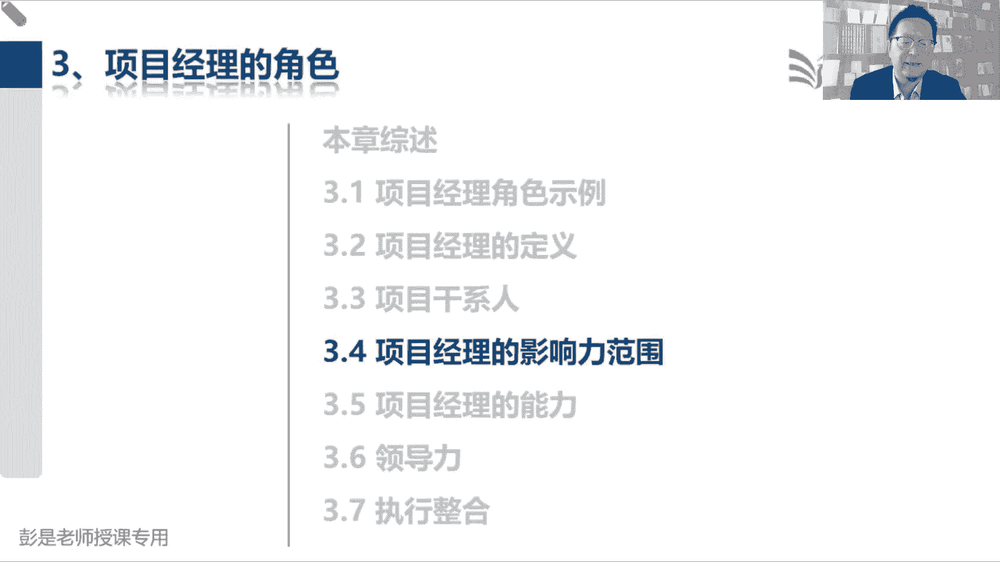

说项目经理在其影响力范围内担任多种角色，这种角色反映了项目经理的能力，体现了项目经理的什么作用啊，价值啊。

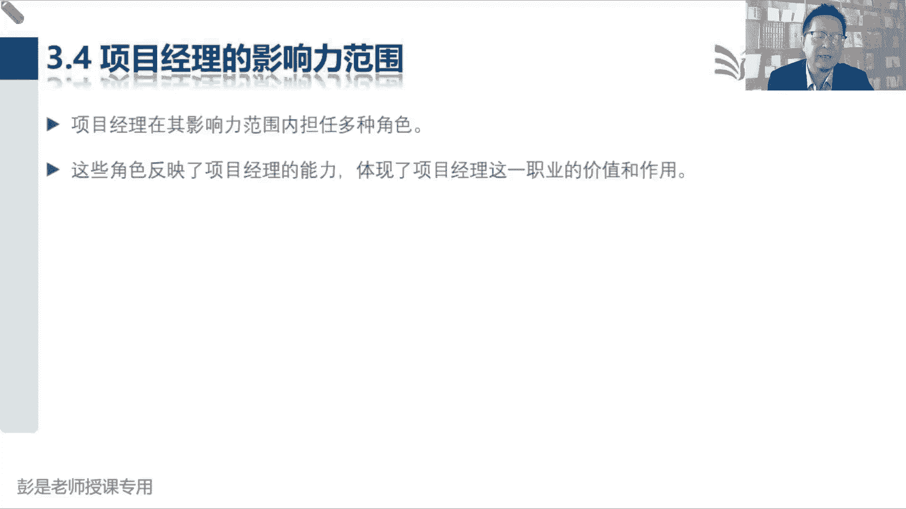

那影响力范围第一项目经理领导项目团队，实现项目目标和干系人的期望，咱带着兄弟们干活，完成任务，实现目标，得到期望的结果，达到最终的效果，所以中间就是项目经理干啥事，我们什么平衡竞争性的资源。

然后我们是沟通的这个桥梁，对不对，然后呢我们使用各种各样的技能，然后想办法让大家达成共识，这都了解就够了啊，没什么重要的，没有什么复杂的逻辑，总之啊让大家都开心都满意，这这道理啊。

所以这是项目想办法想方设法完成任务，实现目标，硬技能软技能全都招呼上，硬技能就是我们学的项目管理的知识，采购的知识范围，管理的知识进度管理，以此类推，软技能呢就是提高提高人维和。

维持人和人之间关系的一种技能对吧，会不会说话呀，情商高不高啊，幽默不幽默呀，以此类推，这都了解就可以了。

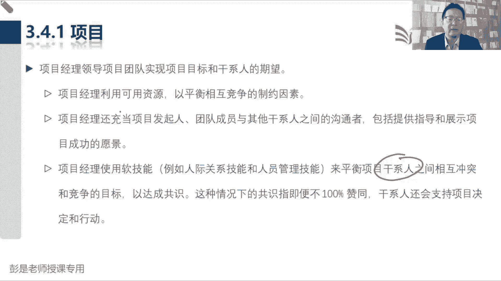

然后研究表明说，成功的项目经理，可以持续的有效地使用某些基本技能，说啊有很多很多优秀的卓越的出色的项目经理，是因为展现出了超凡的人际关系技能，和沟通技能以及积极的态度，这很好理解吧。

超凡的人际关系和人和见人说人话，见鬼说鬼话，让大家都都认可你，对不对，第二个沟通技能能不能把事说清楚啊，沟通还要讲方法，讲策略，有套路的，第三个呢积极主动对吧，不要消极，不要不要一些负面的情绪啊。

消极什么焦虑需要焦虑啊，悲观呐，哎这种情绪给他消除掉，展现出自己正能量的一面，这都是了解就可以，这都不是考点，因为这东西啊怎么考呢，没法考啊。

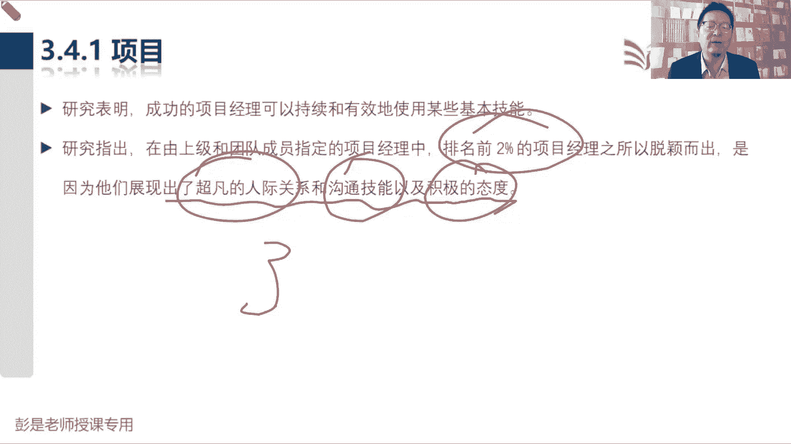

没法考啊，对不好，再往下说，我们巴拉巴拉，这都不念了，这沟通什么创建进度计划进行沟通。

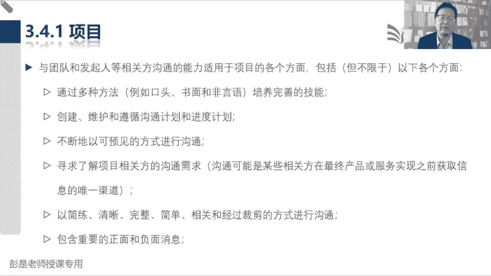

正面负面，这都各位同学想看就看，不想看，其实可以不看了啊，这种东西啊，他如果真想考的话，这种题你做一一道题，两道题就知道怎么选了，超简单的好，什么人际关系不念了。

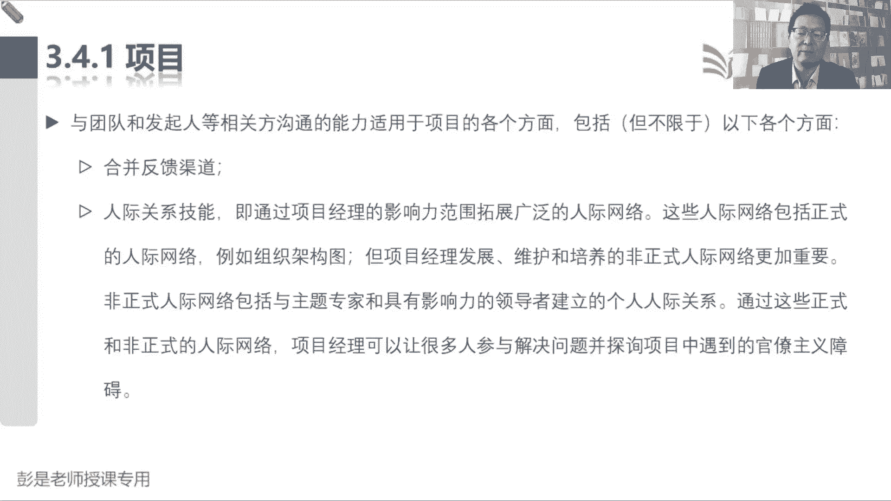

然后和其他经理互动，这段文字还是值得听一遍的，项目经理需要积极的和其他项目经理互动，与其他独立项目或者是统一项目集，或者是其他项目可能会对我们产生影响，为什么呢，第一对相同资源的需求。

第二资金分配的优先顺序，第三可交付成果的接受或发布，最后项目和组织目标和目的的一致性，这段文字啊，就是说项目之间可能会有各种各样的冲突，第一个就是相同资源的需求，相同资源的需求。

大家坐地铁坐公交车为什么要抢座呢，诶对相同资源的需求都喜欢，坐着都懒呐，对不对，那为什么要抢，为什么呃会抢座啊，那抢抢抢抢资源就会产生冲突嘶，那这事咋处理啊，排序呗，对不对，排序排序排序事分轻重缓急。

看看谁项目优先级高，谁项目优先级低，对最传统的排序方法就是排队呀，先来后到啊，谁先做就是谁的，那有一些特殊人群我们要给予照顾哎，排序优先级排序的方法还记得是啥吗，项目组合管理。

为什么有这个组合管理的管理方法呢，就是因为做的事情这么多，大家可能涉及到相同的资源，那我们要考虑到对位哪个事情优先级高，哪个事情更重要，然后呢给予资源和资金的倾斜，所以对相同资源的需求。

包括资金分配的优先顺序，这种我们企业来说就采用项目管理，这种称这种管理方法，帮助我们更好的去分析轻重缓急。

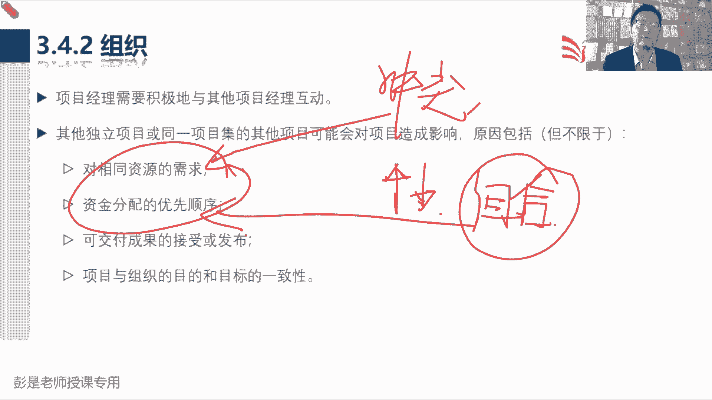

合理的分配人才部，那第三个可交付成果的接收或发布诶，A项目的成果和，B项目的和B项目或可能存在着关联关系，依赖关系，那咱把这个事啊给他组织好，协调好，避免受到影响啊。

这种管理方法就是项目及这个了解就可以了吧。

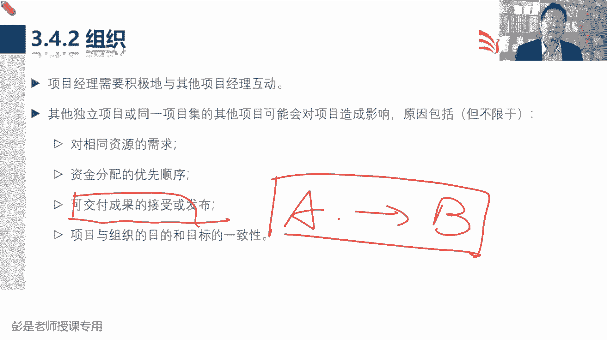

前面的知识点讲过的好，再往下说，和其他经理额，和其他项目经理什么什么产生积极的影响，满足需求。

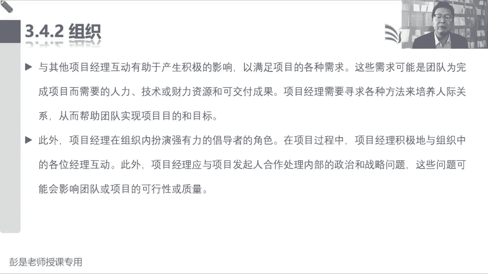

什么人不念了啊，这段文字看一遍就够了咳，那342再往下说，项目经理啊，可以致力于提高自己在组织内，总体项目管理的能力和技能，并参与隐性隐性知识的转，显性隐性知识的转移以及整合计划。

我们还应该致力于展现项目的价值，提高组织对项目管理的接受度，提高组织内现有PMO的效率效率，这段文字啊就是说方法方法方法对不对，想办法想办法，让我们企业不断的改进我们这些工作方法。

从而让我们项目啊能够提高成功的可能性，硬技能软技能全都招呼上，帮助企业更好地实现目标。

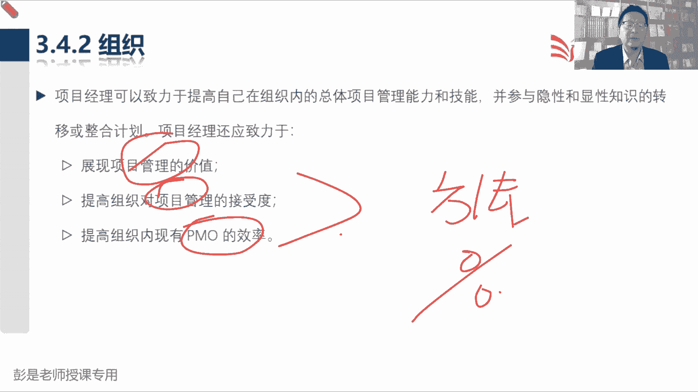

就这个道理听一遍，OK了，那这样再往下说，基于组织结构，项目经理可能向职能经理报告，在其他许多情况下，我们可能和其他经理巴拉巴拉巴拉巴拉不念了，总之啊合作对不对，因为我们工作中不可能只涉及到自己啊。

可能涉及到其他的职能部门，可能涉及到PMO，还有其他项目，再往上看，可能有项目集，可能有项目组合，所以呢我们要一盘棋，不能各扫门前雪，我们要考虑到考虑到相互之间的，这种各种各样的千丝万缕的管理关系。

然后呢紧密协作，紧密协作，帮助企业更好地实现目标。

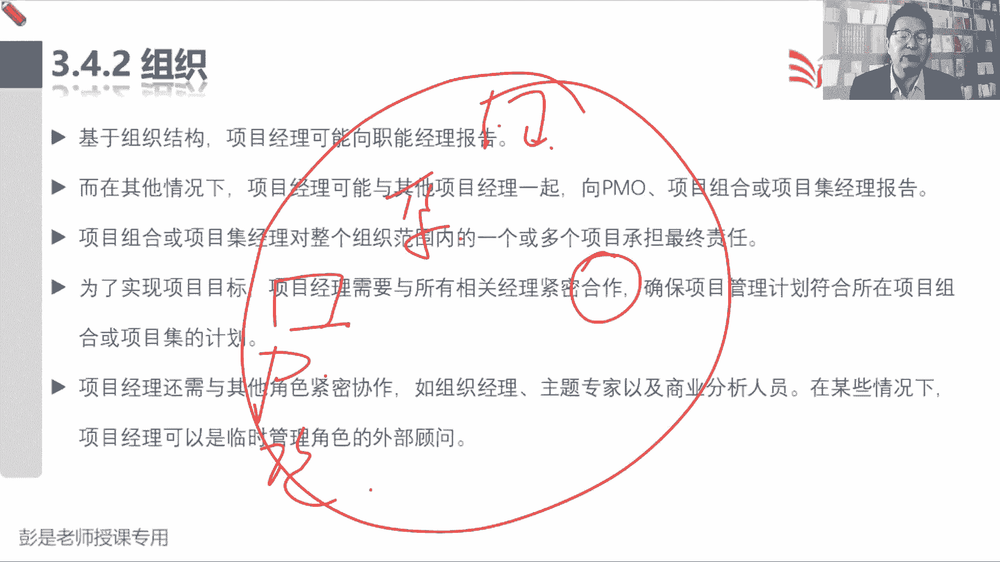

唉了解就够了吧，好再往下说343行业，那作为一个卓越的出色的项目经理啊，咱又不能闭门造车，还要看环境啊，甚至到国际形势，你做海外项目的肯定要关注啊对吧，国际形势啊，行业的需态势啊。

目前行业是一个什么情况呢，未来行业朝着什么方向去发展呢，我们公司在在这个行业里面处于什么地位呢，其他公司是一个什么情况呢，诶都给他了解清楚，这样从而更能够给发起人提出，更合理的建议和见解。

因为最重要的事情，项目启动之前，那个就是可行性研究，如果万一可行性研究的不充分，不客观，不真实，可能导致企业浪费人财物，对不对，做了半天没价值，做了半天没意义，那作为专业的项目经理。

怎么提出合理化的建议和见解呢，所以从宏观到微观，上到国家政政策对吧，国际形势这种东西啊，下到我们项目中具体的可交付成果，具体的事情诶，要能把这个脉络给他梳理清楚，想清楚，从而呢变变成有大局观的人。

所以大家其实感同身受的就是啊，如果真的是掌握了这些技能，真的是掌握了这些技能，项目经理其实特别特别像这样一个角色，啥都懂，CEO干啥呢，组织协调整合公司的资源，帮助我们更好的更好的完成任务，实现目标。

让企业实现这个宏图大业，那CEEO干什么呢，整合项目经理不也整合吗，CEO需要懂什么呢，啥都懂啊，项目经理需要懂什么呢，啥都懂啊对吧，行业的财务的，采购的范围的进度的啥都懂啊，安全的，健康的。

卫生的啥都懂啊，以此类推吧，咱还要还要懂可言，售前售中售后科研项目运维对，要把这个事情能够给他想清楚，然后呢尽早地参与到售前和售后之中，给我们的相关的人员提出合理化的建议和见解，哎就这个技能啊。

除了这些硬技能，还要有软技能，还记得还记得这些东西吗，都要给人家说清楚好，所以343呢看一遍不看，其实也可以，这是我们应该时刻关注行业的最新发展趋势，然后去思考我们这个项目对不对。

行业会对我们项目产生什么样的影响，我这个项目会对行业产生什么样的撬动呢，那还要关注我们项目要创造什么样的产品，服务或成果，它涉及到的什么技术啊，什么空间呐，以此类推，这是大局观。

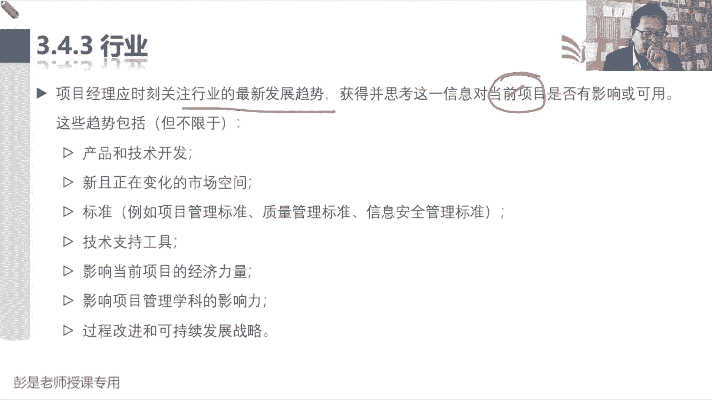

这个事情啊，好了解就可以，344专业学科说，项目经理对项目经理而言，持续的知识传递和整合非常重要，项目管理专业和项目经理担任的主题，专家和其他领域都在什巴拉专业，然后包括在当地去分享知识。

项目管理相关专业，其他专业什么培训教育，总之啊一个字搞定学，要想把事情做好，只有学只有学拥有的知识技能越多，可以帮助我们更精准的做决策。

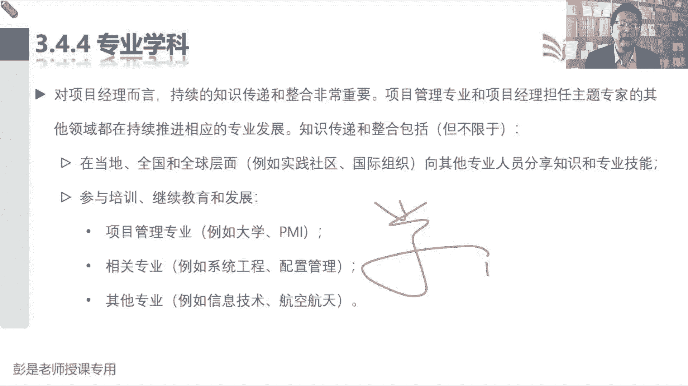

否则那就只能拍脑袋了，就这个道理啊，好345跨领域刚才也解释过了，对对我们针对组织价值，针对组织的价值，对指导什么可以告诉人家方法啊，什么宣传让大家了解这些管理方法的，好好好处不见了啊。

总之啊目前全球上来看啊，大家眼里边这些优秀的卓越的出色的项目经理，别把项目想得太小啊，小项目经理不一定需要有这么高的水平了吧，就是中等规模再大一点都可以啊，盖个什么住宅小区，修真的修个高速公路。

奥运场馆的建设，三峡工程，嘿就这样的事情，国计民生啊，甚至影响到国运呐，那这种项目的领导者一定是全才，对不对，不然这事儿hold不住。

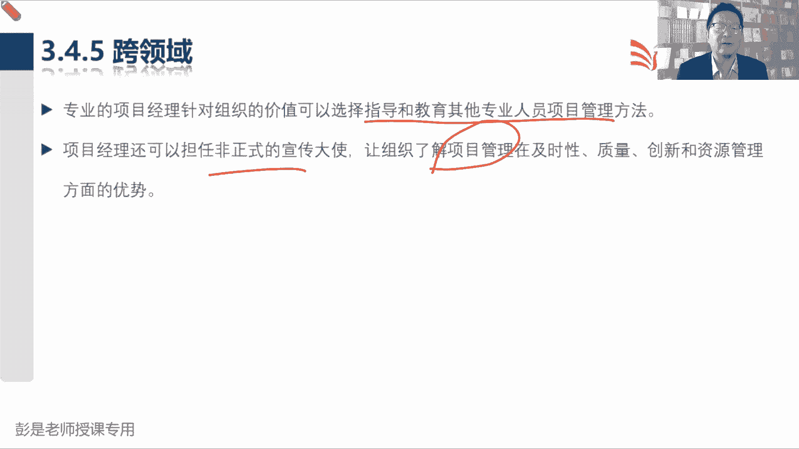

就这个逻辑好，知道中心思想，听一听，3。4听一遍。

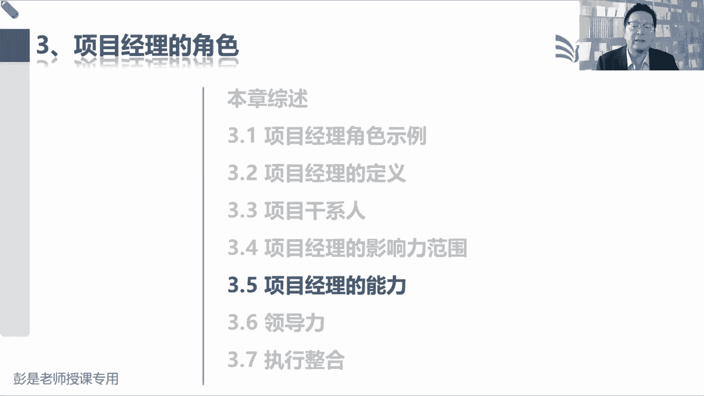

基本上就完事了。