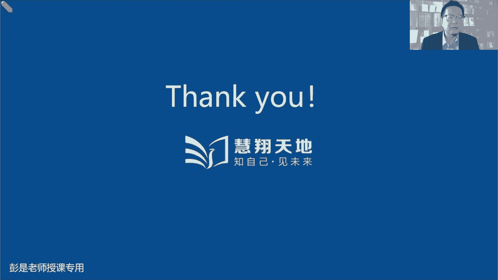

# 2024年最新版PMP考试第七版零基础一次通过项目管理认证 - P17：1.3.7 执行整合 - 慧翔天地 - BV1qC411E7Mw

3。7执行整合，这段内容呢超简单，各位同学，今天第一小堂课，下午第一小堂课程，最后轻松加愉快的一段执行整合，执行整合，刚才我们听过一个场景，乐队指挥对吧，有人敲锣，有人打鼓，有人弹琴，有人拉小提琴。

那怎么让大家更好的协作呢，什么时候声音强，什么时候声音弱，什么时候节奏快，什么时候节奏慢，就需要这样一个领导者来扮演这个角色，让大家能够协同工作，从而演奏出美妙的乐章，整合讲的就是这个东西好。

所以这段文字呢可看可不看，没注意啊，因为下一章我们就开始讲整合了好，最后几分钟做做简单的几道题，帮助大家找一下心理建设，以下哪一个不是项目经理的职责，确定了里面就找一个最确定的不确定的里面。

那就找一个最不确定的，一定要记住这句话，我们完成项目所需要的资源和资金是发起人，发起人从公司申请出来的，所以有的时候被这个词被翻译成赞助，他英文啊是sponsor发起人，赞助人。

所以有的时候会被翻译成赞助，变成人话呢，就是提供我们完成项目所需要的资源和资金，从向公司去申请，哎这是D为项目提供赞助，发起一个项目，这通常不是项目经理的东西，不要把它理解歪了啊，好看看这道题。

这超简单的，超简单的吧，所以啊你管理一个项目，要构建一个新的会计系统，另外一个部门的一个会计很喜欢目前的系统，所以呢他拒绝接受这个新系统的培训，处理这种情况的最佳做法是什么，A拒绝与他合作。

因为这个人太难共事，B诉诸于这个会计的部门经理，让他要求这个会计接受培训，C得到一个特许，使这个人不必接受培训，D合作了解他担心的问题，并尽可能采取措施缓解这些问题，而不影响你的项目啊。

这道题读完了之后发现没有人做错哈，所以考试这种题基本上也不考，这就是刚才说的那些东西啊，谜底就在谜面上的东西，它没法考，对不对，你就满满正能量，一身正气，道德高尚就高大上起来就可以了吧，A拒绝合作。

因为他太难共事，还遇到人不愿意不愿意用新系统，就拒绝跟他合作，但拒绝合作，拒绝合作，这个人采取的行为和措施，可能反过来对你的项目产生影响，这肯定是不行的，B诉诸于这个会计的部门经理。

让他要求这个会计接受这个培训，这DB这个选项啊，B这个选项不管是什么场景，都肯定不能选，第一人家不配合工作，就找对方的领导，显得我们自己没本事，想一想是不是老师张三欺负我老师。

李四欺负我老师王57575，遇到问题就找领导，遇到问题就找领导，显得我们自己没本事，第二让对方的领导要求这个会计接受培训，刚才说了吧，领导力和管理，管理是让有权利的人用权力命令对方去干活。

对方心里面可能全都是抵触啊，对对全都是负能量的吧，可能不心甘情愿会被动，不心甘情愿的情况下干活，效率质量容易出问题啊，唉所以这样的选项肯定是通常不选C，得到一个特许，让这个人不接受培训，不接受培训。

你这个项目创造的东西，最后呢人家可能不会用，对不对也欠妥，所以高大上的选项肯定是D，如果实在不配合呢，如果实在不配合呢，不知道具体情况具体分析啊，像这种东西啊，你说怎么可能通过考试。

给出一个标准的解决方案呢，能理解吗，有的人需要骂他，有的人需要打他，有的人需要组团打他，有的人需要哄一哄，有的人呢需要吓唬他，对不对，以此类推，具体情况具体分析，这没有没有一个方法能够解决这种问题的。

一定是看情况，一定是看人，看情况啊，不同的人，不同的人群，他的权利呀，他的心理啊不一样的，嗯但是原咱考试考的是什么呢，原则对不对，咱考试考的是原则啊，原则是什么呢，晓之以理，动之以情，让人家愿意相信你。

愿意支持你，愿意跟随你一起往前冲，那就找到这样的选项，还知道这个意思啊，好看看这道题，这简单吧简简单哈，说你注意到团队是自组织的，不需要您进行太多的监督，所以呢你允许团队自己做决策，并设定自己的目标。

这考试应该不考啊，这考试高频考点啊，等讲到敏捷，你就会发现就这样的场景会反复说的哎，这弹球是放任型的领导力风格，空气来答，答对了哈，所以记住啊，考试来说，考试来说沾到人的。

尤其是人的心理学这方面基本上没办法考，因为每个人的情况不一样，人的心海底针，这没办法搞，他没有统一的金标准，没有统一的金标准啊，对不对，大家随便带场景，同样一个同事，张三说话好使，李四说话不好使。

张三昨天说话好使，今天说话就不好使，对不对，难以预测，真的是难以预测，之前你们的学长还给我整整整Emo了，你们的学长啊，问了一个基本概念，然后咱课上反复讲了很多遍，我给他提建议，说你去看看书。

再复习一下课程，巩固一下基本概念，这个卡就转身转身找领导投诉，你说这话怎么整，唉无语好，所以人性人性没法考，你知道这个意思啊，所以呢人是最难管的，但是呢大多数人都是善良的，都是主动的，都是积极的吧。

唉也不要太悲观哈，凤毛麟角的，太特殊的情况，具体情况具体分析，大多数人咱基本上基本上周围周围的人，对不对，都是善良的，都是积极的，都是主动的，都是勤劳的，好知道这个意思，再看看下面这道题啊。

这道题品一品品一品啊，这道题实际上大家第一次做的时候需要纠结，怎么看，都是干系人，那咋选题目，问以下哪一个不是项目的干系人诶，负责构建的项目的项目经理，项目经理能够影响项目，这肯定是干系人呐。

参与项目的成员会影响项目，肯定是干洗使用产品，最终使用最终产品的客户，使用产品的客户诶，他会受到我们项目的影响，他也是干写产品，丢掉生意的竞争对手，受到项目的影响也是干系人的，那怎么选呢，都是怎么办。

都是竞争对手，是因为我们丢掉生意，受到了我们项目的影响，所以其实从概念上来说，这四个都是那咋选啊，记住啊，考试的思路永远是这样的，哎找一个可能性最小的，仅此而已，去推导四个选项的可能性。

好的里面找最好不好的里面找最不好，找一个可能性最低的，相对来说，相对来说，D这个选项可能性，对我们项目产生影响的可能性是最小的，对不对，ABCABC客户不买单，客户客户不买单，咱这项目就会受到影响啊。

哎相对来说D可能性最低，仅此而已，不代表着说选了D，那么D就不是干系人，对不对，这种这种题考试也不大会考，但是这个解题的思路肯定好啊，在四个选项里边排排序，去分析这些选项的可能性。

非常重要的一句话去分析这四个选项的可能性，最可能的就找一找一个最可能的，最有把握的选项，快速决策就可以了，好这道题呢，这道题考试有可能基本上都是这种题啊，又臭又长啊，嘿小丸子同学说到点了。

这道题考的是啥，只要读明白题，能够能够嗅到一种什么样的味道啊，说呀发现有一个供应商算钱的时候算错了，导致了发票变额少了1万多美元，那你应该怎么做才正能量，对不对，考的其实就是职业道德。

那找到这到找到道德水准最高的选项，对不对，顶到头了，诚实诚实，如实地向对方指出对方的错误，让人家告诉你，你少赚钱了，把钱找给你，就这个东西啊，这种东西考试的时候也会考，但基本上题目不会很多呀。

因为太容易做了，后面会说到职业道德这个话题，好再往下翻了啊，这个，这种这道题需要做到的是什么呢，就是把题目读明白，因为他题目中英文翻译的翻译的这个这个因素，导致读题的时候稍微费劲一点，说呀。

一个项目经理管理的项目遇到了麻烦，因为项目经理的一个成员表现的不好，致使项目经理错过了一个向干系人，承诺的重要日期，项目经理发现这个成员很清楚这个项目问题，但是没有告诉项目经理。

因为大家都很害怕项目经理的坏脾气，只要能读明白答案就出来了，最后一总结，项目经理脾气坏，太暴躁了，人家干活出问题没敢告诉你，那咋整呢，所以呢这是C吧，咱自己脾气不好，咱就改善个人技能，对不对。

控制一下自己的坏情绪，把这些什么坏暴躁啊，焦虑啊，不安惶恐啊，都给它抑制住，不要一不要让这种负面的，负面的东西影响到别人，不要让这种负面的情绪啊扩散出去，所以还记得刚才那个中心思想吗，就是啊正面的东西。

正能量的东西，中心思想是什么呢，让他最大化，要宣扬哎呀，张三在扶老奶奶过马路，很好啊，李四在帮助同事解决问题，很赞，王五啊，每天把办公室打扫得干干净净，表扬以此类推，正能量的东西最大化。

负面的东西呢一定是把画个圈圈，不要让它扩散出去，对不对，让它最小化呀，张三抱怨工作忙，待遇低，哎呀这个这个东西不要扩散出去，就这个道理啊，选A的同学，选A的同学肯定不对的，项目经理脾气坏，让他。

然后你让他补充pm和指南项目知识，让他看咱这个官方教材，可能越看脾气越坏，看不懂啊，看不进去啊，这肯定不能选他吧，就这个逻辑啊，所以还是改善软技能，改善软技能答案C好，这个知识点搞定，再看看这道题。

这个简单了吧，以下哪个干系人的定义最准确，好的里面找最好，坏的里面找最坏，A是不是该写呢，是B是不是也是C是不是也是D呢，A它覆盖的范围最广，最确定，所以呢答案就是D会影响项目受到项目影响。

自认为受到项目影响的，我们通通认为它是干写，好这道题，好恭喜各位同学啊，经过经过这几秒钟几秒钟的熏陶，B肯定不能选看这些这个单词，这个单词就不道德，哎都不要调查，都不要调查，所以这是C把道德顶到头。

把道德水平顶到头就可以了，就拿这个考研干部吧，哎就这意思啊，这种题你做一两道题，基本上就可以达到圣人的水平，非常棒啊，就想要什么如来佛，玉皇大帝对吧，耶稣基督就这种东西啊，打顶到头就可以了满格。

所以基本上现在职业道德也基本上不大考，太容易作答了。

好，这就是大家前前几章，给大家讲一讲重要的知识点，那接下来各位同学又到了重大利好时间。

接下来咱休息一下，给大家缓口气啊，看看现在几点。

现在14。42。