# 2024年最新版PMP考试第七版零基础一次通过项目管理认证 - P19：2.1.2 制定项目管理计划 - 慧翔天地 - BV1qC411E7Mw

终于讲到了1。2了，1。1讲了这么长时间了，接下来后面的课程你就会发现越讲越快。

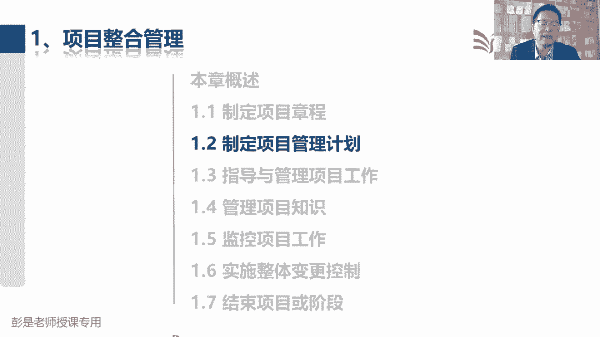

为什么呢，看看1。2，制定项目管理计划，输入项目章程，咱看过了事业环境因素，组织过程，资产知道了输出项目管理计划，包括了各种各样的子计划，现在大概有印象，再看中间的工具，专家判断头脑风暴，焦点小组访谈。

冲突管理引导会议管理，会议和前面那个管理过程一样，就多了一个单词叫核对单，看看是不是这意思啊，很多知识点你会发现这这也有，那也有，看多了就记住了，所以制定项目管理计划，其实后面大家复习的时候。

就这样不断的找到一些新的东西，然后呢把这个知识体系在脑子里给他完善出来，那制定项目管理计划，他写的啊输入叫其他管理过程的输出，输出呢又叫项目管理计划，这个其他管理过程的输出是什么东西呢。

接下来这一小段话术非常非常重要，各位同学打起精神，强打精神，专心听大家想一个大道理啊。

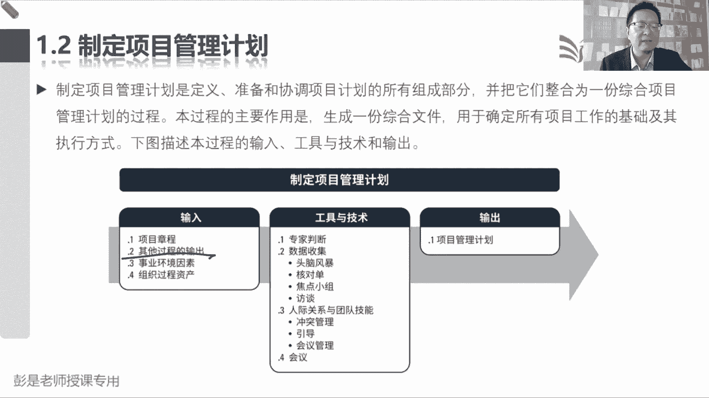

讲一个大道理啊，比如说对你公司来说，对你公司来说啊，我找一个空白一点的，对你公司来说是公司，有公司的整体规划，各个部门呢又有各个部门的工作规划，那是先有鸡还是先有蛋，是先有鸡还是先有蛋。

是各个部门先去做计划，还是公司先有一个整体的计划，就这个逻辑就这个逻辑啊，想明白OK了，好log同学说整体现规划，养老同学说公司规划公司吧，咱达成共识了啊，所以他的思路就是总分总不对。

公司您明年到底要实现什么目标，是销售额翻一番，客户满意度提高20%，还是要达到什么样的目标，你要说清楚啊，公司先有一个总体的规划，对您公司要朝着什么方向去发展，定企业的时候。

那个小三角目标愿景使命价值观哎，就这东西公司有了总体的计划之后，然后呢部门总分解吧，我们部门的各个部门的配合公司的总体计划，去制定各个部门的各种各样的子计划，对不对，财务啊，销售啊，什么采购啊。

按照工资总体规划完成各自部门的工作的规划，接下来还要做什么事呢，总分总总分总还要再汇总回去，把各个部门的计划交给老板，对不对，老板来看一看大家的计划之间，计划里面有没有什么冲突啊，需要协调啊。

想办法引导大家达成共识，确保公司的总体计划能够能够诶更可行，更靠谱，更客观，更真实，更这意思啊，所以他的逻辑就是个总分总这么一个工作模式，先有一个总体的指导，然后完成各个部门的工作规划。

最后再汇总回来变成整体的作战计划，项目也是这个逻辑，还记得我们那49个管理过程，那张表说项目经理有一个管理过程，在整合这一章叫制定项目管理计划，然后呢，我们九个大臣在规划过程组，规划过程组。

每个大臣手里边都有一个管理过程，叫规划，什么什么管理，规划范围管理，规划进度管理，规划成本管理，以此类推，这些规划管理是出此计划，所以接下来逻辑就变成了这样，项目经理呀，项目经理先根据我们章程。

根据章程，根据项目生命周期阶段划分开发方法，给大家一个总体的指导，项目分成多少个阶段呢，是一次交付用预测，还是我们小步快跑，用敏捷，还是说我们预测加敏捷混用，嘿，先先定这些大方向，就有了一个总体的指导。

根据项目经理给出的总体指导，各个大臣就完成各自知识领域的规划，规划范围出范围的管理计划，规划进度出进度的管理计划，规划成本中成本的管理计划，他们就知道这个知识领域怎么管了，那我们就得到各种各样的子计划。

最后呢这些子计划呀还要交给项目经理，我们在作为制定项目管理计划的输入，汇丰回来，最后呢就得到整个项目的计划了，这就是大概这个怪圈，这个怪圈看。

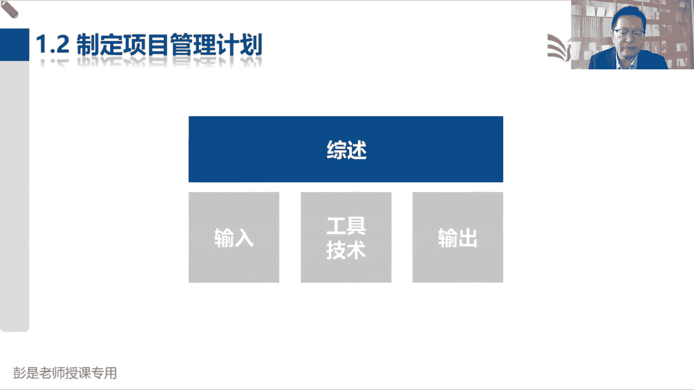

等我换一个浅一点的地方啊，就是这个怪圈，制定项目管理计划的输出就叫项目管理计划，包括了所有子计划，然后未来我们学到比如说规划范围管理，学到这个管理过程，你就会看到这个管理过程出什么呢，出范围的管理计划。

为了省事，我把管理两个字去了啊，规划范围管理，出范围的管理计划，那范围的管理计划这玩意儿咋写呀，项目经理，您先给我一个总体的指导，根据你项目管理计划的总体指导，我来分析一下范围怎么管。

因为敏捷有敏捷的管法，预测有预测的玩法，那有了范围管理的管理方法之后，我就写了一个范围的管理计划，写完了这个子计划之后啊，再作为制定项目管理计划的收入交给项目经理，您去整合。

您去把这个范围计划和进度的管理计划，成本的管理计划，各种子计划整合到一起，最后呢就变成了整个项目的管理计划，就是一个逻辑，1234字不错啊，好知道这个意思OK了，稍稍有一丢丢印象就可以了。

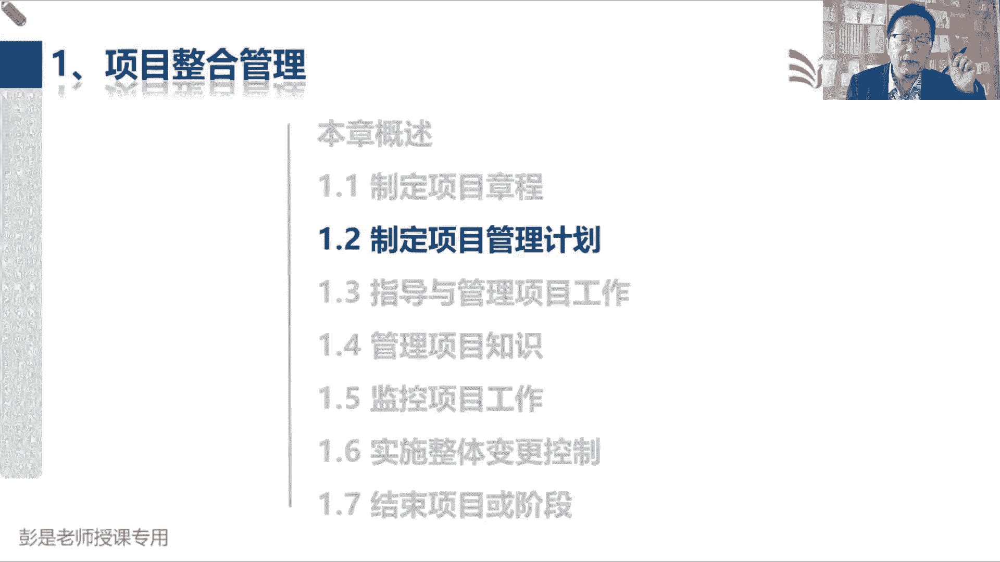

考试的时候也不会考的这么细了，你就知道个知道前面那个场景总分总总分总，万事万物基本上都是这个逻辑啊，好所以这种情况下，这个大道理听明白之后，再看他的输入，其实就完事了，就是九个大臣规划过程组的输出。

拿到这些输出，我们整合把它变成最终整个项目的计划，然后搞定中间的工具呢，专家判断头脑风暴焦点小组访谈，冲突管理引导会议管理会议都是见过的知识点，那就来了一个新的朋友叫核对单，有点晕啊，不晕呐。

刚才那段不理解的同学翻篇再看新的知识点，一断片思路跟不上就会蒙，但说白了不就是总分总这点事吗，这个能听懂吧，好核对单干什么事了，敢不敢猜啊，核对单什么东西啊，check list吧。

做个预习的同学能脱口而出，不容易啊，核对核对就是逐项打勾，就是逐项打勾，来看看这个东西好不好，对不对，所以就让大家大家你过年回老家，过年回老家看看衣服准备好了没有，看看什么鞋子准备好了没有。

看看证件带齐了没有，看看什么充电器带了没有，手机带了没有，还以此类推，要逐项打勾，逐项和任逐项检查来核对这个玩意儿的正确性，完整性，所以对标的项目管理的场景，就是通过核对单检查我们项目计划的正确性。

完整性，看看是不是该有的计划都有了，检查一下这些计划有没有都经过批准诶，就这意思范围的管理计划，有了进度的管理计划，写好了成本的管理计划，写完了，以此类推二，所以呢这个工具这个工具倒退了。

可不可以把核对单用在制定项目章程里面呢，可不可以在制定项目章程的时候是用核对单呢，完全可以吧，一点都不犯法呀，这个玩意儿这个玩意儿它适用于太多场景了，它也是通用的工具，哎确认仨二带个九啊，在哪都能用诶。

大学到位了啊，在写这玩意，这玩意是共性的通用的工具，那它到底属于哪一个管理过程，根本就不重要，理论上来说，干啥事都可以用核对单，就像今天一上课，各位同学声音正常吗，正常PPT能不能正常显示呢。

可以好核对无误，开始上课，就这东西，任何场景，只要只要觉得需要检查，对不对，超市买东西都可以吧，哎第一次给退了啊，好所以这个管理过程没有什么有代表性的工具。

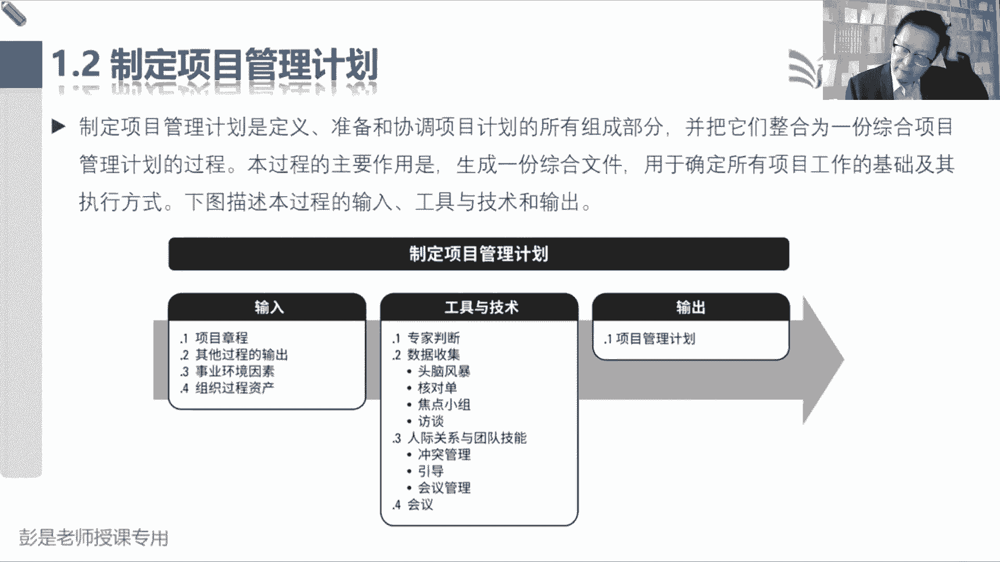

那就不用背了，那接下来后面的文字，基本上大家后面再看的话就超快了，没什么重要的东西了，项目管理计划，确定我们项目执行的监控收尾方式，因为是按照计划执行监控收尾，然后它的内容会因项目所在的应用领域。

和复杂程度而已，最后又变成人话，就是看情况，对不对，那项目管理计划可以概括的或者是详细的，这种话术，基本上就属于废话，什么都说了，什么都没说，所以他不重要，具体情况具体分析对吧，复杂的项目。

超大型的项目，那这计划肯定要详细一点啊，那像小项目啊，一会儿叫个外卖这种事情啊，大家想一想就差不多就完事了，所以它的详细程度取决于项目的情况，取决于具体的项目要求，取决于我们所需要管控的啊。

这个这个力度嗯好说，项目计划应该足够强大，可以应对不同变化的项目环境，这种敏捷性，有利于随项目进展而产出更准确的信息，这段话听完了之后，什么都没说，不用记啊，好这段文字上课听一遍搞定就不用看了。

那接下来这就是没得商量，肯定要记住的东西了，说项目管理计划应该基准化，也就是至少要规定项目的范围，进度和成本方面的基准，以便据此考核项目执行情况和管理项目的绩效，这是非常重要的一个知识点，这叫基准。

我们至少应该在范围，进度成本这三个知识领域有基准，基准干嘛用呢，用来评价工作情况，这叫绩效，那什么是基准呢，什么是基准呢，这是看干不该干的活儿，是不是没没干哈，画蛇添足，像你家小孩做英语作业。

然后他现在在做做，在做作业的同时玩玩具哎，这就超范围干活了吧不行，那杜绝杜绝范围之外的东东西啊，让你家小孩儿10分钟把这个题做完，他做了11分钟，这不就是进步基准吗，得把公司规定九点钟上班，我9。

01才到，迟到了，进度低端，就像你家小孩让你家小孩花两块钱买瓶酱油，结果呀到那花了十块钱买回来一瓶酱油超支了，这就是成本基准，所以呢大煤进度成本这三个领域有基准基准，用来衡量我们工作的情况，就叫绩效好。

有同学问我为什么没有质量好问题，实际工作中你质量那个叫什么呢，实际工作中质量可不可以有基准呢，可以，那为什么教材没有呢，没写呀，哎通常我们评价质量用这个词，标准，国家标准，行业标准，地方标准。

国际标准通常用这个术语，稍稍有印象就可以了对吧，国家标准咱的什么矿泉水呀，饮用水呀，都有国家标准的，吃个饭对吧，蔬菜农药残留都有要求吧，这都是标准的，所以质量方面叫标准。

那我们根据质量标准去确定项目的质量基准，可不可以呢，想这个只是想这个话题啊，我们根据各种各样的标准定项目的质量基准，可不可以，可以吧，哎所以书上用了这么一个术语，至少这是底线。

至少我们应该在范围进度成本方面有基准，那你说其他知识领域可不可以有基准，那可以啊，对不对，看情况看情况看情况，重要的事情说三遍哈，好，所以考试来说，咱就不认为有其他的基准，我们至少知道的是三三大基准。

范围进度成本来评价项目的绩效，然后再往下后面那个知识点也超重要啊，并且呢前面做个铺垫了，说呀，在确定基准之前，可能需要对计划进行多次更新，那么这些更新不需要遵循正式的流程，但是一旦确定了基准。

就只能通过实施整体变更控制做更新，这段话这段话其实少了少了一个环节，他没写明白啊，就是啊我们在制定计划的过程中，在编制计划的过程中想改随时改，项目经理自己把控就可以了，然后计划制定完成，计划制定完成。

怎么样才能变成基准呢，就是说无处不在的这个东西，审批制定计划完成，经过相关键关键干系人，关键相关方的审批才能称之为基准，然后审批通过，有了基准，就拿着基准考核我们的绩效，对不对，用理想和现实做比较。

看看有没有偏差，计划制定完成，经过批准才有基准啊，那刚才书上这段文字在说什么东西啊，说在编制计划的过程中，想改随时改，不需要走变更的流程，但是计划制定完成，如果想改基准没得商量。

只能开展实施整体变更控制，这个管理过程就这两句话非常重要，这就是考变更管理，我们评价评价要不要走，整体变更控制的一个重要依据，并且通常前半句也不大，会考所在计划制定的过程中，想改随时改，不需要走流程。

通常不考，通常考的就是什么呢，走变更好，所以说在这种情况下，如果需要变更，应该提出变更请求，以待决定，所以就有了实施整体变更控制，这个管理过程的输入，不管要改啥都要提变更请求，然后实施整体变更。

控制人来对变更做分析，做评估，做决策，知道这个意思啊，好那再往下后面这段文字没什么东西了，说对于隶属于项目及项目组合，说我们应该制定和人家一致的项目管理计划，变成大白话，就是说呀领导领导的计划对吧。

人家比咱高啊，咱应该和人家保持一致性。

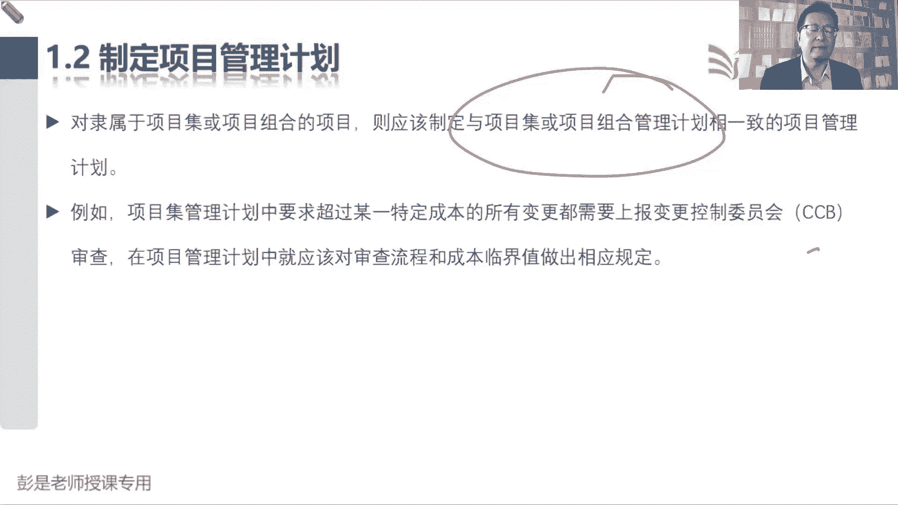

了解就够了，这也没什么东西啊，好各位同学再坚持一下啊，咱把这个管理过程讲完，讲完又可以休息一下。

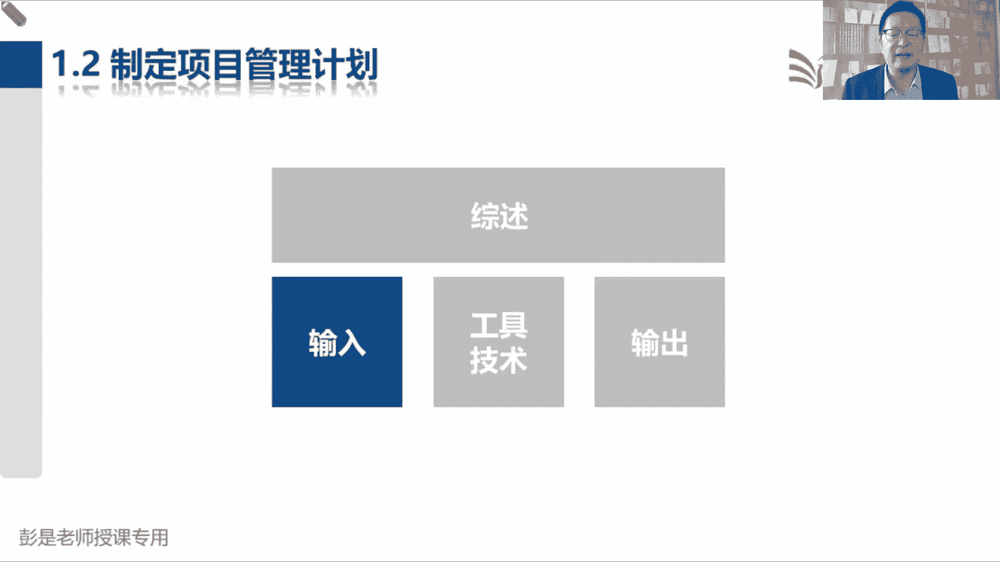

然后再讲后面这几个，那制定项目管理计划的输入，没有新的知识点了，章程我们知道了，其他过程的输出就是九个大神的输出，九个大神的输出，各种子激化，各种基准，各种子计划，各种基准。

所有的变更都是变这个圈圈里的，和咱没关系的，就不叫变更了，对不对，咱管的就是项目，这里边49个过程的变化变更啊，不要想的太复杂，就不要想的太复杂，化繁为简，大家一定一定不要想到各种可能性啊。

想的可能性越多，你就越头疼，什么叫想的可能性越多越头疼啊，这样发起人和项目经理，有没有可能是同一个人呢，如果是同一个人，这个发行言论正规，谁干的谁呀，如果是同一个人，这个章程谁来批呀，自己定自己批。

是不是不太好啊，你越想越头疼，不要想不要想，因为有成百上千上万种可能性啊，你想不明白，对不对，所以听话听音，听课听音反复讲的这些重要的原则，你把它记住不就完事了吗，需要有一个人来做启动之前的事情。

需要有一个人来批章程，这个人通常是发起人，掌握到这个程度就差不多了吧，好知道这个意思啊，总之现在我们掌握到什么呢，做计划，计划定好了之后，经过批准，不能随便改，这和大家实际工作中不是一模一样吗。

得有规矩啊，这就是实施整体变更控制最主要的作用，确保所有的变更受控，不能下来，不能胡来，那1212其他管理过程的输出没什么东西啊，这是九个大神的输出，包括各种各样的子计划，和刚才我们见过的三大基准。

那事业环境因素，组织过程资产没有新的知识点，接下来1221项目管理计划的输出。

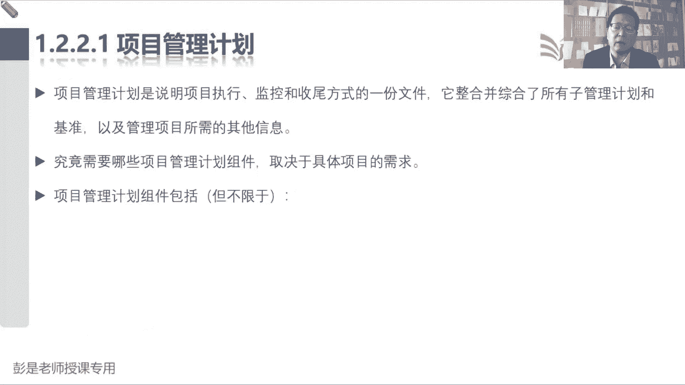

这段文字，这段文字学到最后啊，就这么记，93319是什么呢，九个知识领域的管理计划，我们有范围，知识领域进度，知识领域成本，知识领域，质量资源沟通风险，采购相关方，九个知识领域规划过程。

组内一个管理过程，规划范围，规划进度，规划成本都要出当前知识领域的管理计划，这个酒搞定，只要记住九大知识领域就搞定了，其中不太一样的就是相关方不叫管理，叫参与，在提倡参与的重要性，第二个三是什么东西。

第一个三是什么东西呢，这是三个单独的计划，没有知识领域的，我们没有一个知识领域叫需求管理。

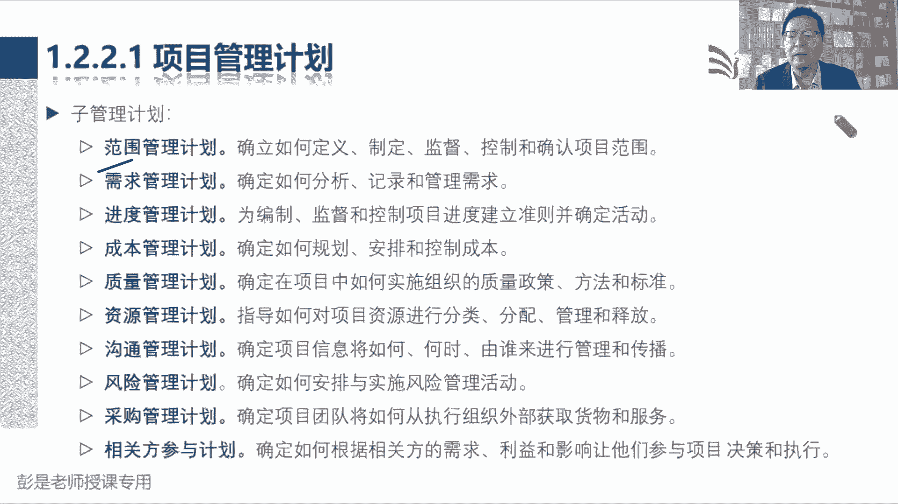

没有需求管理这个知识领域再往后翻，再往后翻啊。

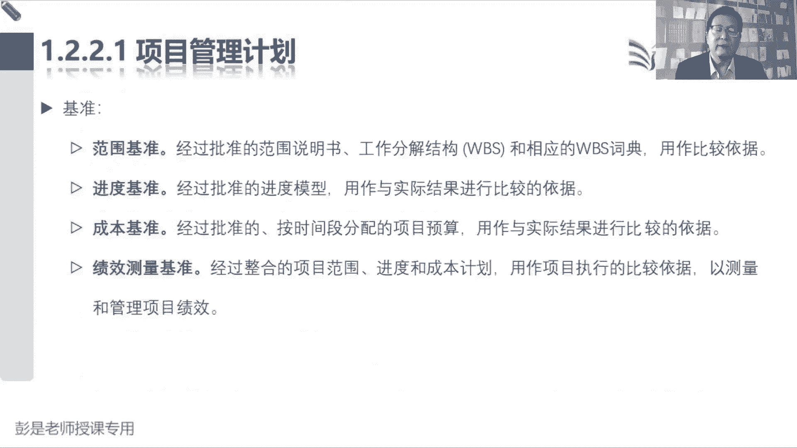

我们没有一个知识领域叫变更管理，没有知识领域叫配置管理，这就是三个单独的计划，需求管理计划告诉我们需求怎么管，变更管理计划告诉我们变更怎么管，配置管理计划告诉我们配置版本怎么管诶，这是三个单独的计划。

好九搞定第一个三搞定，第二个三是什么呢，刚才我们听听到过啊，至少应该在范围，进度成本这三个知识领域有基准。

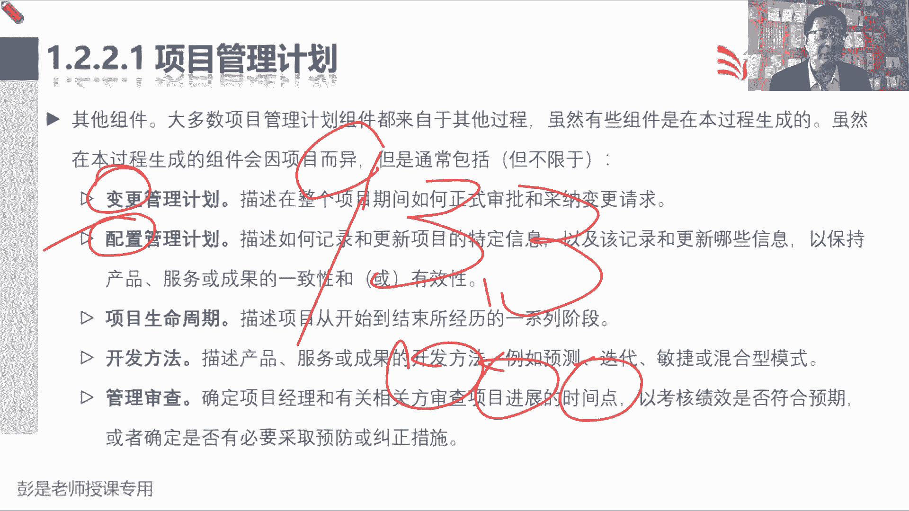

所以就会找到范围基准，进度基准成本基准，范围基准精度基准，成本基准，这三个基准打包到一起叫绩效测量基准，这就是9331的那个幺三个基准，经过整合的项目范围，进度和成本的计划，用来测量项目的绩效。

为什么要把这三个基准打包到一起呢，因为只评价一个东西没用，只评价一个东西没用啊，张三跟我说呀，说土豆丝，能不能下楼五块钱给我买一瓶可口可乐，我说可以，结果4年以后我把可乐交到张三手里，还给你超市小票啊。

花了四块五，还替你省了五毛钱呢，张三已经渴死了，所以这是范围是没毛病的，成本没超支，但是进度不符合要求诶，大家随便向上顶，以此类推了吧，刚才跟我说，10分钟给我买一瓶可口可乐，回来好。

10分钟以后可口可乐交到你手里，亲结账吧，花了4万多块钱，成本又超支了，范围，符合要求，进度符合要求，成本不符合也没有意义，所以呢我们要综合的分析什么时间花了多少钱，干了多少活。

就需要把这三个玩意儿打包到一起，什么时间进度花了多少钱，成本干了多少活范围这才有意义，这就是绩效测量基准，所以不好理解的东西啊，你全都给它加一个的字范围的基准，进度的基准，成本的基准测量绩效的基准。

测量绩效的基准诶，这叫绩效测量基准好，整个计划就是9331，九个知识领域的子计划，就叫什么什么的管理计划，三个单独的计划需求变更配置，至少应该在范围，进度成本，三个知识领域有基准，三个基准打包到一起。

我们要综合的分析项目的绩效，就叫绩效测量的基准诶，这就搞定了，也不太需要去硬背啊。

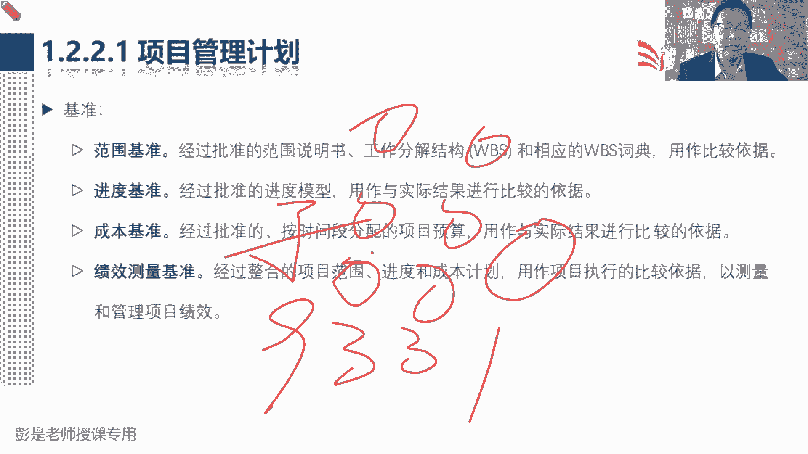

不太需要去硬背的，最后项目管理计划还写什么呢，记得那个总分总吧，总前面都是分，然后再汇总，所以项目经理先根据整个项目的情况，生命周期阶段划分什么开发方法诶，就这个东西这个也不太需要去背啊，了解就够了。

一是绩效测量基准吧。

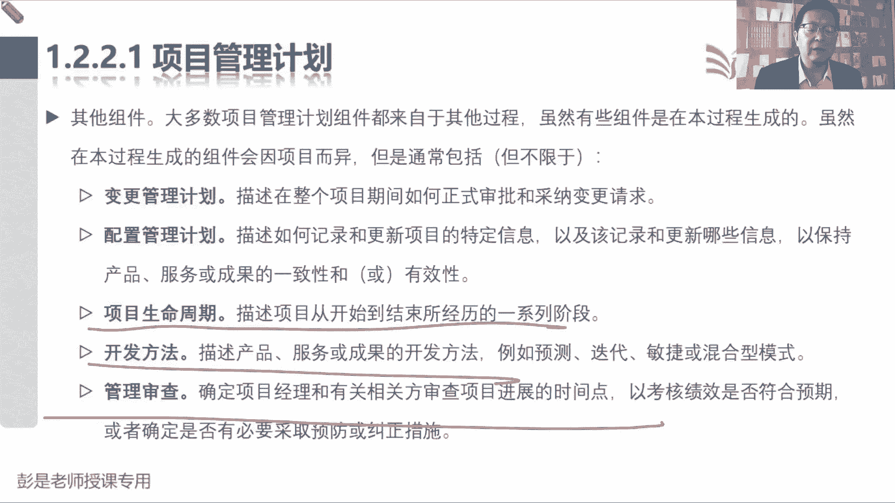

是是最后把这三个东西打包到一起，就得到了一绩效测量基准。

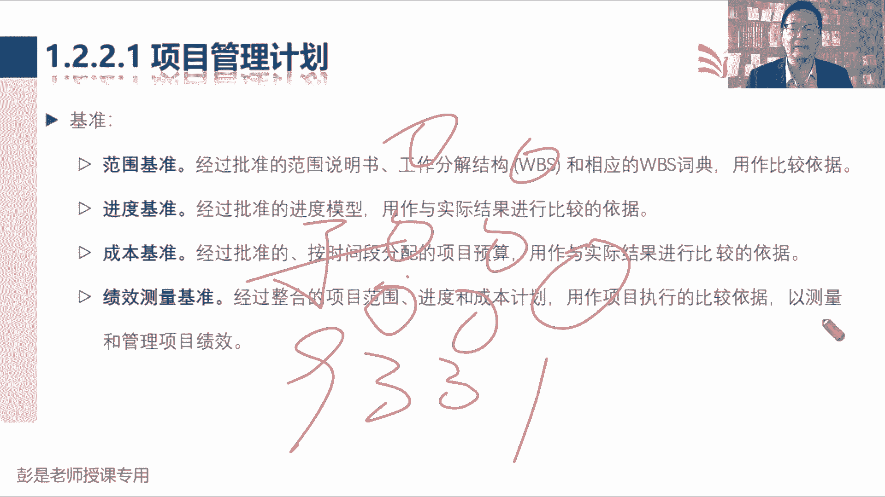

总体指导，总体指导公司先出一个总体的计划，就这东西啊，这玩意没那么复杂哈，这些生命周期阶段划分开发方法刚才说过了吧，好这就是整个项目管理计划的内容，就说起来啰嗦，说起来啰嗦，最后一总结没什么东西。

大家要保持保持步调的一致性啊。

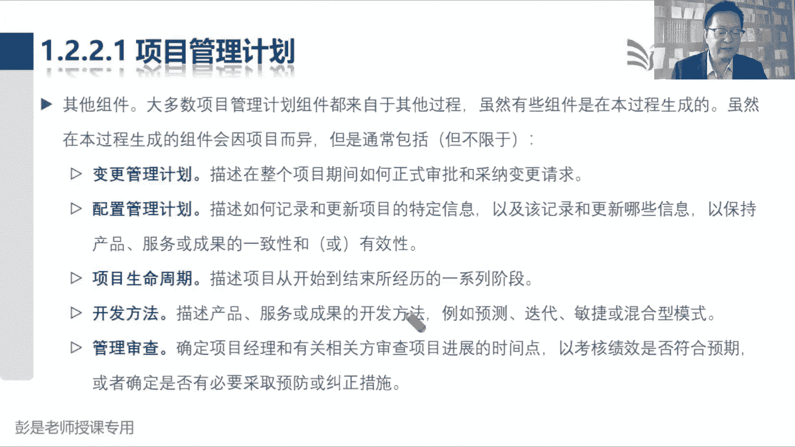

各位亲各位亲，你去仔细认真看一看这里的内容，自己都能总结出9331，这个这个这个这个这个这个这个这个这个，只要知道九个知识领域，就记住了，单独的一个玩意儿叫需求的管理计划。

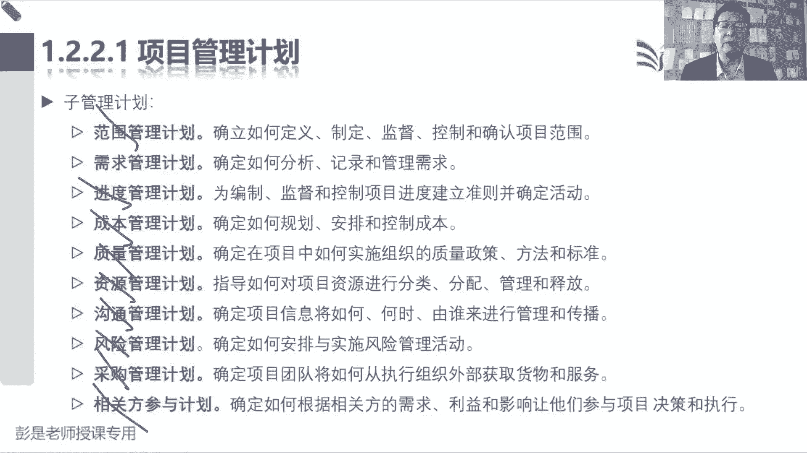

还有一个东西呢叫变更的管理计划。

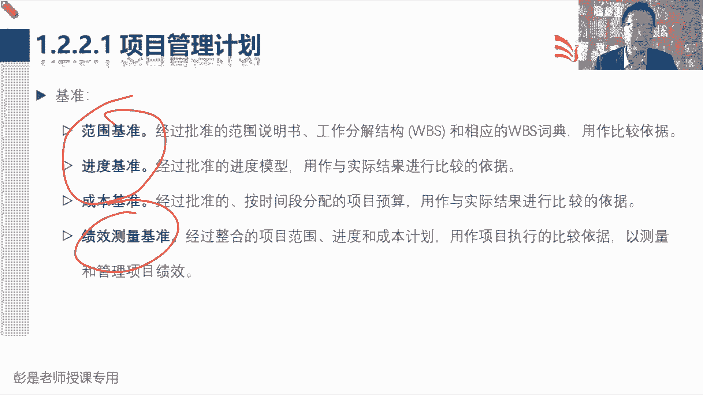

还有一个东西叫配置的管理计划，总分总总分总大家这个听课要保持专注啊，先有总体指导吧，所以没有说需要按照记住啊。

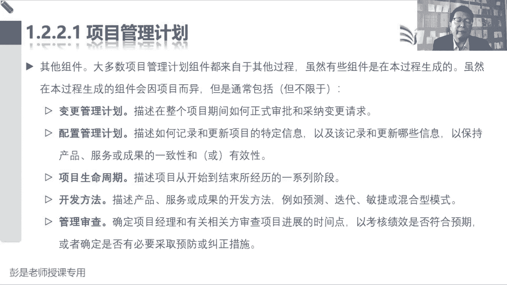

没有说需要按照教材这个顺序去写计划，没说过吧，没说过吧，从来没说过呀，不是说要先定范围管理计划，再定需求管理计划，再写进度管理计划。

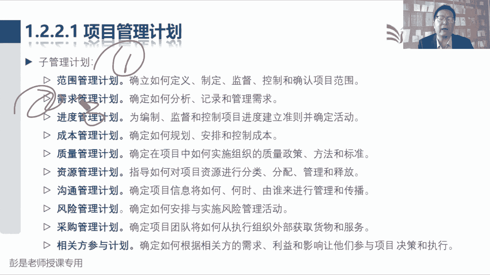

没有这个顺序，教材的顺序不代表着我们写进化的顺序啊，对对，所以听话听音，听话听音，特地强调了，先出总体指导，再出各种子计划，然后再汇总回来，这才是要掌握的东西啊。

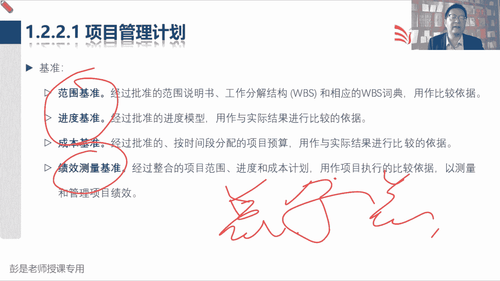

不要总听到一些不重要的东西，好专注，所以先给出这些东西，现在画个圈圈，就是总体指导，然后呢，前面那一大堆东西都是各种各样的子计划，各种各样的分级化，最后再全都塞到一起，订到一起。

不就是这个管理过程的输出吗，汇总，好配置管理是什么，现在看一看这段文字，能不能找到对应的关键词呢，找不到就需要手动往上写一写配置管理，刚才说管什么东西的，版本吧，哎所以所有的管理计划它的作用是什么呢。

就是告诉你这事到底怎么管，所以它的词都叫这个如何如何，都是指导性的计划，指导你这个事到底怎么管，怎么管怎么管，不就叫如何吗，我是保安队长，我是保安队长，我想管张三李四王五赵六这四个保安。

这四个保安到底怎么管呢，出一个保安的管理计划，就这点事儿吧，我是公司的保洁管，张三李四王五赵六，这保洁这四个人怎么管，保洁工作怎么管，出一个保洁的管理计划，告诉我们如何管这些人，以此类推。

法没有那么深奥啊，没有那么深奥，所以大家一定要做出空，叫什么控制住自己的欲望，现在说啥你能听懂，不要去展开去遐想，一遐想，一走神就歪了，就就叫什么抓小放大，为什么呢，抓小放大就是那些细枝末节。

就是那些细枝末节，哎呀这个变更管理计划到底怎么写呀，什么时间写呀，用word写还是记事本啊，哎呀写完了，这玩意儿怎么存档啊，这电脑用什么呀，用什么型号啊，要不要国产化呀，哎呀越想越头疼。

不要想咱不考细节，具体情况具体分析，但是作为项目的管理者，你不得写清楚吗，这些东西到底怎么管，要有规矩吧，不能胡来啊，对不对，所有的变更都要交给项目经理，咱要该走什么样的流程，这事要给他梳理清楚。

这就是管理的思路，思路统一具体措施，具体情况具体分析好，这就是这就是第二个管理过程。

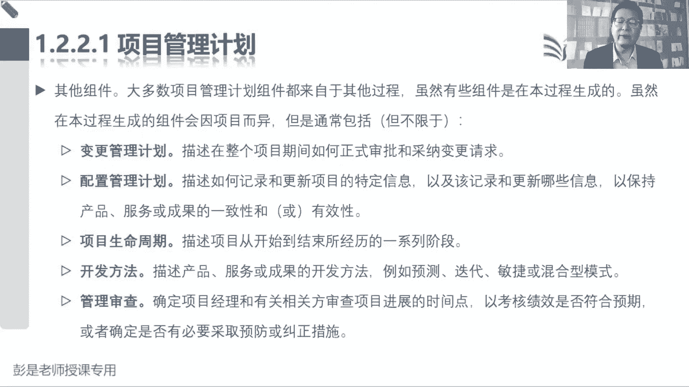

制定项目管理计划，那该什么东西了呢，后面这张图这张表这张表啊，左边应该搞定了，你一看诶，9331，然后总体的指导都在里面了，应该问题不大了，右边呢列出来33个项目文件，这33个项目文件说老师啊。

要不要从1~33，我给你正着背，倒着背，把它全都背下来，没用一点用都没有哈，那这张表有什么用呢，复习啊，复习的时候，各位同学需要达到这样一个状态，第一你能大概猜到他是哪个管理过程的输出。

有一些呀不用记的东西强调过了吧，比如说假设日志刚才我们见过了，说它是制定项目章程的输出，那么其他过程能不能对它更新，有没有可能对他更新呢，有可能那他就不用背，那有些东西啊是有一些管理过程的重要输出。

这就需要记得吧，好这是第一个啊，第二个是什么呢，大概啊这个东西这个东西里面写什么东西，也就是它的大概的内容要能够反应过来，不需要12345说的百分之百正确，但是这个思路要清楚，比如说发现问发现变更。

我们好记性不如烂笔头，那就一定把它记到变更日志里，以此类推，发现问题及问题日志，发现假设条件制约因素，即假设日志诶，这不是三个日志就搞定了吗，发现风险及风险登记册，发现相关方及相关方登记册。

发现经验教训及经验教训能力测，发现啥基督啥，这不就搞定了吗，达到这个状态就够了，但是现在呢我们现在刚讲，刚讲到第二个管理过程，其他管理过程还没讲，所以现在啊不需要去背这个玩意儿啊。

等咱十大知识领域全都讲完，复习的时候，这张纸是大家比较重要的一个复习的工具，去翻一翻温，故而知新，至少看到这堆术语，你要能反应过来，他市场这样读题的时候，如果把一堆单词放到题目里。

你就能够更快的更快地理解题目的意思，否则后面大家第一大障碍还记得吗，就是看题看不明白，看好几遍不知道在说啥，因为不专心，因为因为因为没有认知，因为概念不熟。

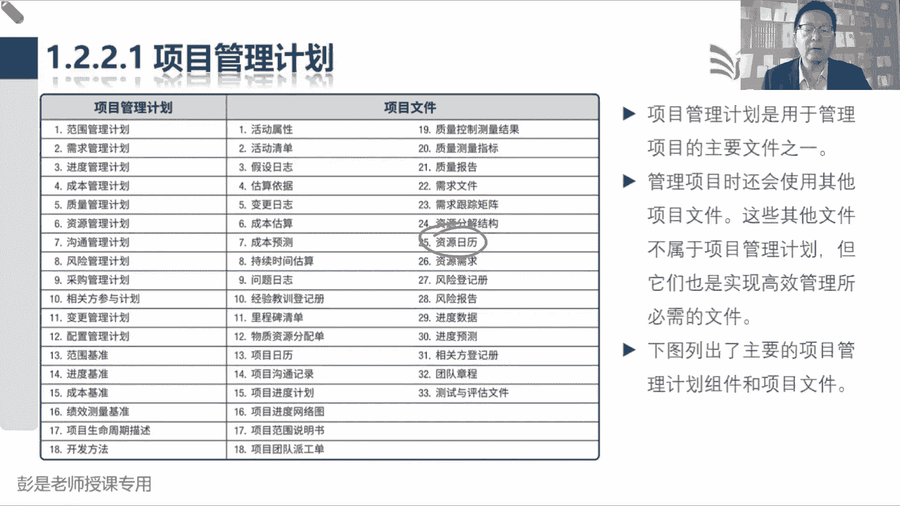