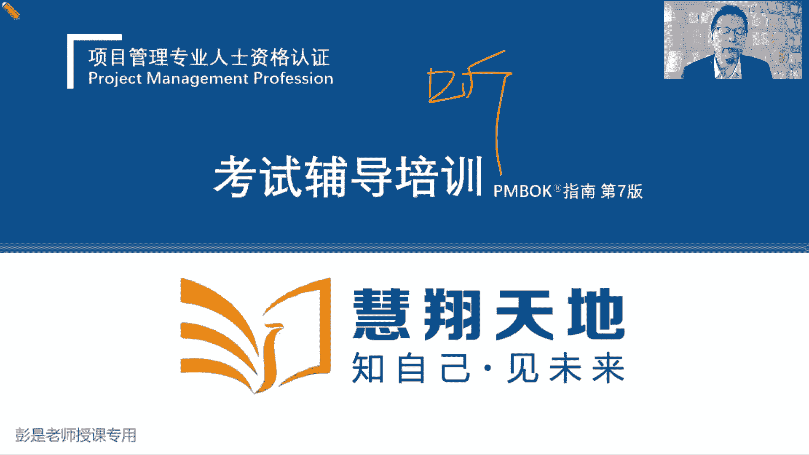
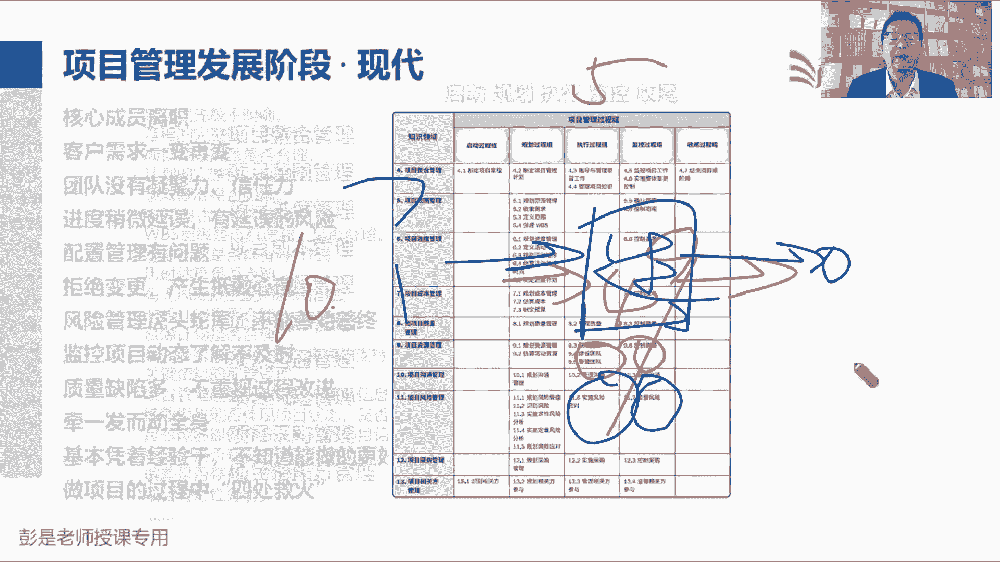
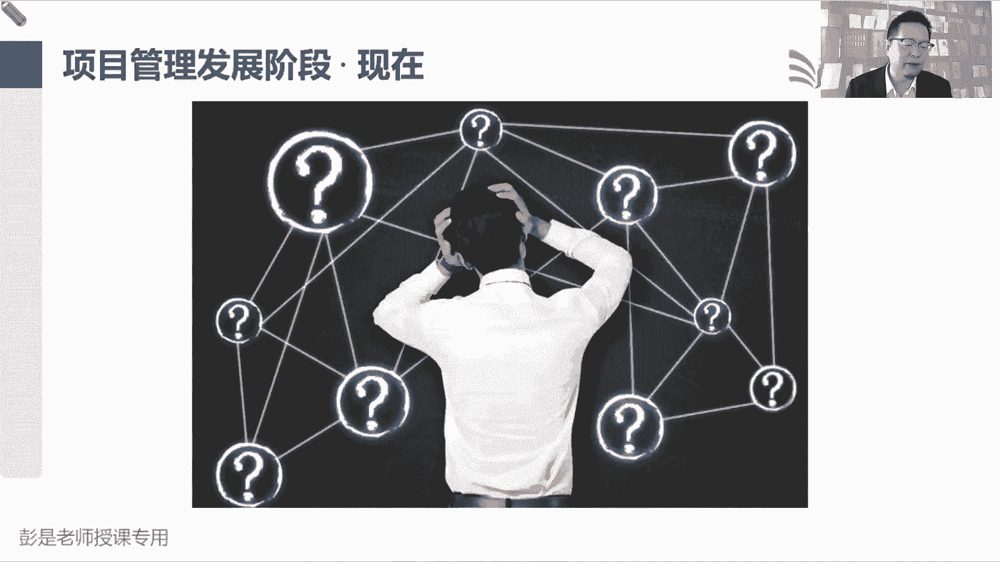
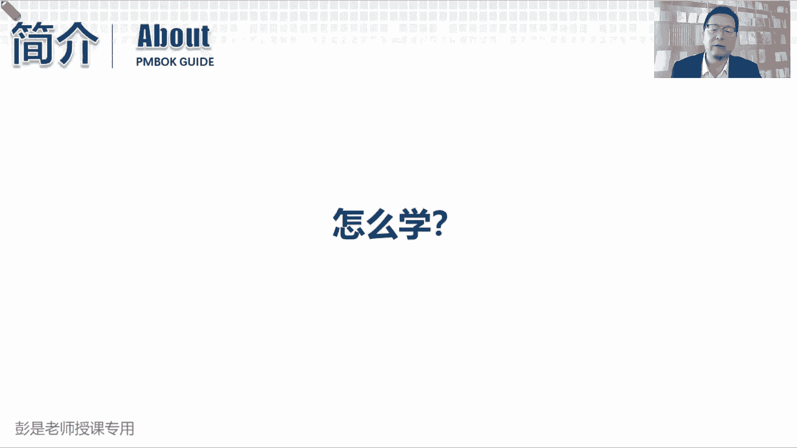
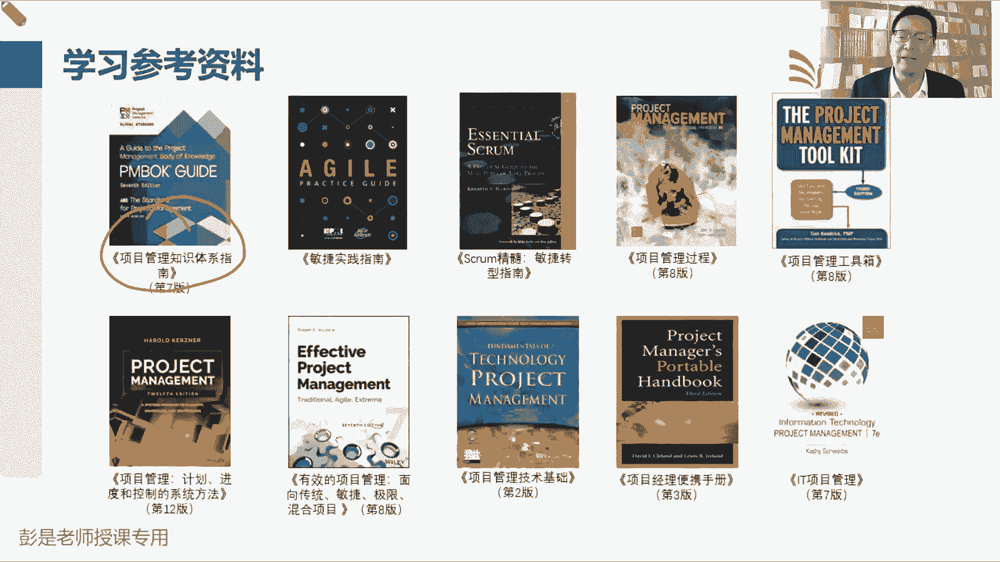
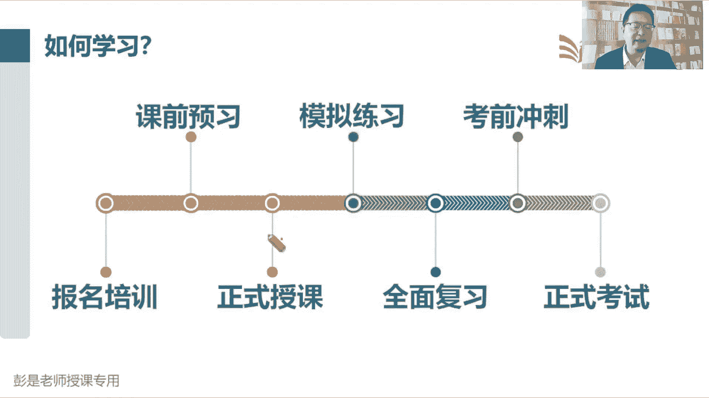
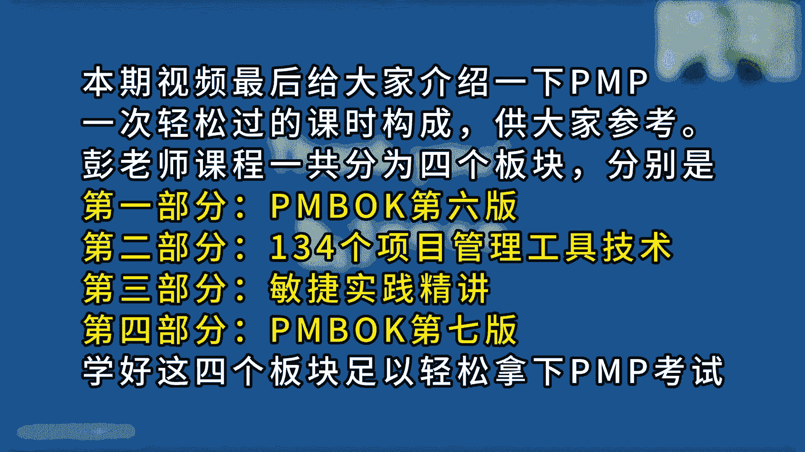
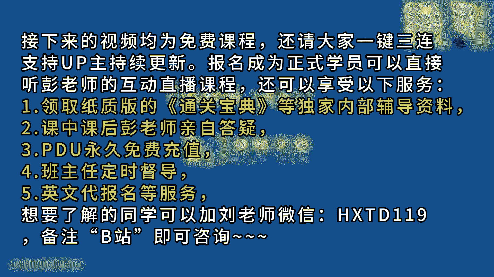

# 2024年最新版PMP考试第七版零基础一次通过项目管理认证 - P1：前言  PMP介绍 - 慧翔天地 - BV1qC411E7Mw

各位同学早上好，欢迎大家来参加咱们这个PMP考试，的培训课程吧，也就是精讲课，那今天第一第一小段课程讲什么呢，不讲知识点，给大家大概介绍一下的那个考试是什么情况啊，让大家做到心中心中成竹在胸。

知道咱要考什么东西，知道这个东西的考试的形式啊，包括考试的内容啊，哎先了解咱要咱要考什么东西，然后再去讲知识点，所以呢第一段第一段课程前一个小时，一个小时左右啊，这一个小时呢各位同学就配合老师。

专心听课就可以了，就听就完事了啊，不需要去看书。

书上也没有这部分内容了解一下，那咱大家咱学的这个课，这个课呀，叫PMPPMPPMP，这三个单词是什么意思呢，它的全称又是什么呢，到底什么是PMP考试，以前有人叫PMPPMP叫拍马屁，说我们要学拍马屁。

拍领导，拍客户，拍甲方，让大家都开心，多满意，这项目都成功了，诶其实有道理哈，偏僻偏僻，它的全称叫项目管理专业人士资格认证。

这project management professional professional professional诶，所以简称缩写就变成了PMP考试，全称叫项目管理专业人士资格认证。

没有声音的同学可以考虑刷新重进，我给你打出来啊，没声音就刷新，没声音的同学，没声音的同学都刷新一下啊，其他同学稍等稍等，因为咱今天第一天上课，没声音的同学看看最后这个大黄字就刷新，重新进一下。

应该就可以了，好54321，话说回来啊，咱那个考试全称叫项目管理专业人士资格认证，这个认证认证颁发的机构叫项目管理协会，简称PMI，叫美国项目管理协会，那美国项目管理协会颁发的项目管理。

专业人士资格认证，为什么这个东西这么火呢，为什么这个东西这么火，为什么这个东西说给给一直给大家说，这玩意儿有含金量，咱们了解一下这个协会做什么事啊，美国项目管理协会出的PMI全家桶，看看都有什么东西。

第一个咱考的这个东西叫项目管理，专业人士资格认证，除此之外呢，还有项目进度管理的一个专业认证，项目风险管理的专业认证，还有项目商业分析专业人士这个资格认证，PPA这个商业分析专业人士。

就和那个做产品的那条线搞产品经理，产品总监诶，搞这个事情，搞产品的规划和设计，这样一个专专业认证，产品和项目之间，也存在着各种各样千丝万缕的关联关系啊，产品的研发，产品的更新，产品的升级。

这也都需要用到项目管理相关的知识，然后呢左下角这个叫ACP敏捷管理，敏捷管理专业人士认证，这个对标到大家听说过的可能叫scam，scam培训，还和那个差不多，就是敏捷管理也是敏捷，在这种多变的环境下。

项目到底怎么管，有这样一个专业的认证，再往上走呢，项目集和项目组合管理，都是关于多项目这种管理的专业认证，多个项目如果存在着关联关系，依赖关系，怎么管好它多个项目，如果对企业来说，如果要做的项目很多。

那怎么把这个多这么多项目啊，排位优先级是分轻重缓急呢，唉这就是项目集和项目组合，最后那个其实没什么含金量了，助理项目管理专业人士，这是一个初级的入门的认证，他其实没什么含金量啊。

总之PMI作为项目管理协会推出的，关于项目管理的各种各样的全家桶，它要体现什么呢，体现在项目管理这个领域的地位还权威专业，所以全球从全球视角上来看啊，关于项目管理这个这个专业的认证啊。

大概有知名的有这么几个，咱现在学的这个是PMI推出的p mp认证，prince to推出那个prince to princial，也是一个项目管理的专业认证，还有欧洲出了一个IPMP。

然后咱国内呢有CSPM各种各样的东西，但是不管是美国的，英国的，欧洲的，中国的全球视角上来看，目前最受大家欢迎的，最受大家认可的仍然是PMI给出的PMP，也就是咱现在学的这个东西，它的认可度非常高。

无论是在美国，在欧洲，在亚洲，在澳洲基本上通吃，基本上通吃啊，基本上像各大企业呀，包括我们的不管是国企还是私企还是外企啊，都比较认可这个东西，那这个东西既然这么火，既然这么火啊，等一下走了啊。

怎么搞全屏啊，我也不知道看他火到什么程度，目前TM目前PMI美国项目管理协会，他在全球200多个国家和地区，已经开通了考试认证机构，相当于基本上无死角全覆盖，除了一些什么不发达的国家和地区啊。

基本上全都有了，然后目前PMI在全球，全球的会员总数已经超过了300万人，是有有效证书的人呢，120万左右诶，那为什么有证书的人比这个会员少这么多呀，因为对于一些大佬来说呀，没必要了，对不对，像马云。

马化腾，像这些大佬，他需不需要有这个证书呢，不需要对不对，证书对他来说没有价值，没有含金量，但是对咱打工人来说，这个证书还是有含金量的啊，所以他的持有证书的人比会员要少，然后呢。

目前全球75%的企业在招聘项目管理，这个专业的专业岗位的时候，会优先考虑拥有pp的人士，有这变成大白话就是有证书啊，比没证书诶，被录取的概率会高，因为有证书，至少至少至少能够证明我们有什么能力呢。

学习能力啊，对不对，不一定有，不一定工作能力还是需要在实践中去检验的，但至少证明咱有这个学习能力，对不对，能够通过考试拿到证书，说明学习能力包括阅读，包括写作，对读写能力是达到了一定一定的水平，对不对。

甚至包括记忆能力啊，理解能力啊哈总之啊不管是啥东西，对不对，至少能证明我们有这个本事，所以PMI在全球既然火，既然火火到这个程度，那再往下啊，为什么呢，看看他在中国火到什么程度了，1999年。

把这个PP认证引入到了国内，所有的国外的国际上的这种认证，要想在中国开展，不然呢不能不能让人家干的，叫什么中国国际，什么海外人才交流基金会里面去了，也就是未来大家需要中文报名的那个网站。

那那家机构他是政府部门的啊，1999年引入到过中国，到今年已经二十二十五年了吧，2018年年度，参加认证的人数已经超过了10万人，2022年，持证人数在中国已经超过了50万人，就火到这个程度。

说全球持有有效证书的人才120万，130万左右，咱国内基本上现在有证书的人50万人了，以前以前啊，咱国中国啊是在持有证书的时候，是在排在第三，第一大国家是美国，第三大国是中国。

常从2022年2023年开始，咱们就超过日本了，现在我们是全球第二大，持有有效PMP证书的这样一个国家，那你像什么日本，美国人家的企业管理成熟不成熟啊，规范不规范的标准不标准的。

这就不需要过多的解释了吧，总之大家既然追捧这个东西，说明这个东西有价值，说明这个东西不是水货，不是水货呀，因为大家后来后，未来你要去走职业发展道路的时候，你会看到各种各样的考试，各种各样的证书。

你要去思考了，这个证书有没有价值，有没有含金量，对不对，因为很多证书基本上基本上都是嗯，骗钱的性质啊，不解释了好，那中国持有证书的人数已经超过了50万，目前在国内你能不能猜啊，有证书最多的企业是谁呢。

咱从各个角度来帮助大家去分析，这个东西到底靠谱不靠谱啊，有PMP证书最多的企业没错，华为哎大家都知道吧，华为也不傻吧对吧，这家企业不傻呀，他鼓励他的员工去学这个管理技能吧，那他认可这个证书。

就说明学习这套东西还是确实确实对工作中，对工作中的实践是有指导意义的，它是有价值的，否则呢，人家公司为什么要投入这么多的钱，去学这个东西呢，以此类推了吧，好所以不管从各个角度去分析啊。

都告诉大家告诉我们一个道理啊，这个玩意儿它确实是有含金量的，那我们再换个角度看问题啊，这个东西有含金量，这个东西火，那这个东西我们要想获得到它容易吗，OK所以希望大家做好心理建设，心理准备不容易。

一定是不容易的，对不对，太简单了，证书相信啊，相信啊，没有人去追捧啊，比如说四则运算小能手，四则运算专业人士资格认证加减乘除，相信没有人去考这个证书啊，他对我们来说没有含金量啊，对不对。

很容易就能拿到的东西，它不值钱，对不对，就这个道理啊，所以大家一定要做好心理准备，然后呢，做好心理准备，这个东西需要大家掌握的知识是非常多的，不仅仅要理解，不仅仅要理解，还尽量的需要记住一些东西。

不像大家那个认知中，比如说学教育学，学学习科目一考试，考考驾照，学科目一考驾照，基本上就不用看书，也不用听课，就做题就够了，一共就那么几百道题，对不对，天天做，天天做一两天，记性好的同学甚至一天就够了。

刷一遍记住答案去考试就可以得到驾照了，但是呢PMP考试可不是这个逻辑，因为题目在变，选项在变，它不是固定的，还题目在变，选项在变，所以呢不不断的不断的，我们会遇到个全新的题啊，那这种情况下你去刷题。

去去背题，可能很难通过考试的，还是需要回到根儿上，需要我们去不断的听课看书听课看书，掌握知识点，在掌握的基础之上，你去理解它的底层逻辑，理解他的价值观，理解才是最终的王道，哎去做好这个心理准备啊。

没这么容易的好，那再往下了，关于咱学习学习，PMBOK是什么东西呢，PANBOOK就是咱的官方教材，它的全称叫项目管理知识体系指南，就是告诉我们在整个项目管理的海洋里，大家目前常用的知识体系都有啥。

这个体系中我们常用的知识点都有啥，所以呢这叫项目管理知识体系指南，那这本教材它是怎么发展出来的，需要给大家稍微简介一下，不愧是录播课吧，今年是2024年2月24号正月15，各位同学元宵节快乐。

以前从来没有中月15上过课好，这是今天是首次，也是创了一个新的记录，所以呢不是录播课，好继续了啊，那项目管理发展的阶段，也就是我们官方教材，官方教材的发展的过程，那第一大阶段大家达成共识的。

通常有这么几个经典的时时期啊，第一个阶段叫古代经验式的项目管理阶段，在这个阶段的实施目标主要是完成任务，修金字塔，修长城，反正皇帝老儿发话了，这个东西要按时完成，按时完成，对不对，管他死多少人呢。

管他花多少钱呢，还把这活干了就完事了，那当时当时这也称之为项目啊，盖刚修长城，盖金字塔，这也是项目，那我们想办法完成任务，实现目标就可以了，也会有相关的经验的积累，对不对，也会有相关经验的积累啊。

修长城怎么修啊，山上怎么修，海上怎么修，但是这套这套积累下来下来的经验，它有什么问题呢，它不一定适用于其他项目，修长城的人不一定会修金字塔，修金字塔的人不一定会修长城，修长城的人不一定会修什么。

秦始皇陵不一定会盖住宅，不一定会修皇宫，对不对，他不一定会搞研究，搞医药研究，搞医学研究，他不一定会会干其他事情啊，它有局限性，它有局限性啊，那它有局限性，它就不是通用的技能，这能听懂吧。

他不是通用的技能，它只适用于当前这个情况，只适用于当前这个场景，那咱们现在学的叫项目管理专业人事资格认证，它是一个通用的学科，它适用于任何类型的项目，不管是你盖房子，研究药品，开发软件，做游戏。

嘿以此类推，它是适用于所有的项目，所以它是逐渐逐渐逐渐有这么一个过渡的过程，那到了第二个阶段叫近代，近代有两个非常著名的事件，推动了项目管理这些学科，这些专业的发展，就是左边叫曼哈顿。

曼哈顿计划就是造了个原子弹，大家前一阵看过这个电影，奥本海姆奥巴奥本海默吧，右边的是阿波罗登月计划，这两个这两个大大非常著名的事件啊，它的时代背景基本上差不多都是时间紧，任务重要，确保完成任务。

实现目标，得到我们期望的结果，二战时间紧，任务重，尽快把原子弹造出来，炸死小日本，对不对，然后美苏泰太空争霸，阿波罗登月计划就是这样一个时代背景，美国和苏联搞太空争霸，今天你发射个火箭。

明天我就绕地球转几圈，你转几圈我就宇航员出舱，你宇航员出舱我就登，我就登月诶，就是时间紧，任务重，需要达到一定的质量标准和要求，尽好尽快的尽快的是完成任务，实现目标。

于是当时一大堆著名的科学家就去思考了，我们有什么方法，有什么方法能够把这个事儿管理好呢，对不管是造原子弹呢还是登月呀，我们有什么通用的方法，通用的技能可以帮助我们更好地完成任务，实现目标。

提高这个项目成功的可能性，提高这个项目成功的概率，能够做到按时按质量，按预算完整项目得到期望的结果，这把就讲出了我们未来要掌握的，非常非常核心的一些方法，包括什么分解呀，关键路径法呀。

包括我们的政治分析呀，哎有了这些东西，那后来啊大家发现我们科学家给出的这些方法，确实在工作中是有用的，是有效的，可以确实帮助我们管理好范围呀，进度啊，成本啊，质量啊，以此类推了，从此之后呢。

这些方法这些方法用到其他项目上，好使不好使呢也好使，所以其实从这两这些著名事件之后呢，包括美国就立法要求了，说国家花钱做项目啊，咱们一定要采用这些科学管理方法，如果供应商投标的时候。

你不采用我们这些标准的方法诶，我们就不和你签合同，就有了这个逻辑，这是近代两个非常著名的时间啊，然后到了现在大家在工作中又会发现了，因为工作中啊问题总比，叫现实，现实理想很很丰满，现实很骨感。

我们工作中总会出现各种各样的新的问题，这问题怎么可能没有呢，问题会不断的出现，不断的出现，然后在工作中又通常说对吧，只要思想不滑坡，方法总比问题多，方法总比困难多，我们遇到问题想方法。

遇到问题想方法就不断的总结，不断的总结，然后呢想想还要还要更进一步的去思考啊，怎么让这个问题尽量不要重复出现，重复发生就变成了一大堆的什么呢，叫注意事项，就变成了一大堆的注意事项。

就结合到1000万疫情能理解吧，我们要怎么尽量的不要被传染呢，还要什么戴口罩啊，消毒啊，健康码啊，尽量的不要去封闭空间，尽量的没事，多开开窗通风，有很多很多很多很多的注意事项，那管项目开展工作也如此。

有很多注意事项我们要去思考了，说是核心成员离职了，这可能会对，可能会对我项目产生造成什么样的影响，带来什么样的问题，那遇到这样的问题，我怎么去解决它，如何更好地事先避免这个问题，对我项目产生的影响呢。

向客户需求一边在变，遇到这种需求不确定，需求变化多的情况下，我应该怎么去管理，这个有效的管理项目的需求呢，以此类推，有了很多很多很多的注意事项，那注意事项多了，注意事项事项多了啊。

就变成了非常非常非常非常非常非常烦的，一大套一个大清单，这个清单这个清单越越存越多，越攒越多，不断的积累，不断的积累啊，变成成百上千上万个注意事项，那信息一多说需要注意的事情这么多，这看起来看起来呀。

从头看到尾好累的，需要做什么事儿呢，信息太多了，信息太多了，需要做一个什么事呢，唉咱分分组吧，分分组分分组干这个事儿了吧，需要分组了，这个大家参考你公司的人对吧，说我们公司要3000人呐，4000人呢。

1万人呢人一多就需要分组，对不对，分部门分小组，以此类推吧，那注意事项太多也是这个逻辑，所以呢就变成了我们经典的叫十大知识领域，告诉我们在管项目范围的时候，都有什么注意事项。

管进度的时候都有哪些注意事项，管成本，管质量，管资源管沟通，以此类推，诶我们正经要做了分组，这是总结归纳变成了十个知识领域，包括整合管理，然后横向有了分组之后啊，其实要注意的东西还是挺多的。

然后再怎么解决呢，有横就必有纵，有横就必有纵，所以纵向上我们从逻辑上又把它做成一从，做了细分，告诉我们，启动规划执行，监控收尾就变成了非常经典的五大过程组，在项目启动的时候，我们管整合，管范围，管进度。

管成本，管质量，管资源都有哪些注意事项，在做规划范围，规划进度，规划成本，规划质量，在做整个项目管理计划，行动计划的时候，都有什么注意事项，那在项目执行过程中，这十大知识领域有哪些注意事项，监控收尾。

以此类推，最后呢把这些注意事项一总结一归纳，就变成了非常非常经典的十个知识领域，五大过程组中间的49个管理课程，包括每个管理课程，还涉及到一些输入输出工具，技术，输出输出工具力度加管理过程。

这是什么意思呢，就是说管项目管项目有一些工作需要开展，这些工作，可能需要开展一系列的操作诶，它就称之为一个过程，就称之为一个过程，就是49个管理过程，那这项工作开展完成之后。

我们会得到一个工作的劳动结果，这个劳动结果就称之为输出，那么为了得到这个劳动结果，我们需要提供别人，给我们提供什么样的原材料呢，就作为这个管理课程的输入，那拿到这个输出，我用什么工具，用什么技术。

用什么方法把它变成那个结果，变它把它变成那个输出呢，这是工具技术，嘿。

一眼展太多太多太多了，所以最后呢就变成非常非常非常繁杂，庞杂的一套知识体系，经典的五大过程组，十大知识领域，49个管理过程，以及这些管理课程所涉及到的输出，输出，工具。

技术和这些过程之间千丝万缕的这种关联关系，诶这变成了非常非常繁杂的一套东西，这是我们整个学校学的官方教材的名字，项目管理知识体系，项目管理知识体系，然后他叫指南。

是把适用于当前这个时代的知识从里面拿出来，把一些没必要的，不太重要的东西，落落后的知识，过时的知识去掉，不断的推陈出新，与时俱进，于是呢就有了咱官方教材的进化史，咱们PMI这家这家机构。

散考试的考试的名字叫pp啊，项目管理专业人士资格认证，推出这个认证的这家其他机构叫PMI，美国项目管理协会，它成立于上世纪60年代，196几年到今年应该有等等，我数学不好啊，六七十年了吧。

他沉淀了将近30年，才正儿八经地推出了第一版官方教材，1996年正式的推出项目管理知识体系指南，第一版推出了第一版之后呢，推出了第一版之后啊，它其实里面教材包括两大部分，一部分叫项目管理标准。

第二部分呢叫项目管理知识体系指南，既然你要想作为项目管理的标准，标准化的东西，所以呢按照ISO国际标准化组织的这个要求，至少至少也要四到5年与时俱进一下，所以呢我们就4年一更新，4年一更新，4年一更新。

4年一升级诶，一直持续发展到了2017年，12年到17年，由于发呃呃出版的问题，导致推理拖啊拖了一年啊，这5年更新了一本100，总之就不断的不断的与时俱进，因为时代在发展，科技在进步，人类在进步。

知识也在进步，好知道这个意思啊，那再往下拉，发展到了现在，发展到了现在啊，时代又变了，但尤其是最近3年。

最近3年啊，大家应该感同身受啊，就像新冠疫情啊，就把我们的工作呀，生活呀搞得一锅粥啊，对不对，那现在我们工作中遇到的问题啊越来越多了，什么新冠疫情啊，大的问题啊，气候危机啊，今年大家应该也看到了吧。

什么降水降雪呀，感觉不正常啊，地震大火山打，然后明天与民权运动，这不解释啊，全球态势在全球发展目前一个什么趋势呢，这不好预测呀，难以预录啊，然后人工智能的出现，这两天又上热搜了吧，SA又出来了。

包括我们之前听过的差的GPT这种东西啊，人工智能的出现又对对我们的工作，对我们的生活产生了各种各样的影响，总之不管是大家工作中还是生活中，体现的就是这么一个字，对不对，变化越来越多，变化越来越快。

随时可能会出现变化，因为，现在这个时代发展的节奏啊，就是这么快呀，那在这种变化多的时代，在这种变化多的时代，刚才我们知道非常经典的十大知识知识领域，五大过程组，49个管理课程，这套体系这套模式啊。

它在某些情况下不适用了，在某些情况下它不合适了，看看我们管项目管得不舒服了，怎么办呢，所以呢把这个单词又捡回来，这是一个军事术语，是说形容我们在战场上打仗的时候，无卡无卡叫异变性高。

不确定不确定性比较大，然后战争局势又比较复杂，牵一发动全身的，对不对，最后呢对于对于未来会发生什么，会出现什么，可能存在着一些模糊性，没有认知啊，鬼知道对方明天要打谁啊，但要打哪啊，以此类推了。

就形容我们战场上，战场上非常非常非常难以预测，那在我们商业环境中也是这个逻辑对吧，现在的商业环境啊，大家今天可能明天公司就下岗了，后天公司就黄了，再考连再两天公司可能发大财了。

这两天一个随便一个一个一个一个视频就火了，诶，异变性高，各种各样的不确定，然后我们我们的项目越来越复杂，并且呢对于未来会发生什么，未来会出现什么，我们可能难以预测，没有认知，商业环境主打一个多变。

主打一个灵活了，所以呢说是说在这种多变的环境下，五大过程组，十大知识领域它不适用了，于是2021年正儿八经的就改进，推出了pm官方，这pm项目管理知识知识体系指南的第七版，第七版在指导我们啊。

如何在这种变化多的环境下去管项目，对不对，所以他其实其实啊它没有增加很多新的知识点，就是把知识重新做了包装，重新做了分组，因为以前的五大过程组，十大知识领域，49个管理课程。

这套思路它在某些情况下是好使的，但是在这种多变的环境下，它不一定适用了，所以呢就重新把知识做了调整，告诉我们在这种变化多的环境下，到底如何有效的去驾驭项目，更好的帮助我们完成任务，实现目标。

所以就变成了把五大过程组织十大知识领域，重新知识知识点啊，重新做了分组，变成了告诉我们说，管项目有这么12个重要的原则，告诉我们管项目要关注八个方面的绩效，就变成了12个原则。

八个绩效预原则是给谁看的呢，给领导对对，告诉我们的管理者管项目需要注重哪些原则，比如说怎么管，怎么管理的团队成员呢，怎么管好相关方啊，怎么管好，怎么管好项目的风险呢，怎么带好兵是吧对吧，怎么带好兵。

怎么让大家更好的更好的能够众志成城，万众一心完成任务，实现目标，给出了非常非常著名的12个原则，那八科技教育呢就是告诉我们项目中的什么，他其实还是规划呀，执行啊，监控啊，怎么交付啊。

怎么管理这种多变的项目啊，嘿知识点没变，就是重新做了分组，仅此而已，然后呢在此基础之上增加了一些新的知识点，淘汰了一些不太适用于这个时代的知识，景色是一样的，这就是第七版，整个项目PMI。

他这个教材大概这样一个发展的过程，好那知道了咱要考的东西，知道了这个教材的发展史，知道了现在的项目不好管，对不对，因为项目项目越来越复杂，变化越来越多，那怎么迎合这个时代，怎么怎么不被淘汰呢。

咳咳所以说到关于项目经理，项目经理，项目经理管理一个项目的管理者，对不对，一个项目的领导人，领导人想办法带着兄弟们完成任务，时间目标得到期望的结果，那我们去分析一下目前项目经理，目前全球在全球来看啊。

项目经理是一个什么样的发展变化呢，我们先看企业的情况，去分析有没有什么特征，那全球目前项目的现状，最后一总结，这这这张表大家也不需要去记住它，停一停就完事了，什么啊，能够实现最初的商业目标。

符合我们的业务意图，这样的概率在不断不断不断的上升，然后呢能够按预算完成，按时完成就是好，这是好事，对不对，好事越来越好啊，能够更好的能够更好的全球这些项目啊，每年每年几10万个。

几百几百万个项目能够更好地完成任务，实现目标，按预算完成，按质量完成，按时完成，这个概率在不足不不断不断不断的上升，然后项目失败的概率呢，项目管理不好的唉，这种概率在不断不断不断的下降。

那我们要去思考了诶，为什么，为什么这个项目成功的比例在不断的上升，是不同国家和不同地区，不同行业不同人员有什么区别吗，看看这些成功的人啊，他们有什么特点，然后咱学习学，对不对，看看人家怎么成功的。

咱学习学习啊，帮助我们更好地实现我们自己企业的目标，提高我们成功的概率，那我们继续往下去分析，看看国家和地区有没有典型的明显的这种差异，结果分析分析完整之后发现没什么区别，全球不管是北美呀。

什么拉丁美洲啊，欧洲啊，中东啊，包括中国呀，南亚呀，亚太地区啊，发现大家这个项目啊实现目标的概率啊，基本上差不多，虽然会有一些小小的差异，小小的出入，但基本上差不多没有较大的，没有非常明显的差异。

然后再看按行业划分的话，不管是搞政府啊，搞IT啊，搞金融啊，搞电信啊，搞能源啊，搞建筑工程啊，搞医疗啊，搞制造啊，基本上差异呀也不大，就是没有较大的差异，没有较大的出入，那这这个数据对我们来说。

分析不出来什么样的规律，那地区没有差异的话，我们再去看看企业，所以这些企业这些企业啊，他项目成功的概率高的企业有什么特点呢，这么一分析就会发现有明显的出入了，像蓝色蓝色小条条叫进取型的企业。

文化进取型进取型纯粹的字面意思就是上进，就是上镜啊，想一想你是咱从小到大上学身边的这种学霸，这就是这种人啊，上进心啊，对不对，每天玩了命的听课看书做题听课看书做题诶，就是上进的企业。

那蓝色小条条叫进取型的企业，橘黄色的小条条叫传统型的企业，就是比较保守的对吧，喜欢躺平的，不思进取的和传统的企业，就会发现这个差异就比较大了，差到10%几个百分比，说这些进取型的企业。

能够更好地以交付客户价值为中心，能够更好地让我们的项目和组织的目标，保持一致，能够更好地采用数字化的解决方案，帮助我们更好地完成任务，能够更好的，总之啊他们表现的会更出色，更卓越，更优秀。

这些企业它项目成功的概率自然就会提升，那这些进取型企业更关注更关注，不断的不断的与时俱进对吧，不断的成长，不断的学习，再去看看这些企业对人有什么要求诶，他对企业，对人，对人，对人才有什么要求，他的人才。

他的人才有什么特别给人家掌握什么技能，人家在学习什么本领，咱就效仿一下不就完事了吗，所以继续去分析，发现这些进取型企业它的工作方式，第一主打一个灵活，更关注预测啊，瀑布敏捷，目前我们没有学到这个术语啊。

知道这个意思就可以了，主打一个灵活灵活，灵活灵活的，根据项目的情况来分析，我们应该采用什么样的方法，去帮助我们更好地完成任务，实现目标，然后他们更关注是将发展协作型的领导，视为人才培养中的重点。

更关注这些这些什么发展啊，协作呀，哎发展协作型的领导作为人才培养中的重点，那他既既然关注人才的培养，再去分析它的人有什么特点呢，最后一总结最后变成了这么一张图，这张图啊就是分析这些上进的企业。

他们的领导者，他们的领导者有什么样的核心技能，然后咱去学一学不就完事了吗，他四大核心技能，第一大核心技能就是沟通，第一大核心技能就是沟通，他们更关注我们培养企业领导者，他的沟通技能，对不对。

能不能把事情给他组织好，协调，好好说明白，讲清楚，第二大核心技能呢是问题解决，因为问题不可能不出现，问题不可能不发生，那当我们工作中出现问题的时候，能不能及时有效，高效地把这个问题给他扼杀在摇篮里。

把它处理掉，这个技能非常非常关键，所以要问题解决，第三大核心技能是什么呢，领导力，这是能不能让我们大家呀愿意围绕在领导身边，然后大家合作协作，对不对，众志成城，万众一心，我们能够抱团。

能够视视为视为我们是一个是一个是一个集体，有这种团队意识，有这种凝聚力，能够更好的，能够更好的以团队的这种模式，去帮助我们完成任务，实现目标，哎，所以领导力，领导力就是这种合作的合作组织。

协调这种能力非常非常关键的，第三个能力啊，最后一个能力是什么呢，叫战略思考，战略思考主打一个强调什么呢，大局观，不要闷头走路，还要抬头看天呐，看一看我们的包括上到政策，再往上看就是全球的态势，对不对。

全球态势啊，行业发展趋势啊，目前我们企业的情况啊，竞争对手的情况啊，竞品的情况啊，哎要有这种商业意识，要有这种战略意识啊，帮助我们更好的去分析，我们未来朝着什么方向去前进，我们现在这个项目还有没有价值。

有没有意义，能不能帮助企业飞黄腾达，以此类推了啊，要有具备具备这样的大局观，这种战略意识，所以就会发现这些卓越的领导者，这四个非常非常关键的核心技能，也是未来我们学习学PMP，需要大家掌握的一些核心。

后面会说到啊，人才三角就这么几个核心技能，沟通啊，问题解决呀，都是管事情，领导力的，管好人，战略思考呢，这是有大局观，有大局观，有商业意识，要有大局观，有这个商业意识，比如说这两天一降雪，哪有堵车了。

哎我有商业意识去卖卖泡面，卖卖热水赚点钱，这就是商业意识吗，对不对，但是这是小商翻译，是还要把它割据不断不断不断往上提升，国家发展规划呀，企业发展规划呀，意思是退啊，就是管好事，管好人，还要有商业头脑。

这么三个非常非常关键的技能，好听一听知道啊，不太不太需要去背的，那这个东西它听完了，啰里吧嗦这么多话说，PMI推出的给出的认证叫项目管理，专业人士资格认证，他的教材叫项目管理知识体系指南，然后呢。

项目经理这么几个核心技能，做商业管好人管好事，那这个东西你说学完了有啥用呢，学完了有啥用，大家第一大收益，第一大收益呢就是赚钱，这就是真真金白银了，所以根据根据官方机构的调研结果，就会发现了什么。

目前啊在全球上上来看，项目管理，项目管理就是项目经理，项目经理这个岗位对各个企业，对各个国家和地区来说，是一个稀缺的稀缺的人才，所以工作机会非常多，工作机会非常多，意味着下岗的几率都小，就这个道理啊。

不解释了，目前展开说说啊，好全球中国来看，每年每年需要102万左右的项目经理，专业的项目管理者，帮助企业去完成这个项目的管理工作，所以大家就可以去什么拉高啊，猎聘啊，什么什么去搜吧，去搜吧。

你看看项目经理，看看项目经理的工作机会多不多，对不对，但是受到咱们国家目前具体经济形势的影响，待遇待遇好像是有些地方是在降的啊，地图不对吧，我并关注我呀，只知道意思就可以了，大家是地图，对不对。

不是咱学习的知识点啊，就是个示意，总之工作机会非常多，第二是什么呢，钱薪资待遇找到数字看不清也没关系啊，中国哎，总之啊不管是什么样的国家和地区，工作年头越长，工作年头越长，薪资待遇会越高。

对然后第一多的应该就是澳大利亚，工作大概10年以上的年薪就是10万澳元，10万美元，但最后是主要是关键是最后这一行文字啊，在接受调查的40个国家和地区之中，只有p mp认证的调查对象中位数更高。

工资比没有PMP证书的人平均高16%，所以变成大白话，就是说啊有证书的人，他的工资比没有证书的人普遍要高一点点，大概平均下来是16%左右，所以通过考试拿到证书，拿到证书能够证明我们有这个专业能力。

能够证明我们有这个学习能力诶，你的待遇会相对相对来说涨工资的概率会高，只能这么说了啊，好，所以这个玩意对大家的价值，就是第一能力的提升，希望各位同学通过咱们的PMP培训啊。

不仅仅是为了通过考试拿到证书啊，希望还是希望大家在学习的过程中，能够让你的领导力，创新能力，思维能力，包括甚至记忆能力都得到相应的训练，然后第二个收入不解释了啊，第三个就是能力提升了，大家未来在工作中。

在生活中，把这些知识一定要能够做到活学活用去用啊，不要学完了拿到通过考试拿到证书就不用了，很多技术，很多方法在工作中，在生活中其实都用得上，还是希望能够帮助大家更好的工作，更好的生活，对不对。

最后呢就是认可的提升，这也没啥解释的，认可的提升是什么意思呢，就这通过考试拿到证书，发个朋友圈，还有那个证书，一会你会看到那张照片了，逼格很高的，全英文的全英文的啊，发个朋友圈，人家一看哇。

这个兄弟好厉害啊，通考试弄了一个稀奇古怪的看不懂的珍珠，太牛了太牛了，点个赞，这东西会得到我们同事啊，亲戚啊，朋友啊，领导的认可，认可了什么呢，至少认可你的学习能力，至少认可你的毅力，对不对。

因为整个备考期三个月左右，每天都要学习，持之以恒啊，还至少能够体现出我们这个这方面的能力吧，所以会会会获得别人的认可，好听一听啊，那正儿八经需要大家专心听的地方来了，这是考试。

考试考试前面铺垫了这么长时间啊，这个东西有含金量，这个东西火，这个东西可以帮助我们获得一大堆的好处啊，包括未来的未来的职业发展规划，包括找工作对吧，可能机会会多一些，包括可能会获赚赚更多的钱。

那这个东西该讲的考试了，怎么更好的更好的更高效的，更有效率的一次通过考试拿到这个证书呢，接下来这个小话题非常非常重要啊，各位同学专心再坚持一下，专心听一下好，咱们考试考试啊。

从这三个方面去评价我们对知识的掌握情况，叫人员过程，业务环境耳熟不耳熟，管好人，管好事，还要有商业意识，大局观就是这三个核心技能，能不能有效地管理好我们的团队成员，相关方这些事到底能不能把它搞明白。

范围啊，进度啊，成本啊，质量啊，资源啊，采购啊这些事你知道不知道怎么管，然后呢还要有什么大局观，商业意识，所以他从这三个维度去评价，我们对知识的掌握情况，其中人员这些知识点考试占比，42%左右。

然后我们的事儿占比50%左右，商业环境大局观占比8%左右，共同加到一起百分之百，所以呢最核心的仍然是前两个东西，第三个稍稍考一考，考十道题左右，然后注意啊，后面有一行黑的黑加粗的这样一行哈，说在考试中。

约一半的内容将体现项目中的预测法，另一半将体现敏捷方法或者是混合方法，预测型方法，就是刚才给大家说过的，传经典的五大过程组，十大知识领域，49个管理过程，唉，这些东西另一半将体现一个敏捷方法。

或者是混合方法，就是在多变的环境下，项目到底怎么管，需要我们在整个听课的过程中，后面第三大块会讲讲敏捷的项目到底怎么管，他有什么思路，需要大家掌握什么样的知识，所以50%是考49个管理课程。

50%的题会考敏捷的知识点，并且呢后面还有敏捷的专项训练，所以这是整个整个咱们考试的这个这个情况，那大概知道了要考啥，接下来啊我们来看看具体的考试，具体的考试考试成绩怎么体现啊，大家完整考试之后。

通常需要等八周左右会出一张考试的成绩单，这张成绩单啊，先看最下面，这是从人员课程，商业环境这三个维度评价，我们对知识的掌握情况，然后呢这个评价的结果不不是具体的分数，它是分档分档，分成了四档。

叫ATBN这四档从低到高，最低的就是N，最高的就是A然后中间就是及格线，N是什么呢，就是需要改进，B呢是低于目标，低于预期，T呢是符合目标，符合符合预期，A就是高于目标，高于预期。

所以掌握的最好的同学就是A，就是A掌握到学霸学霸同学啊，最后学到学，所以我学到非常棒的同学，最后的好最好的成绩就是三个A，最不好的成绩就是三个N，其实想达到三个N其实挺难的，需要巧妙的最巧妙的。

巧妙的躲过每一个正确答案，其实是有难度的啊，好下面是分科目的成绩，从这三个领域去评价我们对知识的掌握情况，最高的最高的最牛的就是三个A，但是啊但是你说老师啊，我一个A两个A。

一个B或者是一个N能不能通过考试呢，不一定是否能够通过考试啊，还要看整体成绩，所以上边这个彩色小条条，这是我们的整体成绩，整体成绩中间是及格线，如果你不小心在及格线左边，这是不及格。

这是没有办法通过考试了，如果跑到了及格线右边，那就恭喜你通过考试拿到证书了诶，中间就是机构线，所以它其实就是对下面这三个领域，做一个综合的评估，整体的评价，最后根据这个整体评价结果去分析。

去判断你能不能通过考试，并且呢也没有分数体现，看不到分数的啊，好这就是成绩单，那一旦通过考试，一旦通过考试拿到证书之后啊，说报名的时候没有证明我身份的信息有啊，怎么没有身份信息的查证书。

有没有身份的有啊，都有的都有的啊，好咱们下了啊，通过考试之后，一旦通过考试之后，你会收到收到邮件的啊，pass不代表着被淘汰，pass是通过考试综合考试，如果你收到，恭喜你，写字咋写啊，提笔忘字啊。

如果你收到恭喜你的这样标题的邮件，就说明你通过考试了，如果你收到啊，说感谢您参加，感谢您参加PMP考试，收到这样的太多的邮件，就说明很遗憾没通过考试，通过考试之后就可以下载成绩单。

并且可以下载电子版的证书，然后呢未来还会还会给大家邮寄纸质版的证书，这就是PMP证书，中间呢就是我们这个证认证的名字，叫项项目管理专业人士资格认证，上面呢打马赛克的地方就是你个人的姓名，个人的信息。

然后呢这个签名就是PMI的领导，再往下就是证书编号，包括证书的有效期，所以各位同学通过考试拿到证书之后，怎么得到别人的认可，还记得吧，发朋友圈啊，你看这个证书看起来很厉害的样子啊，全是英文啊，看不懂啊。

哎这所以学霸你可以发两张朋友圈，两张朋友圈一个是证书，一个是考试成绩，如果你考试成绩是三个A，就很值得发个朋友圈啊，你看哥们真有，还特意中文给大家标注一下啊，这地方是A是最高等级最高水平。

你看我的成绩都快到头了，说明我是人才稀缺人才，可以发两张照片，成绩不好的同学呢，就这张成绩单就可以不发了啊，只发证书就够了，好知道这个意思啊，那整个最终考试的形式，这小段10分钟搞定，专心听考试。

考试考试全程一共考180道题，180道题啊，第二个呢考试时间是230分钟，并且呢180道题里面分成两种题，一种叫单选，一种叫多选，单选，是需要我们从四个选项里边，选出一个最合适的选项，所以是四选一。

多选呢就是从众多选项之中，选出题目明确要求的两个或者是三个，他会告诉你的说，亲请选两个，亲请选三个，会明确的告诉你，从众多选项之中选两个或者是选三个黑，这就是单选题和多选题。

并且呢180道题里面多选题啊，基本上就是十道题左右，十道题左右，大部分的还是单选题，他没有问答题，不需要写论文，那么问题来了，180道题，230分钟，然后呢咱那个考试啊，还是在大陆地区参考的同学啊。

是线下考试，是线下考试，我们会有考试的那个试卷书，我们讲试卷书啊，因为真的是很厚的一本书啊，有试卷书，然后呢试验书配套的还有答题卡，答题卡是啥，需要解释吗，就是大家什么中考啊，高考啊，里面有题号。

然后后面有小圆圈小方块，需要我们去涂卡，需要我们去涂卡啊，中文题目吗，是中英文双语，中英文双语，每道题呢都是上面是英文，英文描述，下面有中文翻译，上面是英文描述，下边配中文翻译，中英文双语的好。

这说这个东西的目的是啥，大陆地区是线下考试，大陆地区是线下考试，然后呢咱那个试卷叫考试书，试卷书，看试卷之后呢，需要涂答题卡来写答案，需要涂答题卡，要写答案，然后因每道题都是中英文双语。

180道题要涂180个答题卡那个小空，所以实际上，实际上，大部分同学需要花20到30分钟去涂卡，需要花20到30分钟去涂卡，也就是说你真正有效的考试的思考的时间，就是200分钟左右。

所以基本上就是一分钟一道题，在一分钟之内，我们需要读明白这道题，12345在说什么东西，在一分钟之内，我们还要看清楚ABCD这几个选项在说什么内容，在一分钟之内，我们还要去经过我们的大脑的思考。

找到一个相对来说最合适的选项，时间你觉得够吗，一分钟看完题，看完选项还要思考一下诶，这事儿应该怎么处理，所以他这么考这种考试的形式，时间很紧张，真的很紧张啊，时间紧，任务重，对不对。

所以他考试的核心是什么呢，快速决策能力，这是体现一个领导，体现一个管理者，体现一个管理者有没有很深的管理技能，有没有很深的沉淀啊，积累啊，不是看运气啊，不是干运气，考的是快速的决策能力。

那这个快速的决策能力来源于什么，来源于什么呢，我天天在美团在外在饿了么叫外卖，叫外卖，对我来说对吧，轻车熟路啊，很快就能很快就能知道中午要吃啥了，这个决策起来会非常快，诶没错，它就来源于我们日常的积累。

他一定是来源于日常的积累，我从来没在美团上叫过外卖，从来没用过这个app，因为我突然一用，我不会用啊，不知道怎么选餐厅，选菜品，还有什么优惠券啊，不会用啊，就慢对不对，决策起来就慢，只有经验非常丰富。

有足够的积累和沉淀，有了在此机制，在此基础之上有很深很深，很有能够更好地理解这些知识，它的底层逻辑，这样决策起来会非常快，所以大家随便带长句，你都能理解这个道理啊，就像什么专业的医生给你看病，对不对。

速度非常快啊，因为经验丰富啊，像赛手在赛场上打拳击，对方全都来了，没有时间去想啊，没有时间去思考，对不对，我要等我2分钟，我想一想下一步应该怎么做，没有这个没有这个时间哈，那来源于什么呢。

日常的日常的训练，经过日常大量的训练，肌肉记忆，肌肉记忆，程序化的记忆变成小脑里的东西啊，就可以快速的响应对他，其实考的就是这个东西，看看我们作为一个专业的项目管理从业人员。

看看我们作为一个专业的项目经理，能不能能不能最快的，最快的根据目前已已知的信息，最快的给出一个比较合适的决策结果，角色，结果不就是找到一个相对来说比较合适的选项，仅此而已啊。

所以这个东西是需要大家去练的，如果工作经验不丰富的同学对吧，或者是没有参加过，没有没有参与过项目管理的同学，可能就需要下一些功夫，下一些功夫，该记的记，该背的背，先打好这个基础，打好这个基础。

至少至少这些单词蹦出来之后，你能反应过来它是什么东西，单词蹦出来能反应过来他是什么东西，再说什么知识点诶，达到这个水平，然后呢，在不断的不断的跟着咱的课程做这方面的，包括逻辑啊，包括梳理啊，包括调理啊。

包括思维方式啊，这些方面的训练，才能够才能够更更高效，更有效的去通过考试拿到证书，所以大家大家一定要做好这方面的心理准备，好，没这么简单，因为涉及到的专业术语非常多，专业术语多，专业术语多。

就会导致不少同学啊甚至题都看不懂啊，对不对，题都看不懂，大家参考，你，比如说你看病，拿到那个拿到那个药品的使用说明书，没有专业知识，看不懂，不知道这里边在说什么东西对吧，什么不良禁忌啊。

什么什么配伍禁忌呀，看不懂，没有专业知识，但是像医生啊，护士啊，人家有这个专业知识，看起来就非常快，对不对，一个道理，所以现在其实考试的形式啊，这是看看我们作为一个专业的项目经理，给项目看病。

就是这么一个简单的场景给项目看病看病，他就是场景题，告诉你一个项目遇到了一个什么状况，然后问你ABCD怎么做，对不对，感冒了吃感冒药，发烧了，吃发烧药给项目看病啊，就是一个逻辑。

所以考的是我们知识的储备，一定要足够储备出足够的知识，对不对，没有这个知识，没有这个储备，没有这个沉淀，很难去有效的给人家去看病的，嘿他考的就是这个核心的能力，所以大家一定一定专心专心专心听啊。

做好这方面的心理建设，做好这方面的心理准备，还是需要需要去记一些概念，然后在记忆记忆的基础之上再去理解它，从而帮助我们更好的通过考试拿到这个证书，好这个心理建设这一段搞定，所以大家关于这个东西啊。

关于这个东西，考试的形式让你大概了解一下它是什么东西啊，这张这张图片是什么呢，微信我检查确认一下，真的是微信啊，然后考试的试题是什么样的，就这个东西问一下以下哪一个是微信的logo。

所以不仔细看的不仔细看的对吧，就容易蒙，最容易蒙，大家普遍会感觉到咱们听课呀，看书啊，包括做题呀，这脑子就越学越乱，因为知识太多了，打开书叫什么经典的，打开书，马冬梅，然后合上书，什么冬梅。

什么冬梅打开书，马冬梅合上书，马什么梅打开书，马冬梅合上书，马什么梅，还以此类推吧，最后一考试孙红雷，大家普遍会有这样这样一个心理的，心理的经历的经历的过程啊，所以不要着急，不要慌，不要焦虑，不要着急。

不要慌，不要焦虑，对上课的时候，从下节课开始，我们讲知识点的时候，一定要专心专心专心，这是大家学习过程中最大的最大的挑战之一，因为毕竟信息量在这啊，毕竟信息量在这儿，所以专心听，专心听，跟着老师的节奏。

跟着老师的节奏，我讲啥重点讲的东西一定要跟上我们的，跟上我们的进度啊，不要掉队，不要掉队啊，其实考试超简单，看多了自然就自然就知道选C要，因为它上面这个没有线，这个反了，嘿排除法非常好使的好。

知道这个意思啊，所以到底怎么学，大概几分钟搞定它。

PMI推出的推出的官方教材，官方教材啊，除了左上角这个项目管理知识体系指南，第七版之外，还建议大家去看，后面还有九本书叫敏捷实践指南，敏捷转型指南，项目管理课程，项目管理工具箱，包括什么计划呀。

什么什么，这都不念了啊，他推荐的推荐呢需要需要考生啊，他建议建议大家把这十本教材都看一遍，我的天哪，十本教材看一遍，这至少至少一年就出去了，不现实啊，不现实。

咱们没有时间看这么多书，没有时间看这么多书啊，所以呢各位同学只要看咱的通关宝典，一本书就够了，已经帮助大家把这些重要的考点，高频的考点，重要的知识点全都放到通关宝典，这一本教材就够了。

不需要看这么多的书，不需要看这么多的书啊，看不过来的，看不过来的，什么是敏捷啊，后面会单独说的，现在听听这个单词有印象就可以了，敏捷就是变化多的环境，到底变化多的项目到底怎么管，它是一种管理方法好。

所以各位备考的，各位备考的同学不需要看这本书，500页，很难呐，不难呐，已经把它当助大家把工作量加起来了，这十本书加到一起，5000页也都有了，对不对，这是什么时候加到一起啊，成上千万字了。

根本看不过来啊，现在给大家，现在给大家发到手里的通关宝典，已经是最低要求了，并且呢你看多了就会发现，里面还有很多很多内容啊，可以不看的，可以不看的啊，土豆丝旁，免贵姓彭，专心重要的事说两遍，免贵姓彭啊。

从现在开始，从今天开始，一直到通过考试，我就伴着大家，伴着大家整个的学习过程了，希望大家在学习的过程中有问题随时问，有问题随时问啊，我在已经在各位同学，各位同学所在的微信群里边，有问题呢。

可以随时艾特黄老师提出你的问题，提出你的疑惑诶，咱多沟通，多交流，多讨论，根据我们根据我们以往的以往的经验，讨论的越多，交流的越多，能理解吧，讨论的越多，交流对越多啊，通都通过考试的概率就会越高。

因为聊得多了印象就深，聊得多了印象就深，对不对，聊的多了印象深，聊的多了就能够更好的去理解它，更好的去巩固这些知识点，所以希望各位同学，未来我们在群里面，大家不要不要不要不好意思发问题啊。

这个知识点我看不懂，我不理解诶，直播能暂停吗，不能话，说回来，不要不好意思问对吧，老觉得他问的问题多了，是不是显得我这个人没本事啊，是不是显得我这个人脑子有脑子笨呐，是不是会遭到其他同学的嘲笑啊。

这都不重要，根本就不重要，不会的不会的问题，问题问的问的问题多了，更好地理解这些知识，然后呢能够通过考试拿到证书，反而显得你本事高，对不对，所以希望各位同学未来不耻下问，不耻下问。

不断的不断的遇到你的什么不理解的，疑惑的地方，好问就可以了啊，这四个字字母是什么意思啊，但是呢问问题是要讲究方法，讲究技巧的，什么叫收集需求，什么叫制定项目章程，制定项目章程都有什么收入啊。

不要拿我当字典去用，不要问我这些概念，这些定义它是啥，因为咱们的课程，咱们的教材上面都有都跟你讲了，对不对，不要问是不要问他是啥，多问问为什么这样的问题才更有含金量，对不对，这样的问题才更有含金量啊。

还是希望大家在学习的过程中，遇到一些概念的术语啊，记不住了，印象深，印象没有，没有印象了，再去复盘去听课，在这复盘去订购啊，去翻翻教材，这样呢再去通过我们自己的阅读，去理解这个东西，如果实在读不懂。

咱咱咱再讨论，咱再进一步的讨论啊，好知道这意思，这篇就过了，课程目标不念了，可能我要听一听就完事了，说希望大家能够掌握相关的知识，我的主要工作就是帮助大家减少学习的复杂性。

高更火通过一些通过一些简单粗暴的案例，帮助大家更好的去理解，整个这个非常非常庞杂的一套知识知识体系，到底到底都有什么东西啊，希望大家能够活学活用，提升所学知识的应用能力，所以需要结合实际案例。

帮助大家更好的理解这些方法在工作中，在生活中到底怎么用呢，最终的目标呢是希望大家能够顺利的通过考试，拿到证书，那怎么学，最后一分钟，各位同学再去坚持一下啊，怎么学这个小杯子是什么东西呢，酒杯微醺。

喝醉了喝点小酒就能顺利的通过考试了，哎不是这个意思啊，叫空杯，叫空杯呀，空杯心态是什么意思呢，它是有个典故的，当时当时日本有一个基本上一样，不可能讲的不一样，这才是问题吧，是不是罗宾同学，如果老师讲课。

每次讲知识点，讲内容的时候，讲的内容不一样，这才是最大的问题，上节课我们说1+1=2，这节课我们说1+1=3，这老师啊，你马上让他去死，让他去死啊，神经病知识都是一样的，不太可能不一，长得不一样啊。

好话说回来，那空杯心态，空杯心态，他是典故事怎么的，当时有一个合法非常高明的老和尚，有人去向这个和尚请教请教问题对吧，是什么人生的哲理这种东西啊，结果啊这个失主来到了老和尚面前啊。

就开始叨叨叨叨叨叨说自己对这个世界的看法，和尚看见这个失主自己一直在叨叨叨，和尚没事干，就给这个失主开始倒茶，茶道满了之后呢，老和尚没有停，继续倒茶，哎水就流出来了，水溢出来之后，这个失主就好奇了。

说老和尚水已经满了，为什么还往里倒呢，你要停下来啊，结果老尚老和尚就反将了他一军啊，说施主啊，您来向我请教佛法，应该向我请教人生的哲理，您现在内心已经充满了对这个世界的观点，这个世界的看法对不对。

您能不能把这些东西先给他抛出去啊，您先听听我说呀，是不是这个逻辑啊，所以我们考PMP考试，大家一定要抱着空杯的心态，为什么呢，因为大家目前在工作中，在生活中，基本上很多同学思维模式是固定的了。

说难听一点啊，我们每个人都是井底之蛙，对我在公司是什么程序员，我在公司是设计的，我在公司是搞技术的，我在公司是销售，我在公司搞运营，我们都是一个萝卜一个坑，都是一个萝卜一个坑，每天工作呀，就这点事啊。

每天能够接触到的知识，每天能够用到的技能，他非常非常甚至可能非常非常单一，就这就这点东西啊，然后其他的东西呢我们可能触及不到诶，这不就是坐坐井底之蛙吗，坐井观天啊，那我们工作中。

工作中也作为作为一些专业的项目经理，会有一个什么情况呢，看从下往上看啊，所以呀我们现在学的叫通用的职业标准，它适用于任何一个行业，不管是盖房子，搞软件开发研究什么导弹研究药品，做武器的开发游戏的。

它是通用的职业标准，那我们实际工作中呢，第一我们要反映诶我这个行业有什么特点，我这个行业有什么特点，搞建筑工程的合作软件开发的哎，这个行业明显管理方法要有不一样的地方啊，因为它有行业特性。

第二呢每个企业又有每个企业的政策流程，制度标准，程序规范，这套东西我们还要结合企业的实际情况，对这些方法做出一些优化，做出一些调整，第三个每个项目情况又不一样，每个项目情况又不一样吧，在东边那个小区。

在南边那个小区，在北边那个小区诶，每个项目的环境又不同，我们还要结合项目的实际情况，结合项目的特点去对这些方法做出一些调整，所以这段文字说完了，就是刚才说过的话语和那个术语叫裁剪。

最后呢我们还要结合我们自身的情况，不断的对学习，对于一些通用的方法做调整，就是一个裁剪的过程，那不断的调整，不断的调整，不断的结合实际情况去调整之后，调整后的我们工作中用到的这些方法，是一些套路。

它的适用性就变窄了，它可能只适合于某些特定的情况，换了一个行业，换了一家企业，嘿我们行，我们工作中用到这些方法就不好使了，所以它有局限性，它有局限性啊，所以要空杯了吧，那我们就要忘掉。

我们目前在工作中用到的这些方法，这些思路，因为它不一定是适适用于其他公司，不一定适用于其他的行业，我们现在学的是通用的通用的职业标准，它是适用于任何一个行业，任何一个企业，任何一个领域的。

所以这是话说回来，一定要保持空杯心态，尤其是未来我们考试做题的时候，做题的时候千万不要去想啊，唉这道题在我们公司就是这么处理的，这个遇到这个问题，在我们公司就是这么处理的，那我就选这个选项。

这么一思考就错了，一定一定一定要忘掉忘掉忘掉，忘掉自己工作中这些最佳实践，忘掉自己工作中积累沉淀下来的这些经验，因为它不一定适用于其他的场景，你一定要记住这个中心思想啊，好于蛮子同学。

你现在问的这个问题太细了，我们现在还没讲到这个东西呢，所以先不讲后面再说了哈，那整个我们学习阶段就从考试报名啊，课程预习啊，正式授课呀，后面每节课每节课上课之前，班主任一定会在咱的微信群里面发群公告。

群通知的课程，讲完课程之后呢，班主任会在微信群里发群公告群通知的，大家一定仔细看仔细看仔细看，因为群公告群群公告啊，并告诉各位同学，下次上课之前你需要做什么事情，今天讲完课之后，你需要做什么事情。

也就是大家的学习任务是听课呀，看书啊，还是做章节练习题呀，做哪个章节练习题呢，什么时候报名，什么时候模拟考试，一切都以群公告为主，所以大家一定要关注，发现群里边有了新公告之后呢，第一时间仔细看。

认真看看一看班主任说了什么东西啊，所以之前你们的学长说过这样一句话，只要按照我们的学习计划，基本上通过考试没有太大的问题，除非极端情况转，加油加油，你们你们你们相信光吗。

你们自己就是你们的光啊，好恭喜大家已经熬过了最熬过了第一个小时啊，那接下来各位同学，我们就找到了重大利好时间，看看看看大家有什么问题啊，没有什么问题，咱就给大家休息一下。

180道题答对多少题才能够通过考试呢，目前PMI关于这个算法其实实际上是不公开的，实际上是不公开的，你按照60分万岁的标准，18166684 18，需要答对108~108道题吧，108道题。

你卡着卡着点卡着线去考吗，不行吧，为了稳妥起见，是不是多对他十几道题比较安全，所以大家通常会认为120分左右，考考点考试地点每个城市都有吗，全国基本上大部分的大部分的城市都有啊，这个还要看外政局。

有一个有一个考场查询去，去那个叫现在叫中国国际人才交流基金会，去那个官网去看一看啊，回放可以倍速吗，当然可以啦，本期视频最后给大家介绍一下，PMP一次轻松过的课程课程供大家参考。

分别是第一部分PMBOK第六版，第二部分134个项目管理工具技术，第三部分敏捷实践精讲，第四部分PMBOK第七版，学好这四个板块。

足以轻松拿下PMP考试，接下来的视频均为免费课程，还请大家一键三连支持up主持续更新，报名成为正式学员，还可以享受以下服务，一领取纸质版的通关宝典等独家内部辅导资料，3PDU永久免费充值。

四班主任定时督导，五英文代报名等服务，想要了解的同学可以加刘老师微信。

Hx t d119。