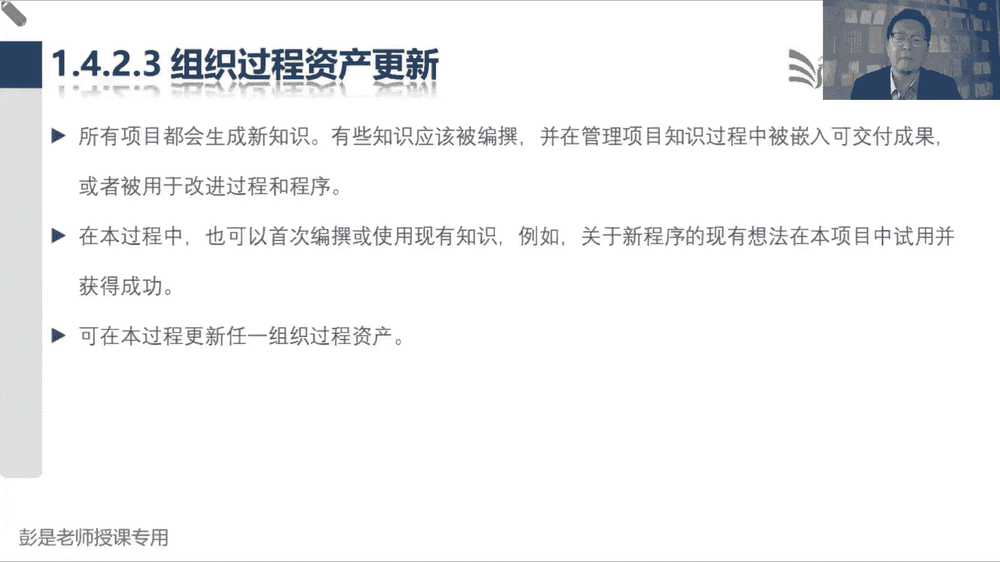

# 2024年最新版PMP考试第七版零基础一次通过项目管理认证 - P21：2.1.4 管理项目知识 - 慧翔天地 - BV1qC411E7Mw

接下来1。4管理项目知识。

这个管理过程超简单啊，管理项目知识，管理项目知识，学学以致用，刚才说了，理论上来说，任何一个管理过程都可能会输出变更请求，理论上来说，任何一个管理过程都可能会输出变更请求，所以他到底是哪个过程的输出。

不需要记，也不需要不需要记嗯，学习听课，听重点听重点好，接下来管理项目知识，专心听，先不要想自己的那个那个那个各种可能性啊，先听一听我在说什么空杯，不要再想细节了，越想越头疼了，好管理项目知识。

这个管理过程干什么事了，学学学以致用，学以致用啊，龙飞同学不要去想，不要去想了各种可能性啊，太细了太琐碎了，抓大放小亲，找大放小啊，先抓大方向，细节啊，具体情况具体分析好一点，四管理项目知识干什么事呢。

学学以致用，所以它的输入输出根本没什么东西啊，因为所有东西我们都可以用来学习，输出呢就是这个东西，经验教训登记册，经验教训登记册是我们项目中的文件，是让我们的项目组成员干活，不要再犯相同的错误。

然后组织过程资产你可能更新吧，为什么呢，还要告诉企业，告诉我们的组织就知道这个意思就够了啊，他到底有什么输出，根本就不用去记，因为你只要知道经验教训登记册，记录经验教训，那我们在管理项目知识的过程中。

学到的东西也是经验教训的，就写进去就完事了，好这中间的工具基础像什么专家判断没东西，积极倾听，就是一直在给大家说的，各位同学专心听，专心听，先听一听老师在说啥，然后呢不要发散思维，不要去想具体的场景。

先把这个道理听清楚，先把每个术语是啥东西搞清楚好，这是专心听，所以它的工具啊没有什么有代表性的，就是稍稍对这两个东西有一点点印象就可以了，一个叫知识管理，一个叫信息管理，知识管理，信息管理。

他的工作重心不一样，工作流程不一样啊，大家工作中生活中可能会查一些查一些术语，会在网上搜索一些资料对吧，比如说什么，比如说什么那个什么哪个网啊，可以搜很多论文的，然后哪个网里面有很多单词的解释啊。

像什么百度百科，百度百科这种东西吧，诶他叫信息管理，还是叫知识管理，什么百度百科，维基百科，这叫知识管理还是叫信息管理呢，为了方便大家粗暴理解啊，举个举个例子，百度百科叫信息管理，为什么呢。

因为你可以很方便的在上面去搜索，去编辑，去查询这些东西吧，诶它更侧重于对这些信息，让你去搜索，去查询，去检索干这个事儿，所以这就叫信息管理，那知识管理更侧重于什么呢，特别像他的什么小红书啊。

知乎啊这种平台，大家在小红书上，小红书上，在知乎上干啥呢，分享交流互动，诶这就叫知识管理，所以信息管理更更侧重于对这些信息做梳理，做检索，做成现知识管理，更侧重于通过各种各样的方式让大家去互动。

互动的目的是什么呢，交流培训对不对，学习就这东西啊，好知道这个意思够了，所以管理项目知识是使用现有知识生成新知识，帮助大家不断的学习。

不断的学习，学以致用，这个管理过程掌握到这个程度其实就够了，那接下来常见的这么几个专业术语把它搞清楚，知识通常分为显性知识和隐性知识，显性知识是说容易使用文字，图片，数字进行编撰的。

隐性知识呢就是什么意念，什么信念，洞察力经验诀窍就粗暴理解脑子里的东西，就叫隐性知识，显性知识啊是把我脑子里的东西给它写出来，呈现出来，这不就是显性吗，所以知识管理的中心思想就是。

第一先把隐性知识给它呈现出来，叫隐性知识显性化，显性了之后啊对吧，写了各种什么文章啊，博客啊，写了各种文章之后呢，第二部是什么呢，梳理分分类，把差不多的知识给它放到一起，这一大堆都是财务的知识。

这一大堆都是健康的知识，这一大堆都是项目管理的知识，还去梳理，所以叫显性知识体系化，让他有条理啊，体系化之后啊，第三步是什么呢，再通过再让大家去交流，去沟通，去培训，去讨论，让大家学。

所以呢就叫显性知识再隐性化回去，让其他人更多的人掌握这些经验诀窍，这些技巧啊，然后大家掌握了这些知识之后呢，再去学以致用，学以致用，又会产生又会产生新的隐性知识，然后再呈现出来，再梳理。

再组织大家去交流沟通，再去让大家学，再去学以致用，以此类推，就这样不断不断不断的循环，是知识管理这个思路，所以变成大家是大白话，其实就是把你的什么心得体会给他分享出来，让其他人学，学完了之后再去用。

用的时候又会产生新的知识，再分享，再学再用，就这样循环，所以知识管理指的是管理这些显性知识，隐性知识，它的中心思想就是学以致用，使用现有知识生成新知识。

好知道这个意思，学到这个程度其实就够了啊，那接下来书上后面又会说一个常见的误解是，知识管理只是把知识记录下来，用于分享，只记录不交流也是问题，所以还需要大家去沟通，去交流，去探讨，对经过这种思维的碰撞。

可以让大家掌握的更透彻，然后另一个常见的误解是什么呢，知识管理啊只是在项目结束时总结经验教训，以供未来使用，第二句话听完了能够反映出来一个什么道理啊，我们等项目结束的时候再总结经验教训，会有什么问题吗。

哎就想到知识流失，因为项目结束以后迟了，对不对，中间过程可能已经有人走了，有人离职了，有人忘了，甚至都忘了，对不对，就是太晚了，因为啊现在人员的流动性越来越高，人员的流动性越来越高。

等到项目结束的时候再总结啊，知识可能已经全都跑了，那为了避免知识的流失，所以呢就把1。4，这个管理过程放到了执行过程组，强调的是啊，在项目执行的过程中，为了防止知识流失，要定期的把大家这些经验诀窍。

技巧技这些东西给他总结出来，然后呢让大家去分享，去交流，去互动，去探讨，再学以致用，这样可以有效地防止知识流失，就这个道理好，所以知道为什么这个管理过程放到执行过程组，就是因为这个东西。

好后面那句话说显性知识啊，什么什么缺乏行径啊，巴拉巴拉，后面什么隐性知识在脑子里面，大家不容易看看就可以了，没什么东西。

主要的就是找后面那句话，因为知识存在于人们的思想之中，并且没有办法强迫人们分享自己的知识，或者是关注他人知识，所以第一最重要的环节是，营造一种相互信任的氛围，这两家其实很好理解。

比如说张三和李四是竞争关系，竞争关系，那有没有可能张三很愿意把知识分享给李四呢，诶不一定，他俩不一定相互信任，所以俗称俗称教会了徒弟，饿死了师傅，就这个道理，这是第一个条件，第二个条件呢。

如果张三和李四啊相互信任，他也不一定愿意做这个事情，为什么呢，没动力，就是传说中的这么做有什么好处吗，所以结合到项目实践中，我们第一要考虑啊，让大家相互信任，不会存在着说张三你把李四教会了。

唉你就饿死了，你就下岗了，你就离职了，要消除大家大家关于这种这种方面的疑虑啊，啊有一些企业搞什么末位淘汰制啊，可能这事儿就不好干了，对对张三和李四是同一个公司岗位，谁绩效好，谁绩效不好。

不好的人就会被淘汰，那这种情况下，很难很难让张三和李四乐于分享彼此的知识，第二呢就是有了相互信任，没有动力也不愿意干这个事情了，所以要想办法刺激大家，不是为了名，就是为了利，让大家知道这么做有什么样。

有什么样的回报，有什么样的价值，再听一听就完事了，最后在实践之中联合使用知识管理，更侧重于互动，说白了吧，信息管理更侧重于这些梳理，成见编纂来分享知识，就对标到这个管理过程。

两个工具稍稍有一点点印象就够了。

好学到这个程度。

这个管理过程讲完了，所以他的输入这段文字全都不见了。

都是见过的知识点，这个管理过程1421输出经验教训登记册，想看就看，不想看可以不看了，关于这种经验教训的考点就是这个大原则，现在我们想少犯错怎么办呢，以史为鉴，各位同各位现在听课的同学。

你想提高通过考试的可能性，那我们就以史为鉴，对不对，看看你们之前这些学长不考过的人，那基本上是共性的，这些课也没咋听，然后书也没咋看，大部分人基本上就是这个状态，可能由于工作生活的原因。

或者是自己懒得看的主观的原因啊，总之啊就是该学的东西没学没学，然后现在我们总结经验教训，目的是什么呢，是为了前人栽树，后人乘凉，为了以后的同事再也不要犯同样的错误，这就是组织过程，资产知识库，经验教训。

这些东西他最重要的这个逻辑超简单啊，好所以这段文字呢真的可以不看可以不看了啊。

那项目计划更新，项目资产更新。

