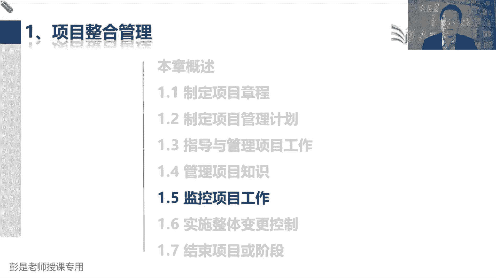
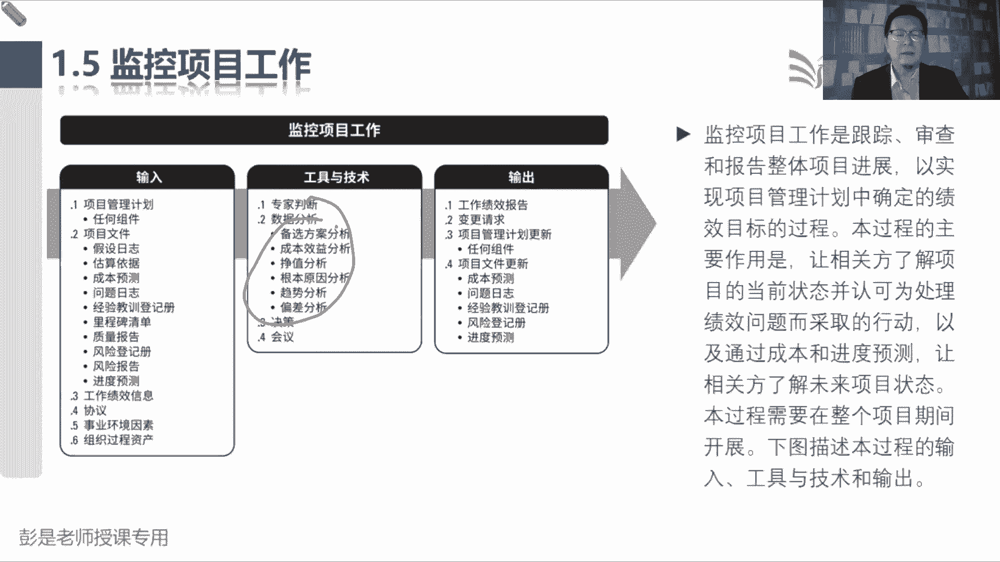
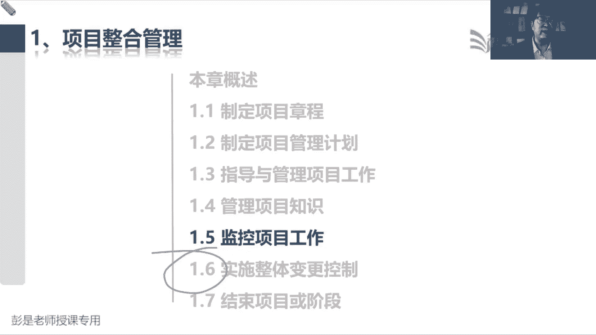
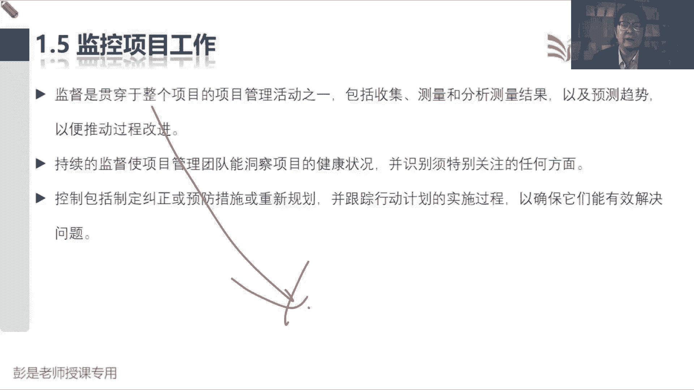
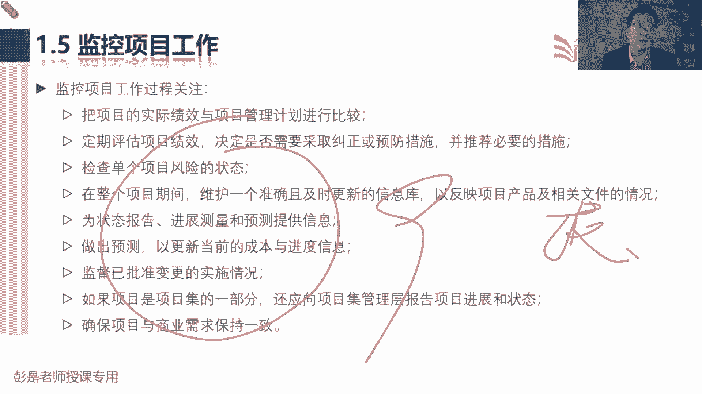
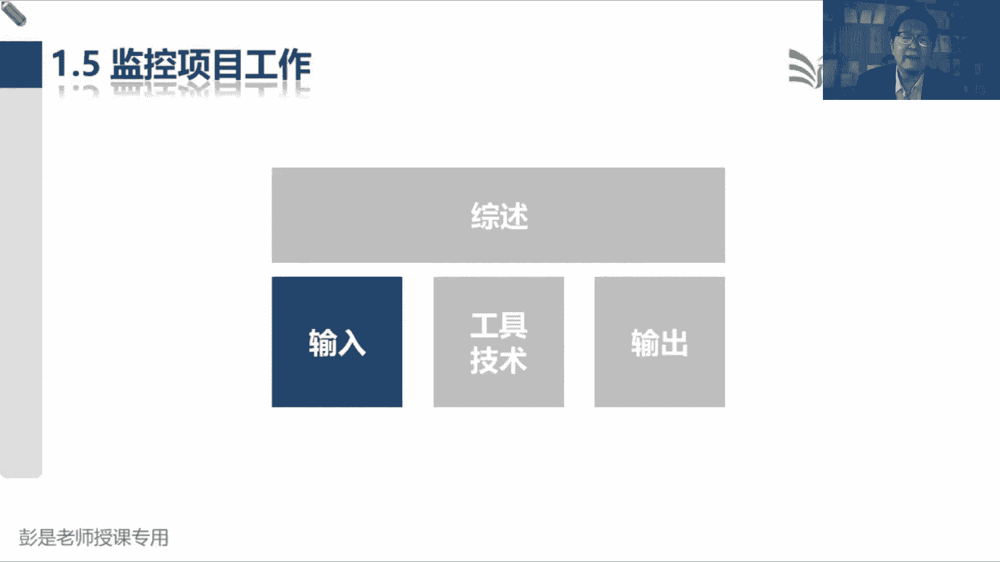
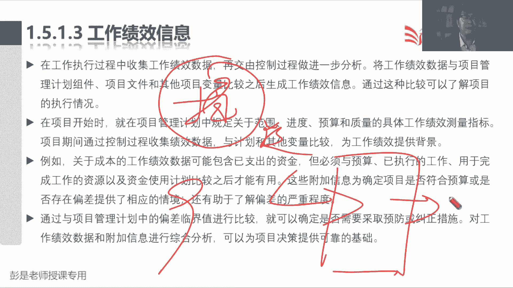
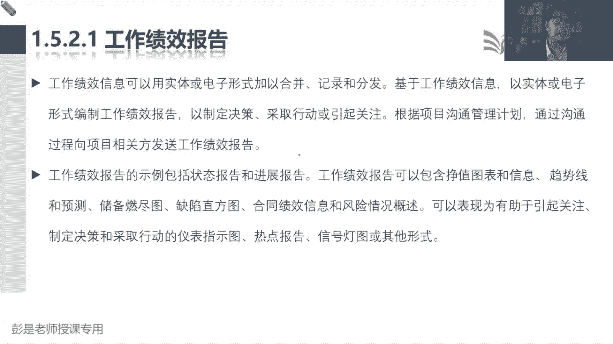
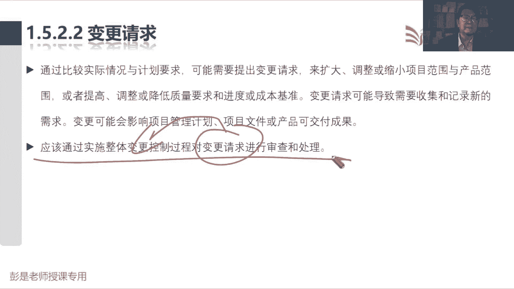
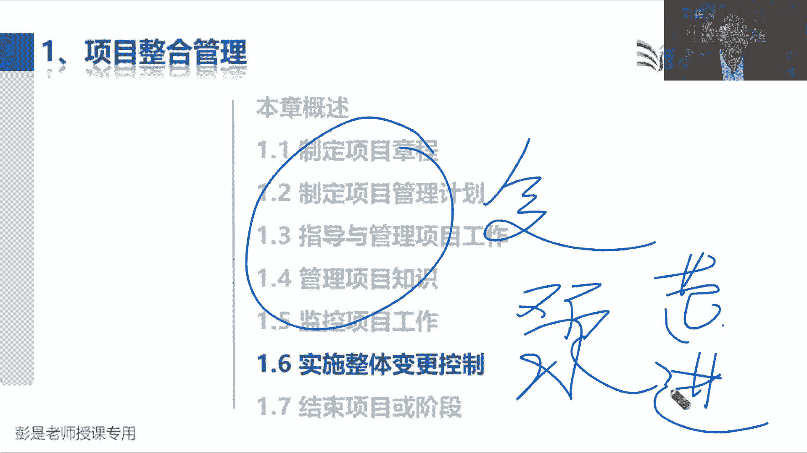

# 2024年最新版PMP考试第七版零基础一次通过项目管理认证 - P22：2.1.5 监控项目工作 - 慧翔天地 - BV1qC411E7Mw

1。5监控项目工作，这个管理过程超简单，看看啊，项目经理达到九个大臣的工作绩效信息，范围的绩效信息，进度的成本的质量的，资源的沟通的，采购的相关方的各个知识领域的绩效信息，经过中间一大堆的分析方法。

总结归纳概括，变成整个项目的工作绩效报告，所以输入输出那中间的工具呀，大家大部分这种工具啊，现在这些分析工具你看名字很难猜错了，那就其实可以不看了，但是为了便于大家记，所以呢给大家调调一调顺序。

讲个小故事啊，政治分析现在没讲到，政治分析干嘛呢，这是分析现在的情况，分析现在什么时间花了多少钱，干了多少活，嘿这听不懂没关系，分析完了情况之后呢，再去和计划做比较，看看有没有偏差。

所以呢就用到了偏差分析，找到了偏差之后啊，如果有偏差的话，需要干嘛呢，分析为什么为什么会出现这样的偏差，为什么成本超支，为什么进度落后，为什么缺陷这么多，为什么有人画蛇添足，以此类推了，找原因。

找到原因之后，对症下药，用到什么技术呢，备选方案分析，因为啊不要把鸡蛋放到一个篮子里，方法总比问题多，对不对，解决方案呢，解决方案，看看能不能找到更多的解决问题的方法，那就用到了备选方案。

找到这么多解决问题的方法，要做选择，什么叫备选方案分析啊，今天晚上吃饭马上要吃饭了啊，各位同学说饿了可以自己做，可以叫外卖，可以可以去餐厅吃，然后呢可以吃面，可以吃米饭，可以吃披萨，可以吃饺子。

这么多方法呢这么多方案啊，那要做选择，通常第一反应我们要考虑性价比，就用到了成本效益分析，就用到了成本效益分析，最后分析个一溜够以后啊，再做一个趋势分析，再做一个趋势分析。

就是未来项目会朝着什么样的方向去发展，这就是大概常见的这六个叫分析技术，看情况正值照照偏差，有了偏差之后分析原因，找到原因之后对症下药，不要把鸡蛋放到一个篮子里。

所以用到了备选方案这么多解决方法要做选择，做决策通常要考虑成本效益，就用到了成本效益分析，最后呢再给领导分析一下趋势，展望未来趋势分析，搞定搞定之后啊，再加一个小小的知识点，备选方案，成本效益。

今天晚上今天晚上可以怎么吃饭呢，可以自己做，可以叫外卖，可以去餐厅吃，这是备选方案，自己做呀最便宜，这肯定的叫外卖比去餐厅吃便宜一点，去餐厅吃可能更贵，那自己做还要考虑一些其他因素，虽然自己做最省钱。

但是麻烦对吧，还要买菜，还要洗菜切菜，吃完了饭还要洗碗刷盘子，这通常没有人愿意干这个事儿啊，太麻烦了，万一自己厨艺不好，再把这个菜做的很难吃，哎呀不好考虑到这些东西叫什么呢，这叫多标准决策分析。

除了成本效益，我们还要考虑很多其他方面的各种因素，这是考虑到更周全，就叫多标准决策分析，粗暴理解一般，所以就像多标准多标准和大家什么做饭啊，包括你招聘对吧，如果只考虑成本效益不行吧。

还要考虑员工的其他方面呢，还要考虑员工的其他方面的粗暴理解，就不能只看工资啊，对还要看什么背景啊，学历啊，包括帅不帅呀，以此类推了吧，唉这都是叫多标准决策分析，就是考虑很多其他因素啊，那知道了多标准呐。

最后桃园三结义就简单了，因为桃园三结义是什么呢，刘备关羽，张飞这哥仨，这哥仨随时在一起，所以备选方案分析一旦用了这种分析方法，那接下来通常就要用到，成本效益和多标准决策分析，刘备一出场。

成本效益多半准决策站两边诶，这三个分析技术实际上就绑定锁死就可以了，知道这个意思啊，所以常见就常见的就这些分析技术，那接下来第三个工具决策，能猜这是什么东西吗，决策又是什么玩意儿啊。

不是他其实更精准的是说啊决策的方法，找工具技术吧，决策的方法都可以有哪些呢，这是做主的方法，做出的方法，拍板的方法，就这东西拍板的方法，看到决策技术至少能想到两个单词，同学说的投票，这场景很好理解吧。

投票对吧，有有各种各种各样的机制啊，所有人都同意，我们才能够达成共识，所以才有了一票否决制，一个人不同意，咱就难以形成决议，还有一种呢超过半数以上吧，所以呢就叫大多数50%以上人同意，我们就形成决议了。

那如果没有人超过半数以上怎么办呢，哎就叫相对多数，找一个相对来说票数最高的，一个人为一群人说了算，一个人做决策，但是用一言堂就容易误解，大家再想一个中题小问题，虽然听起来不太好啊，根据我们的学习经历。

不一定吧，哎所以所有的词语教材里面，所有的词语不要把它想窄了，更广义，在什么情况下读才是好事呢，看情况哈，就大家日常生活中，工作中其实也都在用一会儿啊，1446同学，小丸子同学，0917同学。

咱几个一起去吃饭，到底吃什么呢，不知道，随便小丸子同学，你定吧，想一想，张三李四王五都没意见，没想法，嘿赵六，你说吃什么，我们就吃什么，听你的，一个人为一群人做决定，这种情况下挺好，对效率高，效率高。

就是墨迹，千人千面，大家的观点，大家的意见是不一样的，很难统一啊，甚至可能难以达成共识，效率高，但不一定是坏事，也不一定是好事，对不对，好这就是关于监控项目工作，稍稍对这几个工具有这样一个认知就够了。

好再往下了啊，那监控项目工作，咱今天讲完这个管理过程。

留个小尾巴，留个什么呢，留个1。6，1。7，因为1。6这个管理过程超级重要，但是呢如果一会我们赶进度讲的比较，只牺牲质量，赶进度还不好，所以为了确保质量，1。6，我们宁可咬牙，下次上课拖堂。

下次上课拖堂，把它讲透了，因为太重要了，所以今天先不讲，因为今天晚上还有课，赶工期赶工期啊，我们一定要一定要在18点左右下课，所以咱达成共识啊，一言堂，我来做这个主，1。6，1。7放到下次上课再讲。

今天讲完1。5就下班。

好，记住这个特点好。

那再看后面这段文字，超简单了，后面的文字啊，大家复习的时候基本上就大概看一看，中心思想一点都没变，九个绩效信息给领导写报告，全面的总结归纳概括分析项目的情况，然后呢，如果如果如果发现工作有缺陷对吧。

工作有失误，工作有偏差，需要采取措施啊，采取措施采取措施诶，那就需要决策诶，所以他把决策放到这儿了，但他到底是啥，根本听完了之后基本上也不大用看了啊啊，所以中心思想拿到绩效信息分析，分析完了写报告。

这和大家和大家日常工作中的领导者，不就干这个事儿吗，我下面有张三李四王五赵六，四个人拿到大家的工作情况总结，归纳概括变成报告到底一样，好所以后面那段文字呢没什么可解读的了，都是纯粹的字面意思。

下课前会做作业的啊。

监控项目工作关注的这一大堆，各位同学看一遍就可以牢记九个绩效信息，我们拿到，然后给领导写报告，牢牢记住这句话就完事了。

也就考到这个程度了，所以输入没什么东西。

没有什么新的知识点，有些东西虽然没讲到，后面会讲，然后15131513这段文字啊，还是值得各位同学后面复习的时候看一遍的，看的目的是什么呢，就像接下来我这么去去看啊，你看看我是怎么读的啊。

我们在工作执行过程中收集工作绩效数据，根据现在储备的知识，我知道指导与管理项目工作，会输出原始的工作基调数据，然后呢交由控制过程做进一步的分析，这玩意交给谁呢，交给九个大臣，控制范围，控制进度。

控制成本，控制质量，交给这一大堆管理过程进行进一步的分析，分析之后，分析之后，就会得到九个大神给出的工作绩效信息，所以就有了这句话，他们把绩效数据和计划做比较比较之后，就形成了九个大神。

九个知识领域的工作绩效信息，哎就看第一段就完事了，后面的文字可想看就看，不想看可以不看了，帮助大家更好的理解，前面说的那个逻辑指导与管理项目工作，他会输出原始的数据，这玩意儿去了九个知识领域。

监控过程组这一大堆管理过程作为他们的输入，他们呢拿到数据和计划做比较，经过分析就得到绩效信息。

提交信息再交给给整合这一章，项目经理通过监控项目工作，这个管理过程写报告，牢牢记住这个逻辑，好协议啊，没有新的知识点，然后输出呢工作绩效报告，工作绩效报告具体的内容也不需要大家具备。

但是中心思想要知道啊，中心思想是啥，是写文字比较好，还是图文结合更好呢，这个大家靠日常工作常识应该很容易判断哈，有图有真相，看起来更直观，对不对，所以该画什么图，画什么图能够更直观的体现项目的情况。

就这意思吧，所以他列出来一大堆图，这堆图今天听完课，大家复习的时候，你可能都看不懂，看不懂看不懂，记住啊，现在看不懂的内容都不要去看，不要去理他，但是抓大放小大是什么呢，知道这个报告，这个报告怎么出。

拿到九个绩效信息和计划做比较，然后呢经过你的分析总结，归纳概括概括什么呢，九个知识领域全面总结项目的范围，进度成本质量，资源沟通到位不到位，相关方满意不满意，采购工作是不是符合预期，全面总结啊。

好知道这个意思，所以这段文字啊，其实后面复习的时候是可以不看了。

可以不看了哈，提高效率，那变更请求也没什么东西，我们在监控项目工作的时候，如果发现什么缺陷啊，差距啊，不足啊，走变更对不对，变更交给谁呢，这是下一节课要讲的，实施整体变更控制就记结论，所有的变更。

所有的变更，不管是哪个管理过程提出来的，都要交给实施整体变更控制，这句话你会看到太多遍了。

好计划更新没有新的知识点，什么文件更新，没有什么新的东西，这就是1。5，咱做过预习的朋友们肯定知道，现在我们讲课进度是慢的是慢的啊，今天呢还是给大家多讲点，讲细点，所以呢为了不要牺牲质量，我们1。61。

7放到下次上课再说，相当于在温故而知新，下次上课之前，肯定把这些东西再给你大概说一说，对于大家抓大放小，记住核心的知识点，然后呢再讲1。6，那今天给大家就留作业了，作业是什么呢，咱们第一部分。

项目管理的基础已经全面全都讲完了吧，这部分大家要干的事情啊，看书看书看教材，通过阅读巩固知识点，然后呢不熟悉的内容啊，还要在副厅的，还要在副听听课，然后接下来班主任会在班会，在微信群里面发公告。

做课后练习，所以啊未来我们所有的作业，包括考试报名，这些通知都在微信群，微信群，微信群，各位亲一定要关注微信群里发的公告，一定要看啊，否则可能会影响到大家报名啊，学习的进度，包括做作业，包括模拟考试。

关注微信群公告，仔细看班主任写的什么东西，包括怎么看书，怎么听课，去哪做练习题，上次没发，因为上次没讲完，所以先不发，所以先不发，那除了除了看，除了搞定这些基本概念，说看书听课练习题。

那整合这章要不要做练习题呢，不建议做，不着急做了哈，整合这章要做什么事呢，这叫复习已经讲完的内容，预习将要讲到的内容，那预习什么呢，范围这一章要预习，进度，这一章要预习，这就是今天给大家留的作业。

未来应该是应该是什么时间，我不确定了，应该班主任会在群里面发公告，告诉大家，我们下一步的学习计划，对看班班群就对了，下周没课吧，这你就难倒我了，这个这个知识点我超出我认知，我记不住的，岁数大了。

记性不好看，班主任发的课表好，那各位同学，我们今天的课程就先上到这，各位同学辛苦了辛苦了，听一节课啊。

