# 2024年最新版PMP考试第七版零基础一次通过项目管理认证 - P23：2.1.6 实施整体变更控制 - 慧翔天地 - BV1qC411E7Mw

各位同学大家早上好，咱们开始今天的课程，快速回顾一下，制定项目章程是出章程，章程的作用是什么呢，标志的项目在正式开始，这玩意儿给项目经理做授权，对不对，让我们正儿八经的可以动用组织的资源。

完成项目的工作，另外呢张晨阳给我们指明工作方向，告诉咱咱这个项目啊，两个木，两个标准，两个角色，九个知识领域，目的目标，成功标准，退出标准，然后呢，发起人是谁，项目经理是谁。

总体要求对范围的进度的成本的质量的资源的，那要把这东西写出来啊，告诉我们前进的方向，那我们这个东西不能和商业论证相违背，所以他的收入就包括了商业论证啊，和客户签的合同或者协议呀，想要保持目标的一致性。

他的工具技术没什么特殊的啊，制定项目管理计划是就是出项项目管理计划，总体指导告诉我们到底在什么时间做什么事，唉怎么干怎么干活，对大家工作九大知识领域的工作形成指导，所以呢它包括了9331。

九个知识领域的子计划，三个单独的计划变更配置和需求，三个基准范围，进度成本，三个基准打包到一起，绩效测量基准，那这些计划到底怎么出呢，项目经理需要先高屋建瓴，给出一个总体的指导。

生命周期阶段划分开发方法，对对项目从开始到结束分成多少个阶段呢，这些阶段的工作是不是明确的呢，不明确的咱要不要敏捷呢，明确的咱就预测呀，结构大神分别完成各自知识领域的规划工作。

所以呢他的收入就是各种各样的子计划诶，俺就下班了，那这1。3指导与管理项目工作，这个管理过程啊，就是按照计划去干活，得到可交付成果，所以它的收入没什么特殊的东西，所有的计划包括什么协议啊。

项目文件哪都可以作为输入，它的输出就是我们最重要的一个输出，项目的可交付成果，因为按照计划去干活，得到成果对吧，那除了可交付成果呀，他还要干一个重要的事情，他要收集原始的工作绩效数据，每天干了什么活。

就像大家写工作日志一样，得把它记录下来，这个绩效数据啊，咱项目经理也不要，他需要交给九个大臣，九个子知识领域监控过程组里面的管理过程，控制范围控制进度控制，成本控制，质量控制。

以此类推了各个知识领域监控过程组的过程，拿到这些数据，经过他们的分析，把它变成当前知识领域的工作绩效信息，绩效信息就可以传球了，这个东西啊，教导1。5交给项目经理，项目经理通过监控项目工作。

收集各个知识领域的工作情况，然后呢我们经过总结分析，就像那一大堆工具技术，什么政治分析偏差，分析根本原因，分析备选方案，成本效益，多标准确的分析趋势分析，总结归纳概括分析之后。

就得到整个项目的工作绩效情况，就是工作绩效报告诶，监控项目工作下班了，管理项目知识啊，简单，它的它的主要工作，就是看看大家在工作中学到了什么东西，把大家工作中的这些隐性知识，就是脑子里的经验啊，诀窍啊。

技巧啊，新的体会呀，诶把这些东西啊我们给它呈现出来，呈现出来，然后去梳理一下，梳理完了之后再组织大家沟通交流讨论，进行学习，学以致用，又会产生新的引擎知识，就这样不断不断不断的循环。

所以他比较重要的输出，就是那个经验教学登记册，经验教训登记测试单项目上的文件，还要告诉全公司，大家不要犯同样同样的错误，所以呢他还会更新组织过程资产诶，他大概记住这两个输出非常非常重要的。

因为就是把它放到执行过程中，因为我们要强调避免致使流失，因为人员流动性现在越来越来越高哈，这个是前五个管理过程，那今天我们开始讲1。6，实施整体变更控制，它关键词就是整体两个字。

因为我们知道了六大制约因素，项目的目标多快好省，在此基础之上，还有资源和风险，牵一发动全身，另外呢还可能影响到肝系人的满意度，对还可能影响到沟通，还可能影响到采购，也就是九大知识领域。

九大知识领域可能互相影响，互相互相影响，任何一个知识领域，提出的变更或者是发生的变化，提出的变更就是将来会发生的变更呗，已发生的变更不就是已经发生的变化吗，反正啊不管是啥，只要有变化。

都有可能牵一发动全身，那我们就需要去整体考虑，综合的分析和评估，这个变更，对我们各个知识领域会产生什么样的影响，综合的分析，变更对整个项目会产生什么样的影响，所以1。6都在强调这个事情。

主打一个考虑周全，考虑周全好。

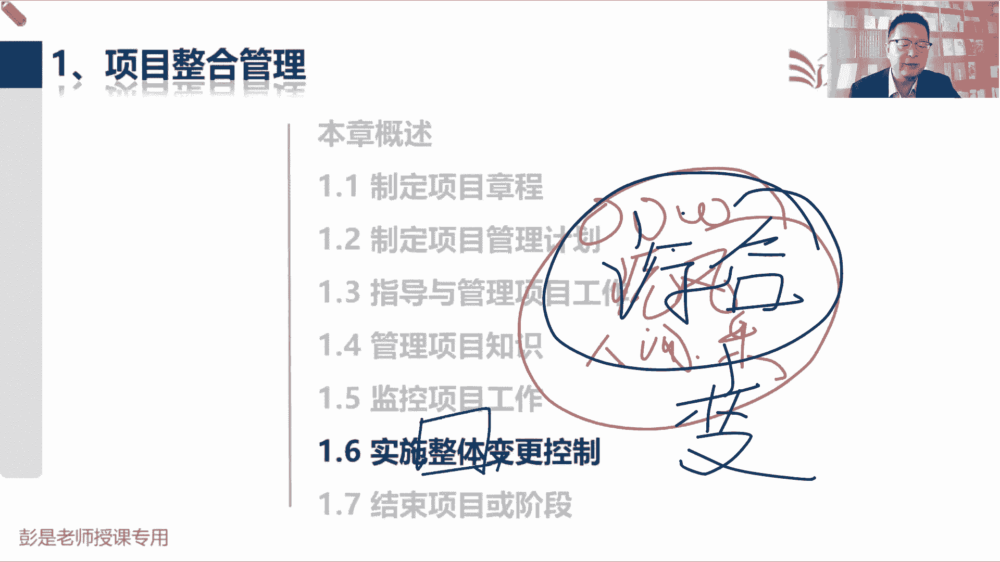

那知道了这个中心思想，再看书上这段文字就很简单了，实施整体变更控制是审查所有的变更请求，然后呢对变更做决策不一定是批准的，也有可能是否决或者是推迟，对总之所有的变更请求，不管是其他48个管理过程。

不管是谁提出的变更，没没得商量啊，都必须百分之1万要交给项目经理，没得商量，因为只有项目经理能够开展实施整体变更，控制好，所以就用了所有这个单词，然后呢对变更做决策，最后呢巴拉巴拉。

并对变更处理结果进行沟通的过程，这句话看完了就要能call back。

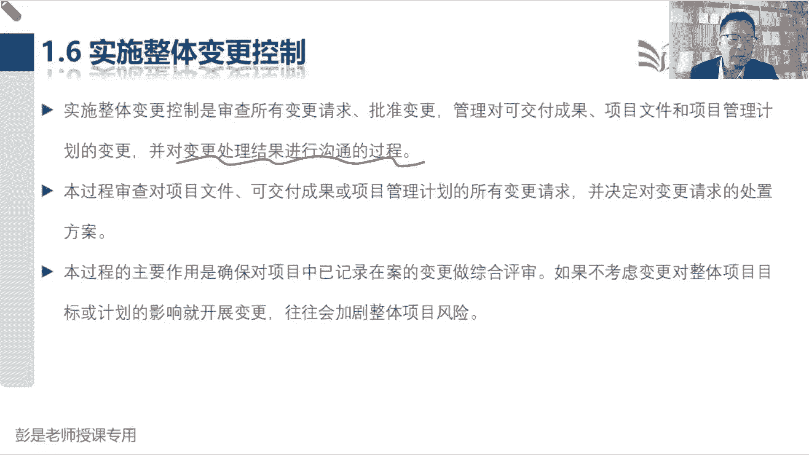

前面有一个知识点是什么呢，我们要对变更的结果进行沟通，那如果是否决的，通常通知提出人就可以了，不需要不一定需要通知所有人，但是如果是一个批准的变更，说变更请求被批准了，客户要求把这个什么软件界面。

蓝色改白色，红色改改黑色，这个变更变更一旦得到了批准，要第一时间通知我们的成员，按照批准的变更去落实，去执行，干活没干错了，所以指导与管理项目工作输入，就有了一个叫批准的变更请求，他就是1。

6实施整体变更控制的输出，这个需要单独记住好。

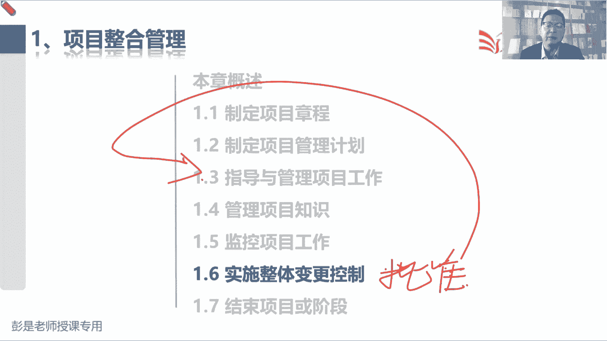

那再往下看说，等过程审查对项目文件可交付成果，项目计划的所有的变更请求，并决定对变更请求的处置方案，这是到底是批准否决还是推迟做决策，所以这个过程最重要的作用就是做综合评审，考虑周全。

因为我们要考虑到整个项目的方方面面范围，进度成本质量，资源沟通风险。

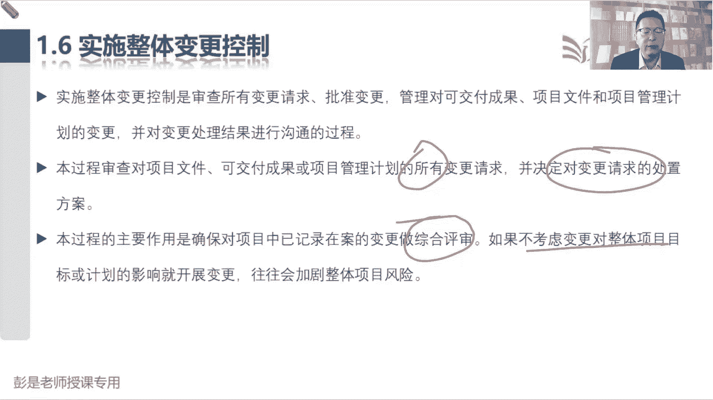

采购干系人都要考虑周全好，那再往下说，这个管理过程输入就没啥可解释的了，比较重要的就是这个变更请求，所有的变更都要来到实施整体变更控制，所以前出过这样的题，说张三张三找到你。

我现在有一个变更已经被批准了，然后呢，项目经理啊不知情，项目经理不知情，那说明什么呢，说明张三这个变更不合规，对不对，所有的变更都要项目经理执行啊，才对啊，都要交给项目经理啊，哎那这不合规。

说明走的流程可能不是我，项目上的流程还不合规，那就通知他变更流程就可以了，严格地按照项目的变更流程对变更进行管理，所有的变更都要交给项目经理好，他的输出呢，就是刚才强调的一个批准的变更请求。

把它作为一个单独的输出，就在强调及时通知干系人的重要性，另外呢第二个重要的输出就是变更日志，这东西其实也没啥合计的啊，发现啥记录啥，发现啥记录啥，发现变更记录，变更日志，收到变更请求，记录变更日志。

嘿好记性不如烂笔头，教日志的都在整合这一章制定项目章程，输出了一个假设日志，他到底是哪个过程的输出输出，其实不太需要去记啊，然后呢这一章还有一个问题，日志发现问题，记录问题，第三个日志呢就叫变更日志。

收到变更请求，做正式的记录，接下来，最后它中间的工具其实没有需要大家去背的，专家判断备选成本效益，桃园三结义啊，备选方案成本效益都标准决策分析，对一个人为为一群人做决策，中间那个变更控制工具。

其实不要求大家去记的，记住了，记下来也没什么用，后面讲到工具技术的时候再说了，好像robin同学说的哈，处理各种变更，因为这这章这个管理过程最重要的原则，大家就随便记一个粗暴的顺口溜啊。

就是啊变更无论大小都要走流程，对不对，都要有规矩，所以顺口溜是什么呢，不管大便还是小便，不能随地大小便，咱得有规则呀，就这道理啊，不管题目再怎么忽悠你说这个变更啊很小很小，分分钟搞定了。

仍然坚决坚决走流程，坚定不移走流程，就抱着这个信念啊，因为表面上看起来可能对进度影响很小，那成本呢质量呢，资源呢沟通的风险都要考虑周全，对不对，再往下了啊。

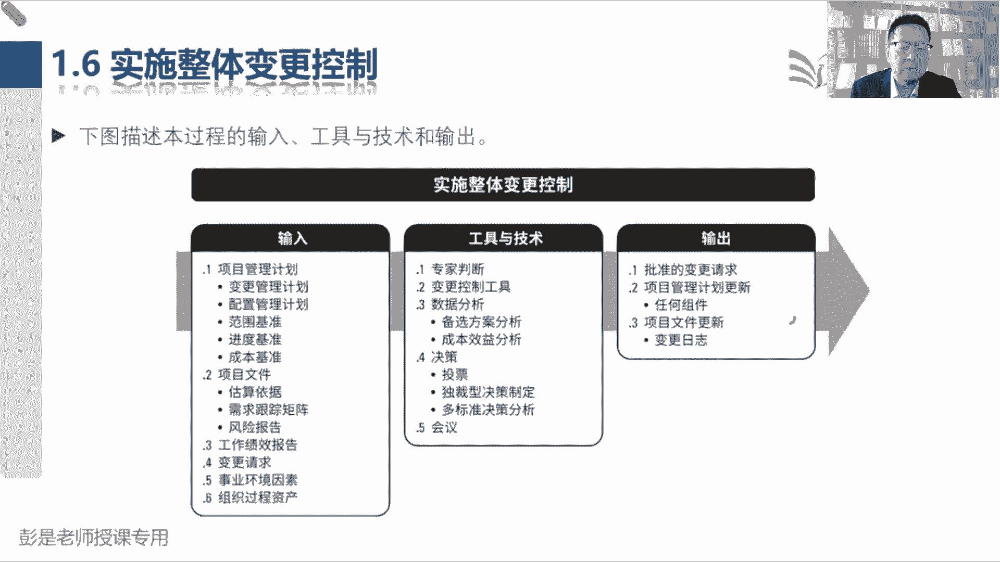

那再往下说1。6，这是在专心听了，因为有的内容可能现在不要求大家去记了，咱把重要的东西标一标，其他没标没没没没圈过的内容，大家其实可以不看了，好第一个实施整体变更控制贯穿项目始终。

因为在整个项目中启动规划执行监控，收尾五大过程，组织中理论上来说，任何一个过程中都有可能发起变更，那从整个项目生命周期阶段来说，从开始到结束，不管是生命周期的哪一个阶段，都有可能发生变更。

所以呢不管是什么时候发发生的变更，我们都要对变更做管理，贯穿项目始终，项目经理对此承担最终责任，就是robin同学说的啊，不走只要不走流程，只要变更管理没规矩，出了问题肯定是项目经理的锅。

所以我们要坚定这个原则，所有的变更都要交给项目经理好，因为变更请求，可能会对整个项目产生各种各样的影响，就不用去记啊，第二个需要记住的话术，就是这句话，在整个项目生命周期的任何时间。

参与项目的任何相关方都可以提出变更请求，不管是什么时间点，任何人都有权利提出变更，即使是已经中验验收通过之后，仍然有有权利提出变更，对不对，所以变更可不可以提呢，可以，但是批不批，这是另外一回事。

咱走流程呗啊这是两个知识点，那再往下说，在基准确定之前，这句话讲了好几遍了吗，基准确定之前啊，不需要走流程，项目经理自己把控就可以了，但是一旦我们计划得到了批准，有了基准。

就必须绝对只能通过本过程来处理变更请求，在制定计划的过程中想改随时改，项目经理自己把关就可以了，没关系，计划制定完成，一旦得到了批准，再改就要走流程，我们在称生成可交付成果的过程中，想改随时改，没关系。

可交付成果一旦完成，有了版本，对不对，什么叫版本的，就是正式的提交了，有了版本之后呢，再想改呀，不行了，走流程，以此类推，这个道理是一样的，好后边这个知识点啊，现在基本上考到的概率超级小超级小。

所以呢停一停，前面给大家说过这个单词代表了什么呢，配置配置配置，看到这个单词就想到版本就可以了，版本管理所有的这些计划呀，文件啊，基准啊，成果呀，我们要把它的每一个版本，每一个版本做存档，一旦有了变化。

我们在改这个什么版本号哎，都要存档啊，所以每个项目的配置管理计划，应该规定哪些项目工件受控于配置控制程序，手控是什么呢，受控的意思是说啊，是说这个东西的调整，不能随便就让大家给大家说的这个例子，户口本。

户口本里的那种肯定是不能随便改的，对不对，这要走流程了，它的它的变化需要受到控制，姓名性别什么什么婚姻状况都不能随便改哈，嘿他就是一个售后项，受控项，受控项变成术语，那就叫一个配置项，那对配置要素。

配置要素就是配置项，对配置项的任何变更都应该走流程，不能随便改，有印象就可以了，因为在实际工作中啊，到底什么东西作为配置项呢，三个字看情况对不对，具体情况具体分析，但是我们能确定的是。

这三个基准肯定是配置项范围基准进度基准，成本基准，这三个东西不能随便改好。

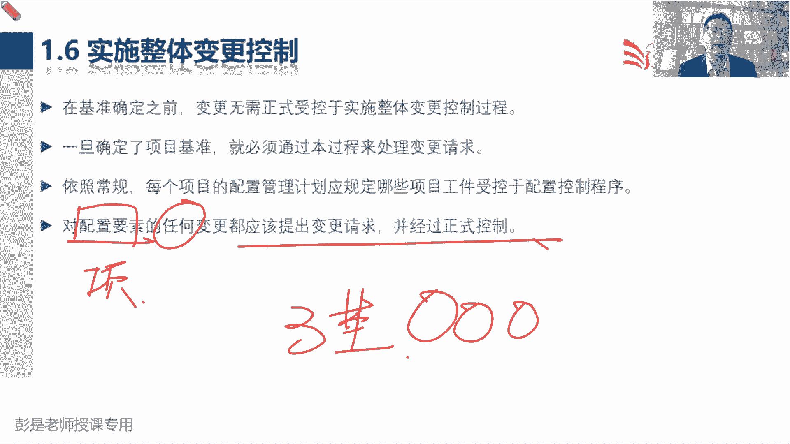

然后再往下啊说，尽管也可以口头提出，但所有变更请求都必须以书面形式记录，并纳入变更和配置管理系统两个知识点，第一个，所有的变更请求必须以书面的形式做记录，那记到哪儿呢，变更日志。

这是咱项目上的正式的文件呢，所有的变更请求，对方对方不管是怎么提出来的，我们都要走，一有一个文档做正式的记录，好记性不如烂笔头，那第二个知识点呢就是前半句话说，尽管也可以口头提出用了。

尽管这个词品一品是什么意思，尽管尽管尽管这听起来不太好的，要his SPA勉强，对不对，勉强了，所以呢最好最好怎么提出呢，需要大家做做笔记了吧，在尽量走文本，好记性不如烂笔头，避免扯皮呀，避免耍赖呀。

所以呢最好最好最好就是正式的书面要留痕的，避免扯皮，避免耍赖，对不对，你们能到到派出所拿嘴一说，来给我姓名改一下，对不对，过两天不认账，这可不行，最好最好最好正式书面需要你签个单子吧。

去银行你什么取钱啊，什么什么存钱呐，开卡呀不得填个单子嘛，对不对，避免耍赖啊，到时候不认账了，就这意思啊，好所以最好最好正式书面提出，然后呢我们统一的统一的统一的有一个文件，对所有的变更做正式的记录。

因为对方书面提出的形式，可能多种多样的邮件啊，纸质的文档啊，对不对，或者什么什么什么工单工单啊，各种各样的形式啊，好最后在批准变更新之前，可能需要了解什么什么，这段这段文字可以不看了啊。

因为接下来我们需要给大家大概说一下，变更管理，变更管理最重要的几个最重要的几个步骤，未来考试的时候，就一定严格的按照这个步骤去判断就可以了，从前往后找，第一步是什么呢，不见兔子不撒鹰，没有收到。

没有收到正式的变更请求，我们不开展实施整体变更控制，所以变更请求是咱这个管理过程的输入，对不对，要求对方最好，最好最好正式书面提出一个变更请求，去户口去派出所改姓名，人家要求你填个单子哎，就这意思。

最好最好正式的提出正式书面提出变更请求，没有变更请求，人家没有办法开展实施整体变更控制，那第二步，收到变更请求以后，好记性不如烂笔头，我们需要把它统一进入到项目的变更日志里，派出所收到你的工单。

收到你的感人的单子，就拿拿出大大的登记册对，然后呢把它进入到这个变更日志里去了，然后正式记录下来之后，第三步是什么呢，也是这个管理过程最重要的作用就是考虑周全，考虑周全叫综合评估，综合的分析。

当前这个变更请求会不会对我们的范围，进度成本质量资源沟通风险，采购该型各个知识领域产生影响，把这个影响是啥啊，考虑周全，所以它其实就是分析方案，分析方案，您客户提了个新需求。

哎呀我们这个产品要改什么功能啊，那需要谁去改这个事儿啊，大概工期是多少啊，成本是多少啊，有没有风险呢，质量会不会带来问题呀，嘿甘心满意不满意呀，都要考虑周全，就是出方案，这个过程影响不就是怎么改怎么改。

不就是方案吗，好第三步，最重要的叫综合评估，评估完成之后呢，就需要对这个变更做决策，就需要对这个变更做决策，决策是什么呢，这可能是批准否决或推迟这个决策的结果，不太需要去背啊。

这字面意思批准就是同意否决，就是拒绝推迟，就是以后再说，对好，那对变更做决策之后呢，接下来拿到决策结果，拿到决策结果啊，就是更新，我要改个名，人家一同意，户口本就更新了，户口本就更新了，更新什么了。

你要改啥就更新啥，对不对，要改啥就更新啥，要改计划就更新计划要改基准，更新基准好，那更新就是龙飞同学说了这个问题了，这问题一会再说啊，更新完了，最后一步叫什么呢，通知干系人，批准的变更请求。

除了通知提出人，还要通知我们的团队，否决的变更请求，可能通知提出人就够了嗯，就大概粗略的记这么好，六个步骤，并且高频考点一定是前三个对吧，是有没有变更请求啊，最好正式书面提出啊。

第二个呢就是发现啥记录啥发现变更，对变更做正式的记录，第三步，综合的分析和评估，变更对项目产生的各种各样的影响，考虑留钱，然后像变更日志啊，这东西到底后面要不要更新呢，这他就是个思路啊，变更日志。

你对变更日志里的内容做了什么操作，做了什么调整，做了分析，做了评估，做了决策，就随随着后续工作的开展，都可能会更新的，和那个问题日志异曲同工，遇到问题，谁在什么时间提出个问题，这个问题的原因是啥。

影响有多大，重要不重要，紧急不紧急，这问题都能怎么解决呢，怎么解决最好呢，最后决定怎么解决呢，谁去解决呀，执行了没有啊，最后效果是啥呀，一定是随着对这个东西的管理工作的开展。

不断的不断的不断的去更新这个文件。

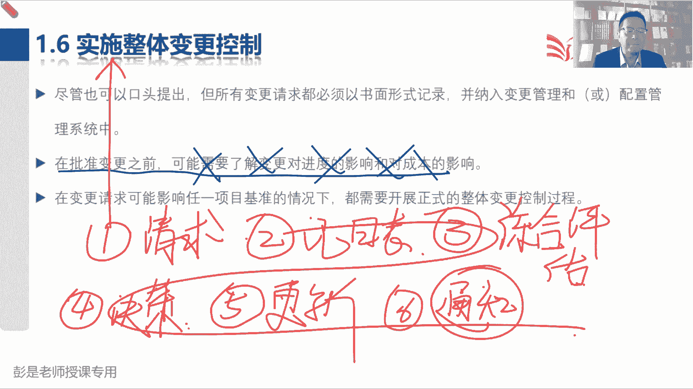

所以不太需要刻意的去背这些单独的细节，不然你背不下来，太多了，各种可能性啊，所以要记重要的原则，好记住这个流程啊，先有变更请求，然后做正式的记录，接下来呢综合的分析，最后呢做决策角色，拿到决策结果呀。

就更新相关的文档资料，最后呢通知甘肃，就记住这个非常非常关键的这六个步骤。

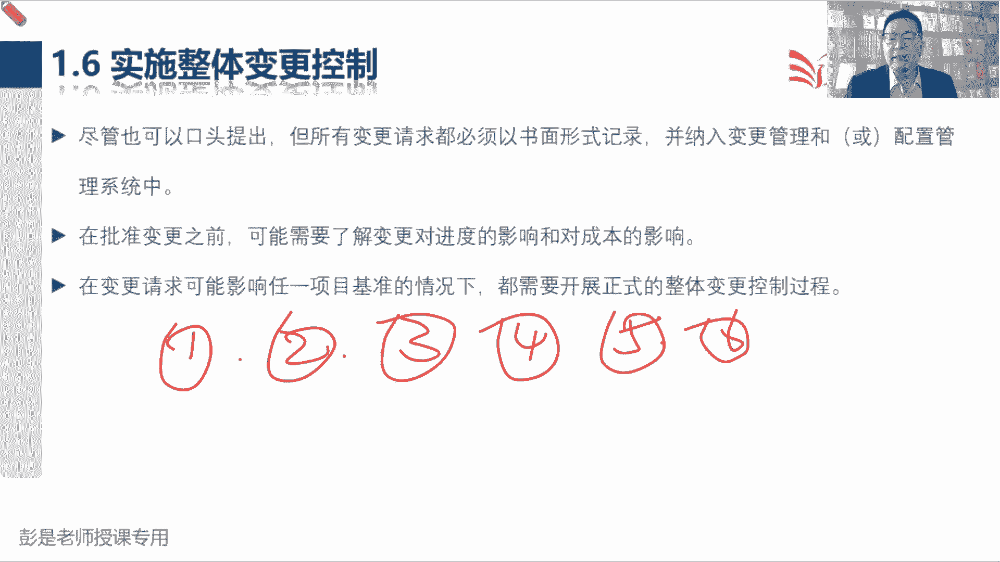

好然后再往下后面这段文字啊，说每个记录在案的变更请求，必须有一个责任人批准否决和推迟，这是对变更做决策，那我们应该在计划中指明这个责任人，必要时应该由CCD来开展实施整体变更控制过程。

这这句话咱把这个知识点改一改啊，改一改，最后形成的结论是什么呢，就是通常啊涉及到，基准，通常涉及到基准的变更，由CCB来做决策，要改范围，基准进度基准成本基准需要cc CCTV里面都是谁呢，不重要。

但是呢人家叫变更控制委员会，肯定是有权利的人，肯定是一帮显贵达官贵贵人，就这种东西啊，有权利的人，关键看起通常涉及到基准的变更，CCB做决策不涉及到基准的变更，哎那可能项目经理就有权做决策。

所以叫基准变更CCB决策，非基准变更项目经理做决策，然后让基准变更CCB非基准变更项目经理，紧急情况下怎么办呢，紧急紧急紧急紧急情况下，其实项目经理有权先斩后奏，先执行，后面走流程，就这么三句话。

做决策的时候，知识点基准变更CCB非基准变更项目经理，紧急情况下，项目经理可以先斩后奏先执行，然后说变更请求没决策完就进入到日志里面，你不要等到对变更所有的工作管理工作都完成，再记变更日志吧。

是这个道理吧，不要等到所有工作都完成再做记录，那时候记录还有什么意义呢，什么叫日志啊，就是把它从开始从生到死，一个变更，从生到死全过程做跟踪，就这意思啊，不断的不断的随着工作的开展，要更新它。

这才是日志最重要的作用啊，对不对，所以任何一个环节都可能会更新，任何一个环节都可能会更新，它收到变更请求，做正式的记录，张三什么时间提出个变更，哎这这这这么简单的道理，还需要这么复杂吗。

不要聊这么复杂呀，张三在什么时间提了个变更，然后呢，这个变更这个变更对我的范围，进度成本质量资源产生什么样的影响，记下来记下来什么时间开的会，谁参与这个会都要记下来啊，对不对。

把一个变更从生到死就这么难吗，全过程做记录，就像你人生简历一样，张三什么时候生的，什么时候上小学，什么时候上幼儿园，什么时候结婚，什么时候离婚，什么时候生病全都记下来，随着整个整个关键事件的出现。

而把他这个状态不断的不断的不断进流水账，就是这个道理啊，没有那么复杂，大家不要去沉迷于细节，不要沉迷于细节啊，越关注细节就忘了忘了初心啊，初心就是框架性的流程，哎我们昨天开会讨论没结果。

要不要更新变更日志呢，你想今天开会啊，有个新想法，要不要更新变更日志呢，太复杂了，好，那再往下了啊，嗯那这个编这个管理过程。

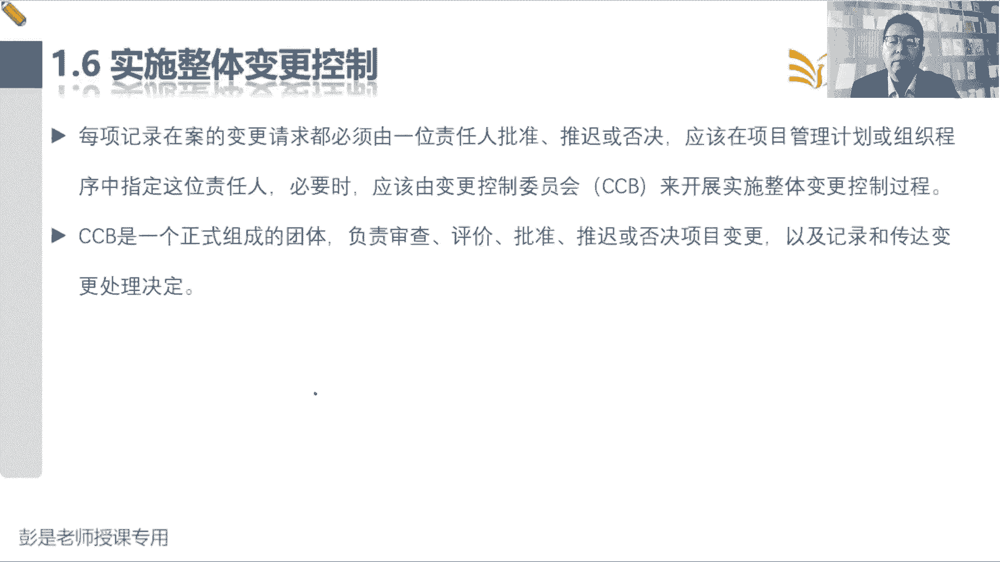

输入就没有什么东西了，这些什么计划呀，文件哪都见过了。

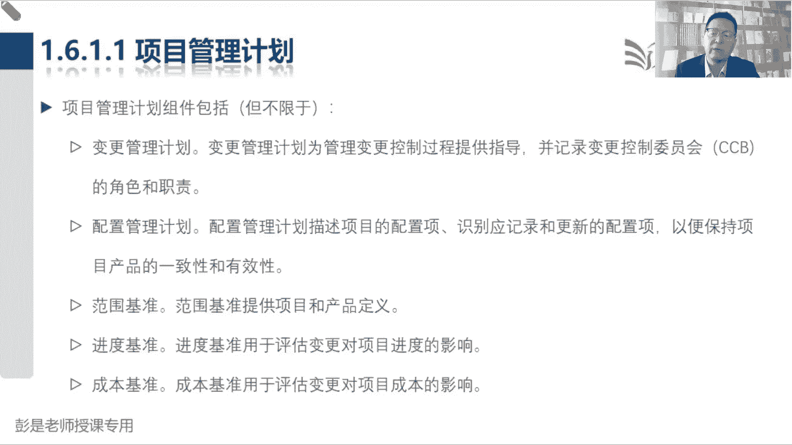

不解释了，然后工作机调报告不解释了，刚才说了，飞机准备给我找谁呢，不要再一问细节了，张三李四王五赵六，我们公司董事长要不要进去啊，客户项目要不要联合项目组怎么办呢，哎呀总经理要不要进去啊。

财务要不要进去啊，太细了，现在给大家讲的什么，你就记什么，各位亲，这是非常好的一个学习方法，怎么说呢，你就怎么记，坚定不移的记住这个结论，不要去加戏，不要再加各种各样的可能性了，加的太多，加的太多。

学到最后就散了，真的散了啊，好所以各位同学学习方法，学习方法有待提高，好一点，6。1614，变更请求说很多过程都会输出变更请求，变更请求，包括纠正措施，预防措施，缺陷补救以及更新。

这前面讲过了就不解释了啊，来反映八卦，斌哥可能会影响基准，可能会不会影响基准，可能只想想项目计较，这废话，变更通常由项目经理做决定，然后说对于会影响基准的变更，我们应该巴拉巴拉。

这种变更应该由CCB进行批准，就记住这三句话，三个单词就可以了，涉及到基准的变更，CCB做决策，由CCB来进行拍板拍板拍板，到底是批准否决或还是推迟，就记住这个结论啊，不要再问了，不要问细节了。

不知道不知道啊，不知道太细了，有成百上千上万种可能性，好记住这个结论。

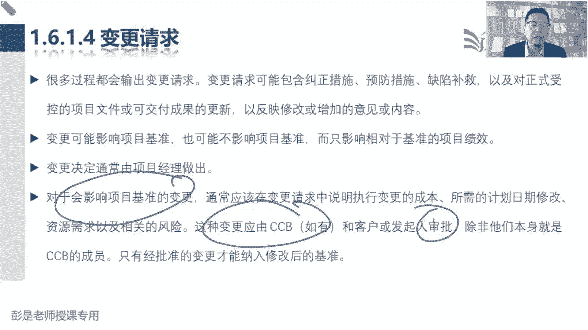

再往下，事业环境因素，没有新的知识点不念了，这个管理过程的输出。

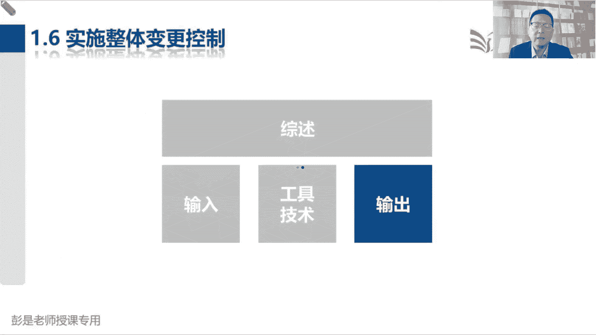

是由项目的巴拉巴拉根据编造计划，巴拉后面就不念了，这段文字我们已经见过了，总之啊大家根据我们的变更管理计划的指导，完成对变更的管理工作，记得吧，任何一个知识领域的名字或者是单词，加上管理计划。

这是告诉我们这是怎么管的，变更的管理计划，就是告诉你收到变更请求应该怎么管，然后批准的变更请求，应该通过指导与管理项目工作过程加以实施，所以呢他去了指导与管理项目工作，作为他的输入。

在强调这个玩意儿批准以后，一定要第一时间通知那个通知我们的人去落实，去执行，所以就有了对于推迟或否决的变更请求，我们应该通知提出人，对于批准的，我们要通知团队，除了通知提出人，还要通知团队。

最后呢我们要以文件的形式在变更日志之中，记录所有变更请求的处理情况，什么叫处理情况呢，流水账啊，谁在什么时间提出了一个什么变更，他要改什么东西，我们都有什么方案，什么时间开的会做的评估。

什么时间什么时间做的角色，谁做的角色，以此类推，流水账，他的内容不考不考不考，如果实在不理解的同学就忘掉他，好吧，太细了好再往下了啊。

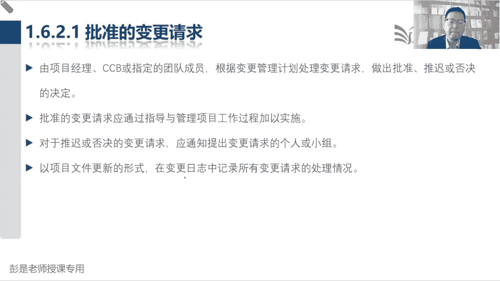

项目管理计划更新没什么东西，然后这个这句话需要给大家专心听一遍，听一遍了解就可以了，说对于基准的变更只能基于最新版本的基准，且针对将来的情况而不能变更以往的绩效，这有助于保护基准的力。

基准和历史计算数据的严肃性和完整性，什么意思呢，说基准啊要想改要想改还只能针对一来，将来不能改变过去，所以随便的粗暴的听一听场景啊，说呀我去给我们小区修路修路，现在要挖沟啊，我现在的工具是个破铲子。

然后呢，我现在的绩效标准是一天挖10米唉，这是现在我的工作的基准，一天要挖10米沟，结果呢第一天实际的工作绩效数据12名，第二天实际的工作绩效数据13米，第三天实际的工作绩效数据14米，超额完成任务。

这就是绩效信息比原计划完成的工作多，这不是绩效信息吗，诶到了第四天继续上，项目有调整，我们从铲子变成了铲车，铲车，这种情况下，我们的绩效考核标准就要做出相应的调整，铲车工作效率高啊，一天啊挖100米。

这种情况下，刚才书上这段文字想说什么意思啊，这种情况下，我们能不能用一天100米这个绩效考核标准，去评价过去三天的工作绩效，三天应该修300米，你实际完成大概39米，好工作只完成了10%。

比原计划完成的工作少，怎么干不行，他不科学不严肃，它不科学不严肃吧，所以我们应该有不同版本的基准，不同版本的基准用来核定不同时期的工作绩效，一天修10米，这是我1。0版本的基准，一天修100米。

这是我2。0版本的基准，诶这个意思就这个意思啊。

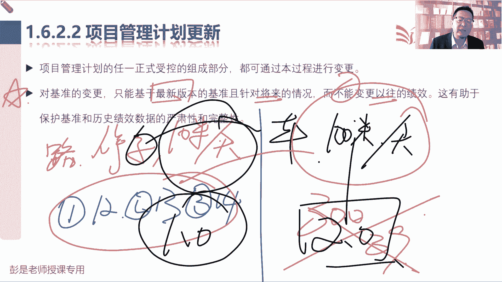

超级粗暴，超级简单，所以就是我们为什么说，基准基准要纳入到配置管理，要把它不同的版本都存档呢，因为不同版本的基准，用来核对不同时期的工作绩效，这是科学的，严肃的，这意思啊，听一听。

大概了解这个知识点就够了，哎什么叫变更啊，这两个字有这有这么难理解吗，就是和计划不一样的东西都叫变更，改这个字就是一个改，不管你改啥，不管你改啥，纠正措施，预防措施，缺陷补救更新，不管你改啥呀。

都叫变更啊，写好的文档改个字，改个标点符号也是修改啊，这都叫变更啊，以此类推吧，好这东西不要太复杂，不要想着超复杂超复杂，大家现在学习啊，越简单越好，越粗暴越好，不要想细节，越想细节越头疼。

好那接下来再往下了啊，项目文件更新，就是刚才我们听过的这个东西，变更日志，变更日志用来记录项目期间发生的变更，那记什么内容呢，不重要。

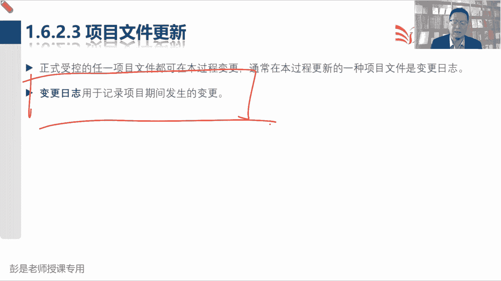