# 2024年最新版PMP考试第七版零基础一次通过项目管理认证 - P26：2.2.2 收集需求 - 慧翔天地 - BV1qC411E7Mw

好那接下来2。2收集需求。

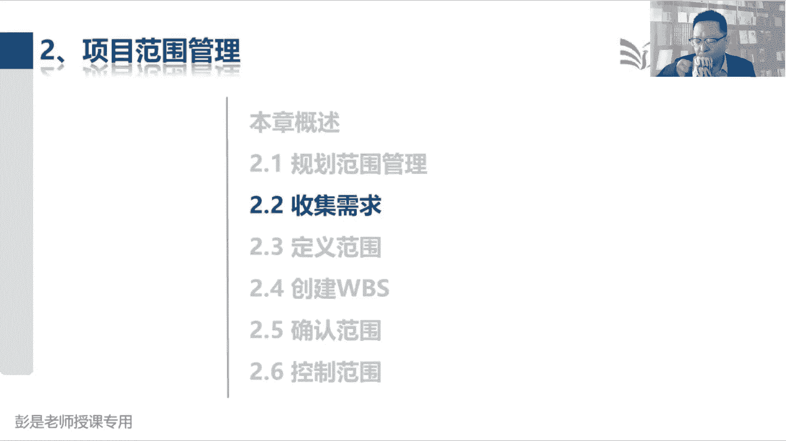

收集需求，这个管理过程也是大家后面复习的时候。

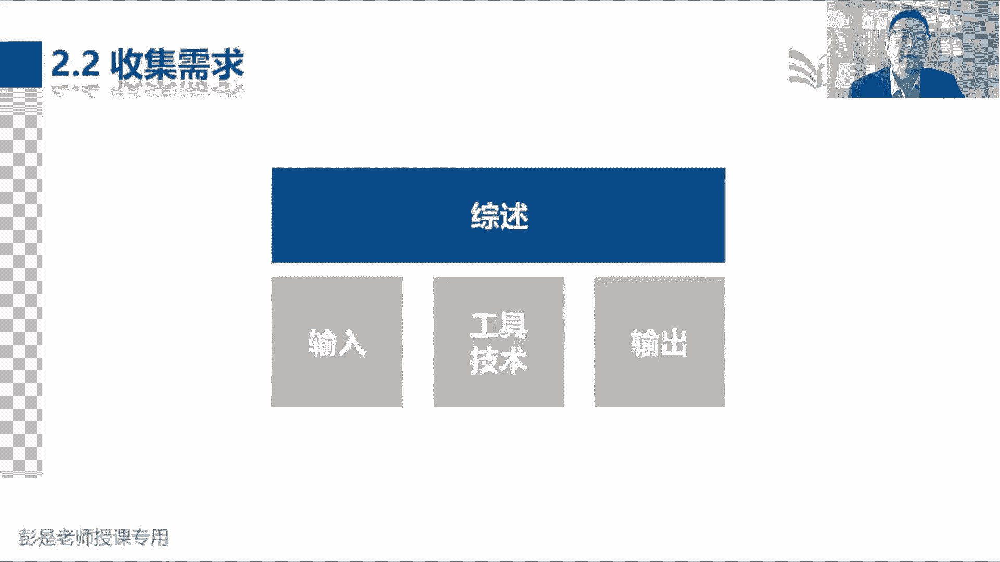

需要额外花一丢丢时间，多看几遍的东西，因为它的工具技术相对来说多了一点，但也不要求大家现在背了好，他的输入没有什么解释的，稍稍印象深一点吧，就是相关方登记册，就是相关方登记册。

我要在我们家小区开个牛肉面馆，我打算了解大家喜欢吃什么东西，打算去打算去看看政府这个什么工商啊，注册制营业执照啊，什么消防啊，卫生啊，嘿这些东西这些东西都都找谁呀，对不对，看看有什么要求啊。

这不都是都是收集需求的工作吗，所以我们需要相关方登记册，需要有个名单，不然你不知道找谁对，对接的消防谁负责这个地方的消防啊，谁负责这个地方的这个地方的食品安全呢，谁负责这个地方的什么卫生啊。

食食品许可证啊，这种东西啊，所以需要一个名单，否则不知道找谁去收集需求，只是相对来说需要记住的一个输入，它的输出刚才我们说过，发现啥记录查，所以它的输出就叫需求文件，第二个重要的输出叫需求跟踪矩阵。

这仍然不着急掌握啊，一会儿看文字超简单，那接下来大家学习的重心就变成了工具基础，先把我们有认知的东西排除掉，专家判断，知道了，头脑风暴发散思维访谈直接沟通，焦点小组还记得吗，交警小组焦点小组这聚焦聚焦。

今天我们这个会是收集收集消防方面的，要求的会议，不要聊食品安全好这个意思啊，聚焦不要跑题，不需要去记得问卷调查，这个要能反应过来，它通常适用于什么场景，通常适用于什么场景，我想在小区开个牛肉面馆。

我想了解下这个小区啊，大家都喜欢吃什么口味的，怎么办呢，访谈一家一家一个一个一个一个一个人，一个人的聊，效率低，人太多了，所以通常适用于人多，或者是呢大家不在同一个地理位置。

在这样的场景之下就发问卷了吧，哎招两个实习生，然后呢印几百张问卷发发进小，进小区的人都给他发一个对，让大家扫码扫码或者是纸质的各种形式，总之人多不在同一个地方，我们通过问卷调查。

这样的方式可以快速的获得反馈，效率高，这是它适用的场景好，这个需要听完之后就可以了，问卷调查是不是收集需求的工具呢，根本就不重要，不需要单独记啊，他很多管理过程都可以用，那再往下标杆对照。

看到这个单词能反应过来是什么东西吗，标杆标杆标杆对照，参考借鉴抄榜样，就这几个单词吧，诶这是咱从小到大传说中的别人家的孩子，别人家的孩子对吧，竞品啊，对齐啊，大家根据你的话术知道这个意思就够了吧。

所以什么业内大佬啊，类似项目啊，总之看看人家什么地方做得好，看看人家什么地方做得不好，对不对，有则改之，无则加勉，就这意思啊，所以它其实也是很多管理过程都可以用的工具，制定项目章程，可不可以标杆对照呢。

可以啊，张三你们项目组那个章程写的真真好，结构真清晰，参考一下，就是看看人家怎么做的，看看有什么最佳的实践，最好的方法参考一下，只要不侵权，只要不犯法，都可以抄，知道他的意思啊，然后文件分析。

文件分析其其实很多管理过程都会用，但也不要求大家去背，只要你了解这个管理过程在做什么事情，就能猜到了，现在我们在收集需求，那分析文件就是为了收集需求，通过看看客户客户企业里面这些什么制度啊，流程啊。

规章啊，什么标准啊，规范啊，包括业务资料啊，来挖掘业务需求，这不用去记得啊，投票多标准决策分析，见过了清河图，第一次见到这个单词干啥用的呢，清河图，清河图，它的主要操作是对我们收集到的需求做分组。

困了就睡觉呗，很简单，后面再复习，反正欠的债早晚要还的啊，可以物理攻击，魔法攻击呀，头悬梁锥刺股，掐大腿，站起来走一走都可以啊，魔法攻击呢就是想一想伤心难过的事情，物价呀，房价呀，脱单了吗，有小孩了吗。

怎么上学呀，买房了吗，买车了吗，工作好找吗，多少多少年没涨工资了，年终奖发了吗，别人家年终奖都是什么呀，标杆对照一下，对不对，看看身旁的成功人士，哎呀想一想，越想越不越想心越凉啊，那清河图回到知识点啊。

清河图的主要作用是什么呢，对收集到的需求做分组，因为啊未来我们要对需求做排序，排序的前提条件是什么呢，物以类聚，我就随便画圈圈了啊，我们要吃席，收集大家收集大家关于吃席的需求，收集到这么多的需求好。

接下来先分组后排序，这一堆都是凉菜的需求，这一堆都是热菜的需求，这一堆都是酒水饮料的需求，先分组，然后在同一分组内进行排序，因为不同分组的需求不一定有可比性，对不对，都是凉菜就好排序了。

那排序的这个工具叫什么呢，这叫名义小组，大家来投票，现在我们有这么多凉菜，然后得票最高的凉菜，我们取前三名就定这三个菜就可以了，唉这就是名义小组，所以把清河图和每一小组绑定CCR，一对好朋友。

新河图做分组，名义小组做排序，大概写这个写标标这么几个关键词就可以了，思维导图不解释了，这是对事物啊，对信息啊做梳理啊，我们要吃席，看看凉菜菜品，酒水饮料，菜品里面又可以分凉菜啊，热菜呀，什么面点啊。

主食啊，以此类推啊，做梳理的，这玩意没什么没什么没什么考点好，然后最后收集需做两个重要的工具，一个叫观察和交谈，一个叫观察和交谈，倒着想啊，为什么我们要去通过观察，这样的方法去收集需求呢。

为什么不直接交谈呢，为什么需要先观察，然后再去交谈，为什么不直接交谈呢，诶乖乖同学说到点上了，人家不愿意说，没时间说，说不清楚说不清楚，通常就是这样的场景吧对吧，就像各位同学。

人生人生每天最头疼的问题就是中午吃什么呢，中午吃什么，想吃什么，通常可能大多数人现在在说这个，随便这种情况下，需求明确吗，不明确需求清楚吗，不清楚他能说清楚吗，说不清楚，真的不知道是啥了，怎么办。

观察对不对，通过观察看看对方有什么爱吃的，有什么喜欢吃的，通过观察来挖掘需求，通过观察来挖掘需求，挖掘到需求之后，再通过交谈来进行需求的确认诶，那咱中午吃麦当劳，是不是观察和交谈对不对。

通过交谈进行确认，这个道理哈，好知道这个意思，所以通常人家不愿意说美食店说懒得说，不想说，不想说，不清楚，不管是主观的还是客观的，可能没有办法，没有办法通过交谈直接来获取需求，怎么办呢。

先观察这个大家实际工作中，生活中都在用，实际工作中生活中都在用，比如说送礼对吧，什么马上到了，哈哈过去了，什么情人节呀，什么什么七夕，七夕七巧节呀，什么什么春节呀，你要给你的好朋友送礼。

送礼送礼又不方便直接问，对不对，想给人家惊喜怎么办呢，观察观察看看对方需要啥，就这道理啊，好知道这个意思，然后引导记住，这其实前面说了吧，看到什么种族啊，不同职能部门，不同业务人员，不同种族。

不同宗教唉，总之双方可能有冲突，可能难以相互理解，那我们要想办法让大家有同理心，换位思考，相互理解，达成共识，第七个工具，其实现在基本上不考，因为他需要带一丢丢专业知识，就让他去死，记得住。

记不住根本就不重要，有兴趣的同学听一听系统交互图啊，就是让让我们画一画，各个系统之间是怎么交互的，他写也是用来确认需求的，比如说各位同学，你买东西哈，某多多和什么什么支付宝。

你要让某多多告诉支付宝这笔订单，他要付多少钱，还要还要还要还要让支付宝告诉某多多，这个钱他到底付了没有啊，这就是提现，提现各个系统之间它是怎么交互的，就这意思了解就够了啊，他需要带一丢丢专业知识。

通常软件设计，系统设计啊，干这个事情，这不需要去记得啊，最后一个原型法，这个需要掌握圆心法心法，牛肉面馆要装修，牛肉面馆要装修，什么是圆形法呢，人们为了稳妥起见，不得先画一个效果图嘛。

对您看看这个效果你满意不满意，没问题啊，我们再做进一步的设计啊，唉这就是原型法的一种，对不对，甚至为了为了为了节省时间，节省节省成本，拿手先给你画一个大概意思，或者是网上搜一个诶。

您看看这个风格喜欢不喜欢，总之是为了为了来确认需求，避免咱干活干错了，这就是圆心吧，做个假的，做个demo，做个假的，做个demo，做个模型，还用来确认需求，避免弄错了啊。

好所以X2吧好所以收集需做这个管理过程，大概有印象的这么几个工具，新河图名义小组一个分组一个排序，人家不愿意说，没时间说，懒得说，说不清楚，咱就先观察观察人家的需求市场，然后通过交谈进行确认。

然后圆心法主要工作，主要作用就是用来确认需求，避免弄错了，这就是大概这四个相对来说重要性可以高一点，然后像问卷调查呀，标杆对照啊，看到名字能够反映出来它适用于什么场景，就可以好，讲，完了这个管理过程。

咱休息一下，现在11。08，咱休息到11。15，稍后继续好，接下来继续了啊，正确率78%，78%的正确率正常吗，你这已经算拉仇恨了，其他人还没有这么高的啊，第一遍做题正确率40%啊，50啊都正常。

咱不断的巩固，不断的巩固，把这个正确率啊搞到70%，80%就差不多了，不要求百分之百，不要求百分之百啊，需要一个过程学习法则了，不了解85%就差不多了，已经很优秀了，咱考试及格线对吧。

从小学到中学60分万岁啊，不要求很高吧，达到85分，达八，达到85分以上的人已经卓越了，优秀了，大多数人啊，七十八十达到量这个水平就够了好，所以学习的学习的最重要的法则就是不较劲，就是不较劲。

不追求卓越啊，好再往下了啊，那收集需求搞定，主要主要是这几个工具啊，再往下思路跟不上的同学。

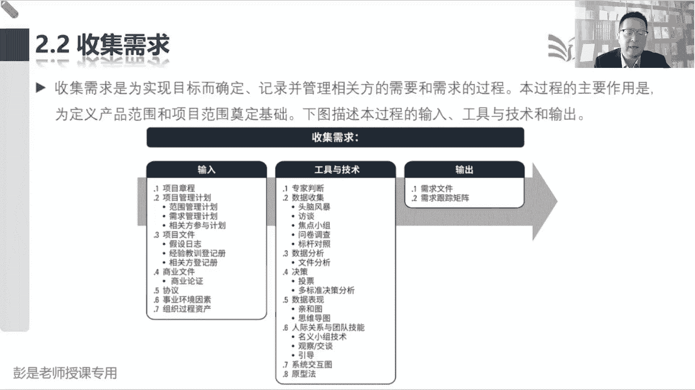

其实应该还好，应该还没有那么复杂的东西啊，先记大框架，收集需求怎么干活，达到干系人登记册，我们就知道找张三，找李四，找七大姑八大姨，找张厨师，找找张厨师，找厨师，了解大家未完成我们这个习需要开展的工作。

然后就会得到需求文件，因为好记性不如烂笔头，需要把需求都记录下来，记录下来之后啊，不是所有的需求都要都要满足的，所以我们需要投票啊，对不对，李四说喝五粮液，太贵了太贵了，咱投票表决排排序啊。

所以呢清河图做分组，名义小组做排序，然后收集需求的时候，张三你想吃啥都行，随便没想法，李四你想吃啥都行，随便没想法，没办法观察，看看大家平常喜欢吃啥，然后再通过交谈去进行需求的确认，那为了稳妥起见。

对不对，为了稳妥起见啊，你不理那个菜单吗，菜单上最好带点照片干啥呢，确认需求原型法呀，对不对，你看看这个菜是不是您心中的鱼香肉丝啊，因为不同地方不同地方炒出来的鱼香肉丝，宫保鸡丁不太一样，就这意思吧。

嘿弄个照片，鱼香肉丝宫保鸡丁，我心中的什么什么水煮肉，水煮鱼是不是这个意思啊，来确认需求，先弄个demo，避免干活干错了，大概就这么几个重要的东西，大家随便带场景，你能自己用话术把这个事说明白。

这个管理过程就学完了好，那接下来再看具体的文字，说我们没有专门讨论产品的需求，为什么呢，这需要专业知识，需要大家去学习产品的规划和设计，这些方法，市面上比较主流的就是一个PBA，一个NPDP。

有兴趣的同学等学完PMP再说啊，这不是咱们pip考试的重点，PBA商业分析师，那个NPDP是产品的规划和设计，它是大产品经理先了解行情，了解市场，了解策略，然后分析我们那个产品几步走。

做整个产品的规划和设计，重规划轻设计，设计只是纯纯粹的技术工种，对不对，规划更重要，到底做什么产品，就像我们要成立一个新能源汽车，哎呀你弄几个产品线呀，都坐什么车呀，轿车SUV呀，还是什么车呀。

分级档啊，这都是做整个产品的规划和设计，做做整个产品的规划，规划完了再做设计啊，好这偏僻考试不考啊，所以呢这段文字啊看看一遍，甚至后面复习的时候都可以不看了，总之专业的事找专业的人。

好知道这个大道理之后再找到最后这一小段话，这是刚才说的逻辑，我们收集需求，得到了需求文件，根据我们收集到的需求来定义范围，写范围说明书，范围说明书就说清楚产品有什么功能属性特征，说清楚我们要交付产品。

需要完成什么工作，说清楚我们都要交付什么样的成果，有了范围说明书，我们再根据范围说明书，定义的这些产品和工作来做WPS，把大成果变小成果，把大工作变小工作，然后呢再再写个WBS词典，为什么要做分解呢。

因为分解的越细，我们估算出来的资源时间成本就越精准，分解得越细，估算的资源时间成本就越精准对吧，做十个菜需要多长时间，十个小时做一个宫爆鸡丁需要多长时间，做一个糖醋里脊需要多长时间做一个，以此类推吧。

越细越细哎，估算出来的时间资源成本就越准，做一个宫保鸡丁好，你切鸡丁需要多长时间对吧，然后炒鸡丁需要多长时间，放调料需要多长时间诶，估算出来的就越准，还那便于我们更精准的管理和控制，我们的资源进度成本。

以此类推了，所以最后的逻辑是什么呢，需求就叫万恶之源，这就是万恶之源这个根啊，所以这个管理过程写了很多的工具，基础方法，就是因为需求一旦收集的有问题，就会导致我们的范围说明书写错了。

范围说明书一旦写错了，导致我们创建的WB就有问题，WPS1旦一旦有了遗漏，对不对，不充分不精准，就会导致我们估算出来的资源，时间成本全都错了，就会导致我们在错误的道路上越走越远，所以为了规避这个风险诶。

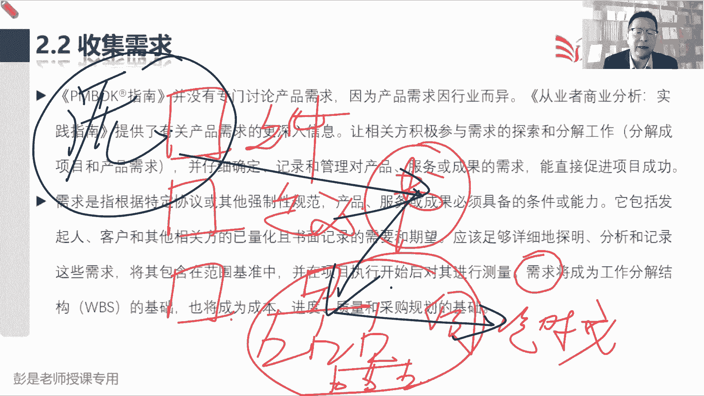

我们要着重着重了解这个事情应该怎么做，所以他越来越倾向于叫工程化，专业化，他有方法，有套路，对不对，不能胡来，另外呢需要足够的专业知识，没有这个专业知识可能收集到的需求，他也不知道这个东西的价值。

也不知道这个东西对不对，就会导致这个东西很容易，很容易引起一一系列的连锁反应，这就是这句话想说这个道理好，所以就根据这句话就有了前面这一堆这一堆话，所以我们需要一个什么专业人士。

然后呢要仔细的什么记录啊，确定啊这些需求啊能够直接促进项目的成功啊，然后呢我们需要这个东西也明确的记录下来，然后应该什么不念了啊，前面这堆文字大家不需要去记住的，到时看一遍。

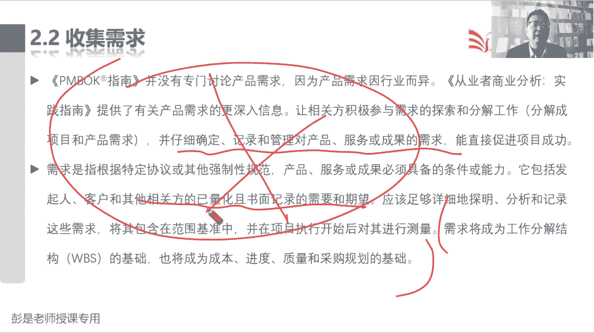

知道怎么回事就够了，那再往下这个管理过程输入，没有什么需要单独记的，唯一印象深的就是刚才说过的相关方登记册，没有这个名单，不知道去找谁收集去酒，那相关方登记册是哪一个管理过程的输出呢。

相关方干系人一个意思，Stakeholder，相关方干系人，相关方干系人，这个登记册是哪个管理过程的输出，就瞬间脑补49个管理过程那张表了吧，我们在启动过程组只有两个管理过程，一个叫制定项目章程。

一个叫识别干系人，识别干系的输出，就是相关方登记相关方登记册，诶，这稍稍有这个印象就到位了啊，所以就是吃席吃席这个事儿，看看谁和这个事有关系对吧，厨师啊，什么能不能点火起明火啊，消防啊。

食品安全的村主任呐对吧，工商啊，税务啊，以此类推，看看是哪些人群和咱这个事儿有关系，找到他，因为他的行为，他的措施，他的他的他的行动，可能会对我们这个事儿产生影响。

那我们要了解他对我们这个项目有什么要求，有什么期望对吧，实习不要动明火呀，实习现在什么地，村里边收红包什么的对吧，人数啊好像有很多要求啊。

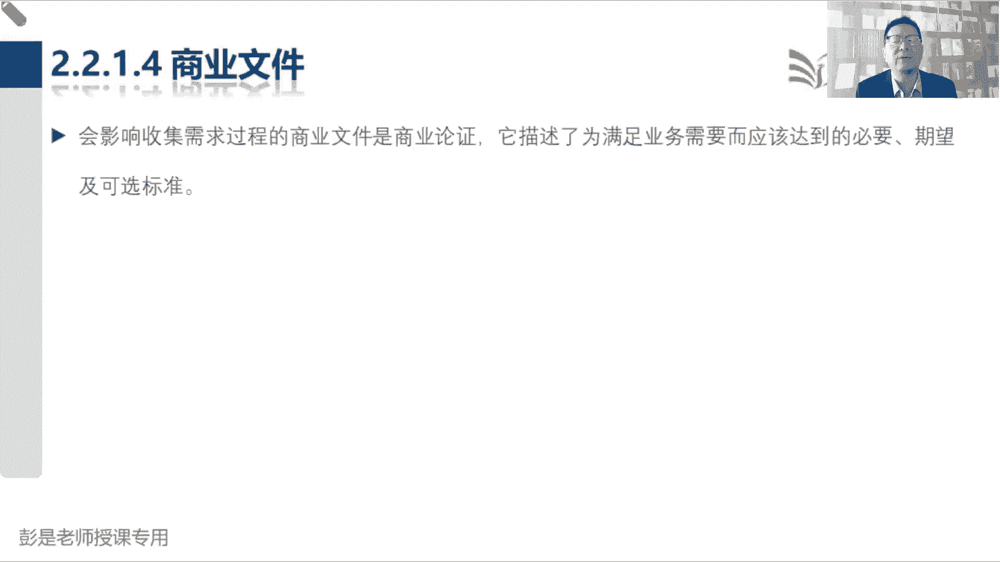

好知道这个意思啊，后面呢其他的东西没有什么需要背的。

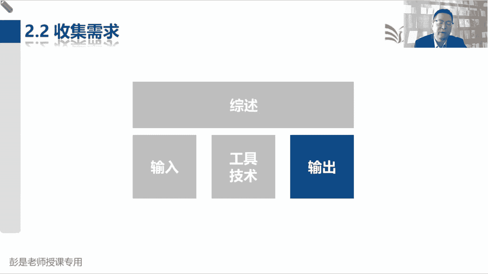

那接下来2221需求文件，需求文件的内容也没有什么太多需要去记住的，都是听课听课，知道大道理就差不多了，然后找到这句话啊，先听听完再写笔记啊，千万不要着急做记录哈，只有明确的可跟踪的，完整的。

相互协调的，并且主要相关方愿意认可的需求才能作为基准，但是通过学习我们会发现啊，我们项目整个项目管理体系里边说，至少我们要在范围，进度成本这三个知识领域有基准，那范围基准有什么呢。

通过刚才的课程大概有一丢丢印象，说它里面包括三个东西，叫范围说明书，WBS以及工作分解结构词典，WBS词典这三个玩意儿装订到一起，找关键相关方，一审批就得到了范围基准，这就是考试来说。

我们不认为有需求基准，考试来说不认为有需求基准啊，但是需求基准可不可以有呢，可以有需求基准好不好的好，这是两个知识，两个知识点啊，最好有，但考试来说，我们先先潜规则，认为它没有，因为在实际工作中呃。

可客户收集到的需求写了个文档，你不得让客户签字吗，避免耍赖，避免扯皮啊，对不对，客户正儿八经的签字盖章，这意味着双方达成共识，然后我们再根据这个需求文件去分析，到底要创造什么样的产品，服务或成果。

要完成什么工作，所以工作实际工作中最好最好最好有基准，但考试来说先不认为他有基准，那听明白这个意思之后，所以书上见到这段文字啊，咱们把它改一个字，只有满足这些条件的需求，我们才认为他是一个有效的需求。

就这个逻辑啊，白底黑字比较好哈，最好双方正式正式，正式书面的把这个东西确认一下，但考试来说，我们至少至少底线就是达到这些条件的需求，我们才认为他是个有效的需求，他清楚不清楚，明确不明确。

中午想吃啥想吃饭，这话说了跟没说一样，他不明确，对不对，中午想吃啥想吃菜不明确，中午想吃啥想吃，想吃川菜不明确，中午想吃啥想吃宫爆鸡丁还比较明确了吧，所以明确的可跟踪的跟踪是什么呢。

一会儿讲需求跟踪矩阵再说，然后一定要说完整，这些需求之间相互协调，和我们的总体目标保持一致性，并且呢人家还要点头同意的，才能才能认为是个有效的需求，好总之最后说到根儿。

就是跟那个smart原则一大同小异，知道这个道理就够了啊。

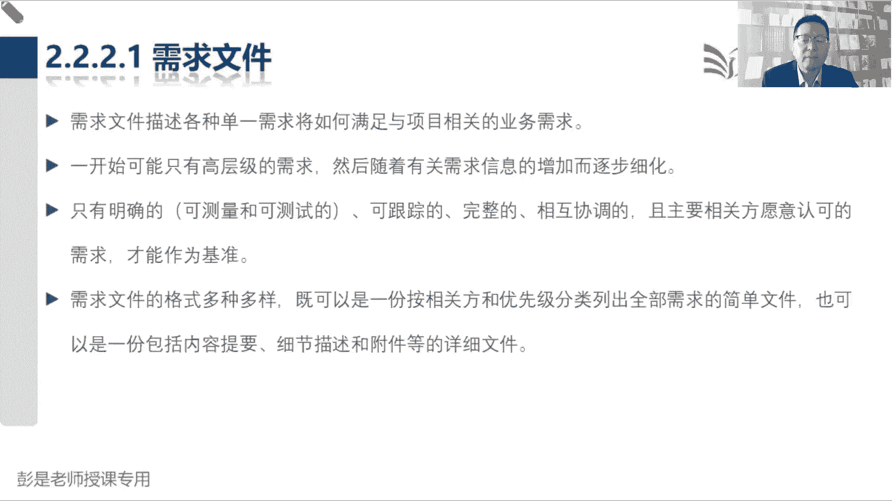

然后再往下需求文件的具体内容，基本上都是听一遍，有印象就够了，因为实际工作中细节肯定比这个多得多，但是后面要达到什么状态啊，看到这个单词能反应过来这是什么东西，所以所以先找两个单词说。

许多组织把需求分为不同的种类，如业务解决方案和技术解决方案，前者是相关方的需要，或者是如何实现这些需要，这是业务需求和技术需求，一个是what，一个是how，我想吃个鱼香肉丝，我想吃个宫保鸡丁。

这是相关方需求，怎么把这个宫保鸡丁做出来，需要什么食材呀，需要什么调料啊，需要锅碗瓢盆啊，需要什么样的厨师啊，哎这是技术解决方案，这是我们这个号这些条这些东西，这些东西到位了之后，怎么把这个菜做出来。

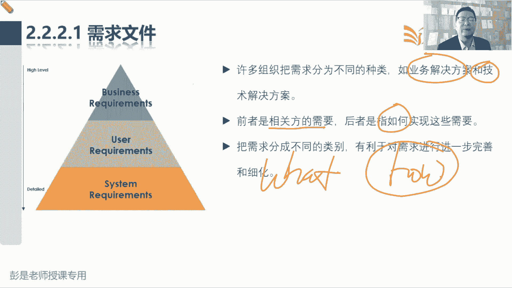

对不对，好知道这个意思够了，然后再往下细分的话就超多了哈，这些东西它的内容不要求，大家12345全都背，但是需要最好达到一个理想的状态是什么呢，看到这个单词能够反应过来它是什么东西。

那业务需求可能刚才知道了，相关方需求，纯粹的字面意思对吧，什么村主任啊，消防啊，食品安全啊，这两天梅菜扣肉，梅菜扣肉，嘿能用什么样的肉呢，对这315哈，相关方在食品啊，什么法律法规啊，工商税务都有要求。

以此类推了啊，好再往下就是解决方案，解决方案需求啊，对标的是产品，需要有什么功能产品，需要有什么非功能需求，非功能需求啊，就是大家工作中生活中关心的这些叫属性特征，我想买个手机，希望这个手机待机时间。

待机时间两天以上，希望这个手机能防水对吧，10米防水，30米防水，能潜水还是能等地，还是掉洗脸盆里，不会不会进水，哎，这都叫非功能需求，关于什么可靠性啊，保密性啊，性能啊这些这些方面的要求啊。

这都是了解就够了，我想买个车，我想买个车，这就这个车要能开这个车，要能什么什么倒车影像，这不都是功能吗，这个车啊百公里油耗只要油耗越低越好，哎比较省油，这就是非功能需求，听懂就够了哈。

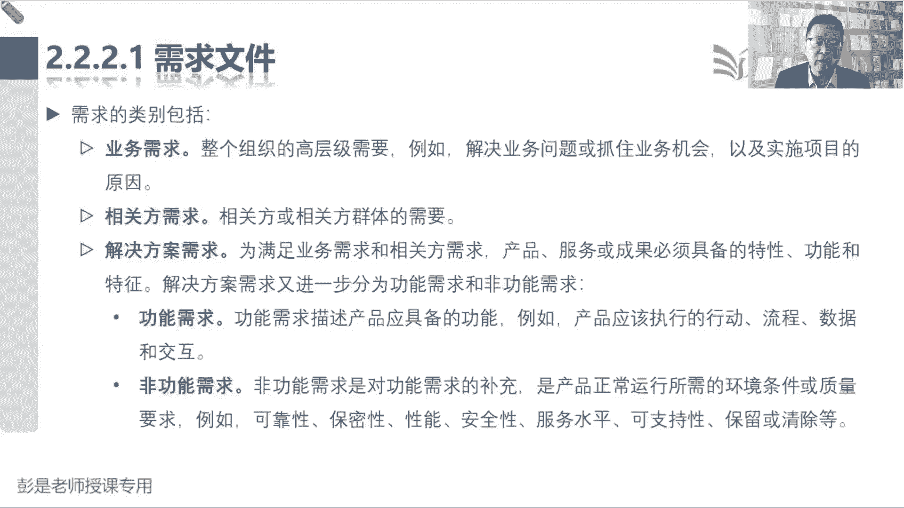

那再往下细分的话，还可以分成过度需求和就绪需求说呀，描述了从当前状态过渡到将来状态，所需的临时能力，这句话听完了之后看不懂，让他去死，就看例子，比如说数据转换和培训需求，数据转换不就是过渡吗。

什么叫数据转换呢，你买个新手机还亲，能不能帮我把旧手机的数据导到新手机里，把我的什么微信啊，聊天记录啊，给我弄到新手机里啊，这就是数据转换的需求吧，换个新电脑，把资料导到新电脑上，换个新的软件。

把原来的数据导到新的软件里面去，唉这都是数据转换的需求，然后培训需求就好理解吧，就是就绪呀，我还没学会这个东西怎么用呢，你得先教我啊，教我教我教我教我，学会了之后准备好了就可以干活了，纯粹的字面意思啊。

再往下就是项目的具体要求什么升级啊，改造啊，里程碑啊，各种各样的要求，最后呢就是质量需求，需要达到什么样的质量标准和要求对吧，要符合咱国家的就是3C梅菜扣肉食品安全法，食品安全法诶，这是质量的要求吧。

不能有什么添加剂啊，不能有什么苏丹红啊这种东西啊，地沟油啊，好所以需求文件的内容不要求大家全都背下来，没用的哈，看到这个单词啊，大概知道怎么回事，能猜对的就不要记了，这个能猜对，这个能猜对。

这个稍稍有一点点印象，因为不好猜对不对。

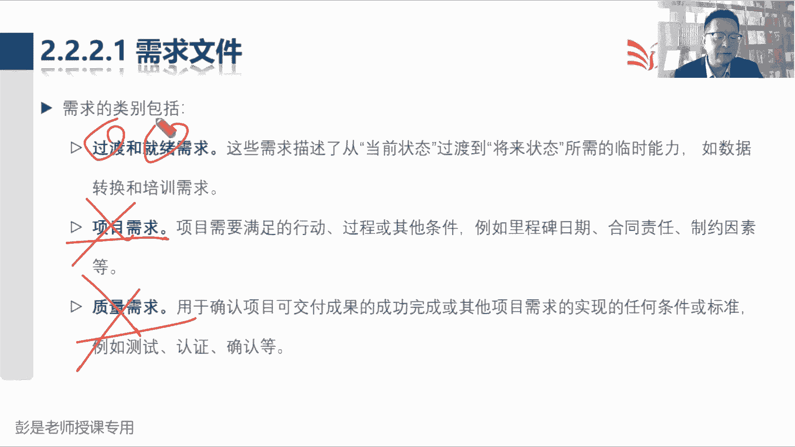

万一它出现在题目里，你要能够反应过来，不管是什么需求，它都是需求。

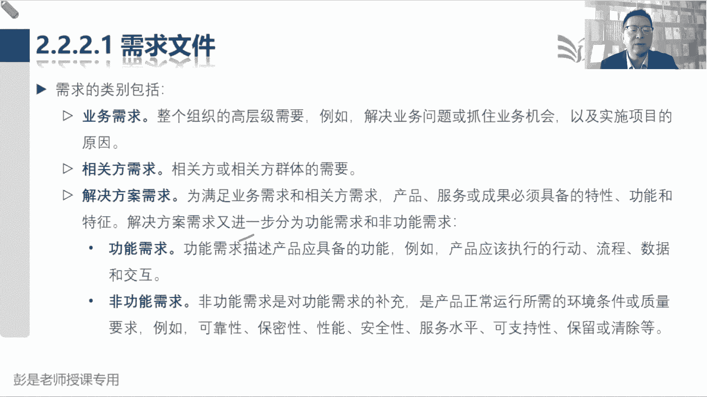

所有的需求都要进入到需求，稳健掌握到这个道就够了。

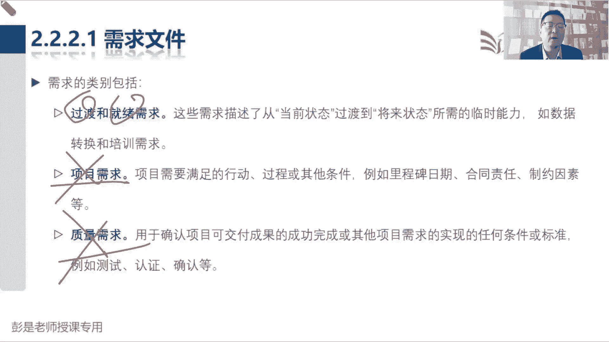

好，那再往下四个二，需求跟踪矩阵，需求跟踪矩阵先粗暴来一版，他最重要的作用啊，就是把来龙去脉给人家捯饬清楚什么叫来龙吗，好现在我们收集到的需求，现在收集到的需求啊，我们要去分析这个需求是不是有效的需求。

是不是有价值的需求，他就需要往前跟踪了，这个需求是不是和我们的章程保持了一致性，项目章程说我们要开发一个阶段，现在大家听课的叫什么，什么小额通教学平台对吧，直播平台，嘿我们要做一个能上课的。

能上课的这么一个软件，我希望啊希望有这样一个功能，希望有一个功能啊，说在上课的时候能够看到股票的走势，这样的我输入我买的股票的号码，就可以看股票的行情了，这个需求就是个无效的需求，为什么呢。

因为他和我们教学这个目的就不一致，那么它就是个伪需求，这就是需求跟踪矩阵这个来龙，它的重要作用，去分析我们这个需求是不是明确的，是不是有效的，是不是相互协调的，是不是有价值的。

是不是和我们的主要的业务目标保持了一致性，所以他往前追追项目章程啊，追双方签的协议啊，追再往前就是商业论证啊，我们要保持这些这些需求和这些东西的一致性，从而来说明这个需求是有价值的。

能够满足用户的业务需要，我们的现在的主要业务是教学，不是炒股，哎，这就是来龙，那把来龙搞定之后啊，还要搞清楚这个去脉，为什么呢，因为我们要做到价值交付，最终交付的成果对用户来说，满足他的业务需求有价值。

所以往后追就是需求，追成果以及这个成果未来的一系列的状态，这个需求对应到我们哪一个成果，对应到哪一个成果，这个成果完成了没有啊，测试了没有啊，验收了没有啊，提交了没有啊，嘿如果他完成了测试，通过了。

验收了，移交了，这这样呢，我们最终最终移交到用户手里的可交付成果，都是有价值的，都是有效的东西，满足用户的业务需要。

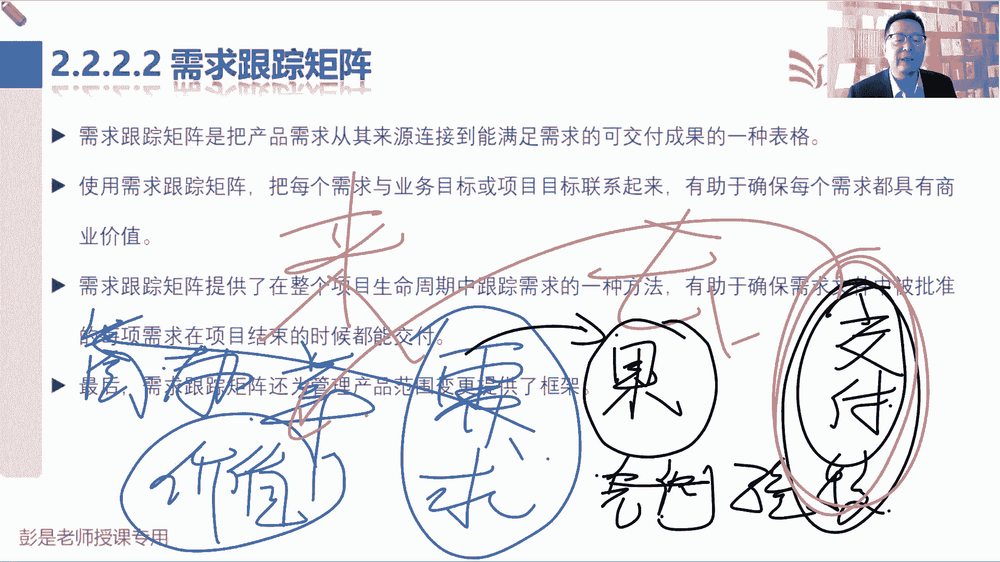

就这个来龙去脉，就这么一个道理啊，好，所以需求跟踪矩阵最重要的作用是，把产品需求从其来源连接到能满足需求的，可交付成果的一个表格来龙去脉，那使用需求跟踪矩阵，把每个需求和业务目标，项目目标先联系。

说我希望咱这个教学平台有个功能，说发现有同学调皮捣蛋的时候，我可以把它关进小黑屋，哎，这就是和我们的业务相一致的一个有效的需求，来我们搞定，然后呢这样有助于确保每个需求都有商业价值，每个需求都是有效的。

有价值的需求，把前半段搞定，接下来搞后半段，那在整个生命周期中跟踪需求，为什么呢，因为我们还要跟踪需求对应的成果，确保最终的成果都能够交付，这个把学员关进小黑屋的功能开发完了，测试通过了。

升级了一下这个软件，他就有了这个功能交付了诶，就开心了，因为满足我的业务需要，满足我的业务诉求，这就是需求跟踪矩阵，最重要的作用就是听完这一段课程，知道它的来龙去脉诶就够了。

需求跟踪矩阵书上后面给的例子啊。

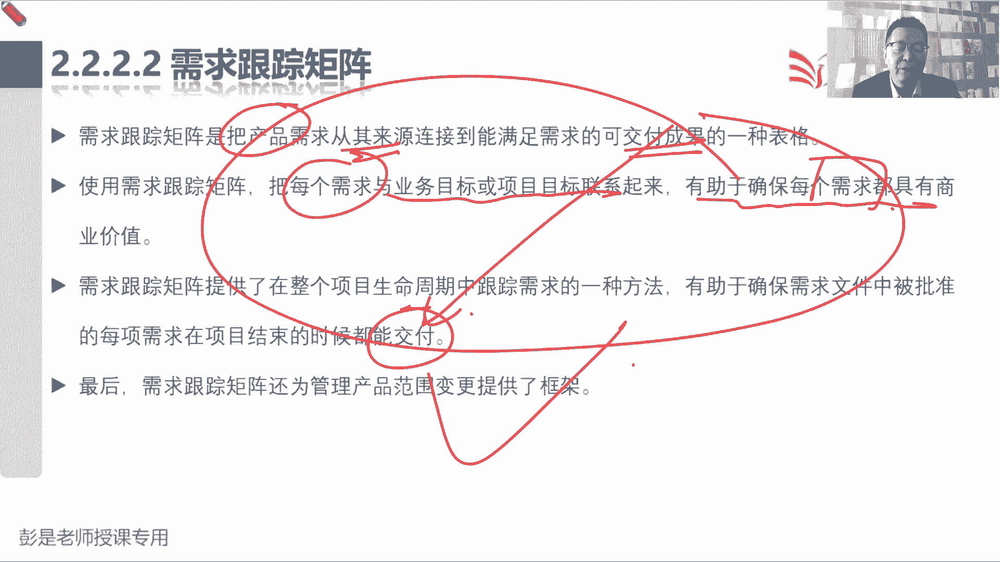

他具体的内容不要求大家去背了，不要求背了哈好，所以他对标的什么业务机会啊，这都想看就看，不想看可以不看了，总之把每一个需求，把每个需求和成果相关联，然后前面说清楚这个需求的价值去验证一下。

后面呢确保这个成果能够做到交互，这样我们就可以做到价值交付，和你项目中的PAELINE其实差不多，其实差不多，它的作用意思差不多吧，确保这个事这个事儿别别干歪了，对不对，好知道这个意思啊。

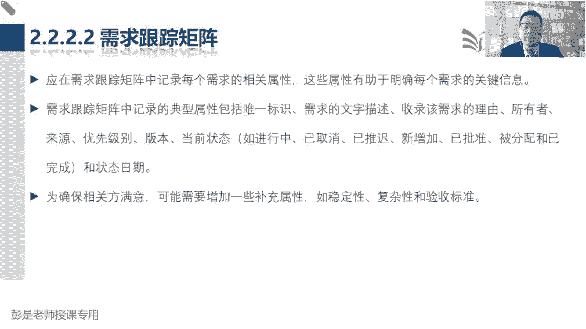

这是单独记，所以需求跟踪矩阵就是需求文件的CP。

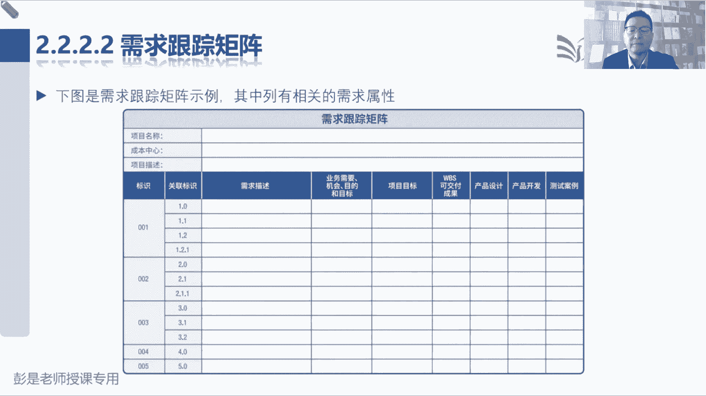