# 2024年最新版PMP考试第七版零基础一次通过项目管理认证 - P28：2.2.4 创建WBS - 慧翔天地 - BV1qC411E7Mw

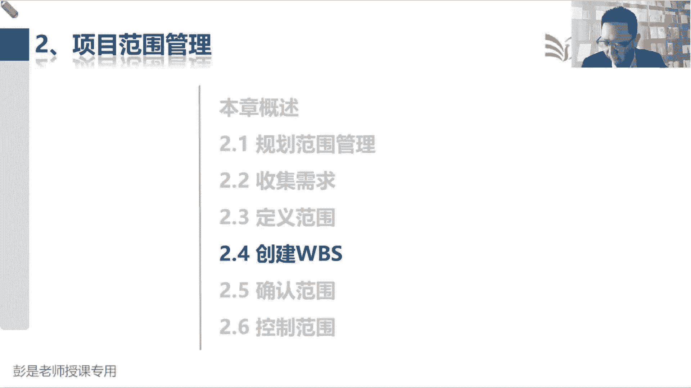

那2。4创建WWPS这个管理过程。

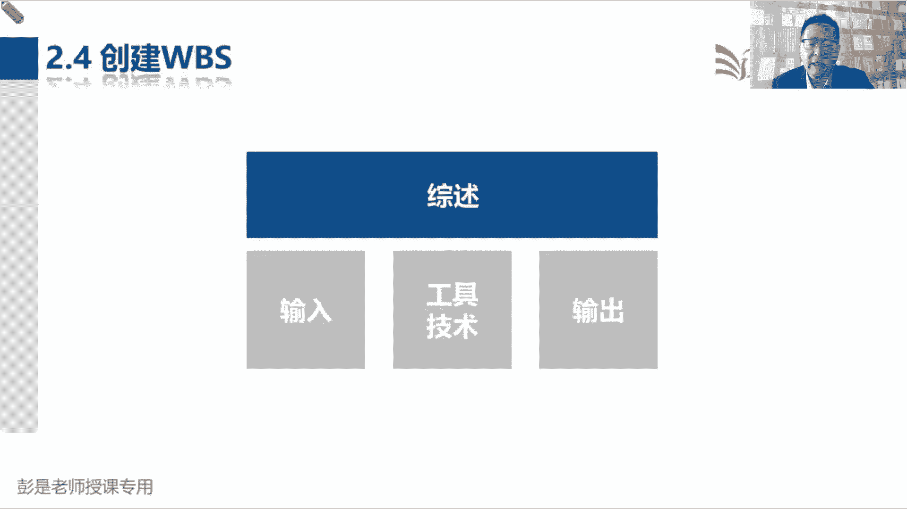

大家后面复习的时候，就像现在我这个讲课的方法啊，先看输出，再巩固一下到底什么是WS。

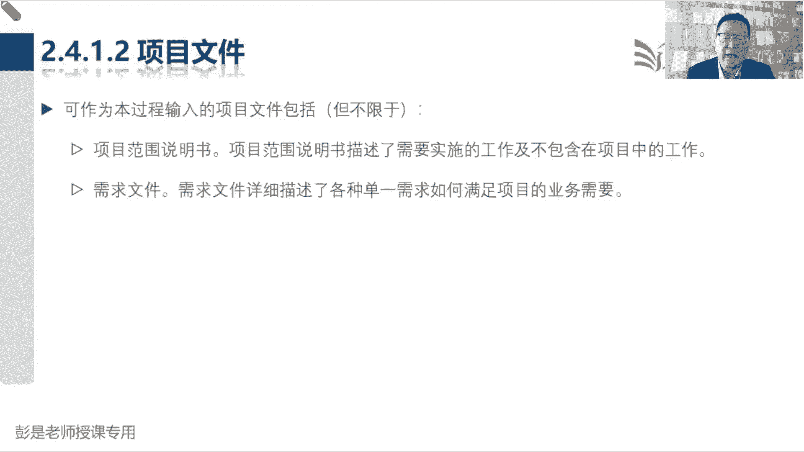

比如说书上给出的这张示意图，我们要造个大飞机，这个飞机系统就是我们的主要可交付成果，这个飞机就是我们的主要可交付成果，然后呢，项目管理是为了交付这个产品，需要开展的工作培训，这也是工作什么测试和评估。

也是未交付这个东西需要开展的工作，这些呢都叫项目范围来工作，医疗分解，那除了分解工作呀，还对成果做分解的中间这个什么数据呀，航空器呀，支持设备啊，设施啊，这是大成果所构成的小成果。

然后再进一步的分析这个数据，我们要完成什么工作，能得到这个东西，航空器我们需要把它变成一大堆的小成果，再去分析需要完成什么工作，才会得到这些小成果，以此类推，就是不断的大成果变小成果，大工作变小工作。

那现在这张图就叫WBS，这叫工作分解结构，那工作分解结构，接下来还需要写个文档，为啥呢，因为这个消防系统，需要达到什么质量标准和要求，预算大概是多少，打算多长时间，什么时间把它做完，谁负责这个事情。

他有什么限制条件，这些方方面面的细节性的内容，只看这个WBS是看不出来的，就需要配套一个文档，12345把它详细的描述一下，来解释每一个小方块，来解释每个小方块，你关心的那一大堆各种各样的问题。

所以WBS词典的内容粗暴理解，九大知识领域搞定，因为理论上来说，我们随便可以把一个小方块单独拎出来，作为一个子项目，每个子项目每个项目的范围，进度成本质量资源，各个知识领域相关的要求都要写清楚啊。

唉所以就是九大知识领域的内容，好知道了知道了，这到底什么是WBS。

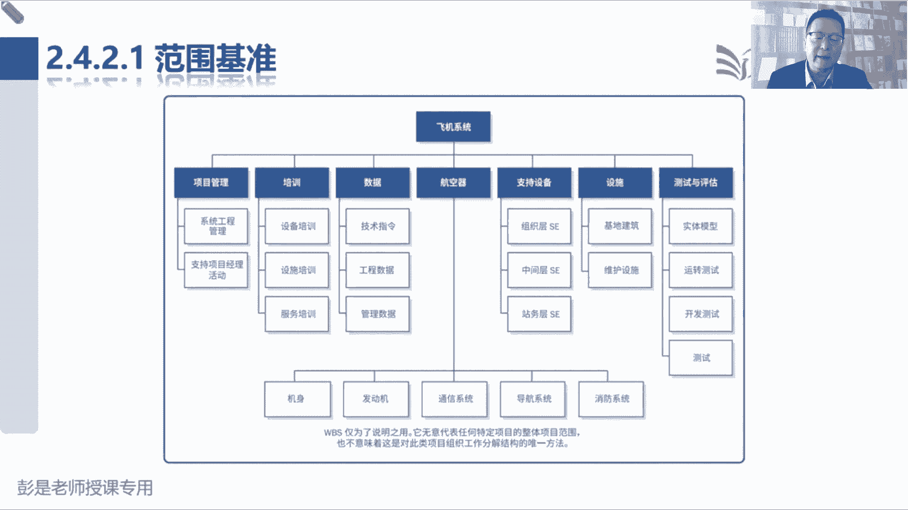

接下来在倒车倒车倒车，其实他这个管理过程输入啊，输出啊就学完了。

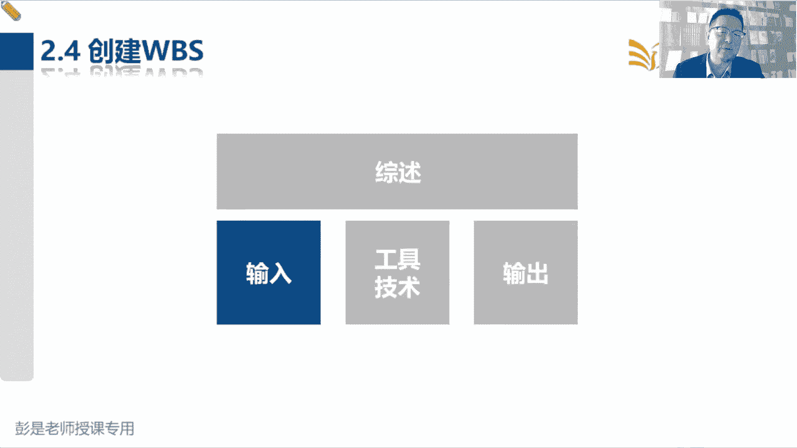

没啥太多细节性的东西了，后面讲工具的时候再稍稍讲一丢丢小细节，咱就下班了，好所以创建工作分解结构，WBS是把我们的工作和成果分解成较小的，后面就是目的更易于管理的组建的过程，就像刚才那个大道理啊。

变成一大堆零件，这样估算资源时间成本更精准，所以他的收入没有需要去记的东西，输出就是范围基准，范围基准里面包括三个文件，包括刚才写的范围说明书，以及我们将要创建的WBS，还有解释WPS的词典。

这三个文档找关键相关方一批准，就得到了范围基准，中间的工具技术，这肯定要记住的，就叫分解，很好理解啊，大工作变小工作，大成果变小成果，分解可以有效地降低事物的复杂程度，一个飞机几10万个零件不分解。

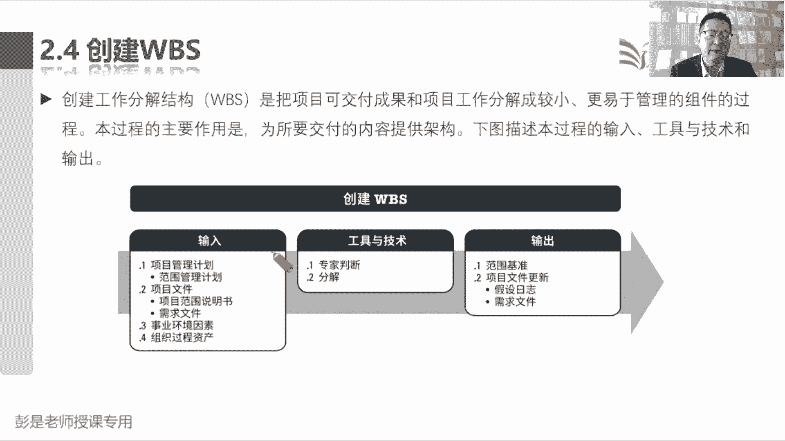

这活不好干的，好再往下了，那WBS说巴拉巴，这咱知道了吧，层级结构啊，WWPS的来源其实就是从组织架构出来的，听一听就完事了啊，为什么从组织架构呢，因为啊组织架构发明在前，最早最早很多企业就会发现。

那人一多啊，需要需要怎么做呢，人多人多就要分369等，就有了公司的组织架构，把管销售的人放到一个圈里，把管财务的人放到一个层级里，以此类推，就变成了你公司的组织架构，这些是销售，这些是财务，这些是技术。

这些是什么测试，这些是质检诶，就有了公司的组织架构，这样便于我们管理和控制整个公司的有效运转，那WBS也是这个逻辑，就参考了OBS说，把这些工作和成果做到了进一步的分解，便于我们有效的管理和控制好。

然后后面大家做章节练习题的时候，可能会纠结这个字啊，这些文字游戏，WBS组织并定义了项目的总范围，代表着当经批准的当前范围，说明书所规定的工作范围，说明书，他已经把我们的范围定义好了。

那WPS和它的区别是什么呢，就是多了组织两个字，这两个字想体现啥呢，组织构成组织结构啊，WPS除了能够定义清楚项目的范围，还能够体现我们项目范围，产品范围的结构构成，所以他用了这么一个文字叫组织。

并定义了项目的总范围，这听一听知道意思就够了啊，这种小细节现在基本上也不考，只要知道WBS的核心作用，便于管理和控制。

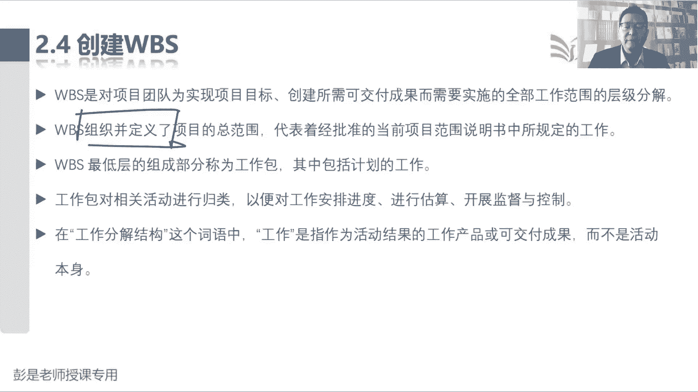

好那在这个管理过程中，输入为啥需要解释的了。

输出范围基准，这100000%要掌握的啊，范围基准是经过批准的，谁批准的，不知道有权利的人，经过批准的项目范围说明书，WBS以及相应的WBS词典，这个东西一旦经过关键相关方的批准，就变成了基准。

一旦有了基准就走流程，所以只有通过正式的变更程序才能够进行变更，它是用来比较的基准，记住啊，那范围基准包括什么呢，范围说明书我刚才见过了，WBS见过了。

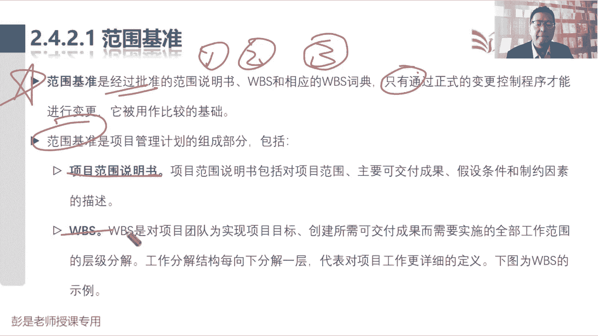

然后这张图见过了，知道意思就够了啊，接下来又来了三个单词叫工作包，控制账户和规划包，工作包控制账户和规划包，为了便于大家粗暴理解啊，随便想个场景，大家听一听，知道怎么回事就可以了。

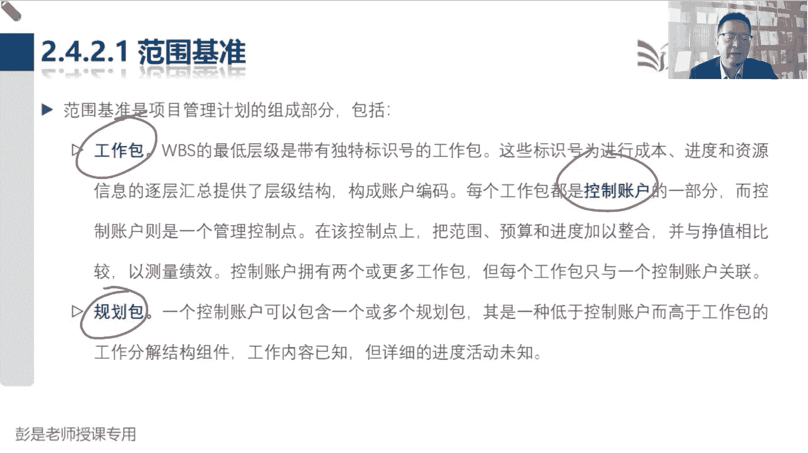

它的主要中心思想是什么呢，叫滚动式规划。

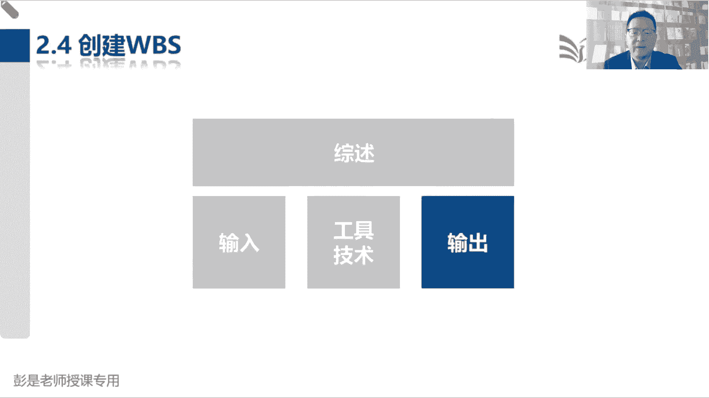

滚动式规划的重要原则就是近期要完成的工作，咱需要把它详细的写一写，对不对，就像今天是周周日哈，下周下周要大家工作要干什么事情，这一定是详细规划，不能太粗略啊，那远期要完成的工作，比如说现在是3月份。

6月份，下半年工作计划写了吗，下半年周一周二周三周四周五，5月7月八月九月，每周每天都做什么事情，还没有这么详细的吧，到时候再说了，看情况，所以远期的工作我们可以考虑粗略的规划。

这是非常重要的一个滚动式规划这种思路，那知道了这个思路啊，WPS就可以这么去玩了，这是我们的实习，然后往下分解，这是凉菜热菜酒水饮料，主食我就写了一个主持啊，好上热菜，上凉菜，上酒水饮料。

这些都是近期要完成的工作，那我们就需要进一步的详细分解，都有什么热菜呀，都有什么凉菜呀，这什么洗菜切菜，炒菜为交付产品需要开展的工作，都分解了主食啊，不一定吃主食，不一定吃，到时候再说，对不对。

并且通常在家吃席，吃席主食可能没那么重要哈，那到时候再说，到时候再说，就把它后面再分解了，现在先不分解，能听懂吧，以后再分解，现在先不分解，先不分解，先不分解，那接下来根据刚才掌握的三个术语。

我们要把它往里面塞了，往里塞一个叫控制账户，等等啊，画错颜色了，会用颜色更清晰，控制账户的主要工作是什么呢，管理控制，所以叫控制账户啊，那既然是管理控制，意味着啥，他有下级这家逆公司的主管组长。

经理总监，董事长，VP总经理CEO，这名字一抛出来，就说明他有下级，为什么呢，因为他不是员工，那他有下级的这些带有下级的这些人，他的主要工作是什么呢，管理控制对不对，领导这是管理控制啊。

所以有下级的这个层级，他只要下面还有人，我们就把它称之为ca控制账户，他来负责管理控制，那下面这些蓝色小方块啊，没有下属的，没有下级的，最底层的干活的人就是员工，我是我们公司的，我是我们公司的授课老师。

我没有下级，没有下属，我就是普通员工，仅此而已诶，干活的人，干活的人不就是工作吗，所以他就被称之为工作包，因为他没有下级了，那这个主食叫什么呢，他以后会有下集，可能有包子，米饭面条饺子。

他以后会有下下集啊，但是现在还没有呢，那就是我们规划中的一个东西，所以就叫规划包哎，就这三个单词搞定，所以有下级的就称之为管理控制点，就叫控制账户，没有下级的自己照顾好自己干活的人，干活的人就叫工作包。

然后呢以后会有下级，但是呢现在先不分解，以后再拆，对不对，远期的工作粗略规划，到时候再说了，它就叫规划之中的一个包，就叫规划包，哎。

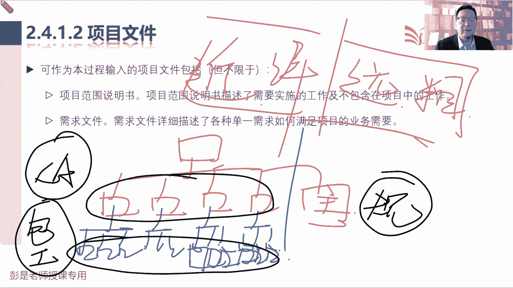

这就是WBS里面这三个术语，简单啊，知道意思就够了，所以现在课件上这张图就粗暴的理解一下，粗暴的理解一下就可以了，这你们仨没有下集了，就叫工作包，他们上级领导往上走，只要在他们上面的都叫控制账户。

不要控制账户，然后我约定了3。13。2以后再拆，以后再分解，那给他做个标记，他有下级，但是现在还没有呢，以后再说，就标记为规划包，就知道这个意思够了，粗暴理解粗暴理解啊。

不要打把它对标到你工作中有认知的场景啊，为了便于大家更好的理解，只是说就像刚才那个主食，主食等于储备干部吗，不等于不要再去，不要再去用各种各样，其他的其他的场景去想这个事。

因为我们现在讲的是工作分解结构，它对应的是成果和工作好。

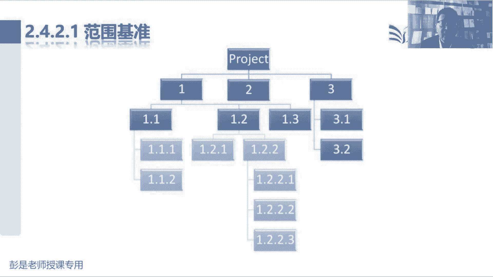

所以知道这个中心思想，再看文字就简单了，工作包就叫最底层，他是WBS里面的最低层级，因为他没有下属了，那就是对标的员工，对不对，然后每个工作包肯定有上级领导，所以呢他是控制账户的一部分。

那领导干什么事呢，管理控制在控制点上，我们管范围，进度成本质量资源，以此类推，所以一个领导可以有很多员工，但是呢每个员工只能有一个领导，避免多头管理吧，我在公司我是打杂的，张老师管我，李老师管我。

赵老师也管我，什么班主任都管我，唉这活儿没法干，死定了，所以呢最好每个员工只有一个上级领导，避免多头管理，不然就肯定死定了啊，好那规划包是什么呢，一个控制账户可以包含一个或者是对规划包，它是什么呢。

叫低于控制账户，而高于工作包，高于工作包代代表了啥，他以后肯定有下级，他以后下边肯定有工作包，但是呢现在还没有，所以所以这是规划之中的一个东西，好这就是关于这三个单词的解释，知道意思够了。

那再往下就轻松加愉快了。

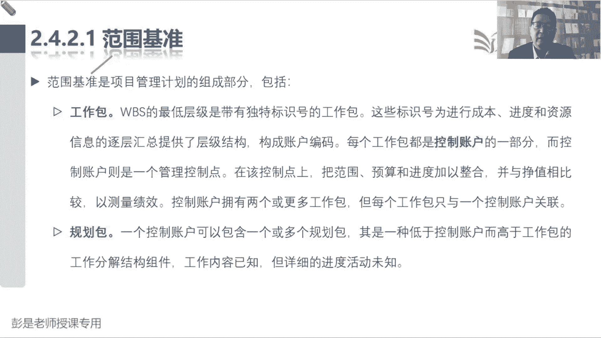

这张没东西了，WPS词典谈的内容不要求大家去记，粗暴理解九个知识领域的总体要求，把每个小方块就有，大知识领域的都要求都写进去吧，什么编码呀，描述啊，假设条件制约因素啊，谁负责呀，资源啊，然后时间要求啊。

进度啊，什么资源成本质量都可以往里写，不犯法啊，所以它的具体内容是不要求大家去背的。

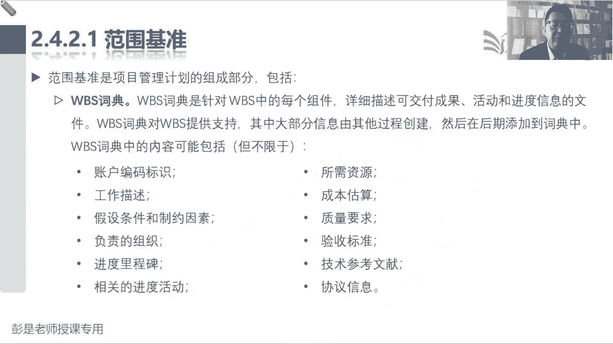

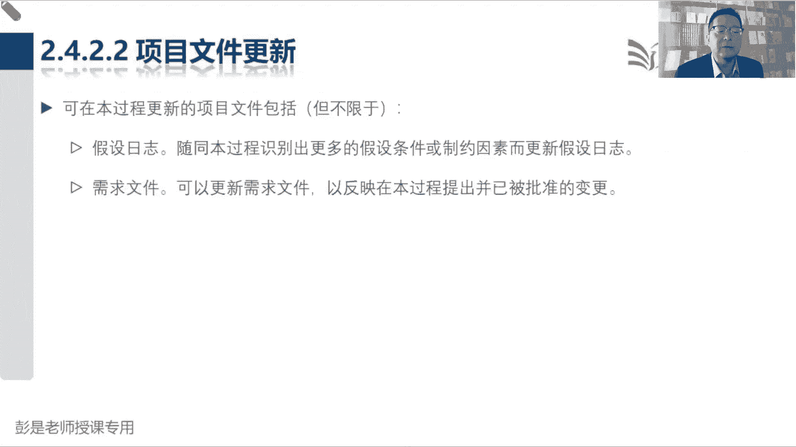