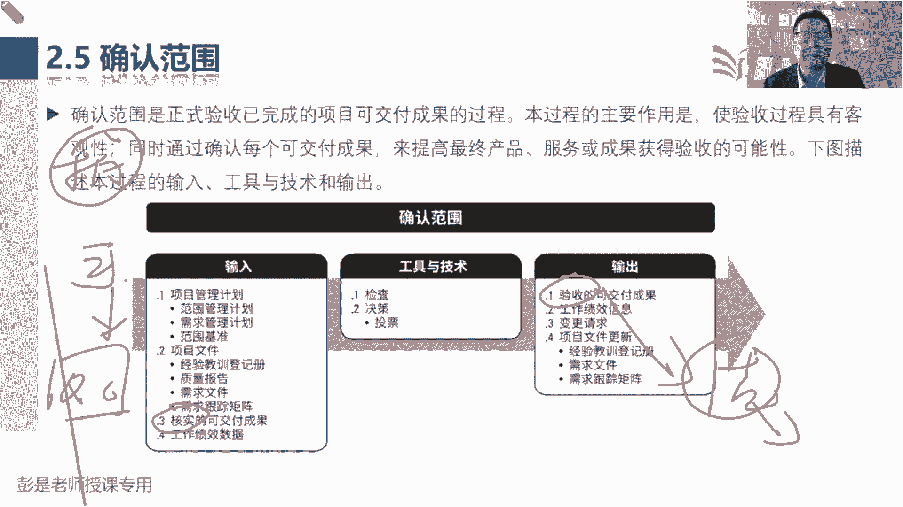
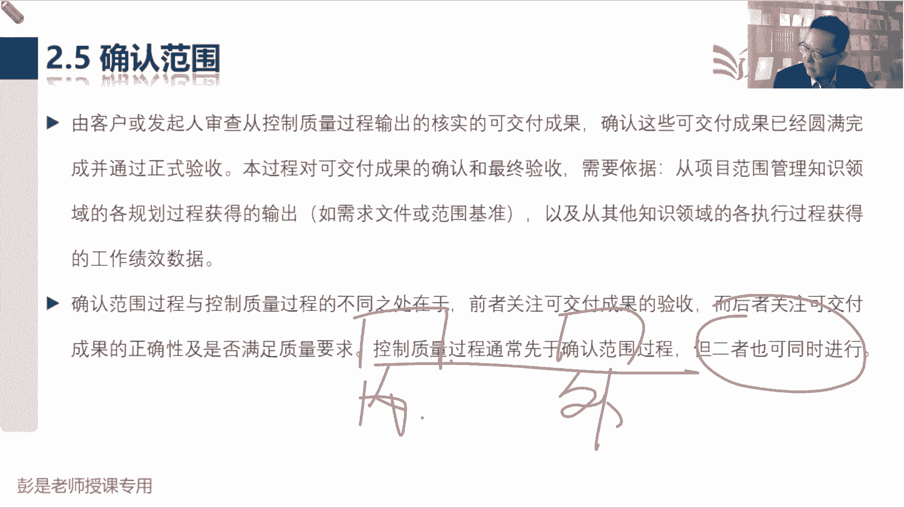
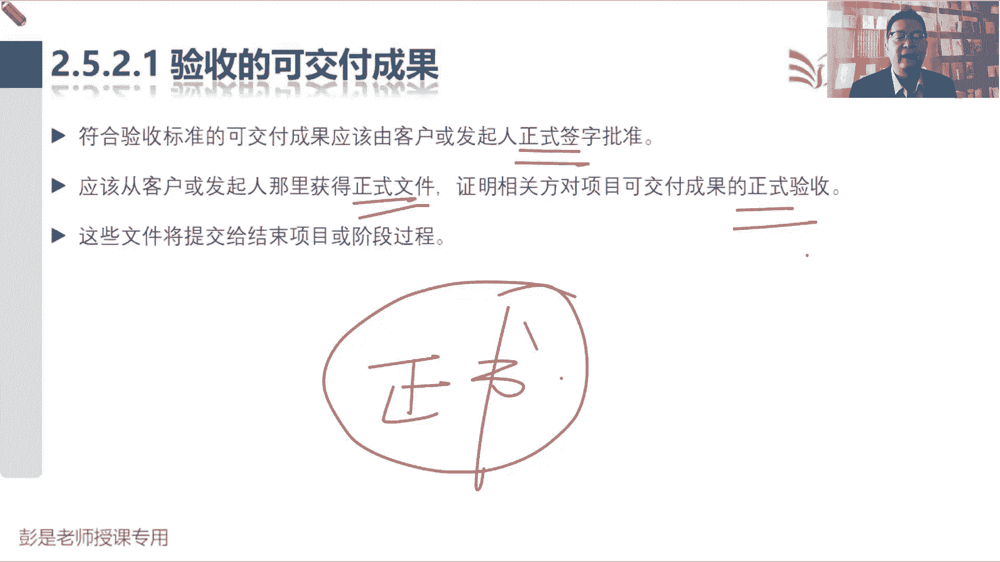
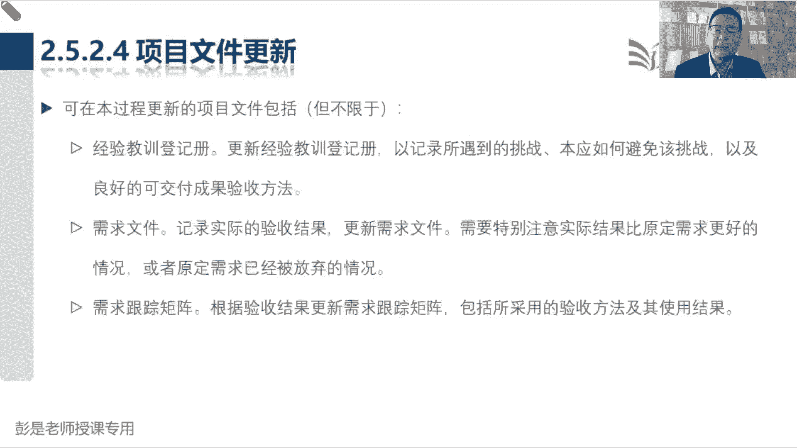

# 2024年最新版PMP考试第七版零基础一次通过项目管理认证 - P29：2.2.5 确认范围 - 慧翔天地 - BV1qC411E7Mw

那2。5确认范围，这个管理过程大家一投入就过去了，确认范围，是正式验收已完成的可交付成果的过程，所以就像就像各位同学，你中午叫外卖，打开包装，看看是不是你的菜，看看有没有撒，看看弄有没有有没有什么头发。

这就是验收啊，收了快递打开包装，检查这个东西的正确性完整性，这也是正式验收好，那他的工具检查就搞定了，然后投票，因为对项目来说，通常不一定一个人就可以做决定，说我们验收通过了吧，一定是有验收委员会的。

只要指导委员会的吧，有一堆人呐，他的输，唯一需要记得就是刚才反复说的这个逻辑，输入带输出输入来源于QC控制质量，QC的输入叫可交付成果，可交付成果从哪来的呢，是岛屿管理项目工作，然后我们输出验收的成果。

这个东西要去结束项目或阶段，让项目经理把他变成最终产品，服务成果的移交搞定。

所以书上这段文字还是值得大家去看一看的啊，告诉我们说什么什么这东西验收不讲了，反复讲了，然后说这个管理过程和控制质量的区别，确认范围就是做验收，控制质量是我们内部检查这个东西的正确性，完整性。

从而避免让客户发现这个玩意儿不对劲，导致人家满意度的下降，最后这句话就在说它的逻辑通常最好最踏实的，最稳妥的就是咱内部先做指控，然后再让外部来进行正式的验收，但二者也可以同时进行，同时进行。

还是有风险的，对不对，所以一个是原则，一个是一个是原则，一个是底线吧，就这么理解吧。

那这个管管理过程输入没东西了，什么核实的可交付成果啊，见过了吧，数据呀，这东西就不需要背啊，验收2521验收的可交付成果，就刚才各位同学说的那个，学到知道的那个大道理，白纸黑字最踏实。

最好最好最好正式书面，避免扯皮，所以大家完全靠我们的生活常识也能理解吧，外卖外卖，快递小哥把把把你买的东西放到你家门口诶，那你可不可以说这东西我没收到呢，可以对不对，因为他没证据没证据啊。

当着快递小哥的面，你打开包装检查这个东西的正确性完整性，事后啊，没签字可不可以耍赖呢，可以因为他没证据，但是这么做不道德啊，不道德，所以将心比心吧，换成我们是快递小哥的话，稳妥起见的方式。

最好最好最好正式书面，当着你的面打开包装，检查东西，当着你的面签字，这样就不会耍赖了。

