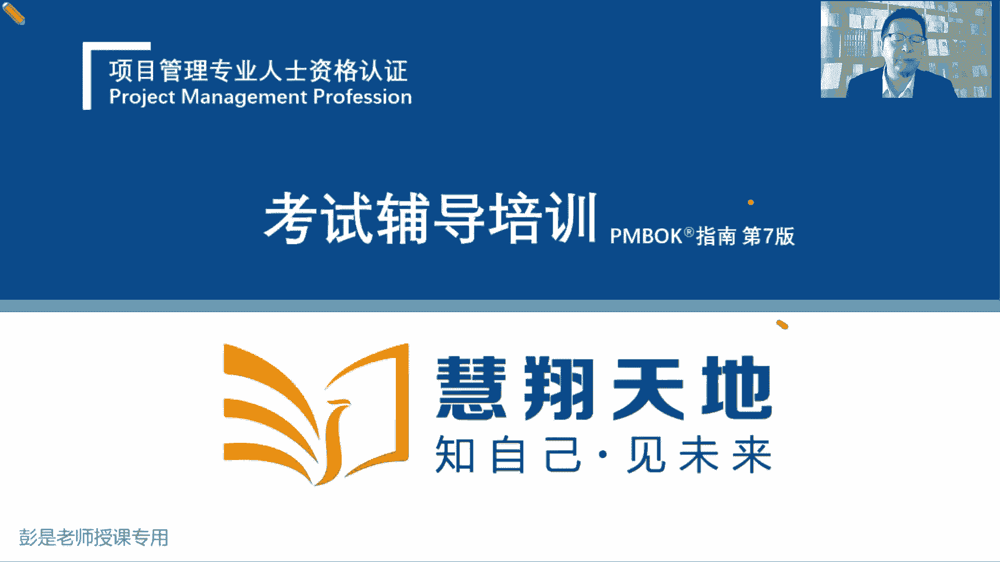
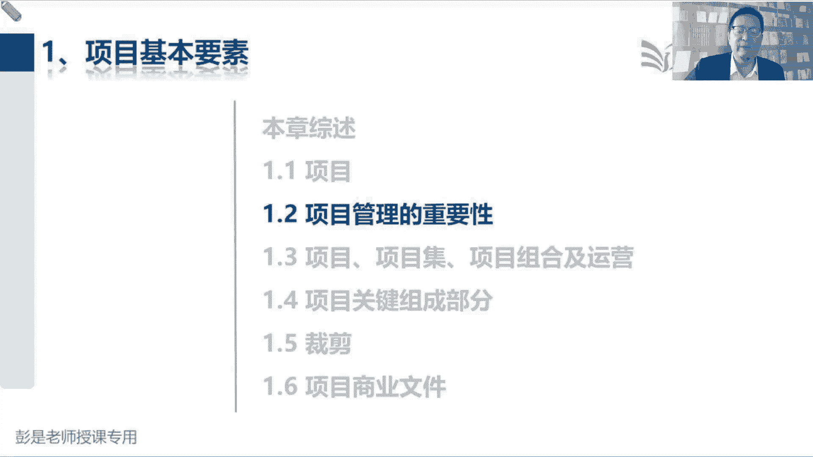

# 2024年最新版PMP考试第七版零基础一次通过项目管理认证 - P2：第一部分  1.1.1 项目 - 慧翔天地 - BV1qC411E7Mw

准备了啊，开始在知识的海洋里畅游遨游了，那接下来正儿八经的我们准备开始讲知识点，好准备了啊，543210，现在这个东西有个整体的认知啊，就这样了，学习这种这种反人类的事情，这第一呀。

大家未来不管是你学什么东西啊，包括你日常生活中想说看看书，学习一些东西啊，先看结构，先看框架，是这个逻辑吧，比如说你想要买买房子，先看大局啊，先看大局观的，看看这个小区的整体布局，看看这个小区的位置。

看看周边都有什么东西，看完大大方向，再看细节，再看细节啊，以此类推，学习也是这个逻辑，先看看这个考试考啥，我们需要学什么东西，然后再看看整本书的结构都有什么东西，再去看细节，五大过程组，十大知识领域。

49个管理过程，以此类推。

那咱们整本教材通关宝典一共分成四大块内容，为什么可以暂停啊，我也不知道啊，一共四大块内容啊，第一部分叫项目管理基础知识，就是什么叫项目啊，什么叫项目集呀，什么叫项目组合呀。

都是关于项目管理的相关的一些基本概念，让我们了解一个项目涉及到的相关的相关的设，周围的环境都涉及到哪些知识点知识点唉，这就是项目管理基础知识，第二部分内容，第二部分内容也是信息量非常大的。

这是叫传统的项目怎么管，预测型项目到底怎么管，所以呢它叫基于过程的项目管理方法，实际上呢就是五大过程组，十大知识领域，49个管理过程，刚才给大家见过的那张表，我们去详细的展开说，我们在管范围，管进度。

管成本，管质量都涉及到哪些管理过程，开展这个管理过程主要作用是什么，会得到一个什么结果，需要什么输入，中间会用到哪些工具技术，哪些方法，这叫基于过程的项目管理，然后第三部分内容呢是什么呢，就是敏捷。

这是刚才大家问他说，老师啊，什么叫敏捷啊，敏捷的主要作用是什么呢，告诉我们在这种变化多在这种需求不确定，在这种什么创新类的项目，嘿多变的环境下，到底怎么管项目，因为五大过程组十大致是纽约49个过程。

不一定适用了，做需要做出一些调整，所以它涉及到敏捷敏捷的一些实践方法，最后呢通关宝典最后一部分内容是什么呢，就是传说中的pm的第七版，这是pm哥的第第七版，还告诉我们管项目涉及到哪些原则，有12个原则。

告诉我们管项目需要关注哪些工作领域，包括规划呀，包括执行啊，包括能不能做到价值交付啊，包括风险，那就变成了八个T效率，它是从12个原则和八个技巧与这个角度去，把我们第二部分和第三部分内容的知识点。

重新做了分组，所以其实第七版，第七版相当于大家学到最后，你就会发现相当于复习，因为咱们第二部分和第三部分，已经把项目管理的222大块，非常非常核心的知识点给大家讲完了，整本教材大概是这样一个结构好。

然后再看啊，那说不要看串讲，看看教材，看看看咱给大家发的那个学习教材，就通关宝典就可以了，不要看串讲，串讲那边那边教材啊，是相当于之前做热身的这么一小段课程，好知道整本教材的结构之后，像第一大。

第一大部分内容叫项目管理的基础知识，属于什么三大块，第一项目管理的基本项目的基本要素，第二项目运行环境，第三项目经理的角色，最核心的都在第一章就告诉我们说，项目项目管理的重要性。

告诉我们什么叫项目项目集，什么叫运营，什么项目组合，什么叫关键组成部分，生命周期阶段划分，以此类推，涉及到大量的基本概念，基本的知识点，好一个一个来了啊，那从现在开始啊，各位同学。

各位同学给大家提一个学习上的个人建议哈，大家酌情去做出相应的调整，学习的建议是什么呢，就是啊首先大家要知道这个考试难，这个考试火，这个考试有含金量，需要大家储备足够的知识，对不对。

需要大家储备足够的知识，所以咱的课程听一遍肯定是不够的，一遍你根本记不住，一遍根本记不住啊，建议呢至少至少至少两到三遍起，才能够不断的不断的温故而知新，不断的巩固这些知识点，这是听课。

那刚才有同学问老师啊，要不要看书呢，需要，看什么书呢，看通关宝典，看通关宝典啊，说老师啊，这本教材呀看几遍呢，个人建议看一遍还是不够的，也是需要看两到三遍，为什么呢，因为知识它不进脑子啊，对不对。

知识他不进脑子，你听一遍听一遍，听得明明白白的，然后呢不看书，过两天调着就忘了，所以需要不断的不要不断的听课，那为什么还要看书呢，老师啊，我课课上听的都挺明白的，不看书能不能通过考试。

那为什么还要看书呢，为什么还要还要看书呢，因为我们要做这方面的训练，阅读阅读能力超重要，还记得我们考试吗，230分钟，180道题，230分钟，180道题，我们需要在一分钟之内把这道题读明白，对不对。

一分钟之内把这道题读明白，明白人家在说什么事儿，明白四个选项在说什么知识，在说什么事儿，然后找到一个比较合适的选项，找到一个相对来说最正确的选项，那阅读能力就需要训练了。

因为目前对大家对对对咱全世界的人来说，基本上是共性的啊，基本上阅读能力是在普遍下降的，各位同学摸着良心想一想，你有多长时间，多长时间没看过书了，摸着良心想一想，每天都在看什么呢。

现在人现在人基本上文字不看了，对不对，以前还有什么看一些小说啊，看一些文章啊，后来呢有了什么微博呀，字儿少啊，看得快呀，就看微博了，现在微博也不看了对吧，看图片看视频，刷抖音，刷快手，看视频不。

这来的多痛快啊，3分钟带你读完三国，2分钟看完一个电影，主打一个效率高，现在就是吃快餐，对不对，所以大家目前普遍的现象就是阅读能力在下降，那咱考试呢考试咱那个考试书2万字左右呢，180道题。

一道题大概100字左右啊，2万字左右的阅读能力差的同学，经常会有一个什么结果呢，题都做不完，一分钟一分钟，老师啊，我两到3分钟才把这道题，好不容易给他读明白，读明白之后啊，看完四个选项又懵了，对不对。

大家的阅读能力是需要训练的，那阅读能力怎么训练呢，老师看小说行不行啊，一目十行啊不行，小说小说写的字越多，赚的钱越多，所以它水水滴点水呀，大量的话大量的单词，大量的大量的字啊是没用的，对不对。

能够做到一目十行，所以需要看不说人话的书，看不说人话的说啊，这是看咱们通关宝典，看官方教材，看官方教材，这样呢第一能够熟能够让我们巩固知识点，第二可以训练我们的阅读能力，看得多了，书读百遍，其义自现。

看的多了，看的多了，你就会适应这种书上的这种这种说话的方式，因为大家有些同学应该做过预习了啊，有些同学做预习的时候有没有这样的感受啊，咱们这个教材最大的作用是什么呢，咱们教材最大的作用是什么。

大家知道吗，效果奇佳，催眠各位各位同学，看看你身边有没有亲戚朋友同事啊，说睡眠质量不好对吧，睡不着觉，你都把pm甩给他，把咱的官方角度甩给他，10分钟肯定就犯困了，催眠真的是看不进去，书上大量的授予。

大量的概念又抽象，晦涩难懂，对不对，并且有一些话术说的不说人话，对不对，不说人话啊，不是咱们熟悉的大白话，对不对，不是咱们熟悉的大白话，所以看起来会让大家非常非常非常痛苦，越看越困，越看越看不进去啊。

没有好的办法，亲，没有好的办法，咬着牙坚持结合咱的课程，课上给你讲的明明白白的，然后呢还要去看书，还要去阅读，再通过通过脑子里在课上听，听到的这个这个印象，再去看这些文字，能够看懂了，能够看懂了哈。

只有不断的不断的听课看书听课看书，听课看书就可以提高阅读的效率，提高阅读的速度，阅读的质量就这个道理，没有好的方法了，这就是唯一的好方法，总之概念越熟，读起来就越快，概念越熟，阅读的效率。

阅读的质量就越高，就这个道理，这是大家未来未来备考过程中，第一大障碍就叫阅读，所以呢回到刚才给大家学的教的，交代的这个学习学习任务啊，第一听课课程听一遍全都记住，不可能不现实，至少两到三遍起。

然后呢第二个学习任务呢就是看书，书中自有黄金屋，书中自有颜如玉，通过阅读第一巩固知识点，第二训练我们的阅读的能力，提高阅读能力，这样考试的时候，你做题的时候才能够做到又快又好，哎就这个东西。

那看书看一遍够不够呢不够，建议呢也是至少两到三遍记，这是第一个给大家交代这么一个学习的方法，知道了这个学习方法之后啊，再再给大家絮叨几句啊，大家备考过程中第二大障碍是什么呢，第二大障碍是啥。

就这个东西了，不专心专注力对现代人来说，专注力是普遍下降的，难以保持长时间的注意力高度集中，想一想各位同学，你在工作中，在生活中，目前是不是这样一个状态，打扰我们的东西太多了。

吸引我们诱惑我们的东西太多了对吧，刚才发的朋友圈有没有人点赞的，哎呀那个那个关注的那个那个明星啊，今天有什么新闻，哪有什么八卦呀，哎呀有什么热搜啊，有什么热搜啊，有什么东西我不知道啊，对对诶。

有没有人跟我聊天啊，怎么怎么10分钟了，还还没有人给我发消息呀，有信息也焦虑，没有信息也焦虑，结果这个东西注意力普遍不集中，因为吸引我们的东西太多了，那我们需要想办法训练专注力，训练注意力了。

现在就犯困了吧，我也困了嗯，那怎么训练注意力呢，打游戏当然很专心了，因为你喜欢呢，因为你喜欢对不对，学习这种事情你不喜欢，大部分的人，大部分正常人都是不喜不喜欢学习的，因为这个学习这个行为叫反人类。

需要长期的坚持才能够获得回报，这就叫反人类的事情，反人类的事情我们就坚持不下去啊，因为过程中没有办法，没有办法获得收益，对不对，只有坚持，只有持之以恒才有回报的，所以他也没有什么好的办法去训练了。

唯一好的办法是什么呢，大家有没有听过叫番茄工作法的东西啊，它可以帮助我们有效的训练我们的这种专注力，注意力高度集中，番茄工作法的中心思中心思想是什么呢，就是大家工作中学习中。

把你的工作和学习啊给它分成一段一段的，比如说20分钟一段，20分钟一段，然后我们每20分钟就专心致志的工作，专心致志地干活，专心致志的学习，在工作中，在学习中坚决坚决抵制各种各样的干扰，它称之为中断。

来了电话不接，有人给你发微信，发钉钉，不看来了，新邮件不看朋友圈，有人点赞了，不看就坚持坚持排除各种干扰，保持专注，然后呢，20分钟之后就可以休息休息，休息个5分钟到10分钟左右。

再接下来下一个20分钟，以此类推，然后这个时间呢可以10分钟，15分钟，20分钟，25分钟，不断的不断的随着你注意力的提升，然后循序渐进去延长这个时间进，并且呢通常啊45分钟左右就到头了，差不多了。

因为人的注意力保持注意力高度集中，基本上45分钟左右，因为45分钟以后大脑就疲劳了，就需要休息了，诶大家可以去搜一搜啊，这个方法非常简单非常简单啊，他是几个番茄时间，就来个短休息。

然后再经过几个番茄时间来一个长休息，不断的循序渐进改进我们的这个注意力，可以搜一搜，工作中，学习中都用得上啊，很好很好很好用的啊，好给大家说了，说了两个非常非常重要的学习方法。

那接下来真的开始正儿八经的讲知识点了哈，正儿八经讲知识点之前，还需要再说点废话也不废话啊，那讲课过程中我会有三种语速，三种语速，第一整本教材里面有这么三大块内容，第一大块内容啊是各位同学呀。

基本上你听一听，看一看就可以了，听一听看一看就可以了，也不需要去背它，也不需要去背它啊，这部分内容啊，这部分内容就看一看，有印象就够了，这种这种这种内容还是挺多的，所以看起来咱的教材500多页左右。

看起来这么厚啊，很多内容啊都是听一听，看一看了解就可以了，然后第二部分内容是什么呢，这是重点重点中的重点非常重要的一些知识点，非常重要的一些逻辑，非常重要的一些价值观，这就是高频考点这种东西啊。

这种东西我一定会放慢语速，那各位同学在听课的过程中就专心听，认真听，反复听，还要结合看书，多看，反复看，专心看，这是第二部分内容啊，第三块内容是什么呢，是各位同学不用听不用看的东西。

十各位同学可以不看的东西，因为他不考，教材里面会有一些东西啊，是指导我们工作中去实践的，去应用的，考试来说呢，他没有办法考，也不太会考这部分内容，大家未来备考的过程中可以不看的。

但是工作中如果你遇到相似的场景，还是值得去翻一翻教材，确定你的工作形成指导的东西啊，因为咱们的教材不是纯纯应试的教材，不是为了纯考试啊，还涉及到工作中的实践，所以呢这部分内容也是保留下来。

没有把它删掉啊，所以整个听课的过程中，大概这三部分内容，第一部分呢听一听，看一看了解就可以了，这部分内容我会读得非常快，咱毕竟听课听课不是念书啊，是讲解，对不对，然后第二部分重点内容我一定会反复讲。

穿插讲，今天讲，明天讲，后天讲，不断的call back，不断的去梳理，帮助大家梳理它里边的这个逻辑，这部分内容大家一定一定重点背带，重点标记，第八第三部分内容呢就是不用看的内容。

所以大家在整个听课的过程中，你需要在书上啊先打标记，重点来了，先打标记啊，你可以找到自己自己有认知的符号啊，比如说老师说了这段这段内容非常重要，非常重要啊，你就画个五角星，王鹏同学现在是直播。

现在是北京时间2024年2月24号，上午10。33分，这两天的热搜啊，就是贵州不幸着好，很多地方在着火，然后昨天有个船把大桥给撞了，很不幸啊，今天是元宵节，元宵节快乐好，回到知识点哈，所以大家听课啊。

记得我们听课至少听两到三遍，第一遍听课的时候，你做笔记是来不及的，这才是重点，这才是重点啊，第一遍听课的时候，你需要写一些东西，你是你是来不及写的，来不及写的，因为你要写的字。

你写字大家写字的速度又不一样，有的人写字慢，有的人写字快，你是跟不上了，所以不需要记笔记，你只需要只需要做标记就可以了，做标记就可以了啊，标记一下这个东西非常重要，第二遍听课的时候你就可以暂停了。

第二遍听课的时候你就可以倍速了，对不对，好，到时候你再去做笔记，然后呢第二部分内容是看一看，了解一下就可以了，标记个三角，后面复习的时候，这部分内容啊其实就一遍就过了，第二遍。

第三遍看书的时候就可以不看了，说这部分内容啊，大家可以不看了，大家可以不看了，你再做个什么叉子之类的标题啊，这部分内容你后面复习的时候，就真的可以不看了，真的可以不看了啊，哎就这么三块内容好。

正儿八经开始讲知识点了，请基本要素说本章这就不念了，看一看就可以了，然后接下来往后翻，1。1项目，1。1项目啊，首先告诉我们项目的定义非常非常重要的概念，因为咱考的就是项目管理啊。

项目是为了创造独特的产品服务或成果，而进行的临时性工作，就这么一句话，项目创造独特的产品服务成果，而进行的临时性工作，这句话读完了之后，能发现项目有什么样的特点特征呢，下面有什么样的特点特征啊。

独特性临时性哎，这不就记住了吗，那需要解释临时性工作，独特性工作他为什么强调这两个特点，为什么强调这两个特点啊，他强调这两个特点，是为了和什么东西进行区分呢，换个角度看问题啊。

为了和什么样的工作做区分呢，还重复性的工作吧，区分运营，各位同学应该预习过了吧，非常棒啊，所以讲知识点之前先要给大家科普一下，对企业来说，对一家公司，对一家组织来说，它都有什么都有什么东西啊。

大家带场景去想就更好理解，各位同学接下来想这样一个场景啊，亲如果你打算去创业，如果你打算去创业，开公司先干啥，调研，规划商务路径，走方向，定方向定目标，对不对，调研是我们定方向，其中要要做的事情之一。

是不是看看做什么行业，看看做什么领域，看看我这做一个什么样的公司，对我是搞建筑，搞工程啊，还是做装修啊，还是搞软件开发呀，还是还是给人家做美容啊，还是开开个开个小作坊，开个餐厅，先要定方向。

也就是我们要做一家什么样的企业，你的目标愿景使命价值观都是啥，这就简写了啊，总之就是大方向，就是你是一家什么样的公司，就是定位那方向有了，定位有了，接下来要做什么事呢，接下来要做什么事啊，就是规划吧。

规划规划规划就是去思考啊，怎么实现这个目标，如何实现这个目标，如何实现这个愿景，如何完成我们的使命，哎这就是企业的大的大的计划，那企业的大大大的规划叫什么呢，叫战略规划，叫企业的战略规划，对不对。

这是思考啊，怎么做怎么做怎么做，所以方向到战略，目标到战略，它俩的本质区别是什么呢，方向就是定义what，我们要做什么东西，战略呢就是好走哪条路去实现这个目标，对不对，所以各位同学随便带场景啊。

我打算开一家餐厅，开个什么牛肉面馆，那一年赚它一个亿，两年赚他一个亿，10年赚它一个亿，那你要去思考了，怎么实现这个目标，怎么实现这个目标就是做企业的战略规划吧，怎么怎么招兵买马，餐厅开多大，在哪开。

这不就是计划吗，这是号好有了，What，有了号，接下来随便带场景了啊，真的我们要开一家牛肉面馆的话，真的要开一家牛肉面馆的话，要做什么事呢，真的是开一家餐厅，开一家奶茶店，开个咖啡馆。

你要开展什么具体的工作呢，什么工商注册选址装修，对不对，买设备，买桌椅板凳，找人招员工，然后呢柴米油盐酱醋茶，买原材料，把原材料做成饭，做成饭卖出去诶，我们会发现有很多事情要去做比对话。

比如说注册选址装修，买桌椅板凳，买东西啊，摆设备，好再往下呢，柴米油盐酱醋茶，我就这么写了啊，买原材料，然后把它做成菜品，把这些东西啊卖给我们的顾客呀，看看这两行的事情有什么区别，像注册选址。

装修买设备这些事情，这些事情把它完成就可以了，我们不会每天都注册，不会每天都选址，不会每天每个月都装修，不会每个月都买设备，对不对，这些事情把它完成就可以了，那像下面这一行这些事情呢。

可能我们需要每周都有定期的买柴米，油盐酱醋茶，每天都要做饭，对不对，每天都要把这些把这些菜品把它卖出去，嘿下边这些事情啊，需要重复的开展，他是重复性的工作，对不对，上面这些事情呢，他不重复，他是临时的。

那接下来我们把它变成术语，下面这些重复的持续的定期开展的工作，称之为什么呢，运营，上面这些不重复的临时开展的事情，把它完成就可以的事情，我们把它称之为什么呢，项目这就是企业三件事，做企业的战略规划。

规划好了之后，我们就知道我们要运营什么东西了，规划好了之后，我们就知道我们要做什么项目了，项目把它完成就可以了，然后呢我们就是进入周而复始的运营阶段，只有这么三个东西啊，好全擦掉啊。

所以对企业来说就这么几个事情，第一定目标大方向定了之后呢，我们做企业的战略规划，战略规划就是规划我们做什么事情，可以实现这个目标，对不对，如果你开餐厅，那就什么注册呀，选址啊，如果你开什么it公司。

我们要给人家开发软件，做游戏诶，那你要什么注册选址，招兵买马，买设备一样的哈，然后呢这些这些事情把它完成就可以了，就有了运营，就有了项目，对企业来说可能有很多临时的事情。

这些临时的事情我们把它做完就可以了，就称之为项目，所以项目具有临时性，第二个呢，有些工作对企业来说，需要持续的定期的长期的去开展，就像大家给给给员工发工资，每个月都要发呀，对不对，像大家日常的办公用品。

今天什么买点，买点签字笔，明天弄点打印纸，后天修一修打印机，后天给大家弄点桶装水，这件事情对企业来说，需要定期的持续的每天去开展啊，那餐厅呢就是买原材料，然后生产加工，然后把它销卖出去诶。

这些事情需要周而复始地去循环，那我们就把它称之为运营，因为它需要重复持续开展，所以企业管理地图三个管理就叫战略管理，项目管理和运营管理，知道了这个大概的结构之后啊，这个特点就记住了。

项目创造独特的产品服务或成果，它具有第一个特征叫临时性，那运营他没有临时性，因为它需要持续的定期的长期的去开展，所以换成各种场景，大家都能去更有更有效的区分啊，比如说我们现在要建设一条高速公路。

这是什么呢，项目把这个事情完成就可以了，他需要有明确的开始和结束日期，1月份开工，10月份完工，10月份交付，他需要有开始明确的开始结束，开始日期，结束日期，那这这条高速公路建好了之后，每天收费。

这是啥呢，然后每天派工人去上面去打扫卫生啊，去扫一扫，这坏了修一修，这叫啥呢，这些这些是工作需要持续的，长期的定期的重复的去开展吧，就称之为运营工作，好知道这个区知道这个概念OK了，所以这种东西啊。

你把它对标到工作中，对标到生活中，对标到各种场景之中，都可以很好地理解它的本质区别是什么呢，这是常态化和非常态化的事情，常态化就是我们需要定期的，持续的重复的去开展，比如说买柴米油盐酱醋茶，做成菜品。

卖出去，天天都要开展大，我想做网红，我想做网红，我要开个抖音账号，这是什么呢，项目账号开好了，这事儿就结束了，不需要天天去做的哈，但是每天拍，每天拍视频，每天拍视频，然后剪辑视频发布到平台之上。

回答粉丝的问题，直播带货，这叫什么呢，运营因为它是常态化的工作，需要定期的持续的重复的去开展，以此类推，那对方呢在他个人生活之中在思考啊，就像这个事情，每次讲讲到这儿都挺有意思啊，各位同学认真作答。

找对象，过年有没有同学相亲呢，找对象，这是项目还是运营，项目吧慎重作答呀，把这事做完就可以了，那有没有人把这个事情当做运营呢，有没有人把找对象当做运营呢，有啊对吧，海王啊，渣男啊，天天找啊。

一天找八个呀，天天主要工作就是找啊，所以到底什么是项目，到底什么是运营，取决于你企业的实际情况，你眼里的项目可能对别人来说就是运营，对不对，只能对别人来说就是运营啊，好那大多数正常人来说。

找对象对我们来说是项目，这是一个临时的事情，我们把它完成就可以了，完成就可以了，成为千万粉丝的网红，是项目吗，这是你的目标啊，为了实现这个目标，你可能需要开展一些项目，也可能需要开展一些运营工作呀。

给同学艾伦，艾伦同学品一品，对不对，成为千万粉，千万粉丝的网红，是项目加运营啊，他是你的目标啊，对不对，这个目标你要定义，比如说一年两年3年，然后再去思考我要需要开展什么项目，对不对，比如说拍个宣传片。

这是项目啊，拍完了，然后每天发什么视频，每天发视频，每天弄弄素材剪辑，然后发布弄素材剪辑，发布重复开展的事情就称之为运营，所以大家不要不要再问啊，老师啊，这个事情到底是项目还是运营，不知道为什么呢。

它取决于你怎么看待这个东西，就像找对象到底是项目还是运营呢，不知道有的人把它当做项目，有的人把它当做运营，那找了对象，找了对象啊，谈恋爱这项目还是运营呢，运营了吧，谈恋爱维持两个人的关系，维持人际关系。

这不是运营吗，需要持续的定期的重复的去开展的，对不对，今天出去吃个饭，明天去看看电影，哎这是运营工作了吧，那谈完谈完恋爱，谈完恋爱，结婚办婚礼，这是什么呢，项目办完了，婚礼过日子，这是啥呢，运营过日子。

想生个小孩了，准备备孕了，这是什么项目，小孩生完了养小孩，运营对个人来说，不就是诶诶诶诶看看这几个小箭头是什么意思，嗯就这东西吧，完成项目走是走上了一个新台阶，然后再去运营，运营的过程中。

又有项目再上个新鲜的小台阶，再去运营，以此类推，以此类推，那对企业来说，对企业来说也是这个发展路径，品一品，我们开真真的开个餐厅啊，真的开个餐厅，我们定目标，比如说一年收回成本10万块钱。

两年实现利润5万块钱，10年以后我们要开100家连锁店，这不就是企业的愿景目标，使命价值观就这套东西吧，短期目标，长期目标，包括未来我们要达到一个什么状态，就是愿景啊，定了这些，定了这些大方向之后。

我们要做企业的战略规划了，怎么实现这个目标呢，怎么一年收回成本呢，怎么养两年实现盈利呢，我要我要怎么运营运营，我这个餐厅呢怎么做宣传，怎么做做推广，对不对，怎么吸引客户来买单，我这个菜订多少钱。

怎么买菜做菜，把它卖出去诶，就去做企业的战略规划，战略规划，战略规划就是去思考如何实现这个目标，都要做什么事，那战略规划完成了之后，要做的事就清楚了对吧，比如说大家想一想啊，你见过的餐厅。

有的餐厅是正儿八经实打实的做菜，有的餐厅啊是做预制菜呀，对对现在大家应该听过这个新闻了吧，我开个餐厅，我根本就没有厨房，我就几个微波炉，这也是这也是我的，这就是我的运运作的方式吧。

诶所以好好好做企业的战略规划，就决定了我们到底做什么项目，到底运营工作做什么事儿，因为正儿八经做饭的餐厅和做预制菜品的餐厅，我们的运作模式是不一样的，这就是战略规划，就决定了项目都有哪些项目。

运营都要做什么运营工作，那我们就周而复始的定期的重复的去开展，保持企业的有效运转，第二个呢，这些项目呢咱就把它临时做完就可以了，包括什么选址啊，注册呀，好知道这个意思啊。

那接下来再继续继续讲枯燥的知识点，在运营的过程中，现在我们开了一个牛肉面馆，开了个牛肉面馆了，结果发现那周围的人呐不爱吃牛肉面的，生意比较凄惨，客人比较少，我们想转型转型，我们家乡，我们想做麻辣烫。

转型，这是项目还是运营，转型是项目还是运营，这是一个标准的项目吧，诶我们对我们的餐厅布局呀，对我们这些厨房的设备设施啊，包括厨师要学习新的技能啊，这是标准的一个项目。

那这个项目结束以后是不是又转运营了呢，道理都一样吧，项目结束以后转运营，我们持续的去生产麻辣烫，把麻辣烫卖出去，过两天发现啊，做羊肉串夏天马上要到了，做羊肉串比较火呀，那我们再做羊肉串上烧烤啊。

这又是项目把这个烧烤项目上了以后啊，我们再去运营它，买羊肉，做羊肉串，买羊肉做羊肉串，所以知道了这个逻辑，对企业来说就是通过项目的形式，帮助企业创造了价值，然后呢。

我们在运营的过程中去想办法实现这个价值，跟老板说，上了牛肉面以后，我们能赚10万块钱，上了麻辣烫之后，我们能赚20万，上了烤串之后，我们能赚30万，那到底有没有赚到这么多钱呢，需要周而复始地运营。

运营运营去想办法实现这个价值，让这个价值最大化，这就是对企业发展来说，就这么一个大概的框架性的结构，再回顾一下啊，就这么几个单词了，定方向做战略规划，战略规划一旦敲定了，我们就知道需要开展什么项目了。

我们就知道需要运营什么工作了，那我们在运营的过程中就不断的一个台阶上了，另外一个台阶，上台阶的事情就称之为项目，因为它是临时的帮助企业实现目标，完成任务，创造价值的事情，创造出的价值。

再通过我们天天做羊肉，做羊肉串，做麻辣烫，想办法实现这个价值，所以对企业来说就是一个台阶，接着另一个台阶，不断的做到价值的提升，这就是大概这么几个单词，它的作用，战略项目管理，运营管理好。

有了这个大概的框架清晰了之后，再去再去翻过头来看书上的概念啊，就很好理解了，项目创造独特的产品服务成果，而开展的临时性工作，第一临时性就强调这个特点是在区分，是在区分啊和运营的区别。

因为运营工作通常不具有临时性，我们希望我们希望我们这个餐厅啊，能够每天都有人来下订单，能够每天都能够生产我们的羊羊羊肉串吗，牛肉面能够每天的都能够买原材料，做成菜卖出去，买原材料做成菜卖出去。

它通常不需要有临时性，我们希望能够做成百年老店，千年老店，万年老店A，所以运营它通常不强调临时性这个特点，那项目呢就一定要强调，因为我们需要多长时间把餐厅开好，多长时间对吧，多长时间把餐厅装修好。

多长时间完成工商注册多长时间买，把这个设备买回来，他需要有明确的开始日期和结束日期，他不能遥遥无期跟老板汇报说，我们餐厅要装修，老板问你装修多长时间完成啊，不知道装修一辈子，这老板就疯了就疯了啊。

因为你会影响我们的运营的，影响餐厅的正常运作，所以它需要有强调，强调一个开始结束日期，主打一个时时间时间这个特点好，这个单词搞定，搞定了这个单词啊，再看独特性又在强调什么呢，独特性又在强调什么呢。

项目创造独特的产品服务或成果诶，他讲的不一样哈，不一样，确实是这样不一样，创造出来的产品服务成果是独特的，这时还是在和运营去区分，还是在和运营去区分啊，怎么区分呢，你把运营想明白，项目就想清楚了。

运营强调的是什么呢，比如说我们真的开的牛肉面馆，真的开的牛肉面馆，是不是希望我们生产出来的每一份牛肉面，它的重量，它的口味，它的品质都是相同的，就这个逻辑吧，你把它放到任何一个什么制造业工厂。

餐厅都一样哈，我们生产出来的每辆汽车都是一样的，我们生产出来的每个手机都能保持一样的品质，都能保持一样的品质，他追求的是标准化规范化的生产，对不对，标准化规范化的生产一定是这样的啊，就参考麦当劳。

麦当劳生产出来的每个汉堡最好都是一样的，每个鸡腿每份薯条基本上都是一样的，他追求的是标准化规范化的操作，对不对，只有我们标准化规范化的操作，这样可以有效的避免员工能力的不足啊。

不需要我们有高超的卓越的厨艺，按照标准化规范化的这个这个工序，工作顺序把它执行下去，诶，就可以得到这个流量了，所以运营追求的是持续地产出相同品质的产品，服务或成果，他希望我们产出的东西是一样的。

产出的东西是一样的啊，所以他追求标准化规范化，但是项目为什么强调独特性呢，因为通过项目形式创造了，比如说装修好的餐厅，盖好的楼房，盖好的住宅小区，修好的高速公路，他是不是这个道理啊，两阁楼不管它的结构。

它的设计，它的上下水，它的电路都是一模一样的，它什么东西不一样呢，地理位置不一样，有的楼下面可能有什么天然气管道，有什么供电管道，有的楼下面可能是泥土，有的楼下面可能是沙子。

有的楼下面可能有有空有空洞对吧，那个土比较松散，它的位置不一样，那它的位置不一样，为什么我们要考虑强调，为什么强调我们要考虑这个特点呢，这个特性呢，他在提醒我们这个道理啊，这种位置上的不同。

这种完成时间的不同，参与人的不同，这种独特性意味着不确定性，这种不确定性意味着什么呢，风险就在提醒我们呀，不要想当然，不要想当然，对不对，两个楼结构一模一样，那你施工的时候，施工的时候啊。

就就这么就就去施工了吗，还是说我们要考虑是不是在某些方面，它存在着不同点呢，左边干活的这个人和右边干活的这个人，他的技能一样吗，这两个楼地理位置有什么不同吗，它的施工时间是春天呢，夏天呢，秋天呢。

它和以往项目有哪，它和以往我们完成的事情，有什么地方存在着不一样呢，因为这种独特性，这种不同点，就意味着它在某些方面存在着不确定性，这种不确定性对我们来说就意味着风险，所以其实项目管理的本质本质啊。

需要需要我们达到一个什么状态呢，咱通常说叫常在河边走，哪能不湿鞋，那我们希望达到的效果是常在河边走，就是不湿鞋，我们考虑到每一次走在河边，走在河边都有哪些和以往不同的因素对吧，时间一样不一样啊。

这个水深浅一样不一样啊，风力风大风小一样不一样，风向一样不一样，自己有没有变胖还是变瘦，今天体力好不好，我们就是考虑到这种方方面面的独特性，从而呢规避风险，防止失败，防止防止鞋子被打湿，这是考虑周全。

考虑周全，所以它的根就是风险意识，还记得我们刚才第一节课，说的各种各样的注意事项吗，注意事项不就是为了防止未来出现问题吗，防止风险发生演变成问题，从而对我们的项目成功造成影响，影响我们的进度。

影响我们的成本，影响我们的质量，所以它的根就是风险意识，考虑周全好，所以再强调一个独特性，考虑到项目方方面面的独特性，时间地点人物事情，各种各样的条件，各种各样的环境都把它考虑周全，那要考虑到这么周全。

所以才有了五大过程组，十大知识领域，49个管理过程，各种各样的注意事项，好知道这个东西啊，那项目创造独特的产品服务成果，而进行的临时性工作，临时性强调的是我们需要有明确的开始，结束日期，不能遥遥无期。

独特性主打一个它，它强调的是风险意识，让我们去考虑清楚这次和上一次有什么不一样，把这种独特的因素去单独分析一下，看看他确定还是不确定，如果不确定意味着风险，那怎么有效地去处理这个风险。

防止风险发生造成影响，产生变成问题啊，好中间三个单词需要解释吗，什么是产品啊，什么是服务啊，什么是成果呀，就像刚才嘉伟同学说啊，老师啊，汉堡包可不可以是汉堡包是什么东西啊。

第一啊我们餐厅要研发一款新口味的汉堡，这是不是就是项目呢，研发一个新口味的汉堡，鱼香肉丝的，宫保鸡丁的，炸炸臭豆腐的，哎，这是标准的项目，研发新的研发新的产品，研发完了新的产品，这个产品研发出来之后啊。

需要干嘛呢，投入运营吧，教我们的餐厅的厨师，教我们的餐厅的厨师怎么做这个汉堡，人家就去运营了，所以研发产品研发服务研发成果，这是项目研发出来之后，把这个产品服务成果移交给运营。

让我们厨师天天去做这个汉堡包，做这个臭豆腐口味的汉堡诶，这是运营性质的工作好，所以产品服务成果停一停就可以了，产品指的是什么呢，纯粹的字面意思，手机啊，汉堡包啊，牛肉面啊，这都可以称之为我们公司的产品。

那什么是服务呢，什么是服务啊，咨询他指的是完成一系列的工作，称之为服务，所以各种各样的服务吧，咨询也是服务对吧，培训给大家培训也是服务啊，叫外卖，这也是服务吧，外卖小哥给你送餐，这不是服务吗，对不对。

快递这也是服务，指的是完成这些工作，那通过项目的形式可以研发出新的服务，我还能讲软考，还能讲什么呢，还能讲ACP还能讲什么呢，能讲NBDB，那你说我讲这些，讲这些东西不就是给大家提供更多的服务吗。

那这些服务这些服务这些服务啊，备课，备课备课备课，这就是项目，对对备课就是准备好PPT，准备课件，准备课件啊，这不就是服务吗，这不就是项目吗，备完课之后讲课，这是什么呢，运营诶。

那我就通过项目的形式创造出新的服务，能够给大家讲PMP讲人口，讲ACP讲敏捷，讲MPDP想讲啥讲啥呀，这都是项目项目项目项目，项目结束以后投入运营，就是天天持续的定期的给大家讲课，这不就是运营吗。

所以所以可以通过项目的形式创造出新的产品，新的服务，独特的产品，独特的服务，那这个成果不用解释了吧，这是什么科研成果呀，研究成果呀，就像大家疫情期间我们这个核酸检测方法，这是一个科研成果，对不对。

什么打到身体里面那个什么什么流感疫苗，核酸疫苗啊，这也是科研成果，通过项目的形式可以创造出独特的研究成果，但是不管创造出什么样的产品服务或成果，都不可能脱离运营，因为我们要通过讲课，通过餐厅做饭。

把这些成果转化为钱变现，赚钱呐，去实现这个价值，好，这就是今天第一段，第一段重要的知识点，让大家对企业的一个大概情况有所了解，对企业来说定目标，定方向做企业的战略规划，然后思考项目怎么管。

思考运营怎么管，这就是企业管理地图三个核心的管理技能，战略管理，项目管理，运营管理，然后呢通过这样的讲解，帮助大家更好的去去区分项目有什么特点，运营有什么特点，这就是第一小段课程啊，好搞定。

那接下来重大利好时间又到了，各位同学在休息休息大脑，然后我们讲第二小段课程，第三小段课程啊，现在是11。04，咱们休息8分钟，休息到11。12，准时回来，接下来继续了啊，那再往后翻，相对相对相对来说啊。

就是这张图，这张图大家教材上没有看一看了解就可以了，就是对刚才说的反复说的这套东西啊，说我们要先定企业的大方向，目标愿景使命，价值观去思考，我们要做一家什么样的企业，这个企业未来要达到什么样一个状态。

短期目标，长期目标，定完了目标之后呢，做企业的战略规划，战略管理，就是思就去思考，如何实现这个宏图大业如何如何，这是要做什么事，那要做的事情就分成两大块，一个叫运营，他追求的是持续的。

定期的重复的去开展，希望我们将产出相同品质的产品，服务过成果，第二块事情呢就是临时的工作诶，这是项目，我们要去思考，这个项目和以往的项目有什么不同，考虑到这个项目的独特性。

是不是会意味着一些不确定性的风险，然后呢要考虑想办法再想办法按时完成任务，他需要有明确的开始和结束日期，不要不要延期，不要延期啊，这就是企业的战略管理，项目管理，运营管理，这三个核心的管理技能。

中间藏了一个叫项目及一个叫项目组合，我们后面再说，后面再讲啊，好知道了这个意思啊，再往下看教材上的文字就轻松加愉快了嗯，好那1。1。1又在开始告诉我们，项目的独特性，就在解释刚才说的那套大道理。

我们要创造独特的产品服务或成果，那开展项目是为了通过可交付成果达成目标，那这个单词是什么意思呢，目标指的是工作所指向的结果，要达到的战略地位，要达到目的，要取得的成果，要生成的产品，巴拉巴超长的一句话。

目标目标目标通常我们说目标是什么呢，就是大家去思考啊，为什么要做这个事，为什么要做这个事情呢，就像各位同学，你学PMP的目的是什么呢，目标是什么呢，涨工资公司给报销，公司给报销拿证书，这不就是目标嘛。

对不对，哎就是做这个事情，就做这个事情的目的，目目标是关于目的的细化，目标是关于目的的计划，比如说我们那个牛肉面馆，那个餐厅为什么要上麻辣烫呢，为什么要上麻辣烫呢，因为我们要赚更多的钱，对不对。

诶就是这个道理啊，餐厅太旧了，我们要把这个餐厅啊重新装修装修，想诶这么做的目的是提高客户的满意度，对不对，以此类推，这是目标，不同的事情，他的目标是不一样的，这个目标就对应到后面这个叫目的目的。

强调的就是why为什么要做这个事情，就像大家来学PMP，大家的目标可能都不一样了，有的人就是为了纯拿证书，有的人呢是老师啊，我想听课，觉得你讲课有意思啊，想提高我的技能，有的人呢是被绑架的。

大家想一想有没有这样的，就没有这样的场景，有的人是被绑架来学PMP的，说男朋友或者女朋友报了名，然后呢他强迫你对吧，我学你也得跟着我学啊，诶被绑架被迫的，所以大家的目标是不一样的。

大家的目标是不一样的啊，那对企业来说也是这个道理，我们要去思考，对企业来说，为什么要做这个项目，使的目的是啥，是为了提高客户的满意度，为了提高效率，提高质量，为了降低成本，还以此类推。

他有的他有不同的动机啊，这了解就可以了，了解就够了啊，好那可交付成果来了个新的术语，可交付成果是指在某一个过程阶段，或项目完成时，必须产出的任何独特并可核实的产品服务，或者产品成果或服务能力。

这是什么东西的啊，它是非常非常广义的一个概念啊，它其实现在更标准的用词啊，叫可交付物，可交付物就是干活要有劳动成果，干活更有要要要有劳动成果吧，这个劳动成果就可以把它称之为可交付物，可以交给别人的东西。

所以他其实非常广义，就是大家工作中写的这些文档啊，资料啊，我们餐厅装修，就拿餐厅装修这个项目来说，和你家里装修是一样的吧，装修这个事儿啊，人家是不是给你需要画一些图纸呢，这个图纸是不是可交付成果呢。

当然是啦，第一它是劳动成果，第二这个东西可以交互效果图，施工图对吧，什么结构图诶，这是可交付成果，那家里装修装修好的房子是不是可交不成，我呢也是啊，对对，铺好的地板，刷好的墙，这都是可交付成果。

所以它非常广义，他就告诉我们呀，干活干活干活要有劳动成果，这个劳动成果如果可以交付交付给张三，李四王五赵六，交付给甲方，交付交付给客户，那我们就可以把它称之为可交付成果，所以他其实就是告诉我们。

干活完成时，要产出的任何独特的并且合适的这些东西，好知道这个这个这个这个概念也搞定啊，那再往下看，可交付成果可以是有形的，也可以是无形的，能想到啥呢，有形的看得见摸得着的，无形的是什么东西呢。

能想到什么无形资产，能想到什么无形资产，名誉知识产权，商誉对吧，著作权，著作权也是无形的吧，这首歌是我写的这个剧本，我写的，我是这个电影的导演，还这都叫无形的，那好0917同学说无形的怎么核实。

无形的怎么核实呢，就是大家刚才有同学举的举的这个例子啊，商誉誉还不会写，是怎么怎么怎么核实企业的名誉，名声怎么核实啊，这种无形的东西怎么核实呢，我有十个知识产权，我有十个专利，张三有20个专利。

这是不是可核实，你淘宝天猫京东买买东西啊，这个店铺有没有评价呢，这个店铺4。4。5分，这个店铺什么皇冠，这个店铺09：05分诶，这是不是可核实的吗，可以的，有的企业是4A级的，3A的，2A的。

以此类推啊，总之方法总比困难多，方法总比问题多，总能找到方法去客观的去评价这个东西，好，知道吧，所以有形的无形的粗暴理解名和利，说到理解名和利，还有印象就够了，所以最后在重读这句话，开展项目。

开展项目是为了通过可交付成果达成目标，通过可交付成果达成目标对吧，比如说我们要上一个上我们餐厅，要上一个什么信息化的软件，是为了提高效率，提高客户的满意度，增加收入诶，他都有不同的动机。

那这些可交付成果，帮助我们更好地完成这个任务，实现目标，这个听一听搞定，那再往下实现项目的目标，可能会产生以下一个或者多个和交付成果，这段文字咱就不念了，大家课后去复习去看吧，他就帮助你解释什么是产品。

什么是服务，什么是成果，产品纯粹是什么意思啊，手机汉堡牛肉面，这都是我们的产品啊，包括给大家讲p mp，这是产品啊，然后一种服务呢就是什么配送啊，外卖啊，物流啊，什么咨询啊，最后成果那就是科研成果。

那项目也可以创造各种产品服务成果的组合，具体情况具体分析，哎就这个东西啊，这段文字刚才解释过了，产品和服务它其实概念是概念啊，工作中工作中，这是我给大家提供的服务。

那可不可以把讲p mp作为我们公司的产品线呢，可以啊，不犯法吧，所以概念是概念，所有的概念学管理学，学管理学的最大的思路是什么呢，不要非黑即白，不要泾渭分明，刚才我们也说过啊，不同的视角，不同的视角。

某些人眼里的项目在其他人眼里就是运营，我给大家讲p mp对我来说就是运营，各位同学来学p mp对你来说就是项目，对不对，不希望你学，不希望你学一辈子，希望各位同学在6月份考试之前，考试之前学到知识。

通过考试拿到证书，对你来说这个项目就结束了，那对我来说这是运营啊，因为有一期有二期，有三期，一年讲好多期呢，对不对，对我来说就追求的是标准化，持续的定期的重复的去发展，我希望能讲课赚一辈子钱，运营啊。

对不对，就这个道理啊，所以视角不同，观点不同看法得出的结论就不一样，所以概念是概念，千万不要让他，千万不要抱着，非黑即白的思路去理解这些东西啊，说某个东西属于产品，它就不可能是服务，某个东西是服务。

它就不是产品，对不对，好知道这个结论，所以这三个东西两点就可以再往下拉啊，那在111又在又在给我们解释项目的独特性，在强调什么东西，项目的独特性太强了，什么东西啊，好说，某些项目可交付成果。

或者是活动中可能存在着重复的元素，但是呢这种重复并不会改变项目，工作上的本质的这种独特性，书上给的例子超好理解，这也不念了，说每个建筑项目都具有独特性，刚才解释过了吧，两个大楼他的位置啊，设计啊。

环境啊，情况啊，参与的人那可能不一样，所以这个中心思想是什么呢，就是世界上没有完全相同的两片树叶，那我们项目所创造的产品，服务或成果还情况不一样，那这种独特性就意味着不确定，这种不确定性就意味着风险。

记住啊，好再往下说，项目可以在组织的任何层面上开展这段文字啊，想表达什么意思呢，说一个项目可能涉及到一个人，可能涉及到一组人，可能涉及到一个组织单元，可能涉及到多个组织的多个单元。

未来我们教材里面的所有的用词啊都是这样的，大树长叶子是下午还在运营啊，运营啊，那你说我弄了一棵，弄了一棵树，这棵树马上要挂了，我希望希望给这棵树治治病治病，这是项目还是运营的。

取决于你怎么怎么看待这个事情吧，又可以把它当做项目，也可以把它当做运营，所以不要再去区分，不要再去问了，说老师啊，这个事情到底是项目还是运营，刚才也解释过了吧，看视角看视角，我是个牛肉面馆的服务员。

每天来了客人，我给人家点菜，给人家端端菜，然后扫桌子，这是项目还是运营呢，这是运营，那你说我可不可以把它当做项目，客人就餐一个小时吃完，他也有临时性，客人今天吃，明天吃，张三吃，李四吃，它也有独特性。

我可不可以把它当做项目去处理呢，当然可以了，不犯法，对不对，那把它当做项目去处理，这么做的目的是什么呢，提高成功的可能性，提高成功的概率，考虑到张张三每天来我这吃牛肉面，张三今天心情好不好啊。

张三今天情绪高不高啊，张三今天有没有喝酒啊，张三今天饿不饿呀，张三今天想吃蘸点，想吃咸点啊，哎考虑到他今天的这个独特性，想办法把它服务好，让她开心，让她满意，让他给我点赞，这是提高这个事情成功的可能性。

这是这是他的中心思想啊，所以到底这个事情是项目还是运营呢，看情况具体情况具体分析，对不对，你想把它当什么就当什么，想把它当什么就当什么，根本就不犯法，所以考试也不会考，你说这个东西到底是项目还是运营。

不会这么好的，他考的是什么呢，就是你能不能意识到，这个事情和以往的事情有什么不同点，它是不是需要有明确的开始结束日期，为了帮助我们更好的交付成果，实现目标，完成任务好，那就话说回来啊。

这个话题不要再问了，打住下一个知识点，说项目可以在组织的任何层面上开展，接下来什么叫组织呢，参考左边这个东西，你能想到啥，什么叫组织啊，公司的组织架构哎他就取了这个术语，所以组织粗暴理解就是企业。

只不过他有很多的可能性，有很多的可能性啊，甲方发了个招标公告，乙方中标了，乙方中标了，和甲方签合同，那乙方开展这个项目，这种情况下，乙方就是这个项目的组织，那有没有可能是联合体呢。

乙方丙方丁方三家企业组团去投标，这种情况下，这三家企业就是这个项目的组织，他们需要联合成立一个项目组，所以它实际上应用的场景更复杂，但考试来说呢不会考这么复杂的场景啊，咱就简单粗暴。

未来大家教材看看书的过程中，看到组织啊，你就把它想象成企业就可以了，把它想象成企业就可以了，发钱还没讲到呢，后面再说了，后面再说了啊，好所以变成大白话，变成简单的场景。

就是项目可以在企业的任何层面上发展开展啊，一个项目可能只涉及到一个人，可能涉及到一堆人，可能只涉及到一个企业单元，一个企业单元是什么呢，怎么理解部门，对对某些项目在部门内就可以完成了。

某些项目需要跨部门协作才能完成啊，品一品，比如我们那个传说中的牛肉面馆，还说客户和顾客反映啊，我们这个牛肉面没味儿啊，那我们找厨师找厨师啊，说你们几个人呢，研究研究怎么让咱咱这个牛肉面更好吃。

就这事儿和其他部门是没有关系的，在这个厨师这个部门内，就可以把这个项目去结束了，去完成了，那如果我们真的想上麻辣烫这个项目，只只让厨师去搞，不现实，对不对，需要什么呢，需要多部门协作。

因为涉及到点菜收银，对不对，叫外卖送外卖，厨师做饭采购还需要跨部门协作，多个部门去协作去协作，看看咱这个餐厅怎么上这个项目诶，他需要跨部门去完成，所以最后啊，这这这一大段文字就变成了中心思想是什么呢。

有的项目小，有的项目大，有的项目小到一个人就可以搞定了，有的项目可能需要张三李四王五几个人搞定，有的项目呢可能是一个部门就搞定了，有的项目可能需要多部门去协作才能够去完成，所以就变成了最后。

这个结论可以在组织的任何层面上开展，左边这张示意图就是组织架构，有的项目张三一个人搞定，有的项目张三李四两个人搞定，有的项目张三李四一个部门搞定，有的项目可能张三李四王五，好几个部门写作去开展。

他就是在提醒我们这个项目的规模大小不一样，好这段听一听知道就够了啊，那再往下书上就给出了项目的例子，这个例子在课上都不念了，刚刚才讲了太多遍了，所以呢各位同学后面复习的时候，看一看就可以了，什么开发啊。

什么什么巴拉拉都不念了啊，好112项目的临时性，第一句话讲过了吧，作为项目，作为项目我们不能遥遥无期，就是大家日常工作中，日常工作中不管是啥事，都需要有一个明确的截止日期，项目更强调这个点。

项目的临时性是指项目有明确的起点和终点，我们需要有明确的开始和结束日期，餐厅装修几月开工，几号开工几号结束，他这个时间一定要明确，记住啊，这里的时间明确和那个运营正好相反，运营追求的是持续的。

长期的重复的去开展了第二个知识点，第二个知识点啊，临时性并不一定意味着项目的持续时间短，这句话在提醒我们什么呢，有的项目周期长，有的项目周期短，小项目可能一周两周三周，一个月，两个月，三个月就完成了。

大项目可能一年两年3年十年，20年，30年才能够去结束它，比如咱们国家那个三峡工程二三十年了，就在提醒你这个道理啊，所以项目的临时性和项目的周期长或者是短，没有关系，不管你这个项目大还是小。

不管项目大还是小，我们都需要有一个明确的开始日期，有一个明确的结束日期，他不能遥遥无期，更遥遥无期，这其实就对标到，对标到需要大家后面再讲到的知识点啊，叫目标管理，目标管理。

绩效管理有一个非常重要的原则，叫什么呢，叫smart原则，就是比如各位同学，刚才有同学说的话，减肥减肥是项目还是运营啊，通常大多数情况下我们把它当做项目吧，嘿多长时间我要对吧，多长时间我要瘦多少斤。

多长时间我要瘦多少斤，有同学已经学到位了啊，可以是项目，可以是运营，大部分人注意这个用词啊，大部分人我们通常是项目，所以有些同学头像就看啊，有些同学的头像是不瘦20斤不换头像，这个目标有什么问题。

不减20斤不换头像，这句话有什么问题啊，遥遥无期了吧，哎多长时间瘦20斤啊，没有时间限制，没有时间限制对吧，你说难听点啊，人百年以后，百年以后一烧瘦好几十斤呢，这个时间不明确，时间不明确。

你就没有办法没有办法给自己制造这种压迫感，紧迫感诶，你可能就拖就拖延症了，就拖延症了吧，不着急不着急，没有时间的，没有时间要求吧，就不着急了，就没有压迫感了，所以smart管理最后一个单词。

T指的就是我们这个目标，一定要有明确的开始结束日期，一定要有明确的开始结束日期S指的是什么呢，一定要明确，一定要明确明确就是来区分啊，主观客观，这是要区分主观和客观，想我想减肥，我想减肥。

这是我们定的目标，那明确吗，他不明确，对不对，很笼统，模棱两可啊，很模糊啊，你想减多少斤啊，你想瘦到什么程度啊，这才明确了吧，我想减十斤，我想减十斤，对不对，我想减减腰围，我想减减腰围，嘿减减多少。

减多少，他一定要带出来，第二个单词叫可量化可衡量，我想减十斤，我想减十斤啊，这个目标明确了，可量化可衡量了，拿电子秤一称就知道了，这是S和M那A指的是什么呢，可行性，我想一天减十斤，我想一个小时减十斤。

这明显不现实，我想一个月减十斤，哎，这可行了，A指的是具有可行性，R指的是什么呢，和我们的主要业务他其实对标到工作中啊，和我们的主要业务具有相关性，那像减肥对标对标到个人身上啊。

我想和我的人生百年大计具有相关性，减肥能够让我更好的生活，更好的的更好地保持精力旺盛，更好地保持注意力的提升，更好地提高人的士气，人的精神面貌，这是和我们的主要业务有相关性的。

最后T指的就是具有时间要求，时间约束好知道这个意思啊，所以回到知识点，临时性不代表着说项目就就就能遥遥无期，我们仍然需要有明确的开始日期，结束日期，就这个知识点嗯，好那再往下说。

在意甲以下一种或者多种情况下，项目地宣告结束这段文字啊，其实也是看一遍就可以了，没什么需要背的，第一达成项目目标，第二呢不会或者是不能达成目标，总之啊因为各种各样的有各种各样的可能性，会导致项目结束。

一种呢就是正常结束对吧，还有一种就是夭折，夭折这些夭折这些内容啊，无非就是两种情况，外部原因或者是内部原因，内部原因就是我们自己做不到了，这项目做做的越多，可能赔的越多，可能会赔钱，可能会赔钱啊。

那我们就及时及时的止损，外部原因呢就是各种各样的环境的变化，比如说客户那边不做了，商业环境有了变化，法律法规有了变化，导致我们这个制定开展不下去了，咱就止损，这都听一听了解就可以了，不太需要去背的好。

知道这个意思啊，再往下又带出来一个新的，小小的细节性的知识点，告诉我们是这个道理啊，虽然项目是临时性的工作，但是其可交付成果可能会在项目终止后，依然存在，项目可能会产生社会经济材料。

环境相关的可交付成果，例如国家纪念碑建设项目，就是要创造一个流传百世的可交付成果，换句话说，他强调这个强调这个，这这句话想表达什么意思啊，项目具有临时性，那通常来说，通常来说。

我们希望不希望我们项目创造的可交付成果，也具有临时性呢，哎大家能get到这个点，非常棒，通常我们不希望这个可交付成果具有临时性，所以大家结合到刚才说过的各种场景，对不对，家里面装修，家里面装修。

我希望这个装修啊能够能够住到我死，这个风格都适用是吧，不要再装修了，不要再装修了，被讲PMP，讲实战，讲人口，我希望啊这个活这个活能赚赚一倍的钱，诶，我们通常希望创造的成果不具有临时性。

因为我们需要希望啊，它能够持续的投入到运营之中，能够源源不断的去赚钱，粗暴吧，餐厅上了牛肉面，上了麻辣烫，上了羊肉串，我希望这个创造的可交付成果能够持续的赚钱，天天赚钱，天天有人下订单才好呢。

所以通常我们不希望这个东西具有临时性，通常啊，但是话又说回来，大家实际工作中创造的可交付成果，有没有具有临时性的成果呢，有没有具有临时性的可交付成果呢，天天你走在马路上都能看到的，这边在修地铁。

这边在盖小区对吧，人家工人住在这个宿舍呀，这小房子是不是具有临时性呢，有项目结束以后，这个宿舍就要拆了，就这个道理吧，哎方舱对不对，这个成果有临时性吧，疫情过去了，这个地儿就要拆了。

诶这个成果具有临时性，那这种情况下，你去你去思考啊，你的管理重心是啥，一个具有临时性的成果，那你的出发点是什么呢，这玩意盖完了就要拆，盖完了就要拆，成本嘿快到位了，那咱要想办法不浪费，复用性对不对。

第一反应是降，想办法降成本，让这个东西便宜点便宜点，第二个如果提高它的可复用性，所以你看身边的那些工地，那些什么什么宿舍呀，什么项目部啊，办公室啊，都是那种像方舱一样的预制好的小房子，这不是可复用吗。

这个地方用完了之后再拉走，放到下一个地方去诶，可以提高它的复用性，来降低成本，对不对，不浪费不浪费不浪费，这是他的出发点，所以其实我们工作中就是具体情况具体分析，具体情况具体分析啊。

所以这段文字知道这个结论就可以了啊，我们创造的可笑不成果，通常不希望它具有临时性，我们希望这玩意能够流传百世，对不对，那再往下现在课件上这部分内容，大家教材上没有没有，根本就不重要啊。

就对这个单词有印象就够了，项目的第三个特点是什么呢，渐进明细，渐进明细指的是什么呢，渐进明细指的是啥，就是信息从少到多，信息从粗略到细化这么一个过程，万事万物都是这个逻辑。

其实什么叫什么叫信息从少到多呢，我要盖一个，我要开一个牛肉面馆，我要开个牛肉面餐厅，就这一句话，信息非常少，这句话非常非常粗略，他不详细对，那一定是随着工作的开展，信息会越来越丰富，越来越细化，在哪开。

开多大，一年房租多少钱对吧，一天能做多少碗牛肉面，有多少个就餐的餐位对吧，每天有多少个用户来来来买单，到底做什么牛肉面，要不要羊肉串啊，以此类推啊，一定是随着工作的开展越来越丰富，越来越细化。

那项目上也是这个逻辑，我们要创造一个，比如说国家纪念碑呃，我们要建设一个纪念碑，在哪建，建多大建多高，用什么材质，花多少钱，达到什么样的质量标准和要求，多长时间把它建完诶，你用什么颜色，用什么。

用什么材料，以此类推，于是一定是随着工作的开展，会不断的丰富，不断的细化，所以这段文字就在说这个道理，渐进明细是指我们在随着项目工作的开展，不断的去丰富，不断的去细化这个过程，好这个了解就可以了啊。

所以项目典型的项目就是三个特点，第一个叫独特性，因为我们要创造独特的产品服务或成果，这种独特性我们要具备风险意识，考虑到某些方面会存在着不同，意味着风险，第二个呢，项目不能遥遥无期，它和运营是不一样的。

我们要考虑项目的临时性，我们要考虑能不能按期去完成任务，实现目标需要有明确的开始结束日期，第三个特点呢就是项目的渐进明晰的特点，一开始我们得到的信息可能比较少，比较粗略，层级比较高，这样概括性的信息啊。

然后我们会随着工作的开展，尤其是那个规划，做计划会不断的不断的去细化它，去梳理它，从而帮助我们更好的更好的完成任务，知道这三个特点哈，这就是项目的典型经常说的三大特点，然后113项目驱动变更这张啊。

看一看这张示意图，看完这张示意图，你就会发现刚才讲完了，项目项目啊，项目让企业让我们的个人不断的上台阶，所以叫创造价值，创造价值吧，所以粗暴理解，现在我们餐厅这能做牛肉面，能做羊肉串。

然后我们通过项目的形式，通过项目的形式还可以做麻辣烫，诶，你经营的产品更多，能够提供的服务更多，不就是创造了新的商业价值吗，对不对，这是创造了新的商业价值，所以项目帮助企业创造价值。

项目驱动企业发生一些变化，我以前是个单身狗，后来谈恋爱找了个对象，诶，我的工作我的生活就会发生变化，谈完了对象没维持关系，过两天谈婚论嫁，那我的工作生活又会发生变化，就是加盟帮助企业创造价值。

嗯好知道这个意思啊，所以项目驱动变更知道这个中心思想，后面的文字啊，其实可以不可以不看了，听一遍就完事了，项目驱动变更，项目驱动组织进行变更，从商业角度来看，项目旨在推动组织从一个状态转到另一个状态。

当前状态过渡状态，将来状态，三态，三胎啊，各位同学目前就处于过渡状态，为什么呢，因为大家在学PMP学完了之后，通过考试拿到了证书，也就达到了将来状态，各位同学，今天上课之前，您就是当前状态，对不对。

当前过渡将来通过考试拿到证书，你个人价值，个人的身价得到了提升了，就这么三个单词啊，了解就够了，嗯好没，这个不太需要刻刻意的去背的啊，那114这个知识点其实也讲完了，项目创造商业价值，Pmi。

把商业价值定义为从商业运作中获得的，可量化净效益，这个效益可以是有形的，也可以是无形的，所以刚才说的话粗暴理解啊，不是为了名，就是为了，不是为了名，就是为了利，通过项目，我想提高品牌企业的曝光度。

曝光度提高，提高企业的口碑名誉，提高企业增加几个什么知识产权著作权，唉，这都是无形价值，那有的项目呢就是为了赚钱，对不对，上麻辣烫，上牛肉面，上羊肉串，羊肉串都是为了赚钱的好，所以这段文字了解就可以了。

商业价值，商业价值就想到二，通过项目的形式让企业上台阶，从当前状态达到将来状态，这样的这样的东西就叫商业价值，不是为了名，就是为了利，好所以后边这段文字啊就可以不看了。

商业分析中说明什么商业价值被视为回报，即某种投入换取什么时间资金，货物或无形的回报，然后什么什么效益效益可以有心，可以无形都反复说了，不解释了，所以再往下看，就是有形效益，无形效益。

这有形效益无形效益啊，也是看一遍就可以了，这东西不值得一背，不需要大家12345把它背下来，没意义啊，有形效益就是看得见摸得着的，什么货币资产的股东权益啊，这是股权分配吧，公共事业，公共事业是什么呢。

就像咱老百姓过日子需要有事找民警对，着火了，找消防队看病，去医院，这不都是公共事业吗，然后固定设施，这房子道路这都是固定设施吧，工具市场份额不解释啊，看一遍就可以了，像什么无形效益啊。

这是企业的什么商誉啊，品牌认知度啊，你就粗暴理解淘宝店铺有有小心心行吧，你叫外卖餐厅有评价，打车司机有评价对吧，他是五星司机呀，四星司机呀，酒店有星级啊，就这人气都是无形的，公共利益是什么呢。

公共利益啊，这是大家，大家有没有参与过这个事儿，这个事儿这个字怎么写，选举权对吧，老百姓基本的基本的这些权利，这不是公共利益吗，好然后什么商标啊，声誉啊什么，这就不念了啊。

所以这段文字大家看一看就可以了，不太需要去背，好萧条，郭郭同学说，没有有形效益和无形效益的，能称之为项目吗，没有效益的事儿，没有效益的事儿，这事儿第一个小问题，可不可以把它当做项目去处理呢。

可以第二个小问题，没有效益的东西值不值得去做呢，咱现在研究的是企业行为啊，没好处的事情，企业要不要做呢，仁者见仁，智者见智，看情况，有的企业反而愿意干这个事情啊，浪费大家的时间，浪费大家的精力。

浪费人财物，去做一些没有意义的事情嗯，好所以到底什么是项目，什么是运营，不要再问了，具体情况具体分析，有的企业做项目真的就是不为名不为利，有有这样的吧，年会还是有意义的啊，公益组织也是为了无形效益。

公益组织也是为了无形效益，对就像著名的某会，著名的某会，现在把自己的口碑做烂了，做烂了，嘿他也是为了名啊，因为他要他要让大家去信任，他能听懂吧，信任不也是无形效益吗，如果你不相信这个公益组织。

你不愿意给人家捐款，不愿意给人家捐款，这个公益组织也运转不下去的，对不对，好所以具体情况具体分析，再往下走了啊，那1。1。5项目启动背景相许的背景是说，组织领导者启动项目，是为了应对影响组织的因素。

这些基本因素说明了项目背景大致分为四大类，叫符合法律法规，社会要求，满足干型的要求和需求，执行变更业务或者是技术战略创造，改进或修复产品过程或服务，第一听完了之后，基本上啥也没，啥也记不住。

第二这段文字不需要大家去记住的，总之啊大道理是什么呢，我们会基于各种各样的原因，各种各样的原因或理由来启动项目，比如说经典的我们的牛肉面馆，他现在没有人愿意来吃牛肉面的餐厅，不赚钱的诶。

发现大家都喜欢吃麻辣烫，那咱就启动项目转型，对不对，改造我们的菜单，改造我们的厨房设备设施，嘿然后把这个项目架，把这个把这个完了，麻辣烫能够给他做出来，这个项目结束以后，我们就转运营转运营啊。

让我们的买菜的，做菜的服务员都去，都去把这个东西赚钱赚钱最大化，这就是这段文字想说的这个道理，就是因为商业环境会发生变化，就是因为商业环境会发生变化，商业环境一旦发生变化，什么叫商业环境发生变化呢。

对吧，比如说竞争对手也上了牛肉面，竞争对手也上了麻辣烫，现在大家天气热了，都不爱吃牛肉面了，觉得太烫了，对不对，想吃点清淡的，以此类推了，商业环境随时可能会出现变化，一旦出现变化，就会影响我们企业赚钱。

影响企业赚钱变成高大上的数据是什么呢，出现了一些影响组织的一些因素，对不对，那出现了这些影响企业的因素怎么办呢，咱不能坐以待毙啊，我们要想办法想办法去去，让我们的企业迎合这种环境的变化，这不就是三态吗。

把想办法把企业从当前这个半死不活的状态，嘿创造一些新的价值，达到将来状态，这就是启动项目，让企业发生一些变化，从而迎合这个变化的商业环境变成场景，就是牛肉面不赚钱，做麻辣烫，麻辣烫不赚钱，改羊肉串。

以此类推药去去迎合迎合这个商业环境的变化，从而让企业能够生存下去啊，所以通过项目的形式在帮助企业创造价值，创造出来的价值，创造出来的商业价值，再通过运营的形式去实现这个价值，并且让这个价值最大化。

好知道这个道理啊，所以他书上列出来大概常见的四大类的，让我们启动项目的原因是这四个东西，第一个符合法律法规或社会要求，比如说我们这个牛肉面馆，烧烤排放油烟排放的太多了对吧，人家就来管你了。

你这个油烟呐要过滤呀，你要上个设备呀对吧，我们那个污水呀不能乱倒啊，你做这个牛肉面啊，放放放什么放不好的东西啊，放用什么地沟油，苏丹红诶，人家让你整改，这不是为了符合法律法规和社会要求吗，对不对。

然后我们发现周边的居民呢不喜欢吃牛肉面的，都喜欢吃麻辣烫啊，那我们就转型转型，这是为了满足干型的需求和要求，第三个是执行变更业务或者是技术战略，你用地沟油地沟油对吧，用传统的花生油啊，太贵了，成本高啊。

我们转用地沟油啊，改变技术线路诶，这也启动项目啊，粗暴理解啊，道德不道德先放一边，对或者是创造改进或修复产品过程和服务，刚才也说过了吧，牛肉面，大家觉得我们做的牛肉面味道不好，那让我们厨师这个部门。

你们去整改改进我们这个产品，所以此类推二以此类推，总之是因为各种各样的原因，导致我们需要做点事，做点事的目的是什么呢，去应对这个多变的时代，应对这个商业商业环境的变化，从而让我们企业能够持续的生存下去。

就是一个台阶，接着另一个台阶，项目在帮助企业创造价值，通过运营想办法实现这个价值，然后在有些情况下，还需要不断地启动新的项目项目转运营，项目转运营就这个道理啊，好换成大场景，大家应该都能理解了。

再往下走了啊，所以这四个东西不太需要大家去背，这个逻辑能想明白就OK，所以后面这句话就在解释，刚才反复给大家说的这个大道理，说这些东西会影响我们企业的运营对吧，相关方不爱吃牛肉面，我们用了地沟油。

苏丹红，政府部门，政府部门让我们整改，我们这个面不好吃，我们改口味，对不对，唉这些东西会影响我们企业的运营，那领导者应对这些因素，以便于能够让我们企业持续的运营下去，持续的经营下去。

所以项目给企业提供了一个有效的路径，使其能够88应对变更，这些组织最终的目的是为了赚钱，是赚钱啊，这段文字能看懂就够，能看懂就够了啊，好再往下116，所以就这样带出来这个结论，启动项目的目的是什么呢。

是为了抓住商业机会，是为了抓住和组织战略目标相符的商业机会，对吧，夏天到了准备上烧烤，准备上麻辣烫，然后冬天到了再再转回去做牛肉面是为了赚钱，所以在下在在项目启动之前，新的知识点来了来了啊。

非常重要的知识点，既然是为了抓住商业机会，那在项目启动之前，通常需要编制商业论证来概述项目的目标，所需的投资，以及用于测量项目成功的财务标准，和其他量回标量化标准，商业论证是为整个项目生命周期。

衡量项目成功和进展奠定了基础，以便于把实际结果和预定的目标和成功标准，做比较，变成大白话，这是什么东西呢，变成大白话，这个商业论证要做什么事啊，两个单词，两个单词啊，我们是一家牛肉面馆。

然后呢现在发现天气热了，天气渐渐热了啊，要不要上烧烤，你要不要通过项目的形式，让我们餐厅具备烤肉串的能力，这是项目，这是项目，那这个项目要不要做，要考虑两个因素，这个项目要不要开展。

因为我们要花钱买设备，让厨师学烧烤，这不是投入人财物吗，需要花钱，需要投入人财物的事情，那投投资之前，投资之前第一要分析可行性，第一要分析可行性，就是把各位同学，你们刚才说的这些单词组合到一起对吧。

需求大不大呀，人家爱不爱吃啊，我们做的好吃不好吃啊，有没有什么风险呢，嘿方方面面的可行性，技术的，经济的，财务的，组织的，社会的环境的，都要把它考虑周全，对不对，比如说真的是上烧烤，这排有烟排烟。

在某些城市，某些地区，人家不让你干的，能理解了吧，还要考虑环境影响的，对不对，我在我家楼下开个烧烤摊，邻居天天投诉啊，骂我啊，带味儿了，带劲太呛了，就这个道理，我们要考虑方方面面的可行性，就是能不能干。

那如果有可行性，还要考虑什么呢，说能干到我们厨师啊，会会烧烤，我们餐厅有那个烧烤炉子，我们也能买羊肉串，第二就要考虑钱诶，就是效益价值，所以变成大白话就是赚钱不赚钱的，对不对，记住啊。

价值收益效益非常广义，因为刚才我们学过它可以有形，也可以无形，不一定真的是为了有形的价值，有些项目是为了名声，为了名誉啊，对不对，为了口碑啊，比如说餐厅太破旧了，我们把他餐厅重新装修装修。

提高客户的满意度，这是无形价值，那客户满意了就愿意来吃饭了，又能带来有形价值，所以他俩相辅相成，相辅相成啊，和大家上学的时候学的那个生产力生产关系，一个逻辑啊，对不对，相辅相成相辅相成这个道理啊。

好回到知识点，所以是不是对企业来说，有没有必要投入人财务去开展这个项目呢，那我们要慎重要慎重，我们要考虑两个因素，第一个叫可行性，第二个叫价值，所以现在书上这段文字就在说这个东西，在开展项目之。

在启动项目之前，我们需要编制商业论证来概述项目的目标，所需的投资以及什么什么成功标准，财务标准，成功标准，财务标准不就是赚钱吗，能赚多少钱呢，上了羊肉串之后，上了烧烤之后啊，人家跟你说老板。

那每个月每个月我们能多赚十块钱呢，那你就让他去死，花这么大的时间精力成本去做这个事情，一个月才赚十块钱，低价值咱不干咱不干了啊，就这个道理，好所以商业论证这个专业术语讲完了，需要大家记住的。

项目启动之前，项目启动之前，今天上午上午下课之前需要搜，需要大家记住三个单词啊，因为启动项目我们需要投入人才，因为需要投入人财物去开展项目工作，那开展项目工作之前，开展项目工作之前有什么三个专业术语。

第一个专业术语叫需求评估，需求评估对标到刚才我们见过的场景是干嘛呢，找商业机会，看看我们需要，做什么，看看我们是做麻辣烫啊，还是上烧烤啊，还是做牛肉面呢，还是做凉面呢，还是做什么米粉啊，诶他是找项目去。

看看能不能能不能找到一些商业机会，看看能不能找到一些商业机会，包括对各位同学来说，你企业来说，比如说我们公司组织一些销售，去去什么政府网站上搜一搜人家发的招标公告，这都叫需求评估啊，在找项目。

找项目对不对，看看有什么事可以做，那找到这些要做的项目之后，找到这个事情之后啊，要开展可行性研究，要开展可行性研究吧，还要分析这个东西的价值，对吧，道术语叫什么呢，第一个单词就叫商业论证，这叫商业论证。

去看看这个东西能不能做到赚钱不赚钱，做完了商业论证之后还不够，还要再写第二个东西叫什么呢，效益计划，效益计划主打一个什么呀，刚才说过了啊，这个羊肉串上了以后啊，一个月能赚十块钱，一个月能多赚20块钱。

三个月能赚100块钱，四个月能赚1万块钱，短期效益，长期效益要把它说清楚，因为因为因为我们花了人财物去改，改我们的菜品，改我们的改我们的菜单，这个项目完成的时候，现在还没有开始赚钱呢，对不对，需要运营。

需要运营一段时间才能够开始有赚钱的，所以呢我们需要把这个赚钱的时间点给老板，交代清楚，什么时间，什么时间能够收回投资，什么时间开始盈利，要把这个东西给人家说清楚，这就是效益计划，它的主要作用好。

咱上午的课就先讲到这儿，这三个单词稍微有点印象啊，需求评估，商业论证，效益管理计划，项目启动之前非常重要的三件事，需求评估是找商机，商业论证和效益计划，商业论证主打一个告诉老板，这事儿咱能干这可行性。

第二个呢告诉老板这事能赚钱，效益计划呢主打一个告诉老板，我们什么时间能赚到多少钱，一个月，两个月，三个月，短期收益，长期收益给老板说清楚，这就是项目系统之前非常非常关键的三个，三个工作啊。

好各位同学上午听课辛苦了，那咱上午课的课程就先讲到这儿，下午呢咱继续啊，下午开课的时间是13：30，各位同学中午吃好喝好，下午见，下午见啊，今天下午稍稍再耽误大家一分钟时间，今天下午预计下课时间啊。

因为今天是元宵节，咱也不拖堂，争取争取五点钟结束战斗，让大家轻松加愉快的过个元宵节，然后后面再不断的不断的拖堂好，各位同学上午听课辛苦了，下午见，各位同学，拜拜拜拜拜好，各位同学准备了。

还有十秒钟时间即将开始今天下午的课程了，7654321开始了啊，好咱上午讲到了1。1。6，项目成功和效益管理，再快速回顾一下三件事情，项目启动之前三件事情看不到啊，看不到的同学刷新。

看不到听不到的同学刷新就可以了啊，好再回到知识点说，对企业来说，我们要投入一定的人财务去开展一些项目，完成任务，实现目标，得到期望的成果，那开展项目需要投入人财物啊，值不值得投，值不值得投。

所以项目启动之前有这么三个事情，第一去寻找商业机会诶，这就叫需求评估，这里的需求主主要指的是我们的主要业务需求，评估一下我们到底要做什么事，对不对，到底是做牛肉面啊，做麻辣烫啊，还是做投标啊。

盖个房子啊，修个高速公路啊，开发一个新的游戏呀，开发一个新的软件呢，去看看我们要做什么事情，就是搞定过的，搞定了之后呢，需要做商业论证和效益计划，商业论证主打一个，分析清楚我们到底这事能不能做到呢。

就叫可行性研究，各个各个层面的可行性，技术的，经济的，财务的，组织的，社会的环境的，都要把他考虑清楚啊，就叫可行性研究，做完了可行性研究，还要告诉老板这个事情的价值，有形价值，无形价值。

那告诉老板价值说啊，我们上了麻辣烫以后能够能够日进斗金，那老板肯定会问的，第一个月，第二个月，第三个月，第一天，第二天第三天就能开始赚钱了吗，不知道，那咱需要把这个事写清楚，所以呢就有了效益管理计划。

效益管理计划，主要就是告诉老板什么时间能够赚到多少钱，实现效益，实现效益的时间点，短期效益，长期效益都给他说清楚，这样老板就清楚了，还有我们花入投入这么多的人财物，可以带来什么样的价值。

投入这么多的人财物，这个项目到底能不能做到呢，哎可行性，所以再回到116这段文字就简单多了，第一启动项目，旨在抓住和组织战略目标相符的商业机会，就是看看我们要做什么事情，看看要做这个事情了之后呢。

启动之前通常需要编制商业论证去分析啊，我们要做什么事，能不能做怎么做唉，来分析这个事情有没有可行性，有没有价值，所以商业论证在整个项目生命周期中，为我们平衡量项目成功和进展奠定了基础。

以便于把实际结果和预定的目标，成功标准做比较，后面那句话就在说呀，告诉老板这个项目能赚1万块钱，最终我们在项目开展的过程中，甚至项目开展完成之后，要去分析，要去评价有没有实现这个目标效益，好再往下拉啊。

那接下来说项目启动，通常出于以下一项或者多项战略考虑，所以啊市场需求战略机会这些东西啊也不用背，看一看就完事了，他就是上午给大家说过的，我们启动项目有四个主要的原因对吧，什么市场的设市场的客户的需求。

或者是法律法规的要求，或者说我们要怎么改进技术，技术进步，以此类推啊，现在这段文字呢就是把这四个主要的原因啊，把它细化了，憋出来了，市场需求战略需求，这都看一看就可以了，没有什么需要去背的东西。

总之因为各种各样的原因和理由，我们可能会发现一些商业机会，找到一些可以做的项目，那再往下根据项目的目标和成功标准，来考核项目的成功程度，这段文字啊，说我们要根据项目的目标和成功标准，去评价项目是否成功。

我们想我们想要把餐厅装修一下，提高客户的满意度，那我就发个问卷看看客户满意不满意呗，我们先改进我们的牛肉面，让客户吃起来口感更好，那就发个问卷看看成功不成功呗，诶这很好理解啊。

但是后面那句话就在说前面反复说的这个道理，在许多情况下，产品服务成果的成功，只有在项目项目完成后一段时间方能够知晓，我们原来做牛肉面的，现在转型做麻辣烫诶，那我们改设备改餐厅，改我们的工艺。

改我们的厨艺，这个这个项目结束以后，有没有开始赚钱呢，不一定需要运营一段时间才能够知道啊，赚钱不赚钱的，所以在这种情况下，书上这个例子啊，在产品上服务成果交付运营的时候，市场份额有没有增加呢。

运营成本有没有降低呢，这个新的麻辣烫成功不成功呢，不知道需要运营一段时间才能够知道，所以这句话听完了之后再回到回到前面，我们给大家反复说的这几个单词，需求评估，商业论证效益计划的制定。

这都是项目启动之前要开展的工作，去充分的说清楚这个项目的可行性和价值，告诉老板为什么要做这个事情，然后如果老板认可这个事情，就愿意让我们的公司，让我们的企业投入人财物，让项目经理带着兄弟们完成任务。

实现目标，得到期望的成果，那有些项目结束的时候，有没有实现目标效益是不知道的，所以呢还可能会需要运营一段时间，才能够知道是否实现了我们最初的这个目标诶，所以这就是整个整个需要大家掌握项目。

生存环境的一个大的框架结构，找项目分析可行性，开展项目工作结束以后，可能会跟进运营去验证有没有实现目标效益，这就是对项目经理，对项目经理目前最基本的最基本的一些需求，第一作为一个专业的项目经理。

我们要想办法带着团队，带着我们的项目组完成任务，实现目标，得到期望的结果，第二我们需要有大局观，从前到后，我们希望能够参与到项目启动之前的，可行性研究，可行性分析里面去，给他给他给我们的领导。

给我们的管理者提出合理化的建议和见解，另外呢我们有些情况下，可能还会参与到运营工作之中，参与到运营工作之中，去验证一下有没有实现目标效应，是不是麻辣烫真的赚钱，对不对，就是这个道理啊，好这就是116。

后面这段话听懂这个意思就可以了，嗯再往下走了，继续，那商业论证和效益管理计划，这个术语终于蹦出来了吧，商业论证去分析可行性和价值，效益管理计划主打一个时间点，短期效益，长期效益。

包括未来需要大家掌握的一些测量指标，这是告诉老板我们要赚多少钱，什么时间赚多少钱，这些东西都是在项目启动之前编制的，并且要成为项目完成后，评价项目成功的一个重要依据，好知道这句话啊。

因此他们被视为商业文件，而不是项目文件或者是项目计划的组成部分，它既不是项目文件，也不是项目计划，它是商业文件，它是项目启动之前要编制的一些文档，在项目启动之前要编制的文档，这句话带出来的考点是什么呢。

第一个小问题说需求评估，商业论证，效益管理计划，这活谁干啊，这是第一个知识点，这是上午有同学提到的一个术语，项目启动之前做可行性研究，找商业机会，这活儿归谁干呢，对吧，像企业做投标去到处搜标书。

这不就是商务吗，销售嘛，对不对，但是呢他是你公司里面的具体的某一个岗位，对不对，但是你公司的项目不仅仅是去搜标书去投标吧，还有很多各种各样的项目啊，对不对，还有很多各种各样的项目啊。

厨师说我们这个设备坏了，买一个新的炉子，买一个新的灶台，他就是这个项目的这个项目的什么人，服务员说，服务员说我们这个这个这个房房房间发霉了，要重新装修一下，他就是这个事儿的什么人，所以用了这样一个术语。

大家说得对啊，这叫发起人，发起一个项目的人，他去啊找项目，他去呀去分析这个事情的可行性和价值，他去告诉老板，我们什么时间会获得什么样的收益，他去发起这个项目，因为他要向公司去申请。

我们完成项目所需要的人财物，就这个东西，所以项目启动之前只需求评估，搞商业论证，搞效益计划的人，我们起了这样一个角色，记住啊，这叫角色，这个角色到底是谁呢，各种可能性可能是你的厨师长，可能是你的厨师。

可能是服务员，也可能是老板自己，也可能是保安，各种各样的人呐，总之发起一个项目的人，这个人去向公司申请，我们完成项目所需要的人财物，那你申请人财物，你不得给老板说清楚，这个东西的可行性和价值吗。

唉所以发起人通常负责来制定和维护商业论证，商业文件，所以呢就有了这个结论，商业文件不是项目中的文件，也不是项目计划的组成部分，所以呢发起人对这个东西负责，那我们作为项目经理是没有权利。

通常没有权利去改这个东西的，我们只是给发起人，提出我们合理化的建议和见解，这是带出来这么一个小小的知识点，好再往下走了啊，所以现在角色就明确了吧，启动之前就是事前事中事后最粗略的框架了。

市中是项目经理全权负责，我们带着兄弟们完成任务，实现目标，事前呢是发起人负责，来分析这个项目的可行性和价值，之后呢，我们再把产品服务成果移交运营，这下项目运营发起人三个角色。

三个主要角色是前十中和事后好，继续往下走了，发起人和项目经理可能是一个人吗，唉这个问题其实挺好啊，其他同学看看你们有什么观点和主张啊，可以吧，记住啊，现在说的都叫角色，什么是角色呢，你看电影。

电视剧有男主角，女主角有没有电影，一个人全都给演了，扮演很多个角色很正常啊，对不对，咱把那个牛肉面馆变小一点，我开了个煎饼摊儿，开了个煎饼摊啊，我又是老板，又是厨师，又是服务员，还是收银。

还是保安还是保洁，又是董事长还是法人哎，身兼数职，但是话说回来，他对应背后的知识点是说，我们项目启动之前需要有这样一个角色，需要有这样一个角色去验证这个事情的可行性，去分析这个事情给企业带来的价值。

然后呢向公司去申请，我们完成项目所需要的人财物，对不对，需要这样一个角色，另外呢还需要第二个角色去干嘛呢，就是项目经理，人家给你定了目标，给你定个目标，那我们就想办法按照目标完成任务，得到期望的成果。

然后呢把我们的成果移交给运营，那还需要有一个角色来管运营，确保我们这些厨师啊，服务员啊，收银员呢每天每天做饭卖出去，然后打扫桌子诶，确保确保我们企业能够有效地往下运转下去，所以需要这样的角色。

但是这些角色到底是哪些具体的人呢，具体情况具体分析，对不对，各种可能性就出来了吧，好那接下来做做粘贴练习题，做做随堂练习啊，看看大家目前对知识的掌握情况，超简单的啊，不要这样，不要不要不要不敢选好。

以下哪一个不是项目的可交付成果，大胆弦呐，不怕不怕犯错呀，不少同学第一次做这道题的时候，可能就会选A，但实际上呢四个选项都看完，第一个答题小技巧，一定是把四个选项全都看一遍的。

因为我们的中心思想是什么呢，在好的选项里面找到一个更好的对吧，如果题目让你选坏的选项，那咱就坏的里面找一个更坏的矬子里面，拔将军永远是找一个相对来说最合适的选项，仅此而已，A选项你虽然可能拿不准。

但是你再往后看B批量生产的汽车零配件，既然涉及到了量产这个词是什么呢，他讲的讲的就是持续到重复的产出，相同品质的产品服务或成果，它是运营的成果对吧，他是运营的成果的，所以正确的答案是B什么新开发的课程。

这些项目的成果，研究课题所发现的知识，这是我们的可交付成果，A项目管理团队所编制的项目管理计划，项目管理计划，第一它是不是我们的劳动成果呢，是第二，他可不可以交付呢，可以可不可以交付呢，可以啊。

所以它也是我们的可交付成果呀，记住啊，可交付成果非常非常广义，我们的计划相关的文档，资料图纸全都可以称之为可交付成果，上一个上午说过了，说过了吧，嗯如果B没有批量这两个字呢，那就判断不出来了吧。

就不会这么出题了吧，判断不出来啊，生产的汽车零配件，你也不知道它是项目还是运营啊，好以下哪一项最能表现项目的特征，项目都有什么特点呢，我们创造独特的产品服务或成果，这种独特性是说在时间地点，人物事情。

总之总之某些方面存在着不同点，这种不同点就意味着风险诶，这是第一个特点，第二个特点我们需要有明确的开始结束日期，不能遥遥无期，所以这叫临时性，就主打一个有时间的限制，第三呢就整个项目的信息都是从少到多。

从粗略到细致，不断的细化，不断的丰富这么一个过程，所以呢就结合到这三个特性，问什么选什么，答案就是CB选项需要整合项目的范围，进度和成本，这句话本身是对的，记住永远找一个相对来说最合适的选项，B选项。

这句话本身是对的，需要制定进度计划吗，他也需要需不需要有专门的团队来实施呢，需要ABD这句话本身是正确的，但是它能不能体现最体现项目的特点呢，哎那就是反而是C了，记住考试考的就是这个决策能力。

好的里边找最好，坏的里边找最坏，这个是需要大家经过我们的课程，包括做账，做账的练习题，包括模拟考试，包括综合练习，要不断不断不断去适应这种答题的思路啊，这个管理学上没有绝对的，对与错，永远是相对的。

相对的相对的，好再看看这道题的以下哪一项说法是正确的，恭喜各位同学答对了，这道题应该答说没什么难度啊，大家看完答案之后，刚才有同学说的一些考试技巧，就可以不攻自破了，记住啊。

PMP考试可没有这些大家耳熟能详的技巧，耳熟能详的技巧是什么呢，三长一短选最短，三短一长选最长，只要不会就选C哎，PMP考试，这这这个套路不适用不适用不适用啊，国内某些考试这个套路是非常非常好使的。

PMP考试这个套路是不行的，记住啊，pp老师这个套路不行，一定是结合我们掌握的知识去分析啊，好A选项说，既然和以前项目可交付成果比较，本，可本项目的可交付成果中，存在着某些重复的元素。

所以呢本项目从本质上讲不再是独特的，这句话反过来理解啊，它存在着重复的元素，肯定在某些方面存在着不同点，这种不同研究意味着独特性，就意味着风险因素，所以呢A这句话本身不对。

B选项说项目只能生产出有形的产品啊，像我们研究的课题对吧，知识产权著作权，包括写一首歌那个写的剧本，哎这都是无形的东西啊，所以B选项说的太绝对了，把话说死了，这不对。

然后D选项说持续时间长达10年的工作，不应该当做项目来开展，我们又通过学习了解到，项目需要有明确的开始结束日期，需要有明确的，这个是临时性时间点的，但是呢和项目的周期长短没关系，因为有的项目周期长。

有的项目周期短，所以没有办法通过时间的长短去判断，他是不是应该当做项目来开展，D这话说的不对，那C就是对的，项目大多数是为了创造持久性的结果，前面也说过，我项目虽然具有临时性。

但是我们创造的产品服务成果，通常不希望它具有临时性，对不对，因为项目创造价值之后，我们需要把它移交运营，通过运营想办法持续地实现价值，所以通常不希望这玩意有临时性啊，好所以这道题最后分析完了。

答案就是C，希望大家后面做章节练习题，包括模拟考试的时候看看啊，都按照刚才给大家讲的这个解题思路去分析，分析每一个选项里面的这种不确定性，有的选项话说的不对，有的选项话说的片面了，有的选项把话说错了诶。

把它排除掉，继续了啊，下一道题呢，以下哪一个是项目不可以逐渐细化的方面，这没有没有讲过的知识知识点，看看大家能不能猜出来，预习过的同学应该能选对啊，四个单词都没讲过的，四个单词都没讲过呢，到底选啥呢。

那我就直接说答案了啊，对于答案是B，对于B这个单词，大家需要需要稍稍有点印象，等讲到范围这一章再再详细讲讲这个玩意儿啊，范围蔓延指的是什么呢，范围蔓延指的是什么呢，范围的变化失控了。

那这个大家实际上在生活中可能每天都在发生，它不是镀金，他和镀金意思不一样哈，范围的变化失控了，比如各位同学想一想啊，就尤其是过年期间，你有没有你有没有过这样的现象啊，今天晚上我决定啊。

睡觉之前刷30分钟抖音，刷着刷着诶有个热搜啊，看一看诶，有人在微信群里发了个什么东西，咱跟人聊一聊呀，朋友圈有两个小红点，我再点一点点一点看看，看看别人发了什么东西，就是不断的在增加增加增加这个范围。

这会导致我们这个时间时间不受控了吧，诶原计划刷30分钟，最后一看啊，哇两个小时过去了，这就叫范围蔓延，没有控制好范围的变化，从而对我们的质量啊，进度啊，成本啊，其他领域产生了各种各样的影响。

就失控了就失控了，哎就这个道理，这就是发霉蔓延，好，有印象就够了啊，然后像项目的范围啊，产品的范围啊，这些大家不一定能看，不一定看得懂，后面再说了，不着急啊，那组织所从事业务的整体价值。

通过什么东西来体现，刚才也说过了吧，那个价值价值标准术语叫商业价值，可以有形，可以无形，选C的同学，C肯定不能选啊，C只是一方面，股东权益只是一方面，股票市值也只是一方面，所以呢答案是B。

商业价值可以分成有形价值和无形价值，好，所以希望大家现在吃饭吃饭，去餐厅真的有些什么网红餐厅对吧，网红餐厅，这不是无形价值吗，我是什么，排行榜第一排行榜第二，有形价值就是你餐厅到底值多少钱。

餐厅到底值多少钱，好知道这个意思啊，那再往下就是以下都是商业价值的无形价值，除了，这个简单吧，这种题考试的时候基本上不大会考，它存在的意义，就是让大家慢慢的巩固这些知识点，网快啊快啊等等等等，你们。

所以大家还要再训练一个训练一个小技巧，就是这种否定词，千万不要掉坑里啊，这种否定词，老外说话非常喜欢用否定词，单重否定，双重否定，三重否定一大堆否定词连在一起，那咱先千万千万不要把自己绕进去，对不对。

说以下都是商业价值的无形价值，除了一个，那就是说有三个是无形价值，还有一个是有形价值，让我们找到有形价值，所以呢答案就是A股东权益对吧，我公司控股50%，公司值一个亿，你占股50%。

你身价就5000万诶，这是有形价值啊，那像品牌认知度，公共利益商标商誉，这都叫无形价值，好，这就是D点一，项目基本上就告诉我们项目的特性，告诉我们项目驱动组织发生变化，告诉我们项目来龙去脉。

